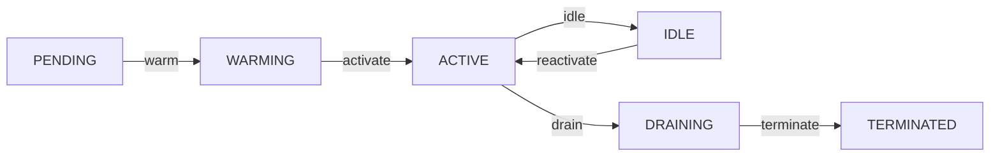
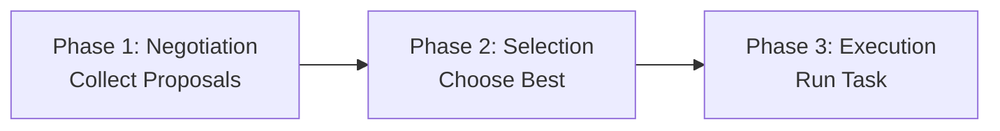
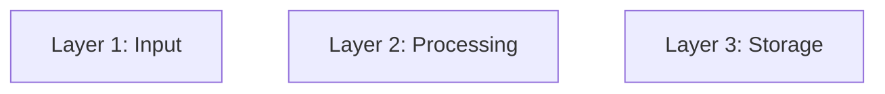

# 🧠 Mermaid Architecture Diagrams

## Overview
Architecture diagrams document system flows, component relationships, and data movement. Diagrams are stored at two levels:
1. **System-level**: `architecture_diagrams/` (overall K0/K1 architecture)
2. **Component-level**: `docs/architecture/diagrams/k0/` or `docs/architecture/diagrams/k1/` or `docs/architecture/diagrams/<service>/`

---

## 1) Diagram Locations & Scope

### System-Level Diagrams
- **Location**: `architecture_diagrams/k0/` or `architecture_diagrams/k1/`
- **Scope**: Full system architecture, high-level flows
- **Examples**:
  - `architecture_diagrams/k1/k1_complete_with_flows.mmd`
  - `architecture_diagrams/k0/project_architecture_part*.mmd`
- **Audience**: Architects, team leads, system designers

### Component-Level Diagrams
- **Location**: `docs/architecture/diagrams/`
- **Structure**:
  ```
  docs/architecture/diagrams/
  ├── k0/                    # K0 Memory subsystem components
  │   ├── storage_layer.mmd
  │   ├── event_bus.mmd
  │   └── README.md
  ├── k1/                    # K1 Agent Fabric components
  │   ├── agent_lifecycle.mmd
  │   ├── orchestrator.mmd
  │   ├── planner_agent.mmd
  │   └── README.md
  └── services/              # Service-specific diagrams
      ├── memory_service/
      ├── policy_service/
      └── README.md
  ```
- **Scope**: Single component, layer, or service
- **Examples**:
  - Agent fabric lifecycle state machine
  - Storage layer architecture
  - Event bus flow
- **Audience**: Developers working on specific components

---

## 2) Diagram Requirements

### Contracts-First Design
- Every node/edge must map to an existing contract or tracked TODO
- Reference ADR numbers in diagram notes when applicable
- Keep labels specific:
  - Include port numbers (e.g., `port:9090`)
  - Include topic names (e.g., `topic:agent.created`)
  - Include pipeline stage IDs (e.g., `P03:Contextualization`)
  - Include accelerator types (e.g., `NPU`, `GPU`, `CPU`)

### Naming Conventions
- **System diagrams**: `k1_<component>_<type>.mmd`
  - Example: `k1_agent_fabric_lifecycle.mmd`
- **Component diagrams**: `<layer>_<component>_<aspect>.mmd`
  - Example: `agent_lifecycle_fsm.mmd`
  - Example: `orchestrator_3phase_flow.mmd`

### Research & Citations
- Include research foundation comments at top:
  ```
  %% Research Foundation:
  %% - Actor Model (Hewitt 1973)
  %% - MPST (Honda 2008)
  %% - Capabilities (Dennis 1966)
  %% Related ADRs: ADR-0005, ADR-0086
  ```

---

## 3) Editing & Ingestion Workflow

### Step 1: Update Diagram Source
```
1. Edit .mmd file alongside related contract or code change
2. Update diagram labels with specific ports, topics, pipeline IDs
3. Add/update research citations and ADR references
4. Verify node/edge alignment with code modules
```

### Step 2: Validate Syntax
```bash
# Validate diagram
mmd_validate("<diagram_id>")

# Get summary
mmd_summary("<diagram_id>")

# Check for issues
mmd_validate("<diagram_id>")  # Run twice to ensure no errors
```

### Step 3: Ingest into MCP
```python
# For system-level diagrams
mmd_ingest("d:/familyos/architecture_diagrams/k1/k1_complete_with_flows.mmd")

# For component-level diagrams
mmd_ingest("d:/familyos/docs/architecture/diagrams/k1/agent_lifecycle.mmd")
```

### Step 4: Record in Usage Documentation
```
Location: docs/development/mmd-diagram-usage.md

Add entry:
- **Diagram**: k1_agent_lifecycle
- **Path**: docs/architecture/diagrams/k1/agent_lifecycle.mmd
- **Diagram ID**: <returned_from_mcp>
- **Node Count**: <count>
- **Edge Count**: <count>
- **Purpose**: Documents agent lifecycle FSM
- **Related ADRs**: ADR-0005, ADR-0086
```

### Step 5: Regenerate Rendered Assets (if applicable)
```bash
# If diagram is used in documentation
# Regenerate PNG/SVG in architecture_diagrams/renders/
# (Tool/process may vary - check docs/development/)
```

---

## 4) Validation & Review Checklist

### Pre-Commit Validation
- [ ] `mmd_validate()` passes (no dangling edges, duplicate links)
- [ ] `mmd_summary()` shows expected node/edge counts
- [ ] All node labels are specific (ports, topics, pipeline IDs included)
- [ ] Research citations added for new patterns
- [ ] ADR references included

### Content Review
- [ ] Node/edge names align with code modules/contracts
- [ ] Component relationships match actual code dependencies
- [ ] Pipeline stage references (P01-P20 if K0, GATE 1-5 if K1) are accurate
- [ ] Security gates, safety checks, policy points are represented
- [ ] Data flow includes `cognitive_trace_id` propagation (if applicable)
- [ ] Performance targets documented (latency, throughput, etc.)

### Architecture Review
- [ ] Diagram integrates with system-level architecture
- [ ] No orphaned components (all connected to system)
- [ ] Boundaries clearly marked (device, cloud, etc.)
- [ ] Data ownership preserved (no unauthorized access shown)
- [ ] All external integrations documented

### Documentation
- [ ] Diagram documented in component README
- [ ] Entry added to `docs/development/mmd-diagram-usage.md`
- [ ] Related ADRs linked in diagram
- [ ] Component-level diagrams referenced from `docs/architecture/diagrams/<scope>/README.md`

---

## 5) Integration with 5-Step Workflow

### GATE 1: ADR Creation
- [ ] ADR created/referenced for architectural change
- [ ] ADR number included in diagram research citations

### GATE 3: Implementation
- [ ] Component-level diagram created if new component
- [ ] Diagram labels updated to match actual implementation
- [ ] Contract references verified against code

### GATE 5: Memory Documentation
- [ ] Diagram ID recorded in memory entry
- [ ] Entry added to `docs/development/mmd-diagram-usage.md`
- [ ] Diagram validated and ingested via MCP

---

## 6) Common Diagram Types

### Lifecycle State Machine

- **File**: `<component>_lifecycle_fsm.mmd`
- **Use**: Document state transitions with guards/conditions

### Multi-Phase Flow

- **File**: `<component>_<stages>_flow.mmd`
- **Use**: Document sequential phases with decision points

### Hierarchical Component Structure

- **File**: `<layer>_structure.mmd`
- **Use**: Show component hierarchy and relationships

---

## 7) Quick Reference

### Validation Commands
```bash
mmd_validate("<diagram_id>")      # Check syntax
mmd_summary("<diagram_id>")       # Show stats
mmd_graph("<diagram_id>")         # Full structure
mmd_neighbors("<diagram_id>", "<node>")  # Adjacency
mmd_paths("<diagram_id>", "<src>", "<dst>")  # Paths
```

### Ingestion Commands
```bash
mmd_ingest("<absolute_path>")     # Ingest diagram
mmd_ingest("<path>", alias="my_diagram")  # With alias
```

### Best Practices
- ✅ Keep diagrams close to code (component-level in docs/)
- ✅ Reference ADRs in research citations
- ✅ Use specific labels (ports, topics, IDs)
- ✅ Validate before committing
- ✅ Update usage documentation
- ❌ Don't use generic node names
- ❌ Don't skip validation
- ❌ Don't forget to record diagram IDs
- ❌ Don't mix system and component concerns in one diagram

---

## 8) Troubleshooting

| Problem | Solution |
|---------|----------|
| `mmd_validate` fails | Check for special characters, duplicate node IDs, unclosed quotes |
| Dangling edges | Verify all target nodes exist; check spelling |
| Diagram too complex | Split into component-level diagrams; reference from system diagram |
| Can't find diagram | Use absolute path: `d:/familyos/path/to/diagram.mmd` |
| Stale MCP data | Re-ingest: `mmd_ingest("<absolute_path>")` |
