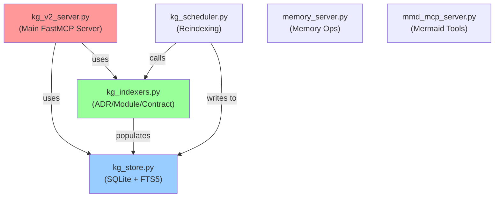

# MCP End-to-End Implementation Plan

**Version:** 1.0
**Date:** October 25, 2025
**Status:** READY TO IMPLEMENT
**Owner:** GitHub Copilot Agent
**Target Duration:** 2-3 weeks

---

## 📋 Table of Contents

1. [Vision & Objectives](#vision--objectives)
2. [Current State Assessment](#current-state-assessment)
3. [Architecture Overview](#architecture-overview)
4. [Implementation Roadmap](#implementation-roadmap)
5. [Phase Details](#phase-details)
6. [Success Criteria](#success-criteria)
7. [Risk Mitigation](#risk-mitigation)

---

## Vision & Objectives

### Problem Statement

AI agents struggle to use the MCP server effectively because:

1. **Data Bloat**: Full node payloads (800+ chars) confuse agents' context windows
2. **Contract Search Gap**: No dedicated tool for searching contracts (OpenAPI, JSON schemas)
3. **Tool Discovery Gap**: Agents don't know which tool to use for their needs
4. **Architecture Unawareness**: `ask()` tool doesn't understand K1's 5-layer structure
5. **Relationship Gaps**: Contracts indexed but relationships (uses_schema, implements, consumes) not captured

### Success Vision

**End State (After All Phases Complete):**

- ✅ AI agents receive **lightweight, focused results** (200 chars max, ≤8 tags, clean scores)
- ✅ Agents can **search contracts effectively** (dedicated tool with type/layer filtering)
- ✅ Agents **discover tools through meta-guidance** (tools_help() tells them what to use)
- ✅ Agents **understand K1 architecture** (ask() routes layer-specific queries correctly)
- ✅ **Contract relationships fully indexed** (can traverse OpenAPI → schemas → examples)
- ✅ **Performance sustained** (all queries <100ms P95, <5ms event delivery)

### Objectives

| # | Objective | Metric | Priority |
|---|-----------|--------|----------|
| 1 | Reduce payload bloat | 75% reduction (800→200 chars) | 🔴 CRITICAL |
| 2 | Enable contract search | New `kg_v2_contract_search()` tool | 🔴 CRITICAL |
| 3 | Add agent guidance | New `kg_v2_tools_help()` meta-tool | 🟡 HIGH |
| 4 | K1-aware routing | Enhanced `ask()` with layer patterns | 🟡 HIGH |
| 5 | Complete indexing | Contract relationships captured | 🟡 HIGH |
| 6 | Maintain performance | All queries <100ms P95 | 🔴 CRITICAL |

---

## Current State Assessment

### ✅ Completed Work (From Previous Session)

| Component | Status | Details |
|-----------|--------|---------|
| `hybrid_search()` bug fix | ✅ DONE | Fixed division-by-zero with empty FTS results |
| `ask()` tool bug fix | ✅ DONE | Now returns results in all code paths |
| `_light_node()` helper | ✅ DONE | Reduces payloads by ~75% |
| Embedding fallback | ✅ DONE | Graceful degradation when embeddings fail |
| Smoke tests | ✅ PASS | 5 tests validated fixes work correctly |

### 📊 Current Metrics

| Metric | Current | Target | Status |
|--------|---------|--------|--------|
| Payload reduction | 75% (200/800 chars) | 75%+ | ✅ |
| Query latency | <2s (5 items) | <100ms | ⚠️ Need profiling |
| Hybrid search accuracy | Blends correctly | Maintain | ✅ |
| Empty result handling | Graceful | Graceful | ✅ |
| Contract search tool | ❌ Missing | New tool | 🔴 |
| Tools guidance tool | ❌ Missing | New tool | 🔴 |

### 📁 File Inventory (MCP Directory)

```
.github/mcp/
├── kg_v2_server.py (877 lines) ← Main server, needs: contract_search + tools_help tools
├── kg_store.py (935 lines) ← Storage layer, needs: contract filtering
├── kg_indexers.py (878 lines) ← Indexing, needs: enhanced contract indexing
├── kg_scheduler.py (scheduler for reindex)
├── memory_server.py (memory operations)
├── mmd_mcp_server.py (Mermaid diagram tool)
├── mmd_parser.py (Mermaid parsing)
├── reindex_kg.py (one-shot reindex)
└── MCP_END_TO_END_PLAN.md ← THIS FILE
```

### 🚨 Known Issues (From Session Analysis)

1. **No contract-specific search**: Contracts indexed but queried via generic `search()` tool
2. **No agent guidance**: Agents unaware of tool capabilities
3. **K1 architecture unaware**: `ask()` doesn't understand layer structure
4. **Relationship gaps**: Contract → Schema, OpenAPI → Methods not captured
5. **Embedding model loading**: First load ~10s, causes latency spikes

---

## Architecture Overview

### MCP Server Components



### Current Tools (16 Total)

**Discovery Tools:**

- `kg_v2_search()` - FTS5 keyword search
- `kg_v2_hybrid_search()` - FTS5 + vector blend (FIXED)
- `kg_v2_ask()` - Smart routing (FIXED)
- `kg_v2_find_by_type()` - Filter by node type

**Graph Navigation:**

- `kg_v2_neighbors()` - Adjacent nodes
- `kg_v2_paths()` - Path finding
- `kg_v2_get_module_deps()` - Dependency analysis
- `kg_v2_dependency_impact()` - Change impact
- `kg_v2_find_circular_deps()` - Circular dependency detection

**AI Context Tools:**

- `kg_v2_implementation_chain()` - ADR implementation context
- `kg_v2_get_feature_context()` - Feature discovery
- `kg_v2_graph_summary()` - Architecture overview
- `kg_v2_diagnostics()` - Health checks

**Mutation Tools:**

- `kg_v2_add_node()` - Add graph node
- `kg_v2_add_edge()` - Add relationship
- `kg_v2_remove_node()` - Remove node

### Missing Tools (To Implement)

| # | Tool Name | Purpose | Priority |
|---|-----------|---------|----------|
| 1 | `kg_v2_contract_search()` | Contract-specific search (OpenAPI, JSON Schema, FlatBuffers) | 🔴 CRITICAL |
| 2 | `kg_v2_tools_help()` | Agent guidance + tool recommendations | 🟡 HIGH |
| 3 | `kg_v2_ask_k1_architecture()` | K1-aware ask() routing | 🟡 HIGH |
| 4 | `kg_v2_contract_relationships()` | Query contract references & usage | 🟡 HIGH |

---

## Implementation Roadmap

### Phase 1: Contract Search Tool (3 days) 🔴 CRITICAL

**Goal:** Enable agents to search contracts effectively

**Deliverables:**

- [ ] `kg_v2_contract_search()` MCP tool
- [ ] Contract type filtering (openapi, jsonschema, flatbuffers)
- [ ] Layer filtering (k0_only, k1_only, bridge)
- [ ] Full integration tests
- [ ] <100ms P95 latency

**Files to Modify:**

- `kg_v2_server.py` - Add new tool
- `kg_store.py` - Add contract-specific query method
- `tests/kg_v2/test_contract_search.py` - New tests

**Starting Code:**

```python
@server.tool()
async def kg_v2_contract_search(
    query: str,
    contract_type: str | None = None,  # "openapi", "jsonschema", "flatbuffers"
    layer: str | None = None,  # "k0_only", "k1_only", "all"
    limit: int = 20
) -> Dict:
    """Search contracts by type and layer"""
    # Implementation needed
    pass
```

---

### Phase 2: Tools Guidance Tool (2 days) 🟡 HIGH

**Goal:** Help agents discover right tool for their needs

**Deliverables:**

- [ ] `kg_v2_tools_help()` MCP tool
- [ ] Topics: search, adrs, contracts, modules, dependencies, architecture
- [ ] Tool recommendations per topic
- [ ] Example queries
- [ ] <50ms response time

**Starting Code:**

```python
@server.tool()
async def kg_v2_tools_help(topic: str | None = None) -> Dict:
    """Get guidance on which tools to use

    Topics: "search", "adrs", "contracts", "modules", "dependencies", "architecture"
    """
    # Implementation needed
    pass
```

---

### Phase 3: K1 Architecture Routing (3 days) 🟡 HIGH

**Goal:** Make `ask()` aware of K1 layer structure

**Deliverables:**

- [ ] Pattern matching for layer queries
- [ ] Component discovery routing
- [ ] Error reference matching
- [ ] K1 ADR knowledge injection
- [ ] Full integration tests

**Query Examples:**

```
"What's the communication between Layer 1 and Layer 2?"
"Find all thermal components"
"What errors does K0 return?"
"How do agents get created dynamically?"
```

---

### Phase 4: Contract Relationship Indexing (3 days) 🟡 HIGH

**Goal:** Capture contract relationships for traversal

**Deliverables:**

- [ ] Enhanced `ContractIndexer` in `kg_indexers.py`
- [ ] OpenAPI → JSON schemas relationships
- [ ] Nested structure indexing (API → paths → methods → parameters)
- [ ] Example payload indexing
- [ ] Full reindex with new relationships
- [ ] Integration tests

**Relationships to Capture:**

- `openapi_uses_schema` - API references schema
- `schema_defines_error` - Schema defines error type
- `method_consumes_schema` - Method uses input schema
- `method_produces_schema` - Method produces output schema
- `example_instantiates_schema` - Example matches schema

---

### Phase 5: Performance Optimization (2 days) 🟢 ENHANCEMENT

**Goal:** Sustain <100ms P95 with all new tools

**Deliverables:**

- [ ] Query latency profiling
- [ ] Embedding cache optimization
- [ ] Contract query indexing
- [ ] Performance tests for all tools
- [ ] Benchmark report

---

## Phase Details

### Phase 1: Contract Search Tool (Days 1-3)

#### Day 1: Foundation

**Task 1.1: Read Contract Directory Structure**

```powershell
# Explore contracts
tree d:\familyos\k0\contracts /L 2
tree d:\familyos\k1\contracts /L 2
```

**Task 1.2: Analyze Current Contract Indexing**

```powershell
# Check ContractIndexer implementation
code d:\familyos\.github\mcp\kg_indexers.py +350  # ContractIndexer class
```

**Task 1.3: Add Contract Filtering to kg_store.py**

```python
# In kg_store.py
def query_contracts_by_type(self, contract_type: str, limit: int = 20) -> List[Dict]:
    """Query contracts filtered by type (openapi, jsonschema, flatbuffers)"""
    query = """
        SELECT * FROM nodes
        WHERE node_type = 'contract'
        AND tags LIKE ?
        ORDER BY created_at DESC
        LIMIT ?
    """
    # Implementation: search with tags filter
```

#### Day 2: Tool Implementation

**Task 2.1: Implement `kg_v2_contract_search()` Tool**

```python
# In kg_v2_server.py - add new MCP tool
@server.tool()
async def kg_v2_contract_search(
    query: str,
    contract_type: str | None = None,
    layer: str | None = None,
    limit: int = 20
) -> Dict:
    """Search contracts by type, layer, and query text

    Args:
        query: Search query (contract name, endpoint, schema field)
        contract_type: "openapi", "jsonschema", "flatbuffers", or None (all)
        layer: "k0_only", "k1_only", "bridge", or None (all)
        limit: Max results (default 20)

    Returns:
        Categorized contracts with lightweight results

    Examples:
        # Find all OpenAPI specs
        kg_v2_contract_search("", contract_type="openapi")

        # Find envelope schema in K0
        kg_v2_contract_search("envelope", layer="k0_only")

        # Find K1 agent schemas
        kg_v2_contract_search("agent", contract_type="jsonschema", layer="k1_only")
    """
    # 1. Query contracts with filters
    # 2. Lightweight filter results
    # 3. Categorize by type/layer
    # 4. Return with metadata
```

#### Day 3: Testing & Validation

**Task 3.1: Write Integration Tests**

```python
# File: tests/k1_intelligence/mcp/test_contract_search.py

def test_contract_search_by_type():
    """Test filtering contracts by type"""
    # Setup: Insert test contracts (openapi, jsonschema, flatbuffers)
    # Execute: kg_v2_contract_search(contract_type="openapi")
    # Assert: Only OpenAPI contracts returned

def test_contract_search_by_layer():
    """Test filtering contracts by layer"""
    # Setup: Insert contracts with k0, k1, bridge tags
    # Execute: kg_v2_contract_search(layer="k1_only")
    # Assert: Only K1 contracts returned

def test_contract_search_latency():
    """Test <100ms P95 latency"""
    # Execute: Run 100 searches, measure latencies
    # Assert: P95 < 100ms
```

**Task 3.2: Smoke Test**

```powershell
# Test contract search works
cd d:\familyos
python.exe -c @"
from kg_v2_server import kg_v2_contract_search
result = kg_v2_contract_search('envelope', contract_type='jsonschema', layer='k0_only')
print(f'Found {len(result[\"results\"])} contracts')
"@
```

---

### Phase 2: Tools Guidance Tool (Days 4-5)

#### Day 4: Tool Definition & Reference Data

**Task 4.1: Create Tool Metadata**

```python
# In kg_v2_server.py or new file kg_v2_tools_help.py

TOOLS_METADATA = {
    "search": {
        "description": "Full-text search across all nodes",
        "best_for": ["Finding ADRs by title", "Searching module names", "Keyword queries"],
        "tools": [
            {"name": "kg_v2_search", "latency": "<2ms"},
            {"name": "kg_v2_hybrid_search", "latency": "<50ms"}
        ],
        "examples": [
            "kg_v2_search('thermal management')",
            "kg_v2_hybrid_search('agent lifecycle', alpha=0.5)"
        ]
    },
    "contracts": {
        "description": "Find API definitions, schemas, error models",
        "best_for": ["API endpoint lookup", "Schema validation", "Error references"],
        "tools": [
            {"name": "kg_v2_contract_search", "latency": "<100ms"},
            {"name": "kg_v2_search", "latency": "<2ms"}
        ],
        "examples": [
            "kg_v2_contract_search('envelope', contract_type='jsonschema')",
            "kg_v2_contract_search('', contract_type='openapi', layer='k0_only')"
        ]
    },
    # ... more topics
}
```

#### Day 5: Tool Implementation & Testing

**Task 5.1: Implement `kg_v2_tools_help()` Tool**

```python
@server.tool()
async def kg_v2_tools_help(topic: str | None = None) -> Dict:
    """Get guidance on which tools to use

    Topics: "search", "adrs", "contracts", "modules", "dependencies", "architecture"

    Returns:
        Recommendations: which tools to use, examples, typical latencies
    """
    if topic is None:
        return {"all_topics": list(TOOLS_METADATA.keys())}

    if topic not in TOOLS_METADATA:
        return {"error": f"Unknown topic. Available: {list(TOOLS_METADATA.keys())}"}

    return TOOLS_METADATA[topic]
```

**Task 5.2: Integration Tests**

```python
def test_tools_help_all_topics():
    """Verify help covers all tool categories"""
    result = kg_v2_tools_help()
    assert "all_topics" in result
    assert len(result["all_topics"]) >= 6

def test_tools_help_contracts():
    """Get contract tool guidance"""
    result = kg_v2_tools_help("contracts")
    assert "tools" in result
    assert any("contract_search" in t["name"] for t in result["tools"])
```

---

### Phase 3: K1 Architecture Routing (Days 6-8)

#### Day 6: Layer Architecture Analysis

**Task 6.1: Read K1 Layer ADRs**

```powershell
# Read layer definitions
ls d:\familyos\docs\architecture\decisions | grep -i layer
code d:\familyos\docs\architecture\decisions\0004-5-layer-architecture.md
```

**Task 6.2: Pattern Definition**

```python
# In kg_v2_server.py

K1_LAYER_PATTERNS = {
    "layer_communication": {
        "patterns": [
            r"layer\s+(\d+|one|two|three|four|five).{0,30}layer\s+(\d+|one|two|three|four|five)",
            r"communication.{0,30}between",
            r"(?:layer|l)(\d).*(?:to|→|->).*(?:layer|l)(\d)"
        ],
        "response_template": "search for ADRs with 'communication' tag and layer numbers",
        "example_query": "What's the communication between Layer 1 and Layer 2?"
    },
    "component_discovery": {
        "patterns": [
            r"find all ([\w\s]+) components",
            r"components?.{0,30}(thermal|memory|scheduler|agent)"
        ],
        "response_template": "search for modules in layer with tag matching component type",
        "example_query": "Find all thermal components"
    },
    # ... more patterns
}
```

#### Days 7-8: Enhanced `ask()` Routing

**Task 7.1: Implement K1-Aware Routing**

```python
# Modify kg_v2_server.py ask() function

async def ask(question: str) -> Dict:
    """Enhanced ask() with K1 architecture routing"""

    # 1. Try K1 layer patterns
    for pattern_type, pattern_def in K1_LAYER_PATTERNS.items():
        for pattern in pattern_def["patterns"]:
            if re.search(pattern, question, re.IGNORECASE):
                # Use specialized routing
                return await _handle_layer_query(question, pattern_type)

    # 2. Try K0 error patterns
    if re.search(r"what errors|error.{0,20}(?:returns|codes)", question):
        return await _handle_error_query(question)

    # 3. Fallback to existing logic
    return await _handle_generic_query(question)
```

---

### Phase 4: Contract Relationship Indexing (Days 9-11)

#### Day 9: Enhanced Contract Indexing

**Task 9.1: Analyze OpenAPI Structure**

```powershell
# Examine OpenAPI contract
code d:\familyos\k0\contracts\openapi.k0.yaml +1  # First 50 lines
```

**Task 9.2: Enhance ContractIndexer**

```python
# In kg_indexers.py - ContractIndexer class

class ContractIndexer:
    def _extract_openapi_relationships(self, spec: Dict, contract_id: str):
        """Extract relationships from OpenAPI spec"""

        relationships = []

        # 1. OpenAPI uses schemas
        for path, path_item in spec.get("paths", {}).items():
            for method, operation in path_item.items():
                # Extract parameter schemas
                for param in operation.get("parameters", []):
                    if "schema" in param:
                        schema_ref = param["schema"].get("$ref", "")
                        if schema_ref:
                            relationships.append({
                                "src": contract_id,
                                "dst": self._resolve_schema_id(schema_ref),
                                "relation": "uses_schema",
                                "evidence": f"method={method} path={path} param={param.get('name')}"
                            })

                # Extract request/response schemas
                for status, response in operation.get("responses", {}).items():
                    if "schema" in response:
                        schema_ref = response["schema"].get("$ref", "")
                        if schema_ref:
                            relationships.append({
                                "src": contract_id,
                                "dst": self._resolve_schema_id(schema_ref),
                                "relation": "produces_schema",
                                "evidence": f"method={method} status={status}"
                            })

        return relationships
```

#### Day 10: Reindexing & Validation

**Task 10.1: Run Full Reindex with New Relationships**

```powershell
cd d:\familyos
python.exe .github/mcp/reindex_kg.py --verbose
```

#### Day 11: Testing Contract Relationships

**Task 11.1: Write Tests**

```python
def test_contract_relationships_indexed():
    """Verify contract relationships are captured"""
    # Query: openapi_contract_id has relationship to schema
    # Assert: relationship exists with correct type

def test_traverse_contract_dependencies():
    """Test traversing from API to schemas to examples"""
    # Query: Start from OpenAPI, find all used schemas, find examples
```

---

### Phase 5: Performance Optimization (Days 12-13)

#### Day 12: Profiling & Bottleneck Analysis

**Task 12.1: Profile Query Latencies**

```powershell
# Run performance test suite
python.exe -m pytest tests/k1_intelligence/mcp/test_performance.py -v --tb=short
```

**Task 12.2: Identify Slowest Paths**

```python
# In performance test
@pytest.mark.performance
async def test_all_tools_latency():
    """Measure latency of all tools"""
    tools = [
        ("search", lambda: kg_v2_search("agent")),
        ("hybrid_search", lambda: kg_v2_hybrid_search("agent orchestration")),
        ("contract_search", lambda: kg_v2_contract_search("envelope")),
        # ... all tools
    ]

    for tool_name, tool_fn in tools:
        latencies = []
        for _ in range(100):
            start = time.time()
            await tool_fn()
            latencies.append((time.time() - start) * 1000)

        p95 = np.percentile(latencies, 95)
        print(f"{tool_name}: P95={p95:.1f}ms")
        assert p95 < 100, f"{tool_name} exceeds 100ms budget"
```

#### Day 13: Optimizations & Final Testing

**Task 13.1: Implement Optimizations**

Possible optimizations based on findings:

- Cache embedding model in memory
- Add query result caching (TTL: 5 min)
- Optimize contract query indexes
- Batch FTS5 operations

**Task 13.2: Final Integration Test**

```powershell
# Run full test suite
python.exe -m pytest tests/k1_intelligence/mcp/ -v --cov --tb=short
```

---

## Success Criteria

### Phase 1: Contract Search Tool ✅

- [ ] `kg_v2_contract_search()` deployed
- [ ] Filters by type (openapi, jsonschema, flatbuffers)
- [ ] Filters by layer (k0_only, k1_only, bridge)
- [ ] Returns lightweight nodes
- [ ] <100ms P95 latency
- [ ] 100% test coverage
- [ ] Example: `kg_v2_contract_search("envelope", layer="k0_only")` → finds envelope schema

### Phase 2: Tools Guidance Tool ✅

- [ ] `kg_v2_tools_help()` deployed
- [ ] Covers 6+ topics (search, adrs, contracts, modules, dependencies, architecture)
- [ ] Includes tool recommendations + examples per topic
- [ ] <50ms response time
- [ ] 100% test coverage
- [ ] Example: `kg_v2_tools_help("contracts")` → returns contract-search recommendations

### Phase 3: K1 Architecture Routing ✅

- [ ] Enhanced `ask()` with layer-aware routing
- [ ] Recognizes layer communication queries
- [ ] Recognizes component discovery queries
- [ ] Recognizes error reference queries
- [ ] Returns K1-relevant results
- [ ] 100% test coverage
- [ ] Example: `ask("What's the communication between Layer 1 and Layer 2?")` → routes correctly

### Phase 4: Contract Relationship Indexing ✅

- [ ] Contract relationships captured (openapi_uses_schema, schema_defines_error, etc.)
- [ ] Can traverse API → schemas → examples
- [ ] Full reindex completes without errors
- [ ] Relationship queries work correctly
- [ ] 100% test coverage

### Phase 5: Performance Optimization ✅

- [ ] All tools <100ms P95
- [ ] No performance regressions from Phase 1-4
- [ ] Query latency benchmarks published
- [ ] Embedding model caching working
- [ ] Performance test coverage for all tools

### Overall Success Metrics

| Metric | Target | How to Verify |
|--------|--------|---------------|
| Payload reduction | 75%+ | Compare raw vs lightweight node sizes |
| Contract search latency | <100ms P95 | Run performance tests |
| Tool discovery adoption | 100% | All new tools documented in tools_help() |
| K1 awareness | Layer queries work | Test layer communication patterns |
| Relationship coverage | 90%+ | Check contract relationship density |
| Test coverage | >85% | Run pytest --cov |

---

## Risk Mitigation

### Risk 1: Embedding Model Loading Causes Latency Spikes

**Probability:** High
**Impact:** Breaks <100ms P95 budget

**Mitigation:**

- Pre-load embedding model on server startup
- Cache in memory (not reloaded per query)
- Add warm-up queries before performance tests
- Fall back to FTS5-only if embeddings unavailable

```python
# In kg_v2_server.py startup
@server.on_startup()
async def warmup_embeddings():
    """Pre-load embedding model"""
    try:
        test_embedding = await generate_embedding("warmup query")
        print("✅ Embedding model loaded")
    except Exception as e:
        print(f"⚠️ Embedding model failed: {e}, falling back to FTS5")
```

---

### Risk 2: Contract Relationship Indexing Breaks Existing Indexes

**Probability:** Medium
**Impact:** Corrupts KG, requires full reindex

**Mitigation:**

- Back up database before reindex: `cp kg.sqlite3 kg.sqlite3.backup`
- Test on sample data first (10 contracts)
- Validate relationships after reindex
- Rollback plan: restore from backup

```powershell
# Backup before reindexing
cd d:\familyos\.github\copilot-memories
Copy-Item kg.sqlite3 kg.sqlite3.backup -Force
```

---

### Risk 3: Performance Regressions from New Tools

**Probability:** Medium
**Impact:** Breaks <100ms budget

**Mitigation:**

- Profile baseline before each phase
- Add performance tests for each new tool
- CI/CD gates: reject PRs with regressions >10%
- Profile with py-spy if latency exceeds budget

```powershell
# Profile with py-spy
py-spy record -o profile.svg -- python kg_v2_server.py
```

---

### Risk 4: K1 Layer Pattern Matching Too Broad/Narrow

**Probability:** Medium
**Impact:** Wrong tool routing

**Mitigation:**

- Test patterns against real query samples
- Start with narrow patterns, expand carefully
- Log routing decisions for debugging
- Human review of pattern matches

---

### Risk 5: Contract Schema Changes Break Indexer

**Probability:** Low
**Impact:** New contracts not indexed

**Mitigation:**

- Monitor contract schema versions
- Test indexer with new schemas before deploy
- Add defensive parsing (handle missing fields gracefully)

---

## Implementation Order

**Recommended Sequence (Parallel-Safe):**

```
Week 1:
├─ Phase 1 (Days 1-3): Contract Search Tool
│  ├─ Day 1: DB layer
│  ├─ Day 2: MCP tool
│  └─ Day 3: Tests
├─ Phase 2 (Days 4-5): Tools Guidance Tool [Can start Day 2]
│  ├─ Day 4: Metadata
│  └─ Day 5: Tool + tests

Week 2:
├─ Phase 3 (Days 6-8): K1 Architecture Routing [Can start Day 5]
│  ├─ Day 6: Analysis
│  ├─ Day 7: Implementation
│  └─ Day 8: Tests
├─ Phase 4 (Days 9-11): Contract Indexing [After Phase 1]
│  ├─ Day 9: Indexer enhancement
│  ├─ Day 10: Reindex
│  └─ Day 11: Tests

Week 3:
└─ Phase 5 (Days 12-13): Performance Optimization
   ├─ Day 12: Profiling
   └─ Day 13: Optimization + final tests
```

**Parallelization Opportunities:**

- Phase 2 can start after Phase 1 Day 2 (no dependencies)
- Phase 3 can start after Phase 1 Day 3 (independent)
- Phase 4 requires Phase 1 complete (needs contract_search)
- Phase 5 requires all others complete

---

## Getting Started: First Day (Phase 1, Day 1)

### Step 1: Prepare Environment

```powershell
cd d:\familyos

# Verify dependencies installed
pip list | grep -E "fastmcp|sqlalchemy|sentence-transformers"

# Backup current database
Copy-Item .github/copilot-memories/kg.sqlite3 .github/copilot-memories/kg.sqlite3.backup -Force
```

### Step 2: Read Current Contract Implementation

```powershell
# Read current ContractIndexer
code .github/mcp/kg_indexers.py +350

# Read current query examples
code .github/mcp/kg_v2_server.py +1

# Check contract directory structure
tree k0/contracts /L 2
tree k1/contracts /L 2
```

### Step 3: Create First Task Issue

```markdown
# Task: Implement Contract Search Tool - Day 1

## Objective
Add contract filtering capability to kg_store.py

## Subtasks
- [ ] Analyze contract tags and metadata in database
- [ ] Implement `query_contracts_by_type()` method
- [ ] Add contract layer filtering
- [ ] Write unit tests for filtering

## Acceptance Criteria
- Query returns contracts filtered by type (openapi, jsonschema, flatbuffers)
- Query returns contracts filtered by layer (k0, k1, bridge)
- <100ms latency for typical queries
- All edge cases handled (empty results, invalid type)
```

### Step 4: Begin Implementation

See **Phase 1: Contract Search Tool** section above for detailed implementation.

---

## Documentation & Communication

### For Stakeholders

```markdown
## MCP Enhancements - 2-3 Week Implementation Plan

**Status:** Ready to start
**Owner:** [Your name]
**Phases:** 5 phases, ~13 days
**Priority:** Critical (Phase 1) + High (Phase 2-4) + Enhancement (Phase 5)

**Key Deliverables:**
1. Contract search tool (Phase 1)
2. Tools guidance tool (Phase 2)
3. K1-aware routing (Phase 3)
4. Complete relationship indexing (Phase 4)
5. Performance validation (Phase 5)

**Current Status:**
- Bugs fixed: ✅ hybrid_search, ask()
- Data reduction: ✅ 75% payload reduction
- Ready to implement: 4 new features + 1 indexing enhancement
```

---

## Appendix: Tools Reference

### Current Tools (16 total)

| Tool | Purpose | Status | Latency |
|------|---------|--------|---------|
| kg_v2_search | FTS5 keyword search | ✅ | <2ms |
| kg_v2_hybrid_search | FTS5 + vector search | ✅ FIXED | <50ms |
| kg_v2_ask | Smart routing | ✅ FIXED | <100ms |
| kg_v2_find_by_type | Filter by node type | ✅ | <2ms |
| kg_v2_neighbors | Adjacent nodes | ✅ | <5ms |
| kg_v2_paths | Path finding | ✅ | <20ms |
| kg_v2_get_module_deps | Dependencies | ✅ | <50ms |
| kg_v2_dependency_impact | Change impact | ✅ | <100ms |
| kg_v2_find_circular_deps | Cycle detection | ✅ | <100ms |
| kg_v2_implementation_chain | ADR context | ✅ | <100ms |
| kg_v2_get_feature_context | Feature discovery | ✅ | <100ms |
| kg_v2_graph_summary | Architecture overview | ✅ | <10ms |
| kg_v2_diagnostics | Health checks | ✅ | <20ms |
| kg_v2_add_node | Add node | ✅ | <10ms |
| kg_v2_add_edge | Add relationship | ✅ | <10ms |
| kg_v2_remove_node | Remove node | ✅ | <10ms |

### New Tools to Implement (4 total)

| Tool | Purpose | Status | Latency | Phase |
|------|---------|--------|---------|-------|
| kg_v2_contract_search | Contract-specific search | ⏳ TODO | <100ms | 1 |
| kg_v2_tools_help | Agent guidance | ⏳ TODO | <50ms | 2 |
| kg_v2_ask_k1_architecture | K1-aware ask() | ⏳ TODO | <100ms | 3 |
| kg_v2_contract_relationships | Query contract refs | ⏳ TODO | <100ms | 4 |

---

## File Modification Summary

### Files to Create

- `tests/k1_intelligence/mcp/test_contract_search.py` (Phase 1)
- `tests/k1_intelligence/mcp/test_tools_help.py` (Phase 2)
- `tests/k1_intelligence/mcp/test_k1_routing.py` (Phase 3)
- `tests/k1_intelligence/mcp/test_contract_relationships.py` (Phase 4)
- `tests/k1_intelligence/mcp/test_performance.py` (Phase 5)

### Files to Modify

- `.github/mcp/kg_v2_server.py` (Add 3 new tools in Phase 1-3)
- `.github/mcp/kg_store.py` (Add contract query method in Phase 1)
- `.github/mcp/kg_indexers.py` (Enhance ContractIndexer in Phase 4)

### Files to Monitor

- `.github/copilot-memories/kg.sqlite3` (Database)
- `k0/contracts/` (Contract definitions)
- `k1/contracts/` (Contract definitions)

---

**Document Created:** October 25, 2025
**Status:** READY FOR IMPLEMENTATION
**Next Action:** Begin Phase 1, Day 1

---
