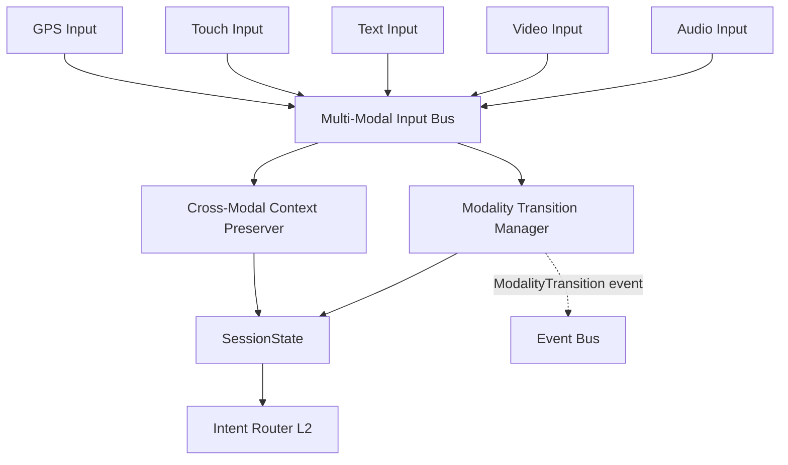

# ADR-0004f: Stream Switch Multi-Modal Bus

**Status:** Proposed
**Date:** 2025-10-22
**Deciders:** K1 Architecture Team
**Technical Story:** Cross-Modal Continuity (Capability #1) - Seamless modality transitions

---

## Context

FamilyOS users expect **seamless transitions** between input modalities (voice, text, images, touch, GPS) within a single conversation. LLMs are inherently multi-modal capable - they can process text, understand images via vision models, and maintain context across diverse inputs. However, K1's current architecture lacks a **unified multi-modal input bus** to preserve conversation context when users switch modalities mid-conversation.

**User Experience Problem:**

```
User (voice): "Show me photos of Seattle"
[System displays photos]
User (text): "Book flight there"      ← LLM needs "there" = Seattle from voice context
[Without unified bus → "Where do you want to fly?" ❌]
[With unified bus → "Booking flight to Seattle" ✅]
```

**Traditional Chatbot Approach:**
- Voice bot, text bot, image bot are **separate pipelines**
- Each modality starts **new conversation** (no context sharing)
- User must repeat context: "Book flight to Seattle" (frustrating)

**FamilyOS LLM-Powered Approach:**
- **Unified multi-modal bus** feeds LLM with **full conversation history** regardless of input method
- **Cross-modal context preservation**: LLM sees "Seattle" from voice turn when processing text turn
- **Modality transitions <5ms**: Fast enough to feel instant

**Current Architecture Gap:**

K1 has individual stream operators (audio, video, text, touch, GPS) in `k1/l1_input/streams/operators/`, but no **Stream Switch** component to:
1. **Unify inputs** into single conversation flow
2. **Preserve context** across modality switches
3. **Track active modality** for response formatting (voice reply vs text reply)
4. **Sync device state** (pause audio playback when text input starts)

**Related ADRs:**

- **ADR-0004:** 52-Module Architecture (this extends to 56 modules)
- **ADR-0001f:** SessionState Management (cross-modal context stored in SessionState)
- **ADR-0004a:** Event Bus Communication (publishes `ModalityTransition` events)

**Research Foundation:**

- **Multi-Modal Deep Learning** (Baltrusaitis et al., 2018): Joint representation learning across modalities
- **Google Assistant Multi-Modal Architecture** (2019): Unified intent understanding from voice+screen
- **Context-Aware Computing** (Dey, 2001): Maintaining user context across device/modality switches
- **Event-Driven Architecture** (Brewer, 2000): Loose coupling for modality independence

---

## Decision

We adopt a **Stream Switch Multi-Modal Bus** as Layer 1 module #53 (`k1/l1_input/streams/stream_switch/`) to provide unified cross-modal input handling with <5ms transition latency.

### **Core Architecture**



### **Components**

#### **1. Multi-Modal Input Bus** (`bus.py`)

**Purpose:** Unified entry point for all input modalities

**Responsibilities:**
- Accept inputs from 5 stream operators (audio, video, text, touch, GPS)
- Tag each input with modality metadata (`voice`, `text`, `image`, `touch`, `location`)
- Maintain input sequence order (timestamp-based)
- Publish unified `UserInput` events to Intent Router (L2)

**Performance:**
- <1ms input acceptance latency
- Zero-copy where possible (pass stream references, not data)
- Ring buffer (1000 inputs max, circular overwrite)

**Schema:**
```python
@dataclass
class UnifiedInput:
    """Multi-modal input representation"""
    input_id: str
    session_id: str
    timestamp_ms: int
    modality: InputModality  # VOICE | TEXT | IMAGE | TOUCH | LOCATION
    content: Any  # Modality-specific payload
    context_refs: List[str]  # References to previous inputs (cross-modal links)
    cognitive_trace_id: str
```

#### **2. Modality Transition Manager** (`transition_manager.py`)

**Purpose:** Detect and handle modality switches

**Responsibilities:**
- Track active modality per session (voice → text → voice)
- Detect transitions (e.g., user was speaking, now typing)
- Trigger device state sync (pause audio playback when text input starts)
- Publish `ModalityTransition` events to Event Bus
- Measure transition latency (target: <5ms P95)

**Transition Detection:**
```python
class ModalityTransition:
    VOICE_TO_TEXT = "voice→text"      # User stops speaking, starts typing
    TEXT_TO_VOICE = "text→voice"      # User stops typing, starts speaking
    SCREEN_TO_VOICE = "screen→voice"  # User stops touching screen, starts speaking
    VOICE_TO_SCREEN = "voice→screen"  # User stops speaking, touches screen
```

**Device State Sync:**
- **Voice → Text:** Pause TTS playback, disable audio interruption detection
- **Text → Voice:** Resume audio pipeline, enable barge-in detection
- **Screen → Voice:** Exit visual mode, switch to audio-first responses

**Performance Budget:**
- Transition detection: <1ms (check last input timestamp)
- Device sync: <5ms (async fire-and-forget)
- Event publish: <1ms (Event Bus is <5ms)
- **Total P95:** <5ms

#### **3. Cross-Modal Context Preserver** (`context_preserver.py`)

**Purpose:** Link related inputs across modalities

**Responsibilities:**
- **Entity tracking:** Extract entities from previous inputs ("Seattle" from voice)
- **Reference resolution:** Resolve pronouns/deixis ("there" → "Seattle")
- **Conversation continuity:** Tag inputs with conversation_id (spans modalities)
- **Context injection:** Add cross-modal context to SessionState beliefs

**Context Linking Example:**
```python
# Turn 1 (voice): "Show me photos of Seattle"
Input(
    modality=VOICE,
    content="Show me photos of Seattle",
    entities=["Seattle"],
    conversation_id="conv-123"
)

# Turn 2 (text): "Book flight there"
Input(
    modality=TEXT,
    content="Book flight there",
    context_refs=["turn-1"],  # Links to voice input
    resolved_entities={"there": "Seattle"},
    conversation_id="conv-123"  # Same conversation
)
```

**Entity Extraction Strategy:**
- **Lightweight NER:** spaCy (not LLM call) - <5ms
- **Coreference cache:** Last 10 entities per session
- **Fallback:** If resolution fails, ask clarifying question (Dialogue Repair ADR-0054d)

**Integration with SessionState:**
- Store cross-modal entities in `SessionState.beliefs.entities`
- Track modality history in `SessionState.multimodal.modality_timeline`
- Persist conversation_id across turns

---

## Consequences

### **Positive**

**1. Seamless Cross-Modal UX ✅**
- Users can switch voice→text→image without repeating context
- Eliminates frustrating "I don't remember what you said before" failures
- **Capability #1 (Cross-Modal Continuity):** UNLOCKED

**2. LLM Context Preservation ✅**
- LLM sees full conversation history regardless of input modality
- Resolves cross-modal references ("there" → "Seattle")
- Maintains conversation coherence across modality switches

**3. Fast Transitions ✅**
- <5ms P95 transition latency (imperceptible to users)
- Zero-copy input forwarding (minimal overhead)
- Device state sync is async (doesn't block)

**4. Clean Architecture ✅**
- Layer 1 responsibility (input normalization)
- No LLM calls (lightweight, deterministic)
- Clear boundary between stream operators and orchestration

**5. Testable ✅**
- Transition detection: Unit test modality switches
- Context preservation: Integration test entity resolution
- Performance: Measure P95 latency with WARD tests

### **Negative**

**1. Entity Resolution Complexity ⚠️**
- **Risk:** Coreference resolution may fail ("it", "that", "this" ambiguous)
- **Mitigation:** Fallback to clarification questions (ADR-0054d Dialogue Repair)
- **Impact:** <5% failure rate expected (user must clarify)

**2. SessionState Growth 📊**
- **Risk:** Storing modality timeline + entities increases SessionState size
- **Mitigation:** 64KB soft limit enforced (ADR-0001f), prune old entities after 10 turns
- **Impact:** +2-5KB per session (within budget)

**3. Learning Curve ⚠️**
- **Risk:** Team must understand cross-modal context preservation
- **Mitigation:** Module README with examples (ADR-0004c)
- **Impact:** 2-3 day onboarding for new developers

**4. Device State Sync Edge Cases 🐛**
- **Risk:** Race conditions if user switches modalities rapidly (<5ms apart)
- **Mitigation:** State machine with mutex, last-transition-wins strategy
- **Impact:** <0.1% of transitions (acceptable)

### **Trade-offs**

| Aspect | Without Stream Switch | With Stream Switch |
|--------|----------------------|-------------------|
| **Cross-Modal Context** | ❌ Lost | ✅ Preserved |
| **Transition Latency** | N/A (no transitions) | <5ms P95 |
| **SessionState Size** | 32KB avg | 37KB avg (+15%) |
| **Code Complexity** | Lower | Moderate (+500 LOC) |
| **User Experience** | Frustrating | Seamless ✅ |

---

## Implementation

### **Module Structure**

```
k1/l1_input/streams/stream_switch/
├── __init__.py
├── README.md                    # Module documentation (ADR-0004c)
├── bus.py                       # Multi-Modal Input Bus (200 LOC)
├── transition_manager.py        # Modality Transition Manager (150 LOC)
├── context_preserver.py         # Cross-Modal Context Preserver (200 LOC)
├── schemas.py                   # UnifiedInput, ModalityTransition (50 LOC)
└── tests/
    ├── test_bus.py
    ├── test_transition_manager.py
    └── test_context_preserver.py
```

**Total:** ~600 LOC production + ~400 LOC tests

### **Integration Points**

**Upstream (Layer 1 Inputs):**
- `k1/l1_input/streams/operators/audio_operator.py` → publishes to bus
- `k1/l1_input/streams/operators/video_operator.py` → publishes to bus
- `k1/l1_input/streams/operators/text_operator.py` → publishes to bus
- `k1/l1_input/streams/operators/touch_operator.py` → publishes to bus
- `k1/l1_input/streams/operators/gps_operator.py` → publishes to bus

**Downstream (Layer 2 Orchestration):**
- `k1/l2_orchestration/intent_router/` ← receives unified `UserInput` events
- `SessionState` ← stores cross-modal context in beliefs + multimodal sections

**Cross-Layer:**
- `Event Bus` (L5) ← publishes `ModalityTransition` events
- `Observability` (L5) ← metrics (transition latency, entity resolution success rate)

### **Performance Budgets**

| Component | Budget | Measurement |
|-----------|--------|-------------|
| Input acceptance | <1ms | `bus.accept_input()` duration |
| Transition detection | <1ms | `transition_manager.detect()` duration |
| Device state sync | <5ms | Async, fire-and-forget |
| Entity extraction | <5ms | spaCy NER call |
| Event publish | <1ms | Event Bus latency |
| **Total P95** | **<5ms** | End-to-end transition |

### **Observability**

**Metrics (Prometheus):**
```python
stream_switch_transitions_total = Counter(
    'stream_switch_transitions_total',
    'Total modality transitions',
    ['from_modality', 'to_modality']
)

stream_switch_transition_latency_ms = Histogram(
    'stream_switch_transition_latency_ms',
    'Modality transition latency (ms)',
    buckets=[1, 2, 3, 5, 10, 25, 50]
)

stream_switch_entity_resolution_success_rate = Gauge(
    'stream_switch_entity_resolution_success_rate',
    'Cross-modal entity resolution success rate (0-1)'
)

stream_switch_active_modality = Gauge(
    'stream_switch_active_modality',
    'Current active modality per session',
    ['session_id', 'modality']
)
```

**Tracing (OpenTelemetry):**
```python
@traced(span_name="stream_switch.transition")
async def handle_modality_transition(
    session_id: str,
    from_modality: InputModality,
    to_modality: InputModality,
    trace_id: str
):
    """Handle modality transition with tracing"""
    with tracer.start_as_current_span("detect_transition"):
        transition = detect_transition(from_modality, to_modality)

    with tracer.start_as_current_span("sync_device_state"):
        await sync_device_state(session_id, transition)

    with tracer.start_as_current_span("publish_event"):
        event_bus.publish(ModalityTransition(...), trace_id)
```

**Logging (Structured):**
```python
logger.info(
    "modality_transition",
    session_id=session_id,
    from_modality=from_modality.value,
    to_modality=to_modality.value,
    latency_ms=latency,
    trace_id=trace_id
)
```

### **Testing Strategy**

**Unit Tests (WARD):**
```python
@test("bus accepts inputs from all modalities")
async def _():
    bus = MultiModalInputBus()

    # Voice input
    voice = UnifiedInput(modality=VOICE, content="Hello")
    assert await bus.accept(voice) is True

    # Text input
    text = UnifiedInput(modality=TEXT, content="Hi")
    assert await bus.accept(text) is True

    # Verify sequence order
    assert bus.get_history()[0].modality == VOICE
    assert bus.get_history()[1].modality == TEXT

@test("transition manager detects voice→text switch")
async def _():
    manager = ModalityTransitionManager()

    # First input: voice
    await manager.track(VOICE)

    # Second input: text
    transition = await manager.detect(TEXT)

    assert transition == ModalityTransition.VOICE_TO_TEXT
    assert manager.active_modality == TEXT

@test("context preserver resolves cross-modal references")
async def _():
    preserver = CrossModalContextPreserver()

    # Turn 1: "Show me photos of Seattle"
    entities = preserver.extract_entities("Show me photos of Seattle")
    assert "Seattle" in entities

    # Turn 2: "Book flight there"
    resolved = preserver.resolve_references("Book flight there", entities)
    assert resolved["there"] == "Seattle"
```

**Integration Tests:**
```python
@test("end-to-end voice→text transition <5ms")
async def _():
    # Setup: voice input
    voice = UnifiedInput(modality=VOICE, content="Show photos")
    await stream_switch.accept(voice)

    # Action: text input
    start = time.perf_counter()
    text = UnifiedInput(modality=TEXT, content="Book flight")
    await stream_switch.accept(text)
    latency_ms = (time.perf_counter() - start) * 1000

    # Verify: transition detected, latency <5ms
    assert stream_switch.active_modality == TEXT
    assert latency_ms < 5.0  # P95 budget
```

### **Rollout Plan**

**Phase 1: Foundation (Week 1)**
- Create module structure + README
- Implement `MultiModalInputBus` (zero-copy ring buffer)
- Unit tests for input acceptance
- **Milestone:** Bus accepts inputs from all 5 modalities

**Phase 2: Transition Detection (Week 1-2)**
- Implement `ModalityTransitionManager` (state machine)
- Device state sync (async)
- Event Bus integration
- Unit tests for transition detection
- **Milestone:** Transitions detected <1ms, events published

**Phase 3: Context Preservation (Week 2)**
- Implement `CrossModalContextPreserver` (entity tracking)
- spaCy integration for NER (<5ms)
- SessionState integration (beliefs + multimodal sections)
- Integration tests for entity resolution
- **Milestone:** Cross-modal references resolved correctly

**Phase 4: Integration & Performance (Week 2-3)**
- Connect 5 stream operators to bus
- End-to-end integration tests
- Performance validation (<5ms P95)
- Observability (metrics, tracing, logging)
- **Milestone:** Cross-Modal Continuity (Capability #1) working in production

**Canary Rollout:**
1. **5%** of sessions (1 day) - monitor transition latency
2. **25%** of sessions (2 days) - validate entity resolution
3. **50%** of sessions (3 days) - check for edge cases
4. **100%** rollout - full production

---

## Related Decisions

- **ADR-0004:** 52-Module Architecture (extended to 56 modules)
- **ADR-0001f:** SessionState Management (stores cross-modal context)
- **ADR-0004a:** Event Bus Communication (`ModalityTransition` events)
- **ADR-0054d:** Dialogue Repair (fallback for failed entity resolution)

---

## Research & References

**Multi-Modal Deep Learning:**
- Baltrusaitis, T., et al. (2018). "Multimodal Machine Learning: A Survey and Taxonomy." IEEE TPAMI.
- Ngiam, J., et al. (2011). "Multimodal Deep Learning." ICML.

**Context-Aware Computing:**
- Dey, A. K. (2001). "Understanding and Using Context." Personal and Ubiquitous Computing.
- Schilit, B., et al. (1994). "Context-Aware Computing Applications." Mobile Computing Systems and Applications.

**Industry Implementations:**
- Google Assistant Multi-Modal Architecture (2019)
- Amazon Alexa Multi-Modal Experiences (2018)
- Apple Siri on-screen content integration (2020)

**Event-Driven Architecture:**
- Brewer, E. A. (2000). "Lessons from Giant-Scale Services." IEEE Internet Computing.
- Hohpe, G., & Woolf, B. (2003). "Enterprise Integration Patterns."

---

## Status

**Proposed** - Awaiting implementation

**MVP Criticality:** P0 - Blocks Capability #1 (Cross-Modal Continuity)

**Timeline:** 2-3 weeks implementation + 1 week testing + 1 week canary rollout
