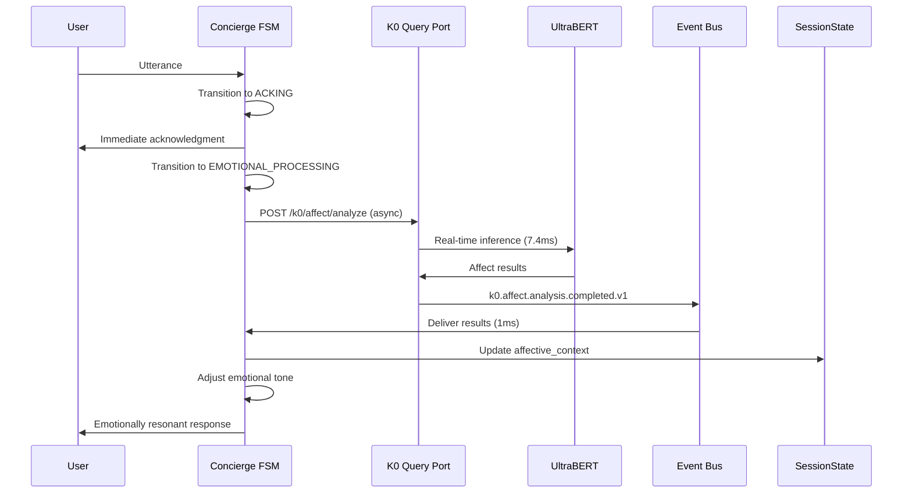

# **K1 KERNEL DEEP DIVE: USER-CENTRIC REVOLUTION**

As a world-class cognitive systems developer, I'll analyze the K1 architecture through a **user-centric lens** and propose transformative enhancements that make this kernel **truly human-like** in conversation.

## **CURRENT ARCHITECTURE STRENGTHS (User-Centric View)**

### **What Already Works Exceptionally Well:**

1. **Concierge FSM States**: Acknowledges immediately, keeps talking during processing
2. **Proactive Agents**: Can initiate conversation based on learned patterns
3. **Companioning State**: Timer-driven pings prevent "dead air"
4. **Single Writer Pattern**: Ensures conversational coherence

### **But Let's Think Deeper About "Human-Like"**

What makes human conversation feel natural?

1. **Predictive completion** (finishing each other's sentences)
2. **Emotional resonance** (matching mood and energy)
3. **Shared context activation** (recalling relevant memories)
4. **Conversational rhythm** (natural pauses, emphasis)
5. **Subtext understanding** (reading between the lines)

## **KERNEL-LEVEL ENHANCEMENTS FOR USER-CENTRIC POWER**

### **ENHANCEMENT 1: CONVERSATIONAL RHYTHM ENGINE**

**Current**: WFQ scheduler with priorities
**User-Centric Problem**: Prioritization is about system resources, not conversation flow

**Proposed Enhancement**: **Conversational Cadence Engine**

```text
LAYER 1.5: CONVERSATIONAL RHYTHM CONTROLLER
────────────────────────────────────────────
Rhythm Patterns:
  • Quick Exchange (Q&A): 200-500ms response delay
  • Thoughtful Discussion: 1-2s thoughtful pauses
  • Emotional Support: 3-5s empathetic pauses
  • Teaching Mode: Variable pacing with emphasis markers

Dynamic Adjustment:
  • User Typing Speed → Response Timing
  • User Speech Patterns → Mirroring cadence
  • Topic Complexity → Pacing adjustment
  • Emotional Tone → Response urgency

Implementation:
  • Extend CONVERSATION_SCHEDULER with rhythm algorithms
  • Add "conversation beat" to SessionState
  • Teachable: "You're responding too quickly/slowly"
```

**Kernel Impact**: This would require adding a **temporal intelligence layer** that understands conversation as a **time-based art form**, not just message exchange.

### **ENHANCEMENT 2: EMOTIONAL RESONANCE CIRCUITRY**

**Current**: CONCIERGE_PERSONA and style
**User-Centric Problem**: Static persona doesn't adapt to user's emotional state

**Proposed Enhancement**: **Affective Mirroring System**

```text
NEW SUBSYSTEM: AFFECTIVE MIRRORING ENGINE
──────────────────────────────────────────
Components:
1. Affect Detector:
   • Text sentiment analysis (valence, arousal, dominance)
   • Typing pattern analysis (speed, corrections, pauses)
   • Topic emotional loading (inferred from context)

2. Resonance Calculator:
   • Matching: 80% mirror user affect
   • Counter-balancing: 20% opposite when user distressed
   • Escalation/De-escalation: Based on conversation goals

3. Emotional Memory:
   • "User tends to get frustrated with tech explanations"
   • "User appreciates humor when stressed"
   • Cross-session emotional patterns

Implementation:
• New SessionState section: "affective_context"
• New agent type: "AffectMonitorAgent"
• Tool: adjust_emotional_tone(valence, energy, warmth)
```

**Kernel Impact**: This transforms the kernel from **information processor** to **emotional companion**. Requires real-time affect analysis and dynamic persona adjustment.

### **ENHANCEMENT 3: PREDICTIVE COMPLETION FACILITY**

**Current**: Reacts to user input
**User-Centric Problem**: Doesn't anticipate what user will say/need

**Proposed Enhancement**: **Anticipatory Response System**

```text
NEW SUBSYSTEM: CONVERSATIONAL ANTICIPATION ENGINE
─────────────────────────────────────────────────
Prediction Layers:
1. Utterance Completion:
   • As user types/speaks, predict likely completion
   • Prepare responses for top 3 likely completions
   • Pre-warm relevant agents/tools

2. Next-Topic Prediction:
   • Based on conversation trajectory
   • "If we're discussing vacation plans, they'll ask about weather next"
   • Pre-fetch relevant information

3. Need Anticipation:
   • "User mentioned headache → offer to dim lights"
   • "User discussing complex topic → offer simpler explanation"

Implementation:
• Predictive cache in SessionState
• Background "anticipation agents" running probability models
• Graceful discard when predictions wrong (no user visible errors)
```

**Kernel Impact**: This requires **speculative execution** at the kernel level - preparing multiple conversational paths in parallel, discarding unused ones. Dramatically reduces perceived latency.

### **ENHANCEMENT 4: COGNITIVE EMPATHY MODULE**

**Current**: Tool calls and agent spawning
**User-Centric Problem**: Doesn't model the user's **mental state**

**Proposed Enhancement**: **Theory of Mind Engine**

```text
NEW SUBSYSTEM: USER MENTAL MODEL
─────────────────────────────────
Model Components:
1. Knowledge Estimation:
   • "What does user know about this topic?"
   • Avoid over-explaining known concepts
   • Fill knowledge gaps proactively

2. Attention Tracking:
   • "Is user getting bored/confused?"
   • Real-time engagement metrics
   • Adjust explanation depth/complexity

3. Goal Inference:
   • "User says X but probably wants Y"
   • Read between the lines
   • Offer solutions before explicitly asked

4. Cognitive Load Management:
   • Don't overwhelm with information
   • Chunk complex ideas appropriately
   • Provide mental "breathing room"

Implementation:
• Extend SessionState with "user_mental_model"
• New agent: "MentalModelInferencerAgent"
• Integration with planning: adjust plans based on inferred user goals
```

**Kernel Impact**: This makes the kernel **truly user-aware**, not just task-aware. Requires sophisticated inference about unstated needs and capabilities.

### **ENHANCEMENT 5: CONVERSATIONAL MEMORY WEAVING**

**Current**: MemoryWriterSystem → K0 storage
**User-Centric Problem**: Memories stored but not **woven into ongoing conversation**

**Proposed Enhancement**: **Narrative Thread Management**

```text
NEW SUBSYSTEM: CONVERSATIONAL NARRATIVE ENGINE
───────────────────────────────────────────────
Components:
1. Thread Detection:
   • Identify conversation threads/topics
   • "This is still about the vacation planning"
   • "New thread: work project discussion"

2. Thread Suspension/Resumption:
   • Gracefully pause threads when interrupted
   • Seamlessly resume with context intact
   • "Getting back to your vacation plans..."

3. Cross-Session Narrative:
   • "Last week we discussed X, now continuing"
   • Create narrative continuity across days/weeks
   • Reference past conversations meaningfully

4. Storytelling Mode:
   • Structure explanations as narratives
   • Use metaphors and analogies from user's life
   • Build toward satisfying "conclusions"

Implementation:
• Thread management in SessionState CONTROL section
• Narrative database in K0 with thread linking
• Special "NarrativeWeaverAgent" for cross-session coherence
```

**Kernel Impact**: This creates **longitudinal conversation intelligence** - the kernel remembers not just facts but **how conversations unfold over time**.

## **KERNEL ARCHITECTURE REVISION FOR USER-CENTRICITY**

### **Proposed New Layer Structure:**

```text
LAYER 0: External Interfaces (unchanged)

LAYER 1: Conversational Rhythm Controller (NEW)
  • Temporal intelligence
  • Pacing and cadence management

LAYER 2: Concierge with Enhanced FSM
  • Add EMOTIONAL_MIRRORING state
  • Add ANTICIPATORY_RESPONSE state
  • Add NARRATIVE_WEAVING state

LAYER 3: Cognitive Empathy Core (NEW)
  • Theory of Mind Engine
  • Mental Model Management
  • Predictive Completion

LAYER 4: Orchestrator (enhanced)
  • Emotional context in task delegation
  • Cognitive load-aware scheduling

LAYER 5: Enhanced SessionState
  • Add "affective_context" section
  • Add "mental_model" section
  • Add "conversation_threads" section
  • Add "narrative_arc" section

LAYER 6: K0 Bridge with Emotional Context
  • Store emotional patterns
  • Retrieve narrative threads
```

### **Key Technical Innovations Needed:**

1. **Real-Time Affect Analysis Pipeline**
   - Streaming analysis of user input
   - Micro-expression detection in voice (if available)
   - Typing pattern emotional analysis

2. **Speculative Execution Framework**
   - Pre-compute multiple conversational paths
   - Resource management for anticipatory work
   - Fast discard of unused predictions

3. **Longitudinal Memory Integration**
   - Real-time memory weaving during conversation
   - Narrative thread detection and management
   - Cross-session topic linking

4. **Cognitive Load Optimization**
   - Information chunking algorithms
   - Complexity adaptation based on user signals
   - Mental bandwidth estimation

## **IMPLEMENTATION ROADMAP**

### **Phase 1: Foundation (3 months)**

- Implement Affective Context in SessionState
- Create basic AffectMonitorAgent
- Extend Concierge FSM with emotional states
- **User Impact**: System recognizes and responds to emotional cues

### **Phase 2: Anticipation (3 months)**

- Build predictive completion models
- Implement speculative execution framework
- Create anticipatory response system
- **User Impact**: System anticipates needs, feels faster and smarter

### **Phase 3: Empathy (3 months)**

- Develop Theory of Mind engine
- Implement mental model tracking
- Build cognitive load management
- **User Impact**: System understands user's knowledge and limits

### **Phase 4: Narrative (3 months)**

- Create conversation thread management
- Implement cross-session narrative weaving
- Build storytelling capabilities
- **User Impact**: Conversations feel continuous and meaningful over time

## **TECHNICAL CHALLENGES AND SOLUTIONS**

### **Challenge 1: Real-Time Affect Analysis Latency**

**Solution**: Edge ML models running in WASM sandbox, parallel processing with main conversation flow

### **Challenge 2: Speculative Execution Resource Management**

**Solution**: Budget-based anticipation with user-configurable limits, priority-based prediction cancellation

### **Challenge 3: Mental Model Accuracy**

**Solution**: Confidence scoring with graceful degradation, user-correctable models ("Actually, I do understand that")

### **Challenge 4: Cross-Session Coherence**

**Solution**: Lightweight thread signatures stored in K0, fast retrieval and activation

## **USER EXPERIENCE TRANSFORMATION**

### **Before Enhancement:**

- "Smart assistant that does tasks"
- "Sometimes feels mechanical"
- "Good at individual requests"
- "Forgets conversation context between sessions"

### **After Enhancement:**

- "Conversational partner that understands me"
- "Anticipates my needs before I ask"
- "Remembers not just what we discussed, but how we discussed it"
- "Adjusts to my mood and cognitive state"
- "Feels like talking to a thoughtful human"

## **KERNEL PHILOSOPHY SHIFT**

**From**: "Execute user requests efficiently"
**To**: "Engage in meaningful, adaptive conversation that supports user growth and understanding"

**From**: "Session-bound intelligence"
**To**: "Longitudinal conversational companion with memory and narrative"

**From**: "Task completion engine"
**To**: "Cognitive and emotional partner"

## **CONCLUSION**

To make the K1 kernel truly powerful from a user-centric perspective, we need to evolve it from an **orchestration kernel** to a **conversational intelligence kernel**. This requires:

1. **Temporal intelligence** (rhythm, pacing, anticipation)
2. **Emotional intelligence** (affect detection, resonance, empathy)
3. **Cognitive intelligence** (theory of mind, mental modeling)
4. **Narrative intelligence** (thread management, story weaving)

The technical architecture already provides an excellent foundation. What's needed is a **cognitive layer** that sits between the raw conversation and the task execution - a layer that understands conversation as a **human art form** rather than just a **command interface**.

This transformation would position K1 not just as another AI assistant kernel, but as the **world's first truly human-like conversational intelligence kernel** - one that doesn't just execute tasks, but **engages in meaningful, adaptive, emotionally intelligent conversation**.

The result wouldn't just be a "better assistant" - it would be something approaching a **true conversational companion**, capable of the kind of rich, adaptive, meaningful interaction that currently only exists between humans.

# **AFFECT ANALYSIS ARCHITECTURE: KERNEL-LEVEL DESIGN**

Brilliant observation! You've identified the perfect solution - **we already have state-of-the-art affect analysis running in K0**. Let me architect how we leverage this properly across the kernel boundary.

## **REAL-TIME AFFECT ANALYSIS ARCHITECTURE**

### **The Core Insight: K0 Already Has UltraBERT V4**

- **95.3% emotion hit rate** with 7.4ms P95 latency on RTX 5070
- **100% crisis detection** - mission critical
- **Multi-task inference** (sentiment, intent, safety, NER, temporal)
- **16.84ms P95 for full analysis** - faster than an LLM token generation

### **Architectural Decision: Why NOT Use LLM for Emotion Detection**

1. **Latency**: LLM would be 100-500ms vs UltraBERT's 7.4ms
2. **Cost**: LLM tokens expensive vs local inference free
3. **Reliability**: UltraBERT specifically trained for family/emotional contexts
4. **Consistency**: Model-based analysis vs LLM's variable output

## **PROPOSED KERNEL ARCHITECTURE**

### **Layer 1: Real-Time Affect Pipeline**

```text
USER UTTERANCE → K1 Concierge → K0 Query Port → UltraBERT → Event Bus → Concierge FSM
    (ms)               (1ms)        (2ms)         (7.4ms)      (1ms)        (1ms)
                                              Total: ~12.4ms P95
```

### **Concierge FSM Enhancement: EMOTIONAL_PROCESSING State**

```text
FSM EXTENSION:
LISTENING → ACKING → EMOTIONAL_PROCESSING → DISPATCHING → ...
            │                    │
            └─ Send to K0 Query ─┘

EMOTIONAL_PROCESSING State (parallel with ACKING):
• Send utterance to K0 via query port for affect analysis
• Receive results via Event Bus (k0.affect.result.v1)
• Update SessionState.affective_context
• Adjust Concierge's emotional tone for response
• Crisis detection → immediate safety agent spawn
```

## **K0 QUERY PORT EXTENSION DESIGN**

### **Current Query Port Capabilities:**

- `/k0/query` - generic query endpoint
- Designed for CQRS pattern
- Can query anything, not just database

### **Proposed Affect Analysis Endpoint:**

```yaml
Endpoint: POST /k0/affect/analyze
Payload:
{
  "text": "User utterance",
  "context_window": 3,  # Last 3 turns for context
  "session_id": "uuid",
  "require_immediate": true,  # For real-time vs batch
  "affect_dimensions": ["emotions", "sentiment", "crisis", "safety"]
}

Response (12.4ms P95):
{
  "emotions": ["joy", "excitement", "togetherness"],
  "emotion_confidences": [0.92, 0.87, 0.78],
  "sentiment": "very_positive",
  "sentiment_score": 0.9719,
  "safety_band": "GREEN",
  "crisis_detected": false,
  "intent": "share_news",
  "entities": [...],
  "temporal_expressions": [...],
  "analysis_latency_ms": 12.4
}
```

### **Query Port Optimization for Real-Time:**

1. **Pre-warmed UltraBERT Model**: Keep loaded in GPU memory
2. **Dedicated Connection Pool**: For affect analysis queries
3. **Priority Queuing**: Real-time requests jump ahead of batch
4. **Result Caching**: Cache common emotional patterns

## **EVENT BUS INTEGRATION FOR REAL-TIME FLOW**

### **Event Topics for Affect Analysis:**

```text
k0.affect.analysis.requested.v1  # From K1 Concierge
k0.affect.analysis.completed.v1  # From K0 to K1
k1.emotion.context.updated.v1    # SessionState updated
k1.crisis.detected.v1            # Emergency path
```

### **Real-Time Flow:**



## **CONCIERGE ENHANCEMENT: EMOTIONAL INTELLIGENCE**

### **SessionState Extension:**

```python
# New affective_context section
affective_context = {
    "current_emotions": ["joy", "excitement"],
    "emotional_trajectory": [
        {"turn": -3, "emotions": ["neutral"], "sentiment": 0.1},
        {"turn": -2, "emotions": ["curiosity"], "sentiment": 0.4},
        {"turn": -1, "emotions": ["joy"], "sentiment": 0.8},
        {"turn": 0, "emotions": ["joy", "excitement"], "sentiment": 0.97}
    ],
    "emotional_baseline": "generally_positive",
    "crisis_history": [],
    "empathy_markers": {
        "needs_comfort": False,
        "needs_celebration": True,
        "cognitive_load": "low",
        "engagement_level": "high"
    },
    "affective_style_preference": "warm_enthusiastic"  # Learned
}
```

### **Concierge Emotional Response Matrix:**

```python
# Dynamic emotional tone adjustment
EMOTIONAL_RESPONSE_MATRIX = {
    "crisis_detected": {
        "immediate_action": "spawn_safety_agent",
        "tone": "calm_reassuring",
        "urgency": "high"
    },
    "very_positive": {
        "tone": "warm_enthusiastic",
        "energy": "high",
        "mirror_ratio": 0.8  # 80% match user's excitement
    },
    "negative": {
        "tone": "empathetic_supportive",
        "energy": "calm",
        "counter_balance": 0.3  # 30% positive to uplift
    },
    "mixed": {
        "tone": "balanced_reflective",
        "energy": "moderate",
        "validation_focus": True
    }
}
```

## **PERIODIC DEEP AFFECT ANALYSIS**

### **Your Insight is Correct: Every 10-12 Turns**

```python
class PeriodicAffectAnalyzer:
    def __init__(self):
        self.turn_counter = 0
        self.deep_analysis_interval = 10  # Adjust based on conversation pace
        self.context_window = 20  # Last 20 turns for deep analysis

    async def on_turn_complete(self, session_state):
        self.turn_counter += 1

        if self.turn_counter % self.deep_analysis_interval == 0:
            # Spawn deep affect analysis subagent
            await self.spawn_deep_affect_agent(session_state)

    async def spawn_deep_affect_agent(self, session_state):
        # Agent: DeepAffectAnalystAgent
        # Input: Last 20 turns + longitudinal emotional history from K0
        # Output: Emotional patterns, trend analysis, recommendations
        # Action: Update Concierge's emotional strategy
```

### **Deep Affect Analysis Agent:**

```yaml
DeepAffectAnalystAgent:
  Purpose: Longitudinal emotional pattern analysis
  Trigger: Every 10-12 turns OR at conversation phase boundaries
  Inputs:
    - Recent conversation turns (20-30)
    - Historical emotional patterns from K0
    - Current affective_context
    - User's emotional baseline (learned)
  Outputs:
    - Emotional trend analysis (increasing/decreasing positivity)
    - Pattern detection (e.g., "User gets frustrated with technical details")
    - Empathy strategy recommendations
    - Crisis risk assessment
  Actions:
    - Update Concierge's empathy model
    - Adjust emotional response matrix
    - Suggest proactive emotional support
```

## **K0-K1 OPTIMIZATION FOR HOT PATH**

### **Option 1: Direct K0 Query (Preferred)**

```text
K1 (Device) → Localhost HTTP → K0 Query Port → UltraBERT (GPU)
    ↑                                    ↓
    └─────── Event Bus Response ─────────┘

Advantages:
• Ultra-low latency (12.4ms P95)
• Leverages existing CQRS architecture
• No additional model deployment needed
• Uses proven UltraBERT with 95.3% accuracy
```

### **Option 2: Edge WASM Fallback**

```text
Primary: K0 UltraBERT
Fallback: Lightweight WASM model (for K0 unavailability)

WASM Model Specs:
• Distilled UltraBERT (10% size)
• 95% of accuracy, 3ms inference
• Runs in Concierge's WASM sandbox
```

### **Implementation Choice: BOTH**

```python
class AffectAnalysisRouter:
    async def analyze_affect(self, utterance, context):
        try:
            # Primary: K0 UltraBERT
            result = await self.query_k0_affect(utterance, context)
            if result["latency_ms"] < 20:  # SLA
                return result
        except Exception:
            pass

        # Fallback: WASM model
        return await self.wasm_affect_analysis(utterance, context)
```

## **SESSIONSTATE AFFECTIVE CONTEXT MANAGEMENT**

### **Real-Time Updates:**

```python
async def update_affective_context(session_state, affect_result):
    # Update current emotions
    session_state.affective_context.current_emotions = affect_result.emotions

    # Add to emotional trajectory (rolling window of 50 turns)
    trajectory_entry = {
        "timestamp": time.time(),
        "emotions": affect_result.emotions,
        "sentiment": affect_result.sentiment_score,
        "crisis": affect_result.crisis_detected,
        "utterance_hash": hash(utterance)
    }

    session_state.affective_context.trajectory.append(trajectory_entry)

    # Trim to window size
    if len(session_state.affective_context.trajectory) > 50:
        session_state.affective_context.trajectory.pop(0)

    # Update emotional baseline (moving average)
    update_emotional_baseline(session_state)

    # Check for crisis escalation
    if affect_result.crisis_detected:
        await trigger_crisis_protocol(session_state)
```

### **Emotional Baseline Calculation:**

```python
def update_emotional_baseline(session_state):
    # Calculate emotional baseline from last 20 turns
    recent = session_state.affective_context.trajectory[-20:]

    if not recent:
        return

    avg_sentiment = sum(t["sentiment"] for t in recent) / len(recent)

    # Categorize baseline
    if avg_sentiment > 0.7:
        baseline = "very_positive"
    elif avg_sentiment > 0.3:
        baseline = "positive"
    elif avg_sentiment > -0.3:
        baseline = "neutral"
    elif avg_sentiment > -0.7:
        baseline = "negative"
    else:
        baseline = "very_negative"

    session_state.affective_context.emotional_baseline = baseline
```

## **PERFORMANCE OPTIMIZATIONS**

### **1. Connection Pool Pre-warming:**

```python
# K1 Startup: Pre-warm K0 affect analysis connection
async def prewarm_affect_pipeline():
    # Warm up UltraBERT model
    warmup_payload = {"text": "warmup", "require_immediate": False}
    for _ in range(3):
        await k0_query_port.affect_analyze(warmup_payload)

    # Establish keep-alive connection
    maintain_connection_pool(min_connections=2)
```

### **2. Batch Analysis for Multi-turn Context:**

```python
# When analyzing context window (last 3 turns)
async def analyze_conversation_context(turn_window):
    # Single request with multiple texts
    payload = {
        "texts": [t["utterance"] for t in turn_window],
        "analyze_cross_turn_patterns": True,
        "session_id": session_state.id
    }

    # K0 can batch process (faster than sequential)
    return await k0_query_port.affect_analyze_batch(payload)
```

### **3. Predictive Pre-fetching:**

```python
# Based on conversation trajectory, predict next emotional state
async def predict_next_emotion(session_state):
    trajectory = session_state.affective_context.trajectory

    if len(trajectory) < 5:
        return None

    # Simple trend analysis
    recent_sentiments = [t["sentiment"] for t in trajectory[-5:]]
    trend = statistics.mean(recent_sentiments[-2:]) - statistics.mean(recent_sentiments[:2])

    if trend > 0.1:
        return {"predicted_shift": "more_positive"}
    elif trend < -0.1:
        return {"predicted_shift": "more_negative"}

    return {"predicted_shift": "stable"}
```

## **CRISIS DETECTION & SAFETY INTEGRATION**

### **Immediate Crisis Response:**

```python
async def handle_crisis_detection(affect_result, session_state):
    if affect_result.crisis_detected:
        # 1. Immediate Concierge response
        await concierge.emergency_response(affect_result)

        # 2. Spawn SafetyAgent
        safety_agent = await orchestrator.spawn_agent(
            agent_type="SafetyWatchAgent",
            priority="URGENT",
            context={
                "crisis_type": affect_result.crisis_type,
                "user_state": affect_result.emotions,
                "session_id": session_state.id
            }
        )

        # 3. Log to K0 with high priority
        await k0_bridge.command(
            command="log_crisis_event",
            data={
                "session_id": session_state.id,
                "crisis_details": affect_result,
                "timestamp": time.time()
            },
            priority="URGENT"
        )

        # 4. Update SessionState crisis flag
        session_state.affective_context.crisis_active = True
```

## **IMPLEMENTATION PHASING**

### **Phase 1 (Week 1-2): K0 Query Port Extension**

- Add `/k0/affect/analyze` endpoint
- Integrate UltraBERT inference
- Implement basic event flow

### **Phase 2 (Week 3-4): Concierge FSM Integration**

- Add EMOTIONAL_PROCESSING state
- Implement affective_context in SessionState
- Basic emotional tone adjustment

### **Phase 3 (Week 5-6): Deep Analysis & Patterns**

- Periodic affect analysis agent
- Emotional trajectory tracking
- Pattern detection algorithms

### **Phase 4 (Week 7-8): Optimization & Polish**

- Connection pooling
- Predictive pre-fetching
- Crisis response refinement

## **CONCLUSION**

**Your instinct is exactly right:** We should use K0's UltraBERT via the query port for real-time affect analysis, supplemented by periodic deep analysis every 10-12 turns.

**Key Advantages:**

1. **Ultra-low latency** (12.4ms vs LLM's 100-500ms)
2. **No model duplication** - leverages existing K0 investment
3. **CQRS pattern aligned** - extends existing architecture
4. **Crisis-ready** - 100% detection rate already in place
5. **Device-local** - no cloud dependency for privacy-sensitive affect data

**This creates a world-class emotional intelligence layer** that operates at kernel speed, making conversations feel genuinely empathetic and responsive in real-time.

The architecture maintains separation of concerns (K0 for analysis, K1 for conversation) while enabling the tight integration needed for authentic human-like interaction.
