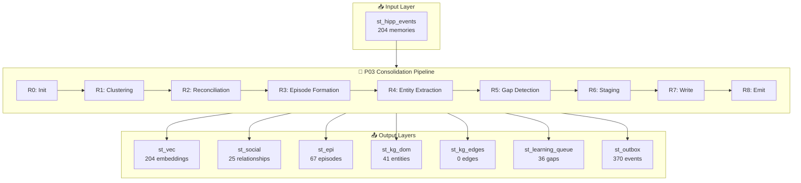

# 🧠 P03 Memory Layers Report

**Generated:** 2026-01-22 05:38:24 UTC

## 📊 Memory Layer Summary

| Layer | Table | Rows | Description |
| --- | --- | ---: | --- |
| INPUT | `st_hipp_events` | 204 | Raw input memories (hippocampus buffer) |
| L0 | `st_vec` | 204 | Vector embeddings for semantic search |
| L1 | `st_social` | 25 | Social relationships extracted |
| L2 | `st_epi` | 67 | Episodic memories (clustered events) |
| L3 | `st_kg_dom` | 41 | Knowledge graph entities |
| L4 | `st_kg_edges` | 0 | Knowledge graph relationships |
| L5 | `st_learning_queue` | 36 | Learning gaps (questions for clarification) |
| L6 | `st_outbox` | 370 | Published events for downstream consumers |

---
## 📥 INPUT: st_hipp_events (Raw Memories)

These are the raw memories ingested into the hippocampus buffer.

### Sample Memories (15 most recent)

| Event ID (short) | Text Preview | Sentiment | Affect | Salience | Participants | Location |
| --- | --- | --- | --- | --- | --- | --- |
| 3fbd0c3e-175 | Remind me Friday to reply to the Google recruiter after talking to Sarah. | neutral | GREEN | MED | 1 | Home |
| d762222f-da7 | After Emma slept, texted Rachel congrats again on the pregnancy. Still so excite | positive | GREEN | MED | 1 | Home |
| 41ca65bc-4db | Cooked chicken stir-fry for dinner. Emma actually ate the broccoli she picked! | positive | GREEN | MED | 1 | Home |
| 44b32ca5-e3f | Bath time and bedtime story. Tonight was 'Where the Wild Things Are' - her new f | positive | GREEN | MED | 1 | Home |
| 5a3a25a7-677 | Emma asked 'Daddy, are you happy?' during dinner. Told her yes, especially when  | positive | GREEN | MED | 1 | Home |
| ee83e521-5c6 | Thinking about the Google opportunity. Need to talk to Sarah about my career pat | neutral | GREEN | MED | 1 | Home |
| fd1e4b31-c21 | Grateful for: Emma's smile, Rachel's good news, productive work day, and possibi | positive | GREEN | MED | 2 | Home |
| 06a84ce8-133 | Feeling conflicted about the Google opportunity. Love my team here, but it's a h | neutral | AMBER | MED | 1 | Office |
| 20b48d8e-337 | Emma told me she made up with Maya yesterday afternoon. They're best friends aga | positive | GREEN | MED | 2 | Home |
| 118f5a69-e21 | Lunch at the new Thai place with Lisa. Talked about work-life balance and career | neutral | GREEN | MED | 1 | Thai Orchid |
| 06f50afe-c58 | Journaling before bed. Wrote about the ups and downs of today. Grateful for good | positive | GREEN | MED | 1 | Home |
| 45dd507f-d4f | Made Emma's favorite breakfast - French toast with strawberries. She ate everyth | positive | GREEN | MED | 1 | Home |
| 2e74a7db-15f | Morning standup with the team. Sprint is on track. Everyone seems energized afte | positive | GREEN | MED | 3 | Office |
| 5ed55310-568 | Surprise email from a recruiter at Google! They want to chat about a Staff Engin | neutral | GREEN | MED | 1 | Office |
| 8051b2d2-00e | Set reminder: Call Dr. Smith tomorrow to schedule Emma's annual checkup. | neutral | GREEN | MED | 2 | Home |

### Sentiment Distribution

| Sentiment | Count |
| --- | --- |
| positive | 111 |
| neutral | 78 |
| negative | 15 |

### Affect Band Distribution

| Affect Band | Count |
| --- | --- |
| GREEN | 185 |
| AMBER | 19 |

---
## 🔢 L1: st_vec (Vector Embeddings)

Dense vector representations enabling semantic similarity search.

- **Total embeddings:** 204
- **Model IDs:** 1

### Sample Embeddings

| Embedding ID (short) | Event ID (short) | Model | Dim | Source Text |
| --- | --- | --- | --- | --- |
| d6801dfc-f308-4d | d762222f-da7 | ultrabert_v2.1.0 | 768 | After Emma slept, texted Rachel congrats again on the pregna |
| c29af428-e49b-49 | ee83e521-5c6 | ultrabert_v2.1.0 | 768 | Thinking about the Google opportunity. Need to talk to Sarah |
| a1e954d2-6f3e-45 | 3fbd0c3e-175 | ultrabert_v2.1.0 | 768 | Remind me Friday to reply to the Google recruiter after talk |
| ffb0bed9-f30f-46 | fd1e4b31-c21 | ultrabert_v2.1.0 | 768 | Grateful for: Emma's smile, Rachel's good news, productive w |
| 28797e78-484f-4d | 05e534b6-496 | ultrabert_v2.1.0 | 768 | Grateful for: Emma's smile, Rachel's good news, productive w |

---
## 👥 L2: st_social (Social Relationships)

Extracted relationships between the user and other people.

### FAMILY (10 relationships)

**People:** Dad, Dr. Smith, Emma, Jake, John, Maya, Mom, Rachel, Sophie, Tom

### COLLEAGUE (8 relationships)

**People:** Andrew Ng, David, Jennifer, Lisa, Michael, Mike, Sarah, Team

### FRIEND (7 relationships)

**People:** Alex, Chris, Dr. Johnson, Kevin, Maria, Sam, Sofia

### Top 10 Relationships (by confidence)

| ID (short) | Person | Type | Subtype | Emotional Role | Valence | Interactions | Confidence |
| --- | --- | --- | --- | --- | --- | --- | --- |
| social_a2ca0d40a | Emma | FAMILY | PARENT | ENERGY_SOURCE |  | 28 | 0.95 |
| social_d62eafb70 | John | FAMILY | COWORKER | CONFIDANT |  | 8 | 0.95 |
| social_727f20506 | Lisa | COLLEAGUE | COWORKER | CONFIDANT |  | 6 | 0.95 |
| social_665342575 | Rachel | FAMILY | FRIEND | ENERGY_SOURCE |  | 9 | 0.95 |
| social_2fdf7b19a | Mike | COLLEAGUE | COWORKER | CONFIDANT |  | 6 | 0.95 |
| social_be1253db3 | Sarah | COLLEAGUE | COWORKER | ENERGY_SOURCE |  | 5 | 0.90 |
| social_f85e9c073 | Jake | FAMILY | PARENT | ENERGY_SOURCE |  | 5 | 0.90 |
| social_f1e364a3a | Dr. Smith | FAMILY | PARENT | SUPPORT_GIVER |  | 5 | 0.90 |
| social_3eb2fcd01 | Mom | FAMILY | PARENT | ENERGY_SOURCE |  | 4 | 0.85 |
| social_d2f6c81ae | David | COLLEAGUE | COWORKER | ENERGY_SOURCE |  | 3 | 0.80 |

---
## 📖 L3: st_epi (Episodic Memories)

Clustered events forming coherent episodes/experiences.

### All Episodes

| Episode ID (short) | Type | Summary | Events | Participants | Location | Duration (min) | Confidence |
| --- | --- | --- | --- | --- | --- | --- | --- |
| weak-0b0977651a084b9 | routine | Routine with Dr. Johnson, Emma at Home | 6 | 2 | Home |  | 1.00 |
| eb3b9692ce764d889486 | milestone | Milestone with Emma, Jake, Team at Office | 6 | 3 | Office |  | 1.00 |
| weak-9adceb15fd15454 | routine | Routine with Emma, Jake, Rachel at Home | 5 | 3 | Home |  | 1.00 |
| 75cb43a9544b428eabe5 | work | Work with David, John, Lisa at Office Conference Room B | 5 | 5 | Office Conference Room B |  | 1.00 |
| 342af331d5db4c56abf6 | work | Work with David, John, Lisa at Office Conference Room B | 5 | 5 | Office Conference Room B |  | 1.00 |
| 692a9682b6524409a917 | routine | Routine with Dr. Johnson, Emma at Home | 4 | 2 | Home |  | 1.00 |
| 7a11e0b0f8c34c1fa9e0 | work | Work with Alex, Chris, Emma at Office | 4 | 7 | Office |  | 1.00 |
| weak-a6264e63611d441 | routine | Routine with Emma, Jake, Rachel at Home | 4 | 3 | Home |  | 1.00 |
| noise-cd6d969145e54e | routine | Routine with Dr. Smith, Emma at Home | 4 | 2 | Home |  | 1.00 |
| 50c33c2d1e404fc1be82 | social | Social with Alex, Chris, Rachel at Starbucks Downtown | 4 | 4 | Starbucks Downtown |  | 1.00 |
| weak-59f620e70c4249e | milestone | Milestone with David, Jake, Mom at Starbucks | 4 | 6 | Starbucks |  | 1.00 |
| weak-ed06400ec944457 | work | Work with John, Lisa, Love at Office | 4 | 3 | Office |  | 1.00 |
| weak-60291f6fe48443f | routine | Routine with Dr. Smith, Emma, Lisa at Office | 4 | 3 | Office |  | 1.00 |
| b4733c43bebd4f8e846b | social | Social with Alex, Chris, Rachel at Starbucks Downtown | 4 | 4 | Starbucks Downtown |  | 1.00 |
| noise-5dedec9b2cc644 | routine | Routine at Home | 3 | 0 | Home |  | 1.00 |
| 233286fa589941a9b3af | work | Work with John, Lisa, Mike at Office | 3 | 3 | Office |  | 1.00 |
| weak-3ff13f4a60c146b | work | Work with Lisa at Office | 3 | 1 | Office |  | 1.00 |
| weak-6796655bc277485 | social | Social with Emma at Lincoln Elementary | 3 | 1 | Lincoln Elementary |  | 1.00 |
| e02793e2a92c42cfbeaf | work | Work with Andrew Ng, James Clear at Home | 3 | 1 | Home |  | 1.00 |
| weak-47351688ceab4d8 | milestone | Milestone with Emma, Team at Office | 3 | 2 | Office |  | 1.00 |
| cbf15b8b10a64a9e9f16 | routine | Routine with Emma, Jake at San Francisco | 3 | 2 | San Francisco |  | 1.00 |
| weak-923544c45487422 | social | Social with Emma at Home | 3 | 1 | Home |  | 1.00 |
| weak-d4fdc3b5c05f455 | routine | Routine with Emma, John, Lisa at Central Park | 3 | 4 | Central Park |  | 1.00 |
| noise-b0a19776710b46 | work | Work with Alex, Chris, Sarah at Office | 3 | 4 | Office |  | 1.00 |
| noise-4ead8369c37747 | social | Social with Emma, Maya, Rachel at Starbucks Downtown | 3 | 3 | Starbucks Downtown |  | 1.00 |
| noise-d592a26912b04a | social | Social with Dad, Dr. Smith, Emma at Home | 3 | 4 | Home |  | 1.00 |
| weak-54b9104915304df | social | Social with Emma at Lincoln Elementary | 3 | 1 | Lincoln Elementary |  | 1.00 |
| weak-3f87584b3cfd48a | social | Social with Emma, Rachel, Sarah at Home | 3 | 3 | Home |  | 1.00 |
| weak-f9da7bcadbb6415 | work | Work with Andrew Ng at Home | 3 | 1 | Home |  | 1.00 |
| noise-598e5227f3a147 | social | Social with Emma, Maya, Rachel at Starbucks Downtown | 3 | 3 | Starbucks Downtown |  | 1.00 |
| weak-f06acae9cab84f7 | social | Social with Dad, Emma, Mom at Home | 3 | 3 | Home |  | 1.00 |
| noise-41915fec2bc44d | routine | Routine with Emma at Central Park | 2 | 1 | Central Park |  | 1.00 |
| 1b765cb4cb5d4833bd52 | social | Social with Emma at City Sports Complex | 2 | 1 | City Sports Complex |  | 1.00 |
| noise-5ca0a4043c6144 | routine | Routine with John, Sarah, yesterday at Office | 2 | 2 | Office |  | 1.00 |
| 40a2d301486c475cb36e | social | Social with Emma, Maya at Home | 2 | 2 | Home |  | 1.00 |
| 367eb6bb5395473fb3df | routine | Routine with Dr. Smith, Emma at Office | 2 | 2 | Office |  | 1.00 |
| noise-a005ecb3577747 | work | Work with John, Lisa, Mike at Office | 2 | 3 | Office |  | 1.00 |
| 1c2dbcf5d7754796bba5 | social | Social with Emma, Jake, Sofia at Home | 2 | 3 | Home |  | 1.00 |
| weak-7dab7274cf2649f | routine | Routine with Emma, Jennifer at Home | 2 | 2 | Home |  | 1.00 |
| 2befb438ff864d84b092 | routine | Routine with Maria at Central Park | 2 | 1 | Central Park |  | 1.00 |
| a1c531673c64453ca4f8 | routine | Routine with Dr. Johnson, Dr. Smith at Medical Center | 2 | 2 | Medical Center |  | 1.00 |
| 5e74404c22c94bd8b6dc | social | Social with Kevin, Tom at Tom's Apartment | 2 | 2 | Tom's Apartment |  | 1.00 |
| 05d73c28276d450ab8c5 | routine | Routine with Jennifer at Home | 2 | 1 | Home |  | 1.00 |
| 5747878635a84d24bc9c | routine | Routine with Emma, Jake at Home | 2 | 2 | Home |  | 1.00 |
| noise-296c0872a18740 | routine | Routine with Dr. Smith, Emma at Home | 2 | 2 | Home |  | 1.00 |
| noise-90f0a1532fca4c | work | Work with David, Michael, Sarah at Office | 2 | 3 | Office |  | 1.00 |
| noise-d611898de13d4a | work | Work with John, Lisa, Michael at Office | 2 | 4 | Office |  | 1.00 |
| noise-e9194d49de214a | social | Social with Emma, Mom at Office | 2 | 2 | Office |  | 1.00 |
| 42a417b300df4f7aac21 | social | Social with Kevin, Tom at Tom's Apartment | 2 | 2 | Tom's Apartment |  | 1.00 |
| weak-0f22424db499486 | routine | Routine with John, Sarah at Office | 2 | 2 | Office |  | 1.00 |
| noise-ec164b4ab6b94b | social | Social with Rachel at Starbucks Downtown | 2 | 1 | Starbucks Downtown |  | 1.00 |
| 976cc50123db4c8f9a4a | social | Social with Emma, Maya at Home | 2 | 2 | Home |  | 1.00 |
| noise-700969e6dc8547 | work | Work with Emma, Rachel, Sarah at Home | 2 | 2 | Home |  | 1.00 |
| 1de2b5c0497a45d3b70e | social | Social with Emma at City Sports Complex | 2 | 1 | City Sports Complex |  | 1.00 |
| e480196c7f6b45abb9ba | social | Social with Emma, Jake, Sofia at Home | 2 | 3 | Home |  | 1.00 |
| 2179e558cf524429ae4e | routine | Routine with Maria at Central Park | 2 | 1 | Central Park |  | 1.00 |
| 5887fc555e3d4f55b51f | routine | Routine with Dr. Johnson, Dr. Smith at Medical Center | 2 | 2 | Medical Center |  | 1.00 |
| 5c4badcee2f542d19827 | routine | Routine with Jennifer at Home | 2 | 1 | Home |  | 1.00 |
| ac7301b5ce93458ab51d | work | Work at Home | 2 | 0 | Home |  | 1.00 |
| weak-7f6ae20be996445 | routine | Routine with Emma, Jennifer at Home | 2 | 2 | Home |  | 1.00 |
| noise-2ecfc85fc7d04d | work | Work with Emma, John, Mike at Office | 2 | 3 | Office |  | 1.00 |
| 9cc7b9b3d79148c2936f | milestone | Milestone with Jake, Rachel, Sophie at Starbucks | 2 | 4 | Starbucks |  | 1.00 |
| a3560d5253de4602bb74 | routine | Routine with David, Mom at Main Boardroom | 2 | 2 | Main Boardroom |  | 1.00 |
| noise-1958772afbbb47 | routine | Routine with Emma at Home | 2 | 1 | Home |  | 1.00 |
| noise-3c10211ee65643 | work | Work with David, Michael, Sarah at Main Boardroom | 2 | 3 | Main Boardroom |  | 1.00 |
| noise-69305745a45d43 | social | Social with Emma, John, Lisa at Chipotle | 2 | 4 | Chipotle |  | 1.00 |
| weak-e9f0a49a806c489 | social | Social with Emma at Home | 2 | 1 | Home |  | 1.00 |

---
## 🏷️ L4: st_kg_dom (Knowledge Graph Entities)

Extracted entities forming the semantic knowledge graph.

### Entity Type Distribution

| Entity Type | Count |
| --- | --- |
| PERSON | 21 |
| LOCATION | 15 |
| ORGANIZATION | 5 |

### PERSON Entities (21 total)

| Entity ID (short) | Name | Subtype | Observations | Confidence |
| --- | --- | --- | --- | --- |
| cluster_PERSON_rachel | Rachel | ACQUAINTANCE | 7 | 0.77 |
| cluster_PERSON_john | John | ACQUAINTANCE | 4 | 0.95 |
| cluster_PERSON_sarah | Sarah | ACQUAINTANCE | 4 | 0.88 |
| cluster_PERSON_david | David | ACQUAINTANCE | 3 | 0.69 |
| cluster_PERSON_mike | Mike | ACQUAINTANCE | 3 | 0.87 |
| cluster_PERSON_kevin | Kevin | ACQUAINTANCE | 2 | 0.86 |
| cluster_PERSON_sofia | Sofia | ACQUAINTANCE | 2 | 0.65 |
| cluster_PERSON_alex | Alex | ACQUAINTANCE | 2 | 0.72 |

### LOCATION Entities (15 total)

| Entity ID (short) | Name | Subtype | Observations | Confidence |
| --- | --- | --- | --- | --- |
| cluster_LOCATION_brookly | Brooklyn |  | 3 | 0.71 |
| cluster_LOCATION_lincoln | Lincoln School | EDUCATIONAL | 3 | 0.71 |
| cluster_LOCATION_marriot | Marriott Union Square |  | 2 | 0.73 |
| cluster_LOCATION_boston | Boston |  | 2 | 0.71 |
| cluster_LOCATION_manhatt | Manhattan |  | 2 | 0.78 |
| cluster_LOCATION_london | London |  | 2 | 0.82 |
| cluster_LOCATION_golden  | Golden Gate Bridge |  | 1 | 0.80 |
| cluster_LOCATION_alcatra | Alcatraz |  | 1 | 0.80 |

### ORGANIZATION Entities (5 total)

| Entity ID (short) | Name | Subtype | Observations | Confidence |
| --- | --- | --- | --- | --- |
| cluster_ORGANIZATION_goo | Google |  | 5 | 0.74 |
| cluster_ORGANIZATION_cou | Coursera |  | 2 | 0.69 |
| cluster_ORGANIZATION_the | the executive team |  | 1 | 0.78 |
| cluster_ORGANIZATION_sta | Starbucks |  | 1 | 0.80 |
| cluster_ORGANIZATION_chi | Chipotle |  | 1 | 0.80 |

---
## 🔗 L5: st_kg_edges (Knowledge Graph Relationships)

Relationships between entities in the knowledge graph.

### Relationship Type Distribution

| Relation Type | Count |
| --- | --- |

### Top 15 Relationships (by confidence)

| Source | Type | → Relation → | Target | Type | Confidence |
| --- | --- | --- | --- | --- | --- |

---
## 🎓 L6: st_learning_queue (Knowledge Gaps)

Identified gaps in understanding that could be clarified through questions.

### Gap Type Distribution

| Gap Type | Status | Count |
| --- | --- | --- |
| AMBIGUOUS_ENTITY | PENDING | 22 |
| AMBIGUOUS_ENTITY | RESOLVED | 14 |

### Top 10 Priority Gaps (by importance)

| ID (short) | Entity | Gap Type | Confidence | Importance | Status |
| --- | --- | --- | --- | --- | --- |
| sofia:ENTITY_FLAGGED | cluster_PERSON_sofia | AMBIGUOUS_ENTITY | 0.65 | 0.46 | PENDING |
| _love:ENTITY_FLAGGED | cluster_PERSON_love | AMBIGUOUS_ENTITY | 0.69 | 0.40 | RESOLVED |
| chris:ENTITY_FLAGGED | cluster_PERSON_chris | AMBIGUOUS_ENTITY | 0.69 | 0.39 | PENDING |
| rsera:ENTITY_FLAGGED | cluster_ORGANIZATION_coursera | AMBIGUOUS_ENTITY | 0.69 | 0.39 | RESOLVED |
| david:ENTITY_FLAGGED | cluster_PERSON_david | AMBIGUOUS_ENTITY | 0.69 | 0.39 | RESOLVED |
| oklyn:ENTITY_FLAGGED | cluster_LOCATION_brooklyn | AMBIGUOUS_ENTITY | 0.71 | 0.36 | RESOLVED |
| chool:ENTITY_FLAGGED | cluster_LOCATION_lincoln schoo | AMBIGUOUS_ENTITY | 0.71 | 0.35 | RESOLVED |
| oston:ENTITY_FLAGGED | cluster_LOCATION_boston | AMBIGUOUS_ENTITY | 0.71 | 0.35 | RESOLVED |
| _alex:ENTITY_FLAGGED | cluster_PERSON_alex | AMBIGUOUS_ENTITY | 0.72 | 0.34 | RESOLVED |
| quare:ENTITY_FLAGGED | cluster_LOCATION_marriott unio | AMBIGUOUS_ENTITY | 0.73 | 0.32 | RESOLVED |

---
## 📤 L7: st_outbox (Published Events)

Events published for downstream consumers and integrations.

### Event Distribution

| Driver | Operation | Status | Count |
| --- | --- | --- | --- |
| p03 | p03.truth.created.v1 | PENDING | 100 |
| p03 | p03.pattern.detected.v1 | PENDING | 100 |
| p03 | p03.truth.reinforced.v1 | PENDING | 66 |
| p03 | p03.gap.detected.v1 | PENDING | 36 |
| p03 | p03.consolidation.complete.v1 | PENDING | 34 |
| p03 | p03.truth.evolved.v1 | PENDING | 34 |

---
## 🔄 Data Flow Diagram

---

*Report generated by `visualize_memory_layers.py`*