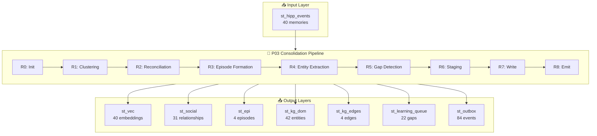

# 🧠 P03 Memory Layers Report

**Generated:** 2026-01-10 01:40:24 UTC

## 📊 Memory Layer Summary

| Layer | Table | Rows | Description |
| --- | --- | ---: | --- |
| INPUT | `st_hipp_events` | 40 | Raw input memories (hippocampus buffer) |
| L0 | `st_vec` | 40 | Vector embeddings for semantic search |
| L1 | `st_social` | 31 | Social relationships extracted |
| L2 | `st_epi` | 4 | Episodic memories (clustered events) |
| L3 | `st_kg_dom` | 42 | Knowledge graph entities |
| L4 | `st_kg_edges` | 4 | Knowledge graph relationships |
| L5 | `st_learning_queue` | 22 | Learning gaps (questions for clarification) |
| L6 | `st_outbox` | 84 | Published events for downstream consumers |

---
## 📥 INPUT: st_hipp_events (Raw Memories)

These are the raw memories ingested into the hippocampus buffer.

### Sample Memories (15 most recent)

| Event ID (short) | Text Preview | Sentiment | Affect | Salience | Participants | Location |
| --- | --- | --- | --- | --- | --- | --- |
| 37313918-79b | Emma practiced Fur Elise by Beethoven for 2 hours today. She's really mastering  | positive | GREEN | MED | 1 | Home |
| 6afc4336-ca7 | Piano recital at the community center. Emma performed Fur Elise by Beethoven bea | positive | GREEN | MED | 1 | Community Center |
| 3164d199-6c3 | Quick dinner at Chuck E Cheese Pizza Restaurant after soccer practice. Kids earn | positive | GREEN | MED | 2 | Chuck E Cheese Pizza Restaurant |
| 1ecfc50a-be1 | Emma had her spelling bee at Lincoln Elementary School today. She got 2nd place! | positive | GREEN | MED | 1 | Lincoln Elementary School |
| d9720005-39a | Parent-teacher conference at Lincoln Elementary School. Ms. Johnson said Emma is | positive | GREEN | MED | 2 | Lincoln Elementary School |
| 60c67954-436 | Emma's basketball game at City Sports Complex on Main Street. Her team won 24-18 | positive | GREEN | MED | 1 | City Sports Complex on Main Street |
| 3d57c823-ad3 | Picnic in Central Park NYC near Sheep Meadow. The weather was perfect for outdoo | positive | GREEN | MED | 2 | Central Park NYC |
| 5431f9ff-bd2 | Signed Emma up for summer camp at City Sports Complex on Main Street. They have  | positive | GREEN | MED | 1 | City Sports Complex on Main Street |
| 68ccd30e-d95 | Jake's birthday party at Chuck E Cheese Pizza Restaurant. The kids loved the arc | positive | GREEN | MED | 2 | Chuck E Cheese Pizza Restaurant |
| 4a7d7c93-b58 | Beautiful morning jog through Central Park NYC. Ran past the Great Lawn and Beth | positive | GREEN | MED | 1 | Central Park NYC |
| 88e66338-50d | Met with financial advisor Jennifer about retirement planning and 401k. | neutral | GREEN | MED | 1 | Fidelity Office |
| 3125de94-35e | Paid off student loans! 10 years of payments finally done. | positive | GREEN | MED | 1 | Home |
| bf1e0afd-c87 | Emma's first day of kindergarten at Lincoln Elementary. She was so brave! | positive | GREEN | MED | 1 | Lincoln Elementary |
| b79803a8-456 | Signed lease for new apartment in Brooklyn. Moving in next month. | positive | GREEN | MED | 1 | Brooklyn |
| 4cb90fa6-0cc | Flight to San Francisco for tech conference. Staying at Marriott Union Square. | neutral | GREEN | MED | 1 | San Francisco |

### Sentiment Distribution

| Sentiment | Count |
| --- | --- |
| positive | 26 |
| neutral | 14 |

### Affect Band Distribution

| Affect Band | Count |
| --- | --- |
| GREEN | 40 |

---
## 🔢 L1: st_vec (Vector Embeddings)

Dense vector representations enabling semantic similarity search.

- **Total embeddings:** 40
- **Model IDs:** 1

### Sample Embeddings

| Embedding ID (short) | Event ID (short) | Model | Dim | Source Text |
| --- | --- | --- | --- | --- |
| 34d868e9-0c01-4d | d861055d-bc5 | ultrabert_v2.1.0 | 768 | Picked up Emma from soccer practice at City Sports Complex.  |
| f432cd0a-7878-44 | bbeecba7-e05 | ultrabert_v2.1.0 | 768 | Emma's piano recital at Lincoln School. She played Fur Elise |
| e7b54edc-ef35-46 | cd6b26fc-a55 | ultrabert_v2.1.0 | 768 | Family dinner with Emma and Jake at home. Made lasagna toget |
| 62b5c944-a8cc-41 | 03c6fc5c-ebe | ultrabert_v2.1.0 | 768 | Drove Emma to her friend Sofia's birthday party at Chuck E C |
| e0e39db6-8d86-4e | 9b57bd8a-294 | ultrabert_v2.1.0 | 768 | Team standup meeting with John, Lisa, and Mike. Discussed Q2 |

---
## 👥 L2: st_social (Social Relationships)

Extracted relationships between the user and other people.

### FRIEND (31 relationships)

**People:** Alex, Andrew Ng, Chris, David, Dr. Johnson, Dr. Smith, Emma, Jake, Jennifer, John ...

### Top 10 Relationships (by confidence)

| ID (short) | Person | Type | Subtype | Emotional Role | Valence | Interactions | Confidence |
| --- | --- | --- | --- | --- | --- | --- | --- |
| social_1286d1d2d | Emma | FRIEND |  | ENERGY_SOURCE |  | 1 | 0.55 |
| social_409c8838a | Emma | FRIEND |  | ENERGY_SOURCE |  | 1 | 0.55 |
| social_afe7fdac2 | Jake | FRIEND |  | ENERGY_SOURCE |  | 1 | 0.55 |
| social_3b9e931af | Emma | FRIEND |  | ENERGY_SOURCE |  | 1 | 0.55 |
| social_53d8b9a51 | Sofia | FRIEND |  | ENERGY_SOURCE |  | 1 | 0.55 |
| social_1edc67683 | John | FRIEND |  |  |  | 1 | 0.55 |
| social_6aa04ebd7 | Lisa | FRIEND |  |  |  | 1 | 0.55 |
| social_ed1e3bd5c | Mike | FRIEND |  |  |  | 1 | 0.55 |
| social_b66f4f51f | Sarah | FRIEND |  |  |  | 1 | 0.55 |
| social_5cbb49e61 | Emma | FRIEND |  | ENERGY_SOURCE |  | 1 | 0.55 |

---
## 📖 L3: st_epi (Episodic Memories)

Clustered events forming coherent episodes/experiences.

### All Episodes

| Episode ID (short) | Type | Summary | Events | Participants | Location | Duration (min) | Confidence |
| --- | --- | --- | --- | --- | --- | --- | --- |
| weak-9a0a0ec4d1924cd | routine | Routine at Home | 14 | 6 | Home |  | 0.50 |
| weak-8e5037065fc44bd | work | Work at Starbucks Downtown | 11 | 10 | Starbucks Downtown |  | 0.50 |
| weak-9685b02b5d1f4c1 | work | Work at Main Boardroom | 3 | 2 | Main Boardroom |  | 0.50 |
| 135deaf7156146f08982 | unknown | Unknown at Medical Center | 2 | 2 | Medical Center |  | 0.50 |

---
## 🏷️ L4: st_kg_dom (Knowledge Graph Entities)

Extracted entities forming the semantic knowledge graph.

### Entity Type Distribution

| Entity Type | Count |
| --- | --- |
| PERSON | 17 |
| LOCATION | 8 |
| ORGANIZATION | 7 |
| CONCEPT | 7 |
| EVENT | 2 |
| FAMILY_MEMBER | 1 |

### PERSON Entities (17 total)

| Entity ID (short) | Name | Subtype | Observations | Confidence |
| --- | --- | --- | --- | --- |
| cluster_PERSON_emma | emma |  | 5 | 0.85 |
| cluster_PERSON_rachel | rachel |  | 3 | 0.85 |
| cluster_PERSON_mike | mike |  | 2 | 0.85 |
| cluster_PERSON_sofia | sofia |  | 1 | 0.85 |
| cluster_PERSON_lisa | lisa |  | 1 | 0.85 |
| cluster_PERSON_sarah | sarah |  | 1 | 0.85 |
| cluster_PERSON_david | david |  | 1 | 0.85 |
| cluster_PERSON_john | john |  | 1 | 0.85 |

### LOCATION Entities (8 total)

| Entity ID (short) | Name | Subtype | Observations | Confidence |
| --- | --- | --- | --- | --- |
| cluster_LOCATION_city sp | City Sports Complex |  | 1 | 0.80 |
| cluster_LOCATION_lincoln | Lincoln Elementary School |  | 1 | 0.80 |
| cluster_LOCATION_central | Central Park |  | 1 | 0.80 |
| cluster_LOCATION_brookly | brooklyn |  | 1 | 0.80 |
| cluster_LOCATION_san fra | san francisco |  | 1 | 0.80 |
| cluster_LOCATION_golden  | golden gate bridge |  | 1 | 0.80 |
| cluster_LOCATION_alcatra | alcatraz |  | 1 | 0.80 |
| cluster_LOCATION_boston | boston |  | 1 | 0.80 |

### ORGANIZATION Entities (7 total)

| Entity ID (short) | Name | Subtype | Observations | Confidence |
| --- | --- | --- | --- | --- |
| cluster_ORGANIZATION_sta | starbucks |  | 3 | 0.80 |
| cluster_ORGANIZATION_goo | google |  | 3 | 0.80 |
| cluster_ORGANIZATION_cou | coursera |  | 1 | 0.80 |
| cluster_ORGANIZATION_sta | stanford |  | 1 | 0.80 |
| cluster_ORGANIZATION_lin | Lincoln Elementary |  | 1 | 0.80 |
| cluster_ORGANIZATION_bel | bella notte |  | 1 | 0.80 |
| cluster_ORGANIZATION_chu | chuck e cheese |  | 1 | 0.80 |

### CONCEPT Entities (7 total)

| Entity ID (short) | Name | Subtype | Observations | Confidence |
| --- | --- | --- | --- | --- |
| cluster_CONCEPT_fur elis | fur elise |  | 1 | 0.65 |
| cluster_CONCEPT_italian | italian |  | 1 | 0.65 |
| cluster_CONCEPT_inceptio | inception |  | 1 | 0.65 |
| cluster_CONCEPT_atomic h | atomic habits |  | 1 | 0.65 |
| cluster_CONCEPT_python | python |  | 1 | 0.65 |
| cluster_CONCEPT_ai | Said |  | 1 | 0.65 |
| cluster_CONCEPT_freedom  | freedom trail |  | 1 | 0.65 |

### EVENT Entities (2 total)

| Entity ID (short) | Name | Subtype | Observations | Confidence |
| --- | --- | --- | --- | --- |
| cluster_EVENT_emma | emma |  | 2 | 0.90 |
| cluster_EVENT_dinner | dinner |  | 2 | 0.90 |

---
## 🔗 L5: st_kg_edges (Knowledge Graph Relationships)

Relationships between entities in the knowledge graph.

### Relationship Type Distribution

| Relation Type | Count |
| --- | --- |
| RELATED_TO | 4 |

### Top 15 Relationships (by confidence)

| Source | Type | → Relation → | Target | Type | Confidence |
| --- | --- | --- | --- | --- | --- |
| google | ORGANIZATION | RELATED_TO | rachel | PERSON | 0.27 |
| starbucks | ORGANIZATION | RELATED_TO | rachel | PERSON | 0.27 |
| google | ORGANIZATION | RELATED_TO | starbucks | ORGANIZATION | 0.26 |
| emma | EVENT | RELATED_TO | emma | PERSON | 0.22 |

---
## 🎓 L6: st_learning_queue (Knowledge Gaps)

Identified gaps in understanding that could be clarified through questions.

### Gap Type Distribution

| Gap Type | Status | Count |
| --- | --- | --- |
| AMBIGUOUS_ENTITY | PENDING | 19 |
| AMBIGUOUS_ENTITY | RESOLVED | 3 |

### Top 10 Priority Gaps (by importance)

| ID (short) | Entity | Gap Type | Confidence | Importance | Status |
| --- | --- | --- | --- | --- | --- |
| abits:ENTITY_FLAGGED | cluster_CONCEPT_atomic habits | AMBIGUOUS_ENTITY | 0.65 | 0.47 | PENDING |
| alian:ENTITY_FLAGGED | cluster_CONCEPT_italian | AMBIGUOUS_ENTITY | 0.65 | 0.47 | PENDING |
| ption:ENTITY_FLAGGED | cluster_CONCEPT_inception | AMBIGUOUS_ENTITY | 0.65 | 0.47 | PENDING |
| ython:ENTITY_FLAGGED | cluster_CONCEPT_python | AMBIGUOUS_ENTITY | 0.65 | 0.47 | PENDING |
| elise:ENTITY_FLAGGED | cluster_CONCEPT_fur elise | AMBIGUOUS_ENTITY | 0.65 | 0.47 | PENDING |
| PT_ai:ENTITY_FLAGGED | cluster_CONCEPT_ai | AMBIGUOUS_ENTITY | 0.65 | 0.47 | RESOLVED |
| trail:ENTITY_FLAGGED | cluster_CONCEPT_freedom trail | AMBIGUOUS_ENTITY | 0.65 | 0.47 | PENDING |
| heese:ENTITY_FLAGGED | cluster_ORGANIZATION_chuck e c | AMBIGUOUS_ENTITY | 0.80 | 0.22 | PENDING |
| mplex:ENTITY_FLAGGED | cluster_LOCATION_city sports c | AMBIGUOUS_ENTITY | 0.80 | 0.22 | PENDING |
| oston:ENTITY_FLAGGED | cluster_LOCATION_boston | AMBIGUOUS_ENTITY | 0.80 | 0.22 | PENDING |

---
## 📤 L7: st_outbox (Published Events)

Events published for downstream consumers and integrations.

### Event Distribution

| Driver | Operation | Status | Count |
| --- | --- | --- | --- |
| p03 | p03.truth.created.v1 | PENDING | 30 |
| p03 | p03.pattern.detected.v1 | PENDING | 30 |
| p03 | p03.gap.detected.v1 | PENDING | 22 |
| p03 | p03.consolidation.complete.v1 | PENDING | 2 |

---
## 🔄 Data Flow Diagram

---

*Report generated by `visualize_memory_layers.py`*