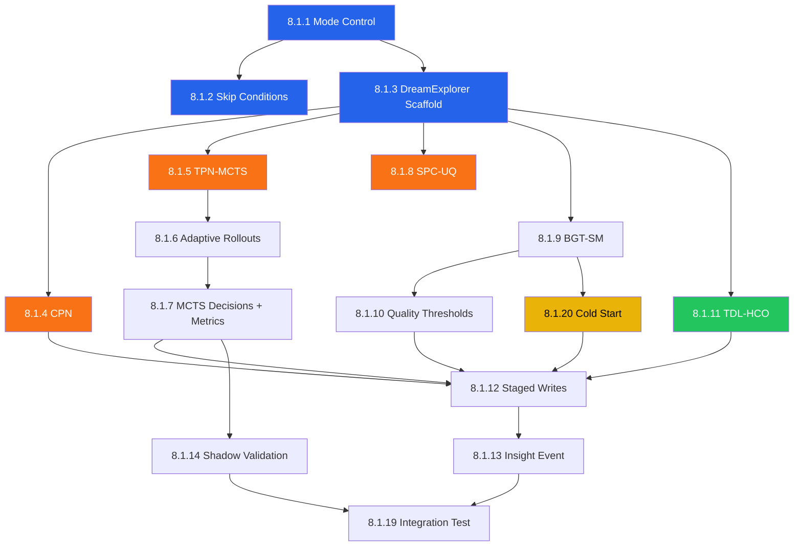
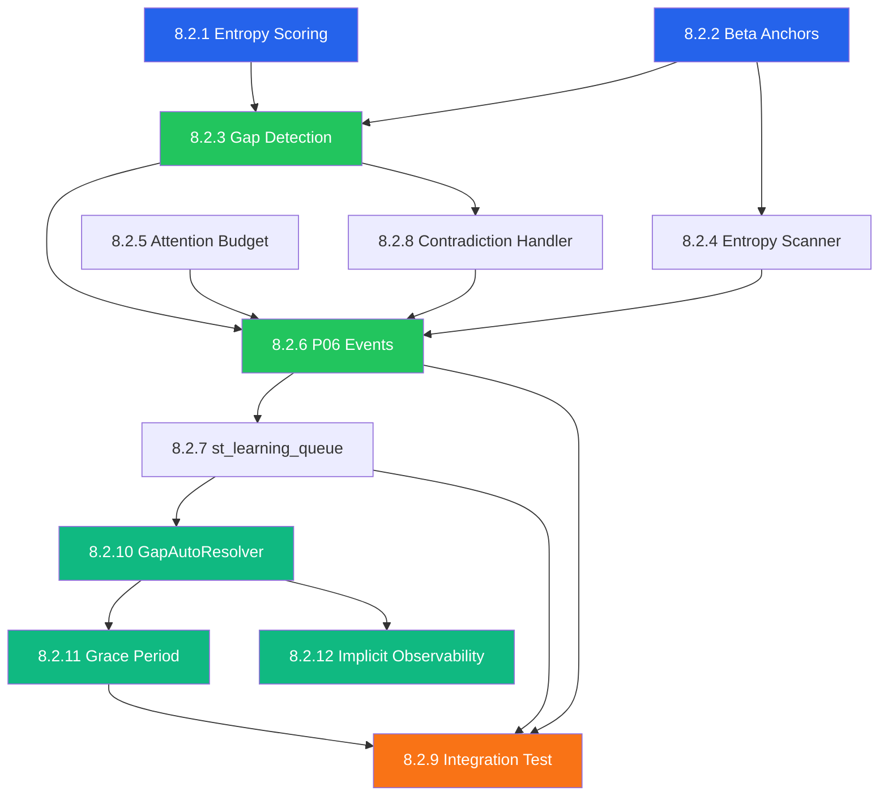

# P03 Milestone 8 Execution Document

> **Milestone**: M8 — R5 Dream Phase + P06 Active Learning Integration
> **Status**: NOT_STARTED
> **Started**: YYYY-MM-DD
> **Completed**: YYYY-MM-DD
> **Prerequisites**: M7 COMPLETED (Learning Algorithm Rollout), M5 R6-R8 infrastructure
> **Branch**: `postgre-sql-migration`
> **Baseline Commit**: TBD (after M7 completion)

---

## Document Overview

This document provides the execution plan for Milestone 8 (M8), which implements R5 Dream Phase algorithms (CPN, TPN-MCTS, BGT-SM, SPC-UQ, TDL-HCO) and P06 Active Learning integration for the P03 Consolidation Pipeline.

**M8 Focus**: Creative exploration, insight generation, counterfactual reasoning, and active learning gap detection.

**Implementation Strategy**: Full implementation of all R5 algorithms (CPN, TPN-MCTS, BGT-SM, SPC-UQ, TDL-HCO) with mode control for operational flexibility. Shadow mode available for A/B testing but not required for deployment.

---

## Part A: Context Foundation (BEFORE YOU START)

### A.0 M8 Global Invariants (MUST BE ENFORCED)

> **CRITICAL**: These engineering constraints are non-negotiable. Any code violating them fails review.

#### A.0.1 Identifiers (ULID Standard)

All identifiers in M8 (insight_id, gap_id, decision_id, etc.) are **ULIDs** (26-character TEXT).

```python
# CORRECT — Use generate_ulid() from context.py
from k0.pipelines.p03.context import generate_ulid
insight_id = generate_ulid()  # "01HXYZ123456789ABCDEFGHJKM"

# Database column type: TEXT or CHAR(26), NOT UUID
# decision_id TEXT PRIMARY KEY  -- NOT UUID

# INCORRECT
import uuid
insight_id = str(uuid.uuid4())  # WRONG: UUID4 is not ULID
```

**Why**: ULIDs are lexicographically sortable by time, enabling efficient range queries and time-ordered iteration without secondary indexes.

#### A.0.2 Timebase (Milliseconds Only)

All timestamps are **epoch milliseconds (int)**. No exceptions.

```python
# CORRECT
created_at_ms = int(time.time() * 1000)  # 1704067200000

# Refill calculation
hours_elapsed = (now_ms - last_refill_at_ms) / 3600000  # ms → hours

# INCORRECT
created_at = time.time()  # 1704067200.0 — WRONG: seconds, not milliseconds
```

**Database columns**: `*_at`, `*_ms`, `*_timestamp` are BIGINT milliseconds.
**Edge conversion**: Only convert at API boundaries (ISO8601 ↔ ms).

#### A.0.3 Determinism (Seeded RNG)

All RNG is seeded from `cycle_ulid`. All iteration order is sorted by stable IDs.

```python
# CORRECT — Use existing P03SeededRNG from deterministic.py
from k0.pipelines.p03.deterministic import P03SeededRNG, derive_cycle_seed

rng = P03SeededRNG.create(ctx.cycle_id, ctx.batch_id)
phase_rng = rng.get_phase_rng(P03PhaseId.R5_DREAM)

# Iteration order must be deterministic
for entity in sorted(entities, key=lambda e: e.entity_id):
    ...

# INCORRECT
import random
random.choice(candidates)  # Non-deterministic!

for entity in set(entities):  # Set iteration order is undefined!
    ...
```

**Numpy RNG**: Seed via `np.random.default_rng(derive_phase_seed(cycle_seed, phase))`

#### A.0.4 Compute Budget (Shared Object)

MCTS rollout cap (1000/cycle) is enforced via a **single shared ComputeBudget object** created once per cycle and passed to all R5 algorithms.

```python
@dataclass
class ComputeBudget:
    """Shared compute budget for R5 cycle — created ONCE per cycle."""
    max_mcts_rollouts: int = 1000
    used_rollouts: int = 0

    def can_allocate(self, requested: int) -> bool:
        """Check if rollouts can be allocated."""
        return self.used_rollouts + requested <= self.max_mcts_rollouts

    def allocate(self, requested: int) -> int:
        """Allocate rollouts, returning actual allocated (may be less)."""
        available = self.max_mcts_rollouts - self.used_rollouts
        allocated = min(requested, available)
        self.used_rollouts += allocated
        return allocated

    @property
    def exhausted(self) -> bool:
        return self.used_rollouts >= self.max_mcts_rollouts

# Usage: Created ONCE in DreamExplorer.explore()
budget = ComputeBudget(max_mcts_rollouts=1000)
await self.mcts.simulate(decision_points, budget=budget, rng=rng)
# budget.used_rollouts is now updated
```

**Enforcement**: If `budget.exhausted`, algorithms must skip or use heuristic fallback.

#### A.0.5 Outbox Idempotency Keys

All outbox events have deterministic idempotency keys following the pattern:
`<cycle_ulid>:<event_type>:<entity_or_insight_id>`

```python
# CORRECT — Deterministic key for insight events
idempotency_key = f"{ctx.cycle_id}:insight:{insight.insight_id}"

# CORRECT — Deterministic key for gap events
idempotency_key = f"{ctx.cycle_id}:gap:{gap.gap_id}"

# Pattern for phase-level events
idempotency_key = f"p03:r8:{ctx.cycle_id}"  # Existing pattern

# INCORRECT — Non-deterministic key
idempotency_key = generate_ulid()  # WRONG: Different on retry!
```

**Deduplication**: Outbox publisher deduplicates on `(topic, idempotency_key)` before publish.

#### A.0.6 Episodic Reconstructions (Non-Canonical)

SPC-UQ reconstructions are **never canonical truth**. They must be written as candidates only.

```python
# CORRECT — Write reconstruction as non-canonical
record_data = {
    "episode_id": generate_ulid(),
    "episode_type": "RECONSTRUCTION",  # NOT "CANONICAL"
    "is_canonical": False,
    "reconstruction_source": "spc_uq",
    "confidence_score": 0.72,
    "provenance_json": json.dumps({
        "algorithm": "SPC-UQ",
        "source_fragments": fragment_ids,
        "uncertainty_score": uncertainty
    }),
}
write = StagedWrite.insert(
    layer=LAYER_ST_EPI,  # Or dedicated st_epi_candidates
    ...
)

# INCORRECT — Overwriting canonical truth
existing_episode.summary = reconstructed_summary  # NEVER do this!
```

**Alternative**: Write to `st_epi` with `is_canonical=False` and explicit provenance.

#### A.0.7 PMI Probability Space Definition

PMI is computed from **normalized frequencies** with explicit corpus size N.

```python
# CORRECT — PMI from normalized probabilities
class PMICalculator:
    """PMI with explicit probability space."""

    def __init__(self, corpus_size: int):
        self.N = corpus_size  # Total entity occurrences

    def compute_pmi(self, entity_a: str, entity_b: str) -> float:
        """
        PMI = log2((c_ab × N) / (c_a × c_b))

        where:
        - c_ab = co-occurrence count
        - c_a, c_b = individual occurrence counts
        - N = corpus size (total entity mentions)
        """
        c_a = self.counts.get(entity_a, 0)
        c_b = self.counts.get(entity_b, 0)
        c_ab = self.cooccurrence.get((entity_a, entity_b), 0)

        if c_a == 0 or c_b == 0 or c_ab == 0:
            return 0.0

        # PMI formula with corpus normalization
        pmi = math.log2((c_ab * self.N) / (c_a * c_b))
        return pmi

# PMI > 3.0 threshold means: entities co-occur 8× more than random chance
# (2^3 = 8)
```

**Threshold semantics**: PMI > 3.0 = entities co-occur 8× more than expected by chance.

#### A.0.8 Beta Entropy Clarification

Beta "entropy" is actually **normalized variance** (uncertainty proxy), not Shannon entropy.

```python
# CORRECT — Rename to uncertainty_score
def beta_uncertainty_score(alpha: float, beta: float) -> float:
    """
    Calculate uncertainty from Beta distribution.
    Uses normalized variance as uncertainty proxy.

    Max variance (α=β=1): 0.25
    Normalized to [0, 1] range.
    """
    variance = (alpha * beta) / ((alpha + beta) ** 2 * (alpha + beta + 1))
    # Normalize by max variance for Beta distribution
    return min(variance / 0.25, 1.0)

# For true Shannon entropy of Beta distribution:
# H(Beta(α,β)) ≈ ln(B(α,β)) - (α-1)ψ(α) - (β-1)ψ(β) + (α+β-2)ψ(α+β)
# where B is Beta function, ψ is digamma function
# This is expensive to compute — use variance proxy instead
```

**Naming**: Call it `uncertainty_score`, not `entropy`, to avoid confusion.

#### A.0.9 R5 Skip Path Output Containers

If R5 is skipped, downstream phases must not crash. Empty containers must exist.

```python
# CORRECT — Skip path produces valid outputs
def _handle_skip(self, envelope: P03BatchEnvelope, reason: str) -> P03PhaseResult:
    """Handle R5 skip with proper output containers."""
    # Set skip markers
    envelope.phases.r5_skipped = True
    envelope.phases.r5_skip_reason = reason

    # Ensure empty containers exist (already defaulted in P03PhaseOutputs)
    assert envelope.phases.r5_insights == []  # Already empty from dataclass default
    assert envelope.phases.r5_counterfactuals == []
    assert envelope.phases.r5_routine_optimizations == []
    assert envelope.phases.r5_prospective_memories == []

    return P03PhaseResult.skip(self.PHASE_ID, reason=reason)

# R6 must handle skip path
def _assemble_r5_outputs(self, envelope: P03BatchEnvelope) -> List[StagedWrite]:
    """Assemble R5 outputs if present."""
    if envelope.phases.r5_skipped:
        # No writes, but manifest should record skip
        return []

    return self._assembler.assemble_insight_writes(envelope.phases.r5_insights) + \
           self._assembler.assemble_counterfactual_writes(envelope.phases.r5_counterfactuals) + ...
```

#### A.0.10 Shadow Outcome Source Specification

Shadow validation requires explicit outcome source for 7-day evaluation.

```python
# Outcome source: st_hipp_events.user_feedback_score or P06 resolution events
SHADOW_OUTCOME_SOURCES = {
    'entity_merge': {
        'table': 'st_kg_dom',
        'join_key': 'entity_id',
        'metric': 'subsequent_user_corrections_count',
        'better_direction': 'lower',  # Fewer corrections = MCTS was right
    },
    'cluster_assign': {
        'table': 'st_epi',
        'join_key': 'cluster_id',
        'metric': 'cluster_stability_score',  # Did user re-cluster?
        'better_direction': 'higher',
    },
    # ... other decision types
}

# Evaluation query (7 days later)
async def evaluate_shadow_decision(decision: ShadowDecision) -> Optional[bool]:
    """Evaluate which choice (heuristic vs MCTS) was better."""
    outcome_config = SHADOW_OUTCOME_SOURCES.get(decision.decision_type)
    if not outcome_config:
        return None  # Can't evaluate this decision type

    outcome_value = await fetch_outcome(
        table=outcome_config['table'],
        entity_id=decision.entity_id,
        since=decision.created_at + 7 * 86400 * 1000,  # 7 days later
    )

    # Compare outcomes
    if outcome_config['better_direction'] == 'lower':
        return decision.mcts_predicted_outcome < decision.heuristic_predicted_outcome
    else:
        return decision.mcts_predicted_outcome > decision.heuristic_predicted_outcome
```

---

### A.1 M0–M7 Outputs — EXISTING INFRASTRUCTURE AUDIT

> **CRITICAL**: M8 builds on completed infrastructure from M0-M7.
> This section documents what ALREADY EXISTS to avoid duplication.

#### Prerequisite Deliverables Summary

| Milestone | Key Deliverables | M8 Usage |
|-----------|------------------|----------|
| M0 | Contracts, ADRs, Schemas | P03 pipeline contract, capability contract |
| M1 | P03BatchEnvelope, P03CycleContext | Envelope for R5 phase processing |
| M2 | Storage tables, migrations | st_consolidation_audit, st_learning_queue |
| M3 | DB ↔ Outbox ↔ Bus wiring | R7TruthWriter, OutboxPublisher |
| M4 | R1-R4 Core Cognition | ImportanceScorer, EpisodicDBSCAN, DuplicateDetector, EntityDisambiguator |
| M5 | R6-R8 Finalize | R6Coordinator, StagedWritesContainer, R7R8Coordinator, EventEmitter |
| M6 | Ops Readiness | Observability, DLQ, circuit breakers, security |
| M7 | Learning Rollout | Feature flags, shadow mode, Thompson Sampling |

#### Key Infrastructure for M8

| Component | Path | M8 Usage |
|-----------|------|----------|
| P03BatchEnvelope | `k0/pipelines/p03/envelope.py` | R5 receives envelope from R4 |
| P03PhaseOutputs | `k0/pipelines/p03/phase_outputs.py` | R5 outputs stored here |
| P03StagedWrites | `k0/pipelines/p03/staged_writes.py` | R5 writes staged for R6/R7 |
| P03SequentialRunner | `k0/pipelines/p03/sequential_runner.py` | Orchestrates R5 execution |
| R6Coordinator | `k0/modules/consolidation/staging/r6_coordinator.py` | Receives R5 outputs |
| TruthWriteAssembler | `k0/modules/consolidation/staging/truth_write_assembler.py` | Assembles R5 writes |
| ProspectiveLayerWriter | `k0/modules/consolidation/truth_writer/layers/prospective.py` | Writes counterfactuals |
| SemanticLayerWriter | `k0/modules/consolidation/truth_writer/layers/semantic.py` | Writes insights |
| ProceduralLayerWriter | `k0/modules/consolidation/truth_writer/layers/procedural.py` | Writes optimized routines |

### A.1 Dossier Sections Governing This Milestone

| Section | Title | Link | Why Needed |
|---------|-------|------|------------|
| §4.6 | R5 — Dream-Like Exploration (REM) | [Dossier §4.6](../pipelines/P03_consolidation_dossier_v2.md#46-r5--dream-like-exploration-rem) | Core R5 specification |
| §4.6.0 | MVP Strategy | [Dossier §4.6.0](../pipelines/P03_consolidation_dossier_v2.md#460-mvp-strategy) | Mode control, shadow validation |
| §4.6.1 | Counterfactual Thinking (CPN) | [Dossier §4.6.1](../pipelines/P03_consolidation_dossier_v2.md#461-counterfactual-thinking-cpn-algorithm) | CPN algorithm |
| §4.6.2 | Forward Simulation (TPN-MCTS) | [Dossier §4.6.2](../pipelines/P03_consolidation_dossier_v2.md#462-forward-simulation-tpn-mcts) | MCTS algorithm |
| §4.6.2.1 | Adaptive Rollouts | [Dossier §4.6.2.1](../pipelines/P03_consolidation_dossier_v2.md#4621-adaptive-rollouts) | Rollout allocation |
| §4.6.2.2 | Exploration Constant | [Dossier §4.6.2.2](../pipelines/P03_consolidation_dossier_v2.md#4622-exploration-constant) | UCT c=√2 |
| §4.6.3 | Episodic Simulation (SPC-UQ) | [Dossier §4.6.3](../pipelines/P03_consolidation_dossier_v2.md#463-episodic-simulation-spc-uq) | SPC-UQ algorithm |
| §4.6.4 | Insight Generation (BGT-SM) | [Dossier §4.6.4](../pipelines/P03_consolidation_dossier_v2.md#464-insight-generation-bgt-sm) | BGT-SM algorithm |
| §4.6.5 | Shadow Mode Validation | [Dossier §4.6.5](../pipelines/P03_consolidation_dossier_v2.md#465-shadow-mode-validation) | MCTS validation |
| §4.6.6 | Motor Rehearsal (TDL-HCO) | [Dossier §4.6.6](../pipelines/P03_consolidation_dossier_v2.md#466-motor-rehearsal-analog-tdl-hco) | TD learning |
| §4.6.7 | R5 Complexity Assessment | [Dossier §4.6.7](../pipelines/P03_consolidation_dossier_v2.md#467-r5-complexity-assessment) | MVP vs Phase 2 |
| §5 | P06 Active Learning Integration | [Dossier §5](../pipelines/P03_consolidation_dossier_v2.md#5-p06-active-learning-integration) | Gap detection |
| §5.2 | Gap Detection | [Dossier §5.2](../pipelines/P03_consolidation_dossier_v2.md#52-gap-detection-during-reconciliation) | Gap algorithm |
| §5.3 | Entropy Scanning | [Dossier §5.3](../pipelines/P03_consolidation_dossier_v2.md#53-entropy-scanning-proactive-gap-detection) | Proactive gaps |
| §5.6 | Attention Budget | [Dossier §5.6](../pipelines/P03_consolidation_dossier_v2.md#56-attention-budget-integration) | Token bucket |
| §7.4.5 | M22 DreamExplorer | [Dossier §7.4.5](../pipelines/P03_consolidation_dossier_v2.md#745-m22--dreamexplorer) | Module spec |
| Appendix C.6 | R5 Dream Algorithms | [Dossier Appendix C.6](../pipelines/P03_consolidation_dossier_v2.md#c6-r5-dream-like-exploration-algorithms-m22) | Algorithm details |
| Appendix C.6.1 | CPN Details | [Dossier Appendix C.6.1](../pipelines/P03_consolidation_dossier_v2.md#c61-causal-perturbation-network-cpn) | CPN implementation |
| Appendix C.6.2 | TPN-MCTS Details | [Dossier Appendix C.6.2](../pipelines/P03_consolidation_dossier_v2.md#c62-tpn-mcts-forward-simulation) | MCTS implementation |
| Appendix C.6.3 | BGT-SM Details | [Dossier Appendix C.6.3](../pipelines/P03_consolidation_dossier_v2.md#c63-bgt-sm-insight-generation) | Insight thresholds |
| Appendix C.6.4 | TDL-HCO Details | [Dossier Appendix C.6.4](../pipelines/P03_consolidation_dossier_v2.md#c64-tdl-hco-motor-skill-rehearsal) | TD learning |
| Appendix D.2.3 | Exit Topics | [Dossier Appendix D.2.3](../pipelines/P03_consolidation_dossier_v2.md#d23-exit-topics) | p03.insight.generated.v1 |
| Appendix D.3.1 | Stage Mapping | [Dossier Appendix D.3.1](../pipelines/P03_consolidation_dossier_v2.md#d31-stage-mapping) | stage_50/51/52 |

### A.2 ADRs to Reference

| ADR | Path | Governs |
|-----|------|---------|
| K010 | [k010-p03-consolidation-architecture.md](../architecture/decisions-K0/pipelines/k010-p03-consolidation-architecture.md) | P03 pipeline architecture |
| K010.1 | [k010.1-sleep-cycle-state-machine.md](../architecture/decisions-K0/pipelines/k010.1-sleep-cycle-state-machine.md) | R0-R8 state machine, R5 skip logic |
| K010.9 | [k010.9-capability-based-security.md](../architecture/decisions-K0/pipelines/k010.9-capability-based-security.md) | Capability model |

### A.3 Deep Dive Documents

| Document | Path | Why Needed |
|----------|------|------------|
| R0 Deep Dive | [R0_BATCH_SELECTOR_DEEP_DIVE.md](../pipelines/R0_BATCH_SELECTOR_DEEP_DIVE.md) | Entry point, envelope creation |
| R7 Deep Dive | [R7_TRUTH_WRITER_DEEP_DIVE.md](../pipelines/R7_TRUTH_WRITER_DEEP_DIVE.md) | Layer writers for R5 outputs |
| R8 Deep Dive | [R8_EVENT_EMITTER_DEEP_DIVE.md](../pipelines/R8_EVENT_EMITTER_DEEP_DIVE.md) | Insight event emission |

### A.4 Architecture Diagrams

| Diagram | Path | What It Shows |
|---------|------|---------------|
| P03 File Dependencies | [p03_file_dependencies.mmd](../../architecture_diagrams/k0/p03_file_dependencies.mmd) | Full dependency graph |
| P03 Architecture | [p03_consolidation_architecture.mmd](../../architecture_diagrams/k0/p03_consolidation_architecture.mmd) | Phase flow |
| P03 Code Structure | [p03_code_structure.mmd](../../architecture_diagrams/k0/p03_code_structure.mmd) | Module organization |

### A.5 Governance Sync

Run before starting work:

```powershell
python -m governance.k0.scripts.sync --report
```

---

## Part B: Repository Patterns (HOW WE DO THINGS HERE)

### B.1 R5 Phase Implementation Pattern

Reference: R0-R4 phase implementations in `k0/pipelines/p03/phases/`

```python
from k0.pipelines.p03.envelope import P03BatchEnvelope
from k0.pipelines.p03.phase_interface import P03PhaseProtocol, P03PhaseResult
from k0.pipelines.p03.runner_contract import P03PhaseId

class R5DreamExplorer(P03PhaseProtocol):
    """R5 — Dream-Like Exploration phase."""

    PHASE_ID = P03PhaseId.R5_DREAM

    def __init__(self, config: R5Config):
        self.config = config
        self.dream_explorer = DreamExplorer(config.dream_config)

    async def run(
        self,
        envelope: P03BatchEnvelope,
        ctx: P03CycleContext
    ) -> P03PhaseResult:
        """Execute R5 dream exploration."""
        # Check skip conditions
        if self._should_skip(envelope, ctx):
            return P03PhaseResult.skip(self.PHASE_ID, reason="backlog/time constraint")

        # Run exploration algorithms
        insights = await self.dream_explorer.explore(
            recent_patterns=envelope.phases.r4_patterns,
            kg_subgraph=envelope.phases.r4_kg_subgraph
        )

        # Stage outputs for R6
        envelope.phases.r5_insights = insights

        return P03PhaseResult.done(self.PHASE_ID)
```

### B.2 Algorithm Module Pattern

Reference: `k0/modules/consolidation/algorithms/`

```python
from dataclasses import dataclass
from typing import List, Optional

@dataclass
class AlgorithmConfig:
    """Configuration for algorithm."""
    param1: float = 0.5
    param2: int = 100

class DreamAlgorithm:
    """Algorithm implementation following repo patterns."""

    def __init__(self, config: AlgorithmConfig):
        self.config = config

    def execute(self, inputs: AlgorithmInputs) -> AlgorithmOutputs:
        """Execute algorithm with deterministic behavior."""
        # Seed RNG with cycle_ulid for reproducibility
        rng = self._create_seeded_rng(inputs.cycle_ulid)
        # ... algorithm logic
```

### B.3 Feature Flag Pattern

Reference: M7 learning rollout flags

```python
from enum import Enum

class R5Mode(str, Enum):
    DISABLED = "disabled"
    SHADOW = "shadow"
    ENABLED_LOW = "enabled_low"
    ENABLED = "enabled"

# Configuration
P03_FF_R5_MODE = R5Mode.DISABLED  # MVP default
```

---

## Part C: Scope Boundaries (WHAT TO DO / NOT DO)

### C.1 Files To CREATE (Exact Paths)

**Epic 8.1 — R5 Dream Phase:**

| File Path | Purpose | Created By Issue |
|-----------|---------|------------------|
| `k0/pipelines/p03/phases/r5_dream_explorer.py` | R5 phase implementation | 8.1.1, 8.1.3 |
| `k0/pipelines/p03/r5_config.py` | R5 configuration and mode enum | 8.1.1 |
| `k0/modules/consolidation/dream/dream_explorer.py` | M22 DreamExplorer module | 8.1.3, 8.1.15 |
| `k0/modules/consolidation/dream/__init__.py` | Module init | 8.1.3 |
| `k0/modules/consolidation/dream/config.py` | Dream configuration | 8.1.3 |
| `k0/modules/consolidation/dream/models.py` | Insight, Scenario dataclasses | 8.1.3 |
| `k0/modules/consolidation/dream/compute_budget.py` | ComputeBudget dataclass (per A.0.4) | 8.1.15 |
| `k0/modules/consolidation/algorithms/cpn.py` | CPN counterfactual algorithm | 8.1.4 |
| `k0/modules/consolidation/algorithms/mcts.py` | TPN-MCTS forward simulation | 8.1.5 |
| `k0/modules/consolidation/algorithms/mcts_adaptive.py` | Adaptive rollout allocation | 8.1.6 |
| `k0/modules/consolidation/algorithms/bgt_sm.py` | BGT-SM insight generation | 8.1.9 |
| `k0/modules/consolidation/algorithms/spc_uq.py` | SPC-UQ episodic simulation | 8.1.8 |
| `k0/modules/consolidation/algorithms/tdl_hco.py` | TDL-HCO motor rehearsal | 8.1.11 |
| `k0/modules/consolidation/algorithms/mcts_shadow.py` | Shadow mode validation | 8.1.14 |
| `k0/db/alembic/versions/XXXX_st_mcts_decisions.py` | MCTS decisions table | 8.1.7 |
| `k0/db/alembic/versions/XXXX_st_mcts_shadow_log.py` | Shadow log table | 8.1.14 |
| `k0/contracts/schemas/p03_insight.json` | Insight event schema | 8.1.18 |
| `k0/contracts/modules/consolidation.dream_explorer.v1.yaml` | M22 module contract | 8.1.3 |
| `tests/k0/pipelines/p03/phases/test_r5_dream_explorer.py` | R5 phase tests | 8.1.3 |
| `tests/k0/modules/consolidation/dream/test_dream_explorer.py` | DreamExplorer tests | 8.1.3 |
| `tests/k0/modules/consolidation/algorithms/test_cpn.py` | CPN tests | 8.1.4 |
| `tests/k0/modules/consolidation/algorithms/test_mcts.py` | MCTS tests | 8.1.5 |
| `tests/k0/modules/consolidation/algorithms/test_bgt_sm.py` | BGT-SM tests | 8.1.9 |
| `tests/k0/modules/consolidation/algorithms/test_spc_uq.py` | SPC-UQ tests | 8.1.8 |
| `tests/k0/modules/consolidation/algorithms/test_tdl_hco.py` | TDL-HCO tests | 8.1.11 |
| `tests/k0/pipelines/p03/test_r5_integration.py` | R5 end-to-end test | 8.1.19 |

**Epic 8.2 — P06 Active Learning:**

| File Path | Purpose | Created By Issue |
|-----------|---------|------------------|
| `k0/modules/consolidation/gap_detection/__init__.py` | Module init | 8.2.3 |
| `k0/modules/consolidation/gap_detection/models.py` | GapRecord dataclass | 8.2.3 |
| `k0/modules/consolidation/gap_detection/entropy.py` | EntropyCalculator class | 8.2.1 |
| `k0/modules/consolidation/gap_detection/gap_detector.py` | GapDetector class | 8.2.3 |
| `k0/modules/consolidation/gap_detection/gap_emitter.py` | GapEmitter class | 8.2.6 |
| `k0/modules/consolidation/gap_detection/entropy_scanner.py` | EntropyScanner class | 8.2.4 |
| `k0/modules/consolidation/gap_detection/scan_scheduler.py` | Scheduler integration | 8.2.4 |
| `k0/modules/consolidation/gap_detection/contradiction_detector.py` | Contradiction detection | 8.2.8 |
| `k0/modules/consolidation/gap_detection/contradiction_resolver.py` | Resolution strategy | 8.2.8 |
| `k0/modules/consolidation/learning/__init__.py` | Module init | 8.2.2 |
| `k0/modules/consolidation/learning/anchor_updater.py` | AnchorUpdater class | 8.2.2 |
| `k0/modules/consolidation/learning/drift_detector.py` | DriftDetector class | 8.2.2 |
| `k0/modules/consolidation/learning/attention_budget.py` | AttentionBudget class | 8.2.5 |
| `k0/db/alembic/versions/XXXX_st_attention_budget.py` | Attention budget table | 8.2.5 |
| `k0/contracts/schemas/p03_gap_detected.json` | Gap detection event schema | 8.2.6 |
| `k0/contracts/schemas/p06_gap_resolved.json` | Gap resolution event schema | 8.2.6 |
| `tests/k0/modules/consolidation/gap_detection/test_entropy.py` | Entropy tests | 8.2.1 |
| `tests/k0/modules/consolidation/gap_detection/test_gap_detector.py` | GapDetector tests | 8.2.3 |
| `tests/k0/modules/consolidation/gap_detection/test_entropy_scanner.py` | Scanner tests | 8.2.4 |
| `tests/k0/modules/consolidation/gap_detection/test_gap_emitter.py` | Emitter tests | 8.2.6 |
| `tests/k0/modules/consolidation/gap_detection/test_contradiction.py` | Contradiction tests | 8.2.8 |
| `tests/k0/modules/consolidation/learning/test_anchor_updater.py` | Anchor tests | 8.2.2 |
| `tests/k0/modules/consolidation/learning/test_attention_budget.py` | Budget tests | 8.2.5 |
| `tests/k0/pipelines/p03/test_p06_integration.py` | P06 end-to-end test | 8.2.9 |
| `k0/pipelines/p03/learning/grace_period.py` | Grace period configuration | 8.2.11 |

**Epic 8.2 — Existing Files (already implemented, need verification/integration)**:

| File Path | Purpose | Verify/Update By Issue |
|-----------|---------|------------------------|
| `k0/modules/consolidation/gap_auto_resolver.py` | GapAutoResolver class (587 lines) | 8.2.10 |
| `k0/pipelines/p03/phases/r0_batch_selector.py` | R0 integration (calls GapAutoResolver) | 8.2.10 |
| `k0/deploy/submit_gap_clarifications.py` | Test script for implicit resolution | 8.2.10 |

### C.2 Files To MODIFY (Exact Paths + What Changes)

**Epic 8.1 — R5 Dream Phase:**

| File Path | What To Change | Modified By Issue |
|-----------|----------------|-------------------|
| `k0/pipelines/p03/runner_contract.py` | R5_DREAM already exists, verify execution order | 8.1.1 |
| `k0/pipelines/p03/phase_outputs.py` | R5 outputs already exist, verify completeness | 8.1.3 |
| `k0/pipelines/p03/sequential_runner.py` | Integrate R5 phase execution | 8.1.1 |
| `k0/pipelines/p03/staged_writes.py` | Add `idempotency_key: str` field to `StagedOutboxEvent` dataclass | 8.1.13 |
| `k0/modules/consolidation/staging/r6_coordinator.py` | Accept R5 outputs, add R5 write assembly | 8.1.12, 8.1.17 |
| `k0/modules/consolidation/staging/r6_output.py` | Add R5 counts to manifest | 8.1.17 |
| `k0/modules/consolidation/staging/truth_write_assembler.py` | Add R5 insight/counterfactual/routine assembly | 8.1.16 |
| `k0/modules/consolidation/staging/outbox_assembler.py` | Add insight event assembly | 8.1.18 |
| `k0/modules/consolidation/emission/emitter.py` | Add insight event type | 8.1.18 |
| `k0/pipelines/p03/ops/metrics.py` | Add R5 metrics | 8.1.1, 8.1.7 |
| `k0/pipelines/p03/observability.py` | Add R5 observability context | 8.1.1 |

**Epic 8.2 — P06 Active Learning:**

| File Path | What To Change | Modified By Issue |
|-----------|----------------|-------------------|
| `k0/modules/consolidation/algorithms/entity_disambiguator.py` | Add gap detection integration | 8.2.3 |
| `k0/modules/consolidation/staging/r6_coordinator.py` | Add gap assembly call | 8.2.7 |
| `k0/modules/consolidation/staging/truth_write_assembler.py` | Add assemble_gap_writes() | 8.2.7 |
| `k0/pipelines/p03/phases/r1_importance.py` | Add anchor evidence extraction | 8.2.2 |
| `k0/pipelines/p03/phases/r0_batch_selector.py` | Verify GapAutoResolver integration | 8.2.10 |
| `k0/modules/consolidation/gap_auto_resolver.py` | Verify resolution_type='IMPLICIT', add metrics | 8.2.10, 8.2.12 |
| `k0/modules/consolidation/gap_detection/gap_emitter.py` | Add grace period check before P06 emission | 8.2.11 |
| `k0/pipelines/p03/ops/metrics.py` | Add implicit resolution metrics | 8.2.12 |

### C.3 What NOT To Do

- ❌ Write directly to truth tables in R5 (use staged writes via R6)
- ❌ Create new database connections (use existing UoW)
- ❌ Add non-deterministic behavior without cycle_ulid seeding
- ❌ Skip determinism requirements for CI reproducibility
- ❌ Bypass R6Coordinator for R5 outputs
- ❌ Emit events directly from R5 (must flow through R8)

---

## Part D: Epic Execution Order

```
┌─────────────────────────────────────────────────────────────────────────────┐
│                        M8 EPIC EXECUTION ORDER                               │
├─────────────────────────────────────────────────────────────────────────────┤
│                                                                              │
│  Epic 8.1: R5 Dream Algorithms Implementation                                │
│  ├── 8.1.1  R5 execution mode control (disabled/shadow/enabled_low/enabled) │
│  ├── 8.1.2  R5 skip conditions (backlog/time window) + accounting           │
│  ├── 8.1.3  M22 DreamExplorer scaffold + deterministic execution            │
│  ├── 8.1.4  CPN counterfactual generation (UPWARD/DOWNWARD/SEMIFACTUAL)     │
│  ├── 8.1.5  TPN-MCTS forward simulation with UCT selection                  │
│  ├── 8.1.6  Adaptive rollout allocation + early termination                 │
│  ├── 8.1.7  Persist MCTS decisions + metrics                                │
│  ├── 8.1.8  SPC-UQ episodic simulation with uncertainty quantification      │
│  ├── 8.1.9  BGT-SM bisociative insight generation (semantic distance + PMI) │
│  ├── 8.1.10 Insight quality thresholds + ranking                            │
│  ├── 8.1.11 TDL-HCO motor rehearsal for habits (value function+bottlenecks) │
│  ├── 8.1.12 R5 outputs routed through staged writes container (R6Output)    │
│  ├── 8.1.13 Emit R5 insight event `p03.insight.generated.v1`                │
│  ├── 8.1.14 R5 shadow validation (heuristic vs MCTS) integration            │
│  ├── 8.1.15 R5 algorithm orchestration in DreamExplorer                     │
│  ├── 8.1.16 TruthWriteAssembler R5 output assembly                          │
│  ├── 8.1.17 R5→R6 integration handoff                                       │
│  ├── 8.1.18 R5→R8 insight event emission contract                           │
│  ├── 8.1.19 R5 full integration test                                        │
│  └── 8.1.20 BGT-SM cold start handling                                       │
│                                                                              │
│  Epic 8.2: P06 Active Learning Integration                                   │
│  ├── 8.2.1  Shannon entropy scoring (gap uncertainty normalization)          │
│  ├── 8.2.2  Beta-distribution belief modeling for anchors                   │
│  ├── 8.2.3  Gap detection during reconciliation                              │
│  ├── 8.2.4  Entropy scanning (proactive gap detection)                       │
│  ├── 8.2.5  Attention budget integration (token bucket)                      │
│  ├── 8.2.6  P06 event contracts (p03.gap.detected.v1, p06.gap.resolved.v1)  │
│  ├── 8.2.7  st_learning_queue integration                                    │
│  ├── 8.2.8  Contradiction resolution handler                                 │
│  └── 8.2.9  P06 Active Learning full integration test                        │
│                                                                              │
└─────────────────────────────────────────────────────────────────────────────┘
```

---

## Part E: Epic Execution Details

### Epic 8.1 — R5 Dream Algorithms Implementation

> **References**:
>
> - Dossier Section 4.6: R5 — Dream-Like Exploration (REM)
> - Dossier Section 4.6.0: MVP Strategy (R5 modes, metrics, rollout)
> - Dossier Section 4.6.1: Counterfactual Thinking (CPN)
> - Dossier Section 4.6.2: Forward Simulation (TPN-MCTS) + Adaptive Rollouts
> - Dossier Section 4.6.3: Episodic Simulation (SPC-UQ)
> - Dossier Section 4.6.4: Insight Generation (BGT-SM)
> - Dossier Section 4.6.5: Shadow Mode Validation (heuristic vs MCTS)
> - Dossier Section 4.6.6: Motor Rehearsal Analog (TDL-HCO)
> - Dossier Section 4.6.7: R5 Complexity Assessment (MVP vs Phase 2)
> - Dossier Section 7.4.5: M22 — DreamExplorer (Insight model, explore() flow)
> - Dossier Appendix C.6.1-C.6.4: Algorithm details
> - Dossier Appendix D.2.3: Exit topic `p03.insight.generated.v1`

---

#### Issue 8.1.1 — R5 Execution Mode Control

**Goal**: Implement R5 execution mode control consistent with the dossier MVP strategy and rollout phases.

**Status**: NOT_STARTED

**Deliverables**:

1. Config flag `P03_FF_R5_MODE` with values: `disabled`, `shadow`, `enabled_low`, `enabled` (default `disabled` for MVP)
2. R5 mode metrics:
   - `p03_r5_mode` (gauge: 0=disabled, 1=shadow, 2=enabled_low, 3=enabled)
   - `p03_r5_compute_seconds_saved` (counter)
3. R5 phase stub in `k0/pipelines/p03/phases/r5_dream_explorer.py`
4. Update `runner_contract.py` to include R5_DREAM in phase order
5. Update `sequential_runner.py` to orchestrate R5 phase

**Files to Create**:

| File | Purpose |
|------|---------|
| `k0/pipelines/p03/phases/r5_dream_explorer.py` | R5 phase implementation |
| `k0/pipelines/p03/r5_config.py` | R5 configuration and mode enum |

**Files to Modify**:

| File | Change |
|------|--------|
| `k0/pipelines/p03/runner_contract.py` | Add `R5_DREAM` to `P03PhaseId` enum |
| `k0/pipelines/p03/sequential_runner.py` | Add R5 phase execution |
| `k0/pipelines/p03/ops/metrics.py` | Add R5 mode metrics |

**Acceptance Criteria**:

- [ ] Default behavior is MVP-safe: R5 skipped when mode is `disabled`
- [ ] `enabled_low` enforces reduced rollouts (10 per decision)
- [ ] R5 mode is observable via metrics
- [ ] Sequential runner executes R5 between R4 and R6

**Test Cases**:

```python
@test("R5 skipped when mode is disabled")
def test_r5_disabled_mode():
    config = R5Config(mode=R5Mode.DISABLED)
    r5 = R5DreamExplorer(config)
    result = await r5.run(envelope, ctx)
    assert result.status == P03PhaseStatus.SKIPPED
    assert metrics.p03_r5_mode.get() == 0

@test("R5 executes when mode is enabled")
def test_r5_enabled_mode():
    config = R5Config(mode=R5Mode.ENABLED)
    r5 = R5DreamExplorer(config)
    result = await r5.run(envelope, ctx)
    assert result.status == P03PhaseStatus.DONE
```

---

#### Issue 8.1.2 — R5 Skip Conditions + Accounting

**Goal**: Enforce R5 skip logic for backlog pressure and time window constraints.

**Status**: NOT_STARTED

**Deliverables**:

1. R5 skip predicate aligned to dossier:
   - Skip if `cycle_context.backlog_size > 1000` OR `cycle_context.remaining_window_seconds < 60`
2. `p03_r5_skipped_decisions` (counter) incremented when R5 is skipped

**Files to Modify**:

| File | Change |
|------|--------|
| `k0/pipelines/p03/phases/r5_dream_explorer.py` | Add `_should_skip()` method |
| `k0/pipelines/p03/ops/metrics.py` | Add skip counter with `reason` label |

**Acceptance Criteria**:

- [ ] When skip condition is met, pipeline transitions from R4 to R6 without R5
- [ ] Skip path does not break downstream R6/R7/R8 expectations
- [ ] Metric increments match actual skip events

**Code Pattern**:

```python
def _should_skip(self, envelope: P03BatchEnvelope, ctx: P03CycleContext) -> tuple[bool, str]:
    """Check if R5 should be skipped."""
    if self.config.mode == R5Mode.DISABLED:
        return True, "mode_disabled"

    if ctx.backlog_size > P03_R5_BACKLOG_SKIP_THRESHOLD:
        return True, "backlog_pressure"

    if ctx.remaining_window_seconds < P03_R5_TIME_WINDOW_SKIP_SECONDS:
        return True, "time_constraint"

    return False, ""
```

---

#### Issue 8.1.3 — M22 DreamExplorer Scaffold + Deterministic Execution

**Goal**: Implement the DreamExplorer module skeleton for R5, including config and deterministic behavior.

**Status**: NOT_STARTED

**Deliverables**:

1. `M22 DreamExplorer` implementation aligned to dossier:
   - `Insight` model fields: type, description, confidence, supporting_evidence, novelty_score
   - `DreamConfig`: `depth`, `creativity`, `max_insights` (defaults per dossier)
   - `explore(recent_patterns, kg_subgraph)` orchestrates CPN, TPN-MCTS, BGT-SM then ranks by novelty
2. Determinism requirements:
   - Seed random walks / rollout sampling with `cycle_ulid` for repeatable tests
   - Perturbation ordering deterministic (sorted by entity_id)

**Files to Create**:

| File | Purpose |
|------|---------|
| `k0/modules/consolidation/dream/__init__.py` | Module init |
| `k0/modules/consolidation/dream/config.py` | DreamConfig dataclass |
| `k0/modules/consolidation/dream/models.py` | Insight, Scenario, CounterfactualScenario |
| `k0/modules/consolidation/dream/dream_explorer.py` | M22 DreamExplorer class |
| `k0/contracts/modules/consolidation.dream_explorer.v1.yaml` | Module contract |
| `tests/k0/modules/consolidation/dream/test_dream_explorer.py` | Unit tests |

**Files to Modify**:

| File | Change |
|------|--------|
| `k0/pipelines/p03/phase_outputs.py` | Add R5 output fields (see below) |

**Required R5 Phase Output Fields** (add to `P03PhaseOutputs` dataclass):

```python
# R5 Dream Phase outputs
r5_insights: List[Insight] = field(default_factory=list)
r5_counterfactuals: List[CounterfactualScenario] = field(default_factory=list)
r5_routine_optimizations: List[RoutineOptimization] = field(default_factory=list)
r5_prospective_memories: List[ProspectiveMemory] = field(default_factory=list)
r5_skipped: bool = False
r5_skip_reason: Optional[str] = None
```

**Acceptance Criteria**:

- [ ] DreamExplorer returns at most `max_insights` insights sorted by novelty
- [ ] Deterministic outputs in CI given fixed seed inputs
- [ ] Module contract validates inputs/outputs

**Core Data Models**:

```python
@dataclass(frozen=True)
class Insight:
    """R5 insight from dream exploration."""
    insight_type: str  # 'COUNTERFACTUAL', 'PREDICTION', 'ASSOCIATION', 'ANOMALY'
    description: str
    confidence: float
    supporting_evidence: tuple[str, ...]  # episode_ids
    novelty_score: float
    created_at: int  # ms timestamp

@dataclass
class DreamConfig:
    """Configuration for DreamExplorer."""
    depth: int = 3  # hops in KG
    creativity: float = 0.5  # 0=conservative, 1=wild
    max_insights: int = 10  # per cycle
    seed: Optional[str] = None  # cycle_ulid for determinism
```

---

#### Issue 8.1.4 — CPN Counterfactual Generation

**Goal**: Generate counterfactual scenarios from recent patterns using the CPN algorithm.

**Status**: NOT_STARTED

**Deliverables**:

1. Implement CPN scenario generation modes:
   - UPWARD (better outcome), DOWNWARD (worse outcome), SEMIFACTUAL (different path, same outcome)
2. Persist top scenarios to `st_prospective` (counterfactual/prospective records) via R5 outputs

**Files to Create**:

| File | Purpose |
|------|---------|
| `k0/modules/consolidation/algorithms/cpn.py` | CausalPerturbationNetwork class |
| `tests/k0/modules/consolidation/algorithms/test_cpn.py` | CPN tests |

**Acceptance Criteria**:

- [ ] Counterfactuals include plausibility and success probability (per dossier scenario metrics)
- [ ] Only scenarios meeting minimum quality thresholds are retained
- [ ] Writes occur through the staged write path (R6/R7), not ad-hoc DB writes

**Algorithm Skeleton**:

```python
class CausalPerturbationNetwork:
    """CPN: Counterfactual scenario generation."""

    def select_regret_events(self, episodes: List[EpisodicMemory], top_k: int = 10) -> List[EpisodicMemory]:
        """Select emotionally significant events for counterfactual analysis."""
        ...

    def extract_causal_chain(self, event: EpisodicMemory, depth: int = 5) -> CausalDAG:
        """Build causal predecessor DAG from knowledge graph."""
        ...

    def generate_counterfactuals(self, dag: CausalDAG, original_outcome: float) -> List[CounterfactualScenario]:
        """Generate UPWARD/DOWNWARD/SEMIFACTUAL scenarios."""
        ...
```

---

#### Issue 8.1.5 — TPN-MCTS Forward Simulation with UCT Selection

**Goal**: Implement forward simulation using MCTS (UCT selection) to explore future outcomes.

**Status**: NOT_STARTED

**Deliverables**:

1. UCT selection with static exploration constant `c = √2 ≈ 1.414`
2. Forward simulation outputs: action sequences + predicted outcomes + probabilities

**Files to Create**:

| File | Purpose |
|------|---------|
| `k0/modules/consolidation/algorithms/mcts.py` | TemporalProjectionMCTS class |
| `tests/k0/modules/consolidation/algorithms/test_mcts.py` | MCTS tests |

**Acceptance Criteria**:

- [ ] MCTS uses UCT selection with correct unvisited-node handling
- [ ] Forward simulation returns bounded number of scenarios within compute budget
- [ ] Behavior consistent with dossier compute constraints (1000 rollouts per cycle cap)

**UCT Formula**:

```python
def compute_uct(node: MCTSNode, parent: MCTSNode) -> float:
    """
    UCT = Q/N + c × √(ln(N_parent) / N)
    """
    if node.visit_count == 0:
        return float('inf')  # Always explore unvisited

    exploitation = node.total_reward / node.visit_count
    exploration = P03_MCTS_UCT_EXPLORATION_CONSTANT * sqrt(
        log(parent.visit_count) / node.visit_count
    )

    return exploitation + exploration
```

---

#### Issue 8.1.6 — Adaptive Rollout Allocation + Early Termination

**Goal**: Allocate rollout counts based on decision importance and terminate early when decision is clear.

**Status**: NOT_STARTED

**Deliverables**:

1. Decision type → rollout allocation table:
   - merge/split = 100
   - causal = 50
   - cluster = 30
   - reinforce = 20
   - decay/novelty = 10
2. Decision classification adjustments:
   - Boost rollouts for `FAMILY_MEMBER` entities
   - Reduce rollouts for low-confidence contexts (<0.60)
3. Early termination conditions:
   - Clear winner (>90% visits)
   - Low uncertainty (CI width <5%)
   - Budget exhausted (per-cycle cap)

**Files to Create**:

| File | Purpose |
|------|---------|
| `k0/modules/consolidation/algorithms/mcts_adaptive.py` | Adaptive rollout allocation |

**Acceptance Criteria**:

- [ ] Rollout counts follow dossier table and are capped at 100
- [ ] Early termination triggers correctly
- [ ] Compute budget is enforced globally per cycle

**Allocation Table**:

```python
ROLLOUT_ALLOCATION = {
    'entity_merge': 100,
    'entity_split': 100,
    'causal_edge': 50,
    'cluster_assign': 30,
    'memory_reinforce': 20,
    'decay_tune': 10,
    'novelty_adjust': 10,
}
```

---

#### Issue 8.1.7 — Persist MCTS Decisions + Metrics

**Goal**: Store MCTS decision traces for analysis and expose key MCTS metrics.

**Status**: NOT_STARTED

**Deliverables**:

1. `st_mcts_decisions` table for decision traces:
   - decision_id, type, rollouts_allocated/executed, early_termination, chosen_action, CI width, compute_ms
2. Metrics:
   - `p03_mcts_rollouts` (histogram)
   - `p03_mcts_early_termination_rate` (gauge)
   - `p03_mcts_compute_budget_used` (counter)
   - `p03_mcts_budget_exhausted` (counter)

**Files to Create**:

| File | Purpose |
|------|---------|
| `k0/db/alembic/versions/XXXX_st_mcts_decisions.py` | Migration |

**Files to Modify**:

| File | Change |
|------|--------|
| `k0/pipelines/p03/ops/metrics.py` | Add MCTS metrics |

**Acceptance Criteria**:

- [ ] Records written for all executed MCTS decisions
- [ ] Metrics align with stored traces and per-cycle budgets
- [ ] Indexes support decision_type + created_at queries

---

#### Issue 8.1.8 — SPC-UQ Episodic Simulation

**Goal**: Recombine episode fragments to reconstruct plausible narratives with uncertainty signals.

**Status**: NOT_STARTED

**Deliverables**:

1. SPC-UQ implementation producing reconstructed timelines (fragments) plus uncertainty estimates
2. Gating to respect R5 compute constraints (skip or limit per dossier complexity assessment)

**Files to Create**:

| File | Purpose |
|------|---------|
| `k0/modules/consolidation/algorithms/spc_uq.py` | EpisodicSimulator class |
| `tests/k0/modules/consolidation/algorithms/test_spc_uq.py` | Tests |

**Acceptance Criteria**:

- [ ] Episodic simulation produces bounded outputs (max candidates per cycle)
- [ ] Uncertainty quantification is captured for downstream ranking/filtering
- [ ] Reconstructed narratives include temporal coherence score
- [ ] Reconstructions are **non-canonical** per A.0.6 invariant

**Reconstruction Write Policy** (per A.0.6 invariant):

> **CRITICAL**: SPC-UQ reconstructions MUST NOT overwrite canonical episodic truth.

```python
def create_reconstruction_write(
    self,
    fragments: List[EpisodeFragment],
    reconstructed_summary: str,
    confidence: float,
    uncertainty: float,
) -> StagedWrite:
    """Create a non-canonical reconstruction write."""
    record_data = {
        "episode_id": generate_ulid(),
        "episode_type": "RECONSTRUCTION",  # NOT "CANONICAL"
        "is_canonical": False,  # CRITICAL: Never set True for reconstructions
        "summary": reconstructed_summary,
        "confidence_score": confidence,
        "uncertainty_score": uncertainty,
        "temporal_coherence_score": self._calculate_coherence(fragments),
        "provenance_json": json.dumps({
            "algorithm": "SPC-UQ",
            "source_fragments": [f.fragment_id for f in fragments],
            "reconstruction_strategy": self.config.strategy,
            "created_by_cycle": self.cycle_id,
        }),
        "created_at": int(time.time() * 1000),
    }
    return StagedWrite.insert(
        layer=LAYER_ST_EPI,
        record_id=record_data["episode_id"],
        data=record_data,
        phase="R5",
        event_ids=[f.source_event_id for f in fragments],
    )
```

---

#### Issue 8.1.9 — BGT-SM Bisociative Insight Generation

**Goal**: Discover remote associations via random walks and information-theoretic surprise scoring.

**Status**: NOT_STARTED

**Deliverables**:

1. Random walk with restart (restart probability 0.15, steps 1000) seeded deterministically
2. Remote-associate filtering: semantic distance > 0.7
3. Surprise threshold: PMI > 3.0
4. Novelty scoring consistent with dossier: `distance × pmi / (count+1)`

**Files to Create**:

| File | Purpose |
|------|---------|
| `k0/modules/consolidation/algorithms/bgt_sm.py` | BisociativeGraphTraversal class |
| `tests/k0/modules/consolidation/algorithms/test_bgt_sm.py` | Tests |

**Acceptance Criteria**:

- [ ] Only insights meeting semantic distance + PMI thresholds are produced
- [ ] Writes to `st_sem` use `pattern_type='insight'`
- [ ] Deterministic execution in CI with fixed seed

**PMI Formula** (per A.0.7 invariant — uses counts with corpus size N):

```python
def compute_pmi(self, entity_a: str, entity_b: str) -> float:
    """
    PMI = log2((c_ab × N) / (c_a × c_b))

    where:
    - c_ab = co-occurrence count
    - c_a, c_b = individual occurrence counts
    - N = corpus size (total entity mentions)

    PMI > 3.0 means entities co-occur 8× more than random chance (2^3 = 8).
    """
    c_a = self.counts.get(entity_a, 0)
    c_b = self.counts.get(entity_b, 0)
    c_ab = self.cooccurrence.get((entity_a, entity_b), 0)

    if c_ab == 0 or c_a == 0 or c_b == 0:
        return 0.0

    # PMI with corpus normalization (N = total entity occurrences)
    return math.log2((c_ab * self.corpus_size) / (c_a * c_b))
```

---

#### Issue 8.1.10 — Insight Quality Thresholds + Ranking

**Goal**: Implement quality filters for surfacing user-visible R5 insights.

**Status**: NOT_STARTED

**Deliverables**:

1. Enforce insight quality thresholds:
   - Semantic distance > 0.7
   - PMI score > 3.0
   - Novelty score > 0.5
   - Serendipity > 0.6 (novelty × relevance × actionability)
2. Rank insights by novelty_score and retain top N (max_insights)

**Files to Modify**:

| File | Change |
|------|--------|
| `k0/modules/consolidation/dream/dream_explorer.py` | Add quality filtering |

**Acceptance Criteria**:

- [ ] Insights failing thresholds are not emitted nor written as surfaced insights
- [ ] Top-N selection is stable and deterministic for identical inputs

**Quality Filter**:

```python
def filter_insights(self, insights: List[Insight]) -> List[Insight]:
    """Apply quality thresholds."""
    return [
        i for i in insights
        if i.semantic_distance > P03_BGT_SEMANTIC_DISTANCE_THRESHOLD
        and i.pmi_score > P03_BGT_PMI_THRESHOLD
        and i.novelty_score > P03_BGT_NOVELTY_THRESHOLD
    ]
```

---

#### Issue 8.1.11 — TDL-HCO Motor Rehearsal for Habits

**Goal**: Optimize procedural routines via TD learning and identify bottlenecks via negative value gradients.

**Status**: NOT_STARTED

**Deliverables**:

1. TD(0) learning for value function `V(s)` per step with γ=0.9 and α=0.1
2. Bottleneck detection rule: `ΔV(s_t) = V(s_{t+1}) - V(s_t) < -2.0`
3. Persist optimized routines to `st_procedural` and write proposed improvements to `st_prospective`

**Files to Create**:

| File | Purpose |
|------|---------|
| `k0/modules/consolidation/algorithms/tdl_hco.py` | TemporalDifferenceLearning class |
| `tests/k0/modules/consolidation/algorithms/test_tdl_hco.py` | Tests |

**Acceptance Criteria**:

- [ ] Value function learned from execution history
- [ ] Bottlenecks detected per dossier threshold
- [ ] Outputs staged for atomic write (R6/R7)

**TD Update Rule**:

```python
def td_update(self, state: str, reward: float, next_state: str):
    """
    TD(0) update: V(s) ← V(s) + α × [r + γ × V(s') - V(s)]
    """
    current_value = self.values.get(state, 0.0)
    next_value = self.values.get(next_state, 0.0)
    td_error = reward + self.discount * next_value - current_value
    self.values[state] = current_value + self.learning_rate * td_error
```

---

#### Issue 8.1.12 — R5 Outputs Routed Through Staged Writes Container

**Goal**: Ensure all R5 outputs flow through the R6 staging container for atomic application in R7.

**Status**: NOT_STARTED

**Deliverables**:

1. R5 produces staged records compatible with `R6Output`:
   - staged_truth_writes (st_sem/st_procedural/st_prospective targets)
   - staged_outbox_events (including insight event)
   - reconciliation summary includes R5 work performed/skipped

**Files to Modify**:

| File | Change |
|------|--------|
| `k0/pipelines/p03/phase_outputs.py` | Add R5 outputs container |
| `k0/modules/consolidation/staging/r6_coordinator.py` | Accept R5 outputs |
| `k0/modules/consolidation/staging/truth_write_assembler.py` | Assemble R5 writes |

**Acceptance Criteria**:

- [ ] No direct writes to truth tables in R5 (only staged output)
- [ ] R7 consumes R6Output and writes atomically via UnitOfWork
- [ ] Idempotency keys remain stable across retries

---

#### Issue 8.1.13 — Emit R5 Insight Event

**Goal**: Emit insight events when R5 produces user-facing insights.

**Status**: NOT_STARTED

**Deliverables**:

1. Outbox-backed emission of `p03.insight.generated.v1` with payload including:
   - insight_type, description, confidence, novelty_score, supporting_evidence
2. Ensure emission happens in R8 via outbox drain (idempotent)
3. Explicit idempotency key per A.0.5 invariant

**Files to Create/Modify**:

| File | Purpose |
|------|---------|
| `k0/pipelines/p03/staged_writes.py` | Add `idempotency_key: str` field to `StagedOutboxEvent` dataclass |
| `k0/contracts/schemas/p03_insight.json` | Insight event schema |
| `k0/modules/consolidation/emission/emitter.py` | Add insight emission |

**StagedOutboxEvent Modification** (CRITICAL — currently missing field):

```python
# Current: StagedOutboxEvent in staged_writes.py lacks idempotency_key
# Required change:

@dataclass
class StagedOutboxEvent:
    """Staged outbox event for R8 emission."""
    event_id: str
    topic: str
    payload: Dict[str, Any]
    source_phase: str
    idempotency_key: str  # NEW FIELD — deterministic key for deduplication
    created_at: Optional[int] = None

    def __post_init__(self):
        if self.created_at is None:
            self.created_at = int(time.time() * 1000)
```

**Idempotency Key Pattern** (per A.0.5 invariant):

```python
def create_insight_outbox_event(
    self,
    insight: Insight,
    cycle_id: str,
    tenant_id: str,
    space_id: str,
) -> StagedOutboxEvent:
    """Create outbox event for insight with deterministic idempotency key."""
    # CORRECT: Deterministic key from cycle + insight
    idempotency_key = f"{cycle_id}:insight:{insight.insight_id}"

    return StagedOutboxEvent(
        event_id=generate_ulid(),
        topic="p03.insight.generated.v1",
        payload={
            "insight_id": insight.insight_id,
            "insight_type": insight.insight_type,
            "tenant_id": tenant_id,
            "space_id": space_id,
            "description": insight.natural_language,
            "confidence": insight.relevance_score,
            "novelty_score": insight.novelty_score,
            "concept_a_id": insight.concept_a_id,
            "concept_b_id": insight.concept_b_id,
            "supporting_evidence": insight.evidence_ids,
            "created_at": int(time.time() * 1000),
        },
        source_phase="R5",
        idempotency_key=idempotency_key,  # Must be deterministic!
    )
```

**Acceptance Criteria**:

- [ ] Insight events only emitted when an insight passes quality thresholds
- [ ] Events are deduplicated on retry via idempotency_key
- [ ] Topic name exactly matches dossier registry: `p03.insight.generated.v1`
- [ ] Idempotency key follows `{cycle_id}:insight:{insight_id}` pattern

---

#### Issue 8.1.14 — R5 Shadow Validation (Heuristic vs MCTS)

**Goal**: Implement the dossier's shadow validation loop to justify MCTS compute cost before enabling.

**Status**: NOT_STARTED

**Deliverables**:

1. Shadow mode behavior for R5 decisions:
   - Compute heuristic choice
   - Run MCTS
   - Apply heuristic (MCTS read-only)
   - Log both to `st_mcts_shadow_log`
2. Promotion logic from `shadow` → `enabled_low` based on "diff >20% AND MCTS better >55%"

**Files to Create**:

| File | Purpose |
|------|---------|
| `k0/modules/consolidation/algorithms/mcts_shadow.py` | ShadowOutcomeTracker class |
| `k0/db/alembic/versions/XXXX_st_mcts_shadow_log.py` | Migration |

**Acceptance Criteria**:

- [ ] Shadow decisions logged for later evaluation
- [ ] Outcome tracking after 7 days
- [ ] Recommendation thresholds match dossier tables

**Evaluation Query** (from dossier):

```sql
WITH recent_decisions AS (
    SELECT *
    FROM st_mcts_shadow_log
    WHERE created_at >= extract(epoch from now() - interval '30 days') * 1000
      AND evaluated_at IS NOT NULL
)
SELECT
    decision_type,
    COUNT(*) as total_decisions,
    SUM(CASE WHEN NOT choices_differ THEN 1 ELSE 0 END)::REAL / COUNT(*) as agreement_rate,
    SUM(CASE WHEN choices_differ AND mcts_better THEN 1 ELSE 0 END)::REAL /
        NULLIF(SUM(CASE WHEN choices_differ THEN 1 ELSE 0 END), 0) as mcts_better_rate
FROM recent_decisions
GROUP BY decision_type;
```

---

### Epic 8.1 Dependency Graph



Legend:

- 🔵 Blue: Core Infrastructure (mode control, skip logic, orchestration)
- 🟢 Green: Full Algorithms (all enabled)
- 🟠 Orange: Integration (staged writes, events)
- 🟡 Yellow: Edge Cases (cold start, error handling)

---

#### Issue 8.1.15 — R5 Algorithm Orchestration in DreamExplorer

**Goal**: Implement the orchestration logic that coordinates all R5 algorithms within DreamExplorer.

**Status**: NOT_STARTED

**Execution Model Decision** (per A.0.3 invariant):

> **DECISION: SYNC-FIRST ALGORITHMS, ASYNC ORCHESTRATION**
>
> - Individual algorithms (CPN, MCTS, BGT-SM, SPC-UQ, TDL-HCO) are **synchronous and deterministic**
> - DreamExplorer.explore() is **async** but runs sync algorithms via `asyncio.to_thread()` for non-blocking orchestration
> - All RNG is seeded from `cycle_ulid` — no implicit randomness
> - Reproducibility: Same cycle_id + batch_id = identical outputs

```python
# Algorithm classes are SYNC (deterministic, no I/O)
class CausalPerturbationNetwork:
    def generate(self, patterns: List[Pattern], rng: Random) -> List[Counterfactual]:
        """Sync, deterministic. No await, no blocking I/O."""
        ...

# Orchestrator is ASYNC but calls sync algorithms
class DreamExplorer:
    async def explore(self, envelope: P03BatchEnvelope, ctx: P03CycleContext):
        """Async orchestration of sync algorithms."""
        # Run in thread pool to avoid blocking event loop
        cpn_results = await asyncio.to_thread(
            self.cpn.generate, envelope.phases.r4_patterns, rng
        )
```

**Deliverables**:

1. `DreamExplorer.explore()` method that:
   - Runs CPN on regret-laden episodes → counterfactuals
   - Runs TPN-MCTS on decision points → forward simulations
   - Runs BGT-SM on KG → insights
   - Runs SPC-UQ on episode fragments → reconstructions
   - Runs TDL-HCO on routines → optimizations
   - Aggregates all outputs, applies quality filters, ranks by novelty

2. Parallel execution where possible (CPN, BGT-SM, SPC-UQ are independent)
3. Total R5 compute budget enforcement via shared ComputeBudget object (per A.0.4)
4. All algorithms are sync and deterministic (no blocking I/O, seeded RNG)

**Files to Modify**:

| File | Change |
|------|--------|
| `k0/modules/consolidation/dream/dream_explorer.py` | Add `explore()` orchestration |

**Files to Create**:

| File | Purpose |
|------|---------|
| `k0/modules/consolidation/dream/compute_budget.py` | ComputeBudget dataclass (per A.0.4) |

**Acceptance Criteria**:

- [ ] All 5 algorithms invoked in correct order with proper inputs
- [ ] Outputs aggregated into unified insight list
- [ ] Budget tracking prevents runaway compute (via shared ComputeBudget)
- [ ] Deterministic execution with cycle_ulid seed
- [ ] Algorithms are sync with no blocking I/O
- [ ] **Error Isolation**: Individual algorithm failures do not crash entire R5 phase

**Error Handling Pattern** (continue-on-error for partial results):

```python
async def explore(self, envelope: P03BatchEnvelope, ctx: P03CycleContext) -> DreamExplorationResult:
    """Orchestrate R5 with error isolation per algorithm."""
    results = DreamExplorationResult()

    # CPN with error isolation
    try:
        results.counterfactuals = await asyncio.to_thread(
            self.cpn.generate, envelope.phases.r4_patterns, rng
        )
    except Exception as exc:
        logger.exception("CPN failed, continuing with empty counterfactuals: %s", exc)
        metrics.p03_r5_algorithm_errors.inc(algorithm="cpn")
        results.counterfactuals = []

    # ... repeat for each algorithm
    return results
```

**Orchestration Flow** (with explicit sync/async boundaries):

```python
async def explore(
    self,
    envelope: P03BatchEnvelope,
    ctx: P03CycleContext
) -> DreamExplorationResult:
    """Orchestrate all R5 dream algorithms (async wrapper for sync algorithms)."""
    # Create seeded RNG (per A.0.3)
    from k0.pipelines.p03.deterministic import P03SeededRNG
    rng = P03SeededRNG.create(ctx.cycle_id, ctx.batch_id)
    phase_rng = rng.get_phase_rng(P03PhaseId.R5_DREAM)

    # Create shared budget (per A.0.4) — SINGLE INSTANCE FOR ENTIRE CYCLE
    budget = ComputeBudget(max_mcts_rollouts=1000)

    # Phase 1: Parallel independent algorithms (sync algorithms in thread pool)
    async with asyncio.TaskGroup() as tg:
        cpn_task = tg.create_task(asyncio.to_thread(
            self.cpn.generate, envelope.phases.r4_patterns, phase_rng.fork("cpn")
        ))
        bgt_task = tg.create_task(asyncio.to_thread(
            self.bgt_sm.discover, envelope.phases.r4_kg_subgraph, phase_rng.fork("bgt")
        ))
        spc_task = tg.create_task(asyncio.to_thread(
            self.spc_uq.simulate, envelope.phases.r2_clusters, phase_rng.fork("spc")
        ))

    # Phase 2: MCTS (consumes shared budget) — sync algorithm in thread
    mcts_results = await asyncio.to_thread(
        self.mcts.simulate,
        decision_points=envelope.phases.r4_decision_points,
        budget=budget,  # Same ComputeBudget instance
        rng=phase_rng.fork("mcts")
    )

    # Phase 3: TDL-HCO (lightweight, always runs) — sync algorithm
    tdl_results = await asyncio.to_thread(
        self.tdl_hco.optimize, envelope.phases.r4_routines
    )

    # Aggregate and filter (sync)
    all_insights = self._aggregate_insights(
        cpn_task.result(),
        bgt_task.result(),
        spc_task.result(),
        mcts_results,
        tdl_results
    )

    return self._filter_and_rank(all_insights, self.config.max_insights)
```

---

#### Issue 8.1.16 — TruthWriteAssembler R5 Output Assembly

**Goal**: Extend TruthWriteAssembler to convert R5 outputs to StagedWrites.

**Status**: NOT_STARTED

**Deliverables**:

1. `assemble_insight_writes()` → st_sem writes (pattern_type='insight')
2. `assemble_counterfactual_writes()` → st_prospective writes
3. `assemble_routine_optimization_writes()` → st_procedural updates
4. `assemble_prospective_memory_writes()` → st_prospective writes

**Files to Modify**:

| File | Change |
|------|--------|
| `k0/modules/consolidation/staging/truth_write_assembler.py` | Add 4 assembly methods |

**Acceptance Criteria**:

- [ ] R5 insights written to st_sem with pattern_type='insight'
- [ ] Counterfactuals written to st_prospective with type='COUNTERFACTUAL'
- [ ] Routine optimizations update existing st_procedural records
- [ ] Prospective memories written to st_prospective with type='INTENTION'
- [ ] All writes have proper idempotency keys

**Assembly Pattern**:

```python
def assemble_insight_writes(
    self,
    insights: List[Insight],
) -> List[StagedWrite]:
    """Convert R5 insights to st_sem writes."""
    writes = []
    for insight in insights:
        record_data = {
            "pattern_id": f"insight_{insight.insight_id}",
            "pattern_type": "INSIGHT",
            "pattern_name": insight.natural_language[:200],
            "confidence_score": insight.relevance_score,
            "novelty_score": insight.novelty_score,
            "pmi_score": insight.pmi_score,
            "concept_a_id": insight.concept_a_id,
            "concept_b_id": insight.concept_b_id,
            "source_episodes_json": json.dumps(insight.evidence_ids),
        }
        write = StagedWrite.insert(
            layer=LAYER_ST_SEM,
            record_id=record_data["pattern_id"],
            data=record_data,
            phase="R5",
            event_ids=insight.evidence_ids,
        )
        writes.append(write)
    return writes
```

---

#### Issue 8.1.17 — R5→R6 Integration Handoff

**Goal**: Wire R5 phase outputs to R6Coordinator input.

**Status**: NOT_STARTED

**Deliverables**:

1. R6Coordinator accepts R5 outputs from envelope.phases
2. R6 calls TruthWriteAssembler with R5 outputs
3. R5 outputs included in R6Output manifest

**Files to Modify**:

| File | Change |
|------|--------|
| `k0/modules/consolidation/staging/r6_coordinator.py` | Add R5 output handling |
| `k0/modules/consolidation/staging/r6_output.py` | Add R5 counts to manifest |

**Acceptance Criteria**:

- [ ] R6Coordinator.execute() processes R5 outputs alongside R2-R4
- [ ] R6Output manifest includes insight_count, counterfactual_count, etc.
- [ ] R5 writes validated by ManifestValidator

---

#### Issue 8.1.18 — R5→R8 Insight Event Emission Contract

**Goal**: Define and implement the p03.insight.generated.v1 event contract.

**Status**: NOT_STARTED

**Deliverables**:

1. Event schema at `k0/contracts/schemas/p03_insight.json`
2. OutboxEventAssembler creates insight events from R5 outputs
3. R8 EventEmitter drains insight events to bus

**Files to Create**:

| File | Purpose |
|------|---------|
| `k0/contracts/schemas/p03_insight.json` | Event JSON schema |

**Files to Modify**:

| File | Change |
|------|--------|
| `k0/modules/consolidation/staging/outbox_assembler.py` | Add insight event assembly |
| `k0/modules/consolidation/emission/emitter.py` | Add insight event type |

**Event Schema**:

```json
{
  "$schema": "http://json-schema.org/draft-07/schema#",
  "title": "P03InsightGeneratedEvent",
  "type": "object",
  "required": ["insight_id", "insight_type", "tenant_id", "space_id"],
  "properties": {
    "insight_id": {"type": "string", "format": "ulid"},
    "insight_type": {"enum": ["BRIDGE", "PATTERN", "ANOMALY", "PREDICTION", "COUNTERFACTUAL"]},
    "tenant_id": {"type": "string"},
    "space_id": {"type": "string"},
    "description": {"type": "string"},
    "confidence": {"type": "number", "minimum": 0, "maximum": 1},
    "novelty_score": {"type": "number", "minimum": 0, "maximum": 1},
    "concept_a_id": {"type": "string"},
    "concept_b_id": {"type": "string"},
    "supporting_evidence": {"type": "array", "items": {"type": "string"}},
    "created_at": {"type": "integer"}
  }
}
```

**Acceptance Criteria**:

- [ ] Event schema validates all insight types
- [ ] Outbox assembler creates one event per surfaced insight
- [ ] Events emitted via existing R8 outbox drain
- [ ] Topic exactly matches: `p03.insight.generated.v1`

---

#### Issue 8.1.19 — R5 Full Integration Test

**Goal**: End-to-end test verifying R4→R5→R6→R7→R8 flow with R5 enabled.

**Status**: NOT_STARTED

**Deliverables**:

1. Integration test that:
   - Creates envelope with R4 outputs (patterns, KG, clusters)
   - Runs R5 phase with all algorithms enabled
   - Verifies R6 assembles R5 staged writes
   - Verifies R7 commits to truth tables
   - Verifies R8 emits insight events

**Files to Create**:

| File | Purpose |
|------|---------|
| `tests/k0/pipelines/p03/test_r5_integration.py` | End-to-end R5 test |

**Acceptance Criteria**:

- [ ] Test covers happy path with all algorithms producing outputs
- [ ] Test covers skip path (backlog > 1000)
- [ ] Test verifies st_sem, st_prospective, st_procedural writes
- [ ] Test verifies p03.insight.generated.v1 events
- [ ] Test passes with deterministic seed
- [ ] **MEMORY ISOLATION**: Test verifies SPC-UQ reconstructions have `is_canonical=False`
- [ ] **MEMORY ISOLATION**: Test verifies no existing canonical `st_epi` records are modified by R5

**Memory Isolation Test Pattern**:

```python
@test("SPC-UQ reconstructions do not corrupt canonical episodic memory")
def test_spc_uq_memory_isolation():
    # Arrange: Create canonical episode
    canonical_episode = create_episode(is_canonical=True, summary="Original")

    # Act: Run R5 with SPC-UQ on fragments from this episode
    envelope = create_envelope_with_r4_outputs(include_episode=canonical_episode)
    result = await r5.run(envelope, ctx)

    # Assert: Canonical record unchanged
    db_canonical = await db.get_episode(canonical_episode.episode_id)
    assert db_canonical.summary == "Original"  # UNCHANGED
    assert db_canonical.is_canonical is True    # STILL CANONICAL

    # Assert: Reconstructions are non-canonical
    reconstructions = await db.get_reconstructions(cycle_id=ctx.cycle_id)
    for recon in reconstructions:
        assert recon.is_canonical is False
        assert recon.episode_type == "RECONSTRUCTION"
        assert "SPC-UQ" in recon.provenance_json
```

---

#### Issue 8.1.20 — BGT-SM Cold Start Handling

**Goal**: Define BGT-SM behavior when corpus is too small for meaningful PMI calculation.

**Status**: NOT_STARTED

**Problem Statement**:

PMI requires corpus size N (total entity occurrences) for probability normalization. New deployments or fresh tenants have N ≈ 0, causing BGT-SM to produce no insights until sufficient data accumulates.

**Deliverables**:

1. Cold start detection: `corpus_size < COLD_START_THRESHOLD` (default: 10,000)
2. Cold start behavior options:
   - **Skip BGT-SM** until corpus threshold met (default)
   - Optional: Use external knowledge base PMI as prior (future enhancement)
3. Metrics for cold start tracking

**Files to Modify**:

| File | Change |
|------|--------|
| `k0/modules/consolidation/algorithms/bgt_sm.py` | Add cold start check before random walk |
| `k0/pipelines/p03/ops/metrics.py` | Add `p03_bgt_sm_cold_start_skipped` counter |

**Acceptance Criteria**:

- [ ] BGT-SM gracefully skips when corpus_size < 10,000
- [ ] Skip reason logged and metriced
- [ ] No division-by-zero or log(0) errors on empty corpus
- [ ] Threshold configurable via `P03_BGT_COLD_START_THRESHOLD`

**Cold Start Check**:

```python
class BisociativeGraphTraversal:
    """BGT-SM with cold start protection."""

    COLD_START_THRESHOLD = 10_000  # Minimum corpus size for meaningful PMI

    def discover(
        self,
        kg_subgraph: KGSubgraph,
        rng: Random,
    ) -> List[Insight]:
        """Discover remote associations via random walk."""
        # Cold start check
        if self.corpus_size < self.COLD_START_THRESHOLD:
            logger.info(
                "BGT-SM cold start: corpus_size=%d < threshold=%d, skipping",
                self.corpus_size,
                self.COLD_START_THRESHOLD,
            )
            metrics.p03_bgt_sm_cold_start_skipped.inc()
            return []  # Empty insights, no error

        # Normal PMI-based discovery...
        return self._run_random_walk(kg_subgraph, rng)
```

**Configuration Constant**:

```python
# In Appendix F: Configuration Constants
P03_BGT_COLD_START_THRESHOLD = 10_000  # Minimum corpus size for BGT-SM
```

---

### Epic 8.2 — P06 Active Learning Integration

> **System**: Memory Formation Feedback (Command Port)
>
> This epic implements **System 1: Memory Formation Feedback** (the gap resolution loop).
> User answers to gap questions arrive via Command Port (`memory.delta`) and become st_hipp_events rows.
>
> **Two-System Architecture** (Dossier Section 9.9):
>
> | Aspect | This Epic (8.2) | Epic 7.1 |
> |--------|-----------------|----------|
> | **System** | Memory Formation | Model Refinement |
> | **Port** | Command Port | Obs Port |
> | **Topic** | `memory.delta` | `feedback.signal.p03` |
> | **Creates** | st_hipp_events (new facts) | st_learned_weights (tuning) |
> | **Invariants** | INV-MEM-1 through INV-MEM-8 | INV-MODEL-1 through INV-MODEL-5 |
>
> **Key Invariants** (Dossier Section 9.9.4):
>
> - **INV-MEM-1**: gap_id round-trip — gap_id sent with question MUST come back with answer
> - **INV-MEM-3**: gap_id location — `envelope.body.correlation.gap_id` (not header)
> - **INV-MEM-4**: Answer creates memory — user response becomes st_hipp_events row
> - **INV-MEM-6**: Resolution type mutex — gap is IMPLICIT or USER_ANSWER, never both
> - **INV-MEM-7**: Grace period — P06 waits 24-72 hours before asking (allows implicit resolution)

> **References**:
>
> - **Dossier Section 9.9: Feedback System Invariants (Two-System Architecture)** ← CRITICAL
> - Dossier Section 5: P06 Active Learning Integration (5.1–5.7)
> - Dossier Section 5.2: Gap detection during reconciliation
> - Dossier Section 5.3: Entropy scanning (proactive gap detection)
> - Dossier Section 5.3A: Implicit Gap Resolution (GapAutoResolver)
> - Dossier Section 5.4: Bayesian anchor points (Beta distribution)
> - Dossier Section 5.5: Contradiction resolution protocol
> - Dossier Section 5.6: Attention budget integration (token bucket)
> - Dossier Section 6.11: st_learning_queue schema
> - Dossier Section 6.12: st_anchors schema
> - Dossier Section 9.3: P03 → P06 contract

---

#### Issue 8.2.1 — Shannon Entropy Gap Scoring

**Goal**: Implement entropy-based priority scoring for knowledge gaps.

**Status**: NOT_STARTED

**Deliverables**:

1. `EntropyCalculator` class that computes Shannon entropy for:
   - Candidate distributions (entity disambiguation)
   - Anchor belief distributions (Beta parameters)
   - Contradiction confidence distributions

2. Normalize entropy to [0, 1] range for priority comparison
3. Formula: `H(X) = -Σ p(x) × log₂(p(x))`

**Files to Create**:

| File | Purpose |
|------|---------|
| `k0/modules/consolidation/gap_detection/entropy.py` | EntropyCalculator class |
| `tests/k0/modules/consolidation/gap_detection/test_entropy.py` | Tests |

**Acceptance Criteria**:

- [ ] Entropy correctly calculated for candidate distributions
- [ ] Normalized entropy in [0, 1] range
- [ ] Edge cases handled (single candidate = 0 entropy)

**Implementation**:

```python
class EntropyCalculator:
    """Calculate Shannon entropy for gap priority scoring."""

    def calculate_entropy(self, probabilities: List[float]) -> float:
        """
        Calculate Shannon entropy from probability distribution.

        H(X) = -Σ p(x) × log₂(p(x))
        Returns value in [0, 1] normalized by max entropy.
        """
        if len(probabilities) <= 1:
            return 0.0

        # Normalize to ensure sum = 1
        total = sum(probabilities)
        probs = [p / total for p in probabilities if p > 0]

        # Calculate entropy
        entropy = -sum(p * math.log2(p) for p in probs)

        # Normalize by maximum entropy (uniform distribution)
        max_entropy = math.log2(len(probs))

        return entropy / max_entropy if max_entropy > 0 else 0.0

    def entropy_from_candidates(
        self,
        candidates: List[EntityCandidate]
    ) -> float:
        """Calculate entropy from entity disambiguation candidates."""
        if not candidates:
            return 0.0
        confidences = [c.confidence for c in candidates]
        return self.calculate_entropy(confidences)

    def uncertainty_from_beta(self, alpha: float, beta: float) -> float:
        """
        Calculate uncertainty score from Beta distribution.

        NOTE: This is normalized variance, NOT Shannon entropy (per A.0.8 invariant).
        Higher value = more uncertainty about belief.
        """
        # Use normalized variance as uncertainty proxy
        variance = (alpha * beta) / ((alpha + beta) ** 2 * (alpha + beta + 1))
        # Max variance for Beta is 0.25 (at α=β=1)
        return min(variance / 0.25, 1.0)
```

**Note on Beta "Entropy" (per A.0.8)**: The `uncertainty_from_beta()` method uses normalized variance as an uncertainty proxy, NOT true Shannon entropy. This is computationally efficient and sufficient for gap priority ranking. True differential entropy for Beta distributions requires digamma functions which are expensive to compute.

---

#### Issue 8.2.2 — Beta-Distribution Anchor Modeling

**Goal**: Implement Bayesian anchor point updates using Beta distributions.

**Status**: NOT_STARTED

**Deliverables**:

1. `AnchorUpdater` class that:
   - Retrieves or creates anchors for entity-attribute pairs
   - Updates Beta parameters (α, β) based on evidence
   - Applies temporal decay before updates
   - Detects concept drift (>20% shift over 30 days)

2. Integration with R1 phase (evidence extraction)

**Files to Create**:

| File | Purpose |
|------|---------|
| `k0/modules/consolidation/learning/anchor_updater.py` | AnchorUpdater class |
| `k0/modules/consolidation/learning/drift_detector.py` | DriftDetector class |
| `tests/k0/modules/consolidation/learning/test_anchor_updater.py` | Tests |

**Files to Modify**:

| File | Change |
|------|--------|
| `k0/pipelines/p03/phases/r1_importance.py` | Add anchor evidence extraction |

**Acceptance Criteria**:

- [ ] Beta updates follow: α' = α + evidence_weight (supports) or β' = β + evidence_weight
- [ ] Temporal decay applied: factor = exp(-0.001 × days_elapsed)
- [ ] Drift detected when |recent_mean - historical_mean| > 0.20
- [ ] Anchors persisted to st_anchors via staged writes

**Core Logic**:

```python
class AnchorUpdater:
    """Updates Bayesian anchors during consolidation."""

    async def update_from_evidence(
        self,
        entity_id: str,
        attribute: str,
        evidence: Evidence,
        tenant_id: str,
        space_id: str,
    ) -> AnchorUpdate:
        """Update anchor Beta distribution from new evidence."""
        # Get or create anchor
        anchor = await self._get_or_create_anchor(
            entity_id, attribute, tenant_id, space_id
        )

        # Apply temporal decay
        decay_factor = self._calculate_decay(anchor.last_updated_at)
        decayed_alpha = 1 + (anchor.alpha - 1) * decay_factor
        decayed_beta = 1 + (anchor.beta - 1) * decay_factor

        # Update based on evidence
        if evidence.supports:
            new_alpha = decayed_alpha + evidence.weight
            new_beta = decayed_beta
        else:
            new_alpha = decayed_alpha
            new_beta = decayed_beta + evidence.weight

        # Calculate new confidence
        new_confidence = new_alpha / (new_alpha + new_beta)

        return AnchorUpdate(
            entity_id=entity_id,
            attribute=attribute,
            old_alpha=anchor.alpha,
            old_beta=anchor.beta,
            new_alpha=new_alpha,
            new_beta=new_beta,
            new_confidence=new_confidence,
            evidence_event_id=evidence.source_event_id,
        )

    def _calculate_decay(self, last_updated_at: Optional[int]) -> float:
        """Exponential decay: exp(-λ × days)."""
        if last_updated_at is None:
            return 1.0
        days_elapsed = (time.time() - last_updated_at / 1000) / 86400
        decay_rate = 0.001  # ~0.1% per day
        return math.exp(-decay_rate * days_elapsed)
```

---

#### Issue 8.2.3 — Gap Detection During Reconciliation

**Goal**: Detect knowledge gaps during R4/R7 reconciliation.

**Status**: NOT_STARTED

**Deliverables**:

1. `GapDetector` module (M25) that identifies:
   - AMBIGUOUS_ENTITY: Multiple candidates, max confidence < 0.7
   - LOW_CONFIDENCE_EDGE: Relationship confidence < 0.6 after N observations
   - MISSING_ATTRIBUTE: Ontology-required attribute NULL
   - CONTRADICTION: Semantic conflict with existing truth

2. Integration with EntityDisambiguator (R4) and ReconciliationEngine (R7)

**Files to Create**:

| File | Purpose |
|------|---------|
| `k0/modules/consolidation/gap_detection/gap_detector.py` | GapDetector class |
| `k0/modules/consolidation/gap_detection/__init__.py` | Module init |
| `k0/modules/consolidation/gap_detection/models.py` | GapRecord dataclass |
| `tests/k0/modules/consolidation/gap_detection/test_gap_detector.py` | Tests |

**Acceptance Criteria**:

- [ ] All 4 gap types detected per dossier thresholds
- [ ] Gaps include entropy_score, confidence_score, context_json
- [ ] Gaps linked to source events and entities
- [ ] Duplicate gaps deduplicated against st_learning_queue

**Detection Logic**:

```python
class GapDetector:
    """M25 — Detects knowledge gaps during reconciliation."""

    AMBIGUITY_THRESHOLD = 0.15  # Confidence gap between top candidates
    EDGE_CONFIDENCE_THRESHOLD = 0.6

    def detect_gaps(
        self,
        reconciliation_result: ReconciliationResult,
        entropy_calc: EntropyCalculator,
    ) -> List[GapRecord]:
        """Analyze reconciliation decisions for potential gaps."""
        gaps = []

        for decision in reconciliation_result.decisions:
            # Check for ambiguous entity
            if decision.candidates and len(decision.candidates) >= 2:
                sorted_cands = sorted(decision.candidates, key=lambda c: c.confidence, reverse=True)
                confidence_gap = sorted_cands[0].confidence - sorted_cands[1].confidence

                if confidence_gap < self.AMBIGUITY_THRESHOLD:
                    gaps.append(GapRecord(
                        gap_type='AMBIGUOUS_ENTITY',
                        entity_id=decision.entity_id,
                        entropy_score=entropy_calc.entropy_from_candidates(decision.candidates),
                        confidence_score=sorted_cands[0].confidence,
                        context_json=json.dumps({
                            'candidates': [c.to_dict() for c in sorted_cands[:3]],
                            'confidence_gap': confidence_gap,
                        }),
                    ))

            # Check for contradiction
            if decision.type == 'CONTRADICT':
                gaps.append(GapRecord(
                    gap_type='CONTRADICTION',
                    entity_id=decision.entity_id,
                    entropy_score=0.9,  # High priority
                    confidence_score=decision.existing_confidence,
                    context_json=json.dumps(decision.conflict_evidence),
                ))

        return gaps
```

---

#### Issue 8.2.4 — Entropy Scanning (Proactive Gap Detection)

**Goal**: Background scan for knowledge gaps not triggered by new events.

**Status**: NOT_STARTED

**Deliverables**:

1. `EntropyScanner` background job that:
   - Runs daily (4 AM) or post-consolidation
   - Scans for stale anchors (90+ days no update)
   - Scans for ontology violations (missing required attributes)
   - Scans for structural holes (expected but missing relationships)

2. Rate limiting: max 100 gaps per scan

**Files to Create**:

| File | Purpose |
|------|---------|
| `k0/modules/consolidation/gap_detection/entropy_scanner.py` | EntropyScanner class |
| `k0/modules/consolidation/gap_detection/scan_scheduler.py` | Scheduler integration |
| `tests/k0/modules/consolidation/gap_detection/test_entropy_scanner.py` | Tests |

**Acceptance Criteria**:

- [ ] Stale anchor detection (90+ days threshold)
- [ ] Missing attribute detection per ontology schema
- [ ] Structural hole detection via co-occurrence query
- [ ] Gaps deduplicated before persistence
- [ ] Scan capped at 100 gaps per run
- [ ] **Query Timeout**: All scan queries have 30-second timeout to prevent runaway scans

**Timeout Pattern**:

```python
SCAN_QUERY_TIMEOUT_SECONDS = 30

async def scan_stale_anchors(self, tenant_id: str) -> List[GapRecord]:
    """Scan for stale anchors with timeout."""
    try:
        return await asyncio.wait_for(
            self._execute_stale_anchor_query(tenant_id),
            timeout=self.SCAN_QUERY_TIMEOUT_SECONDS,
        )
    except asyncio.TimeoutError:
        logger.error("Stale anchor scan timed out after %ds", self.SCAN_QUERY_TIMEOUT_SECONDS)
        metrics.p03_entropy_scan_timeout.inc(scan_type="stale_anchor")
        return []
```

**Scanner Structure**:

```python
class EntropyScanner:
    """Background proactive gap detection."""

    STALE_ANCHOR_DAYS = 90
    MAX_GAPS_PER_SCAN = 100

    async def run_full_scan(
        self,
        tenant_id: str,
        space_id: str,
    ) -> ScanResult:
        """Execute all scan algorithms."""
        gaps = []

        # Parallel scans
        async with asyncio.TaskGroup() as tg:
            stale_task = tg.create_task(self.scan_stale_anchors(tenant_id))
            ontology_task = tg.create_task(self.scan_ontology_violations(tenant_id))
            structural_task = tg.create_task(self.scan_structural_holes(tenant_id))

        gaps.extend(stale_task.result())
        gaps.extend(ontology_task.result())
        gaps.extend(structural_task.result())

        # Deduplicate and cap
        unique_gaps = self._deduplicate(gaps)
        capped_gaps = sorted(unique_gaps, key=lambda g: g.entropy_score, reverse=True)[:self.MAX_GAPS_PER_SCAN]

        return ScanResult(gaps=capped_gaps, total_found=len(unique_gaps))
```

---

#### Issue 8.2.5 — Attention Budget Token Bucket

**Goal**: Rate limit questions to users via token bucket algorithm.

**Status**: NOT_STARTED

**Deliverables**:

1. `AttentionBudget` class that:
   - Maintains per-user token buckets
   - Refills at configurable rate (default: 0.5 tokens/hour)
   - Max capacity (default: 5 tokens/day)
   - High-priority gaps can overdraw (limited)

2. Persistence to st_attention_budget table

**Files to Create**:

| File | Purpose |
|------|---------|
| `k0/modules/consolidation/learning/attention_budget.py` | AttentionBudget class |
| `k0/db/alembic/versions/XXXX_st_attention_budget.py` | Migration |
| `tests/k0/modules/consolidation/learning/test_attention_budget.py` | Tests |

**Acceptance Criteria**:

- [ ] Token bucket correctly refills over time
- [ ] can_ask_question() returns (allowed, reason)
- [ ] consume_token() decrements bucket
- [ ] High-priority overdraw limited to 2 per day
- [ ] Bucket state persisted across restarts

**Token Bucket Logic**:

```python
class AttentionBudget:
    """Rate limits questions via token bucket."""

    def __init__(
        self,
        max_tokens: int = 5,
        refill_rate_per_hour: float = 0.5,
        overdraw_limit: int = 2,
    ):
        self.max_tokens = max_tokens
        self.refill_rate = refill_rate_per_hour
        self.overdraw_limit = overdraw_limit

    async def can_ask_question(
        self,
        actor_id: str,
        gap: GapRecord,
    ) -> Tuple[bool, str]:
        """Check if we can ask a question to this user."""
        bucket = await self._get_bucket(actor_id)
        bucket = self._refill(bucket)

        if bucket.tokens >= 1.0:
            return True, "tokens_available"

        # High-priority can overdraw
        if gap.importance_score > 0.9 and bucket.overdraw_count < self.overdraw_limit:
            return True, "priority_overdraw"

        hours_until = (1.0 - bucket.tokens) / self.refill_rate
        return False, f"rate_limited:wait_{hours_until:.1f}h"

    def _refill(self, bucket: TokenBucket) -> TokenBucket:
        """Refill tokens based on elapsed time (per A.0.2: milliseconds)."""
        now_ms = int(time.time() * 1000)
        hours_elapsed = (now_ms - bucket.last_refill_at_ms) / 3600000  # ms → hours
        new_tokens = min(
            self.max_tokens,
            bucket.tokens + hours_elapsed * self.refill_rate
        )
        return bucket._replace(tokens=new_tokens, last_refill_at_ms=now_ms)
```

---

#### Issue 8.2.6 — P06 Event Contracts (Gap Events)

**Goal**: Define and implement P03→P06 event contracts.

**Status**: NOT_STARTED

**Deliverables**:

1. `p03.gap.detected.v1` event schema
2. `p06.gap.resolved.v1` event schema (for P06 → P03 feedback)
3. `p06.anchor.updated.v1` event schema

4. GapEmitter class that:
   - Persists gaps to st_learning_queue
   - Emits p03.gap.detected.v1 to bus

**Files to Create**:

| File | Purpose |
|------|---------|
| `k0/contracts/schemas/p03_gap_detected.json` | Gap detection event schema |
| `k0/contracts/schemas/p06_gap_resolved.json` | Gap resolution event schema |
| `k0/modules/consolidation/gap_detection/gap_emitter.py` | GapEmitter class |
| `tests/k0/modules/consolidation/gap_detection/test_gap_emitter.py` | Tests |

**Event Schemas**:

```json
// p03.gap.detected.v1
{
  "gap_id": "ulid",
  "gap_type": "AMBIGUOUS_ENTITY|LOW_CONFIDENCE_EDGE|CONTRADICTION|MISSING_ATTRIBUTE|STALE_ANCHOR",
  "tenant_id": "string",
  "space_id": "string",
  "entity_id": "string",
  "importance_score": 0.85,
  "entropy_score": 0.72,
  "context": {},
  "suggested_question": "string",
  "expires_at": 1704931200000,
  "created_at": 1704067200000
}

// p06.gap.resolved.v1
{
  "gap_id": "ulid",
  "resolution_type": "ANSWERED|EXPIRED|DISMISSED|AUTO_RESOLVED",
  "resolution_value": "string",
  "resolved_by": "user|system",
  "resolved_at": 1704153600000
}
```

**Idempotency Key Pattern** (per A.0.5 invariant):

```python
# Gap detection events
idempotency_key = f"{cycle_id}:gap:{gap.gap_id}"

# Gap resolution events (from P06)
idempotency_key = f"{cycle_id}:gap_resolved:{gap.gap_id}"
```

**Acceptance Criteria**:

- [ ] Gaps persisted to st_learning_queue before emission
- [ ] Events routed via outbox for exactly-once delivery
- [ ] Gap expiry set to 7 days by default
- [ ] Importance score calculated per dossier formula
- [ ] Idempotency key follows `{cycle_id}:gap:{gap_id}` pattern

---

#### Issue 8.2.7 — st_learning_queue Integration

**Goal**: Wire gap detection outputs to st_learning_queue persistence.

**Status**: NOT_STARTED

**Deliverables**:

1. Gap persistence via TruthWriteAssembler
2. Deduplication logic (don't create duplicate gaps)
3. Status updates when gaps are resolved

**Files to Modify**:

| File | Change |
|------|--------|
| `k0/modules/consolidation/staging/truth_write_assembler.py` | Add assemble_gap_writes() |
| `k0/modules/consolidation/staging/r6_coordinator.py` | Add gap assembly call |

**Acceptance Criteria**:

- [ ] New gaps inserted with status='PENDING'
- [ ] Duplicate gaps (same entity+gap_type) rejected or merged
- [ ] Gap writes included in R6 manifest
- [ ] R7 commits gaps atomically with other writes

**Assembly Method**:

```python
def assemble_gap_writes(
    self,
    gaps: List[GapRecord],
) -> List[StagedWrite]:
    """Convert detected gaps to st_learning_queue writes."""
    writes = []
    for gap in gaps:
        record_data = {
            "gap_id": gap.gap_id,
            "tenant_id": self.tenant_id,
            "space_id": self.space_id,
            "gap_type": gap.gap_type,
            "entity_id": gap.entity_id,
            "related_event_id": gap.related_event_id,
            "confidence_score": gap.confidence_score,
            "entropy_score": gap.entropy_score,
            "importance_score": gap.importance_score,
            "context_json": gap.context_json,
            "status": "PENDING",
            "expires_at": gap.expires_at,
            "created_at": int(time.time() * 1000),
        }
        write = StagedWrite.insert(
            layer=LAYER_ST_LEARNING_QUEUE,
            record_id=gap.gap_id,
            data=record_data,
            phase="R8",
            event_ids=[gap.related_event_id] if gap.related_event_id else [],
        )
        writes.append(write)
    return writes
```

---

#### Issue 8.2.8 — Contradiction Resolution Handler

**Goal**: Implement contradiction detection and resolution strategy selection.

**Status**: NOT_STARTED

**Deliverables**:

1. `ContradictionDetector` class that:
   - Compares new signals to existing truth
   - Identifies semantic conflicts (polarity reversal, mutual exclusion)
   - Classifies conflict severity

2. `ContradictionResolver` class that:
   - Selects resolution strategy based on confidence levels
   - Strategies: IGNORE_NEW, TEMPORAL_OVERRIDE, FLAG_FOR_P06, HOLD_FOR_REVIEW

**Files to Create**:

| File | Purpose |
|------|---------|
| `k0/modules/consolidation/gap_detection/contradiction_detector.py` | Detection |
| `k0/modules/consolidation/gap_detection/contradiction_resolver.py` | Resolution |
| `tests/k0/modules/consolidation/gap_detection/test_contradiction.py` | Tests |

**Acceptance Criteria**:

- [ ] Polarity reversal detected (loves vs hates)
- [ ] Mutual exclusion detected (vegetarian vs ordered steak)
- [ ] Resolution strategy matches decision matrix below
- [ ] High-confidence conflicts flagged for P06

**Contradiction Resolution Decision Matrix**:

| Existing Confidence | New Confidence | Age of Existing | Strategy |
|---------------------|----------------|-----------------|----------|
| ≥ 0.9 | < 0.6 | Any | `IGNORE_NEW` — High-confidence truth, weak contradiction |
| ≥ 0.9 | ≥ 0.8 | Any | `FLAG_FOR_P06` — Both strong, needs human resolution |
| 0.6 - 0.9 | ≥ 0.8 | > 90 days | `TEMPORAL_OVERRIDE` — New evidence supersedes stale belief |
| 0.6 - 0.9 | ≥ 0.8 | ≤ 90 days | `HOLD_FOR_REVIEW` — Recent conflict, await more evidence |
| < 0.6 | ≥ 0.7 | Any | `TEMPORAL_OVERRIDE` — Weak existing, replace with stronger |
| < 0.6 | < 0.6 | Any | `HOLD_FOR_REVIEW` — Both weak, await better signal |

```python
class ContradictionResolver:
    """Selects resolution strategy per decision matrix."""

    def resolve(self, existing: TruthRecord, new_signal: Signal) -> ResolutionStrategy:
        """Apply decision matrix."""
        existing_age_days = (time.time() * 1000 - existing.updated_at) / 86400000

        if existing.confidence >= 0.9:
            if new_signal.confidence < 0.6:
                return ResolutionStrategy.IGNORE_NEW
            else:  # new >= 0.8
                return ResolutionStrategy.FLAG_FOR_P06

        elif existing.confidence >= 0.6:
            if new_signal.confidence >= 0.8:
                if existing_age_days > 90:
                    return ResolutionStrategy.TEMPORAL_OVERRIDE
                else:
                    return ResolutionStrategy.HOLD_FOR_REVIEW
            else:
                return ResolutionStrategy.HOLD_FOR_REVIEW

        else:  # existing < 0.6
            if new_signal.confidence >= 0.7:
                return ResolutionStrategy.TEMPORAL_OVERRIDE
            else:
                return ResolutionStrategy.HOLD_FOR_REVIEW
```

---

#### Issue 8.2.9 — P06 Active Learning Full Integration Test

**Goal**: End-to-end test verifying gap detection → emission → queue flow (including implicit resolution).

**Status**: NOT_STARTED

**Deliverables**:

1. Integration test that:
   - Creates ambiguous entity scenario
   - Runs R4 with entity disambiguation
   - Verifies GapDetector identifies AMBIGUOUS_ENTITY
   - Verifies gap persisted to st_learning_queue
   - Verifies p03.gap.detected.v1 event emitted
   - **Verifies GapAutoResolver implicit resolution path (Issue 8.2.10)**

**Files to Create**:

| File | Purpose |
|------|---------|
| `tests/k0/pipelines/p03/test_p06_integration.py` | End-to-end gap test |

**Acceptance Criteria**:

- [ ] Ambiguous entity gap detected and emitted
- [ ] Contradiction gap detected and emitted
- [ ] Entropy scanner finds stale anchors
- [ ] Token bucket correctly limits questions
- [ ] Gap resolution updates st_learning_queue status
- [ ] **Implicit resolution via GapAutoResolver tested (gap resolved without P06 question)**
- [ ] **Grace period logic tested (P06 only asks after grace period expires)**

---

#### Issue 8.2.10 — GapAutoResolver Implicit Resolution Integration

**Goal**: Integrate existing GapAutoResolver into R0 for preemptive gap resolution.

**Status**: IMPLEMENTED (existing code needs integration verification)

> **Design Philosophy**: "Don't ask users questions they've already answered."
> When users naturally provide clarifying context in normal conversation, the system should
> recognize it and resolve pending gaps automatically — before P06 ever asks a question.

**Existing Implementation**:

| File | Status | Purpose |
|------|--------|---------|
| `k0/modules/consolidation/gap_auto_resolver.py` | ✅ EXISTS | GapAutoResolver class (587 lines) |
| `k0/pipelines/p03/phases/r0_batch_selector.py` | ✅ EXISTS | R0 integration point (calls GapAutoResolver) |
| `k0/deploy/submit_gap_clarifications.py` | ✅ EXISTS | Test script for implicit resolution |

**Files to Update** (verification/enhancement):

| File | Change |
|------|--------|
| `k0/modules/consolidation/gap_auto_resolver.py` | Verify resolution_type='IMPLICIT' is set |
| `k0/pipelines/p03/phases/r0_batch_selector.py` | Verify GapAutoResolver is called on batch init |
| `tests/k0/modules/consolidation/test_gap_auto_resolver.py` | Add/verify comprehensive tests |

**Algorithm Summary**:

```python
class GapAutoResolver:
    """
    Automatically resolves gaps from user context.

    Two-pass matching:
    1. NER-based: Match extracted entities against gap candidates
    2. Text-based: Fallback keyword matching in raw event text
    """

    AUTO_RESOLVE_THRESHOLD = 0.75  # Min confidence for implicit resolution
    MIN_SIMILARITY = 0.6           # Min Jaccard similarity for matching

    # Scoring bonuses:
    # - Label match (LOCATION, PERSON, ORG): +0.10
    # - Specificity (new entity extends candidate): +0.15
    # - Substring match: +0.10
```

**Resolution Persistence**:

```sql
UPDATE st_learning_queue
SET status = 'RESOLVED',
    resolution_type = 'IMPLICIT',  -- KEY: distinguishes from USER_ANSWER
    resolution_data_json = '{
      "resolved_value": "Lincoln Elementary School",
      "source_event_id": "01HQX...",
      "match_reason": "entity_match(sim=0.82, spec=0.15)",
      "confidence": 0.97,
      "resolved_at": 1704931200000
    }',
    answered_at = $now_ms
WHERE id = $gap_id AND status = 'PENDING';
```

**Acceptance Criteria**:

- [ ] GapAutoResolver called during R0 batch initialization
- [ ] Matching entities resolve gaps with confidence ≥ 0.75
- [ ] Resolved gaps have `resolution_type = 'IMPLICIT'`
- [ ] P06 excludes gaps with `resolution_type = 'IMPLICIT'` from question generation
- [ ] Metrics: `p03_gaps_auto_resolved_total`, `p03_implicit_match_confidence`

---

#### Issue 8.2.11 — P06 Grace Period Configuration

**Goal**: Ensure P06 waits for implicit resolution before generating explicit questions.

**Status**: NOT_STARTED

**Deliverables**:

1. Grace period configuration:
   - `P03_IMPLICIT_GRACE_PERIOD_HOURS` env var (default: 24 hours)
   - Configurable range: 24-72 hours

2. P06 question generator filter update:

   ```python
   # P06 should only ask about gaps that:
   # 1. Are still PENDING (not implicitly resolved)
   # 2. Have passed the grace period
   # 3. Have not expired

   query = """
       SELECT * FROM st_learning_queue
       WHERE status = 'PENDING'
         AND resolution_type IS NULL       -- Not implicitly resolved
         AND created_at < $grace_cutoff    -- Grace period expired
         AND (expires_at IS NULL OR expires_at > $now_ms)
       ORDER BY importance_score DESC
       LIMIT 10
   """
   grace_cutoff = now_ms - (GRACE_PERIOD_HOURS * 3600 * 1000)
   ```

3. Metrics:
   - `p03_gaps_resolved_during_grace_period` (counter)
   - `p03_gaps_escalated_to_p06` (counter — gaps that passed grace period without implicit resolution)

**Files to Create/Modify**:

| File | Change |
|------|--------|
| `k0/pipelines/p03/learning/grace_period.py` | NEW: Grace period configuration |
| `k0/modules/consolidation/gap_detection/gap_emitter.py` | Add grace period check before P06 emission |

**Acceptance Criteria**:

- [ ] New gaps are not immediately eligible for P06 questions
- [ ] Grace period configurable via environment variable
- [ ] Metrics track implicit vs explicit resolution rates
- [ ] Gaps resolved during grace period never reach P06

**Rationale**:

```
User mentions "lincoln school" (gap created)
     │
     ▼  Grace period starts (24 hours default)
     │
     │  User later mentions "Lincoln Elementary School"
     │  → GapAutoResolver matches → Gap resolved implicitly ✓
     │
     ▼  If still unresolved after grace period
     │
     ▼  P06 generates question: "Which Lincoln school did you mean?"
```

---

#### Issue 8.2.12 — Implicit Resolution Observability

**Goal**: Make implicit resolution path observable for tuning and debugging.

**Status**: PARTIAL (some metrics exist in GapAutoResolver)

**Deliverables**:

1. Metrics (verify/add):
   - `p03_gaps_auto_resolved_total` (counter by gap_type)
   - `p03_gaps_checked_for_implicit` (counter)
   - `p03_implicit_match_confidence` (histogram, buckets: 0.6, 0.7, 0.75, 0.8, 0.9, 1.0)
   - `p03_implicit_resolution_latency_ms` (histogram)

2. Structured logs:
   - `gap_auto_resolved`: gap_id, gap_type, resolved_value, confidence, match_reason
   - `gap_implicit_match_failed`: gap_id, best_confidence, threshold

3. GapAutoResolverStats (verify existing):

   ```python
   @dataclass
   class GapAutoResolverStats:
       gaps_checked: int = 0
       entities_matched: int = 0
       gaps_resolved: int = 0
       gaps_skipped_low_confidence: int = 0
   ```

**Files to Modify**:

| File | Change |
|------|--------|
| `k0/modules/consolidation/gap_auto_resolver.py` | Verify/add metrics emission |
| `k0/pipelines/p03/ops/metrics.py` | Add implicit resolution metrics |

**Acceptance Criteria**:

- [ ] Operators can see implicit resolution rate vs explicit P06 rate
- [ ] Match confidence distribution visible for threshold tuning
- [ ] Latency tracked for performance optimization
- [ ] Dashboard shows implicit resolution effectiveness

---

### Epic 8.2 Dependency Graph



**Legend**:

- 🔵 Blue: Foundation (entropy, anchors)
- 🟢 Green: Core gap detection
- 🌿 Teal: Implicit resolution path (GapAutoResolver)
- 🟠 Orange: Integration test

---

## Part F: Handoff to Next Milestone

<!-- PLACEHOLDER: Filled after M8 completion -->

---

## Appendix A: R5 Algorithm Summary

| Algorithm | Module | Complexity | Status | Phase | Output Target |
|-----------|--------|------------|--------|-------|---------------|
| CPN | `cpn.py` | O(n × k) | ✅ Full | R5 | st_prospective |
| TPN-MCTS | `mcts.py` | O(d × b^h) | ✅ Full | R5 | st_prospective |
| BGT-SM | `bgt_sm.py` | O(n × w) | ✅ Full | R5 | st_sem |
| SPC-UQ | `spc_uq.py` | O(f × c) | ✅ Full | R5 | st_epi (reconstructions) |
| TDL-HCO | `tdl_hco.py` | O(p) | ✅ Full | R5 | st_procedural |

---

## Appendix B: R5 Execution Mode Decision Tree

```
┌─────────────────────────────────────────────────────────────────┐
│                    R5 MODE DECISION TREE                         │
├─────────────────────────────────────────────────────────────────┤
│                                                                  │
│  P03_FF_R5_MODE?                                                │
│  │                                                               │
│  ├─► disabled ──► Skip R5, use heuristic decisions              │
│  │                Metric: p03_r5_skipped_decisions++            │
│  │                                                               │
│  ├─► shadow ────► Run MCTS but apply heuristic                  │
│  │                Log both to st_mcts_shadow_log                │
│  │                Metric: p03_mcts_shadow_decisions++           │
│  │                                                               │
│  ├─► enabled_low ► Run MCTS with 10 rollouts only               │
│  │                Apply MCTS result                              │
│  │                                                               │
│  └─► enabled ───► Run MCTS with adaptive rollouts (10-100)      │
│                   Apply MCTS result                              │
│                                                                  │
└─────────────────────────────────────────────────────────────────┘
```

---

## Appendix C: R5 Skip Conditions

From Dossier §4.6.0 (PhaseTransition.can_skip_dream_phase):

```python
def can_skip_r5(cycle_context: P03CycleContext) -> bool:
    """
    Determine if R5 can be skipped.

    Skip if:
    1. P03_FF_R5_MODE == 'disabled'
    2. cycle_context.backlog_size > 1000
    3. cycle_context.remaining_window_seconds < 60
    """
    if P03_FF_R5_MODE == R5Mode.DISABLED:
        return True

    if cycle_context.backlog_size > 1000:
        metrics.p03_r5_skipped_decisions.inc(reason="backlog")
        return True

    if cycle_context.remaining_window_seconds < 60:
        metrics.p03_r5_skipped_decisions.inc(reason="time_constraint")
        return True

    return False
```

---

## Appendix D: Database Tables Created

> **Note**: Per A.0.1 invariant, all identifiers are ULIDs stored as TEXT/CHAR(26), not UUID.

### st_mcts_decisions (Issue 8.1.7)

```sql
CREATE TABLE IF NOT EXISTS st_mcts_decisions (
    decision_id TEXT PRIMARY KEY,  -- ULID (26 chars), NOT UUID
    cycle_id TEXT NOT NULL,  -- ULID of parent cycle (for budget tracking)
    decision_type TEXT NOT NULL,  -- merge, causal, cluster, etc.
    context_json JSONB,
    rollouts_allocated INTEGER,
    rollouts_executed INTEGER,
    early_termination BOOLEAN DEFAULT FALSE,
    termination_reason TEXT,  -- clear_winner, low_uncertainty, budget_exhausted
    chosen_action TEXT,
    value_estimate REAL,
    confidence_interval_width REAL,
    compute_ms INTEGER,
    created_at BIGINT NOT NULL  -- epoch milliseconds
);

CREATE INDEX idx_mcts_decisions_type ON st_mcts_decisions(decision_type);
CREATE INDEX idx_mcts_decisions_created ON st_mcts_decisions(created_at);
CREATE INDEX idx_mcts_decisions_cycle ON st_mcts_decisions(cycle_id);
```

### st_mcts_shadow_log (Issue 8.1.14)

```sql
CREATE TABLE IF NOT EXISTS st_mcts_shadow_log (
    decision_id TEXT PRIMARY KEY,  -- ULID (26 chars), NOT UUID
    cycle_id TEXT NOT NULL,  -- ULID of parent cycle
    decision_type TEXT NOT NULL,
    heuristic_choice TEXT NOT NULL,
    mcts_choice TEXT NOT NULL,
    choices_differ BOOLEAN NOT NULL,
    context_json JSONB,
    applied_choice TEXT NOT NULL,  -- Always heuristic in shadow mode
    outcome_heuristic REAL,
    outcome_mcts REAL,
    mcts_better BOOLEAN,
    evaluated_at BIGINT,  -- epoch milliseconds (7 days after creation)
    created_at BIGINT NOT NULL  -- epoch milliseconds
);

CREATE INDEX idx_shadow_log_type ON st_mcts_shadow_log(decision_type);
CREATE INDEX idx_shadow_log_created ON st_mcts_shadow_log(created_at);
CREATE INDEX idx_shadow_log_differ ON st_mcts_shadow_log(choices_differ);
CREATE INDEX idx_shadow_log_evaluated ON st_mcts_shadow_log(evaluated_at);
CREATE INDEX idx_shadow_log_cycle ON st_mcts_shadow_log(cycle_id);
```

---

## Appendix E: Metrics Added

### R5 Mode Metrics (Issue 8.1.1)

| Metric | Type | Labels | Description |
|--------|------|--------|-------------|
| `p03_r5_mode` | Gauge | — | 0=disabled, 1=shadow, 2=enabled_low, 3=enabled |
| `p03_r5_skipped_decisions` | Counter | reason | Decisions made without R5 |
| `p03_r5_compute_seconds_saved` | Counter | — | Estimate of compute saved |

### MCTS Metrics (Issue 8.1.7)

| Metric | Type | Labels | Description |
|--------|------|--------|-------------|
| `p03_mcts_rollouts` | Histogram | decision_type | Rollouts per decision |
| `p03_mcts_early_termination_rate` | Gauge | — | % terminated early |
| `p03_mcts_compute_budget_used` | Counter | — | Total rollouts per cycle |
| `p03_mcts_budget_exhausted` | Counter | — | Cycles hitting 1000 limit |

### Shadow Mode Metrics (Issue 8.1.14)

| Metric | Type | Labels | Description |
|--------|------|--------|-------------|
| `p03_mcts_shadow_decisions` | Counter | — | Total shadow decisions |
| `p03_mcts_shadow_agreement_rate` | Gauge | — | % agreement with heuristic |
| `p03_mcts_vs_heuristic_diff` | Histogram | — | Outcome score differences |
| `p03_mcts_better_rate` | Gauge | — | % MCTS better when differs |

### Insight Metrics (Issue 8.1.10, 8.1.13)

| Metric | Type | Labels | Description |
|--------|------|--------|-------------|
| `p03_insights_generated` | Counter | insight_type | Insights per cycle |
| `p03_insight_novelty_score` | Histogram | — | Distribution of novelty scores |
| `p03_insight_quality_filtered` | Counter | reason | Insights failing thresholds |

---

## Appendix F: Configuration Constants

From Dossier §4.6:

```python
# R5 Mode Control
P03_FF_R5_MODE = "disabled"  # disabled | shadow | enabled_low | enabled

# Skip Conditions
P03_R5_BACKLOG_SKIP_THRESHOLD = 1000
P03_R5_TIME_WINDOW_SKIP_SECONDS = 60

# MCTS Configuration
P03_MCTS_COMPUTE_BUDGET = 1000  # Max rollouts per cycle
P03_MCTS_UCT_EXPLORATION_CONSTANT = 1.414  # √2
P03_MCTS_EARLY_TERM_VISIT_THRESHOLD = 0.90  # 90% visits → terminate
P03_MCTS_EARLY_TERM_CI_THRESHOLD = 0.05  # 5% CI width → terminate
P03_MCTS_MIN_ROLLOUTS = 10

# Shadow Validation
P03_SHADOW_EVALUATION_WINDOW_DAYS = 30
P03_SHADOW_OUTCOME_DELAY_DAYS = 7
P03_SHADOW_AGREEMENT_THRESHOLD = 0.95  # 95% agreement → not useful
P03_SHADOW_BETTER_THRESHOLD = 0.55  # 55% better → enable
P03_SHADOW_OUTCOME_SIGNIFICANCE = 0.10

# BGT-SM Configuration
P03_BGT_RESTART_PROBABILITY = 0.15
P03_BGT_WALK_STEPS = 1000
P03_BGT_PMI_THRESHOLD = 3.0
P03_BGT_SEMANTIC_DISTANCE_THRESHOLD = 0.7
P03_BGT_NOVELTY_THRESHOLD = 0.5
P03_BGT_SERENDIPITY_THRESHOLD = 0.6
P03_BGT_COLD_START_THRESHOLD = 10_000  # Minimum corpus size for meaningful PMI

# TDL-HCO Configuration
P03_TDL_DISCOUNT_FACTOR = 0.9  # γ
P03_TDL_LEARNING_RATE = 0.1  # α
P03_TDL_BOTTLENECK_THRESHOLD = -2.0  # ΔV(s_t) < -2.0

# DreamExplorer Configuration
P03_DREAM_EXPLORATION_DEPTH = 3
P03_DREAM_CREATIVITY_FACTOR = 0.5
P03_DREAM_MAX_INSIGHTS = 10
```
