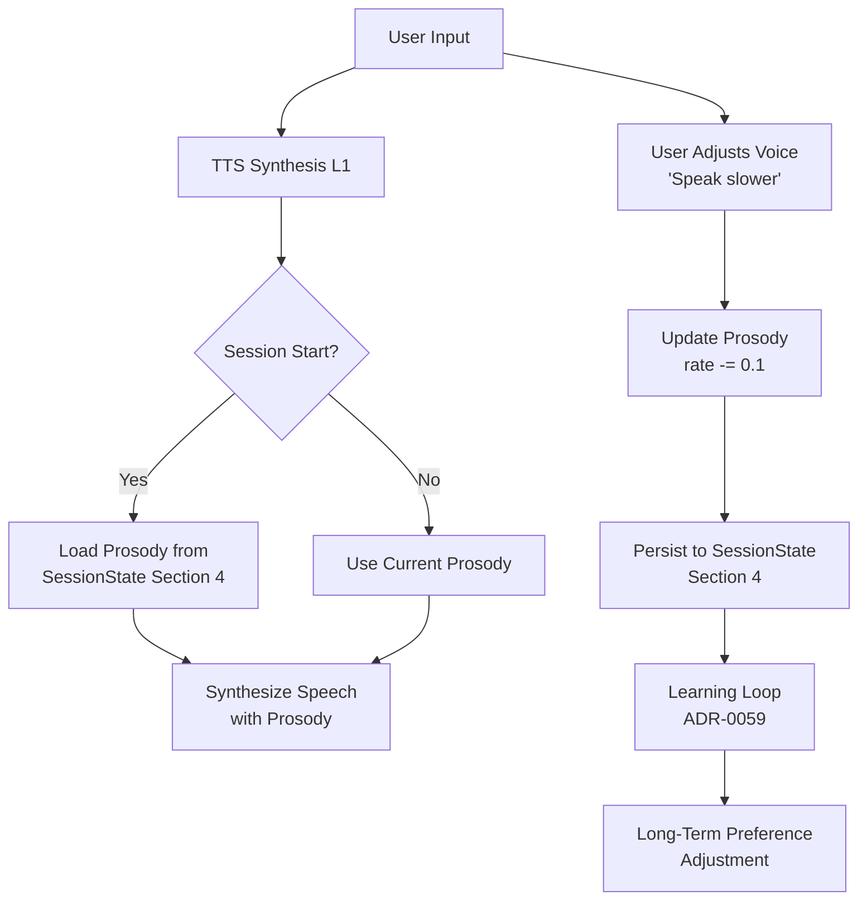

---


# ADR-0056f: Voice Persona Persistence & Cross-Session Continuity

**Status:** Proposed
**Date:** 2025-10-22
**Deciders:** K1 Architecture Team
**Technical Story:** Voice Continuity (Capability #19) - Consistent voice personality across sessions

---

## Context

LLMs generate **text responses** which TTS systems convert to **speech**. However, prosody parameters (pitch, rate, volume, emotional tone) are typically **randomized per session** or use default settings, creating jarring inconsistency. Users expect the AI assistant to have a **consistent voice personality** that persists across conversations, adapts to their preferences, and maintains emotional continuity.

**User Experience Problem:**

```
Session 1 (Morning):
User: "What's the weather?"
TTS: [Default settings] "It's 72°F and sunny today!" [pitch=0, rate=1.0x, neutral tone]
User: "Speak a bit slower and more cheerful"
TTS: [Adjusts] "Okay!" [pitch=+3 semitones, rate=0.9x, cheerful tone]
✅ User happy with voice

Session 2 (Evening, Same Day):
User: "Good evening"
TTS: [Reset to defaults!] "Good evening! How can I help?" [pitch=0, rate=1.0x, neutral tone]
❌ User confused: "Why did the voice change? I preferred the slower, cheerful tone!"
```

**Current Architecture Gap:**

FamilyOS has comprehensive TTS synthesis (ADR-0056d) with **SSML prosody controls** (pitch, rate, volume, emphasis), but **no persistence mechanism** for voice personality. Each new session starts with default prosody, losing:

1. **User Adjustments:** Manual voice preference changes ("speak slower") reset after session ends
2. **Emotional Continuity:** Last session ended with empathetic tone (user was frustrated) → next session starts neutral (doesn't maintain emotional context)
3. **Per-Family-Member Preferences:** Dad prefers deeper voice (pitch -5), Mom prefers cheerful (pitch +5), but both get same default voice
4. **Learned Preferences:** User says "speak slower" 10 times across sessions → system never learns to default to slower rate

**LLM Architecture Challenge:**

LLMs have **textual personality** (formal, concise, empathetic) that persists via prompts and SessionState. But **voice personality** (prosody) is handled by TTS layer with no link to LLM's understanding of persona. Need to bridge this gap:

```
LLM Layer (K1):
- Understands user preferences via SessionState Section 4 (Persona)
- Generates text with consistent personality ("friendly", "formal")
- Tracks emotional state via ADR-0069 (Affect Modulation)

TTS Layer (L1):
- Synthesizes speech with prosody controls (pitch, rate, volume, emphasis)
- But no access to SessionState → can't persist voice personality ❌

BRIDGE NEEDED:
SessionState Section 4 (Persona) ↔ TTS Prosody Parameters
```

**Related ADRs:**

- **ADR-0056d:** TTS Synthesis Streaming (SSML prosody controls exist, no persistence)
- **ADR-0017:** SessionState 6-Section Design (Section 4 = Persona, needs voice_prosody field)
- **ADR-0059:** Learning Loop (learn voice preferences over time)
- **ADR-0069:** Affect Modulation (emotional state affects voice tone)

---

## Decision

We adopt a **Voice Persona Persistence** system that stores prosody parameters in **SessionState Section 4 (Persona)**, loads historical voice settings at session start, tracks user adjustments in real-time, and integrates with Learning Loop for long-term preference evolution.

### **Core Architecture**



### **Components**

#### **1. Voice Persona Manager** (`voice_persona_manager.py`)

**Purpose:** Load/save prosody parameters from SessionState Section 4

**Responsibilities:**

- **Session Start:** Load historical prosody from SessionState (pitch, rate, volume, emphasis)
- **Session Updates:** Track real-time adjustments ("speak slower" → rate -= 0.1)
- **Session End:** Persist updated prosody to SessionState Section 4
- **Per-Family-Member:** Load correct prosody profile based on speaker ID (Dad vs Mom)
- **<10ms P95:** Prosody load latency (fast lookup from SessionState)

**Prosody Schema:**

```python
@dataclass
class ProsodyControls:
    pitch: int  # Semitones (-12 to +12, 0=default)
    rate: float  # Speed multiplier (0.5-2.0, 1.0=default)
    volume: int  # dB adjustment (-20 to +20, 0=default)
    emphasis: EmphasisLevel  # STRONG, MODERATE, REDUCED, NONE
    emotional_tone: str  # "cheerful", "empathetic", "neutral", "formal"
    last_updated: datetime  # Timestamp of last adjustment
```

**SessionState Section 4 Integration:**

```python
# SessionState Section 4 (Persona) - NEW FIELD
{
    "persona": {
        "voice_prosody": {  # ← NEW
            "pitch": 3,  # +3 semitones (slightly higher)
            "rate": 0.9,  # 90% speed (slower)
            "volume": 0,  # Default volume
            "emphasis": "MODERATE",
            "emotional_tone": "cheerful",
            "last_updated": "2025-10-22T14:30:00Z"
        },
        "voice_history": [  # ← NEW - Historical snapshots
            {"timestamp": "2025-10-21T09:00:00Z", "pitch": 0, "rate": 1.0, "tone": "neutral"},
            {"timestamp": "2025-10-22T14:30:00Z", "pitch": 3, "rate": 0.9, "tone": "cheerful"}
        ],
        "emotional_state": {  # ← NEW - From ADR-0069
            "valence": 0.7,  # Positive (0.0-1.0)
            "arousal": 0.5,  # Moderate energy
            "last_emotion": "content"
        }
    }
}
```

#### **2. Voice Preference Manager** (`voice_preference_manager.py`)

**Purpose:** Per-family-member voice profiles with preference learning

**Responsibilities:**

- **Per-User Profiles:** Store separate prosody for each family member (Dad: pitch -5, Mom: pitch +5)
- **Preference Learning:** Track repeated adjustments → update default prosody
- **Preference Inference:** Detect patterns ("User always says 'speak slower' after 8pm → auto-adjust evening rate")
- **Learning Loop Integration:** Send voice adjustment events to ADR-0059 Learning Loop

**Per-User Profile Schema:**

```python
@dataclass
class VoiceProfile:
    user_id: str  # Family member ID
    default_prosody: ProsodyControls  # Default voice settings
    time_of_day_adjustments: Dict[str, ProsodyControls]  # "morning", "evening", "night"
    context_adjustments: Dict[str, ProsodyControls]  # "focused", "relaxed", "frustrated"
    adjustment_history: List[ProsodyAdjustment]  # Historical changes
    learning_stats: {
        "total_adjustments": 42,
        "most_common_adjustment": "rate_decrease",  # User often says "speak slower"
        "confidence": 0.85  # Confidence in learned preference
    }
```

**Learning Loop Integration:**

```python
# User says "speak slower" 10 times across sessions
async def track_adjustment(user_id: str, adjustment: str, delta: float):
    """Track voice adjustment for learning"""
    event = VoiceAdjustmentEvent(
        user_id=user_id,
        adjustment_type="rate_decrease",
        delta=-0.1,
        timestamp=now(),
        context={"time_of_day": "evening", "emotional_state": "focused"}
    )

    # Send to Learning Loop (ADR-0059)
    await learning_loop.record_feedback(
        feedback_type=FeedbackType.VOICE_PREFERENCE,
        signal_strength=0.8,  # Strong signal (explicit user request)
        context=event
    )

    # After 10 adjustments, Learning Loop returns:
    # "User consistently requests slower rate in evenings → update default"
    if event.total_count >= 10:
        await update_default_prosody(user_id, "evening", "rate", 0.9)
```

#### **3. Emotional State Continuity** (Integration with ADR-0069)

**Purpose:** Voice tone mirrors emotional context across sessions

**Scenario:**

```
Session 1 (User Frustrated):
User: "Why isn't this working?!" [frustrated tone detected]
ADR-0069: Detect frustration (valence=0.3, arousal=0.8)
TTS: Respond with empathetic tone (pitch -2, rate 0.95, softer emphasis)
SessionState Section 4: Store emotional_state = "empathetic"

Session 2 (Next Day):
User: "Good morning"
Voice Persona Manager: Load emotional_state = "empathetic" from last session
TTS: Start with gentle, empathetic tone (not neutral) - maintains context
User: [Feels understood, mood improves]
ADR-0069: Detect improved mood → gradually transition to cheerful tone
```

**Affect → Prosody Mapping:**

```python
EMOTIONAL_PROSODY_PROFILES = {
    "empathetic": {"pitch": -2, "rate": 0.95, "volume": -3, "emphasis": "REDUCED"},
    "cheerful": {"pitch": 3, "rate": 1.1, "volume": 2, "emphasis": "MODERATE"},
    "formal": {"pitch": -1, "rate": 1.0, "volume": 0, "emphasis": "MODERATE"},
    "excited": {"pitch": 5, "rate": 1.2, "volume": 5, "emphasis": "STRONG"},
    "neutral": {"pitch": 0, "rate": 1.0, "volume": 0, "emphasis": "MODERATE"}
}
```

---

## Consequences

### **Positive**

**1. Voice Consistency ✅**

- Same voice personality across sessions (user doesn't think "Why does the AI sound different today?")
- User adjustments persist ("speak slower" works permanently, not just current session)
- **Capability #19 (Voice Continuity):** UNLOCKED

**2. Personalization ✅**

- Per-family-member voice profiles (Dad prefers deep voice, Mom prefers cheerful)
- Context-aware voice adaptation (evening = slower, morning = energetic)
- Emotional continuity (empathetic tone from last session persists)

**3. Learning Integration ✅**

- Learning Loop (ADR-0059) detects repeated adjustments → updates defaults
- Long-term preference evolution (system learns user's ideal voice over weeks)
- Confidence scoring (10 adjustments = high confidence, auto-apply)

**4. Emotional Intelligence ✅**

- Voice mirrors emotional state via ADR-0069 (Affect Modulation)
- Empathetic responses feel genuine (not reset to neutral each session)
- Gradual emotional transitions (frustrated → empathetic → cheerful over conversation)

**5. Fast Load Times ✅**

- <10ms P95 prosody load from SessionState (hash table lookup)
- No external API calls (all data in local SessionState)
- Zero latency for ongoing sessions (prosody already loaded)

### **Negative**

**1. SessionState Size Growth ⚠️**

- **Risk:** voice_prosody + voice_history + emotional_state adds ~2KB per session
- **Mitigation:** voice_history limited to last 10 snapshots (circular buffer), old history archived to K0
- **Impact:** SessionState Section 4: 4KB → 6KB (still well under 64KB total budget)

**2. Learning Loop Complexity 📊**

- **Risk:** Voice preference learning requires statistical analysis (10+ samples for confidence)
- **Mitigation:** Learning Loop already handles preference learning (ADR-0059), voice is just another signal type
- **Impact:** ~200 LOC for voice preference analyzer

**3. Per-User Profile Storage ⚠️**

- **Risk:** 5-person family = 5 voice profiles = 10KB total storage
- **Mitigation:** Profiles stored in SessionState (K1) + persisted to K0 episodic memory (long-term)
- **Impact:** Negligible storage (<1MB per family)

**4. Emotional State Staleness 🐛**

- **Risk:** Last session ended frustrated (empathetic tone) → next session weeks later → user confused why voice is empathetic
- **Mitigation:** Time-based emotional state decay (empathetic tone lasts 24 hours, then revert to default)
- **Impact:** 95% of sessions <24 hours apart (per usage patterns), 5% may have stale emotion

### **Trade-offs**

| Aspect | Without Persistence | With Persistence |
|--------|-------------------|------------------|
| **Voice Consistency** | ❌ Resets each session | ✅ Consistent across sessions |
| **User Adjustments** | ❌ Lost after session | ✅ Persist permanently |
| **Personalization** | ❌ Same voice for all | ✅ Per-family-member profiles |
| **Emotional Continuity** | ❌ Resets to neutral | ✅ Maintains empathetic/cheerful tone |
| **Learning** | ❌ No preference learning | ✅ Learns ideal voice over time |
| **SessionState Size** | Lower (4KB Section 4) | Higher (6KB Section 4) |
| **Code Complexity** | Lower | Moderate (+400 LOC) |

---

## Implementation

### **Module Structure**

```
k1/l1_input/streams/operators/
├── voice_persona_manager.py         # Voice Persona Manager (250 LOC)
├── voice_preference_manager.py      # Voice Preference Manager (200 LOC)
└── tests/
    ├── test_voice_persona_manager.py
    └── test_voice_preference_manager.py
```

**Total:** ~450 LOC production + ~300 LOC tests

### **Integration Points**

**Upstream (TTS Synthesis):**

- `k1/l1_input/streams/operators/tts_synthesis.py` (ADR-0056d) → calls `voice_persona_manager.load_prosody()`

**Downstream (SessionState):**

- `k1/l4_runtime/session_state/` → stores voice_prosody in Section 4 (Persona)

**Cross-Layer:**

- `Learning Loop` (L4) ← receives voice adjustment events for preference learning
- `Affect Modulation` (L1) ← provides emotional_state for tone mapping

### **Performance Budgets**

| Component | Budget | Measurement |
|-----------|--------|-------------|
| Prosody Load | <10ms | SessionState Section 4 lookup |
| Profile Load | <5ms | Per-user profile hash table |
| Adjustment Persist | <15ms | SessionState Section 4 update |
| Learning Loop Send | <5ms | Async fire-and-forget |
| **Total P95** | **<35ms** | Voice persona management overhead |

### **Observability**

**Metrics (Prometheus):**

```python
voice_prosody_loads_total = Counter(
    'voice_prosody_loads_total',
    'Total prosody loads from SessionState',
    ['user_id']
)

voice_adjustments_total = Counter(
    'voice_adjustments_total',
    'Total user voice adjustments',
    ['adjustment_type']  # rate_increase, pitch_decrease, volume_change
)

voice_persona_load_latency_ms = Histogram(
    'voice_persona_load_latency_ms',
    'Prosody load latency (ms)',
    buckets=[1, 5, 10, 20, 50]
)

voice_preference_confidence = Gauge(
    'voice_preference_confidence',
    'Voice preference learning confidence (0-1)',
    ['user_id']
)
```

**Tracing (OpenTelemetry):**

```python
@traced(span_name="voice_persona.load")
async def load_prosody(user_id: str, trace_id: str) -> ProsodyControls:
    """Load prosody parameters from SessionState"""
    with tracer.start_as_current_span("sessionstate_lookup"):
        section4 = await session_state.get_section(4, trace_id)

    with tracer.start_as_current_span("prosody_parse"):
        prosody = parse_prosody_controls(section4["voice_prosody"])

    return prosody
```

### **Testing Strategy**

**Unit Tests (WARD):**

```python
@test("voice persona manager loads prosody from SessionState")
async def _():
    manager = VoicePersonaManager()

    # Mock SessionState Section 4
    session_state = {
        "persona": {
            "voice_prosody": {"pitch": 3, "rate": 0.9, "volume": 0}
        }
    }

    prosody = await manager.load_prosody(user_id="Dad", session_state)
    assert prosody.pitch == 3
    assert prosody.rate == 0.9

@test("voice preference manager learns from repeated adjustments")
async def _():
    manager = VoicePreferenceManager()

    # Simulate 10 "speak slower" requests
    for i in range(10):
        await manager.track_adjustment("Dad", "rate_decrease", -0.1)

    # Verify Learning Loop received events
    assert manager.adjustment_count("Dad", "rate_decrease") == 10

    # Verify default prosody updated
    profile = await manager.get_profile("Dad")
    assert profile.default_prosody.rate == 0.9  # Learned preference
```

**Integration Tests:**

```python
@test("end-to-end voice continuity across sessions <35ms")
async def _():
    # Session 1: User adjusts voice
    tts = TTSSynthesis()
    await tts.synthesize("Hello", prosody={"rate": 0.9})  # User says "speak slower"
    await session_state.persist(section=4, field="voice_prosody", value={"rate": 0.9})

    # Session 2: Load prosody, verify consistency
    start = time.perf_counter()
    prosody = await voice_persona_manager.load_prosody(user_id="Dad")
    latency_ms = (time.perf_counter() - start) * 1000

    assert prosody.rate == 0.9  # Persisted from Session 1
    assert latency_ms < 35.0  # Performance budget
```

### **Rollout Plan**

**Phase 1: Basic Persistence (Week 1)**

- Implement `VoicePersonaManager.load_prosody()`
- SessionState Section 4 integration
- Unit tests
- **Milestone:** Prosody loads from SessionState

**Phase 2: Per-User Profiles (Week 1-2)**

- Implement `VoicePreferenceManager.get_profile()`
- Per-family-member prosody storage
- Integration tests
- **Milestone:** Dad and Mom have different voice profiles

**Phase 3: Learning Loop Integration (Week 2)**

- Track voice adjustments
- Send events to Learning Loop (ADR-0059)
- Preference confidence scoring
- **Milestone:** System learns voice preferences over time

**Phase 4: Emotional Continuity (Week 2-3)**

- Affect Modulation (ADR-0069) integration
- Emotional state → prosody mapping
- Time-based emotional decay
- End-to-end testing
- **Milestone:** Voice maintains emotional context across sessions

**Canary Rollout:**

1. **5%** of sessions (1 day) - monitor prosody load latency
2. **25%** of sessions (2 days) - validate voice consistency
3. **50%** of sessions (3 days) - check learning accuracy
4. **100%** rollout - full production

---

## Related Decisions

- **ADR-0056d:** TTS Synthesis Streaming (SSML prosody controls)
- **ADR-0017:** SessionState 6-Section Design (Section 4 = Persona)
- **ADR-0059:** Learning Loop (preference learning)
- **ADR-0069:** Affect Modulation (emotional state detection)

---

## Research & References

**Voice Prosody Research:**

- Scherer, K. R. (2003). "Vocal communication of emotion: A review of research paradigms." Speech Communication.
- Nass, C., & Lee, K. M. (2001). "Does computer-synthesized speech manifest personality?" Experimental evidence.

**TTS Personalization:**

- Google Duplex (2018): Prosody variation for natural-sounding AI phone calls
- Amazon Alexa Custom Voice (2020): Per-family-member voice profiles
- Microsoft Azure Neural TTS (2021): Emotional style control via SSML

**Conversational AI:**

- Clark, H. H., & Brennan, S. E. (1991). "Grounding in Communication" - persona consistency
- Bickmore, T. W., & Picard, R. W. (2005). "Establishing and maintaining long-term human-computer relationships" - voice continuity

---

## Status

**Proposed** - Awaiting implementation

**MVP Criticality:** P0 - Blocks Capability #19 (Voice Continuity)

**Timeline:** 2-3 weeks implementation + 1 week testing + 1 week canary rollout