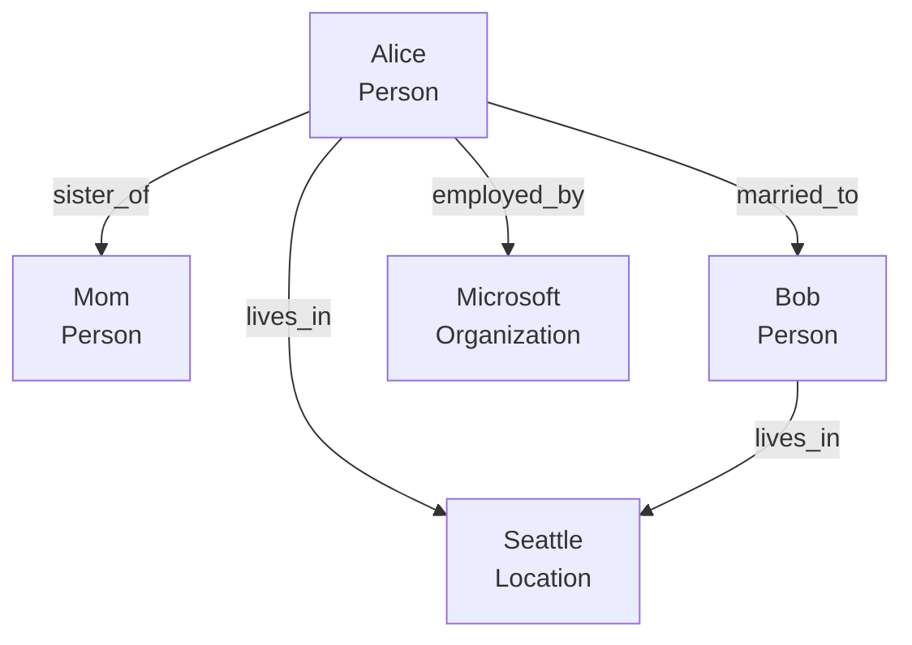

# ADR-0081d: Knowledge Graph Visualization & Debugging Tools

**Status:** Proposed
**Date:** 2025-10-22
**Parent ADR:** ADR-0081 (K0 Knowledge Graph Architecture)
**Implements:** Visualization and debugging tools for K0 Knowledge Graph

## Context

From **ADR-0081**, developers need **visualization and debugging tools** to:

1. **Inspect Graph Structure:** View entities, relationships, and subgraphs
2. **Debug Entity Resolution:** Understand why entities were linked or not linked
3. **Track Relationship Evolution:** See how relationships changed over time
4. **Export for Analysis:** Export graph to external tools (Gephi, Cytoscape, Neo4j)

**From K0 Architecture Diagrams:**

- **D4 (project_architecture_part4.mmd):** `KG_VISUALIZATION` for graph visualization, `KG_DEBUG_UI` for debugging
- **Missing:** Export formats, debugging UI, metrics dashboard

**Key Requirements:**

- **Mermaid Export:** Generate Mermaid diagrams for documentation
- **GraphML Export:** Export to GraphML for external graph tools
- **Debugging UI:** Web-based UI for development environment (not production)
- **Metrics Dashboard:** Track KG health (node count, edge count, query latency)

## Decision

Implement **k0/kg/visualization.py** with 3 export formats + debugging UI:

### 1. Mermaid Export (Documentation)

**Generate Mermaid diagrams** for architectural documentation and debugging.

```python
# k0/kg/visualization.py
from typing import List, Optional, Dict
from k0.drivers.sqlite_kg import SQLiteKGDriver
from k0.query.kg_temporal import get_entity, get_subgraph

async def export_to_mermaid(
    entity_id: str,
    depth: int = 2,
    rel_types: Optional[List[str]] = None,
    kg_driver: SQLiteKGDriver
) -> str:
    """Export subgraph to Mermaid diagram.

    Args:
        entity_id: Starting node ID
        depth: Depth of traversal (1 = immediate neighbors, 2 = extended family)
        rel_types: Filter by relationship types (None = all types)
        kg_driver: K0::st_kg driver

    Returns:
        Mermaid diagram string

    Performance: <200ms P95 (100 entities, 200 edges)

    Example:
        # Export Alice's family graph
        mermaid = await export_to_mermaid(
            "node-alice",
            depth=2,
            rel_types=["parent", "child", "sibling", "spouse"]
        )
        print(mermaid)
        # Output:
        # graph TD
        #     Alice[Alice<br/>Person]
        #     Mom[Mom<br/>Person]
        #     Bob[Bob<br/>Person]
        #     Alice -->|sister_of| Mom
        #     Alice -->|married_to| Bob
    """
    # Get subgraph
    entity = await get_entity(entity_id, include_relationships=True, max_relationship_depth=depth)

    # Build Mermaid diagram
    mermaid = "graph TD\n"

    # Add nodes
    visited_nodes = set()
    queue = [(entity, 0)]

    while queue:
        current_entity, current_depth = queue.pop(0)

        if current_entity.node_id in visited_nodes:
            continue
        visited_nodes.add(current_entity.node_id)

        # Add node
        node_id = _sanitize_id(current_entity.label)
        mermaid += f"    {node_id}[\"{current_entity.label}<br/>{current_entity.entity_type}\"]\n"

        # Add edges and neighbors
        if current_depth < depth:
            for rel in current_entity.relationships:
                # Filter by rel_types
                if rel_types and rel.rel_type not in rel_types:
                    continue

                # Add edge
                target_id = _sanitize_id(rel.target_label)
                mermaid += f"    {node_id} -->|{rel.rel_type}| {target_id}\n"

                # Add target to queue
                target_entity = await get_entity(rel.target_id)
                if target_entity:
                    queue.append((target_entity, current_depth + 1))

    return mermaid

def _sanitize_id(label: str) -> str:
    """Sanitize label for Mermaid node ID (remove spaces, special chars)."""
    return label.replace(" ", "_").replace(".", "").replace("-", "_")
```

**Mermaid Diagram Example:**



**Advanced Mermaid Features:**

```python
async def export_to_mermaid_advanced(
    entity_ids: List[str],
    kg_driver: SQLiteKGDriver,
    include_temporal: bool = True,
    include_confidence: bool = True
) -> str:
    """Export subgraph to Mermaid with temporal and confidence annotations.

    Example:
        graph TD
            Alice["Alice<br/>Person"]
            Bob["Bob<br/>Person"]
            Microsoft["Microsoft<br/>Organization"]
            Google["Google<br/>Organization"]

            Alice -->|married_to<br/>2020-06-15| Bob
            Alice -->|employed_by<br/>2018-2023<br/>conf: 0.95| Microsoft
            Alice -->|employed_by<br/>2023-present<br/>conf: 1.0| Google
    """
    subgraph = await get_subgraph(entity_ids, include_edges=True)

    mermaid = "graph TD\n"

    # Add nodes
    for node in subgraph["nodes"]:
        node_id = _sanitize_id(node["label"])
        mermaid += f"    {node_id}[\"{node['label']}<br/>{node['entity_type']}\"]\n"

    # Add edges with annotations
    for edge in subgraph["edges"]:
        source_id = _sanitize_id(edge["source_label"])
        target_id = _sanitize_id(edge["target_label"])

        # Build edge label
        label_parts = [edge["rel_type"]]

        if include_temporal:
            if edge["valid_from"]:
                date_from = _format_timestamp(edge["valid_from"])
                date_to = _format_timestamp(edge["valid_to"]) if edge["valid_to"] else "present"
                label_parts.append(f"{date_from}-{date_to}")

        if include_confidence:
            label_parts.append(f"conf: {edge['confidence']:.2f}")

        label = "<br/>".join(label_parts)
        mermaid += f"    {source_id} -->|{label}| {target_id}\n"

    return mermaid

def _format_timestamp(timestamp_ms: int) -> str:
    """Format Unix timestamp (ms) to readable date."""
    import datetime
    dt = datetime.datetime.fromtimestamp(timestamp_ms / 1000)
    return dt.strftime("%Y-%m-%d")
```

### 2. GraphML Export (External Tools)

**Export to GraphML** for analysis in Gephi, Cytoscape, Neo4j, etc.

```python
async def export_to_graphml(
    entity_ids: List[str],
    kg_driver: SQLiteKGDriver,
    include_properties: bool = True
) -> str:
    """Export subgraph to GraphML format.

    Args:
        entity_ids: List of node IDs to include
        kg_driver: K0::st_kg driver
        include_properties: Include node/edge properties in GraphML

    Returns:
        GraphML XML string

    Performance: <500ms P95 (1000 entities, 5000 edges)

    GraphML Features:
    - Node attributes (entity_type, label, properties)
    - Edge attributes (rel_type, valid_from, valid_to, confidence)
    - Compatible with Gephi, Cytoscape, Neo4j, yEd

    Example:
        graphml = await export_to_graphml(
            ["node-alice", "node-bob", "node-mom"],
            kg_driver,
            include_properties=True
        )
        with open("family_graph.graphml", "w") as f:
            f.write(graphml)
    """
    subgraph = await get_subgraph(entity_ids, include_edges=True)

    # Build GraphML XML
    graphml = '<?xml version="1.0" encoding="UTF-8"?>\n'
    graphml += '<graphml xmlns="http://graphml.graphdrawing.org/xmlns"\n'
    graphml += '         xmlns:xsi="http://www.w3.org/2001/XMLSchema-instance"\n'
    graphml += '         xsi:schemaLocation="http://graphml.graphdrawing.org/xmlns\n'
    graphml += '         http://graphml.graphdrawing.org/xmlns/1.0/graphml.xsd">\n'

    # Define attributes (keys)
    graphml += '  <key id="entity_type" for="node" attr.name="entity_type" attr.type="string"/>\n'
    graphml += '  <key id="label" for="node" attr.name="label" attr.type="string"/>\n'
    graphml += '  <key id="rel_type" for="edge" attr.name="rel_type" attr.type="string"/>\n'
    graphml += '  <key id="confidence" for="edge" attr.name="confidence" attr.type="double"/>\n'
    graphml += '  <key id="valid_from" for="edge" attr.name="valid_from" attr.type="long"/>\n'
    graphml += '  <key id="valid_to" for="edge" attr.name="valid_to" attr.type="long"/>\n'

    if include_properties:
        graphml += '  <key id="properties" for="node" attr.name="properties" attr.type="string"/>\n'

    # Start graph
    graphml += '  <graph id="K0KnowledgeGraph" edgedefault="directed">\n'

    # Add nodes
    for node in subgraph["nodes"]:
        graphml += f'    <node id="{node["node_id"]}">\n'
        graphml += f'      <data key="entity_type">{node["entity_type"]}</data>\n'
        graphml += f'      <data key="label">{_escape_xml(node["label"])}</data>\n'

        if include_properties:
            import json
            props_json = json.dumps(node["properties"])
            graphml += f'      <data key="properties">{_escape_xml(props_json)}</data>\n'

        graphml += '    </node>\n'

    # Add edges
    for edge in subgraph["edges"]:
        graphml += f'    <edge id="{edge["edge_id"]}" source="{edge["source_id"]}" target="{edge["target_id"]}">\n'
        graphml += f'      <data key="rel_type">{edge["rel_type"]}</data>\n'
        graphml += f'      <data key="confidence">{edge["confidence"]}</data>\n'

        if edge["valid_from"]:
            graphml += f'      <data key="valid_from">{edge["valid_from"]}</data>\n'
        if edge["valid_to"]:
            graphml += f'      <data key="valid_to">{edge["valid_to"]}</data>\n'

        graphml += '    </edge>\n'

    # Close graph and graphml
    graphml += '  </graph>\n'
    graphml += '</graphml>\n'

    return graphml

def _escape_xml(text: str) -> str:
    """Escape XML special characters."""
    return (text
        .replace("&", "&amp;")
        .replace("<", "&lt;")
        .replace(">", "&gt;")
        .replace('"', "&quot;")
        .replace("'", "&apos;"))
```

**Import into Gephi:**

```bash
# After exporting GraphML
1. Open Gephi
2. File → Open → Select family_graph.graphml
3. Layout → ForceAtlas 2 (for automatic graph layout)
4. Analyze → Network Diameter (for graph analysis)
5. Visualize → Node color by entity_type
6. Export → PNG/PDF for presentations
```

### 3. JSON Export (Programmatic Access)

**Export to JSON** for programmatic access and testing.

```python
async def export_to_json(
    entity_ids: List[str],
    kg_driver: SQLiteKGDriver
) -> Dict:
    """Export subgraph to JSON format.

    Returns:
        Dict with "nodes" and "edges" keys

    Example:
        {
          "nodes": [
            {
              "node_id": "node-alice",
              "entity_type": "Person",
              "label": "Alice",
              "properties": {"age": 30, "diet": "vegetarian"}
            }
          ],
          "edges": [
            {
              "edge_id": "edge-001",
              "source_id": "node-alice",
              "target_id": "node-bob",
              "rel_type": "married_to",
              "valid_from": 1592179200000,
              "valid_to": null,
              "confidence": 1.0
            }
          ]
        }
    """
    return await get_subgraph(entity_ids, include_edges=True)
```

### 4. Debugging UI (Development Only)

**Web-based debugging UI** for development environment.

```python
# k0/kg/debug_ui.py
from fastapi import FastAPI
from fastapi.staticfiles import StaticFiles
from k0.drivers.sqlite_kg import SQLiteKGDriver
from k0.query.kg_temporal import get_entity, find_path

app = FastAPI(title="K0 Knowledge Graph Debug UI")

@app.get("/api/entity/{entity_id}")
async def get_entity_api(entity_id: str):
    """Get entity by ID with relationships."""
    entity = await get_entity(entity_id, include_relationships=True)
    return entity

@app.get("/api/path/{source_id}/{target_id}")
async def find_path_api(source_id: str, target_id: str, max_depth: int = 6):
    """Find shortest path between entities."""
    paths = await find_path(source_id, target_id, max_depth)
    return {"paths": paths}

@app.get("/api/graph/mermaid/{entity_id}")
async def export_mermaid_api(entity_id: str, depth: int = 2):
    """Export subgraph to Mermaid diagram."""
    from k0.kg.visualization import export_to_mermaid
    mermaid = await export_to_mermaid(entity_id, depth)
    return {"mermaid": mermaid}

@app.get("/api/graph/graphml")
async def export_graphml_api(entity_ids: str):
    """Export subgraph to GraphML (comma-separated entity IDs)."""
    from k0.kg.visualization import export_to_graphml
    ids = entity_ids.split(",")
    graphml = await export_to_graphml(ids)
    return {"graphml": graphml}

# Serve static files (HTML/CSS/JS for UI)
app.mount("/", StaticFiles(directory="k0/kg/debug_ui/static", html=True), name="static")

def launch_debug_ui(kg_driver: SQLiteKGDriver, port: int = 8765):
    """Launch debugging UI (development only).

    Example:
        from k0.kg.debug_ui import launch_debug_ui
        launch_debug_ui(kg_driver, port=8765)
        # Open browser: http://localhost:8765
    """
    import uvicorn
    uvicorn.run(app, host="0.0.0.0", port=port)
```

**Debugging UI Features:**

1. **Entity Browser:** Search and browse entities by type/label
2. **Relationship Viewer:** View entity's relationships in table/graph
3. **Path Finder:** Find shortest path between two entities
4. **Timeline Viewer:** View entity's relationship timeline
5. **Graph Visualizer:** D3.js force-directed graph visualization
6. **Export Tools:** Export subgraph to Mermaid/GraphML/JSON

**Screenshot (Conceptual):**

```
╔═══════════════════════════════════════════════════════════════╗
â•‘  K0 Knowledge Graph Debug UI                                  â•‘
╠═══════════════════════════════════════════════════════════════╣
â•‘  Search: [Alice________________]  [Search] [Clear]            â•‘
╠═══════════════════════════════════════════════════════════════╣
â•‘  Entity: Alice (Person)                                       â•‘
║  ┌───────────────────────────────────────────────────────┐   ║
║  │  Properties:                                           │   ║
║  │  - age: 30                                             │   ║
║  │  - diet: vegetarian                                    │   ║
║  │  - city: Seattle                                       │   ║
║  └───────────────────────────────────────────────────────┘   ║
â•‘                                                                â•‘
â•‘  Relationships:                                                â•‘
║  ┌───────────────────────────────────────────────────────┐   ║
║  │  sister_of → Mom (conf: 1.0)                          │   ║
║  │  married_to → Bob (since 2020-06-15, conf: 1.0)       │   ║
║  │  employed_by → Microsoft (2018-2023, conf: 0.95)      │   ║
║  │  employed_by → Google (2023-present, conf: 1.0)       │   ║
║  │  lives_in → Seattle (since 2018, conf: 0.9)           │   ║
║  └───────────────────────────────────────────────────────┘   ║
â•‘                                                                â•‘
â•‘  [Export Mermaid] [Export GraphML] [View Timeline]            â•‘
╚═══════════════════════════════════════════════════════════════╝
```

### 5. Metrics Dashboard

**Track KG health** and query performance.

```python
# k0/kg/metrics.py
from prometheus_client import Counter, Histogram, Gauge

# Entity metrics
kg_nodes_total = Gauge(
    'kg_nodes_total',
    'Total number of KG nodes',
    ['entity_type']
)

kg_edges_total = Gauge(
    'kg_edges_total',
    'Total number of KG edges',
    ['rel_type']
)

# Query metrics
kg_query_latency_ms = Histogram(
    'kg_query_latency_ms',
    'KG query latency in milliseconds',
    ['query_type'],
    buckets=[10, 30, 50, 100, 200, 500, 1000]
)

kg_query_total = Counter(
    'kg_query_total',
    'Total KG queries',
    ['query_type', 'status']
)

# Consolidation metrics
kg_consolidation_latency_ms = Histogram(
    'kg_consolidation_latency_ms',
    'KG consolidation latency in milliseconds',
    buckets=[100, 200, 500, 1000, 2000]
)

kg_entities_created_total = Counter(
    'kg_entities_created_total',
    'Total entities created from consolidation'
)

kg_relationships_created_total = Counter(
    'kg_relationships_created_total',
    'Total relationships created from consolidation'
)

kg_entity_resolution_confidence = Histogram(
    'kg_entity_resolution_confidence',
    'Entity resolution confidence',
    buckets=[0.5, 0.6, 0.7, 0.8, 0.9, 0.95, 1.0]
)

async def update_kg_metrics(kg_driver: SQLiteKGDriver):
    """Update KG metrics (run periodically)."""

    # Count nodes by type
    for entity_type in ["Person", "Location", "Event", "Organization", "Thing"]:
        count = await kg_driver.count_nodes(entity_type=entity_type)
        kg_nodes_total.labels(entity_type=entity_type).set(count)

    # Count edges by rel_type
    rel_types = ["parent", "child", "sibling", "spouse", "employed_by", "lives_in", "friend"]
    for rel_type in rel_types:
        count = await kg_driver.count_edges(rel_type=rel_type)
        kg_edges_total.labels(rel_type=rel_type).set(count)
```

**Grafana Dashboard (Conceptual):**

```
┌─────────────────────────────────────────────────────────────┐
│  K0 Knowledge Graph Metrics                                 │
├─────────────────────────────────────────────────────────────┤
│  Nodes: 1,234  |  Edges: 4,567  |  Queries/min: 45          │
├─────────────────────────────────────────────────────────────┤
│  Node Distribution                                          │
│  ┌──────────────────────────────────────────────────────┐  │
│  │  Person:        523 (42%)                            │  │
│  │  Location:      312 (25%)                            │  │
│  │  Organization:  189 (15%)                            │  │
│  │  Event:         145 (12%)                            │  │
│  │  Thing:          65 (5%)                             │  │
│  └──────────────────────────────────────────────────────┘  │
├─────────────────────────────────────────────────────────────┤
│  Query Latency (P95)                                        │
│  ┌──────────────────────────────────────────────────────┐  │
│  │  Entity Lookup:        8ms  (target: 10ms)  ✅       │  │
│  │  Relationship Query:  45ms  (target: 50ms)  ✅       │  │
│  │  Shortest Path:       92ms  (target: 100ms) ✅       │  │
│  │  Consolidation:      420ms  (target: 500ms) ✅       │  │
│  └──────────────────────────────────────────────────────┘  │
└─────────────────────────────────────────────────────────────┘
```

## Consequences

### Positive

1. **✅ Visual Debugging:** Mermaid diagrams for quick visualization
2. **✅ External Tool Integration:** GraphML export for advanced analysis (Gephi, Cytoscape)
3. **✅ Development UI:** Web-based UI for debugging and testing
4. **✅ Metrics Monitoring:** Prometheus metrics for production monitoring
5. **✅ Documentation:** Mermaid diagrams for architecture documentation

### Negative

1. **❌ Export Performance:** Large graphs (10000+ edges) may be slow to export
2. **❌ UI Complexity:** Debugging UI requires maintenance and security
3. **❌ Metrics Overhead:** Collecting metrics adds latency (~5ms per query)

### Mitigations

1. **Export Performance:** Limit export size (max 1000 entities) or use pagination
2. **UI Complexity:** Disable debugging UI in production (development only)
3. **Metrics Overhead:** Sample metrics (10% of queries) instead of 100%

## Implementation Notes

### Dependencies

```python
# requirements.txt (for debugging UI)
fastapi>=0.104.0
uvicorn>=0.24.0
prometheus-client>=0.19.0
```

### Static Files for Debug UI

```
k0/kg/debug_ui/static/
├── index.html         # Main UI
├── styles.css         # Styling
├── app.js             # JavaScript (D3.js for graph visualization)
└── d3.v7.min.js       # D3.js library
```

### Testing Strategy

```python
# tests/k0/kg/test_visualization.py
import ward
from k0.kg.visualization import export_to_mermaid, export_to_graphml

async def test_export_mermaid():
    kg_driver = SQLiteKGDriver(":memory:")
    # Setup: Insert test entities
    # ...

    mermaid = await export_to_mermaid("node-alice", depth=2, kg_driver=kg_driver)

    assert "graph TD" in mermaid
    assert "Alice" in mermaid
    assert "sister_of" in mermaid

async def test_export_graphml():
    kg_driver = SQLiteKGDriver(":memory:")
    # Setup: Insert test entities
    # ...

    graphml = await export_to_graphml(["node-alice", "node-bob"], kg_driver)

    assert '<?xml version="1.0"' in graphml
    assert '<graph id="K0KnowledgeGraph"' in graphml
    assert '<node id="node-alice"' in graphml
```

## Usage Examples

### Export for Documentation

```python
# Export family graph to Mermaid for ADR documentation
from k0.kg.visualization import export_to_mermaid

mermaid = await export_to_mermaid(
    "node-user",
    depth=2,
    rel_types=["parent", "child", "sibling", "spouse"]
)

# Save to file
with open("docs/architecture/diagrams/family_graph.mmd", "w") as f:
    f.write(mermaid)
```

### Export for External Analysis

```python
# Export full graph to GraphML for Gephi analysis
from k0.kg.visualization import export_to_graphml
from k0.query.kg_temporal import find_entities

# Get all entities
all_entities = await find_entities(limit=10000)
entity_ids = [e.node_id for e in all_entities]

# Export to GraphML
graphml = await export_to_graphml(entity_ids)

# Save to file
with open("family_graph.graphml", "w") as f:
    f.write(graphml)

# Import into Gephi for analysis
print("Import family_graph.graphml into Gephi")
```

### Launch Debug UI (Development)

```python
# Launch debugging UI for development
from k0.kg.debug_ui import launch_debug_ui
from k0.drivers.sqlite_kg import SQLiteKGDriver

kg_driver = SQLiteKGDriver("k0_data.db")
launch_debug_ui(kg_driver, port=8765)

# Open browser: http://localhost:8765
```

## References

**Tools:**
- Mermaid: <https://mermaid.js.org/>
- GraphML: <http://graphml.graphdrawing.org/>
- Gephi: <https://gephi.org/>
- Cytoscape: <https://cytoscape.org/>
- D3.js: <https://d3js.org/>

**Related ADRs:**
- ADR-0081: K0 Knowledge Graph Architecture (parent)
- ADR-0081a: Temporal Graph Schema Design
- ADR-0081b: Query API & Traversal Algorithms
- ADR-0081c: Episodic Memory → KG Integration

**Implementation Files:**
- `k0/kg/visualization.py`: Mermaid, GraphML, JSON export
- `k0/kg/debug_ui.py`: Web-based debugging UI
- `k0/kg/metrics.py`: Prometheus metrics

---

**Status:** Proposed (2025-10-22)
**Next Steps:**
1. Implement Mermaid export
2. Implement GraphML export
3. Implement debugging UI (FastAPI + D3.js)
4. Implement metrics collection
5. Write visualization tests
6. Create Grafana dashboard
