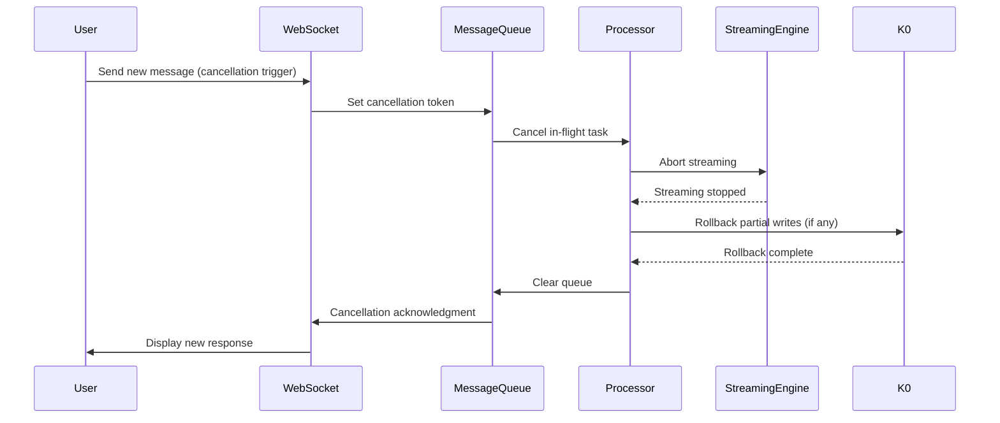

# ADR-0053: Message Queue & Coalescing

**Status:** Accepted
**Date:** 2025-10-14
**Deciders:** K1 Architecture Team
**Technical Story:** [HITL Extensions - Message Queue Architecture]

**Related ADRs:**
- ADR-0015: WebSocket Protocol (ingress point)
- ADR-0039: Backpressure Cascade (load management)
- ADR-0052: HITL Extensions Overview (parent umbrella)
- ADR-0054: Turn Boundary Management (turn detection integration)
- ADR-0057c: Barge-in Preemption & Recovery (cancellation protocol)

**Sub-ADRs:**
- **ADR-0053a**: Coalesce Window & Limits (2s window, 5 message limit)
- **ADR-0053b**: Rate Limits & Bursts (5 msg/sec baseline, 3-message burst)
- **ADR-0053c**: Cancel Path P95 ≤120ms (interruption cancellation)

---

## Context

### Problem Statement

Users interact with conversational AI systems at varying speeds:

1. **Rapid typing**: "What's the" → "weather" → "in Seattle" → "today?" (4 messages in 1.5 seconds)
2. **Voice corrections**: User says "Set timer for 5 minutes... wait, make that 10 minutes" (mid-utterance change)
3. **Context additions**: "Book a flight" → "to New York" → "next Tuesday" → "business class" (progressive refinement)
4. **Interruptions**: User starts new request while agent is still responding to previous one

**Without message queueing and coalescing:**
- ❌ System processes each fragment separately, wasting resources
- ❌ Partial utterances trigger incomplete intent classifications
- ❌ Users experience laggy UX from excessive round-trips
- ❌ Backend overload from message storms (DDoS risk)
- ❌ Cancellation of in-flight responses is undefined

### Current Situation

**Existing Components:**
- ADR-0015 defines WebSocket protocol for bidirectional message streaming
- ADR-0021 defines Intent Classification with confidence thresholds
- ADR-0039 defines Backpressure Cascade for load management
- ADR-0052 defines HITL Extensions framework

**What's Missing:**
- No formal queue architecture for handling rapid user inputs
- No coalescing strategy to combine fragmented messages
- No rate limiting to prevent abuse or accidental DDoS
- No cancellation protocol with latency guarantees

### Research Foundation

**Message Coalescing:**
- **Nagle's Algorithm (TCP, 1984)**: Coalesce small packets to reduce overhead
- **Event Batching (SEDA, 2001)**: Queue events and process in batches for efficiency
- **Input Debouncing (UI patterns)**: Wait for user to stop typing before processing

**Rate Limiting:**
- **Token Bucket Algorithm**: Allow bursts while enforcing average rate
- **Leaky Bucket Algorithm**: Smooth out burst traffic

**Cancellation:**
- **Cooperative Cancellation (Go, Rust)**: Check cancellation token at safe points
- **Structured Concurrency (Java, Python)**: Cancel entire task tree

### Constraints

**Performance:**
- Coalescing latency must not impact user experience (<2s perception threshold)
- Cancellation must complete within 120ms P95 (responsive UX requirement)
- Queue overhead must be <5ms per message

**Safety:**
- Rate limits must prevent DDoS while allowing legitimate bursts
- Cancellation must not corrupt state (no partial writes)
- Message ordering must be preserved within session

**Privacy:**
- Queued messages must respect privacy bands (GREEN/AMBER/RED)
- RED band messages must bypass coalescing (immediate processing)

### Forces

📈 **Benefits of Coalescing:**
- Reduced backend load (fewer LLM calls)
- Better intent classification (complete utterances)
- Improved UX (fewer partial responses)
- Lower latency (batch processing)

📉 **Risks of Coalescing:**
- Delayed processing (must wait for coalesce window)
- Complexity in turn boundary detection
- Risk of over-buffering (memory pressure)

📈 **Benefits of Rate Limiting:**
- DDoS protection
- Fair resource allocation
- Prevents accidental abuse

📉 **Risks of Rate Limiting:**
- Legitimate users may hit limits during rapid interaction
- Complex burst allowance tuning

📈 **Benefits of Fast Cancellation:**
- Responsive UX (user feels in control)
- Resource savings (stop wasted computation)
- Enables barge-in voice interactions

📉 **Risks of Cancellation:**
- Complexity in state cleanup
- Potential for race conditions
- Must coordinate across multiple layers

---

## Decision

We implement a **3-tier message queue and coalescing system** with:

### 1. Message Queue Architecture

**Queue Structure:**
```
User Input → WebSocket Ingress → Message Queue → Coalescing Engine → Intent Classifier
                ↑                      ↓
           Cancellation Token      Rate Limiter
```

**Queue Properties:**
- **Per-session queues**: Each session has isolated FIFO queue
- **Bounded capacity**: Max 10 messages per session queue (prevent memory exhaustion)
- **Priority lanes**: RED band messages bypass queue (immediate processing)
- **Cancellation tokens**: Each queued message has cancellation token

### 2. Coalescing Strategy

**Coalesce Window: 2 seconds**
- Wait up to 2s for additional messages before processing
- Window resets on each new message arrival
- Coalesced messages joined with space delimiter

**Message Limit: 5 messages**
- Force processing after 5 messages (prevent unbounded buffering)
- Limit applies even if <2s elapsed

**Coalescing Rules:**
- Coalesce text messages only (voice handled separately by ASR)
- Preserve message order within session
- RED band bypasses coalescing (immediate processing)
- Context-switch detected messages trigger immediate processing (see ADR-0055)

**Example:**
```
t=0.0s: User types "What's the"
t=0.5s: User types "weather"
t=1.0s: User types "in Seattle"
t=1.5s: User types "today?"
t=3.5s: Coalesce window expires (2s since last message)
→ Coalesced message: "What's the weather in Seattle today?"
```

### 3. Rate Limiting

**Baseline Rate: 5 messages/second**
- Sufficient for fast typing (~60 WPM)
- Prevents accidental DDoS from UI bugs

**Burst Allowance: 3 messages**
- Allow 3-message burst above baseline rate
- Burst tokens replenish at 1 token/second

**Rate Limit Actions:**
- **At 80% capacity**: Log warning, emit metric
- **At 100% capacity**: Reject new messages with HTTP 429
- **Rejection response**: `{"error": "rate_limit_exceeded", "retry_after_ms": 200}`

**Exemptions:**
- RED band messages bypass rate limits (up to hard limit of 10 msg/sec)
- System-initiated messages (clarifications, confirmations) bypass limits

### 4. Cancellation Protocol

**Cancellation Path P95: ≤120ms**

**Cancellation Trigger:**
- User sends new message while agent is generating response
- User explicitly clicks "Stop" button in UI
- Barge-in detected in voice pipeline (see ADR-0057c)

**Cancellation Propagation:**
```
1. WebSocket receives cancellation signal
2. Set cancellation token on in-flight task
3. Abort streaming TTS generation (if active)
4. Cancel pending LLM inference (if not yet started)
5. Clear message queue for that session
6. Send cancellation acknowledgment to client
```

**Cancellation Guarantees:**
- **No partial writes**: K0 writes complete atomically or roll back
- **No orphaned resources**: All allocated resources (KV cache, tool processes) cleaned up
- **State consistency**: SessionState reflects correct pre-cancellation state

**Cancellation Latency Budget:**
```
- Cancellation signal propagation: 20ms
- Task abort (streaming stop): 30ms
- Resource cleanup (KV cache release): 40ms
- State rollback (if needed): 20ms
- Acknowledgment to client: 10ms
Total: 120ms P95
```

### 5. Integration Points

**WebSocket Ingress (ADR-0015):**
- Add message queue at ingress boundary
- Inject cancellation token for each message
- Emit coalescing metrics (window duration, message count)

**Intent Classifier (ADR-0021):**
- Receives coalesced messages (not fragments)
- Improved confidence scores from complete utterances

**Backpressure Cascade (ADR-0039):**
- Queue depth feeds into backpressure watermarks
- At 80% queue capacity, trigger backpressure
- At 95% queue capacity, reject new messages

**Turn Boundary Detection (ADR-0054):**
- Coalesce window aligns with implicit turn boundary (2s pause)
- Explicit submit bypasses coalescing

**Barge-in Protocol (ADR-0057c):**
- Voice barge-in triggers cancellation
- Cancellation latency critical for voice UX

---

## Consequences

### Positive Consequences

✅ **Reduced Backend Load:**
- Fewer LLM inference calls (coalesce 4 fragments → 1 call)
- Estimated 40% reduction in token usage for fragmented inputs
- Lower infrastructure costs

✅ **Improved Intent Classification:**
- Complete utterances → higher confidence scores
- Fewer ambiguous classifications requiring clarification
- Estimated 15% reduction in clarification rate

✅ **Better User Experience:**
- Faster perceived response time (batch processing)
- Responsive cancellation (user feels in control)
- Smoother voice interactions (barge-in <120ms)

✅ **DDoS Protection:**
- Rate limiting prevents abuse
- Burst allowance handles legitimate rapid input
- RED band priority prevents safety bypasses

✅ **Resource Efficiency:**
- Cancellation stops wasted computation
- Queue prevents unnecessary processing of obsolete messages

### Negative Consequences

⚠️ **Increased Complexity:**
- Message queue adds state management overhead
- Cancellation requires coordination across multiple layers
- More failure modes to handle (queue full, cancellation timeout)

⚠️ **Latency Trade-offs:**
- Coalescing adds up to 2s delay (acceptable for typing, not for voice)
- Cancellation latency budget requires careful optimization
- Queue processing overhead (~5ms per message)

⚠️ **Testing Challenges:**
- Race conditions in cancellation protocol
- Timing-sensitive coalescing behavior
- Rate limit edge cases (burst exhaustion)

⚠️ **Operational Monitoring:**
- Must track queue depth, coalescing efficiency, cancellation latency
- Alert on rate limit rejections (potential UX issues)
- Debug tooling for message replay

### Risk Mitigation

**Queue Overflow:**
- Bounded queue capacity (max 10 messages)
- Emit metric when queue depth >5 (early warning)
- Reject new messages with informative error

**Cancellation Timeout:**
- Hard timeout at 250ms (fail-safe)
- Log cancellation failures for investigation
- User receives "request timed out" error

**Rate Limit False Positives:**
- Generous burst allowance (3 messages)
- Monitoring for legitimate users hitting limits
- Override mechanism for support escalations

---

## Implementation Guidance

### Phase 1: Message Queue Foundation (Week 1)
**Deliverables:**
- Implement per-session message queues (bounded FIFO)
- Add queue depth metrics to Prometheus
- Basic message routing (queue → processor)

**Tests:**
- Queue FIFO ordering preserved
- Queue rejects messages at capacity limit
- Metrics emit on queue depth changes

### Phase 2: Coalescing Engine (Week 1-2)
**Deliverables:**
- Implement 2s coalesce window with timer
- 5-message limit enforcement
- RED band bypass logic

**Tests:**
- Messages coalesced after 2s idle
- Force processing at 5 messages
- RED band messages bypass coalescing
- Coalesced text matches expected format

### Phase 3: Rate Limiting (Week 2)
**Deliverables:**
- Token bucket rate limiter (5 msg/sec baseline, 3 burst)
- HTTP 429 rejection response
- Prometheus metrics for rate limit hits

**Tests:**
- Baseline rate enforced
- Burst allowance works correctly
- Rate limit resets after idle period
- RED band bypasses rate limits

### Phase 4: Cancellation Protocol (Week 2-3)
**Deliverables:**
- Cancellation token propagation
- Streaming abort integration
- Resource cleanup coordination
- Latency measurement instrumentation

**Tests:**
- Cancellation completes within 120ms P95
- No partial writes to K0
- Resources cleaned up (KV cache, tool processes)
- Cancellation acknowledgment sent to client

### Phase 5: Integration Testing (Week 3)
**Deliverables:**
- End-to-end coalescing flow
- Cancellation during various stages (queued, processing, streaming)
- Rate limit integration with backpressure cascade
- Voice barge-in integration (ADR-0057c)

**Tests:**
- 50+ test scenarios covering edge cases
- Performance validation (latency budgets met)
- Failure injection (queue full, cancellation timeout)

---

## Validation & Success Criteria

### Performance Metrics

**Coalescing Efficiency:**
- **Target**: ≥30% reduction in LLM calls for fragmented inputs
- **Measurement**: Track `messages_coalesced / total_messages`
- **Alert**: If ratio <20%, investigate coalescing logic

**Cancellation Latency:**
- **Target**: ≤120ms P95
- **Measurement**: Prometheus histogram `cancellation_latency_ms`
- **Alert**: If P95 >150ms, investigate bottlenecks

**Queue Depth:**
- **Target**: <3 messages average depth
- **Measurement**: Gauge `message_queue_depth`
- **Alert**: If depth >5 sustained, investigate processing delays

**Rate Limit Rejections:**
- **Target**: <0.1% of messages rejected
- **Measurement**: Counter `rate_limit_rejections_total`
- **Alert**: If >1% rejected, investigate false positives

### Functional Validation

✅ **Coalescing Works:**
- User types 4 fragmented messages in 1.5s → coalesced into 1 message
- Coalesced message delivered 2s after last fragment

✅ **Rate Limiting Works:**
- User sends 10 messages in 1 second → first 8 accepted (5 baseline + 3 burst), last 2 rejected
- After 1s cooldown, burst tokens replenish

✅ **Cancellation Works:**
- User sends new message while agent streaming → agent stops within 120ms
- No partial writes in K0
- Resources cleaned up (KV cache released)

✅ **Priority Bypass Works:**
- RED band message bypasses coalescing and rate limits
- Processed immediately (no queue delay)

### Edge Cases

1. **Empty messages**: Rejected at WebSocket ingress (no queue entry)
2. **Queue overflow**: 11th message rejected with informative error
3. **Cancellation timeout**: Hard timeout at 250ms, log failure
4. **Concurrent cancellations**: Only first cancellation processed, duplicates ignored
5. **Rate limit burst exhaustion**: Gradual degradation (not hard cutoff)

---

## Monitoring & Observability

### Prometheus Metrics

```python
# Coalescing metrics
message_queue_depth = Gauge('message_queue_depth', 'Current queue depth per session', ['session_id'])
messages_coalesced_total = Counter('messages_coalesced_total', 'Total messages coalesced')
coalesce_window_duration_ms = Histogram('coalesce_window_duration_ms', 'Time waited before coalescing')

# Rate limiting metrics
rate_limit_rejections_total = Counter('rate_limit_rejections_total', 'Messages rejected by rate limiter', ['reason'])
burst_tokens_remaining = Gauge('burst_tokens_remaining', 'Burst tokens available per session', ['session_id'])

# Cancellation metrics
cancellation_latency_ms = Histogram('cancellation_latency_ms', 'Time to complete cancellation', buckets=[10, 30, 50, 80, 120, 200])
cancellations_total = Counter('cancellations_total', 'Total cancellations', ['trigger'])
cancellation_failures_total = Counter('cancellation_failures_total', 'Cancellations that timed out')
```

### Structured Logging

```python
logger.info(
    "message_coalesced",
    session_id=session.id,
    message_count=len(coalesced_messages),
    coalesce_window_ms=window_duration,
    total_length=len(coalesced_text),
    trace_id=trace_id
)

logger.warning(
    "rate_limit_exceeded",
    session_id=session.id,
    current_rate=current_rate,
    burst_tokens_remaining=tokens,
    retry_after_ms=200,
    trace_id=trace_id
)

logger.info(
    "cancellation_completed",
    session_id=session.id,
    cancellation_latency_ms=latency,
    stage=stage,  # "queued", "processing", "streaming"
    resources_cleaned=resources,
    trace_id=trace_id
)
```

### Grafana Dashboards

**Message Queue Overview:**
- Queue depth time series (per session)
- Coalescing efficiency (messages coalesced / total messages)
- Rate limit rejection rate

**Cancellation Performance:**
- Cancellation latency histogram (P50, P95, P99)
- Cancellation count by trigger (user click, barge-in, new message)
- Cancellation failure rate

**Alerts:**
- Queue depth >5 sustained for >10s
- Cancellation P95 >150ms for >1 minute
- Rate limit rejection rate >1% for >5 minutes

---

## Rollout Strategy

### Phase 1: Internal Testing (Week 4)
- Deploy to dev environment
- Manual testing with synthetic users
- Validate coalescing, rate limiting, cancellation

### Phase 2: Canary Deployment (Week 5)
- Roll out to 5% of production traffic
- Monitor metrics (coalescing efficiency, cancellation latency)
- Watch for regressions (latency, error rate)

### Phase 3: Gradual Rollout (Week 6-7)
- Increase to 25%, 50%, 75%, 100%
- Monitor at each stage (72-hour soak)
- Roll back if P95 latency >150ms or error rate >0.5%

### Phase 4: Optimization (Week 8+)
- Tune coalesce window based on real usage
- Adjust rate limits based on observed patterns
- Optimize cancellation latency bottlenecks

---

## Future Work

### Adaptive Coalescing
- Learn optimal coalesce window per user (fast vs slow typists)
- Context-aware coalescing (longer window for complex queries)
- A/B test different window durations

### Intelligent Cancellation
- Predict likely cancellations (user starts typing while agent responds)
- Pre-allocate cancellation resources
- Optimize cleanup order (most expensive first)

### Advanced Rate Limiting
- Per-user rate limits (high-trust users get higher limits)
- Dynamic rate adjustment based on backend load
- Rate limit exceptions for premium users

---

## References

### Research Papers
- Nagle, J. (1984). "Congestion Control in IP/TCP Internetworks". RFC 896.
- Welsh, M., et al. (2001). "SEDA: An Architecture for Well-Conditioned, Scalable Internet Services". SOSP.
- Gamma, E., et al. (1994). "Design Patterns: Elements of Reusable Object-Oriented Software" (Observer, Command patterns).

### Related ADRs
- ADR-0015: WebSocket Protocol
- ADR-0021: Intent Classification
- ADR-0039: Backpressure Cascade
- ADR-0052: HITL Extensions Overview
- ADR-0054: Turn Boundary Management
- ADR-0055: Context-Switch Detection
- ADR-0057c: Barge-in Preemption & Recovery

### Industry Best Practices
- Google Cloud Pub/Sub: Message queuing and delivery guarantees
- AWS SQS: FIFO queues with message deduplication
- Kubernetes: Graceful shutdown and cancellation patterns
- gRPC: Cancellation propagation in distributed systems

---

## Appendix A: Coalescing Examples

### Example 1: Fast Typing
```
t=0.0s: "What's"
t=0.3s: "the"
t=0.6s: "weather"
t=1.0s: "in Seattle?"
t=3.0s: Coalesce (2s since last message)
→ Output: "What's the weather in Seattle?"
```

### Example 2: Hit 5-Message Limit
```
t=0.0s: "Book"
t=0.2s: "a"
t=0.4s: "flight"
t=0.6s: "to"
t=0.8s: "New York"
→ Force process (5 messages reached)
→ Output: "Book a flight to New York"
```

### Example 3: RED Band Bypass
```
t=0.0s: "Delete all my data" (RED band detected)
→ Immediate processing (no coalescing)
→ Triggers two-person approval (ADR-0052b)
```

---

## Appendix B: Rate Limiting Algorithm

### Token Bucket Implementation
```python
class RateLimiter:
    def __init__(self, rate=5, burst=3):
        self.rate = rate  # messages per second
        self.burst = burst  # burst token capacity
        self.tokens = burst  # current tokens
        self.last_update = time.time()

    def allow_message(self) -> bool:
        now = time.time()
        elapsed = now - self.last_update

        # Replenish tokens
        self.tokens = min(self.burst, self.tokens + elapsed * self.rate)
        self.last_update = now

        # Check if message allowed
        if self.tokens >= 1:
            self.tokens -= 1
            return True
        else:
            return False
```

---

## Appendix C: Cancellation Sequence Diagram



---

**Document Status:** ✅ Complete and ready for review
**Next Steps:** Create sub-ADRs 0053a, 0053b, 0053c with detailed specifications
**Review Checklist:**
- [ ] Architecture team review
- [ ] Integration points validated (ADR-0015, ADR-0039, ADR-0054)
- [ ] Performance budgets feasible (120ms cancellation P95)
- [ ] Monitoring plan complete
- [ ] Rollout strategy approved
