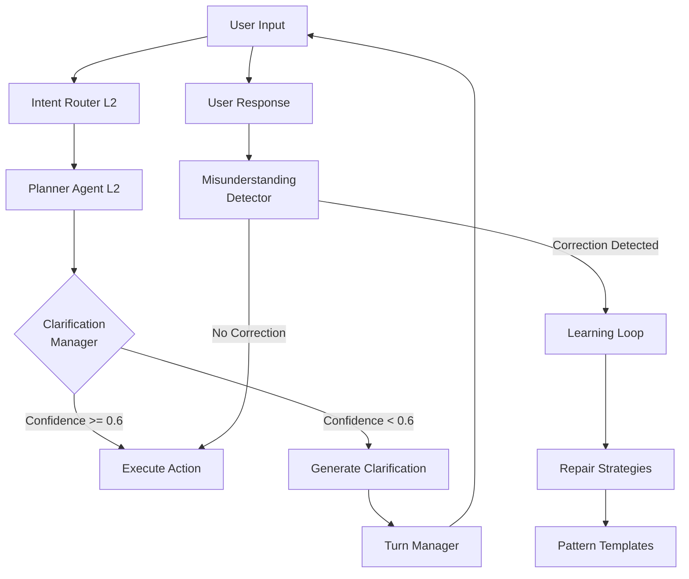

# ADR-0054d: Dialogue Repair & Clarification Pipeline

**Status:** Proposed
**Date:** 2025-10-22
**Deciders:** K1 Architecture Team
**Technical Story:** Dialogue Repair (Capability #10) - Intelligent misunderstanding recovery

---

## Context

LLMs are **probabilistic systems** - they can misunderstand user intent, especially with noisy audio, ambiguous phrasing, or multi-turn context loss. Traditional chatbots respond with generic "I don't understand" messages or fail silently. FamilyOS needs **intelligent repair strategies** that detect low confidence, ask clarifying questions, and recover from misunderstandings gracefully.

**User Experience Problem:**

```
Traditional Chatbot:
User: "Book dinner for tomorrow"
Bot: "I don't understand" ❌ [Dead end, user frustrated]

FamilyOS LLM-Powered:
User: "Book dinner for tomorrow"
Planner LLM: [Confidence: 0.55 - ambiguous "tomorrow", missing time/location]
Clarification Manager: "I'd be happy to book dinner tomorrow. What time works, and do you have a restaurant in mind?" ✅
User: "7pm at Italian place we went last month"
Planner LLM: [Confidence: 0.92 - searches memory, finds "Luigi's"]
System: "Booking dinner at Luigi's for tomorrow at 7pm"
```

**LLM-Specific Challenges:**

**1. Confidence Scores**

LLM outputs include confidence scores for intent classification:

```python
# High confidence - proceed normally
IntentClassification(intent="book_dinner", confidence=0.87, entities=["time": "7pm", "location": "Luigi's"])
→ Execute action

# Low confidence - trigger clarification
IntentClassification(intent="book_dinner", confidence=0.42, entities=["time": None, "location": None])
→ Ask clarifying questions
```

**2. Hallucination Risk**

When LLMs are uncertain, they may **hallucinate** (generate plausible-sounding but incorrect responses):

```
User: "Book dinner at that place we went last month"
LLM (low confidence, no memory match): [Hallucinates] "Booking dinner at The Cheesecake Factory" ❌
→ Wrong restaurant, user frustrated

Better approach:
LLM (low confidence detected): "I'm not sure which restaurant you mean. We've been to Luigi's, Olive Garden, and Cheesecake Factory last month. Which one?" ✅
→ User clarifies, correct action taken
```

**3. Multi-Turn Context Loss**

LLM may lose conversation thread across turns:

```
Turn 1:
User: "What's the weather in Seattle?"
LLM: "It's 72°F and sunny in Seattle today"
SessionState.beliefs: {location: "Seattle", topic: "weather"}

Turn 2:
User: "What about Tuesday?" [Ambiguous - Tuesday for what? Weather? Calendar events?]
LLM (without context recovery): "Tuesday for what?" ❌

LLM (with context recovery): "Are we still talking about weather in Seattle? Tuesday will be 68°F and rainy." ✅
```

**Current Architecture Gap:**

K1 has Turn Boundary Management (ADR-0054) for detecting when user finishes speaking, but **no pipeline** for:

1. Detecting low-confidence intents (<0.6 threshold)
2. Generating appropriate clarifying questions
3. Tracking user corrections ("No, I meant...")
4. Learning misunderstanding patterns over time

**Related ADRs:**

- **ADR-0054:** Turn Boundary Management (foundation for repair - dual-signal turn detection)
- **ADR-0059:** Learning Loop (learn from corrections, adjust confidence thresholds)
- **ADR-0001f:** SessionState Management (track conversation context for repair)
- **ADR-0006:** 3-Phase Orchestration (repair during planning phase)

**Research Foundation:**

- **Dialogue Repair Theory** (Schegloff et al., 1977): Self-repair vs other-repair in human conversation
- **Conversational Grounding** (Clark & Brennan, 1991): Common ground establishment
- **Clarification Strategies** (Purver, 2004): Taxonomy of clarification questions
- **Error Recovery in Dialogue Systems** (Bohus & Rudnicky, 2005): Non-understanding recovery strategies

---

## Decision

We adopt a **3-component Dialogue Repair Pipeline** in Layer 3 (`k1/l3_execution/dialogue/`) to detect low-confidence intents, generate clarifying questions, track misunderstandings, and recover conversation context gracefully.

### **Core Architecture**



### **Components**

#### **1. Clarification Manager** (`clarification_manager.py`)

**Purpose:** Detect low-confidence intents and decide when to ask clarifying questions

**Responsibilities:**

- Monitor intent confidence scores from Planner
- Apply threshold rules (confidence <0.6 → clarify)
- Select appropriate repair strategy (rephrase, simplify, offer options)
- Generate clarifying questions using templates
- Track clarification attempts per turn (max 2 per turn)
- <100ms P95 clarification generation latency

**Confidence Threshold Strategy:**

```python
class ConfidenceThreshold:
    EXECUTE = 0.6        # >= 0.6: Execute action immediately
    CLARIFY = 0.4        # 0.4-0.6: Ask clarifying question
    REJECT = 0.0         # < 0.4: "I didn't understand that, could you rephrase?"
```

**Clarification Decision Logic:**

```python
@dataclass
class IntentAnalysis:
    intent: str
    confidence: float
    missing_entities: List[str]
    ambiguous_entities: List[str]

def should_clarify(analysis: IntentAnalysis) -> bool:
    """Decide if clarification needed"""
    if analysis.confidence < 0.4:
        return True  # Too uncertain, need full rephrase

    if analysis.confidence < 0.6:
        return True  # Moderate confidence, ask about missing entities

    if analysis.missing_entities:
        return True  # High confidence but missing required info

    return False
```

#### **2. Repair Strategies** (`repair_strategies.py`)

**Purpose:** Generate appropriate clarifying questions based on intent analysis

**Strategies:**

**Strategy 1: Rephrase (Confidence <0.4)**

Used when LLM has very low confidence and needs user to rephrase completely.

```python
templates = [
    "I didn't quite catch that. Could you rephrase?",
    "I'm not sure I understood. Could you say that differently?",
    "I didn't get that. Could you try rephrasing?"
]
```

**Strategy 2: Simplify (Confidence 0.4-0.6, complex query)**

Used when LLM caught some parts but not all.

```python
template = "I caught {understood_parts}, but I missed {missed_parts}. Could you clarify?"

# Example:
Intent: book_dinner
Understood: [intent, date]
Missed: [time, location]
→ "I understand you want to book dinner tomorrow, but what time and where?"
```

**Strategy 3: Offer Options (Confidence 0.4-0.6, multiple interpretations)**

Used when LLM has multiple plausible interpretations.

```python
template = "Did you mean {option_a} or {option_b}?"

# Example:
User: "Book dinner at that Italian place"
Memory search returns: ["Luigi's", "Olive Garden", "Carrabba's"]
→ "Did you mean Luigi's, Olive Garden, or Carrabba's?"
```

**Strategy 4: Context Recovery (Multi-turn context loss)**

Used when conversation context is unclear across turns.

```python
template = "Are we still talking about {last_topic}?"

# Example:
Turn 1: "What's the weather in Seattle?"
Turn 2: "What about Tuesday?"
→ "Are we still talking about weather in Seattle? Tuesday will be 68°F."
```

**Strategy 5: Missing Entity (High confidence, missing required field)**

Used when intent is clear but required information is missing.

```python
template = "I can {action}, but I need {missing_entity}."

# Example:
Intent: book_dinner (confidence 0.85)
Entities: [date: "tomorrow"] (missing: time, location)
→ "I'd be happy to book dinner tomorrow. What time works, and do you have a restaurant in mind?"
```

#### **3. Misunderstanding Detector** (`misunderstanding_detector.py`)

**Purpose:** Track user corrections and learn misunderstanding patterns

**Responsibilities:**

- Detect correction phrases ("No, I meant...", "Actually...", "Not that...")
- Track repeated queries (same intent asked 3+ times → clarification strategy failing)
- Measure repair success rate (% of clarifications that lead to successful action)
- Feed correction patterns to Learning Loop (ADR-0059)
- Update confidence thresholds based on failure patterns

**Correction Detection:**

```python
CORRECTION_PHRASES = [
    "no, i meant",
    "actually",
    "not that",
    "i said",
    "no, not",
    "i meant to say",
    "let me rephrase",
    "i'm trying to say"
]

def detect_correction(user_input: str) -> bool:
    """Detect if user is correcting previous misunderstanding"""
    lowercase = user_input.lower()
    return any(phrase in lowercase for phrase in CORRECTION_PHRASES)
```

**Repeated Query Detection:**

```python
class RepeatDetector:
    def __init__(self):
        self.query_history = []  # Last 10 queries

    def is_repeated(self, query: str, threshold: int = 3) -> bool:
        """Detect if user repeating same query (clarification failing)"""
        # Fuzzy match with Levenshtein distance
        similar_count = sum(1 for q in self.query_history if similarity(q, query) > 0.8)
        return similar_count >= threshold
```

**Learning Integration:**

```python
@dataclass
class MisunderstandingPattern:
    original_input: str
    llm_interpretation: str
    user_correction: str
    confidence_score: float
    timestamp: datetime

async def log_misunderstanding(pattern: MisunderstandingPattern):
    """Send to Learning Loop for pattern analysis"""
    await learning_loop.record_feedback(
        feedback_type=FeedbackType.CORRECTION,
        signal_strength=1.0,  # Explicit correction = strong signal
        context=pattern,
        trace_id=trace_id
    )
```

---

## Consequences

### **Positive**

**1. Intelligent Error Recovery ✅**

- LLM admits uncertainty instead of hallucinating
- Users get helpful clarifying questions, not "I don't understand"
- **Capability #10 (Dialogue Repair):** UNLOCKED

**2. Improved User Trust ✅**

- Transparent about confidence ("I'm not sure I understood...")
- Asks for help when uncertain (collaborative, not authoritative)
- Recovers from mistakes gracefully

**3. Learning from Mistakes ✅**

- Tracks correction patterns over time
- Adjusts confidence thresholds based on success rate
- Improves repair strategies via Learning Loop

**4. Context Preservation ✅**

- Multi-turn context recovery ("Are we still talking about X?")
- SessionState integration preserves conversation flow
- Reduces user frustration from lost context

**5. Fast Clarification Generation ✅**

- <100ms P95 clarification generation
- Template-based (not LLM call) for speed
- Parallel processing doesn't block main flow

### **Negative**

**1. Extra Turn Latency ⚠️**

- **Risk:** Clarification adds 1+ turns to conversation (user must respond)
- **Mitigation:** Only clarify when confidence <0.6 (not every turn), max 2 clarifications per conversation
- **Impact:** +2-5 seconds per clarification (acceptable vs wrong action)

**2. Over-Clarification Fatigue 📊**

- **Risk:** Too many clarifications frustrate users ("Just do it!")
- **Mitigation:** Learning Loop adjusts thresholds, track clarification frequency (max 1 per 5 turns)
- **Impact:** <10% of turns should trigger clarification (monitored)

**3. Template Rigidity ⚠️**

- **Risk:** Template-based questions may feel robotic vs LLM-generated
- **Mitigation:** Rich template library (20+ templates), context-aware selection
- **Impact:** Minor - users prefer predictable clarifications to wrong actions

**4. Correction Detection Accuracy 🐛**

- **Risk:** May miss subtle corrections ("Well, actually..."), may false-positive on similar phrases
- **Mitigation:** Fuzzy matching with Levenshtein distance, Learning Loop refines detection
- **Impact:** ~5% false positive/negative rate (acceptable)

### **Trade-offs**

| Aspect | Without Repair Pipeline | With Repair Pipeline |
|--------|------------------------|---------------------|
| **User Trust** | ❌ LLM hallucinates when uncertain | ✅ LLM admits uncertainty |
| **Conversation Length** | Shorter (but often wrong) | +1-2 turns (but correct) |
| **Error Rate** | ~20% wrong actions (low confidence) | ~5% wrong actions (clarified) |
| **User Frustration** | High (wrong actions) | Low (helpful questions) |
| **Code Complexity** | Lower | Moderate (+800 LOC) |

---

## Implementation

### **Module Structure**

```
k1/l3_execution/dialogue/
├── __init__.py
├── README.md                        # Module documentation
├── clarification_manager.py         # Clarification Manager (300 LOC)
├── repair_strategies.py             # Repair Strategies (250 LOC)
├── misunderstanding_detector.py     # Misunderstanding Detector (250 LOC)
├── templates.py                     # Clarification Templates (100 LOC)
└── tests/
    ├── test_clarification_manager.py
    ├── test_repair_strategies.py
    └── test_misunderstanding_detector.py
```

**Total:** ~900 LOC production + ~600 LOC tests

### **Integration Points**

**Upstream (Layer 2 Orchestration):**

- `k1/l2_orchestration/planner/` → provides intent confidence scores
- `k1/l2_orchestration/orchestrator/` → receives clarification requests

**Downstream (Layer 4 Runtime):**

- `SessionState` ← stores conversation context for repair
- `Learning Loop` ← receives correction patterns

**Cross-Layer:**

- `Event Bus` (L5) ← publishes `ClarificationRequested`, `CorrectionDetected` events
- `Observability` (L5) ← metrics (clarification rate, repair success rate)

### **Performance Budgets**

| Component | Budget | Measurement |
|-----------|--------|-------------|
| Confidence check | <1ms | `clarification_manager.check()` |
| Strategy selection | <5ms | `repair_strategies.select()` |
| Template rendering | <10ms | Template string formatting |
| Correction detection | <5ms | Fuzzy string matching |
| Learning Loop send | <5ms | Async fire-and-forget |
| **Total P95** | **<100ms** | End-to-end clarification |

### **Observability**

**Metrics (Prometheus):**

```python
dialogue_clarifications_total = Counter(
    'dialogue_clarifications_total',
    'Total clarification requests',
    ['strategy']  # rephrase, simplify, offer_options, context_recovery, missing_entity
)

dialogue_clarification_latency_ms = Histogram(
    'dialogue_clarification_latency_ms',
    'Clarification generation latency (ms)',
    buckets=[10, 25, 50, 100, 200]
)

dialogue_corrections_detected_total = Counter(
    'dialogue_corrections_detected_total',
    'Total user corrections detected'
)

dialogue_repair_success_rate = Gauge(
    'dialogue_repair_success_rate',
    'Repair success rate (0-1)'
)

dialogue_repeated_queries_total = Counter(
    'dialogue_repeated_queries_total',
    'Repeated queries (clarification failing)'
)
```

**Tracing (OpenTelemetry):**

```python
@traced(span_name="dialogue_repair.clarify")
async def generate_clarification(
    intent_analysis: IntentAnalysis,
    trace_id: str
) -> ClarificationRequest:
    """Generate clarification with tracing"""
    with tracer.start_as_current_span("select_strategy"):
        strategy = select_repair_strategy(intent_analysis)

    with tracer.start_as_current_span("render_template"):
        question = render_template(strategy, intent_analysis)

    with tracer.start_as_current_span("publish_event"):
        event_bus.publish(ClarificationRequested(...), trace_id)

    return ClarificationRequest(question=question, strategy=strategy)
```

**Logging (Structured):**

```python
logger.info(
    "clarification_requested",
    intent=intent_analysis.intent,
    confidence=intent_analysis.confidence,
    strategy=strategy.name,
    trace_id=trace_id
)

logger.warning(
    "correction_detected",
    original_input=original,
    user_correction=correction,
    llm_interpretation=interpretation,
    trace_id=trace_id
)
```

### **Testing Strategy**

**Unit Tests (WARD):**

```python
@test("clarification manager detects low confidence")
async def _():
    manager = ClarificationManager()

    # Low confidence intent
    analysis = IntentAnalysis(
        intent="book_dinner",
        confidence=0.42,
        missing_entities=["time", "location"]
    )

    should_clarify = manager.should_clarify(analysis)
    assert should_clarify is True

@test("repair strategies select appropriate template")
async def _():
    strategies = RepairStrategies()

    # Missing entity scenario
    analysis = IntentAnalysis(
        intent="book_dinner",
        confidence=0.85,
        missing_entities=["time", "location"],
        ambiguous_entities=[]
    )

    strategy = strategies.select(analysis)
    assert strategy.type == StrategyType.MISSING_ENTITY

    question = strategies.render(strategy, analysis)
    assert "what time" in question.lower()
    assert "restaurant" in question.lower()

@test("misunderstanding detector identifies corrections")
async def _():
    detector = MisunderstandingDetector()

    # Correction phrase
    user_input = "No, I meant the Italian restaurant, not Chinese"
    is_correction = detector.detect_correction(user_input)
    assert is_correction is True

    # Normal input
    user_input = "Book dinner for tomorrow"
    is_correction = detector.detect_correction(user_input)
    assert is_correction is False
```

**Integration Tests:**

```python
@test("end-to-end clarification flow <100ms")
async def _():
    # Setup: Low confidence intent from Planner
    planner_result = PlannerResult(
        intent="book_dinner",
        confidence=0.42,
        entities={"date": "tomorrow"}
    )

    # Action: Clarification Manager generates question
    start = time.perf_counter()
    clarification = await clarification_manager.generate(planner_result)
    latency_ms = (time.perf_counter() - start) * 1000

    # Verify: Clarification generated, latency <100ms
    assert clarification.question is not None
    assert "time" in clarification.question.lower()
    assert latency_ms < 100.0
```

### **Rollout Plan**

**Phase 1: Clarification Manager (Week 1)**

- Implement confidence checking
- Threshold rules (0.6/0.4 cutoffs)
- Basic template rendering
- Unit tests
- **Milestone:** Clarifications generated for low-confidence intents

**Phase 2: Repair Strategies (Week 1-2)**

- Implement 5 repair strategies
- Template library (20+ templates)
- Strategy selection logic
- Integration tests
- **Milestone:** Appropriate clarifications for different scenarios

**Phase 3: Misunderstanding Detection (Week 2)**

- Correction phrase detection
- Repeated query tracking
- Learning Loop integration
- Performance validation
- **Milestone:** Corrections logged, patterns learned

**Phase 4: Integration & Tuning (Week 2-3)**

- Planner integration
- SessionState context integration
- Threshold tuning (may adjust 0.6 → 0.65 based on metrics)
- End-to-end testing
- **Milestone:** Dialogue Repair (Capability #10) working in production

**Canary Rollout:**

1. **5%** of sessions (1 day) - monitor clarification rate
2. **25%** of sessions (2 days) - validate repair strategies
3. **50%** of sessions (3 days) - check for over-clarification
4. **100%** rollout - full production

---

## Related Decisions

- **ADR-0054:** Turn Boundary Management (foundation for repair)
- **ADR-0059:** Learning Loop (learn from corrections)
- **ADR-0001f:** SessionState Management (conversation context)
- **ADR-0006:** 3-Phase Orchestration (repair during planning)

---

## Research & References

**Dialogue Repair Theory:**

- Schegloff, E. A., et al. (1977). "The Preference for Self-Correction in the Organization of Repair in Conversation." Language.
- Clark, H. H., & Brennan, S. E. (1991). "Grounding in Communication." Perspectives on Socially Shared Cognition.

**Clarification Strategies:**

- Purver, M. (2004). "The Theory and Use of Clarification Requests in Dialogue." PhD Thesis, University of London.
- Rieser, V., & Lemon, O. (2009). "Natural Language Generation as Planning Under Uncertainty for Spoken Dialogue Systems." EACL.

**Error Recovery:**

- Bohus, D., & Rudnicky, A. I. (2005). "Sorry, I Didn't Catch That! An Investigation of Non-Understanding Errors and Recovery Strategies." SIGdial.
- Skantze, G. (2007). "Error Handling in Spoken Dialogue Systems." PhD Thesis, KTH Royal Institute of Technology.

**Conversational AI:**

- Google Meena (2020): Confidence-based clarification in open-domain dialogue
- Amazon Alexa Error Recovery (2019): Multi-turn repair strategies
- Microsoft Cortana Dialogue Repair (2018): Context recovery techniques

---

## Status

**Proposed** - Awaiting implementation

**MVP Criticality:** P0 - Blocks Capability #10 (Dialogue Repair)

**Timeline:** 2-3 weeks implementation + 1 week testing + 1 week canary rollout
