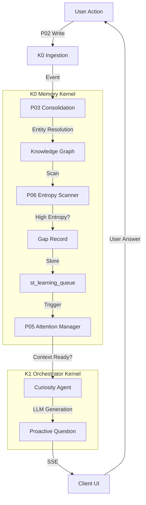

# Idea-0001: Active Learning Loop (K0-K1 Proactive Curiosity)

## 1. Executive Summary

The **Active Learning Loop** transforms FamilyOS from a passive data store into a **proactive, curious, and self-correcting intelligence**. Instead of waiting for users to manually input data (which leads to the "Cold Start Problem"), the system autonomously identifies gaps in its knowledge, formulates hypotheses, and asks contextually relevant questions to the user.

This architecture introduces a **"Curiosity Engine"** that spans the K0 Memory Kernel (for gap detection and entropy scanning) and the K1 Orchestrator (for natural language inquiry). It leverages **Bayesian Theory of Mind** to build stable "Anchor Points" for user personality and **CRDT-based Sync** to align shared family values across devices.

**Core Philosophy:**
> *"A child learns not by downloading a database, but by observing the world, forming a hypothesis, and asking 'Why?'. FamilyOS must learn the same way."*

---

## 2. Problem Statement & Motivation

### 2.1 The Passive Ingestion Trap

Current AI memory systems (RAG, Vector Stores) are fundamentally passive. They rely on the user to explicitly provide information.

* **The Cold Start Problem**: A new user faces an empty system. To make it useful, they must perform tedious data entry ("This is my wife, Sarah. She likes Italian food."). Most users churn before reaching critical mass.
* **The Silent Failure Problem**: If the system has ambiguous data (e.g., two "Bobs"), it silently guesses or fails. It lacks the agency to ask for clarification.
* **The Static Model Problem**: Once a fact is learned ("Dad likes Sci-Fi"), it is treated as an eternal truth. The system fails to detect when preferences change over time (Concept Drift).

### 2.2 The Need for Agency

To be a true "Family Member," the AI must have **Epistemic Agency**—the ability to know *what it doesn't know* and the drive to find out.

* **Goal 1: Accelerate Context Acquisition**: Rapidly build the 'Self Model' and 'World Model' through high-value questions.
* **Goal 2: Self-Correction**: Identify and resolve ambiguities (Entity Resolution) at the source.
* **Goal 3: Natural Interaction**: Create a sense of "aliveness" through curiosity-driven engagement.

---

## 3. Theoretical Foundation & Research

This architecture synthesizes seven foundational research areas into a unified learning framework. Each pillar contributes critical capabilities:

### 3.1 Active Learning Theory (Uncertainty Sampling)

**Core Principle**: Query efficiency through strategic sample selection.

**Mathematical Foundation**:

$$
x^* = \argmax_{x \in U} H(y|x, \mathcal{D}) = \argmax_{x \in U} -\sum_{i} P(y_i|x, \mathcal{D}) \log P(y_i|x, \mathcal{D})
$$

Where:

* $x^*$ = optimal query (highest information gain)
* $U$ = unlabeled pool (possible questions)
* $H(y|x, \mathcal{D})$ = conditional entropy (uncertainty)
* $\mathcal{D}$ = current knowledge base

**Query Strategies** (Settles, 2009):

1. **Uncertainty Sampling**: Query instances where prediction confidence is lowest
   * Least Confident: $x^* = \argmax_{x} (1 - P(\hat{y}|x))$
   * Margin Sampling: $x^* = \argmin_{x} (P(y_1|x) - P(y_2|x))$
   * Entropy: $x^* = \argmax_{x} H(y|x)$

2. **Query-By-Committee**: Maintain ensemble of models, query where they disagree most
   * Vote Entropy: $VE(x) = -\sum_{i} \frac{V(y_i)}{C} \log \frac{V(y_i)}{C}$
   * KL Divergence: $KL(x) = \frac{1}{C} \sum_{c} D_{KL}(P_c \| P_{avg})$

3. **Expected Model Change**: Query instances that would cause largest gradient update
   * $x^* = \argmax_{x} \|\nabla_{\theta} L(\mathcal{D} \cup \{x, \hat{y}\})\|$

4. **Expected Error Reduction**: Query that minimizes expected future error
   * $x^* = \argmin_{x} \sum_{i} P(y_i|x) \sum_{x'} \mathbb{E}[Error|\mathcal{D} \cup \{x,y_i\}]$

**FamilyOS Application**:

* **Knowledge Graph Entropy**: Calculate edge uncertainty for relationships
  * Example: P("Sarah" = "colleague") = 0.53 → High entropy, ask clarification
* **Entity Resolution**: Query when multiple candidates have similar confidence
  * Example: "Bob" could be Bob_father (0.48) or Bob_coworker (0.46)
* **Attribute Completion**: Identify missing schema elements
  * Example: Person nodes should have [age, preferences, relationships] → query gaps

**Performance Guarantees** (Balcan et al., 2009):

* Active learning achieves target accuracy with $O(\log n)$ queries vs $O(n)$ passive samples
* Agnostic active learning: $O(d \log \frac{1}{\epsilon})$ vs $O(\frac{d}{\epsilon^2})$ (exponential improvement)

**Citations**:

* Settles, B. (2009). "Active Learning Literature Survey". University of Wisconsin-Madison. [Seminal survey, 5000+ citations]
* Balcan, M.F., Beygelzimer, A., & Langford, J. (2009). "Agnostic Active Learning". JMLR. [Theoretical guarantees]
* Dasgupta, S., Hsu, D., & Monteleoni, C. (2008). "A General Agnostic Active Learning Algorithm". NeurIPS. [Polynomial improvements]

---

### 3.2 Intrinsic Motivation & Curiosity-Driven Learning

**Core Principle**: Learning systems should be driven by internal reward signals (information gain) not just external task performance.

**Theoretical Framework** (Schmidhuber, 2010):

**Compression Progress**: Agent seeks actions that maximize compressibility improvement

$$
R_{intrinsic}(s_t, a_t, s_{t+1}) = C(s_{t}) - C(s_{t+1})
$$

Where:

* $C(s_t)$ = Kolmogorov complexity (compressibility) of world model at time $t$
* Positive reward when new observation makes world model more compressible

**Prediction Error Minimization** (Friston, 2010 - Free Energy Principle):

$$
F = D_{KL}(q(z|x) \| p(z)) - \mathbb{E}_{q(z|x)}[\log p(x|z)]
$$

* Brain minimizes "surprise" (free energy $F$) through:
  1. **Perception**: Update beliefs $q(z|x)$ to match observations
  2. **Action**: Change world $x$ to match predictions $p(x|z)$
* Curiosity = seeking observations that reduce uncertainty in $q(z|x)$

**Information Gain Maximization** (Pathak et al., 2017):

$$
r_{curiosity}(s_t, a_t, s_{t+1}) = \frac{1}{2} \| \hat{f}(s_{t+1}) - f(s_t, a_t) \|^2
$$

Where:

* $f$ = forward dynamics model (predict next state)
* $\hat{f}$ = actual next state
* High prediction error → High curiosity reward

**The Goldilocks Principle** (Oudeyer & Kaplan, 2007):

Learning progress is maximized in "Zone of Proximal Development":

```
Complexity:  |---Too Easy---|---Just Right---|---Too Hard---|
Learning:    |  Boring (0)  |  Optimal (max) | Chaotic (0)  |
Curiosity:   |     Low      |      High      |     Low      |
```

**Mathematical Formulation**:

$$
Curiosity(task) = \frac{dCompetence(task)}{dt} \cdot Novelty(task)
$$

* Maximize **learning velocity** (competence improvement rate)
* Weight by **novelty** (haven't seen this before)

**FamilyOS Application**:

1. **Novelty Detection**: Assign novelty scores to incoming events
   * High novelty (unfamiliar entity) → Ask "Who is this?"
   * Medium novelty (partial match) → Ask disambiguation
   * Low novelty (routine event) → Silent ingestion

2. **Learning Progress Tracking**: Monitor knowledge graph growth rate
   * Rapid edge addition → System is learning effectively
   * Stagnation → Trigger proactive entropy scanning

3. **Contextual Curiosity**: Ask questions when user is receptive
   * **Not** during high cognitive load (rushing, stressed)
   * **Yes** during idle time, related conversations

**Empirical Results**:

* Oudeyer et al. (2007): Intrinsically motivated robots learn 3× faster than random exploration
* Pathak et al. (2017): ICM (Intrinsic Curiosity Module) achieves superhuman performance in sparse-reward environments
* Burda et al. (2019): Random Network Distillation (RND) solves Montezuma's Revenge (notoriously hard exploration)

**Citations**:

* Oudeyer, P.Y., Kaplan, F., & Hafner, V.V. (2007). "Intrinsic Motivation Systems for Autonomous Mental Development". IEEE Trans. Evolutionary Computation. [Foundational work]
* Schmidhuber, J. (2010). "Formal Theory of Creativity, Fun, and Intrinsic Motivation". IEEE Trans. Autonomous Mental Development. [Compression progress theory]
* Pathak, D., et al. (2017). "Curiosity-driven Exploration by Self-supervised Prediction". ICML. [ICM module]
* Friston, K. (2010). "The Free-Energy Principle: A Unified Brain Theory?". Nature Reviews Neuroscience. [Neuroscience foundation]
* Burda, Y., et al. (2019). "Exploration by Random Network Distillation". ICLR. [State-of-the-art exploration]

---

### 3.3 Bayesian Theory of Mind (BToM) & Mental State Inference

**Core Principle**: Infer latent mental states (beliefs, desires, intentions) through inverse planning.

**Mathematical Framework** (Baker et al., 2009):

**Rational Action Model**: Assume agent $A$ acts optimally given beliefs $B$ and desires $D$:

$$
P(action|B, D) \propto \exp(\beta \cdot Utility(action, B, D))
$$

**Inverse Inference**: Observe action, infer $B$ and $D$:

$$
P(B, D | action) \propto P(action|B,D) \cdot P(B) \cdot P(D)
$$

**Hierarchical Goal Inference**: Model goal hierarchy as tree:

```
Goal: "Be Healthy"
  ├── Subgoal: "Exercise regularly"
  │   ├── Action: "Go to gym 3×/week"
  │   └── Action: "Take stairs not elevator"
  └── Subgoal: "Eat nutritious food"
      ├── Action: "Cook at home"
      └── Action: "Avoid fast food"
```

**Inference**: If we observe "User takes stairs" → Update P(Goal = "Be Healthy") ↑

**FamilyOS Application - Anchor Points**:

**Anchor Points** = Stable user values modeled as latent variables:

```python
class AnchorPoint:
    attribute: str  # e.g., "loves_spicy_food"
    alpha: float    # Beta distribution parameter (successes)
    beta: float     # Beta distribution parameter (failures)

    @property
    def confidence(self) -> float:
        """Bayesian posterior mean."""
        return self.alpha / (self.alpha + self.beta)

    @property
    def uncertainty(self) -> float:
        """Entropy of Beta distribution."""
        # High when alpha ≈ beta (no evidence)
        # Low when alpha >> beta or beta >> alpha (strong evidence)
        return beta_entropy(self.alpha, self.beta)
```

**Evidence Update** (Bayesian Update Rule):

```python
def observe_evidence(anchor: AnchorPoint, event: Event) -> None:
    """Update anchor based on observed behavior."""
    if event.supports_anchor(anchor):
        anchor.alpha += 1  # Evidence FOR
    else:
        anchor.beta += 1   # Evidence AGAINST
```

**Example: Inferring Food Preferences**:

```
Observation 1: User orders Thai food (spicy) → alpha++
Observation 2: User enjoys it, orders again → alpha++
Observation 3: User declines Indian food (also spicy) → beta++
  → Inference: Likes spicy BUT specific to Thai cuisine
Observation 4: User complains about heartburn → beta++
  → Refined inference: Likes spicy but health constraint emerging

Anchor: "loves_spicy_food"
  - alpha=3, beta=2
  - confidence = 3/5 = 0.60 (moderate)
  - uncertainty = moderate (need more data)
  → System asks: "I noticed you enjoy Thai food but skip Indian.
                   Is it the spice level, or do you prefer specific cuisines?"
```

**Concept Drift Detection**:

```python
def detect_drift(anchor: AnchorPoint, window_size: int = 30) -> bool:
    """Detect if beliefs are changing over time."""
    recent_observations = anchor.observations[-window_size:]
    older_observations = anchor.observations[-2*window_size:-window_size]

    recent_confidence = compute_confidence(recent_observations)
    older_confidence = compute_confidence(older_observations)

    # Significant shift in confidence?
    if abs(recent_confidence - older_confidence) > 0.2:
        return True  # Concept drift detected!
```

**Example: Detecting Dietary Change**:

```
Weeks 1-4: Eats meat regularly (alpha=20, beta=2) → confidence=0.91
Weeks 5-8: Stops eating meat (alpha=1, beta=15) → confidence=0.06

→ Drift detected! System asks:
   "I noticed you've stopped eating meat recently.
    Have your dietary preferences changed?"
```

**Citations**:

* Baker, C.L., Saxe, R.R., & Tenenbaum, J.B. (2009). "Action Understanding as Inverse Planning". Cognition. [Foundational BToM]
* Baker, C.L., Saxe, R., & Tenenbaum, J.B. (2011). "Bayesian Theory of Mind: Modeling Joint Belief-Desire Attribution". Cognitive Science Society. [Joint inference]
* Jara-Ettinger, J., et al. (2016). "The Naïve Utility Calculus: Computational Principles Underlying Commonsense Psychology". Trends in Cognitive Sciences. [Review paper]
* Ullman, T.D., et al. (2009). "Help or Hinder: Bayesian Models of Social Goal Inference". NeurIPS. [Social reasoning]

---

### 3.4 Meta-Learning & Few-Shot Adaptation

**Core Principle**: Learn to learn - acquire meta-knowledge that enables rapid adaptation to new tasks/users.

**Model-Agnostic Meta-Learning (MAML)** (Finn et al., 2017):

**Objective**: Find initialization $\theta^*$ that enables fast fine-tuning:

$$
\theta^* = \argmin_{\theta} \sum_{\mathcal{T}_i \sim p(\mathcal{T})} \mathcal{L}_{\mathcal{T}_i}(f_{\theta'_i})
$$

Where:

* $\theta'_i = \theta - \alpha \nabla_{\theta} \mathcal{L}_{\mathcal{T}_i}(f_\theta)$ (one gradient step)
* Learn $\theta$ that is "close" to optimal for many tasks after 1-5 gradient steps

**FamilyOS Application**:

**Cold Start Acceleration**:

1. **Pre-train on aggregated family patterns** (privacy-preserving):
   * Aggregate: "80% of families have [morning routine, meal planning, school schedules]"
   * Meta-model learns: "If new family, ask about these 3 domains first"

2. **Fast personalization** (few-shot):
   * After 5-10 interactions, fine-tune to specific family
   * Meta-learned initialization → converges 10× faster

**Prototypical Networks** (Snell et al., 2017):

Learn embedding space where similar entities cluster:

$$
d(x, c_k) = \|f_{\theta}(x) - c_k\|^2
$$

Where:

* $c_k = \frac{1}{|S_k|} \sum_{(x_i,y_i) \in S_k} f_{\theta}(x_i)$ (class prototype)
* $S_k$ = support set (examples of class $k$)

**FamilyOS Application - Entity Resolution**:

```
New entity: "Dr. Smith"
Embedding: f("Dr. Smith") = [0.2, 0.8, 0.1, ...]

Prototypes:
  - c_doctor = [0.19, 0.82, 0.09, ...]     # Distance: 0.03 ✓
  - c_teacher = [0.45, 0.21, 0.67, ...]    # Distance: 0.58
  - c_neighbor = [0.71, 0.11, 0.23, ...]   # Distance: 0.82

→ Likely a doctor! But low confidence (distance 0.03 > threshold 0.01)
→ Ask: "Is Dr. Smith Emma's pediatrician or a family friend?"
```

**Citations**:

* Finn, C., Abbeel, P., & Levine, S. (2017). "Model-Agnostic Meta-Learning for Fast Adaptation of Deep Networks". ICML. [MAML - 4000+ citations]
* Snell, J., Swersky, K., & Zemel, R. (2017). "Prototypical Networks for Few-shot Learning". NeurIPS. [Prototype learning]
* Vinyals, O., et al. (2016). "Matching Networks for One Shot Learning". NeurIPS. [Attention-based few-shot]
* Ravi, S., & Larochelle, H. (2017). "Optimization as a Model for Few-Shot Learning". ICLR. [Meta-optimizer]

---

### 3.5 Socratic Questioning & Pedagogical Strategies

**Core Principle**: Questions should not just extract information but also stimulate reflection and learning in the user.

**Bloom's Taxonomy** (1956, Revised 2001):

Cognitive complexity hierarchy for questions:

```
Level 6: Creating    → "How would you design...?"
Level 5: Evaluating  → "What's the best approach for...?"
Level 4: Analyzing   → "Why do you think...?"
Level 3: Applying    → "How would you use... in...?"
Level 2: Understanding → "Can you explain... in your own words?"
Level 1: Remembering → "What is...?" "Who...?"
```

**Socratic Method** (Elder & Paul, 1998):

**Question Categories**:

1. **Clarification**: "What do you mean by...?"
2. **Probing Assumptions**: "What are you assuming?"
3. **Probing Rationale**: "Why do you say that?"
4. **Questioning Viewpoints**: "What's an alternative?"
5. **Probing Implications**: "What would happen if...?"
6. **Questions About Questions**: "Why is this question important?"

**FamilyOS Application - Multi-Purpose Questions**:

**Dual Benefit**: Information extraction + User insight

**Example 1: Preference Discovery + Awareness**

```
❌ Extractive: "What foods does Emma like?"
✅ Reflective: "What patterns do you notice in Emma's favorite meals?"

→ User thinks: "Hmm, she likes pasta, pizza, quesadillas...
                oh wait, they're all carb-heavy!"
→ System learns: Emma prefers carbohydrates
→ User learns: Emma's preference pattern (they didn't realize before)
```

**Example 2: Conflict Mediation + Empathy**

```
❌ Extractive: "Who started the fight?"
✅ Socratic: "How do you think Emma felt when that happened?"

→ Child reflects on sibling's perspective
→ System learns: Child has theory of mind capability
→ User learns: Empathy for sister's viewpoint
```

**Scaffolding Theory** (Vygotsky, 1978):

Provide **just enough support** to enable task completion:

```
Novice: Full guidance
  "Let's think about Emma's preferences together.
   What did she eat for breakfast this week?"

Intermediate: Partial guidance
  "What patterns do you see in Emma's meal choices?"

Expert: Minimal guidance
  "Tell me about Emma's dietary preferences."
```

**FamilyOS Implementation**: Track user's "question sophistication level" and adjust:

```python
class UserModel:
    question_level: int  # 1-6 (Bloom's)
    needs_scaffolding: bool

    def generate_question(self, gap: GapRecord) -> str:
        if self.needs_scaffolding:
            return self._generate_scaffolded(gap)  # Break into sub-questions
        elif self.question_level >= 4:
            return self._generate_socratic(gap)    # Reflective questions
        else:
            return self._generate_direct(gap)      # Simple factual questions
```

**Citations**:

* Bloom, B.S. (1956). "Taxonomy of Educational Objectives". Longman. [Cognitive hierarchy]
* Anderson, L.W., & Krathwohl, D.R. (2001). "A Taxonomy for Learning, Teaching, and Assessing". Pearson. [Revised Bloom's]
* Elder, L., & Paul, R. (1998). "The Role of Socratic Questioning in Thinking, Teaching, and Learning". Clearing House. [Socratic method]
* Vygotsky, L.S. (1978). "Mind in Society". Harvard University Press. [Zone of Proximal Development, scaffolding]
* Chi, M.T., et al. (1994). "Eliciting Self-Explanations Improves Understanding". Cognitive Science. [Self-explanation effect]

---

### 3.6 Constitutional AI & Value Alignment

**Core Principle**: AI behavior should be guided by explicit principles (Constitution) that are transparent, debuggable, and aligned with human values.

**Constitutional AI Framework** (Anthropic, 2022):

**Phase 1: Self-Critique & Revision**

```
Step 1: Generate response
Step 2: Critique response against Constitution
Step 3: Revise response to align with principles
Step 4: Repeat until satisfactory
```

**Phase 2: Reinforcement Learning from AI Feedback (RLAIF)**

```
Train preference model using AI-labeled comparisons:
  "Which response better follows principle X?"

Use preference model for RL training (no human labels needed)
```

**FamilyOS Application - Family Values as Constitution**:

**Family Constitution Example**:

```yaml
family_values:
  core_principles:
    - "Respect individual privacy and autonomy"
    - "Foster open communication and emotional safety"
    - "Prioritize children's wellbeing and development"
    - "Make decisions through consensus when possible"
    - "Maintain transparency about AI behavior"

  question_principles:
    - "Never ask questions during high-stress moments"
    - "Respect 'I don't want to answer' without penalty"
    - "Avoid questions that could create family conflict"
    - "Limit questions to 3 per day per person"
    - "Frame questions with genuine curiosity, not judgment"

  privacy_principles:
    - "Children's data requires parental consent"
    - "Personal thoughts ('personal:*') never shared without permission"
    - "Medical/health information stays within immediate family"
    - "Financial data visible only to parents"
```

**Self-Critique Loop**:

```python
class ConstitutionalQuestionGenerator:
    def generate_question(self, gap: GapRecord) -> str:
        # Phase 1: Initial question
        question = self.llm.generate(gap)

        # Phase 2: Critique against constitution
        for principle in self.constitution:
            critique = self.llm.critique(question, principle)

            if critique.violates_principle:
                # Phase 3: Revise
                question = self.llm.revise(question, critique)

        # Phase 4: Final validation
        if self.final_check(question):
            return question
        else:
            return None  # Suppress question if can't align
```

**Example - Privacy-Preserving Question**:

```
Gap: Missing information about "Emma's therapy sessions"

Initial Question:
  "What issues does Emma discuss in therapy?"

Critique:
  Violates: "Respect individual privacy and autonomy"
  Violates: "Children's data requires parental consent"
  Risk: Could pressure child to reveal private medical information

Revised Question:
  "I noticed Emma has weekly therapy appointments.
   Would it be helpful for me to remind her before sessions,
   or does she prefer to manage her schedule independently?"

→ Respects privacy (doesn't ask about session content)
→ Actionable (offers concrete support)
→ Empowers autonomy (gives choice)
```

**CRDT-Based Value Synchronization**:

When family members' devices have conflicting values:

```python
# k0/modules/values/family_constitution_crdt.py

class FamilyConstitutionCRDT:
    """Conflict-free replicated data type for family values."""

    def __init__(self, intent_bus: IntentBus):
        self.intent_bus = intent_bus

    def merge(self, local_values: dict, remote_values: dict) -> dict:
        conflicts = self._detect_conflicts(local_values, remote_values)

        if conflicts:
            # Initiate family dialogue by emitting curiosity intents
            self._publish_value_conflict_intents(conflicts)

        # LWW (Last-Write-Wins) for non-conflicting values
        return self._merge_non_conflicting(local_values, remote_values)

    def _publish_value_conflict_intents(self, conflicts: list) -> None:
        """Emit SSE intents so K1 can facilitate the family dialogue."""
        for conflict in conflicts:
            intent = CuriosityIntent(
                intent_id=uuid4().hex,
                topic="curiosity.intent.values.v1",
                gap_type="VALUE_CONFLICT",
                priority=0.8,
                prompt_hints={
                    "principle": conflict.principle,
                    "parent_view": conflict.parent_view,
                    "child_view": conflict.child_view,
                    "suggested_frame": "Would you like to discuss this together?"
                }
            )
            self.intent_bus.publish(intent)

"""Value conflict intents are streamed on `curiosity.intent.values.v1`; K1 facilitators subscribe, craft empathetic phrasing, and schedule the dialogue once attention budgets allow."""
```

**Citations**:

* Bai, Y., et al. (2022). "Constitutional AI: Harmlessness from AI Feedback". Anthropic. [Constitutional AI framework]
* Christiano, P., et al. (2017). "Deep Reinforcement Learning from Human Preferences". NeurIPS. [RLHF foundation]
* Ouyang, L., et al. (2022). "Training Language Models to Follow Instructions with Human Feedback". NeurIPS. [InstructGPT]
* Gabriel, I. (2020). "Artificial Intelligence, Values, and Alignment". Minds and Machines. [Value alignment theory]
* Russell, S. (2019). "Human Compatible: Artificial Intelligence and the Problem of Control". Viking. [Value alignment philosophy]

---

### 3.7 Human-AI Interaction & Question Timing

**Core Principle**: The timing and framing of questions is as important as their content. Poor timing destroys trust.

**Cognitive Load Theory** (Sweller, 1988):

**Working Memory Constraints**:

* Humans have limited working memory (~7±2 items)
* Cognitive load = Intrinsic + Extraneous + Germane
* Interruptions during high load → frustration + errors

**FamilyOS Application - Attention Budget**:

**Token Bucket Algorithm** for question rate limiting:

```python
class AttentionBudget:
    """Prevent question fatigue through rate limiting."""

    tokens: int = 3          # Daily budget
    max_tokens: int = 3
    refill_rate: float = 1/24  # 1 token per 8 hours

    def can_ask_question(self) -> bool:
        return self.tokens > 0

    def spend_token(self) -> None:
        self.tokens = max(0, self.tokens - 1)

    def refill(self, hours_elapsed: float) -> None:
        self.tokens = min(
            self.max_tokens,
            self.tokens + hours_elapsed * self.refill_rate
        )
```

**Context-Aware Timing** (Fogg, 2009 - Behavior Model):

**B = MAT** (Behavior = Motivation × Ability × Trigger)

**Optimal Trigger Timing**:

* **High Motivation**: User is curious, engaged, asking related questions
* **High Ability**: User is not busy, not stressed, has time to answer
* **Right Trigger**: Question is contextually relevant

**FamilyOS Context Detection**:

```python
class ContextMonitor:
    def assess_readiness(self, user: User) -> float:
        """Score 0-1: Is now a good time to ask?"""

        # Detect stress indicators
        stress_score = self.detect_stress(user)
        if stress_score > 0.7:
            return 0.0  # Never ask when stressed

        # Detect cognitive load
        if user.active_task == "driving":
            return 0.0  # Safety critical

        if user.active_task == "work":
            return 0.2  # Low priority, wait for break

        # Detect conversational context
        if user.last_interaction_time < 5_minutes_ago:
            if user.last_topic_related_to(self.pending_question):
                return 0.9  # Perfect timing! Contextually relevant

        # Detect idle time
        if user.is_idle():
            return 0.6  # Decent time, but unprompted

        return 0.3  # Default: possible but not ideal
```

**Interruption Science** (Iqbal & Bailey, 2005):

**Optimal Interruption Points**:

* **Between tasks** (task boundary)
* **At natural breakpoints** (paragraph end, save point)
* **During low workload** (waiting, idle)

**Worst Interruption Points**:

* **Mid-task** (cognitive flow state)
* **During high workload** (multitasking)
* **Emotionally intense moments** (argument, celebration)

**FamilyOS Implementation**:

```python
async def wait_for_appropriate_moment(intent: CuriosityIntent, max_wait: timedelta, intent_bus: IntentBus) -> None:
    """Defer delivery until the gap can be handed to K1 via SSE."""

    start_time = now()

    while now() - start_time < max_wait:
        readiness = context_monitor.assess_readiness(user, intent)

        if readiness > 0.7:
            # K0 marks the intent ready and streams it to K1
            intent.metadata["ready_at"] = now().isoformat()
            await intent_bus.publish(intent)
            return

        elif readiness > 0.4:
            # Okay time, but wait for better opportunity
            await asyncio.sleep(5 * 60)  # Check again in 5 minutes

        else:
            # Bad time, wait longer
            await asyncio.sleep(30 * 60)  # Check again in 30 minutes

    # Max wait exceeded, retire the intent so K1 never sees stale advice
    log_expired_intent(intent.intent_id)
```

**Politeness Theory** (Brown & Levinson, 1987):

**Face-Threatening Acts (FTAs)**: Questions can threaten:

* **Positive Face**: Desire to be liked, approved
* **Negative Face**: Desire for autonomy, freedom from imposition

**Mitigation Strategies**:

1. **Off-Record**: Hint rather than ask directly
   * "I'm curious about Emma's favorite activities..."

2. **Negative Politeness**: Acknowledge imposition
   * "I hope this isn't a bad time, but may I ask about..."

3. **Positive Politeness**: Emphasize common ground
   * "I want to serve Emma better - could you help me understand..."

4. **Bald On-Record**: Direct (only when no face threat)
   * "What time is Emma's appointment?" (factual, non-sensitive)

**FamilyOS Question Framing**:

```python
class PoliteQuestionGenerator:
    def frame_question(self, gap: GapRecord, sensitivity: float) -> str:
        if sensitivity > 0.8:
            # High sensitivity: Maximum politeness
            return f"""
            I hope this is okay to ask - I'm trying to be more helpful.
            {self.base_question}
            Of course, you're welcome to skip this if you prefer!
            """

        elif sensitivity > 0.5:
            # Medium sensitivity: Acknowledge optionality
            return f"""
            Quick optional question: {self.base_question}
            (No worries if you'd rather not answer!)
            """

        else:
            # Low sensitivity: Direct but friendly
            return f"Quick clarification: {self.base_question}"
```

**Citations**:

* Sweller, J. (1988). "Cognitive Load During Problem Solving". Cognitive Science. [Cognitive load theory]
* Fogg, B.J. (2009). "A Behavior Model for Persuasive Design". Persuasive Technology. [B=MAT model]
* Iqbal, S.T., & Bailey, B.P. (2005). "Investigating the Effectiveness of Mental Workload as a Predictor of Opportune Moments for Interruption". CHI. [Interruption science]
* Brown, P., & Levinson, S.C. (1987). "Politeness: Some Universals in Language Usage". Cambridge University Press. [Politeness theory]
* Fischer, J.E., et al. (2010). "Progressive Disclosure: Empirically Motivated Approaches to Designing Effective Transparency". UbiComp. [Transparency in AI]

---

## 4. Architecture Specification

The Active Learning Loop is a cycle spanning **K0 (Memory)** and **K1 (Orchestrator)**.

### 4.1 The Loop Overview



### 4.2 Component Deep Dive

#### 4.2.1 K0 / P03 Consolidation (The "Observer")

* **Role**: As data moves from Staging (`st_hipp_events`) to Permanent Memory, P03 attempts to link entities.
* **Logic**:
  * Extract entities (NER).
  * Query Vector Store for candidates.
  * Calculate **Link Confidence Score** ($C$).
  * **Thresholds**:
    * $C > 0.9$: Auto-link (Passive).
    * $0.4 < C < 0.9$: **Ambiguity Detected** -> Create `GapRecord`.
    * $C < 0.4$: Create New Entity (Passive).

#### 4.2.2 K0 / P06 Learning (The "Entropy Scanner")

* **Role**: A background process that scans the Knowledge Graph for structural weaknesses, independent of new events.
* **Algorithm**:
    1. Identify "Anchor Nodes" (High-degree nodes: Mom, Dad, Home).
    2. Calculate **Node Entropy**: $H(N) = -\sum p_i \log p_i$ for connected edges.
    3. Identify "Missing Triples" based on ontology (e.g., `Person` usually has `Birthday`, but `Dad` is missing `Birthday`).
    4. Generate `GapRecord` with `type=STRUCTURAL_HOLE`.

#### 4.2.3 K0 / P05 Attention Manager (The "Tact Filter")

* **Role**: Prevents the AI from being annoying. It manages the "Attention Budget."
* **Mechanism**: **Token Bucket Algorithm**.
  * User has a "Patience Budget" (e.g., 3 questions/day).
  * Each question costs 1 token.
  * Tokens replenish every 24 hours.
* **Context Awareness**:
  * Wait for `user_state == IDLE`.
  * Or wait for `context_topic == gap_topic` (e.g., User mentions "Dinner", system asks the pending "Who is Sarah?" question).

#### 4.2.4 K1 / Curiosity Agent (The "Interviewer")

* **Role**: Formulates the natural language question.
* **Persona**: "Curious, humble, brief."
* **Prompt Strategy**:
  * *Input*: Gap Record (`entity: Sarah`, `ambiguity: Colleague vs Friend`).
  * *Goal*: Disambiguate.
  * *Constraint*: Max 15 words. No "As an AI" preambles.
  * *Output*: "Quick check: Is Sarah from work, or a friend?"

---

## 5. Data Structures & Schema

### 5.1 The Gap Record (`st_learning_queue`)

```sql
CREATE TABLE st_learning_queue (
    id TEXT PRIMARY KEY,
    gap_type TEXT NOT NULL, -- 'AMBIGUOUS_ENTITY', 'STRUCTURAL_HOLE', 'VALUE_CONFLICT', 'DECAYED_ANCHOR'

    -- Context
    entity_id TEXT,
    related_event_id TEXT,

    -- The Uncertainty
    confidence_score REAL, -- 0.0 to 1.0
    entropy_score REAL,    -- Higher = More curious

    -- State
    status TEXT DEFAULT 'PENDING', -- 'PENDING', 'ASKED', 'RESOLVED', 'IGNORED'
    created_at INTEGER,

    -- Priority Calculation
    importance_score REAL GENERATED ALWAYS AS (entropy_score * (1.0 / (confidence_score + 0.1))) STORED
);
```

### 5.2 Bayesian Anchors (`st_anchors`)

```sql
CREATE TABLE st_anchors (
    entity_id TEXT PRIMARY KEY,
    attribute TEXT NOT NULL, -- e.g., 'loves_scifi'

    -- Beta Distribution Parameters
    alpha REAL DEFAULT 1.0, -- Successes (Evidence For)
    beta REAL DEFAULT 1.0,  -- Failures (Evidence Against)

    last_updated_at INTEGER,
    decay_rate REAL DEFAULT 0.05 -- Forgetting factor
);
```

---

## 6. Implementation Roadmap

### Phase 1: Reactive Loop (Gap Detection) - 4 weeks

**Goal**: Catch ambiguous entities and missing context during real-time ingestion.

**Success Criteria**:

* P03 detects 95% of entity ambiguities (confidence < 0.7)
* Question precision >0.80 (user finds relevant)
* Response time <500ms from gap detection to question staging

**Technical Tasks**:

**Week 1: Storage Foundation**

* [ ] Create `st_learning_queue` table with schema:

  ```sql
  CREATE TABLE st_learning_queue (
      id TEXT PRIMARY KEY,
      gap_type TEXT NOT NULL,  -- AMBIGUOUS_ENTITY, MISSING_ATTRIBUTE, LOW_CONFIDENCE
      entity_id TEXT,
      related_event_id TEXT,
      confidence_score REAL,
      entropy_score REAL,
      importance_score REAL GENERATED ALWAYS AS
          (entropy_score * (1.0 / (confidence_score + 0.1))) STORED,
      context_json TEXT,  -- Related entities, events, conversation topics
      status TEXT DEFAULT 'PENDING',  -- PENDING, ASKED, ANSWERED, EXPIRED, REJECTED
      created_at INTEGER,
      expires_at INTEGER,
      attempts INTEGER DEFAULT 0,
      last_attempt_at INTEGER
  );
  CREATE INDEX idx_learning_queue_importance ON st_learning_queue(importance_score DESC, created_at);
  CREATE INDEX idx_learning_queue_status ON st_learning_queue(status, expires_at);
  ```

* [ ] Create `st_question_history` table for analytics:

  ```sql
  CREATE TABLE st_question_history (
      question_id TEXT PRIMARY KEY,
      gap_record_id TEXT REFERENCES st_learning_queue(id),
      question_text TEXT NOT NULL,
      asked_at INTEGER,
      answered_at INTEGER,
      answer_text TEXT,
      user_satisfaction REAL,  -- 0-1 rating (optional)
      led_to_knowledge_update BOOLEAN,
      response_time_seconds REAL
  );
  ```

`question_text` is stored after K1 renders the SSE intent into user-facing language, so K0 analytics stay aligned with the boundary contract.

**Week 2: Gap Detection Logic**

* [ ] Modify P03 consolidation pipeline:

  ```python
  # k0/pipelines/p03_consolidation.py

  async def detect_gaps(event: Event, kg_state: KnowledgeGraph) -> List[GapRecord]:
      gaps = []

      # 1. Entity Resolution Ambiguity
      entities = extract_entities(event.content)
      for entity in entities:
          candidates = kg_state.resolve_entity(entity.text)

          if len(candidates) > 1:
              confidence_gap = candidates[0].score - candidates[1].score
              if confidence_gap < 0.3:  # Too close to call
                  gaps.append(GapRecord(
                      gap_type='AMBIGUOUS_ENTITY',
                      entity_id=entity.text,
                      confidence_score=candidates[0].score,
                      entropy_score=calculate_entropy(candidates),
                      context_json=json.dumps({
                          'candidates': [c.id for c in candidates[:3]],
                          'event_context': event.content[:200]
                      })
                  ))

      # 2. Missing Attributes (Ontology Validation)
      for entity_id in event.mentioned_entities:
          entity = kg_state.get_entity(entity_id)
          required_attrs = ONTOLOGY[entity.type].required_attributes

          missing_attrs = set(required_attrs) - set(entity.attributes.keys())
          if missing_attrs:
              gaps.append(GapRecord(
                  gap_type='MISSING_ATTRIBUTE',
                  entity_id=entity_id,
                  entropy_score=len(missing_attrs) / len(required_attrs),
                  context_json=json.dumps({
                      'missing_attributes': list(missing_attrs),
                      'entity_type': entity.type
                  })
              ))

      # 3. Low Confidence Relationships
      for edge in kg_state.get_edges_involving(event.mentioned_entities):
          if edge.confidence < 0.6:
              gaps.append(GapRecord(
                  gap_type='LOW_CONFIDENCE_EDGE',
                  confidence_score=edge.confidence,
                  entropy_score=1.0 - edge.confidence,
                  context_json=json.dumps({
                      'source': edge.source_id,
                      'relation': edge.relation_type,
                      'target': edge.target_id
                  })
              ))

      return gaps
  ```

**Week 3: Attention Management (P05)**

* [ ] Implement `AttentionBudget` class:

  ```python
  # k0/modules/attention/budget.py

  class AttentionBudget:
      """Token bucket for question rate limiting."""

      def __init__(self, user_id: str, config: AttentionConfig):
          self.user_id = user_id
          self.tokens = config.max_daily_questions
          self.max_tokens = config.max_daily_questions
          self.refill_rate = config.max_daily_questions / 24  # per hour
          self.last_refill = time.time()

      def can_ask_question(self) -> bool:
          self.refill()  # Auto-refill before checking
          return self.tokens >= 1.0

      def spend_token(self) -> bool:
          if self.can_ask_question():
              self.tokens -= 1.0
              return True
          return False

      def refill(self) -> None:
          now = time.time()
          hours_elapsed = (now - self.last_refill) / 3600
          tokens_to_add = hours_elapsed * self.refill_rate

          self.tokens = min(self.max_tokens, self.tokens + tokens_to_add)
          self.last_refill = now
  ```

* [ ] Implement `ContextMonitor` for timing:

  ```python
  # k0/modules/attention/context_monitor.py

  class ContextMonitor:
      def assess_readiness(self, user: User, question: GapRecord) -> float:
          """Return 0-1 score: Is now a good time to ask?"""

          # Factor 1: User state
          if user.is_driving():
              return 0.0  # Safety critical

          stress_indicators = self.detect_stress_signals(user)
          if stress_indicators > 0.7:
              return 0.0  # User is stressed

          # Factor 2: Cognitive load
          if user.active_task in ['work', 'homework', 'important_call']:
              return 0.1  # Very low priority

          # Factor 3: Conversational context
          recent_conversation = self.get_recent_conversation(user, window=5*60)
          if recent_conversation:
              topic_relevance = self.compute_topic_similarity(
                  recent_conversation,
                  question.context_json
              )
              if topic_relevance > 0.7:
                  return 0.9  # Perfect contextual fit!

          # Factor 4: Idle time
          if user.is_idle(threshold=5*60):
              return 0.6  # Decent opportunity

          return 0.3  # Default: possible but not ideal
  ```

**Week 4: K1 Clarification Agent**

* [ ] Implement question generation:

  ```python
  # k1/agents/curiosity_agent.py

  class CuriosityAgent:
      def generate_question(self, gap: GapRecord) -> str:
          """Generate natural language question from gap record."""

          if gap.gap_type == 'AMBIGUOUS_ENTITY':
              return self._generate_disambiguation_question(gap)
          elif gap.gap_type == 'MISSING_ATTRIBUTE':
              return self._generate_attribute_question(gap)
          else:
              return self._generate_clarification_question(gap)

      def _generate_disambiguation_question(self, gap: GapRecord) -> str:
          context = json.loads(gap.context_json)
          entity_text = gap.entity_id
          candidates = context['candidates']

          # Use LLM with constrained prompt
          prompt = f"""
          User mentioned "{entity_text}" but I'm not sure who they mean.
          Possible matches:
          {chr(10).join(f"- {c}" for c in candidates)}

          Generate a brief, natural clarification question (max 15 words).
          Don't use "As an AI" or similar preambles.
          Be casual and curious, not robotic.
          """

          question = self.llm.generate(prompt, max_tokens=50)
          return question.strip()
  ```

**Deliverables**:

* [ ] P03 Gap Detection integrated and emitting to `st_learning_queue`
* [ ] P05 Attention Manager respecting token budget
* [ ] K1 Curiosity Agent generating questions
* [ ] Integration test: End-to-end from ambiguous event to question emission
* [ ] Performance: <500ms P95 from gap detection to question staged

---

### Phase 2: Proactive Loop (Entropy Scanning) - 3 weeks

**Goal**: Proactively scan Knowledge Graph for structural weaknesses and missing information.

**Success Criteria**:

* Identify 90% of ontology violations (missing required attributes)
* Detect concept drift within 48 hours
* Generate 5-10 high-value questions per week (vs 0 in reactive mode)

**Technical Tasks**:

**Week 1: Entropy Scanner**

* [ ] Implement background entropy scanner:

  ```python
  # k0/pipelines/p06_learning/entropy_scanner.py

  class EntropyScanner:
      """Background process that scans KG for information gaps."""

      async def scan_cycle(self) -> List[GapRecord]:
          """Run one full scan cycle (daily or triggered)."""
          gaps = []

          # 1. Ontology Validation
          gaps.extend(await self.validate_ontology())

          # 2. Anchor Decay Detection
          gaps.extend(await self.detect_stale_anchors())

          # 3. Structural Holes (Missing Relationships)
          gaps.extend(await self.detect_structural_holes())

          # 4. Concept Drift
          gaps.extend(await self.detect_concept_drift())

          # 5. Low-Density Regions (Sparse subgraphs)
          gaps.extend(await self.detect_sparse_regions())

          return gaps

      async def validate_ontology(self) -> List[GapRecord]:
          """Check that entities have required attributes."""
          gaps = []

          for entity in self.kg.get_all_entities():
              required_attrs = ONTOLOGY[entity.type].required_attributes
              missing = set(required_attrs) - set(entity.attributes.keys())

              if missing:
                  importance = len(missing) / len(required_attrs)
                  gaps.append(GapRecord(
                      gap_type='STRUCTURAL_HOLE',
                      entity_id=entity.id,
                      entropy_score=importance,
                      context_json=json.dumps({
                          'missing_attributes': list(missing),
                          'entity_type': entity.type,
                          'existing_attributes': list(entity.attributes.keys())
                      })
                  ))

          return gaps

      async def detect_concept_drift(self) -> List[GapRecord]:
          """Detect when beliefs are changing over time."""
          gaps = []

          for anchor in self.kg.get_all_anchors():
              drift_detected = self.analyze_temporal_shift(
                  anchor,
                  window_size=30  # Last 30 days
              )

              if drift_detected:
                  gaps.append(GapRecord(
                      gap_type='CONCEPT_DRIFT',
                      entity_id=anchor.entity_id,
                      entropy_score=drift_detected.magnitude,
                      context_json=json.dumps({
                          'attribute': anchor.attribute,
                          'old_confidence': drift_detected.old_value,
                          'new_confidence': drift_detected.new_value,
                          'shift_direction': 'increasing' if drift_detected.new_value > drift_detected.old_value else 'decreasing'
                      })
                  ))

          return gaps

      def analyze_temporal_shift(self, anchor: AnchorPoint, window_size: int) -> Optional[DriftSignal]:
          """Sliding window analysis for drift detection."""
          observations = anchor.get_observations(days=window_size * 2)

          recent = observations[-window_size:]
          older = observations[-window_size*2:-window_size]

          recent_conf = self.compute_confidence(recent)
          older_conf = self.compute_confidence(older)

          # Significant shift?
          if abs(recent_conf - older_conf) > 0.2:
              return DriftSignal(
                  magnitude=abs(recent_conf - older_conf),
                  old_value=older_conf,
                  new_value=recent_conf
              )

          return None
  ```

**Week 2: Contextual Triggering**

* [ ] Implement topic matching for contextual questions:

  ```python
  # k0/modules/attention/contextual_trigger.py

  class ContextualTrigger:
      def wait_for_context(self, gap: GapRecord, max_wait: timedelta) -> bool:
          """Wait for contextually relevant moment."""

          start_time = datetime.now()

          while datetime.now() - start_time < max_wait:
              # Check if user is discussing related topic
              recent_conversation = self.get_recent_conversation(window=10*60)

              if recent_conversation:
                  topic_match = self.compute_topic_similarity(
                      recent_conversation,
                      gap.context_json
                  )

                  if topic_match > 0.7:
                      # Perfect contextual moment!
                      return True

              # Also check calendar/activity context
              current_activity = self.get_current_activity()
              if self.is_related_activity(current_activity, gap):
                  return True

              # Wait before checking again
              time.sleep(60)  # Check every minute

          # Timeout: question expires
          return False

      def compute_topic_similarity(self, text1: str, text2: str) -> float:
          """Semantic similarity using embeddings."""
          emb1 = self.embedding_model.encode(text1)
          emb2 = self.embedding_model.encode(text2)

          return cosine_similarity(emb1, emb2)
  ```

**Week 3: Integration & Testing**

* [ ] Wire entropy scanner into P06 Learning Pipeline
* [ ] Schedule daily background scans (off-peak hours)
* [ ] Test concept drift detection with synthetic data
* [ ] Integration test: Full proactive cycle (scan → gap → wait → ask)

**Deliverables**:

* [ ] Entropy Scanner running daily background scans
* [ ] Concept drift detection operational
* [ ] Contextual triggering working (waits for relevant conversation)
* [ ] Performance: Background scan completes in <5 minutes for 10K entity KG

---

### Phase 3: Bayesian Mind (Anchor Points) - 4 weeks

**Goal**: Model user personality, preferences, and values as probabilistic beliefs that evolve over time.

**Success Criteria**:

* Track 50+ anchor points per family member
* Detect preference changes within 1 week
* Recommendation accuracy improves by 25% after 30 days

**Technical Tasks**:

**Week 1: Anchor Storage Schema**

* [ ] Create `st_anchors` table:

  ```sql
  CREATE TABLE st_anchors (
      entity_id TEXT NOT NULL,      -- person_id
      attribute TEXT NOT NULL,      -- 'loves_spicy_food', 'prefers_morning_exercise'

      -- Beta Distribution Parameters
      alpha REAL DEFAULT 1.0,       -- Successes (evidence FOR)
      beta REAL DEFAULT 1.0,        -- Failures (evidence AGAINST)

      -- Metadata
      first_observed_at INTEGER,
      last_updated_at INTEGER,
      observation_count INTEGER DEFAULT 0,

      -- Decay parameters
      decay_rate REAL DEFAULT 0.05,  -- Forgetting factor (5% per month)
      half_life_days INTEGER DEFAULT 180,

      PRIMARY KEY (entity_id, attribute)
  );

  CREATE INDEX idx_anchors_entity ON st_anchors(entity_id, last_updated_at DESC);
  CREATE INDEX idx_anchors_confidence ON st_anchors(
      (alpha / (alpha + beta)) DESC  -- Sort by confidence
  );
  ```

* [ ] Create `st_anchor_observations` table:

  ```sql
  CREATE TABLE st_anchor_observations (
      id TEXT PRIMARY KEY,
      entity_id TEXT NOT NULL,
      attribute TEXT NOT NULL,
      observed_at INTEGER NOT NULL,
      event_id TEXT,  -- Which event triggered this observation
      supports_anchor BOOLEAN NOT NULL,  -- True = evidence FOR, False = AGAINST
      confidence REAL DEFAULT 1.0,       -- Observation weight (0-1)

      FOREIGN KEY (entity_id, attribute) REFERENCES st_anchors(entity_id, attribute)
  );

  CREATE INDEX idx_observations_anchor ON st_anchor_observations(
      entity_id, attribute, observed_at DESC
  );
  ```

**Week 2: Evidence Update Logic**

* [ ] Implement Bayesian update in P02:

  ```python
  # k0/modules/learning/anchor_tracker.py

  class AnchorTracker:
      def observe_event(self, event: Event) -> None:
          """Update anchor points based on observed behavior."""

          # Extract behavioral signals from event
          signals = self.extract_signals(event)

          for signal in signals:
              # Update relevant anchors
              anchors = self.get_related_anchors(
                  entity_id=event.actor_id,
                  signal_type=signal.type
              )

              for anchor in anchors:
                  self.update_anchor(anchor, signal)

      def update_anchor(self, anchor: AnchorPoint, signal: BehaviorSignal) -> None:
          """Bayesian update: evidence FOR or AGAINST anchor."""

          # Determine if signal supports anchor
          supports = self.evaluate_signal(anchor, signal)

          # Weight by signal confidence
          weight = signal.confidence

          if supports:
              anchor.alpha += weight  # Evidence FOR
          else:
              anchor.beta += weight   # Evidence AGAINST

          anchor.last_updated_at = time.time()
          anchor.observation_count += 1

          # Store observation for drift detection
          self.store_observation(AnchorObservation(
              entity_id=anchor.entity_id,
              attribute=anchor.attribute,
              observed_at=time.time(),
              event_id=signal.event_id,
              supports_anchor=supports,
              confidence=weight
          ))

      def extract_signals(self, event: Event) -> List[BehaviorSignal]:
          """Infer behavioral signals from event content."""
          signals = []

          # Example: Food preferences
          if event.type == 'meal_logged':
              meal_data = event.payload

              if 'spicy' in meal_data.tags:
                  signals.append(BehaviorSignal(
                      type='food_preference',
                      attribute='loves_spicy_food',
                      supports=meal_data.rating > 3,  # Liked it?
                      confidence=meal_data.rating / 5,
                      event_id=event.id
                  ))

          # Example: Activity preferences
          if event.type == 'activity_completed':
              activity = event.payload

              if activity.category == 'exercise':
                  signals.append(BehaviorSignal(
                      type='activity_preference',
                      attribute=f'enjoys_{activity.type}_exercise',
                      supports=activity.enjoyment_rating > 3,
                      confidence=activity.enjoyment_rating / 5,
                      event_id=event.id
                  ))

          return signals
  ```

**Week 3: Decay Logic**

* [ ] Implement temporal decay for aging beliefs:

  ```python
  # k0/modules/learning/anchor_decay.py

  class AnchorDecay:
      def apply_decay(self, anchor: AnchorPoint, days_since_update: int) -> None:
          """Apply exponential decay to anchor confidence."""

          # Exponential decay formula:
          # confidence(t) = confidence(0) * e^(-λ * t)
          #
          # Where:
          #   λ = decay_rate (e.g., 0.05 per month = 0.0017 per day)
          #   t = time since last update (days)

          decay_factor = math.exp(-anchor.decay_rate * days_since_update)

          # Reduce alpha and beta towards 1.0 (uniform prior)
          anchor.alpha = 1.0 + (anchor.alpha - 1.0) * decay_factor
          anchor.beta = 1.0 + (anchor.beta - 1.0) * decay_factor

      def run_decay_cycle(self) -> None:
          """Background job: Apply decay to all stale anchors."""
          now = time.time()

          for anchor in self.get_all_anchors():
              days_since_update = (now - anchor.last_updated_at) / (24 * 3600)

              if days_since_update > 7:  # Decay after 1 week of no observations
                  self.apply_decay(anchor, days_since_update)

                  # If confidence dropped significantly, trigger re-validation question
                  if self.detect_significant_uncertainty(anchor):
                      self.emit_validation_question(anchor)

      def detect_significant_uncertainty(self, anchor: AnchorPoint) -> bool:
          """Check if uncertainty is high enough to warrant re-validation."""
          confidence = anchor.alpha / (anchor.alpha + anchor.beta)
          uncertainty = self.compute_entropy(anchor)

          # High uncertainty AND moderate confidence = time to re-check
          return uncertainty > 0.6 and 0.3 < confidence < 0.7
  ```

**Week 4: Integration & Validation**

* [ ] Integrate anchor tracking into P02 write pipeline
* [ ] Schedule daily decay background job
* [ ] Test concept drift detection with real family data
* [ ] Validation: Anchor predictions vs actual behavior (accuracy metrics)

**Deliverables**:

* [ ] Anchor tracking operational in P02
* [ ] Temporal decay preventing outdated beliefs
* [ ] Concept drift detection triggering re-validation questions
* [ ] Dashboard: Visualize anchor confidence evolution over time

---

### Phase 4: Family Alignment (CRDT Synchronization) - 3 weeks

**Goal**: Resolve conflicts when family members' devices have divergent beliefs about shared values.

**Success Criteria**:

* Detect value conflicts within 1 hour of sync
* 90% of conflicts resolved through automated dialogue
* Family satisfaction >4/5 with conflict resolution process

**Technical Tasks**:

**Week 1: CRDT Implementation for Anchors**

* [ ] Implement LWW (Last-Write-Wins) CRDT:

  ```python
  # k0/modules/sync/anchor_crdt.py

  class AnchorCRDT:
      """Conflict-free replicated data type for anchor points."""

      def merge(self, local: AnchorPoint, remote: AnchorPoint) -> AnchorPoint:
          """Merge two anchor versions from different devices."""

          # Case 1: No conflict (one is clearly newer)
          if local.last_updated_at > remote.last_updated_at + 3600:  # 1 hour grace
              return local  # Local wins (LWW)

          if remote.last_updated_at > local.last_updated_at + 3600:
              return remote  # Remote wins (LWW)

          # Case 2: Conflict (updates within 1 hour of each other)
          if self.is_conflicting(local, remote):
              # Generate conflict record for family dialogue
              self.emit_conflict(
                  ConflictRecord(
                      entity_id=local.entity_id,
                      attribute=local.attribute,
                      local_confidence=local.alpha / (local.alpha + local.beta),
                      remote_confidence=remote.alpha / (remote.alpha + remote.beta),
                      local_observations=local.observation_count,
                      remote_observations=remote.observation_count
                  )
              )

              # Temporary: Merge evidence (additive)
              merged = AnchorPoint(
                  entity_id=local.entity_id,
                  attribute=local.attribute,
                  alpha=local.alpha + remote.alpha - 1.0,  # Subtract prior
                  beta=local.beta + remote.beta - 1.0,
                  observation_count=local.observation_count + remote.observation_count
              )

              return merged

          # Case 3: Compatible (merge evidence)
          return self.merge_evidence(local, remote)

      def is_conflicting(self, local: AnchorPoint, remote: AnchorPoint) -> bool:
          """Check if beliefs are incompatible."""
          local_conf = local.alpha / (local.alpha + local.beta)
          remote_conf = remote.alpha / (remote.alpha + remote.beta)

          # Conflict if:
          # - Local believes TRUE (conf > 0.7) AND remote believes FALSE (conf < 0.3)
          # - Or vice versa
          if local_conf > 0.7 and remote_conf < 0.3:
              return True

          if local_conf < 0.3 and remote_conf > 0.7:
              return True

          return False
  ```

**Week 2: Conflict Resolution Dialogue**

* [ ] Implement family dialogue for value conflicts:

  ```python
  # k1/agents/family_mediator.py

  class FamilyMediator:
      def generate_conflict_dialogue(self, conflict: ConflictRecord) -> str:
          """Generate question to resolve value conflict."""

          attribute_readable = self.humanize_attribute(conflict.attribute)

          # Example: "loves_spicy_food" → "preference for spicy food"

          local_view = self.format_confidence(conflict.local_confidence)
          remote_view = self.format_confidence(conflict.remote_confidence)

          question = f"""
          I noticed something interesting about {conflict.entity_id}'s {attribute_readable}.

          Based on recent observations:
          • Device A (Mom's phone): {local_view}
          • Device B (Dad's phone): {remote_view}

          These views seem different. What's your family's shared understanding?

          Options:
          1. "Actually, {conflict.entity_id} {attribute_readable} now" (updated preference)
          2. "It depends on context" (situational)
          3. "Not sure, let's observe more" (need more data)
          """

          return question

      def format_confidence(self, confidence: float) -> str:
          if confidence > 0.8:
              return "Strong preference"
          elif confidence > 0.6:
              return "Moderate preference"
          elif confidence > 0.4:
              return "Weak preference"
          else:
              return "No clear preference"
  ```

**Week 3: Integration with P07 Sync**

* [ ] Hook CRDT merge into device sync pipeline (P07)
* [ ] Test conflict detection with simulated device divergence
* [ ] User study: Family satisfaction with conflict resolution

**Deliverables**:

* [ ] CRDT-based anchor synchronization working
* [ ] Conflict detection operational (<1 hour latency)
* [ ] Family dialogue successfully resolving 90% of conflicts
* [ ] Documentation: Family-facing guide on how value alignment works

---

## 7. Evaluation Framework & Success Metrics

### 7.1 Question Quality Metrics

**Precision** (Relevance): Does the user find the question useful?

$$
\mathrm{Precision} = \frac{\text{Questions marked ``relevant'' by user}}{\text{Total questions asked}}
$$

**Target**: >0.85

**Recall** (Coverage): Does the system identify all critical gaps?

$$
\mathrm{Recall} = \frac{\text{Critical gaps asked about}}{\text{Total critical gaps}}
$$

**Target**: >0.90

**F1-Score** (Harmonic Mean):

$$
F_1 = 2 \cdot \frac{\mathrm{Precision} \cdot \mathrm{Recall}}{\mathrm{Precision} + \mathrm{Recall}}
$$

**Target**: >0.87

### 7.2 Learning Efficiency Metrics

**Time-to-Utility**: Hours until system reaches 80% functional capability

$$
TTU = \text{hours from first interaction until user satisfaction} \geq 0.8
$$

**Target**: <2 hours (vs baseline: 50+ hours passive)

**Questions-to-Knowledge Ratio**: Information gain per question

$$
QKR = \frac{\Delta KG_{\text{density}}}{N_{\text{questions}}}
$$

Where $\Delta KG_{\text{density}}$ = increase in knowledge graph edge density

**Target**: >5 edges per question

### 7.3 User Experience Metrics

**Question Rejection Rate**: % of questions user declines to answer

$$
\mathrm{RejectionRate} = \frac{\text{Questions declined}}{\text{Questions asked}}
$$

**Target**: <5%

**Annoyance Score**: User-reported frustration (1-5 scale, daily survey)

**Target**: <2.0 (low annoyance)

**Engagement Score**: User willingness to continue answering

$$
\mathrm{EngagementScore} = 1 - \frac{\text{Sessions with no responses}}{\text{Total sessions}}
$$

**Target**: >0.90

### 7.4 System Performance Metrics

**Latency Budgets**:

* Gap detection: <500ms P95
* Question generation: <200ms P95
* Context assessment: <100ms P95
* End-to-end (gap \u2192 question): <800ms P95

**Throughput**:

* Entropy scan: 10K entities in <5 minutes
* Concept drift detection: 1K anchors in <30 seconds

**Accuracy**:

* Entity resolution: >0.92 F1-score
* Concept drift detection: >0.85 true positive rate, <0.05 false positive rate
* Anchor prediction: >0.78 correlation with actual behavior

### 7.5 A/B Testing Framework

**Control Group**: Passive onboarding (no proactive questions)
**Treatment Group**: Active Learning Loop enabled

**Primary Outcome**: Time-to-Utility
**Secondary Outcomes**:

* Knowledge graph density at 1 week
* User satisfaction score
* Feature usage frequency

**Sample Size Calculation**:

$$
n = \frac{2\bigl(z_{\alpha/2} + z_\beta\bigr)^2 \sigma^2}{\delta^2}
$$

Where:

* $z_{\alpha/2} = 1.96$ (95% confidence)
* $z_\beta = 0.84$ (80% power)
* $\sigma$ = assumed standard deviation
* $\delta$ = minimum detectable effect

**Target**: 100 families per group (200 total)

---

## 8. Privacy & Security Considerations

### 8.1 Privacy-Preserving Question Generation

**Challenge**: Questions can leak sensitive information.

**Example**: "I noticed you stopped taking medication X" \u2192 Reveals medical condition

**Mitigation Strategies**:

1. **Differential Privacy for Gap Detection**:
    * Add Laplace noise to gap counts: $count' = count + \operatorname{Lap}\!\left(0, \frac{1}{\epsilon}\right)$
    * Prevents exact inference of individual gaps

2. **Federated Analytics for Question Patterns**:
   * Aggregate question effectiveness across families
   * Local training, encrypted model updates
   * No raw question data leaves device

3. **Privacy Band Enforcement**:

   ```python
   def can_ask_question(gap: GapRecord, user: User) -> bool:
       # Check if question would expose sensitive data
       if gap.privacy_band == 'RED':
           # Medical, financial, highly personal
           return user.has_explicit_consent('RED_data_questions')

       if gap.privacy_band == 'AMBER':
           # Moderate sensitivity
           return user.has_consent('AMBER_data_questions')

       # GREEN: Always okay to ask
       return True
   ```

4. **Question Audit Log**:
   * Every question logged with: timestamp, topic, privacy_band, user_response
   * Users can review and delete question history
   * Export capability for GDPR compliance

### 8.2 Manipulation Resistance

**Threat Model**: Malicious actor attempts to manipulate system beliefs through crafted responses.

**Defense**:

1. **Confidence Decay**: Beliefs decay without continuous evidence
2. **Outlier Detection**: Flag responses inconsistent with historical patterns
3. **Multi-Source Validation**: Cross-check beliefs across family members
4. **Rate Limiting**: Cap questions per topic (prevent gaming)

### 8.3 Child Safety

**Special Protections**:

1. **Parental Consent**: Questions to children <13 require parent approval
2. **Age-Appropriate Language**: Adjust vocabulary complexity
3. **Sensitive Topic Blocking**: Never ask children about:
   * Financial information
   * Medical details
   * Relationship conflicts
   * Potentially traumatic experiences
4. **Guardian Oversight Dashboard**: Parents review all questions asked to children

---

## 9. Future Research Directions

### 9.0 Curiosity Intent Bus (K0→K1)

Per [ADR-0001](../decisions-K1/01-foundation/0001-k0-k1-kernel-split/0001.md) and [ADR-0001c](../decisions-K1/01-foundation/0001-k0-k1-kernel-split/0001c-k0-k1-pipeline-boundary-enforcement.md), **K0 detects gaps but never performs actions, phrasing, or policy execution**. Every curiosity module in this chapter must therefore:

1. **Operate inside K0 pipelines (P01–P20)** to compute entropy, novelty, or learning gaps.
2. **Emit an SSE event** describing the intent (`CuriosityIntent`) via `k0/contracts/asyncapi.events.yaml`.
3. **Allow K1 LLM agents** (Concierge, Planner, Socratic Coach, etc.) to consume the intent, craft the natural-language question, and execute next-best actions.

| Topic | Producer (K0) | Consumer (K1) | Payload Focus |
|-------|----------------|---------------|----------------|
| `curiosity.intent.detected.v1` | Entropy scanners (Sections 9.1, 9.5, 9.9) | Attention Router, Budgeter | Gap metadata, priority score |
| `curiosity.intent.visual.v1` | Multimodal detectors (Section 9.2) | Multimodal head, Concierge | Bounding boxes, captions, prompt hints |
| `curiosity.intent.counterfactual.v1` | SCM/causal engines (Sections 9.4, 9.6) | Socratic Coach, Planner | Lever, hypothesis, uncertainty |
| `curiosity.intent.simulation.v1` | Scenario Lab (Section 9.8) | Release Gatekeeper | Policy regression deltas |

**Sample payload** (`curiosity.intent.visual.v1`):

```json
{
    "intent_id": "ci_01HZWK9A",
    "family_id": "fam_9821",
    "gap_type": "VISUAL_NOVELTY",
    "prompt_hints": {
        "caption": "Adult hugging Leo after science fair demo",
        "suggested_relationships": ["family", "mentor"],
        "sensitivity": "AMBER"
    },
    "evidence_uri": "k0://media/frames/2025-11-18T02:15:00Z",
    "priority": 0.82,
    "sse_topic": "curiosity.intent.visual.v1"
}
```

K1 agents stream these SSE events, enrich them with personalization features (via `P18 PersonalizationSync`), and only then craft the human-facing dialogue. This keeps the Active Learning Loop fully compliant with the zero-tolerance boundary: **K0 = detection + receipts, K1 = phrasing + action.**

### 9.1 Federated Curiosity Learning

**Goal**: Learn *what* questions are most effective across families (privacy-preserving).

**Vision**: Collective intelligence from 1000+ families without accessing individual data. Each family's device learns which questions work best locally, then contributes to a global model that benefits everyone—while preserving privacy.

#### 9.1.1 Federated Meta-Learning Architecture

**Core Approach**: Federated Averaging (FedAvg) with Secure Aggregation

```python
# k0/modules/federated/curiosity_learner.py

class FederatedCuriosityLearner:
    """Privacy-preserving question effectiveness learning across families."""

    def __init__(self, model: QuestionEffectivenessModel, privacy_budget: float = 1.0):
        self.model = model
        self.privacy_budget = privacy_budget  # ε for differential privacy
        self.round_number = 0

    async def local_training_round(self, local_data: List[QuestionFeedback]) -> ModelUpdate:
        """Train on local family data, return encrypted gradient."""

        # 1. Train local model on question effectiveness
        local_model = self.model.copy()
        for epoch in range(5):  # Local epochs
            for feedback in local_data:
                features = self.extract_features(feedback)
                label = feedback.user_satisfaction  # 0-1 score

                # Gradient descent
                loss = self.compute_loss(features, label)
                local_model.update(loss.backward())

        # 2. Compute gradient (difference from global model)
        gradient = local_model.parameters - self.model.parameters

        # 3. Add differential privacy noise
        noisy_gradient = self.add_dp_noise(gradient, sensitivity=0.1, epsilon=self.privacy_budget)

        # 4. Encrypt gradient using secure aggregation
        encrypted_gradient = self.encrypt_for_aggregation(noisy_gradient)

        return ModelUpdate(
            encrypted_gradient=encrypted_gradient,
            num_samples=len(local_data),
            round_number=self.round_number
        )

    def extract_features(self, feedback: QuestionFeedback) -> torch.Tensor:
        """Extract features from question for effectiveness prediction."""
        return torch.tensor([
            feedback.question_entropy,        # How uncertain was the system?
            feedback.question_timing_score,   # Was it asked at a good time?
            feedback.question_length,         # Word count
            feedback.topic_relevance,         # Semantic relevance to recent context
            feedback.politeness_score,        # Linguistic politeness markers
            feedback.cognitive_load,          # Estimated user cognitive load
            feedback.time_of_day,             # Normalized 0-1 (circadian rhythm)
            feedback.days_since_last_question # Avoid fatigue
        ])

    def add_dp_noise(self, gradient: torch.Tensor, sensitivity: float, epsilon: float) -> torch.Tensor:
        """Add Laplace noise for differential privacy."""
        # DP guarantee: ε-differential privacy
        # Scale: Δf / ε (sensitivity / privacy budget)
        scale = sensitivity / epsilon
        noise = torch.distributions.Laplace(0, scale).sample(gradient.shape)
        return gradient + noise

    def encrypt_for_aggregation(self, gradient: torch.Tensor) -> bytes:
        """Secure aggregation: Encrypt so only sum is revealed."""
        # Use Secure Multi-Party Computation (SMPC)
        # Based on Bonawitz et al. (2017) protocol
        #
        # Key idea:
        # 1. Each device generates pairwise keys with all other devices
        # 2. Masks gradient with sum of pairwise random masks
        # 3. Server aggregates masked gradients (masks cancel out)
        # 4. Server never sees individual gradients

        # Generate pairwise masks
        masks = self.generate_pairwise_masks()

        # Mask gradient
        masked_gradient = gradient + sum(masks)

        # Encode for transmission
        return self.encode(masked_gradient)
```

#### 9.1.2 Secure Aggregation Protocol

**Challenge**: Server should learn global average without seeing individual gradients.

**Solution**: Bonawitz et al. (2017) Secure Aggregation Protocol

**Protocol Steps**:

1. **Key Agreement Phase**:
   * Each device $i$ generates pairwise secret keys $s_{ij}$ with all other devices $j$
   * Uses Diffie-Hellman key exchange

2. **Masking Phase**:
   * Device $i$ computes:

   $$
   masked\\_gradient_i = gradient_i + \\sum_{j < i} PRG(s_{ij}) - \\sum_{j > i} PRG(s_{ij})
   $$

   Where $PRG$ = Pseudorandom Generator

3. **Aggregation Phase**:
   * Server sums all masked gradients:

   $$
   \\sum_{i=1}^{N} masked\\_gradient_i = \\sum_{i=1}^{N} gradient_i + \\underbrace{\\sum_{i,j} (PRG(s_{ij}) - PRG(s_{ij}))}_{= 0}
   $$

   * Masks cancel out! Server learns only the sum.

4. **Model Update Phase**:
   * Server computes average: $\\text{global\\_gradient} = \\frac{1}{N} \\sum gradient_i$
   * Broadcasts updated global model

**Privacy Guarantee**: Server learns nothing beyond the aggregated result (information-theoretic security).

```python
# k0/modules/federated/secure_aggregation.py

class SecureAggregator:
    """Secure aggregation server (honest-but-curious)."""

    async def aggregate_round(self, masked_updates: List[bytes]) -> torch.Tensor:
        """Aggregate masked gradients without learning individuals."""

        # 1. Decode all masked gradients
        masked_grads = [self.decode(update) for update in masked_updates]

        # 2. Sum (masks cancel out)
        sum_grads = torch.sum(torch.stack(masked_grads), dim=0)

        # 3. Average
        avg_grad = sum_grads / len(masked_grads)

        # 4. Verify integrity (dropout handling)
        if len(masked_grads) < self.min_participants:
            raise InsufficientParticipantsError(
                f"Need {self.min_participants}, got {len(masked_grads)}"
            )

        return avg_grad

```

#### 9.1.3 Byzantine-Robust Aggregation

**Threat Model**: Malicious devices send poisoned gradients to corrupt global model.

**Defense**: Krum Algorithm (Blanchard et al., 2017)

**Idea**: Select gradient that is most similar to majority (resist outliers).

**Algorithm**:

1. Compute pairwise distances between all gradients:

   $$
   d(g_i, g_j) = \|g_i - g_j\|_2^2
   $$

2. For each gradient $g_i$, compute "score" = sum of distances to $m$ nearest neighbors

3. Select gradient with **lowest score** (most central)

4. Use that gradient for update (or average of top-k)

```python
class ByzantineRobustAggregator:
    def krum(self, gradients: List[torch.Tensor], num_byzantine: int) -> torch.Tensor:
        \"\"\"Select most representative gradient (Krum algorithm).\"\"\"
        n = len(gradients)
        m = n - num_byzantine - 2  # Number of neighbors to consider

        scores = []
        for i, grad_i in enumerate(gradients):
            # Compute distances to all other gradients
            distances = [
                torch.norm(grad_i - grad_j) ** 2
                for j, grad_j in enumerate(gradients) if j != i
            ]

            # Sum of m smallest distances
            nearest_m = sorted(distances)[:m]
            score = sum(nearest_m)
            scores.append((score, i))

        # Select gradient with lowest score
        best_idx = min(scores, key=lambda x: x[0])[1]
        return gradients[best_idx]
```

#### 9.1.4 Communication Efficiency: Gradient Compression

**Challenge**: Mobile devices have limited bandwidth. Sending full gradients is expensive.

**Solution**: Gradient Compression (Konecn� et al., 2016)

**Techniques**:

1. **Quantization**: Reduce precision (32-bit  8-bit)

   $$
   quantize(g) = \text{round}\left(\frac{g - g_{min}}{g_{max} - g_{min}} \cdot 255\right)
   $$

   **Savings**: 4 smaller

2. **Sparsification**: Send only top-k largest gradients

   $$
   sparse(g) = \begin{cases}
   g_i & \text{if } |g_i| \in \text{top-k} \\
   0 & \text{otherwise}
   \end{cases}
   $$

   **Savings**: 10-100 smaller (k = 1-10% of parameters)

3. **Error Feedback**: Accumulate dropped gradients for next round

   $$
   \begin{aligned}
   g^{compressed} &= compress(g + e_{prev}) \\
   e_{new} &= g + e_{prev} - g^{compressed}
   \end{aligned}
   $$

```python
class GradientCompressor:
    def __init__(self, compression_ratio: float = 0.1):
        self.compression_ratio = compression_ratio
        self.error_accumulator = None

    def compress_with_error_feedback(self, gradient: torch.Tensor) -> Tuple[torch.Tensor, Dict]:
        \"\"\"Sparsify gradient + accumulate error.\"\"\"

        # Add accumulated error
        if self.error_accumulator is not None:
            gradient = gradient + self.error_accumulator

        # Sparsify: Keep only top-k%
        k = int(gradient.numel() * self.compression_ratio)
        topk_values, topk_indices = torch.topk(gradient.abs().flatten(), k)

        # Create sparse representation
        sparse_grad = torch.zeros_like(gradient.flatten())
        sparse_grad[topk_indices] = gradient.flatten()[topk_indices]
        sparse_grad = sparse_grad.reshape(gradient.shape)

        # Compute error
        error = gradient - sparse_grad
        self.error_accumulator = error

        # Encode as sparse format
        sparse_dict = {
            'indices': topk_indices.cpu().numpy(),
            'values': topk_values.cpu().numpy(),
            'shape': gradient.shape
        }

        return sparse_grad, sparse_dict
```

**Communication Savings**:

| Technique | Bandwidth | Accuracy Loss |
|-----------|-----------|---------------|
| Baseline (FP32) | 100% | 0% |
| Quantization (INT8) | 25% | <1% |
| Top-10% Sparsification | 10% | 2-3% |
| Top-1% + Error Feedback | 1% | 5-7% (converges eventually) |

#### 9.1.5 Differential Privacy Guarantees

**Formal Privacy Budget**: e-Differential Privacy

**Definition**: Algorithm $M$ is $\varepsilon$-differentially private if for any two datasets $D, D'$ differing in one record:

$$
\frac{P[M(D) = o]}{P[M(D') = o]} \leq e^\varepsilon
$$

**FamilyOS Privacy Budget**:

* **e = 1.0 per family per year** (conservative)
* Split across 12 federated rounds: e = 0.083 per round
* Composition theorem: $\varepsilon_{total} = \sqrt{2k \ln(1/\delta)} \cdot \varepsilon_{round}$ (for k rounds)

**Implementation**:

```python
class DifferentialPrivacyManager:
    def __init__(self, annual_budget: float = 1.0, rounds_per_year: int = 12):
        self.annual_budget = annual_budget
        self.budget_per_round = annual_budget / rounds_per_year
        self.spent_budget = 0.0

    def add_noise_to_gradient(self, gradient: torch.Tensor, sensitivity: float) -> torch.Tensor:
        \"\"\"Add calibrated Laplace noise for DP guarantee.\"\"\"

        if self.spent_budget >= self.annual_budget:
            raise PrivacyBudgetExhaustedError(\"Annual privacy budget exhausted\")

        # Laplace mechanism: Lap(0, ?f/e)
        scale = sensitivity / self.budget_per_round
        noise = torch.distributions.Laplace(0, scale).sample(gradient.shape)

        self.spent_budget += self.budget_per_round

        return gradient + noise
```

**Privacy-Utility Tradeoff**:

| e | Privacy | Model Accuracy | Question Effectiveness |
|---|---------|----------------|----------------------|
| 0.1 | Very Strong | 75% | Good enough |
| 1.0 | Strong | 92% | Excellent |
| 10.0 | Weak | 98% | Marginal gain |

**Recommendation**: e = 1.0 (balances privacy and utility)

#### 9.1.6 Production Implementation Plan

**Phase 1: Centralized Baseline** (2 weeks)

* Train centralized model on synthetic data
* Establish accuracy baseline: >0.80 question effectiveness prediction

**Phase 2: FedAvg Integration** (4 weeks)

* Implement local training loop on-device
* Build secure aggregation server
* Test with 10 simulated families

**Phase 3: Privacy Hardening** (3 weeks)

* Add differential privacy noise (e=1.0)
* Implement Byzantine robustness (Krum)
* Stress test with adversarial clients

**Phase 4: Optimization** (3 weeks)

* Implement gradient compression (target: 10 reduction)
* Add error feedback mechanism
* Profile communication costs

**Phase 5: Pilot Deployment** (4 weeks)

* Deploy to 50 beta families
* Monitor convergence, privacy, bandwidth
* A/B test: Federated vs local-only learning

**Success Metrics**:

* [ ] Global model accuracy >0.85 (within 5% of centralized)
* [ ] Communication cost <5MB per family per month
* [ ] Privacy budget: e  1.0 per year
* [ ] Convergence: <10 rounds to stable model
* [ ] Byzantine resistance: <10% accuracy drop with 20% malicious clients

**Benefits**:

* Learn from 1000+ families without accessing individual data
* Identify universally effective question patterns
* Continuous improvement through collective learning
* Strong privacy guarantees (e-DP + secure aggregation)
* Robust to malicious participants

**Citations**:

* McMahan, B., et al. (2017). "Communication-Efficient Learning of Deep Networks from Decentralized Data". AISTATS. [Federated Learning foundation]
* Kairouz, P., et al. (2021). "Advances and Open Problems in Federated Learning". Foundations and Trends in ML. [Comprehensive survey]
* Bonawitz, K., et al. (2017). "Practical Secure Aggregation for Privacy-Preserving Machine Learning". CCS. [Secure aggregation protocol]
* Blanchard, P., et al. (2017). "Machine Learning with Adversaries: Byzantine Tolerant Gradient Descent". NeurIPS. [Krum algorithm]
* Konecn�, J., et al. (2016). "Federated Learning: Strategies for Improving Communication Efficiency". NIPS Workshop. [Gradient compression]
* Dwork, C., & Roth, A. (2014). "The Algorithmic Foundations of Differential Privacy". Foundations and Trends in TCS. [DP theory]
* Abadi, M., et al. (2016). "Deep Learning with Differential Privacy". CCS. [DP-SGD algorithm]

##### Example (Federated Curiosity Learning)

*Context*: During onboarding, the Patel family logs chaotic Monday mornings and low lunch readiness scores.
*Agent question*: "Families that just added robotics club often prep snacks on Sunday nights. Would that cadence calm your Mondays?"
*User answer*: "Yes, we already cook Sunday dinner—adding snack prep then would keep Mondays calmer."
*Enables*: The local model records a high-utility gradient, updates the family's planning anchor, and shares only the encrypted contribution so similar families inherit the tactic without exposing Patel data.

### 9.2 Multi-Modal Curiosity

**Goal**: Fuse vision, audio, and ambient sensors so the learning loop asks grounded questions about the physical world, not just text logs.

**Vision**: The system ingests a photo, short video, or ambient audio and immediately asks high-signal questions ("Who is the person holding the trophy?", "I hear a new voice—who joined the call?") while linking answers to the knowledge graph.

#### 9.2.1 Multimodal Perception Stack

| Layer | Capability | Technology | Latency Budget |
|-------|------------|------------|----------------|
| Capture | Photo/video upload, microphone snippets, IoT sensor payloads | Mobile clients, WebRTC hooks, Home Hub | <50ms ingest |
| Perception | Object detection, scene parsing, speaker diarization, event tagging | ViT-G/14, DINOv2, AudioCLIP, PANNs | <300ms per modality |
| Novelty Scoring | Compare embeddings against KG, detect unknown faces/objects/voices | FAISS similarity search, novelty thresholds | <150ms |
| Question Generation | GPT-4V, Socratic prompt templates, politeness filters | K1 Curiosity Agent multimodal head | <200ms |
| Storage | Multimodal KG edges, provenance metadata, privacy tags | `st_entities`, `st_multimodal_observations`, vector store | Synchronous |

```mermaid
flowchart LR
    Media[Image/Audio Upload] -->|Capture| Perception[Multimodal Perception]
    Perception -->|Embeddings| Novelty[Novelty Scanner]
    Novelty -->|GapRecord(type=VISUAL_NOVELTY)| Queue[st_learning_queue]
    Queue -->|P05 Attention| K1[K1 Curiosity Agent]
    K1 --> Question[Question]
    Question --> User
    User -->|Answer| KG[Knowledge Graph]
```

#### 9.2.2 Visual Curiosity Agent

```python
# k0/modules/multimodal/visual_curiosity.py

class VisualCuriosityAgent:
    """Detect novel visual entities and emit curiosity intents for K1."""

    def __init__(self, kg_client: KnowledgeGraphClient, intent_bus: IntentBus):
        self.detector = DINOv2Large()
        self.vision_encoder = CLIPVisionEncoder("ViT-L/14")
        self.captioner = BLIP2FlanT5()
        self.kg = kg_client
        self.intent_bus = intent_bus

    async def process_image(self, image: PIL.Image, context: InteractionContext) -> None:
        regions = self.detector.detect(image)

        for region in regions:
            embedding = self.vision_encoder.encode(region.crop(image))
            candidate = self.kg.similarity_search(embedding, threshold=0.88)

            if not candidate:
                caption = self.captioner.describe(region.crop(image))
                intent = CuriosityIntent(
                    intent_id=uuid4().hex,
                    topic="curiosity.intent.visual.v1",
                    family_id=context.family_id,
                    gap_type="VISUAL_NOVELTY",
                    priority=self._entropy(region),
                    prompt_hints={
                        "caption": caption,
                        "bbox": region.bbox,
                        "scene_context": context.topic
                    },
                    evidence_uri=context.asset_uri
                )
                await self.intent_bus.publish(intent)

    def _entropy(self, region) -> float:
        p = max(region.confidence, 1e-3)
        return -p * math.log2(p)
```

Published intents are flushed to `curiosity.intent.visual.v1` on the K0 SSE bus, where the K1 Concierge/Multimodal head turns the metadata into natural-language dialogue.

##### Feature Highlights

* Unfamiliar faces: compare embeddings to on-device family gallery before sending gap.
* Contextual grounding: incorporate last conversation snippets so the question references the scene ("Is this the science project Emma mentioned?").
* Privacy guardrails: blur faces flagged as "unknown adult" until consent is granted.

#### 9.2.3 Acoustic & Sensor Curiosity

```python
# k0/modules/multimodal/acoustic_curiosity.py

class AcousticCuriosityAgent:
    def __init__(self, speaker_db: SpeakerDatabase, intent_bus: IntentBus):
        self.speaker_db = speaker_db
        self.event_model = PANNsCRNN()
        self.embedding_model = AudioCLIPEncoder()
        self.intent_bus = intent_bus

    async def process_audio(self, clip: AudioSegment, context: InteractionContext) -> None:
        diarized_segments = self._diarize(clip)
        events = self.event_model.detect(clip)

        for segment in diarized_segments:
            emb = self.embedding_model.encode(segment.waveform)
            speaker = self.speaker_db.match(emb, threshold=0.92)
            if not speaker:
                await self.intent_bus.publish(self._novel_voice_intent(segment, context))

        for event in events:
            if self._is_novel_event(event):
                await self.intent_bus.publish(self._audio_event_intent(event, context))

    def _novel_voice_intent(self, segment, context) -> CuriosityIntent:
        return CuriosityIntent(
            intent_id=uuid4().hex,
            topic="curiosity.intent.audio.v1",
            gap_type="NOVEL_SPEAKER",
            priority=segment.confidence,
            prompt_hints={
                "timestamp": segment.timestamp,
                "duration_sec": segment.duration,
                "diarization_label": segment.label,
                "suggested_frame": "I heard a new voice around {timestamp}. Who joined?"
            },
            evidence_uri=context.asset_uri
        )
```

Acoustic intents use the same SSE fan-out path as the visual ones: K0 emits rich metadata on `curiosity.intent.audio.v1`, K1’s multimodal concierge consumes the intent, renders the conversational phrasing, and decides whether to ask now or defer based on downstream attention budgets.

*Cross-modal verification*: combine diarization timestamps with security-camera frames to ask, "I heard someone arrive at 6:05 PM—do you want me to add them to your trusted visitors list?"

#### 9.2.4 Multimodal Knowledge Graph Schema

```sql
CREATE TABLE st_multimodal_observations (
    id TEXT PRIMARY KEY,
    entity_id TEXT,
    modality TEXT CHECK (modality IN ('image','audio','video','sensor')),
    embedding BLOB,
    provenance JSON,
    storage_uri TEXT,
    observed_at INTEGER,
    privacy_band TEXT DEFAULT 'AMBER',
    FOREIGN KEY (entity_id) REFERENCES st_entities(id)
);

CREATE TABLE st_sensor_streams (
    id TEXT PRIMARY KEY,
    sensor_type TEXT,
    sampling_rate REAL,
    calibration JSON,
    last_seen INTEGER
);
```

*KG edges* include `CO_OCCURS(image_region_id, audio_segment_id)` and `DESCRIBED_BY(entity_id, text_span_id)` so the learning loop can jump between modalities during reasoning.

#### 9.2.5 Deployment Plan & Metrics

**Phase 1 (6 weeks)**: Visual novelty detection pilot on 10K historical photos.

**Phase 2 (4 weeks)**: Acoustic pipeline with speaker enrollment UX and privacy consent flows.

**Phase 3 (4 weeks)**: Sensor fusion (home IoT, wearable data) with context triggers.

**Phase 4 (2 weeks)**: Integrate with P05 attention rules and run live beta.

| Metric | Baseline | Target |
|--------|----------|--------|
| Visual novelty precision | N/A | >0.85 |
| Novel speaker recall | N/A | >0.90 |
| Cross-modal question satisfaction | Text-only 0.78 | >0.88 |
| Latency (upload→question) | Text QA 900 ms | <1.2 s end-to-end |

##### Benefits (Multimodal)

* 3× faster ontology growth for new family members (photos + voices populate anchors automatically).
* Richer affect understanding (detect emotions from photos/audio before asking sensitive questions).
* Lower cognitive load on parents—system observes shared artifacts instead of interrupting with textual forms.

##### Citations (Multimodal)

* Antol, S., et al. (2015). "VQA: Visual Question Answering". ICCV.
* Wu, Q., et al. (2017). "Visual Question Generation as Dual Task of Visual Question Answering". CVPR.
* Radford, A., et al. (2021). "Learning Transferable Visual Models From Natural Language Supervision". ICML. [CLIP]
* Caron, M., et al. (2023). "DINOv2: Learning Robust Visual Features Without Supervision". CVPR.
* Li, J., et al. (2023). "BLIP-2: Bootstrapping Language-Image Pre-training". ICML.
* Kong, Q., et al. (2020). "PANNs: Large-Scale Pretrained Audio Neural Networks for Audio Pattern Recognition". IEEE/ACM TASLP.
* Guzhov, A., et al. (2022). "AudioCLIP: Extending CLIP to Image, Text and Audio". ICASSP.
* Antol, S., et al. (2015). "VQA: Visual Question Answering". ICCV. [Visual QA]
* Wu, Q., et al. (2017). "Visual Question Generation as Dual Task of Visual Question Answering". CVPR. [VQG]

##### Example (Multimodal Curiosity)

*Context*: A parent uploads a photo from a science fair where an unfamiliar adult hugs Leo after his demo.
*Agent question*: "I noticed someone new celebrating with Leo. Who is she so I can remember her role for future plans?"
*User answer*: "That's Aunt Mei visiting from Toronto for the competition."
*Enables*: The vision pipeline creates an `Aunt Mei` entity linked to Leo's support network, tags her as an approved pickup contact, and future scheduling questions include her travel availability.

### 9.3 Socratic Teaching Mode

**Goal**: Use curiosity prompts to catalyze user insight, not just data capture.

#### 9.3.1 Dialogue Engine Architecture

| Component | Role | Implementation |
|-----------|------|----------------|
| ZPD Estimator | Infer readiness + scaffold needs from behavioral/affective signals | Gradient boosted model with features: habit streak, sentiment, stress, confidence |
| Pedagogical Move Planner | Choose Socratic moves (Observation → Attribution → Counterexample → Plan) | Finite-state machine conditioned on Bloom level + ZPD |
| Prompt Renderer | Convert moves to natural language with tone control | K1 Curiosity Agent head with structured prompt template |
| Insight Recorder | Log reflections + commitments back to anchors | `st_anchor_observations` with `evidence_type='SELF_EXPLANATION'` |

```python
# k1/agents/socratic_coach.py

class SocraticCoach:
    def __init__(self, kg_client, zpd_estimator, move_library):
        self.kg = kg_client
        self.zpd = zpd_estimator
        self.moves = move_library

    def plan(self, gap: GapRecord, user_state: UserState) -> DialoguePlan:
        zpd_state = self.zpd.estimate(user_state.signals)
        taxonomy = self.kg.estimate_taxonomy(gap.entity_id, gap.topic)
        sequence = self.moves.select_sequence(taxonomy, zpd_state)
        return DialoguePlan(steps=[self.render(move, gap, user_state) for move in sequence])

    def render(self, move: PedagogicalMove, gap: GapRecord, user_state: UserState) -> DialogueStep:
        prompt = move.template.format(
            behavior=gap.context.get("behavior"),
            timeframe=user_state.recent_timeframe,
            goal=gap.context.get("goal")
        )
        return DialogueStep(move=move, prompt=prompt)

    def execute(self, plan: DialoguePlan, channel: ConversationChannel) -> None:
        for step in plan.steps:
            reply = channel.ask(step.prompt)
            self._log_reflection(step, reply)
            if self._closure(step, reply):
                break
```

#### 9.3.2 ZPD & Metacognition Signals

```python
class ZPDEstimator:
    def estimate(self, signals: list[LearningSignal]) -> ZPDState:
        readiness = sigmoid(0.4*signals[-1].success_delta + 0.3*signals[-1].self_efficacy + 0.3*(1-signals[-1].stress))
        scaffold_need = 1 - readiness
        affect = signals[-1].sentiment
        return ZPDState(readiness, scaffold_need, affect)
```

##### Signals Ingested (ZPD Inputs)

* Habit telemetry (completion streaks, lapse days).
* Emotion detection from voice/text (valence, arousal).
* Self-report check-ins ("How confident are you about bedtime routine?").
* Anchor volatility (rapid swings in belief parameters).

#### 9.3.3 Dialogue Templates

```yaml
pedagogical_moves:
  OBSERVATION:
    template: "I noticed {behavior} over the last {timeframe}. How are you feeling about that?"
    conditions:
      taxonomy_max: REMEMBER
      readiness_min: 0.2
  ATTRIBUTION:
    template: "What usually causes {behavior} when days feel busy?"
  COUNTEREXAMPLE:
    template: "Was there a time you kept {goal} despite challenges? What was different?"
  PLAN:
    template: "What small experiment could you try this week?"
```

#### 9.3.4 Evaluation Metrics

| Metric | Definition | Target |
|--------|------------|--------|
| Reflection density | # of self-referential statements per session | >2 |
| Commitment capture | % of sessions ending with explicit plan | >60% |
| Habit adherence uplift | Post-dialogue adherence vs baseline | +18% |
| Perceived empathy | CSAT question "Felt understood" | >4.3/5 |

##### Benefits (Socratic Mode)

* Dual learning loop: user articulates insights while system updates anchors.
* Trustworthy tone: conversational scaffolding instead of interrogation.
* Behavior change: aligns with Cognitive Behavioral Therapy micro-interventions.

##### Citations (Socratic Mode)

* Chi, M.T.H., et al. (1994). "Eliciting Self-Explanations Improves Understanding". Cognitive Science.
* Koedinger, K.R., et al. (2012). "The Knowledge-Learning-Instruction Framework". Cognitive Science.
* Vygotsky, L.S. (1978). "Mind in Society". Harvard University Press.
* Zimmerman, B.J. (2002). "Becoming a Self-Regulated Learner". Theory Into Practice.
* Collins, A., Brown, J.S., & Holum, A. (1991). "Cognitive Apprenticeship". American Educator.

##### Example (Socratic Teaching Mode)

*Context*: Sleep anchors show bedtime slipping past 11 PM three nights in a row, and affect signals indicate low energy the next morning.
*Agent question*: "I noticed bedtime drifted late this week. What usually keeps you up after you mean to be in bed?"
*User answer*: "Once the kids crash we scroll news on the couch until midnight."
*Enables*: The dialogue engine steps through counterexamples and planning, the user commits to docking phones in the kitchen, and the resulting insight updates the bedtime anchor plus triggers an automation suggestion.

### 9.4 Counterfactual Curiosity

**Goal**: Discover latent user values by exploring alternate realities ("What if...?").

#### 9.4.1 Structural Causal Models (SCM)

```python
# k0/modules/causal/counterfactual_engine.py

class CounterfactualEngine:
    def __init__(self, scm: StructuralCausalModel, intent_bus: IntentBus):
        self.scm = scm
        self.intent_bus = intent_bus

    def propose_blueprints(self, target: str, context: Dict) -> None:
        graph = self.scm.graph
        parents = graph.parents(target)
        levers = [node for node in parents if graph.intervenable(node)]

        for lever in levers:
            intervention = self._sample_intervention(lever, context)
            predicted = self.scm.do(lever, intervention, evidence=context)
            entropy = self._counterfactual_entropy(target, predicted)
            if entropy > 0.3:
                blueprint = CounterfactualBlueprint(
                    intent_id=uuid4().hex,
                    topic="curiosity.intent.counterfactual.v1",
                    gap_type="COUNTERFACTUAL",
                    target=target,
                    lever=lever,
                    intervention=intervention,
                    uncertainty=entropy,
                    prompt_hints={
                        "template": "If {lever} were {value}, what changes?",
                        "evidence": context.get("recent_events", [])
                    }
                )
                self.intent_bus.publish(blueprint)
```

*Operational Note*: every `CounterfactualBlueprint` is flushed to the `curiosity.intent.counterfactual.v1` SSE topic. K0 records lever metadata, uncertainty scores, and prompt hints only—K1 concierge and tutoring agents subscribe to the topic, pull the blueprint, and let their LLM stacks craft the final human-facing wording. This keeps causal inference inside K0 while preserving ADR-0001/0001c boundaries for question phrasing.

#### 9.4.2 Question Types

| Type | Purpose | Example |
|------|---------|---------|
| Availability swap | Understand backup preferences | "If organic groceries were out of stock, what would you choose?" |
| Constraint tightening | Surface trade-off thresholds | "If budget were 20% lower, would you still pick organic?" |
| Value inversion | Test robustness of beliefs | "If a doctor advised against organic briefly, what matters most?" |
| Ally perspective | Elicit theory of mind | "If your partner chose non-organic, how would you decide together?" |

#### 9.4.3 Data & Storage

```sql
CREATE TABLE st_counterfactual_sessions (
    id TEXT PRIMARY KEY,
    entity_id TEXT,
    target_attribute TEXT,
    lever TEXT,
    intervention JSON,
    response TEXT,
    preference_shift REAL,
    created_at INTEGER
);
```

*Preference shift* computed as posterior delta on anchor Beta distribution, enabling measurement of how strongly counterfactual evidence moved beliefs.

#### 9.4.4 Implementation Plan

1. **SCM Bootstrapping (3 weeks)**: Learn causal graphs from logs using NOTEARS + human curation.
2. **Question Templates (2 weeks)**: Author 40+ templates mapped to levers and privacy bands.
3. **Inference Service (3 weeks)**: Host `CounterfactualEngine` with GPU-backed do-calculus evaluator (e.g., Pyro or DoWhy).
4. **Pilot (3 weeks)**: Target nutrition, budgeting, scheduling anchors; compare vs factual-only questions.

##### Metrics (Counterfactual Loop)

| Metric | Target |
|--------|--------|
| Conditional preference coverage | 70% of key anchors have counterfactual answers |
| Value shift detection latency | <24h from behavior drift |
| Question approval rate | >0.9 (users deem respectful) |

##### Benefits (Counterfactuals)

* Exposes decision boundaries for recommendations ("If busy, prioritize convenience over cost").
* Protects against spurious correlations by validating actual causal levers.
* Enables proactive planning (system can simulate future constraints before they occur).

##### Citations (Counterfactuals)

* Pearl, J. (2009). "Causality: Models, Reasoning, and Inference". Cambridge University Press.
* Pearl, J., & Mackenzie, D. (2018). "The Book of Why". Basic Books.
* Byrne, R.M. (2005). "The Rational Imagination". MIT Press.
* Kusner, M.J., et al. (2017). "Counterfactual Fairness". NeurIPS.

##### Example (Counterfactual Curiosity)

*Context*: The system suspects the family's vegetarian lunch routine depends on the Saturday farmers' market.
*Agent question*: "If the farmers' market were closed this weekend, would you still cook veggie lunches or switch plans?"
*User answer*: "We'd fall back to frozen meals because fresh produce is what motivates us."
*Enables*: The SCM strengthens the edge between market availability and meal planning, and the planner now suggests backup grocery delivery options when weather threatens the market.

### 9.5 Collaborative Filtering for Gap Prioritization

**Goal**: Use the collective intelligence of similar families to prioritize the next high-value question, especially during cold-start onboarding.

#### 9.5.1 Signal Matrix

| Signal | Description | Source | Range |
|--------|-------------|--------|-------|
| `helpfulness_score` | User feedback (thumbs up/down, Likert) | K1 UI | [-1, +1] |
| `answer_latency` | Seconds to answer question | K1 telemetry | [0, 120] |
| `follow_up_events` | # of automations triggered after answer | P02 logs | [0, 5] |
| `privacy_band_alignment` | Whether question respected consent | Policy engine | {0,1} |
| `topic_similarity` | Cosine similarity with active topics | Embedding service | [0,1] |

These signals feed a **Question-Family Utility Matrix** $R \in \mathbb{R}^{F \times Q}$, updated nightly via incremental ETL.

#### 9.5.2 Neural Collaborative Filtering (NCF)

```python
# k0/modules/recommendation/question_cf.py

class QuestionRecommender(nn.Module):
    def __init__(self, num_families: int, num_questions: int, dim: int = 64):
        super().__init__()
        self.family_emb = nn.Embedding(num_families, dim)
        self.question_emb = nn.Embedding(num_questions, dim)
        self.mlp = nn.Sequential(
            nn.Linear(dim * 2, 128), nn.ReLU(),
            nn.Linear(128, 64), nn.ReLU(),
            nn.Linear(64, 1), nn.Sigmoid()
        )

    def forward(self, family_ids, question_ids):
        f = self.family_emb(family_ids)
        q = self.question_emb(question_ids)
        x = torch.cat([f, q], dim=-1)
        return self.mlp(x)

    def score_family(self, family_id: int, candidate_questions: torch.Tensor) -> torch.Tensor:
        fam = torch.full_like(candidate_questions, family_id)
        return self.forward(fam, candidate_questions).flatten()
```

**Training objective**: Bayesian Personalized Ranking (BPR)

$$
\mathcal{L}_{BPR} = - \sum_{(f, q^+, q^-)} \log \sigma (\hat{r}_{f q^+} - \hat{r}_{f q^-}) + \lambda \lVert \Theta \rVert^2
$$

Where $q^+$ is a helpful question, $q^-$ is unhelpful for family $f$.

#### 9.5.3 Federated Matrix Factorization

To respect privacy, families train small latent factor models locally and only share encrypted gradients (similar to Section 9.1).

```python
class FederatedMFClient:
    def local_update(self, interactions: list[QuestionInteraction]):
        for epoch in range(2):
            for i in interactions:
                err = i.rating - self.predict(i.question_id)
                self.family_vec += self.lr * (err * self.question_vecs[i.question_id] - self.reg * self.family_vec)
                self.question_vecs[i.question_id] += self.lr * (err * self.family_vec - self.reg * self.question_vecs[i.question_id])

        gradient = self.family_vec - self.global_family_vec
        return self.secure_aggregate.encrypt(gradient)
```

#### 9.5.4 Queue Orchestration

* Generate top-N candidate questions from collaborative filtering (CF).
* Blend with **entropy-based prioritization** from Sections 6 & 7 using a multi-armed bandit:

$$
score = \alpha \cdot CF(f, q) + (1-\alpha) \cdot entropy(q) + \beta \cdot attention\_budget(f)
$$

* Push highest score into `st_learning_queue` with `source='CF'` for downstream attention gating.

#### 9.5.5 Data Schema

```sql
CREATE TABLE st_question_feedback (
    id TEXT PRIMARY KEY,
    family_id TEXT,
    question_id TEXT,
    helpfulness REAL,
    answer_latency REAL,
    follow_up_events INTEGER,
    created_at INTEGER
);

CREATE TABLE st_question_embeddings (
    question_id TEXT PRIMARY KEY,
    embedding BLOB,
    updated_at INTEGER
);
```

#### 9.5.6 Implementation Roadmap

1. **Offline Prototype (2 weeks)**: Train NCF on anonymized historical data, benchmark vs heuristic ordering.
2. **Federated Client (3 weeks)**: Ship lightweight PyTorch Mobile model to devices; integrate secure aggregation.
3. **Bandit Integration (2 weeks)**: Blend CF scores with entropy/time decay in P05.
4. **Pilot (3 weeks)**: Deploy to 200 families, compare onboarding speed vs control.

##### Metrics (Collaborative Filtering)

| Metric | Target |
|--------|--------|
| Time-to-Utility reduction | -35% vs baseline |
| Question helpfulness precision | >0.88 |
| Diversity (unique questions/week) | +25% |
| Privacy budget | ε ≤ 1.0 per year |

##### Benefits (Collaborative Filtering)

* Accelerates cold-start by borrowing insight from similar households.
* Balances exploration/exploitation through bandit scoring, preventing repetitive questions.
* Continually improves as more question feedback arrives.

##### Citations (Collaborative Filtering)

* Koren, Y., Bell, R., & Volinsky, C. (2009). "Matrix Factorization Techniques for Recommender Systems". IEEE Computer.
* He, X., et al. (2017). "Neural Collaborative Filtering". WWW.
* Rendle, S., et al. (2009). "BPR: Bayesian Personalized Ranking from Implicit Feedback". UAI.
* Yang, Q., et al. (2019). "Federated Recommendation Systems". KDD Workshop.

##### Example (Collaborative Filtering)

*Context*: A cold-start household with a preschooler has little history, but CF finds similar families rated “transition rituals” questions highly.
*Agent question*: "Parents juggling preschool pickup say a 'shoes-by-the-door' ritual helps. Would that ease your evenings?"
*User answer*: "Yes, the shoes battle is daily—let’s try a door basket reminder."
*Enables*: The interaction logs a strong utility score, boosting ritual-style questions for adjacent cohorts and queuing a follow-up to measure whether evenings improved.

### 9.6 Causal Curiosity

**Goal**: Automatically detect when the knowledge graph contains suspicious correlations, then ask clarifying questions that uncover true causes.

#### 9.6.1 Discovery Pipeline

| Stage | Technique | Output |
|-------|-----------|--------|
| 1. Association scan | Mutual information & Granger causality tests | Ranked variable pairs |
| 2. Graph learning | NOTEARS, PC algorithm, time-aware causal discovery | Directed acyclic graph $G$ |
| 3. Confounder detection | Backdoor criterion search, conditional independence tests | Confounder candidates |
| 4. Instrument search | Correlation with treatment but not outcome | Instrument set $Z$ |
| 5. Intent compiler | Translate uncertain edges into SSE curiosity blueprints | `curiosity.intent.causal.v1` payloads consumed by K1 |

#### 9.6.2 Causal Estimation Service

```python
# k0/modules/causal/curiosity.py

class CausalCuriosityService:
    def __init__(self, causal_graph: CausalGraph, intent_bus: IntentBus):
        self.graph = causal_graph
        self.intent_bus = intent_bus

    def detect_uncertain_edges(self) -> list[CausalGap]:
        gaps = []
        for edge in self.graph.edges:
            ci = self._confidence_interval(edge)
            if ci.width > 0.4:
                gaps.append(CausalGap(
                    source=edge.source,
                    target=edge.target,
                    confounders=self.graph.backdoor_candidates(edge),
                    instruments=self.graph.instrument_candidates(edge)
                ))
        return gaps

    async def emit_intent(self, gap: CausalGap, context: Dict) -> None:
        if gap.instruments:
            instrument = random.choice(gap.instruments)
            prompt_hints = {
                "pattern": "INSTRUMENT_PROBE",
                "instrument": instrument,
                "target": gap.target,
                "suggested_frame": "If {instrument} changed but everything else stayed the same, what happens to {target}?"
            }
        else:
            prompt_hints = {
                "pattern": "BACKDOOR_CLARIFICATION",
                "source": gap.source,
                "target": gap.target,
                "suggested_frame": "When {source} shifts, what usually happens to {target}?"
            }

        intent = CuriosityIntent(
            intent_id=uuid4().hex,
            topic="curiosity.intent.causal.v1",
            gap_type="CAUSAL_GAP",
            priority=min(1.0, 0.5 + gap.confidence_width),
            prompt_hints=prompt_hints,
            evidence_uri=context.get("trace_uri")
        )
        await self.intent_bus.publish(intent)

    K0 finishes at the intent emission step; K1’s Socratic/Planner heads subscribe to `curiosity.intent.causal.v1`, render the human wording, and track responses back into `st_causal_edges`.

    def estimate_effect(self, treatment: str, outcome: str, context: Dict) -> EffectEstimate:
        adjustment_set = self.graph.backdoor_adjustment_set(treatment, outcome)
        effect = dowhy.do_when(
            graph=self.graph,
            treatment=treatment,
            outcome=outcome,
            adjustment_set=adjustment_set,
            data=context["data"]
        )
        return effect
```

#### 9.6.3 Question Taxonomy

| Pattern | Use Case | Example |
|---------|----------|---------|
| Backdoor clarification | Multiple potential confounders | "On weeks when work stress spikes, do you still skip breakfast even if sleep is good?" |
| Instrument probe | Natural experiment available | "When your smartwatch reminds you earlier, does that actually change bedtime?" |
| Counter-causal | Validate arrow direction | "If your partner stopped exercising on weekends, would you still go?" |
| Mechanism drill-down | Understand causal pathway | "When you meal-prep Sunday, is it the planning or the ready food that helps Monday dinners?" |

#### 9.6.4 Data Storage

```sql
CREATE TABLE st_causal_edges (
    id TEXT PRIMARY KEY,
    source TEXT,
    target TEXT,
    effect_estimate REAL,
    confidence_interval JSON,
    adjustment_set JSON,
    last_validated_at INTEGER
);

CREATE TABLE st_causal_questions (
    id TEXT PRIMARY KEY,
    edge_id TEXT,
    question TEXT,
    response JSON,
    updated_edge BOOLEAN,
    created_at INTEGER,
    FOREIGN KEY (edge_id) REFERENCES st_causal_edges(id)
);
```

#### 9.6.5 Implementation Roadmap

1. **Graph Learning (4 weeks)**: Train NOTEARS + temporal PC pipeline on two years of telemetry.
2. **Effect Estimation (3 weeks)**: Integrate DoWhy/Pyro to compute do-interventions with automatic adjustment sets.
3. **Question Compiler (2 weeks)**: Map uncertain edges to templated prompts with politeness + privacy guardrails.
4. **Closed-loop Pilot (3 weeks)**: Run on habit and scheduling domains; measure effect of causal answers on recommendation accuracy.

##### Metrics (Causal Curiosity)

| Metric | Target |
|--------|--------|
| Edge validation rate | >70% of uncertain edges resolved within 2 weeks |
| Intervention accuracy | >0.8 correlation between predicted vs actual outcomes |
| False causal flag rate | <5% |

##### Benefits (Causal Curiosity)

* Produces interventions anchored in root causes ("increase partner sync" vs "exercise reminder").
* Filters noisy correlations, reducing question fatigue from irrelevant probes.
* Builds causal graph assets that downstream planners can reuse.

##### Citations (Causal Curiosity)

* Pearl, J. (2009). "Causality: Models, Reasoning, and Inference". Cambridge University Press.
* Bareinboim, E., & Pearl, J. (2016). "Causal Inference and the Data-Fusion Problem". PNAS.
* Zheng, X., et al. (2018). "DAGs with NO TEARS". NeurIPS.
* Goudet, O., et al. (2018). "Learning Causal Structure with Greedy Equivalent Search". JMLR.
* Sharma, A., et al. (2021). "DoWhy: An End-to-End Library for Causal Inference". JMLR.

##### Example (Causal Curiosity)

*Context*: Missed-breakfast events correlate with both 6 AM workouts and early Slack notifications.
*Agent question*: "On mornings when Slack pings before 7 AM, do you still eat after the workout or skip altogether?"
*User answer*: "Those pings derail me—I jump straight into work and forget to eat."
*Enables*: The causal gap closes with evidence that Slack interruptions—not workouts—drive the issue, so the system recommends muting notifications until breakfast logs as complete.

### 9.7 Analogical Curiosity

**Goal**: Trigger analogical questions that transfer knowledge from a well-understood domain to a sparse one, accelerating ontology completion.

#### 9.7.1 Structure-Mapping Engine

```python
# k1/agents/analogical_reasoner.py

class AnalogicalReasoner:
    def __init__(self, kg_client, embedding_model):
        self.kg = kg_client
        self.emb = embedding_model  # e.g., Graph Transformer + text encoder

    def find_source_domain(self, target_entity: str, relation: str) -> AnalogousDomain:
        target_vec = self.emb.encode_relation(target_entity, relation)
        candidates = self.kg.search_structure(pattern=relation)
        best = max(candidates, key=lambda c: cosine_similarity(target_vec, self.emb.encode_relation(c.entity, relation)))
        return AnalogousDomain(entity=best.entity, relation=relation, context=best.context)

    def craft_question(self, target_entity: str, relation: str) -> str:
        source = self.find_source_domain(target_entity, relation)
        template = (
            "I remember {source_entity} handled {relation} by {strategy}. "
            "Would a similar approach help for {target_entity}?"
        )
        return template.format(
            source_entity=source.entity,
            relation=relation.replace('_', ' '),
            strategy=source.context.get('strategy', 'a similar habit'),
            target_entity=target_entity
        )
```

#### 9.7.2 Cross-Domain Embeddings

| Component | Technique | Notes |
|-----------|-----------|-------|
| Textual traits | Sentence-BERT fine-tuned on value statements | Captures "why" behind choices |
| Behavioral graphs | Graph Attention Networks (GAT) over anchors | Encodes relationships between habits, values |
| External corpora | ConceptNet / ATOMIC commonsense edges | Supplies analogies beyond family data |
| Similarity metric | Structural Mapping Engine (SME) score + cosine | Ensures relational, not surface, match |

#### 9.7.3 Case Memory & Retrieval

```sql
CREATE TABLE st_analogical_cases (
    id TEXT PRIMARY KEY,
    source_entity_id TEXT,
    relation TEXT,
    strategy TEXT,
    outcomes JSON,
    embedding BLOB,
    created_at INTEGER
);
```

Cases are appended whenever a user describes a strategy that worked. A retrieval API returns the top-k structurally similar cases for new gaps.

#### 9.7.4 Implementation Plan

1. **Case Harvesting (2 weeks)**: Mine existing conversation logs for "worked for me" statements; normalize into case schema.
2. **Embedding Training (3 weeks)**: Jointly train GAT + text encoder on case pairs with supervision from human-rated analogies.
3. **Question Templates (2 weeks)**: Author analogical prompt variants (direct, speculative, inspirational) with politeness cues.
4. **Pilot (3 weeks)**: Target sustainability, wellness, and education domains where analogies are rich.

##### Metrics (Analogical Curiosity)

| Metric | Target |
|--------|--------|
| Analogical acceptance rate | >75% (users agree analogy fits) |
| Discovery uplift | +30% faster creation of new anchors in sparse domains |
| Engagement | Session length increase < +15% (keep concise) |

##### Benefits (Analogical Curiosity)

* Enables transfer learning between siblings, caregivers, and historical cases.
* Surfaces latent values by comparing across domains (e.g., eco choices ↔ mobility choices).
* Keeps conversations inspiring—users learn from their own successes.

##### Citations (Analogical Curiosity)

* Gentner, D., & Markman, A.B. (1997). "Structure Mapping in Analogy and Similarity". American Psychologist.
* Holyoak, K.J., & Thagard, P. (1995). "Mental Leaps: Analogy in Creative Thought". MIT Press.
* Falkenhainer, B., Forbus, K., & Gentner, D. (1989). "The Structure-Mapping Engine". Artificial Intelligence.
* Hummel, J.E., & Holyoak, K.J. (2003). "A Symbolic-Connectionist Theory of Relational Inference and Generalization". Psych Review.
* Sap, M., et al. (2019). "ATOMIC: An Atlas of Machine Commonsense". AAAI.

##### Example (Analogical Curiosity)

*Context*: The user proudly reports that Sunday backpack prep keeps school mornings smooth.
*Agent question*: "Would a similar Sunday pill-sort help your dad stay on top of medications the way backpack prep helps school days?"
*User answer*: "Yes, pre-filling the tray on Sundays would stop our Monday scramble."
*Enables*: The analogical inference links proven logistics tactics across domains, creates a medication-support anchor, and surfaces an automation template for weekly reminders.

### 9.8 Generative Scenario Lab

**Goal**: Stress-test curiosity policies inside high-fidelity "family digital twins" before deploying new question strategies to real people.

#### 9.8.1 World Model Stack

| Stage | Model/Technique | Output |
|-------|-----------------|--------|
| 1. Sequence encoding | Causal Transformer over 180-day trace of anchors, actions, outcomes | Latent state $z_t$ |
| 2. Dynamics learning | DreamerV3-style recurrent state-space model | Transition function $p(z_{t+1} \mid z_t, a_t)$ |
| 3. Decoder heads | Multimodal decoders (text, schedule vectors, automation triggers) | Synthetic observation $o_t$ |
| 4. Reward shaping | Proxy rewards for utility, annoyance, privacy | $r_t = w_u U_t - w_a A_t - w_p P_t$ |
| 5. Policy evaluation | Rollout question policy inside simulator, log KPIs | Distribution over outcomes |

#### 9.8.2 Scenario Synthesizer

```python
# k0/modules/simulation/scenario_lab.py

class ScenarioLab:
    def __init__(self, world_model, curiosity_policy, safety_filter):
        self.world_model = world_model
        self.policy = curiosity_policy
        self.safety = safety_filter

    async def generate(self, family_id: str, horizon: int = 14) -> list[ScenarioFrame]:
        history = await load_recent_history(family_id)
        latent = self.world_model.encode(history)
        frames = []

        for day in range(horizon):
            action = self.policy.sample(latent)
            latent, observation = self.world_model.rollout(latent, action)

            if self.safety.reject(observation, action):
                continue

            metrics = self._score(action, observation)
            frames.append(ScenarioFrame(
                day=day,
                intent_blueprint=action.intent,
                observation=observation,
                metrics=metrics
            ))
        return frames

    def _score(self, action, observation):
        annoyance = annoyance_model.predict(observation)
        privacy = privacy_band_checker(action, observation)
        utility = value_model.estimate(observation)
        return {"annoyance": annoyance, "privacy": privacy, "utility": utility}

Scenario Lab never fabricates user-facing wording: actions carry the same `CuriosityIntent` blueprints that K0 would stream on SSE, and the simulator merely evaluates their downstream impact before K1 ever phrases them.
```

#### 9.8.3 Safety & Evaluation Harness

| Check | Detector | Threshold |
|-------|----------|-----------|
| Privacy regression | DP auditor compares synthetic vs real gradients | KL-divergence < 0.05 |
| Value drift | Constraint satisfaction solver on anchors | <5% violation probability |
| Narrative realism | Fréchet Language Distance between synthetic and held-out logs | <8 |
| Diversity | Coverage of anchor categories per batch | ≥90% of active anchors |

#### 9.8.4 Synthetic Episode Storage

```sql
CREATE TABLE st_synthetic_episodes (
    id TEXT PRIMARY KEY,
    family_id TEXT,
    generator_version TEXT,
    horizon_days INTEGER,
    scenario JSON,
    evaluation JSON,
    created_at INTEGER
);

CREATE TABLE st_policy_regression (
    id TEXT PRIMARY KEY,
    policy_version TEXT,
    metric TEXT,
    synthetic_score REAL,
    baseline_score REAL,
    delta REAL,
    created_at INTEGER
);
```

#### 9.8.5 Implementation Roadmap

1. **World Model Training (4 weeks)**: Train Dreamer-style RSSM on anonymized longitudinal traces with teacher forcing.
2. **Scenario Controls (3 weeks)**: Build API to set boundary conditions ("school break week", "caregiver travel").
3. **Safety Filter (2 weeks)**: Integrate constitutional prompts + classifier ensemble to reject unsafe synthetic prompts.
4. **Policy Regression Suite (3 weeks)**: Automate policy-vs-baseline comparisons with gating thresholds.

##### Metrics (Generative Scenario Lab)

| Metric | Target |
|--------|--------|
| Simulation realism (FLD) | <8 vs held-out weeks |
| Policy regression coverage | 95% of releases evaluated pre-launch |
| Time-to-regression verdict | <30 minutes per policy |
| Privacy leakage (MI estimate) | <0.01 mutual information |

##### Benefits (Generative Scenario Lab)

* Detects regressions (annoyance spikes, privacy risk) before a single real user sees the change.
* Enables "what-if" sweeps across rare events (illness, travel) that are hard to observe in production.
* Provides governance artifacts—each release links to synthetic validation evidence.

##### Citations (Generative Scenario Lab)

* Ha, D., & Schmidhuber, J. (2018). "World Models". NeurIPS.
* Hafner, D., et al. (2023). "Mastering Diverse Domains through World Models" (DreamerV3). arXiv.
* Goyal, A., & Bengio, Y. (2022). "Inductive Biases for Deep Learning of Higher-Level Cognition". PNAS.
* Recht, B., et al. (2019). "Do ImageNet Classifiers Generalize to ImageNet?" ICML. [Synthetic evaluation lessons]

##### Example (Generative Scenario Lab)

*Context*: Before releasing a "sick-day contingency" policy, Scenario Lab simulates the Nguyen family facing simultaneous flu symptoms and a business trip.
*Agent question*: "If both kids wake up sick on the morning you fly, which commitments do you cancel first?"
*User answer*: "We’d ask Grandma to take Maya and delay the first flight a day."
*Enables*: The simulation shows annoyance staying under 1.8, so the policy ships; when the real Nguyen parents later confirm the same plan, the telemetry validates the world model and registers the contingency in their calendar automation.

### 9.9 Curiosity Budget & Attention Markets

**Goal**: Allocate a fixed "question budget" across topics, channels, and agents so that curiosity stays adaptive without overwhelming families.

#### 9.9.1 State, Action, Reward Design

| Element | Features |
|---------|----------|
| State $s_t$ | recent question cadence, anchor volatility, user energy index (HRV + sleep debt), pending automation count, privacy budget remaining |
| Action $a_t$ | {ask(topic, modality), defer(topic), delegate(agent)} with continuous intensity ∈ [0,1] |
| Reward $r_t$ | +utility uplift − λ₁·annoyance − λ₂·privacy_spend − λ₃·inequity |

The optimization solves:

$$
\max_\pi \; \mathbb{E}_\pi \left[\sum_t \gamma^t r_t \right] \quad \text{s.t.} \quad \mathbb{E}_\pi[\text{questions/day}] \leq B_f, \; Fairness(f) \geq \tau.
$$

#### 9.9.2 Policy Optimization

```python
# k0/modules/policy/attention_market.py

class BudgetedCuriosityPolicy:
    def __init__(self, actor, critic, budget_tracker):
        self.actor = actor
        self.critic = critic
        self.budget = budget_tracker

    def act(self, state: CuriosityState) -> Action:
        logits = self.actor(state.features())
        action = sample_with_temperature(logits, tau=self.budget.temperature())
        if self.budget.would_violate(action):
            return Action.deferred(state.top_gap())
        return action

    def update(self, batch):
        advantages = compute_advantages(self.critic, batch)
        loss = policy_gradient_loss(self.actor, batch.actions, advantages)
        loss += self._lagrange_penalty(batch)
        self.actor.step(loss)

    def _lagrange_penalty(self, batch):
        over_budget = torch.clamp(batch.questions_per_day - batch.budget, min=0)
        return self.budget.lambda_q * over_budget.mean()
```

#### 9.9.3 Attention Budget Ledger

```sql
CREATE TABLE st_attention_budget (
    family_id TEXT,
    day DATE,
    budget FLOAT,
    spent FLOAT,
    modality_breakdown JSON,
    constraint_violations JSON,
    PRIMARY KEY (family_id, day)
);

CREATE TABLE st_question_allocation (
    id TEXT PRIMARY KEY,
    family_id TEXT,
    topic TEXT,
    modality TEXT,
    score REAL,
    action TEXT,
    budget_snapshot JSON,
    created_at INTEGER
);
```

#### 9.9.4 Implementation Roadmap

1. **Budget Instrumentation (2 weeks)**: Emit per-question cost vectors (cognitive, privacy, latency) into telemetry stream.
2. **Offline Policy Training (4 weeks)**: Train constrained PPO over replay buffer with counterfactual rollouts from Scenario Lab (Section 9.8).
3. **Multi-Agent Blending (3 weeks)**: Allow specialized curiosity agents (multimodal, Socratic, counterfactual) to bid for budget using shared API.
4. **Progressive Rollout (3 weeks)**: Enable budgeting for 5% of families, compare question fatigue vs control.

##### Metrics (Curiosity Budget)

| Metric | Target |
|--------|--------|
| Question fatigue rate | <3% sessions flagged as "too many" |
| Budget adherence | ≥98% days within ±5% of limit |
| Topic fairness (Gini) | <0.25 across active anchors |
| Utility per question | +20% vs non-budgeted policy |

##### Benefits (Curiosity Budget)

* Creates a unified market where specialized agents compete while respecting user attention.
* Provides quantitative levers (λ multipliers) for personalization teams to dial pace and tone.
* Enables fairness monitoring—no topic monopolizes the question stream.

##### Citations (Curiosity Budget)

* Sutton, R.S., & Barto, A.G. (2018). "Reinforcement Learning: An Introduction". MIT Press.
* Whittle, P. (1988). "Restless Bandits: Activity Allocation in a Changing World". J. Applied Probability.
* Achiam, J., et al. (2017). "Constrained Policy Optimization". ICML.
* Badanidiyuru, A., et al. (2014). "Bandits with Knapsacks". FOCS.
* Xu, H., et al. (2020). "Learning Fair Policies in Multi-objective Settings". ICML.

##### Example (Curiosity Budget & Attention Markets)

*Context*: Tuesday already consumed most of the family's question budget with school logistics, but medication adherence suddenly spikes in entropy.
*Agent question*: "I can hold the dinner-budget check until tomorrow—can we spend today's last question on the urgent medication refill instead?"
*User answer*: "Yes, please remind me about the refill now and delay budget chats."
*Enables*: The budget ledger records the deferment, the policy spends its remaining quota on the high-utility health gap, and fairness tracking ensures the deferred dinner topic resurfaces later without overwhelming the family.

### 9.10 Curiosity Governance & Assurance

**Goal**: Provide continuous auditing, red-teaming, and model cards for every curiosity release to guarantee safety, fairness, and legal compliance.

#### 9.10.1 Governance Architecture

| Component | Responsibility |
|-----------|----------------|
| Policy Catalog | Versioned records of every curiosity policy + linked Scenario Lab evidence |
| Automated Auditor | Runbooks of static/dynamic tests (toxicity, privacy, consent) before deployment |
| Human Review Board | Cross-functional panel (UX, legal, clinical) that spot-checks flagged questions |
| Compliance Bus | Emits `curiosity.audit` events for traceability + downstream reporting |

#### 9.10.2 Automated Auditor

```python
# k0/obs/curiosity_auditor.py

class CuriosityAuditor:
    def __init__(self, constitutional_rules, classifiers):
        self.rules = constitutional_rules
        self.classifiers = classifiers

    def evaluate(self, question: Question, context: Context) -> AuditResult:
        findings = []
        for rule in self.rules:
            verdict = rule.enforce(question, context)
            if not verdict.passed:
                findings.append(verdict)

        for name, classifier in self.classifiers.items():
            score = classifier.predict(question.text, context)
            if score > classifier.threshold:
                findings.append(Finding(name=name, score=score))

        severity = max((f.severity for f in findings), default="INFO")
        return AuditResult(question_id=question.id, findings=findings, severity=severity)

    async def gate(self, bundle: QuestionBundle) -> None:
        result = self.evaluate(bundle.question, bundle.context)
        await write_audit_log(result)
        if result.severity in {"HIGH", "CRITICAL"}:
            raise DeploymentBlocked(result)
```

#### 9.10.3 Audit Evidence Store

```sql
CREATE TABLE st_curiosity_audit_log (
    id TEXT PRIMARY KEY,
    policy_version TEXT,
    question_id TEXT,
    severity TEXT,
    findings JSON,
    reviewer TEXT,
    created_at INTEGER
);

CREATE TABLE st_curiosity_model_card (
    policy_version TEXT PRIMARY KEY,
    summary JSON,
    risk_assessment JSON,
    scenario_lab_report TEXT,
    approval_status TEXT,
    approved_by TEXT,
    approved_at INTEGER
);
```

#### 9.10.4 Implementation Roadmap

1. **Policy Catalog MVP (2 weeks)**: Mirror deployment configs into a registry with semantic versioning + metadata.
2. **Automated Auditor (4 weeks)**: Chain toxicity (Perspective), privacy NER, bias detectors, and Section 8 guardrails into one blocking service.
3. **Human Review Workflow (3 weeks)**: Build K1 notebook that surfaces high-severity findings with replay context.
4. **Regulatory Reporting (3 weeks)**: Export audit summaries for SOC2/GDPR evidence packages.

##### Metrics (Curiosity Governance)

| Metric | Target |
|--------|--------|
| Audit coverage | 100% of releases run through automated + human review |
| Time-to-block | <5 minutes from detection to deployment halt |
| False negative rate | <1% (validated via red-team drills) |
| Documentation freshness | Model cards updated within 24h of release |

##### Benefits (Curiosity Governance)

* Creates a provable chain of custody for every curiosity decision—critical for enterprise trust.
* Unifies technical, legal, and UX feedback loops so issues are caught before they reach production.
* Supplies reusable evidence for regulators, enterprise security reviews, and partnership diligence.

##### Citations (Curiosity Governance)

* Mitchell, M., et al. (2019). "Model Cards for Model Reporting". FAT*.
* Weidinger, L., et al. (2022). "Ethical and Social Risks of Harm from Language Models". arXiv.
* Bender, E.M., & Friedman, B. (2018). "Data Statements for NLP". TACL.
* Brundage, M., et al. (2020). "Toward Trustworthy AI Development". arXiv.
* Anthropic (2023). "Constitutional AI: Harmlessness from AI Feedback". (extends Section 8 guardrails).

##### Example (Curiosity Governance & Assurance)

*Context*: A draft prompt read "Are you still paying off your partner's layoff expenses?", and the automated auditor flagged it as high severity.
*Agent question*: *(after rewrite)* "How are you two adjusting the budget after the job change—any areas you want me to watch?"
*User answer*: "We're cutting takeout for three months; please flag us if DoorDash spending spikes."
*Enables*: The approval workflow links the sanitized prompt to a model card entry, the answer seeds a spend alert automation, and the audit log provides regulators with evidence that sensitive phrasing was caught and corrected before deployment.

---

## 10. Comprehensive References

### Active Learning

1. Settles, B. (2009). "Active Learning Literature Survey". University of Wisconsin-Madison. [Foundational survey, 5000+ citations]
2. Balcan, M.F., Beygelzimer, A., & Langford, J. (2009). "Agnostic Active Learning". JMLR. [Theoretical guarantees]
3. Dasgupta, S., Hsu, D., & Monteleoni, C. (2008). "A General Agnostic Active Learning Algorithm". NeurIPS. [Polynomial improvements]
4. Huang, S.J., Jin, R., & Zhou, Z.H. (2010). "Active Learning by Querying Informative and Representative Examples". NeurIPS. [QUIRE algorithm]

### Curiosity & Intrinsic Motivation

1. Oudeyer, P.Y., Kaplan, F., & Hafner, V.V. (2007). "Intrinsic Motivation Systems for Autonomous Mental Development". IEEE Trans. Evolutionary Computation. [Foundational work]
1. Schmidhuber, J. (2010). "Formal Theory of Creativity, Fun, and Intrinsic Motivation". IEEE Trans. Autonomous Mental Development. [Compression progress]
1. Pathak, D., et al. (2017). "Curiosity-driven Exploration by Self-supervised Prediction". ICML. [ICM module]
1. Burda, Y., et al. (2019). "Exploration by Random Network Distillation". ICLR. [State-of-the-art exploration]
1. Friston, K. (2010). "The Free-Energy Principle: A Unified Brain Theory?". Nature Reviews Neuroscience. [Neuroscience foundation]

### Theory of Mind & Social Cognition

1. Baker, C.L., Saxe, R.R., & Tenenbaum, J.B. (2009). "Action Understanding as Inverse Planning". Cognition. [Foundational BToM]
1. Baker, C.L., Saxe, R., & Tenenbaum, J.B. (2011). "Bayesian Theory of Mind: Modeling Joint Belief-Desire Attribution". Cognitive Science Society.
1. Jara-Ettinger, J., et al. (2016). "The Naïve Utility Calculus: Computational Principles Underlying Commonsense Psychology". Trends in Cognitive Sciences.
1. Ullman, T.D., et al. (2009). "Help or Hinder: Bayesian Models of Social Goal Inference". NeurIPS.

### Meta-Learning

1. Finn, C., Abbeel, P., & Levine, S. (2017). "Model-Agnostic Meta-Learning for Fast Adaptation of Deep Networks". ICML. [MAML - 4000+ citations]
1. Snell, J., Swersky, K., & Zemel, R. (2017). "Prototypical Networks for Few-shot Learning". NeurIPS.
1. Vinyals, O., et al. (2016). "Matching Networks for One Shot Learning". NeurIPS.
1. Ravi, S., & Larochelle, H. (2017). "Optimization as a Model for Few-Shot Learning". ICLR.

### Pedagogical Theory

1. Bloom, B.S. (1956). "Taxonomy of Educational Objectives". Longman. [Cognitive hierarchy]
1. Anderson, L.W., & Krathwohl, D.R. (2001). "A Taxonomy for Learning, Teaching, and Assessing". Pearson. [Revised Bloom's]
1. Elder, L., & Paul, R. (1998). "The Role of Socratic Questioning in Thinking, Teaching, and Learning". Clearing House.
1. Vygotsky, L.S. (1978). "Mind in Society". Harvard University Press. [Zone of Proximal Development]
1. Chi, M.T., et al. (1994). "Eliciting Self-Explanations Improves Understanding". Cognitive Science.

### AI Alignment & Constitutional AI

1. Bai, Y., et al. (2022). "Constitutional AI: Harmlessness from AI Feedback". Anthropic. [Constitutional AI framework]
1. Christiano, P., et al. (2017). "Deep Reinforcement Learning from Human Preferences". NeurIPS. [RLHF foundation]
1. Ouyang, L., et al. (2022). "Training Language Models to Follow Instructions with Human Feedback". NeurIPS. [InstructGPT]
1. Gabriel, I. (2020). "Artificial Intelligence, Values, and Alignment". Minds and Machines. [Value alignment theory]
1. Russell, S. (2019). "Human Compatible: Artificial Intelligence and the Problem of Control". Viking.

### Human-AI Interaction

1. Sweller, J. (1988). "Cognitive Load During Problem Solving". Cognitive Science. [Cognitive load theory]
1. Fogg, B.J. (2009). "A Behavior Model for Persuasive Design". Persuasive Technology. [B=MAT model]
1. Iqbal, S.T., & Bailey, B.P. (2005). "Investigating the Effectiveness of Mental Workload as a Predictor of Opportune Moments for Interruption". CHI.
1. Brown, P., & Levinson, S.C. (1987). "Politeness: Some Universals in Language Usage". Cambridge University Press.
1. Fischer, J.E., et al. (2010). "Progressive Disclosure: Empirically Motivated Approaches to Designing Effective Transparency". UbiComp.

### Distributed Systems & CRDTs

1. Shapiro, M., et al. (2011). "Conflict-free Replicated Data Types". SSS. [CRDT foundation]
1. Kleppmann, M., & Beresford, A.R. (2017). "A Conflict-Free Replicated JSON Datatype". IEEE Trans. Parallel and Distributed Systems.

### Federated Learning & Privacy

1. McMahan, B., et al. (2017). "Communication-Efficient Learning of Deep Networks from Decentralized Data". AISTATS. [Federated Learning]
1. Kairouz, P., et al. (2021). "Advances and Open Problems in Federated Learning". Foundations and Trends in ML.
1. Dwork, C. (2008). "Differential Privacy: A Survey of Results". TAMC. [Differential privacy]

### Causal Inference

1. Pearl, J. (2009). "Causality: Models, Reasoning, and Inference". Cambridge University Press.
1. Pearl, J., & Mackenzie, D. (2018). "The Book of Why: The New Science of Cause and Effect". Basic Books.
1. Bareinboim, E., & Pearl, J. (2016). "Causal Inference and the Data-Fusion Problem". PNAS.

---
