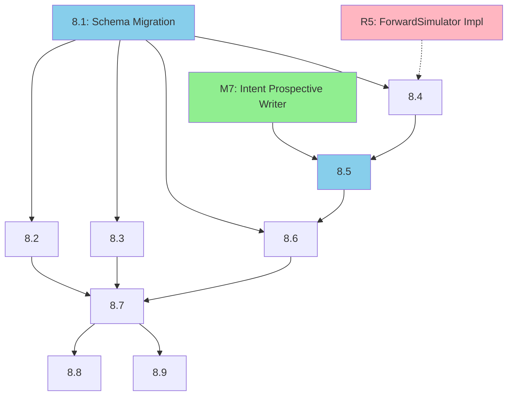

# GAP-001 Milestone 8: Intent-Aware Memory Formation

**Parent**: [GAP_001_CROSS_LAYER_VECTOR_LINKING.md](../architecture/gaps/GAP_001_CROSS_LAYER_VECTOR_LINKING.md)
**Phase**: 8 (Intent-Aware Memory Formation)
**Total Effort**: 4 days
**Dependencies**: M7 (Intent-Aware Prospective Writer), R5 ForwardSimulator implementation

---

## Overview

This milestone implements comprehensive intent-aware memory formation across all 8 UltraBERT intent types. While M7 handles the specific `set_reminder → st_prospective` flow, M8 extends intent-awareness to create secondary memories that can be used for dreaming and future reference.

### Intent → Memory Layer Matrix

| Intent | st_epi | st_sem | st_prospective | st_kg_dom | st_kg_edges |
|--------|--------|--------|----------------|-----------|-------------|
| log_memory | ✅ | — | — | — | — |
| query_memory | — | — | — | Query count++ | Query count++ |
| set_reminder | ✅ | — | ✅ REMINDER | Entity | — |
| express_feeling | ✅ | EMOTIONAL_TREND | — | Entity | Sentiment |
| seek_advice | ✅ | — | ✅ DECISION | Entity | — |
| share_news | ✅ | — | — | Milestone | — |
| reflect | ✅ | ✅ LESSON | — | Entity | Insight |
| other | ✅ | — | — | — | — |

### P03 Integration Points

```
R0 (Batch Selector) ─┬─ intent_label already populated in P03EventState
                     │
R1 (Importance Scorer) ─ Query entity salience boost
                     │
R4 (KG Consolidator) ─ Query tracking, milestone detection
                     │
R5 (Forward Simulator) ─ Intent signal detection [PLANNING]
                     │
R6 (Staging) ─ Intent routing to layer writers
                     │
R7 (Truth Writer) ─ Execute layer-specific writes
```

---

## Issues

### Issue 8.1: Schema Migration for Intent Memory Formation
**Effort**: 0.5 days
**Priority**: P0
**Depends On**: M1 (Schema Migration)

**Description**:
Add columns to support intent-aware memory formation signals.

**Acceptance Criteria**:
- [ ] Add `query_count INTEGER DEFAULT 0` to `st_kg_dom` for tracking entity query frequency
- [ ] Add `query_count INTEGER DEFAULT 0` to `st_kg_edges` for tracking relationship query frequency
- [ ] Add `decision_context TEXT` to `st_prospective` for storing seek_advice context
- [ ] Add `lesson_source_intent TEXT` to `st_sem` for tracking reflect origin
- [ ] Add `milestone_type TEXT` to `st_kg_dom` for share_news milestone detection
- [ ] Create migration script `migrations/20250125_intent_memory_columns.py`
- [ ] All migrations are idempotent and backward compatible

**Files to Create/Modify**:
- `k0/storage/migrations/20250125_intent_memory_columns.py` (new)
- `k0/contracts/schemas/st_kg_dom.yaml` (update)
- `k0/contracts/schemas/st_kg_edges.yaml` (update)
- `k0/contracts/schemas/st_prospective.yaml` (update)
- `k0/contracts/schemas/st_sem.yaml` (update)

---

### Issue 8.2: R1 Importance Scorer Query Entity Boost
**Effort**: 0.5 days
**Priority**: P1
**Depends On**: Issue 8.1

**Description**:
When processing `query_memory` intents, boost importance scores for entities mentioned in the query. This ensures frequently queried memories are preserved longer.

**Acceptance Criteria**:
- [ ] Detect `query_memory` intent in ImportanceScorer
- [ ] Extract entities from query using NER results already in P03EventState
- [ ] Apply salience multiplier (configurable, default 1.2x) to mentioned entities
- [ ] Log query boost application for observability
- [ ] Unit test for query boost calculation

**Files to Modify**:
- `k0/modules/consolidation/algorithms/importance_scorer.py`
- `tests/unit/modules/consolidation/algorithms/test_importance_scorer.py`

**Technical Notes**:
```python
# In ImportanceScorer.calculate_importance()
if event_state.intent_label == "query_memory":
    for entity in event_state.entities:
        entity_scores[entity.id] *= self.config.query_boost_multiplier
```

---

### Issue 8.3: R4 KG Consolidator Query Tracking
**Effort**: 0.5 days
**Priority**: P1
**Depends On**: Issue 8.1

**Description**:
Update KG Consolidator to track query counts on entities and edges. Also detect `share_news` intent for milestone creation.

**Acceptance Criteria**:
- [ ] For `query_memory` intent: increment `query_count` on matched st_kg_dom entities
- [ ] For `query_memory` intent: increment `query_count` on matched st_kg_edges relationships
- [ ] For `share_news` intent: detect milestone-worthy events (achievements, announcements)
- [ ] Set `milestone_type` (ACHIEVEMENT, ANNOUNCEMENT, TRANSITION) on st_kg_dom
- [ ] Unit tests for query tracking and milestone detection

**Files to Modify**:
- `k0/pipelines/p03/phases/r4_kg_consolidator.py`
- `k0/modules/consolidation/algorithms/kg_updater.py`
- `tests/unit/pipelines/p03/phases/test_r4_kg_consolidator.py`

---

### Issue 8.4: R5 Intent Signal Detection
**Effort**: 0.5 days
**Priority**: P1
**Depends On**: R5 ForwardSimulator implementation (Planning status)
**Status**: BLOCKED until R5 implemented

**Description**:
Add intent signal detection to ForwardSimulator (R5) to generate prospective and semantic signals based on intent type.

**Acceptance Criteria**:
- [ ] Detect `seek_advice` intent → generate DECISION prospective signal
- [ ] Detect `reflect` intent → generate LESSON semantic signal
- [ ] Detect `express_feeling` intent → generate EMOTIONAL_TREND semantic signal
- [ ] Signals include confidence score and supporting evidence
- [ ] Unit tests for each intent signal type

**Files to Modify**:
- `k0/modules/consolidation/algorithms/forward_simulator.py`
- `k0/modules/consolidation/signals/intent_signals.py` (new)
- `tests/unit/modules/consolidation/algorithms/test_forward_simulator.py`

**Note**: If R5 remains in Planning status, implement interim solution in R6 TruthWriteAssembler as per Issue 8.5.

---

### Issue 8.5: R6 Intent Routing in TruthWriteAssembler
**Effort**: 1 day
**Priority**: P0
**Depends On**: Issue 8.4 (or provides fallback if R5 blocked)

**Description**:
Update TruthWriteAssembler to route intent signals to appropriate layer writers. This is the central integration point for intent-aware memory formation.

**Acceptance Criteria**:
- [ ] Route `set_reminder` signals to ProspectiveLayerWriter with record_type=REMINDER (from M7)
- [ ] Route `seek_advice` signals to ProspectiveLayerWriter with record_type=DECISION
- [ ] Route `reflect` signals to SemanticLayerWriter with category=LESSON
- [ ] Route `express_feeling` signals to SemanticLayerWriter with category=EMOTIONAL_TREND
- [ ] Route `share_news` signals to KGLayerWriter with milestone_type
- [ ] If R5 is not implemented, perform intent signal detection inline
- [ ] All routing is configurable via policy
- [ ] Comprehensive unit tests for routing logic

**Files to Modify**:
- `k0/modules/consolidation/staging/truth_write_assembler.py`
- `contracts/policy/intent_routing.yaml` (new)
- `tests/unit/modules/consolidation/staging/test_truth_write_assembler.py`

**Intent Routing Configuration**:
```yaml
# contracts/policy/intent_routing.yaml
intent_routing:
  set_reminder:
    layer: prospective
    record_type: REMINDER
  seek_advice:
    layer: prospective
    record_type: DECISION
  reflect:
    layers:
      - semantic
    semantic_category: LESSON
  express_feeling:
    layers:
      - semantic
      - kg_edges
    semantic_category: EMOTIONAL_TREND
    edge_type: SENTIMENT
  share_news:
    layer: kg_dom
    entity_type: MILESTONE
  query_memory:
    layer: kg_dom
    action: increment_query_count
```

---

### Issue 8.6: R7 Layer Writer Updates for Intent Types
**Effort**: 0.5 days
**Priority**: P1
**Depends On**: Issue 8.5

**Description**:
Update layer writers to handle new intent-derived record types.

**Acceptance Criteria**:
- [ ] ProspectiveLayerWriter: Support DECISION record_type with decision_context
- [ ] SemanticLayerWriter: Support LESSON and EMOTIONAL_TREND categories
- [ ] SemanticLayerWriter: Track lesson_source_intent for audit
- [ ] KGLayerWriter: Support MILESTONE entity type with milestone_type
- [ ] All writers respect layer-specific retention policies
- [ ] Unit tests for each new record type

**Files to Modify**:
- `k0/modules/consolidation/truth_writer/layers/prospective.py`
- `k0/modules/consolidation/truth_writer/layers/semantic.py`
- `k0/modules/consolidation/truth_writer/layers/kg.py`
- `tests/unit/modules/consolidation/truth_writer/layers/test_prospective.py`
- `tests/unit/modules/consolidation/truth_writer/layers/test_semantic.py`
- `tests/unit/modules/consolidation/truth_writer/layers/test_kg.py`

---

### Issue 8.7: Integration Tests for Intent Memory Formation
**Effort**: 0.5 days
**Priority**: P1
**Depends On**: Issues 8.1-8.6

**Description**:
Create end-to-end integration tests validating that intents flow through P03 to create appropriate memory layer records.

**Acceptance Criteria**:
- [ ] Test: `seek_advice` event → st_prospective DECISION record
- [ ] Test: `reflect` event → st_sem LESSON record
- [ ] Test: `express_feeling` event → st_sem EMOTIONAL_TREND + st_kg_edges SENTIMENT
- [ ] Test: `share_news` event → st_kg_dom MILESTONE entity
- [ ] Test: `query_memory` event → incremented query_count on matched entities
- [ ] Tests validate correct timestamps, family_id, and retention metadata
- [ ] Tests use realistic event fixtures from test corpus

**Files to Create**:
- `tests/integration/pipelines/p03/test_intent_memory_formation.py`

**Test Structure**:
```python
class TestIntentMemoryFormation:
    """Integration tests for P03 intent-aware memory formation."""

    @pytest.mark.parametrize("intent,expected_layer,expected_type", [
        ("seek_advice", "st_prospective", "DECISION"),
        ("reflect", "st_sem", "LESSON"),
        ("express_feeling", "st_sem", "EMOTIONAL_TREND"),
        ("share_news", "st_kg_dom", "MILESTONE"),
    ])
    async def test_intent_creates_correct_record(
        self,
        p03_pipeline: P03Pipeline,
        intent: str,
        expected_layer: str,
        expected_type: str,
    ):
        """Verify intent flows through P03 to create correct record."""
        ...
```

---

### Issue 8.8: Dreaming Integration Documentation
**Effort**: 0.25 days
**Priority**: P2
**Depends On**: Issues 8.1-8.7

**Description**:
Document how intent-derived secondary memories integrate with the dreaming pipeline (P04) for reflection synthesis.

**Acceptance Criteria**:
- [ ] Document query_count usage in dreaming entity selection
- [ ] Document LESSON record usage in insight generation
- [ ] Document DECISION record usage in outcome tracking
- [ ] Document EMOTIONAL_TREND usage in affect calibration
- [ ] Add to P04 dossier or create cross-reference section

**Files to Create/Modify**:
- `docs/pipelines/P04_dream_dossier.md` (update dreaming integration section)
- `docs/architecture/gaps/GAP_001_CROSS_LAYER_VECTOR_LINKING.md` (add cross-reference)

---

### Issue 8.9: Observability and Metrics
**Effort**: 0.25 days
**Priority**: P2
**Depends On**: Issues 8.1-8.6

**Description**:
Add observability for intent-aware memory formation to track effectiveness.

**Acceptance Criteria**:
- [ ] Metric: `p03.intent_memory.records_created` counter by intent type
- [ ] Metric: `p03.intent_memory.routing_latency_ms` histogram
- [ ] Metric: `p03.intent_memory.query_boost_applied` counter
- [ ] Structured log for each intent-derived record creation
- [ ] Dashboard query examples in runbook

**Files to Modify**:
- `k0/modules/consolidation/staging/truth_write_assembler.py`
- `k0/modules/consolidation/algorithms/importance_scorer.py`
- `docs/runbooks/p03_observability.md`

---

## Dependency Graph



Legend:
- 🟢 Green: Completed dependency (M7)
- 🔴 Pink: External blocker (R5 in Planning)
- 🔵 Blue: Critical path

---

## Risk Assessment

| Risk | Impact | Mitigation |
|------|--------|------------|
| R5 ForwardSimulator not implemented | High | Issue 8.5 includes fallback inline detection in R6 |
| Schema migration conflicts with M1 | Medium | Coordinate migration scripts, test together |
| Query count overhead on hot path | Medium | Batch updates, async increment option |
| Intent misclassification pollution | Low | Confidence threshold, human feedback loop |

---

## Success Metrics

| Metric | Target | Measurement |
|--------|--------|-------------|
| Intent coverage | 6/8 intents create secondary memories | Audit log analysis |
| Query boost effectiveness | 15% improvement in re-query recall | A/B test |
| Dreaming relevance | 10% improvement in dream quality scores | User feedback |
| Processing overhead | < 5ms added latency per event | P03 metrics |

---

## Cross-References

- **M7**: [GAP_001_MILESTONE_7_INTENT_PROSPECTIVE_WRITER.md](GAP_001_MILESTONE_7_INTENT_PROSPECTIVE_WRITER.md) — set_reminder flow (prerequisite)
- **M3**: [GAP_001_MILESTONE_3_R7_WRITER_UPDATES.md](GAP_001_MILESTONE_3_R7_WRITER_UPDATES.md) — R7 layer writer infrastructure
- **P03 Dossier**: [P03_write_dossier.md](../pipelines/P03_write_dossier.md) — Pipeline context
- **UltraBERT**: Section 9 of GAP-001 — Capability utilization analysis
