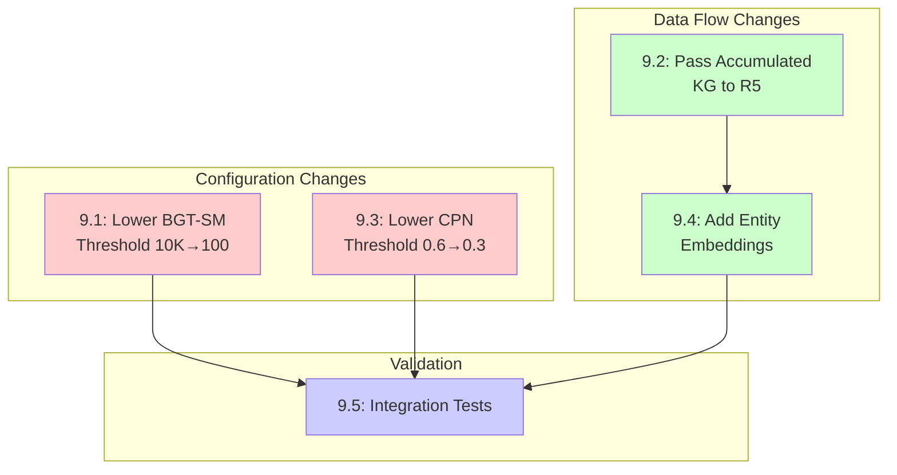

# GAP-001 Milestone 9: R5 Dream Stage Cold Start Fix

**Parent**: [GAP_001_CROSS_LAYER_VECTOR_LINKING.md](../architecture/gaps/GAP_001_CROSS_LAYER_VECTOR_LINKING.md)
**Phase**: 9 (R5 Dream Stage Cold Start Fix)
**Total Effort**: 3.5 days
**Dependencies**: None (can proceed independently)
**Status**: Identified (Jan 2026)

---

## Overview

This milestone addresses the R5 Dream Stage producing zero high-level outputs despite successful execution. During 2000-event consolidation testing, R5 algorithms completed without errors but generated no insights, counterfactuals, prospective memories, or routine optimizations.

### Problem Summary

| Algorithm | Expected Output | Actual Output | Root Cause |
|-----------|----------------|---------------|------------|
| BGT-SM | Insights | 0 | Cold start threshold (10K) not met; corpus_size_n=10 per batch |
| CPN | Counterfactuals | 0 | emotional_threshold=0.6 too strict; few episodes pass filter |
| SPC-UQ | Prospective Memories | 0 | Depends on BGT-SM insights; cascading failure |
| TDL-HCO | Routine Optimizations | 0 | No historical routines; needs accumulated data |
| IntentSignalDetector | Intent Signals | ✅ 1,580 | Working correctly (no cold start check) |
| MCTS | Forward Scenarios | ✅ 1/batch | Working correctly (pure simulation) |

### Key Files

| Component | File Path | Purpose |
|-----------|-----------|---------|
| DreamExplorer | `k0/modules/consolidation/dream/dream_explorer.py` | Orchestrates R5 algorithms |
| BGT-SM Algorithm | `k0/modules/consolidation/algorithms/bgt_sm.py` | Bisociative insight generation |
| CPN Algorithm | `k0/modules/consolidation/algorithms/cpn.py` | Counterfactual perturbation network |
| SPC-UQ Algorithm | `k0/modules/consolidation/algorithms/spc_uq.py` | Stochastic prospective cognition |
| TDL-HCO Algorithm | `k0/modules/consolidation/algorithms/tdl_hco.py` | Temporal difference motor rehearsal |
| R5 Phase Runner | `k0/pipelines/p03/phases/r5_dream_explorer.py` | P03 R5 phase orchestration |
| DreamConfig | `k0/modules/consolidation/dream/config.py` | R5 configuration dataclass |
| R5Config | `k0/pipelines/p03/r5_config.py` | Pipeline-level R5 settings |
| KGEntity | `k0/pipelines/p03/phase_outputs.py` | Entity dataclass (missing embedding) |
| DreamExplorerInput | `k0/modules/consolidation/dream/models.py` | R5 input model |

---

## Issues

### Issue 9.1: Lower BGT-SM Cold Start Threshold

**Effort**: 0.5 days
**Priority**: P1
**Depends On**: None

**Description**:
The BGT-SM (Bisociative Theory Semantic Memory) algorithm has a "cold start" threshold of 10,000 entities. If the corpus size is below this threshold, the algorithm returns an empty list immediately without generating any insights. During batch consolidation, each batch only passes ~10 new entities to R5, which is far below the 10K threshold.

**Current Code Analysis**:

```python
# File: k0/modules/consolidation/algorithms/bgt_sm.py (lines 85-89)
# Production defaults for P03 integration
P03_BGT_DEFAULT_CORPUS_SIZE = 10000
P03_BGT_COLD_START_THRESHOLD = 10_000
P03_BGT_DEFAULT_SEED_COUNT = 3
P03_BGT_PMI_THRESHOLD = 2.0
```

```python
# File: k0/modules/consolidation/algorithms/bgt_sm.py (lines 860-880)
async def discover(self) -> List[BisociativeInsight]:
    """
    Discover bisociative insights via remote association.
    """
    # Cold start guard - need minimum corpus for meaningful PMI
    if self.config.corpus_size_n < self.config.cold_start_threshold:
        self._logger.info(
            "Cold start: corpus too small for BGT-SM",
            extra={
                "corpus_size": self.config.corpus_size_n,
                "threshold": self.config.cold_start_threshold,
            },
        )
        return []  # <-- Returns empty immediately
```

```python
# File: k0/pipelines/p03/r5_config.py (lines 131-132)
# BGT-SM configuration (Issue 8.1.9, 8.1.10)
bgt_sm_corpus_size_n: int = 10000  # Corpus size N for PMI calculation
```

**Proposed Change**:

1. Reduce cold start threshold from 10,000 to 100 for early-stage KG:

   ```python
   # New value in bgt_sm.py
   P03_BGT_COLD_START_THRESHOLD = 100
   ```

2. Make threshold configurable via R5Config:

   ```python
   # In r5_config.py
   bgt_sm_cold_start_threshold: int = 100
   ```

3. Pass actual accumulated entity count instead of batch count.

**Acceptance Criteria**:

- [ ] BGT-SM generates insights with 100+ accumulated entities
- [ ] Cold start threshold is configurable via R5Config
- [ ] Logs indicate actual corpus size vs threshold
- [ ] Unit test validates insight generation at 100 entities

**Files to Modify**:

- `k0/modules/consolidation/algorithms/bgt_sm.py` (threshold constant)
- `k0/pipelines/p03/r5_config.py` (add configurable threshold)
- `k0/modules/consolidation/dream/config.py` (propagate threshold)

---

### Issue 9.2: Pass Accumulated KG to R5

**Effort**: 1 day
**Priority**: P1
**Depends On**: None

**Description**:
R5 currently receives only the NEW entities and edges created in the current batch (from R4). For BGT-SM to find meaningful bisociative connections, it needs access to the entire accumulated knowledge graph, not just the incremental additions. Each batch passes ~10 new entities when the algorithm needs hundreds to find cross-domain insights.

**Current Code Analysis**:

```python
# File: k0/pipelines/p03/phases/r5_dream_explorer.py (lines 374-384)
# Build input from envelope
input_data = DreamExplorerInput(
    cycle_id=envelope.context.cycle_id,
    tenant_id=envelope.context.tenant_id,
    space_id=envelope.context.space_id,
    recent_episodes=list(envelope.phases.r2_clusters),
    kg_entities=list(envelope.phases.r4_new_entities),  # NEW only - problem!
    kg_edges=list(envelope.phases.r4_new_edges),        # NEW only - problem!
    event_states=list(envelope.events),
)
```

```python
# File: k0/modules/consolidation/dream/models.py (lines 327-350)
@dataclass
class DreamExplorerInput:
    """Input to DreamExplorer.explore() method."""
    cycle_id: str
    tenant_id: str
    space_id: str
    recent_episodes: List = field(default_factory=list)
    kg_entities: List = field(default_factory=list)  # Only receives NEW per batch
    kg_edges: List = field(default_factory=list)     # Only receives NEW per batch
    event_states: List = field(default_factory=list)
```

**Proposed Change**:

1. Query accumulated KG before R5 execution:

   ```python
   # In r5_dream_explorer.py - before building DreamExplorerInput
   accumulated_entities = await self._load_accumulated_entities(
       tenant_id=envelope.context.tenant_id,
       space_id=envelope.context.space_id,
       limit=1000,  # Configurable cap
   )
   accumulated_edges = await self._load_accumulated_edges(
       tenant_id=envelope.context.tenant_id,
       space_id=envelope.context.space_id,
       limit=5000,
   )
   ```

2. Merge accumulated with new:

   ```python
   input_data = DreamExplorerInput(
       kg_entities=accumulated_entities + list(envelope.phases.r4_new_entities),
       kg_edges=accumulated_edges + list(envelope.phases.r4_new_edges),
       ...
   )
   ```

3. Add syscalls for KG retrieval:
   - `syscall_get_entities(tenant_id, space_id, limit)`
   - `syscall_get_edges(tenant_id, space_id, limit)`

**Acceptance Criteria**:

- [ ] R5 receives accumulated KG entities (not just batch-new)
- [ ] R5 receives accumulated KG edges (not just batch-new)
- [ ] Configurable limit on accumulated entities to prevent memory issues
- [ ] Performance: KG retrieval adds < 100ms to R5 phase
- [ ] Integration test validates accumulated KG is passed to DreamExplorer

**Files to Modify**:

- `k0/pipelines/p03/phases/r5_dream_explorer.py` (add KG loading)
- `k0/kernel/syscalls.py` (add get_entities/get_edges syscalls)
- `k0/modules/consolidation/dream/models.py` (document expected data)
- `k0/pipelines/p03/r5_config.py` (add accumulated_kg_limit config)

---

### Issue 9.3: Lower CPN Emotional Threshold

**Effort**: 0.5 days
**Priority**: P2
**Depends On**: None

**Description**:
The CPN (Causal Perturbation Network) uses an emotional threshold of 0.6 to select "regret events" for counterfactual generation. Only episodes with `abs(sentiment) >= 0.6` are selected, which filters out too many neutral events from everyday family life.

**Current Code Analysis**:

```python
# File: k0/modules/consolidation/algorithms/cpn.py (lines 70-85)
@dataclass
class CPNConfig:
    """Configuration for Causal Perturbation Network."""

    # Thresholds
    emotional_threshold: float = 0.6  # Min |sentiment| for regret selection
    top_k_regret_events: int = 10     # Max events to analyze
    max_counterfactuals_per_event: int = 3

    # Perturbation settings
    perturbation_std: float = 0.1
    min_plausibility: float = 0.3
```

```python
# File: k0/modules/consolidation/algorithms/cpn.py (lines 440-460)
def _select_regret_events(
    self,
    episodes: Sequence[EpisodeProtocol],
    rng: np.random.Generator,
) -> List[EpisodeProtocol]:
    """
    Select emotionally significant episodes for counterfactual analysis.

    Filters to episodes where |sentiment| >= emotional_threshold.
    """
    candidates = [
        ep for ep in episodes
        if hasattr(ep, 'sentiment') and abs(ep.sentiment) >= self.config.emotional_threshold
    ]

    if not candidates:
        return []  # <-- Returns empty when no episodes pass threshold
```

**Proposed Change**:

1. Lower default emotional threshold from 0.6 to 0.3:

   ```python
   # In cpn.py
   emotional_threshold: float = 0.3  # Lower for family life events
   ```

2. Make threshold configurable via R5Config:

   ```python
   # In r5_config.py
   cpn_emotional_threshold: float = 0.3
   ```

3. Add fallback to select top-N episodes by importance if no emotional match:

   ```python
   if not candidates:
       # Fallback: select top episodes by importance score
       candidates = sorted(episodes, key=lambda e: getattr(e, 'importance', 0), reverse=True)[:5]
   ```

**Acceptance Criteria**:

- [ ] CPN generates counterfactuals with threshold=0.3
- [ ] Fallback selection when no episodes pass emotional threshold
- [ ] Threshold configurable via R5Config
- [ ] Unit test validates counterfactual generation with neutral events

**Files to Modify**:

- `k0/modules/consolidation/algorithms/cpn.py` (threshold + fallback)
- `k0/pipelines/p03/r5_config.py` (add cpn_emotional_threshold)
- `k0/modules/consolidation/dream/config.py` (propagate threshold)

---

### Issue 9.4: Add Entity Embeddings to R5 Input

**Effort**: 1 day
**Priority**: P1
**Depends On**: Issue 9.2

**Description**:
The BGT-SM algorithm requires entity embeddings to compute semantic distance between concepts. Currently, `KGEntity` only stores `embedding_id` (a reference) but not the actual embedding vector. The `_extract_embeddings` method in DreamExplorer looks for an `embedding` attribute that doesn't exist.

**Current Code Analysis**:

```python
# File: k0/pipelines/p03/phase_outputs.py (lines 149-165)
@dataclass
class KGEntity:
    """Knowledge graph entity extracted in R4."""
    entity_id: str
    canonical_name: str
    entity_type: str
    aliases_json: str = "[]"
    confidence: float = 0.0
    embedding_id: Optional[str] = None  # Only stores ID, not vector!
    source_event_ids: List[str] = field(default_factory=list)
    is_new: bool = True
    # MISSING: embedding: Optional[List[float]] = None
```

```python
# File: k0/modules/consolidation/dream/dream_explorer.py (lines 524-546)
def _extract_embeddings(
    self,
    input_data: DreamExplorerInput,
) -> Dict[str, List[float]]:
    """Extract embeddings from KG entities."""
    embeddings: Dict[str, List[float]] = {}

    for entity in input_data.kg_entities:
        entity_id = getattr(entity, "entity_id", None)
        embedding = getattr(entity, "embedding", None)  # <-- Looks for 'embedding' attribute

        if entity_id and embedding and isinstance(embedding, (list, tuple)):
            embeddings[entity_id] = list(embedding)

    return embeddings  # <-- Returns empty dict since KGEntity has no 'embedding'
```

**Proposed Change**:

1. Add `embedding` field to `KGEntity`:

   ```python
   # In phase_outputs.py
   @dataclass
   class KGEntity:
       # ... existing fields ...
       embedding_id: Optional[str] = None
       embedding: Optional[List[float]] = None  # NEW: actual 768-dim vector
   ```

2. Populate embeddings during R4 entity extraction using embedding syscall:

   ```python
   # In r4_kg_consolidator.py
   embedding = await syscall_get_embedding(embedding_id)
   entity.embedding = embedding
   ```

3. Alternative: Load embeddings in R5 from `embedding_id`:

   ```python
   # In r5_dream_explorer.py
   for entity in accumulated_entities:
       if entity.embedding_id and not entity.embedding:
           entity.embedding = await syscall_get_embedding_vector(entity.embedding_id)
   ```

**Acceptance Criteria**:

- [ ] KGEntity includes `embedding` field with 768-dim vector
- [ ] DreamExplorer._extract_embeddings returns non-empty dict
- [ ] BGT-SM can compute semantic distances between entities
- [ ] Performance: embedding loading adds < 50ms per 100 entities

**Files to Modify**:

- `k0/pipelines/p03/phase_outputs.py` (add embedding field)
- `k0/pipelines/p03/phases/r4_kg_consolidator.py` (populate embedding)
- OR `k0/pipelines/p03/phases/r5_dream_explorer.py` (load embeddings from IDs)
- `k0/kernel/syscalls.py` (add get_embedding_vector syscall)

---

### Issue 9.5: Integration Tests for R5 Dream Outputs

**Effort**: 0.5 days
**Priority**: P1
**Depends On**: Issues 9.1-9.4

**Description**:
Create integration tests that validate R5 produces non-zero outputs for all algorithm types when given sufficient input data. Tests should use realistic data volumes (100+ entities, 50+ edges, 20+ episodes) to avoid cold start conditions.

**Current Test Gaps**:

1. Existing tests use mocks that return empty outputs
2. No tests validate BGT-SM insight generation end-to-end
3. No tests validate CPN counterfactual generation with real episodes
4. No tests validate entity embeddings flow from R4 to R5

**Proposed Test Suite**:

```python
# tests/k0/pipelines/p03/test_r5_dream_cold_start.py

class TestR5DreamColdStartFix:
    """Integration tests for R5 cold start fix (GAP-001 M9)."""

    @pytest.mark.integration
    async def test_bgt_sm_generates_insights_with_100_entities(self):
        """BGT-SM should generate insights when corpus > cold start threshold."""
        # Arrange: Create 100+ entities with embeddings
        # Act: Run R5 DreamExplorer
        # Assert: output.insights is not empty

    @pytest.mark.integration
    async def test_cpn_generates_counterfactuals_with_low_threshold(self):
        """CPN should generate counterfactuals with lowered emotional threshold."""
        # Arrange: Create episodes with sentiment 0.3-0.5
        # Act: Run R5 DreamExplorer
        # Assert: output.counterfactuals is not empty

    @pytest.mark.integration
    async def test_r5_receives_accumulated_kg(self):
        """R5 should receive accumulated KG, not just batch-new entities."""
        # Arrange: Pre-populate KG with 200 entities
        # Act: Run consolidation batch
        # Assert: DreamExplorerInput.kg_entities includes accumulated

    @pytest.mark.integration
    async def test_entity_embeddings_available_for_bgt_sm(self):
        """BGT-SM should have access to entity embeddings for semantic distance."""
        # Arrange: Create entities with embedding vectors
        # Act: Run R5 DreamExplorer
        # Assert: EmbeddingCache.has_embedding returns True for entities
```

**Acceptance Criteria**:

- [ ] Test validates BGT-SM generates >= 1 insight with 100+ entities
- [ ] Test validates CPN generates >= 1 counterfactual with threshold=0.3
- [ ] Test validates accumulated KG passed to R5
- [ ] Test validates entity embeddings available in EmbeddingCache
- [ ] All tests pass in CI/CD pipeline

**Files to Create**:

- `tests/k0/pipelines/p03/test_r5_dream_cold_start.py`

**Files to Modify**:

- `tests/k0/pipelines/p03/conftest.py` (add fixtures for 100+ entities)

---

## Dependency Graph



**Legend**: 🔴 Configuration | 🟢 Data Flow | 🔵 Validation

---

## Risk Assessment

| Risk                                    | Impact | Mitigation                                      |
|-----------------------------------------|--------|------------------------------------------------|
| Accumulated KG query too slow           | Medium | Add configurable limit (1000 entities default)  |
| Entity embeddings increase memory usage | Medium | Lazy load embeddings, cache with TTL            |
| Lower thresholds generate noise         | Low    | Add quality scoring for filtering low-value outputs |
| BGT-SM PMI calculation with small corpus| Medium | Add PMI smoothing for sparse data               |

---

## Success Metrics

| Metric                         | Target   | Measurement                           |
|--------------------------------|----------|---------------------------------------|
| BGT-SM insights per batch      | >= 1     | R5 phase output counter               |
| CPN counterfactuals per batch  | >= 1     | R5 phase output counter               |
| R5 phase latency               | < 500ms  | P03 phase timing logs                 |
| Entity embedding coverage      | >= 90%   | Entities with embedding / total       |
| Integration test pass rate     | 100%     | CI/CD pipeline                        |

---

## Cross-References

- [GAP_001_CROSS_LAYER_VECTOR_LINKING.md](../architecture/gaps/GAP_001_CROSS_LAYER_VECTOR_LINKING.md) - Parent gap document
- [P03_write_dossier.md](../pipelines/P03_write_dossier.md) - P03 pipeline specification
- [ADR-011: R5 Dream Stage Architecture](../architecture/decisions-K0/ADR-011-R5-DREAM-STAGE.md) - R5 design decisions
- [Milestone 8: Intent Memory Formation](GAP_001_MILESTONE_8_INTENT_MEMORY_FORMATION.md) - Related milestone
