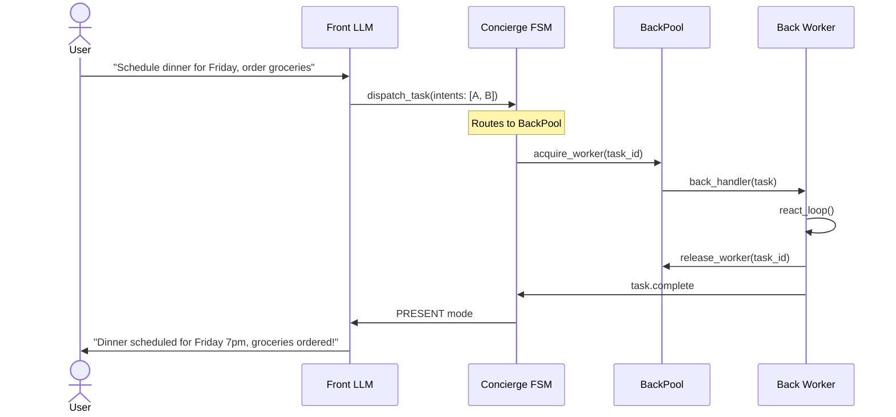
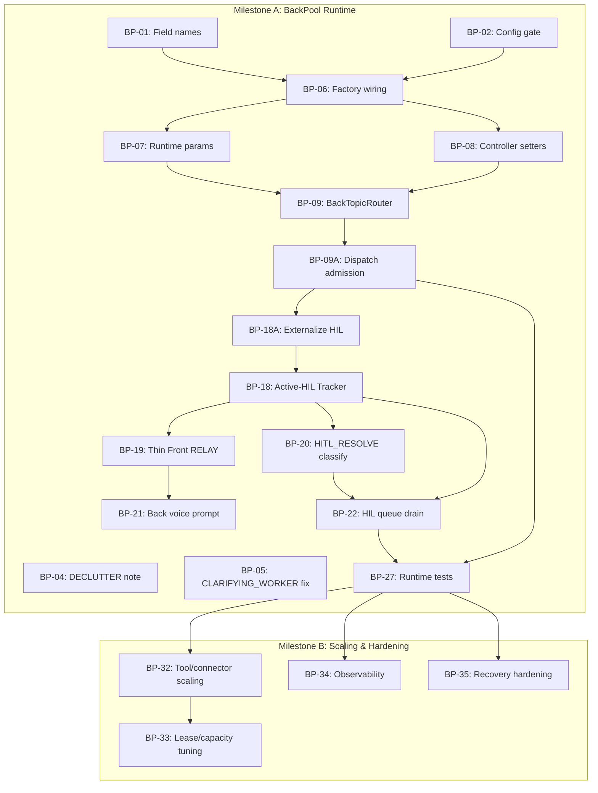

# BackPool & BackExecutionPlan — Architecture Plan

**Date:** 2026-06-18
**Branch:** `feature/prompt-architecture-refactor`
**Status:** Code discovery complete. Architecture normalized into three milestones:

- Milestone A: BackPool Runtime Foundation
- Milestone B: Back Execution Scaling & Hardening
- Milestone C: Dependency-Aware Intent Graphs (product-gated)

Milestone A is ready for issue-level implementation.
Milestone B builds on A with production hardening.
Milestone C remains blocked on product data proving multi-intent splitting is needed.

---

## Target End-State — Milestone A: BackPool Runtime Foundation

> Milestone A routes exactly ONE dispatch envelope to ONE BackPool worker.
> That envelope may contain one intent or a bundled multi-intent request.
> Multi-intent bundles execute sequentially inside one worker — no splitting.
>
> For complex multi-step requests requiring dependency-aware decomposition,
> the Concierge routes to the existing **Orchestrator/Planner pipeline**
> (SKETCH → EXPAND → VALIDATE → COMMIT). That is the Orchestrator's concern,
> not the Concierge's.

### Target End-State Diagram

```
                              ┌─────────────────────────────────────────┐
                              │               👤 USER                   │
                              │  "Plan dinner, invite family,           │
                              │   order groceries"                      │
                              └────────────────────┬────────────────────┘
                                                   │
                                                   ▼
                              ┌─────────────────────────────────────────┐
                              │          FRONT LLM (actor='front')      │
                              │                                         │
                              │  dispatch_task(intents: [A, B, C])      │
                              └────────────────────┬────────────────────┘
                                                   │
                                                   ▼
┌─────────────────────────────────────────────────────────────────────────────────┐
│                            CONCIERGE FSM                                          │
│                                                                                  │
│   _on_task_dispatch()                                                             │
│        │                                                                          │
│        ▼                                                                          │
│   ┌──────────────────────────────────────┐                                        │
│   │        INTENT SPLITTER               │                                        │
│   │  1 dispatch → N sub-tasks            │                                        │
│   │  parent_task_id                      │                                        │
│   │    ├── task_id.0  (schedule_dinner)  │                                        │
│   │    ├── task_id.1  (invite_family)    │                                        │
│   │    └── task_id.2  (order_groceries)  │                                        │
│   └──────────────────────────────────────┘                                        │
│        │                                                                          │
│        │  enqueue N envelopes                                                     │
│        ▼                                                                          │
└───────────────────────────────────────────────────────────────────────────────────┘
                                                   │
          ┌────────────────────────────────────────┼──────────────────────────────────────────┐
          │                                        │                                           │
          │    BackTopicRouter                     │                                           │
          │    ┌──────────────┐                    │                                           │
          │    │ dispatch ────┼─── acquire worker ─┤                                           │
          │    │ cancel   ────┼─── sync (no worker)│                                           │
          │    │ resume   ────┼─── acquire worker ─┤                                           │
          │    └──────────────┘                    │                                           │
          │                                        │                                           │
          │    ReadyQueue                          │                                           │
          │    ┌──────────────┐                    │                                           │
          │    │ depends_on   │                    │                                           │
          │    │ envelopes    │──── releases ──────┤                                           │
          │    │ cycle detect │                    │                                           │
          │    └──────────────┘                    │                                           │
          │                                        │                                           │
          └────────────────────────────────────────┼──────────────────────────────────────────┘
                                                   │
                                                   ▼
┌─────────────────────────────────────────────────────────────────────────────────┐
│                              BACKPOOL                                             │
│                                                                                  │
│   pool_size=3   max_concurrent_per_session=2                                     │
│                                                                                  │
│   ┌──────────────────┐   ┌──────────────────┐   ┌──────────────────┐             │
│   │ ACTIVE WORKER 0  │   │ ACTIVE WORKER 1  │   │ CAPACITY QUEUE   │             │
│   │   task_id.0      │   │   task_id.1      │   │   task_id.2      │             │
│   │                  │   │                  │   │                  │             │
│   │  dispatch        │   │  dispatch        │   │  dispatch         │             │
│   │  envelope A      │   │  envelope B      │   │  envelope C       │             │
│   │                  │   │                  │   │                  │             │
│   │  back_handler()  │   │  back_handler()  │   │  waits until one  │             │
│   │  react_loop()    │   │  react_loop()    │   │  session slot     │             │
│   └────────┬─────────┘   └────────┬─────────┘   │  becomes available │             │
│            │                      │              └──────────────────┘             │
│            │                      │                                               │
│            │    emit task.complete│    emit task.complete                        │
│            │    or task.failed    │    or task.failed                             │
│            │                      │                                               │
│            ▼                      ▼                                               │
│      Front PRESENT          Front PRESENT                                         │
│      (one result per        (one result per                                       │
│       dispatch envelope)     dispatch envelope)                                   │
│                                                                                  │
│   ┌──────────────┐                                                               │
│   │ OVERFLOW Q   │  ←─ when pool full, envelopes wait here                        │
│   └──────────────┘                                                               │
│                                                                                  │
└───────────────────────────────────────────────────────────────────────────────────┘


                         ─ ─ ─  HIL SIDE PATH  ─ ─ ─

   Worker suspends
        │
        │  needs_human
        ▼
   ┌──────────────────────┐
   │  k1.hil.request.v1   │
   │  bound to task_id     │
   └──────────┬───────────┘
              │
              │  FSM: CLARIFYING_WORKER
              │  Front: HITL_RELAY renders question
              ▼
   ┌──────────────────────┐
   │     👤 USER RESPONDS  │
   └──────────┬───────────┘
              │
              │  k1.hil.response.v1
              ▼
   ┌──────────────────────┐
   │  Worker resumes      │
   │  back_handler(resume)│
   │  react_loop()        │
   │  completes task      │
   └──────────────────────┘
              │
              │  emit task.complete
              ▼
        FSM: COMPANIONING → DELIVERING → Front PRESENT
```

### Component Inventory — What Each Piece Does

| # | Component | Responsibility | State |
|---|---|---|---|
| 1 | **Front LLM** | Owns conversation plane. Decides to bundle intents into `dispatch_task`. STANDARD/PRESENT/INTERRUPT/ERROR modes call LLM. HITL_RELAY is **zero-LLM pass-through**. HITL_RESOLVE uses **1 tiny LLM call** to classify HIL_ANSWER vs NEW_TOPIC. | ✅ Built; HITL pass-through + classification needs wiring |
| 2 | **Orchestrator/Planner** | Handles multi-step intent decomposition with dependency edges. Already exists (SKETCH → EXPAND → VALIDATE → COMMIT). Concierge routes complex requests here — does NOT build its own splitter. | ✅ Existing pipeline |
| 3 | **FSM Active-HIL Tracker** | Tracks the exact HIL request currently shown to the user. Required in Milestone A because separate concurrent tasks from the same session can both suspend for HIL. | ❌ Required in Milestone A |
| 4 | **BackPool** | Manages N concurrent worker slots. Acquires/releases leases. Enforces `pool_size` and `max_concurrent_per_session`. Overflow queue when full. | ✅ Built, not wired |
| 5 | **Back LLM Workers** | One worker executes one dispatch envelope, which may contain one or several bundled intents. Workers are isolated asyncio.Tasks with independent SessionState snapshots. | ✅ Handler built; pool launch wiring needed |
| 6 | **BackExecutionPlan** | ⚠️ Retained for future Orchestrator use. Not wired in Concierge. The Orchestrator owns intent decomposition and aggregation — Concierge does not. | 🔒 Orchestrator concern |
| 7 | **Aggregator** | ⚠️ Orchestrator concern. The Orchestrator aggregates child task results. Concierge emits ONE task.complete per dispatch envelope — no merging needed. | 🔒 Orchestrator concern |
| 8 | **BackTopicRouter** | Routes incoming Back-bound envelopes by topic: dispatch/resume → acquire worker; cancel → sync handler. Discards late envelopes. | ✅ Built, not wired |
| 9 | **ReadyQueue** | Holds envelopes with `depends_on` until predecessor completes. Cycle detection. Auto-releases when dependency resolves. | ✅ Built, not wired |
| 10 | **HIL Routing** | HIL is bound to a normal task_id. The Active-HIL Tracker gives Front the exact request and task IDs. | ❌ Needs build |
| 11 | **Front PRESENT** | Receives ONE `task.complete` per dispatch envelope. Synthesizes Back's structured result into user-facing message. No merged/partial results needed — one envelope = one result. | ✅ Built |

### Design Principle — One Envelope, One Worker, One Result

```
                    ┌──────────────────────────────────────────┐
                    │  One dispatch envelope = one worker       │
                    │  One worker = one task.complete           │
                    │                                          │
                    │  The Concierge does NOT split envelopes.  │
                    │  The Orchestrator decomposes complex      │
                    │  multi-step requests into child tasks.     │
                    │                                          │
                    │  The BackPool executes whatever work      │
                    │  items it receives — one per worker.      │
                    └──────────────────────────────────────────┘
```

### Data Flow — End to End (Milestone A)



### What Changes vs What Stays the Same

| Layer | Stays the Same | Changes |
|---|---|---|
| **Front LLM** | Owns conversation plane; `dispatch_task` schema; react_loop for STANDARD/PRESENT/INTERRUPT/ERROR modes | **HITL_RELAY → zero-LLM pass-through:** Back formats user-facing question, Front writes to history & publishes without LLM rephrasing. **HITL_RESOLVE → 1 tiny LLM classification call** (HIL_ANSWER vs NEW_TOPIC), then publishes HIL response. |
| **FSM** | States, weave policy, HIL relay | Routes dispatches through BackPool. Tracks active HIL requests. Releases slots on suspend, reacquires on resume. |
| **Back LLM** | `back_handler`, react_loop, tool set | **User-facing question formatting** (not raw tool language). Runs in isolated BackPool worker slot. |
| **Bus** | Topics, envelope format | BackTopicRouter replaces inline topic-switch |
| **HIL Service** | `needs_human()` → Future pattern, `_on_response()` | No change — already handles N concurrent pendings |
| **Front PRESENT** | ONE completion trigger per dispatch (unchanged contract) | No change — one envelope = one worker = one result |
| **Conversation Continuity** | Front writes all history entries | No change — but HIL questions/answers are now Back-authored, not Front-rephrased. History integrity preserved. |
| **Orchestrator** | SKETCH → EXPAND → VALIDATE → COMMIT pipeline | No change — Concierge routes complex requests here. Orchestrator owns intent decomposition. |

---

## Present Flow — Single Back LLM (as built today)

### 1. Front → Task Dispatch

```
User message
  → Front LLM (react_loop, actor="front")
    → Front calls dispatch_task(intents: [{action, params}, ...])
    → Publishes k1.orchestration.task.dispatch.v1
```

**✅ A1: How does Front decide to bundle intents?**

Front is told by the `DISPATCH_RULES` prompt section (`prompt/sections.py:526–582`) to **always bundle** into ONE `dispatch_task` call:

> **Independent intents** ("book hotel AND search restaurants"): Bundle in ONE `intents[]` array. Do NOT set `depends_on`.
> **Sequential intents** ("add items THEN place order"): ALSO bundle in ONE `intents[]` array. Order logically. Do NOT set `depends_on`.
> **Chained tasks** (rare — second task needs result of first): Call `dispatch_task` twice across iterations. Use the returned `task_id` in the second call's `depends_on`.

The schema description (`schemas_front.py:468`) reinforces: *"For multi-intent messages (including sequential ones), call dispatch_task ONCE with all intents..."*

There is **no kernel-side splitting**. One `dispatch_task` tool call = 1 entry in `dispatched_tasks[]` = 1 bus event, regardless of intent count.

---

**✅ A2: What does the dispatch payload look like on the wire?**

Topic: `k1.orchestration.task.dispatch.v1` (Priority: INTERACTIVE)

Schema fields (`schemas_front.py:460–568`):

| Field | Type | Required | Description |
|---|---|---|---|
| `intents` | `array` of objects, `minItems: 1` | **Yes** | One or more intents to execute |
| `intents[].action` | `string` | **Yes** | What to do (natural language or capability name) |
| `intents[].params` | `object` | No | Structured parameters from conversation & beliefs |
| `intents[].resource_family` | `string` | No | Taxonomy hint: `"item"`, `"event"`, `"task"` |
| `intents[].operation_hint` | `string` | No | `"create"`, `"read"`, `"update"`, `"delete"` |
| `urgency` | `string` enum | No | `"normal"` (default), `"urgent"`, `"background"` |
| `reference_context` | `object` | No | Resolved references for Back worker (pronouns→names) |
| `depends_on` | `string` | No | Task ID from previous dispatch. Must start with `"task-"` |
| `plan` | `boolean` | No | Set `true` when task requires planner/specialist workflow |

Implementation (`implementations.py:1228–1355`) adds auto-derived fields:

| Field | Source |
|---|---|
| `task_id` | Auto-generated: `"task-{uuid4().hex[:8]}"` |
| `tier` | Derived: `plan=true` or `depends_on` → `MEDIUM`; `complexity=HIGH` → `HIGH`; else `LOW` |
| `budget_hint` | From tier: LOW=1, MEDIUM=3, HIGH=5 |
| `safety_band` | Default `"GREEN"` unless LLM sets `"AMBER"`/`"RED"` |

FSM enriches with `reference_context` (scoreboard referents), `narrative_thread`, `turn_state_overlay`, `trace_id`, `session_id` before routing.

---

**✅ A3: Does Front ever attach `depends_on` between intents?**

**Rarely — only for cross-iteration chaining.** Front is explicitly steered AWAY from `depends_on` for all common cases.

`depends_on` is a **top-level** field on `dispatch_task` (NOT per-intent). It takes a `task-xxx` ID string. Two independent guard clauses (in `implementations.py:1248` and `controller.py:278`) defensively strip any value not starting with `"task-"` — strong evidence the LLM has historically misused this field.

The **primary** path for `depends_on` to be set is the **internal classifier** (`task/classifier.py`) auto-detecting `$ref` params and building CHAINED dispatches — not the Front LLM.

### 2. FSM Receives Task Dispatch

```
FSM._on_task_dispatch()
  → Registers ONE task_id for the dispatch
  → State: DISPATCHING → COMPANIONING
  → Routes to Back via _route_via_orchestrator()
```

**✅ B1: What fields does FSM extract from the envelope?**

`_on_task_dispatch` (`controller.py:2782`) receives `k1.orchestration.task.dispatch.v1`. Parsed via `_task_dispatch_from_payload()` → `TaskDispatch` dataclass:

| Field | Type | Default | Usage |
|---|---|---|---|
| `task_id` | `str` | auto-gen `"task-{uuid8}"` | Primary key, registered everywhere |
| `intents` | `list[dict]` | falls back to `action` | Parsed into `list[TaskIntent]`; 1st intent's `.action` → TaskBridge |
| `tier` | `str` | `"LOW"` | Coerced via `_coerce_tier()` → `ComplexityTier`; drives routing |
| `budget_hint` | `int` | auto-computed from tier | ReAct loop iteration budget |
| `reference_context` | `dict` | `None` | Enriched with scoreboard referents if Front didn't populate |
| `safety_band` | `str` | `"GREEN"` | Validated: `GREEN\|AMBER\|RED` |
| `depends_on` | `str` | `None` | **Stripped if not starting with `"task-"`** (LLM guard) |
| `context_snapshot` | `dict` | `None` | Passed to orchestrator context |
| `execution_profiles` | `list[dict]` | `None` | Passed through for Back resume/audit |
| `grounding`, `grounding_envelope_id`, `temporal_anchor_id`, `spatial_context_id`, `resolved_temporal_refs`, `resolved_spatial_refs` | various | `None` | Passed through to orchestrator context |

FSM enriches with: `reference_context` (scoreboard fallback), `narrative_thread`, `turn_state_overlay`, `trace_id`, `session_id`.

**State persisted:**

- `TaskBridge.dispatch_task(task_id, action)` → `TaskStateSection.add_task(status=DISPATCHED)` + ledger `TaskCreated`
- `_active_task_ids.add(task_id)`, `_task_dispatch_turns[task_id] = turn_number`
- `_cancel_handler.register_task(task_id)`, `_control_ext.add_active_task(task_id)`
- `_running_tasks[task_id] = RunningTaskHandle(control_queue, dispatch_payload)`

**Transition:** DISPATCHING → COMPANIONING (idempotent: COMPANIONING → COMPANIONING for multi-dispatch).

---

**✅ B2: How does tier routing work (LOW / MEDIUM / HIGH)?**

Tier is **derived**, not set directly by the LLM. Algorithm (`implementations.py:1254`):

```
complexity="HIGH"  → HIGH
plan=true OR depends_on → MEDIUM
default             → LOW
```

Routing (`_route_via_orchestrator`, `controller.py:2855`):

| Tier | Budget (Back iterations) | Route |
|---|---|---|
| **LOW** | 6 | → `_deliver_to_back()` directly via MailboxRouter |
| **MEDIUM** | 10 | → OrchestratorStub (if wired) → Fabric → Back; else **falls back to Back directly** (same as LOW) |
| **HIGH** | 14 | → Orchestrator (full Planner pipeline: SKETCH/EXPAND/VALIDATE/COMMIT); if orchestrator not wired → degrade to MEDIUM (passthrough) or fail |

**In current POC/test contexts without orchestrator: LOW = MEDIUM = same Back path.** All dispatch uses a single topic: `k1.orchestration.task.dispatch.v1`. Tier is a field inside the payload, not a topic.

Tool allowlists differ per tier: Back LOW has 5 tools, MEDIUM/HIGH adds `spawn_via_fabric` + `execute_workflow` (7 tools).

---

**✅ B3: What does TaskBridge store for this task?**

`TaskBridge` (`fsm/task_bridge.py:49`) wraps `TaskStateSection` + `TaskArtifactsSection` in SessionState. **Per-task fields** (`TaskStateEntry` dataclass):

| Field | Type | Description |
|---|---|---|
| `task_id` | `str` | UUID |
| `action` | `str` | Capability name (e.g. `"order_food"`) |
| `status` | `str` | One of: `PENDING`, `DISPATCHED`, `ACTIVE`, `SUSPENDED`, `COMPLETED`, `FAILED`, `CANCELLED` |
| `dispatched_at_ms` | `int` | Epoch ms when dispatched |
| `completed_at_ms` | `int` | Epoch ms when terminal |
| `depends_on` | `list[str]` | Task IDs this task depends on |
| `progress_pct` | `int` | 0–100 |
| `pending_hil` | `bool` | True when awaiting human input |
| `hil_suspensions_count` | `int` | Number of HIL suspensions |
| `presented_at_turn` | `int` | Turn number when result shown |
| `pending_hil_data` | `dict\|None` | Serialized HIL envelope for crash recovery |

**Task lifecycle:** `DISPATCHED → ACTIVE → (SUSPENDED → ACTIVE)* → COMPLETED/FAILED/CANCELLED`

**Key methods:** `dispatch_task`, `activate_task`, `suspend_task`, `resume_task`, `complete_task`, `fail_task`, `cancel_task`, `set_pending_hil_data`, `get_suspended_tasks`.

TaskBridge is the **Single Writer** to task state. Back LLM never writes directly — it emits bus deltas that FSM routes through TaskBridge.

### 3. Back LLM Receives and Executes

```
back_handler()
  → Reads SessionState snapshot ONCE
  → Builds system prompt from task + beliefs + referents + registry hints
  → Messages: 5-entry chat history + task JSON as user message
  → react_loop(actor="back")
    → Back calls tools: resolve_situation, invoke_capability, batch_invoke_capabilities
    → Processes ALL intents SEQUENTIALLY in one react_loop
    → Ends with submit_result(complete) or submit_result(needs_human)
  → _emit_back_result() → k1.orchestration.task.complete.v1
```

**✅ C1: How does Back LLM know which intent it is working on?**

**It doesn't, structurally.** Back receives the FULL `intents[]` array as one JSON block and relies entirely on LLM reasoning to process it. No per-intent iteration mechanism exists.

The task payload enters Back through TWO channels:

1. **System prompt** (`back_prompt.py:192`): `_strip_task_for_prompt()` keeps ALL intents but strips each to `{action, params, resource_family, operation_hint}`.
2. **User message** (`back.py:1562`): `json.dumps(task, indent=2)` — the FULL un-stripped task dict.

Back's prompt describes a **single-task protocol**: call `resolve_situation` ONCE → execute (1-2 tools) → `submit_result` ONCE. There is zero guidance about iterating over intents, processing them in order, or combining per-intent results.

**`BundledExecutionPlan`** (`task/bundled_executor.py`) exists as a designed-but-**unwired** class that would track per-intent execution (`IntentResult` per intent, `all_success`, `completed_intents`). It's only used in tests — never imported by `back.py` or `loop.py`.

---

**✅ C2: What happens when one intent fails but others succeed?**

**There is no per-intent success/failure tracking.** The `submit_result` schema (`schemas_back.py:328`) has only TWO `result_type` values:

```
"enum": ["complete", "needs_human"]
```

There is **no `"partial"` result type**. No `failed_intents` list. No per-intent status field.

The `submit_result` handler (`implementations.py:2114`) is a pure pass-through — it does not inspect results or validate completeness. `_emit_back_result()` routes binarily: `"complete"` → `task.complete.v1`, `"suspended"` → HIL, everything else → `task.failed.v1`.

**What Back LLM can do when an `invoke_capability` fails:**

- Retry with different params (up to 2 retries before the retry guard marks it terminal)
- Try a different capability
- Call `submit_result(needs_human)` to escalate
- Call `submit_result(complete)` with whatever partial results it gathered — **even if some intents failed**

`react_loop` terminates immediately on `submit_result` — it trusts the LLM's declaration. No kernel-level cross-check against the original intents list.

**⚠️ Note:** With per-intent parallel workers (Orchestrator concern, not Concierge), each worker would process ONE intent independently. Result merging would be handled by the Orchestrator's aggregation layer. The Concierge does not split intents or merge results — it routes complex requests to the Orchestrator.

---

**✅ C3: HIL: what happens when Back suspends mid-task?**

Full trace (already partially documented in HIL Flow section above; here are the key mechanics):

**Checkpoint capture** (`_build_react_checkpoint`, `back.py:866`):

| Field | Source |
|---|---|
| `task_id` | Task UUID |
| `messages` | Serialized full message list (role, content, tool_call_id, etc.) |
| `tool_history` | `tool_dispatcher.get_execution_records()` → each record `.to_dict()` |
| `completed_tool_call_ids` | Filtered from tool_history: records with `result_status` in `{"ok", "partial"}` and non-empty `call_id` |
| `suspension_count` | Incremented on each re-suspend (default 1) |
| `budget_remaining` | `max(0, max_iterations - len(result.iteration_durations_ms))` |
| `scratchpad` | `{"loop_events": list(result.loop_events)}` |

**Resume message format** (`_hil_response_resume_message`, `back.py:947`):

```
== RESUME AFTER HUMAN INPUT (round N) ==
Suspension #M. Budget remaining: B iterations.
Already completed tools: [tool_name_1, tool_name_2, ...]
Continue the task. Do NOT re-execute already-completed tools unless
the human explicitly asked for a different outcome.
Do not ask the same question again unless the answer is insufficient.

Human response:
{"hil_request_id": "...", "decision": "...", "raw_user_text": "...", "resolution": {...}}
```

**Dedup on resume:** `react_loop` receives `completed_tool_call_ids` and `completed_tool_arg_keys`. Before executing any tool, the loop checks if the tool call ID or `"{tool_name}:{args_hash}"` key is in the completed sets — if so, the tool is skipped and a synthetic `ToolResult(status="ok", data={"dedup": true})` is returned immediately.

**Budget on resume:** Uses `cp_budget_remaining` if available, else `max(2, max_iterations)`. After the first resume round, dedup state is cleared so the LLM can re-execute previously-completed tools if the human asked for a different outcome.

**Multi-round HIL:** The `_resolve_needs_human_in_process` loop supports up to `max_suspensions_per_task` (default 2) rounds. Each round: await HIL → build resume message → call `react_loop` with dedup. If still suspended after max rounds, returns `status="budget_exhausted"`.

### 4. FSM Receives Task Completion

```
FSM._on_task_complete()
  → State: COMPANIONING → DELIVERING
  → WeavePolicy decides: IMMEDIATE / BATCH / DEFER
  → Delivers structured result to Front for PRESENT mode
```

**✅ B4: WeavePolicy decision criteria?**

`WeavePolicy` (`protocols/weave_policy.py`) collects `WeaveSignal` (7 dimensions: fsm_state, pending_count, has_critical, user_typing, user_idle_ms, emotional_gate, backpool_utilization, hitl_pending), then evaluates a **10-rule priority-ordered decision table** (first match wins):

| Rule | Condition | Decision | Window |
|---|---|---|---|
| R0 | Policy disabled | BATCH | 500ms |
| R1 | LISTENING + idle > 10s | **IMMEDIATE** | 0ms |
| R2 | has_critical + gate=open | **IMMEDIATE** | 0ms |
| R3 | user_typing | **DEFER** | — |
| R4 | gate=suppress_all_non_safety | **SUPPRESS** | — |
| R5 | gate=suppress_trivial + !critical | **DEFER** | — |
| R5.5 | hitl_pending + !critical | **DEFER** | — |
| R6 | pending ≥ 3 + all low urgency | **DIGEST** | 15s |
| R7 | pending ≥ 1 + idle > 3s | **BATCH** | dynamic 200–5000ms |
| R8 | backpool_util > 0.8 | **BATCH** | 2s |
| R9 | (default fallback) | **BATCH** | 500ms |

**5 decisions → 5 different delivery behaviors:**

- **IMMEDIATE:** Transition to DELIVERING, flush all results to Front NOW.
- **BATCH:** Schedule `asyncio` timer for window_ms, then flush.
- **DEFER:** Move results to `deferred_results` queue; inject into next STANDARD prompt as `async_results_context`. Force-deliver after 5 consecutive defers.
- **DIGEST:** Accumulate for 15s, compress into summary via `DigestPayload`, deliver once.
- **SUPPRESS:** Discard result from all queues; logged for audit only.

**Emotional gate** (`_compute_emotional_gate`): reads `SessionState.affective_now`:

- `valence ≥ -0.5` → `"open"` (all results can weave)
- `valence < -0.5` → `"suppress_trivial"` (only critical/urgent break through)
- `emotion=crisis` OR `safety_band=RED` → `"suppress_all_non_safety"`

Config knobs: `WeavePolicyConfig` with 12 tunables (`idle_eager_ms=10s`, `digest_window_ms=15s`, `max_consecutive_defers=5`, etc.).

---

**✅ B5: Same-turn suppression logic?**

Three-layer anti-double-delivery mechanism:

**Layer 1: IdempotencyLedger** (`fsm/idempotency.py`). Before any handler runs, checks `envelope.envelope_id` against an LRU cache. Same envelope ID in same turn → skipped. Prevents bus re-delivery from causing duplicate processing.

**Layer 2: FrontLock** (`fsm/front_lock.py`). Primary serialization gate. Front LLM is a single-threaded actor:

- `try_deliver()`: If `busy=False` → sets `busy=True`, returns `True` (caller delivers). If `busy=True` → inserts into priority queue, returns `False` (caller must NOT deliver).
- Priority order: URGENT (user.input) > INTERACTIVE (HIL, task.suspended) > RESULT (task.complete) > ERROR (task.failed) > INFO (findings).
- `release()`: Pops next event from queue. If queue empty → `busy=False`. If event exists → `busy` stays `True`, caller delivers next event.
- Backpressure: queue > 8 items → evict lowest-priority event.

**Layer 3: `response_final_table.py`** — 13-branch decision table for what happens AFTER Front finishes. Key bifurcation:

- `release_front_lock=True` (WEAVING/COMPANIONING): Front is freed but queue NOT drained — weave handles subsequent delivery.
- `drain_front_lock=True` (LISTENING): Queue MUST be drained because any queued `user.input` needs a new turn.
- `release_front_lock` and `drain_front_lock` are **mutually exclusive** across all 13 branches.

**What happens when task.complete arrives while Front is busy?** It's inserted into FrontLock's priority queue at RESULT priority. When Front finishes, `release()` pops the next highest-priority event and delivers it. If Front is in LISTENING after the response, `_drain_front_lock_queue` drains all queued events in priority order.

### 5. Front Presents Result

```
front_handler(mode=PRESENT)
  → Front LLM synthesizes Back's structured result into user-facing text
  → Publishes k1.response.final.v1
```

**✅ A4: What data does Front receive from Back's task.complete?**

Topic: `k1.orchestration.task.complete.v1` (Priority: INTERACTIVE)

`_emit_back_result()` (`back.py:1220–1300`) constructs the payload:

| Field | Type | Source |
|---|---|---|
| `task_id` | `string` | Auto-generated UUID |
| `action` | `string` | First intent's action from original dispatch |
| `result_type` | `"complete"` | Hardcoded |
| `final_answer` | `string` | Back LLM's `submit_result.final_answer` |
| `results` | `list[dict]` | Back LLM's `submit_result.results` |
| `artifacts_created` | `list[dict]` | Back LLM's `submit_result.artifacts_created` |
| `frame` | `dict` | Serialized `BackResultFrame` (same data in structured form) |
| `tool_call_summaries` | `list[dict]` | Added by `_emit_back_result` from ReAct loop observability |
| `confidence` | `float` | Optional, from submit_result |
| `blockers` | `list` | Optional, from submit_result |
| `suggested_next_action` | `string` | Optional, from submit_result |
| `semantic_context` | `dict` | Optional, from submit_result |
| `presentation_guidance` | `string` | Optional, from submit_result |

Front's `extract_scenario_data(mode=PRESENT)` (`front.py:446–510`) reads the `BackResultFrame` and produces 13 flat fields for the prompt template: `task_description`, `task_result_summary`, `task_facts`, `task_artifacts`, `task_confidence`, `task_blockers`, `suggested_next_action`, `semantic_guidance`, `artifacts`, `completed_before_cancel`, `results`, `tool_history`.

---

**✅ A5: How does Front phrase "X, Y, and Z are all done"?**

**Results are presented as a SINGLE combined/flat structure — NOT per-intent.** The `BackResultFrame` has one flat `facts` list. Front's PRESENT prompt template (`scenario_templates.py:43–57`) renders them as one undifferentiated block:

```
== TASK RESULT TO PRESENT ==
Task: {task_description}
Confirmed facts:
{task_facts}              ← ALL facts from ALL intents, concatenated
Artifacts:
{task_artifacts}          ← ALL artifacts, concatenated
...
Present what changed naturally in Front's voice. Lead with the useful outcome,
not the internal task.
```

The prompt **explicitly discourages** numbered/structured delivery:

- *"Do NOT sound like an operation log"*
- *"Do NOT parrot results verbatim. Interpret and present in your voice"*
- *"Lead with the user-visible outcome: what is now done, scheduled, saved"*
- *"Interpret, contextualize, highlight what matters"*

**There is NO multi-intent phrasing guidance.** The prompt uses singular language throughout (`Task:`, `result`). Multi-intent results are left to the LLM to improvise. Front would naturally produce integrated narrative like *"The Vineyard Inn is booked for Friday, and I grabbed a 7pm reservation at Bottega"* rather than *"1) booked hotel, 2) reserved restaurant."*

**⚠️ Note:** If the Orchestrator splits a dispatch into child tasks, the Orchestrator handles result merging and produces the final `task.complete`. The Concierge's Front PRESENT receives one result per dispatch envelope — unchanged from today.

### 6. Key Properties of Present Flow

- [x] **ONE task = ONE back_handler call = ONE react_loop = ONE task.complete** — Confirmed. Front bundles all intents into one `dispatch_task`. FSM creates one `TaskDispatch`. Back receives the full `intents[]` array and runs one `react_loop` culminating in one `submit_result`. One `_emit_back_result()` publishes one `task.complete.v1`.
- [x] **Multi-intent is sequential within a single LLM context** — Confirmed. Back has no per-intent iteration mechanism. The LLM sees all intents in the system prompt + user message and processes them as one combined task via its own reasoning. `BundledExecutionPlan` exists but is unwired.
- [x] **Message history IS the execution plan** — Confirmed. There is no structured execution plan wired into `loop.py`. Back's `react_loop` doesn't know about individual intents. The LLM uses the conversation context (system prompt + user message + tool results) as its working memory. This works for single-worker but does NOT work for parallel workers — they can't share message history.
- [x] **No per-intent tracking needed** — Confirmed for single-worker mode. With Option B, per-intent tracking becomes essential. The unwired `BundledExecutionPlan` is the right foundation.
- [x] **No aggregation needed** — Confirmed. One Back LLM produces one result per dispatch envelope. The WeaveBatcher handles batching results from multiple independent dispatches into a single Front response. For complex multi-step requests, the Orchestrator handles decomposition and aggregation.

**✅ Present Flow section complete.** All 5 subsections filled from code exploration.

---

## Future Flow

### Milestone A: One Dispatch Envelope Per BackPool Worker

1. Front publishes one task.dispatch envelope.
2. The envelope may contain one intent or several bundled intents.
3. BackTopicRouter performs dependency admission:
   - unresolved depends_on → ReadyQueue
   - dependency satisfied → capacity admission
4. Capacity admission attempts to acquire a BackPool slot:
   - capacity available → start one worker
   - pool/session limit reached → capacity queue
5. The worker runs one back_handler and one react_loop.
6. A bundled envelope remains bundled and executes in one worker.
7. Completion releases the slot and drains the next eligible capacity item.
8. HIL suspension:
   - persist checkpoint
   - transition lease to SUSPENDED
   - release worker slot
   - keep exact active-HIL request mapping
9. HIL resume:
   - classify HIL_ANSWER vs NEW_TOPIC
   - enqueue resume at INTERACTIVE capacity priority
   - reacquire a slot
   - continue from checkpoint
10. One dispatch produces one task.complete or task.failed.

Milestone A has no:

- parent/child task graph
- intent splitter
- BackExecutionPlan
- partial parent completion

### Milestone C: Dependency-Aware Intent Graphs (product-gated)

Prerequisites:

- dependency_mode on every intent
- depends_on_intent_indexes on every intent
- Front prompt/schema support
- durable BackExecutionPlan storage

Flow:

1. Build an intent dependency graph.
2. Create child tasks only for intents whose dependency semantics are explicit.
3. ReadyQueue gates dependency readiness.
4. Capacity queue gates BackPool availability.
5. Each child envelope carries:
   - parent_task_id
   - child_task_id
   - intent_index
   - batch_id
6. Each worker writes only to plan.work_items[intent_index].
7. BackExecutionPlan is persisted after every terminal or suspension transition.
8. Orchestrator aggregates child task results (not Concierge concern).
9. Merge is triggered only by plan.can_submit_complete().
10. Parent completion uses a deterministic idempotency key and is emitted once.

---

## HIL Flow — Current State & Multi-HIL Analysis

### Current HIL Flow (Single Worker — Traced from Code)

This is the end-to-end flow as implemented today. Every step is backed by code in
`back.py`, `fsm/controller.py`, `front.py`, and `k1/hil/service.py`.

```
  ┌─ BACK WORKER ─────────────────────────────────────────────────────────────┐
  │                                                                           │
  │  react_loop() returns {status: "suspended", result_type: "needs_human",   │
  │                        data: {question, hil_type, options, context}}      │
  │       │                                                                   │
  │       ▼                                                                   │
  │  back_handler step 6b:                                                    │
  │    checkpoint = _build_react_checkpoint(messages, tool_dispatcher, ...)   │
  │    _resolve_needs_human_in_process(react_checkpoint=checkpoint)           │
  │       │                                                                   │
  └───────┼───────────────────────────────────────────────────────────────────┘
          │
          ▼
  ┌─ HumanInTheLoopService.needs_human(req) ──────────────────────────────────┐
  │                                                                           │
  │  1. suspension_mgr.suspend(task_id, ...)     ← crash-recovery             │
  │  2. publish TOPIC_HIL_REQUEST (k1.hil.request.v1)                         │
  │  3. await asyncio.Future (keyed by hil_request_id)                        │
  │                                                                           │
  └───────┼───────────────────────────────────────────────────────────────────┘
          │
          ▼
  ┌─ FSM._on_hil_request(envelope) ───────────────────────────────────────────┐
  │                                                                           │
  │  1. Parse HILEnvelope (kind=NEEDS_HUMAN, task_id, question, options)      │
  │  2. task_bridge.suspend_task(task_id)          ← bind to Back task        │
  │  3. task_bridge.set_pending_hil_data(task_id, {envelope, kind, ...})     │
  │  4. Transition: COMPANIONING → CLARIFYING_WORKER                          │
  │  5. front_lock.try_deliver(envelope)            ← deliver to Front        │
  │                                                                           │
  └───────┼───────────────────────────────────────────────────────────────────┘
          │
          ▼
  ┌─ FRONT: HITL_RELAY ───────────────────────────────────────────────────────┐
  │                                                                           │
  │  1. determine_mode() → HITL_RELAY (envelope topic = k1.hil.request.v1)    │
  │  2. Reads suspended task's pending_hil_data.envelope                      │
  │  3. Extracts: question, hil_type, options, task_action, task_context      │
  │  4. Front LLM rephrases question in user-friendly terms                   │
  │  5. Publishes k1.hil.presented.v1 (presentation ack)                      │
  │  6. Publishes k1.response.final.v1 → USER SEES QUESTION                   │
  │                                                                           │
  └───────┼───────────────────────────────────────────────────────────────────┘
          │
          ▼  (user types answer)
  ┌─ FRONT: HITL_RESOLVE ─────────────────────────────────────────────────────┐
  │                                                                           │
  │  1. determine_mode() → HITL_RESOLVE (pending SUSPENDED task exists)       │
  │  2. Reads suspended task's pending_hil_data (envelope + hil_request_id)   │
  │  3. Builds HILResponseEnvelope {hil_request_id, kind, payload: {answer}}  │
  │  4. Publishes k1.hil.response.v1 via build_hil_response()                 │
  │                                                                           │
  └───────┼───────────────────────────────────────────────────────────────────┘
          │
          ▼
  ┌─ HumanInTheLoopService._on_response(topic, data) ─────────────────────────┐
  │                                                                           │
  │  1. Parse HILResponseEnvelope from data                                   │
  │  2. Look up hil_request_id in self._pending dict                          │
  │  3. fut.set_result(resp)  ← RESOLVES THE FUTURE                           │
  │                                                                           │
  └───────┼───────────────────────────────────────────────────────────────────┘
          │
          ▼
  ┌─ BACK WORKER (resume) ────────────────────────────────────────────────────┐
  │                                                                           │
  │  _resolve_needs_human_in_process:                                         │
  │    response = await future  (NeedsHumanResponse)                          │
  │    resume_msg = _hil_response_resume_message(response, checkpoint, ...)   │
  │    messages.append(resume_msg)                                            │
  │    react_loop(messages, completed_tool_call_ids=..., budget_remaining=...) │
  │       → returns {status: "complete"} or {status: "suspended"} again       │
  │                                                                           │
  └───────────────────────────────────────────────────────────────────────────┘
```

**Key properties of current flow:**

| Property | Value |
|---|---|
| Where does `back_handler` block? | Inside `_resolve_needs_human_in_process`, awaiting `hil_port.needs_human()` Future |
| Who owns the Future? | `HumanInTheLoopService._pending[hil_request_id]` |
| Who resolves the Future? | `HumanInTheLoopService._on_response()` — NOT the FSM |
| Does HIL response go through FSM? | **No.** `k1.hil.response.v1` is consumed by the HIL service, not the FSM |
| Max suspensions per task | `max_suspensions_per_task` config (default 2), enforced by `_resolve_needs_human_in_process` loop |
| Checkpoint on resume | `completed_tool_call_ids`, `completed_tool_arg_keys`, `budget_remaining` forwarded to `react_loop` |
| Dedup on resume | `react_loop` skips already-completed tool calls via `completed_tool_call_ids` |
| Multi-round HIL | Supported. Same worker can suspend → resume → suspend again within `max_suspensions_per_task` |

---

### Multi-HIL Scenario: All 3 Workers Suspend Simultaneously

```
  Worker 0 ──► needs_human(A) ──► Future_A (awaiting)
  Worker 1 ──► needs_human(B) ──► Future_B (awaiting)
  Worker 2 ──► needs_human(C) ──► Future_C (awaiting)

  All three publish k1.hil.request.v1 in rapid succession.
```

#### What Happens at Each Layer

```
  ┌─ HumanInTheLoopService ───────────────────────────────────────────────────┐
  │                                                                           │
  │  Three calls to needs_human() in parallel coroutines.                     │
  │  Each publishes k1.hil.request.v1 with a DISTINCT hil_request_id.         │
  │  Each awaits its own Future in self._pending[hil_id].                     │
  │                                                                           │
  │  ✅ No issue here. Service handles N concurrent pendings natively.        │
  │                                                                           │
  └───────────────────────────────────────────────────────────────────────────┘

  ┌─ FSM._on_hil_request() ───────────────────────────────────────────────────┐
  │                                                                           │
  │  Called 3 times, once per HIL envelope.                                   │
  │                                                                           │
  │  Envelope 1 (Worker 0):                                                   │
  │    • task_bridge.suspend_task(sub_task_id.0)                              │
  │    • task_bridge.set_pending_hil_data(sub_task_id.0, ...)                 │
  │    • Transition: COMPANIONING → CLARIFYING_WORKER                         │
  │    • front_lock.try_deliver() → busy=False → delivered to Front ✅        │
  │                                                                           │
  │  Envelope 2 (Worker 1):                                                   │
  │    • task_bridge.suspend_task(sub_task_id.1)                              │
  │    • task_bridge.set_pending_hil_data(sub_task_id.1, ...)                 │
  │    • Already in CLARIFYING_WORKER → no transition                          │
  │    • front_lock.try_deliver() → busy=True → QUEUED (INTERACTIVE priority) │
  │                                                                           │
  │  Envelope 3 (Worker 2):                                                   │
  │    • task_bridge.suspend_task(sub_task_id.2)                              │
  │    • task_bridge.set_pending_hil_data(sub_task_id.2, ...)                 │
  │    • Already in CLARIFYING_WORKER → no transition                          │
  │    • front_lock.try_deliver() → busy=True → QUEUED (behind Envelope 2)   │
  │                                                                           │
  │  ⚠️ Three SUSPENDED tasks now exist in task_state.                        │
  │  ⚠️ Front can only process ONE at a time (FrontLock serializes).          │
  │                                                                           │
  └───────────────────────────────────────────────────────────────────────────┘

  ┌─ FRONT: Serialized HIL Processing ────────────────────────────────────────┐
  │                                                                           │
  │  ROUND 1: HITL_RELAY (Worker 0's question)                                │
  │    • Front reads FIRST suspended task → picks pending_hil_data            │
  │    • Shows question: "What time should dinner be?"                        │
  │    • User answers                                                         │
  │    • Front HITL_RESOLVE → publishes k1.hil.response.v1 for hil_id_A       │
  │    • HumanInTheLoopService resolves Future_A → Worker 0 resumes          │
  │                                                                           │
  │  FrontLock.release() → dequeues Envelope 2                                │
  │                                                                           │
  │  ROUND 2: HITL_RELAY (Worker 1's question)                                │
  │    • Front reads FIRST suspended task → ⚠️ WHICH ONE?                     │
  │    • If Worker 0 already completed & un-suspended → picks Worker 1 ✅     │
  │    • If Worker 0 still SUSPENDED → picks wrong task! ❌                    │
  │    • Shows question: "Who should I invite?"                               │
  │    • User answers                                                         │
  │    • Front HITL_RESOLVE → publishes k1.hil.response.v1 for hil_id_B       │
  │    • HumanInTheLoopService resolves Future_B → Worker 1 resumes          │
  │                                                                           │
  │  FrontLock.release() → dequeues Envelope 3                                │
  │                                                                           │
  │  ROUND 3: Same pattern for Worker 2                                       │
  │                                                                           │
  └───────────────────────────────────────────────────────────────────────────┘
```

#### ⚠️ Critical Issues Found

| # | Issue | Severity | Detail |
|---|---|---|---|
| **HIL-1** | **Front picks wrong suspended task** | **HIGH** | `extract_scenario_data` for HITL_RELAY iterates suspended tasks and picks the FIRST one. With 3 suspended tasks, only the first iteration picks correctly; subsequent iterations may re-read a just-resolved task or pick the wrong one. The `pending_hil_data` is stored per-task, but Front's lookup is "first SUSPENDED" — not "task matching this envelope." |
| **HIL-2** | **HITL_RESOLVE publishes wrong hil_request_id** | **HIGH** | `build_hil_response_envelope_dict` reads `pending_hil_data` from the first suspended task. If that task was already resolved (Worker 0's HIL got answered, but Worker 0 hasn't finished `react_loop` yet and is still marked SUSPENDED), the response would be published with the wrong `hil_request_id`. `HumanInTheLoopService._on_response` would look up that id, find no pending Future (already resolved), and log `hil_response_unknown_id`. The correct worker's Future would **never resolve** → timeout. |
| **HIL-3** | **FSM stuck in CLARIFYING_WORKER** | **MEDIUM** | The FSM transitions to CLARIFYING_WORKER on the first HIL request. It stays there until a `task.complete` or other transition triggers. While in CLARIFYING_WORKER, `COMPANIONING`-only transitions (like weave signals) are blocked. The transition table allows `TOPIC_TASK_COMPLETE` from CLARIFYING_WORKER, so the task.complete event unblocks it (from WeaveBatcher delivery). But if HIL round-trips take minutes, the FSM is parked in CLARIFYING_WORKER the whole time. |
| **HIL-4** | **No correlation between HIL envelope and suspended task** | **MEDIUM** | When Front dequeues a queued HIL envelope, it processes it as HITL_RELAY. But `extract_scenario_data` for HITL_RELAY doesn't use the envelope's `task_id` to find the right suspended task — it just scans for any SUSPENDED task. The envelope carries `task_id` in its inner payload, but this correlation is lost. |
| **HIL-5** | **User sees sequential questions, not batched** | **LOW** | With 3 parallel workers all needing input, the user experience is 3 sequential Q&A rounds. This might be confusing ("Why are you asking me three things in a row?"). Batching into one multi-question prompt would be better UX but requires Front prompt changes. |
| **HIL-6** | **Worker that finished react_loop but hasn't un-suspended yet** | **LOW** | After Worker 0's HIL resolves, it resumes `react_loop`, finishes, and calls `submit_result(complete)`. But the task is still marked SUSPENDED in `task_state` until `task_bridge.complete_task()` or similar is called. During this window, Front's "first SUSPENDED task" scan might still pick Worker 0. |

#### Required Fixes for Multi-HIL

| Fix | Addresses | Approach |
|---|---|---|
| **F1: Envelope→task correlation** | HIL-1, HIL-2, HIL-4 | Front's `extract_scenario_data` for HITL_RELAY must use the HIL envelope's `task_id` (from inner payload) to look up the SPECIFIC suspended task, not "first SUSPENDED." The `pending_hil_data` on that specific task must be read. |
| **F2: HITL_RESOLVE task targeting** | HIL-2, HIL-4 | When user responds, Front must know WHICH suspended task the response is for. The user's input doesn't carry a `task_id`. Front currently assumes "the one SUSPENDED task." With N suspended tasks, Front needs the FSM to track "which HIL is currently active" — likely via the `pending_hil_data` of the task that was most recently delivered. Or: Front's HITL_RELAY prompt could include `hil_request_id` in a hidden context, and the HITL_RESOLVE path reads it back. |
| **F3: Task un-suspension timing** | HIL-6 | After Worker resumes and completes, `task_bridge.complete_task(sub_task_id)` must be called BEFORE the FSM checks task state. The task must move from SUSPENDED to COMPLETED so Front's scan doesn't pick it. |
| **F4: Batching consideration** | HIL-5 | Future enhancement: if multiple HIL requests are queued, Front could batch them into ONE HITL_RELAY round with multiple questions. This is a UX optimization, not a correctness requirement. |
| **F5: FSM multi-HIL state awareness** | HIL-3 | FSM should track `active_hil_count` — how many sub-tasks are currently in NEEDS_HUMAN. When count drops to 0, transition out of CLARIFYING_WORKER. The WeaveBatcher's delivery already handles this implicitly, but explicit HIL tracking prevents edge cases. |

---

## Eliminating Race Conditions — Active-HIL Tracking

### Root Cause

Every race condition in the multi-HIL scenario traces back to ONE anti-pattern:

```
  Front: "I need a suspended task. Let me scan for the FIRST one."
  ❌ With N suspended tasks, this is a race.
```

Front's `extract_scenario_data` for both HITL_RELAY and HITL_RESOLVE uses
"first SUSPENDED task" as its lookup strategy. This was correct when there
was only ever ONE suspended task. With parallel Back workers, it breaks.

### The Fix: FSM-Owned Active-HIL Tracker

```
┌──────────────────────────────────────────────────────────────────┐
│  FSM._active_hil: dict[str, ActiveHILSlot]                       │
│                                                                  │
│  Tracks WHICH sub-task's HIL is currently shown to the user.     │
│  Front reads this — never scans "first SUSPENDED."               │
│                                                                  │
│  Key invariants:                                                 │
│    1. At most ONE HIL is "active" (shown to user) at a time      │
│    2. active_hil.task_id is ALWAYS the correct suspended task    │
│    3. When user responds, response routes to active_hil.task_id  │
│    4. When HIL resolves → worker completes → task un-suspends,   │
│       FSM clears active_hil and drains next queued HIL           │
└──────────────────────────────────────────────────────────────────┘
```

### The Design

```python
# FSM state — added to ConciergeController
_active_hil_task_id: str | None = None       # sub_task_id of HIL currently shown
_active_hil_request_id: str | None = None    # hil_request_id (for response correlation)
_pending_hil_queue: list[Envelope] = []       # HIL envelopes waiting to be shown
```

#### Flow: 3 Workers Fire HIL Simultaneously

```
  T0: Worker 0 → k1.hil.request.v1 (hil_id=A, task_id=task.0)
  T1: Worker 1 → k1.hil.request.v1 (hil_id=B, task_id=task.1)
  T2: Worker 2 → k1.hil.request.v1 (hil_id=C, task_id=task.2)

  ┌─ FSM._on_hil_request (called 3 times) ──────────────────────────────────────┐
  │                                                                             │
  │  Envelope A (task.0):                                                       │
  │    task_bridge.suspend_task(task.0)                                         │
  │    task_bridge.set_pending_hil_data(task.0, {envelope, hil_id=A, ...})     │
  │    self._active_hil_task_id is None → SET = "task.0"                        │
  │    self._active_hil_request_id = "A"                                        │
  │    Transition: COMPANIONING → CLARIFYING_WORKER                             │
  │    front_lock.try_deliver(envelope) → delivered ✅                          │
  │                                                                             │
  │  Envelope B (task.1):                                                       │
  │    task_bridge.suspend_task(task.1)                                         │
  │    task_bridge.set_pending_hil_data(task.1, {envelope, hil_id=B, ...})     │
  │    self._active_hil_task_id is NOT None (it's "task.0")                     │
  │      → APPEND to _pending_hil_queue (NOT delivered to Front)                │
  │      → Do NOT call front_lock.try_deliver()                                 │
  │                                                                             │
  │  Envelope C (task.2):                                                       │
  │    task_bridge.suspend_task(task.2)                                         │
  │    task_bridge.set_pending_hil_data(task.2, {envelope, hil_id=C, ...})     │
  │    self._active_hil_task_id is NOT None → APPEND to _pending_hil_queue      │
  │                                                                             │
  └─────────────────────────────────────────────────────────────────────────────┘

  ┌─ FRONT: HITL_RELAY — uses FSM._active_hil_task_id ─────────────────────────┐
  │                                                                             │
  │  determine_mode() → HITL_RELAY                                              │
  │  extract_scenario_data:                                                     │
  │    task_id = fsm._active_hil_task_id          ← "task.0"                    │
  │    task = task_state.get_by_id(task_id)        ← SPECIFIC task, not first   │
  │    pending_hil = task_bridge.get_pending_hil_data(task_id)                  │
  │    question = pending_hil["envelope"]["payload"]["question"]                │
  │                                                                             │
  │  ✅ No scan. No race. Exact task lookup.                                    │
  │                                                                             │
  └─────────────────────────────────────────────────────────────────────────────┘

  User sees question for Worker 0, responds "Yes, 7pm"

  ┌─ FRONT: HITL_RESOLVE — uses FSM._active_hil_task_id ───────────────────────┐
  │                                                                             │
  │  determine_mode() → HITL_RESOLVE                                            │
  │  extract_scenario_data:                                                     │
  │    task_id = fsm._active_hil_task_id          ← "task.0"                    │
  │    pending_hil = task_bridge.get_pending_hil_data(task_id)                  │
  │    hil_request_id = pending_hil["hil_request_id"]  ← "A"                    │
  │                                                                             │
  │  Publishes k1.hil.response.v1 {hil_request_id: "A", payload: {answer}}     │
  │                                                                             │
  │  ✅ Response is ALWAYS published with the correct hil_request_id.           │
  │  ✅ HumanInTheLoopService resolves Future_A → Worker 0 resumes.             │
  │                                                                             │
  └─────────────────────────────────────────────────────────────────────────────┘

  ┌─ Worker 0 completes ───────────────────────────────────────────────────────┐
  │                                                                             │
  │  Worker 0: react_loop → complete → emit_back_result → task.complete?       │
  │  (Worker emits task.complete — WeaveBatcher delivers to Front)               │
  │                                                                             │
  │  Worker 0: record_authority_result(task.0, SUCCESS) → plan updated          │
  │  Worker 0: task_bridge.complete_task(task.0)   ← SUSPENDED → COMPLETED     │
  │  Worker 0: release_worker(task.0) → back to pool                            │
  │                                                                             │
  └─────────────────────────────────────────────────────────────────────────────┘

  ┌─ FSM: Drain next HIL ──────────────────────────────────────────────────────┐
  │                                                                             │
  │  FSM observes: _active_hil_task_id "task.0" is now COMPLETED.               │
  │  FSM clears: _active_hil_task_id = None, _active_hil_request_id = None     │
  │                                                                             │
  │  FSM checks _pending_hil_queue: [Envelope B (task.1), Envelope C (task.2)] │
  │  FSM dequeues Envelope B:                                                   │
  │    _active_hil_task_id = "task.1"                                           │
  │    _active_hil_request_id = "B"                                             │
  │    front_lock.try_deliver(envelope B) → delivered to Front                  │
  │                                                                             │
  │  Front processes HITL_RELAY for task.1 — same exact-task lookup.            │
  │                                                                             │
  └─────────────────────────────────────────────────────────────────────────────┘
```

### Why This Eliminates Every Race

| Race | Root Cause | How Active-HIL Eliminates It |
|---|---|---|
| **HIL-1: Front picks wrong suspended task** | `scan for first SUSPENDED` | Front reads `fsm._active_hil_task_id` — exact task, no scan. |
| **HIL-2: Wrong hil_request_id published** | `pending_hil_data` from first SUSPENDED, not the active one | `pending_hil_data` is read from `_active_hil_task_id`'s task. hil_request_id is always correct. |
| **HIL-4: No envelope→task correlation** | Envelope's `task_id` ignored | FSM sets `_active_hil_task_id` from the envelope's `task_id` BEFORE delivering to Front. Correlation is explicit. |
| **HIL-6: Stale SUSPENDED task picked** | Worker completed but task not yet un-suspended | FSM only sets `_active_hil_task_id` to a task that was JUST suspended and whose HIL envelope is being delivered. A completed-but-not-yet-un-suspended task won't be the active one. |
| **HIL-3: FSM stuck in CLARIFYING_WORKER** | No tracking of pending HIL count | FSM can check `_pending_hil_queue` length + `_active_hil_task_id is not None` to know how many HILs remain. When both are empty/None, exit CLARIFYING_WORKER. |
| **Double-delivery** | FrontLock serializes but doesn't prevent re-delivery of same HIL | `_active_hil_task_id` acts as a gate — a HIL is only delivered when there is no active HIL. The pending queue ensures FIFO ordering. |

### Where Active-HIL State Lives

```
  Option 1: FSM field (recommended for V0)
    self._active_hil_task_id: str | None
    self._pending_hil_queue: list[Envelope]
    ✅ Simple. FSM already owns HIL lifecycle.
    ✅ Works with crash recovery (state is in SessionState via suspended tasks).

  Option 2: TaskBridge method
    task_bridge.get_active_hil() → (task_id, hil_request_id) | None
    ✅ Cleaner API for Front.
    ⚠️ TaskBridge today doesn't own "active" concept — it just manages task slots.

  Option 3: Dedicated HILTracker class (future)
    self._hil_tracker = HILTracker()
    ✅ Testable in isolation.
    ⚠️ Over-engineered for V0. Start with FSM field, extract later.
```

### What Front Code Changes

```python
# BEFORE (current — race-prone)
def extract_scenario_data(payload, ss, mode):
    if mode == PromptMode.HITL_RELAY:
        task_state = ss.get_section("task_state")
        for t in task_state.get_all():              # ← SCAN
            if t.get("status") == "SUSPENDED":      # ← FIRST match
                task_action = t.get("action", "")
                break                                # ← RACE: which task?
        # ... reads pending_hil_data from that task

# AFTER (race-free)
def extract_scenario_data(payload, ss, mode, fsm=None):
    if mode == PromptMode.HITL_RELAY:
        task_id = fsm.active_hil_task_id             # ← EXACT task
        if not task_id:
            # Fallback: no active HIL (shouldn't happen in HITL_RELAY)
            return {}
        task_state = ss.get_section("task_state")
        task = task_state.get_by_id(task_id)         # ← DIRECT lookup
        task_action = task.get("action", "")
        # ... reads pending_hil_data from THAT SPECIFIC task
```

**Change is ~5 lines in Front.** The heavy lifting is in FSM (tracking active_hil_task_id, draining queue).

### Concurrent Worker Completions vs HIL Drain

```
  Scenario: Worker 0's HIL is active. Worker 1's HIL is queued.
            Worker 1 completes WITHOUT HIL (it never suspended).

  Is there a race between Worker 1's completion and the HIL drain?
  No — because Worker 1 never fired HIL. Its envelope was never in _pending_hil_queue.
  The queue only contains HIL envelopes, not task completions.

  Scenario: Worker 0's HIL is active. Worker 1's HIL is queued.
            Worker 1's HIL TIMES OUT before it's ever shown to the user.

  HumanInTheLoopService timeout fires → Future_B resolved with timed_out=True.
  Worker 1's _resolve_needs_human_in_process gets NeedsHumanResponse(timed_out=True).
  Worker 1: record_authority_result(task.1, FAILED) or NEEDS_HUMAN_TIMED_OUT.
  Worker 1: does NOT suspend again.

  FSM: when draining _pending_hil_queue, check if task.1 is still SUSPENDED.
  If task.1 is no longer SUSPENDED (it timed out, its worker moved on):
    → Skip this queued HIL envelope. Do NOT deliver to Front.
    → Log: "HIL envelope for task.1 skipped — task no longer suspended."
  If task.1 IS still SUSPENDED:
    → Deliver normally.
```

---

## Conversation Plane — Why Front Must See Everything

### The Principle

```
┌──────────────────────────────────────────────────────────────────┐
│                     CONVERSATION PLANE                           │
│                                                                  │
│   Front LLM OWNS the chat. Everything that touches the user —     │
│   questions, answers, results, errors — MUST register on          │
│   Front's plane.                                                  │
│                                                                  │
│   ┌──────────┐   ┌──────────┐   ┌──────────┐                     │
│   │ Back LLM │   │ HIL Svc  │   │WeaveBatcher│                   │
│   │ (worker) │   │          │   │          │                     │
│   └─────┬────┘   └────┬─────┘   └────┬─────┘                     │
│         │              │              │                           │
│         │   publish    │   publish    │   publish                 │
│         ▼              ▼              ▼                           │
│   ┌─────────────────────────────────────────┐                     │
│   │         FRONT LLM (conversation plane)   │                     │
│   │                                         │                     │
│   │  • Sees ALL bus events about the chat    │                     │
│   │  • Writes EVERYTHING to history          │                     │
│   │  • Owns conversational voice & tone      │                     │
│   │  • Decides what to show / how to phrase  │                     │
│   │  • Publishes k1.response.final.v1        │                     │
│   └─────────────────────────────────────────┘                     │
│                           │                                       │
│                           ▼                                       │
│                      👤 USER                                      │
│                                                                  │
└──────────────────────────────────────────────────────────────────┘
```

**No other service publishes directly to the user.** Back, HIL Service, WeaveBatcher —
they all publish structured events. Front reads them, owns the conversation,
and publishes the user-facing message.

### What This Means for HIL

Back should NOT bypass Front. The question is: **does Front call an LLM for HIL, or just pass through?**

```
                     CURRENT                          TARGET (Thin Front)
                     ───────                          ────────────────────

  Back formats ──►   raw question               Back formats ──►   user-facing question
  raw question        "confirm capability            "Hey Pri! Should I schedule
                       invoke for calendar,           dinner for Friday at 7pm?
                       params=..."                   I'll need to create the event
                                                     and let everyone know."
                         │                                  │
                         ▼                                  ▼
  Front LLM ──────►   rephrases it               Front ────────►   NO LLM CALL
  (HITL_RELAY)        into user-friendly          (pass-through)    Writes question to
                      language                                      history, publishes
                         │                                  │       k1.response.final.v1
                         ▼                                  ▼
  User sees ──────►   "Should I schedule         User sees ──►   "Hey Pri! Should I
                      dinner for Friday?"                        schedule dinner for
                                                                 Friday at 7pm?"

  User responds ──►  "Yes, 7pm"                  User responds ►  "Yes, 7pm"
                         │                                  │
                         ▼                                  ▼
  Front LLM ──────►   processes answer           Front ────────►   1 TINY LLM CALL
  (HITL_RESOLVE)      builds HIL response        (classification)   Classifies as
                         │                                  │       HIL_ANSWER or
                         ▼                                  ▼       NEW_TOPIC, then
  HIL Svc resolves ─► Future                    HIL Svc ──────►  publishes response
  Back resumes                                   Back resumes

  2 LLM calls per HIL round-trip                1 LLM call per HIL round-trip
  Front OWNS conversation                       Front OWNS conversation (same!)
  History: continuous                           History: continuous (same!)
```

### Why This Works

| Concern | How Thin Front Handles It |
|---|---|
| **Conversation continuity** | Front writes HIL question + user answer to history. On next turn, Front's LLM sees the full exchange in its message context. |
| **Voice consistency** | Back formats the question in user-facing language (Back's system prompt includes family context, member names, tone guide). Front doesn't rephrase — Back already did it. |
| **Multi-HIL batching** | If 3 workers all fire HIL, Front can queue them. But since Front doesn't call an LLM for each, the queue drain is instant — just pass-through + publish. User sees 3 questions rapidly. Front can optionally batch them into one message: "A few things to confirm: (1) ..., (2) ..., (3) ..." |
| **User starts new topic mid-HIL** | Front's `determine_mode` sees both a pending HIL and a new user message. Thin Front can decide: "user is answering the HIL" (publish HIL response) vs "user is starting something new" (queue the HIL, process new topic). Today this works because the LLM classifies intent; with thin Front, a lightweight classifier or simple heuristic replaces it. |
| **Error / timeout** | If HIL times out, HIL Service publishes timeout. Front sees it, writes "I didn't hear back about..." to history. Next turn, Front's LLM has full context. |

### What Changes in the Wiring

| Layer | Current | Target |
|---|---|---|
| **Back LLM prompt** | Raw tool-like question: `"confirm capability invoke for resource_family=calendar..."` | User-facing question: `"Hey {user_name}! Should I schedule {action} for {time}? This will {side_effects_summary}."` |
| **Front HITL_RELAY** | Calls LLM to rephrase question | **No LLM call.** Reads question from envelope, writes to history, publishes `k1.response.final.v1` with Back's question text directly. |
| **Front HITL_RESOLVE** | Calls LLM to process answer | **1 tiny LLM classification call.** LLM sees active HIL question + user response, classifies as `HIL_ANSWER` or `NEW_TOPIC`. If HIL_ANSWER → publishes `k1.hil.response.v1`. If NEW_TOPIC → switches to STANDARD mode. |
| **Front history** | Unchanged — already writes HIL exchanges | Unchanged. |

### The Key Shift

```
  OLD:  Back thinks in "tool language" → Front translates to "human language"
  NEW:  Back thinks in "human language" directly → Front passes through

  Front's LLM is still THE voice of the system for:
    • STANDARD mode (understanding user, calling dispatch_task)
    • PRESENT mode (synthesizing Back's structured results into a message)
    • INTERRUPT mode (proactive nudges, weave signals)
    • ERROR mode (apologizing, explaining failures)

  Front just stops being the HIL relay operator.
  Back learns to talk to users directly (through Front's plane).
```

---

## Gaps: What Exists vs What's Needed

### Already Built (but not wired)

| Component | Code | Wired? |
|---|---|---|
| Multi-intent dispatch_task schema | `schemas_front.py` | ✅ Yes |
| BackPool (worker leasing, concurrency) | `back_pool.py` | ❌ No |
| BackTopicRouter (topic dispatch) | `back_router.py` | ❌ No |
| ReadyQueue (dependency ordering) | `ready_queue.py` | ❌ No |
| BackExecutionPlan (coverage ledger) | `back_execution_plan.py` | ❌ Not imported by loop.py |
| TaskLease (lifecycle) | `protocols/task_lease.py` | ❌ No |
| Pool lifecycle events | `events/pool.py` | ❌ Not emitted |

### Needs To Be Built (doesn't exist yet)

| Component | Purpose |
|---|---|
| **Intent Splitter** | FSM logic to split multi-intent dispatch into N sub-tasks |
| **FSM Active-HIL Tracker** | `_active_hil_task_id` + `_pending_hil_queue` on FSM; eliminates all multi-HIL race conditions. Front uses exact task_id lookup instead of "first SUSPENDED" scan. ~30 lines in controller.py, ~5 lines in front.py. |
| **Aggregator** | ⚠️ Not a Concierge concern. WeaveBatcher handles result batching for independent dispatches. Orchestrator handles merging for complex multi-step requests. |
| **Plan Integration** | Wire BackExecutionPlan into loop.py (record_discovery, record_authority_result) |
| **Sub-Task Envelope** | Per-intent envelope format for individual workers |
| **Merged task.complete Payload** | Combined result format for Front PRESENT mode |
| **Partial Completion Handling** | Front prompt variant for "2 of 3 done, 1 waiting" |
| **Thin Front: HITL_RELAY pass-through** | Front HITL_RELAY skips LLM call; publishes Back's user-facing question directly to `k1.response.final.v1`. Writes to history. |
| **Thin Front: HITL_RESOLVE classification** | Front HITL_RESOLVE uses 1 tiny LLM call to classify HIL_ANSWER vs NEW_TOPIC; publishes `k1.hil.response.v1` or switches to STANDARD. Writes to history. |
| **Back LLM user-facing voice prompt** | Back system prompt teaches user-facing question formatting (names, tone, side-effects summary). |
| **Multi-HIL: Task Un-suspension Ordering** | After worker resumes+completes, `task_bridge.complete_task(sub_task_id)` must run before WeaveBatcher delivers result to Front |
| **Multi-HIL: Batching (UX)** | Future: batch multiple queued HIL requests into one multi-question prompt instead of sequential Q&A |
| **HIL + Parallel Workers** | FSM handling CLARIFYING_WORKER while other workers active |
| **Lease Expiry Timeout** | What happens when a worker never completes — BackPool lease watcher emits task.failed after 300s TTL |

---

## Remaining Policy Decisions

Only these implementation policies remain open:

1. WeavePolicy behavior under multiple concurrent tasks (R5.5, R8).
2. Capacity queue priority ordering for HIL resume vs new dispatch.

Here's the complete topic list for code exploration, organized by area:

---

## Caveats — Why This Isn't a Straightforward Implementation

### Resolved Constraints and Remaining Preconditions

| # | Blocker | Status | Detail |
|---|---|---|---|
| CB-1 | Per-intent write isolation | RESOLVED | explicit intent_index, no lock |
| CB-2 | _match_item misattribution | RESOLVED | bypass for child workers |
| CB-3 | Config field divergence | OPEN: BP-01 | `back_pool.py` uses `max_renewals` / `lease_grace_period_s`. `config/loader.py` uses `max_lease_renewals` / `grace_period_s`. |
| CB-4 | Multi-HIL routing | OPEN: required in Milestone A | Active-HIL Tracker (`_active_hil_task_id` + `_pending_hil_queue`) eliminates all six race conditions. |
| CB-5 | CLARIFYING_WORKER transition | OPEN: BP-05 | `task.complete` arriving in CLARIFYING_WORKER is currently `QUEUED`. |
| CB-6 | DECLUTTER conflict | RESOLVED | retain BackExecutionPlan for Milestone C |

### Remaining Policy Decisions

| # | Decision | Options |
|---|---|---|
| CD-4 | **WeavePolicy behavior under multiple concurrent tasks** | Rule R5.5 defers when `hitl_pending`. Rule R8 batches when `backpool_utilization > 0.8`. Both were designed for single-worker. Needs re-evaluation with concurrent tasks. |
| CD-6 | **Per-intent budget policy for Milestone B** | Today's dispatch has ONE `budget_hint` for ALL intents. With per-intent sub-tasks: divide parent budget by N? Fixed minimum per worker? Let Front control it per-intent? |

### 🟠 Implementation Gotchas

| # | Gotcha | Detail |
|---|---|---|
| CI-1 | **`react_loop` doesn't accept `execution_plan` parameter** | Aspirational tests pass `execution_plan=_plan()` to `react_loop()` — would `TypeError` today. Signature must be extended. `back_handler` also doesn't accept it. Threading this parameter through the call chain touches ~10 files. |
| CI-2 | **20 aspirational BackPool tests all fail** | `test_m8_e5_backpool_runtime_wiring.py` — 20 tests fail because BackPool was never wired. These should pass after wiring, but may encode single-worker assumptions that break with parallel workers. Must audit. |
| CI-3 | **`BundledExecutionPlan` overlaps with `BackExecutionPlan`** | `BundledExecutionPlan` exists (unwired) with `IntentResult`, `all_success`, `completed_intents`. BackExecutionPlan also tracks per-intent coverage. Two parallel designs for the same problem — pick one and commit. |
| CI-4 | **Sub-task ID format: audit all `task_id` parsing** | Dotted suffix `"task-abc.0"` passes the `task-` prefix guard, but any code doing `task_id.split("-")[1]` expecting a hex UUID will break. Must audit all task_id string parsing across the codebase. |
| CI-5 | **`AGGREGATING` FSM state: ~12 transition entries + 2 response_final_table branches** | FSM changes are high-risk. Every transition interacts with WeavePolicy, FrontLock, response_final_table, and idle detection. One wrong entry = Front never sees results. |
| CI-6 | **`backpool_enabled=False` must be a true no-op** | Active-HIL Tracker, Thin Front — all must be bypassed when the feature gate is off. Every new code path needs `if not self._back_pool_enabled: return original_behavior()`. |
| CI-7 | **Crash recovery: parent→child tracking is in-memory only** | `_pending_child_tasks` and `_child_to_parent` are dicts. On restart, must rebuild from explicit `parent_task_id`/`child_task_ids` fields on `TaskStateEntry` (I-5). `BackExecutionPlan` must also be persisted (I-8). Rebuild logic doesn't exist yet. |
| CI-8 | **ReadyQueue and BackPool overflow are independent queues** | Overflow handles pool capacity backpressure. ReadyQueue handles dependency ordering. No coordination between them. An envelope could be stuck in overflow while its dependency resolves in ReadyQueue. |
| CI-9 | **Back's system prompt has zero user-facing voice guidance** | Back currently formats HIL questions in tool-language: `"confirm capability invoke for resource_family=calendar..."`. Teaching Back user-facing voice (`"Hey Pri! Should I schedule dinner for Friday at 7pm?"`) requires prompt changes and LLM behavior verification. |
| CI-10 | **`submit_result` schema: no `"partial"` type** | Only `"complete"` and `"needs_human"` exist. Partial completion is not a Concierge concern — the Orchestrator handles multi-step task composition and partial results. Concierge emits one complete/failed per dispatch envelope. |

### 🔵 Integration Surface Risks

| # | Risk | Detail |
|---|---|---|
| CR-1 | **8 wiring locations across 3 files** | Factory (~25 lines), Runtime (~12 lines), Controller (~15 lines). If any one is missed, the system compiles but silently falls back to single-worker (because `backpool_enabled=False` is default). No compiler error, no runtime crash — just degraded behavior. |
| CR-2 | **`_back_consumer` inline topic-switch replaced by BackTopicRouter** | The current `if topic == ...:` chain in `session.py` must be replaced with `router.route(envelope)`. The router must correctly distinguish async handlers (needs pool worker) from sync handlers (cancel — call directly). |
| CR-3 | **Front PRESENT prompt: flat fact structure** | Front's PRESENT template renders `{task_facts}` and `{task_artifacts}` as undifferentiated blocks. For independent dispatches, WeaveBatcher handles batching into a single WEAVE response. For complex multi-step requests, the Orchestrator handles result composition before the Concierge sees it. |
| CR-4 | **WeavePolicy `backpool_utilization` dimension never populated** | The dimension exists but is always 0.0 because BackPool isn't wired. Once wired, this value influences delivery timing. Must verify it produces sane decisions under load. |

---

## 8 Architecture Decisions — Settled

These are the architectural decisions that block implementation. Each has a recommended answer from the code exploration findings.

### Decision 1: BackExecutionPlan thread safety strategy

**Question:** How do we protect the shared plan from concurrent worker writes?

**⚠️ REVISED after code discovery (Phase 0.5).** Original recommendation (a) was WRONG.

**Code finding:** All `BackExecutionPlan` mutation methods (`record_discovery`, `record_attempt`, `_record_batch`, `merge_submit_args`, `record_authority_result`, `_match_item`, `can_submit_complete`) are **synchronous** (`def`, not `async def`). Zero `await` statements. Zero `asyncio` imports. Workers are `asyncio.Task` coroutines on a **single event loop** (confirmed in `back_pool.py` line ~17: "BackPool is designed for single-threaded asyncio usage"). Sync methods on one event loop do NOT interleave mid-execution — the event loop only switches at `await` points.

**Options:**

- (a) ~~Single `asyncio.Lock`~~ — **REJECTED.** Would force sync methods to become async, spreading `await` changes through ~10 files unnecessarily.
- (b) Per-item locks — also unnecessary, same reason.
- (c) Worker→plan queue — adds latency, unnecessary.
- **(d) No lock needed — caller serialization is sufficient.** Each worker's `react_loop` calls plan methods synchronously between `await` points. Two workers cannot interleave inside a sync method. The only risk is if a single worker's `react_loop` iteration calls a plan method, then awaits something (LLM call, tool dispatch), and another worker mutates the plan during that await. **Mitigation:** Workers read `intent_index` from sub-task envelope and write ONLY to `work_items[intent_index]` — never to other indices. This eliminates the shared-mutation surface entirely.

**Recommendation:** **(d) No lock. Per-intent isolation via `intent_index`.** Each worker writes exclusively to its own `work_items[i]`. No two workers write to the same item. Read-only access to other items (for `can_submit_complete()`) is safe on a single event loop with sync reads.

**Decision:** No lock. Child workers write only to work_items[intent_index].

---

### Decision 2: `_match_item` reliability for parallel workers

**Question:** How do we prevent Worker A's result from being attributed to Worker B's intent when action names are similar?

**Options:**

- (a) Workers tag results with their sub-task's `intent_index` — bypass `_match_item` entirely
- (b) Strengthen `_match_item` with exact `task_id` or `intent_index` matching
- (c) Each worker gets a private plan partition — no shared mutation, results merged at delivery layer

**Recommendation:** **(a) Bypass `_match_item` for parallel workers.** Each sub-task envelope carries `intent_index`. Worker passes it to `plan.record_authority_result(intent_index=N, ...)`. No scoring heuristic. No misattribution possible. Keep `_match_item` as fallback for single-worker mode only.

**Decision:** **(a) Bypass `_match_item` for parallel workers.** Each sub-task envelope carries `intent_index`. Worker passes it directly to `plan.record_authority_result(intent_index=N, ...)`. No scoring heuristic. No misattribution possible. Keep `_match_item` as fallback for single-worker mode only.

---

### Decision 3: Field name reconciliation

**Question:** Which naming convention wins — actor's or config loader's?

**Options:**

- (a) Rename config loader fields to match actor: `max_lease_renewals` → `max_renewals`, `grace_period_s` → `lease_grace_period_s`
- (b) Rename actor fields to match config loader
- (c) Add aliases on both sides, mark old names deprecated

**Recommendation:** **(a) Rename config loader to match actor.** The actor (`back_pool.py`) is the canonical implementation — its field names are the source of truth. Config loader is a pass-through. Rename `max_lease_renewals` → `max_renewals` and `grace_period_s` → `lease_grace_period_s` in `config/loader.py` + `defaults.yaml`.

**Decision:** **(a) Rename config loader to match actor.** `max_lease_renewals` → `max_renewals`, `grace_period_s` → `lease_grace_period_s` in `config/loader.py` + `defaults.yaml`. The actor (`back_pool.py`) is the canonical source of truth.

---

### Decision 4: Active-HIL Tracker scope

**Question:** How does Front know WHICH suspended task the user is answering — without the "first SUSPENDED" scan?

**Options:**

- (a) FSM-owned `_active_hil_task_id` + `_pending_hil_queue` — FSM sets active task when delivering HIL to Front, Front reads it directly
- (b) Hidden context in Front's HITL_RELAY message that echoes back in user response
- (c) Strict ordering: only deliver next HIL after previous task is COMPLETED (not just after response published)

**Recommendation:** **(a) FSM-owned Active-HIL Tracker.** ~30 lines in controller.py, ~5 lines in front.py. Eliminates all 6 race conditions. No hidden context hack. No strict-ordering bottleneck (workers can complete without blocking the HIL queue). This is the design documented in §"Eliminating Race Conditions — Active-HIL Tracking."

**Decision:** **(a) FSM-owned Active-HIL Tracker.** `_active_hil_task_id` + `_pending_hil_queue` on ConciergeController. ~30 lines in controller.py, ~5 lines in front.py. Eliminates all 6 race conditions. No hidden context hack. No strict-ordering bottleneck.

---

### Decision 5: Thin Front — who classifies HIL answer vs new topic?

**⚠️ REVISED after code discovery (Phase 0.5, I-10).** Original recommendation (a) was UNSAFE.

**Code finding:** `determine_mode()` (`prompt/mode.py:374-437`) uses FSM state + topic combos first, then falls back to "scan for first SUSPENDED task" for `HITL_RESOLVE`. The proposed heuristic would misclassify valid HIL answers like `"Actually, invite John instead."`, `"Can you make it 8pm?"`, and `"Yes, but use my work calendar."` The unsupported "95%" claim should not become kernel behavior.

**Options:**

- (a) ~~Simple heuristic~~ — **REJECTED.** Too brittle. Valid HIL answers containing "Actually", question marks, or being long would be misclassified as new topics.
- **(b) Keep Front LLM for HITL_RESOLVE classification only.** 1 LLM call per HIL round-trip (not 2 — the HITL_RELAY pass-through saves the other). The LLM sees the active HIL question + user response and classifies as `HIL_ANSWER` or `NEW_TOPIC`.
- (c) Always treat as HIL answer when active HIL exists; user must explicitly say "new topic" or "cancel" to break out

**Recommendation:** **(b) Tiny LLM classification call for HITL_RESOLVE only.** Net: 1 LLM call per HIL round-trip (down from 2 today). Graduate to a heuristic only after collecting real classification data and measuring accuracy.

**Decision:** Keep one small LLM classification call for HITL_RESOLVE.
HITL_RELAY remains zero-LLM pass-through.

---

### Decision 6: Result delivery timing

**Question:** When multiple independent dispatches complete close together, how are results delivered?

**Answer:** The existing **WeaveBatcher** already handles this. It accumulates results in 500ms windows, batches them, and flushes to Front via a single WEAVE invocation. WeavePolicy decides the delivery strategy (IMMEDIATE / BATCH / DEFER / DIGEST). No separate aggregator or timeout mechanism is needed — BackPool lease TTL (300s) provides the natural ceiling for hung workers via lease watcher → task.failed.

**Decision:** Use existing WeaveBatcher + WeavePolicy. No new aggregation infrastructure.

---

### Decision 7: DECLUTTER_PLAN override for BackExecutionPlan

**Question:** DECLUTTER_PLAN.md explicitly marks `back_execution_plan.py` for deletion. Do we override this?

**Options:**

- (a) Override — keep BackExecutionPlan, wire it as a hard gate for Option B
- (b) Delete BackExecutionPlan, use `BundledExecutionPlan` instead (different unwired class with overlapping purpose)
- (c) Merge both into a single `ExecutionPlan` class

**Recommendation:** **(a) Override — keep and wire BackExecutionPlan.** It is the more complete of the two (442 lines with scoring, merge, hard-gate logic vs BundledExecutionPlan's simpler per-intent tracking). The declutter plan's criticism is valid for single-worker mode but irrelevant for Option B. Note in DECLUTTER_PLAN.md that this file is retained for parallel-worker architecture. Option (c) is ideal long-term but adds scope.

**Decision:** **(a) Override — keep and wire BackExecutionPlan.** It is the more complete of the two overlapping classes (442 lines). The declutter plan's criticism applies to single-worker mode, not parallel. Note in DECLUTTER_PLAN.md that this file is retained for Option B architecture. Merge with `BundledExecutionPlan` later as a separate cleanup.

---

### Decision 8: Feature gate rollout strategy

**Question:** How do we ship this without breaking existing single-worker behavior?

**Options:**

- (a) `enable_back_pool: bool = False` in config — all new code paths gated; when off, behavior is byte-for-byte identical to today
- (b) Always-on for multi-intent dispatches, single-worker for single-intent — no config flag
- (c) Per-session flag controlled by runtime detection (session complexity, user preferences)

**Recommendation:** **(a) Config gate, off by default.** Follows the established `enable_*` pattern (`enable_orchestrator`, `enable_hitl`, `enable_self_model`). Every new code path checks `if not self._back_pool_enabled: return original_behavior()`. Flip to `True` in dev/staging for integration testing. Flip to `True` in production after bake period. This is a safety-critical feature — parallel execution with shared mutable state must prove itself in lower environments first.

**Decision:** **(a) Config gate `enable_back_pool: bool = False`, off by default.** Follows established `enable_*` pattern. Every new code path gated. Flip to `True` in dev/staging first. Flip to `True` in production after bake period. Parallel execution with shared mutable state must prove itself in lower environments before production.

---

## Phase 0.5: Architecture Invariants — Code-Backed Findings

> **Status:** Discovery complete. These 10 findings resolve the structural questions
> the reviewer identified. Each is backed by actual code, not speculation.
> Decisions D1–D8 have been updated where findings contradicted assumptions.

---

### I-1: Concurrency model — asyncio.Tasks on one event loop

**Finding:** Back workers run as asyncio.Task coroutines on the same event loop.
They do not share mutable SessionState instances. Each reads a snapshot and emits
events.

Milestone B introduces exactly one intentionally shared mutable object:
BackExecutionPlan. Its mutation methods are synchronous and contain no await
points, so method bodies cannot interleave on the single event loop.

**Rule:** Every child worker may mutate only work_items[intent_index].
Cross-item reads are allowed. Cross-item writes are forbidden. No asyncio.Lock
is required under the current single-event-loop execution model.

---

### I-2: Intent dependency semantics — sequential intents are invisible to the kernel

**Finding:** The `DISPATCH_RULES` prompt (`sections.py:547–556`) tells Front to bundle sequential intents ("add eggs THEN place order") into ONE `intents[]` array **without** `depends_on`. The schema (`schemas_front.py:460–580`) has NO `depends_on_intent_index` or `dependency_mode` field. The classifier (`task/classifier.py`) distinguishes `BUNDLED` (no `$ref`) from `CHAINED` (has `$ref`), but `BUNDLED` includes BOTH independent AND sequential intents.

**Implication:** The proposed splitter's rule "split when BUNDLED and no `$ref`" would incorrectly parallelize sequential intents like "add to cart THEN place order." The kernel CANNOT distinguish independent from sequential intents with current schema.

**Rule:**

Milestone A performs no intent splitting.

Every task.dispatch envelope may route through BackPool, regardless of whether
the envelope contains one intent or several bundled intents:

    one dispatch envelope = one BackPool worker

A bundled multi-intent envelope remains bundled and executes sequentially inside
one back_handler/react_loop.

Milestone B may split the envelope only when every intent carries explicit
dependency semantics. Absence of a dependency is not proof of independence.

---

### I-3: HIL slot behavior — suspended worker holds the pool slot

**Finding:** `back_pool.py` has NO `suspend_worker()` method. `release_worker()` is called only with reasons `"completed"`, `"cancelled"`, `"lease_expired"`, `"suspended"` (the enum exists but the `"suspended"` path is NOT wired in the current dispatch loop). When a worker's `react_loop` exits with `status="suspended"`, the `back_handler` calls `_resolve_needs_human_in_process()` which awaits the HIL Future — the `asyncio.Task` is still running, the slot is still occupied, and the lease continues ticking (300s TTL).

**Implication:** With `max_concurrent_per_session=2`, ONE suspended worker blocks 50% of session capacity for up to 300 seconds. If a second worker also suspends, the session is fully blocked — no other intents can start.

**Rule:** When a worker suspends for HIL:

1. Persist its checkpoint and remaining budget.
2. Transition its task lease to SUSPENDED.
3. Remove the active worker slot from BackPool capacity accounting.
4. Keep the original lease deadline unless the lease contract explicitly defines
   a fresh resume lease.
5. On HIL response, place the resume envelope into the capacity admission queue
   with INTERACTIVE priority.
6. Once capacity becomes available, reacquire a worker slot and continue from the
   checkpoint.

ReadyQueue remains dependency-only. It must not be used for pool/session capacity
pressure. Capacity waiting belongs to a separate capacity queue or admission
scheduler.

---

### I-4: BackExecutionPlan methods are ALL synchronous

**Finding:** Confirmed by code audit. Every mutation method uses `def`, not `async def`. Zero `await` statements. Zero `asyncio` imports. `can_submit_complete()` is a pure read with zero side effects. Both `BackExecutionPlan` and `BundledExecutionPlan` share this pattern.

**Implication:** No `asyncio.Lock` conversion needed. Per-intent isolation (I-1) is sufficient. The `execution_plan` parameter can be passed as a plain object — no async method chaining required.

---

### I-5: `TaskStateEntry.depends_on` — do NOT repurpose for child IDs

**Finding:** `depends_on` is documented as *"list of task_ids this task depends on"* (predecessors). It is **never populated** in the production dispatch path — the field exists in the schema and FlatBuffer serialization but is dormant. The actual runtime dependency ordering uses `ReadyQueue` at the **envelope level** (`depends_on` as a single predecessor string on the envelope payload), which is entirely separate from `TaskStateEntry.depends_on`.

**Implication:** Repurposing `depends_on` to store child task IDs would reverse its documented semantics. If `ReadyQueue` or any future graph traversal reads it expecting predecessors, children would be misinterpreted as prerequisites → cycles or permanent deadlock.

**Rule:** Add **new** fields to `TaskStateEntry`:

- `parent_task_id: str | None` — for child tasks, the parent's task_id
- `child_task_ids: list[str]` — for parent tasks, the child task_ids
- `intent_index: int | None` — 0-based position in original intents array
- `batch_id: str | None` — shared across all siblings for observability

Do NOT store parent→child topology in `depends_on`.

---

### I-6: Lease expiry → task.failed IS wired

**Finding:** `_reclaim_expired_worker()` (`back_pool.py:608-680`) step 5 explicitly publishes `task.failed` via `build_task_failed()` + `bus.publish(env)` with `reason="lease_expired"`. The terminalization path EXISTS — it is not just a `lease.expired` event. The FSM's `_on_task_failed` handler receives this and transitions the task to FAILED.

**Implication:** BackPool lease watcher already emits `task.failed` on expiry. The FSM receives this and transitions the task to FAILED. The 300s ceiling is real and wired — no additional timeout mechanism needed.

**Rule:** FSM trusts `task.failed` events from the bus. BackPool lease watcher → `task.failed` → FSM transitions task to FAILED → WeaveBatcher delivers result. The backstop already works.

---

### I-10: Thin Front classifier — heuristic is NOT safe for V0

**Finding:** `determine_mode()` (`prompt/mode.py:374-437`) uses FSM state + topic combos first, then falls back to "scan for first SUSPENDED task" for `HITL_RESOLVE`. The scan at lines 424-429 is: `suspended = [t for t in tasks if _status(t).upper() == "SUSPENDED"]; if suspended: return PromptMode.HITL_RESOLVE`. This catches cases where FSM state is `COMPANIONING` (not `CLARIFYING_WORKER`) but a task is suspended.

**Implication:** The proposed Thin Front heuristic ("short message = HIL answer") would misclassify:

- `"Actually, invite John instead."` (starts with "Actually" → new topic trigger, but IS a HIL answer)
- `"Can you make it 8pm?"` (contains question mark → new topic trigger, but IS a HIL answer)
- `"Yes, but use my work calendar."` (long-ish, but IS a HIL answer)

**Rule:** Keep a **tiny Front LLM classification call** for the HITL_RESOLVE path only. The LLM sees the active HIL question + user response and classifies as `HIL_ANSWER` or `NEW_TOPIC`. This is 1 LLM call per HIL round-trip (not 2 — the HITL_RELAY pass-through saves the other). Graduate to a heuristic only after collecting real classification data and measuring accuracy. The unsupported "95%" claim should not become kernel behavior.

---

### Summary of Invariant-Driven Changes

| Invariant | What Changes |
|---|---|
| I-1 (concurrency) | **Decision 1 revised:** No `asyncio.Lock`. Per-intent isolation via `intent_index`. BP-03 cancelled. |
| I-2 (sequential intents) | **Splitter scope reduced:** Milestone A never splits intents. Milestone C splits only with explicit dependency metadata. (single-intent dispatch still uses BackPool). Multi-intent stays bundled until per-intent dependency schema exists. |
| I-3 (HIL slot) | **New rule:** Release slot on HIL suspend. Re-acquire on resume. Changes BP-18 and BP-22 design. |
| I-4 (sync methods) | Confirms I-1. No lock conversion needed. |

---

## Architecture Boundary: Concierge vs Orchestrator

> **The Concierge does NOT split intents. The Orchestrator does.**
>
> The Concierge is a task router. It receives dispatch envelopes and routes them
> to BackPool workers. One envelope = one worker = one result.
>
> For complex multi-step requests requiring dependency-aware decomposition
> (e.g., "create event → create reminder for that event"), the Concierge
> routes to the existing **Orchestrator/Planner pipeline**. The Orchestrator
> decomposes the goal into sub-tasks with `depends_on` edges, spawns them
> through BackPool, and aggregates results.
>
> This plan does NOT build a second intent compiler inside the Concierge.

---

### Milestone A: BackPool Runtime Foundation (build now)

**What it delivers:**

- BackPool constructed and wired into the kernel
- `BackTopicRouter` replacing the inline topic-switch in `_back_consumer`
- `ReadyQueue` for dependency ordering between dispatches
- Task leasing with TTL enforcement and lease expiry → `task.failed`
- Every dispatch envelope routes through one BackPool worker when enabled.
  The envelope may contain one intent or several bundled intents.
- Capacity admission queue for both pool exhaustion and per-session-limit exhaustion
- Active-HIL Tracker, because separate concurrent tasks may suspend simultaneously
- HIL slot release on suspend and capacity-prioritized reacquisition on resume
- `enable_back_pool: False` by default — zero behavioral change when off
- Pool utilization observability (WeavePolicy `backpool_utilization` dimension becomes live)

**What it does NOT do:**

- Does NOT split multi-intent dispatches
- Does NOT create parent/child task relationships
- Does NOT run multiple workers per user request
- Does NOT aggregate results
- Does NOT need `BackExecutionPlan` (single worker = message history IS the plan)
- Does NOT build an intent compiler (that's the Orchestrator's job)

**Why this is valuable on its own:**

- Concurrency limits prevent resource exhaustion (pool_size=3, max_concurrent_per_session=2)
- Lease TTL (300s) prevents hung workers from blocking slots forever
- BackTopicRouter provides clean topic dispatch (replaces fragile inline `if/elif` chain)
- ReadyQueue enables proper dependency ordering between separate dispatches
- All infrastructure is exercised and observable

---

### Milestone B: Back Execution Scaling & Hardening (after A)

> Milestone A delivers correct BackPool execution.
> Milestone B makes it production-grade for many concurrent tasks, tools, and connectors.

**What it adds (builds on A, no intent splitting):**

- Tool registry scaling: verify BackPool + BackTopicRouter performance with 100k+ tools
- Connector scaling: verify concurrent connector invocations don't exhaust pool
- Lease tuning: optimize lease_ttl_s, max_renewals, grace_period based on real workload data
- Session fairness: verify max_concurrent_per_session prevents monopolization under load
- Capacity queue priority tuning: ensure INTERACTIVE (HIL resume) beats RESULT (new dispatch)
- Observability dashboards: pool utilization, lease expiry rate, overflow depth, session counts
- Recovery hardening: verify lease watcher correctly reclaims hung workers after crash restart
- Multi-task HIL stress: verify Active-HIL Tracker handles many concurrent suspended tasks

**What it does NOT do:**

- Does NOT touch Front prompts or schemas
- Does NOT introduce intent splitting
- Does NOT add BackExecutionPlan or TaskAggregator
- Does NOT change the dispatch contract

---

### Intent Splitting → Orchestrator (not in this plan)

For requests requiring dependency-aware decomposition:

```
User: "Add Riley football meet + remind me 24 hours before"
  → Front dispatch_task(intents: [create_event, create_reminder])
  → Concierge routes to Orchestrator (tier=MEDIUM or plan=true)
  → Orchestrator/Planner: SKETCH → EXPAND → VALIDATE → COMMIT
  → Orchestrator spawns child tasks with depends_on edges
  → BackPool executes ready children
  → Orchestrator aggregates results
  → one task.complete
```

The Orchestrator already exists for this purpose. The Concierge does not need
to duplicate its functionality.

---

### Issue Ownership

| Issues | Milestone |
|---|---|
| BP-01, BP-02, BP-04, BP-05 | A — Foundation |
| BP-03 | Cancelled |
| BP-06, BP-07, BP-08, BP-09 | A — Runtime wiring |
| BP-09A | A — Route every dispatch envelope through one pool worker |
| BP-18A, BP-18, BP-22 | A — Externalized HIL suspend/resume, exact HIL routing, queue drain, resume reacquisition |
| BP-19, BP-20, BP-21 | A — HIL Front/Back protocol simplification |
| BP-27 | A — Runtime tests |
| BP-29, BP-30, BP-31 | A — Bake and enable |
| BP-32, BP-33 | B — Tool/connector/lease scaling |
| BP-34 | B — Observability dashboards |
| BP-35 | B — Recovery hardening |

## Critical Path

### Milestone A: BackPool Runtime Foundation

A1. Foundation

- BP-01 field-name reconciliation
- BP-02 enable_back_pool configuration
- BP-04 retain BackExecutionPlan for future Milestone C
- BP-05 CLARIFYING_WORKER completion transition

A2. Runtime wiring

- BP-06 factory construction
- BP-07 runtime injection
- BP-08 controller injection
- BP-09 BackTopicRouter integration
- BP-09A one dispatch envelope → one BackPool worker
- capacity queue draining after release/completion/failure

A3. HIL lifecycle

- BP-18A externalize HIL suspend/resume (worker returns control to pool)
- BP-18 exact active-HIL tracking
- BP-21 Back user-facing question voice
- BP-19 zero-LLM HITL_RELAY
- BP-20 one-call HITL_RESOLVE classifier
- BP-22 queue drain and resume slot reacquisition

A4. Validation

- BP-27 runtime tests
- separate-task concurrency tests
- session-limit tests
- pool-capacity tests
- HIL suspend/resume tests
- feature-off regression tests

A5. Bake and enable

- BP-29, BP-30, BP-31

---

### Milestone B: Back Execution Scaling & Hardening

> Builds on A. No intent splitting. No Front schema changes.

B1. Tool and connector scaling

- Verify BackPool + BackTopicRouter under 100k+ tool registrations
- Verify concurrent connector invocations don't exhaust pool
- Profile react_loop throughput per worker under load

B2. Lease and capacity tuning

- Optimize lease_ttl_s, max_renewals, grace_period from real workload data
- Tune capacity queue priority ordering (INTERACTIVE > RESULT > INFO)
- Verify max_concurrent_per_session prevents monopolization

B3. Observability

- Pool utilization dashboards
- Lease expiry rate monitors
- Overflow depth alerts
- Session count tracking per pool

B4. Recovery hardening

- Crash restart: lease watcher correctly reclaims hung workers
- Multi-task HIL stress: Active-HIL Tracker under many concurrent suspended tasks
- Capacity queue persistence across restarts

## Milestone A: Implementation Issues

> **How to use this section:** Each issue is a small, verifiable unit of work.
> Fill them one by one. After each issue, run the listed verification.
> Check side effects before marking complete.

---

### Foundation (BP-01 → BP-05 — parallel)

---

#### BP-01: Field name reconciliation — rename config loader to match actor

| Field | Value |
|---|---|
| **Phase** | 1 — Foundation |
| **Depends on** | None |
| **Files to touch** | `k1/concierge/config/loader.py`, `config/defaults.yaml` |
| **Est. lines** | ~4 |
| **Description** | `back_pool.py` uses `max_renewals` and `lease_grace_period_s`. `config/loader.py` uses `max_lease_renewals` and `grace_period_s`. Rename the config loader fields to match the actor. Also update `defaults.yaml` if it references the old names. |
| **Verify** | `BackPoolConfig` constructed from loader values has correct field names. Existing 20 aspirational BackPool tests still fail (BackPool still not wired — expected at this stage). No new import errors. |
| **Side effects** | Any other code that reads `BackPoolConfig.max_lease_renewals` or `BackPoolConfig.grace_period_s` from config will break. Search for these field names across the codebase before renaming. |
| **Status** | ⬜ Not started |

---

#### BP-02: Config gate — add `enable_back_pool` to KernelConfig

| Field | Value |
|---|---|
| **Phase** | 1 — Foundation |
| **Depends on** | None |
| **Files to touch** | `k1/concierge/config/kernel.py` |
| **Est. lines** | ~2 |
| **Description** | Add `enable_back_pool: bool = False` to `KernelConfig` following the established `enable_*` pattern (`enable_orchestrator`, `enable_hitl`, `enable_self_model`). Default `False` ensures zero behavioral change until explicitly enabled. |
| **Verify** | `KernelConfig().enable_back_pool` is `False`. Config loads from YAML without errors. |
| **Side effects** | None — this is a dead field until Phase 2 wiring reads it. |
| **Status** | ⬜ Not started |

---

#### BP-03: ~~BackExecutionPlan + asyncio.Lock~~ — CANCELLED

| Field | Value |
|---|---|
| **Phase** | 1 — Foundation |
| **Depends on** | None |
| **Status** | ❌ **CANCELLED per I-1/I-4.** All `BackExecutionPlan` methods are synchronous (`def`, not `async def`). Workers are asyncio.Tasks on a single event loop. Sync methods do NOT interleave mid-execution. No lock needed. Per-intent isolation via `intent_index` (each worker writes only to `work_items[i]`) eliminates the shared-mutation surface entirely. |

---

#### BP-04: DECLUTTER_PLAN — note that BackExecutionPlan is retained

| Field | Value |
|---|---|
| **Phase** | 1 — Foundation |
| **Depends on** | None |
| **Files to touch** | `docs/plans/plans_completed_donotrefer/DECLUTTER_PLAN.md` (or wherever it lives) |
| **Est. lines** | ~3 |
| **Description** | Find the DECLUTTER_PLAN.md entry that marks `back_execution_plan.py` for deletion. Add a note: "RETAINED — BackExecutionPlan is the shared coverage ledger for Option B per-intent parallel workers. The deletion recommendation applied to single-worker mode only. See `docs/plans/back_pool_wiring_plan.md` Decision 7." |
| **Verify** | DECLUTTER_PLAN.md has the retention note. No code changes — documentation only. |
| **Side effects** | None. |
| **Status** | ⬜ Not started |

---

#### BP-05: CLARIFYING_WORKER transition — add `task.complete → DELIVERING`

| Field | Value |
|---|---|
| **Phase** | 1 — Foundation |
| **Depends on** | None |
| **Files to touch** | `k1/concierge/fsm/transition_table.py` |
| **Est. lines** | ~2 |
| **Description** | In CLARIFYING_WORKER state, `task.complete` is currently `QUEUED` (not delivered). Add an explicit transition entry: `CLARIFYING_WORKER + TOPIC_TASK_COMPLETE → DELIVERING`. This ensures the task.complete event reaches Front when a worker completes after HIL resolution. |
| **Verify** | FSM transition table unit tests pass. Run: `pytest tests/k1/concierge/fsm/ -v -k transition`. |
| **Side effects** | Any code that relies on `task.complete` being queued (not immediately delivered) in CLARIFYING_WORKER will change behavior. Audit FSM handlers that run in CLARIFYING_WORKER. |
| **Status** | ⬜ Not started |

---

### Runtime Wiring (BP-06 → BP-09A — sequential)

---

#### BP-06: Factory — construct BackPool, BackTopicRouter, ReadyQueue

| Field | Value |
|---|---|
| **Phase** | 2 — Core Wiring |
| **Depends on** | BP-01 (field names), BP-02 (config gate) |
| **Files to touch** | `k1/concierge/factory.py` |
| **Est. lines** | ~25 |
| **Description** | In `_construct_concierge()` (currently 16 steps), add 3 construction blocks: (1) `BackPool(BackPoolConfig(...))` — read config from `KernelConfig.actors.back_pool`, (2) `BackTopicRouter(back_pool=pool)` — wraps pool for topic dispatch, (3) `ReadyQueue()` — dependency ordering. Gate all three behind `if kernel_config.enable_back_pool:`. Call `fsm.set_back_pool(pool)`, `fsm.set_back_topic_router(router)`, `fsm.set_ready_queue(queue)`. Pass all three to `ConciergeRuntime(...)`. |
| **Verify** | Kernel boots without errors when `enable_back_pool=False`. When `enable_back_pool=True`, BackPool/BackTopicRouter/ReadyQueue are constructed and attached to FSM. Run: `pytest tests/k1/concierge/test_factory.py -v`. |
| **Side effects** | Factory now takes a dependency on `BackPoolConfig` — ensure config loader provides defaults even when YAML is missing. The 16-step wiring grows to 19 steps — renumber and verify no step ordering issues. |
| **Status** | ⬜ Not started |

---

#### BP-07: Runtime — accept and store BackPool, BackTopicRouter, ReadyQueue

| Field | Value |
|---|---|
| **Phase** | 2 — Core Wiring |
| **Depends on** | BP-06 (factory constructs them) |
| **Files to touch** | `k1/concierge/session.py` |
| **Est. lines** | ~12 |
| **Description** | Add `back_pool`, `back_topic_router`, `ready_queue` as optional parameters to `ConciergeRuntime.__init__()` (currently 23 params). Store as `self._back_pool`, `self._back_topic_router`, `self._ready_queue`. All default to `None` for backward compatibility. |
| **Verify** | `ConciergeRuntime` instantiates without the new params (backward compat). With params, they are stored and accessible. Run existing runtime tests. |
| **Side effects** | None — these are storage fields only. They aren't used until BP-09 wires `_back_consumer`. |
| **Status** | ⬜ Not started |

---

#### BP-08: Controller — add setter methods for BackTopicRouter and ReadyQueue

| Field | Value |
|---|---|
| **Phase** | 2 — Core Wiring |
| **Depends on** | BP-06 (factory constructs them) |
| **Files to touch** | `k1/concierge/fsm/controller.py` |
| **Est. lines** | ~15 |
| **Description** | `ConciergeController` already has `_back_pool: Any | None = None` and `set_back_pool()`. Add matching fields and setters for`_back_topic_router` and `_ready_queue`. Also add`_back_pool_enabled: bool = False` flag read from config. |
| **Verify** | `fsm.set_back_topic_router(router)` and `fsm.set_ready_queue(queue)` work. `fsm._back_pool_enabled` is set correctly. |
| **Side effects** | The existing `_back_pool` field is used in `build_inflight_context` and `release_worker` at line ~3205. Verify these usages still work with the setter pattern. |
| **Status** | ⬜ Not started |

---

#### BP-09: `_back_consumer` — replace inline topic-switch with BackTopicRouter

| Field | Value |
|---|---|
| **Phase** | 2 — Core Wiring |
| **Depends on** | BP-07 (runtime stores router), BP-08 (controller has router) |
| **Files to touch** | `k1/concierge/session.py` |
| **Est. lines** | ~10 |
| **Description** | In `_back_consumer`'s message loop, replace the inline `if topic == ...:` chain with `handler = self._back_topic_router.route(envelope)`. If `handler is None` → discard (late envelope). For async handlers (dispatch, resume, clarification): acquire worker from pool, run in `asyncio.Task`. For sync handlers (cancel): call directly. Gate behind `if self._back_pool_enabled:` — else use original inline topic-switch. |
| **Verify** | With `enable_back_pool=False`, Back message routing is byte-for-byte identical to today. With `enable_back_pool=True`, messages route through BackTopicRouter. Run existing Back consumer tests. |
| **Side effects** | The router's 4-topic dispatch table must match the topics currently handled by the inline chain. Any topic NOT in the router's table will be silently discarded (router returns `None`). Audit that all current topics are covered. |
| **Status** | ⬜ Not started |

---
---

#### BP-09A: Dispatch Admission — one envelope per BackPool worker

| Field | Value |
|---|---|
| **Phase** | 2 — Core Wiring (Milestone A) |
| **Depends on** | BP-09 |
| **Files to touch** | `k1/concierge/fsm/controller.py`, `k1/concierge/actors/back_router.py`, `k1/concierge/actors/back_pool.py` |
| **Est. lines** | ~25 |
| **Description** | When `enable_back_pool=True`, route every `task.dispatch` envelope through capacity admission. Do not inspect intent count. One envelope acquires one worker slot and runs one `back_handler`/`react_loop`. If dependency is unresolved, use ReadyQueue. If capacity/session limit is reached, use capacity queue. When a slot releases, drain the highest-priority eligible capacity item. |
| **Verify** | One-intent dispatch uses one worker. Bundled multi-intent dispatch uses one worker. Two separate dispatches may use two workers. A third same-session dispatch waits when session limit is 2. Feature disabled preserves current behavior. |
| **Side effects** | This is the foundational admission rule for Milestone A. Capacity queue must be distinct from ReadyQueue (dependency-only). Pool exhaustion and session-limit exhaustion both route to capacity admission. |
| **Status** | ⬜ Not started |

---

### HIL Lifecycle (BP-18A → BP-22 — sequential)

---

#### BP-18A: Externalize HIL suspend/resume — worker returns control to pool

| Field | Value |
|---|---|
| **Phase** | Milestone A — HIL Lifecycle |
| **Depends on** | BP-09A (dispatch admission) |
| **Files to touch** | `k1/concierge/actors/back.py`, `k1/concierge/actors/back_pool.py` |
| **Est. lines** | ~30 |
| **Description** | Today `back_handler` calls `_resolve_needs_human_in_process()` which **blocks** the asyncio.Task awaiting the HIL Future. The worker never returns — the slot is occupied for up to 300s. Change this so: (1) `react_loop` returns `status="suspended"` → `back_handler` builds a checkpoint, emits `task.suspended` via bus, and **returns** (control goes back to pool wrapper). (2) Pool wrapper sees worker returned → calls `release_worker(task_id, reason="suspended")`. (3) Later, HIL response arrives → `back_resume_handler` reads the checkpoint from the resume envelope, calls `acquire_worker()` to get a new slot, restores checkpoint state, and continues `react_loop`. This is the prerequisite for I-3 (release slot on suspend). |
| **Verify** | Worker with HIL: slot is released after `task.suspended` emitted. Resume: new slot acquired, checkpoint restored, execution continues. HIL round-trip time unchanged. Existing HIL tests adapted for externalized flow. |
| **Side effects** | `back_handler` signature changes — it no longer calls `_resolve_needs_human_in_process` internally. The resume path must be wired through `BackTopicRouter` (topic `task.resume` → `back_resume_handler`). `_resolve_needs_human_in_process` may be deprecated or refactored into the resume handler. |
| **Status** | ⬜ Not started |

---

#### BP-18: Active-HIL Tracker — FSM-owned (Decision 4)

| Field | Value |
|---|---|
| **Phase** | 5 — HIL Hardening |
| **Depends on** | BP-18A (externalized HIL suspend) |
| **Files to touch** | `k1/concierge/fsm/controller.py`, `k1/concierge/actors/front.py` |
| **Est. lines** | ~35 |
| **Description** | Add to `ConciergeController`: `_active_hil_task_id: str | None = None`,`_active_hil_request_id: str | None = None`,`_pending_hil_queue: list[Envelope] = []`. In`_on_hil_request`: if`_active_hil_task_id is None` → set it from envelope's `task_id`, deliver to Front via`front_lock.try_deliver()`. Else → append to`_pending_hil_queue`. In Front's`extract_scenario_data` for `HITL_RELAY` and `HITL_RESOLVE`: read`fsm._active_hil_task_id` instead of scanning for "first SUSPENDED task." When worker completes after HIL → clear `_active_hil_task_id`, drain next from`_pending_hil_queue`. Skip queued HIL envelopes whose task is no longer SUSPENDED (timed out). |
| **Verify** | Single HIL: behavior unchanged. 3 simultaneous HILs: only first delivered to Front; others queued. Front uses exact `task_id` lookup — never scans. HIL response publishes with correct `hil_request_id`. Run existing HIL tests — must still pass. |
| **Side effects** | Front's `extract_scenario_data` now needs access to FSM's `_active_hil_task_id`. This requires passing `fsm` reference to Front handler or exposing via a method on TaskBridge. The `_pending_hil_queue` is in-memory — crash recovery must rebuild from `TaskStateEntry.pending_hil_data` on restart. |
| **Status** | ⬜ Not started |

---

#### BP-19: Thin Front — HITL_RELAY pass-through

| Field | Value |
|---|---|
| **Phase** | 5 — HIL Hardening |
| **Depends on** | BP-18 (Active-HIL Tracker gives Front exact task_id) |
| **Files to touch** | `k1/concierge/actors/front.py` |
| **Est. lines** | ~5 |
| **Description** | In `front_handler(mode=HITL_RELAY)`: skip LLM call. Read Back's user-facing question from the HIL envelope. Write question to history. Publish `k1.response.final.v1` directly with Back's question text. Publish `k1.hil.presented.v1` (presentation ack). |
| **Verify** | HITL_RELAY round-trip: 0 LLM calls (verify via observability). User sees Back's question text verbatim. History contains the question. Existing HIL relay tests adapted for no-LLM path. |
| **Side effects** | Front's voice consistency now depends on Back formatting user-facing questions correctly (BP-21). If Back formats poorly, user sees poor text — there is no Front LLM safety net. The HITL_RELAY prompt template is no longer used — do NOT delete it (keep for potential rollback). |
| **Status** | ⬜ Not started |

---

#### BP-20: HITL_RESOLVE Classification and Routing

| Field | Value |
|---|---|
| **Phase** | 5 — HIL Hardening (Milestone A) |
| **Depends on** | BP-18 (Active-HIL Tracker), BP-19 (HITL_RELAY pass-through) |
| **Files to touch** | `k1/concierge/actors/front.py` |
| **Est. lines** | ~15 |
| **Description** | When an active HIL exists, call a small classification prompt with: active HIL question, active `task_id`, active `hil_request_id`, user's new text. Classifier output: `HIL_ANSWER`, `NEW_TOPIC`, `CANCEL_ACTIVE_TASK`. `HIL_ANSWER`: write answer to history, publish `k1.hil.response.v1` with exact `hil_request_id`. `NEW_TOPIC`: preserve the active HIL, route user text through STANDARD/INTERRUPT handling. `CANCEL_ACTIVE_TASK`: invoke cancellation for the exact active task. |
| **Verify** | Exactly one LLM call. No short-message heuristic. Long and question-form HIL answers route correctly. New topics do not resolve the wrong HIL Future. |
| **Side effects** | This replaces the unsafe heuristic from the original Decision 5. The classification prompt is tiny (binary/multi-class output, not full generation). Net: 1 LLM call per HIL round-trip (HITL_RELAY remains 0-LLM pass-through). |
| **Status** | ⬜ Not started |

#### BP-21: Back LLM — user-facing voice prompt

| Field | Value |
|---|---|
| **Phase** | 5 — HIL Hardening |
| **Depends on** | BP-19 (Front passes Back's text through verbatim) |
| **Files to touch** | `k1/concierge/prompt/back_prompt.py` |
| **Est. lines** | ~10 |
| **Description** | Add `== USER-FACING QUESTIONS ==` section to `BACK_SYSTEM_PROMPT`. Teach Back to format HIL questions in natural user-facing language: use the user's name, describe what will happen in plain terms, mention side effects, offer clear options. Example: `"Hey Pri! Should I schedule dinner for Friday at 7pm? I'll create the calendar event and let everyone know."` instead of `"confirm capability invoke for resource_family=calendar, params={date: Friday, time: 7pm}"`. |
| **Verify** | Manual test: trigger a multi-intent task that requires HIL. Verify Back's question is natural-language, uses user's name, and describes side effects. |
| **Side effects** | Prompt changes affect ALL Back LLM calls — not just parallel-worker HIL. Verify single-worker HIL question quality doesn't degrade. The prompt must NOT make Back verbose in non-HIL tool calls. |
| **Status** | ⬜ Not started |

---

#### BP-22: HIL queue drain + timeout-skip logic

| Field | Value |
|---|---|
| **Phase** | 5 — HIL Hardening |
| **Depends on** | BP-18 (Active-HIL Tracker + pending queue) |
| **Files to touch** | `k1/concierge/fsm/controller.py` |
| **Est. lines** | ~15 |
| **Description** | When a worker completes after HIL resolution: (1) clear `_active_hil_task_id` and `_active_hil_request_id`, (2) peek next envelope from `_pending_hil_queue`, (3) check if that envelope's task is still SUSPENDED, (4) if yes → set as new active HIL, deliver to Front, (5) if no (task timed out or completed) → skip envelope, log `"HIL envelope for task.X skipped — task no longer suspended"`, repeat from step 2. When `_pending_hil_queue` is empty AND `_active_hil_task_id is None` → signal FSM to exit CLARIFYING_WORKER. |
| **Verify** | 3 HILs queued. Worker 1 (queued) times out before being shown. Queue drain skips Worker 1's envelope, delivers Worker 2's envelope next. Worker 1's Future resolved with timeout — no hang. |
| **Side effects** | The FSM exit-from-CLARIFYING_WORKER signal must not fire prematurely (while a HIL is still active). Must coordinate with BackPool — if there are still active workers, FSM stays in CLARIFYING_WORKER until they complete. |
| **Status** | ⬜ Not started |

---

### Validation (BP-27)

---

#### BP-27: Audit + fix 20 aspirational BackPool tests

| Field | Value |
|---|---|
| **Phase** | 7 — Crash Recovery + Tests |
| **Depends on** | BP-06 through BP-09 (BackPool wired) |
| **Files to touch** | `tests/k1/concierge/test_m8_e5_backpool_runtime_wiring.py` |
| **Est. lines** | Varies |
| **Description** | After BackPool is wired (Phase 2 complete), run the 20 aspirational tests. They currently fail because `fsm._back_pool is None`. After wiring, they should pass — but may encode single-worker assumptions. Audit each test: (1) Fix import/setup issues, (2) Verify test expectations match parallel-worker behavior, (3) Mark tests that need parallel-worker-specific assertions, (4) Add new tests for pool exhaustion, lease expiry, session limit enforcement. |
| **Verify** | `pytest tests/k1/concierge/test_m8_e5_backpool_runtime_wiring.py -v` — all 20 pass or are explicitly skipped with reason. |
| **Side effects** | Test fixes may reveal bugs in the BackPool implementation that were hidden because it was never exercised. Budget time for BackPool bug fixes. The `test_back_capability_execution_kernel.py` file passes `execution_plan=_plan()` to `react_loop()` — this will TypeError until BP-15 is done. |
| **Status** | ⬜ Not started |

---

### Bake & Enable (BP-29 → BP-31)

| Step | Description | Status |
|---|---|---|
| **BP-29** | Dev environment: set `enable_back_pool=True`, run full concierge test suite, fix failures | ⬜ |
| **BP-30** | Staging: deploy with `enable_back_pool=True`, monitor lease expiry rate, pool utilization, HIL round-trip latency, react_loop iteration counts | ⬜ |
| **BP-31** | Production: flip `enable_back_pool=True` after 1 week of clean staging metrics. Keep rollback plan: `enable_back_pool=False` → instant revert to single-worker | ⬜ |

---

## Milestone B: Implementation Issues

> Builds on Milestone A. No intent splitting. No Front schema changes.
> All issues are operational/scaling work — no new kernel code paths.

### Scaling Verification (BP-32 → BP-33)

#### BP-32: Tool & connector scaling under load

| Field | Value |
|---|---|
| **Phase** | Milestone B — Scaling |
| **Depends on** | Milestone A complete (BackPool wired) |
| **Description** | Verify BackPool + BackTopicRouter performance with 100k+ tool registrations. Verify concurrent connector invocations don't exhaust pool. Profile react_loop throughput per worker under load. Identify bottlenecks before production. |
| **Verify** | Pool utilization stays below 80% under simulated peak load. No SessionLimitReached errors for legitimate concurrent sessions. react_loop throughput meets baseline. |
| **Status** | ⬜ Not started |

#### BP-33: Lease & capacity tuning

| Field | Value |
|---|---|
| **Phase** | Milestone B — Scaling |
| **Depends on** | BP-32 (load data available) |
| **Description** | Optimize `lease_ttl_s`, `max_renewals`, `grace_period_s` from real workload data. Tune capacity queue priority ordering (INTERACTIVE > RESULT > INFO). Verify `max_concurrent_per_session` prevents monopolization. |
| **Verify** | Lease expiry rate < 1%. HIL resume latency < 500ms p95. No session monopolization detected in multi-user scenarios. |
| **Status** | ⬜ Not started |

### Observability (BP-34)

#### BP-34: Pool observability dashboards

| Field | Value |
|---|---|
| **Phase** | Milestone B — Observability |
| **Depends on** | Milestone A complete |
| **Description** | Build dashboards for: pool utilization (%), lease expiry rate (events/min), overflow depth (count), session counts per pool, HIL suspend/resume latency (p50/p95). Wire `WeavePolicy.backpool_utilization` dimension (currently always 0.0). |
| **Verify** | Dashboards populate with live data when `enable_back_pool=True`. Backpool utilization influences WeavePolicy R8 decisions. |
| **Status** | ⬜ Not started |

### Recovery Hardening (BP-35)

#### BP-35: Crash recovery & multi-task HIL stress

| Field | Value |
|---|---|
| **Phase** | Milestone B — Recovery |
| **Depends on** | Milestone A complete |
| **Description** | Crash restart: verify lease watcher correctly reclaims hung workers. Multi-task HIL stress: verify Active-HIL Tracker under many concurrent suspended tasks. Capacity queue persistence across restarts. |
| **Verify** | Kill kernel mid-execution with 3 active workers + 1 suspended HIL. Restart: hung worker lease expires within TTL, Active-HIL Tracker recovers correct task_id from persisted state. No orphaned workers. |
| **Status** | ⬜ Not started |

---

## Issue Dependency Graph


