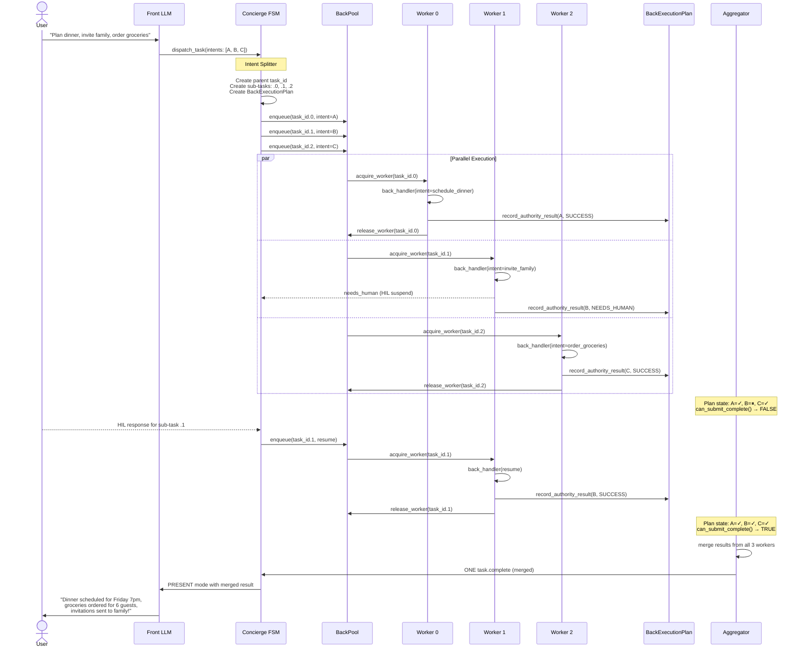

# BackPool & BackExecutionPlan — Architecture Plan

**Date:** 2026-06-18
**Branch:** `feature/prompt-architecture-refactor`
**Status:** Code discovery complete. Architecture normalized into:
- Milestone A: BackPool Runtime Foundation
- Milestone B: Dependency-aware per-intent parallelism

Milestone A is ready for issue-level implementation after this document normalization.
Milestone B remains blocked on explicit per-intent dependency metadata and durable execution-plan persistence.

---

## Target End-State — Milestone B: Dependency-Aware Per-Intent Parallel Workers

> This diagram describes Milestone B, not the V0 execution path.
>
> Milestone A routes exactly ONE dispatch envelope to ONE BackPool worker.
> That envelope may contain one intent or a bundled multi-intent request.
>
> Milestone B may split the envelope only after explicit per-intent dependency
> metadata proves which intents can execute concurrently.

### Target End-State Diagram

```
                              ┌─────────────────────────────────────────┐
                              │               👤 USER                   │
                              │  "Plan dinner, invite family,           │
                              │   order groceries"                      │
                              └────────────────────┬────────────────────┘
                                                   │
                                                   ▼
                              ┌─────────────────────────────────────────┐
                              │          FRONT LLM (actor='front')      │
                              │                                         │
                              │  dispatch_task(intents: [A, B, C])      │
                              └────────────────────┬────────────────────┘
                                                   │
                                                   ▼
┌─────────────────────────────────────────────────────────────────────────────────┐
│                            CONCIERGE FSM                                          │
│                                                                                  │
│   _on_task_dispatch()                                                             │
│        │                                                                          │
│        ▼                                                                          │
│   ┌──────────────────────────────────────┐                                        │
│   │        INTENT SPLITTER               │                                        │
│   │  1 dispatch → N sub-tasks            │                                        │
│   │  parent_task_id                      │                                        │
│   │    ├── task_id.0  (schedule_dinner)  │                                        │
│   │    ├── task_id.1  (invite_family)    │                                        │
│   │    └── task_id.2  (order_groceries)  │                                        │
│   └──────────────────────────────────────┘                                        │
│        │                                                                          │
│        │  enqueue N envelopes                                                     │
│        ▼                                                                          │
└───────────────────────────────────────────────────────────────────────────────────┘
                                                   │
          ┌────────────────────────────────────────┼──────────────────────────────────────────┐
          │                                        │                                           │
          │    BackTopicRouter                     │                                           │
          │    ┌──────────────┐                    │                                           │
          │    │ dispatch ────┼─── acquire worker ─┤                                           │
          │    │ cancel   ────┼─── sync (no worker)│                                           │
          │    │ resume   ────┼─── acquire worker ─┤                                           │
          │    └──────────────┘                    │                                           │
          │                                        │                                           │
          │    ReadyQueue                          │                                           │
          │    ┌──────────────┐                    │                                           │
          │    │ depends_on   │                    │                                           │
          │    │ envelopes    │──── releases ──────┤                                           │
          │    │ cycle detect │                    │                                           │
          │    └──────────────┘                    │                                           │
          │                                        │                                           │
          └────────────────────────────────────────┼──────────────────────────────────────────┘
                                                   │
                                                   ▼
┌─────────────────────────────────────────────────────────────────────────────────┐
│                              BACKPOOL                                             │
│                                                                                  │
│   pool_size=3   max_concurrent_per_session=2                                     │
│                                                                                  │
│   ┌──────────────────┐   ┌──────────────────┐   ┌──────────────────┐             │
│   │    WORKER 0      │   │    WORKER 1      │   │    WORKER 2      │             │
│   │   task_id.0      │   │   task_id.1      │   │   task_id.2      │             │
│   │                  │   │                  │   │                  │             │
│   │  intent:         │   │  intent:         │   │  intent:         │             │
│   │  schedule_dinner │   │  invite_family   │   │  order_groceries │             │
│   │                  │   │                  │   │                  │             │
│   │  back_handler()  │   │  back_handler()  │   │  back_handler()  │             │
│   │  react_loop()    │   │  react_loop()    │   │  react_loop()    │             │
│   └────────┬─────────┘   └────────┬─────────┘   └────────┬─────────┘             │
│            │                      │                      │                        │
│            │       record_        │       record_        │       record_          │
│            │    authority_result  │    authority_result  │    authority_result    │
│            │                      │                      │                        │
│   ┌────────┴──────────────────────┴──────────────────────┴────────────────────────┐│
│   │                    BACK EXECUTION PLAN (shared, per parent task)               ││
│   │                                                                                ││
│   │   Item 0: schedule_dinner  →  SUCCEEDED      ✓                                ││
│   │   Item 1: invite_family    →  NEEDS_HUMAN    ⏸  ◄── HIL suspend               ││
│   │   Item 2: order_groceries  →  SUCCEEDED      ✓                                ││
│   │                                                                                ││
│   │   can_submit_complete() → FALSE   (HARD GATE: blocks until ALL terminal)       ││
│   └────────────────────────────────────────────────────────────────────────────────┘│
│                                                                                  │
│   ┌──────────────┐                                                               │
│   │ OVERFLOW Q   │  ←─ when pool full, envelopes wait here                        │
│   └──────────────┘                                                               │
│                                                                                  │
└───────────────────────────────────────────────────────────────────────────────────┘
                                                   │
                                                   │  all workers terminal?
                                                   ▼
┌─────────────────────────────────────────────────────────────────────────────────┐
│                              AGGREGATOR                                           │
│                                                                                  │
│   ┌─────────────────────────────────────────────────────────────────────────┐    │
│   │  Awaits ALL N workers reaching terminal state                            │    │
│   │                                                                          │    │
│   │  Policy:                                                                 │    │
│   │    • All done      → merge results → emit ONE task.complete              │    │
│   │    • HIL pending   → wait for HIL resolution or timeout                  │    │
│   │    • Timeout       → mark pending as FAILED, emit partial completion     │    │
│   │    • Partial ok?   → emit status="partial" with completed results        │    │
│   └─────────────────────────────────────────────────────────────────────────┘    │
│                                                                                  │
│   Output: ONE merged task.complete envelope                                       │
│                                                                                  │
└───────────────────────────────────────────────────────────────────────────────────┘
                                                   │
                                                   │  k1.orchestration.task.complete.v1
                                                   ▼
┌─────────────────────────────────────────────────────────────────────────────────┐
│                         FSM: _on_task_complete()                                  │
│                                                                                  │
│   State: COMPANIONING → DELIVERING                                               │
│   Delivers merged result to Front                                                 │
│                                                                                  │
└───────────────────────────────────────────────────────────────────────────────────┘
                                                   │
                                                   ▼
                              ┌─────────────────────────────────────────┐
                              │     FRONT LLM (PRESENT mode)            │
                              │                                         │
                              │  Receives ONE merged task.complete      │
                              │  Synthesizes:                           │
                              │  "Dinner scheduled for Friday 7pm,      │
                              │   groceries ordered for 6 guests,       │
                              │   invitations sent to family!"          │
                              └─────────────────────────────────────────┘


                         ─ ─ ─  HIL SIDE PATH (per sub-task)  ─ ─ ─

   Worker 1 suspends
        │
        │  needs_human
        ▼
   ┌──────────────────────┐
   │  k1.hil.request.v1   │
   │  bound to sub_task_id │
   │  (task_id.1)          │
   └──────────┬───────────┘
              │
              │  FSM: CLARIFYING_WORKER
              │  Front: HITL_RELAY renders question
              ▼
   ┌──────────────────────┐
   │     👤 USER RESPONDS  │
   └──────────┬───────────┘
              │
              │  k1.hil.response.v1
              ▼
   ┌──────────────────────┐
   │  Worker 1 resumes    │
   │  back_handler(resume)│
   │  react_loop()        │
   │  completes intent    │
   └──────────────────────┘
              │
              │  record_authority_result(B, SUCCESS)
              ▼
        BackExecutionPlan: all items terminal → Aggregator proceeds
```

### Component Inventory — What Each Piece Does

| # | Component | Responsibility | State |
|---|---|---|---|
| 1 | **Front LLM** | Owns conversation plane. Decides to bundle intents into `dispatch_task`. STANDARD/PRESENT/INTERRUPT/ERROR modes call LLM. HITL_RELAY is **zero-LLM pass-through**. HITL_RESOLVE uses **1 tiny LLM call** to classify HIL_ANSWER vs NEW_TOPIC. | ✅ Built; HITL pass-through + classification needs wiring |
| 2 | **FSM Intent Splitter** | **Milestone B only.** Splits a multi-intent envelope only when explicit dependency metadata proves the intents are parallel-safe. Milestone A performs no intent splitting. | ⏳ Deferred to Milestone B |
| 3 | **FSM Active-HIL Tracker** | Tracks the exact HIL request currently shown to the user. Required in Milestone A because separate concurrent tasks from the same session can both suspend for HIL. | ❌ Required in Milestone A |
| 4 | **BackPool** | Manages N concurrent worker slots. Acquires/releases leases. Enforces `pool_size` and `max_concurrent_per_session`. Overflow queue when full. | ✅ Built, not wired |
| 5 | **Back LLM Workers** | **Milestone A:** one worker executes one dispatch envelope, which may contain one or several bundled intents. **Milestone B:** one child worker executes exactly one intent. | ✅ Handler built; pool launch wiring needed |
| 6 | **BackExecutionPlan** | **Milestone B only.** Durable per-parent coverage ledger and aggregation source of truth. Not required for Milestone A. | ⏳ Deferred to Milestone B |
| 7 | **TaskAggregator** | **Milestone B only.** Reads the durable BackExecutionPlan, emits one idempotent parent completion when every item is terminal. | ⏳ Deferred to Milestone B |
| 8 | **BackTopicRouter** | Routes incoming Back-bound envelopes by topic: dispatch/resume → acquire worker; cancel → sync handler. Discards late envelopes. | ✅ Built, not wired |
| 9 | **ReadyQueue** | Holds envelopes with `depends_on` until predecessor completes. Cycle detection. Auto-releases when dependency resolves. | ✅ Built, not wired |
| 10 | **HIL Routing** | **Milestone A:** HIL is bound to a normal task_id. **Milestone B:** HIL may be bound to a child task_id. In both milestones, the active tracker gives Front the exact request and task IDs. | ❌ Needs build |
| 11 | **Front PRESENT** | Receives ONE merged `task.complete` (unchanged contract). Synthesizes all results into user-facing message. Handles partial completion phrasing. | ⚠️ Partial — needs partial-completion prompt variant |

### Critical Constraint — Why This Architecture Exists

```
                    ┌──────────────────────────────────────────┐
                    │  Front can only receive ONE task.complete │
                    │  per user request.                        │
                    │                                          │
                    │  Without an aggregator, N parallel        │
                    │  workers would flood Front with N         │
                    │  fragmented PRESENT-mode triggers.        │
                    │                                          │
                    │  The aggregator is NOT optional — it is   │
                    │  the architectural price of parallelism.  │
                    └──────────────────────────────────────────┘
```

### Data Flow — End to End



### What Changes vs What Stays the Same

| Layer | Stays the Same | Changes |
|---|---|---|
| **Front LLM** | Owns conversation plane; `dispatch_task` schema; react_loop for STANDARD/PRESENT/INTERRUPT/ERROR modes | **HITL_RELAY → zero-LLM pass-through:** Back formats user-facing question, Front writes to history & publishes without LLM rephrasing. **HITL_RESOLVE → 1 tiny LLM classification call** (HIL_ANSWER vs NEW_TOPIC), then publishes HIL response. **PRESENT:** partial completion phrasing for multi-intent results (Milestone B). |
| **FSM** | States, weave policy, HIL relay | Intent splitter, sub-task tracking, aggregator handoff, `active_hil_count` tracking |
| **Back LLM** | `back_handler`, react_loop, tool set | **User-facing question formatting** (not raw tool language). Single-intent awareness. Records results to shared BackExecutionPlan. |
| **Bus** | Topics, envelope format | Sub-task topic routing |
| **HIL Service** | `needs_human()` → Future pattern, `_on_response()` | No change — already handles N concurrent pendings |
| **Front PRESENT** | ONE completion trigger (unchanged contract) | Merged result payload, partial completion variant |
| **Conversation Continuity** | Front writes all history entries | No change — but HIL questions/answers are now Back-authored, not Front-rephrased. History integrity preserved. |

---

## Present Flow — Single Back LLM (as built today)

### 1. Front → Task Dispatch

```
User message
  → Front LLM (react_loop, actor="front")
    → Front calls dispatch_task(intents: [{action, params}, ...])
    → Publishes k1.orchestration.task.dispatch.v1
```

**✅ A1: How does Front decide to bundle intents?**

Front is told by the `DISPATCH_RULES` prompt section (`prompt/sections.py:526–582`) to **always bundle** into ONE `dispatch_task` call:

> **Independent intents** ("book hotel AND search restaurants"): Bundle in ONE `intents[]` array. Do NOT set `depends_on`.
> **Sequential intents** ("add items THEN place order"): ALSO bundle in ONE `intents[]` array. Order logically. Do NOT set `depends_on`.
> **Chained tasks** (rare — second task needs result of first): Call `dispatch_task` twice across iterations. Use the returned `task_id` in the second call's `depends_on`.

The schema description (`schemas_front.py:468`) reinforces: *"For multi-intent messages (including sequential ones), call dispatch_task ONCE with all intents..."*

There is **no kernel-side splitting**. One `dispatch_task` tool call = 1 entry in `dispatched_tasks[]` = 1 bus event, regardless of intent count.

---

**✅ A2: What does the dispatch payload look like on the wire?**

Topic: `k1.orchestration.task.dispatch.v1` (Priority: INTERACTIVE)

Schema fields (`schemas_front.py:460–568`):

| Field | Type | Required | Description |
|---|---|---|---|
| `intents` | `array` of objects, `minItems: 1` | **Yes** | One or more intents to execute |
| `intents[].action` | `string` | **Yes** | What to do (natural language or capability name) |
| `intents[].params` | `object` | No | Structured parameters from conversation & beliefs |
| `intents[].resource_family` | `string` | No | Taxonomy hint: `"item"`, `"event"`, `"task"` |
| `intents[].operation_hint` | `string` | No | `"create"`, `"read"`, `"update"`, `"delete"` |
| `urgency` | `string` enum | No | `"normal"` (default), `"urgent"`, `"background"` |
| `reference_context` | `object` | No | Resolved references for Back worker (pronouns→names) |
| `depends_on` | `string` | No | Task ID from previous dispatch. Must start with `"task-"` |
| `plan` | `boolean` | No | Set `true` when task requires planner/specialist workflow |

Implementation (`implementations.py:1228–1355`) adds auto-derived fields:

| Field | Source |
|---|---|
| `task_id` | Auto-generated: `"task-{uuid4().hex[:8]}"` |
| `tier` | Derived: `plan=true` or `depends_on` → `MEDIUM`; `complexity=HIGH` → `HIGH`; else `LOW` |
| `budget_hint` | From tier: LOW=1, MEDIUM=3, HIGH=5 |
| `safety_band` | Default `"GREEN"` unless LLM sets `"AMBER"`/`"RED"` |

FSM enriches with `reference_context` (scoreboard referents), `narrative_thread`, `turn_state_overlay`, `trace_id`, `session_id` before routing.

---

**✅ A3: Does Front ever attach `depends_on` between intents?**

**Rarely — only for cross-iteration chaining.** Front is explicitly steered AWAY from `depends_on` for all common cases.

`depends_on` is a **top-level** field on `dispatch_task` (NOT per-intent). It takes a `task-xxx` ID string. Two independent guard clauses (in `implementations.py:1248` and `controller.py:278`) defensively strip any value not starting with `"task-"` — strong evidence the LLM has historically misused this field.

The **primary** path for `depends_on` to be set is the **internal classifier** (`task/classifier.py`) auto-detecting `$ref` params and building CHAINED dispatches — not the Front LLM.

### 2. FSM Receives Task Dispatch

```
FSM._on_task_dispatch()
  → Registers ONE task_id for the dispatch
  → State: DISPATCHING → COMPANIONING
  → Routes to Back via _route_via_orchestrator()
```

**✅ B1: What fields does FSM extract from the envelope?**

`_on_task_dispatch` (`controller.py:2782`) receives `k1.orchestration.task.dispatch.v1`. Parsed via `_task_dispatch_from_payload()` → `TaskDispatch` dataclass:

| Field | Type | Default | Usage |
|---|---|---|---|
| `task_id` | `str` | auto-gen `"task-{uuid8}"` | Primary key, registered everywhere |
| `intents` | `list[dict]` | falls back to `action` | Parsed into `list[TaskIntent]`; 1st intent's `.action` → TaskBridge |
| `tier` | `str` | `"LOW"` | Coerced via `_coerce_tier()` → `ComplexityTier`; drives routing |
| `budget_hint` | `int` | auto-computed from tier | ReAct loop iteration budget |
| `reference_context` | `dict` | `None` | Enriched with scoreboard referents if Front didn't populate |
| `safety_band` | `str` | `"GREEN"` | Validated: `GREEN\|AMBER\|RED` |
| `depends_on` | `str` | `None` | **Stripped if not starting with `"task-"`** (LLM guard) |
| `context_snapshot` | `dict` | `None` | Passed to orchestrator context |
| `execution_profiles` | `list[dict]` | `None` | Passed through for Back resume/audit |
| `grounding`, `grounding_envelope_id`, `temporal_anchor_id`, `spatial_context_id`, `resolved_temporal_refs`, `resolved_spatial_refs` | various | `None` | Passed through to orchestrator context |

FSM enriches with: `reference_context` (scoreboard fallback), `narrative_thread`, `turn_state_overlay`, `trace_id`, `session_id`.

**State persisted:**

- `TaskBridge.dispatch_task(task_id, action)` → `TaskStateSection.add_task(status=DISPATCHED)` + ledger `TaskCreated`
- `_active_task_ids.add(task_id)`, `_task_dispatch_turns[task_id] = turn_number`
- `_cancel_handler.register_task(task_id)`, `_control_ext.add_active_task(task_id)`
- `_running_tasks[task_id] = RunningTaskHandle(control_queue, dispatch_payload)`

**Transition:** DISPATCHING → COMPANIONING (idempotent: COMPANIONING → COMPANIONING for multi-dispatch).

---

**✅ B2: How does tier routing work (LOW / MEDIUM / HIGH)?**

Tier is **derived**, not set directly by the LLM. Algorithm (`implementations.py:1254`):

```
complexity="HIGH"  → HIGH
plan=true OR depends_on → MEDIUM
default             → LOW
```

Routing (`_route_via_orchestrator`, `controller.py:2855`):

| Tier | Budget (Back iterations) | Route |
|---|---|---|
| **LOW** | 6 | → `_deliver_to_back()` directly via MailboxRouter |
| **MEDIUM** | 10 | → OrchestratorStub (if wired) → Fabric → Back; else **falls back to Back directly** (same as LOW) |
| **HIGH** | 14 | → Orchestrator (full Planner pipeline: SKETCH/EXPAND/VALIDATE/COMMIT); if orchestrator not wired → degrade to MEDIUM (passthrough) or fail |

**In current POC/test contexts without orchestrator: LOW = MEDIUM = same Back path.** All dispatch uses a single topic: `k1.orchestration.task.dispatch.v1`. Tier is a field inside the payload, not a topic.

Tool allowlists differ per tier: Back LOW has 5 tools, MEDIUM/HIGH adds `spawn_via_fabric` + `execute_workflow` (7 tools).

---

**✅ B3: What does TaskBridge store for this task?**

`TaskBridge` (`fsm/task_bridge.py:49`) wraps `TaskStateSection` + `TaskArtifactsSection` in SessionState. **Per-task fields** (`TaskStateEntry` dataclass):

| Field | Type | Description |
|---|---|---|
| `task_id` | `str` | UUID |
| `action` | `str` | Capability name (e.g. `"order_food"`) |
| `status` | `str` | One of: `PENDING`, `DISPATCHED`, `ACTIVE`, `SUSPENDED`, `COMPLETED`, `FAILED`, `CANCELLED` |
| `dispatched_at_ms` | `int` | Epoch ms when dispatched |
| `completed_at_ms` | `int` | Epoch ms when terminal |
| `depends_on` | `list[str]` | Task IDs this task depends on |
| `progress_pct` | `int` | 0–100 |
| `pending_hil` | `bool` | True when awaiting human input |
| `hil_suspensions_count` | `int` | Number of HIL suspensions |
| `presented_at_turn` | `int` | Turn number when result shown |
| `pending_hil_data` | `dict\|None` | Serialized HIL envelope for crash recovery |

**Task lifecycle:** `DISPATCHED → ACTIVE → (SUSPENDED → ACTIVE)* → COMPLETED/FAILED/CANCELLED`

**Key methods:** `dispatch_task`, `activate_task`, `suspend_task`, `resume_task`, `complete_task`, `fail_task`, `cancel_task`, `set_pending_hil_data`, `get_suspended_tasks`.

TaskBridge is the **Single Writer** to task state. Back LLM never writes directly — it emits bus deltas that FSM routes through TaskBridge.

### 3. Back LLM Receives and Executes

```
back_handler()
  → Reads SessionState snapshot ONCE
  → Builds system prompt from task + beliefs + referents + registry hints
  → Messages: 5-entry chat history + task JSON as user message
  → react_loop(actor="back")
    → Back calls tools: resolve_situation, invoke_capability, batch_invoke_capabilities
    → Processes ALL intents SEQUENTIALLY in one react_loop
    → Ends with submit_result(complete) or submit_result(needs_human)
  → _emit_back_result() → k1.orchestration.task.complete.v1
```

**✅ C1: How does Back LLM know which intent it is working on?**

**It doesn't, structurally.** Back receives the FULL `intents[]` array as one JSON block and relies entirely on LLM reasoning to process it. No per-intent iteration mechanism exists.

The task payload enters Back through TWO channels:

1. **System prompt** (`back_prompt.py:192`): `_strip_task_for_prompt()` keeps ALL intents but strips each to `{action, params, resource_family, operation_hint}`.
2. **User message** (`back.py:1562`): `json.dumps(task, indent=2)` — the FULL un-stripped task dict.

Back's prompt describes a **single-task protocol**: call `resolve_situation` ONCE → execute (1-2 tools) → `submit_result` ONCE. There is zero guidance about iterating over intents, processing them in order, or combining per-intent results.

**`BundledExecutionPlan`** (`task/bundled_executor.py`) exists as a designed-but-**unwired** class that would track per-intent execution (`IntentResult` per intent, `all_success`, `completed_intents`). It's only used in tests — never imported by `back.py` or `loop.py`.

---

**✅ C2: What happens when one intent fails but others succeed?**

**There is no per-intent success/failure tracking.** The `submit_result` schema (`schemas_back.py:328`) has only TWO `result_type` values:

```
"enum": ["complete", "needs_human"]
```

There is **no `"partial"` result type**. No `failed_intents` list. No per-intent status field.

The `submit_result` handler (`implementations.py:2114`) is a pure pass-through — it does not inspect results or validate completeness. `_emit_back_result()` routes binarily: `"complete"` → `task.complete.v1`, `"suspended"` → HIL, everything else → `task.failed.v1`.

**What Back LLM can do when an `invoke_capability` fails:**

- Retry with different params (up to 2 retries before the retry guard marks it terminal)
- Try a different capability
- Call `submit_result(needs_human)` to escalate
- Call `submit_result(complete)` with whatever partial results it gathered — **even if some intents failed**

`react_loop` terminates immediately on `submit_result` — it trusts the LLM's declaration. No kernel-level cross-check against the original intents list.

**⚠️ Implication for Option B:** With per-intent parallel workers, each worker processes ONE intent independently. The aggregator will receive N individual `submit_result(complete)` calls — one per worker. Partial completion (some workers succeeded, some failed) needs to be handled at the aggregator level, not inside individual Back LLMs. The `BundledExecutionPlan` is exactly the right design for this — it just needs to be wired in and adapted for multi-worker aggregation rather than single-worker iteration.

---

**✅ C3: HIL: what happens when Back suspends mid-task?**

Full trace (already partially documented in HIL Flow section above; here are the key mechanics):

**Checkpoint capture** (`_build_react_checkpoint`, `back.py:866`):

| Field | Source |
|---|---|
| `task_id` | Task UUID |
| `messages` | Serialized full message list (role, content, tool_call_id, etc.) |
| `tool_history` | `tool_dispatcher.get_execution_records()` → each record `.to_dict()` |
| `completed_tool_call_ids` | Filtered from tool_history: records with `result_status` in `{"ok", "partial"}` and non-empty `call_id` |
| `suspension_count` | Incremented on each re-suspend (default 1) |
| `budget_remaining` | `max(0, max_iterations - len(result.iteration_durations_ms))` |
| `scratchpad` | `{"loop_events": list(result.loop_events)}` |

**Resume message format** (`_hil_response_resume_message`, `back.py:947`):

```
== RESUME AFTER HUMAN INPUT (round N) ==
Suspension #M. Budget remaining: B iterations.
Already completed tools: [tool_name_1, tool_name_2, ...]
Continue the task. Do NOT re-execute already-completed tools unless
the human explicitly asked for a different outcome.
Do not ask the same question again unless the answer is insufficient.

Human response:
{"hil_request_id": "...", "decision": "...", "raw_user_text": "...", "resolution": {...}}
```

**Dedup on resume:** `react_loop` receives `completed_tool_call_ids` and `completed_tool_arg_keys`. Before executing any tool, the loop checks if the tool call ID or `"{tool_name}:{args_hash}"` key is in the completed sets — if so, the tool is skipped and a synthetic `ToolResult(status="ok", data={"dedup": true})` is returned immediately.

**Budget on resume:** Uses `cp_budget_remaining` if available, else `max(2, max_iterations)`. After the first resume round, dedup state is cleared so the LLM can re-execute previously-completed tools if the human asked for a different outcome.

**Multi-round HIL:** The `_resolve_needs_human_in_process` loop supports up to `max_suspensions_per_task` (default 2) rounds. Each round: await HIL → build resume message → call `react_loop` with dedup. If still suspended after max rounds, returns `status="budget_exhausted"`.

### 4. FSM Receives Task Completion

```
FSM._on_task_complete()
  → State: COMPANIONING → DELIVERING
  → WeavePolicy decides: IMMEDIATE / BATCH / DEFER
  → Delivers structured result to Front for PRESENT mode
```

**✅ B4: WeavePolicy decision criteria?**

`WeavePolicy` (`protocols/weave_policy.py`) collects `WeaveSignal` (7 dimensions: fsm_state, pending_count, has_critical, user_typing, user_idle_ms, emotional_gate, backpool_utilization, hitl_pending), then evaluates a **10-rule priority-ordered decision table** (first match wins):

| Rule | Condition | Decision | Window |
|---|---|---|---|
| R0 | Policy disabled | BATCH | 500ms |
| R1 | LISTENING + idle > 10s | **IMMEDIATE** | 0ms |
| R2 | has_critical + gate=open | **IMMEDIATE** | 0ms |
| R3 | user_typing | **DEFER** | — |
| R4 | gate=suppress_all_non_safety | **SUPPRESS** | — |
| R5 | gate=suppress_trivial + !critical | **DEFER** | — |
| R5.5 | hitl_pending + !critical | **DEFER** | — |
| R6 | pending ≥ 3 + all low urgency | **DIGEST** | 15s |
| R7 | pending ≥ 1 + idle > 3s | **BATCH** | dynamic 200–5000ms |
| R8 | backpool_util > 0.8 | **BATCH** | 2s |
| R9 | (default fallback) | **BATCH** | 500ms |

**5 decisions → 5 different delivery behaviors:**

- **IMMEDIATE:** Transition to DELIVERING, flush all results to Front NOW.
- **BATCH:** Schedule `asyncio` timer for window_ms, then flush.
- **DEFER:** Move results to `deferred_results` queue; inject into next STANDARD prompt as `async_results_context`. Force-deliver after 5 consecutive defers.
- **DIGEST:** Accumulate for 15s, compress into summary via `DigestPayload`, deliver once.
- **SUPPRESS:** Discard result from all queues; logged for audit only.

**Emotional gate** (`_compute_emotional_gate`): reads `SessionState.affective_now`:

- `valence ≥ -0.5` → `"open"` (all results can weave)
- `valence < -0.5` → `"suppress_trivial"` (only critical/urgent break through)
- `emotion=crisis` OR `safety_band=RED` → `"suppress_all_non_safety"`

Config knobs: `WeavePolicyConfig` with 12 tunables (`idle_eager_ms=10s`, `digest_window_ms=15s`, `max_consecutive_defers=5`, etc.).

---

**✅ B5: Same-turn suppression logic?**

Three-layer anti-double-delivery mechanism:

**Layer 1: IdempotencyLedger** (`fsm/idempotency.py`). Before any handler runs, checks `envelope.envelope_id` against an LRU cache. Same envelope ID in same turn → skipped. Prevents bus re-delivery from causing duplicate processing.

**Layer 2: FrontLock** (`fsm/front_lock.py`). Primary serialization gate. Front LLM is a single-threaded actor:

- `try_deliver()`: If `busy=False` → sets `busy=True`, returns `True` (caller delivers). If `busy=True` → inserts into priority queue, returns `False` (caller must NOT deliver).
- Priority order: URGENT (user.input) > INTERACTIVE (HIL, task.suspended) > RESULT (task.complete) > ERROR (task.failed) > INFO (findings).
- `release()`: Pops next event from queue. If queue empty → `busy=False`. If event exists → `busy` stays `True`, caller delivers next event.
- Backpressure: queue > 8 items → evict lowest-priority event.

**Layer 3: `response_final_table.py`** — 13-branch decision table for what happens AFTER Front finishes. Key bifurcation:

- `release_front_lock=True` (WEAVING/COMPANIONING): Front is freed but queue NOT drained — weave handles subsequent delivery.
- `drain_front_lock=True` (LISTENING): Queue MUST be drained because any queued `user.input` needs a new turn.
- `release_front_lock` and `drain_front_lock` are **mutually exclusive** across all 13 branches.

**What happens when task.complete arrives while Front is busy?** It's inserted into FrontLock's priority queue at RESULT priority. When Front finishes, `release()` pops the next highest-priority event and delivers it. If Front is in LISTENING after the response, `_drain_front_lock_queue` drains all queued events in priority order.

### 5. Front Presents Result

```
front_handler(mode=PRESENT)
  → Front LLM synthesizes Back's structured result into user-facing text
  → Publishes k1.response.final.v1
```

**✅ A4: What data does Front receive from Back's task.complete?**

Topic: `k1.orchestration.task.complete.v1` (Priority: INTERACTIVE)

`_emit_back_result()` (`back.py:1220–1300`) constructs the payload:

| Field | Type | Source |
|---|---|---|
| `task_id` | `string` | Auto-generated UUID |
| `action` | `string` | First intent's action from original dispatch |
| `result_type` | `"complete"` | Hardcoded |
| `final_answer` | `string` | Back LLM's `submit_result.final_answer` |
| `results` | `list[dict]` | Back LLM's `submit_result.results` |
| `artifacts_created` | `list[dict]` | Back LLM's `submit_result.artifacts_created` |
| `frame` | `dict` | Serialized `BackResultFrame` (same data in structured form) |
| `tool_call_summaries` | `list[dict]` | Added by `_emit_back_result` from ReAct loop observability |
| `confidence` | `float` | Optional, from submit_result |
| `blockers` | `list` | Optional, from submit_result |
| `suggested_next_action` | `string` | Optional, from submit_result |
| `semantic_context` | `dict` | Optional, from submit_result |
| `presentation_guidance` | `string` | Optional, from submit_result |

Front's `extract_scenario_data(mode=PRESENT)` (`front.py:446–510`) reads the `BackResultFrame` and produces 13 flat fields for the prompt template: `task_description`, `task_result_summary`, `task_facts`, `task_artifacts`, `task_confidence`, `task_blockers`, `suggested_next_action`, `semantic_guidance`, `artifacts`, `completed_before_cancel`, `results`, `tool_history`.

---

**✅ A5: How does Front phrase "X, Y, and Z are all done"?**

**Results are presented as a SINGLE combined/flat structure — NOT per-intent.** The `BackResultFrame` has one flat `facts` list. Front's PRESENT prompt template (`scenario_templates.py:43–57`) renders them as one undifferentiated block:

```
== TASK RESULT TO PRESENT ==
Task: {task_description}
Confirmed facts:
{task_facts}              ← ALL facts from ALL intents, concatenated
Artifacts:
{task_artifacts}          ← ALL artifacts, concatenated
...
Present what changed naturally in Front's voice. Lead with the useful outcome,
not the internal task.
```

The prompt **explicitly discourages** numbered/structured delivery:

- *"Do NOT sound like an operation log"*
- *"Do NOT parrot results verbatim. Interpret and present in your voice"*
- *"Lead with the user-visible outcome: what is now done, scheduled, saved"*
- *"Interpret, contextualize, highlight what matters"*

**There is NO multi-intent phrasing guidance.** The prompt uses singular language throughout (`Task:`, `result`). Multi-intent results are left to the LLM to improvise. Front would naturally produce integrated narrative like *"The Vineyard Inn is booked for Friday, and I grabbed a 7pm reservation at Bottega"* rather than *"1) booked hotel, 2) reserved restaurant."*

**⚠️ Implication for Option B:** The merged `task.complete` from the aggregator will need to carry **per-intent** results if we want Front to present them distinctly. Today's flat structure works because one Back LLM processed everything. With parallel workers, the aggregator must either (a) flatten N worker results into the existing flat format, or (b) extend the payload with a per-intent structure that Front's PRESENT prompt can iterate.

### 6. Key Properties of Present Flow

- [x] **ONE task = ONE back_handler call = ONE react_loop = ONE task.complete** — Confirmed. Front bundles all intents into one `dispatch_task`. FSM creates one `TaskDispatch`. Back receives the full `intents[]` array and runs one `react_loop` culminating in one `submit_result`. One `_emit_back_result()` publishes one `task.complete.v1`.
- [x] **Multi-intent is sequential within a single LLM context** — Confirmed. Back has no per-intent iteration mechanism. The LLM sees all intents in the system prompt + user message and processes them as one combined task via its own reasoning. `BundledExecutionPlan` exists but is unwired.
- [x] **Message history IS the execution plan** — Confirmed. There is no structured execution plan wired into `loop.py`. Back's `react_loop` doesn't know about individual intents. The LLM uses the conversation context (system prompt + user message + tool results) as its working memory. This works for single-worker but does NOT work for parallel workers — they can't share message history.
- [x] **No per-intent tracking needed** — Confirmed for single-worker mode. With Option B, per-intent tracking becomes essential. The unwired `BundledExecutionPlan` is the right foundation.
- [x] **No aggregation needed** — Confirmed for single-worker mode. One Back LLM produces one result. With Option B, N workers produce N results → aggregator required.

**✅ Present Flow section complete.** All 5 subsections filled from code exploration.

---

## Future Flow — Option B: Per-Intent Parallel Workers
