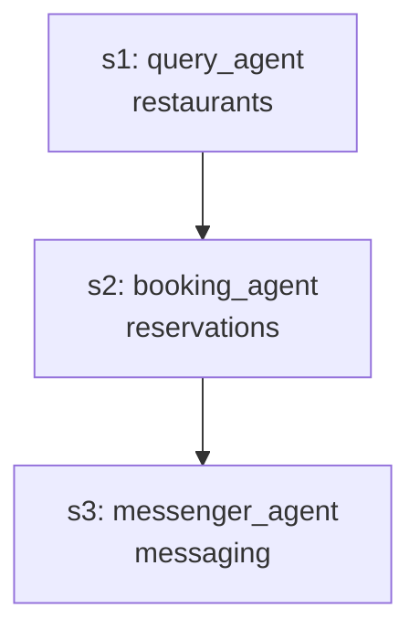

# Concierge E2E Enhancement Plan: DAG-Based Parallel Execution

**Epic**: Transform sequential clarification flow to parallel DAG execution for improved UX
**Priority**: P0 (Critical - Required for production use)
**Target**: Q4 2025
**Status**: Planning Complete, Implementation Pending

---

## Executive Summary

Current system uses sequential architecture where Concierge asks multiple clarification questions one-by-one. User feedback shows this is inefficient for real-world use. We need parallel DAG execution where agents spawn concurrently, ask questions while executing, and Concierge batches all questions for user to answer once.

**User Pain Point**:
```
Current: User → Question 1 → Answer → Question 2 → Answer → Question 3 → Answer → Execute
Desired: User → [Agents spawn in parallel] → Batch all questions → Answer once → Agents complete
```

**Architecture Shift**:
- **FROM**: Sequential Planner → Clarification Loop → Commit
- **TO**: Planner creates DAG → Agents execute in parallel → Questions batched → Commit

---

## Milestone Structure

### M6: DAG Orchestrator Foundation
**Goal**: Build parallel execution engine with dependency management
**Duration**: 2-3 days
**Success Criteria**: Agents execute in parallel, respect dependencies, handle failures
**Dependencies**: None (builds on existing agent infrastructure)

### M7: Async Question Routing System
**Goal**: Batch questions from parallel agents
**Duration**: 1-2 days
**Success Criteria**: Questions collected during execution, presented to user once, answers routed back
**Dependencies**: M6 (needs DAG orchestrator)

### M8: Result Aggregation & Commit
**Goal**: Merge results from parallel agents into unified plan
**Duration**: 1 day
**Success Criteria**: Results collected, aggregated, committed to K0 WAL
**Dependencies**: M6, M7 (needs both orchestrator and question routing)

### M9: E2E Integration & Testing
**Goal**: Integrate into test_concierge_e2e.py and validate
**Duration**: 1 day
**Success Criteria**: All test scenarios pass, performance budgets met
**Dependencies**: M6, M7, M8 (needs all components)

---

## M6: DAG Orchestrator Foundation

### Epic 6.1: DAG Data Structure & Parser
**Priority**: P0
**Estimated Effort**: 4 hours

#### Issue 6.1.1: Define DAG Node Data Structure
**Type**: Task
**Priority**: P0
**Estimated Effort**: 1 hour

**Description**:
Create DAG node data structure to represent agent execution units.

**Acceptance Criteria**:
- [ ] `DAGNode` dataclass created with:
  - `node_id`: str (unique identifier)
  - `agent_type`: str (which agent to spawn)
  - `agent_instance`: Optional[Agent] (spawned agent reference)
  - `user_input`: str (what agent needs to do)
  - `tools`: Dict[str, Any] (tools available to this agent)
  - `dependencies`: List[str] (node_ids this depends on)
  - `status`: str (pending/running/completed/failed/blocked)
  - `result`: Optional[AgentResponse]
  - `clarification_questions`: List[str] (questions asked during execution)
  - `start_time`: Optional[float]
  - `end_time`: Optional[float]

- [ ] `DAGEdge` dataclass for explicit dependency representation:
  - `from_node`: str (node_id)
  - `to_node`: str (node_id)
  - `dependency_type`: str (data_dependency/sequence_dependency/conditional)

**Implementation Notes**:
```python
@dataclass
class DAGNode:
    node_id: str
    agent_type: str
    user_input: str
    tools: Dict[str, Any]
    dependencies: List[str] = field(default_factory=list)
    status: str = "pending"  # pending/running/completed/failed/blocked
    agent_instance: Optional[Agent] = None
    result: Optional[AgentResponse] = None
    clarification_questions: List[str] = field(default_factory=list)
    start_time: Optional[float] = None
    end_time: Optional[float] = None
    error: Optional[str] = None
```

**Files to Create**:
- `poc/planning_pipeline/dag_node.py`

---

#### Issue 6.1.2: Build DAG from Planner Output
**Type**: Task
**Priority**: P0
**Estimated Effort**: 2 hours

**Description**:
Parse expanded plan from Stage 2 and construct DAG with dependencies.

**Acceptance Criteria**:
- [ ] `DAGBuilder` class created
- [ ] Method `build_from_expanded_plan(expanded_plan_dict) -> DAG`
- [ ] Extracts steps from expanded plan
- [ ] Maps each step to DAG node
- [ ] Extracts dependencies from `needs` field
- [ ] Creates edges between nodes based on dependencies
- [ ] Validates no circular dependencies (fail-fast if detected)
- [ ] Returns executable DAG structure

**Implementation Notes**:
```python
class DAGBuilder:
    def build_from_expanded_plan(self, expanded_plan_dict: dict, agent_spawn_wrapper: AgentSpawnWrapper) -> DAG:
        """
        Convert expanded plan to DAG.

        Example expanded_plan_dict:
        {
            "intent": "book_dinner_and_notify",
            "steps": [
                {"id": "s1", "tool": "restaurants", "agent": "query_agent", "needs": []},
                {"id": "s2", "tool": "reservations", "agent": "booking_agent", "needs": ["s1"]},
                {"id": "s3", "tool": "messaging", "agent": "messenger_agent", "needs": ["s2"]}
            ]
        }

        Returns DAG with 3 nodes, edges: s1→s2→s3
        """
```

**Files to Create**:
- `poc/planning_pipeline/dag_builder.py`

---

#### Issue 6.1.3: DAG Cycle Detection
**Type**: Task
**Priority**: P0
**Estimated Effort**: 1 hour

**Description**:
Implement cycle detection to prevent infinite loops.

**Acceptance Criteria**:
- [ ] DFS-based cycle detection algorithm
- [ ] Raises `CircularDependencyError` if cycle detected
- [ ] Provides helpful error message with cycle path
- [ ] Tested with known circular dependencies

**Implementation Notes**:
Already exists in `ValidateTier1._has_cycle()`, extract and reuse in DAG builder.

---

### Epic 6.2: Parallel Executor
**Priority**: P0
**Estimated Effort**: 6 hours

#### Issue 6.2.1: Create DAG Executor Class
**Type**: Task
**Priority**: P0
**Estimated Effort**: 3 hours

**Description**:
Build executor that runs DAG nodes in parallel while respecting dependencies.

**Acceptance Criteria**:
- [ ] `DAGExecutor` class created
- [ ] Method `execute(dag: DAG) -> Dict[str, AgentResponse]`
- [ ] Identifies nodes with no dependencies (root nodes)
- [ ] Spawns agents for root nodes in parallel using `asyncio.gather()`
- [ ] Monitors node completion
- [ ] When node completes, checks if dependent nodes unblocked
- [ ] Spawns unblocked nodes immediately
- [ ] Continues until all nodes complete or fail
- [ ] Returns dict of node_id → AgentResponse

**Implementation Notes**:
```python
class DAGExecutor:
    async def execute(self, dag: DAG) -> Dict[str, AgentResponse]:
        """
        Execute DAG nodes in parallel with dependency respect.

        Algorithm:
        1. Find root nodes (no dependencies)
        2. Spawn agents for roots in parallel
        3. On completion, mark node as done
        4. Find newly unblocked nodes
        5. Spawn unblocked nodes
        6. Repeat until DAG complete
        """
        results = {}
        running_tasks = {}

        while not dag.is_complete():
            # Find nodes ready to run
            ready_nodes = dag.get_ready_nodes()

            # Spawn tasks for ready nodes
            for node in ready_nodes:
                task = asyncio.create_task(self._execute_node(node))
                running_tasks[node.node_id] = task

            # Wait for at least one to complete
            done, pending = await asyncio.wait(
                running_tasks.values(),
                return_when=asyncio.FIRST_COMPLETED
            )

            # Process completed nodes
            for task in done:
                # Update node status, check for unblocked nodes
                ...

        return results
```

**Files to Create**:
- `poc/planning_pipeline/dag_executor.py`

---

#### Issue 6.2.2: Handle Agent Failures in DAG
**Type**: Task
**Priority**: P0
**Estimated Effort**: 2 hours

**Description**:
Gracefully handle agent failures without blocking entire DAG.

**Acceptance Criteria**:
- [ ] Agent failure marks node as `failed`
- [ ] Dependent nodes marked as `blocked` (cannot execute)
- [ ] Non-dependent nodes continue execution
- [ ] Final result includes partial success + blocked nodes
- [ ] Error details captured in node result

**Implementation Notes**:
```python
async def _execute_node(self, node: DAGNode) -> AgentResponse:
    try:
        result = await node.agent_instance.execute(node.context)
        node.status = "completed"
        node.result = result
    except Exception as e:
        node.status = "failed"
        node.error = str(e)
        # Block all dependent nodes
        self._block_dependents(node.node_id)
```

---

#### Issue 6.2.3: Add Performance Metrics to DAG Executor
**Type**: Task
**Priority**: P1
**Estimated Effort**: 1 hour

**Description**:
Track execution metrics for observability.

**Acceptance Criteria**:
- [ ] Track total DAG execution time
- [ ] Track per-node execution time
- [ ] Count nodes executed in parallel (max parallelism)
- [ ] Track blocked nodes
- [ ] Export metrics as structured dict

**Implementation Notes**:
```python
@dataclass
class DAGMetrics:
    total_execution_ms: float
    nodes_executed: int
    nodes_failed: int
    nodes_blocked: int
    max_parallelism: int  # Max concurrent nodes at any point
    node_latencies: Dict[str, float]  # node_id → latency_ms
```

---

### Epic 6.3: DAG Visualization
**Priority**: P2
**Estimated Effort**: 3 hours

#### Issue 6.3.1: ASCII DAG Renderer
**Type**: Task
**Priority**: P2
**Estimated Effort**: 2 hours

**Description**:
Render DAG structure as ASCII art for debugging.

**Acceptance Criteria**:
- [ ] Method `render_dag(dag: DAG) -> str`
- [ ] Shows nodes with status indicators
- [ ] Shows edges/dependencies
- [ ] Color-codes by status (pending/running/completed/failed)

**Example Output**:
```
DAG: book_dinner_and_notify (3 nodes, 2 edges)

┌─────────────────┐
│ s1: query_agent │ ✅ COMPLETED (250ms)
│   [restaurants] │
└─────────────────┘
        │
        ▼
┌─────────────────┐
│ s2: booking_agent│ 🔄 RUNNING
│  [reservations] │
└─────────────────┘
        │
        ▼
┌─────────────────┐
│ s3: messenger   │ ⏳ PENDING
│   [messaging]   │
└─────────────────┘
```

**Files to Create**:
- `poc/planning_pipeline/dag_visualizer.py`

---

#### Issue 6.3.2: Export DAG to Mermaid
**Type**: Task
**Priority**: P2
**Estimated Effort**: 1 hour

**Description**:
Export DAG as Mermaid diagram for documentation.

**Acceptance Criteria**:
- [ ] Method `export_to_mermaid(dag: DAG) -> str`
- [ ] Generates valid Mermaid flowchart syntax
- [ ] Includes node labels and edge connections

**Example Output**:


---

## M7: Async Question Routing System

### Epic 7.1: Question Collection During Execution
**Priority**: P0
**Estimated Effort**: 4 hours

#### Issue 7.1.1: Question Queue Data Structure
**Type**: Task
**Priority**: P0
**Estimated Effort**: 1 hour

**Description**:
Create shared queue for agents to submit clarification questions.

**Acceptance Criteria**:
- [ ] `QuestionQueue` class with thread-safe operations
- [ ] Method `add_question(node_id, agent_type, question, required_data)`
- [ ] Method `get_all_questions() -> List[Question]`
- [ ] Method `submit_answer(node_id, answer)`
- [ ] Agent waits on answer before continuing

**Implementation Notes**:
```python
@dataclass
class ClarificationQuestion:
    node_id: str
    agent_type: str
    question: str
    required_data: List[str]
    timestamp: float
    answer: Optional[str] = None
    answered_event: asyncio.Event = field(default_factory=asyncio.Event)

class QuestionQueue:
    def __init__(self):
        self.questions: Dict[str, ClarificationQuestion] = {}
        self.lock = asyncio.Lock()

    async def add_question(self, node_id, agent_type, question, required_data):
        async with self.lock:
            q = ClarificationQuestion(node_id, agent_type, question, required_data, time.time())
            self.questions[node_id] = q
            return q

    async def wait_for_answer(self, node_id) -> str:
        q = self.questions[node_id]
        await q.answered_event.wait()
        return q.answer
```

**Files to Create**:
- `poc/planning_pipeline/question_queue.py`

---

#### Issue 7.1.2: Integrate Question Queue into Agent Base
**Type**: Task
**Priority**: P0
**Estimated Effort**: 2 hours

**Description**:
Modify `Agent.ask_user()` to use question queue.

**Acceptance Criteria**:
- [ ] `Agent.ask_user()` submits question to queue
- [ ] Agent execution pauses (awaits answer)
- [ ] Agent resumes when answer provided
- [ ] Works for all agent subclasses

**Implementation Notes**:
```python
class Agent(ABC):
    async def ask_user(self, question: str, required_data: List[str] = None) -> str:
        """Ask user via question queue."""
        if not self.question_queue:
            raise RuntimeError("No question queue configured")

        q = await self.question_queue.add_question(
            self.agent_id,
            self.agent_type,
            question,
            required_data or []
        )

        # Wait for answer (blocks this agent, others continue)
        answer = await self.question_queue.wait_for_answer(self.agent_id)
        return answer
```

---

#### Issue 7.1.3: Question Batching Logic
**Type**: Task
**Priority**: P0
**Estimated Effort**: 1 hour

**Description**:
Batch questions from multiple agents and present to user once.

**Acceptance Criteria**:
- [ ] Periodically check question queue
- [ ] When multiple questions accumulated, batch them
- [ ] Present to user as numbered list
- [ ] Parse user's multi-part answer
- [ ] Route answers back to correct agents

**Implementation Notes**:
```python
class ConciergeQuestionBatcher:
    async def collect_and_ask(self, question_queue: QuestionQueue) -> Dict[str, str]:
        """
        Collect questions from queue and ask user once.

        Returns: Dict[node_id, answer]
        """
        # Wait for questions to accumulate (e.g., 2 seconds or 3 questions)
        await asyncio.sleep(2)

        questions = question_queue.get_all_questions()

        if not questions:
            return {}

        # Build batch prompt
        batch_prompt = "I need some more information:\n\n"
        for i, q in enumerate(questions, 1):
            batch_prompt += f"{i}. {q.question}\n"

        # Get user's multi-part answer
        user_response = await self.prompt_user(batch_prompt)

        # Parse answers (simple approach: split by numbers)
        answers = self._parse_multi_answer(user_response, len(questions))

        # Submit answers back to queue
        for q, answer in zip(questions, answers):
            await question_queue.submit_answer(q.node_id, answer)

        return {q.node_id: a for q, a in zip(questions, answers)}
```

---

### Epic 7.2: Concierge Integration
**Priority**: P0
**Estimated Effort**: 3 hours

#### Issue 7.2.1: Add Async Question Handling to Concierge
**Type**: Task
**Priority**: P0
**Estimated Effort**: 2 hours

**Description**:
Integrate question batching into Concierge flow.

**Acceptance Criteria**:
- [ ] Concierge monitors question queue during DAG execution
- [ ] When questions appear, pause and ask user
- [ ] Resume DAG execution after answers provided
- [ ] Display questions in Rich panels with clear formatting

**Implementation Notes**:
Modify `ConciergeAgent.process_message()` to:
1. Invoke planner (gets DAG)
2. Start DAG executor
3. Monitor question queue in parallel
4. When questions arrive, pause and batch ask user
5. Resume execution

---

#### Issue 7.2.2: Multi-Answer Input Handler
**Type**: Task
**Priority**: P0
**Estimated Effort**: 1 hour

**Description**:
Build input handler for multi-part answers.

**Acceptance Criteria**:
- [ ] Parse numbered answers (1. answer 2. answer 3. answer)
- [ ] Handle partial answers (user skips a question)
- [ ] Validate answer count matches question count
- [ ] Fallback to sequential prompting if batch fails

**Implementation Notes**:
```python
def parse_multi_answer(self, user_input: str, expected_count: int) -> List[Optional[str]]:
    """
    Parse multi-part answer.

    Example:
    Input: "1. San Francisco 2. November 8th 3. 2 people"
    Output: ["San Francisco", "November 8th", "2 people"]
    """
    # Regex to extract numbered answers
    import re
    pattern = r"(\d+)\.\s*([^\d]+?)(?=\d+\.|$)"
    matches = re.findall(pattern, user_input)

    answers = [None] * expected_count
    for num_str, answer in matches:
        idx = int(num_str) - 1
        if 0 <= idx < expected_count:
            answers[idx] = answer.strip()

    return answers
```

---

## M8: Result Aggregation & Commit

### Epic 8.1: Result Collection
**Priority**: P0
**Estimated Effort**: 3 hours

#### Issue 8.1.1: Collect Results from DAG Nodes
**Type**: Task
**Priority**: P0
**Estimated Effort**: 1 hour

**Description**:
Extract results from all DAG nodes after execution.

**Acceptance Criteria**:
- [ ] Method `collect_results(dag: DAG) -> Dict[str, AgentResponse]`
- [ ] Extracts result from each node
- [ ] Handles partial failures (some nodes succeeded, some failed)
- [ ] Returns dict of node_id → AgentResponse

---

#### Issue 8.1.2: Merge Agent Responses into Unified Plan
**Type**: Task
**Priority**: P0
**Estimated Effort**: 2 hours

**Description**:
Aggregate individual agent results into single plan.

**Acceptance Criteria**:
- [ ] Create `PlanAggregator` class
- [ ] Method `aggregate(dag: DAG, results: Dict) -> AggregatedPlan`
- [ ] Combines data from all agents
- [ ] Marks failed steps as failed (with error messages)
- [ ] Marks blocked steps as blocked
- [ ] Creates summary of what succeeded and what failed

**Implementation Notes**:
```python
@dataclass
class AggregatedPlan:
    flow_id: str
    intent: str
    status: str  # "completed", "partial_success", "failed"
    successful_steps: List[AgentResponse]
    failed_steps: List[AgentResponse]
    blocked_steps: List[str]  # node_ids that couldn't execute
    total_latency_ms: float
    agents_used: List[str]
```

---

### Epic 8.2: Commit to K0 WAL
**Priority**: P0
**Estimated Effort**: 2 hours

#### Issue 8.2.1: Serialize Aggregated Plan to FlatBuffers
**Type**: Task
**Priority**: P0
**Estimated Effort**: 1 hour

**Description**:
Convert aggregated plan to FlatBuffers for K0 WAL.

**Acceptance Criteria**:
- [ ] Add `serialize_aggregated_plan()` to `FlatBuffersSerializer`
- [ ] Includes all agent responses
- [ ] Includes failure/block information
- [ ] Includes DAG metrics

---

#### Issue 8.2.2: Write to K0 WAL
**Type**: Task
**Priority**: P0
**Estimated Effort**: 1 hour

**Description**:
Persist aggregated plan using existing commit stage.

**Acceptance Criteria**:
- [ ] Use `CommitStage.commit()` with aggregated plan
- [ ] Returns flow_id for tracking
- [ ] Stores FlatBuffers bytes only (no JSON)

---

## M9: E2E Integration & Testing

### Epic 9.1: Concierge E2E Integration
**Priority**: P0
**Estimated Effort**: 4 hours

#### Issue 9.1.1: Replace Sequential Flow with DAG Flow
**Type**: Task
**Priority**: P0
**Estimated Effort**: 2 hours

**Description**:
Modify `test_concierge_e2e.py` to use DAG executor.

**Acceptance Criteria**:
- [ ] Planner returns expanded plan
- [ ] DAGBuilder creates DAG from plan
- [ ] DAGExecutor runs agents in parallel
- [ ] Question batching works during execution
- [ ] Results aggregated and committed
- [ ] User sees status: "Agents working... (2/3 complete)"

**Implementation Notes**:
```python
async def process_message_with_dag(self, user_input: str):
    """Process using DAG execution."""
    # Stage 1-2: Sketch + Expand (same as before)
    expanded_plan = await self.planning_pipeline.plan(user_input, self.session)

    # NEW: Build DAG
    dag = self.dag_builder.build_from_expanded_plan(expanded_plan)

    # NEW: Execute DAG with question batching
    results = await self.dag_executor.execute(dag, question_queue=self.question_queue)

    # NEW: Aggregate results
    aggregated = self.plan_aggregator.aggregate(dag, results)

    # Commit
    flow_id = await self.commit_stage.commit(aggregated)

    return {"flow_id": flow_id, "status": aggregated.status}
```

---

#### Issue 9.1.2: Add DAG Visualization to E2E Test
**Type**: Task
**Priority**: P1
**Estimated Effort**: 1 hour

**Description**:
Show DAG execution status in real-time.

**Acceptance Criteria**:
- [ ] Display ASCII DAG with status updates
- [ ] Show which agents are running
- [ ] Update when agents complete/fail
- [ ] Show final DAG state with all results

**Example Output**:
```
┌─────────────────────────────────────────────┐
│ DAG Execution: book_dinner_and_notify       │
│ Progress: 2/3 nodes complete                │
└─────────────────────────────────────────────┘

s1: query_agent       ✅ COMPLETED (250ms)
s2: booking_agent     🔄 RUNNING (asking user...)
s3: messenger_agent   ⏳ PENDING (waiting for s2)

Questions pending: 1
```

---

#### Issue 9.1.3: Add DAG Execution Metrics Display
**Type**: Task
**Priority**: P1
**Estimated Effort**: 1 hour

**Description**:
Show DAG execution metrics after completion.

**Acceptance Criteria**:
- [ ] Total execution time
- [ ] Max parallelism achieved
- [ ] Per-agent latency breakdown
- [ ] Speedup vs sequential execution

**Example Output**:
```
📊 DAG Execution Metrics:
   Total Time: 1200ms
   Max Parallelism: 2 agents
   Speedup: 2.5x vs sequential

   Agent Latencies:
   - s1: query_agent (250ms)
   - s2: booking_agent (800ms)
   - s3: messenger_agent (150ms)
```

---

### Epic 9.2: Test Scenarios
**Priority**: P0
**Estimated Effort**: 6 hours

#### Issue 9.2.1: Test Single Agent (No Parallelization)
**Type**: Test
**Priority**: P0
**Estimated Effort**: 1 hour

**Description**:
Verify DAG works with single agent (degrades gracefully).

**Test Case**:
```
User: "What's the weather in Seattle?"
Expected: Single agent (query_agent) executes, no parallelization
```

**Acceptance Criteria**:
- [ ] DAG created with 1 node
- [ ] Agent executes successfully
- [ ] Result committed
- [ ] No performance regression vs sequential

---

#### Issue 9.2.2: Test Two Independent Agents (Full Parallelization)
**Type**: Test
**Priority**: P0
**Estimated Effort**: 1 hour

**Description**:
Verify agents execute in parallel when no dependencies.

**Test Case**:
```
User: "Check weather in Seattle and book dinner at 7pm"
Expected: 2 agents run in parallel (query_agent + booking_agent)
```

**Acceptance Criteria**:
- [ ] DAG created with 2 nodes, no edges
- [ ] Both agents spawn at same time
- [ ] Execution faster than sequential
- [ ] Both results included in final plan

---

#### Issue 9.2.3: Test Sequential Dependencies
**Type**: Test
**Priority**: P0
**Estimated Effort**: 1 hour

**Description**:
Verify dependencies respected.

**Test Case**:
```
User: "Find restaurants in Seattle, book the top one, notify my family"
Expected: 3 agents in sequence (query → booking → messenger)
```

**Acceptance Criteria**:
- [ ] DAG created with 3 nodes, 2 edges (s1→s2→s3)
- [ ] Agents execute in order (s1 first, then s2, then s3)
- [ ] Data passed between agents correctly

---

#### Issue 9.2.4: Test Mixed Parallelism (Diamond Pattern)
**Type**: Test
**Priority**: P0
**Estimated Effort**: 2 hours

**Description**:
Verify complex dependency patterns.

**Test Case**:
```
User: "Check weather and events in Seattle, then recommend activities"
Expected: 2 parallel agents → 1 aggregator agent
```

**Acceptance Criteria**:
- [ ] DAG created with 3 nodes in diamond pattern
- [ ] First 2 agents run in parallel
- [ ] Third agent waits for both to complete
- [ ] Final result includes all data

---

#### Issue 9.2.5: Test Question Batching
**Type**: Test
**Priority**: P0
**Estimated Effort**: 1 hour

**Description**:
Verify questions from multiple agents batched correctly.

**Test Case**:
```
User: "Book flights and hotel"
Agent 1: "Which city?"
Agent 2: "Which dates?"
Expected: User sees both questions at once
```

**Acceptance Criteria**:
- [ ] Both agents ask questions
- [ ] Questions batched into single prompt
- [ ] User answers both at once
- [ ] Answers routed back correctly
- [ ] Agents resume execution

---

### Epic 9.3: Performance Validation
**Priority**: P0
**Estimated Effort**: 3 hours

#### Issue 9.3.1: Benchmark Parallel vs Sequential
**Type**: Test
**Priority**: P0
**Estimated Effort**: 2 hours

**Description**:
Measure speedup from parallelization.

**Acceptance Criteria**:
- [ ] Run same plan in sequential mode (baseline)
- [ ] Run same plan in parallel mode (new)
- [ ] Calculate speedup factor
- [ ] Verify parallel is faster or equal (never slower)
- [ ] Target: 2x speedup for 2 independent agents

---

#### Issue 9.3.2: Validate Performance Budgets
**Type**: Test
**Priority**: P0
**Estimated Effort**: 1 hour

**Description**:
Ensure DAG execution meets latency SLOs.

**Acceptance Criteria**:
- [ ] E2E latency < 2500ms (P95)
- [ ] Question batching adds < 100ms overhead
- [ ] DAG construction < 50ms
- [ ] Result aggregation < 100ms

---

## Implementation Order

### Phase 1: Foundation (Days 1-2)
1. M6 Epic 6.1: DAG Data Structure & Parser (4 hours)
2. M6 Epic 6.2: Parallel Executor (6 hours)

### Phase 2: Question Routing (Days 2-3)
3. M7 Epic 7.1: Question Collection (4 hours)
4. M7 Epic 7.2: Concierge Integration (3 hours)

### Phase 3: Aggregation (Day 3)
5. M8 Epic 8.1: Result Collection (3 hours)
6. M8 Epic 8.2: Commit to K0 WAL (2 hours)

### Phase 4: Integration & Testing (Days 4-5)
7. M9 Epic 9.1: Concierge E2E Integration (4 hours)
8. M9 Epic 9.2: Test Scenarios (6 hours)
9. M9 Epic 9.3: Performance Validation (3 hours)

**Total Estimated Effort**: ~35 hours (4-5 days)

---

## Success Criteria

### Functional
- [ ] Agents execute in parallel when no dependencies
- [ ] Dependencies respected (sequential execution when needed)
- [ ] Questions from multiple agents batched and asked once
- [ ] User answers routed back to correct agents
- [ ] Partial failures handled gracefully (some agents fail, others succeed)
- [ ] Results aggregated and committed to K0 WAL

### Performance
- [ ] E2E latency < 2500ms (P95)
- [ ] 2x speedup for 2 independent agents vs sequential
- [ ] DAG construction overhead < 50ms
- [ ] Question batching overhead < 100ms
- [ ] Result aggregation overhead < 100ms

### User Experience
- [ ] User sees progress updates during execution
- [ ] User answers all questions at once (not one-by-one)
- [ ] Clear feedback on which agents are working
- [ ] Final result shows which agents succeeded/failed

---

## Risks & Mitigations

### Risk 1: Question Timing
**Risk**: Questions arrive at different times, hard to batch
**Mitigation**: Use timeout (2 seconds) to wait for questions to accumulate
**Fallback**: Ask questions sequentially if batching fails

### Risk 2: Agent Coordination Complexity
**Risk**: Complex dependency patterns hard to execute correctly
**Mitigation**: Start with simple patterns (independent → sequential → diamond)
**Testing**: Comprehensive test suite with all patterns

### Risk 3: Performance Regression
**Risk**: DAG overhead slows down simple plans
**Mitigation**: Benchmark against sequential baseline
**Fallback**: Detect simple plans (1 agent) and skip DAG overhead

### Risk 4: Error Propagation
**Risk**: One agent failure blocks entire DAG
**Mitigation**: Isolate failures, continue non-dependent agents
**Monitoring**: Track failure rates per agent type

---

## Future Enhancements (Post-M9)

### M10: Advanced DAG Patterns
- Conditional branches (if-else in DAG)
- Loop detection and prevention
- Dynamic agent spawning (agents spawn other agents)

### M11: Observability
- Real-time DAG execution dashboard
- Agent performance profiling
- Question bottleneck detection

### M12: Optimizations
- Smart question batching (semantic grouping)
- Agent result caching (avoid redundant work)
- Predictive agent spawning (spawn before dependencies complete)

---

## Appendix

### File Structure
```
poc/planning_pipeline/
├── dag_node.py                 # DAGNode, DAGEdge dataclasses
├── dag_builder.py              # DAGBuilder class
├── dag_executor.py             # DAGExecutor class
├── dag_visualizer.py           # ASCII + Mermaid rendering
├── question_queue.py           # QuestionQueue class
├── plan_aggregator.py          # PlanAggregator class
└── test_concierge_e2e.py       # Updated with DAG flow
```

### Dependencies
- Existing: `agent_base.py`, `agent_spawn_wrapper.py`, `concierge_agent.py`, `poc_planning_pipeline.py`
- New: All files listed above
- External: `asyncio`, `dataclasses`, `rich` (for visualization)

### References
- **ADR-0007**: 4-Stage Planning Pipeline
- **ADR-0011**: FlatBuffers Serialization
- **User Feedback**: "this is not a typical behaviour... planner should pass it to DAG and dag executes parallely"
- **Architecture**: Circular hub-and-spoke model (user at center, agents as workers)

---

**Document Version**: 1.0
**Last Updated**: 2025-11-02
**Status**: ✅ Planning Complete → Ready for Implementation
