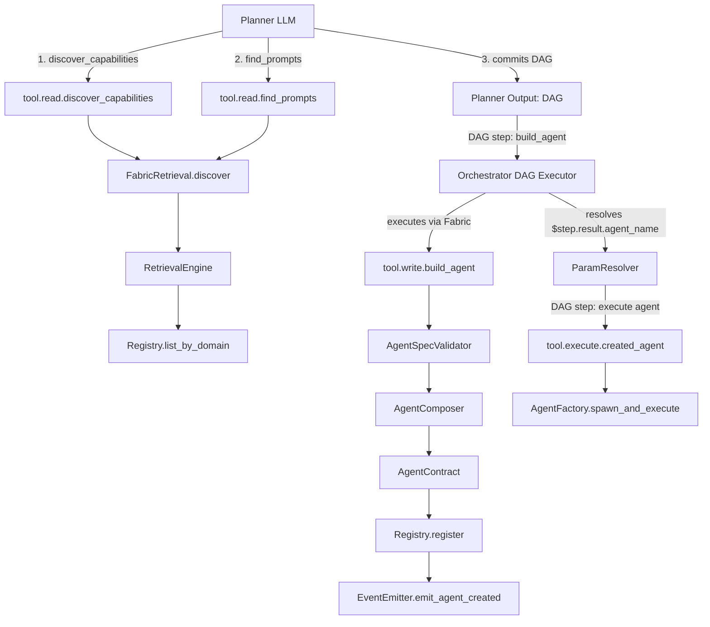

# Meta-Agent Creation Integration Proposal

> **Context**: Integration of meta-agent creation capabilities into `fabric-implementation-plan.md`
> **Date**: 2026-02-07
> **Author**: Claude (Sonnet 4.5)

---

## Executive Summary

**Meta-agent creation** enables the system to **dynamically compose and register new agents** from discovered tools and prompts. The Planner discovers capabilities (read-only) and plans agent specs; the Orchestrator executes build_agent DAG steps via Fabric. This is a Tier 3 capability where agents can create other agents.

### Three-Tier Capability Architecture

```
┌─────────────────────────────────────────────────────┐
│  Tier 3: Meta-Agent Creation (Planner + Orchestrator)│
│  - Planner discovers tools + plans agent specs     │
│  - Orchestrator executes build_agent DAG steps     │
│  - Safety band: AMBER (meta-operations)            │
└─────────────────────────────────────────────────────┘
              ↓ creates
┌─────────────────────────────────────────────────────┐
│  Tier 2: Dynamic Agents (Runtime-Created)          │
│  - diabetes_companion                               │
│  - email_drafter_monday                             │
│  - travel_planner_europe                            │
└─────────────────────────────────────────────────────┘
              ↓ uses
┌─────────────────────────────────────────────────────┐
│  Tier 1: Primitive Capabilities (Base Tools)       │
│  - tool.read.health_metrics_k0                     │
│  - tool.execute.send_email                         │
│  - tool.read.weather_api                           │
└─────────────────────────────────────────────────────┘
```

### Key Benefits

1. **Self-Improving System**: Planner plans specialized agents; Orchestrator creates them via DAG execution
2. **Domain Experts on Demand**: Healthcare, finance, travel agents composed as needed
3. **Reduced Planning Overhead**: Once created, agents handle tasks directly
4. **Workflow Composition**: Missing workflow steps can be filled by dynamically composed agents

---

## Integration Strategy

**Two Options:**

### **Option A: New Epic in M4 (Recommended)**

Add **Epic 4.5: Meta-Agent Creation** to Milestone 4 (Retrieval + Context + Agent Factory)

**Rationale**:

- M4 already focuses on agent capabilities
- Builds on AgentFactory (4.3) infrastructure
- Leverages RetrievalEngine (4.1) for discovery
- Natural extension of existing agent architecture

### **Option B: New Milestone M9**

Create **Milestone 9: Meta-Programming & Dynamic Composition**

**Rationale**:

- Meta-capabilities are advanced features
- Can be deferred without blocking core functionality
- Allows for more comprehensive meta-programming beyond just agents
- Clearer separation of concerns

**RECOMMENDATION: Option A** (add to M4) because:

- Infrastructure 95% ready
- Minimal new code (~2-3 new tools)
- Aligns with "agent factory" theme of M4
- Can be incrementally adopted

---

## Detailed Integration Plan: Option A (M4 Extension)

### New Epic: 4.5 - Meta-Agent Creation

**Goal**: Enable dynamic agent creation where Planner discovers tools/prompts (read-only) and plans agent specs, then Orchestrator executes build_agent DAG steps to compose and register new agents via Fabric.

**Reference**:

- `fabric_discussion.md` Section 13 (Agent Factory)
- ADR-0005 (Agent Lifecycle)
- This proposal document

**Dependencies**:

- Epic 4.1 (Retrieval) - discovery tools ✅
- Epic 4.3 (AgentFactory) - agent instantiation ✅
- Epic 2.2 (Registry) - dynamic registration ✅ (2.3.4)
- Epic 5.1 (Ports) - IEventPort for validation events ✅

---

### Issue Breakdown

| Issue | Title | Status | Deliverable | Details |
|-------|-------|--------|-------------|---------|
| **4.5.1** | Implement AgentBuilder contract validator | NEW | k1/fabric/core/agent_builder.py | `AgentSpecValidator` class: validates programmatic agent specs before contract creation. Rules: (1) name follows `agent.execute.*` pattern, (2) tools_granted[] all exist in registry, (3) required_context sections valid, (4) prompt_template exists (if specified), (5) domain tags valid, (6) safety_band valid enum, (7) token budgets in range. Returns `ValidationResult` with errors list. Used by build_agent tool. |
| **4.5.2** | Implement tool.write.build_agent (MCP Tool) | NEW | k1/contracts/tools/build_agent.yaml + implementation | **MCP tool contract**: `name: "tool.write.build_agent"`, `domain: ["META", "AGENT_CREATION"]`, `safety_band_min: "AMBER"`. **Inputs**: agent_name, description, tools_granted[], prompt_template, domain[], optional (required_context[], llm_budget_tokens, safety_band_min, max_tool_calls). **Implementation**: (1) Validate spec via AgentSpecValidator, (2) Build AgentContract via programmatic API, (3) Register via Registry.register(), (4) Emit `k1.fabric.agent.created.v1`, (5) Return `{agent_name, status: "registered"/"validation_failed", errors?}`. **Provider**: MCP local (Python function). **Tests**: valid creation, tool validation, duplicate rejection, invalid inputs. **NOTE**: This is an Orchestrator-executed DAG step, NOT a Planner tool (PLAN-06: Planner never writes). Planner includes build_agent as a DAG step; Orchestrator calls Fabric to execute it. |
| ~~**4.5.3**~~ | ~~Implement tool.write.build_prompt_template~~ | **KILLED** | — | **Removed**: Per Q5 resolution (PART 2), prompt templates are admin/development artifacts only. No runtime prompt creation. Templates are pre-authored, reviewed, and registered in the Prompt Registry. Future M9 may revisit with review gates. |
| **4.5.3** | Enhance FabricRetrieval for meta-agent use | NEW | k1/fabric/fabric.py | *(Renumbered from original 4.5.4)* Expose discovery tools as **MCP-callable capabilities**: (1) `tool.read.discover_capabilities` - wraps `FabricRetrieval.discover_capabilities()`, (2) `tool.read.find_prompts` - wraps `FabricRetrieval.find_relevant_prompts()`. Register these as tool contracts in registry. **Output**: Return full contract schemas (not just names) so Planner can inspect inputs/outputs before composing agents. **Contract files**: `k1/contracts/tools/discover_capabilities.yaml`, `k1/contracts/tools/find_prompts.yaml`. |
| **4.5.4** | Implement agent composition helpers | NEW | k1/fabric/core/agent_builder.py | **AgentComposer** class with builder pattern: `compose_agent(name, description, domain)` -> `add_tool(tool_name)` -> `set_prompt(template)` -> `set_context(sections[])` -> `build() -> AgentContract`. Validates incrementally. Used by build_agent tool execution. Factory methods: `from_discovery_result(capabilities, intent)` auto-selects top-K tools. |
| **4.5.5** | Safety: Meta-operation policy rules | NEW | k1/fabric/policy/security_context.py | Extend SecurityContext with **meta-operation gates**: (1) `tool.write.build_agent` requires `SafetyBand.AMBER` minimum, (2) Created agents inherit creator's max safety band (cannot escalate), (3) Restricted domains: agents cannot create agents with domain=["META", "SECURITY", "ADMIN"] (prevent recursive meta-agents), (4) Tool grant validation: created agent's `tools_granted[]` cannot include `tool.write.build_agent` (no recursive creation), (5) Agents CANNOT invoke other agents (depth=1, leaf nodes only). Emit `k1.fabric.meta.operation.blocked.v1` on violation. |
| **4.5.6** | Lifecycle: Ephemeral vs Persistent agents | NEW | k1/fabric/core/registry.py | Extend CapabilityContract with **lifecycle metadata**: `ephemeral: bool`, `created_by: str` (planner/user), `created_at: str`, `session_scoped: bool`. Ephemeral agents: removed on session end. Persistent agents: optionally write to `k1/contracts/agents/generated/{name}.yaml` via **auto-YAML serialization**. Registry tracks created agents separately. `list_created_agents() -> list[AgentContract]`. Emit `k1.fabric.agent.expired.v1` on ephemeral removal. |
| **4.5.7** | Event: Agent creation lifecycle events | NEW | k1/fabric/events/fabric_events.py | New event types: `k1.fabric.agent.created.v1` (payload: agent_name, created_by, tools_granted[], domain[], ephemeral), `k1.fabric.agent.expired.v1` (ephemeral removal), `k1.fabric.meta.operation.blocked.v1` (safety violation). EventEmitter methods: `emit_agent_created()`, `emit_agent_expired()`, `emit_meta_blocked()`. Note: `prompt.created` event removed (4.5.3 killed). |
| **4.5.8** | Define AgentResponsePayload type | NEW | k1/fabric/types.py | Frozen dataclass: `answer: str`, `confidence: float`, `domain: list[str]`, `sources: list[dict]`, `domain_data: dict[str, Any]` (freeform), `follow_up_needed: bool`, `follow_up_suggestion: str`, `reasoning_trace: list[str]`, `tools_used: list[str]`, `k0_queries_made: int`. Standard envelope for specialist agent output to Concierge. Not a rigid schema — `domain_data` is freeform per domain. |
| **4.5.9** | Orchestrator ParamResolver: dynamic capability resolution | NEW | k1/orchestrator/ (Orchestrator scope) | Enhance ParamResolver to resolve **capability names** from prior step results, not just parameter values. Pattern: `"capability": "$step_1a.result.agent_name"` — resolves to the agent name created in step_1a. Required for meta-agent DAG execution where build_agent returns agent_name and subsequent execute step references it dynamically. Single most important Orchestrator enhancement for meta-agent creation. |

---

### Wiring Dependencies



**PLAN-06 compliance**: Planner NEVER executes write operations directly.
Planner discovers (read-only), then commits a DAG. Orchestrator executes all
steps including `tool.write.build_agent` and `tool.execute.{created_agent}`.

**Wiring Notes**:

1. **4.5.1 (AgentSpecValidator)** depends on:
   - Registry.lookup() (2.2.3) to verify tools_granted[] exist
   - ContractValidator (2.1.1) for base validation logic
   - No new ports

2. **4.5.2 (build_agent tool)** depends on:
   - AgentSpecValidator (4.5.1)
   - AgentComposer (4.5.4)
   - Registry.register() (2.2.2)
   - IEventPort (5.1.2) for emit_agent_created
   - **Executed by Orchestrator** (not Planner) per PLAN-06

3. **4.5.3 (Discovery tools)** exposes:
   - FabricRetrieval (5.3.3) as MCP tools
   - Requires ToolContractParser (2.1.2) to create tool contracts

4. **4.5.5 (Meta-operation policy)** extends:
   - SecurityContext (3.2.1)
   - Adds recursive creation prevention
   - Adds agent-to-agent invocation block (depth=1)

5. **4.5.6 (Lifecycle)** extends:
   - CapabilityContract (1.3.3) with new fields
   - Registry (2.2.1) with created_agents index
   - ModuleLoader (2.3.1) for YAML persistence

6. **4.5.8 (AgentResponsePayload)** adds to:
   - types.py (1.3.3) as new frozen dataclass
   - Used by agent output validation

7. **4.5.9 (ParamResolver)** extends:
   - Orchestrator's existing ParamResolver
   - Resolves dynamic capability names from prior step results

---

### Testing Plan (Epic 6.X)

Add to **Epic 6.3: Integration Tests**

| Issue | Title | Status | Deliverable |
|-------|-------|--------|-------------|
| **6.3.8** | Test meta-agent creation workflow | NEW | tests/k1/fabric/test_meta_agent_creation.py | End-to-end: (1) Planner discovers tools via discover_capabilities, (2) Planner composes agent spec in DAG, (3) Orchestrator executes build_agent via Fabric, (4) New agent registered, (5) Orchestrator executes new agent via Fabric, (6) Agent runs with scoped tools. Test ephemeral cleanup, safety violations, duplicate names, tool validation failures. |
| **6.3.9** | Test recursive creation prevention | NEW | tests/k1/fabric/test_meta_safety.py | Test: (1) Agent with tool.write.build_agent in tools_granted[] is rejected, (2) Agent creation with domain=["META"] blocked, (3) Safety band escalation blocked (GREEN creator cannot make AMBER agent), (4) Tool grant validation (non-existent tools rejected), (5) Agent-to-agent invocation blocked (depth=1). Assert meta.operation.blocked events. |
| **6.3.10** | Test AgentResponsePayload and result merging | NEW | tests/k1/fabric/test_agent_response_payload.py | Test: (1) AgentResponsePayload creation and serialization, (2) domain_data freeform acceptance, (3) Multi-agent result aggregation structure, (4) Confidence averaging, (5) follow_up_needed propagation, (6) Concierge consumption pattern (reads answer + domain_data + sources). |

---

## Alternative: Option B (New Milestone M9)

If we choose to create a **separate milestone** for meta-programming:

### Milestone 9: Meta-Programming & Dynamic Composition

**Goal**: Enable dynamic capability composition, agent creation from prompts+tools, and self-improving system capabilities.

**Prerequisite**: M1-M5 complete (core Fabric operational)

**Epics**:

#### Epic 9.1: Meta-Tool Discovery

- Expose FabricRetrieval as MCP tools
- Contract schema introspection APIs
- Capability compatibility checking

#### Epic 9.2: Agent Builder Tools

- tool.write.build_agent
- tool.write.build_prompt_template
- tool.write.build_workflow (future)

#### Epic 9.3: Composition Helpers

- AgentComposer, PromptComposer builders
- Template recommendation system
- Auto-wiring validation

#### Epic 9.4: Meta-Operation Safety

- Recursive creation prevention
- Safety band inheritance rules
- Domain restrictions
- Audit logging for meta-ops

#### Epic 9.5: Lifecycle Management

- Ephemeral vs persistent agents
- Session-scoped cleanup
- YAML auto-serialization
- Agent versioning for created agents

#### Epic 9.6: K0 Integration

- Store created agents in K0 P04 (Reflection)
- Agent creation history
- User-specific agent libraries
- Cross-session agent recall

#### Epic 9.7: Testing & Validation

- End-to-end meta-creation workflows
- Safety violation tests
- Lifecycle tests
- K0 persistence tests

**Pros**:

- ✅ Clear separation from core Fabric
- ✅ Can be deferred without blocking M1-M8
- ✅ Room for expansion (workflow creation, tool composition)
- ✅ Easier to scope as "Phase 2" feature

**Cons**:

- ❌ Delays valuable capability
- ❌ Requires separate planning cycle
- ❌ May miss integration opportunities with M4-M5

---

## Recommendation: Hybrid Approach

**Phase 1 (M4): Foundational Meta-Capabilities**

- Add Epic 4.5 with issues 4.5.1 - 4.5.9
- Focus on discovery + agent creation + response payload + ParamResolver
- Safety: AMBER band, depth=1, no recursive creation
- Ephemeral agents by default, optional session persistence

**Phase 2 (M9): Advanced Meta-Programming**

- Runtime prompt template creation (killed in M4 Epic 4.5, deferred here with review gates)
- ORCH-13 micro-replan for mid-DAG agent discovery (deferred from M4)
- K0 integration (9.6)
- Workflow creation tools
- Template recommendation system

### Why This Works

1. **Incremental Value**: Basic meta-agent creation available in M4
2. **Risk Mitigation**: Advanced features deferred to M9
3. **Clear Dependencies**: M9 builds on proven M4 foundation
4. **Testing Strategy**: Core tests in M6, advanced tests in M9.7

---

## Estimated Effort

### Phase 1 (M4 Extension): 2-3 weeks

| Component | Effort | Dependencies |
|-----------|--------|--------------|
| AgentSpecValidator | 2 days | Registry lookup |
| build_agent tool | 3 days | Validator + Registry |
| Discovery tool wrappers | 2 days | FabricRetrieval |
| AgentComposer helpers | 3 days | Contract types |
| Basic safety rules | 2 days | SecurityContext |
| Event types | 1 day | EventEmitter |
| AgentResponsePayload | 1 day | types.py |
| ParamResolver enhancement | 3 days | Orchestrator |
| Testing | 5 days | All above |
| **Total** | **~3.5 weeks** | |

### Phase 2 (M9): 4-6 weeks

| Component | Effort | Dependencies |
|-----------|--------|--------------|
| Lifecycle management | 1 week | Registry extension |
| YAML persistence | 3 days | ModuleLoader |
| K0 integration | 1 week | Bridge port |
| Advanced safety | 3 days | Policy engine |
| Workflow creation | 1 week | WorkflowContract |
| Template recommendation | 1 week | RetrievalEngine |
| Testing | 2 weeks | All above |
| **Total** | **~6 weeks** | |

---

## Risk Analysis

| Risk | Severity | Mitigation |
|------|----------|------------|
| **Recursive agent creation** | HIGH | Hard block in SecurityContext (4.5.5) |
| **Safety band escalation** | HIGH | Inherit creator's max band (4.5.5) |
| **Tool scope violations** | MEDIUM | Validate tools_granted[] against registry |
| **Registry bloat** | MEDIUM | Ephemeral agents by default, TTL cleanup |
| **Performance impact** | LOW | Creation is async, doesn't block execution |
| **Contract validation complexity** | LOW | Reuse existing ContractValidator |

---

## Success Criteria

### Phase 1 (M4)

- ✅ Planner can discover available tools and prompts (read-only)
- ✅ Planner can plan agent creation spec in DAG
- ✅ Orchestrator can execute build_agent + created agent via Fabric
- ✅ Created agent registers and executes successfully
- ✅ Safety violations blocked and logged
- ✅ <500ms creation latency (P95)
- ✅ No recursive meta-agent creation
- ✅ Agent-to-agent invocation blocked (depth=1)

### Phase 2 (M9)

- ✅ Created agents persist across sessions (if configured)
- ✅ K0 stores agent creation history
- ✅ Users can recall "my custom agents"
- ✅ Workflow creation tools functional
- ✅ Template recommendation >80% relevance

---

## Example End-to-End Flow

### Scenario: User Needs Diabetes Management Assistant

```python
# 1. User request
"I need help managing my diabetes with K0 health data"

# 2. Planner LLM reasoning (READ-ONLY discovery via tool calls)
# Step 1: Discover health tools
result = await fabric.execute(CapabilityRequest(
    name="tool.read.discover_capabilities",
    params={
        "domain": ["HEALTH", "MEDICAL"],
        "intent": "glucose tracking, health data, medication",
        "top_k": 20
    }
))
# Returns: 20 health-related tools with full schemas

# Step 2: Find matching prompt templates
result = await fabric.execute(CapabilityRequest(
    name="tool.read.find_prompts",
    params={
        "domain": ["HEALTH"],
        "intent": "health advisor diabetes management",
        "top_k": 5
    }
))
# Returns: 5 relevant prompt templates from Prompt Registry

# 3. Planner COMMITS DAG (does NOT execute build_agent directly — PLAN-06)
# Planner outputs this DAG for Orchestrator:
dag = {
    "step_1": {
        "capability": "tool.write.build_agent",
        "params": {
            "agent_name": "agent.execute.diabetes_companion",
            "description": "Personal diabetes management with K0 health data",
            "domain": ["HEALTH", "MEDICAL", "DIABETES"],
            "tools_granted": [
                "tool.read.k0_recall",
                "tool.read.health_metrics",
                "tool.read.glucose_tracker",
                "tool.read.medication_schedule"
            ],
            "prompt_template": "health_advisor_v2",  # discovered, not inline
            "required_context": ["beliefs_active", "interaction_history",
                                 "task_context", "rhythm_state"],
            "safety_band_min": "AMBER",
            "llm_budget_tokens": 8192
        }
    },
    "step_2": {
        "capability": "$step_1.result.agent_name",  # dynamic resolution!
        "params": {"query": "How are my glucose levels trending?"},
        "depends_on": ["step_1"]
    }
}

# 4. Orchestrator executes DAG
# step_1: Fabric.execute(build_agent) -> Registry.register() -> registered
# step_2: ParamResolver resolves $step_1.result.agent_name ->
#         "agent.execute.diabetes_companion"
#         Fabric.execute(diabetes_companion) -> AgentFactory.spawn_and_execute()
# Agent executes with scoped K0 access via tool.read.k0_recall
```

**Timeline**:

- Step 1-2: ~100ms (Planner discovery, read-only)
- Step 3 (DAG commit): ~50ms
- Step 4 (Orchestrator executes build_agent): ~200ms (validation + registration)
- Step 5 (Orchestrator executes agent): ~3-5s (agent execution)
- **Total**: ~3.5s from request to answer

---

## Appendix A: New Event Types

```python
# k1/fabric/events/fabric_events.py

@dataclass(frozen=True)
class AgentCreatedEvent:
    """Emitted when a new agent is dynamically created"""
    agent_name: str
    created_by: str  # "planner" | "user" | agent_id
    tools_granted: List[str]
    domain: List[str]
    prompt_template: str
    ephemeral: bool
    session_id: str
    trace_id: str
    timestamp: str

@dataclass(frozen=True)
class AgentExpiredEvent:
    """Emitted when ephemeral agent is removed"""
    agent_name: str
    created_at: str
    expired_at: str
    invocations: int
    trace_id: str

@dataclass(frozen=True)
class MetaOperationBlockedEvent:
    """Emitted when meta-operation violates safety policy"""
    operation: str  # "build_agent" | "agent_invocation"
    violation: str  # "recursive_creation" | "domain_restricted" | "safety_escalation" | "depth_exceeded"
    requested_by: str
    details: Dict[str, Any]
    trace_id: str
```

---

## Appendix B: Updated Epic Summary

### Updated Milestone 4 Summary (with Epic 4.5)

| Epic | Focus | Issues | Completion |
|------|-------|--------|------------|
| 4.1 | Semantic Retrieval | 5 | DONE |
| 4.2 | Context Builder | 4 | DONE |
| 4.3 | Agent Factory | 5 | DONE |
| 4.4 | Concurrency | 2 | DONE |
| **4.5** | **Meta-Agent Creation** | **9** | **NEW** |

**Updated M4 completion**: ~95% → 80% (with Epic 4.5)

---

## Conclusion

**Recommended Path Forward**:

1. **Immediate**: Add Epic 4.5 (issues 4.5.1 - 4.5.9) to Milestone 4
2. **M4 Completion**: Include basic meta-agent creation in M4 delivery
3. **M6 Testing**: Add test issues 6.3.8 - 6.3.10
4. **Future (M9)**: Plan advanced meta-programming features (K0 integration, workflows, runtime prompt creation, ORCH-13 agent micro-replan)

**Integration Points**:

- Insert Epic 4.5 after Epic 4.4 in the plan
- Add 3 test issues to Epic 6.3
- Update M4 overview to include meta-creation goals
- Add new event types to 5.4.1
- ParamResolver enhancement (4.5.9) touches Orchestrator scope

**Estimated Delta to Plan**:

- +9 implementation issues (was 8: killed 4.5.3 prompt builder, added 4.5.8 + 4.5.9)
- +3 test issues
- +3-3.5 weeks to M4 timeline
- No changes to M1-M3, M5-M8

This enables a **self-improving system** while maintaining architectural integrity and safety guarantees.

---
---

# PART 2: Architectural Brainstorming — How Planner Spawns Agents

> **Date**: 2026-02-07
> **Participants**: Architect + AI
> **Status**: BRAINSTORMING (not finalized)

---

## Design Decisions (from brainstorming session)

| # | Question | Decision | Rationale |
|---|----------|----------|-----------|
| D1 | What IS a spawned agent? | Concierge-facing specialist | Agents produce dense structured output for Concierge to reformat. NOT user-facing. Empathy/style = Concierge's job. |
| D2 | Agent shape | Prompt + Tools + Full Context + Domain + Constraints | Prompt encodes specialist behavior. Tools define capability. Full context for cross-domain understanding. |
| D3 | Context model | Full session context (all sections) | Cross-domain matters: medicine relates to finance, calendar relates to health. No filtering = no under-granting risk. |
| D4 | Who picks context? | Planner LLM decides | Planner has intent understanding. Default=full. Planner can narrow down if needed. |
| D5 | K0 access | Via Bridge through Fabric (standard tool calls) | Agent calls tool.read.k0_recall → Fabric → BridgeProvider → Bridge.IKernelQueryPort → K0. No direct access. |
| D6 | Token budget | Full independent 128K ceiling per agent | Each specialist gets full budget. No carving from parent plan. |
| D7 | Multi-agent | Parallel spawn supported | "Can I afford my diabetes meds?" → health_agent + finance_agent in parallel. |
| D8 | Lifespan | Default one-shot, optional persistence | Ephemeral by default. ephemeral=false → stays in AgentPool for re-invocation within session. |
| D9 | Output shape | Minimal envelope + rich freeform payload | Not rigid schema (infinite domains). Not unstructured (Concierge needs reliability). Envelope with flexible domain_data. |

---

## 1. What IS a Dynamically Spawned Agent?

A spawned agent is a **domain specialist that reports TO the Concierge**, not to the user.

```
┌──────────────────────────────────────────────────────────────┐
│                        USER                                   │
│  "Can I afford my diabetes medication this month?"            │
└──────────────────────┬───────────────────────────────────────┘
                       │
                       ▼
┌──────────────────────────────────────────────────────────────┐
│                    CONCIERGE                                  │
│  - Receives user message                                      │
│  - Routes to Planner (HIGH tier)                              │
│  - WAITS for specialist results                               │
│  - Reformats into empathetic, user-friendly response          │
│  - Controls persona, tone, safety filtering                   │
└──────────────────────┬───────────────────────────────────────┘
                       │
                       ▼
┌──────────────────────────────────────────────────────────────┐
│                     PLANNER                                   │
│  Stage 1: Intent=multi-domain (HEALTH + FINANCE)              │
│  Stage 2: Discovers tools in HEALTH + FINANCE domains         │
│  Stage 3: Decides to spawn 2 specialist agents                │
│  Stage 4: Commits plan with build_agent + execute steps       │
└────────────┬─────────────────────────┬───────────────────────┘
             │                         │
             ▼                         ▼
┌────────────────────────┐  ┌────────────────────────┐
│  diabetes_companion     │  │  budget_analyzer        │
│  SPECIALIST AGENT       │  │  SPECIALIST AGENT       │
│                         │  │                         │
│  Tools:                 │  │  Tools:                 │
│  - k0_recall(health)    │  │  - k0_recall(finance)   │
│  - glucose_tracker      │  │  - budget_calculator    │
│  - medication_schedule  │  │  - insurance_lookup     │
│                         │  │                         │
│  Output: Dense medical  │  │  Output: Dense financial│
│  brief for Concierge    │  │  brief for Concierge    │
└────────────┬────────────┘  └────────────┬────────────┘
             │                             │
             └──────────┬──────────────────┘
                        │ merge results
                        ▼
┌──────────────────────────────────────────────────────────────┐
│                    CONCIERGE                                  │
│  "Your glucose has been trending down this week - great       │
│   progress! Your diabetes meds ($45/month with insurance)     │
│   fit within your health budget. You have $120 remaining      │
│   in your health spending this month."                        │
└──────────────────────────────────────────────────────────────┘
```

**Key insight**: The agent is like a domain expert writing a research brief for
a communicator. The agent doesn't need "personality" — it needs **accuracy, completeness,
and structured output** that Concierge can consume.

---

## 2. Agent Composition: What Makes an Agent?

An `AgentContract` currently has:

```python
# From types.py — existing fields
@dataclass(frozen=True)
class AgentContract(CapabilityContract):
    prompt_template: str          # Specialist behavior instructions
    tools_granted: List[str]      # What tools this agent can use
    llm_budget_tokens: int        # Token budget for LLM calls
    max_tool_calls: int           # Max tool invocations
    max_execution_time_ms: int    # Timeout

    # From parent CapabilityContract:
    required_context: List[str]   # SessionState sections needed
    optional_context: List[str]   # Nice-to-have sections
    domain: List[str]             # Domain tags (HEALTH, FINANCE, etc.)
    safety_band_min: str          # Minimum safety band
```

**For dynamically spawned agents, this IS sufficient.** But we need to think about
what the Planner actually composes at creation time:

### What Planner Provides at Spawn

| Field | Source | How Planner Decides |
|-------|--------|---------------------|
| `prompt_template` | Discovered via `find_prompts` (registry only) | Planner LLM selects best prompt from discovered templates. No inline composition (Q5). |
| `tools_granted[]` | Discovered via `discover_capabilities` | Planner LLM selects tools matching intent from discovery results |
| `required_context` | Planner LLM decides (default: full) | Default=all sections. Planner can narrow if intent is focused. |
| `domain[]` | Inherited from discovered tools | Union of domains from selected tools |
| `safety_band_min` | Inherited from highest tool requirement | Max of all tools' safety_band_min values |
| `llm_budget_tokens` | Planner sets (default: 8192) | Based on task complexity. Simple lookup=2048, complex reasoning=8192+ |
| `max_tool_calls` | Planner sets (default: 10) | Based on how many tools granted |
| `max_execution_time_ms` | Planner sets (default: 30000) | Based on expected complexity |

### What Planner Does NOT Decide

| Concern | Who Handles | Why |
|---------|-------------|-----|
| Empathy/tone | Concierge | Agent output is for Concierge, not user |
| Output formatting for user | Concierge | Concierge owns user experience |
| Retry/escalation to user | Orchestrator | DAG retry policies handle this |
| Safety filtering | SecurityContext (PolicyEngine) | Enforced at Fabric level on every call |
| Tool scope enforcement | ToolScope (existing FAB-07) | Agent can only call tools in tools_granted[] |

---

## 3. Context Flow: Full Context Model

### Decision: Agents Get Full Session Context

Why full context?

- Medicine relates to finance (medication costs)
- Calendar relates to health (appointment scheduling)
- Task context relates to everything (current conversation)
- K0 recalls may reference any domain

```
┌─────────────────────────────────────────────────────────┐
│              SessionState (6 Sections)                    │
│                                                           │
│  beliefs_active        ─── health, finance, family,       │
│                            preferences, routines          │
│  interaction_history   ─── recent conversation turns      │
│  task_context          ─── current task being worked on   │
│  rhythm_state          ─── time-of-day, user patterns     │
│  active_plans          ─── current planner output         │
│  pending_clarifications─── open questions to user         │
│                                                           │
│  ALL sections available to spawned agent via               │
│  ContextBuilder → ExecutionContext                         │
└─────────────────────────────────────────────────────────┘
```

### How It Works (existing machinery)

```python
# AgentContract for spawned agent
contract = AgentContract(
    name="agent.execute.diabetes_companion",
    required_context=["beliefs_active", "interaction_history",
                      "task_context", "rhythm_state"],
    optional_context=["active_plans", "pending_clarifications"],
    # ... other fields
)

# ContextBuilder.build() already handles this:
# 1. Reads required_context sections from SessionState
# 2. Reads optional_context sections (skips if missing)
# 3. Injects request params
# 4. Resolves prompt template
# 5. Applies token budget (128K ceiling)
# 6. Returns ExecutionContext
```

**Full context default:**

- Spawned agents use `required_context: ["beliefs_active", "interaction_history", "task_context", "rhythm_state"]`
- Plus `optional_context: ["active_plans", "pending_clarifications"]`
- This gives cross-domain understanding by default
- If Planner wants a focused agent, it can narrow `required_context`

### Token Budget: Independent Per Agent

Each spawned agent gets its own **full 128K ContextBudget**:

- No budget carving from parent plan
- Rationale: Specialists need room to think. A diabetes analysis might need
  extensive health history + medication list + insurance data.
- ContextBudget compression kicks in automatically if context exceeds ceiling

---

## 4. K0 Access: Through Bridge via Fabric

K0 is the user's "brain replica" — long-term episodic memory, semantic search,
knowledge graph. Agents access K0 through the standard tool chain:

```
Agent                    Fabric              Bridge              K0
  │                        │                   │                  │
  │  CapabilityRequest     │                   │                  │
  │  (tool.read.k0_recall) │                   │                  │
  │───────────────────────>│                   │                  │
  │                        │  BridgeProvider   │                  │
  │                        │  .execute()       │                  │
  │                        │──────────────────>│                  │
  │                        │                   │  IKernelQueryPort│
  │                        │                   │  .query(selectors)
  │                        │                   │─────────────────>│
  │                        │                   │                  │
  │                        │                   │  RecallBundle    │
  │                        │                   │<─────────────────│
  │                        │  CapabilityResult │                  │
  │                        │<──────────────────│                  │
  │  Result with K0 data   │                   │                  │
  │<───────────────────────│                   │                  │
```

### K0 Query Types Available to Agents

From `bridge_architecture.mmd`, four selector types exist:

| Selector Type | What It Queries | Agent Use Case |
|---------------|-----------------|----------------|
| `episodic` | `memory.delta` (WAL position) | "What did user say about medications last week?" |
| `semantic` | Free-text pgvector similarity | "Find memories related to glucose management" |
| `session` | `session.*` (SessionState history) | "What was user's glucose reading last session?" |
| `device` | `ifl.*` (IFL adapter events) | "What did the Fitbit report this morning?" |

### K0 Query Schemas (TO BE DEFINED)

The Bridge already defines the `QueryEnvelope` and `RecallSelector` structures.
What we need for agent use:

```yaml
# Proposed: tool.read.k0_recall contract
name: "tool.read.k0_recall"
domain: ["MEMORY", "K0"]
safety_band_min: "GREEN"
required_inputs:
  - name: selectors
    type: array
    description: "RecallSelector[] - what to query"
  - name: intent
    type: string
    description: "Natural language query intent"
optional_inputs:
  - name: max_results
    type: integer
    default: 10
  - name: after
    type: string
    description: "ISO timestamp - only memories after this time"
output:
  type: object
  properties:
    episodes: { type: array, description: "Recalled memory episodes" }
    semantic_matches: { type: array, description: "Semantic similarity results" }
```

**Resolved** (see Q1 in Section 9): Flow pattern locked — Agent -> Fabric -> BridgeProvider -> K0 QueryPort. Exact K0 query schemas TBD when K0 P01 implementation begins.

---

## 5. Output Shape: Envelope + Rich Payload

Agents are specialists for Concierge. The output needs to be:

- **Reliable enough** for Concierge to parse programmatically
- **Flexible enough** that any domain can express its results
- **Rich enough** that Concierge has everything needed to compose user response

### Proposed: AgentResponsePayload

```python
@dataclass(frozen=True)
class AgentResponsePayload:
    """
    Standard payload from specialist agents to Concierge.

    Not a rigid schema — domain_data is freeform.
    But the envelope fields give Concierge reliable metadata.
    """

    # ---- Core Content ----
    answer: str                    # Primary textual answer (dense, factual)
    confidence: float              # 0.0-1.0 how confident the agent is
    domain: List[str]              # Which domains this covers

    # ---- Evidence ----
    sources: List[Dict[str, Any]]  # Citations: tool outputs, K0 recalls, beliefs
                                   # Each: {type: "k0_recall"|"tool"|"belief",
                                   #         ref: "...", summary: "..."}

    # ---- Domain-Specific Structured Data ----
    domain_data: Dict[str, Any]    # Freeform. Health agent puts glucose data here.
                                   # Finance agent puts budget breakdown here.
                                   # Concierge reads what it needs.

    # ---- Metadata ----
    follow_up_needed: bool         # Agent recommends further investigation
    follow_up_suggestion: str      # What to investigate next (for Planner)
    reasoning_trace: List[str]     # Steps agent took (for observability)
    tools_used: List[str]          # Which tools were actually invoked
    k0_queries_made: int           # How many K0 recalls
```

### Why This Works

1. **Concierge** reads `answer` + `confidence` + `domain_data` to compose user response
2. **Concierge** reads `sources` to decide what to cite
3. **Planner** reads `follow_up_needed` to decide if more agents needed
4. **Observability** reads `reasoning_trace` + `tools_used` for debugging
5. **domain_data** is **not typed** — each domain puts whatever is relevant:

```python
# Health agent domain_data example:
{
    "glucose_trend": "decreasing",
    "glucose_readings_7d": [120, 115, 118, 112, 110, 108, 105],
    "medication_schedule": [
        {"name": "Metformin", "dose": "500mg", "frequency": "2x daily"}
    ],
    "risk_level": "LOW",
    "next_checkup": "2026-02-15"
}

# Finance agent domain_data example:
{
    "monthly_medication_cost": 45.00,
    "insurance_coverage_pct": 80,
    "health_budget_remaining": 120.00,
    "health_budget_total": 300.00,
    "affordability": "WITHIN_BUDGET"
}
```

Concierge doesn't need to understand every possible `domain_data` structure —
it uses the `answer` text as the primary content and `domain_data` as enrichment.

---

## 6. The Spawn Flow: How Agents Get Created

### Critical Architecture Constraint

**Planner NEVER writes** (PLAN-06 invariant). So `tool.write.build_agent` is
NOT a Planner tool — it's an **Orchestrator DAG step**.

### Complete Flow: Discovery → Build → Execute

```
Stage 1: PLANNER (Read-Only Discovery)
─────────────────────────────────────────
Planner LLM uses discovery tools (read-only):
  1. tool.read.discover_capabilities(domain=["HEALTH","FINANCE"], intent="diabetes medication cost")
     → Returns: 20 health tools, 15 finance tools (with full schemas)
  2. tool.read.find_prompts(domain=["HEALTH"], intent="medical advisor")
     → Returns: 5 relevant prompt templates

Planner LLM reasons:
  "User needs cross-domain analysis. I'll create two specialist agents
   and execute them in parallel."

Stage 2: PLANNER COMMITS PLAN (DAG)
─────────────────────────────────────────
Planner outputs a DAG with these steps:

step_1a: {                                    step_1b: {
  capability: "tool.write.build_agent",         capability: "tool.write.build_agent",
  params: {                                     params: {
    agent_name: "agent.execute.diabetes_companion",
    tools_granted: [                              agent_name: "agent.execute.budget_analyzer",
      "tool.read.k0_recall",                      tools_granted: [
      "tool.read.health_metrics",                   "tool.read.k0_recall",
      "tool.read.glucose_tracker",                  "tool.read.budget_data",
      "tool.read.medication_schedule"                "tool.read.insurance_lookup"
    ],                                            ],
    prompt_template: "health_advisor_v2",          prompt_template: "finance_advisor_v1",
    domain: ["HEALTH", "MEDICAL"],                 domain: ["FINANCE", "INSURANCE"],
    required_context: ["beliefs_active",           required_context: ["beliefs_active",
      "interaction_history", "task_context"],         "interaction_history", "task_context"],
    llm_budget_tokens: 8192                        llm_budget_tokens: 4096
  }                                              }
}                                              }
  ↓ (parallel)                                   ↓ (parallel)

step_2a: {                                    step_2b: {
  capability: "$step_1a.result.agent_name",     capability: "$step_1b.result.agent_name",
  params: {                                     params: {
    query: "diabetes medication status           query: "can user afford diabetes
             and glucose trends"                          medication this month"
  },                                            },
  depends_on: ["step_1a"]                       depends_on: ["step_1b"]
}                                              }
  ↓ (parallel)                                   ↓ (parallel)

  └──────────────────┬─────────────────────────┘
                     │
step_3: {            ▼
  type: "merge_results",
  depends_on: ["step_2a", "step_2b"],
  → Orchestrator ResultAggregator merges both AgentResponsePayloads
  → Merged result returned to Concierge
}

Stage 3: ORCHESTRATOR EXECUTES DAG
─────────────────────────────────────────
1. Orchestrator ParamResolver resolves step_1a + step_1b params
2. Fabric.execute(build_agent) → AgentSpecValidator → Registry.register()
3. Orchestrator resolves "$step_1a.result.agent_name" → "agent.execute.diabetes_companion"
4. Fabric.execute(diabetes_companion) → AgentFactory.spawn_and_execute()
5. Both agents run in PARALLEL (Orchestrator DAG parallel execution)
6. Results merged, returned to Concierge
```

### Orchestrator Enhancement Needed: Dynamic Capability Resolution

Currently ParamResolver resolves static `$step_N.result.field` references.
For meta-agent creation, we need:

```python
# Step 2 references a capability name that doesn't exist until Step 1 completes
step_2a = {
    "capability": "$step_1a.result.agent_name",  # Dynamic!
    # This means: "execute whatever agent was created in step_1a"
}
```

This requires ParamResolver to resolve **capability names** from prior step results,
not just parameter values. This is the single most important Orchestrator enhancement.

---

## 7. Parallel Multi-Agent Spawn

### Why Parallel?

Real user queries often span domains:

- "Can I afford my diabetes meds?" → HEALTH + FINANCE
- "Schedule my doctor appointment around work" → HEALTH + CALENDAR + WORK
- "Plan a family dinner considering dietary restrictions" → FOOD + HEALTH + CALENDAR + FAMILY

### How It Works (Orchestrator DAG)

The Orchestrator already supports parallel DAG execution.
Two agents with no dependency between them run concurrently:

```
step_1a (build health agent)  ──┐
                                 ├── parallel
step_1b (build finance agent) ──┘
         │                              │
         ▼                              ▼
step_2a (execute health agent)──┐
                                 ├── parallel
step_2b (execute finance agent)──┘
         │                              │
         └──────────┬───────────────────┘
                    ▼
            step_3 (merge)
```

### Result Merging Strategy

When multiple agents return `AgentResponsePayload` objects,
Orchestrator's ResultAggregator combines them:

```python
# Merged result for Concierge
merged = {
    "agents_executed": [
        {
            "agent": "agent.execute.diabetes_companion",
            "payload": AgentResponsePayload(
                answer="Glucose trending down...",
                domain_data={"glucose_trend": "decreasing", ...}
            )
        },
        {
            "agent": "agent.execute.budget_analyzer",
            "payload": AgentResponsePayload(
                answer="Medication costs $45/month...",
                domain_data={"affordability": "WITHIN_BUDGET", ...}
            )
        }
    ],
    "any_follow_up_needed": False,
    "total_confidence": 0.87  # avg of agent confidences
}
```

Concierge reads BOTH payloads and composes a single coherent response.

---

## 8. Agent Lifespan: One-Shot Default + Persistence Option

### Default: Ephemeral (One-Shot)

```
PENDING → WARMING → ACTIVE → (execute) → TERMINATED
```

- Agent created for a single task
- Executes, returns AgentResponsePayload, terminates
- No pool entry, no reuse
- Contract removed from Registry after execution

### Optional: Persistent (Session-Scoped)

```
PENDING → WARMING → ACTIVE → (execute) → IDLE (pool) → (re-execute) → IDLE → ...
                                                                              → TERMINATED (session end)
```

- Planner sets `ephemeral: false` in build_agent params
- Agent goes to AgentPool (existing 4.3.3) after execution
- Can be re-invoked by name in subsequent DAG steps
- Terminated when session ends (session-scoped cleanup)
- Contract stays in Registry for session duration

### When to Use Persistent

- **Recurring patterns**: "Check my glucose every morning" → persistent diabetes agent
- **Multi-turn investigation**: Agent findings lead to follow-up questions
- **Expensive setup**: Agent with many K0 recalls → reuse avoids re-fetching

---

## 9. Resolved Design Questions

### Q1: K0 Query Schema for Agents — RESOLVED

**Decision**: Intent-based `tool.read.k0_recall` that wraps K0's existing `QueryEnvelope` + `RecallSelector[]`.
Prompt templates teach agents how to build selectors.

**Rationale** (from K0 architecture analysis):

K0 Query Port already exposes `query_recall()` accepting `RecallRequest` with `RecallSelector[]`.
Four selector types exist: `episodic`, `semantic`, `session`, `device`.
K0 storage drivers include `st_sqlite` (WAL/episodic), `st_vector` (pgvector similarity),
`st_kg` (knowledge graph), `st_fts` (tsvector FTS). The Bridge's `IKernelQueryPort.query()`
already wraps all of these.

**Approach: Single generic tool + prompt-guided selector building**

```
tool.read.k0_recall
  ├── Agent provides: intent (natural language) + optional explicit selectors
  ├── Prompt template teaches: "For health data, use type=device topic=ifl.health.*"
  ├── Prompt template teaches: "For past conversations, use type=semantic query=..."
  └── Bridge's QueryBuilder constructs actual RecallSelector[] from agent params
```

**Why NOT domain-specific K0 tools**:

- K0 pipelines are domain-agnostic (P01 Recall doesn't know "health" vs "finance")
- Domain specificity lives in the QUERY, not the tool
- Prompt templates are the right place for domain-specific K0 querying patterns
- Each agent's prompt template includes domain-specific K0 query recipes:

```
# Inside diabetes_companion prompt template:
You have access to tool.read.k0_recall. Use it with these patterns:
- Glucose readings: selectors=[{type: "device", topic: "ifl.health.*.glucose"}]
- Past medical conversations: selectors=[{type: "semantic", query: "..."}]
- Medication schedule: selectors=[{type: "episodic", topic: "memory.delta", after: "..."}]
```

**K0 schemas TBD**: Exact RecallSelector fields + response schemas will be defined when
K0 query pipeline (P01) implementation begins. The flow pattern is locked.

---

### Q2: Concierge Multi-Agent Response Merging — RESOLVED

**Decision**: LLM synthesis via Concierge's existing DELIVERING state.
Concierge already does this for HIGH-tier execution results.

**How it works** (from `concierge.mmd`):

The existing flow for HIGH-tier results is:

```
ORCHESTRATOR_ACTOR -->|"aggregated results"| COMPANIONING
COMPANIONING -->|"stage tool_result"| TOOL_RESULT_BUFFER
...
DELIVERING -->|"fetch all tool_results"| TOOL_RESULT_BUFFER
TOOL_RESULT_BUFFER -->|"MED/HIGH: all tool_results[]"| DELIVERING
DELIVERING -->|"MED/HIGH: results + context budget: {max_tokens: HIGH=8K}"| PORT_LLM
PORT_LLM -->|"final response + cognitive tool calls"| DELIVERING
```

**For multi-agent results this is identical**:

1. Orchestrator's `ResultAggregator` collects all agent payloads into `AggregatedResult`
2. `AggregatedResult` flows to Concierge's COMPANIONING state
3. COMPANIONING stages all results in `TOOL_RESULT_BUFFER`
4. DELIVERING fetches all tool results and sends to LLM with context
5. Concierge LLM synthesizes multi-domain answers into coherent response
6. Concierge LLM handles contradictions (its job — it has persona + empathy context)

**Key insight**: No new machinery needed. Concierge's existing
COMPANIONING -> TOOL_RESULT_BUFFER -> DELIVERING -> LLM synthesis pipeline
handles multi-agent results natively. The LLM call in DELIVERING already gets
`all tool_results[]` — whether those come from tools or specialist agents.

**Contradictions**: Handled by Concierge LLM during synthesis. The LLM has:

- Both agent answers with confidence scores and sources
- User context (beliefs, preferences) from SessionState
- Persona instructions (how to handle uncertainty)
- Can say: "Your health advisor and nutrition data suggest different things
  about sugar — let me explain both perspectives..."

---

### Q3: Agent-to-Agent Invocation Depth — RESOLVED

**Decision**: Agents CANNOT invoke other agents. Depth = 1 only.
Planner plans, Orchestrator executes. Always.

**Rationale** (from `orchestrator.mmd` and `planner.mmd`):

From Orchestrator invariants:

- `ORCH-04`: Every step through Fabric (never direct provider)
- `ORCH-07`: Dependent CANCELLED on parent fail; independent CONTINUE
- `ORCH-08`: Workflow depth: max 3 (sub-workflow nesting limit)

From Planner invariants:

- `PLAN-06`: Planner NEVER executes (read-only discovery)
- Planner produces the DAG. Orchestrator executes the DAG. Agents are leaf nodes.

**The correct pattern**:

If a "diabetes companion" needs a "medication lookup agent", the Planner should have
planned BOTH agents in the DAG as separate steps:

```
step_1: build_agent(diabetes_companion)
step_2: build_agent(medication_lookup)     # Planner planned this too
step_3: execute(medication_lookup)          # Orchestrator executes
step_4: execute(diabetes_companion,         # Gets medication data as param
         medication_data=$step_3.result)
```

**Why no agent-to-agent calls**:

1. Violates DAG visibility — Orchestrator can't track/cancel/retry nested calls
2. Violates token budget tracking (ORCH-14) — hidden agent costs are invisible
3. Violates the architecture — agents are leaf nodes, Orchestrator is the coordinator
4. Planner has full intent understanding — it should plan ALL needed agents upfront

**If during execution an agent discovers it needs another agent**: Conceptually,
Micro-Replan (ORCH-13) could handle this — agent reports discovery via
`CapResult.discoveries[]`, Orchestrator triggers Planner micro-replan, Planner
adds the missing agent steps (discover + build + execute). However, **this is
deferred to M9** as the complexity of mid-DAG agent creation (3 new steps per
replan cycle) exceeds M4 scope. For M4: Planner must plan ALL needed agents upfront.

---

### Q4: Failure Handling in Parallel Spawn — RESOLVED

**Decision**: Partial results returned. Already supported by Orchestrator.

**From `orchestrator.mmd`**:

```
ORCH-07: Dependent CANCELLED on parent fail; independent CONTINUE
```

And from Step Cancellation:

```
On parent failure: CANCEL all transitive dependents
Independent steps CONTINUE
Cancelled steps appear in AggregatedResult
```

**For parallel agents (health + finance), they are INDEPENDENT steps**:

1. health_agent fails → finance_agent CONTINUES (ORCH-07)
2. Orchestrator retries health_agent (2 retries, ORCH-06)
3. If all retries fail: health step marked FAILED in AggregatedResult
4. finance_agent result still delivered
5. AggregatedResult contains: `{completed: 1, failed: 1, ...}`

**Concierge handles gracefully**:

- DELIVERING state LLM sees: "finance_agent succeeded, health_agent failed"
- Concierge composes: "I have your budget information, but I couldn't check
  your health data right now. Here's what I found financially: ..."

**Token budget tracker (ORCH-14)** also handles partial:

- At >= 100% budget: HARD STOP, aggregate partial results
- This means even successful agents get partial if budget exhausted

---

### Q5: Template Library vs Inline Prompts — RESOLVED

**Decision**: Discovered templates from Prompt Registry only. No inline.

**Rationale**:

The system already has a Prompt Registry (managed by the Prompt Management System).
Prompt templates are highly specific, expert-crafted artifacts:

1. **They encode domain K0 query patterns** — "how to query K0 for glucose data"
2. **They encode output format expectations** — "return structured brief for Concierge"
3. **They encode domain expertise** — "when reporting health metrics, include trend analysis"
4. **They encode safety constraints** — "never provide medical advice, only data summaries"

**Why NOT inline prompts from Planner**:

- Planner LLM writing prompts = prompt injection risk
- Quality of inline prompts is unpredictable
- K0 query recipes must be precise — LLM-generated selectors are brittle
- Prompt templates should be REVIEWED and REGISTERED (like contracts)
- Version control: templates are versioned in Prompt Registry, inline prompts aren't

**Flow**:

```
Planner:
  1. find_prompts(domain=["HEALTH"], intent="diabetes management")
     → Returns: ["health_advisor_v2", "diabetes_companion_v1", ...]
  2. Planner selects best match: "diabetes_companion_v1"
  3. build_agent(prompt_template="diabetes_companion_v1", ...)
```

**If no matching template exists**:

- Planner should NOT create one on the fly
- Instead: use a generic domain template (e.g., "generic_health_advisor_v1")
- Or: fail with "no suitable prompt template found" — signals Gap to system

**Template registration is an admin/development activity**, not a runtime activity.
(Future M9 could allow Planner to create templates, but with review gates.)

---

### Q6: Budget Accounting Across Parallel Agents — RESOLVED

**Decision**: No session-level cap. Agents are primarily tool-callers, not token-heavy.

**Rationale**:

1. Spawned specialist agents are **tool-call machines**, not creative writers
   - They call K0 recall (tool call) → process data → call more tools → summarize
   - Most tokens are in tool responses (K0 data), not agent reasoning
   - Agent LLM calls are short: "given this data, produce a structured brief"

2. The real token spend is in Concierge's DELIVERING LLM call
   - That's where synthesis happens (8K budget for HIGH tier)
   - That call is already budgeted by Concierge

3. Each agent has its own `llm_budget_tokens` (set by Planner in build_agent)
   - Planner typically sets 4K-8K per agent
   - ContextBuilder's 128K ceiling is for CONTEXT assembly (SessionState reading)
   - Agent LLM budget is separate and controlled

4. Orchestrator's Token Budget Tracker (ORCH-14) already tracks cumulative tokens:
   - `plan.token_budget_max` set by Planner
   - After each step: `add result.tokens_consumed`
   - At >= 80%: WARN, compress remaining
   - At >= 95%: skip optional steps
   - At >= 100%: HARD STOP

**So the budget chain is**:

```
Planner sets plan.token_budget_max (e.g., 50K for a 4-agent plan)
  → Agent 1: uses 8K
  → Agent 2: uses 6K
  → Agent 3: uses 10K
  → Orchestrator checks: 24K/50K = 48% → CONTINUE
  → Agent 4: uses 8K
  → Total: 32K/50K = 64% → fine
  → Concierge DELIVERING: 8K synthesis call
```

No need for additional session-level cap beyond what Orchestrator already enforces.

---

## 10. Design Summary Table

| Aspect | Decision | Mechanism |
| --- | --- | --- |
| Agent identity | Concierge-facing specialist | Output is dense brief, not user text |
| Context model | Full session (all 6 sections) | ContextBuilder reads all required+optional |
| Context selector | Planner decides (default=full) | Planner sets required_context in build_agent |
| K0 access | tool.read.k0_recall via Fabric+Bridge | Agent -> Fabric -> BridgeProvider -> K0 QueryPort |
| K0 query guidance | Prompt templates teach K0 patterns | Domain K0 recipes embedded in prompt templates |
| Multi-agent merging | Concierge LLM synthesis (existing) | COMPANIONING -> TOOL_RESULT_BUFFER -> DELIVERING -> LLM |
| Agent depth | 1 (leaf nodes only) | Planner plans all agents upfront; ORCH-13 micro-replan deferred to M9 |
| Partial failure | Return partial (existing ORCH-07) | Independent steps continue; AggregatedResult has status |
| Prompt source | Discovered templates only | find_prompts -> Prompt Registry; no inline LLM prompts |
| Token budget | Planner's plan.token_budget_max | ORCH-14 cumulative tracker; no separate session cap |
| Parallel agents | Supported (Orchestrator DAG waves) | Same wave = concurrent; up to 10 per wave |
| Agent lifespan | Default one-shot, optional persistent | ephemeral=true default; AgentPool for reuse |

---

## 11. Updated Next Steps

1. ~~Resolve open questions Q1-Q6~~ ALL RESOLVED
2. **Update Epic 4.5 issues** with decisions from this brainstorming:
   - 4.5.2 (build_agent): Add `required_context` defaults, prompt template selection logic
   - 4.5.3 (Discovery tools): Confirm tool.read.k0_recall contract shape
   - 4.5.4 (AgentComposer): Implement auto-union of required_context from tools
   - 4.5.5 (Safety): Add "no agent-to-agent invocation" rule, depth=1 enforcement
   - 4.5.7 (Events): Confirm event types match parallel execution model
   - 4.5.8 (AgentResponsePayload): Formalize standard payload type
   - 4.5.9 (ParamResolver): Dynamic capability resolution for agent_name refs
3. **Define K0 query tool contract** for `tool.read.k0_recall`:
   - Wrap Bridge's IKernelQueryPort.query(selectors)
   - RecallSelector types: episodic, semantic, session, device
   - Exact response schemas: TBD when K0 P01 implementation starts
4. **No Orchestrator changes needed** for parallel execution (already supported)
5. **Orchestrator ParamResolver enhancement**: Dynamic capability resolution
   (`"capability": "$step_1.result.agent_name"`) — this IS needed
6. **Prompt template creation**: Author domain-specific templates with K0 query recipes
   - health_advisor_v2, finance_advisor_v1, etc.
   - Each embeds K0 RecallSelector patterns for its domain
7. **AgentResponsePayload**: Formalize in types.py during implementation
8. **Concierge**: No changes needed — existing DELIVERING pipeline handles multi-agent
