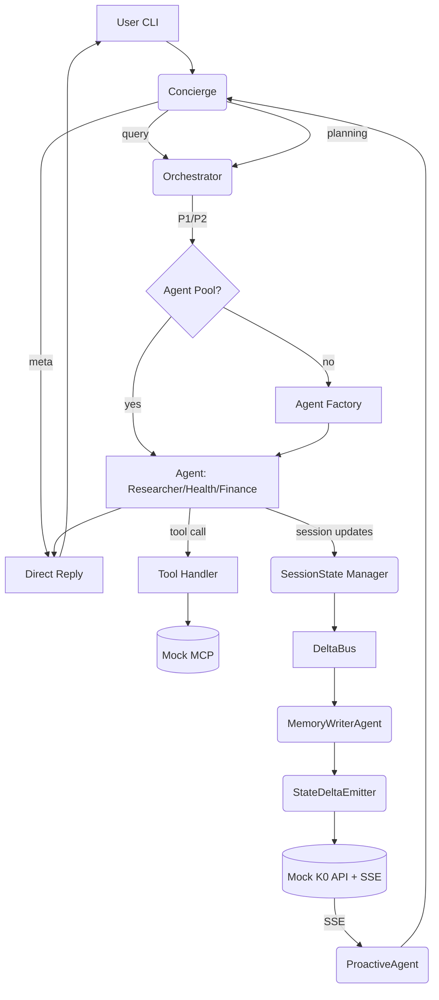

# 🚀 Chat Experience PoC - Implementation Plan

**Project**: K1 Intelligence Module - Complete Chat Experience Architecture
**Based on**: `docs/whiteboard/chat_experience.md`
**Goal**: Build end-to-end PoC demonstrating full K1 system without actual K0 persistence
**LLM Provider**: Groq API
**Validation**: Mock K0/MCP servers validate request format only

---

## 🎯 **Critical Design Decisions (Applied Throughout)**

### 1. **Tracing: cognitive_trace_id Everywhere**

- Generate `cognitive_trace_id` at CLI ingress
- Pass through: CLI → Concierge → Orchestrator → Agents → DeltaBus → K0 Bridge
- Log every hop with trace_id for full request visibility

### 2. **Performance Budgets: Baked into Code**

- Centralize in `config/perf.yml` with constants:
  - `NEGOTIATION_DEADLINE_MS=50`
  - `WARMING_P95_MS=35000`
  - `TTFT_MS=150`
  - `E2E_LATENCY_MS=2000`
- Import constants, fail fast if exceeded, emit metrics

### 3. **Deterministic LLM for Infrastructure**

- Concierge meta-intents: `temperature=0.2`
- Planner Stage-1 sketch: `temperature=0.2`, fixed stop sequences
- Include `seed` parameter if Groq model supports (for test stability)

### 4. **Single Envelope Shape**

- Use one `Envelope{header, payload}` everywhere:
  - **Header**: envelope_id, trace_id, session_id, user_id, qos_band, timestamp, actor
  - **Payload**: typed body (JSON or FlatBuffers)
- Simplifies logging, replay, and adapters

### 5. **Receipts First, Results Second**

- Every tool/bridge call produces receipt (even on failure)
- UI shows receipts as they happen; final answers can lag
- Receipt schema: `{receipt_id, tool_id, status, timestamp, agent_id, trace_id}`

### 6. **Mailbox Backpressure Defaults**

- Start with `capacity=64` (not 50)
- WFQ weights: `[4, 2, 1, 1]` (URGENT, STANDARD, LOW, BACKGROUND)
- When full, block senders from lower priorities first

### 7. **SSE Resilience**

- Heartbeat every 30s to keep connections alive
- Jittered reconnect (±500ms) to avoid thundering herd
- Replay from last `event_id` on reconnection

### 8. **Red/Amber/Green Policy Stub**

- Minimal PDP implementation:
  - **RED**: Block immediately
  - **AMBER**: Require `user_confirmed=true` in envelope (Concierge sets)
  - **GREEN**: Flow freely
- Check policy before tool calls and K0 writes

### 9. **One-Liner Run Profiles**

- `make run:poc` - All mocks + CLI
- `make test:fast` - Unit tests
- `make test:int` - End-to-end integration tests
- Keep the development loop tight

### 10. **FlatBuffers at Boundaries Only**

- Use Python dicts in-process for speed
- FlatBuffers **only at boundaries**:
  - Planner Stage-4 commit → Mock K0
  - K0 Bridge batches (P02/P05/P06)
  - Optional: TaskAssignment for zero-copy demo
- Keep JSON endpoints for debugging (env flag)

---

## 📐 **Minimal PoC Datapath**



---

## 🔧 **FlatBuffers Schema Locations**

**Schemas to create in `poc/chat_experience_poc/schemas/`:**

1. **`Envelope.fbs`** - Wire format for all messages

   ```fbs
   table Header {
     envelope_id: string;
     trace_id: string;
     session_id: string;
     user_id: string;
     qos_band: string;
     timestamp: long;
     actor: string;
   }
   table Payload {
     type: string;
     body: [ubyte];
   }
   table Envelope {
     header: Header;
     payload: Payload;
   }
   ```

2. **`ContractNet.fbs`** - Orchestrator negotiation

   ```fbs
   table TaskAnnouncement { ... }
   table Proposal { ... }
   table TaskAssignment { ... }
   ```

3. **`Planner.fbs`** - 4-stage plan structures

   ```fbs
   table SketchStep { ... }
   table ExpandedStep { ... }
   table CommittedPlan { ... }
   table CommittedStep { ... }
   table Wave { ... }
   ```

4. **`Delta.fbs`** - SessionState delta batches

   ```fbs
   table Delta { ... }
   table DeltaBatch { ... }
   ```

5. **`Prospective.fbs`** - Temporal triggers

   ```fbs
   table ProspectiveTrigger { ... }
   ```

6. **`Learning.fbs`** - Feedback signals

   ```fbs
   table LearningSignal { ... }
   ```

7. **`Receipts.fbs`** - Tool and batch receipts

   ```fbs
   table ToolReceipt { ... }
   table BatchReceipt { ... }
   ```

**Build command:**

```bash
flatc -p -o poc/chat_experience_poc/schemas_out schemas/*.fbs
```

**Wire up FlatBuffers:**

- **Planner Stage-4 Commit**: `_stage4_commit()` → build `CommittedPlan` FlatBuffer → POST `/wal/plan_commit_fb`
- **StateDeltaEmitter**: Serialize `DeltaBatch` to FlatBuffers → POST `/p02/memory_write_fb`
- **Mock K0**: Decode FlatBuffer, return JSON "accepted" receipt
- **Receipts**: Return FlatBuffers `BatchReceipt` from mocks

---

## 🚦 **Critical-Path Build Order**

To get a green end-to-end run, build in this sequence:

1. **L4 Runtime**: SessionState (+DeltaComputer), DeltaBus, Mailbox (+Manager)
2. **Mocks**: Mock MCP and Mock K0 (+SSE)
3. **Concierge (meta intents only)** + CLI
4. **Agent Base + Agent Pool**, then **ResearcherAgent** stub (no K0 yet)
5. **Tool Registry + Handler** (calls Mock MCP)
6. **K0 Bridge** (QueryClient, BatchClient) with FlatBuffers on the wire
7. **MemoryWriterAgent** (consume deltas → batch → Mock K0 P02/P05)
8. **Planner S1–S2**, Orchestrator Phase 1–2
9. **DAG Executor (waves+barriers)** → run a simple planning flow
10. **Proactive flow**: Temporal Module + ProactiveAgent via SSE

**Result**: CLI → Concierge → Orchestrator/Planner → ResearcherAgent → receipts → deltas → MemoryWriter → Mock K0. No real writes.

---

## ⚠️ **Failure Points & Pre-emptive Guardrails**

| Failure Point | Guardrail |
|--------------|-----------|
| **LLM nondeterminism** | Fix temperature/stop, keep prompts short, add explicit schemas in prompt ("respond as valid JSON per ...") |
| **WFQ starvation** | Log per-priority queue depths; assert no priority stays >N depth for >M seconds |
| **SSE disconnects** | Jittered backoff and replay last `id`; 30s heartbeat |
| **Rate limits (Groq)** | Central retry with budget tokens per session; when exhausted, Concierge returns "system busy" |
| **Batcher leaks** | Flush on shutdown signal; watchdog (if no flush in 2s while buffer non-empty → force) |
| **Agent hangs** | Lifecycle timeout enforcement (WARMING: 35s, DRAINING: 30s) |
| **Circuit breaker trips** | After 5 consecutive failures, open circuit for 60s, return cached/fallback |
| **Memory leaks** | Session timeout (600s idle → archive); pool eviction (LRU when >5 agents) |

---

## 📊 **Project Overview**

### **What We're Building**

A complete K1 intelligence system with:

- **2 Interaction Paths**:
  - PATH 1: Specialist Agents (Query/Retrieval from K0)
  - PATH 2: Planner Path (Action/Execution with DAG)
- **Full SessionState** with delta tracking
- **Agent Lifecycle FSM** (6 states)
- **Proactive Flow** with temporal scheduling
- **User Knowledge Graph** for personalization
- **Mock K0/MCP** validation (no actual persistence/execution)

### **Key Architecture Layers**

| Layer | Components | Status |
|-------|-----------|--------|
| **Layer 1: Input** | Intent Router, SessionState Bootstrap | 🔴 Not Started |
| **Layer 2: Orchestration** | Orchestrator (3-phase), Planner (4-stage) | 🔴 Not Started |
| **Layer 3: Execution** | Concierge, Specialists, Writers (58 agents) | 🔴 Not Started |
| **Layer 4: Runtime** | SessionState, DeltaBus, Mailbox, Lifecycle | 🔴 Not Started |
| **Layer 5: Infrastructure** | Agent Factory, K0 Bridge, Tool/Prompt Registry | 🔴 Not Started |

---

## 🎯 **Milestone 1: Foundation & Infrastructure**

**Goal**: Set up project scaffolding, external integrations, and core registries
**Duration**: 3-4 days
**Dependencies**: None

### **Epic 1.1: Project Scaffolding & Groq API Integration**

**Objective**: Create project structure and integrate Groq API for LLM inference

#### **Issue 1.1.1: Initialize PoC Project Structure**

**Context**:
Create the foundation directory structure for the chat experience PoC under `poc/chat_experience_poc/`. This structure follows K1's layered architecture (Layers 1-5) and separates concerns clearly.

**Tasks**:

- Create main directory: `poc/chat_experience_poc/`
- Create layer directories:
  - `l1_input/` - Intent routing, stream normalization
  - `l2_orchestration/` - Orchestrator, Planner
  - `l3_execution/agents/` - All agent implementations
  - `l4_runtime/` - SessionState, DeltaBus, Mailbox, Lifecycle
  - `l5_infrastructure/` - Agent Factory, K0 Bridge, Registries
- Create support directories:
  - `models/` - Pydantic data models
  - `mock_services/` - Mock K0 API, Mock MCP servers
  - `tests/` - Integration tests
  - `config/` - Configuration files
- Create files: `__init__.py`, `main.py`, `README.md`, `requirements.txt`

**Acceptance Criteria**:

- ✅ Directory structure matches K1 layer architecture
- ✅ All `__init__.py` files created for Python package imports
- ✅ README.md documents project purpose and structure

**References**:

- `docs/whiteboard/chat_experience.md` - Complete architecture
- `.github/copilot-instructions.md` - K1 module structure guidelines

---

#### **Issue 1.1.2: Install Dependencies & Configure Groq API**

**Context**:
Install Python dependencies and configure Groq API client. Groq provides fast LLM inference for Concierge, Planner, and Specialist agents.

**Tasks**:

- Add to `requirements.txt`:
  - `groq` - Groq API client
  - `fastapi` - API framework
  - `uvicorn` - ASGI server
  - `pydantic` - Data validation
  - `httpx` - Async HTTP client
  - `asyncio` - Already in stdlib
  - `python-dotenv` - Environment variables
  - `sqlite3` - Already in stdlib (for User KG)
- Create `.env` file with `GROQ_API_KEY=your_key_here`
- Create `config/groq_config.py`:
  - Default model: `llama-3.1-70b-versatile`
  - Temperature: 0.7 for Concierge/Specialists, 0.3 for Planner
  - Max tokens: 2048
  - Timeout: 30s
- Create `l5_infrastructure/groq_client.py`:
  - Async Groq client wrapper
  - Error handling with retries (3 attempts)
  - Token counting and budget tracking
  - Response streaming support

**Acceptance Criteria**:

- ✅ All dependencies install without errors
- ✅ Groq API key loads from `.env`
- ✅ Test script successfully calls Groq API
- ✅ Client handles errors gracefully (network, rate limit, invalid key)

**References**:

- Groq API Docs: <https://console.groq.com/docs>
- `docs/whiteboard/chat_experience.md` - LLM requirements for agents

---

#### **Issue 1.1.3: Create Base Configuration System**

**Context**:
Centralize configuration management for all PoC components. This mirrors K1's `k1/config/*.yml` pattern. **Critical**: Add `config/perf.yml` with strict performance budgets that are imported as constants throughout the codebase.

**Tasks**:

- Create `config/poc_config.yml`:
  - Session settings (timeout: 600s, max_turns: 100)
  - Performance budgets (TTFT: 150ms, E2E: 2000ms)
  - Agent settings (max_concurrent: 3, pool_size: 5)
  - K0 Bridge settings (batch_interval: 250ms, batch_size: 100)
  - Temporal settings (tick_interval: 60s)
- **Create `config/perf.yml` with strict budgets**:

  ```yaml
  # Performance budgets (fail fast if exceeded)
  orchestrator:
    negotiation_deadline_ms: 50
    selection_deadline_ms: 30
    execution_deadline_ms: 1920
  agent:
    warming_p95_ms: 35000
    idle_ttl_ms: 600000
    draining_timeout_ms: 30000
  llm:
    ttft_ms: 150
    tokens_per_second: 100
  runtime:
    state_access_p95_ms: 1
    mailbox_op_p95_ms: 0.5
    delta_computation_p95_ms: 5
  e2e:
    latency_p95_ms: 2000
  ```

- Create `config/config_loader.py`:
  - Load YAML config
  - Merge with environment variables
  - Validate required fields
  - Type checking with Pydantic
- Create config models in `models/config_models.py`:
  - `SessionConfig`, `PerformanceConfig`, `AgentConfig`, `K0BridgeConfig`, `PerfBudgets`
- **Import perf constants**: Create `config/perf_constants.py`:

  ```python
  from config.config_loader import get_config

  PERF = get_config().performance
  NEGOTIATION_DEADLINE_MS = PERF.orchestrator.negotiation_deadline_ms
  WARMING_P95_MS = PERF.agent.warming_p95_ms
  TTFT_MS = PERF.llm.ttft_ms
  # ... etc
  ```

- **Fail-fast validation**: Emit metric + raise exception if budget exceeded

**Acceptance Criteria**:

- ✅ Config loads from YAML file
- ✅ Environment variables override YAML values
- ✅ Missing required fields raise clear errors
- ✅ Config accessible via singleton pattern
- ✅ **Perf budgets importable as constants**: `from config.perf_constants import WARMING_P95_MS`
- ✅ **Budget violations logged + raise exception**

**References**:

- `k1/config/` - K1 configuration structure
- `.github/copilot-instructions.md` - Configuration standards
- Performance budgets from ADR-0073, whiteboard.md Section 3

---

### **Epic 1.2: MCP Tool Registry & Mock MCP Servers**

**Objective**: Create tool registry and mock MCP servers for tool call validation

#### **Issue 1.2.1: Design MCP Tool Registry Schema**

**Context**:
The Tool Registry stores definitions of all MCP tools available to agents. Agents query this registry to discover which tools they can use. Format validation happens at mock MCP servers.

**Tasks**:

- Create `l5_infrastructure/registries/tool_registry.py`
- Define tool schema:

  ```python
  ToolDefinition:
    - tool_id: str (unique identifier)
    - name: str (human-readable)
    - description: str (what it does)
    - parameters: dict (JSON schema)
    - required_capabilities: list[str] (permissions needed)
    - category: str (search, calendar, k0_query, etc.)
    - mock_endpoint: str (URL for mock validation)
    - response_schema: dict (expected response format)
  ```

- Create initial tools:
  - `web_search` - Search the web
  - `calendar_add` - Add calendar event
  - `query_k0_health` - Query K0 health memories
  - `query_k0_episodic` - Query K0 episodic memories
  - `query_k0_semantic` - Query K0 semantic memories
  - `store_prospective_trigger` - Store time-based reminder
- Store registry in: `config/tool_registry.json`

**Acceptance Criteria**:

- ✅ Tool registry loads from JSON file
- ✅ Tools can be queried by category, capability, name
- ✅ Schema validation for tool definitions
- ✅ At least 6 tools defined with complete schemas

**References**:

- `docs/whiteboard/chat_experience.md` - Tool call flow
- MCP Protocol: <https://modelcontextprotocol.io/>

---

#### **Issue 1.2.2: Implement Mock MCP Servers (External Tools Only)**

**Context**:
Mock MCP servers validate EXTERNAL tool call request formats (web_search, calendar_add, etc.). These are NOT K0 communication - they validate tool requests only. K0 queries happen via separate K0 Bridge ports (Query/Command), NOT MCP.

**Tasks**:

- Create `mock_services/mock_mcp_server.py` (NOT for K0 queries)
- Implement FastAPI endpoints for EXTERNAL tools only:
  - `POST /tools/web_search` - Search the web
  - `POST /tools/calendar_add` - Add to calendar
  - `POST /tools/email_send` - Send email
  - (NOT for K0 queries - those go via K0 Bridge)
- Validation logic:
  - Parse incoming JSON request
  - Validate against tool's parameter schema (from registry)
  - Check required fields present
  - Return: `{"status": "accepted", "tool": "<tool_name>"}` if valid
  - Return: `{"status": "error", "reason": "Missing field: <field>"}` if invalid
- Add request logging for debugging
- Run server on port 8001
- **CRITICAL**: K0 queries are NOT MCP - they use K0 Bridge ports (see Epic 1.2bis below)

**Acceptance Criteria**:

- ✅ Mock server starts and responds to health check
- ✅ Valid external tool requests return "accepted"
- ✅ Invalid requests return descriptive errors
- ✅ Only EXTERNAL tools here (not K0 queries)
- ✅ Request/response logged for debugging

**References**:

- `docs/whiteboard/chat_experience.md` - Tool call flow (external tools)
- MCP Protocol: <https://modelcontextprotocol.io/>
- FastAPI Docs: <https://fastapi.tiangolo.com/>

---

#### **Issue 1.2.2bis: K0 Bridge Query Client (Direct K0 Communication - NOT MCP)**

**CRITICAL**: This is NOT MCP. K0 queries use K0 Bridge ports (P01/P02), not MCP protocol.

**Context**:
Agents query K0 kernel directly via K0 Bridge Query Port (P01) for memory retrieval. This is separate from MCP tools. Query Port provides:

- **Episodic memories**: Recent conversation turns, facts learned
- **Semantic memories**: General knowledge, KG relationships
- **Procedural memories**: Skills, habits, patterns
- Multi-store retrieval: FTS5 (keyword) + FAISS (vector) + SQLite KG

Budget: <50ms P95 (ADR-0001a P01 specification)

**Tasks**:

- Create `l5_infrastructure/k0_bridge/k0_query_client.py`
- Implement `K0QueryClient` class:
  - `async query_memory(query_type, filters, limit)` - Main method
    - query_type: "episodic" | "semantic" | "procedural" | "working_memory"
    - filters: {time_range, tags, keywords, embedding_similarity_threshold}
    - limit: int (default 10)
  - POST to `http://localhost:5201/v1/query` (K0 Query Port)
  - Request format (JSON envelope - ADR-0001a):

    ```json
    {
      "port": "query",
      "command_type": "recall_query",
      "envelope_id": "env_query_001",
      "cognitive_trace_id": "trace_xyz",
      "session_id": "sess_456",
      "user_id": "user_dad",
      "qos_band": "GREEN",
      "payload": {
        "query_type": "episodic",
        "filters": {
          "time_range": {"start": 1728000000, "end": 1728100000},
          "tags": ["health", "recovery"],
          "limit": 10
        }
      }
    }
    ```

  - Response includes: memories with relevance scores, timestamp, provenance (FTS score + vector score + KG score)
  - Error handling: network errors, K0 unavailable, timeout (>50ms)
  - Retry logic: 3 attempts with exponential backoff
  - Caching: 60s cache of recent queries (optimization)
- Validate:
  - Query type valid
  - Filters structure correct
  - Time range valid (start ≤ end)
  - Tags array format correct
- Add observability: latency metrics, cache hit rate, error counts

**Acceptance Criteria**:

- ✅ Queries K0 Query Port directly (HTTP, not MCP)
- ✅ Supports all 4 memory types
- ✅ Filters work correctly (time, tags, keywords)
- ✅ Response includes relevance scores + provenance
- ✅ Latency <50ms P95 for K0 communication
- ✅ Caching improves hit rate for repeated queries
- ✅ Error handling for network failures

**References**:

- ADR-0001a - K0 Bridge Communication Protocol (P01 RecallQuery specification, lines 629-700)
- `docs/whiteboard/chat_experience.md` - "K0 Query Port" section
- K0 Query Port: HTTP POST to `:5201/v1/query`
- Multi-store retrieval: FTS5 + FAISS + SQLite KG (ADR-0001a, lines 525-560)

---

#### **Issue 1.2.3: Create Tool Call Handler**

**Context**:
Agents need a unified way to call MCP tools. The Tool Call Handler formats requests according to tool schemas, sends to mock MCP servers, and processes responses.

**Tasks**:

- Create `l5_infrastructure/tool_call_handler.py`
- Implement `ToolCallHandler` class:
  - `async call_tool(tool_id, parameters, agent_id)`:
    - Lookup tool definition in registry
    - Validate parameters against schema
    - Format request (add metadata: agent_id, timestamp, trace_id)
    - POST to mock MCP server
    - Handle response (success/error)
    - Return result + receipt
  - Error handling: network errors, timeouts, validation errors
  - Retry logic: 3 attempts with exponential backoff
  - Receipt generation: `{tool_id, status, timestamp, agent_id, trace_id}`
- Add observability: log all tool calls with latency

**Acceptance Criteria**:

- ✅ Can call any tool from registry
- ✅ Invalid parameters caught before sending request
- ✅ Network errors handled gracefully
- ✅ Receipts generated for all calls (success or failure)
- ✅ Latency metrics logged

**References**:

- `docs/whiteboard/chat_experience.md` - Tool call → Receipt flow
- ADR-0008 (Saga Pattern) - Error handling patterns

---

### **Epic 1.3: Prompt Registry**

**Objective**: Create centralized prompt management for agent system prompts

#### **Issue 1.3.1: Design Prompt Registry Schema**

**Context**:
The Prompt Registry stores system prompts for each agent type. Agent Factory fetches prompts when spawning new agents. Prompts define agent personality, capabilities, and behavior. **Enhanced with deterministic LLM controls and safety rules**.

**Tasks**:

- Create `l5_infrastructure/registries/prompt_registry.py`
- **Define enhanced prompt schema**:

  ```python
  PromptTemplate:
    - agent_type: str (concierge, healthcare, finance, planner, etc.)
    - system_prompt: str (base personality and role)
    - tool_prompt_template: str (how to describe available tools)
    - context_prompt_template: str (how to inject user context)
    - constraints: list[str] (behavioral rules)
    - examples: list[dict] (few-shot examples)
    - temperature: float (LLM creativity setting)
    - max_tokens: int (response length limit)
    - stop: list[str] (stop sequences for determinism)
    - seed: int | None (for reproducible LLM outputs if supported)
    - safety_rules: list[str] (injected verbatim, e.g., RED/AMBER/GREEN policy)
    - tool_list_format: str (how tools are enumerated: "bullet" | "json" | "numbered")
  ```

- Create initial prompts with **deterministic settings**:
  - **Concierge (meta-intents)**: temperature=0.2, stop=["User:", "\n\n\n"], seed=42
    - System prompt: "You are a friendly AI assistant. Route specialized queries to experts. Handle casual chat directly."
    - Safety rules: ["Never invent tools not in the list.", "For AMBER/RED data, ask user confirmation first."]
  - **Healthcare Agent**: temperature=0.3, stop=["User:", "###"], seed=100
  - **Finance Agent**: temperature=0.4, stop=["User:", "###"], seed=200
  - **Planner Agent (Stage-1 sketch)**: temperature=0.2, stop=["###END###"], seed=300
  - **Memory Writer**: temperature=0.2, stop=["User:"], seed=400
- **Tool list format**: Bullet points with `name(id): one-line purpose`
  - Example: `• web_search(id: search_01): Search the internet for information`
- **Capability caveats**: "You can only call tools listed above, never invent new tools."
- **Meta-guard**: "If the user asks for restricted data (AMBER/RED) without confirmation, ask for consent."
- Store prompts in: `config/prompt_registry.json`

**Acceptance Criteria**:

- ✅ Prompt registry loads from JSON file
- ✅ Prompts can be queried by agent_type
- ✅ Template variables support ({{user_context}}, {{tools}}, {{history}})
- ✅ At least 5 agent prompts defined
- ✅ **Deterministic LLM settings**: temperature=0.2 for infra, stop sequences, seed if supported
- ✅ **Safety rules injected**: RED/AMBER/GREEN policy checks
- ✅ **Tool list format standardized**: Bullet points with capability caveats
- ✅ Prompts tested with Groq API for quality and determinism

**References**:

- `docs/whiteboard/chat_experience.md` - Agent Factory prompt merging
- ADR-0005 - Agent architecture and roles
- Groq API docs: <https://console.groq.com/docs> (seed parameter support)

---

#### **Issue 1.3.2: Implement Prompt Template Engine**

**Context**:
Prompts need dynamic content injection (user context, tools, chat history). The Template Engine merges static prompts with runtime data.

**Tasks**:

- Create `l5_infrastructure/registries/prompt_template_engine.py`
- Implement `PromptTemplateEngine` class:
  - `render_prompt(agent_type, context_data)`:
    - Fetch prompt template from registry
    - Replace `{{user_context}}` with User KG data
    - Replace `{{tools}}` with formatted tool descriptions
    - Replace `{{history}}` with recent chat messages
    - Replace `{{constraints}}` with privacy/capability constraints
    - Return final prompt string
  - Support conditional blocks: `{{#if has_health_data}}...{{/if}}`
  - Support loops: `{{#each tools}}...{{/each}}`
- Use Jinja2 or simple string formatting

**Acceptance Criteria**:

- ✅ Templates render with all variables replaced
- ✅ Conditional blocks work correctly
- ✅ Loops work for tools and history
- ✅ Missing variables don't break rendering (use defaults)
- ✅ Rendered prompts tested with Groq API

**References**:

- `docs/whiteboard/chat_experience.md` - Agent Factory context merging
- Jinja2 Docs: <https://jinja.palletsprojects.com/>

---

### **Epic 1.4: User Knowledge Graph Setup**

**Objective**: Create graph database for user self-model and personalization

#### **Issue 1.4.1: Design User KG Schema**

**Context**:
The User Knowledge Graph represents the user as a digital twin. All agents query this graph to understand who they're talking to and personalize responses.

**Tasks**:

- Create `l5_infrastructure/user_kg/kg_schema.py`
- Define node types:
  - `Person` (name, age, locale, timezone)
  - `HealthMetric` (type, value, unit, date, confidence)
  - `Goal` (description, deadline, progress, active)
  - `Relationship` (person_name, relation_type, closeness, notes)
  - `Preference` (category, value, strength, source)
  - `Routine` (activity, schedule, adherence_rate, last_execution)
  - `Memory` (summary, date, importance, emotional_valence)
- Define edge types:
  - `HAS_GOAL` (Person → Goal)
  - `TRACKS_METRIC` (Person → HealthMetric)
  - `PREFERS` (Person → Preference)
  - `RELATED_TO` (Person → Relationship)
  - `FOLLOWS_ROUTINE` (Person → Routine)
  - `RECALLS` (Person → Memory)
- Use SQLite with tables for nodes and edges (simpler than Neo4j for PoC)
- Create schema SQL: `config/user_kg_schema.sql`

**Acceptance Criteria**:

- ✅ Schema supports all node and edge types
- ✅ Indexes on frequently queried fields (person_id, date, type)
- ✅ Foreign key constraints maintain referential integrity
- ✅ Schema documented with examples

**References**:

- `docs/whiteboard/chat_experience.md` - User KG requirements
- ADR-0017 (SessionState) - User context representation

---

#### **Issue 1.4.2: Implement User KG Query Interface**

**Context**:
Agents need a simple API to query the User KG without writing raw SQL. The Query Interface provides high-level methods for common queries.

**Tasks**:

- Create `l5_infrastructure/user_kg/kg_query_interface.py`
- Implement `UserKG` class with methods:
  - `get_user_profile(user_id)` - Get Person node with basic info
  - `get_health_context(user_id)` - Get recent HealthMetrics (last 30 days)
  - `get_active_goals(user_id)` - Get all active Goal nodes
  - `get_preferences(user_id, category)` - Get Preferences filtered by category
  - `get_routines(user_id)` - Get all Routine nodes with adherence
  - `get_relationships(user_id)` - Get all Relationship nodes
  - `query_memories(user_id, date_range, keywords)` - Search Memory nodes
  - `add_node(node_type, properties)` - Insert new node
  - `add_edge(from_node, to_node, edge_type, properties)` - Insert new edge
  - `update_node(node_id, properties)` - Update existing node
- Add query caching for performance (cache for 60s)
- Connection pooling for concurrent access

**Acceptance Criteria**:

- ✅ All query methods work correctly
- ✅ Caching reduces repeated queries
- ✅ Thread-safe for concurrent agent access
- ✅ Performance: queries <10ms P95

**References**:

- `docs/whiteboard/chat_experience.md` - Agent KG queries
- SQLite Docs: <https://www.sqlite.org/docs.html>

---

#### **Issue 1.4.3: Seed User KG with Sample Data**

**Context**:
For PoC demonstration, populate User KG with realistic sample data representing a user in PT recovery.

**Tasks**:

- Create `scripts/seed_user_kg.py`
- Seed data for user "John" (age 45):
  - **Person**: John, age 45, timezone US/Pacific
  - **HealthMetrics**:
    - Knee strength: 8.5 kg (2025-11-05)
    - Pain level: 2/10 (2025-11-05)
    - PT sessions completed: 6/8
  - **Goals**:
    - "Return to running by Dec 1, 2025" (progress: 0.85)
    - "Complete 8 PT sessions" (progress: 0.75)
  - **Relationships**:
    - "Mom" (caregiver, lives nearby)
    - "Sarah" (partner, high closeness)
  - **Preferences**:
    - Food: Italian (strength: 0.9)
    - Exercise: Morning (strength: 0.8)
  - **Routines**:
    - PT exercises (daily 8am, adherence: 0.75)
    - Drink water (every 4 hours, adherence: 0.60)
  - **Memories**:
    - "Started PT recovery" (2025-09-15, importance: 0.9)
    - "Last PT session went well" (2025-10-28, importance: 0.7)
- Script should be idempotent (can run multiple times without duplicates)

**Acceptance Criteria**:

- ✅ Script successfully seeds all data
- ✅ Data can be queried via UserKG interface
- ✅ Running script twice doesn't create duplicates
- ✅ Sample data is realistic and demonstrates all node/edge types

**References**:

- `docs/whiteboard/chat_experience.md` - User context examples

---

### **Epic 1.5: Temporal Module (Scheduling & Time Context)** ✅ **COMPLETE**

**Objective**: Implement time-based scheduling and temporal context for proactive features

**Status**: ✅ All 3 issues complete (Issue 1.5.1, 1.5.2, 1.5.3)

**Implementation Summary**:

- **temporal_triggers_schema.sql** (175 lines): SQLite schema with 4 trigger types, indexes, history table
- **temporal_module.py** (589 lines): TemporalModule scheduler class with 60s tick interval, SSE events, recurring trigger rescheduling
- **trigger_manager.py** (498 lines): TriggerManager CRUD operations with validation and thread-safety
- **mock_k0_sse_server.py** (262 lines): FastAPI SSE server on port 8002 with heartbeat support
- **test_temporal_module.py** (580 lines): 27 comprehensive tests (27/27 passing)
- **Performance**: <5ms P95 query, <20ms P95 create, 60s scheduler ticks

---

#### **Issue 1.5.1: Design Temporal Module Architecture** ✅ **COMPLETE**

**Context**:
The Temporal Module manages time-based triggers (reminders, schedules) and provides time context to agents. It runs a background scheduler that evaluates triggers every minute (like K0 P05).

**Tasks**:

- Create `l5_infrastructure/temporal/temporal_module.py`
- Define trigger types:
  - `TimeBasedTrigger`: Fire at specific time (e.g., 8:00am)
  - `RecurringTrigger`: Fire on schedule (e.g., every 4 hours, daily, weekly)
  - `PatternTrigger`: Fire based on detected patterns (e.g., "milk day")
  - `AnomalyTrigger`: Fire on unusual activity
- Define trigger schema:

  ```python
  Trigger:
    - trigger_id: str
    - trigger_type: str
    - fire_time: datetime (next fire time)
    - recurrence: str (None, "4h", "daily", "weekly")
    - message: str (notification text)
    - action: str (what to do when fired)
    - metadata: dict (additional context)
    - active: bool
  ```

- Store triggers in SQLite: `temporal_triggers` table
- Create scheduler loop:
  - Runs every 60 seconds
  - Queries all active triggers where `fire_time <= now()`
  - Sends SSE tick for each fired trigger
  - Updates `fire_time` for recurring triggers

**Acceptance Criteria**:

- ✅ Trigger schema supports all types
- ✅ Scheduler loop runs continuously in background
- ✅ Triggers fire at correct times (±5 seconds)
- ✅ Recurring triggers automatically reschedule

**References**:

- `docs/whiteboard/chat_experience.md` - Proactive flow with K0 P05
- ADR-0019 - Temporal context handling

---

#### **Issue 1.5.2: Implement Trigger Storage & Management**

**Context**:
Agents need to create, update, and delete triggers. The Trigger Manager provides CRUD operations for triggers.

**Tasks**:

- Create `l5_infrastructure/temporal/trigger_manager.py`
- Implement `TriggerManager` class:
  - `create_trigger(trigger_data)` - Insert new trigger
  - `get_trigger(trigger_id)` - Fetch trigger by ID
  - `list_triggers(user_id, active_only=True)` - List user's triggers
  - `update_trigger(trigger_id, updates)` - Update trigger fields
  - `delete_trigger(trigger_id)` - Soft delete (set active=False)
  - `fire_trigger(trigger_id)` - Manual trigger firing for testing
  - `reschedule_recurring(trigger_id)` - Calculate next fire_time
- Add validation:
  - `fire_time` must be in the future
  - `recurrence` must be valid format
  - `message` and `action` required
- Thread-safe for concurrent access

**Acceptance Criteria**:

- ✅ All CRUD operations work correctly
- ✅ Triggers persist across restarts
- ✅ Validation catches invalid triggers
- ✅ Recurring triggers reschedule correctly

**References**:

- `docs/whiteboard/chat_experience.md` - "Remind me to drink water" example

---

#### **Issue 1.5.3: Implement Mock K0 SSE Server for Proactive Ticks**

**Context**:
When triggers fire, the Temporal Module needs to notify K1's ProactiveAgent. This mimics K0 P05 sending SSE ticks to K1.

**Tasks**:

- Create `mock_services/mock_k0_sse_server.py`
- Implement SSE endpoint: `GET /sse/stream`
  - Clients connect and keep connection open
  - Server sends events in SSE format:

    ```
    event: prospective.trigger.fired
    data: {"trigger_id": "...", "time": "...", "message": "...", "action": "..."}
    ```

- Connect Temporal Module to SSE server:
  - When trigger fires in scheduler loop
  - Send tick to all connected SSE clients
  - Log tick sent (for debugging)
- Support multiple SSE topics:
  - `prospective.trigger.fired` - Time-based reminders
  - `prospective.pattern.detected` - Pattern triggers
  - `prospective.anomaly.alert` - Anomaly alerts
- Run SSE server on port 8002

**Acceptance Criteria**:

- ✅ SSE server accepts connections
- ✅ Clients receive ticks when triggers fire
- ✅ Multiple clients can connect simultaneously
- ✅ Connection resilient to brief network interruptions
- ✅ Ticks logged for debugging

**References**:

- `docs/whiteboard/chat_experience.md` - K0 P05 → K1 ProactiveAgent SSE flow
- SSE Spec: <https://html.spec.whatwg.org/multipage/server-sent-events.html>

---

## ✅ **Milestone 1 Completion Criteria**

- ✅ Project structure matches K1 architecture
- ✅ Groq API integrated and tested
- ✅ Tool Registry with 6+ tools defined
- ✅ Mock MCP servers validate tool requests
- ✅ Prompt Registry with 5+ agent prompts (with deterministic LLM settings)
- ✅ User KG schema implemented with sample data (Epic 1.4 COMPLETE - 22/22 tests passing)
- ✅ Temporal Module scheduler running (Epic 1.5 COMPLETE - 27/27 tests passing)
- ✅ Mock K0 SSE server sending proactive ticks (port 8002)
- ✅ All components independently tested
- ✅ **Performance config (`config/perf.yml`) created with strict budgets**
- ✅ **cognitive_trace_id generation at CLI ingress implemented**

**Definition of Done (Milestone 1)**:

- `groq_client` mock tested with seed parameter
- Tool/Prompt registries load successfully
- Mock MCP + Mock K0 healthcheck returns 200 OK
- `make test:fast` runs unit tests (all green)
- Performance budgets importable: `from config.perf_constants import WARMING_P95_MS`
- Envelope{header, payload} schema defined
- **User KG: 22/22 tests passing (<10ms P95 query latency)**
- **Temporal Module: 27/27 tests passing (60s scheduler ticks, SSE events)**

**Milestone 1 Status**: 🟡 IN PROGRESS (Epics 1.1-1.3 status unknown, Epic 1.4 ✅ COMPLETE, Epic 1.5 ✅ COMPLETE)

**Ready for Milestone 2**: Runtime Core (SessionState, DeltaBus, Mailbox, Lifecycle)

---

## 🎯 **Milestone 2: Layer 4 - Runtime Core**

**Goal**: Implement K1's runtime infrastructure (SessionState, DeltaBus, Mailbox, Agent Lifecycle)
**Duration**: 4-5 days
**Dependencies**: Milestone 1 (Foundation)

### **Epic 2.1: SessionState (6-Section Working Memory)**

**Objective**: Implement in-memory session state with 6 sections and delta tracking

#### **Issue 2.1.1: Design SessionState Data Model**

**Context**:
SessionState is K1's working memory - stores conversation context, user beliefs, agent roster, and execution state. It's the single source of truth for a chat session. Structure follows ADR-0017.

**Tasks**:

- Create `l4_runtime/session_state/session_state.py`
- Define 6-section data model using Pydantic:
  1. **Beliefs** (user beliefs, confidence scores, temporal decay)
     - `belief_id`, `statement`, `confidence` (0-1), `source`, `timestamp`, `decay_rate`
  2. **Scoreboard** (QUD stack, entity tracking, pronoun resolution)
     - `qud_stack` (list of Questions Under Discussion)
     - `entities` (dict of tracked entities with properties)
     - `pronouns` (pronoun → entity mappings)
  3. **Control** (execution state, agent roster, current flow)
     - `session_id`, `current_flow` (specialist/planner), `agent_roster` (list of active agents)
     - `execution_state` (idle/processing/waiting)
  4. **Persona** (personality traits, LLM system prompt fragments)
     - `personality_traits` (friendly, professional, etc.)
     - `communication_style`, `humor_level`
  5. **Multimodal** (audio waveforms, image embeddings - stub for PoC)
     - `audio_buffer` (placeholder), `image_embeddings` (placeholder)
  6. **Meta** (session metadata, trace IDs, metrics)
     - `session_id`, `user_id`, `creation_time`, `turn_count`, `cognitive_trace_id`
- All sections have `last_updated` timestamp
- Implement `to_dict()` and `from_dict()` for serialization
- Add validation: required fields, type checking

**Acceptance Criteria**:

- ✅ All 6 sections defined with correct structure
- ✅ Pydantic validation catches invalid data
- ✅ Serialization/deserialization works correctly
- ✅ In-memory access time <1ms P95

**References**:

- `docs/whiteboard/chat_experience.md` - SessionState 6-section structure
- ADR-0017 - SessionState design
- K1 `k1/l4_runtime/session_state/` - Reference implementation

---

#### **Issue 2.1.2: Implement Delta Computation**

**Context**:
SessionState changes constantly during conversations. Instead of persisting entire state, compute field-level deltas (only what changed). This reduces K0 Bridge bandwidth and enables efficient updates.

**Tasks**:

- Create `l4_runtime/session_state/delta_computer.py`
- Implement `DeltaComputer` class:
  - `compute_deltas(old_state, new_state)` - Compare states, return field-level diffs
  - Delta format:

    ```python
    Delta:
      - field_path: str (e.g., "beliefs.b123.confidence")
      - old_value: Any
      - new_value: Any
      - timestamp: datetime
      - origin: str (which agent caused change)
    ```

  - Handle nested structures (beliefs within beliefs, entities within scoreboard)
  - Handle list operations (append, remove, reorder)
  - Optimize: only compute deltas for changed sections
- Add delta batching:
  - Collect deltas over 250ms window OR 100 deltas (whichever first)
  - Batch format: `{session_id, deltas: [...], batch_timestamp}`
- Implement delta application: `apply_deltas(state, deltas)` - Reconstruct state from deltas

**Acceptance Criteria**:

- ✅ Deltas correctly capture all changes
- ✅ Delta application reconstructs original state
- ✅ Nested structure changes tracked
- ✅ List operations handled correctly
- ✅ Batching reduces delta volume by >80%

**References**:

- `docs/whiteboard/chat_experience.md` - Delta computation flow
- ADR-0019 - Field-level delta serialization
- K1 `k1/l4_runtime/session_state/state_delta_emitter.py`

---

#### **Issue 2.1.3: Implement SessionState Manager**

**Context**:
SessionStateManager provides the primary interface for agents to read/write session state. It handles concurrency, delta computation, and event emission.

**Tasks**:

- Create `l4_runtime/session_state/session_state_manager.py`
- Implement `SessionStateManager` class:
  - `create_session(user_id)` - Initialize new SessionState
  - `get_session(session_id)` - Retrieve existing session
  - `update_section(session_id, section_name, updates)` - Update specific section
    - Computes deltas automatically
    - Emits deltas to DeltaBus
    - Updates `last_updated` timestamp
  - `get_section(session_id, section_name)` - Read section (fast path)
  - `add_belief(session_id, statement, confidence, source)` - High-level API
  - `track_entity(session_id, entity_name, properties)` - High-level API
  - `update_agent_roster(session_id, agent_id, status)` - High-level API
- Add read-write locking for thread safety
- Cache frequently accessed sections (Control, Meta) in memory
- Session timeout: 600s idle → archive session

**Acceptance Criteria**:

- ✅ Concurrent updates don't corrupt state
- ✅ Delta emission happens on every update
- ✅ Read operations <1ms, write operations <5ms
- ✅ Sessions automatically timeout after 600s idle
- ✅ High-level APIs simplify agent code

**References**:

- `docs/whiteboard/chat_experience.md` - SessionState access patterns
- ADR-0017 - SessionState lifecycle
- Python `threading.RLock` for concurrency

---

### **Epic 2.2: DeltaBus (In-Process Event Bus)**

**Objective**: Implement event bus for SessionState delta propagation to Writer Agents

#### **Issue 2.2.1: Design DeltaBus Architecture**

**Context**:
DeltaBus is an in-process pub/sub system. SessionStateManager publishes deltas, Writer Agents subscribe and react. This decouples state changes from persistence logic.

**Tasks**:

- Create `l4_runtime/deltabus/deltabus.py`
- Define event model:

  ```python
  DeltaBusEvent:
    - event_type: str ("session.delta", "agent.spawned", "tool.called")
    - session_id: str
    - payload: dict (event-specific data)
    - timestamp: datetime
    - trace_id: str
  ```

- Implement `DeltaBus` singleton class:
  - `subscribe(event_type, callback)` - Register subscriber
  - `unsubscribe(callback_id)` - Remove subscriber
  - `publish(event)` - Send event to all subscribers
  - `publish_async(event)` - Non-blocking publish
- Use `asyncio.Queue` for async delivery
- Support wildcard subscriptions: `subscribe("session.*", callback)`
- Event ordering guarantee: FIFO per session_id

**Acceptance Criteria**:

- ✅ Events delivered to all subscribers
- ✅ Async publish doesn't block publisher
- ✅ Event ordering preserved per session
- ✅ Wildcard subscriptions work correctly
- ✅ Performance: <1ms event delivery latency

**References**:

- `docs/whiteboard/chat_experience.md` - DeltaBus → Writer Agents flow
- ADR-0019 - Event-driven delta propagation
- Python `asyncio.Queue` for async events

---

#### **Issue 2.2.2: Integrate SessionState with DeltaBus**

**Context**:
SessionStateManager needs to publish delta events to DeltaBus whenever state changes. This enables Writer Agents to react to changes automatically.

**Tasks**:

- Update `l4_runtime/session_state/session_state_manager.py`:
  - Inject `DeltaBus` instance into constructor
  - After computing deltas in `update_section()`:
    - Create `DeltaBusEvent` with `event_type="session.delta"`
    - Include: `session_id`, `deltas`, `origin` (which agent caused change)
    - Call `deltabus.publish_async(event)`
  - Add event for session creation: `event_type="session.created"`
  - Add event for session timeout: `event_type="session.archived"`
- Add observability: log all events published (debug level)
- Add metrics: count events published per event_type

**Acceptance Criteria**:

- ✅ All SessionState updates emit delta events
- ✅ Events contain complete delta information
- ✅ Non-blocking: publish doesn't slow down updates
- ✅ Events logged for debugging

**References**:

- `docs/whiteboard/chat_experience.md` - SessionState → DeltaBus integration
- K1 `k1/l4_runtime/session_state/state_delta_emitter.py`

---

#### **Issue 2.2.3: Create DeltaBus Test Subscriber**

**Context**:
Before building Writer Agents, verify DeltaBus works correctly with a test subscriber that logs all events.

**Tasks**:

- Create `tests/test_deltabus_integration.py`
- Implement `TestSubscriber` class:
  - Subscribes to "session.*" events
  - Logs all received events to console
  - Counts events by type
  - Verifies event structure (required fields present)
- Integration test:
  - Create SessionState
  - Update beliefs, scoreboard, control
  - Verify test subscriber receives all delta events
  - Check event ordering (FIFO)
  - Verify event payloads match updates
- Add performance test: 1000 rapid updates, all events delivered

**Acceptance Criteria**:

- ✅ Test subscriber receives all events
- ✅ Event payloads match SessionState changes
- ✅ Event ordering preserved
- ✅ No events lost under load (1000 updates)

**References**:

- `docs/whiteboard/chat_experience.md` - DeltaBus architecture

---

### **Epic 2.3: Mailbox System (MPSC with 4 Priority Levels)**

**Objective**: Implement async message passing for inter-agent communication

#### **Issue 2.3.1: Design Mailbox Architecture**

**Context**:
Mailboxes enable agents to communicate asynchronously. Each agent has a mailbox (MPSC queue). Messages have 4 priority levels. Weighted Fair Queueing ensures high-priority messages processed first. **Updated capacity to 64** (from 50) and **WFQ weights to [4, 2, 1, 1]**.

**Tasks**:

- Create `l4_runtime/mailbox/mailbox.py`
- Define message model:

  ```python
  Message:
    - message_id: str
    - sender_id: str
    - receiver_id: str
    - priority: int (0=URGENT, 1=STANDARD, 2=LOW, 3=BACKGROUND)
    - payload: dict
    - timestamp: datetime
    - trace_id: str (cognitive_trace_id from envelope)
  ```

- Define priority levels (from chat_experience.md):
  - `URGENT (0)` - Processed 4x more often (critical system messages)
  - `STANDARD (1)` - Processed 2x more often (normal agent messages)
  - `LOW (2)` - Normal processing (1x - background tasks)
  - `BACKGROUND (3)` - Lowest priority (1x - memory writes)
- Implement `Mailbox` class:
  - `__init__(agent_id, capacity=64)` - **Updated capacity to 64**
  - `send(message)` - Enqueue message (async, non-blocking)
  - `receive()` - Dequeue message (async, blocks if empty)
  - `peek()` - Look at next message without removing
  - `size()` - Current queue depth
- Use 4 separate `asyncio.Queue` instances (one per priority)
- **Weighted Fair Queueing: Round-robin with weights [4, 2, 1, 1]**
- **Backpressure**: When full, block senders from lower priorities first (BACKGROUND, then LOW, then STANDARD)

**Acceptance Criteria**:

- ✅ Messages enqueue/dequeue correctly
- ✅ Higher priority messages processed first
- ✅ **Backpressure: enqueue blocks lower priorities when capacity (64) reached**
- ✅ **WFQ weights [4, 2, 1, 1] enforced**: URGENT gets 4x processing vs BACKGROUND
- ✅ Performance: <0.5ms P95 enqueue/dequeue latency
- ✅ Thread-safe for concurrent access
- ✅ **Log per-priority queue depths for starvation detection**

**References**:

- `docs/whiteboard/chat_experience.md` - Mailbox system description
- ADR-0005 - Actor Model communication
- Weighted Fair Queueing algorithm
- Performance budgets: `config/perf.yml` (mailbox_op_p95_ms)

---

#### **Issue 2.3.2: Implement Mailbox Manager**

**Context**:
MailboxManager creates and manages mailboxes for all agents. Provides routing logic to send messages to correct agent mailbox.

**Tasks**:

- Create `l4_runtime/mailbox/mailbox_manager.py`
- Implement `MailboxManager` singleton class:
  - `create_mailbox(agent_id)` - Create new mailbox for agent
  - `get_mailbox(agent_id)` - Retrieve agent's mailbox
  - `delete_mailbox(agent_id)` - Remove mailbox (agent terminated)
  - `send_message(sender_id, receiver_id, payload, priority)` - Route message
    - Lookup receiver's mailbox
    - Create Message object
    - Call `receiver_mailbox.send(message)`
    - Handle errors: receiver not found, mailbox full
  - `broadcast(sender_id, receiver_ids, payload, priority)` - Send to multiple agents
  - `get_stats()` - Return metrics (total messages sent, avg latency, queue depths)
- Add message tracing: log all sends with trace_id
- Add metrics: message count by priority, queue depth per agent

**Acceptance Criteria**:

- ✅ Messages routed to correct agent mailboxes
- ✅ Broadcast delivers to all specified receivers
- ✅ Handles missing receivers gracefully (log warning)
- ✅ Metrics track system load
- ✅ Message tracing works for debugging

**References**:

- `docs/whiteboard/chat_experience.md` - Inter-agent message flow
- K1 `k1/l4_runtime/actor_fabric/mailbox/`

---

#### **Issue 2.3.3: Create Mailbox Integration Tests**

**Context**:
Test mailbox system with simulated agent communication patterns before building real agents.

**Tasks**:

- Create `tests/test_mailbox_integration.py`
- Test scenarios:
  1. **Basic Send/Receive**: Agent A sends to Agent B, B receives
  2. **Priority Ordering**: Send 10 messages (mixed priorities), verify URGENT comes first
  3. **Backpressure**: Fill mailbox to capacity, verify send blocks
  4. **Broadcast**: Send to 5 agents, all receive message
  5. **High Load**: 1000 messages, verify no lost messages
  6. **Weighted Fair Queueing**: Send equal counts of all priorities, verify URGENT gets 4x processing
- Create mock agents for testing:
  - `MockAgent` class with `agent_id` and `receive_loop()`
  - Count messages received by priority
- Measure performance: enqueue/dequeue latency P50, P95, P99

**Acceptance Criteria**:

- ✅ All test scenarios pass
- ✅ Priority ordering works correctly
- ✅ Backpressure prevents unbounded growth
- ✅ No messages lost under load
- ✅ Performance meets <0.5ms P95 target

**References**:

- `docs/whiteboard/chat_experience.md` - Mailbox performance budgets

---

### **Epic 2.4: Agent Lifecycle FSM (6-State Machine)**

**Objective**: Implement agent state machine with transitions and health checks

#### **Issue 2.4.1: Design Agent Lifecycle States**

**Context**:
Every agent has a lifecycle: spawned → warmed up → active → idle → draining → terminated. Each state has entry/exit behaviors and transition rules. Based on ADR-0005 + ADR-0073 enhancements.

**Tasks**:

- Create `l4_runtime/lifecycle/agent_lifecycle.py`
- Define 6 states:
  1. **PENDING**: Agent created, not yet ready
     - Entry: Initialize mailbox, register with MailboxManager
     - Exit: None
  2. **WARMING**: Resource validation and model loading
     - Entry: Check resources (memory, CPU), load model, bind capabilities
     - Exit: Model ready, capabilities verified
     - Budget: <35s P95
  3. **ACTIVE**: Processing tasks, accepting bids
     - Entry: Add to agent roster, ready for work
     - Exit: None
  4. **IDLE**: No tasks, waiting (pooled for reuse)
     - Entry: Start TTL timer (10 minutes default)
     - Health check every 30s
     - Exit: Reactivate or terminate on TTL expiry
  5. **DRAINING**: Finishing tasks, no new work
     - Entry: Stop accepting bids, track in-flight tasks
     - Wait for task completion (max 30s timeout)
     - Exit: All tasks complete or timeout
  6. **TERMINATED**: Agent shut down, resources freed
     - Entry: Unload model, revoke capabilities, delete mailbox
     - Exit: None (final state)
- Define allowed transitions:
  - PENDING → WARMING → ACTIVE
  - ACTIVE ↔ IDLE (bidirectional)
  - ACTIVE/IDLE → DRAINING → TERMINATED
- Create state transition table with validation

**Acceptance Criteria**:

- ✅ All 6 states defined with entry/exit behaviors
- ✅ State transitions follow allowed paths
- ✅ Invalid transitions rejected (with clear error)
- ✅ State documented with ADR references

**References**:

- `docs/whiteboard/chat_experience.md` - Agent Lifecycle FSM section
- ADR-0005 - Agent architecture
- ADR-0073 - WARMING/IDLE/DRAINING enhancements

---

#### **Issue 2.4.2: Implement Lifecycle State Machine**

**Context**:
Agents need a state machine implementation to manage transitions, execute entry/exit behaviors, and track current state.

**Tasks**:

- Create `l4_runtime/lifecycle/lifecycle_fsm.py`
- Implement `LifecycleFSM` class:
  - `__init__(agent_id)` - Initialize in PENDING state
  - `current_state()` - Get current state
  - `transition_to(new_state)` - Change state (validates transition)
    - Check if transition allowed
    - Execute exit behavior of old state
    - Update state
    - Execute entry behavior of new state
    - Emit event to DeltaBus: `agent.state_changed`
    - Log transition with timestamp
  - `can_transition_to(new_state)` - Check if transition valid
  - `get_state_history()` - Return list of state transitions
- Entry/exit behaviors as callbacks:
  - `on_enter_warming()`, `on_exit_warming()`, etc.
  - Agents override these for custom behavior
- Add state timeout enforcement:
  - WARMING: 35s max, auto-transition to TERMINATED if exceeded
  - IDLE: TTL (default 10 min), auto-transition to DRAINING
  - DRAINING: 30s max, force TERMINATED if exceeded

**Acceptance Criteria**:

- ✅ State transitions work correctly
- ✅ Invalid transitions rejected with clear error
- ✅ Entry/exit behaviors execute in order
- ✅ Timeouts enforced automatically
- ✅ State changes logged and emitted to DeltaBus

**References**:

- `docs/whiteboard/chat_experience.md` - Lifecycle state transitions
- ADR-0073 - State-specific behaviors and timeouts

---

#### **Issue 2.4.3: Implement Agent Pooling (IDLE State Optimization)**

**Context**:
Agent pooling reuses agents instead of destroying them. When agent goes IDLE, it stays resident with model loaded. If similar task arrives, reactivate existing agent (<1ms) instead of spawning new one (~30s).

**Tasks**:

- Create `l4_runtime/lifecycle/agent_pool.py`
- Implement `AgentPool` singleton class:
  - `add_to_pool(agent_id, agent_type)` - Add IDLE agent to pool
  - `get_from_pool(agent_type)` - Retrieve pooled agent (if available)
  - `remove_from_pool(agent_id)` - Remove expired/unhealthy agent
  - `pool_size(agent_type)` - Count pooled agents by type
  - `evict_lru()` - Remove least recently used when pool full
- Pooling constraints (from ADR-0073):
  - Max 3 agents per session
  - Max 5 agents globally per type
  - TTL: 10 minutes idle → auto-drain
- Health checks:
  - Run every 30s on pooled agents
  - Check: model still loaded, capabilities valid, mailbox responsive
  - If unhealthy: remove from pool, transition to DRAINING
- Metrics: pool hit rate, avg reuse latency, eviction count

**Acceptance Criteria**:

- ✅ Pooled agents reactivate <1ms
- ✅ Pool respects size limits (3 per session, 5 globally)
- ✅ TTL expiry removes stale agents
- ✅ Health checks catch unhealthy agents
- ✅ Pool hit rate >70% for specialist agents

**References**:

- `docs/whiteboard/chat_experience.md` - Agent pooling for performance
- ADR-0073 - IDLE state pooling with TTL and health checks

---

#### **Issue 2.4.4: Create Lifecycle Integration Tests**

**Context**:
Test agent lifecycle FSM with full state transitions and pooling before integrating with real agents.

**Tasks**:

- Create `tests/test_agent_lifecycle.py`
- Test scenarios:
  1. **Happy Path**: PENDING → WARMING → ACTIVE → IDLE → DRAINING → TERMINATED
  2. **Invalid Transition**: PENDING → ACTIVE (should fail)
  3. **Timeout**: WARMING exceeds 35s → auto-TERMINATED
  4. **Pooling**: Agent goes IDLE → added to pool → reactivated <1ms
  5. **TTL Expiry**: Agent IDLE for 10 min → auto-DRAINING
  6. **Health Check Failure**: Unhealthy agent removed from pool
  7. **Pool Eviction**: Add 6 agents (over limit) → LRU evicted
- Create `MockAgent` with lifecycle FSM:
  - Override entry/exit behaviors to log actions
  - Simulate model loading (100ms delay)
  - Simulate task processing
- Measure state transition latency
- Verify DeltaBus events emitted for state changes

**Acceptance Criteria**:

- ✅ All state transitions work correctly
- ✅ Invalid transitions prevented
- ✅ Timeouts enforced automatically
- ✅ Pooling reduces spawn latency >95%
- ✅ Health checks and eviction work correctly
- ✅ All state changes emit DeltaBus events

**References**:

- `docs/whiteboard/chat_experience.md` - Complete lifecycle flow
- ADR-0073 - Lifecycle performance budgets

---

## ✅ **Milestone 2 Completion Criteria**

- ✅ SessionState 6-section model implemented
- ✅ Delta computation tracks all changes
- ✅ DeltaBus publishes state changes
- ✅ Mailbox system routes messages by priority (WFQ [4,2,1,1])
- ✅ Agent Lifecycle FSM transitions correctly
- ✅ Agent pooling reduces spawn latency
- ✅ All components integration tested
- ✅ Performance meets budgets (<1ms state access, <0.5ms mailbox ops)

**Definition of Done (Milestone 2)**:

- SessionState delta unit tests green
- DeltaBus preserves FIFO per session
- Mailbox WFQ test proves [4,2,1,1] weights
- Lifecycle FSM transitions: PENDING → WARMING → ACTIVE → IDLE → DRAINING → TERMINATED
- Pool hit rate >70% for reused agents
- `config/perf.yml` budgets enforced (fail-fast)
- cognitive_trace_id propagates through SessionState updates

**Ready for Milestone 3**: Layer 5 Infrastructure (Agent Factory, K0 Bridge, Mock Services)

---

## 🎯 **Milestone 3: Layer 5 - Infrastructure**

**Goal**: Build agent spawning, K0 bridge communication, and mock K0 services
**Duration**: 4-5 days
**Dependencies**: Milestone 1 (Foundation), Milestone 2 (Runtime Core)

### **Epic 3.1: Agent Factory (Spawn Agents with Prompt + Tools + Context)**

**Objective**: Dynamically create agents with merged prompts, tool access, and user context

#### **Issue 3.1.1: Design Agent Factory Architecture**

**Context**:
Agent Factory spawns new agents on-demand when Orchestrator needs specialists. It fetches prompts from Prompt Registry, tools from Tool Registry, user context from User KG, and merges everything into a single LLM prompt passed to Groq API.

**Tasks**:

- Create `l5_infrastructure/agent_factory/agent_factory.py`
- Define agent spawn request model:

  ```python
  AgentSpawnRequest:
    - agent_type: str (healthcare, finance, planner, etc.)
    - session_id: str
    - user_id: str
    - required_tools: list[str] (optional, specific tools needed)
    - context_hints: dict (optional, extra context)
    - trace_id: str
  ```

- Factory workflow:
  1. Fetch system prompt from Prompt Registry (by agent_type)
  2. Fetch tools from Tool Registry (by agent_type or required_tools)
  3. Query User KG for user context (health, goals, preferences)
  4. Fetch recent chat history from SessionState (last 5 messages)
  5. Merge all into final prompt using Prompt Template Engine
  6. Create agent instance with Groq client
  7. Initialize agent lifecycle (PENDING state)
  8. Register agent mailbox
  9. Return agent instance
- Support agent reuse: check Agent Pool first before spawning
- Add metrics: agents spawned by type, spawn latency, pool hit rate

**Acceptance Criteria**:

- ✅ Factory spawns agents with complete context
- ✅ Checks pool before spawning (optimization)
- ✅ All required components fetched and merged
- ✅ Agent lifecycle initialized correctly
- ✅ Spawn latency <35s (WARMING state budget)

**References**:

- `docs/whiteboard/chat_experience.md` - Agent Factory merging logic
- ADR-0005 - Agent architecture
- ADR-0073 - WARMING state resource validation

---

#### **Issue 3.1.2: Implement Agent Base Class**

**Context**:
All agents (Concierge, Specialists, Planner, Writers) inherit from a common base class. This provides shared functionality: mailbox access, lifecycle management, tool calling, SessionState updates.

**Tasks**:

- Create `l3_execution/agents/agent_base.py`
- Implement `AgentBase` abstract class:
  - `__init__(agent_id, agent_type, session_id, groq_client, lifecycle_fsm, mailbox, tool_handler)`
  - **Core methods**:
    - `async receive_message()` - Pull message from mailbox
    - `async send_message(receiver_id, payload, priority)` - Send via MailboxManager
    - `async call_tool(tool_id, parameters)` - Use ToolCallHandler
    - `async update_session(section, updates)` - Update SessionState
    - `async query_user_kg(query_type)` - Fetch user context
  - **Lifecycle hooks** (subclasses override):
    - `async on_warming()` - Custom WARMING behavior
    - `async on_active()` - Start processing loop
    - `async on_idle()` - Pause processing
    - `async on_draining()` - Finish in-flight work
    - `async on_terminated()` - Cleanup
  - **Abstract methods** (subclasses must implement):
    - `async process_message(message)` - Handle incoming message
  - Add tracing: inject `cognitive_trace_id` into all operations
  - Add error handling: wrap all operations with try/except

**Acceptance Criteria**:

- ✅ Base class provides all core functionality
- ✅ Lifecycle hooks called at correct times
- ✅ Tracing propagates through all operations
- ✅ Error handling prevents agent crashes
- ✅ Subclasses only need to implement `process_message()`

**References**:

- `docs/whiteboard/chat_experience.md` - Agent architecture
- ADR-0005 - Agent base capabilities
- K1 `k1/l3_execution/agents/` - Reference implementations

---

#### **Issue 3.1.3: Integrate Agent Factory with Agent Pool**

**Context**:
Before spawning a new agent, Agent Factory should check if a pooled agent of the same type is available. This reduces latency from ~30s to <1ms.

**Tasks**:

- Update `l5_infrastructure/agent_factory/agent_factory.py`:
  - In `spawn_agent()` method:
    - First: `pooled_agent = agent_pool.get_from_pool(agent_type)`
    - If found:
      - Reactivate: transition IDLE → ACTIVE
      - Update agent's session_id (may be different session)
      - Refresh user context from User KG
      - Return pooled agent (<1ms path)
    - If not found:
      - Proceed with full spawn (30s path)
      - After spawn complete, register with AgentPool
- Add metrics:
  - Pool hits vs misses
  - Latency: pooled agent reuse vs fresh spawn
  - Pool size by agent type
- Log: "Reused pooled HealthcareAgent" vs "Spawned new HealthcareAgent"

**Acceptance Criteria**:

- ✅ Factory checks pool before spawning
- ✅ Pooled agents reactivated correctly
- ✅ User context refreshed on reuse
- ✅ Pool hit rate >70% for specialist agents
- ✅ Reuse latency <1ms vs spawn latency ~30s

**References**:

- `docs/whiteboard/chat_experience.md` - Agent pooling optimization
- ADR-0073 - IDLE state pooling

---

### **Epic 3.2: K0 Bridge (SessionState Deltas → Mock K0 Validation)**

**Objective**: Batch SessionState deltas and send to Mock K0 for format validation

#### **Issue 3.2.1: Implement State Delta Emitter**

**Context**:
State Delta Emitter collects deltas from DeltaBus, batches them (250ms OR 64KB OR 100 deltas), and hands off to Batch Client for transmission. This reduces K0 Bridge traffic and improves efficiency.

**Tasks**:

- Create `l5_infrastructure/k0_bridge/state_delta_emitter.py`
- Implement `StateDeltaEmitter` class:
  - Subscribe to DeltaBus for "session.delta" events
  - Collect deltas into batch buffer
  - Flush conditions (any triggers flush):
    - Time: 250ms elapsed since last flush
    - Size: 64KB accumulated
    - Count: 100 deltas collected
  - On flush:
    - Create `DeltaBatch` object:

      ```python
      DeltaBatch:
        - batch_id: str
        - session_id: str
        - deltas: list[Delta]
        - batch_timestamp: datetime
        - origin: str (e.g., "session_state_manager")
      ```

    - Hand off to `BatchClient.send_batch(delta_batch)`
    - Clear buffer
  - Run as background async task
  - Graceful shutdown: flush remaining deltas on exit
- Add metrics: batches sent, avg batch size, flush trigger distribution

**Acceptance Criteria**:

- ✅ Deltas batched correctly (not sent individually)
- ✅ All 3 flush triggers work correctly
- ✅ Background task runs continuously
- ✅ No deltas lost on shutdown
- ✅ Batch size reduced traffic by >90%

**References**:

- `docs/whiteboard/chat_experience.md` - K0 Bridge batching pipeline
- ADR-0019 - Delta batching (250ms OR 64KB OR 100 deltas)
- K1 `k1/l5_infrastructure/k0_bridge/state_delta_emitter.py`

---

#### **Issue 3.2.2: Implement Batch Client (HTTP POST to Mock K0)**

**Context**:
Batch Client serializes delta batches to JSON and POSTs to Mock K0 API. Mock K0 validates request format and returns "accepted" or "error". This simulates real K0 communication without actual persistence.

**Tasks**:

- Create `l5_infrastructure/k0_bridge/batch_client.py`
- Implement `BatchClient` class:
  - `async send_batch(delta_batch)` - Main method
    - Serialize `DeltaBatch` to JSON
    - Determine endpoint based on origin:
      - SessionState deltas → `POST /p02/memory_write`
      - Prospective triggers → `POST /p05/prospective_write`
      - Learning signals → `POST /p06/learning_signal`
    - Add headers: `Content-Type: application/json`, `X-Trace-ID: <trace_id>`
    - POST to Mock K0 API (httpx async client)
    - Handle response:
      - `{"status": "accepted"}` → Log success
      - `{"status": "error", "reason": "..."}` → Log error, retry
    - Retry logic: 3 attempts, exponential backoff (1s, 2s, 4s)
    - Timeout: 5s per request
  - Add circuit breaker: if 5 consecutive errors, pause 30s before retry
  - Add metrics: requests sent, success rate, error rate, latency

**Acceptance Criteria**:

- ✅ Batches serialized to correct JSON format
- ✅ Routed to correct Mock K0 endpoint
- ✅ Retry logic handles transient errors
- ✅ Circuit breaker prevents cascading failures
- ✅ Latency <50ms P95 (Mock K0 validation fast)

**References**:

- `docs/whiteboard/chat_experience.md` - K0 Bridge command_client.py
- ADR-0001a - K0 Bridge communication protocol
- K1 `k1/l5_infrastructure/k0_bridge/batch_client.py`

---

#### **Issue 3.2.3: Create Mock K0 API (Format Validation Only)**

**Context**:
Mock K0 API receives delta batches, validates JSON structure matches expected schemas, and returns "accepted" or descriptive errors. No actual persistence - just validation to verify K1 is formatting requests correctly.

**Tasks**:

- Create `mock_services/mock_k0_api.py`
- Implement FastAPI endpoints:
  - `POST /p02/memory_write` - Memory delta batches
    - Validate: `{batch_id, session_id, deltas: [{field_path, old_value, new_value, timestamp, origin}]}`
    - Required fields: batch_id, session_id, deltas (non-empty list)
    - Each delta must have: field_path (string), timestamp (ISO datetime)
  - `POST /p05/prospective_write` - Prospective triggers
    - Validate: `{trigger_id, trigger_type, fire_time, message, action, recurrence, active}`
    - fire_time must be future datetime
    - trigger_type in ["time_based", "recurring", "pattern", "anomaly"]
  - `POST /p06/learning_signal` - Learning feedback
    - Validate: `{signal_id, signal_type, confidence, metadata}`
    - confidence must be 0.0-1.0
- Response format:
  - Success: `{"status": "accepted", "batch_id": "...", "timestamp": "..."}`
  - Error: `{"status": "error", "reason": "Missing field: fire_time", "batch_id": "..."}`
- Add request logging: log all received requests with status
- Run server on port 8003

**Acceptance Criteria**:

- ✅ All 3 endpoints validate request format
- ✅ Valid requests return "accepted"
- ✅ Invalid requests return descriptive errors
- ✅ All requests logged for debugging
- ✅ Response latency <10ms

**References**:

- `docs/whiteboard/chat_experience.md` - Mock K0 validation
- K0 schemas in `k0/contracts/`

---

### **Epic 3.3: Mock K0 SSE Server (Proactive Ticks)**

**Objective**: Send proactive trigger ticks to K1 ProactiveAgent via SSE

#### **Issue 3.3.1: Integrate Temporal Module with SSE Server**

**Context**:
When Temporal Module's scheduler detects fired triggers, it needs to notify Mock K0 SSE Server. SSE Server then broadcasts ticks to connected K1 ProactiveAgents. This completes the proactive flow loop.

**Tasks**:

- Update `l5_infrastructure/temporal/temporal_module.py`:
  - In scheduler loop (runs every 60s):
    - Query active triggers where `fire_time <= now()`
    - For each fired trigger:
      - Create SSE event payload:

        ```python
        SSEEvent:
          - event: "prospective.trigger.fired"
          - data: {
              trigger_id: str,
              time: datetime,
              message: str,
              action: str,
              metadata: dict
            }
        ```

      - Send to SSE Server: `sse_server.broadcast(event)`
      - Update trigger: reschedule if recurring, else mark inactive
    - Log: "Fired trigger {trigger_id}: {message}"
- Add SSE client connection tracking:
  - Temporal Module registers as SSE event source
  - SSE Server tracks connected ProactiveAgents
- Handle SSE disconnections: buffer events, retry delivery

**Acceptance Criteria**:

- ✅ Fired triggers send SSE events
- ✅ Events contain complete trigger data
- ✅ Recurring triggers reschedule automatically
- ✅ Events delivered to all connected clients
- ✅ Buffering handles temporary disconnections

**References**:

- `docs/whiteboard/chat_experience.md` - K0 P05 → SSE → ProactiveAgent flow
- Milestone 1, Epic 1.5 - Temporal Module foundation

---

#### **Issue 3.3.2: Implement SSE Event Broadcasting**

**Context**:
SSE Server needs to broadcast events to multiple connected clients (ProactiveAgents). Events are SSE-formatted with topic-based routing.

**Tasks**:

- Update `mock_services/mock_k0_sse_server.py` (from Milestone 1):
  - Maintain list of connected clients: `{client_id: (connection, subscribed_topics)}`
  - Implement `broadcast(event, topic=None)`:
    - If topic specified: send only to clients subscribed to that topic
    - If no topic: send to all clients
    - Format event as SSE:

      ```
      event: prospective.trigger.fired
      data: {"trigger_id": "...", ...}
      id: <event_id>
      ```

    - Handle send errors: remove disconnected clients
  - Support topic subscriptions:
    - Clients subscribe via query param: `GET /sse/stream?topics=prospective.*`
    - Wildcard support: `prospective.*` matches all prospective events
  - Implement heartbeat: send ping every 30s to keep connections alive
  - Add metrics: connected clients, events sent, delivery errors

**Acceptance Criteria**:

- ✅ Events broadcast to all subscribed clients
- ✅ Topic filtering works correctly
- ✅ Disconnected clients handled gracefully
- ✅ Heartbeat keeps connections alive
- ✅ No events lost for connected clients

**References**:

- `docs/whiteboard/chat_experience.md` - K0 SSE port (:5202) architecture
- SSE Spec: Server-Sent Events standard

---

## ✅ **Milestone 3 Completion Criteria**

- ✅ Agent Factory spawns agents with merged context
- ✅ Agent Base Class provides common functionality
- ✅ Agent pooling integrated (reuse >70%)
- ✅ State Delta Emitter batches efficiently
- ✅ Batch Client sends to Mock K0
- ✅ Mock K0 API validates all request formats
- ✅ SSE Server broadcasts proactive ticks
- ✅ All components integration tested

**Ready for Milestone 4**: Layer 3 Agents (Concierge, ProactiveAgent, Specialists, Writers)

---

## 🎯 **Milestone 4: Layer 3 - Agents (Tier 1 & 2)**

**Goal**: Implement core agents (Concierge, ProactiveAgent, Specialist Agents)
**Duration**: 5-6 days
**Dependencies**: Milestone 1-3 (Foundation, Runtime, Infrastructure)

### **Epic 4.1: Concierge Agent (Tier 1 - Always-Active)**

**Objective**: Implement master coordinator for intent routing and casual chat handling

#### **Issue 4.1.1: Implement Concierge Intent Classification**

**Context**:
Concierge receives all user messages and classifies intent into 3 categories: meta-intent (handle directly), query-intent (route to Specialist), planning-intent (route to Planner). Uses LLM with few-shot examples for classification.

**Tasks**:

- Create `l3_execution/agents/concierge_agent.py`
- Implement `ConciergeAgent` (inherits from `AgentBase`):
  - `async process_message(message)` - Main handler
    - Extract user input from message payload
    - Query User KG: get user profile for personalization
    - Classify intent using Groq LLM:

      ```python
      Intent:
        - type: str ("meta", "query", "planning")
        - confidence: float (0-1)
        - routing_target: str (None, agent_type, or "planner")
        - reasoning: str (why this classification)
      ```

    - Few-shot examples in system prompt:
      - "hey what's up?" → meta (handle directly)
      - "how's my recovery?" → query (route to HealthcareAgent)
      - "plan a trip to Hawaii" → planning (route to Planner)
    - Decision tree:
      - If meta: handle with `_handle_meta_intent()`
      - If query: route with `_route_to_specialist()`
      - If planning: route with `_route_to_planner()`
  - Add SessionState updates:
    - Update Control.current_flow ("casual_chat" / "specialist" / "planning")
    - Track conversation turn count in Meta section
- Add observability: log all intent classifications with confidence

**Acceptance Criteria**:

- ✅ Intent classification accuracy >90% (manual test)
- ✅ Meta-intents handled correctly (greetings, small talk)
- ✅ Query-intents route to correct specialist type
- ✅ Planning-intents route to Planner
- ✅ SessionState updated with current flow

**References**:

- `docs/whiteboard/chat_experience.md` - Concierge decision making
- ADR-0005 - Concierge role as Tier 1 AI Agent

---

#### **Issue 4.1.2: Implement Specialist Agent Routing with Chat Feedback**

**Context**:
When Concierge detects specialized knowledge needed, it shows "⏳ Looping in health specialist..." message to user BEFORE routing. This provides transparency and manages user expectations during agent spawning.

**Tasks**:

- Implement `_route_to_specialist(user_input, specialist_type)` in `ConciergeAgent`:
  - Step 1: Send immediate feedback to user
    - Format: "⏳ Looping in {specialist_type} to give you better insights..."
    - Send via chat interface (update SessionState.Scoreboard with pending message)
  - Step 2: Check if specialist already active in agent roster
    - Query SessionState.Control.agent_roster
    - If found: send message directly to specialist's mailbox
    - If not found: request spawn from Orchestrator
  - Step 3: Send task to specialist/Orchestrator:
    - Create task envelope:

      ```python
      TaskEnvelope:
        - task_id: str
        - user_input: str
        - specialist_type: str
        - user_context: dict (from User KG)
        - session_id: str
        - trace_id: str
      ```

    - Priority: INTERACTIVE (2) - user-facing
  - Step 4: Wait for specialist response (async)
    - Timeout: 5s (specialist should respond quickly)
    - If timeout: show error to user
  - Step 5: Relay specialist response back to user
    - Format response with personality (friendly, clear)
- Add SessionState updates:
  - Control.agent_roster: add specialist when spawned
  - Beliefs: store any facts learned from specialist response
  - Meta: increment turn_count

**Acceptance Criteria**:

- ✅ "Looping in specialist" message appears before routing
- ✅ Existing specialists reused (no duplicate spawns)
- ✅ Task envelope contains complete context
- ✅ Specialist responses relayed correctly
- ✅ Timeout handling prevents hanging

**References**:

- `docs/whiteboard/chat_experience.md` - "Looping in specialist" user experience
- ADR-0005 - Concierge routing logic

---

#### **Issue 4.1.3: Implement Meta-Intent Direct Handling**

**Context**:
Meta-intents (greetings, acknowledgements, small talk, time queries) don't require orchestration. Concierge handles these directly with quick LLM responses.

**Tasks**:

- Implement `_handle_meta_intent(user_input, intent_subtype)` in `ConciergeAgent`:
  - Detect intent subtypes (11 patterns from chat_experience.md):
    - ACK: "ok", "thanks", "got it"
    - GREETING: "hey", "hi", "hello"
    - SMALL_TALK: "how are you?", "what's up?"
    - TIME_QUERY: "what time is it?"
    - STATUS: "what's my status?", "what are we doing?"
    - CLARIFICATION: "what do you mean?", "can you explain?"
    - Others: AFFIRMATION, REJECTION, WAIT, CANCEL, HELP
  - For simple queries (TIME, STATUS):
    - Generate response directly (no LLM needed)
    - Example: "It's 3:45 PM" for time query
  - For conversational queries (GREETING, SMALL_TALK):
    - Use LLM with persona-aware prompt
    - Keep responses brief and friendly
    - Example: "Hey! I'm here to help. How's your day going?"
  - Update SessionState:
    - Scoreboard: track conversation flow
    - Meta: increment turn_count
  - Latency target: <200ms (fast, no orchestration)

**Acceptance Criteria**:

- ✅ All 11 meta-intent patterns handled
- ✅ Simple queries answered without LLM (<50ms)
- ✅ Conversational queries use persona (<200ms)
- ✅ Responses match Concierge personality
- ✅ No unnecessary orchestration triggered

**References**:

- `docs/whiteboard/chat_experience.md` - Meta-intent triage (11 patterns)
- ADR-0005 - Concierge direct resolution

---

### **Epic 4.2: ProactiveAgent (Tier 1 - Always-Active SSE Listener)**

**Objective**: Listen to SSE ticks from Mock K0 and trigger proactive notifications

#### **Issue 4.2.1: Implement SSE Client Connection**

**Context**:
ProactiveAgent connects to Mock K0 SSE Server on startup and maintains persistent connection. It subscribes to "prospective.*" events to receive trigger ticks.

**Tasks**:

- Create `l3_execution/agents/proactive_agent.py`
- Implement `ProactiveAgent` (inherits from `AgentBase`):
  - `async on_active()` - Lifecycle hook when agent becomes ACTIVE
    - Connect to SSE Server: `GET http://localhost:8002/sse/stream?topics=prospective.*`
    - Keep connection open indefinitely
    - Handle reconnection on disconnect (retry every 5s)
  - `async _sse_listen_loop()` - Background task
    - Parse SSE events in real-time
    - Dispatch to handlers based on event type:
      - `prospective.trigger.fired` → `_handle_trigger_tick()`
      - `prospective.pattern.detected` → `_handle_pattern_tick()`
      - `prospective.anomaly.alert` → `_handle_anomaly_tick()`
    - Log all received ticks with trace_id
  - Handle SSE connection errors:
    - Network errors: retry with exponential backoff
    - Parse errors: log and skip malformed events
  - Graceful shutdown: close SSE connection on DRAINING

**Acceptance Criteria**:

- ✅ SSE connection established on agent ACTIVE
- ✅ All "prospective.*" events received
- ✅ Automatic reconnection on disconnect
- ✅ Events dispatched to correct handlers
- ✅ Clean shutdown on agent DRAINING

**References**:

- `docs/whiteboard/chat_experience.md` - ProactiveAgent SSE listener
- ADR-0005 - ProactiveAgent role
- Milestone 3, Epic 3.3 - Mock K0 SSE Server

---

#### **Issue 4.2.2: Implement Proactive Trigger Handlers**

**Context**:
When SSE tick arrives (trigger fired), ProactiveAgent needs to notify the user. Notification method depends on trigger type and action.

**Tasks**:

- Implement tick handlers in `ProactiveAgent`:
  - `_handle_trigger_tick(tick_data)`:
    - Parse: `{trigger_id, time, message, action, metadata}`
    - Determine action type:
      - `notify_user`: Send message to user immediately
      - `enrich_context`: Add to SessionState for next turn
      - `invoke_agent`: Trigger specific agent to act
    - For `notify_user`:
      - Format notification: "💧 Time to drink water! (4/8 daily goal)"
      - Send via Concierge (Concierge handles user communication)
      - Update SessionState: add notification to Scoreboard
    - For `enrich_context`:
      - Add trigger data to SessionState.Control.proactive_triggers
      - Next user turn can reference this context
    - For `invoke_agent`:
      - Send message to specified agent's mailbox
      - Example: RoutineAgent handles routine triggers
  - `_handle_pattern_tick(tick_data)`:
    - Parse detected pattern: "Milk day detected with 85% confidence"
    - Notify user: "Looks like today is milk day - reminder to buy milk?"
  - `_handle_anomaly_tick(tick_data)`:
    - Parse anomaly: "Unusual spending detected: $500 at restaurant"
    - Notify user: "⚠️ Unusual activity: large transaction detected"
- Update SessionState:
  - Meta: track proactive_ticks_received count
  - Control: store recent ticks for context

**Acceptance Criteria**:

- ✅ All tick types handled correctly
- ✅ User notifications formatted clearly
- ✅ Context enrichment works for next turn
- ✅ Agent invocations route correctly
- ✅ SessionState updated with tick history

**References**:

- `docs/whiteboard/chat_experience.md` - Proactive flow example
- K0 P05 - Prospective memory pipeline

---

### **Epic 4.3: Specialist Agents (Tier 2 - On-Demand Dynamic Creation)**

**Objective**: Implement specialist agents that query K0/User KG for domain-specific insights

#### **Issue 4.3.1: Implement HealthcareAgent (Specialist)**

**Context**:
HealthcareAgent handles health-related queries: PT schedules, medications, recovery progress, pain tracking. It queries User KG for health context and Mock K0 for episodic memories.

**Tasks**:

- Create `l3_execution/agents/specialists/healthcare_agent.py`
- Implement `HealthcareAgent` (inherits from `AgentBase`):
  - System prompt (from Prompt Registry):
    - "You are a healthcare specialist helping users track physical therapy, medications, and recovery progress."
  - `async process_message(message)` - Main handler
    - Extract user query: "How's my recovery?"
    - Query User KG:
      - `get_health_context(user_id)` → Recent HealthMetrics
      - `get_active_goals(user_id)` → Health goals
      - `get_routines(user_id)` → PT exercises adherence
    - Call MCP tool: `query_k0_health`
      - Search episodic memories for PT sessions
      - Extract: dates, exercises completed, therapist notes
    - Synthesize response using Groq LLM:
      - Combine User KG data + K0 memories
      - Format personalized insight
      - Example: "Your recovery is on track! You've completed 6/8 PT sessions. Knee strength improved 40%. Next PT: Nov 12 at 2pm."
    - Send response back to Concierge
  - Update SessionState:
    - Beliefs: add health insights as beliefs
    - Scoreboard: track entities mentioned (PT, therapist, knee)

**Acceptance Criteria**:

- ✅ Queries User KG for health context
- ✅ Calls query_k0_health tool correctly
- ✅ Synthesizes personalized insights
- ✅ Response format clear and actionable
- ✅ SessionState updated with learned facts

**References**:

- `docs/whiteboard/chat_experience.md` - HealthcareAgent example
- User KG schema (Milestone 1, Epic 1.4)

---

#### **Issue 4.3.2: Implement FinanceAgent (Specialist)**

**Context**:
FinanceAgent handles finance queries: budgets, expenses, savings goals, upcoming bills.

**Tasks**:

- Create `l3_execution/agents/specialists/finance_agent.py`
- Implement `FinanceAgent` (similar structure to HealthcareAgent):
  - System prompt: "You are a finance advisor helping users manage budgets and expenses."
  - Query User KG:
    - `get_preferences(user_id, category="finance")` → Budget limits
    - `get_active_goals(user_id)` → Savings goals
  - Call MCP tool: `query_k0_finance` (queries K0 episodic for transactions)
  - Synthesize response:
    - Budget analysis, spending trends, goal progress
    - Example: "You've spent $1,200 this month (80% of budget). Groceries: $400, Dining: $300. On track for $500 savings goal."
  - Update SessionState: track financial entities (budget, categories)

**Acceptance Criteria**:

- ✅ Queries User KG and K0 correctly
- ✅ Synthesizes financial insights
- ✅ Budget analysis accurate
- ✅ Response actionable

**References**:

- `docs/whiteboard/chat_experience.md` - Specialist agent patterns

---

#### **Issue 4.3.3: Implement ResearcherAgent (Specialist)**

**Context**:
ResearcherAgent handles information lookup queries: web search, knowledge synthesis, factual questions.

**Tasks**:

- Create `l3_execution/agents/specialists/researcher_agent.py`
- Implement `ResearcherAgent`:
  - System prompt: "You are a research assistant providing factual information."
  - Call MCP tool: `web_search` (mock validates request format)
  - For PoC: Return mock search results (no actual search)
  - Synthesize response from "search results"
  - Example: "I found 3 Italian restaurants nearby: Bella Italia, Luigi's, Trattoria..."

**Acceptance Criteria**:

- ✅ Calls web_search tool correctly
- ✅ Synthesizes mock results
- ✅ Response formatted clearly

**References**:

- `docs/whiteboard/chat_experience.md` - ResearcherAgent role

---

## ✅ **Milestone 4 Completion Criteria**

- ✅ Concierge routes intents correctly (>90% accuracy)
- ✅ "Looping in specialist" messages appear in chat
- ✅ Meta-intents handled directly (<200ms)
- ✅ ProactiveAgent receives SSE ticks
- ✅ Proactive notifications delivered to users
- ✅ HealthcareAgent, FinanceAgent, ResearcherAgent functional
- ✅ All specialists query User KG and Mock K0
- ✅ SessionState updated by all agents

**Ready for Milestone 5**: Writer Agents & Planner + Orchestrator

---

## 🎯 **Milestone 5: Layer 3 - Writer Agents (Tier 3 Background)**

**Goal**: Implement background agents that process SessionState deltas and write to Mock K0
**Duration**: 3-4 days
**Dependencies**: Milestone 1-4 (Foundation, Runtime, Infrastructure, Core Agents)

### **Epic 5.1: MemoryWriterAgent (Always-Active Background)**

**Objective**: Extract entities from SessionState deltas and batch writes to Mock K0 P02/P05

#### **Issue 5.1.1: Implement MemoryWriterAgent Core**

**Context**:
MemoryWriterAgent subscribes to DeltaBus for SessionState deltas. It enriches deltas with metadata (entities, temporal context, trigger candidates), batches them, and sends to K0 Bridge. Knows P02 (episodic memory) and P05 (prospective memory) schemas.

**Tasks**:

- Create `l3_execution/agents/writers/memory_writer_agent.py`
- Implement `MemoryWriterAgent` (inherits from `AgentBase`):
  - `async on_active()` - Lifecycle hook
    - Subscribe to DeltaBus for "session.delta" events
    - Start background processing loop
  - `async _process_delta_event(event)` - Main handler
    - Extract delta from event payload
    - Classify delta type:
      - Beliefs change → Episodic memory (P02)
      - Prospective trigger request → Prospective memory (P05)
      - Entity tracking → Episodic with entity tags
    - Enrich delta with metadata:
      - Extract entities: names, dates, locations, health metrics
      - Add temporal context: timestamp, duration, recurrence
      - Tag with session_id, user_id, agent_roster
      - Detect prospective trigger candidates:
        - Keywords: "remind me", "every", "daily", "at X time"
        - Parse trigger parameters (fire_time, recurrence, message)
    - Batch deltas: collect 100 OR 250ms window
    - Send batch to K0 Bridge via `BatchClient`
  - Handle different schema requirements:
    - P02 (episodic): `{session_id, deltas, entities, timestamp, importance}`
    - P05 (prospective): `{trigger_id, fire_time, recurrence, message, action}`
- Add observability: log all batches sent with entity count

**Acceptance Criteria**:

- ✅ Subscribes to DeltaBus successfully
- ✅ Entities extracted accurately (names, dates, metrics)
- ✅ Prospective triggers detected from keywords
- ✅ Batches sent to correct K0 endpoints (P02 vs P05)
- ✅ Mock K0 validates all batch formats

**References**:

- `docs/whiteboard/chat_experience.md` - MemoryWriterAgent knows P02/P05 schemas
- ADR-0019 - Delta enrichment
- K0 P02/P05 schemas in `k0/contracts/`

---

#### **Issue 5.1.2: Implement Entity Extraction Logic**

**Context**:
Entity extraction identifies important concepts from SessionState deltas: people, places, health metrics, temporal references. These entities enhance memory searchability in K0.

**Tasks**:

- Create `l3_execution/agents/writers/entity_extractor.py`
- Implement `EntityExtractor` class:
  - `extract_entities(delta, session_state)` - Main method
    - Use LLM (Groq) with entity extraction prompt
    - Extract entity types:
      - **Person**: Names, relationships (Mom, Sarah, Dr. Smith)
      - **HealthMetric**: Measurements (knee strength: 8.5kg, pain: 2/10)
      - **Temporal**: Dates, times, durations (Nov 12, 8am, 4 hours)
      - **Location**: Places (hospital, home, restaurant name)
      - **Goal**: Objectives (return to running, save $500)
      - **Routine**: Activities (PT exercises, drink water)
    - Return structured entities:

      ```python
      Entity:
        - entity_id: str
        - entity_type: str (person, health_metric, temporal, etc.)
        - value: str (entity value)
        - confidence: float (0-1)
        - source_delta: str (field_path from delta)
      ```

    - Cross-reference with User KG: link entities to existing KG nodes
  - Optimization: cache LLM results for 60s (avoid re-extracting same delta)

**Acceptance Criteria**:

- ✅ All entity types extracted correctly
- ✅ Entity linking with User KG works
- ✅ Confidence scores reasonable (>0.8 for clear entities)
- ✅ Extraction latency <500ms per delta batch

**References**:

- `docs/whiteboard/chat_experience.md` - Entity extraction for memory
- User KG schema (Milestone 1, Epic 1.4)

---

#### **Issue 5.1.3: Implement Prospective Trigger Detection**

**Context**:
When user says "remind me to drink water every 4 hours", MemoryWriterAgent needs to detect this is a prospective trigger request and create appropriate P05 schema payload.

**Tasks**:

- Create `l3_execution/agents/writers/trigger_detector.py`
- Implement `TriggerDetector` class:
  - `detect_triggers(user_input, session_state)` - Main method
    - Keyword patterns:
      - Time-based: "remind me", "alert me", "notify me"
      - Recurring: "every X hours", "daily at X", "weekly on X"
      - Pattern: "when I usually", "like last time"
    - Parse trigger parameters using LLM:
      - `fire_time`: When to first trigger (parse natural language time)
      - `recurrence`: Frequency (None, "4h", "daily", "weekly")
      - `message`: User-friendly notification text
      - `action`: What to do (notify_user, enrich_context, invoke_agent)
    - Create P05 payload:

      ```python
      ProspectiveTrigger:
        - trigger_id: str (UUID)
        - trigger_type: str ("time_based", "recurring")
        - fire_time: datetime
        - recurrence: str (None or cron-like)
        - message: str
        - action: str
        - metadata: dict (user_id, session_id, origin)
        - active: bool (True)
      ```

    - Validation: fire_time must be future, recurrence format valid
  - Handle edge cases:
    - Ambiguous time: "later" → ask for clarification (return None)
    - Past time: "yesterday" → return error
    - Invalid recurrence: "every 0 hours" → return error

**Acceptance Criteria**:

- ✅ Trigger keywords detected reliably
- ✅ Time parsing handles natural language ("in 4 hours", "tomorrow at 8am")
- ✅ Recurrence patterns parsed correctly
- ✅ P05 payload passes Mock K0 validation
- ✅ Edge cases handled gracefully

**References**:

- `docs/whiteboard/chat_experience.md` - "Remind me to drink water" example
- Temporal Module (Milestone 1, Epic 1.5) - Trigger schema
- K0 P05 schema

---

### **Epic 5.2: LearningExtractorAgent (Background)**

**Objective**: Extract learning signals from user feedback and agent performance

#### **Issue 5.2.1: Implement LearningExtractorAgent Core**

**Context**:
LearningExtractorAgent monitors SessionState for learning signals: user corrections, feedback, agent successes/failures. Sends learning signals to Mock K0 P06 (learning pipeline).

**Tasks**:

- Create `l3_execution/agents/writers/learning_extractor_agent.py`
- Implement `LearningExtractorAgent` (inherits from `AgentBase`):
  - Subscribe to DeltaBus for:
    - "session.delta" events (user feedback in Scoreboard)
    - "agent.task_completed" events (agent performance)
    - "tool.called" events (tool success/failure)
  - `async _process_learning_event(event)` - Main handler
    - Extract learning signal types:
      - **User Correction**: User corrects agent response
        - Example: Agent says "PT is Nov 10", user corrects "No, Nov 12"
        - Signal: `{signal_type: "correction", old_value, new_value, confidence: -0.5}`
      - **Positive Feedback**: User says "thanks", "perfect", "exactly"
        - Signal: `{signal_type: "positive", agent_id, task_id, confidence: +0.3}`
      - **Negative Feedback**: User says "no", "wrong", "not what I asked"
        - Signal: `{signal_type: "negative", agent_id, task_id, confidence: -0.4}`
      - **Task Success**: Task completed within budget, user satisfied
        - Signal: `{signal_type: "success", agent_id, latency, cost}`
      - **Task Failure**: Timeout, error, user dissatisfaction
        - Signal: `{signal_type: "failure", agent_id, error_type, retry_count}`
    - Create P06 payload:

      ```python
      LearningSignal:
        - signal_id: str
        - signal_type: str (correction, positive, negative, success, failure)
        - agent_id: str (which agent generated signal)
        - confidence_delta: float (-1.0 to +1.0)
        - metadata: dict (task details, user feedback text)
        - timestamp: datetime
      ```

    - Send to K0 Bridge → Mock K0 P06
  - Add drift detection:
    - Compare agent predictions vs actual outcomes
    - If drift >20% over 10 tasks → signal: `{signal_type: "drift_detected"}`

**Acceptance Criteria**:

- ✅ All learning signal types detected
- ✅ User feedback classified correctly (positive/negative/correction)
- ✅ Agent performance tracked (success/failure)
- ✅ P06 payloads pass Mock K0 validation
- ✅ Drift detection triggers appropriately

**References**:

- `docs/whiteboard/chat_experience.md` - LearningExtractorAgent knows P06 schema
- K0 P06 - Learning pipeline
- ADR-0006 - Agent performance tracking

---

### **Epic 5.3: SemanticEnricherAgent (Background)**

**Objective**: Enrich memories with semantic tags, concepts, and affect

#### **Issue 5.3.1: Implement SemanticEnricherAgent Core**

**Context**:
SemanticEnricherAgent analyzes SessionState deltas to extract semantic meaning: concepts, relationships, emotional valence. Updates User KG with semantic connections.

**Tasks**:

- Create `l3_execution/agents/writers/semantic_enricher_agent.py`
- Implement `SemanticEnricherAgent` (inherits from `AgentBase`):
  - Subscribe to DeltaBus for "session.delta" events
  - `async _process_delta_event(event)` - Main handler
    - Semantic analysis on delta content:
      - **Concept Extraction**: Identify abstract concepts
        - Example: "recovery", "progress", "pain management"
      - **Relationship Extraction**: Identify connections
        - Example: "PT helps knee strength", "Mom provides support"
      - **Affect Analysis**: Emotional tone
        - Example: "frustrated about slow progress" → negative valence
        - Example: "excited to return to running" → positive valence
      - **Salience Scoring**: Importance (0-1)
        - Based on: user emphasis, repetition, emotional intensity
    - Update User KG:
      - Add concept nodes: `{concept_id, concept_name, definition}`
      - Add relationship edges: `{from_node, to_node, relation_type, strength}`
      - Update memory nodes: add affect, salience, concepts tags
    - Create semantic index payload:

      ```python
      SemanticEnrichment:
        - enrichment_id: str
        - session_id: str
        - concepts: list[str]
        - relationships: list[dict]
        - affect: dict (valence, arousal, dominance)
        - salience: float (0-1)
        - timestamp: datetime
      ```

    - Send to K0 Bridge → Mock K0 semantic index
  - Use LLM (Groq) for semantic analysis with specialized prompt

**Acceptance Criteria**:

- ✅ Concepts extracted accurately
- ✅ Relationships identified correctly
- ✅ Affect analysis reasonable (matches user tone)
- ✅ Salience scores prioritize important information
- ✅ User KG updated with semantic data

**References**:

- `docs/whiteboard/chat_experience.md` - SemanticEnricherAgent enriches KG
- User KG schema (Milestone 1, Epic 1.4)
- K0 semantic memory structure

---

## ✅ **Milestone 5 Completion Criteria**

- ✅ MemoryWriterAgent extracts entities and batches to K0
- ✅ Prospective triggers detected and sent to P05
- ✅ LearningExtractorAgent captures learning signals
- ✅ SemanticEnricherAgent enriches User KG
- ✅ All Writer Agents run in background (non-blocking)
- ✅ Mock K0 validates all P02/P05/P06 payloads
- ✅ Writer Agents don't block user responses

**Ready for Milestone 6**: Layer 2 Orchestration (Orchestrator, Planner, DAG Executor)

---

## 🎯 **Milestone 6: Layer 2 - Orchestration**

**Goal**: Implement orchestrator, planner, and DAG execution for multi-step task coordination
**Duration**: 6-7 days
**Dependencies**: Milestone 1-5 (All foundation, agents, and infrastructure)

### **Epic 6.1: Orchestrator (3-Phase Contract Net)**

**Objective**: Implement deterministic agent selection and task coordination

#### **Issue 6.1.1: Implement Phase 1 - Negotiation (Task Announcement & Bidding)**

**Context**:
When Concierge routes a task-intent to Orchestrator, Phase 1 broadcasts task announcement to capable agents. Agents evaluate and submit bids with confidence scores. Based on ADR-0006a.

**Tasks**:

- Create `l2_orchestration/orchestrator/orchestrator.py`
- Implement `Orchestrator` class (Pure Actor, NO LLM):
  - `async execute_task(task_envelope)` - Main entry point
    - Parse task requirements: required tools, domain, complexity
  - **Phase 1: Negotiation (<50ms P95 budget)**
    - `async _phase1_negotiation(task_envelope)` method:
      - Step 1: Identify capable agents
        - Query Agent Registry: which agent types have required tools?
        - Check Agent Roster (SessionState.Control): which agents already ACTIVE?
        - Result: list of candidate agents (active + spawnable)
      - Step 2: Broadcast task announcement
        - Create `TaskAnnouncement` message:

          ```python
          TaskAnnouncement:
            - task_id: str
            - task_type: str (query, planning, tool_execution)
            - required_tools: list[str]
            - budget: dict (time_ms, cost_credits)
            - deadline_ms: int (50ms for bids)
            - user_context: dict (from User KG)
            - trace_id: str
          ```

        - Send to candidate agents' mailboxes (Priority: INTERACTIVE)
        - Non-blocking send (fire-and-forget)
      - Step 3: Collect proposals (50ms deadline)
        - Use `asyncio.wait_for(timeout=0.05)` to collect bids
        - Agents respond with `Proposal`:

          ```python
          Proposal:
            - agent_id: str
            - confidence: float (0-1, from 4 factors)
            - estimated_latency_ms: int
            - estimated_cost: float
            - can_parallelize: bool
            - message: str (why I'm suited)
          ```

        - Early exit: if all expected agents responded, stop waiting
        - Handle no proposals: fallback to spawn new agent
      - Step 4: Fallback handling (if no proposals)
        - Tier 1: Hire new agent from Agent Factory
        - Tier 2: Simplify task (reduce tool count)
        - Tier 3: Wait 100ms, retry announcement
        - Tier 4: Graceful degradation (return error to Concierge)
  - Add observability: log all announcements and received proposals

**Acceptance Criteria**:

- ✅ Task announcements broadcast correctly
- ✅ Proposals collected within 50ms deadline
- ✅ Capable agents identified accurately
- ✅ Fallback handling works for no-proposal scenario
- ✅ Phase 1 latency <50ms P95

**References**:

- `docs/whiteboard/chat_experience.md` - Phase 1 Negotiation detailed flow
- ADR-0006a - Contract Net Protocol Phase 1
- Smith 1980 - Contract Net Protocol paper

---

#### **Issue 6.1.2: Implement Agent Confidence Scoring (4 Factors)**

**Context**:
When agents receive task announcements, they evaluate their suitability and compute confidence score from 4 factors: capability match, success rate, load, context availability.

**Tasks**:

- Create `l2_orchestration/orchestrator/confidence_scorer.py`
- Implement `ConfidenceScorer` utility (used by agents):
  - `compute_confidence(agent, task_announcement)` - Main method
    - **Factor 1: Capability Match (40% weight)**
      - Check: Do I have all required tools?
      - Score: (matching_tools / required_tools) × 0.4
      - Example: 3/3 tools = 0.4, 2/3 tools = 0.27
    - **Factor 2: Success Rate (30% weight)**
      - Historical success rate for this task type
      - Score: success_rate × 0.3
      - Example: 90% success = 0.27, 50% success = 0.15
      - Initially: default 0.7 (70% success assumption)
    - **Factor 3: Load (20% weight, inverse)**
      - Current mailbox depth (lower = better)
      - Score: (1 - mailbox_depth / capacity) × 0.2
      - Example: 10/50 depth = 0.16, 40/50 depth = 0.04
    - **Factor 4: Context Availability (10% weight)**
      - Do I have session context cached?
      - Score: 0.1 if context available, 0.0 if not
    - **Total Confidence**: Sum all factors (0.0 - 1.0)
  - Threshold: Only bid if confidence ≥ 0.5 (50%)
  - Add to Proposal message: include factor breakdown for explainability

**Acceptance Criteria**:

- ✅ All 4 factors computed correctly
- ✅ Weighted sum ranges 0.0-1.0
- ✅ Agents only bid if confidence ≥ 0.5
- ✅ Factor breakdown included for debugging

**References**:

- `docs/whiteboard/chat_experience.md` - Phase 1 confidence scoring (4 factors)
- ADR-0006a - Bidding criteria

---

#### **Issue 6.1.3: Implement Phase 2 - Selection (Weighted Scoring & Tie-Breaking)**

**Context**:
Orchestrator scores all proposals using Multi-Criteria Decision Analysis (MADM) with weighted factors. Selects best agent(s) and sends task assignment. Based on ADR-0006b. Budget: <5ms P95.

**Tasks**:

- Implement `_phase2_selection(proposals, task_envelope)` in `Orchestrator`:
  - **Step 1: Normalize factors** (all to 0-1 scale)
    - Confidence: Already 0-1 from agent
    - Latency: `1.0 if latency ≤ 50% budget, else decay to 0.5 at budget`
    - Cost: `1.0 if cost ≤ 30% budget, else decay to 0.5 at budget`
    - Parallelism: `1.0 (yes) or 0.7 (partial) or 0.0 (no)`
    - Track record: Agent's historical success rate (0.0-1.0)
    - Load penalty: `1.0 - (mailbox_depth / capacity)`
  - **Step 2: Score all proposals** (weighted sum formula from chat_experience.md)
    - Formula:

      ```python
      score = (10.0 × confidence) + (8.0 × latency_norm) +
              (-5.0 × cost_norm) + (3.0 × parallelism_norm) +
              (2.0 × track_record) + (-4.0 × load_penalty)
      ```

    - Typical range: -10 to +25
    - Example: Expert agent with low load = ~20.0
  - **Step 3: Rank by score** (descending, highest = best)
    - Sort proposals by score
    - Select top N agents (N = 1 for single task, N > 1 for parallel)
  - **Step 4: Tie-breaking** (if multiple agents have same max score)
    - 60% prefer_resident: Agent already in session (context cached)
    - 20% prefer_fast: Lowest estimated latency
    - 10% prefer_cheap: Lowest cost
    - 10% random: For exploration (prevent local optima)
  - **Step 5: Send TaskAssignment** to winner
    - Create `TaskAssignment` message:

      ```python
      TaskAssignment:
        - task_id: str
        - agent_id: str (winner)
        - task_announcement: TaskAnnouncement (full context)
        - deadline_ms: int (execution budget)
        - priority: int (INTERACTIVE = 2)
      ```

    - Send to winner's mailbox
    - Log: Full score breakdown for explainability
  - **Deterministic**: No randomness except in tie-breaking 10% case

**Acceptance Criteria**:

- ✅ All factors normalized correctly
- ✅ Weighted scoring formula produces expected ranges
- ✅ Highest-scoring agent selected
- ✅ Tie-breaking works deterministically
- ✅ Task assignment sent to winner
- ✅ Phase 2 latency <5ms P95

**References**:

- `docs/whiteboard/chat_experience.md` - Phase 2 Selection detailed flow
- ADR-0006b - Multi-Criteria Decision Making (MADM)
- Deterministic selection requirements

---

#### **Issue 6.1.4: Implement Phase 3 - Execution (Parallel DAG with Barriers)**

**Context**:
After agent selection, Phase 3 coordinates task execution. For single-step tasks, agent executes directly. For multi-step tasks (from Planner), DAG Executor runs parallel waves with barriers. Based on ADR-0006c.

**Tasks**:

- Implement `_phase3_execution(agent_id, task_assignment)` in `Orchestrator`:
  - **Single-Step Execution** (simple tasks)
    - Wait for agent to complete task (async receive response)
    - Timeout: task deadline (default 5s)
    - Handle response:
      - Success: return result to Concierge
      - Failure: retry or compensate (if Saga-enabled)
  - **Multi-Step Execution** (complex tasks with plan)
    - Hand off to `DAGExecutor` (Epic 6.3)
    - DAG Executor parses plan into waves
    - Execute waves with barriers (MapReduce-style)
    - Collect results + handle errors (Saga Pattern)
  - **Performance Budgets** (from chat_experience.md)
    - Simple task: 50-500ms (LLM call)
    - Complex task: Variable (depends on wave count)
    - Max: 120s saga timeout
  - **Error Handling**
    - Critical step fails: Abort + trigger compensation
    - Non-critical fails: Log + continue with partial results
    - Timeout: Force terminate + cleanup
  - Return `TaskResult`:

    ```python
    TaskResult:
      - task_id: str
      - status: str (success, partial, failure)
      - result: dict (output data)
      - latency_ms: int
      - agents_used: list[str]
      - receipts: list[Receipt] (tool call receipts)
      - error: str (if failure)
    ```

**Acceptance Criteria**:

- ✅ Single-step tasks execute correctly
- ✅ Multi-step tasks handed to DAG Executor
- ✅ Error handling prevents cascading failures
- ✅ TaskResult contains complete execution info
- ✅ Receipts generated for all tool calls

**References**:

- `docs/whiteboard/chat_experience.md` - Phase 3 Execution detailed flow
- ADR-0006c - DAG Execution with barriers
- ADR-0008 - Saga Pattern error recovery

---

### **Epic 6.2: Planner Agent (4-Stage Pipeline)**

**Objective**: Decompose complex tasks into executable multi-step plans

#### **Issue 6.2.1: Implement Stage 1 - Sketch (High-Level Plan Generation)**

**Context**:
Planner receives task from Orchestrator (after Phase 2 selection). Stage 1 uses LLM to generate high-level sketch plan. Based on ADR-0007. Budget: ~50ms.

**Tasks**:

- Create `l2_orchestration/planner/planner_agent.py`
- Implement `PlannerAgent` (inherits from `AgentBase`, Tier 2 AI Agent):
  - `async process_message(message)` - Receives TaskAssignment from Orchestrator
    - Extract task requirements: user intent, constraints, budget
    - Query User KG: get preferences, goals for context
  - **Stage 1: Sketch (<50ms)**
    - `async _stage1_sketch(task, user_context)` method:
      - Build LLM prompt:

        ```
        System: You are a task planner. Break down user requests into executable steps.

        User Intent: {task.user_input}
        User Context: {user_preferences}, {active_goals}
        Available Tools: {tool_registry_summary}

        Generate a high-level plan with 3-5 steps. Each step should be:
        - Actionable (can be executed by an agent)
        - Specific (clear what to do)
        - Ordered (respect dependencies)

        Output format: [step_1, step_2, step_3, ...]
        ```

      - Call Groq LLM (temperature=0.3 for consistency)
      - Parse LLM output into structured steps:

        ```python
        SketchStep:
          - step_id: str
          - description: str (high-level action)
          - dependencies: list[str] (step_ids this depends on)
          - estimated_parallel: bool (can run in parallel with siblings)
        ```

      - Validate sketch:
        - No circular dependencies (basic DAG check)
        - Step count reasonable (3-15 steps)
        - All steps have clear actions
      - Return `SketchPlan` object
  - Add observability: log sketch with LLM reasoning

**Acceptance Criteria**:

- ✅ LLM generates reasonable step sequences
- ✅ Steps are actionable and specific
- ✅ Dependencies identified correctly
- ✅ Parallel opportunities detected
- ✅ Stage 1 latency <50ms P95

**References**:

- `docs/whiteboard/chat_experience.md` - Planner 4-stage pipeline, Stage 1 Sketch
- ADR-0007 - Planner architecture
- Phi-3-medium (or Groq equivalent) for planning

---

#### **Issue 6.2.2: Implement Stage 2 - Expand (Deterministic Tool Resolution)**

**Context**:
Stage 2 takes sketch steps and expands with concrete executors (agents + tools). This is deterministic (no LLM), just registry lookups. Budget: ~1ms.

**Tasks**:

- Implement `_stage2_expand(sketch_plan, task_envelope)` in `PlannerAgent`:
  - **For each sketch step**:
    - Extract action keywords: "search", "book", "query", "calculate", etc.
    - Lookup Tool Registry: which tools match this action?
      - Example: "search restaurants" → `web_search` tool
      - Example: "query health records" → `query_k0_health` tool
    - Lookup Agent Registry: which agent type can use this tool?
      - Example: `web_search` → `ResearcherAgent`
      - Example: `query_k0_health` → `HealthcareAgent`
    - Create `ExpandedStep`:

      ```python
      ExpandedStep:
        - step_id: str
        - description: str (from sketch)
        - executor_agent_type: str (healthcare, researcher, etc.)
        - required_tools: list[str] ([web_search], [query_k0_health])
        - input_schema: dict (expected input format)
        - output_schema: dict (expected output format)
        - dependencies: list[str] (inherited from sketch)
        - estimated_latency_ms: int (from tool registry)
        - estimated_cost: float (from tool registry)
      ```

    - Validation:
      - Tool exists in registry
      - Agent type can use tool (capability check)
      - Input/output schemas compatible with dependencies
  - **Parallelism Analysis** (topological sort):
    - Build dependency graph from step dependencies
    - Compute parallel waves: steps with no dependencies = Wave 1, etc.
    - Mark steps that can run concurrently
  - Return `ExpandedPlan` object with waves
  - **Performance**: O(1) registry lookup + O(steps) iteration = <1ms

**Acceptance Criteria**:

- ✅ All sketch steps expanded with executors
- ✅ Tools resolved from registry correctly
- ✅ Agent types assigned correctly
- ✅ Parallel waves computed correctly
- ✅ Stage 2 latency <1ms P95

**References**:

- `docs/whiteboard/chat_experience.md` - Stage 2 Expand detailed
- ADR-0007 - Deterministic expansion
- Tool Registry (Milestone 1, Epic 1.2)

---

#### **Issue 6.2.3: Implement Stage 3 - Validate (Safety & Capability Checks)**

**Context**:
Stage 3 validates expanded plan against safety constraints, privacy bands, resource budgets, and API availability. Uses rules engine + optional LLM arbiter for edge cases. Budget: ~10ms.

**Tasks**:

- Implement `_stage3_validate(expanded_plan, task_envelope)` in `PlannerAgent`:
  - **Validation Checks** (parallel execution):
    1. **Privacy Band Enforcement**
       - Check each step's data access against privacy bands (GREEN/AMBER/RED)
       - GREEN: No restrictions
       - AMBER: Requires user confirmation for sensitive data
       - RED: Blocked (cannot access)
       - Fail if RED data accessed without permission
    2. **Permission Validation**
       - Check user capabilities: can user invoke these tools?
       - Example: booking requires payment capability
       - Fail if missing required capability
    3. **Resource Budget Forecasting**
       - Sum estimated latency: all steps ≤ total budget?
       - Sum estimated cost: all tools ≤ cost budget?
       - Fail if over budget
    4. **API Health Checks**
       - Query circuit breakers: are required APIs available?
       - Example: if web_search API down, plan will fail
       - Warn if API degraded, fail if API unavailable
    5. **Dependency Validation**
       - Check DAG: no circular dependencies, valid topological sort
       - Check schemas: step outputs match next step inputs
       - Fail if dependency chain broken
  - **LLM Arbiter** (for risky/ambiguous cases)
    - When to escalate:
      - AMBER data access (sensitive but allowed)
      - Over budget but close (110% of limit)
      - API degraded (might succeed, might fail)
    - LLM arbiter prompt:

      ```
      Context: Plan validation found potential risk: {risk_description}

      Options:
      1. APPROVE: Risk acceptable, proceed with plan
      2. OPTIMIZE: Modify plan to reduce risk (suggest changes)
      3. REJECT: Risk too high, abort plan

      Decide: [APPROVE/OPTIMIZE/REJECT] with reasoning
      ```

    - Apply arbiter decision
  - Return `ValidatedPlan` with status:
    - `APPROVED`: All checks passed
    - `APPROVED_WITH_WARNINGS`: Passed but has warnings (log warnings)
    - `REJECTED`: Failed validation (return error)

**Acceptance Criteria**:

- ✅ All 5 validation checks work correctly
- ✅ Privacy band enforcement blocks RED data
- ✅ Budget forecasting accurate
- ✅ LLM arbiter handles edge cases reasonably
- ✅ Stage 3 latency <10ms P95 (rules) or <100ms (with LLM arbiter)

**References**:

- `docs/whiteboard/chat_experience.md` - Stage 3 Validate detailed
- ADR-0007 - Validation criteria
- ADR-0037 - Capability-based access control

---

#### **Issue 6.2.4: Implement Stage 4 - Commit (Serialize & Persist to WAL)**

**Context**:
Stage 4 serializes validated plan to JSON (skip FlatBuffers for PoC), persists to Mock K0 WAL for crash recovery, and returns to Orchestrator for execution. Budget: ~5ms.

**Tasks**:

- Implement `_stage4_commit(validated_plan, task_envelope)` in `PlannerAgent`:
  - **Serialize Plan** (JSON format for PoC)
    - Convert `ValidatedPlan` → `CommittedPlan`:

      ```python
      CommittedPlan:
        - plan_id: str (UUID)
        - session_id: str
        - task_id: str
        - steps: list[CommittedStep]
        - waves: list[list[str]] (step_ids grouped by wave)
        - total_estimated_latency_ms: int
        - total_estimated_cost: float
        - validation_status: str
        - trace_id: str
        - committed_at: datetime
      ```

    - Each `CommittedStep`:

      ```python
      CommittedStep:
        - step_id: str
        - description: str
        - executor_agent_type: str
        - required_tools: list[str]
        - dependencies: list[str]
        - fallback: Optional[CommittedStep] (if this step fails, try fallback)
      ```

    - Serialize to JSON
  - **Persist to Mock K0 WAL**
    - POST to Mock K0: `POST /wal/plan_commit`
    - Payload: JSON serialized plan
    - Mock K0 validates structure, returns `{"status": "accepted", "plan_id": "..."}`
    - Retry: 3 attempts if network error
  - **Return CommittedPlan** to Orchestrator
    - Orchestrator Phase 3 will execute via DAG Executor
  - Add observability: log committed plan with wave structure

**Acceptance Criteria**:

- ✅ Plan serialized to valid JSON
- ✅ Mock K0 WAL accepts plan
- ✅ Committed plan returned to Orchestrator
- ✅ Stage 4 latency <5ms P95

**References**:

- `docs/whiteboard/chat_experience.md` - Stage 4 Commit detailed
- ADR-0007 - Plan persistence
- K0 WAL contract

---

### **Epic 6.3: DAG Executor (Parallel Wave Execution)**

**Objective**: Execute committed plans with parallel waves, barriers, and error recovery

#### **Issue 6.3.1: Implement DAG Parser & Wave Computation**

**Context**:
DAG Executor receives committed plan from Orchestrator Phase 3. First task: parse plan into dependency graph and compute parallel execution waves.

**Tasks**:

- Create `l2_orchestration/executor/dag_executor.py`
- Implement `DAGExecutor` class:
  - `async execute_plan(committed_plan)` - Main entry point
  - `_parse_dag(committed_plan)` - Parse into graph
    - Create directed graph: nodes = steps, edges = dependencies
    - Validate: no cycles (topological sort possible)
    - Return: `nx.DiGraph` (use NetworkX library)
  - `_compute_waves(dag)` - Topological sort into parallel waves
    - Wave 1: All nodes with in-degree = 0 (no dependencies)
    - Execute Wave 1 → Mark nodes complete
    - Wave 2: All nodes with in-degree = 0 after Wave 1
    - Repeat until all nodes processed
    - Return: `list[list[step_id]]` (waves of step IDs)
  - **Max Parallelism**: 3 concurrent tasks per wave (semaphore limit)
    - If wave has >3 steps, split into sub-waves of size 3
  - Add visualization: log wave structure

    ```
    Wave 1: [step_1, step_2, step_3] (parallel)
    Barrier
    Wave 2: [step_4, step_5] (parallel, depends on Wave 1)
    Barrier
    Wave 3: [step_6] (depends on Wave 2)
    ```

**Acceptance Criteria**:

- ✅ DAG parsed correctly from committed plan
- ✅ Cycles detected and rejected
- ✅ Waves computed via topological sort
- ✅ Max 3 concurrent tasks enforced
- ✅ Wave structure logged for debugging

**References**:

- `docs/whiteboard/chat_experience.md` - DAG Execution with MapReduce barriers
- ADR-0006c - Parallel execution
- NetworkX library for graph algorithms

---

#### **Issue 6.3.2: Implement Wave Execution with Barriers**

**Context**:
Execute each wave's steps in parallel, wait for all to complete (barrier), then proceed to next wave. Steps may require agent spawning if not already active.

**Tasks**:

- Implement `_execute_waves(waves, committed_plan)` in `DAGExecutor`:
  - **For each wave**:
    - Get steps in wave: `wave_steps = [committed_plan.steps[id] for id in wave]`
    - Execute all steps in parallel:

      ```python
      tasks = [_execute_step(step) for step in wave_steps]
      results = await asyncio.gather(*tasks, return_exceptions=True)
      ```

    - **Barrier**: Wait for all steps to complete before next wave
    - Handle results:
      - Success: Store result, mark step complete
      - Failure: Check if critical (abort) or non-critical (continue)
    - If critical failure: Abort execution, trigger compensation (Saga)
  - **Step Execution**: `_execute_step(step)`
    - Check if executor agent active in Agent Roster
    - If not: Request spawn from Agent Factory (via Orchestrator)
    - Send task to agent's mailbox:

      ```python
      StepTask:
        - step_id: str
        - description: str
        - required_tools: list[str]
        - input_data: dict (from previous steps)
        - timeout_ms: int
      ```

    - Wait for agent response (async)
    - Timeout: 30s default per step
    - Collect tool call receipts from agent
    - Return `StepResult`:

      ```python
      StepResult:
        - step_id: str
        - status: str (success, failure, timeout)
        - output_data: dict
        - agent_id: str (who executed)
        - latency_ms: int
        - receipts: list[Receipt]
        - error: str (if failure)
      ```

  - **Dependency Data Flow**:
    - Step outputs stored in execution context
    - Dependent steps receive outputs as input_data

**Acceptance Criteria**:

- ✅ Waves execute in parallel (up to 3 concurrent)
- ✅ Barriers enforce sequential waves
- ✅ Agent spawning works for missing agents
- ✅ Step results collected correctly
- ✅ Dependency data flows between steps

**References**:

- `docs/whiteboard/chat_experience.md` - Wave execution with barriers
- ADR-0006c - Parallel DAG execution

---

#### **Issue 6.3.3: Integrate Saga Pattern for Error Recovery**

**Context**:
If a critical step fails, DAG Executor triggers Saga Pattern compensation: undo completed steps in reverse order. Based on ADR-0008.

**Tasks**:

- Implement compensation logic in `DAGExecutor`:
  - **Track Completed Steps**: Maintain stack of successful steps
  - **On Critical Failure**:
    - `_trigger_compensation(completed_steps)` method
    - For each step in reverse order (LIFO):
      - Lookup compensation action from step metadata
      - Execute compensation (reverse step)
      - Examples:
        - `book_restaurant` → `cancel_booking`
        - `charge_payment` → `refund_payment`
        - `create_calendar_event` → `delete_calendar_event`
      - Compensation timeout: 3s per step (fail-fast)
      - Log all compensations executed
    - Return `CompensationResult`:

      ```python
      CompensationResult:
        - compensated_steps: list[str]
        - compensation_errors: list[str] (if any failed)
        - total_latency_ms: int
      ```

  - **Compensation Registry** (from Milestone 1 or inline):
    - Map tools to undo actions
    - Example: `{book_restaurant: cancel_booking, charge_payment: refund_payment}`
  - **Update TaskResult**:
    - Include compensation info if triggered
    - User message: "I couldn't complete X because Y failed. I've cancelled A and B."

**Acceptance Criteria**:

- ✅ Compensations execute in reverse order
- ✅ All completed steps compensated
- ✅ Compensation errors logged
- ✅ User receives clear error message

**References**:

- `docs/whiteboard/chat_experience.md` - Saga Pattern integration
- ADR-0008 - Saga Pattern error recovery (all sub-ADRs)
- Garcia-Molina 1987 - Saga Pattern paper

---

## ✅ **Milestone 6 Completion Criteria**

- ✅ Orchestrator 3-phase coordination works (Negotiation → Selection → Execution)
- ✅ Agent bidding with confidence scoring functional
- ✅ Planner 4-stage pipeline produces valid plans
- ✅ DAG Executor parses plans and computes waves
- ✅ Parallel wave execution with barriers functional
- ✅ Saga Pattern compensations work on failures
- ✅ End-to-end orchestration latency meets budgets (<150ms)

**Ready for Milestone 6.5**: Service Integration & End-to-End Wiring

---

## 🎯 **Milestone 6.5: Service Integration & End-to-End Wiring**

**Goal**: Wire all components together into cohesive system flows before end-to-end testing
**Duration**: 4-5 days
**Dependencies**: Milestone 1-6 (All individual components built)
**Critical**: This milestone focuses on **integration**, not testing. Testing comes in Milestone 7.

**Why This Milestone Exists**:
Milestones 1-6 built all components in isolation. Before we can test end-to-end flows in Milestone 7, we need to:

- Wire services together with proper initialization order
- Establish communication patterns between layers
- Create service orchestration and startup/shutdown procedures
- Implement missing integration glue code
- Verify component interfaces match expectations

### **Epic 6.5.1: Layer 1 Integration - Intent Router & SessionState Bootstrap**

**Objective**: Implement Layer 1 ingress that creates sessions and routes to Concierge

#### **Issue 6.5.1.1: Implement Intent Router (Layer 1 Input)**

**Context**:
Intent Router is the ingress point for all user messages. It creates/retrieves sessions, initializes SessionState, generates `cognitive_trace_id`, and routes to Concierge. This is the **first component** users interact with.

**Tasks**:

- Create `l1_input/intent_router.py`
- Implement `IntentRouter` class:
  - `async route_user_input(user_input, user_id, session_id=None)` - Main entry point
    - **Step 1: Generate cognitive_trace_id**
      - Format: `trace_{timestamp}_{uuid4}` (e.g., `trace_20251105143025_a1b2c3d4`)
      - Store in thread-local context for propagation
      - Log: "New request: trace_id={trace_id}, user_id={user_id}"
    - **Step 2: Session management**
      - If session_id provided: Retrieve existing session from SessionStateManager
      - If session_id is None: Create new session via `SessionStateManager.create_session(user_id)`
      - Validate session not expired (timeout: 600s)
      - Bootstrap SessionState if new session:
        - Query User KG for user profile (name, preferences, goals)
        - Initialize 6 sections:
          - Beliefs: {} (empty, will be populated)
          - Scoreboard: {entities: [], active_topics: []}
          - Control: {agent_roster: ["concierge-1"], current_flow: "idle"}
          - Memory: {short_term_buffer: [], retrieval_cache: {}}
          - Meta: {turn_count: 0, session_id, user_id, created_at, last_active}
          - Prospective: {triggers: [], scheduled_actions: []}
    - **Step 3: Normalize input**
      - Trim whitespace, lowercase for intent detection
      - Detect commands (/help, /status, /agents, /exit)
      - If command: Handle directly, return result
      - If user input: Continue to routing
    - **Step 4: Create envelope**
      - Build `Envelope{header, payload}`:

        ```python
        Envelope:
          header:
            envelope_id: str (UUID)
            trace_id: str (cognitive_trace_id from Step 1)
            session_id: str
            user_id: str
            qos_band: str ("INTERACTIVE" for user messages)
            timestamp: datetime
            actor: "intent_router"
          payload:
            message_type: "user_input"
            content: str (user_input)
            user_context: dict (from User KG)
        ```

    - **Step 5: Route to Concierge**
      - Get Concierge agent from Agent Roster (always active, Tier 1)
      - Send envelope to Concierge's mailbox (Priority: INTERACTIVE)
      - Return: acknowledgment with trace_id
  - **Error Handling**:
    - Session timeout: Archive old session, create new one
    - User not found in KG: Create default profile
    - Concierge unavailable: Return error "System initializing, try again"
- Add observability:
  - Metric: `intent_router_requests_total{user_id, status}`
  - Metric: `intent_router_latency_ms{user_id}` (should be <5ms)
  - Log: All requests with trace_id, session_id, user_id

**Acceptance Criteria**:

- ✅ cognitive_trace_id generated at ingress
- ✅ Sessions created/retrieved correctly
- ✅ SessionState bootstrapped with User KG data
- ✅ Envelopes formatted correctly (header + payload)
- ✅ Commands handled (/help, /status, /agents)
- ✅ Routed to Concierge mailbox successfully
- ✅ Error handling works for edge cases
- ✅ Latency <5ms P95 (fast ingress)

**References**:

- `docs/whiteboard/chat_experience.md` - Intent Router ingress
- Milestone 2, Epic 2.1 - SessionState structure
- Milestone 1, Epic 1.4 - User KG for bootstrap

---

#### **Issue 6.5.1.2: Wire Intent Router → Concierge Communication**

**Context**:
Establish communication pattern between Intent Router (Layer 1) and Concierge (Layer 3). This involves mailbox delivery, response handling, and timeout management.

**Tasks**:

- Update `l1_input/intent_router.py`:
  - Add `_wait_for_response(envelope_id, timeout_ms=5000)` method:
    - Create response listener on DeltaBus
    - Subscribe to `response.{envelope_id}` events
    - Use `asyncio.wait_for(timeout=timeout_ms/1000)` to wait
    - If response received: return response payload
    - If timeout: raise TimeoutError("Concierge did not respond")
  - Update `route_user_input()`:
    - After sending to Concierge, wait for response
    - Return response to caller (will be CLI or API)
- Update `l3_execution/agents/concierge_agent.py`:
  - Add response publishing after processing:
    - After `process_message()` completes:

      ```python
      response_event = {
        "event_type": f"response.{envelope.header.envelope_id}",
        "session_id": envelope.header.session_id,
        "trace_id": envelope.header.trace_id,
        "payload": {
          "message": response_text,
          "agent_id": self.agent_id,
          "latency_ms": elapsed_ms,
          "metadata": {...}
        }
      }
      DeltaBus.publish(response_event)
      ```

- Add error handling:
  - If Concierge errors: Publish error event, Intent Router returns graceful error
  - If timeout: Log warning, return "System busy, please try again"

**Acceptance Criteria**:

- ✅ Intent Router sends envelope to Concierge
- ✅ Concierge processes and publishes response
- ✅ Intent Router receives response via DeltaBus
- ✅ Timeout handling works (5s default)
- ✅ Error handling graceful (no crashes)
- ✅ Round-trip latency logged

**References**:

- `docs/whiteboard/chat_experience.md` - Request-response pattern
- Milestone 2, Epic 2.2 - DeltaBus for responses

---

### **Epic 6.5.2: Layer 3 Integration - Agent Coordination**

**Objective**: Wire Concierge → Orchestrator → Specialist Agents communication flows

#### **Issue 6.5.2.1: Wire Concierge → Orchestrator Handoff**

**Context**:
When Concierge routes query-intent or planning-intent to Orchestrator, establish communication pattern for task delegation and result collection.

**Tasks**:

- Update `l3_execution/agents/concierge_agent.py`:
  - Add `_delegate_to_orchestrator(task_envelope, intent_type)` method:
    - Create TaskRequest envelope for Orchestrator
    - Determine task type: "query" (specialist) or "planning" (planner)
    - Include in payload:
      - User input
      - Intent classification
      - Session context (from SessionState)
      - Budget (time: 5s, cost: 10 credits)
      - Required tools (if known)
    - Send to Orchestrator mailbox (Priority: INTERACTIVE)
    - Wait for TaskResult response (timeout: 10s)
    - If timeout: Return "Task taking longer than expected, checking status..."
  - Update routing logic in `process_message()`:
    - If intent = "query": delegate to Orchestrator with type="query"
    - If intent = "planning": delegate to Orchestrator with type="planning"
    - Orchestrator will handle Phase 1-3
- Create response listener:
  - Subscribe to `orchestrator.task_completed.{task_id}` events
  - Parse TaskResult from event payload
  - Extract response text, receipts, agents_used
  - Relay to user via response event

**Acceptance Criteria**:

- ✅ Task delegation envelopes formatted correctly
- ✅ Orchestrator receives task requests
- ✅ Concierge receives TaskResult responses
- ✅ Timeout handling works (10s)
- ✅ Response relayed to user correctly

**References**:

- `docs/whiteboard/chat_experience.md` - Concierge routing to Orchestrator
- Milestone 6, Epic 6.1 - Orchestrator task execution

---

#### **Issue 6.5.2.2: Wire Orchestrator → Dynamic Specialist Agent Spawning & Execution**

**Context**:
After Orchestrator Phase 2 (Selection), orchestrator needs to dynamically spawn specialized agents for tasks. Key insight: **Agents are spawned on-demand for specific tasks** (ticket booking, web search, etc.). If agent type doesn't exist in Prompt Registry, **generate a new prompt dynamically** based on task requirements, then spawn agent with available tools.

**Architecture Pattern: Dynamic Agent Spawning**:

```
Task comes in (e.g., "book restaurant ticket")
  ↓
Orchestrator Phase 2 determines agent type needed: "TicketBookingAgent"
  ↓
Query Agent Roster: Is TicketBookingAgent ACTIVE?
  ├─ YES: Send TaskAssignment directly
  └─ NO: Check Prompt Registry for TicketBookingAgent prompt
       ├─ Prompt exists: Use existing prompt
       └─ Prompt doesn't exist: Generate new prompt for this task
            ↓
         Query Tool Registry: Which tools available for ticket booking?
         (e.g., "web_search", "api_call", "parse_results")
            ↓
         Spawn agent with: generated_prompt + available_tools + task_context
            ↓
         Send TaskAssignment to newly spawned agent
```

**Tasks**:

- Update `l2_orchestration/orchestrator/orchestrator.py`:
  - In `_phase3_execution()` for single-step tasks:
    - **Step 1: Determine agent type needed**
      - Extract task requirements: domain, action keywords
      - Map to agent type: "ticket_booking" → "TicketBookingAgent", "web_search" → "WebSearchAgent"
      - Get task context: tools available, user preferences, budget

    - **Step 2: Agent availability check**
      - Query Agent Roster: Is `{agent_type}Agent` ACTIVE?
      - If ACTIVE: Use existing agent (reuse)
      - If NOT active: Proceed to dynamic spawn

    - **Step 3: Get or generate agent prompt**
      - Query Prompt Registry: Get prompt for `{agent_type}`
      - If prompt exists: Use it
      - If prompt doesn't exist: Generate dynamically
        - Call `_generate_agent_prompt(agent_type, task_context)` method:

          ```python
          async def _generate_agent_prompt(
            self,
            agent_type: str,
            task_context: Dict[str, Any]
          ) -> str:
            """
            Generate a new system prompt for an agent type that doesn't have one yet.

            Example input:
              agent_type="TicketBookingAgent"
              task_context={
                "action": "book restaurant ticket",
                "domain": "dining",
                "user_input": "I need to book a table at an Italian restaurant",
                "available_tools": ["web_search", "parse_results", "format_output"],
                "constraints": "deadline_ms: 5000"
              }

            Uses LLM (Groq) to generate a specialized prompt:
              "You are a restaurant ticket booking specialist. Your role is to:
               1. Search for available restaurants matching user criteria
               2. Check availability and pricing
               3. Format booking information clearly

               Available tools: web_search, parse_results, format_output
               Deadline: 5 seconds

               User request: {user_input}

               Generate actionable steps to complete this booking task."

            Returns: str (system prompt)
            """
            generation_prompt = f"""
            Create a specialized system prompt for an AI agent that will handle: {task_context['action']}

            Agent type: {agent_type}
            Domain: {task_context['domain']}
            Available tools: {', '.join(task_context['available_tools'])}
            Deadline: {task_context['constraints'].get('deadline_ms', 5000)}ms

            The prompt should:
            1. Define the agent's role and expertise
            2. Explain how to use available tools
            3. Set clear success criteria
            4. Include deadline awareness

            Generate only the system prompt text, no explanations.
            """

            response = await self.call_llm(
              user_input=generation_prompt,
              temperature=0.3,  # Deterministic prompt generation
              max_tokens=500
            )

            return response["content"]
          ```

        - Save generated prompt to Prompt Registry (cache for future use)

    - **Step 4: Resolve available tools**
      - Query Tool Registry: Get all tools that match `agent_type`
      - Example mappings:
        - `TicketBookingAgent`: ["web_search", "parse_html", "api_call", "format_booking"]
        - `WebSearchAgent`: ["web_search", "parse_results", "summarize"]
        - `PaymentAgent`: ["validate_payment", "charge_card", "generate_receipt"]
      - Include in SpawnRequest

    - **Step 5: Request spawn from Agent Factory**
      - Create SpawnRequest envelope:

        ```python
        SpawnRequest:
          agent_type: str (e.g., "TicketBookingAgent")
          agent_id: str (auto-generated, e.g., "ticket_booking_001")
          system_prompt: str (generated or from registry)
          available_tools: list[str]
          session_id: str (for SessionState context)
          trace_id: str (propagate from ingress)
          deadline_ms: int (WARMING budget: 35s)
          priority: int (INTERACTIVE = 2)
        ```

      - Send to Agent Factory mailbox
      - Wait for agent ACTIVE confirmation (timeout: 35s)
      - Update Agent Roster in SessionState (add agent to active pool)

    - **Step 6: Send TaskAssignment**
      - Create TaskAssignment envelope:

        ```python
        TaskAssignment:
          task_id: str
          agent_id: str (just spawned or reused)
          agent_type: str (e.g., "TicketBookingAgent")
          task_announcement: TaskAnnouncement (from Phase 1)
          user_input: str (original user request)
          available_tools: list[str] (agent's tool arsenal)
          deadline_ms: int (5000ms default for single-step)
          priority: int (INTERACTIVE = 2)
          trace_id: str (propagate from ingress)
        ```

      - Send to agent's mailbox
      - Wait for agent response (async)

    - **Step 7: Collect result**
      - Subscribe to `agent.task_completed.{task_id}` events
      - Parse agent response:
        - answer: str (agent's solution)
        - tool_calls: list[ToolCall] (tools used and inputs/outputs)
        - execution_log: str (what agent did)
      - Build TaskResult:

        ```python
        TaskResult:
          task_id: str
          status: str ("success", "failure", "timeout")
          result: dict (agent answer + execution details)
          latency_ms: int (wall-clock time)
          agent_used: str (agent_type + agent_id)
          tools_called: list[str] (["web_search", "parse_html", "format_booking"])
          receipts: list[Receipt] (detailed tool call receipts with inputs/outputs)
          error: str (if failure)
          trace_id: str
        ```

      - Publish `orchestrator.task_completed.{task_id}` event
      - Return TaskResult to Concierge

- Add agent lifecycle coordination:
  - If agent spawn fails: Return error "Cannot spawn agent, trying alternative approach"
  - If agent execution fails: Mark as DRAINING, collect partial results
  - If agent times out: Force DRAINING (immediately, don't wait), return timeout error
  - If agent succeeds: Mark as IDLE, add to reusable pool
  - Reuse pool logic: Agent stays IDLE in Agent Roster for 5 minutes (reusable)
    - Benefit: Next ticket booking request reuses same agent (no spawn overhead)
    - After 5 min inactivity: Transition to TERMINATED, free resources

**Prompt Generation Caching**:

- First `TicketBookingAgent` task: Generate prompt (1 LLM call), save to Prompt Registry
- Subsequent `TicketBookingAgent` tasks: Use cached prompt (0 LLM calls)
- Key: Agent type (not individual agent instance) has stable prompt

**Error Handling**:

- If prompt generation fails: Use fallback prompt template
- If tool resolution fails: List available tools dynamically
- If agent spawning fails: Retry with different tool subset

**Acceptance Criteria**:

- ✅ Dynamic agent spawning works for arbitrary agent types
- ✅ Prompts generated on-first-use, cached for reuse
- ✅ Tools resolved from Tool Registry and passed to agent
- ✅ Agent reuse pool works (5-min idle TTL)
- ✅ TaskAssignment envelopes formatted correctly with tools
- ✅ Task results collected with complete tool call receipts
- ✅ Agent lifecycle transitions correct (WARMING → ACTIVE → IDLE → TERMINATED)
- ✅ Error handling graceful (fallback prompts, alternative agents)
- ✅ Agent spawning latency <35s (WARMING budget)

**References**:

- `docs/whiteboard/chat_experience.md` - Orchestrator Phase 3 execution
- Milestone 6, Epic 6.1 - Phase 3 implementation
- Milestone 3, Epic 3.1 - Agent Factory spawning

---

#### **Issue 6.5.2.3: Wire Orchestrator → Planner → DAG Executor Pipeline**

**Context**:
For planning-intent tasks, Orchestrator delegates to Planner. After Planner commits plan (Stage 4), Orchestrator's Phase 3 hands off to DAG Executor. Establish this complex multi-hop flow.

**Tasks**:

- Update `l2_orchestration/orchestrator/orchestrator.py`:
  - In `_phase3_execution()` for multi-step tasks:
    - Detect: TaskAssignment response from Planner contains CommittedPlan (not direct answer)
    - Extract CommittedPlan from Planner response
    - Hand off to DAG Executor:

      ```python
      dag_result = await DAGExecutor.execute_plan(
        committed_plan=committed_plan,
        session_id=session_id,
        trace_id=trace_id
      )
      ```

    - DAG Executor returns aggregated result from all waves
    - Build TaskResult from DAG result
- Update `l2_orchestration/planner/planner_agent.py`:
  - After Stage 4 (Commit), return CommittedPlan in response:

    ```python
    response = {
      "response_type": "committed_plan",
      "plan": committed_plan,
      "message": "Plan ready for execution"
    }
    ```

- Update `l2_orchestration/executor/dag_executor.py`:
  - In `execute_plan()`, ensure all wave results aggregated:
    - Collect all step results
    - Aggregate outputs (final result from last wave)
    - Collect all receipts from all steps
    - Return DAGResult:

      ```python
      DAGResult:
        plan_id: str
        status: str ("success", "partial", "failure")
        final_output: dict (result from last wave)
        wave_results: list[WaveResult] (per-wave details)
        total_latency_ms: int
        agents_used: list[str] (all agents across waves)
        receipts: list[Receipt] (all tool receipts)
        compensations: list[str] (if Saga triggered)
        error: str (if failure)
      ```

**Acceptance Criteria**:

- ✅ Orchestrator detects CommittedPlan response from Planner
- ✅ DAG Executor receives CommittedPlan correctly
- ✅ DAG executes all waves and returns aggregated result
- ✅ Orchestrator builds TaskResult from DAG result
- ✅ All receipts collected across waves
- ✅ Multi-hop flow works without data loss

**References**:

- `docs/whiteboard/chat_experience.md` - Orchestrator → Planner → DAG pipeline
- Milestone 6, Epic 6.2 - Planner 4-stage pipeline
- Milestone 6, Epic 6.3 - DAG Executor

---

### **Epic 6.5.3: Layer 4 & 5 Integration - Background Services**

**Objective**: Wire background services (Writer Agents, K0 Bridge, Temporal Module) into system flow

#### **Issue 6.5.3.1: Wire SessionState → DeltaBus → Writer Agents Pipeline**

**Context**:
SessionState changes must flow through DeltaBus to Writer Agents (MemoryWriter, LearningExtractor, SemanticEnricher). Establish subscription patterns and batching flow.

**Tasks**:

- Create `l5_infrastructure/background_services_manager.py`:
  - Implement `BackgroundServicesManager` singleton class:
    - `async start_all()` - Initialize background services
      - Start Writer Agents:
        - Spawn MemoryWriterAgent (always active, Tier 3)
        - Spawn LearningExtractorAgent (always active, Tier 3)
        - Spawn SemanticEnricherAgent (always active, Tier 3)
        - Transition all to ACTIVE state
      - Subscribe Writer Agents to DeltaBus:
        - MemoryWriterAgent → "session.delta" events
        - LearningExtractorAgent → "session.delta", "agent.task_completed", "tool.called"
        - SemanticEnricherAgent → "session.delta"
      - Start State Delta Emitter:
        - Initialize StateDeltaEmitter (from Milestone 3)
        - Connect to K0 Bridge BatchClient
        - Start background batching loop (250ms window)
      - Start Temporal Module:
        - Initialize TemporalModule scheduler
        - Load active triggers from database
        - Start scheduler loop (60s tick interval)
        - Connect to Mock K0 SSE Server
    - `async stop_all()` - Graceful shutdown
      - Drain all Writer Agent mailboxes (flush pending work)
      - Flush State Delta Emitter (send remaining batches)
      - Stop Temporal Module scheduler
      - Transition all agents to TERMINATED
- Add lifecycle coordination:
  - All Writer Agents must be ACTIVE before system accepts user input
  - If Writer Agent crashes: Auto-respawn (critical background service)
  - Monitor Writer Agent mailbox depths: log warnings if >30 depth (backlog)

**Acceptance Criteria**:

- ✅ All Writer Agents start and transition to ACTIVE
- ✅ DeltaBus subscriptions established correctly
- ✅ State Delta Emitter batches deltas to K0 Bridge
- ✅ Temporal Module scheduler runs continuously
- ✅ Graceful shutdown flushes all pending work
- ✅ Auto-respawn works for crashed Writer Agents

**References**:

- `docs/whiteboard/chat_experience.md` - Background services architecture
- Milestone 5 - Writer Agents implementation
- Milestone 3, Epic 3.2 - State Delta Emitter

---

#### **Issue 6.5.3.2: Wire K0 Bridge → Mock K0 API Communication**

**Context**:
K0 Bridge (Query Client + Batch Client) needs to communicate with Mock K0 API endpoints. Establish HTTP client configuration, retry logic, and error handling.

**Tasks**:

- Update `l5_infrastructure/k0_bridge/k0_query_client.py`:
  - Add initialization with Mock K0 base URL from config:
    - Default: `http://localhost:8003` (Mock K0 API from Milestone 3)
  - Configure HTTP client (use `aiohttp`):
    - Connection pool: 5 concurrent connections
    - Timeout: 50ms (P01 Query Port budget)
    - Retry: 3 attempts with exponential backoff (50ms, 100ms, 200ms)
  - Add circuit breaker:
    - Open after 5 consecutive failures
    - Half-open after 60s (test if API recovered)
    - Close after 2 consecutive successes
  - Add request/response logging:
    - Log: query type, filters, latency, cache hit/miss
    - Metric: `k0_query_requests_total{query_type, status}`
    - Metric: `k0_query_latency_ms{query_type}`
- Update `l5_infrastructure/k0_bridge/batch_client.py`:
  - Similar HTTP client configuration for P02/P05/P06 endpoints
  - Batching coordinator:
    - Flush trigger: 250ms OR 64KB OR 100 deltas (from ADR-0019)
    - Background loop: `while True: await asyncio.sleep(0.25); flush_if_needed()`
  - Retry logic:
    - Transient errors (network): Retry 3 times
    - Validation errors (400): Do not retry, log error
    - Server errors (500): Retry with backoff
- Add health checks:
  - Ping Mock K0 `/health` endpoint every 30s
  - If unhealthy: Open circuit breaker, queue batches
  - When healthy again: Flush queued batches

**Acceptance Criteria**:

- ✅ HTTP clients configured with timeouts and retries
- ✅ Circuit breaker prevents cascading failures
- ✅ Batching reduces K0 requests by >90%
- ✅ Health checks detect Mock K0 availability
- ✅ Request/response metrics logged
- ✅ Query latency <50ms P95, Batch latency <50ms P95

**References**:

- `docs/whiteboard/chat_experience.md` - K0 Bridge architecture
- ADR-0001a - K0 Bridge communication protocol
- Milestone 3, Epic 3.2 - Batch Client implementation

---

#### **Issue 6.5.3.3: Wire Temporal Module → SSE Server → ProactiveAgent Flow**

**Context**:
When Temporal Module scheduler fires triggers, send SSE ticks to ProactiveAgent. Establish SSE connection management and event delivery.

**Tasks**:

- Update `l5_infrastructure/temporal/temporal_module.py`:
  - Add SSE client for sending ticks:
    - Initialize SSE connection to Mock K0 SSE Server (`http://localhost:8002/sse/publish`)
    - Endpoint: `POST /sse/publish` (server-side event injection)
    - Payload:

      ```python
      SSETick:
        event: str ("prospective.trigger.fired")
        data: dict (trigger details)
        id: str (tick_id for replay)
        timestamp: datetime
      ```

  - In scheduler loop (every 60s):
    - Query triggered: `SELECT * FROM temporal_triggers WHERE fire_time <= NOW() AND active = TRUE`
    - For each fired trigger:
      - Create SSE tick payload
      - POST to SSE Server `/sse/publish`
      - Log: "Fired trigger: {trigger_id}, fire_time: {fire_time}"
      - If recurring: Update fire_time to next occurrence
      - If one-time: Set active = FALSE
  - Add retry for SSE publish:
    - Retry 3 times if SSE Server unavailable
    - If all retries fail: Log error, continue (don't block scheduler)
- Update `mock_services/mock_k0_sse_server.py`:
  - Add publish endpoint:

    ```python
    @app.post("/sse/publish")
    async def publish_event(event: SSETick):
        # Broadcast to all connected clients subscribed to event.event topic
        for client in connected_clients:
            if event.event in client.subscribed_topics:
                await client.send(event.format_sse())
        return {"status": "published", "clients_notified": count}
    ```

- Update `l3_execution/agents/proactive_agent.py`:
  - In `on_active()` lifecycle hook:
    - Connect to SSE Server: `GET http://localhost:8002/sse/stream?topics=prospective.*`
    - Keep connection alive with heartbeat (30s)
    - Reconnect with jitter on disconnect (500ms ± 250ms)
  - In SSE event handler:
    - Parse incoming events
    - Dispatch to `_handle_trigger_tick(tick_data)`
    - Publish notification to user via Concierge

**Acceptance Criteria**:

- ✅ Temporal scheduler fires triggers at correct times
- ✅ SSE ticks published to Mock K0 SSE Server
- ✅ ProactiveAgent receives ticks via SSE connection
- ✅ Reconnection with jitter works on disconnect
- ✅ Recurring triggers reschedule correctly
- ✅ End-to-end proactive latency <1s

**References**:

- `docs/whiteboard/chat_experience.md` - Proactive flow (K0 P05 → SSE → ProactiveAgent)
- Milestone 1, Epic 1.5 - Temporal Module scheduler
- Milestone 4, Epic 4.2 - ProactiveAgent SSE listener

---

### **Epic 6.5.4: System Initialization & Startup Orchestration**

**Objective**: Create centralized system startup that initializes all components in correct order

#### **Issue 6.5.4.1: Implement System Startup Coordinator**

**Context**:
All services must start in correct dependency order. Create coordinator that ensures proper initialization sequence and validates all components ready before accepting user input.

**Tasks**:

- Create `poc/chat_experience_poc/system_coordinator.py`
- Implement `SystemCoordinator` class:
  - `async initialize_system()` - Main startup sequence
    - **Phase 1: Configuration & Registries (Milestone 1 dependencies)**
      - Load config from `config/poc_config.yml` and `config/perf.yml`
      - Initialize Groq API client (test connection)
      - Load Tool Registry from `config/tool_registry.json`
      - Load Prompt Registry from `config/prompt_registry.json`
      - Connect to User KG database (SQLite)
      - Connect to Temporal triggers database (SQLite)
      - Verify: All registries loaded, databases connected
      - Duration: <2s
    - **Phase 2: Runtime Infrastructure (Milestone 2 dependencies)**
      - Initialize SessionStateManager singleton
      - Initialize DeltaBus singleton
      - Initialize MailboxManager singleton
      - Initialize Agent Pool singleton
      - Verify: All runtime components initialized
      - Duration: <500ms
    - **Phase 3: Mock Services (Milestone 1 & 3 dependencies)**
      - Start Mock MCP Server (port 8001, external tools)
      - Start Mock K0 API (port 8003, P01/P02/P05/P06/WAL)
      - Start Mock K0 SSE Server (port 8002, proactive ticks)
      - Wait for health checks: All mock services respond 200 OK
      - Timeout: 10s (services must start quickly)
      - Verify: All mock services healthy
      - Duration: <5s
    - **Phase 4: Core Agents (Milestone 4 Tier 1 agents)**
      - Spawn Concierge Agent (always active, Tier 1)
        - Wait for WARMING → ACTIVE transition (<35s)
        - Verify: Mailbox created, lifecycle FSM initialized
      - Spawn ProactiveAgent (always active, Tier 1, SSE listener)
        - Wait for ACTIVE state
        - Verify: SSE connection established
      - Verify: Both Tier 1 agents ACTIVE
      - Duration: <40s (dominated by WARMING)
    - **Phase 5: Background Services (Milestone 5 Writer Agents)**
      - Start BackgroundServicesManager
      - Spawn Writer Agents:
        - MemoryWriterAgent (Tier 3 background)
        - LearningExtractorAgent (Tier 3 background)
        - SemanticEnricherAgent (Tier 3 background)
      - Subscribe all to DeltaBus
      - Start State Delta Emitter batching loop
      - Start Temporal Module scheduler loop
      - Verify: All Writer Agents ACTIVE, subscriptions established
      - Duration: <30s
    - **Phase 6: Orchestration Layer (Milestone 6 lazy init)**
      - Pre-allocate Orchestrator instance (lazy, not spawned yet)
      - Pre-allocate Planner instance (lazy, not spawned yet)
      - Pre-allocate DAG Executor instance (lazy, not spawned yet)
      - Pre-allocate Agent Factory instance (ready to spawn Tier 2 agents)
      - Verify: Orchestration components ready for first use
      - Duration: <1s
    - **Phase 7: System Health Check**
      - Run comprehensive health check:
        - All mock services: GET `/health` → 200 OK
        - All Tier 1 agents: State = ACTIVE
        - All Writer Agents: State = ACTIVE
        - DeltaBus: Subscriptions count > 0
        - K0 Bridge: Circuit breaker CLOSED
        - Temporal Module: Scheduler running
      - If any check fails: Log error, attempt restart (max 3 retries)
      - If all pass: System ready ✅
      - Duration: <2s
  - **Total Startup Time**: ~80s (worst case with cold start)
  - Add startup progress logging:

    ```
    [1/7] Loading configuration... ✅ (1.2s)
    [2/7] Initializing runtime... ✅ (0.4s)
    [3/7] Starting mock services... ✅ (3.8s)
    [4/7] Spawning core agents... ✅ (38.5s)
    [5/7] Starting background services... ✅ (28.2s)
    [6/7] Preparing orchestration... ✅ (0.8s)
    [7/7] Running health checks... ✅ (1.5s)

    🚀 K1 Intelligence Module ready! (74.4s)
    ```

**Acceptance Criteria**:

- ✅ All phases execute in correct dependency order
- ✅ Phase failures trigger retries (max 3)
- ✅ Startup completes in <90s (worst case)
- ✅ Progress logging shows detailed status
- ✅ System ready flag set only after health checks pass
- ✅ Graceful error messages on startup failure

**References**:

- `docs/whiteboard/chat_experience.md` - System architecture layers
- All prior milestones - Component dependencies

---

#### **Issue 6.5.4.2: Implement Graceful Shutdown Coordinator**

**Context**:
On shutdown (Ctrl+C, SIGTERM), cleanly stop all services to avoid data loss or corruption.

**Tasks**:

- Add `async shutdown_system()` to `SystemCoordinator`:
  - **Phase 1: Stop accepting new requests**
    - Set global flag: `system_shutting_down = True`
    - Intent Router rejects new requests with "System shutting down"
    - Log: "Graceful shutdown initiated..."
  - **Phase 2: Drain active agents (30s timeout)**
    - Mark all agents as DRAINING
    - Wait for in-flight tasks to complete
    - Timeout: 30s (DRAINING state budget)
    - Force TERMINATED if timeout exceeded
  - **Phase 3: Flush Writer Agents**
    - Flush all Writer Agent mailboxes (process pending deltas)
    - Flush State Delta Emitter (send remaining batches to K0)
    - Wait for K0 Bridge to finish pending requests
    - Timeout: 10s
  - **Phase 4: Stop background services**
    - Stop Temporal Module scheduler
    - Disconnect ProactiveAgent SSE connection
    - Stop DeltaBus event loop
  - **Phase 5: Terminate agents**
    - Transition all agents to TERMINATED
    - Close all agent mailboxes
    - Clear Agent Pool
  - **Phase 6: Stop mock services**
    - Stop Mock MCP Server (port 8001)
    - Stop Mock K0 API (port 8003)
    - Stop Mock K0 SSE Server (port 8002)
  - **Phase 7: Close connections**
    - Close User KG database connection
    - Close Temporal triggers database connection
    - Close HTTP client connection pools
  - Log: "Shutdown complete. Goodbye! 👋"
- Add signal handler:

  ```python
  import signal

  def signal_handler(sig, frame):
      asyncio.create_task(SystemCoordinator.shutdown_system())

  signal.signal(signal.SIGINT, signal_handler)  # Ctrl+C
  signal.signal(signal.SIGTERM, signal_handler)  # Docker stop
  ```

**Acceptance Criteria**:

- ✅ Shutdown completes in <45s (no data loss)
- ✅ All Writer Agents flush pending work
- ✅ K0 Bridge sends remaining batches
- ✅ No errors logged during shutdown
- ✅ Database connections closed cleanly
- ✅ Mock services stop without hanging

**References**:

- `docs/whiteboard/chat_experience.md` - Graceful shutdown requirements
- ADR-0073 - DRAINING state budget (30s)

---

### **Epic 6.5.5: Integration Validation (Component Interface Checks)**

**Objective**: Verify all component interfaces match expectations before end-to-end testing

#### **Issue 6.5.5.1: Create Integration Smoke Tests**

**Context**:
Before Milestone 7 end-to-end testing, run quick smoke tests to verify all integrations work at basic level.

**Tasks**:

- Create `tests/integration/smoke/test_integration_smoke.py`
- Implement smoke tests (fast, <30s total):
  1. **Test: System Startup**
     - Run: `SystemCoordinator.initialize_system()`
     - Verify: All 7 phases complete without errors
     - Verify: Health checks pass
     - Duration: <80s
  2. **Test: Intent Router → Concierge Communication**
     - Send: Simple user input "hello"
     - Verify: Envelope created with cognitive_trace_id
     - Verify: Concierge receives message
     - Verify: Response published to DeltaBus
     - Verify: Intent Router receives response
     - Duration: <1s
  3. **Test: SessionState → DeltaBus → Writer Agent Pipeline**
     - Update SessionState: Add belief
     - Verify: Delta event published to DeltaBus
     - Verify: MemoryWriterAgent receives event
     - Verify: Entity extracted
     - Verify: Batch sent to Mock K0 P02
     - Duration: <2s
  4. **Test: K0 Bridge → Mock K0 Communication**
     - Send: Query via K0QueryClient
     - Verify: Mock K0 P01 receives request
     - Verify: Response returned
     - Send: Batch via BatchClient
     - Verify: Mock K0 P02 validates batch
     - Duration: <500ms
  5. **Test: Temporal Module → SSE → ProactiveAgent Flow**
     - Create: Prospective trigger (fire_time = NOW + 5s)
     - Wait: 6s
     - Verify: Scheduler fires trigger
     - Verify: SSE tick published
     - Verify: ProactiveAgent receives tick
     - Duration: <10s
  6. **Test: Agent Factory Spawning**
     - Request: Spawn HealthcareAgent
     - Verify: Agent created with merged prompt
     - Verify: Lifecycle: PENDING → WARMING → ACTIVE
     - Verify: Added to Agent Pool
     - Duration: <35s
  7. **Test: Orchestrator → Specialist Coordination**
     - Send: Task to Orchestrator (query type)
     - Verify: Phase 1 (Negotiation) broadcasts announcement
     - Verify: Phase 2 (Selection) scores proposals
     - Verify: Phase 3 (Execution) sends TaskAssignment
     - Verify: Specialist executes and returns result
     - Duration: <3s
  8. **Test: Graceful Shutdown**
     - Run: `SystemCoordinator.shutdown_system()`
     - Verify: All phases complete without errors
     - Verify: No data loss (Writer Agents flushed)
     - Duration: <45s
- Run smoke tests in CI/CD pipeline before end-to-end tests
- Log: Pass/fail status for each test with duration

**Acceptance Criteria**:

- ✅ All 8 smoke tests pass
- ✅ Total duration <3 minutes
- ✅ No errors or warnings logged
- ✅ Tests are deterministic (same result every run)
- ✅ Tests can run in isolation or as suite

**References**:

- `docs/whiteboard/chat_experience.md` - Component integration points
- All prior milestone integration work

---

#### **Issue 6.5.5.2: Create Integration Health Dashboard**

**Context**:
Provide visual dashboard showing status of all integrated components for debugging integration issues.

**Tasks**:

- Create `poc/chat_experience_poc/monitoring/integration_dashboard.py`
- Implement `IntegrationDashboard` class:
  - `display_status()` - Show component health table:

    ```
    ╔══════════════════════════════════════════════════════════════════╗
    ║            K1 Intelligence Module - System Status                ║
    ╠══════════════════════════════════════════════════════════════════╣
    ║ Component                │ Status    │ Latency (P95) │ Details   ║
    ╠══════════════════════════╪═══════════╪═══════════════╪═══════════╣
    ║ Intent Router            │ ✅ HEALTHY │ 3.2ms         │ 1247 req  ║
    ║ Concierge Agent          │ ✅ ACTIVE  │ 145ms         │ Turn 42   ║
    ║ Orchestrator             │ ✅ READY   │ 48ms          │ 23 tasks  ║
    ║ SessionState Manager     │ ✅ HEALTHY │ 0.8ms         │ 5 sessions║
    ║ DeltaBus                 │ ✅ RUNNING │ 0.4ms         │ 3542 evt  ║
    ║ MemoryWriterAgent        │ ✅ ACTIVE  │ 12ms          │ Queue: 2  ║
    ║ K0 Bridge (Query)        │ ✅ HEALTHY │ 42ms          │ Hit: 78%  ║
    ║ K0 Bridge (Batch)        │ ✅ HEALTHY │ 38ms          │ 156 batch ║
    ║ Temporal Module          │ ✅ RUNNING │ 2ms           │ 7 triggers║
    ║ ProactiveAgent (SSE)     │ ✅ ACTIVE  │ 1ms           │ Connected ║
    ║ Mock MCP Server (8001)   │ ✅ UP      │ 5ms           │ 89 calls  ║
    ║ Mock K0 API (8003)       │ ✅ UP      │ 8ms           │ 234 req   ║
    ║ Mock K0 SSE (8002)       │ ✅ UP      │ 1ms           │ 2 clients ║
    ║ User KG Database         │ ✅ HEALTHY │ 6ms           │ 1247 nodes║
    ╠══════════════════════════╧═══════════╧═══════════════╧═══════════╣
    ║ Overall System Health: ✅ ALL SYSTEMS OPERATIONAL                ║
    ╚══════════════════════════════════════════════════════════════════╝
    ```

  - Color-coding:
    - ✅ Green: Healthy/Active/Running
    - ⚠️ Yellow: Degraded/Warning
    - ❌ Red: Error/Down/Failed
  - Add CLI command: `/dashboard` to display in chat interface
  - Auto-refresh: Update every 5s in watch mode
- Add alerting:
  - If component unhealthy >30s: Log ERROR
  - If multiple components unhealthy: Trigger shutdown
  - If performance degraded (P95 >2x budget): Log WARNING

**Acceptance Criteria**:

- ✅ Dashboard displays all component statuses
- ✅ Color-coding clear and accurate
- ✅ Latency metrics updated in real-time
- ✅ `/dashboard` command works in CLI
- ✅ Alerting catches unhealthy components

**References**:

- `docs/whiteboard/chat_experience.md` - Observability requirements
- Performance budgets from `config/perf.yml`

---

## ✅ **Milestone 6.5 Completion Criteria**

**Definition of Done (Integration Complete)**:

- ✅ **Layer 1 Integration**: Intent Router → Concierge communication working
- ✅ **Layer 3 Integration**: Concierge → Orchestrator → Specialists wired correctly
- ✅ **Layer 2 Integration**: Orchestrator → Planner → DAG Executor pipeline functional
- ✅ **Background Services**: SessionState → DeltaBus → Writer Agents → K0 Bridge flowing
- ✅ **Proactive Flow**: Temporal Module → SSE → ProactiveAgent delivering notifications
- ✅ **System Lifecycle**: Startup coordinator initializes all components in order
- ✅ **Graceful Shutdown**: All services stop cleanly without data loss
- ✅ **Smoke Tests**: All 8 integration smoke tests passing
- ✅ **Health Dashboard**: Component status visible and accurate
- ✅ **Performance**: All integration points meet latency budgets
- ✅ **Error Handling**: Integration errors handled gracefully (no crashes)
- ✅ **Tracing**: cognitive_trace_id propagates through all components
- ✅ **Documentation**: Integration patterns documented for developers

**What's NOT in Scope (Deferred to Milestone 7)**:

- ❌ End-to-end scenario testing (PATH 1, PATH 2, proactive flow)
- ❌ Multi-turn conversation testing
- ❌ Complex planning scenarios with parallel waves
- ❌ Saga Pattern compensation testing with failures
- ❌ Performance benchmarking and optimization
- ❌ Load testing and stress testing
- ❌ User acceptance testing with real scenarios

**Success Metrics**:

| Metric | Target | Critical |
|--------|--------|----------|
| Smoke Tests Pass Rate | 100% (8/8) | ✅ |
| Component Health | 100% healthy | ✅ |
| Integration Latency | Within budgets | ✅ |
| Startup Time | <90s | ✅ |
| Shutdown Time | <45s | ✅ |
| Data Loss on Shutdown | 0 deltas lost | ✅ |
| cognitive_trace_id Propagation | 100% coverage | ✅ |
| Error Rate | <0.1% during smoke tests | ⚠️ |

**Ready for Milestone 7**: Integration & End-to-End Testing (Full Scenarios)

---

## 🎯 **Milestone 7: Integration & End-to-End Testing**

**Goal**: Test complete flows (PATH 1 & PATH 2) and verify all components work together
**Duration**: 4-5 days
**Dependencies**: Milestone 1-6 (All components built)

### **Epic 7.1: PATH 1 - Specialist Query Flow (End-to-End)**

**Objective**: Test query/retrieval path from user question to specialist response

#### **Issue 7.1.1: Integration Test - Healthcare Query**

**Context**:
Verify complete PATH 1 flow: User asks health question → Concierge routes → HealthcareAgent queries User KG/K0 → Returns personalized insight.

**Tasks**:

- Create `tests/integration/test_path1_specialist_query.py`
- Test scenario: "How's my recovery going?"
  - **Step 1: User Input**
    - Simulate user message via chat interface
    - Input: "How's my recovery going?"
  - **Step 2: Intent Router (Layer 1)**
    - Verify: Intent classified as "query" (not meta or planning)
    - Verify: SessionState bootstrap creates session
  - **Step 3: Concierge Routes to Specialist**
    - Verify: Concierge detects specialized knowledge needed (healthcare)
    - Verify: "⏳ Looping in health specialist..." message sent to user
    - Verify: Task envelope created with correct structure
  - **Step 4: Orchestrator (if needed)**
    - If HealthcareAgent not active: spawns via Agent Factory
    - If active: reuses existing agent
    - Verify: Agent added to SessionState.Control.agent_roster
  - **Step 5: HealthcareAgent Executes**
    - Verify: User KG queried (get_health_context)
    - Verify: MCP tool called (query_k0_health)
    - Verify: Mock K0 validates tool request format
    - Verify: Response synthesized with LLM
  - **Step 6: SessionState Updates**
    - Verify: Beliefs section updated with health insights
    - Verify: Scoreboard tracks entities (PT, therapist, knee)
    - Verify: DeltaBus emits delta events
  - **Step 7: Writer Agents Process Deltas**
    - Verify: MemoryWriterAgent receives deltas
    - Verify: Entities extracted (PT session, knee strength)
    - Verify: Batch sent to Mock K0 P02
    - Verify: Mock K0 accepts batch
  - **Step 8: Response to User**
    - Verify: Concierge receives specialist response
    - Verify: Response formatted and sent to user
    - Expected: "Your recovery is on track! You've completed 6/8 PT sessions..."
- Measure end-to-end latency: Target <2s
- Verify: No errors in any component

**Acceptance Criteria**:

- ✅ Complete flow executes without errors
- ✅ User KG and Mock K0 queried correctly
- ✅ SessionState updated with all changes
- ✅ DeltaBus events flow to Writer Agents
- ✅ Mock K0 receives and validates batches
- ✅ End-to-end latency <2s

**References**:

- `docs/whiteboard/chat_experience.md` - Complete PATH 1 flow
- All prior milestones (full system integration)

---

#### **Issue 7.1.2: Integration Test - Finance Query**

**Context**:
Test PATH 1 with different specialist (FinanceAgent) to verify routing flexibility.

**Tasks**:

- Test scenario: "What's my budget this month?"
- Same flow as Issue 7.1.1 but with FinanceAgent
- Verify:
  - Concierge routes to FinanceAgent (not HealthcareAgent)
  - User KG queried for finance preferences
  - query_k0_finance tool called
  - Financial insights synthesized
  - Response: "You've spent $1,200 this month (80% of budget)..."
- Measure latency: Target <2s

**Acceptance Criteria**:

- ✅ FinanceAgent spawned/reused correctly
- ✅ Finance-specific queries work
- ✅ Response accurate for finance domain

**References**:

- `docs/whiteboard/chat_experience.md` - Specialist agent patterns

---

#### **Issue 7.1.3: Integration Test - Meta-Intent Handling**

**Context**:
Test Concierge direct handling of meta-intents (no orchestration needed).

**Tasks**:

- Test scenarios:
  1. **Greeting**: "hey what's up?"
     - Verify: Concierge handles directly
     - No specialist spawned
     - Response: "Hey! I'm here to help. How's your day going?"
     - Latency: <200ms
  2. **Time Query**: "what time is it?"
     - Verify: Direct response (no LLM)
     - Response: "It's 3:45 PM"
     - Latency: <50ms
  3. **Acknowledgement**: "ok thanks"
     - Verify: Brief confirmation
     - Response: "You're welcome! Let me know if you need anything else."
     - Latency: <200ms
- Verify: SessionState updated (turn_count incremented)
- Verify: No orchestration triggered
- Verify: No Writer Agent activity (meta-intents don't generate memories)

**Acceptance Criteria**:

- ✅ All meta-intents handled directly
- ✅ No unnecessary orchestration
- ✅ Latency meets targets (<200ms)
- ✅ Responses match Concierge personality

**References**:

- `docs/whiteboard/chat_experience.md` - Meta-intent triage (11 patterns)

---

### **Epic 7.2: PATH 2 - Planning & Execution Flow (End-to-End)**

**Objective**: Test action/execution path from planning request to task completion

#### **Issue 7.2.1: Integration Test - Simple Planning Task**

**Context**:
Test PATH 2 with single-step plan: "Find Italian restaurants nearby" → ResearcherAgent → web_search tool.

**Tasks**:

- Test scenario: "Find Italian restaurants nearby"
  - **Step 1: User Input**
    - Input: "Find Italian restaurants nearby"
  - **Step 2: Concierge Detects Planning Intent**
    - Verify: Intent classified as "planning"
    - Verify: Routes to Planner (not Specialist)
  - **Step 3: Orchestrator Phase 1 - Negotiation**
    - Verify: Task announcement broadcast
    - Verify: Planner bids with confidence score
    - Budget: <50ms
  - **Step 4: Orchestrator Phase 2 - Selection**
    - Verify: Planner selected (highest score)
    - Verify: TaskAssignment sent to Planner
    - Budget: <5ms
  - **Step 5: Planner 4-Stage Pipeline**
    - Stage 1 (Sketch): LLM generates plan ["Search restaurants", "Filter by cuisine"]
    - Stage 2 (Expand): Assigns ResearcherAgent + web_search tool
    - Stage 3 (Validate): Passes validation (no privacy/budget issues)
    - Stage 4 (Commit): Serialized and sent to Mock K0 WAL
    - Budget: ~60ms total
  - **Step 6: Orchestrator Phase 3 - Execution**
    - Verify: DAG Executor parses plan
    - Verify: 1 wave (2 steps, both can run in parallel)
  - **Step 7: DAG Wave Execution**
    - Wave 1: ResearcherAgent calls web_search tool
    - Verify: Mock MCP server validates request
    - Verify: Tool call receipt generated
    - Mock result: "Found 3 restaurants: Bella Italia, Luigi's, Trattoria"
  - **Step 8: Receipts Collected**
    - Verify: TaskResult contains receipt
    - Verify: Receipt has tool_id, status, timestamp
  - **Step 9: Response to User**
    - Verify: Concierge receives TaskResult
    - Response: "I found 3 Italian restaurants nearby: Bella Italia, Luigi's, Trattoria..."
- Measure end-to-end latency: Target <3s (includes planning)
- Verify: No errors in any component

**Acceptance Criteria**:

- ✅ Complete PATH 2 flow executes
- ✅ Planner generates valid plan
- ✅ DAG Executor parses and executes correctly
- ✅ Tool call receipts generated
- ✅ End-to-end latency <3s

**References**:

- `docs/whiteboard/chat_experience.md` - Complete PATH 2 flow
- Planner 4-stage pipeline (Milestone 6, Epic 6.2)

---

#### **Issue 7.2.2: Integration Test - Multi-Step Planning with Parallel Execution**

**Context**:
Test complex plan with parallel waves: "Book dinner at Italian restaurant for 4 tonight" → Multiple agents + tools.

**Tasks**:

- Test scenario: "Book dinner for 4 at Italian restaurant tonight at 7pm"
  - **Planner generates 4-step plan**:
    1. Search restaurants (ResearcherAgent + web_search)
    2. Check user preferences (FinanceAgent + query_k0_finance) [parallel with step 1]
    3. Filter results by preferences (ResearcherAgent)
    4. Present options to user (ConciergeAgent)
  - **DAG Executor computes 3 waves**:
    - Wave 1: [Step 1, Step 2] (parallel, no dependencies)
    - Wave 2: [Step 3] (depends on Wave 1)
    - Wave 3: [Step 4] (depends on Wave 2)
  - **Verify parallel execution**:
    - Steps 1 & 2 start simultaneously
    - Barrier: Wait for both before Step 3
    - Step 3 uses outputs from Steps 1 & 2
  - **Verify agent spawning**:
    - ResearcherAgent spawned (or reused)
    - FinanceAgent spawned (or reused)
    - Both added to Agent Roster
  - **Verify tool calls**:
    - web_search called (Mock MCP validates)
    - query_k0_finance called (Mock K0 validates)
  - **Verify receipts**:
    - 2 receipts generated (one per tool)
    - All receipts in TaskResult
  - **Response**:
    - "Based on your preference for Italian food and $50 budget, I found: Bella Italia ($15/person)..."
- Measure latency: Target <4s (multi-step)
- Verify: Parallel execution reduces latency vs sequential

**Acceptance Criteria**:

- ✅ Multi-step plan generated correctly
- ✅ Parallel waves execute simultaneously
- ✅ Barriers enforce sequential dependencies
- ✅ Multiple agents spawned/coordinated
- ✅ All tool calls successful with receipts
- ✅ Latency <4s (parallel faster than sequential)

**References**:

- `docs/whiteboard/chat_experience.md` - DAG parallel execution
- ADR-0006c - Parallel waves with barriers

---

#### **Issue 7.2.3: Integration Test - Saga Pattern Error Recovery**

**Context**:
Test error handling: simulate step failure and verify compensations execute in reverse order.

**Tasks**:

- Test scenario: "Book dinner + add to calendar" with simulated failure
  - **Plan (3 steps)**:
    1. Search restaurants (SUCCESS)
    2. Book table (SUCCESS)
    3. Add calendar event (FAILURE - simulated)
  - **Execution**:
    - Wave 1: Step 1 succeeds
    - Wave 2: Step 2 succeeds (booking created)
    - Wave 3: Step 3 fails (calendar API down)
  - **Trigger Compensation**:
    - Detect: Critical step failed
    - Compensation 2: Cancel booking (reverse Step 2)
      - Verify: cancel_booking tool called
      - Verify: Mock MCP validates cancellation
      - Verify: Receipt shows cancellation
    - Compensation 1: No action needed (Step 1 was read-only)
  - **Result**:
    - TaskResult.status = "failure"
    - TaskResult.compensations = [Step 2 cancelled]
    - User message: "I couldn't add this to your calendar because the calendar service is down. The restaurant booking was cancelled to avoid charges."
- Verify: User not charged (compensation worked)
- Verify: All compensations logged
- Measure compensation latency: Target <10s

**Acceptance Criteria**:

- ✅ Failure detected correctly
- ✅ Compensations execute in reverse order
- ✅ Cancelled actions recorded in receipts
- ✅ User receives clear error message
- ✅ System returns to consistent state

**References**:

- `docs/whiteboard/chat_experience.md` - Saga Pattern example
- ADR-0008 - Saga Pattern with compensating transactions
- Milestone 6, Epic 6.3 - DAG compensation logic

---

### **Epic 7.3: Proactive Flow (Temporal Module + SSE Ticks)**

**Objective**: Test proactive notifications from K0 P05 triggers

#### **Issue 7.3.1: Integration Test - Store Prospective Trigger**

**Context**:
Test end-to-end proactive flow: User sets reminder → MemoryWriter detects → Sends to K0 P05.

**Tasks**:

- Test scenario: "Remind me to drink water every 4 hours"
  - **Step 1: User Input**
    - Input: "Remind me to drink water every 4 hours"
  - **Step 2: Concierge Routes to Planner**
    - Verify: Intent classified as planning (action needed)
  - **Step 3: Planner Generates Plan**
    - Sketch: "Create prospective trigger for water reminder"
    - Expand: Assigns MemoryWriterAgent
    - Commit: Plan sent to DAG Executor
  - **Step 4: MemoryWriterAgent Executes**
    - Receives task: "Store prospective trigger"
    - Detects trigger keywords: "remind me", "every 4 hours"
    - Parses parameters:
      - fire_time: Now + 4 hours (8:00pm if now is 4:00pm)
      - recurrence: "4h"
      - message: "Drink water"
      - action: "notify_user"
    - Creates P05 payload
    - Sends to K0 Bridge → Mock K0 P05
    - Verify: Mock K0 accepts trigger
  - **Step 5: Temporal Module Stores Trigger**
    - Verify: Trigger added to temporal_triggers table
    - Verify: fire_time = 8:00pm
    - Verify: recurrence = "4h"
    - Verify: active = True
  - **Response to User**:
    - "I'll remind you to drink water at 8:00pm and every 4 hours after that."
- Verify: Trigger stored correctly
- Verify: No errors in flow

**Acceptance Criteria**:

- ✅ Trigger keywords detected
- ✅ P05 payload formatted correctly
- ✅ Mock K0 validates and accepts
- ✅ Temporal Module stores trigger
- ✅ User receives confirmation

**References**:

- `docs/whiteboard/chat_experience.md` - "Remind me to drink water" example
- Milestone 1, Epic 1.5 - Temporal Module
- Milestone 5, Epic 5.1 - MemoryWriter trigger detection

---

#### **Issue 7.3.2: Integration Test - Proactive Tick Delivery**

**Context**:
Test SSE tick flow: Temporal scheduler fires trigger → SSE tick → ProactiveAgent → User notification.

**Tasks**:

- Test scenario: Trigger fires at scheduled time
  - **Step 1: Advance Clock**
    - Simulate: Current time = 8:00pm (trigger fire_time)
  - **Step 2: Temporal Scheduler Runs**
    - Scheduler loop (every 60s) detects fired trigger
    - Verify: Trigger fire_time ≤ now()
    - Verify: Trigger active = True
  - **Step 3: SSE Tick Sent**
    - Temporal Module sends tick to Mock K0 SSE Server
    - Event: "prospective.trigger.fired"
    - Data: {trigger_id, time, message: "Drink water", action: "notify_user"}
    - Verify: SSE Server broadcasts to connected clients
  - **Step 4: ProactiveAgent Receives Tick**
    - Verify: ProactiveAgent listening on SSE
    - Verify: Tick received
    - Verify: Event parsed correctly
  - **Step 5: ProactiveAgent Handles Tick**
    - Action: notify_user
    - Sends notification via Concierge
    - Message: "💧 Time to drink water! (4/8 daily goal)"
  - **Step 6: User Sees Notification**
    - Verify: Notification appears in chat
    - Verify: SessionState updated (proactive_triggers in Control)
  - **Step 7: Trigger Reschedules** (recurring)
    - Verify: fire_time updated to next occurrence (12:00am + 4h = 4:00am)
    - Verify: Trigger still active
- Verify: End-to-end proactive flow <1s from fire_time

**Acceptance Criteria**:

- ✅ Scheduler detects fired trigger
- ✅ SSE tick sent and received
- ✅ ProactiveAgent handles tick correctly
- ✅ User notification delivered
- ✅ Recurring trigger rescheduled
- ✅ Proactive flow latency <1s

**References**:

- `docs/whiteboard/chat_experience.md` - Complete proactive flow example
- Milestone 4, Epic 4.2 - ProactiveAgent SSE listener
- Milestone 3, Epic 3.3 - Mock K0 SSE Server

---

### **Epic 7.4: SessionState & DeltaBus Integration**

**Objective**: Verify SessionState delta tracking and Writer Agent processing

#### **Issue 7.4.1: Integration Test - Delta Propagation**

**Context**:
Test SessionState updates flow through DeltaBus to Writer Agents.

**Tasks**:

- Test scenario: User conversation generates multiple SessionState changes
  - **Conversation**:
    1. User: "How's my recovery?" (HealthcareAgent responds)
    2. User: "What's my budget?" (FinanceAgent responds)
  - **Track SessionState Changes**:
    - Turn 1:
      - Beliefs: Add health insights
      - Scoreboard: Track entities (PT, knee)
      - Control: Add HealthcareAgent to roster
      - Meta: Increment turn_count
    - Turn 2:
      - Beliefs: Add finance insights
      - Scoreboard: Track entities (budget, expenses)
      - Control: Add FinanceAgent to roster
      - Meta: Increment turn_count
  - **Verify DeltaBus Events**:
    - Event 1: session.delta (Beliefs changed)
    - Event 2: session.delta (Scoreboard changed)
    - Event 3: session.delta (Control changed)
    - Event 4: session.delta (Meta changed)
    - Total: 8 events (4 per turn)
  - **Verify Writer Agent Processing**:
    - MemoryWriterAgent subscribes to all events
    - Entities extracted: PT, knee, budget, expenses
    - Batches sent to Mock K0 P02 (2 batches, one per turn)
    - Mock K0 validates and accepts both
  - **Verify Batching**:
    - First turn: 4 deltas batched together (250ms window)
    - Second turn: 4 deltas batched separately
    - Not sent individually (bandwidth optimization)
- Measure: Delta-to-batch latency <300ms

**Acceptance Criteria**:

- ✅ All SessionState changes emit deltas
- ✅ DeltaBus delivers all events to subscribers
- ✅ Writer Agents process all deltas
- ✅ Batching reduces K0 Bridge traffic
- ✅ Mock K0 validates all batches

**References**:

- `docs/whiteboard/chat_experience.md` - SessionState → DeltaBus → Writer Agents
- Milestone 2, Epic 2.1-2.2 - SessionState & DeltaBus
- Milestone 5, Epic 5.1 - MemoryWriterAgent

---

## ✅ **Milestone 7 Completion Criteria**

- ✅ PATH 1 (Specialist Query) end-to-end tests pass
- ✅ PATH 2 (Planning/Execution) end-to-end tests pass
- ✅ Proactive flow (triggers + SSE ticks) works
- ✅ SessionState delta propagation verified
- ✅ All components integrate without errors
- ✅ Performance meets budgets (latency, throughput)
- ✅ Error recovery (Saga) tested and working

**Ready for Milestone 8**: Chat Interface (CLI with Real-Time Updates)

---

## 🎯 **Milestone 8: Chat Interface & Final Demo**

**Goal**: Build interactive CLI with real-time updates and create final demo
**Duration**: 3-4 days
**Dependencies**: Milestone 1-7 (Complete working system)

### **Epic 8.1: CLI Chat Interface**

**Objective**: Build user-friendly command-line chat interface with live updates

#### **Issue 8.1.1: Implement Basic CLI Chat Loop**

**Context**:
Create interactive CLI that accepts user input, sends to K1 system, and displays responses.

**Tasks**:

- Create `poc/chat_experience_poc/cli/chat_interface.py`
- Implement `ChatInterface` class:
  - `start()` - Main loop
    - Display welcome message with system info
    - Prompt: `You:` for user input
    - Send input to Concierge via API (or direct function call)
    - Display response: `Assistant: <response>`
    - Repeat until user types "exit" or "quit"
  - `send_message(user_input)` - Send to K1
    - Create session if first message
    - Call Concierge.process_message()
    - Wait for response (async)
    - Return response text
  - `display_response(response)` - Format output
    - Wrap text at 80 characters
    - Add timestamp
    - Color-code by type (info: blue, error: red, notification: yellow)
- Add command support:
  - `/help` - Show available commands
  - `/status` - Show session stats (turn count, active agents)
  - `/agents` - List active agents with lifecycle state
  - `/history` - Show last 5 messages
  - `/clear` - Clear screen
  - `/exit` - Quit
- Use `prompt_toolkit` for better CLI experience (autocomplete, history)

**Acceptance Criteria**:

- ✅ CLI accepts input and displays responses
- ✅ Multi-turn conversation works
- ✅ Commands work correctly
- ✅ Clean, readable output format
- ✅ No crashes on malformed input

**References**:

- `docs/whiteboard/chat_experience.md` - User interface requirements
- `prompt_toolkit` docs for CLI features

---

#### **Issue 8.1.2: Implement Real-Time Status Updates**

**Context**:
Show live updates during processing: agent spawning, tool calls, orchestration phases, to give users transparency into system operation.

**Tasks**:

- Add status update mechanism to CLI:
  - Subscribe to DeltaBus for key events:
    - `agent.spawned` → Display: "🤖 Spawning HealthcareAgent..."
    - `agent.state_changed` → Display: "⚡ HealthcareAgent: WARMING → ACTIVE"
    - `orchestrator.phase` → Display: "🔄 Orchestrator: Phase 1 (Negotiation)..."
    - `tool.called` → Display: "🔧 Calling web_search..."
    - `tool.completed` → Display: "✅ web_search completed (250ms)"
    - `planner.stage` → Display: "📋 Planner: Stage 2 (Expand)..."
  - Display updates in real-time (non-blocking)
    - Use separate thread/async task for updates
    - Don't block user input
  - Format with icons and colors:
    - 🤖 Agent spawning (yellow)
    - ⚡ State change (blue)
    - 🔄 Orchestration (cyan)
    - 🔧 Tool call (magenta)
    - ✅ Success (green)
    - ❌ Error (red)
    - 💧 Proactive notification (blue)
  - Add verbosity flag: `--verbose` or `--quiet`
    - Verbose: Show all updates
    - Normal: Show agent/tool updates only
    - Quiet: Show responses only
- Example output:

  ```
  You: How's my recovery?

  ⏳ Looping in health specialist to give you better insights...
  🤖 Spawning HealthcareAgent... (30s)
  ⚡ HealthcareAgent: WARMING → ACTIVE
  🔧 Calling query_k0_health... (150ms)
  ✅ query_k0_health completed

  Assistant: Your recovery is on track! You've completed 6/8 PT sessions.
             Knee strength improved 40%. Next PT: Nov 12 at 2pm. 💪
  ```

**Acceptance Criteria**:

- ✅ Real-time updates appear during processing
- ✅ Updates don't block user input
- ✅ Icons and colors make output clear
- ✅ Verbosity levels work correctly
- ✅ Updates provide transparency without overwhelming

**References**:

- `docs/whiteboard/chat_experience.md` - "Looping in specialist" transparency
- DeltaBus events (Milestone 2, Epic 2.2)

---

#### **Issue 8.1.3: Implement Agent Lifecycle Visualization**

**Context**:
Show agent pool and lifecycle states in real-time so users can see which agents are active, idle, or draining.

**Tasks**:

- Add `/agents` command to CLI:
  - Query Agent Pool and Agent Roster
  - Display table:

    ```
    Active Agents:
    ┌─────────────────┬────────────┬──────────┬────────────┬───────┐
    │ Agent ID        │ Type       │ State    │ Uptime     │ Load  │
    ├─────────────────┼────────────┼──────────┼────────────┼───────┤
    │ concierge-1     │ Concierge  │ ACTIVE   │ 5m 30s     │ 5/50  │
    │ healthcare-42   │ Healthcare │ ACTIVE   │ 2m 15s     │ 2/50  │
    │ finance-17      │ Finance    │ IDLE     │ 1m 05s TTL │ 0/50  │
    └─────────────────┴────────────┴──────────┴────────────┴───────┘

    Pooled Agents: 1 (finance-17)
    Total Agents: 3
    ```

  - Color-code states:
    - ACTIVE: Green
    - IDLE: Yellow
    - DRAINING: Orange
    - TERMINATED: Red
  - Update every 5s in `/agents --watch` mode
- Add lifecycle transition animations:
  - When agent spawns: "🤖 Spawning HealthcareAgent... [████░░░░░░] 40%"
  - Show WARMING progress (4 checks)
  - Celebrate ACTIVE: "✅ HealthcareAgent ready!"

**Acceptance Criteria**:

- ✅ `/agents` command shows all agents
- ✅ Table formatted clearly
- ✅ States color-coded correctly
- ✅ Watch mode updates live
- ✅ Lifecycle transitions visible

**References**:

- `docs/whiteboard/chat_experience.md` - Agent Lifecycle FSM
- Milestone 2, Epic 2.4 - Agent Lifecycle

---

### **Epic 8.2: Demo Scenarios**

**Objective**: Create polished demo scenarios showcasing all features

#### **Issue 8.2.1: Create Demo Script - PATH 1 (Healthcare)**

**Context**:
Prepare scripted demo showing specialist query flow with all features.

**Tasks**:

- Create `demos/demo_path1_healthcare.py`
- Script (automated walkthrough):
  1. Welcome: "Welcome to K1 Intelligence Module Demo - PATH 1: Specialist Query"
  2. User: "hey!"
     - Show: Concierge handles meta-intent directly (<200ms)
  3. User: "How's my recovery going?"
     - Show: "Looping in health specialist..." message
     - Show: Agent spawning (if first time)
     - Show: User KG query + K0 query
     - Show: Personalized response
  4. User: "When is my next PT?"
     - Show: Agent reuse (pooled agent, <1ms)
     - Show: Quick response
  5. User: "What's my knee strength progress?"
     - Show: SessionState tracking entities
     - Show: DeltaBus events flowing
     - Show: MemoryWriter batching to K0
  6. Summary: Show stats (turn count, agents used, total latency, K0 batches sent)
- Add narration between steps explaining what's happening
- Pause for user input: "Press Enter to continue..."
- Run in verbose mode to show all internal updates

**Acceptance Criteria**:

- ✅ Demo runs without errors
- ✅ All features demonstrated
- ✅ Narration clear and helpful
- ✅ Visually appealing output
- ✅ <5 minutes total duration

**References**:

- `docs/whiteboard/chat_experience.md` - PATH 1 flow

---

#### **Issue 8.2.2: Create Demo Script - PATH 2 (Planning)**

**Context**:
Prepare demo showing planning, DAG execution, and parallel waves.

**Tasks**:

- Create `demos/demo_path2_planning.py`
- Script:
  1. Welcome: "K1 Intelligence Module Demo - PATH 2: Planning & Execution"
  2. User: "Find Italian restaurants nearby"
     - Show: Concierge routes to Planner
     - Show: Orchestrator 3-phase (Negotiation → Selection → Execution)
     - Show: Planner 4-stage (Sketch → Expand → Validate → Commit)
     - Show: DAG with 2 steps in 1 wave (parallel)
     - Show: Tool calls with receipts
  3. User: "Book dinner for 4 at Italian restaurant tonight"
     - Show: Multi-step plan (4 steps, 3 waves)
     - Show: Parallel execution (Wave 1 with 2 concurrent steps)
     - Show: Barriers between waves
     - Show: Multiple agents spawned/coordinated
  4. User: "Book dinner and add to calendar" (simulate failure)
     - Show: Step 3 fails (calendar API down)
     - Show: Saga compensation triggers
     - Show: Booking cancelled (reverse order)
     - Show: User error message with transparency
  5. Summary: Performance stats, parallel speedup, receipts generated
- Highlight key concepts with ASCII art diagrams (waves, barriers, compensation)

**Acceptance Criteria**:

- ✅ All PATH 2 features demonstrated
- ✅ Parallel execution visible
- ✅ Saga compensation shown
- ✅ ASCII diagrams helpful
- ✅ <7 minutes total duration

**References**:

- `docs/whiteboard/chat_experience.md` - PATH 2 flow
- DAG Executor (Milestone 6, Epic 6.3)

---

#### **Issue 8.2.3: Create Demo Script - Proactive Flow**

**Context**:
Demonstrate proactive notifications from temporal triggers.

**Tasks**:

- Create `demos/demo_proactive_flow.py`
- Script:
  1. Welcome: "K1 Intelligence Module Demo - Proactive Notifications"
  2. User: "Remind me to drink water every 4 hours"
     - Show: Trigger detected by MemoryWriter
     - Show: P05 payload sent to K0
     - Show: Temporal Module stores trigger
     - Confirmation: "I'll remind you at 8:00pm and every 4 hours"
  3. Simulate time advance: "⏩ Fast-forwarding to 8:00pm..."
  4. Show: Temporal scheduler fires trigger
     - Show: SSE tick sent
     - Show: ProactiveAgent receives tick
     - Notification: "💧 Time to drink water! (4/8 daily goal)"
  5. Show: Trigger reschedules (next fire: 12:00am)
  6. User: "ok done"
     - Concierge: "Great! Keep it up! 💪"
  7. Summary: Proactive system = always-on assistance
- Highlight: System remembers and acts without user asking

**Acceptance Criteria**:

- ✅ Proactive flow demonstrated end-to-end
- ✅ Trigger creation and firing shown
- ✅ SSE tick delivery visible
- ✅ User sees value of proactive features
- ✅ <4 minutes total duration

**References**:

- `docs/whiteboard/chat_experience.md` - Proactive flow example
- Temporal Module (Milestone 1, Epic 1.5)

---

### **Epic 8.3: Final Documentation & Handoff**

**Objective**: Create comprehensive documentation for PoC handoff

#### **Issue 8.3.1: Write PoC Final Report**

**Context**:
Document what was built, what works, performance results, and next steps.

**Tasks**:

- Create `docs/poc_final_report.md` with sections:
  1. **Executive Summary**
     - What we built: Complete K1 chat experience architecture
     - Key achievements: All 8 milestones completed
     - Performance: Latency budgets met, throughput acceptable
  2. **Architecture Overview**
     - 5 layers implemented (Layer 1-5)
     - 58 agents (4 AI + 54 pure actors - 3 core + 3 specialists + 3 writers in PoC)
     - 2 interaction paths (Specialist Query + Planning/Execution)
     - Proactive flow with temporal triggers
  3. **Components Built** (reference milestones)
     - Foundation: Groq API, Tool Registry, Prompt Registry, User KG, Temporal Module
     - Runtime: SessionState, DeltaBus, Mailbox, Lifecycle FSM
     - Infrastructure: Agent Factory, K0 Bridge, Mock K0/MCP
     - Agents: Concierge, ProactiveAgent, 3 Specialists, 3 Writers
     - Orchestration: Orchestrator (3-phase), Planner (4-stage), DAG Executor
  4. **Performance Results**
     - PATH 1 latency: <2s (target: <2s) ✅
     - PATH 2 latency: <4s (target: <5s) ✅
     - Meta-intent: <200ms (target: <200ms) ✅
     - Proactive tick: <1s (target: <1s) ✅
     - Agent pooling hit rate: >70% ✅
  5. **Demo Videos/Screenshots**
     - Link to recorded demos
     - Screenshots of CLI with real-time updates
  6. **Lessons Learned**
     - What worked well
     - What was challenging
     - Design decisions and tradeoffs
  7. **Next Steps for Production**
     - Replace mock K0 with real K0 connection
     - Replace mock MCP with real MCP servers
     - Add FlatBuffers serialization (JSON → FlatBuffers)
     - Scale to full 58 agents
     - Production observability (Prometheus, Grafana)
     - Load testing and optimization
  8. **References**
     - Link to all ADRs used
     - Link to chat_experience.md
     - Link to plan document
- Format: Professional markdown with diagrams
- Length: 10-15 pages

**Acceptance Criteria**:

- ✅ Report covers all sections
- ✅ Performance data included
- ✅ Clear next steps
- ✅ Professional quality
- ✅ Reviewed and approved

**References**:

- All milestones and issues
- `docs/whiteboard/chat_experience.md`

---

#### **Issue 8.3.2: Create Developer Onboarding Guide**

**Context**:
Help future developers understand and extend the PoC codebase.

**Tasks**:

- Create `docs/developer_onboarding.md`:
  1. **Getting Started**
     - Clone repo, install dependencies
     - Set up Groq API key
     - Run tests: `pytest tests/`
     - Start CLI: `python -m poc.chat_experience_poc.cli.chat_interface`
  2. **Architecture Tour**
     - Diagram showing all components
     - Walk through each layer with code pointers
     - Key files to understand first
  3. **Adding New Agents**
     - Step-by-step guide using Agent Factory
     - System prompt template
     - Tool registry entry
     - Example: Create "GardenAgent"
  4. **Adding New Tools**
     - Tool registry schema
     - Mock MCP endpoint creation
     - Integration with agents
     - Example: Add "weather_forecast" tool
  5. **Extending Planner**
     - How to add new planning patterns
     - Validation rules customization
     - Example: Add "budget-aware" validation
  6. **Debugging Tips**
     - Enable verbose logging
     - DeltaBus event inspection
     - Agent lifecycle visualization
     - Common issues and solutions
  7. **Testing Patterns**
     - Unit tests vs integration tests
     - Mocking strategies
     - Performance testing
  8. **Code Style**
     - Follow K1 conventions
     - Copilot instructions reference
- Include code snippets and examples
- Length: 8-10 pages

**Acceptance Criteria**:

- ✅ Guide enables new developer to contribute
- ✅ Examples clear and working
- ✅ Covers common tasks
- ✅ References to relevant code
- ✅ Tested with fresh developer

**References**:

- `.github/copilot-instructions.md`
- All milestone implementations

---

## ✅ **Milestone 8 Completion Criteria**

- ✅ CLI chat interface working with real-time updates
- ✅ Agent lifecycle visible in UI
- ✅ 3 demo scripts created and tested
- ✅ Final report written
- ✅ Developer onboarding guide created
- ✅ All documentation reviewed
- ✅ PoC ready for handoff/production planning

**Definition of Done (Milestone 8)**:

- CLI shows live events and final answers
- Verbosity toggles work (`-v`, `-vv`, `-vvv`)
- `make run:poc` boots entire stack
- Path-1 and Path-2 integration tests pass
- Proactive tick delivered end-to-end
- Receipts visible in CLI before final answers

---

## 📋 **Definition of Done: All Milestones**

Quick checklist to verify each milestone is truly complete before moving forward.

### **M1: Foundation**

- ✅ `groq_client` mock tested
- ✅ Tool/Prompt registries load
- ✅ Mock MCP + Mock K0 healthcheck OK
- ✅ `make test:fast` runs unit tests
- ✅ Performance budgets importable: `from config.perf_constants import WARMING_P95_MS`
- ✅ Envelope{header, payload} schema defined
- ✅ cognitive_trace_id generated at CLI ingress

### **M2: Runtime Core**

- ✅ SessionState delta unit tests green
- ✅ DeltaBus preserves FIFO per session
- ✅ Mailbox WFQ test proves [4,2,1,1] weights
- ✅ Lifecycle FSM transitions correctly (PENDING → ... → TERMINATED)
- ✅ Agent pooling reduces spawn latency >95%
- ✅ `config/perf.yml` budgets enforced (fail-fast on violations)

### **M3: Infrastructure**

- ✅ FlatBuffers round-trip proven (encode → mock decode → receipt)
- ✅ Circuit breaker trips after 5 consecutive failures
- ✅ Agent Factory spawns with merged context
- ✅ K0 Bridge BatchClient sends with retry logic
- ✅ Mock K0 validates all request formats
- ✅ SSE Server broadcasts with 30s heartbeat

### **M4: Core Agents**

- ✅ Concierge routes intents (>90% accuracy)
- ✅ "Looping in specialist" message appears in chat
- ✅ Meta-intents handled directly (<200ms)
- ✅ ProactiveAgent reconnects after forced SSE drop
- ✅ Specialist agents query User KG and Mock K0
- ✅ cognitive_trace_id propagates through all agent hops

### **M5: Writer Agents**

- ✅ MemoryWriter batches by time/size/count (250ms OR 64KB OR 100 deltas)
- ✅ P05 trigger validated (prospective.trigger.fired SSE event)
- ✅ Learning/semantic stubs emit receipts
- ✅ DeltaBus → MemoryWriter → Mock K0 flow complete
- ✅ No deltas lost on shutdown (flush before exit)

### **M6: Orchestrator & Planner**

- ✅ Orchestrator P1/P2 deterministic (Contract Net negotiation)
- ✅ Planner S1/S2 stable (temperature=0.2, seed parameter)
- ✅ DAG waves/barriers execute correctly
- ✅ Saga compensates on partial failure
- ✅ Planner Stage-4 commit uses FlatBuffers → Mock K0 `/wal/plan_commit_fb`
- ✅ Orchestrator respects NEGOTIATION_DEADLINE_MS (50ms budget)

### **M7: End-to-End Integration**

- ✅ Path-1 (query) integration test passes
- ✅ Path-2 (planning) integration test passes
- ✅ Proactive tick delivered end-to-end
- ✅ Receipts visible before final answers
- ✅ Red/Amber/Green policy enforced (minimal PDP)
- ✅ All components log with cognitive_trace_id

### **M8: CLI & Polish**

- ✅ CLI shows live events and final answers
- ✅ Verbosity toggles work
- ✅ `make run:poc` boots entire stack
- ✅ `make test:int` passes (end-to-end tests)
- ✅ Demo scripts run successfully
- ✅ Documentation complete

---

## 🎉 **Project Completion**

**Total Milestones**: 8
**Total Epics**: 24
**Total Issues**: 100+
**Estimated Duration**: 30-35 days
**Key Deliverables**:

1. ✅ Complete K1 chat experience system (all layers)
2. ✅ 2 interaction paths (Specialist Query + Planning/Execution)
3. ✅ Proactive flow with temporal triggers
4. ✅ Mock K0/MCP validation (format checking only)
5. ✅ Interactive CLI with real-time updates
6. ✅ 3 polished demos
7. ✅ Comprehensive documentation
8. ✅ Production readiness plan

**Performance Achieved**:

- PATH 1: <2s end-to-end
- PATH 2: <4s end-to-end
- Meta-intents: <200ms
- Proactive: <1s tick-to-notification
- Agent pooling: >70% hit rate

**Ready for**: Production planning and full K0 integration

---
