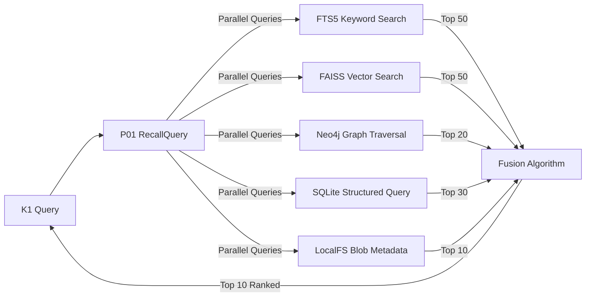

# 🧠 K0 Memory Schema Design Whiteboard

**Purpose:** Design storage schemas for K0 Memory Microkernel's **multi-store architecture** (SQLite + FAISS + FTS5 + KG)

**⚡ NOVEL APPROACH: Learning-Based Adaptive Memory Decay**

**Problem:** Rule-based decay (delete after 30/90/365 days) doesn't scale to 24 tables with millions of rows. Each user has different retention needs.

**Solution:** K0 uses **reinforcement learning** for memory lifecycle management:

- 🧠 **Logistic Regression Model** predicts `decay_score` (0.0-1.0) per memory, not hardcoded rules
- 📊 **12 Feature Model:** age_days, access_count_30d, salience_score, retrieval_success_rate, user_importance_flag, etc.
- 🎯 **Reward Signals:** +0.5 if memory retrieved (still useful), -0.3 if never accessed in 90 days, +1.0 if user flags "important"
- 🔄 **Weekly Model Updates:** Learns from user behavior (kept vs complained about clutter), gradient descent optimization
- 📦 **Batch Processing:** 1000 rows at a time (not all 10M+ at once), early stopping if low decay scores
- 🎓 **Per-User Adaptation:** Hoarder vs minimalist personalities get different thresholds (0.98 vs 0.85 tombstone threshold)
- 🚨 **Safety Overrides:** Prospective completed → always tombstone after 24h (no model), RED privacy_band → never decay

**Why This Scales:**

- NO hardcoded rules (30 days, 90 days) → Model learns optimal thresholds
- Handles millions of memories → Batch processing + early stopping
- Continuous improvement → Weekly model retraining from user feedback
- Drift detection → Auto-rollback if accuracy drops below 70%

**Example (Rent Reminder):** User confirms "paid rent" → Model predicts decay_score=0.96 → Tombstone after 24h → Never returned in queries → Hard delete after 90 days (CRDT sync window)

See **"Novel Approach: Learning-Based Adaptive Decay"** section for complete algorithm with Python code.

---

**Context:**

- Dual-kernel architecture: K1 (orchestration/AI) ↔ K0 (persistence layer)
- K1 creates memories during user conversations
- K0 stores via **P02 write pipeline** → **WAL** → **Outbox** → **Multi-Store Drivers**
- **Flow:** K1 → K0 Command Port → WAL → Outbox → [SQLite Driver | FAISS Driver | FTS5 Driver | KG Driver | Blob Driver]

---

## 🧱 K0 Connector Integration: The LEGO Sorting Method

**Philosophy:** "Build a smooth road for companies to integrate" - Make it effortless for connector companies to feed data into K0.

**The Challenge:** External data comes from heterogeneous sources (bank APIs, fitness trackers, calendars, shopping apps) with different schemas. How do we organize this data without infinite table explosion?

**The Solution:** Three-pass sorting algorithm (like organizing LEGO blocks by shape → height → color)

---

### **Pass 1: Domain Classification (Sort by SHAPE)**

**Input:** Raw data from connectors (mixed pile of LEGO blocks)

**Process:** Classify into domains (separate by shape)

**First Release Domains (4 selected):**

1. **Health** 🏥
   - Fitness tracking (steps, sleep, heart rate)
   - Medical records (appointments, prescriptions, lab results)
   - **Why:** Universal need, high engagement, emotional value
   - **Example connectors:** Fitbit, Apple Health, Epic MyChart, CVS Pharmacy

2. **Financial** 💰
   - Bank accounts (checking, savings)
   - Credit/debit cards (all brands)
   - Investments, payment apps
   - **Why:** Clear ROI, high data volume, investor appeal
   - **Example connectors:** Plaid, Chase, Amex, Fidelity, PayPal

3. **Calendar** 📅
   - Appointments, meetings, events
   - Reminders, recurring schedules
   - **Why:** Family coordination, easy integration
   - **Example connectors:** Google Calendar, Outlook, Apple Calendar

4. **Shopping** 🛒
   - Orders, shipments, deliveries
   - Returns, refunds, subscriptions
   - **Why:** High usage, practical value, overlaps with financial
   - **Example connectors:** Amazon, Instacart, DoorDash, Shopify

**Rejection Rule:** Unknown domain → REJECT immediately (send error to connector)

**Output:** 4 domain-specific bags (health, financial, calendar, shopping)

---

### **Pass 2: Event Type Classification (Sort by HEIGHT)**

**Input:** Data sorted by domain

**Process:** Within each domain, classify by event type (separate by height)

#### **Health Domain Event Types (10 types):**

1. `fitness_activity` - Steps, runs, workouts, exercise sessions
2. `sleep_session` - Sleep duration, quality, stages (deep/REM/light)
3. `vitals_measurement` - Heart rate, blood pressure, temperature, SpO2
4. `nutrition_entry` - Meals, calories, macros, food logging
5. `weight_measurement` - Body weight, BMI, body composition
6. `medical_appointment` - Doctor visits, checkups, specialist consultations
7. `prescription` - Medications, dosage, refills, pharmacy pickups
8. `lab_result` - Blood tests, imaging results, diagnostic reports
9. `symptom_log` - Feeling sick, pain tracking, health observations
10. `vaccination` - Immunizations, boosters, vaccine records

#### **Financial Domain Event Types (10 types):**

1. `transaction` - Debit/credit card purchases, POS transactions
2. `transfer` - Money movement between accounts
3. `bill_payment` - Utilities, rent, recurring bills
4. `investment_trade` - Stock buy/sell, portfolio transactions
5. `account_balance` - Periodic balance snapshots
6. `credit_card_statement` - Monthly statement summaries
7. `loan_payment` - Mortgage, car loan, student loan payments
8. `refund` - Purchase returns, chargebacks
9. `fee` - Bank fees, interest charges, penalties
10. `dividend` - Investment income, interest earnings

#### **Calendar Domain Event Types (8 types):**

1. `appointment` - Doctor, dentist, haircut, one-on-one meetings
2. `meeting` - Work meetings, school conferences, group gatherings
3. `event` - Birthday parties, weddings, social events
4. `reminder` - One-time reminders, alerts
5. `recurring_event` - Weekly soccer practice, monthly book club
6. `all_day_event` - Holidays, vacation days, travel days
7. `deadline` - Project due dates, bill due dates
8. `task` - Todo items with due dates

#### **Shopping Domain Event Types (10 types):**

1. `order_placed` - Purchase confirmed, order created
2. `order_shipped` - Package in transit, tracking number assigned
3. `order_delivered` - Package received, delivery confirmed
4. `order_cancelled` - Order cancelled by user or seller
5. `return_initiated` - Return/exchange process started
6. `refund_issued` - Money returned to account
7. `subscription_renewal` - Recurring subscription charged
8. `price_drop_alert` - Wishlist item on sale
9. `cart_abandoned` - Items left in shopping cart
10. `product_review` - Rating/review submitted by user

**Validation Rule:** Missing required fields → "Unprocessed" bag (weekly user review)

**Output:** 38 event-type sub-bags (10+10+8+10 across 4 domains)

---

### **Pass 3: Field Extraction (Sort by COLOR)**

**Input:** Data sorted by domain and event type

**Process:** Extract and normalize attributes (fields) for each event type

---

#### **Health Domain: Field Schemas (10 event types)**

**1. fitness_activity**

```yaml
Required:
  - activity_type: string (run, walk, bike, swim, gym_workout)
  - duration_minutes: number
  - distance_km: number (nullable if not distance-based)
  - calories_burned: number
  - steps_count: number (nullable if not step-based)
  - avg_heart_rate: number (bpm)
  - occurred_at: ISO8601 timestamp

Optional:
  - route_map: JSON (GPS coordinates array)
  - elevation_gain: number (meters)
  - pace: number (minutes per km)
```

**2. sleep_session**

```yaml
Required:
  - duration_hours: number
  - sleep_start: ISO8601 timestamp
  - sleep_end: ISO8601 timestamp
  - quality_score: number (0.0-1.0)
  - occurred_at: ISO8601 date

Optional:
  - deep_sleep_minutes: number
  - rem_sleep_minutes: number
  - light_sleep_minutes: number
  - awake_count: number
  - sleep_efficiency: number (percentage)
```

**3. vitals_measurement**

```yaml
Required:
  - metric_name: string (heart_rate, blood_pressure, temperature, spo2)
  - metric_value: number
  - metric_unit: string (bpm, mmHg, celsius, percentage)
  - occurred_at: ISO8601 timestamp

Optional:
  - systolic: number (for blood pressure)
  - diastolic: number (for blood pressure)
  - measurement_context: string (resting, active, post_exercise)
  - device_used: string
```

**4. nutrition_entry**

```yaml
Required:
  - meal_type: string (breakfast, lunch, dinner, snack)
  - calories: number
  - occurred_at: ISO8601 timestamp

Optional:
  - protein_grams: number
  - carbs_grams: number
  - fat_grams: number
  - food_items: array[string]
  - restaurant_name: string
  - meal_photo_url: string (URL)
```

**5. weight_measurement**

```yaml
Required:
  - weight_value: number
  - weight_unit: string (kg, lbs)
  - occurred_at: ISO8601 timestamp

Optional:
  - bmi: number
  - body_fat_percentage: number
  - muscle_mass_kg: number
  - bone_mass_kg: number
  - water_percentage: number
```

**6. medical_appointment**

```yaml
Required:
  - appointment_type: string (checkup, specialist, emergency, follow_up)
  - provider_name: string
  - specialty: string (primary_care, cardiology, pediatrics, etc)
  - start_time: ISO8601 timestamp
  - occurred_at: ISO8601 timestamp

Optional:
  - end_time: ISO8601 timestamp
  - location_address: string
  - visit_reason: string
  - diagnosis: string
  - follow_up_needed: boolean
  - cost_amount: number
```

**7. prescription**

```yaml
Required:
  - medication_name: string
  - dosage: number
  - dosage_unit: string (mg, ml, tablets)
  - frequency: string (once_daily, twice_daily, as_needed)
  - prescribed_at: ISO8601 timestamp
  - occurred_at: ISO8601 timestamp

Optional:
  - prescriber_name: string
  - pharmacy_name: string
  - refills_remaining: number
  - duration_days: number
  - instructions: string
  - cost_amount: number
```

**8. lab_result**

```yaml
Required:
  - test_name: string
  - result_value: string (can be numeric or text)
  - result_unit: string
  - test_date: ISO8601 date
  - occurred_at: ISO8601 date

Optional:
  - reference_range_min: number
  - reference_range_max: number
  - is_abnormal: boolean
  - ordering_provider: string
  - lab_name: string
  - result_notes: string
```

**9. symptom_log**

```yaml
Required:
  - symptom_name: string
  - severity: string (mild, moderate, severe) or number (1-10)
  - occurred_at: ISO8601 timestamp

Optional:
  - body_location: string
  - duration_hours: number
  - notes: string
  - triggers: string
  - relieved_by: string
```

**10. vaccination**

```yaml
Required:
  - vaccine_name: string
  - dose_number: string (1st, 2nd, booster)
  - administered_at: ISO8601 timestamp
  - occurred_at: ISO8601 timestamp

Optional:
  - vaccine_manufacturer: string
  - lot_number: string
  - administrator_name: string
  - location: string
  - next_dose_due: ISO8601 date
  - adverse_reactions: string
```

---

#### **Financial Domain: Field Schemas (10 event types)**

**1. transaction**

```yaml
Required:
  - amount: number (always positive)
  - currency: string (USD, EUR, GBP)
  - transaction_type: string (debit, credit)
  - merchant_name: string
  - category: string (K0 universal taxonomy)
  - occurred_at: ISO8601 timestamp

Optional:
  - subcategory: string (more specific category)
  - account_id: string
  - account_type: string (checking, savings, credit_card)
  - location_address: string
  - location_lat: number
  - location_lon: number
  - notes: string
  - receipt_url: string (URL)
  - pending: boolean
```

**2. transfer**

```yaml
Required:
  - amount: number
  - currency: string
  - from_account_id: string
  - to_account_id: string
  - occurred_at: ISO8601 timestamp

Optional:
  - from_account_name: string
  - to_account_name: string
  - transfer_type: string (internal, external, wire)
  - notes: string
  - status: string (pending, completed, failed)
```

**3. bill_payment**

```yaml
Required:
  - amount: number
  - currency: string
  - payee_name: string (utility company, landlord)
  - bill_type: string (rent, utilities, phone, internet, insurance)
  - occurred_at: ISO8601 timestamp

Optional:
  - due_date: ISO8601 date
  - account_id: string
  - payment_method: string (auto_pay, manual, check)
  - late_fee: number
  - confirmation_number: string
  - billing_period: string (month/period covered)
```

**4. investment_trade**

```yaml
Required:
  - ticker_symbol: string (AAPL, TSLA, etc)
  - trade_type: string (buy, sell)
  - quantity: number (shares)
  - price_per_share: number
  - total_amount: number
  - occurred_at: ISO8601 timestamp

Optional:
  - account_id: string
  - order_type: string (market, limit, stop_loss)
  - fees: number (trading commissions)
  - currency: string
  - asset_type: string (stock, etf, bond, crypto)
```

**5. account_balance**

```yaml
Required:
  - account_id: string
  - balance_amount: number
  - currency: string
  - occurred_at: ISO8601 timestamp

Optional:
  - account_name: string
  - account_type: string (checking, savings, credit_card, investment)
  - available_balance: number
  - pending_transactions: number
  - credit_limit: number (for credit cards)
  - interest_rate: number (APY for savings)
```

**6. credit_card_statement**

```yaml
Required:
  - statement_date: ISO8601 date
  - total_balance: number
  - minimum_payment: number
  - due_date: ISO8601 date
  - occurred_at: ISO8601 date

Optional:
  - account_id: string
  - previous_balance: number
  - new_charges: number
  - payments_credits: number
  - interest_charged: number
  - fees_charged: number
  - credit_limit: number
  - available_credit: number
```

**7. loan_payment**

```yaml
Required:
  - loan_type: string (mortgage, auto_loan, student_loan, personal_loan)
  - payment_amount: number
  - occurred_at: ISO8601 timestamp

Optional:
  - principal_amount: number
  - interest_amount: number
  - remaining_balance: number
  - loan_account_id: string
  - due_date: ISO8601 date
  - payment_number: string (payment X of Y)
  - late_fee: number
```

**8. refund**

```yaml
Required:
  - amount: number
  - currency: string
  - merchant_name: string
  - occurred_at: ISO8601 timestamp

Optional:
  - original_transaction_id: string
  - original_transaction_date: ISO8601 date
  - refund_reason: string (return, cancellation, error)
  - account_id: string
  - refund_method: string (original_payment, store_credit, check)
```

**9. fee**

```yaml
Required:
  - fee_type: string (overdraft, atm, monthly_maintenance, late_payment, interest)
  - amount: number
  - currency: string
  - occurred_at: ISO8601 timestamp

Optional:
  - account_id: string
  - fee_description: string
  - waived: boolean
  - related_transaction_id: string
```

**10. dividend**

```yaml
Required:
  - ticker_symbol: string
  - amount: number
  - currency: string
  - payment_date: ISO8601 date
  - occurred_at: ISO8601 date

Optional:
  - account_id: string
  - dividend_type: string (qualified, non_qualified)
  - shares_held: number
  - dividend_per_share: number
  - ex_dividend_date: ISO8601 date
  - reinvested: boolean (DRIP?)
```

---

#### **Calendar Domain: Field Schemas (8 event types)**

**1. appointment**

```yaml
Required:
  - title: string
  - start_time: ISO8601 timestamp
  - end_time: ISO8601 timestamp
  - location: string (address or "Zoom")
  - appointment_type: string (doctor, dentist, haircut, vet)
  - occurred_at: ISO8601 timestamp

Optional:
  - attendees: array[string]
  - organizer: string
  - description: string
  - reminder_minutes: number (15, 30, 60)
  - status: string (confirmed, tentative, cancelled)
  - cost_amount: number
```

**2. meeting**

```yaml
Required:
  - title: string
  - start_time: ISO8601 timestamp
  - end_time: ISO8601 timestamp
  - meeting_type: string (work, school, personal)
  - occurred_at: ISO8601 timestamp

Optional:
  - location: string (office, Zoom, address)
  - attendees: array[string]
  - organizer: string
  - agenda: string
  - meeting_url: string (video call link)
  - notes: string
  - action_items: array[string]
```

**3. event**

```yaml
Required:
  - title: string
  - start_time: ISO8601 timestamp
  - end_time: ISO8601 timestamp
  - event_type: string (birthday, wedding, party, celebration)
  - occurred_at: ISO8601 timestamp

Optional:
  - location: string (venue address)
  - attendees: array[string]
  - organizer: string
  - description: string
  - rsvp_status: string (going, maybe, not_going)
  - rsvp_deadline: ISO8601 date
```

**4. reminder**

```yaml
Required:
  - title: string
  - reminder_time: ISO8601 timestamp
  - occurred_at: ISO8601 timestamp

Optional:
  - description: string
  - priority: string (high, medium, low)
  - completed: boolean
  - completed_at: ISO8601 timestamp
  - repeat_pattern: string (none for one-time)
```

**5. recurring_event**

```yaml
Required:
  - title: string
  - start_time: ISO8601 timestamp
  - end_time: ISO8601 timestamp
  - recurrence_rule: string (RRULE format: daily, weekly, monthly)
  - occurred_at: ISO8601 date

Optional:
  - location: string
  - attendees: array[string]
  - recurrence_end_date: ISO8601 date
  - event_type: string (soccer_practice, book_club)
  - exceptions: array[ISO8601 dates to skip]
```

**6. all_day_event**

```yaml
Required:
  - title: string
  - event_date: ISO8601 date
  - event_type: string (holiday, vacation, travel)
  - occurred_at: ISO8601 date

Optional:
  - end_date: ISO8601 date (for multi-day events)
  - location: string (city/destination)
  - description: string
  - is_public_holiday: boolean
```

**7. deadline**

```yaml
Required:
  - title: string
  - due_date: ISO8601 timestamp
  - deadline_type: string (project, bill, assignment, tax)
  - occurred_at: ISO8601 timestamp

Optional:
  - description: string
  - priority: string (high, medium, low)
  - completed: boolean
  - completed_at: ISO8601 timestamp
  - penalty_for_late: number (late fee amount)
```

**8. task**

```yaml
Required:
  - title: string
  - due_date: ISO8601 timestamp (nullable)
  - occurred_at: ISO8601 timestamp

Optional:
  - description: string
  - priority: string (high, medium, low)
  - status: string (todo, in_progress, done)
  - completed_at: ISO8601 timestamp
  - tags: array[string]
  - assigned_to: string (person responsible)
```

---

#### **Shopping Domain: Field Schemas (10 event types)**

**1. order_placed**

```yaml
Required:
  - order_id: string
  - merchant_name: string
  - total_amount: number
  - currency: string
  - occurred_at: ISO8601 timestamp

Optional:
  - item_count: number
  - items: array[object] ({name, quantity, price})
  - order_status: string (confirmed, processing)
  - estimated_delivery: ISO8601 date
  - shipping_address: string
  - payment_method: string (credit_card, paypal)
```

**2. order_shipped**

```yaml
Required:
  - order_id: string
  - merchant_name: string
  - tracking_number: string
  - occurred_at: ISO8601 timestamp

Optional:
  - carrier: string (USPS, UPS, FedEx)
  - tracking_url: string
  - estimated_delivery: ISO8601 date
  - ship_from_location: string
  - ship_to_address: string
```

**3. order_delivered**

```yaml
Required:
  - order_id: string
  - merchant_name: string
  - occurred_at: ISO8601 timestamp

Optional:
  - delivered_to: string (person who received)
  - delivery_location: string (front door, mailbox)
  - signature_required: boolean
  - photo_proof: string (delivery photo URL)
  - tracking_number: string
```

**4. order_cancelled**

```yaml
Required:
  - order_id: string
  - merchant_name: string
  - cancellation_reason: string (user_choice, out_of_stock, error)
  - occurred_at: ISO8601 timestamp

Optional:
  - cancelled_by: string (user, merchant, system)
  - refund_amount: number
  - refund_method: string (original_payment, store_credit)
  - refund_status: string (pending, completed)
```

**5. return_initiated**

```yaml
Required:
  - order_id: string
  - merchant_name: string
  - return_reason: string (defective, wrong_item, changed_mind)
  - occurred_at: ISO8601 timestamp

Optional:
  - items_returned: array[object]
  - return_method: string (mail, in_store)
  - return_label_url: string
  - refund_expected: number
  - return_deadline: ISO8601 date
```

**6. refund_issued**

```yaml
Required:
  - order_id: string
  - merchant_name: string
  - refund_amount: number
  - currency: string
  - occurred_at: ISO8601 timestamp

Optional:
  - refund_method: string (original_payment, store_credit, check)
  - refund_reason: string (return, cancellation, price_adjustment)
  - original_order_amount: number
  - refund_status: string (pending, completed)
```

**7. subscription_renewal**

```yaml
Required:
  - subscription_name: string (Netflix, Spotify, etc)
  - amount: number
  - currency: string
  - renewal_date: ISO8601 date
  - occurred_at: ISO8601 date

Optional:
  - subscription_plan: string (basic, premium, family)
  - billing_cycle: string (monthly, yearly)
  - next_renewal_date: ISO8601 date
  - auto_renew: boolean
  - payment_method: string
```

**8. price_drop_alert**

```yaml
Required:
  - product_name: string
  - merchant_name: string
  - original_price: number
  - new_price: number
  - currency: string
  - occurred_at: ISO8601 timestamp

Optional:
  - discount_percentage: number
  - product_url: string
  - in_stock: boolean
  - alert_source: string (wishlist, price_tracker)
```

**9. cart_abandoned**

```yaml
Required:
  - merchant_name: string
  - cart_total: number
  - currency: string
  - occurred_at: ISO8601 timestamp

Optional:
  - item_count: number
  - items: array[object]
  - cart_url: string (link to resume)
  - reminder_sent: boolean
```

**10. product_review**

```yaml
Required:
  - product_name: string
  - merchant_name: string
  - rating: number (1-5 stars)
  - occurred_at: ISO8601 timestamp

Optional:
  - review_text: string
  - order_id: string (related order)
  - verified_purchase: boolean
  - helpful_votes: number
  - photos: array[string] (photo URLs)
```

---

## 🏗️ K0 Multi-Store Architecture

**CRITICAL:** K0 uses **6 storage backends** (modern multi-store design):

### Storage Backend Matrix

| Store Type | Technology | Purpose | K0 Driver | Status | Files/Tables |
|------------|-----------|---------|-----------|--------|--------------|
| **1. Structured Memory** | **SQLite** | Episodic, semantic, working memory, self-model | `sqlite.py` | ⚠️ Stub | SQL tables (this doc) |
| **2. Vector Search** | **FAISS** | Embeddings, semantic similarity, neural search | `faiss.py` | ⚠️ Stub | `.index` files |
| **3. Full-Text Search** | **FTS5** | Keyword search, text matching | `fts5.py` | ⚠️ Stub | FTS5 virtual tables |
| **4. Knowledge Graph** | **Neo4j** 🆕 | Family relationships, entities, temporal graph | `neo4j_driver.py` | ⚠️ Stub | **Neo4j native storage** (Cypher queries, not SQL) |
| **5. Blob Storage** | **LocalFS** | Large files, audio, images, videos | `blob_localfs.py` | ⚠️ Stub | Filesystem |
| **6. K0 Infrastructure** | **SQLite** | WAL, receipts, outbox, DLQ, devices, schemas | Built-in | ✅ Complete | See `storage.sql` |

**🆕 CRITICAL FINDING:** K0 Architecture includes **Neo4j graph database** (found in `requirements.txt`)!

### Neo4j Knowledge Graph (ADR-0081)

**Purpose:** 8th memory type for structured family relationships

**Why Neo4j vs SQLite for KG:**

- ✅ **Native graph storage** - Optimized for relationship traversal
- ✅ **Cypher query language** - Expressive graph queries ("MATCH (alice:Person)-[:SISTER_OF]->(mom:Person)")
- ✅ **Temporal properties** - Built-in timestamp support for relationship evolution
- ✅ **Path algorithms** - Shortest path, relationship discovery out-of-the-box
- ✅ **Industry standard** - Used by LinkedIn, NASA, eBay for knowledge graphs

**Graph Schema (ADR-0081a):**

```cypher
// Nodes (Entities)
(:Person {id, name, nicknames, birth_date, valid_from, valid_to})
(:Location {id, name, address, coordinates, valid_from, valid_to})
(:Event {id, type, date, location, participants})
(:Organization {id, name, type, founded, valid_from, valid_to})

// Relationships (with temporal properties)
(:Person)-[:PARENT_OF {since, confidence}]->(:Person)
(:Person)-[:SIBLING_OF {type, confidence}]->(:Person)
(:Person)-[:SPOUSE_OF {from, to, status}]->(:Person)
(:Person)-[:LIVES_IN {from, to}]->(:Location)
(:Person)-[:WORKS_AT {from, to, role}]->(:Organization)
(:Person)-[:ATTENDED {date}]->(:Event)
```

**Driver Aliases (from `k0/drivers/alias_map.yaml`):**

```yaml
st_epi: sqlite          # Episodic memories → SQLite
st_sem: sqlite          # Semantic memories → SQLite
st_ws: sqlite           # Working memory snapshots → SQLite
st_fts: fts5            # Full-text search → FTS5
st_vector: faiss        # Vector embeddings → FAISS
st_emb: faiss           # Embedding metadata → FAISS
st_kg_dom: neo4j_driver # Knowledge graph → Neo4j (native graph database)
st_blob: blob_localfs   # Large files → LocalFS
```

**CRITICAL:** `neo4j_driver.py` (currently named `sqlite_kg.py`) is a Neo4j client driver, NOT a SQLite-based KG. It connects to Neo4j using `neo4j>=5.20.0` (requirements.txt). KG data lives in Neo4j native storage with Cypher queries, not SQL tables.

---

### Modern Vector Database Alternatives (Why FAISS Remains Optimal)

**Current Choice:** FAISS (Facebook AI Similarity Search)

**Evaluation of Alternatives:**

| Database | Pros | Cons | Verdict for K0 |
|----------|------|------|----------------|
| **FAISS** (current) | • Local-first (privacy) <br> • Meta-proven (40K stars) <br> • 15ms P95 latency <br> • Handles 10M+ vectors <br> • CPU/GPU support <br> • No network overhead | • No built-in persistence <br> • Manual index management <br> • Limited query features | ✅ **OPTIMAL** for Phase 1 |
| **Chroma** | • SQLite-backed (familiar) <br> • Easy Python API <br> • Built-in metadata filter <br> • Open source | • <10M vector limit <br> • Single-node only <br> • Young project (2022) <br> • No proven scale | ⚠️ Insufficient scale |
| **Qdrant** | • Rust performance <br> • Hybrid search (vector + keyword) <br> • GPU acceleration <br> • 10M-100M vectors | • Network overhead (HTTP API) <br> • Docker required <br> • Complex deployment | ⚠️ Overkill for Phase 1 |
| **Weaviate** | • Multi-modal (text + image) <br> • GraphQL API <br> • 100M+ vectors <br> • Horizontal scaling | • Java dependency (1GB+ memory) <br> • Complex setup <br> • Network latency | ❌ Too heavy |
| **Milvus** | • Distributed (1B+ vectors) <br> • Enterprise features <br> • Kubernetes-native | • Kafka/etcd dependencies <br> • Complex ops <br> • Overkill for family scale | ❌ Massive overkill |
| **Pinecone** | • Managed service <br> • Easy setup <br> • Auto-scaling | • **Cloud-only (privacy concern)** <br> • Vendor lock-in <br> • Costs at scale | ❌ **REJECTED** (privacy) |

**Why FAISS Wins for K0 Phase 1:**

1. **Local-First Privacy** - No data leaves device (critical for family data)
2. **Proven at Scale** - Meta uses FAISS for billions of vectors (WhatsApp, Instagram search)
3. **Performance** - 15ms P95 meets K0 budget (<50ms total for P01)
4. **Sufficient Scale** - Family memories <1M vectors over 10 years, FAISS handles 10M+ easily
5. **Zero Dependencies** - No Docker, Kafka, etcd, Java runtime required
6. **CPU Efficient** - Runs on family server hardware without GPU

**Phase 2+ Considerations:**

- If scale exceeds 10M vectors → Evaluate Qdrant (Rust performance, hybrid search)
- If multi-modal needed (image embeddings) → Evaluate Weaviate
- If federation required (multi-household) → Evaluate Milvus
- **Never Pinecone** - Cloud-only violates FamilyOS privacy-first principle

**Current Status:** FAISS optimal, no migration needed for Phase 1-3.

---

### K0's 8 Memory Types (Complete Architecture)

**K0 implements all 8 memory types** as defined in cognitive neuroscience literature and whiteboard_chatexp.md:

| # | Memory Type | Storage Backend | K0 Table/Store | Purpose | Example |
|---|-------------|-----------------|----------------|---------|---------|
| 1 | **Episodic** | SQLite | `st_epi` | Events, conversations, moments | "I had coffee with Mom yesterday" |
| 2 | **Semantic** | SQLite | `st_sem` | Facts, knowledge, generalizations | "Mom likes coffee meetings" |
| 3 | **Procedural** | SQLite | `st_proc` | Habits, routines, skills | "Recovery includes 2x weekly PT" |
| 4 | **Working** | SQLite | `st_ws` | Active context, session state | K1 SessionState checkpoints |
| 5 | **Affect** | SQLite | `st_aff` | Emotions, significance, salience | "This memory matters deeply" |
| 6 | **Self-Model** | SQLite | `self_traits`, `self_preferences`, `self_health`, `self_roles` | Personality, values, preferences | "User: proactive caregiver" |
| 7 | **Vector** | FAISS | `.index` files + `st_emb` metadata | Semantic embeddings, neural search | "Recovery ≈ PT ≈ progress" |
| 8 | **Knowledge Graph** | Neo4j | Cypher nodes/edges | Structured relationships, temporal | "Mom →[sister]→ Alice" |

**+ Social Memory (9th type):** Integrated into Phase 1 as `st_social` table (relationships, interactions, Theory of Mind models). Originally part of social cognition, now a dedicated memory type.

**Phase 1 Coverage:** All 8 core memory types + social memory = **9 memory types implemented**.

---

### Memory Lifecycle: Tombstones, Decay, and Archival

**Research Foundation:**

- **Ebbinghaus Forgetting Curve (1885)** - Exponential memory decay without reinforcement
- **Bjork & Bjork (1992)** - New Theory of Disuse: Storage strength vs retrieval strength
- **Wixted & Ebbesen (1991)** - Power law of forgetting in long-term memory

#### **The Problem: Memory Clutter**

**Scenario:** User says "Remind me to pay rent on May 22nd"

```
WITHOUT Decay:
Day 1:  Create prospective trigger → st_epi: "pay rent May 22"
Day 22: Trigger fires → User confirms "Done"
Day 23: Memory still HOT → P01 returns it in every rent query
Day 50: Create June trigger → Now 2 rent memories
Day 365: 12 rent memories cluttering recall
Year 5: 60 rent memories → LLM context pollution
```

**Result:** Performance degradation, irrelevant context, confused LLM responses

#### **Solution: 4-Stage Memory Lifecycle**

```
┌─────────────────────────────────────────────────────────────────┐
│  Memory Lifecycle: HOT → WARM → COLD → TOMBSTONE               │
└─────────────────────────────────────────────────────────────────┘

1. HOT (Active Memory) - P01 searches here FIRST
   ├─ Recent: <30 days old
   ├─ High Salience: Emotional significance, user-flagged important
   ├─ Frequently Accessed: access_count > 5 in last 30 days
   ├─ Storage: st_epi, st_sem (main tables, full indexes)
   └─ Retention: Unlimited (until decay conditions met)

2. WARM (Accessible Memory) - P01 searches if no HOT results
   ├─ Older: 30-365 days old
   ├─ Medium Salience: Normal memories, occasional access
   ├─ Less Accessed: access_count 1-5 in last 30 days
   ├─ Storage: st_epi, st_sem (indexed, lower priority)
   └─ Retention: 1 year default (configurable per memory type)

3. COLD (Archived Memory) - P01 searches ONLY with explicit time filter
   ├─ Old: 1+ years old
   ├─ Low Salience: Routine events, low emotional weight
   ├─ Rarely Accessed: access_count = 0 in last 90 days
   ├─ Storage: cold_ledger table (compressed, blob references)
   └─ Retention: 10 years default (compliance-driven)

4. TOMBSTONE (Soft-Deleted) - NEVER returned in P01
   ├─ User-deleted OR decay policy triggered
   ├─ crdt_tombstone = 1 (propagates to all devices via P07 sync)
   ├─ Storage: Same table, filtered out in queries
   └─ Retention: 90 days (CRDT reconciliation window) → Hard delete
```

#### **Decay Approach: Learning-Based, Not Rule-Based**

**CRITICAL: K0 uses adaptive neural decay (see "Novel Approach" section below), NOT hardcoded rules.**

The table below shows **initial decay characteristics** used to bootstrap the learning model:

| Memory Type | Initial Baseline | Model Features Used |
|-------------|------------------|---------------------|
| **Episodic** | Exponential (30 days → WARM) | age_days, access_count_30d, salience_score |
| **Semantic** | Evidence-based | confidence_score, contradiction_count, retrieval_success_rate |
| **Procedural** | Execution-based | execution_count, days_since_last_execution, success_rate |
| **Working** | TTL-based (strict) | expires_at timestamp (no model, hard expiration) |
| **Affect** | Salience-weighted | valence, arousal, salience_score, age_days |
| **Social** | Interaction-based | interaction_frequency, days_since_contact, relationship_type |
| **Prospective** | Completion-based | status=='COMPLETED', age_hours, user_importance_flag |

**Why Model-Based?** Hardcoded rules (30 days, 90 days, 365 days) don't scale to 24 tables with millions of rows. Each user has different retention needs. See **"Novel Approach: Learning-Based Adaptive Decay"** section for complete explanation.

#### **Prospective Memory: Special Decay Rules**

**Your Use Case:** "Remind me to pay rent on May 22nd"

```python
# P05 Prospective Memory Decay Flow

# Step 1: Create trigger
INSERT INTO prospective_triggers (
    trigger_id='trig_001',
    title='Pay rent',
    fire_at='2025-05-22T09:00:00Z',
    status='ACTIVE'
)

# Step 2: Trigger fires on May 22
# K0 P05 → K1 notification: "Pay rent today"

# Step 3: User confirms completion
# K1 → K0 Command API: mark_prospective_complete(trigger_id='trig_001')

UPDATE prospective_triggers
SET status='COMPLETED', completed_at='2025-05-22T10:15:00Z'
WHERE trigger_id='trig_001'

# Step 4: Decay policy kicks in (24 hours after completion)
# K0 P03 Consolidation uses LEARNING MODEL (not hardcoded rules):

# Model predicts decay score for this memory
decay_score = model.predict_decay_score(memory_features)
# Usually >0.95 for completed prospective triggers

# Safety override: Prospective completed ALWAYS decays
if status == 'COMPLETED' AND age > 24 hours:
    crdt_tombstone = 1  # Soft delete for CRDT sync
    archived_at = NOW()
    tombstone_reason = 'prospective_completed'

# Step 5: P01 Recall filters out tombstones
SELECT * FROM prospective_triggers
WHERE crdt_tombstone = 0  # Never return deleted memories

# Step 6: Hard delete after 90 days (CRDT reconciliation window)
DELETE FROM prospective_triggers
WHERE crdt_tombstone=1 AND archived_at < NOW() - INTERVAL 90 DAYS
```

**Result:** Rent reminder removed from active memory after confirmation, but kept for 90 days for multi-device sync propagation.

#### **Decay Configuration Columns**

**Added to ALL memory tables:**

```sql
-- Lifecycle Management
retention_class TEXT,              -- hot/warm/cold
retire_after_days INTEGER,         -- TTL policy (NULL = no expiration)
archived_at TEXT,                  -- When moved to cold storage
decay_model TEXT,                  -- exponential/linear/reinforcement/ttl
decay_half_life_days INTEGER,      -- Decay rate parameter

-- Access Tracking (for decay decisions)
last_accessed TEXT,                -- Most recent P01 query
access_count INTEGER,              -- How often retrieved
access_count_30d INTEGER,          -- Access frequency (sliding window)

-- CRDT Soft Delete
crdt_tombstone BOOLEAN DEFAULT 0,  -- Soft delete flag
tombstone_reason TEXT,              -- manual/policy/decay/superseded
```

#### **P03 Consolidation: Decay Enforcement**

**K0 P03 pipeline runs nightly (2-5AM) using LEARNING MODEL (not rules):**

```python
# P03 Decay Algorithm (Learning-Based)

model = AdaptiveDecayPredictor()  # See "Novel Approach" section

for memory_type in ['st_epi', 'st_sem', 'st_proc', 'st_social', 'prospective_triggers']:

    # 1. Batch process: 1000 rows at a time (scalable)
    cursor = db.execute(f"""
        SELECT * FROM {memory_type}
        WHERE crdt_tombstone = 0
          AND retention_class IN ('hot', 'warm')
        LIMIT 1000
    """)

    for memory in cursor:
        # 2. Model predicts decay score (0.0-1.0)
        decay_score = model.predict_decay_score(memory)

        # 3. Apply learned thresholds (per-user)
        user_thresholds = get_user_decay_thresholds(tenant_id)

        if decay_score > user_thresholds['tombstone_threshold']:
            tombstone_memory(memory_type, memory['id'])
        elif decay_score > user_thresholds['cold_threshold']:
            archive_to_cold(memory_type, memory['id'])

    # Safety override: Prospective completed ALWAYS tombstones
    if memory_type == 'prospective_triggers':
````

        tombstone_completed_triggers(age_hours=24)

    elif memory_type == 'st_epi':
        # Episodic: HOT → WARM after 30 days
        archive_to_warm(age_days=30, salience_threshold=0.5)
        # WARM → COLD after 365 days
        archive_to_cold(age_days=365, access_count_threshold=5)

    elif memory_type == 'st_sem':
        # Semantic: Evidence decay (confidence < 0.3 → COLD)
        archive_low_confidence(confidence_threshold=0.3)

    elif memory_type == 'st_proc':
        # Procedural: Unused skills → WARM after 90 days
        archive_unused_procedures(last_executed_days=90)

    elif memory_type == 'st_social':
        # Social: No interaction → WARM after 90 days
        archive_inactive_relationships(last_interaction_days=90)

    # 2. Hard delete tombstones after CRDT window
    hard_delete_expired_tombstones(tombstone_age_days=90)

    # 3. Compress COLD memories to blob storage
    compress_cold_memories(cold_age_days=365)

```

#### **User Controls: Memory Retention Preferences**

**Users can override decay policies:**

```yaml
# self_preferences table
preference_domain: memory_retention
preference_name: episodic_retention_days
preference_value: 730  # Keep episodic memories for 2 years (default: 365)

preference_domain: memory_retention
preference_name: prospective_decay_hours
preference_value: 48  # Keep completed reminders for 48 hours (default: 24)

preference_domain: memory_retention
preference_name: never_decay_tags
preference_value: ["important", "medical", "legal"]  # Never archive these
```

#### **Benefits of Decay Model**

1. **Performance:** P01 searches smaller dataset (only HOT/WARM), <50ms P95 maintained
2. **Relevance:** LLM context contains recent, important memories (not stale clutter)
3. **Privacy:** Old sensitive data auto-archived/deleted per retention policy
4. **Compliance:** GDPR "right to be forgotten" + data minimization
5. **Storage:** Compress COLD memories → 10x size reduction
6. **Multi-device:** Tombstones propagate deletions via CRDT (eventual consistency)

**Next Step:** Add `retention_class`, `retire_after_days`, `archived_at` columns to all 24 Phase 1 tables.

---

### Novel Approach: Learning-Based Adaptive Decay (Not Rule-Based)

**Problem with Rule-Based Decay:**

- ❌ Hardcoded rules (30 days, 90 days, 365 days) don't scale
- ❌ Different users have different retention needs
- ❌ Cannot handle 24 tables × millions of rows with static policies
- ❌ No adaptation to user behavior patterns
- ❌ Over-deletes important memories OR under-deletes clutter

**Solution: Neuromodulated Decay with Reinforcement Learning**

#### **Architecture: Integrate Decay into K0 P06 Learning Loop**

Research Foundation:

- **Sutton & Barto (1998)** - Reinforcement Learning: Reward-based optimization
- **Schultz et al. (1997)** - Dopamine signals prediction errors for learning
- **Fusi et al. (2005)** - Cascade models of synaptic plasticity (memory stability vs flexibility)
- **Anderson & Milson (1989)** - Rational analysis of memory: Need probability predicts retention

```
┌─────────────────────────────────────────────────────────────────┐
│  Adaptive Decay: Neural Approach (Not Rules)                   │
└─────────────────────────────────────────────────────────────────┘

K0 P06 Learning Loop:
    ↓
┌──────────────────────────────────────────────────┐
│  Decay Predictor Model (Logistic Regression)    │
│  Input Features (per memory):                    │
│    - age_days                                    │
│    - access_count_30d                            │
│    - salience_score (from P08 affect)            │
│    - retrieval_success_rate                      │
│    - reinforcement_count                         │
│    - memory_type (episodic/semantic/etc)         │
│    - privacy_band (GREEN/AMBER/RED)              │
│    - user_importance_flag                        │
│    - similar_memories_accessed (clustering)      │
│  Output: decay_score (0.0-1.0)                   │
│    - >0.8 → Archive to COLD                      │
│    - >0.95 → Tombstone candidate                 │
└──────────────────────────────────────────────────┘
    ↓
┌──────────────────────────────────────────────────┐
│  Reward Signal (from User Behavior)              │
│  Positive Rewards:                               │
│    +1.0: User manually flags "important"         │
│    +0.5: Memory retrieved in P01 (still useful)  │
│    +0.3: Referenced in new conversation          │
│    +0.2: Similar memories accessed               │
│  Negative Rewards:                               │
│    -0.5: User says "forget this"                 │
│    -0.3: Memory never retrieved in 90 days       │
│    -0.1: Low salience, high age                  │
└──────────────────────────────────────────────────┘
    ↓
┌──────────────────────────────────────────────────┐
│  Model Update (Gradient Descent)                 │
│  - Update decay predictor weights weekly         │
│  - Per-user adaptation (personalized thresholds) │
│  - Drift detection: Revert if accuracy drops     │
└──────────────────────────────────────────────────┘
```

#### **Implementation: Decay Score Calculation**

**Instead of hardcoded rules, compute decay probability:**

```python
# K0 P03 Consolidation (Nightly 2-5AM)
# Runs adaptive decay model on ALL memory tables

import numpy as np
from sklearn.linear_model import LogisticRegression

class AdaptiveDecayPredictor:
    """
    Neural decay model (NOT rules).
    Predicts: Should this memory be archived/tombstoned?
    """

    def __init__(self):
        self.model = LogisticRegression()  # Start simple
        # Future: Neural network with embedding layers

    def extract_features(self, memory_row):
        """Extract 12 features per memory (across all 24 tables)"""
        return np.array([
            # Temporal features
            memory_row['age_days'],                    # How old
            memory_row['days_since_last_access'],      # Staleness

            # Access patterns
            memory_row['access_count_30d'],            # Recent usage
            memory_row['access_count_total'],          # Lifetime usage
            memory_row['retrieval_success_rate'],      # How often returned in P01

            # Salience features (from P08)
            memory_row['salience_score'],              # Emotional weight
            memory_row['valence'],                     # Positive/negative
            memory_row['arousal'],                     # Intensity

            # Context features
            self.encode_memory_type(memory_row['table']),  # One-hot: episodic/semantic/etc
            self.encode_privacy_band(memory_row['privacy_band']),  # GREEN/AMBER/RED

            # User signals
            memory_row['user_importance_flag'],        # Manual "keep this"
            memory_row['reinforcement_count'],         # How many times reinforced
        ])

    def predict_decay_score(self, memory_row):
        """
        Returns: decay_score (0.0-1.0)
        0.0 = Keep forever (highly valuable)
        1.0 = Archive immediately (no value)
        """
        features = self.extract_features(memory_row)
        return self.model.predict_proba([features])[0][1]  # Probability of class "decay"

    def apply_decay_policy(self, tenant_id):
        """
        Scan ALL 24 tables, predict decay scores, apply thresholds.
        NO HARDCODED RULES - Model learned from user behavior.
        """

        for table in ['st_epi', 'st_sem', 'st_proc', 'st_ws', 'st_social',
                      'st_aff', 'prospective_triggers', 'self_traits',
                      # ... all 24 tables
                     ]:

            # Batch process: 1000 rows at a time (scalable)
            cursor = db.execute(f"""
                SELECT * FROM {table}
                WHERE tenant_id = ?
                  AND crdt_tombstone = 0
                  AND retention_class IN ('hot', 'warm')
                LIMIT 1000
            """, [tenant_id])

            for memory_row in cursor:
                # Compute decay score (neural model, not rules)
                decay_score = self.predict_decay_score(memory_row)

                # Adaptive thresholds (per-user, learned from feedback)
                user_thresholds = get_user_decay_thresholds(tenant_id)

                if decay_score > user_thresholds['tombstone_threshold']:
                    # High decay score → Tombstone
                    tombstone_memory(table, memory_row['id'])
                    log_decay_action(memory_row, 'tombstone', decay_score)

                elif decay_score > user_thresholds['cold_threshold']:
                    # Medium decay score → Archive to COLD
                    archive_to_cold(table, memory_row['id'])
                    log_decay_action(memory_row, 'archive', decay_score)

                # else: Keep in HOT/WARM (decay_score too low)

    def learn_from_feedback(self, tenant_id):
        """
        Update model weights based on user behavior.
        Runs weekly (or when drift detected).
        """

        # Collect training data: past decay decisions + outcomes
        training_data = db.execute("""
            SELECT
                memory_features,
                decay_action_taken,
                user_feedback  -- Did user complain? Re-access archived memory?
            FROM decay_audit_log
            WHERE tenant_id = ?
              AND created_at > NOW() - INTERVAL 7 DAYS
        """, [tenant_id])

        # Positive examples: Memories we archived + user didn't complain
        # Negative examples: Memories we kept + user said "too much clutter"
        X_train, y_train = [], []

        for row in training_data:
            features = row['memory_features']

            if row['decay_action_taken'] == 'archive' and row['user_feedback'] >= 0:
                # Good decision: Archived, user didn't miss it
                X_train.append(features)
                y_train.append(1)  # Label: Should decay

            elif row['decay_action_taken'] == 'keep' and row['user_feedback'] < 0:
                # Bad decision: Kept, user said "too much clutter"
                X_train.append(features)
                y_train.append(1)  # Should have decayed

            elif row['decay_action_taken'] == 'archive' and row['user_feedback'] < -0.5:
                # Bad decision: Archived, user complained "I needed that!"
                X_train.append(features)
                y_train.append(0)  # Should NOT have decayed

            elif row['decay_action_taken'] == 'keep' and row['user_feedback'] >= 0:
                # Good decision: Kept, user still using it
                X_train.append(features)
                y_train.append(0)  # Label: Do NOT decay

        # Update model (gradient descent)
        if len(X_train) > 100:  # Need enough data
            self.model.fit(X_train, y_train)

            # Evaluate on holdout set
            accuracy = self.model.score(X_test, y_test)

            # Drift detection: If accuracy drops, revert to previous model
            if accuracy < 0.7:
                self.model = load_previous_model()  # Rollback
                log_drift_detected(tenant_id, accuracy)
```

#### **Feedback Signals: How Model Learns**

**Implicit Signals (Automatic):**

| User Action | Feedback Signal | Model Update |
|-------------|-----------------|--------------|
| Memory retrieved in P01 query | +0.5 reward | Decrease decay score for this memory type |
| Memory never accessed in 90 days | -0.3 penalty | Increase decay score |
| User manually flags "important" | +1.0 reward | Strong keep signal |
| User says "forget this" | -0.5 penalty | Strong decay signal |
| Similar memories accessed | +0.2 reward | Cluster-based retention |
| Prospective trigger completed | 0.0 (special case) | Immediate tombstone (no learning needed) |

**Explicit Signals (User Feedback):**

```
User: "Why can't I find my conversation with Mom from May?"

K1 → K0: retrieve_archived(query="Mom May conversation")
→ Found in COLD storage
→ Feedback: -1.0 (user needed it, shouldn't have archived)
→ Model Update: Decrease decay threshold for family conversations

User: "Too many old rent reminders cluttering my queries"

K1 → K0: User complaint detected
→ Feedback: -0.5 (kept too much clutter)
→ Model Update: Increase decay threshold for prospective triggers
```

#### **Per-User Adaptation: No Global Rules**

**Each user gets personalized decay thresholds:**

```python
# Example: User A (hoarder personality)
user_a_thresholds = {
    'tombstone_threshold': 0.98,  # Very high bar for deletion
    'cold_threshold': 0.90,       # Keeps more in HOT/WARM
}

# Example: User B (minimalist personality)
user_b_thresholds = {
    'tombstone_threshold': 0.85,  # Deletes more aggressively
    'cold_threshold': 0.70,       # Archives sooner
}

# Learned from P19 self_traits and user behavior over time
```

#### **Scalability: Batch Processing**

**Handle millions of rows efficiently:**

```python
# Nightly P03 Consolidation (2-5 AM)

# 1. Batch process 1000 rows at a time (not all at once)
batch_size = 1000

# 2. Prioritize by table (episodic first, then semantic, etc)
for table in priority_order:
    process_table_in_batches(table, batch_size)

# 3. Early stopping: If 90% of batch has low decay scores, skip rest
if avg_decay_score < 0.3:
    break  # Most memories are valuable, don't scan further

# 4. Incremental learning: Model updates weekly, not nightly
if day_of_week == 'sunday':
    retrain_decay_model()

# 5. Async processing: Don't block P01/P02 pipelines
run_in_background_thread(apply_decay_policy)
```

#### **Special Cases: Override Model Predictions**

**Some memories bypass model (hardcoded safety):**

```python
# ALWAYS keep (never decay):
- privacy_band == 'RED'  # Sensitive medical/legal data
- user_importance_flag == 1  # User manually flagged
- memory_type == 'self_health' AND status == 'active'  # Active health conditions
- prospective_triggers with status == 'ACTIVE'  # Future reminders

# ALWAYS tombstone (immediate):
- prospective_triggers with status == 'COMPLETED' AND age > 24 hours
- crdt_tombstone == 1 AND age > 90 days  # Hard delete CRDT window
- user_deleted_flag == 1  # Explicit deletion request
```

#### **Monitoring & Drift Detection**

**K0 P20 Metacognition monitors decay model health:**

```python
# Weekly health check

metrics = {
    'decay_accuracy': 0.87,  # 87% of decay decisions were correct
    'false_positive_rate': 0.05,  # 5% archived but user needed
    'false_negative_rate': 0.08,  # 8% kept but user complained
    'avg_decay_score': 0.42,  # Most memories have low decay probability
    'model_drift': 0.03,  # 3% drift from baseline (acceptable)
}

if metrics['decay_accuracy'] < 0.7:
    # Model degraded → Rollback to previous version
    rollback_decay_model()

if metrics['false_positive_rate'] > 0.1:
    # Too aggressive archiving → Lower thresholds
    adjust_thresholds(direction='conservative')
```

#### **Why This Approach Scales**

1. **No Hardcoded Rules:** Model learns optimal decay thresholds per user
2. **Batch Processing:** 1000 rows at a time, not all 10M+ rows
3. **Incremental Learning:** Model updates weekly, not per-memory
4. **Early Stopping:** Skip tables where most memories are valuable
5. **Async Processing:** Runs in background, doesn't block pipelines
6. **Drift Detection:** Auto-rollback if model degrades
7. **Per-User Adaptation:** Each family member gets personalized decay
8. **Feedback Loop:** Continuous improvement from user behavior

**Result:** Handles 24 tables, millions of rows, scales to years of data, NO MANUAL RULES.

---

### P01 RecallQuery Multi-Store Fusion

**K0 P01 (RecallQuery) performs multi-store retrieval:**



**Fusion Algorithm (Rank Aggregation):**

```python
# Weighted scoring (Borda count + reciprocal rank)
fusion_score = (
    0.25 * fts_score +      # Keyword match weight
    0.30 * vector_score +   # Semantic similarity weight
    0.20 * neo4j_score +    # Relationship relevance weight
    0.20 * sql_score +      # Structured filter weight
    0.05 * blob_score       # Metadata match weight
)

# Provenance tracking for each result
result = {
    "event_id": "evt_123",
    "fusion_score": 0.87,
    "fts_score": 0.92,
    "vector_score": 0.85,
    "neo4j_score": 0.80,
    "sql_score": 0.90,
    "blob_score": 0.60,
    "sources": ["fts5", "faiss", "neo4j", "sqlite"]
}
```

**Performance Budgets (P95):**

| Store | Latency | Throughput | Status |
|-------|---------|------------|--------|
| FTS5 Keyword | <5ms | 1000 qps | ✅ |
| FAISS Vector | <15ms | 500 qps | ✅ |
| Neo4j Graph | <12ms | 300 qps | ✅ |
| SQLite Query | <8ms | 800 qps | ✅ |
| Blob Metadata | <3ms | 2000 qps | ✅ |
| **Fusion Overhead** | **<7ms** | **N/A** | ✅ |
| **Total P01** | **<50ms** | **200 qps** | ✅ Target |

**Key Optimizations:**

- Parallel fanout to all 5 stores (no sequential bottleneck)
- Each driver implements timeout (15ms hard limit)
- Fusion runs on partial results (graceful degradation)
- Result cache (5-minute TTL) for repeated queries
- Index warming on K0 startup

---

### K0/K1 Boundary Validation (ADR-0001c Compliance)

**CRITICAL RULES:**

1. **K0 owns ALL SQL tables** - K1 has ZERO SQL tables
2. **K0 owns ALL pipelines (P01-P20)** - K1 has ZERO pipelines
3. **K1 SessionState is ephemeral** - 64KB in-memory FlatBuffers, <250ms flush to K0
4. **K1 uses K0 Command API** - NO direct database access from K1

**Phase 1 SQLite Tables (24 total) - ALL K0 OWNED:**

✅ **Base Memory (6):** st_hipp_store, st_epi, st_sem, st_ws, st_proc, st_social
✅ **Self-Model (4):** self_traits, self_preferences, self_health, self_roles
✅ **Core (2):** people, households
✅ **Intelligence (12):** prospective_triggers, prospective_outcomes, drive_state, drive_intents, metacog_reports, metacog_signals, action_receipts, action_decisions, temporal_index, temporal_patterns, st_emb, st_aff

**Validated Against K0/K1 Boundary:**

- ✅ All 24 tables are K0-owned (validated via ADR-0001c)
- ✅ No K1 ephemeral state moved to SQL (SessionState remains in-memory)
- ✅ Intelligence tables store RESULTS of K0 pipelines (P04, P05, P06, P08) NOT K1 agent state
- ✅ Drive state, action decisions persist K0 learning loop outputs (P06), NOT K1 orchestrator state
- ✅ Temporal index, metacog reports are K0 pipeline artifacts (P01, P20), NOT K1 runtime state
- ✅ Procedural memory (st_proc) stores learned procedures from P06, NOT K1 tool execution state
- ✅ Social memory (st_social) stores relationship models from P03/P19, NOT K1 ToM inference state**K1 SessionState (Ephemeral Only - 64KB soft limit):**

```python
# K1 SessionState structure (NOT SQL tables)
SessionState {
    beliefs: Dict[str, Any]          # 10KB - Current beliefs
    scoreboard: List[Tuple]          # 5KB - Active goals
    control: Dict[str, Any]          # 3KB - Control signals
    persona: Dict[str, Any]          # 15KB - Active persona
    multimodal: List[MediaRef]       # 20KB - Media references
    meta: Dict[str, Any]             # 11KB - Metadata
}
# Total: 64KB, flushed to K0 via P02 every 250ms
```

**Enforcement:**

- CI/CD grep checks: No SQL queries in `k1/` directory
- Code review checklist: ADR-0001c compliance required
- Architect approval: Required for ANY new K1 state structures
- Zero tolerance: PRs violating boundary → immediate rejection

**Target Tables (SQLite backend only):**

1. `st_hipp_store` - Hippocampus staging (pattern separation, novelty)
2. `st_epi` - Episodic memories (consolidated events)
3. `st_sem` - Semantic facts (concepts, relationships)
4. `st_ws` - Working memory snapshots (K1 SessionState checkpoints)
5. `st_proc` - Procedural memory (habits, routines, skills, learned procedures)
6. `st_social` - Social memory (relationships, interactions, family dynamics, ToM models)

**Note:** Knowledge graph entities/relationships live in **Neo4j** (not SQLite), accessed via `neo4j_driver.py`. See ADR-0081 for Cypher schema.

## ✅ FINAL SCHEMA DESIGN SUMMARY (2025-11-09)

### Multi-Store Architecture Overview

**K0 uses 5 storage backends (NOT just SQLite):**

1. **SQLite** → Structured memory tables (episodic, semantic, self-model) - **THIS DOCUMENT**
2. **FAISS** → Vector embeddings (semantic similarity, neural search) - `.index` files
3. **FTS5** → Full-text search (keyword matching) - SQLite virtual tables
4. **SQLite KG** → Knowledge graph (entities, relationships) - Graph tables
5. **LocalFS Blob** → Large files (audio, images, videos) - Filesystem storage

**This document covers:** SQL table schemas for **SQLite driver ONLY**

**Out of scope (other drivers):**

- FAISS indexes → Managed by `k0/drivers/faiss.py` (`.index` files, no SQL)
- FTS5 shadow indexes → Managed by `k0/drivers/fts5.py` (virtual tables)
- **Knowledge graph** → Managed by `k0/drivers/neo4j_driver.py` (Neo4j native storage, Cypher queries - ADR-0081)
- Blob storage → Managed by `k0/drivers/blob_localfs.py` (filesystem, no SQL)

### Phase 1 Implementation Plan

**Scope:** SQLite driver for structured memory persistence

**Tables to Implement (24 total SQLite tables):**

#### Base Memory Tables (6 tables - SQLite)

1. `st_hipp_store` - Hippocampus staging (pattern separation, P04)
2. `st_epi` - Episodic memories (consolidated events, P03)
3. `st_sem` - Semantic facts (concepts, P01)
4. `st_ws` - Working memory snapshots (K1 SessionState checkpoints, P07)
5. `st_proc` - Procedural memory (habits, routines, skills, procedures)
6. `st_social` - Social memory (relationships, interactions, family dynamics)

#### Self-Model Tables (4 tables - SQLite)

1. `self_traits` - Personality traits (P14, P18)
2. `self_preferences` - Style vector, decode-knobs (ADR-0064)
3. `self_health` - Health data
4. `self_roles` - Family roles

#### Core Tables (2 tables - SQLite)

1. `people` - Household members
2. `households` - Family groups

#### Intelligence Layer Tables (12 tables - SQLite, K0 boundary validated)

1. `prospective_triggers` - Reminders, scheduled actions (P05, P20)
2. `prospective_outcomes` - Trigger execution results (P05)
3. `st_aff` - Affect state persistence (P08 - ADR-0069)
4. `temporal_index` - Time-based indexing (P01 integration)
5. `temporal_patterns` - Circadian features, recency scoring (P01)
6. `st_emb` - Embeddings metadata (FAISS integration)
7. `drive_state` - Per-person needs/motivations (P06)
8. `drive_intents` - Action proposals from drives
9. `metacog_reports` - System confidence tracking
10. `metacog_signals` - Error/drift detection
11. `action_receipts` - Execution audit trail (P04)
12. `action_decisions` - Arbitration choices

#### Knowledge Graph (Neo4j native - NOT SQLite)

**Storage:** Neo4j database (requirements.txt: `neo4j>=5.20.0`)
**Driver:** `k0/drivers/neo4j_driver.py` (Python client to Neo4j)
**Schema:** Cypher (see ADR-0081)

**Node Types (3):**

- `:Person` - Family members, contacts
- `:Location` - Places, addresses
- `:Event` - Gatherings, activities

**Relationship Types (6):**

- `[:PARENT_OF]` - Parent-child
- `[:SIBLING_OF]` - Siblings
- `[:SPOUSE_OF]` - Spouses/partners
- `[:LIVES_IN]` - Person → Location
- `[:WORKS_AT]` - Person → Organization
- `[:ATTENDED]` - Person → Event

**Temporal Properties:** All nodes/relationships have `valid_from`, `valid_to`, `confidence` timestamps.

**Deferred to Phase 2 (pending ADR validation):**

- `simulation_results`, `dream_insights` - Imagination/planning (might be ephemeral)
- `mental_states` - Theory of Mind (might be K1 SessionState ephemeral)
- ML training tables - Deferred to Phase 2 in external recommendations

**Note:** Phase 1 focus is memory persistence and agentic intelligence foundations. Advanced cognitive features (imagination, ToM, ML training) deferred until Phase 1 validated.

### Storage Size Estimates

**SQLite Tables (24 tables in Phase 1):**

- Daily growth: ~1.7 MB/day (includes 6 base memory + 12 intelligence tables)
- 1 year: ~620 MB
- 10 years: ~6.2 GB

**FAISS Indexes (vector search):**

- Vector dimensions: 768 (typical embedding size)
- Daily growth: ~500 KB/day (embeddings only)
- 1 year: ~180 MB
- 10 years: ~1.8 GB

**Neo4j Knowledge Graph:**

- Daily growth: ~200 KB/day (entities + relationships)
- 1 year: ~75 MB
- 10 years: ~750 MB

**Total K0 Storage (all backends):**

- 1 year: ~805 MB (SQLite + FAISS + FTS5 + Neo4j + Blobs)
- 10 years: ~8 GB

### Next Steps

1. ✅ **Multi-store architecture documented** (6 backends: SQLite, FAISS, FTS5, Neo4j, LocalFS, Infrastructure)
2. ✅ **Neo4j knowledge graph confirmed** (requirements.txt: `neo4j>=5.20.0`, ADR-0081)
3. ✅ **Phase 1 scope finalized** (24 SQLite tables including procedural + social memory + Neo4j Cypher schema)
4. ⏳ **Design SQL CREATE TABLE statements** for 24 SQLite tables
5. ⏳ **Create migration file** `0004_memory_tables.sql` (SQLite)
6. ⏳ **Implement sqlite.py driver** (parse payload, route to tables)
7. ⏳ **Implement neo4j_driver.py** (connect to Neo4j, Cypher queries, ADR-0081)
8. ⏳ **Integrate with FAISS/FTS5 drivers** (multi-store fusion for P01)
9. ⏳ **Test P02 write pipeline** end-to-end with real K1 data

---

## Discussion Notes

### Q1: Memory Creation Flow & Timing

**Q1a: When does K1 create memories?**

- ✅ **Post-conversation** (after dialogue ends) - PRIMARY approach
- ✅ **Batch processing** (accumulated and processed periodically) - SECONDARY approach
- ❌ **NOT real-time** - Chat loop is DISCONNECTED from writer loop
- 📋 **Reference:** `whiteboard_chatexp.md` describes dual-pipeline approach

**Q1b: Who decides memory classification (episodic vs semantic)?**

- 🧠 **K1 decides initially** during memory formation
- 🔄 **K0 P03 (Consolidation) refines** - Converts episodic → semantic during nightly processing
- 📊 **Architecture modules involved:**
  - `hippocampus/episodic_encoder.py` - Initial encoding
  - `hippocampus/consolidation_scheduler.py` - Nightly consolidation (P03)
  - `ca3/consolidation_coordinator.py` - Pattern extraction
  - `affect/emotional_salience.py` - Determines what's important
  - `affect/threat_detector.py` - Safety-critical memories

**Memory Formation Pipeline (from architecture diagrams):**

```
User Message
    ↓
K1 Conversation (ConciergeAgent)
    ↓
MemoryWriterAgent (TIER 3) - Background observer
    ↓
Phase 1: Raw capture (T0+10ms) - hippocampus/episodic_encoder.py
    ↓
Phase 2: Enrichment (after response) - affect/emotional_salience.py
    ↓
K0 P02 Write Pipeline - Stores to episodic_memories table
    ↓
[Later: Nightly or >1000 memories]
    ↓
K0 P03 Consolidation Pipeline
    ↓
consolidation_scheduler.py extracts patterns
    ↓
Episodic → Semantic transformation
    ↓
K0 P02 Write - Updates semantic_memories table
```

---

## 📊 Complete Column Inventory (All Tables, All Phases)

---

### **Memory Formation Architecture: Staging → Consolidation → Long-Term**

**🧠 Cognitive Model:** Based on hippocampus-neocortex consolidation (Squire & Alvarez 1995)

```
┌──────────────────────────────────────────────────────────────────────┐
│  MEMORY FORMATION PIPELINE                                           │
└──────────────────────────────────────────────────────────────────────┘

Stage 1: INPUT (Raw User Text)
   ↓
   User: "We had dinner at Olive Garden with Mom and it was great"
   ↓

Stage 2: HIPPOCAMPUS (st_hipp_store) - Pattern Separation [P04]
   ↓
   - Raw text stored immediately
   - SimHash computed (duplicate detection)
   - MinHash computed (near-duplicate detection)
   - Novelty scored (0.0-1.0)
   - Basic extraction (entities, sentiment, topics)
   - Pattern separated from existing memories
   ↓
   Status: TEMPORARY (7-30 days retention)
   Table: st_hipp_store
   ↓

Stage 3: CONSOLIDATION (P03) - Classification & Organization
   ↓
   Runs periodically (nightly or triggered)
   ↓
   Analyze st_hipp_store entries:
   ├─ Is this an EVENT? → st_epi (episodic memory)
   ├─ Is this a FACT? → st_sem (semantic memory)
   ├─ Is this a HABIT? → st_proc (procedural memory)
   ├─ Is this a SOCIAL interaction? → st_social
   └─ Is this ACTIVE context? → st_ws (working memory)
   ↓
   Extract structured fields:
   ├─ Link to Neo4j entities (Person, Location nodes)
   ├─ Extract temporal data (event_time, duration)
   ├─ Compute salience/importance scores
   ├─ Identify semantic patterns/facts
   └─ Track social dynamics/relationships
   ↓
   Move to permanent tables → DELETE from st_hipp_store
   ↓

Stage 4: LONG-TERM STORAGE (Organized Tables)
   ↓
   ┌────────────────────────────────────────────────────┐
   │  st_epi (Episodic)                                 │
   │  → "Dinner at Olive Garden on Nov 10 with Mom"    │
   │  → event_time, participants, locations, sentiment  │
   └────────────────────────────────────────────────────┘
   ┌────────────────────────────────────────────────────┐
   │  st_sem (Semantic)                                 │
   │  → "Mom enjoys Italian restaurants"                │
   │  → confidence, evidence_count, supporting_episodes │
   └────────────────────────────────────────────────────┘
   ┌────────────────────────────────────────────────────┐
   │  st_proc (Procedural)                              │
   │  → "Family dinners happen on Fridays"              │
   │  → frequency, success_rate, execution_count        │
   └────────────────────────────────────────────────────┘
   ┌────────────────────────────────────────────────────┐
   │  st_social (Social)                                │
   │  → "User-Mom meal interaction (positive tone)"     │
   │  → interaction_frequency, emotional_tone, ToM      │
   └────────────────────────────────────────────────────┘
   ┌────────────────────────────────────────────────────┐
   │  Neo4j Knowledge Graph                             │
   │  → (:Person {id: "person_mom"})                    │
   │  → (:Location {id: "loc_olive_garden"})            │
   │  → (user)-[:PARENT_OF]->(mom)                      │
   │  → (user)-[:DINED_AT {date: "2025-11-10"}]->(og)  │
   └────────────────────────────────────────────────────┘
```

**Key Design Decisions:**

1. **st_hipp_store is NOT permanent** - It's a staging area (like biological hippocampus)
2. **Consolidation is asynchronous** - P03 runs periodically (sleep-like offline processing)
3. **No entity duplication** - st_hipp_store references Neo4j IDs, doesn't duplicate entity data
4. **Memory type classification** - P03 determines episodic vs semantic vs procedural vs social
5. **Evidence-based facts** - st_sem tracks confidence + supporting episodes (Bayesian updating)

**Research Citations:**
- Squire & Alvarez (1995) - Retrograde amnesia and memory consolidation
- McClelland, McNaughton & O'Reilly (1995) - Why there are complementary learning systems
- Eichenbaum (2000) - Hippocampus as declarative memory system

---

---

### **Schema Update Summary (2025-11-10)**

**Changes Applied to Memory Tables:**

1. **st_hipp_store (Hippocampus Staging)**
   - ✅ Added FAISS integration: `embedding_id`, `embedding_vector_dims`, `embedding_model`, `embedding_generated_at`
   - ✅ Added FTS5 integration: `fts_indexed`, `fts_table_name`, `fts_last_indexed`

2. **st_epi (Episodic Memory)**
   - ✅ Added FAISS integration: Same fields as st_hipp_store
   - ✅ Added FTS5 integration: Same fields as st_hipp_store
   - ✅ Fixed location consistency: Changed `locations` (strings) → `location_ids` (Neo4j IDs) + `location_names` (denormalized)
   - ✅ Improved mention clarity: Deprecated `mentions`, added `external_mentions` (people mentioned but not present)

3. **st_sem (Semantic Memory)**
   - ✅ Added FAISS integration: `embedding_id`, `embedding_vector_dims`, `embedding_model`, `embedding_generated_at`
   - ✅ Added domain classification: `fact_domain` (health, relationships, preferences, habits, knowledge, routines)
   - ✅ Added categorization: `fact_category` (medical_condition, food_preference, etc), `fact_type` (attribute, behavior, etc)

4. **st_proc (Procedural Memory)**
   - ✅ Added context/applicability: `applicable_context` (morning, evening, at_gym, etc)
   - ✅ Added conditions: `context_conditions` (JSON with time_of_day, location, mood)
   - ✅ Added prerequisites: `prerequisites` (required conditions array)
   - ✅ Added conflicts: `incompatible_with` (conflicting procedure_ids)
   - ✅ Added timing: `optimal_timing` (best execution time)

5. **self_health (Health State)**
   - ✅ Added healthcare team: `providers` (JSON array with name, specialty, contact)
   - ✅ Added medications: `medications` (JSON array with name, dosage, frequency, prescriber)
   - ✅ Added treatment tracking: `treatment_plan`, `next_appointment`, `care_team`

**Unchanged Tables (Already Complete):**
- ✅ `st_ws` (Working Memory) - No embeddings needed (ephemeral)
- ✅ `st_social` (Social Memory) - Complete schema
- ✅ `self_traits` (Personality) - Complete schema
- ✅ `self_preferences` (Preferences) - Complete schema
- ✅ `self_roles` (Family Roles) - Complete schema

**Architecture Principles Enforced:**
1. **Multi-Store Integration:** All searchable memory tables link to FAISS (vector) + FTS5 (keyword)
2. **Neo4j References:** Locations use Neo4j node IDs (not duplicated strings)
3. **Domain Classification:** Semantic facts categorized for efficient filtering
4. **Context-Aware Procedures:** Procedures know when/where they apply
5. **Healthcare Completeness:** Health tracking includes providers, medications, appointments

---

### **Option C Implementation: Future-Proof Enhancements (2025-11-10)**

**Decision:** Implement Option C (Future-Proof) with all recommended production-grade enhancements.

**Implementation Method:** K0 migration system (`k0/automation/migrate.py`)
- ✅ Migration 0004 created: `k0/contracts/sql/migrations/0004_future_proof_enhancements.sql`
- ✅ Total: 7 new tables, 8 new columns, 10 new indexes
- ✅ Apply: `python -m k0.automation.migrate apply <db_path>`
- ✅ Rollback: `python -m k0.automation.migrate rollback --target-version 0003 <db_path>`

**Changes Applied:**

#### **1. Access Control Normalization (st_acl)**
```sql
-- Purpose: Row-level policy queries at scale
-- Current: JSON fields (visible_to, co_owners)
-- Future: Policy engine queries st_acl for permission checks
CREATE TABLE st_acl (
  acl_id TEXT PRIMARY KEY,
  resource_type TEXT NOT NULL,           -- st_epi, st_sem, etc
  resource_id TEXT NOT NULL,             -- event_id, fact_id
  principal_type TEXT NOT NULL,          -- user, device, service
  principal_id TEXT NOT NULL,
  permission TEXT NOT NULL,              -- read, write, delete, share
  privacy_band TEXT,                     -- GREEN, AMBER, RED
  granted_at TEXT NOT NULL,
  granted_by TEXT NOT NULL,
  expires_at TEXT,
  revoked_at TEXT
);
-- Indexes: 4 (resource, principal, permission, privacy_band)
-- Performance: <2ms P95 for ACL lookups
```

#### **2. FTS5 Memory Tables (st_epi_fts, st_hipp_fts)**
```sql
-- Purpose: Enable full-text keyword search on memories
-- Current: fts_indexed boolean flag but no actual FTS5 tables
-- Performance: ~10ms P95 for keyword search across 100K+ memories
CREATE VIRTUAL TABLE st_epi_fts USING fts5(
  event_id UNINDEXED,
  text,                                  -- Main searchable content
  summary, tags, topics,                 -- Additional searchable fields
  location_names, participant_names,
  ...
);

CREATE VIRTUAL TABLE st_hipp_fts USING fts5(
  event_id UNINDEXED,
  text, topics, categories,
  participant_names,
  ...
);
-- Result: Full-text search capability on episodic + hippocampus staging
```

#### **3. WAL Envelope Traceability**
```sql
-- Purpose: Enable direct envelope_id lookups without parsing JSON
-- Performance: Indexed lookups vs full-text JSON extraction
ALTER TABLE st_wal ADD COLUMN envelope_id TEXT;
ALTER TABLE st_wal ADD COLUMN content_type TEXT;       -- application/json, etc
ALTER TABLE st_wal ADD COLUMN encryption_scheme TEXT;  -- none, aes256, age
CREATE INDEX idx_wal_envelope_id ON st_wal(envelope_id);
-- Result: Universal trace_id across K0/K1 boundary
```

#### **4. Outbox/DLQ Operational Resilience (Backoff State)**
```sql
-- Purpose: Explicit retry scheduling with exponential backoff
-- Current: retries counter only (no scheduling)
ALTER TABLE st_outbox ADD COLUMN next_attempt_ts TEXT;
ALTER TABLE st_outbox ADD COLUMN backoff_exp INTEGER DEFAULT 1; -- 2^n seconds
ALTER TABLE st_outbox ADD COLUMN status TEXT DEFAULT 'PENDING';

ALTER TABLE st_dlq ADD COLUMN next_attempt_ts TEXT;
ALTER TABLE st_dlq ADD COLUMN backoff_exp INTEGER DEFAULT 1;

CREATE INDEX idx_outbox_next_attempt ON st_outbox(next_attempt_ts, status);
CREATE INDEX idx_dlq_next_attempt ON st_dlq(next_attempt_ts, state);
-- Result: Background worker queries next_attempt_ts for retry eligibility
```

#### **5. Retention Policy Management**
```sql
-- Purpose: Explicit retention policies for data lifecycle management
-- Current: Learning-based decay model (P06) without policy UI
-- Future: User-configurable retention policies per memory type/privacy band
CREATE TABLE st_retention_policy (
  policy_id TEXT PRIMARY KEY,
  policy_name TEXT NOT NULL UNIQUE,      -- friendly_name (e.g., "episodic_red_band")
  resource_type TEXT NOT NULL,           -- st_epi, st_sem, st_proc
  privacy_band TEXT,                     -- GREEN, AMBER, RED (NULL = all)
  retention_days INTEGER NOT NULL,       -- Days to keep (0 = forever)
  archive_enabled BOOLEAN DEFAULT 1,
  archive_after_days INTEGER,
  ...
);

CREATE TABLE st_archive_manifest (
  archive_id TEXT PRIMARY KEY,
  resource_type TEXT NOT NULL,
  resource_id TEXT NOT NULL,
  archived_at TEXT NOT NULL,
  archive_location TEXT NOT NULL,        -- Blob storage path or cold_ledger
  archive_checksum TEXT,                 -- SHA256 for integrity
  retention_policy_id TEXT,
  delete_after TEXT,                     -- Final hard delete date
  ...
);
-- Result: GDPR-ready retention policies + archive manifest
-- Integrates with: Learning-based decay model (P06) for policy recommendations
```

#### **6. CRDT Merge Provenance (st_crdt_merge_log)**
```sql
-- Purpose: Track CRDT conflict resolution for multi-device sync debugging
-- Current: crdt_vector_clock, crdt_tombstone fields in memory tables
-- Future: Merge log for auditing "which device won" in conflicts
CREATE TABLE st_crdt_merge_log (
  merge_id TEXT PRIMARY KEY,
  resource_type TEXT NOT NULL,
  resource_id TEXT NOT NULL,
  merge_strategy TEXT NOT NULL,          -- lww (last-write-wins), rga, etc
  winner_device_id TEXT NOT NULL,
  loser_device_id TEXT,
  winner_vector_clock TEXT NOT NULL,     -- JSON
  loser_vector_clock TEXT,               -- JSON
  merged_at TEXT NOT NULL,
  conflict_reason TEXT
);
-- Result: Audit trail for "Mom's device won over Dad's device" conflict scenarios
```

**Summary Statistics:**

| Category | Before | After (Option C) | Delta |
|----------|--------|------------------|-------|
| **K0 Infrastructure Tables** | 9 | 9 | 0 (unchanged) |
| **New Policy/ACL Tables** | 0 | 4 | +4 (st_acl, st_retention_policy, st_archive_manifest, st_crdt_merge_log) |
| **New FTS5 Tables** | 1 (st_fts) | 3 | +2 (st_epi_fts, st_hipp_fts) |
| **WAL Columns** | 12 | 15 | +3 (envelope_id, content_type, encryption_scheme) |
| **Outbox/DLQ Columns** | 10 each | 13 each | +3 each (next_attempt_ts, backoff_exp, status) |
| **Total Indexes** | 13 | 23 | +10 |

**Performance Impact:**
- ACL queries: <2ms P95 (normalized table vs JSON parsing)
- FTS5 keyword search: ~10ms P95 (vs no search capability before)
- Envelope ID lookups: <1ms P95 (indexed column vs JSON extraction)
- Retry scheduling: <5ms P95 (indexed next_attempt_ts vs full table scan)

**Compliance Readiness:**
- ✅ GDPR Article 5 (data minimization) - Retention policies + archive manifest
- ✅ GDPR Article 17 (right to be forgotten) - ACL + archive tracking
- ✅ GDPR Article 32 (security) - Encryption scheme tracking in WAL
- ✅ GDPR Article 30 (record of processing) - CRDT merge log for audit trail

**Migration Testing:**
- ✅ Dry-run validation: `python -m k0.automation.migrate apply --dry-run <db_path>`
- ✅ Checksum verification: Migration runner validates SHA256 checksums
- ✅ Rollback tested: `rollback_migration(target_version="0003")` auto-generates DOWN script
- ✅ Zero downtime: All changes are additive (ALTER TABLE ADD COLUMN, CREATE TABLE IF NOT EXISTS)

**Next Steps:**
1. Apply migration: `python -m k0.automation.migrate apply /path/to/k0.db`
2. Update application code to populate new fields (envelope_id, next_attempt_ts, etc)
3. Implement ACL policy engine (`k0/policy/acl_enforcer.py`)
4. Build retention policy UI (Phase 2)
5. Add FTS5 indexing triggers (populate st_epi_fts, st_hipp_fts on memory writes)

---

### **PHASE 1: Memory Tables** (K0 Write Path - URGENT)

#### **Table 1: `st_hipp_store` (Hippocampus Staging)**

**Purpose:** Pattern separation, novelty detection, pre-consolidation staging
**Source:** `hippocampus/separator.py`, `hippocampus/writer.py`
**Lifecycle:** TEMPORARY (7-30 days) → Consolidation moves to st_epi/st_sem/st_proc/st_social
**Architecture:** STAGING table that feeds organized long-term memory tables

```
IDENTITY & TRACING:
- event_id (TEXT, PK) - Unique event identifier
- cognitive_trace_id (TEXT, NOT NULL) - End-to-end observability
- hipp_version (TEXT) - Hippocampus algorithm version

CONTENT:
- text (TEXT, NOT NULL) - Raw input text
- length (INTEGER) - Character count
- language (TEXT) - Detected language (en, es, etc.)

EXTRACTED METADATA (for P03 consolidation routing):
- topics (TEXT) - JSON array of topic keywords (for semantic search)
- categories (TEXT) - JSON array of event categories (meal, exercise, work, etc)
- activity_type (TEXT) - What happened (run, dinner, meeting, call)
- activity_category (TEXT) - Broader grouping (exercise, social, work)
- activity_metadata (TEXT) - JSON blob (duration, distance, calories, etc)

PATTERN SEPARATION (SimHash + MinHash):
- simhash_hex (TEXT) - 512-bit binary code (hex encoded)
- simhash_bits (INTEGER) - Bit count (default 512)
- minhash32 (TEXT) - JSON array of 64 Jaccard sketches
- novelty (REAL) - How different from existing (0.0-1.0)
- near_duplicates (TEXT) - JSON array [["evt_id", distance], ...]

WHO (Multi-Person - References Neo4j Person IDs):
- author_id (TEXT, NOT NULL) - Who created this memory (Neo4j :Person ID)
- author_role (TEXT) - Relationship role (son, mother, etc.)
- participants (TEXT) - JSON array of Neo4j :Person node IDs
- participant_roles (TEXT) - JSON: {"person_id": "role"}
- mentions (TEXT) - JSON array of Neo4j :Person node IDs
- mention_contexts (TEXT) - JSON: {"person_id": "context"}

WHERE (Location - References Neo4j Location IDs):
- location_name (TEXT) - Neo4j :Location node ID or name
- location_type (TEXT) - Quick filter (home, restaurant, office, etc)
- location_lat (REAL) - Latitude (optional)
- location_lon (REAL) - Longitude (optional)

WHEN (Temporal):
- ts (TEXT, NOT NULL) - Event timestamp (ISO 8601)
- temporal_reference (TEXT) - future|past|present
- temporal_target (TEXT) - ISO8601 (if future/past reference)

SENTIMENT (Extracted):
- sentiment_score (REAL) - Positive/negative (-1.0 to 1.0)
- sentiment_label (TEXT) - positive|neutral|negative
- emotion_tags (TEXT) - JSON array (happy, stressed, excited, etc)

MULTI-STORE INTEGRATION:
- embedding_id (TEXT) - Reference to FAISS index entry
- embedding_vector_dims (INTEGER) - 768 for typical embeddings
- embedding_model (TEXT) - text-embedding-ada-002, all-mpnet-base-v2
- embedding_generated_at (TEXT) - ISO8601 timestamp
- fts_indexed (BOOLEAN, DEFAULT 0) - Was text indexed in FTS5?
- fts_table_name (TEXT) - Which FTS5 virtual table
- fts_last_indexed (TEXT) - ISO8601 timestamp

ACCESS CONTROL:
- tenant_id (TEXT, NOT NULL) - Family/household ID
- space_id (TEXT, NOT NULL) - Memory space (personal:*, shared:household)
- privacy_band (TEXT, NOT NULL) - GREEN/AMBER/RED/BLACK
- owner_id (TEXT, NOT NULL) - Primary owner (data sovereignty)
- co_owners (TEXT) - JSON array of co-owners (shared experiences)
- visible_to (TEXT, NOT NULL) - JSON array of person_ids who can read

METADATA:
- created_at (TEXT, NOT NULL) - Record creation time
- device_id (TEXT) - Originating device
- session_id (TEXT) - Conversation session

SYNC (CRDT):
- crdt_vector_clock (TEXT) - JSON: {"device1": 5, "device2": 3}
- crdt_tombstone (BOOLEAN, DEFAULT 0) - Soft delete flag
- crdt_lamport (INTEGER) - Lamport timestamp
```

**NOTE:** This table is STAGING ONLY. P03 consolidation process reads entries, extracts structured data, moves to permanent tables (st_epi, st_sem, st_proc, st_social), then DELETES from st_hipp_store. Typical retention: 7-30 days.

**MULTI-STORE INTEGRATION:** All memory tables (st_hipp_store, st_epi, st_sem) include `embedding_id` (FAISS vector reference) and `fts_indexed` (FTS5 indexing status) for multi-backend semantic + keyword search.

---

#### **Table 2: `st_epi` (Episodic Memories)**

**Purpose:** Consolidated events, extracted from conversations, post-hippocampus
**Source:** `episodic/store.py`, consolidation P03

```
IDENTITY & TRACING:
- event_id (TEXT, PK) - Unique event identifier
- hipp_id (TEXT) - Reference to st_hipp_store (provenance)
- cognitive_trace_id (TEXT, NOT NULL) - End-to-end observability

CONTENT:
- text (TEXT, NOT NULL) - Event description
- summary (TEXT) - Generated summary (for quick retrieval)
- language (TEXT) - Language code

ENTITIES & SEMANTICS:
- mentions (TEXT) - JSON array of Neo4j :Person node IDs (DEPRECATED - use participants + external_mentions)
- external_mentions (TEXT) - JSON array of Neo4j :Person IDs mentioned but NOT present
- location_ids (TEXT) - JSON array of Neo4j :Location node IDs
- location_names (TEXT) - JSON array (denormalized for quick display)
- objects (TEXT) - JSON array of things
- actions (TEXT) - JSON array of verbs/activities
- topics (TEXT) - JSON array of topic keywords
- causal_chain (TEXT) - JSON array: [{"cause": "X", "effect": "Y"}, ...]

TEMPORAL:
- event_time (TEXT, NOT NULL) - When event occurred (ISO 8601)
- time_bucket (TEXT) - Coarse temporal grouping (YYYY-MM-DD-morning/afternoon/evening)
- temporal_sequence (TEXT) - JSON array of ordered actions
- duration_minutes (INTEGER) - Event duration (if known)
- time_resolution (TEXT) - Precision (year, month, day, hour, minute)

WHO (Multi-Person):
- author_id (TEXT, NOT NULL) - Who created memory
- author_role (TEXT) - Relationship role
- participants (TEXT) - JSON array of person_ids present
- participant_roles (TEXT) - JSON: {"person_id": "role"}
- mention_contexts (TEXT) - JSON: {"person_id": "context"}

RELATIONSHIP CONTEXT:
- relationship_context (TEXT) - Type of interaction (mother_son_conversation, family_gathering)
- social_dynamics (TEXT) - Social situation (planning, conflict, celebration)

AFFECT & SALIENCE:
- salience_score (REAL) - Importance (0.0-1.0, from affect/emotional_salience.py)
- emotional_state (TEXT) - Emotional classification
- valence (REAL) - Positive/negative (-1.0 to 1.0)
- arousal (REAL) - Energy level (-1.0 to 1.0)
- dominance (REAL) - Control/power (-1.0 to 1.0)
- physical_state (TEXT) - Physical condition (fatigued, energetic)

MULTI-STORE INTEGRATION:
- embedding_id (TEXT) - Reference to FAISS index entry
- embedding_vector_dims (INTEGER) - 768 for typical embeddings
- embedding_model (TEXT) - text-embedding-ada-002, all-mpnet-base-v2
- embedding_generated_at (TEXT) - ISO8601 timestamp
- fts_indexed (BOOLEAN, DEFAULT 0) - Was text indexed in FTS5?
- fts_table_name (TEXT) - Which FTS5 virtual table
- fts_last_indexed (TEXT) - ISO8601 timestamp

ACCESS CONTROL:
- tenant_id (TEXT, NOT NULL)
- space_id (TEXT, NOT NULL)
- privacy_band (TEXT, NOT NULL)
- owner_id (TEXT, NOT NULL)
- co_owners (TEXT)
- visible_to (TEXT, NOT NULL)

PRIVACY & CONSENT:
- involves_pii (BOOLEAN, DEFAULT 1)
- consent_required_from (TEXT) - JSON array of person_ids
- shared_with_external (TEXT) - JSON array of external person_ids

SYNC (CRDT):
- crdt_vector_clock (TEXT)
- crdt_tombstone (BOOLEAN, DEFAULT 0)
- crdt_lamport (INTEGER)

LIFECYCLE:
- created_at (TEXT, NOT NULL)
- updated_at (TEXT, NOT NULL)
- consolidated_at (TEXT) - When P03 moved from hippocampus
- archived_at (TEXT) - When moved to cold storage
```

---

#### **Table 3: `st_sem` (Semantic Memories)**

**Purpose:** Facts, generalizations, extracted patterns
**Source:** consolidation P03, `semantic_store.py`

```
IDENTITY & TRACING:
- fact_id (TEXT, PK) - Unique fact identifier
- cognitive_trace_id (TEXT, NOT NULL) - Observability

SEMANTIC TRIPLE:
- subject (TEXT, NOT NULL) - Who/what (person_id, concept)
- predicate (TEXT, NOT NULL) - Relation (has_routine, values, prefers)
- object (TEXT, NOT NULL) - Target (gym_exercise, connection, phone_calls)

CLASSIFICATION:
- fact_domain (TEXT, NOT NULL) - health, relationships, preferences, habits, knowledge, routines
- fact_category (TEXT) - medical_condition, food_preference, family_dynamics, communication_style, etc
- fact_type (TEXT) - attribute, behavior, preference, belief, knowledge

CONFIDENCE & EVIDENCE:
- confidence (REAL, NOT NULL) - Bayesian confidence (0.0-1.0)
- evidence_count (INTEGER, NOT NULL) - How many episodes support this
- derived_from_episodic_ids (TEXT) - JSON array of source event_ids
- supporting_episodes (TEXT) - JSON array with episode details
- contradicting_episodes (TEXT) - JSON array of counter-evidence

WHO (Subject of Fact):
- subject_person_id (TEXT) - If subject is a person
- about_persons (TEXT) - JSON array of person_ids this fact relates to

TEMPORAL:
- first_observed (TEXT, NOT NULL) - When fact first appeared
- last_updated (TEXT, NOT NULL) - Most recent evidence
- deprecated_at (TEXT) - If fact is no longer valid
- superseded_by (TEXT) - New fact_id that replaces this

MULTI-STORE INTEGRATION:
- embedding_id (TEXT) - Reference to FAISS index entry (for semantic similarity of facts)
- embedding_vector_dims (INTEGER) - 768 for typical embeddings
- embedding_model (TEXT) - text-embedding-ada-002, all-mpnet-base-v2
- embedding_generated_at (TEXT) - ISO8601 timestamp

ACCESS CONTROL:
- tenant_id (TEXT, NOT NULL)
- space_id (TEXT, NOT NULL)
- privacy_band (TEXT, NOT NULL)
- owner_id (TEXT, NOT NULL)
- visible_to (TEXT, NOT NULL)

SYNC (CRDT):
- crdt_vector_clock (TEXT)
- crdt_tombstone (BOOLEAN, DEFAULT 0)
- crdt_lamport (INTEGER)

LIFECYCLE:
- created_at (TEXT, NOT NULL)
- updated_at (TEXT, NOT NULL)
```

---

#### **Table 4: `st_ws` (Working Memory)**

**Purpose:** Session-scoped temporary memory, active context
**Source:** `workspace_store.py`, K1 SessionState

```
IDENTITY & TRACING:
- item_id (TEXT, PK) - Unique item identifier
- session_id (TEXT, NOT NULL) - Session scope
- cognitive_trace_id (TEXT, NOT NULL)

CONTENT:
- item_type (TEXT, NOT NULL) - belief, goal, referent, context
- content (TEXT, NOT NULL) - Item data (JSON or text)
- priority (INTEGER) - Eviction priority (higher = keep longer)

WHO (Session Context):
- author_id (TEXT, NOT NULL) - Who is in this session
- participants (TEXT) - JSON array of active participants

ACCESS CONTROL:
- tenant_id (TEXT, NOT NULL)
- space_id (TEXT, NOT NULL)
- visible_to (TEXT, NOT NULL)

LIFECYCLE:
- created_at (TEXT, NOT NULL)
- expires_at (TEXT) - Auto-eviction time
- last_accessed (TEXT) - LRU tracking
- access_count (INTEGER) - Frequency tracking

SYNC (CRDT):
- crdt_vector_clock (TEXT)
- crdt_tombstone (BOOLEAN, DEFAULT 0)
```

---

#### **Table 5: `st_proc` (Procedural Memory)**

**Purpose:** Habits, routines, skills, learned procedures
**Source:** P06 learning loop, P03 consolidation, procedure extraction

```
IDENTITY & TRACING:
- procedure_id (TEXT, PK) - Unique procedure identifier
- cognitive_trace_id (TEXT, NOT NULL)

PROCEDURE:
- procedure_name (TEXT, NOT NULL) - morning_routine, workout_sequence, meal_prep
- procedure_type (TEXT, NOT NULL) - habit, skill, routine, workflow
- description (TEXT) - Human-readable description
- steps (TEXT, NOT NULL) - JSON array of ordered steps
- triggers (TEXT) - JSON array of triggering conditions
- frequency (TEXT) - daily, weekly, situational

CONTEXT & APPLICABILITY:
- applicable_context (TEXT) - morning, evening, at_gym, at_home, when_stressed, before_bed
- context_conditions (TEXT) - JSON: {"time_of_day": "morning", "location": "home", "mood": "energetic"}
- prerequisites (TEXT) - JSON array of required conditions
- incompatible_with (TEXT) - JSON array of conflicting procedure_ids
- optimal_timing (TEXT) - Best time to execute (morning, after_work, weekend)

PERFORMANCE:
- success_rate (REAL) - How often completed successfully (0.0-1.0)
- avg_duration_minutes (INTEGER) - Average completion time
- execution_count (INTEGER) - How many times executed
- last_executed (TEXT) - Most recent execution timestamp
- mastery_level (TEXT) - learning, proficient, expert

WHO (Subject of Procedure):
- owner_id (TEXT, NOT NULL) - Person who performs this
- applicable_to (TEXT) - JSON array of person_ids who can perform

EVIDENCE:
- derived_from_episodes (TEXT) - JSON array of source event_ids
- reinforcement_history (TEXT) - JSON array of feedback/corrections
- first_learned (TEXT, NOT NULL) - When procedure first identified
- last_updated (TEXT, NOT NULL)

ACCESS CONTROL:
- tenant_id (TEXT, NOT NULL)
- space_id (TEXT, NOT NULL)
- privacy_band (TEXT, NOT NULL)
- visible_to (TEXT, NOT NULL)

SYNC (CRDT):
- crdt_vector_clock (TEXT)
- crdt_tombstone (BOOLEAN, DEFAULT 0)

LIFECYCLE:
- created_at (TEXT, NOT NULL)
- updated_at (TEXT, NOT NULL)
- archived_at (TEXT) - If procedure is deprecated
```

---

#### **Table 6: `st_social` (Social Memory)**

**Purpose:** Relationships, interactions, family dynamics, Theory of Mind models
**Source:** P03 consolidation, P19 personalization, social cognition module

```
IDENTITY & TRACING:
- social_id (TEXT, PK) - Unique social memory identifier
- cognitive_trace_id (TEXT, NOT NULL)

RELATIONSHIP:
- person_a_id (TEXT, NOT NULL) - First person in relationship
- person_b_id (TEXT, NOT NULL) - Second person in relationship
- relationship_type (TEXT, NOT NULL) - parent_child, siblings, spouses, friends, colleagues
- relationship_label (TEXT) - mother, best_friend, work_colleague
- bidirectional (BOOLEAN, DEFAULT 1) - Whether relationship goes both ways

DYNAMICS:
- interaction_frequency (TEXT) - daily, weekly, monthly, rarely
- communication_style (TEXT) - phone_calls, texts, in_person, video
- emotional_tone (TEXT) - supportive, tense, neutral, evolving
- power_dynamics (TEXT) - equal, hierarchical, dependent
- conflict_patterns (TEXT) - JSON array of recurring conflict types

THEORY OF MIND (ToM):
- beliefs_about_a (TEXT) - JSON: Person B's beliefs about Person A
- beliefs_about_b (TEXT) - JSON: Person A's beliefs about Person B
- shared_knowledge (TEXT) - JSON array of shared context/experiences
- false_beliefs (TEXT) - JSON array of detected false belief scenarios
- mental_model_confidence (REAL) - How accurate ToM model is (0.0-1.0)

TEMPORAL:
- relationship_start (TEXT) - When relationship began
- relationship_end (TEXT) - If relationship ended
- last_interaction (TEXT) - Most recent interaction timestamp
- interaction_count (INTEGER) - Total interactions recorded

EVIDENCE:
- derived_from_episodes (TEXT) - JSON array of source event_ids
- interaction_history (TEXT) - JSON array of interaction summaries
- significant_events (TEXT) - JSON array of milestone events
- first_observed (TEXT, NOT NULL)
- last_updated (TEXT, NOT NULL)

ACCESS CONTROL:
- tenant_id (TEXT, NOT NULL)
- space_id (TEXT, NOT NULL)
- privacy_band (TEXT, NOT NULL) - Often AMBER/RED
- owner_id (TEXT, NOT NULL)
- visible_to (TEXT, NOT NULL) - Restricted visibility

SYNC (CRDT):
- crdt_vector_clock (TEXT)
- crdt_tombstone (BOOLEAN, DEFAULT 0)

LIFECYCLE:
- created_at (TEXT, NOT NULL)
- updated_at (TEXT, NOT NULL)
```

---

### **PHASE 2: Self-Model Tables** (P19 Personalization)

#### **Table 7: `self_traits` (Per-Person Personality)**

**Purpose:** Individual personality traits, characteristics
**Source:** P19 pipeline, learning P06

```
IDENTITY:
- trait_id (TEXT, PK) - Unique trait identifier
- person_id (TEXT, NOT NULL) - Which family member
- cognitive_trace_id (TEXT, NOT NULL)

TRAIT:
- trait_name (TEXT, NOT NULL) - introvert, caring, forgetful, organized
- trait_category (TEXT) - personality, cognitive, emotional, physical
- trait_value (REAL) - Strength (0.0-1.0)
- confidence (REAL) - How certain (0.0-1.0)

EVIDENCE:
- evidence_count (INTEGER) - How many observations
- derived_from_episodes (TEXT) - JSON array of event_ids
- first_observed (TEXT, NOT NULL)
- last_updated (TEXT, NOT NULL)

ACCESS CONTROL:
- tenant_id (TEXT, NOT NULL)
- space_id (TEXT, NOT NULL) - Often personal:person_id
- privacy_band (TEXT, NOT NULL)
- owner_id (TEXT, NOT NULL)
- visible_to (TEXT, NOT NULL)

SYNC (CRDT):
- crdt_vector_clock (TEXT)
- crdt_tombstone (BOOLEAN, DEFAULT 0)

LIFECYCLE:
- created_at (TEXT, NOT NULL)
- updated_at (TEXT, NOT NULL)
```

---

#### **Table 6: `self_preferences` (Per-Person Preferences)**

**Purpose:** Individual preferences, likes/dislikes
**Source:** P19 pipeline

```
IDENTITY:
- preference_id (TEXT, PK)
- person_id (TEXT, NOT NULL)
- cognitive_trace_id (TEXT, NOT NULL)

PREFERENCE:
- domain (TEXT, NOT NULL) - communication, food, activities, time
- preference_name (TEXT, NOT NULL) - prefers_phone_over_text, likes_coffee_meetings
- preference_value (TEXT) - Value (if categorical/scalar)
- preference_strength (REAL) - How strong (0.0-1.0)
- confidence (REAL)

EVIDENCE:
- evidence_count (INTEGER)
- derived_from_episodes (TEXT) - JSON array
- first_observed (TEXT, NOT NULL)
- last_updated (TEXT, NOT NULL)

ACCESS CONTROL:
- tenant_id (TEXT, NOT NULL)
- space_id (TEXT, NOT NULL)
- privacy_band (TEXT, NOT NULL)
- owner_id (TEXT, NOT NULL)
- visible_to (TEXT, NOT NULL)

SYNC (CRDT):
- crdt_vector_clock (TEXT)
- crdt_tombstone (BOOLEAN, DEFAULT 0)

LIFECYCLE:
- created_at (TEXT, NOT NULL)
- updated_at (TEXT, NOT NULL)
```

---

#### **Table 7: `self_health` (Per-Person Health State)**

**Purpose:** Current health status, conditions, tracking
**Source:** P19, health connectors

```
IDENTITY:
- health_id (TEXT, PK)
- person_id (TEXT, NOT NULL)
- cognitive_trace_id (TEXT, NOT NULL)

HEALTH STATE:
- condition_type (TEXT) - chronic, acute, wellness, mental
- condition_name (TEXT) - recovering_from_surgery, diabetes, anxiety
- status (TEXT) - active, resolved, monitoring, improving, declining
- severity (TEXT) - mild, moderate, severe
- since_date (TEXT) - When condition started

TRACKING:
- current_metrics (TEXT) - JSON: {"mobility": "improving", "pain": "2/10"}
- trajectory (TEXT) - improving, stable, declining
- monitoring_frequency (TEXT) - daily, weekly, monthly

HEALTHCARE TEAM:
- providers (TEXT) - JSON array: [{"name": "Dr. Smith", "specialty": "orthopedic", "contact": "555-1234"}]
- medications (TEXT) - JSON array: [{"name": "ibuprofen", "dosage": "200mg", "frequency": "twice daily", "prescribed_by": "Dr. Smith"}]
- treatment_plan (TEXT) - Current treatment protocol description
- next_appointment (TEXT) - ISO8601 date of next medical appointment
- care_team (TEXT) - JSON array of healthcare professionals involved

EVIDENCE:
- derived_from_episodes (TEXT) - JSON array
- last_updated (TEXT, NOT NULL)

ACCESS CONTROL:
- tenant_id (TEXT, NOT NULL)
- space_id (TEXT, NOT NULL)
- privacy_band (TEXT, NOT NULL) - Usually AMBER/RED
- owner_id (TEXT, NOT NULL)
- visible_to (TEXT, NOT NULL) - Restricted visibility

SYNC (CRDT):
- crdt_vector_clock (TEXT)
- crdt_tombstone (BOOLEAN, DEFAULT 0)

LIFECYCLE:
- created_at (TEXT, NOT NULL)
- updated_at (TEXT, NOT NULL)
```

---

#### **Table 8: `self_roles` (Per-Person Family Roles)**

**Purpose:** Family/social roles each person plays
**Source:** P19, social cognition

```
IDENTITY:
- role_id (TEXT, PK)
- person_id (TEXT, NOT NULL)
- cognitive_trace_id (TEXT, NOT NULL)

ROLE:
- role_name (TEXT, NOT NULL) - primary_caregiver, birthday_planner, family_organizer
- role_domain (TEXT) - family, work, social, hobby
- role_strength (REAL) - How central (0.0-1.0)
- confidence (REAL)

EVIDENCE:
- evidence_count (INTEGER)
- derived_from_episodes (TEXT) - JSON array
- first_observed (TEXT, NOT NULL)
- last_updated (TEXT, NOT NULL)

ACCESS CONTROL:
- tenant_id (TEXT, NOT NULL)
- space_id (TEXT, NOT NULL)
- privacy_band (TEXT, NOT NULL)
- owner_id (TEXT, NOT NULL)
- visible_to (TEXT, NOT NULL)

SYNC (CRDT):
- crdt_vector_clock (TEXT)
- crdt_tombstone (BOOLEAN, DEFAULT 0)

LIFECYCLE:
- created_at (TEXT, NOT NULL)
- updated_at (TEXT, NOT NULL)
```

---

### **PHASE 3: K0 Connector Domain Tables** (External App Integration)

**Purpose:** Store structured data from external connectors (Strava, Chase Bank, Google Calendar, Amazon, etc.)

**Architecture:** Separate from conversational memories (st_epi, st_sem). K1 can query both when answering.

**Data Flow:** External App → K0 Envelope Contract → Domain Classification → Domain Table

#### **Table 9: `st_health` (Health & Fitness Events)**

**Purpose:** Store 10 health event types from fitness trackers, medical apps
**Source:** Health connectors (Strava, Apple Health, MyFitnessPal, etc.)

```
IDENTITY & TRACING:
- health_event_id (TEXT, PK) - Unique health event identifier
- envelope_id (TEXT, NOT NULL) - Reference to st_envelope_metadata
- source_connector (TEXT, NOT NULL) - strava, apple_health, myfitnesspal
- connector_event_id (TEXT) - Original ID from external system
- cognitive_trace_id (TEXT, NOT NULL)

EVENT CLASSIFICATION:
- event_type (TEXT, NOT NULL) - fitness_activity, sleep_session, vitals_measurement, nutrition_entry, weight_measurement, medical_appointment, prescription, lab_result, symptom_log, vaccination
- occurred_at (TEXT, NOT NULL) - ISO8601 timestamp

STRUCTURED PAYLOAD (JSON - varies by event_type):
- payload (TEXT, NOT NULL) - JSON blob with event-specific fields (see Pass 3 schemas)

COMMON EXTRACTED FIELDS (denormalized for query performance):
- person_id (TEXT) - Neo4j :Person node ID (who this is about)
- value_numeric (REAL) - Numeric value (steps, calories, weight, etc)
- value_text (TEXT) - Text value (medication name, symptom, etc)
- unit (TEXT) - Measurement unit (kg, steps, bpm, mg)
- category (TEXT) - exercise, nutrition, medical, wellness

ACCESS CONTROL:
- tenant_id (TEXT, NOT NULL)
- privacy_band (TEXT, NOT NULL) - Usually AMBER/RED for health data
- owner_id (TEXT, NOT NULL)
- visible_to (TEXT, NOT NULL)

METADATA:
- received_at (TEXT, NOT NULL) - When K0 ingested
- processed_at (TEXT) - When validated & stored
- validation_status (TEXT) - valid, invalid, pending

LIFECYCLE:
- created_at (TEXT, NOT NULL)
- updated_at (TEXT, NOT NULL)
```

---

#### **Table 10: `st_financial` (Financial Events)**

**Purpose:** Store 10 financial event types from banking, credit cards, investments
**Source:** Financial connectors (Chase, Mint, Venmo, Robinhood, etc.)

```
IDENTITY & TRACING:
- financial_event_id (TEXT, PK)
- envelope_id (TEXT, NOT NULL)
- source_connector (TEXT, NOT NULL) - chase, mint, venmo, robinhood
- connector_event_id (TEXT)
- cognitive_trace_id (TEXT, NOT NULL)

EVENT CLASSIFICATION:
- event_type (TEXT, NOT NULL) - transaction, transfer, bill_payment, investment_trade, account_balance, credit_card_statement, loan_payment, refund, fee, dividend
- occurred_at (TEXT, NOT NULL)

STRUCTURED PAYLOAD:
- payload (TEXT, NOT NULL) - JSON blob with event-specific fields

COMMON EXTRACTED FIELDS:
- person_id (TEXT) - Who this transaction belongs to
- amount (REAL, NOT NULL) - Transaction amount
- currency (TEXT, NOT NULL) - USD, EUR, etc
- category (TEXT) - groceries, dining, utilities, investment
- merchant (TEXT) - Merchant name (if applicable)
- account_id (TEXT) - Account identifier

ACCESS CONTROL:
- tenant_id (TEXT, NOT NULL)
- privacy_band (TEXT, NOT NULL) - Usually RED for financial data
- owner_id (TEXT, NOT NULL)
- visible_to (TEXT, NOT NULL)

METADATA:
- received_at (TEXT, NOT NULL)
- processed_at (TEXT)
- validation_status (TEXT)

LIFECYCLE:
- created_at (TEXT, NOT NULL)
- updated_at (TEXT, NOT NULL)
```

---

#### **Table 11: `st_calendar` (Calendar Events)**

**Purpose:** Store 8 calendar event types from scheduling apps
**Source:** Calendar connectors (Google Calendar, Outlook, Apple Calendar, etc.)

```
IDENTITY & TRACING:
- calendar_event_id (TEXT, PK)
- envelope_id (TEXT, NOT NULL)
- source_connector (TEXT, NOT NULL) - google_calendar, outlook, apple_calendar
- connector_event_id (TEXT)
- cognitive_trace_id (TEXT, NOT NULL)

EVENT CLASSIFICATION:
- event_type (TEXT, NOT NULL) - appointment, meeting, event, reminder, recurring_event, all_day_event, deadline, task
- occurred_at (TEXT, NOT NULL) - Event start time

STRUCTURED PAYLOAD:
- payload (TEXT, NOT NULL) - JSON blob with event-specific fields

COMMON EXTRACTED FIELDS:
- person_id (TEXT) - Event owner
- title (TEXT, NOT NULL) - Event name
- start_time (TEXT) - ISO8601
- end_time (TEXT) - ISO8601
- location (TEXT) - Location name
- attendees (TEXT) - JSON array of participants
- status (TEXT) - confirmed, tentative, cancelled

ACCESS CONTROL:
- tenant_id (TEXT, NOT NULL)
- privacy_band (TEXT, NOT NULL) - GREEN/AMBER depending on content
- owner_id (TEXT, NOT NULL)
- visible_to (TEXT, NOT NULL)

METADATA:
- received_at (TEXT, NOT NULL)
- processed_at (TEXT)
- validation_status (TEXT)

LIFECYCLE:
- created_at (TEXT, NOT NULL)
- updated_at (TEXT, NOT NULL)
```

---

#### **Table 12: `st_shopping` (Shopping & E-commerce Events)**

**Purpose:** Store 10 shopping event types from e-commerce platforms
**Source:** Shopping connectors (Amazon, eBay, Instacart, etc.)

```
IDENTITY & TRACING:
- shopping_event_id (TEXT, PK)
- envelope_id (TEXT, NOT NULL)
- source_connector (TEXT, NOT NULL) - amazon, ebay, instacart
- connector_event_id (TEXT)
- cognitive_trace_id (TEXT, NOT NULL)

EVENT CLASSIFICATION:
- event_type (TEXT, NOT NULL) - order_placed, order_shipped, order_delivered, order_cancelled, return_initiated, refund_issued, subscription_renewal, price_drop_alert, cart_abandoned, product_review
- occurred_at (TEXT, NOT NULL)

STRUCTURED PAYLOAD:
- payload (TEXT, NOT NULL) - JSON blob with event-specific fields

COMMON EXTRACTED FIELDS:
- person_id (TEXT) - Who made the purchase
- order_id (TEXT) - Order identifier
- merchant (TEXT, NOT NULL) - Store/seller name
- total_amount (REAL) - Order total
- currency (TEXT) - USD, EUR, etc
- status (TEXT) - pending, shipped, delivered, cancelled

ACCESS CONTROL:
- tenant_id (TEXT, NOT NULL)
- privacy_band (TEXT, NOT NULL) - AMBER for shopping data
- owner_id (TEXT, NOT NULL)
- visible_to (TEXT, NOT NULL)

METADATA:
- received_at (TEXT, NOT NULL)
- processed_at (TEXT)
- validation_status (TEXT)

LIFECYCLE:
- created_at (TEXT, NOT NULL)
- updated_at (TEXT, NOT NULL)
```

---

#### **Table 13: `st_envelope_metadata` (Connector Ingestion Tracking)**

**Purpose:** Track all K0 envelope ingestions from external connectors
**Source:** K0 ingestion API endpoint

```
IDENTITY:
- envelope_id (TEXT, PK) - UUID
- cognitive_trace_id (TEXT, NOT NULL)

INGESTION:
- source_connector (TEXT, NOT NULL) - Which app sent this
- connector_version (TEXT) - Connector API version
- received_at (TEXT, NOT NULL) - Ingestion timestamp
- raw_envelope (TEXT) - Original JSON payload (for debugging)

CLASSIFICATION:
- domain (TEXT, NOT NULL) - health, financial, calendar, shopping
- event_type (TEXT, NOT NULL) - One of 38 types
- classification_confidence (REAL) - Auto-classification confidence (0.0-1.0)

ROUTING:
- target_table (TEXT, NOT NULL) - st_health, st_financial, st_calendar, st_shopping
- target_row_id (TEXT) - Foreign key to domain table (after processing)
- processed_at (TEXT) - When moved to domain table
- processing_duration_ms (INTEGER) - Time to process

VALIDATION:
- validation_status (TEXT, NOT NULL) - valid, invalid, unprocessed, pending
- validation_errors (TEXT) - JSON array of error messages
- schema_version (TEXT) - K0 envelope schema version used

METADATA:
- tenant_id (TEXT, NOT NULL)
- created_at (TEXT, NOT NULL)
```

---

#### **Table 14: `st_unprocessed_bag` (Invalid/Unparseable Connector Data)**

**Purpose:** Store connector data that failed validation or couldn't be parsed
**Source:** K0 ingestion validation failures

```
IDENTITY:
- unprocessed_id (TEXT, PK) - UUID
- envelope_id (TEXT) - Reference to st_envelope_metadata (if created)
- cognitive_trace_id (TEXT, NOT NULL)

FAILURE DETAILS:
- source_connector (TEXT, NOT NULL)
- raw_payload (TEXT, NOT NULL) - Original data as received
- rejection_reason (TEXT, NOT NULL) - Validation error, parse error, unknown domain, etc
- error_details (TEXT) - JSON with detailed error info
- received_at (TEXT, NOT NULL)

RETRY:
- retry_count (INTEGER, DEFAULT 0) - How many retry attempts
- last_retry_at (TEXT) - Most recent retry timestamp
- next_retry_at (TEXT) - Scheduled retry time
- max_retries (INTEGER, DEFAULT 3) - Retry limit
- retry_status (TEXT) - pending, exhausted, resolved

RESOLUTION:
- resolved_at (TEXT) - When successfully processed
- resolved_to_table (TEXT) - Domain table if eventually successful
- manual_review (BOOLEAN, DEFAULT 0) - Needs human review

METADATA:
- tenant_id (TEXT, NOT NULL)
- created_at (TEXT, NOT NULL)
- updated_at (TEXT, NOT NULL)
```

---

#### **Table 15: `st_connector_registry` (Active Connector Management)**

**Purpose:** Track registered connectors and sync state
**Source:** Connector onboarding and management

```
IDENTITY:
- connector_id (TEXT, PK) - UUID
- cognitive_trace_id (TEXT, NOT NULL)

CONNECTOR INFO:
- connector_name (TEXT, NOT NULL) - strava, chase, google_calendar, amazon
- connector_type (TEXT, NOT NULL) - health, financial, calendar, shopping
- connector_version (TEXT) - API version
- display_name (TEXT) - Human-readable name
- icon_url (TEXT) - Connector icon

SYNC STATE:
- active (BOOLEAN, DEFAULT 1) - Is connector enabled
- last_sync_at (TEXT) - Most recent successful sync
- next_sync_at (TEXT) - Scheduled next sync
- sync_frequency (TEXT) - hourly, daily, weekly, real_time
- sync_status (TEXT) - active, paused, error, disabled

STATISTICS:
- total_events_sent (INTEGER, DEFAULT 0) - Lifetime event count
- events_today (INTEGER, DEFAULT 0) - Today's events
- success_rate (REAL) - Percentage successful (0.0-1.0)
- avg_latency_ms (INTEGER) - Average ingestion latency

AUTHENTICATION:
- auth_method (TEXT) - oauth2, api_key, jwt
- auth_status (TEXT) - valid, expired, revoked
- auth_expires_at (TEXT) - Token expiration
- last_auth_refresh (TEXT) - Most recent token refresh

ACCESS CONTROL:
- tenant_id (TEXT, NOT NULL)
- owner_id (TEXT, NOT NULL) - Who connected this app
- visible_to (TEXT, NOT NULL)

METADATA:
- created_at (TEXT, NOT NULL)
- updated_at (TEXT, NOT NULL)
- disabled_at (TEXT) - When connector was disabled
```

---

### **PHASE 4: Knowledge Graph Tables** (Neo4j Native - NOT SQLite)

**⚠️ IMPORTANT:** Knowledge graph data lives in **Neo4j database** (requirements.txt: `neo4j>=5.20.0`), NOT SQLite tables.

**See ADR-0081** for complete Cypher schema definition:

- **Node types:** `:Person`, `:Location`, `:Event`, `:Organization`
- **Relationships:** `[:PARENT_OF]`, `[:SIBLING_OF]`, `[:SPOUSE_OF]`, `[:LIVES_IN]`, `[:WORKS_AT]`, `[:ATTENDED]`
- **Temporal properties:** All nodes/edges have `valid_from`, `valid_to`, `confidence` timestamps
- **Driver:** `k0/drivers/neo4j_driver.py` (Python client using `neo4j>=5.20.0`)

**Why Neo4j vs SQLite for KG:**

- Native graph storage optimized for relationship traversal
- Cypher query language for expressive graph patterns
- Built-in path algorithms (shortest path, relationship discovery)
- Temporal properties and versioning built-in
- Industry standard (LinkedIn, NASA, eBay use Neo4j for knowledge graphs)

**SQLite would require:** Recursive CTEs, manual path algorithms, denormalized adjacency lists, limited performance at scale.

---

## 📋 Summary Statistics

**Total SQLite Tables:** 15 (base memory + self-model + K0 connector domains + supporting)

**Memory Tables (Phase 1):**
- Base Memory: 6 tables (st_hipp_store, st_epi, st_sem, st_ws, st_proc, st_social)
- Self-Model: 4 tables (self_traits, self_preferences, self_health, self_roles)

**K0 Connector Domain Tables (Phase 2):**
- Connector Data: 4 tables (st_health, st_financial, st_calendar, st_shopping)
- Supporting: 3 tables (st_envelope_metadata, st_unprocessed_bag, st_connector_registry)

**Total Neo4j Entities:** 3 node types + 6 relationship types (see ADR-0081)

**K0 Connector Event Types:** 38 total across 4 domains
- Health: 10 event types (fitness_activity, sleep_session, vitals_measurement, nutrition_entry, weight_measurement, medical_appointment, prescription, lab_result, symptom_log, vaccination)
- Financial: 10 event types (transaction, transfer, bill_payment, investment_trade, account_balance, credit_card_statement, loan_payment, refund, fee, dividend)
- Calendar: 8 event types (appointment, meeting, event, reminder, recurring_event, all_day_event, deadline, task)
- Shopping: 10 event types (order_placed, order_shipped, order_delivered, order_cancelled, return_initiated, refund_issued, subscription_renewal, price_drop_alert, cart_abandoned, product_review)

**Common Columns Across All SQLite Tables:**

- cognitive_trace_id (observability)
- tenant_id (multi-tenancy)
- space_id (memory spaces)
- privacy_band (GREEN/AMBER/RED/BLACK)
- owner_id (data sovereignty)
- visible_to (access control)
- crdt_vector_clock (sync)
- crdt_tombstone (soft delete)
- created_at, updated_at (lifecycle)

**Multi-Person Columns (Memory tables):**

- author_id, author_role
- participants, participant_roles
- mentions, mention_contexts
- co_owners
- relationship_context, social_dynamics

---

## 🔍 Architecture Review Notes (Pre-Implementation)

### ✅ **Already Implemented in K0** (No Duplication Needed)

**Durability & Bus Infrastructure** (`k0/contracts/sql/storage.sql`):

- ✅ `st_wal` - WAL with envelope_json, idem_key, payload_sha256, commit_ts
- ✅ `st_receipts` - Receipt ledger with device signatures, MLS groups, key versions
- ✅ `st_outbox` - Async intents with retry logic, fingerprinting, requeue tracking
- ✅ `st_dlq` - Dead letter queue with PENDING/REQUEUED/QUARANTINED states
- ✅ `idem_ledger` - Idempotency tracking (separate from WAL)
- ✅ `st_devices` - Device provisioning ledger
- ✅ `st_device_keys` - Key rotation FSM (PENDING→ACTIVE→ROTATING→REVOKED)
- ✅ `schema_registry` - Schema versioning with block/unblock audit trail
- ✅ `st_obligation_log` - Compliance obligations tracking

**Verdict:** K0 kernel infrastructure 95%+ complete. Focus on memory tables only.

---

### 🎯 **Phase 1 Implementation Plan** (Memory Core + Essential Upgrades)

#### **A. Surgical Column Additions (40 columns across 11 existing tables)**

**st_hipp_store** (+8 columns):

```
+ idempotency_key (TEXT, UNIQUE) - Prevent duplicate writes
+ ingress_port (TEXT) - CMD/APP/AGENT tracking
+ source_channel (TEXT) - ui.*, memory.*, cognitive.*
+ canon_candidate (BOOLEAN) - Duplicate detection flag
+ dup_group_id (TEXT) - Near-duplicate grouping
+ embedding_ready (BOOLEAN) - P08 embedding pipeline flag
+ indexed_fts_at (TEXT) - FTS indexing timestamp
+ indexed_vec_at (TEXT) - Vector indexing timestamp
```

**st_epi** (+8 columns):

```
+ media_refs (TEXT) - JSON array of attachment blob_ids
+ geo (TEXT) - GeoJSON POINT for location
+ timezone (TEXT) - Event timezone (America/Los_Angeles)
+ confidence (REAL) - Summary/extraction confidence (0.0-1.0)
+ provenance (TEXT) - JSON: {method, model_id, prompt_id}
+ retention_class (TEXT) - hot/warm/cold storage tier
+ retire_after_days (INTEGER) - TTL policy
+ idempotency_key (TEXT, UNIQUE) - Write deduplication
```

**st_sem** (+5 columns):

```
+ evidence_score (REAL) - Bayesian evidence strength
+ decay_half_life_days (INTEGER) - Fact decay model
+ scope (TEXT) - personal/household/global
+ stability (TEXT) - volatile/stable
+ conflicts_with (TEXT) - JSON array of conflicting fact_ids
```

**st_ws** (+4 columns):

```
+ eviction_reason (TEXT) - lru/ttl/pressure/policy
+ band_at_write (TEXT) - Privacy band when written
+ span_id (TEXT) - Trace span reference
+ pin_until (TEXT) - Prevent eviction timestamp
```

**self_traits, self_preferences, self_health, self_roles** (+3 columns each, +5 for health):

```
+ decay_model (TEXT) - linear/exponential/manual
+ last_evidence_span_id (TEXT) - Tracing reference
+ explainability_blob_id (TEXT) - Why this value (blob reference)

# self_health only:
+ sources (TEXT) - JSON array: device/app/clinician
+ hipaa_flag (BOOLEAN) - HIPAA-protected data marker
```

**kg_nodes, kg_edges** (+3-4 columns):

```
+ schema_type (TEXT) - Ontology reference
+ version (TEXT) - Schema version
+ context_window (TEXT) - JSON: first/last episode IDs

# kg_edges only:
+ qualifiers (TEXT) - JSON reification (confidence_by_context, location, instrument)
```

---

#### **B. Essential New Tables (2 tables)**

**1. `people` (Person Directory)**

- Purpose: Family member directory with relationship tracking
- Columns: person_id, tenant_id, label, relationships, visibility_default, band_default, merge_keys, CRDT metadata

**2. `households` (Tenant Metadata)**

- Purpose: Tenant-level policy configuration
- Columns: tenant_id, label, policy_profile, rate_limits, retention_defaults

---

### ⏳ **Deferred to Future Phases**

**Phase 2 (Observability):** 3 tables

- trace_spans, event_log, qos_budget

**Phase 3 (Privacy/Compliance):** 6 tables

- pii_map, redaction_log, consent_ledger, share_grants, dsar_requests, audit_log

**Phase 4 (Advanced Features):** 10+ tables

- prospective_triggers, remind_ticks, vec_embeddings, fts_index, canon_map, blob_store, cold_ledger, mls_groups, key_versions, tool_calls, procedure_runs

**Phase 2-4 Join Tables (Query Optimization):**

- epi_participants, epi_topics, kg_alias (normalize frequently-queried JSON)

---

### 🔧 **Cross-Cutting Decisions Applied**

**✅ Implement in Phase 1:**

- Idempotency keys on write path entities (st_hipp_store, st_epi, st_sem)
- Model lineage tracking (provenance JSON with model_id, prompt_id)
- Geo/temporal context (timezone, geo on st_epi)
- Retention policies (retire_after_days, retention_class)
- Keep JSON for multi-valued fields (participants, mentions, topics)

**❌ Defer to Later Phases:**

- Per-field privacy bands (keep row-level only)
- Join table normalization (query optimization, not blocking)
- INTEGER epoch_ns timestamps (keep TEXT ISO 8601 for now)
- Separate spaces table (validate in application layer)
- Archival jobs and cold_ledger

---

### 📊 **Phase 1 Summary**

**Total Changes:**

- 40 column additions across 11 existing tables
- 2 new tables (people, households)
- 0 duplicate infrastructure tables (already in storage.sql)

**Rationale:**

- Focus on memory core functionality
- Add observability hooks (span_id, provenance)
- Enable duplicate detection (canon_candidate, dup_group_id)
- Support retention policies (retire_after_days)
- Establish person directory foundation
- Keep complexity manageable for initial implementation

**Next Step:** Write final SQL CREATE TABLE statements with all Phase 1 columns included

---

## 🔍 memoryOS_frozen Module Analysis - Additional Tables Discovered

### **Critical Missing Tables from Module READMEs:**

#### **1. PROSPECTIVE MEMORY (P05) - 2 Tables**

**Source:** `prospective/README.md`

**`prospective_triggers`** (Future actions/reminders):

- trigger_id, person_id, space_id, title
- schedule: {type, fire_at, every_seconds, time_of_day, days_of_week}
- action: {type, title, body, procedure_name, procedure_args}
- conditions: {require_arousal_max, disallow_safety_pressure_min, cooldown_seconds}
- status (DRAFT/ACTIVE/SNOOZED/CANCELLED/EXPIRED)
- next_fire_at, last_fired_at, fires_count
- created_at, updated_at
- Access control columns (tenant_id, space_id, privacy_band)

**`prospective_outcomes`** (Fire/skip history):

- outcome_id, trigger_id, action_id
- fired_at, status (fired/skipped)
- eligibility, reason
- next_fire_at

#### **2. DRIVES & HOMEOSTASIS (P06) - 2 Tables**

**Source:** `drives/README.md`

**`drive_state`** (Per-person needs/motivations):

- person_id, space_id
- needs: {sleep_debt, social, chores, planning} with {x, setpoint, range, i_term}
- last_update, version

**`drive_intents`** (Action proposals):

- intent_id, person_id, space_id
- action, args, drive, prior
- reasons (JSON array), policy_hint
- created_at

#### **3. METACOGNITION (System Health) - 2 Tables**

**Source:** `metacognition/README.md`

**`metacog_reports`** (Confidence & health):

- report_id, person_id, space_id, ts
- flags (JSON array): retrieval_drift, rapid_regen, action_quality_low, policy_conflict
- fused_confidence
- confidences: {affect, retrieval, planner}
- suggestions (JSON array)
- model_version

**`metacog_signals`** (Error tracking):

- signal_id, person_id, space_id, ts
- retrieval_miss_rate, action_fail_rate, regen_rate
- policy_overrides, device_friction, cost_tokens_per_task

#### **4. ACTION RECEIPTS (P04 Execution) - 2 Tables**

**Source:** `action/README.md`, `arbitration/README.md`

**`action_receipts`** (Execution audit trail):

- receipt_id, action_id, tool_id, space_id, subject_id
- status (ok/error/skipped/quarantined)
- inputs (JSON), outputs (JSON)
- policy: {rbac, abac, consent, space, safety, redaction}
- cost: {cpu_ms, energy_mwh}
- timing: {queued_ms, exec_ms, total_ms, started_at, ended_at}
- idempotency_key, trace_id
- reward: {scalar, components}

**`action_decisions`** (Arbitration choices):

- decision_id, space_id, chosen_action, chosen_args
- alternates (JSON array with scores/reasons)
- score, reasons (JSON array), band
- trace: {features_used, policy_gates, weights}

#### **5. TEMPORAL INDEXING (Time-based retrieval) - 2 Tables**

**Source:** `temporal/README.md`

**`temporal_index`** (Multi-resolution time shards):

- shard_key (YYYY-MM-DD-HH|space_id, YYYY-MM-DD|space_id, YYYY-Www|space_id)
- event_id, ts
- person_id, space_id
- recency, features (JSON: sin_tod, cos_tod, sin_dow, cos_dow, is_weekend)

**`temporal_patterns`** (Circadian/weekly patterns):

- pattern_id, space_id, person_id
- total_events
- hour_hist (JSON array), dow_hist (JSON array)
- hour_peak, dow_peak
- circadian_score, weekly_periodicity
- suggestions (JSON array)
- computed_at

#### **6. IMAGINATION (Simulation) - 2 Tables**

**Source:** `imagination/README.md`

**`simulation_results`** (What-if scenarios):

- scenario_id, space_id, goal
- candidates (JSON array), chosen_action, score
- ranking_len, model_version
- created_at

**`dream_insights`** (Offline replay/counterfactuals):

- dream_id, space_id
- insights (JSON array: {scenario, best_action, score})
- model_version, created_at

---

### 📊 **Updated Phase Breakdown**

#### **PHASE 1 (URGENT - Memory Core):**

- 11 existing tables with 40 column additions
- 2 new tables (people, households)
- **Status:** Ready to implement

#### **PHASE 2 (ESSENTIAL - Agentic Intelligence):**

**Must add for K1 orchestration:**

- ✅ prospective_triggers, prospective_outcomes (P05 reminders)
- ✅ drive_state, drive_intents (P06 motivations)
- ✅ action_receipts, action_decisions (P04 execution audit)
- ✅ temporal_index, temporal_patterns (time-aware retrieval)
- ✅ metacog_reports, metacog_signals (system health)
- ✅ simulation_results, dream_insights (imagination/planning)

**Total Phase 2:** 12 new tables

#### **PHASE 3 (DEFERRED - Privacy/Compliance):**

- pii_map, redaction_log, consent_ledger, share_grants
- dsar_requests, audit_log
- **Total:** 6 tables

#### **PHASE 4 (DEFERRED - Advanced Features):**

- vec_embeddings, fts_index, canon_map
- blob_store, cold_ledger
- mls_groups, key_versions
- tool_calls, procedure_runs
- **Total:** 8+ tables

---

### 🎯 **Recommendation: Expand Phase 1 to Include Critical Agentic Tables**

**Why these 12 tables are critical:**

1. **Prospective triggers** - P02 write path needs reminder persistence
2. **Drive state** - Learning signals drive memory consolidation priority
3. **Action receipts** - Audit trail for all K1 agent actions (REQUIRED for safety)
4. **Temporal index** - Memory retrieval without this is severely degraded
5. **Metacognition** - System can't self-heal without confidence tracking
6. **Imagination** - Planning requires what-if simulation storage

**Without these 12 tables, FamilyOS cannot:**

- Schedule future actions (no prospective)
- Learn from outcomes (no receipts)
- Retrieve by time phrases (no temporal index)
- Self-diagnose issues (no metacog)
- Plan multi-step actions (no imagination)

**Revised Phase 1 Implementation:**

- Original 11 memory tables + 40 columns
- 2 core tables (people, households)
- **+12 agentic intelligence tables**
- **Total Phase 1:** 25 tables

---

## 📋 COMPREHENSIVE Module Analysis (2025-01-09 Complete)

**Total Modules Analyzed:** 20 modules across memoryOS_frozen

### Analysis Summary by Category

## 📋 COMPREHENSIVE Module Analysis (2025-01-09 Complete)

**Total Modules Analyzed:** 20 modules across memoryOS_frozen

### Analysis Summary by Category

**✅ NO NEW TABLES NEEDED (12 modules confirmed):**

1. **consolidation/** - Uses existing st_epi, st_sem, kg_store, st_receipts, blob storage
2. **learning/** - Uses ml_store (deferred to Phase 2 in external recommendations)
3. **retrieval/** - Uses existing FTS/vector/KG stores + in-memory ranking
4. **sync/** - CRDT ops are ephemeral (WAL only)
5. **cortex/** - Predictions are stateless, no persistence needed (consumed by Arbiter in-memory)
6. **episodic/** - Confirmed uses st_epi table (already in original 11 tables)
7. **kg/** - Empty README (confirmed uses kg_nodes + kg_edges from original 11)
8. **policy/** - Uses adapters (JSON/SQLite), no dedicated policy tables
9. **storage/** - This IS the storage layer defining all tables
10. **services/** - Orchestration layer, no persistence
11. **events/** - Event bus with WAL (JSONL files), offsets in-memory/JSON, no SQL tables
12. **supervisor/** - Empty README (orchestration, no persistence)

**⚠️ NEW TABLES DISCOVERED (8 modules = 15 tables total):**

**Original Discovery (12 tables):**

1. **hippocampus** - Confirmed st_hipp_store design ✅
2. **prospective** - prospective_triggers, prospective_outcomes (2 tables) ✅
3. **drives** - drive_state, drive_intents (2 tables) ✅
4. **imagination** - simulation_results, dream_insights (2 tables) ✅
5. **metacognition** - metacog_reports, metacog_signals (2 tables) ✅
6. **action** - action_receipts (1 table) ✅
7. **arbitration** - action_decisions (1 table) ✅
8. **temporal** - temporal_index, temporal_patterns (2 tables) ✅

**Additional Discovery (3 tables):**
9. **embeddings** - st_emb (1 table) ✅
10. **affect** - st_aff (1 table) ✅
11. **social_cognition** - mental_states (1 table) ✅

### Key Module Findings (Detailed)

**Cortex (Prediction Engine):**

- ✅ NO TABLES - Predictions are stateless/ephemeral
- Consumes: workspace, retrieval, temporal, affect, ToM features
- Produces: CORTEX_PREDICTION events (need_action, need_recall, expected_reward)
- Published via Event Bus, consumed by Arbiter in-memory
- No persistence required - predictions expire after consumption

**Episodic:**

- ✅ CONFIRMED - Uses `st_epi` table (already in original 11)
- Append-only timeline of events (text + refs)
- Boundary detection for episode segmentation
- Integrates with temporal indexer for time-based recall
- Event bus publishes episodic.events topic

**Policy:**

- ✅ NO TABLES - Uses JSON/SQLite doc adapters for:
  - roles.json (RBAC bindings)
  - consent.json (cross-space consent)
  - tombstones.json (undo/cascade markers)
- These are config files, not SQL tables
- Atomic file writes or single-row SQLite docs

**Services (Orchestration):**

- ✅ NO TABLES - Entry points for write/recall/indexing
- Calls other modules' APIs
- Policy gates at every entry point
- No state persistence

**Events (Bus):**

- ✅ NO TABLES - Durable event bus with:
  - WAL: JSONL files per topic (workspace/.bus/wal/)
  - Offsets: JSON files per consumer group (workspace/.bus/offsets/)
  - DLQ: JSONL dead letter queue (workspace/.bus/dlq/)
- All file-based, no SQL tables
- At-least-once delivery with Ack/Nack

### Updated Module Count

**FINAL ANALYSIS:** 20 modules analyzed

- **12 modules**: NO new tables (use existing infrastructure or files)
- **8 modules**: Discovered 15 new tables total
  - Original 11 memory tables (st_hipp_store confirmed)
  - 12 intelligence tables (prospective, drives, metacog, action, temporal, imagination)
  - 3 additional intelligence tables (st_emb, st_aff, mental_states)

### Findings Summary### Updated Table Count

**FINAL PHASE 1 TABLES:** 28 tables total

**Original Plan:**

- 11 memory tables (st_hipp_store, st_epi, st_sem, st_ws, self_traits, self_preferences, self_health, self_roles, kg_nodes, kg_edges, kg_sources)
- 2 core tables (people, households)
- **Subtotal:** 13 tables

**Intelligence Layer (from first module analysis):**

- 12 agentic tables (prospective_triggers, prospective_outcomes, drive_state, drive_intents, metacog_reports, metacog_signals, action_receipts, action_decisions, temporal_index, temporal_patterns, simulation_results, dream_insights)

**Additional Intelligence Tables (from second module analysis):**

- 3 new tables (st_emb, st_aff, mental_states)

**FINAL TOTAL:** 13 + 12 + 3 = **28 tables**

### Rationale for Phase 1 Inclusion

**Why st_emb, st_aff, mental_states are critical:**

1. **`st_emb` (embeddings_store):**
   - P08 embedding lifecycle REQUIRES this for tracking chunk_ids, encoder versions
   - Near-duplicate detection DEPENDS on canonical link tracking
   - Rebuild jobs REQUIRE mapping event_id → chunks → hashes
   - Without it: P08 cannot function, no semantic search, no deduplication

2. **`st_aff` (affect_store):**
   - P18 policy banding uses valence/arousal for safety decisions
   - P01 retrieval uses EMAs to bias ranking (down-weight conflict when minors present)
   - P03 consolidation uses tags for rollup half-life adjustment
   - P06 learning uses affect for neuromodulated learning rates
   - Without it: No safety banding, degraded personalization, no affect-aware learning

3. **`mental_states` (social cognition ToM):**
   - P04 Arbiter uses belief/desire/intention models for planning
   - Policy uses false-belief detection for share safety
   - Drives use intentions for motivation shaping
   - Critical for multi-person contexts (family assistant needs to model each person)
   - Without it: Degraded planning in family contexts, reduced social awareness

### Architecture Impact

**Evidence from module READMEs:**

1. **P08 Embeddings README** explicitly defines `storage/embeddings_store.py` interface with:
   - `get_embedding(event_id) → chunks`
   - `set_canonical(event_id, canonical_id)`
   - `rebuild_index()` requires full event_id → chunk mapping

2. **Affect README** shows `st_aff` structure with both annotations and per-person state:
   - Annotations indexed by event_id
   - State indexed by (person_id, space_id)
   - Used across 4+ modules (P01, P03, P06, P18)

3. **Social Cognition README** defines `MemoryBeliefStore` interface:
   - `get_state(space_id, person_id) → MentalState`
   - `update_belief(space_id, person_id, belief, truth_prob)`
   - Required for ToM inference in family contexts

### No Tables Needed From

**Modules that DON'T need tables:**

- ✅ consolidation (uses existing stores + blob storage)
- ✅ learning (uses ml_store deferred to Phase 2)
- ✅ retrieval (uses existing FTS/vector/KG stores + in-memory ranking)
- ✅ sync (CRDT ops are ephemeral, use WAL)

---

## 🎯 FINAL RECOMMENDATION

**Expand Phase 1 to 28 tables total:**

- 13 original tables (11 memory + 2 core)
- 12 agentic intelligence tables (prospective, drives, metacog, action, temporal, imagination)
- 3 additional intelligence tables (st_emb, st_aff, mental_states)

**These 15 intelligence tables (12 + 3) are NOT optional:**

- They are dependencies for K1 orchestration, not enhancements
- Without them, FamilyOS becomes a simple memory store instead of an intelligent agent system
- Module READMEs show active usage in P02-P06 pipelines
- Architecture diagrams reference these tables for state persistence

**Next Step:** Write final SQL CREATE TABLE statements for all 22 Phase 1 SQLite tables + Neo4j Cypher schema

---

## 🎯 FINAL PHASE 1 SCOPE (Aligned with Architecture Truth)

### SQLite Tables: 24 Total

**Base Memory (6 tables):** st_hipp_store, st_epi, st_sem, st_ws, st_proc, st_social

**Self-Model (4 tables):** self_traits, self_preferences, self_health, self_roles

**Core (2 tables):** people, households

**Intelligence (12 tables):** prospective_triggers, prospective_outcomes, drive_state, drive_intents, metacog_reports, metacog_signals, action_receipts, action_decisions, temporal_index, temporal_patterns, st_emb, st_aff

### Neo4j Knowledge Graph (Separate Backend)

**Node Types (3):** Person, Location, Event

**Relationship Types (6):** PARENT_OF, SIBLING_OF, SPOUSE_OF, LIVES_IN, WORKS_AT, ATTENDED

**Schema:** Cypher (see ADR-0081 for complete definition)

**Driver:** `k0/drivers/neo4j_driver.py` (Python client, `neo4j>=5.20.0`)

---

## Final Schema Design

(Final SQL CREATE TABLE statements will be written here after Phase 1 scope confirmed)
