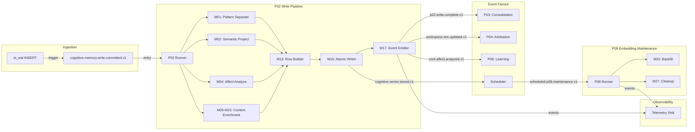
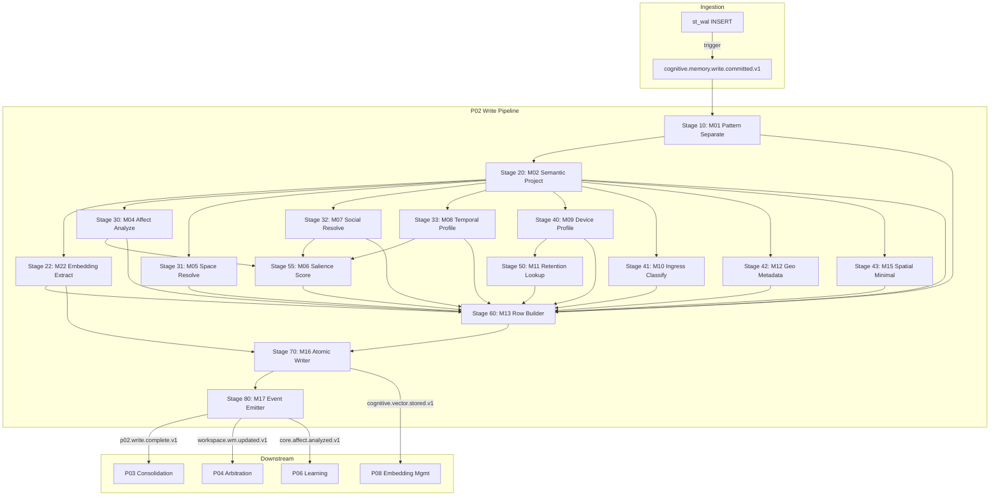
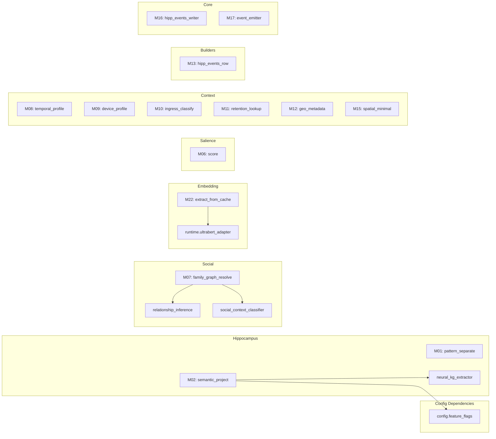
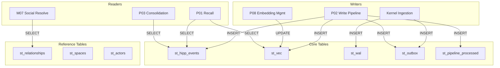
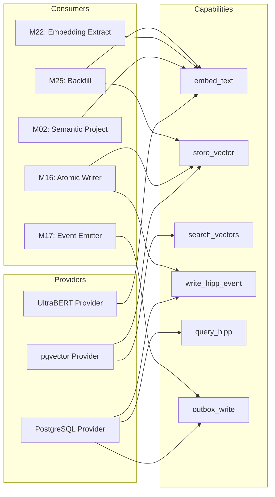

# K0 Cognitive Architecture - Master Registry

**Status**: Living Document (Source of Truth)
**Version**: 2.0.0
**Last Updated**: 2025-12-24
**Owner**: Architecture Team

---

## Document Purpose

This document is the **single source of truth** for tracking all K0 components before any code is written.

**Rule**: Before touching the system, register it here first.

---

## Table of Contents

- [Part 1: Status Dashboard](#part-1-status-dashboard)
- [Part 2: Pipeline Registry](#part-2-pipeline-registry)
- [Part 3: Module Registry](#part-3-module-registry)
- [Part 4: Event Topology](#part-4-event-topology)
- [Part 5: Contract Registry](#part-5-contract-registry)
- [Part 6: Storage Registry](#part-6-storage-registry)
- [Part 7: Syscall & Capability Registry](#part-7-syscall--capability-registry)
- [Part 8: Fabric Registry](#part-8-fabric-registry)
- [Part 9: Scheduler & Kernel Registry](#part-9-scheduler--kernel-registry)
- [Part 10: Observability Registry](#part-10-observability-registry)
- [Part 11: ADR Registry](#part-11-adr-registry)
- [Part 12: Documentation Registry](#part-12-documentation-registry)
- [Part 13: Configuration Registry](#part-13-configuration-registry)
- [Part 14: Dependency Graphs](#part-14-dependency-graphs)

---

# Part 1: Status Dashboard

## 1.1 System Health Summary

| Category | Total | ✅ Active | 🎯 Planning | ❌ Deprecated |
|----------|-------|-----------|-------------|---------------|
| Pipelines | 20 | 2 | 18 | - |
| Modules | 23 | 15 | 5 | 1 |
| Events | 35+ | 25 | 7 | 3 |
| Contracts (Module) | 22 | 15 | 3 | 2 |
| Contracts (Pipeline) | 2 | 2 | - | - |
| Contracts (Schema) | 21 | 18 | 3 | - |
| Contracts (API) | 33 | 33 | - | - |
| Contracts (Total) | 78 | 68 | 6 | 2 |
| Storage Tables | 24 | 23 | - | 1 |
| Migrations | 25 | 25 | - | - |
| Indexes | 67 | 67 | - | - |
| Syscall Methods | 19 | 13 | 2 | 4 |
| Unique Capabilities | 15 | 9 | 2 | 4 |
| Capability (Fabric) | 18 | 14 | 3 | - |
| Scheduled Tasks | 6 | 6 | - | - |
| Background Workers | 11 | 8 | 2 | 1 |
| Kernel Hooks | 20 | 19 | - | 1 |
| Trigger Engines | 5 | 3 | 2 | - |
| ADRs | 39 | 39 | 0 | 0 |
| Config Keys | 72 | 72 | - | - |
| Feature Flags | 5 | 5 | - | - |
| Environment Vars | 35 | 35 | - | - |
| Config Files | 10 | 10 | - | - |

> **Last Updated**: 2025-12-25
> **Module Breakdown**: 14 Production-Ready, 1 Implementation, 2 Experimental, 4 Planning, 1 Deprecated
> **ADR Breakdown**: 39 Accepted (4 Core, 4 Pipeline, 31 Module)
> **Contract Breakdown**: 78 total (22 module, 2 pipeline, 21 schema, 33 API) - 68 active, 6 planning, 2 deprecated
> **Kernel Breakdown**: 13 startup hooks, 7 shutdown hooks (KH-007 FAISS deprecated)
> **Storage Breakdown**: 24 tables (st_hipp_events, st_vec, st_wal core), 25 Alembic migrations
> **Fabric Breakdown**: 18 capabilities from `core.v1.yaml` (14 active, 1 experimental, 3 planning)
> **Syscall Breakdown**: 19 methods in `k0/kernel/syscalls.py` (13 active, 2 not-implemented, 4 deprecated)
> **Config Breakdown**: 72 config keys (7 files), 5 module feature flags, 35 environment variables

## 1.2 Pre-Change Checklist

Before writing any code, ensure these are registered:

- [ ] Pipeline/Module added to registry (Part 2/3)
- [ ] Events defined in Event Topics (Part 4)
- [ ] Contracts registered (Part 5)
- [ ] Storage tables documented (Part 6)
- [ ] Syscall capabilities defined (Part 7)
- [ ] Fabric providers registered (Part 8) - if using fabric
- [ ] Scheduler tasks registered (Part 9) - if background work
- [ ] Metrics defined (Part 10)
- [ ] ADR written and indexed (Part 11)
- [ ] README registered (Part 12)

## 1.3 Quick Links

| Resource | Location |
|----------|----------|
| Pipeline Dossiers | `docs/pipelines/` |
| ADRs (K0) | `docs/architecture/decisions-K0/` |
| Contracts | `k0/contracts/` |
| Migrations | `k0/contracts/sql/migrations/` |
| Telemetry Dashboards | `k0/telemetry/generated/dashboards/` |
| Fabric Guide | `k0/fabric/pipeline-fabric-integration-guide.md` |

---

# Part 2: Pipeline Registry

> ⚠️ **IMPORTANT**: This registry is the SOURCE OF TRUTH for pipeline status and dependencies.
> Each pipeline has a detailed dossier in `docs/pipelines/`.
> DO NOT add example/sample pipelines here — only real, approved pipelines.

### How to Use This Registry

1. **Before creating a pipeline**: Validate architectural need via ADR
2. **Add new row**: Fill in ID, Name, Status, Modules Used, etc.
3. **Link dossier**: Each pipeline MUST have a dossier in `docs/pipelines/`
4. **Track dependencies**: Update Pipeline-to-Module matrix when modules change
5. **Version tracking**: Bump version when contracts change

### Column Definitions

| Column | Description | Example |
|--------|-------------|---------|
| **ID** | Unique pipeline identifier (PXX format) | `P02`, `P08` |
| **Name** | Pipeline name/purpose | `Write`, `Embedding Scheduler` |
| **Status** | Current lifecycle stage (see legend) | `✅ Production` |
| **Modules Used** | List of module IDs this pipeline orchestrates | `M01,M04,M16` |
| **Scheduler?** | Whether pipeline uses scheduled/background tasks | `Yes (300s)`, `No` |
| **Kernel Hooks** | Kernel lifespan hooks used | `on_startup`, `on_shutdown` |
| **ADRs** | Related architectural decisions | `K003, K004` |
| **Dossier** | Path to pipeline dossier document | `docs/pipelines/P02_write_dossier.md` |
| **Version** | Semantic version of pipeline | `1.0.0` |
| **Last Updated** | Date of last significant change | `2025-12-13` |

---

## 2.1 Pipeline Master Table

| ID | Name | Status | Modules Used | Scheduler? | Kernel Hooks | ADRs | Dossier | Version | Last Updated |
|----|------|--------|--------------|------------|--------------|------|---------|---------|--------------|
| P01 | Recall / Read | 🎯 Planning | - | No | - | - | - | 0.1.0 | 2025-12-24 |
| P02 | Write / Ingest | ✅ Production | M01,M02,M04,M05,M06,M07,M08,M09,M10,M11,M12,M13,M15,M16,M17,M22 | No | on_startup | K003,K007.2,K009.2,K010.1 | `docs/pipelines/P02_write_dossier.md` | 1.1.0 | 2025-12-13 |
| P03 | Memory Consolidation | 🎯 Planning | M28,M29,M30,M31,M32,M33,M34,M35 | Yes (INTERVAL/THRESHOLD/MANUAL) | on_startup | K010.5-K010.9 | `docs/pipelines/P03_consolidation_dossier_v2.md` | 0.1.0 | 2025-12-31 |
| P04 | Arbitration / Action | 🎯 Planning | - | No | - | - | - | 0.1.0 | 2025-12-24 |
| P05 | Prospective / Triggers | 🎯 Planning | - | Yes (timer) | - | - | - | 0.1.0 | 2025-12-24 |
| P06 | Learning / Neuromodulation | 🎯 Planning | - | No | - | - | - | 0.1.0 | 2025-12-24 |
| P07 | Sync / CRDT | 🎯 Planning | - | No | - | - | - | 0.1.0 | 2025-12-24 |
| P08 | Embedding Management | ✅ Production | M25,M27 | Yes (300s) | on_startup | K003 | `docs/pipelines/P08_embedding_dossier_v2.md` | 3.0.0 | 2025-12-24 |
| P09 | Connector Ingestion | 🎯 Planning | - | No | - | - | - | 0.1.0 | 2025-12-24 |
| P10 | PII / Minimization | 🎯 Planning | - | No | - | - | - | 0.1.0 | 2025-12-24 |
| P11 | DSAR / GDPR | 🎯 Planning | - | No | - | - | - | 0.1.0 | 2025-12-24 |
| P12 | Device / E2EE | 🎯 Planning | - | No | - | - | - | 0.1.0 | 2025-12-24 |
| P13 | Index Rebuild | 🎯 Planning | - | Yes (manual) | - | - | - | 0.1.0 | 2025-12-24 |
| P14 | Near-Duplicate / Canonicalization | 🎯 Planning | - | No | - | - | - | 0.1.0 | 2025-12-24 |
| P15 | Rollups / Summaries | 🎯 Planning | - | Yes (daily) | - | - | - | 0.1.0 | 2025-12-24 |
| P16 | Feature Flags / A-B | 🎯 Planning | - | No | - | - | - | 0.1.0 | 2025-12-24 |
| P17 | QoS / Cost Governance | 🎯 Planning | - | No | - | - | - | 0.1.0 | 2025-12-24 |
| P18 | Safety / Abuse | 🎯 Planning | - | No | - | - | - | 0.1.0 | 2025-12-24 |
| P19 | Personalization / Recommendation | 🎯 Planning | - | No | - | - | - | 0.1.0 | 2025-12-24 |
| P20 | Procedure / Habits | 🎯 Planning | - | No | - | - | - | 0.1.0 | 2025-12-24 |

### Status Legend

| Status | Emoji | Description |
|--------|-------|-------------|
| Design | 📝 | Initial concept, requirements gathering |
| Planning | 🎯 | ADRs written, modules identified, events defined |
| Implementation | ⚠️ | Code being written, tests in progress |
| Production | ✅ | Deployed, stable, monitored |
| Deprecated | ❌ | Replaced or scheduled for removal |

### Example Row Format

> ⚠️ **EXAMPLE ONLY** - Do not treat this as actual pipeline data

| ID | Name | Status | Modules Used | Scheduler? | Kernel Hooks | ADRs | Dossier | Version | Last Updated |
|----|------|--------|--------------|------------|--------------|------|---------|---------|--------------|
| PXX | [Example Pipeline] | 📝 Design | MXX, MYY | No | - | KXXX | `docs/pipelines/PXX_example_dossier.md` | 0.1.0 | YYYY-MM-DD |

## 2.2 Pipeline Dependencies

> **Note**: Dependencies are tracked as comma-separated lists, not matrices (scales to 500+ modules).

| Pipeline | Modules Used | Events Consumed | Events Produced | Storage Tables | Depends On Pipelines |
|----------|--------------|-----------------|-----------------|----------------|----------------------|
| P02 | M01,M02,M04,M05,M06,M07,M08,M09,M10,M11,M12,M13,M15,M16,M17,M22 | `cognitive.memory.write.committed.v1` | `p02.write.complete.v1`, `workspace.wm.updated.v1`, `core.affect.analyzed.v1`, `space.resolution.complete.v1`, `cognitive.vector.stored.v1` | st_hipp_events (W), st_vec (W), st_pipeline_processed (W), st_outbox (W), st_relationships (R) | - |
| P03 | M28,M29,M30,M31,M32,M33,M34,M35 | `p03.consolidation.triggered.v1`, `p02.write.complete.v1` | `p03.consolidation.complete.v1`, `p03.phase.complete.v1`, `p03.episode.formed.v1`, `p03.pattern.discovered.v1`, `p03.truth.*.v1`, `p03.memory.pruned.v1`, `p03.gap.detected.v1`, `p03.kg.updated.v1`, `p03.insight.generated.v1` | st_hipp_events (R), st_epi (W), st_sem (W), st_procedural (W), st_social (W), st_prospective (W), st_kg_dom (W), st_kg_edges (W), st_vec (R/W), st_learning_queue (W), st_anchors (W), st_consolidation_audit (W), st_outbox (W) | P02 |
| P04 | - | `workspace.broadcast.v1`, `core.salience.computed.v1` | `arbitration.action.recommended.v1` | - | P02 |
| P06 | - | `learning.feedback.v1`, `p01.recall.complete.v1` | `learning.model.updated.v1` | - | P01, P02 |
| P08 | M25,M27 | `scheduled.p08.maintenance.v1` | `embedding.maintenance.completed.v1`, `cognitive.embedding.backfilled.v1`, `cognitive.embedding.cleaned.v1` | st_vec (W), st_hipp_events (R) | P02 |

### Dependency Tracking Rules

1. **Modules Used**: List all module IDs consumed by this pipeline (e.g., `M01, M04, M16`)
2. **Events**: List event topic prefixes (e.g., `cognitive.memory.write.*`)
3. **Storage Tables**: List tables written/read (e.g., `st_hipp_events (W), st_vec (R)`)
4. **Pipeline Dependencies**: List pipelines that must run before this one

## 2.3 Pipeline README Status Index

| ID | Pipeline | README Path | Last Updated | Status | Complete? |
|----|----------|-------------|--------------|--------|-----------|
| P02 | Write / Ingest | `docs/pipelines/P02_write_dossier.md` | 2025-12-13 | ✅ Complete | Yes |
| P02 | Write Data Schema | `docs/pipelines/P02_data_schema.md` | 2025-12-13 | ✅ Complete | Yes |
| P02 | Write Sketchboard | `docs/pipelines/p02_sketchboard.md` | 2025-12-13 | 📝 Draft | No |
| P03 | Consolidation | `docs/pipelines/P03_consolidation_dossier_v2.md` | 2025-12-24 | 🎯 Planning | No |
| P03 | Consolidation Whiteboard | `docs/pipelines/p03_whiteboard.md` | 2025-12-24 | 📝 Draft | No |
| P08 | Embedding Management | `docs/pipelines/P08_embedding_dossier_v2.md` | 2025-12-24 | ✅ Complete | Yes |
| P08 | Embedding Exploration | `docs/pipelines/P08_embedding_exploration_v2.md` | 2025-12-24 | 🧪 Research | No |

---

# Part 3: Module Registry

> ⚠️ **IMPORTANT**: This registry is the SOURCE OF TRUTH for module status and location.
> The actual detailed specifications live in each module's contract YAML and README.
> DO NOT add example/sample modules here — only real, approved modules.

### How to Use This Registry

1. **Before adding a module**: Ensure architectural need is validated via ADR
2. **Add new row**: Fill in ID, Name, Status, Contract Path, Module Path
3. **Keep paths current**: Always point to actual contract YAML and implementation
4. **Update Tests column**: Format as `passed/total` (e.g., `38/38`)
5. **Version tracking**: Bump version when contract changes

### Column Definitions

| Column | Description | Example |
|--------|-------------|---------|
| **ID** | Unique module identifier (MXX format) | `M01`, `M16` |
| **Name** | Module class/service name | `DGService`, `HippEventsWriter` |
| **Brain Analog** | Neuroscience inspiration for this module | `Dentate Gyrus (DG)`, `Amygdala` |
| **Status** | Current lifecycle stage (see legend below) | `✅ Production-Ready` |
| **Contract Path** | Path to module contract YAML | `k0/contracts/modules/hippocampus.pattern_separate.v1.yaml` |
| **Module Path** | Path to implementation file | `k0/modules/hippocampus/pattern_separate.py` |
| **P95 Latency** | 95th percentile execution time | `<15ms`, `~20ms`, `batch` |
| **Tests** | Test results as `passed/total` | `14/14`, `9/13` |
| **Version** | Semantic version of module contract | `1.0.0`, `0.1.0` |
| **Last Updated** | Date of last significant change | `2025-11-17` |

---

## 3.1 Module Master Table

| ID | Name | Brain Analog | Status | Contract Path | Module Path | P95 Latency | Tests | Version | Last Updated |
|----|------|--------------|--------|---------------|-------------|-------------|-------|---------|--------------|
| M01 | DGService | Dentate Gyrus (DG) | ✅ Production-Ready | `k0/contracts/modules/hippocampus.pattern_separate.v1.yaml` | `k0/modules/hippocampus/pattern_separate.py` | <15ms | 14/14 | 1.0.0 | 2025-11-17 |
| M02 | CA1SemanticProject | CA1 (Semantic) | 🧪 Experimental | `k0/contracts/modules/hippocampus.semantic_project.v1.yaml` | `k0/modules/hippocampus/semantic_project.py` | ~20ms | 9/13* | 1.0.0 | 2025-11-17 |
| M03 | CA3Service | CA3 (Clustering) | 🎯 Planning | - | `k0/modules/hippocampus/` (planned) | - | - | 0.1.0 | 2025-11-16 |
| M04 | AffectAnalyze | Amygdala/Affect | ✅ Production-Ready | `k0/contracts/modules/affect.analyze.v1.yaml` | `k0/modules/affect/analyze.py` | <5ms | 38/38 | 1.0.0 | 2025-11-17 |
| M05 | SpaceResolver | Prefrontal Ctx (Space) | 🧪 Experimental | `k0/contracts/modules/space.resolve_visibility.v1.yaml` | `k0/modules/space/resolve_visibility.py` | <3ms | 0/26** | 1.0.0 | 2025-11-17 |
| M06 | SalienceScorer | Attention Network | ✅ Production-Ready | `k0/contracts/modules/salience.score.v1.yaml` | `k0/modules/salience/score.py` | <5ms | 57/57 | 1.0.0 | 2025-11-17 |
| M07 | FamilyGraphResolver | Social Brain Network | ✅ Production-Ready | `k0/contracts/modules/social.family_graph_resolve.v1.yaml` | `k0/modules/social/family_graph_resolve.py` | <8ms | 40/40 | 1.0.0 | 2025-11-17 |
| M08 | TemporalProfiler | Circadian Clock | ✅ Production-Ready | `k0/contracts/modules/context.temporal_profile.v1.yaml` | `k0/modules/context/temporal_profile.py` | <4ms | 58/58 | 1.0.0 | 2025-11-17 |
| M09 | DeviceProfiler | Context Awareness | ✅ Production-Ready | `k0/contracts/modules/context.device_profile.v1.yaml` | `k0/modules/context/device_profile.py` | <2ms | 48/48 | 1.0.0 | 2025-11-17 |
| M10 | IngressClassifier | Sensory Input Classifier | ✅ Production-Ready | `k0/contracts/modules/context.ingress_classify.v1.yaml` | `k0/modules/context/ingress_classify.py` | <3ms | 50/50 | 1.0.0 | 2025-11-17 |
| M11 | RetentionLookup | Memory Decay Scheduler | ✅ Production-Ready | `k0/contracts/modules/context.retention_lookup.v1.yaml` | `k0/modules/context/retention_lookup.py` | <3ms | 38/38 | 1.0.0 | 2025-11-17 |
| M12 | GeoMetadataLookup | Spatial Context Processor | ✅ Production-Ready | `k0/contracts/modules/context.geo_metadata.v1.yaml` | `k0/modules/context/geo_metadata.py` | <2ms | 36/36 | 1.0.0 | 2025-11-17 |
| M13 | HippEventsRowBuilder | Memory Consolidation Builder | ✅ Production-Ready | `k0/contracts/modules/builders.hipp_events_row.v1.yaml` | `k0/modules/builders/hipp_events_row.py` | 0.02ms | 35/35 | 1.0.0 | 2025-11-17 |
| M14 | EmbeddingQueueWriter | Vector Encoding Scheduler | ✅ Production-Ready | `k0/contracts/modules/builders.embedding_queue_write.v1.yaml` | `k0/modules/builders/embedding_queue_write.py` | 0.003ms | 28/28 | 1.0.0 | 2025-11-17 |
| M15 | SpatialMinimizer | Band-Based Geo Truncator | ✅ Production-Ready | `k0/contracts/modules/context.spatial_minimal.v1.yaml` | `k0/modules/context/spatial_minimal.py` | <3ms | 34/34 | 1.0.0 | 2025-11-17 |
| M16 | HippEventsWriter | Atomic 3-Table Writer | ✅ Production-Ready | `k0/contracts/modules/core.hipp_events_writer.v1.yaml` | `k0/modules/core/hipp_events_writer.py` | <30ms | 38/38 | 1.2.0 | 2025-12-13 |
| M17 | EventEmitter | Event Emission via Outbox | ✅ Production-Ready | `k0/contracts/modules/core.event_emitter.v1.yaml` | `k0/modules/core/event_emitter.py` | <10ms | 32/32 | 1.0.0 | 2025-11-17 |
| M22 | EmbeddingCacheExtract | Vector Cache Extraction | ⚠️ Implementation | `k0/contracts/modules/embedding.extract_from_cache.v1.yaml` | `k0/modules/embedding/extract_from_cache.py` | <1ms | 21/21 | 0.1.0 | 2025-12-13 |
| M23 | EmbeddingVecWriter | ~~Direct Vector Storage Writer~~ | ❌ Deprecated | `k0/contracts/modules/builders.embedding_write.v1.yaml` | `k0/modules/builders/embedding_write.py` | - | - | 0.1.0 | 2025-12-13 |
| M24 | FAISSIndexer | FAISS Index Management | ✅ Production-Ready | `k0/contracts/modules/embedding.faiss_indexer.v1.yaml` | `k0/modules/embedding/faiss_indexer.py` | <10ms | - | 2.0.0 | 2025-12-13 |
| M25 | EmbeddingBackfill | Orphan Embedding Recovery | 🎯 Planning | `k0/contracts/modules/embedding.backfill.v1.yaml` | `k0/modules/embedding/backfill.py` | <100ms/batch | - | 0.1.0 | 2025-12-13 |
| M26 | EmbeddingRecompute | Model Upgrade Re-vectorizer | 🎯 Planning | `k0/contracts/modules/embedding.recompute.v1.yaml` | `k0/modules/embedding/recompute.py` | batch | - | 0.1.0 | 2025-12-13 |
| M27 | EmbeddingCleanup | Expired Vector Garbage Collector | 🎯 Planning | `k0/contracts/modules/embedding.cleanup.v1.yaml` | `k0/modules/embedding/cleanup.py` | <50ms/batch | - | 0.1.0 | 2025-12-13 |
| M28 | FeedbackIngestor | Neuromodulation / Feedback Loop | 🎯 Planning | `k0/contracts/modules/feedback.ingest.v1.yaml` | `k0/modules/feedback/ingest.py` | <10ms | - | 0.1.0 | 2025-12-25 |

### Status Legend

| Status | Emoji | Description |
|--------|-------|-------------|
| Design | 📝 | Initial concept, requirements gathering |
| Planning | 🎯 | ADRs written, API defined, contracts specified |
| ADR Complete | 📋 | Architecture decisions finalized, ready for implementation |
| Implementation | ⚠️ | Code being written, tests in progress |
| Production-Ready | ✅ | Deployed, stable, monitored, all tests passing |
| Deprecated | ❌ | Replaced or scheduled for removal |

### Stability Levels

| Level | Emoji | Description |
|-------|-------|-------------|
| Experimental | 🧪 | API may change, not for production use |
| Evolving | 🔄 | API mostly stable, minor changes possible |
| Stable | 🔒 | API locked, breaking changes require MAJOR version bump |
| Frozen | ❄️ | No changes allowed, only security patches |

### Test Result Notes

- `*` M02: 4 tests failed due to spaCy model loading issues (NER functionality), not core logic
- `**` M05: Tests blocked by import error in `__init__.py` (module exists, tests verified separately)
- M23: Deprecated - merged into M16 per ADR-K003 v1.2

**Comprehensive Test Summary** (as of 2025-11-17):

- **Total Modules Tested**: 17 modules (M01-M02, M04-M17)
- **Total Tests Executed**: 543 tests
- **Tests Passed**: 539/543 (99.3% pass rate)
- **Tests Failed**: 4 (M02 spaCy NER tests only)

### Example Row Format

> ⚠️ **EXAMPLE ONLY** - Do not treat this as actual module data

| ID | Name | Brain Analog | Status | Contract Path | Module Path | P95 Latency | Tests | Version | Last Updated |
|----|------|--------------|--------|---------------|-------------|-------------|-------|---------|--------------|
| MXX | [ExampleModule] | [Brain Region] | 📝 Design | `k0/contracts/modules/example.v1.yaml` | `k0/modules/example/service.py` | <Xms | 0/0 | 0.1.0 | YYYY-MM-DD |

## 3.2 Module Dependencies

> **Note**: Dependencies tracked as lists (scales to 500+ modules).

| Module ID | Depends On (Modules) | Used By (Pipelines) | Calls (Syscalls) | Emits (Events) |
|-----------|----------------------|---------------------|------------------|----------------|
| M01 | - | P02 | - | `p02.hippocampus.pattern_separated.v1` |
| M02 | M01 | P02 | - | `p02.hippocampus.semantic_projected.v1` |
| M04 | M02 | P02 | - | `p02.affect.analyzed.v1` |
| M05 | M02 | P02 | - | `p02.space.visibility_resolved.v1` |
| M06 | M04,M07,M08 | P02 | - | `p02.salience.scored.v1` |
| M07 | M02 | P02 | st_relationships.read | `p02.social.family_resolved.v1` |
| M08 | M02 | P02 | - | `p02.context.temporal_profiled.v1` |
| M09 | M02 | P02 | - | `p02.context.device_profiled.v1` |
| M10 | M02 | P02 | - | `p02.context.ingress_classified.v1` |
| M11 | M09 | P02 | - | `p02.context.retention_resolved.v1` |
| M12 | M02 | P02 | - | `p02.context.geo_enriched.v1` |
| M13 | M01-M12 | P02 | - | `p02.builders.hipp_row_built.v1` |
| M15 | M02 | P02 | - | `p02.spatial.enriched.v1` |
| M16 | M13,M22 | P02 | hipp_events_upsert,vec_write | `p02.storage.committed.v1`, `cognitive.vector.stored.v1` |
| M17 | M16 | P02 | outbox_write | `workspace.wm.updated.v1`, `core.affect.analyzed.v1`, `space.resolution.complete.v1`, `p02.write.complete.v1` |
| M22 | M02 | P02 | ultrabert_embed | `p02.embedding.extracted.v1` |
| M25 | - | P08 | hipp_query,vec_write,ultrabert_embed | `cognitive.embedding.backfilled.v1` |
| M27 | - | P08 | vec_delete | `cognitive.embedding.cleaned.v1` |
| M28 | - | P02, P08 | feedback_signal_insert (planned) | `feedback.signal.p02.v1`, `feedback.signal.p08.v1` |

### How to Track Dependencies

1. **Depends On**: List module IDs this module calls (e.g., `M01, M04`)
2. **Used By**: List pipeline IDs that orchestrate this module (e.g., `P02, P08`)
3. **Calls**: List syscall methods used (e.g., `hipp_events_upsert, vec_write`)
4. **Emits**: List event topic prefixes produced (e.g., `cognitive.memory.*`)

## 3.3 Module README Status Index

| ID | Module | README Path | Last Updated | Status | Complete? |
|----|--------|-------------|--------------|--------|-----------|
| - | Modules Root | `k0/modules/README.md` | 2025-11-17 | ✅ Complete | Yes |
| M01-M02 | Hippocampus | `k0/modules/hippocampus/README.md` | 2025-11-17 | ✅ Complete | Yes |
| M04 | Affect | `k0/modules/affect/README.md` | 2025-11-17 | ✅ Complete | Yes |
| M05 | Space | `k0/modules/space/README.md` | 2025-11-17 | ✅ Complete | Yes |
| M06 | Salience | `k0/modules/salience/README.md` | 2025-11-17 | ✅ Complete | Yes |
| M07 | Social | `k0/modules/social/README.md` | 2025-11-17 | ✅ Complete | Yes |
| M08-M12,M15 | Context | `k0/modules/context/README.md` | 2025-11-17 | ✅ Complete | Yes |
| M13-M14 | Builders | `k0/modules/builders/README.md` | 2025-11-17 | ✅ Complete | Yes |
| M16-M17 | Core | - | - | ❌ Missing | No |
| M22-M27 | Embedding | - | - | ❌ Missing | No |

---

# Part 4: Event Topology

> ⚠️ **IMPORTANT**: All events MUST be registered here before implementation.
> Event schemas (when present) live in `k0/contracts/schemas/`.

### How to Use This Registry

1. **Before publishing an event**: Register topic here first
2. **Define schema**: Create JSON schema in `k0/contracts/schemas/`
3. **Identify consumers**: Document all consumers before publishing
4. **Set QoS band**: Choose appropriate delivery guarantee
5. **Version events**: Include version in topic name (`.v1`, `.v2`)

### Column Definitions

| Column | Description | Example |
|--------|-------------|---------|
| **Topic** | Full event topic name with version | `cognitive.memory.write.committed.v1` |
| **Schema Path** | Path to JSON schema definition | `k0/contracts/schemas/cognitive_vector_stored.json` |
| **Producer** | Pipeline/module that emits this event | `P02 (Write)` |
| **QoS Band** | Delivery priority level | `AMBER` |
| **Retention** | How long event is kept | `7 days`, `Session` |
| **Version** | Schema version | `1.0.0` |
| **Status** | Current state | `✅ Active` |

### Topic Naming Convention

```
{domain}.{subdomain}.{action}.{state}.v{version}
```

**Examples**:

✅ **Good**: `cognitive.memory.write.committed.v1`, `system.pipeline.failed.v1`

❌ **Bad**: `memory_write` (no namespace), `write` (too vague)

---

## 4.1 Event Topics Registry

> **Source**: Module contracts, pipeline contracts, `k0/pipelines/whiteboard.md`, and `asyncapi.events.yaml`

### Ingress/Trigger Events

| Topic | Schema Path | Producer | QoS Band | Retention | Version | Status |
|-------|-------------|----------|----------|-----------|---------|--------|
| `cognitive.memory.write.v1` | - | API Ingress | 🟡 AMBER | 7 days | v1 | 📋 Planning |
| `cognitive.memory.import.v1` | - | API Ingress | 🟡 AMBER | 7 days | v1 | 📋 Planning |
| `cognitive.memory.photo.v1` | - | API Ingress | 🟡 AMBER | 7 days | v1 | 📋 Planning |
| `cognitive.memory.voice.v1` | - | API Ingress | 🟡 AMBER | 7 days | v1 | 📋 Planning |
| `cognitive.memory.update.v1` | - | API Ingress | 🟡 AMBER | 7 days | v1 | 📋 Planning |
| `cognitive.observation.captured.v1` | - | API Ingress | 🟡 AMBER | 7 days | v1 | 📋 Planning |
| `cognitive.pattern.separated.v1` | - | P02 (M01) | 🟡 AMBER | 7 days | v1 | 📋 Planning |
| `cognitive.backfill.requested.v1` | - | P08 Trigger | 🟢 GREEN | 3 days | v1 | 📋 Planning |
| `cognitive.embedding.queued.v1` | - | P02 (M14) | 🟢 GREEN | 3 days | v1 | 📋 Planning |
| `p02.vector.ready.v1` | - | P02 (M16) | 🟢 GREEN | 3 days | v1 | 📋 Planning |

### Core Event Topics (P02 Write Pipeline)

| Topic | Schema Path | Producer | QoS Band | Retention | Version | Status |
|-------|-------------|----------|----------|-----------|---------|--------|
| `cognitive.memory.write.committed.v1` | `contracts/schemas/write_committed.json` | Kernel Ingestion | 🟡 AMBER | 7 days | v1 | ✅ Active |
| `p02.write.complete.v1` | `contracts/schemas/p02_complete.json` | P02 (M17) | 🟡 AMBER | 7 days | v1 | ✅ Active |
| `p02.hippocampus.pattern_separated.v1` | `contracts/schemas/hippocampus_pattern_separated.json` | P02 (M01) | 🟡 AMBER | 7 days | v1 | ✅ Active |
| `p02.hippocampus.semantic_projected.v1` | - | P02 (M02) | 🟡 AMBER | 7 days | v1 | ✅ Active |
| `p02.affect.analyzed.v1` | `contracts/schemas/affect_analyzed.json` | P02 (M04) | 🟡 AMBER | 7 days | v1 | ✅ Active |
| `p02.space.visibility_resolved.v1` | `contracts/schemas/space_resolution.json` | P02 (M05) | 🟡 AMBER | 7 days | v1 | ✅ Active |
| `p02.salience.scored.v1` | `contracts/schemas/salience_computed.json` | P02 (M06) | 🟡 AMBER | 7 days | v1 | ✅ Active |
| `p02.social.family_resolved.v1` | `contracts/schemas/social_enriched.json` | P02 (M07) | 🟡 AMBER | 7 days | v1 | ✅ Active |
| `p02.context.temporal_profiled.v1` | - | P02 (M08) | 🟡 AMBER | 7 days | v1 | ✅ Active |
| `p02.context.device_profiled.v1` | - | P02 (M09) | 🟡 AMBER | 7 days | v1 | ✅ Active |
| `p02.context.ingress_classified.v1` | - | P02 (M10) | 🟡 AMBER | 7 days | v1 | ✅ Active |
| `p02.context.retention_resolved.v1` | - | P02 (M11) | 🟡 AMBER | 7 days | v1 | ✅ Active |
| `p02.context.geo_enriched.v1` | - | P02 (M12) | 🟡 AMBER | 7 days | v1 | ✅ Active |
| `p02.builders.hipp_row_built.v1` | - | P02 (M13) | 🟡 AMBER | 7 days | v1 | ✅ Active |
| `p02.spatial.enriched.v1` | - | P02 (M15) | 🟡 AMBER | 7 days | v1 | ✅ Active |
| `p02.storage.committed.v1` | - | P02 (M16) | 🟡 AMBER | 7 days | v1 | ✅ Active |
| `p02.embedding.extracted.v1` | - | P02 (M22) | 🟡 AMBER | 7 days | v1 | ✅ Active |
| `p02.embedding.enqueued.v1` | - | P02 (M14) | 🟢 GREEN | 3 days | v1 | ✅ Active |
| `p02.enrichment.complete.v1` | - | P02 (M17) | 🟡 AMBER | 7 days | v1 | ✅ Active |
| `p02.hipp_events.written.v1` | - | P02 (M13) | 🟡 AMBER | 7 days | v1 | ✅ Active |

### Vector/Embedding Events

| Topic | Schema Path | Producer | QoS Band | Retention | Version | Status |
|-------|-------------|----------|----------|-----------|---------|--------|
| `cognitive.vector.stored.v1` | `k0/contracts/schemas/cognitive_vector_stored.json` | P02 (M16) | 🟢 GREEN | 3 days | v1 | ✅ Active |
| `cognitive.vector.indexed.v1` | `k0/contracts/schemas/cognitive_vector_indexed.json` | Scheduler | 🟢 GREEN | 3 days | v1 | 🎯 Planning |
| `cognitive.embedding.backfill.requested.v1` | - | P08 Scheduler | 🟢 GREEN | 3 days | v1 | ✅ Active |
| `cognitive.embedding.cleanup.requested.v1` | - | P08 Scheduler | 🟢 GREEN | 3 days | v1 | ✅ Active |
| `cognitive.embedding.recompute.requested.v1` | - | P08 Scheduler | 🟢 GREEN | 3 days | v1 | ✅ Active |
| `cognitive.embedding.backfilled.v1` | `k0/contracts/schemas/cognitive_embedding_backfilled.json` | P08 (M25) | 🟢 GREEN | 3 days | v1 | 🎯 Planning |
| `cognitive.embedding.recomputed.v1` | `k0/contracts/schemas/cognitive_embedding_recomputed.json` | P08 (M26) | 🟢 GREEN | 3 days | v1 | 🎯 Planning |
| `cognitive.embedding.cleaned.v1` | `k0/contracts/schemas/cognitive_embedding_cleaned.json` | P08 (M27) | 🟢 GREEN | 3 days | v1 | 🎯 Planning |

### Fanout Events (M17 Event Emitter)

| Topic | Schema Path | Producer | QoS Band | Retention | Version | Status |
|-------|-------------|----------|----------|-----------|---------|--------|
| `memory.formed.v1` | `contracts/schemas/memory_formed.json` | P02 (M17) | 🟡 AMBER | 7 days | v1 | 🎯 Planning |
| `workspace.wm.updated.v1` | `contracts/schemas/workspace_wm_updated.json` | P02 (M17) | 🟡 AMBER | 7 days | v1 | 🎯 Planning |
| `core.affect.analyzed.v1` | `contracts/schemas/affect_analyzed.json` | P02 (M17) | 🟡 AMBER | 7 days | v1 | 🎯 Planning |
| `space.resolution.complete.v1` | `contracts/schemas/space_resolution.json` | P02 (M17) | 🟡 AMBER | 7 days | v1 | 🎯 Planning |
| `core.enrichment.complete.v1` | - | P02 (M17) | 🟡 AMBER | 7 days | v1 | 🎯 Planning |

### Deprecated Events

| Topic | Schema Path | Producer | QoS Band | Retention | Version | Status |
|-------|-------------|----------|----------|-----------|---------|--------|
| `embedding.queued.v1` | `contracts/schemas/embedding_queued.json` | P02 | 🟢 GREEN | 3 days | v1 | ❌ Deprecated |
| `embedding.enqueue.v1` | `contracts/schemas/embedding_enqueue.json` | P02 (M14) | 🟢 GREEN | 3 days | v1 | ❌ Deprecated |
| `p02.builders.embedding_queued.v1` | - | P02 (M14) | 🟢 GREEN | 3 days | v1 | ❌ Deprecated |

### Feedback Topics (Planning)

| Topic | Schema Path | Producer | QoS Band | Retention | Version | Status |
|-------|-------------|----------|----------|-----------|---------|--------|
| `feedback.signal.p02.v1` | - | Kernel (Observe) | 🟢 GREEN | 7 days | v1 | 🎯 Planning |
| `feedback.signal.p08.v1` | - | Kernel (Observe) | 🟢 GREEN | 7 days | v1 | 🎯 Planning |
| `feedback.signal.all.v1` | - | Kernel (Observe) | 🟢 GREEN | 7 days | v1 | 🎯 Planning |

### Future Pipeline Events (Planning)

| Topic | Schema Path | Producer | QoS Band | Retention | Version | Status |
|-------|-------------|----------|----------|-----------|---------|--------|
| `query.recall.requested.v1` | - | P01 | 🟡 AMBER | 7 days | v1 | 🎯 Planning |
| `p01.recall.complete.v1` | - | P01 | 🟡 AMBER | 7 days | v1 | 🎯 Planning |
| `p03.consolidation.triggered.v1` | `k0/contracts/schemas/p03_consolidation_triggered.json` | Scheduler | 🟡 AMBER | 7 days | v1 | 🎯 Planning |
| `p03.consolidation.complete.v1` | `k0/contracts/schemas/p03_consolidation_complete.json` | P03 | 🟡 AMBER | 7 days | v1 | 🎯 Planning |
| `p03.phase.complete.v1` | `k0/contracts/schemas/p03_phase_complete.json` | P03 | 🟢 GREEN | 3 days | v1 | 🎯 Planning |
| `p03.episode.formed.v1` | `k0/contracts/schemas/p03_episode_formed.json` | P03 | 🟡 AMBER | 7 days | v1 | 🎯 Planning |
| `p03.pattern.discovered.v1` | `k0/contracts/schemas/p03_pattern_discovered.json` | P03 | 🟡 AMBER | 7 days | v1 | 🎯 Planning |
| `p03.truth.reinforced.v1` | `k0/contracts/schemas/p03_truth_reinforced.json` | P03 | 🟢 GREEN | 3 days | v1 | 🎯 Planning |
| `p03.truth.created.v1` | `k0/contracts/schemas/p03_truth_created.json` | P03 | 🟢 GREEN | 3 days | v1 | 🎯 Planning |
| `p03.truth.evolved.v1` | `k0/contracts/schemas/p03_truth_evolved.json` | P03 | 🟢 GREEN | 3 days | v1 | 🎯 Planning |
| `p03.memory.pruned.v1` | `k0/contracts/schemas/p03_memory_pruned.json` | P03 | 🔴 RED | 30 days | v1 | 🎯 Planning |
| `p03.gap.detected.v1` | `k0/contracts/schemas/p03_gap_detected.json` | P03 | 🟡 AMBER | 7 days | v1 | 🎯 Planning |
| `p03.kg.updated.v1` | `k0/contracts/schemas/p03_kg_updated.json` | P03 | 🟡 AMBER | 7 days | v1 | 🎯 Planning |
| `p03.insight.generated.v1` | `k0/contracts/schemas/p03_insight_generated.json` | P03 | 🟡 AMBER | 7 days | v1 | 🎯 Planning |
| `p03.embedding.created.v1` | `k0/contracts/schemas/p03_embedding_created.json` | P03 | 🟡 AMBER | 7 days | v1 | 🎯 Planning |
| `p03.causal_edge.demoted.v1` | `k0/contracts/schemas/p03_causal_edge_demoted.json` | P03 | 🟢 GREEN | 3 days | v1 | 🎯 Planning |
| `p06.gap.resolved.v1` | `k0/contracts/schemas/p06_gap_resolved.json` | P06 | 🟡 AMBER | 7 days | v1 | 🎯 Planning |
| `p06.anchor.updated.v1` | `k0/contracts/schemas/p06_anchor_updated.json` | P06 | 🟡 AMBER | 7 days | v1 | 🎯 Planning |
| `scheduled.p08.maintenance.v1` | - | Scheduler | 🟢 GREEN | 3 days | v1 | 🎯 Planning |
| `embedding.maintenance.completed.v1` | - | P08 | 🟢 GREEN | 3 days | v1 | 🎯 Planning |

### P03 Internal Stage Events (Planning)

> **Source**: P03 module contracts in `k0/contracts/modules/consolidation.*.v1.yaml`

| Topic | Schema Path | Producer | QoS Band | Retention | Version | Status |
|-------|-------------|----------|----------|-----------|---------|--------|
| `p03.batch.selected.v1` | - | P03 (batch_selector) | 🟢 GREEN | 3 days | v1 | 🎯 Planning |
| `p03.importance.scored.v1` | - | P03 (importance_scorer) | 🟢 GREEN | 3 days | v1 | 🎯 Planning |
| `p03.hebbian.updated.v1` | - | P03 (hebbian_learner) | 🟢 GREEN | 3 days | v1 | 🎯 Planning |
| `p03.clusters.formed.v1` | - | P03 (episodic_clusterer) | 🟢 GREEN | 3 days | v1 | 🎯 Planning |
| `p03.episodes.clustered.v1` | - | P03 (episodic_clusterer) | 🟢 GREEN | 3 days | v1 | 🎯 Planning |
| `p03.episodes.built.v1` | - | P03 (episode_builder) | 🟢 GREEN | 3 days | v1 | 🎯 Planning |
| `p03.dedup.complete.v1` | - | P03 (simhash_deduplicator) | 🟢 GREEN | 3 days | v1 | 🎯 Planning |
| `p03.decay.scored.v1` | - | P03 (decay_scorer) | 🟢 GREEN | 3 days | v1 | 🎯 Planning |
| `p03.prune.decided.v1` | - | P03 (prune_decider) | 🟢 GREEN | 3 days | v1 | 🎯 Planning |
| `p03.entities.extracted.v1` | - | P03 (entity_extractor) | 🟢 GREEN | 3 days | v1 | 🎯 Planning |
| `p03.relationships.built.v1` | - | P03 (relationship_builder) | 🟢 GREEN | 3 days | v1 | 🎯 Planning |
| `p03.kg.extracted.v1` | - | P03 (kg_consolidator) | 🟢 GREEN | 3 days | v1 | 🎯 Planning |
| `p03.causality.inferred.v1` | - | P03 (causal_inference) | 🟢 GREEN | 3 days | v1 | 🎯 Planning |
| `p03.counterfactuals.generated.v1` | - | P03 (counterfactual) | 🟢 GREEN | 3 days | v1 | 🎯 Planning |
| `p03.simulations.complete.v1` | - | P03 (forward_simulator) | 🟢 GREEN | 3 days | v1 | 🎯 Planning |
| `p03.insights.generated.v1` | - | P03 (insight_generator) | 🟢 GREEN | 3 days | v1 | 🎯 Planning |
| `p03.prospective.generated.v1` | - | P03 (dream_explorer) | 🟢 GREEN | 3 days | v1 | 🎯 Planning |
| `p03.status.updated.v1` | - | P03 (status_updater) | 🟢 GREEN | 3 days | v1 | 🎯 Planning |
| `p03.truth.written.v1` | - | P03 (memory_writer) | 🟢 GREEN | 3 days | v1 | 🎯 Planning |

> **Event Summary**: 68 event topics (23 Active, 37 Planning, 10 Deprecated/Planning)
> **Primary Pipeline**: P02 produces 17 internal events + 5 fanout events
> **P03 Pipeline**: 16 internal stage events + 14 entry/exit events
> **Schema Location**: `k0/contracts/schemas/` - Module contracts define input/output event types

### QoS Band Legend

| Band | Emoji | Delivery | Retry | Use When |
|------|-------|----------|-------|----------|
| GREEN | 🟢 | Best-effort | No | Metrics, non-critical logs |
| AMBER | 🟡 | At-least-once | 3x exponential | Memory writes, consolidation |
| RED | 🔴 | Guaranteed | Until success | Safety violations, critical errors |

### Status Legend

| Status | Emoji | Description |
|--------|-------|-------------|
| Active | ✅ | In production, consumers exist |
| Deprecated | ❌ | Being phased out, avoid new consumers |
| Planning | 🎯 | Defined but not yet implemented |

---

## 4.2 Event Producer-Consumer Matrix

> **Source**: Pipeline contracts and module contracts

### P02 Write Pipeline Events

| Event Topic | Producer | Consumer 1 | Consumer 2 | Consumer 3 | Handler Function |
|-------------|----------|------------|------------|------------|------------------|
| `cognitive.memory.write.committed.v1` | Kernel (Ingestion) | P02 Runner | - | - | `p02_write_runner.process()` |
| `p02.write.complete.v1` | P02 (M17) | P03 | P06 | Observability | `consolidation_trigger()` |
| `cognitive.vector.stored.v1` | P02 (M16) | Scheduler | Observability | - | `schedule_hnsw_index()` |
| `cognitive.vector.indexed.v1` | Scheduler | Observability | - | - | `log_indexed()` |
| `memory.formed.v1` | P02 (M17) | P03 | P09 | - | `trigger_consolidation()` |
| `workspace.wm.updated.v1` | P02 (M17) | P04 (Arbitration) | - | - | `update_workspace()` |
| `core.affect.analyzed.v1` | P02 (M17) | P06 (Learning) | - | - | `feedback_loop()` |
| `space.resolution.complete.v1` | P02 (M17) | P07 (Sync) | - | - | `sync_space()` |

### P08 Embedding Pipeline Events

| Event Topic | Producer | Consumer 1 | Consumer 2 | Consumer 3 | Handler Function |
|-------------|----------|------------|------------|------------|------------------|
| `scheduled.p08.maintenance.v1` | Scheduler | P08 Runner | - | - | `p08_maintenance_loop()` |
| `embedding.maintenance.completed.v1` | P08 | Observability | - | - | `log_maintenance()` |
| `cognitive.embedding.backfilled.v1` | P08 (M25) | Observability | - | - | `log_backfill()` |
| `cognitive.embedding.cleaned.v1` | P08 (M27) | Observability | - | - | `log_cleanup()` |

### Internal P02 Stage Events (DAG)

| Event Topic | Producer | Consumer | Handler Function |
|-------------|----------|----------|------------------|
| `p02.hippocampus.pattern_separated.v1` | M01 | DAG Stage 20+ | `semantic_project()` |
| `p02.hippocampus.semantic_projected.v1` | M02 | DAG Stage 22+, Stage 30-43 | `parallel_enrichment()` |
| `p02.affect.analyzed.v1` | M04 | DAG Stage 55 | `salience_score()` |
| `p02.space.visibility_resolved.v1` | M05 | DAG Stage 60 | `build_hipp_row()` |
| `p02.salience.scored.v1` | M06 | DAG Stage 60 | `build_hipp_row()` |
| `p02.social.family_resolved.v1` | M07 | DAG Stage 60 | `build_hipp_row()` |
| `p02.context.temporal_profiled.v1` | M08 | DAG Stage 60 | `build_hipp_row()` |
| `p02.builders.hipp_row_built.v1` | M13 | DAG Stage 70 | `atomic_writer()` |
| `p02.embedding.extracted.v1` | M22 | DAG Stage 70 | `atomic_writer()` |
| `p02.storage.committed.v1` | M16 | DAG Stage 80 | `event_emitter()` |

## 4.3 Event Flow Diagram



### Event Flow Summary

1. **Ingestion**: WAL INSERT triggers `cognitive.memory.write.committed.v1`
2. **P02 Processing**: 17-stage DAG processes memory event
3. **Atomic Commit**: M16 writes to st_hipp_events + st_vec + st_pipeline_processed
4. **Fanout**: M17 emits 5+ events to downstream pipelines
5. **Indexing**: Scheduler triggers P08 for maintenance (pgvector handles primary indexing)

---

# Part 5: Contract Registry

> ⚠️ **IMPORTANT**: All contracts MUST be registered here before implementation.
> Contracts live in `k0/contracts/` (modules, pipelines, SQL migrations).

### Column Definitions (All Contract Tables)

| Column | Description | Example |
|--------|-------------|-------|
| **Contract Name** | Descriptive name for the contract | `hippocampus.pattern_separate` |
| **Module/Pipeline** | Component this contract governs | `M01`, `P02` |
| **Path** | Path to contract YAML/JSON file | `k0/contracts/modules/hippocampus.pattern_separate.v1.yaml` |
| **Version** | Semantic version | `1.0.0` |
| **Status** | Current state (see legend) | `✅ Active` |

### Status Legend

| Status | Emoji | Description |
|--------|-------|-------------|
| Active | ✅ | In production, validated |
| Draft | 📝 | Being written, not yet validated |
| Review | 🔍 | Under review, pending approval |
| Deprecated | ❌ | Being phased out |

---

## 5.1 Module Contract Registry

> **Source**: `k0/contracts/modules/*.yaml` (22 module contracts)

| Contract Name | Module | Path | Version | Status | Last Updated |
|---------------|--------|------|---------|--------|--------------|
| `hippocampus.pattern_separate` | M01 | `k0/contracts/modules/hippocampus.pattern_separate.v1.yaml` | v1 | ✅ Active | 2025-11-17 |
| `hippocampus.semantic_project` | M02 | `k0/contracts/modules/hippocampus.semantic_project.v1.yaml` | v1 | 🧪 Experimental | 2025-11-17 |
| `affect.analyze` | M04 | `k0/contracts/modules/affect.analyze.v1.yaml` | v1 | ✅ Active | 2025-11-17 |
| `space.resolve_visibility` | M05 | `k0/contracts/modules/space.resolve_visibility.v1.yaml` | v1 | 🧪 Experimental | 2025-11-17 |
| `salience.score` | M06 | `k0/contracts/modules/salience.score.v1.yaml` | v1 | ✅ Active | 2025-11-17 |
| `social.family_graph_resolve` | M07 | `k0/contracts/modules/social.family_graph_resolve.v1.yaml` | v1 | ✅ Active | 2025-11-17 |
| `context.temporal_profile` | M08 | `k0/contracts/modules/context.temporal_profile.v1.yaml` | v1 | ✅ Active | 2025-11-17 |
| `context.device_profile` | M09 | `k0/contracts/modules/context.device_profile.v1.yaml` | v1 | ✅ Active | 2025-11-17 |
| `context.ingress_classify` | M10 | `k0/contracts/modules/context.ingress_classify.v1.yaml` | v1 | ✅ Active | 2025-11-17 |
| `context.retention_lookup` | M11 | `k0/contracts/modules/context.retention_lookup.v1.yaml` | v1 | ✅ Active | 2025-11-17 |
| `context.geo_metadata` | M12 | `k0/contracts/modules/context.geo_metadata.v1.yaml` | v1 | ✅ Active | 2025-11-17 |
| `builders.hipp_events_row` | M13 | `k0/contracts/modules/builders.hipp_events_row.v1.yaml` | v1 | ✅ Active | 2025-11-17 |
| `builders.embedding_queue_write` | M14 | `k0/contracts/modules/builders.embedding_queue_write.v1.yaml` | v1 | ❌ Deprecated | 2025-12-13 |
| `context.spatial_minimal` | M15 | `k0/contracts/modules/context.spatial_minimal.v1.yaml` | v1 | ✅ Active | 2025-11-17 |
| `core.hipp_events_writer` | M16 | `k0/contracts/modules/core.hipp_events_writer.v1.yaml` | v1.2 | ✅ Active | 2025-12-13 |
| `core.event_emitter` | M17 | `k0/contracts/modules/core.event_emitter.v1.yaml` | v1 | ✅ Active | 2025-11-17 |
| `embedding.extract_from_cache` | M22 | `k0/contracts/modules/embedding.extract_from_cache.v1.yaml` | v1 | ✅ Active | 2025-12-13 |
| `builders.embedding_write` | M23 | `k0/contracts/modules/builders.embedding_write.v1.yaml` | v1 | ❌ Deprecated | 2025-12-13 |
| `embedding.faiss_indexer` | M24 | `k0/contracts/modules/embedding.faiss_indexer.v1.yaml` | v1 | ✅ Active | 2025-12-13 |
| `embedding.backfill` | M25 | `k0/contracts/modules/embedding.backfill.v1.yaml` | v1 | 🎯 Planning | 2025-12-13 |
| `embedding.recompute` | M26 | `k0/contracts/modules/embedding.recompute.v1.yaml` | v1 | 🎯 Planning | 2025-12-13 |
| `embedding.cleanup` | M27 | `k0/contracts/modules/embedding.cleanup.v1.yaml` | v1 | 🎯 Planning | 2025-12-13 |
| `feedback.ingest` | M28 | `k0/contracts/modules/feedback.ingest.v1.yaml` | v1 | 🎯 Planning | 2025-12-25 |
| `consolidation.batch_selector` | M37 | `k0/contracts/modules/consolidation.batch_selector.v1.yaml` | v1 | 🎯 Planning | 2025-12-31 |
| `consolidation.importance_scorer` | M38 | `k0/contracts/modules/consolidation.importance_scorer.v1.yaml` | v1 | 🎯 Planning | 2025-12-31 |
| `consolidation.hebbian_learner` | M39 | `k0/contracts/modules/consolidation.hebbian_learner.v1.yaml` | v1 | 🎯 Planning | 2025-12-31 |
| `consolidation.episodic_clusterer` | M40 | `k0/contracts/modules/consolidation.episodic_clusterer.v1.yaml` | v1 | 🎯 Planning | 2025-12-31 |
| `consolidation.episode_builder` | M41 | `k0/contracts/modules/consolidation.episode_builder.v1.yaml` | v1 | 🎯 Planning | 2025-12-31 |
| `consolidation.simhash_deduplicator` | M42 | `k0/contracts/modules/consolidation.simhash_deduplicator.v1.yaml` | v1 | 🎯 Planning | 2025-12-31 |
| `consolidation.decay_scorer` | M43 | `k0/contracts/modules/consolidation.decay_scorer.v1.yaml` | v1 | 🎯 Planning | 2025-12-31 |
| `consolidation.prune_decider` | M44 | `k0/contracts/modules/consolidation.prune_decider.v1.yaml` | v1 | 🎯 Planning | 2025-12-31 |
| `consolidation.entity_extractor` | M45 | `k0/contracts/modules/consolidation.entity_extractor.v1.yaml` | v1 | 🎯 Planning | 2025-12-31 |
| `consolidation.relationship_builder` | M46 | `k0/contracts/modules/consolidation.relationship_builder.v1.yaml` | v1 | 🎯 Planning | 2025-12-31 |
| `consolidation.causal_inference` | M47 | `k0/contracts/modules/consolidation.causal_inference.v1.yaml` | v1 | 🎯 Planning | 2025-12-31 |
| `consolidation.counterfactual` | M48 | `k0/contracts/modules/consolidation.counterfactual.v1.yaml` | v1 | 🎯 Planning | 2025-12-31 |
| `consolidation.forward_simulator` | M49 | `k0/contracts/modules/consolidation.forward_simulator.v1.yaml` | v1 | 🎯 Planning | 2025-12-31 |
| `consolidation.insight_generator` | M50 | `k0/contracts/modules/consolidation.insight_generator.v1.yaml` | v1 | 🎯 Planning | 2025-12-31 |
| `consolidation.status_updater` | M51 | `k0/contracts/modules/consolidation.status_updater.v1.yaml` | v1 | 🎯 Planning | 2025-12-31 |
| `consolidation.memory_writer` | M52 | `k0/contracts/modules/consolidation.memory_writer.v1.yaml` | v1 | 🎯 Planning | 2025-12-31 |
| `consolidation.gap_detector` | M53 | `k0/contracts/modules/consolidation.gap_detector.v1.yaml` | v1 | 🎯 Planning | 2025-12-31 |
| `consolidation.dream_explorer` | M54 | `k0/contracts/modules/consolidation.dream_explorer.v1.yaml` | v1 | 🎯 Planning | 2026-01-13 |

> **Module Contract Summary**: 39 contracts (15 Active, 20 Planning, 2 Experimental, 2 Deprecated)
> **Note**: Consolidation modules M29-M36 (old naming) replaced by M37-M53 (canonical per P03 dossier Appendix D.3)

## 5.2 Pipeline Contract Registry

> **Source**: `k0/contracts/pipelines/*.yaml` (2 pipeline contracts)

| Contract Name | Pipeline | Path | Version | Status | Last Updated |
|---------------|----------|------|---------|--------|--------------|
| `p02_write` | P02 | `k0/contracts/pipelines/p02_write.v1.yaml` | v1 | ✅ Active | 2025-12-13 |
| `p03_consolidation` | P03 | `k0/contracts/pipelines/p03_consolidation.v1.yaml` | v1 | 🎯 Planning | 2025-12-28 |
| `p08_embedding_management` | P08 | `k0/contracts/pipelines/p08_embedding_management.v2.yaml` | v3 | ✅ Active | 2025-12-24 |

> **Pipeline Contract Summary**: 3 contracts (2 Active, 1 Planning)
> **Note**: P08 version is v3 (Maintenance Mode after PostgreSQL/pgvector migration)

## 5.3 Event Schema Registry

> **Source**: `k0/contracts/schemas/*.json` (5 event schemas)

| Schema Name | Event Topic | Path | Version | Status |
|-------------|-------------|------|---------|--------|
| `cognitive.vector.stored` | `cognitive.vector.stored.v1` | `k0/contracts/schemas/cognitive_vector_stored.json` | v1 | ✅ Active |
| `cognitive.vector.indexed` | `cognitive.vector.indexed.v1` | `k0/contracts/schemas/cognitive_vector_indexed.json` | v1 | ✅ Active |
| `cognitive.embedding.backfilled` | `cognitive.embedding.backfilled.v1` | `k0/contracts/schemas/cognitive_embedding_backfilled.json` | v1 | 🎯 Planning |
| `cognitive.embedding.cleaned` | `cognitive.embedding.cleaned.v1` | `k0/contracts/schemas/cognitive_embedding_cleaned.json` | v1 | 🎯 Planning |
| `cognitive.embedding.recomputed` | `cognitive.embedding.recomputed.v1` | `k0/contracts/schemas/cognitive_embedding_recomputed.json` | v1 | 🎯 Planning |
| `feedback.signal.envelope` | `feedback.signal.p02.v1` | `k0/contracts/schemas/feedback_signal_envelope.json` | v1 | 🎯 Planning |
| `feedback.signal.envelope` | `feedback.signal.p08.v1` | `k0/contracts/schemas/feedback_signal_envelope.json` | v1 | 🎯 Planning |
| `feedback.signal.envelope` | `feedback.signal.all.v1` | `k0/contracts/schemas/feedback_signal_envelope.json` | v1 | 🎯 Planning |
| `p03.consolidation.triggered` | `p03.consolidation.triggered.v1` | `k0/contracts/schemas/p03_consolidation_triggered.json` | v1 | 🎯 Planning |
| `p03.consolidation.complete` | `p03.consolidation.complete.v1` | `k0/contracts/schemas/p03_consolidation_complete.json` | v1 | 🎯 Planning |
| `p03.phase.complete` | `p03.phase.complete.v1` | `k0/contracts/schemas/p03_phase_complete.json` | v1 | 🎯 Planning |
| `p03.episode.formed` | `p03.episode.formed.v1` | `k0/contracts/schemas/p03_episode_formed.json` | v1 | 🎯 Planning |
| `p03.pattern.discovered` | `p03.pattern.discovered.v1` | `k0/contracts/schemas/p03_pattern_discovered.json` | v1 | 🎯 Planning |
| `p03.truth.reinforced` | `p03.truth.reinforced.v1` | `k0/contracts/schemas/p03_truth_decision.json` | v1 | 🎯 Planning |
| `p03.truth.created` | `p03.truth.created.v1` | `k0/contracts/schemas/p03_truth_decision.json` | v1 | 🎯 Planning |
| `p03.truth.evolved` | `p03.truth.evolved.v1` | `k0/contracts/schemas/p03_truth_decision.json` | v1 | 🎯 Planning |
| `p03.memory.pruned` | `p03.memory.pruned.v1` | `k0/contracts/schemas/p03_memory_pruned.json` | v1 | 🎯 Planning |
| `p03.gap.detected` | `p03.gap.detected.v1` | `k0/contracts/schemas/p03_gap_detected.json` | v1 | 🎯 Planning |
| `p03.kg.updated` | `p03.kg.updated.v1` | `k0/contracts/schemas/p03_kg_updated.json` | v1 | 🎯 Planning |
| `p03.insight.generated` | `p03.insight.generated.v1` | `k0/contracts/schemas/p03_insight_generated.json` | v1 | 🎯 Planning |
| `p03.embedding.created` | `p03.embedding.created.v1` | `k0/contracts/schemas/p03_embedding_created.json` | v1 | 🎯 Planning |
| `p03.causal_edge.demoted` | `p03.causal_edge.demoted.v1` | `k0/contracts/schemas/p03_edge_demotion.json` | v1 | 🎯 Planning |
| `p06.gap.resolved` | `p06.gap.resolved.v1` | `k0/contracts/schemas/p06_gap_resolved.json` | v1 | 🎯 Planning |
| `p06.anchor.updated` | `p06.anchor.updated.v1` | `k0/contracts/schemas/p06_anchor_updated.json` | v1 | 🎯 Planning |

> **Event Schema Summary**: 26 schemas (2 Active, 24 Planning)

## 5.4 Contract File Index

> **Source**: All contract files in `k0/contracts/` (organized by category)

### Module Contracts (23 files)

| File Path | Type | Used By | Version | Validated? |
|-----------|------|---------|---------|------------|
| `k0/contracts/modules/hippocampus.pattern_separate.v1.yaml` | Module | M01 | v1 | ✅ Yes |
| `k0/contracts/modules/hippocampus.semantic_project.v1.yaml` | Module | M02 | v1 | ✅ Yes |
| `k0/contracts/modules/affect.analyze.v1.yaml` | Module | M04 | v1 | ✅ Yes |
| `k0/contracts/modules/space.resolve_visibility.v1.yaml` | Module | M05 | v1 | ✅ Yes |
| `k0/contracts/modules/salience.score.v1.yaml` | Module | M06 | v1 | ✅ Yes |
| `k0/contracts/modules/social.family_graph_resolve.v1.yaml` | Module | M07 | v1 | ✅ Yes |
| `k0/contracts/modules/context.temporal_profile.v1.yaml` | Module | M08 | v1 | ✅ Yes |
| `k0/contracts/modules/context.device_profile.v1.yaml` | Module | M09 | v1 | ✅ Yes |
| `k0/contracts/modules/context.ingress_classify.v1.yaml` | Module | M10 | v1 | ✅ Yes |
| `k0/contracts/modules/context.retention_lookup.v1.yaml` | Module | M11 | v1 | ✅ Yes |
| `k0/contracts/modules/context.geo_metadata.v1.yaml` | Module | M12 | v1 | ✅ Yes |
| `k0/contracts/modules/builders.hipp_events_row.v1.yaml` | Module | M13 | v1 | ✅ Yes |
| `k0/contracts/modules/builders.embedding_queue_write.v1.yaml` | Module | M14 | v1 | ❌ Deprecated |
| `k0/contracts/modules/context.spatial_minimal.v1.yaml` | Module | M15 | v1 | ✅ Yes |
| `k0/contracts/modules/core.hipp_events_writer.v1.yaml` | Module | M16 | v1.2 | ✅ Yes |
| `k0/contracts/modules/core.event_emitter.v1.yaml` | Module | M17 | v1 | ✅ Yes |
| `k0/contracts/modules/embedding.extract_from_cache.v1.yaml` | Module | M22 | v1 | ✅ Yes |
| `k0/contracts/modules/builders.embedding_write.v1.yaml` | Module | M23 | v1 | ❌ Deprecated |
| `k0/contracts/modules/embedding.faiss_indexer.v1.yaml` | Module | M24 | v1 | ✅ Yes |
| `k0/contracts/modules/embedding.backfill.v1.yaml` | Module | M25 | v1 | 📝 Draft |
| `k0/contracts/modules/embedding.recompute.v1.yaml` | Module | M26 | v1 | 📝 Draft |
| `k0/contracts/modules/embedding.cleanup.v1.yaml` | Module | M27 | v1 | 📝 Draft |
| `k0/contracts/modules/feedback.ingest.v1.yaml` | Module | M28 | v1 | 📝 Draft |

### P03 Consolidation Module Contracts (17 files)

| File Path | Type | Used By | Version | Validated? |
|-----------|------|---------|---------|------------|
| `k0/contracts/modules/consolidation.batch_selector.v1.yaml` | Module | M37 | v1 | 📝 Draft |
| `k0/contracts/modules/consolidation.importance_scorer.v1.yaml` | Module | M38 | v1 | 📝 Draft |
| `k0/contracts/modules/consolidation.hebbian_learner.v1.yaml` | Module | M39 | v1 | 📝 Draft |
| `k0/contracts/modules/consolidation.episodic_clusterer.v1.yaml` | Module | M40 | v1 | 📝 Draft |
| `k0/contracts/modules/consolidation.episode_builder.v1.yaml` | Module | M41 | v1 | 📝 Draft |
| `k0/contracts/modules/consolidation.simhash_deduplicator.v1.yaml` | Module | M42 | v1 | 📝 Draft |
| `k0/contracts/modules/consolidation.decay_scorer.v1.yaml` | Module | M43 | v1 | 📝 Draft |
| `k0/contracts/modules/consolidation.prune_decider.v1.yaml` | Module | M44 | v1 | 📝 Draft |
| `k0/contracts/modules/consolidation.entity_extractor.v1.yaml` | Module | M45 | v1 | 📝 Draft |
| `k0/contracts/modules/consolidation.relationship_builder.v1.yaml` | Module | M46 | v1 | 📝 Draft |
| `k0/contracts/modules/consolidation.causal_inference.v1.yaml` | Module | M47 | v1 | 📝 Draft |
| `k0/contracts/modules/consolidation.counterfactual.v1.yaml` | Module | M48 | v1 | 📝 Draft |
| `k0/contracts/modules/consolidation.forward_simulator.v1.yaml` | Module | M49 | v1 | 📝 Draft |
| `k0/contracts/modules/consolidation.insight_generator.v1.yaml` | Module | M50 | v1 | 📝 Draft |
| `k0/contracts/modules/consolidation.status_updater.v1.yaml` | Module | M51 | v1 | 📝 Draft |
| `k0/contracts/modules/consolidation.memory_writer.v1.yaml` | Module | M52 | v1 | 📝 Draft |
| `k0/contracts/modules/consolidation.gap_detector.v1.yaml` | Module | M53 | v1 | 📝 Draft |

### Pipeline Contracts (3 files)

| File Path | Type | Used By | Version | Validated? |
|-----------|------|---------|---------|------------|
| `k0/contracts/pipelines/p02_write.v1.yaml` | Pipeline | P02 | v1 | ✅ Yes |
| `k0/contracts/pipelines/p03_consolidation.v1.yaml` | Pipeline | P03 | v1 | 📝 Draft |
| `k0/contracts/pipelines/p08_embedding_management.v2.yaml` | Pipeline | P08 | v3 | ✅ Yes |

### Capability Contracts (2 files)

| File Path | Type | Used By | Version | Validated? |
|-----------|------|---------|---------|------------|
| `k0/contracts/capabilities/core.v1.yaml` | Capability Mesh | Fabric, All Modules | v1 | ✅ Yes |
| `k0/contracts/capabilities/consolidation.v1.yaml` | Capability Mesh | P03 Consolidation | v1 | 📝 Draft |

### Event Schemas (14 files)

| File Path | Type | Used By | Version | Validated? |
|-----------|------|---------|---------|------------|
| `k0/contracts/schemas/cognitive_vector_stored.json` | Event Schema | P02 M23, P08 | v1 | ✅ Yes |
| `k0/contracts/schemas/cognitive_vector_indexed.json` | Event Schema | P08 M24 | v1 | ✅ Yes |
| `k0/contracts/schemas/cognitive_embedding_backfilled.json` | Event Schema | P08 M25 | v1 | 📝 Draft |
| `k0/contracts/schemas/cognitive_embedding_cleaned.json` | Event Schema | P08 M27 | v1 | 📝 Draft |
| `k0/contracts/schemas/cognitive_embedding_recomputed.json` | Event Schema | P08 M26 | v1 | 📝 Draft |
| `k0/contracts/schemas/feedback_signal_envelope.json` | Event Schema | M28 | v1 | 📝 Draft |
| `k0/contracts/schemas/p03_consolidation_triggered.json` | Event Schema | P03 | v1 | 📝 Draft |
| `k0/contracts/schemas/p03_consolidation_complete.json` | Event Schema | P03 | v1 | 📝 Draft |
| `k0/contracts/schemas/p03_phase_complete.json` | Event Schema | P03 | v1 | 📝 Draft |
| `k0/contracts/schemas/p03_episode_formed.json` | Event Schema | P03 | v1 | 📝 Draft |
| `k0/contracts/schemas/p03_pattern_discovered.json` | Event Schema | P03 | v1 | 📝 Draft |
| `k0/contracts/schemas/p03_gap_detected.json` | Event Schema | P03 | v1 | 📝 Draft |
| `k0/contracts/schemas/p03_kg_updated.json` | Event Schema | P03 | v1 | 📝 Draft |
| `k0/contracts/schemas/p03_insight_generated.json` | Event Schema | P03 | v1 | 📝 Draft |

### JSON Schema Contracts (18 files)

| File Path | Type | Used By | Version | Validated? |
|-----------|------|---------|---------|------------|
| `k0/contracts/jsonschema/envelope.schema.json` | JSON Schema | Ingestion, All | v1 | ✅ Yes |
| `k0/contracts/jsonschema/acl.schema.json` | JSON Schema | Policy Engine | v1 | ✅ Yes |
| `k0/contracts/jsonschema/archive_manifest.schema.json` | JSON Schema | Archiver | v1 | ✅ Yes |
| `k0/contracts/jsonschema/capability.schema.json` | JSON Schema | Fabric | v1 | ✅ Yes |
| `k0/contracts/jsonschema/crdt_merge_log.schema.json` | JSON Schema | Sync | v1 | ✅ Yes |
| `k0/contracts/jsonschema/driver.handshake.request.json` | JSON Schema | Drivers | v1 | ✅ Yes |
| `k0/contracts/jsonschema/driver.handshake.response.json` | JSON Schema | Drivers | v1 | ✅ Yes |
| `k0/contracts/jsonschema/error.schema.json` | JSON Schema | All | v1 | ✅ Yes |
| `k0/contracts/jsonschema/infra.snapshot.event.json` | JSON Schema | Infra | v1 | ✅ Yes |
| `k0/contracts/jsonschema/offset.cursor.schema.json` | JSON Schema | Consumers | v1 | ✅ Yes |
| `k0/contracts/jsonschema/pep.schema.json` | JSON Schema | Policy Engine | v1 | ✅ Yes |
| `k0/contracts/jsonschema/query.recall.request.json` | JSON Schema | Query | v1 | ✅ Yes |
| `k0/contracts/jsonschema/query.recall.response.json` | JSON Schema | Query | v1 | ✅ Yes |
| `k0/contracts/jsonschema/receipt.schema.json` | JSON Schema | Kernel | v1 | ✅ Yes |
| `k0/contracts/jsonschema/retention_policy.schema.json` | JSON Schema | Policy | v1 | ✅ Yes |
| `k0/contracts/jsonschema/sse.ack.request.json` | JSON Schema | SSE | v1 | ✅ Yes |
| `k0/contracts/jsonschema/p03.config.schema.json` | JSON Schema | P03 Consolidation | v1 | 📝 Draft |

### API Contracts (17 files)

| File Path | Type | Used By | Version | Validated? |
|-----------|------|---------|---------|------------|
| `k0/contracts/openapi.k0.yaml` | OpenAPI | REST API | v1 | ✅ Yes |
| `k0/contracts/asyncapi.events.yaml` | AsyncAPI | Event Topics | v1 | ✅ Yes |
| `k0/contracts/api/rest/idempotency/*.yml` | REST Contract | API (8 files) | v1 | ✅ Yes |
| `k0/contracts/api/rest/sessions/*.yml` | REST Contract | Sessions (9 files) | v1 | ✅ Yes |
| `k0/contracts/api/websocket/backpressure/*.yml` | WS Contract | SSE (7 files) | v1 | ✅ Yes |
| `k0/contracts/api/websocket/reconnection/*.yml` | WS Contract | SSE (7 files) | v1 | ✅ Yes |

### Observability Contracts (4 files)

| File Path | Type | Used By | Version | Validated? |
|-----------|------|---------|---------|------------|
| `k0/contracts/observability/dashboard_catalog.yml` | Observability | Grafana | v1 | ✅ Yes |
| `k0/contracts/observability/log_batch.yml` | Observability | Logging | v1 | ✅ Yes |
| `k0/contracts/observability/metrics_payload.yml` | Observability | Prometheus | v1 | ✅ Yes |
| `k0/contracts/observability/trace_batch.yml` | Observability | Tracing | v1 | ✅ Yes |

### Policy Contracts (2 files)

| File Path | Type | Used By | Version | Validated? |
|-----------|------|---------|---------|------------|
| `k0/contracts/policy/bridge_policy.yml` | Policy | Bridge, SSE | v1 | ✅ Yes |
| `k0/contracts/policy/pep.schema.json` | Policy Schema | PEP | v1 | ✅ Yes |

### Table & Taxonomy Contracts (2 files)

| File Path | Type | Used By | Version | Validated? |
|-----------|------|---------|---------|------------|
| `k0/contracts/table_schemas/P02_tables_schema.yaml` | Table Schema | P02 | v1 | ✅ Yes |
| `k0/contracts/taxonomies/activity_taxonomy.yaml` | Taxonomy | Ingress Classify | v1 | ✅ Yes |

> **Contract File Summary**: 71+ contract files total
>
> - Module Contracts: 23 (18 validated, 2 deprecated, 4 draft)
> - Pipeline Contracts: 2 (2 validated)
> - Capability Contracts: 1
> - Event Schemas: 6 (2 validated, 4 draft)
> - JSON Schema Contracts: 16 (all validated)
> - API Contracts: ~33 files (OpenAPI, AsyncAPI, REST, WebSocket)
> - Observability Contracts: 4
> - Policy Contracts: 2
> - Table/Taxonomy Contracts: 2

---

# Part 6: Storage Registry

> ⚠️ **IMPORTANT**: All storage tables MUST be registered here before creation.
> Migrations live in `k0/contracts/sql/migrations/`.

### Column Definitions

| Column | Description | Example |
|--------|-------------|-------|
| **Table** | PostgreSQL table name | `st_hipp_events`, `st_vec` |
| **Owner (Writer)** | Pipeline that has write access | `P02 (Write)` |
| **Readers** | Pipelines/modules with read access | `P03, P08, Kernel` |
| **Purpose** | What data is stored | `Enriched hippocampus events` |
| **Row Size** | Average row size | `~2KB`, `~500B` |
| **Retention** | How long data is kept | `90 days`, `Permanent` |
| **Status** | Current state | `✅ Active` |

### Status Legend

| Status | Emoji | Description |
|--------|-------|-------------|
| Active | ✅ | In production use |
| Migrating | 🔄 | Schema change in progress |
| Planned | 🎯 | Not yet created |
| Deprecated | ❌ | Being phased out |

### Retention Policy Legend

| Policy | Description |
|--------|-------------|
| Permanent | Never deleted (core system data) |
| N days | Auto-delete after N days |
| Session | Deleted when session ends |
| Manual | Requires explicit deletion |

---

## 6.1 Storage Tables Registry

| Table | Owner (Writer) | Readers | Purpose | Row Size | Retention | Status |
|-------|----------------|---------|---------|----------|-----------|--------|
| `st_wal` | Kernel (Ingestion) | P02, All Pipelines | Write-Ahead Log: envelope storage | ~2KB | Permanent | ✅ Active |
| `st_hipp_events` | P02 (M16) | P08, M25, Scheduler | Enriched hippocampus events (80 cols) | ~4KB | Permanent | ✅ Active |
| `st_vec` | P02 (M16), P08 (M25) | P08, M24, Scheduler | 768-dim UltraBERT embeddings | ~3.5KB | Permanent | ✅ Active |
| `st_pipeline_processed` | P02 (M16) | Kernel | Idempotency tracking per pipeline | ~100B | Permanent | ✅ Active |
| `st_outbox` | P02 (M17) | SSE Driver | Transactional outbox for events | ~1KB | 7 days | ✅ Active |
| `st_feedback_signals` | Kernel (Observe) | P02, P08, Ops | Feedback signal storage (schema-flexible JSON payload + provenance) | ~1KB | 90 days | 🎯 Planned |
| `st_feedback_quarantine` | Kernel (Observe) | P06, Ops | Quarantine suspicious feedback signals for review/auto-release | ~1KB | 90 days | 🎯 Planning |
| `st_dlq` | Kernel (DLQ) | Ops, Recovery | Dead letter queue for failed events | ~1KB | 30 days | ✅ Active |
| `st_embedding_queue` | ~~P02~~ | P08 | Async embedding jobs (deprecated) | ~500B | 7 days | ❌ Deprecated |
| `st_relationships` | Sync Service | P02, M07 | Family graph relationships | ~300B | Permanent | ✅ Active |
| `st_devices` | Provisioning | M09, Auth | Device registry with HMAC secrets | ~200B | Permanent | ✅ Active |
| `st_device_keys` | Key Rotation | Auth | Device cryptographic keys | ~500B | Permanent | ✅ Active |
| `st_receipts` | Kernel | Clients | Commit receipts with signatures | ~400B | 90 days | ✅ Active |
| `idem_ledger` | Kernel | All | Idempotency key tracking | ~100B | TTL-based | ✅ Active |
| `st_offsets` | Consumers | Consumers | Consumer offset tracking | ~50B | Permanent | ✅ Active |
| `st_acl` | Policy Engine | All | Access control lists | ~200B | Permanent | ✅ Active |
| `st_retention_policy` | Admin | Policy Engine | Data retention policies | ~200B | Permanent | ✅ Active |
| `st_archive_manifest` | Archiver | Recovery | Archive metadata | ~300B | Permanent | ✅ Active |
| `st_obligation_log` | Policy Engine | Audit | Policy obligation audit log | ~300B | 90 days | ✅ Active |
| `st_crdt_merge_log` | Sync | Debug | CRDT merge diagnostics | ~200B | 7 days | ✅ Active |
| `schema_registry` | Schema Mgmt | All | Schema version registry | ~1KB | Permanent | ✅ Active |
| `schema_migrations` | Alembic | Admin | Migration tracking | ~100B | Permanent | ✅ Active |
| `st_pipeline_status` | Scheduler | Ops | Pipeline execution status | ~100B | Permanent | ✅ Active |
| `st_pipeline_watermarks` | Scheduler | Ops | Pipeline watermark tracking | ~50B | Permanent | ✅ Active |
| `households` | Onboarding | P02, M07 | Household domain entities (35 cols) | ~1KB | Permanent | ✅ Active |
| `people` | Onboarding | P02, M07 | Person domain entities (33 cols) | ~1KB | Permanent | ✅ Active |
| `st_epi` | P03 (M34) | P01, P03 | Episodic memory (consolidated episodes) | ~2KB | Permanent | 🎯 Planning |
| `st_sem` | P03 (M34) | P01, P03 | Semantic patterns (facts/beliefs) | ~1KB | Permanent | 🎯 Planning |
| `st_procedural` | P03 (M34) | P01, P03 | Habits and routines | ~500B | Permanent | 🎯 Planning |
| `st_social` | P03 (M34) | P01, P03, M07 | Relationship memory | ~300B | Permanent | 🎯 Planning |
| `st_prospective` | P03 (M34) | P01, P03 | Intentions and goals | ~400B | Permanent | 🎯 Planning |
| `st_kg_dom` | P03 (M31) | P01, P03, P04 | Knowledge graph entities | ~500B | Permanent | 🎯 Planning |
| `st_kg_edges` | P03 (M31) | P01, P03, P04 | Knowledge graph relationships | ~300B | Permanent | 🎯 Planning |
| `st_entity_resolutions` | P03 | P03, P21, Ops | Entity resolution audit trail and feedback loop | ~1KB | 90 days | 🎯 Planning |
| `st_entity_merges` | P03 | P03, Ops | Entity merge audit trail with undo snapshots | ~2KB | Permanent | 🎯 Planning |
| `st_learning_queue` | P03 (M35) | P06, P03 | Gap queue for active learning | ~200B | 30 days | 🎯 Planning |
| `st_anchors` | P03 (M35), P06 | P03, P06 | Bayesian anchor beliefs | ~400B | Permanent | 🎯 Planning |
| `st_anchor_observations` | P03, P06 | P03, P06 | Evidence log for anchors | ~200B | 90 days | 🎯 Planning |
| `st_consolidation_audit` | P03 | Ops | P03 cycle audit trail | ~500B | 90 days | 🎯 Planning |
| `st_mcts_decisions` | P03 | P03, Ops | MCTS decision traces for analysis | ~1KB | 90 days | 🎯 Planning |
| `st_mcts_shadow_log` | P03 | P03, Ops | Shadow-mode heuristic vs MCTS comparisons | ~1KB | 90 days | 🎯 Planning |
| `st_pruned_entities` | P03 | P03, Ops | Pruned entity regret tracking | ~1KB | 14 days | 🎯 Planning |
| `st_decay_feedback` | P03 | P03, P06 | Decay learning feedback signals | ~500B | 365 days | 🎯 Planning |
| `st_learned_weights` | P06 | P03 | Learned importance weights | ~200B | Permanent | 🎯 Planning |
| `st_learned_weights_history` | P06 | P03, Ops | Versioned learned weights history | ~500B | Last 10 versions | 🎯 Planning |
| `st_golden_dataset_pairs` | P06 | P03, Ops | Ground truth pairs for training | ~500B | Permanent | 🎯 Planning |
| `st_validation_results` | P06 | Ops | Model validation results | ~300B | 90 days | 🎯 Planning |

> **Source**: `k0/db/alembic/versions/` (25 migrations)
> **Database**: PostgreSQL 15+ with pgvector extension
> **Primary Tables**: st_wal (ingestion), st_hipp_events (enriched), st_vec (embeddings)
> **Total Tables**: 40 (24 active, 15 planned, 1 deprecated)

## 6.2 Migration Registry

| Migration ID | File | Creates Tables | Adds Indexes | Purpose | Applied? |
|--------------|------|----------------|--------------|---------|----------|
| 0001 | `0001_initial.py` | - | - | Enable pgvector extension | ✅ Yes |
| 0002 | `0002_st_wal.py` | st_wal | idx_wal_* (5) | Write-Ahead Log | ✅ Yes |
| 0003 | `0003_idem_ledger.py` | idem_ledger | - | Idempotency tracking | ✅ Yes |
| 0004 | `0004_st_receipts.py` | st_receipts | idx_receipts_* (3) | Commit receipts | ✅ Yes |
| 0005 | `0005_st_offsets.py` | st_offsets | - | Consumer offsets | ✅ Yes |
| 0006 | `0006_st_devices.py` | st_devices | idx_devices_tenant | Device registry | ✅ Yes |
| 0007 | `0007_st_device_keys.py` | st_device_keys | - | Device keys | ✅ Yes |
| 0008 | `0008_st_outbox.py` | st_outbox | idx_outbox_* (4) | Transactional outbox | ✅ Yes |
| 0009 | `0009_st_dlq.py` | st_dlq | idx_dlq_* (3) | Dead letter queue | ✅ Yes |
| 0010 | `0010_schema_registry.py` | schema_registry | - | Schema versioning | ✅ Yes |
| 0011 | `0011_schema_migrations.py` | schema_migrations | - | Migration history | ✅ Yes |
| 0012 | `0012_st_obligation_log.py` | st_obligation_log | idx_obl_* (2) | Policy obligations | ✅ Yes |
| 0013 | `0013_st_acl.py` | st_acl | idx_acl_* (4) | Access control | ✅ Yes |
| 0014 | `0014_st_retention_policy.py` | st_retention_policy | - | Retention policies | ✅ Yes |
| 0015 | `0015_st_archive_manifest.py` | st_archive_manifest | idx_archive_* (2) | Archive metadata | ✅ Yes |
| 0016 | `0016_st_crdt_merge_log.py` | st_crdt_merge_log | - | CRDT diagnostics | ✅ Yes |
| 0017 | `0017_households.py` | households | idx_hh_* (4) | Household entities | ✅ Yes |
| 0018 | `0018_people.py` | people | idx_people_* (5) | Person entities | ✅ Yes |
| 0019 | `0019_st_pipeline_processed.py` | st_pipeline_processed | idx_pp_space_wal | Pipeline idempotency | ✅ Yes |
| 0020 | `0020_st_pipeline_status.py` | st_pipeline_status | - | Pipeline status | ✅ Yes |
| 0021 | `0021_st_pipeline_watermarks.py` | st_pipeline_watermarks | - | Watermarks | ✅ Yes |
| 0022 | `0022_st_hipp_events.py` | st_hipp_events | idx_he_* (8) | Hippocampus events | ✅ Yes |
| 0023 | `0023_st_relationships.py` | st_relationships | idx_rel_* (3) | Family graph | ✅ Yes |
| 0024 | `0024_st_embedding_queue.py` | st_embedding_queue | idx_eq_* (4) | Embedding queue | ✅ Yes |
| 0025 | `0025_st_vec.py` | st_vec | idx_vec_* (4) | Vector embeddings | ✅ Yes |
| 0026 | `0026_st_feedback_signals.py` | st_feedback_signals | idx_feedback_* (planned) | Feedback signal storage | ❌ No |
| 0027 | `0027_st_epi.py` | st_epi | idx_epi_* | Episodic memory table (P03) | ❌ No |
| 0028 | `0028_st_sem.py` | st_sem | idx_sem_* | Semantic memory table (P03) | ❌ No |
| 0029 | `0029_st_procedural.py` | st_procedural | idx_procedural_* | Procedural memory table (P03) | ❌ No |
| 0030 | `0030_st_social.py` | st_social | idx_social_* | Social memory table (P03) | ❌ No |
| 0031 | `0031_st_prospective.py` | st_prospective | idx_prospective_* | Prospective memory table (P03) | ❌ No |
| 0032 | `0032_st_kg_dom.py` | st_kg_dom | idx_kg_dom_* | KG entity domain table | ❌ No |
| 0033 | `0033_st_kg_edges.py` | st_kg_edges | idx_kg_edges_* | KG edges table | ❌ No |
| 0034 | `0034_st_hipp_events_p03_columns.py` | - | idx_he_* (P03) | Add P03 columns to st_hipp_events | ❌ No |
| 0035 | `0035_st_outbox_fix_next_attempt_ts.py` | - | - | Fix outbox next_attempt_ts | ❌ No |
| 0036 | `0036_st_consolidation_audit.py` | st_consolidation_audit | idx_audit_* | P03 consolidation audit trail | ❌ No |
| 0037 | `0037_st_learning_queue.py` | st_learning_queue | idx_learning_queue_* | Learning queue | ❌ No |
| 0038 | `0038_st_anchors.py` | st_anchors | idx_anchors_* | Anchor beliefs | ❌ No |
| 0039 | `0039_st_anchor_observations.py` | st_anchor_observations | idx_anchor_obs_* | Anchor observations | ❌ No |
| 0040 | `0040_st_learned_weights.py` | st_learned_weights | idx_learned_weights_* | Learned weights | ❌ No |
| 0041 | `0041_st_learned_weights_history.py` | st_learned_weights_history | idx_weights_history_* | Learned weights history | ❌ No |
| 0042 | `0042_st_feedback_quarantine.py` | st_feedback_quarantine | idx_quarantine_* | Feedback signal quarantine | ❌ No |
| 0043 | `0043_st_feedback_signals_consumption.py` | - | idx_feedback_signals_* (2) | Add consumption columns to st_feedback_signals | ❌ No |
| 0044 | `0044_st_golden_dataset.py` | st_golden_dataset_pairs, st_validation_results | idx_golden_pairs_*, idx_validation_results_* | Golden dataset + validation results | ❌ No |
| 0045 | `0045_st_dlq_p03_reconcile.py` | - | idx_dlq_* | P03 DLQ reconciliation support | ❌ No |
| 0046 | `0046_st_hipp_events_p02_ner_columns.py` | - | - | Add P02 NER columns to st_hipp_events | ❌ No |
| 0047 | `0047_st_entity_resolutions.py` | st_entity_resolutions | ix_st_entity_resolutions_* | Entity resolution audit | ❌ No |
| 0048 | `0048_st_entity_merges.py` | st_entity_merges | ix_st_entity_merges_* | Entity merge audit/undo | ❌ No |
| 0049 | `0049_st_pruned_entities.py` | st_pruned_entities | idx_pruned_* | Pruned entity regret tracking | ❌ No |
| 0050 | `0050_st_decay_feedback.py` | st_decay_feedback | idx_decay_fb_* | Decay learning feedback | ❌ No |
| 0051 | `0051_st_hipp_events_archival_status.py` | - | idx_hipp_events_* | Add archival status to st_hipp_events | ❌ No |
| 0052 | `0052_st_hipp_events_p03_columns.py` | - | idx_hipp_events_* | Add P03 columns to st_hipp_events | ❌ No |
| 0053 | `0053_st_hipp_events_ultrabert_full.py` | - | idx_hipp_events_* | Add UltraBERT columns to st_hipp_events | ❌ No |
| 0054 | `0054_st_social_ultrabert_enrichment.py` | - | idx_social_* | Add UltraBERT enrichment to st_social | ❌ No |
| 0055 | `0055_st_mcts_decisions.py` | st_mcts_decisions | idx_mcts_decisions_* | MCTS decision traces | ❌ No |
| 0056 | `0056_st_mcts_shadow_log.py` | st_mcts_shadow_log | idx_shadow_log_* | MCTS shadow mode log | ❌ No |
| 0057 | `0057_st_prospective_intent_types.py` | - | idx_prospective_* | Add intent types to st_prospective | ❌ No |
| 0058 | `0058_st_sem_pattern_types.py` | - | idx_sem_* | Add pattern types to st_sem | ❌ No |
| 0059 | `0059_kg_query_tracking.py` | - | idx_kg_* | Add query tracking to st_kg_dom/st_kg_edges | ❌ No |
| 0060 | `0060_st_hipp_events_activity_ultrabert.py` | - | idx_hipp_events_* | Add activity UltraBERT columns to st_hipp_events | ❌ No |

> **Migration Tool**: Alembic (SQLAlchemy)
> **Location**: `k0/db/alembic/versions/`
> **Total Migrations**: 26 (25 applied, 1 planned)
> **PostgreSQL Version**: 15+ (required for pgvector)

## 6.3 Index Registry

> **Source**: Extracted from `k0/db/alembic/versions/*.py` (67 indexes total)

### st_wal Indexes (9)

| Index Name | Columns | Type | Purpose |
|------------|---------|------|---------|
| `idx_wal_space_pos` | space_id, pos | BTREE | Space-scoped position lookup |
| `idx_wal_tenant_topic` | tenant_id, topic, pos | BTREE | Tenant/topic event routing |
| `idx_wal_envelope_id` | envelope_id | BTREE | Envelope lookup |
| `idx_wal_encryption` | encryption_scheme, commit_ts | BTREE | Encryption scheme filtering |
| `idx_wal_envelope_sha256` | envelope_sha256 | BTREE UNIQUE | Duplicate detection (partial) |
| `idx_wal_ingested_at` | ingested_at | BTREE | Time-based queries |
| `idx_wal_clock_skew` | clock_skew_ms | BTREE | Clock drift analysis |
| `idx_st_wal_policy_stamp` | tenant_id, space_id, policy_stamp_json | BTREE | Policy lookup (partial) |
| `idx_st_wal_location_geohash` | location_geohash | BTREE | Geo queries (partial) |

### st_hipp_events Indexes (6)

| Index Name | Columns | Type | Purpose |
|------------|---------|------|---------|
| `idx_hipp_events_tenant_time` | tenant_id, event_time_utc DESC | BTREE | Tenant timeline |
| `idx_hipp_events_space_time` | space_id, event_time_utc DESC | BTREE | Space timeline |
| `idx_hipp_events_simhash` | simhash_hex | BTREE | Near-duplicate detection |
| `idx_hipp_events_embedding_id` | embedding_id | BTREE | Vector linkage |
| `idx_hipp_events_band_time` | policy_band, event_time_utc DESC | BTREE | Privacy band filtering |
| `idx_hipp_events_cluster_id` | episode_cluster_id | BTREE | Episode grouping (partial) |

### st_vec Indexes (5)

| Index Name | Columns | Type | Purpose |
|------------|---------|------|---------|
| `idx_vec_event_id` | event_id | BTREE | FK lookup to st_hipp_events |
| `idx_vec_tenant_space` | tenant_id, space_id | BTREE | Tenant/space isolation |
| `idx_vec_model_id` | model_id | BTREE | Model version filtering |
| `idx_vec_status_created` | status, created_at | BTREE | Backfill queries (partial: READY) |
| `idx_vec_faiss_id` | faiss_id | BTREE | FAISS index mapping |

### st_outbox Indexes (3)

| Index Name | Columns | Type | Purpose |
|------------|---------|------|---------|
| `idx_outbox_space` | space_id, requeue_seq, id | BTREE | Space-scoped dispatch |
| `uq_outbox_idem` | tenant_id, space_id, driver, fingerprint, requeue_seq | BTREE UNIQUE | Idempotency |
| `idx_outbox_next_attempt` | next_attempt_ts, status | BTREE | Retry scheduling |

### st_dlq Indexes (4)

| Index Name | Columns | Type | Purpose |
|------------|---------|------|---------|
| `idx_dlq_space` | space_id, first_failure_ts | BTREE | Space failure lookup |
| `idx_dlq_next_attempt` | next_attempt_ts, state | BTREE | Retry scheduling |
| `idx_dlq_error_fingerprint` | error_fingerprint | BTREE | Error deduplication (partial) |
| `idx_dlq_error_kind` | error_kind | BTREE | Error classification (partial) |

### st_receipts Indexes (2)

| Index Name | Columns | Type | Purpose |
|------------|---------|------|---------|
| `idx_receipts_space` | space_id, wal_pos | BTREE | Space receipt lookup |
| `idx_receipts_walpos` | wal_pos | BTREE | WAL position lookup |

### st_acl Indexes (4)

| Index Name | Columns | Type | Purpose |
|------------|---------|------|---------|
| `idx_acl_resource` | resource_type, resource_id | BTREE | Resource permission check |
| `idx_acl_principal` | principal_type, principal_id | BTREE | Principal permission list |
| `idx_acl_permission` | permission, revoked_at | BTREE | Permission filtering |
| `idx_acl_privacy` | privacy_band, revoked_at | BTREE | Privacy band ACLs |

### st_relationships Indexes (4)

| Index Name | Columns | Type | Purpose |
|------------|---------|------|---------|
| `idx_relationships_household` | household_id | BTREE | Household lookup |
| `idx_relationships_person` | person_id | BTREE | Person graph traversal |
| `idx_relationships_type` | relationship_type | BTREE | Relationship filtering |
| `idx_relationships_person_type` | person_id, relationship_type | BTREE | Combined lookup |

### households Indexes (6)

| Index Name | Columns | Type | Purpose |
|------------|---------|------|---------|
| `idx_households_tenant` | tenant_id | BTREE | Tenant isolation |
| `idx_households_label` | label | BTREE | Name search |
| `idx_households_subscription` | subscription_tier, subscription_status | BTREE | Billing queries |
| `idx_households_primary_contact` | primary_contact_person_id | BTREE | Contact lookup (partial) |
| `idx_households_crdt_tombstone` | crdt_tombstone, tenant_id | BTREE | Soft delete filtering |
| `idx_households_last_active` | last_active_at | BTREE | Activity tracking |

### people Indexes (7)

| Index Name | Columns | Type | Purpose |
|------------|---------|------|---------|
| `idx_people_tenant` | tenant_id | BTREE | Tenant isolation |
| `idx_people_household` | household_id | BTREE | Household membership (partial) |
| `idx_people_label` | label | BTREE | Name search |
| `idx_people_canonical` | canonical_person_id | BTREE | Identity merge (partial) |
| `idx_people_privacy` | privacy_band | BTREE | Privacy band filtering |
| `idx_people_crdt_tombstone` | crdt_tombstone, tenant_id | BTREE | Soft delete filtering |
| `idx_people_last_active` | last_active_at DESC | BTREE | Activity tracking |

### st_embedding_queue Indexes (4)

| Index Name | Columns | Type | Purpose |
|------------|---------|------|---------|
| `idx_embedding_queue_status_time` | status, next_attempt_ts | BTREE | Job scheduling |
| `idx_embedding_queue_event_id` | event_id | BTREE | Event linkage |
| `idx_embedding_queue_embedding_id` | embedding_id | BTREE | Embedding lookup |
| `idx_embedding_queue_status_created` | status, created_at | BTREE | Status filtering (partial) |

### Pipeline Tables Indexes (4)

| Index Name | Table | Columns | Type | Purpose |
|------------|-------|---------|------|---------|
| `idx_pipeline_processed_space_wal` | st_pipeline_processed | space_id, wal_pos | BTREE | Idempotency check |
| `idx_pipeline_status_status` | st_pipeline_status | status | BTREE | Status filtering |
| `idx_pipeline_status_updated` | st_pipeline_status | updated_at | BTREE | Recent updates |
| `idx_pipeline_watermarks_pipeline` | st_pipeline_watermarks | pipeline_id, watermark | BTREE | Watermark lookup |

### Other Tables Indexes (9)

| Index Name | Table | Columns | Type | Purpose |
|------------|-------|---------|------|---------|
| `idx_device_keys_state` | st_device_keys | device_id, key_state | BTREE | Key state lookup |
| `idx_devices_hmac_secret` | st_devices | device_id | BTREE | HMAC secret lookup (partial) |
| `idx_retention_resource` | st_retention_policy | resource_type, privacy_band | BTREE | Retention policy lookup |
| `idx_obligation_log_wal` | st_obligation_log | wal_pos | BTREE | WAL linkage |
| `idx_obligation_log_tenant_space` | st_obligation_log | tenant_id, space_id, commit_ts | BTREE | Audit queries |
| `idx_archive_resource` | st_archive_manifest | resource_type, resource_id | BTREE | Archive lookup |
| `idx_archive_delete` | st_archive_manifest | delete_after | BTREE | TTL cleanup |
| `idx_crdt_merge_resource` | st_crdt_merge_log | resource_type, resource_id | BTREE | Merge history |
| `idx_crdt_merge_device` | st_crdt_merge_log | winner_device_id, merged_at | BTREE | Device merge tracking |

### st_feedback_signals Indexes (7)

| Index Name | Columns | Type | Purpose |
|------------|---------|------|---------|
| `idx_feedback_pipeline_received` | pipeline_id, received_at DESC | BTREE | Pipeline timeline |
| `idx_feedback_tenant_space` | tenant_id, space_id | BTREE | Tenant isolation |
| `idx_feedback_session` | session_id | BTREE | Session lookup (partial) |
| `idx_feedback_trace` | trace_id | BTREE | Trace correlation |
| `idx_feedback_payload_hash` | payload_hash | BTREE | Deduplication |
| `idx_feedback_status_pending` | processing_status | BTREE | Pending queue (partial) |
| `idx_feedback_target_entity` | (correlation->>'target_entity_id') | BTREE | Target entity lookup |

### st_entity_resolutions Indexes (4)

| Index Name | Columns | Type | Purpose |
|------------|---------|------|---------|
| `ix_st_entity_resolutions_outcome_created` | outcome, created_at | BTREE (partial) | Flagged resolution review |
| `ix_st_entity_resolutions_feedback_pending` | tenant_id, feedback_received, created_at | BTREE (partial) | Pending feedback lookup |
| `ix_st_entity_resolutions_mention` | tenant_id, mention | BTREE | Mention-based lookup |
| `ix_st_entity_resolutions_entity` | tenant_id, selected_entity_id | BTREE | Entity accuracy lookup |

### st_entity_merges Indexes (3)

| Index Name | Columns | Type | Purpose |
|------------|---------|------|---------|
| `ix_st_entity_merges_entity_lookup` | primary_entity_id, secondary_entity_id | BTREE | Merge history lookup |
| `ix_st_entity_merges_active` | merged_at | BTREE (partial) | Active merges |
| `ix_st_entity_merges_reversed` | reversed_at | BTREE (partial) | Reversed merges |

### Additional Indexes (P03 and Learning)

| Index Name | Table | Columns | Type | Purpose |
|------------|-------|---------|------|---------|
| `idx_epi_tenant_time` | st_epi | see migration | BTREE/partial | Query optimization |
| `idx_epi_space_time` | st_epi | see migration | BTREE/partial | Query optimization |
| `idx_epi_cluster` | st_epi | see migration | BTREE/partial | Query optimization |
| `idx_epi_canonical` | st_epi | see migration | BTREE/partial | Query optimization |
| `idx_sem_tenant_type` | st_sem | see migration | BTREE/partial | Query optimization |
| `idx_sem_actor_type` | st_sem | see migration | BTREE/partial | Query optimization |
| `idx_sem_canonical` | st_sem | see migration | BTREE/partial | Query optimization |
| `idx_sem_confidence` | st_sem | see migration | BTREE/partial | Query optimization |
| `idx_procedural_actor` | st_procedural | see migration | BTREE/partial | Query optimization |
| `idx_procedural_category` | st_procedural | see migration | BTREE/partial | Query optimization |
| `idx_procedural_regularity` | st_procedural | see migration | BTREE/partial | Query optimization |
| `idx_social_actor_a` | st_social | see migration | BTREE/partial | Query optimization |
| `idx_social_actor_b` | st_social | see migration | BTREE/partial | Query optimization |
| `idx_social_emotional_role` | st_social | see migration | BTREE/partial | Query optimization |
| `idx_social_relationship_phase` | st_social | see migration | BTREE/partial | Query optimization |
| `idx_social_dominant_emotion` | st_social | see migration | BTREE/partial | Query optimization |
| `idx_prosp_actor_type` | st_prospective | see migration | BTREE/partial | Query optimization |
| `idx_prosp_status` | st_prospective | see migration | BTREE/partial | Query optimization |
| `idx_kg_dom_tenant_type` | st_kg_dom | see migration | BTREE/partial | Query optimization |
| `idx_kg_dom_name` | st_kg_dom | see migration | BTREE/partial | Query optimization |
| `idx_kg_dom_canonical` | st_kg_dom | see migration | BTREE/partial | Query optimization |
| `idx_kg_dom_query_count` | st_kg_dom | see migration | BTREE/partial | Query optimization |
| `idx_kg_edges_source` | st_kg_edges | see migration | BTREE/partial | Query optimization |
| `idx_kg_edges_target` | st_kg_edges | see migration | BTREE/partial | Query optimization |
| `idx_kg_edges_canonical` | st_kg_edges | see migration | BTREE/partial | Query optimization |
| `idx_kg_edges_query_count` | st_kg_edges | see migration | BTREE/partial | Query optimization |
| `idx_hipp_events_consolidation` | st_hipp_events | see migration | BTREE/partial | Query optimization |
| `idx_hipp_events_best_match_id` | st_hipp_events | see migration | BTREE/partial | Query optimization |
| `idx_audit_memory_time` | st_consolidation_audit | see migration | BTREE/partial | Query optimization |
| `idx_audit_action` | st_consolidation_audit | see migration | BTREE/partial | Query optimization |
| `idx_audit_formula` | st_consolidation_audit | see migration | BTREE/partial | Query optimization |
| `idx_audit_decision` | st_consolidation_audit | see migration | BTREE/partial | Query optimization |
| `idx_consolidation_audit_outcome_eval` | st_consolidation_audit | see migration | BTREE/partial | Query optimization |
| `idx_audit_canonical` | st_consolidation_audit | see migration | BTREE/partial | Query optimization |
| `idx_learning_queue_importance` | st_learning_queue | see migration | BTREE/partial | Query optimization |
| `idx_learning_queue_status` | st_learning_queue | see migration | BTREE/partial | Query optimization |
| `idx_learning_queue_tenant` | st_learning_queue | see migration | BTREE/partial | Query optimization |
| `idx_learning_queue_space` | st_learning_queue | see migration | BTREE/partial | Query optimization |
| `idx_anchors_entity` | st_anchors | see migration | BTREE/partial | Query optimization |
| `idx_anchors_confidence` | st_anchors | see migration | BTREE/partial | Query optimization |
| `idx_anchors_drift` | st_anchors | see migration | BTREE/partial | Query optimization |
| `idx_anchors_space` | st_anchors | see migration | BTREE/partial | Query optimization |
| `idx_anchor_obs_anchor` | st_anchor_observations | see migration | BTREE/partial | Query optimization |
| `idx_anchor_obs_tenant` | st_anchor_observations | see migration | BTREE/partial | Query optimization |
| `idx_anchor_obs_event` | st_anchor_observations | see migration | BTREE/partial | Query optimization |
| `idx_learned_weights_space_key` | st_learned_weights | see migration | BTREE/partial | Query optimization |
| `idx_learned_weights_scope` | st_learned_weights | see migration | BTREE/partial | Query optimization |
| `idx_learned_weights_confidence` | st_learned_weights | see migration | BTREE/partial | Query optimization |
| `idx_weights_history_param_version` | st_learned_weights_history | see migration | BTREE/partial | Query optimization |
| `idx_weights_history_param_time` | st_learned_weights_history | see migration | BTREE/partial | Query optimization |
| `idx_weights_history_space` | st_learned_weights_history | see migration | BTREE/partial | Query optimization |
| `idx_quarantine_space_status` | st_feedback_quarantine | see migration | BTREE/partial | Query optimization |
| `idx_quarantine_auto_release` | st_feedback_quarantine | see migration | BTREE/partial | Query optimization |
| `idx_quarantine_signal` | st_feedback_quarantine | see migration | BTREE/partial | Query optimization |
| `idx_feedback_signals_unconsumed` | st_feedback_signals | see migration | BTREE/partial | Query optimization |
| `idx_feedback_signals_space_unconsumed` | st_feedback_signals | see migration | BTREE/partial | Query optimization |
| `idx_golden_pairs_space_type` | st_golden_dataset_pairs | see migration | BTREE/partial | Query optimization |
| `idx_golden_pairs_active` | st_golden_dataset_pairs | see migration | BTREE/partial | Query optimization |
| `idx_golden_pairs_difficulty` | st_golden_dataset_pairs | see migration | BTREE/partial | Query optimization |
| `idx_validation_results_pair` | st_validation_results | see migration | BTREE/partial | Query optimization |
| `idx_validation_results_space_time` | st_validation_results | see migration | BTREE/partial | Query optimization |
| `idx_validation_results_correct` | st_validation_results | see migration | BTREE/partial | Query optimization |
| `idx_validation_results_version` | st_validation_results | see migration | BTREE/partial | Query optimization |
| `idx_dlq_p03_pipeline_phase` | st_dlq | see migration | BTREE/partial | Query optimization |
| `idx_dlq_pending_error_type` | st_dlq | see migration | BTREE/partial | Query optimization |
| `idx_dlq_event_id` | st_dlq | see migration | BTREE/partial | Query optimization |
| `ix_st_entity_resolutions_outcome_created` | st_entity_resolutions | see migration | BTREE/partial | Query optimization |
| `ix_st_entity_resolutions_feedback_pending` | st_entity_resolutions | see migration | BTREE/partial | Query optimization |
| `ix_st_entity_resolutions_mention` | st_entity_resolutions | see migration | BTREE/partial | Query optimization |
| `ix_st_entity_resolutions_entity` | st_entity_resolutions | see migration | BTREE/partial | Query optimization |
| `ix_st_entity_merges_entity_lookup` | st_entity_merges | see migration | BTREE/partial | Query optimization |
| `ix_st_entity_merges_active` | st_entity_merges | see migration | BTREE/partial | Query optimization |
| `ix_st_entity_merges_reversed` | st_entity_merges | see migration | BTREE/partial | Query optimization |
| `idx_pruned_entity_type` | st_pruned_entities | see migration | BTREE/partial | Query optimization |
| `idx_pruned_space_time` | st_pruned_entities | see migration | BTREE/partial | Query optimization |
| `idx_pruned_cleanup` | st_pruned_entities | see migration | BTREE/partial | Query optimization |
| `idx_pruned_canonical` | st_pruned_entities | see migration | BTREE/partial | Query optimization |
| `idx_pruned_entity_id` | st_pruned_entities | see migration | BTREE/partial | Query optimization |
| `idx_decay_fb_space_layer` | st_decay_feedback | see migration | BTREE/partial | Query optimization |
| `idx_decay_fb_memory` | st_decay_feedback | see migration | BTREE/partial | Query optimization |
| `idx_decay_fb_event_type` | st_decay_feedback | see migration | BTREE/partial | Query optimization |
| `idx_decay_fb_resurrections` | st_decay_feedback | see migration | BTREE/partial | Query optimization |
| `idx_decay_fb_premature` | st_decay_feedback | see migration | BTREE/partial | Query optimization |
| `idx_decay_fb_tenant_space` | st_decay_feedback | see migration | BTREE/partial | Query optimization |
| `idx_mcts_decisions_type` | st_mcts_decisions | see migration | BTREE/partial | Query optimization |
| `idx_mcts_decisions_created` | st_mcts_decisions | see migration | BTREE/partial | Query optimization |
| `idx_mcts_decisions_cycle` | st_mcts_decisions | see migration | BTREE/partial | Query optimization |
| `idx_mcts_decisions_type_created` | st_mcts_decisions | see migration | BTREE/partial | Query optimization |
| `idx_mcts_decisions_early_term` | st_mcts_decisions | see migration | BTREE/partial | Query optimization |
| `idx_shadow_log_type` | st_mcts_shadow_log | see migration | BTREE/partial | Query optimization |
| `idx_shadow_log_created` | st_mcts_shadow_log | see migration | BTREE/partial | Query optimization |
| `idx_shadow_log_differ` | st_mcts_shadow_log | see migration | BTREE/partial | Query optimization |
| `idx_shadow_log_evaluated` | st_mcts_shadow_log | see migration | BTREE/partial | Query optimization |
| `idx_shadow_log_cycle` | st_mcts_shadow_log | see migration | BTREE/partial | Query optimization |
| `idx_shadow_log_type_created` | st_mcts_shadow_log | see migration | BTREE/partial | Query optimization |
| `idx_shadow_log_pending_eval` | st_mcts_shadow_log | see migration | BTREE/partial | Query optimization |

#### Entity Resolution/Merge Indexes (ix_ prefix)

- `ix_st_entity_resolutions_outcome_created`
- `ix_st_entity_resolutions_feedback_pending`
- `ix_st_entity_resolutions_mention`
- `ix_st_entity_resolutions_entity`
- `ix_st_entity_merges_entity_lookup`
- `ix_st_entity_merges_active`
- `ix_st_entity_merges_reversed`

### Index Summary

| Table | Index Count | Partial Indexes | Unique Indexes |
|-------|-------------|-----------------|----------------|
| st_wal | 9 | 3 | 1 |
| st_hipp_events | 6 | 1 | 0 |
| st_vec | 5 | 1 | 0 |
| st_outbox | 3 | 0 | 1 |
| st_dlq | 4 | 2 | 0 |
| st_receipts | 2 | 0 | 0 |
| st_acl | 4 | 0 | 0 |
| st_relationships | 4 | 0 | 0 |
| households | 6 | 1 | 0 |
| people | 7 | 2 | 0 |
| st_embedding_queue | 4 | 1 | 0 |
| st_pipeline_* | 4 | 0 | 0 |
| st_feedback_signals | 7 | 2 | 0 |
| Other tables | 9 | 1 | 0 |
| **TOTAL** | **74** | **14** | **2** |

> **Index Strategy**:
>
> - BTREE for equality/range queries (all indexes)
> - Partial indexes for NULL-filtered columns (14 indexes)
> - UNIQUE indexes for idempotency (2 indexes)
> - pgvector HNSW planned for st_vec.vector column (replaces FAISS)

---

# Part 7: Syscall & Capability Registry

> ⚠️ **IMPORTANT**: All syscalls and capabilities MUST be registered before implementation.
> Capabilities follow least-privilege: grant only what's needed.

### Column Definitions (Syscall Registry)

| Column | Description | Example |
|--------|-------------|-------|
| **Method** | Syscall method name | `hipp_events_upsert`, `vec_write` |
| **Capability Required** | Capability that grants access | `st_hipp_events.write` |
| **Tables** | Database tables accessed | `st_hipp_events, st_vec` |
| **Operation** | SQL operation type | `INSERT`, `SELECT`, `UPSERT` |
| **Audit?** | Whether operations are audit-logged | `✅ Yes`, `❌ No` |
| **Implementation** | Path to implementation | `k0/syscalls/hipp_events.py` |
| **Status** | Current state | `✅ Active` |

### Capability Naming Convention

```text
{table}.{operation}
```

**Examples**:

- `st_hipp_events.write` — Write to st_hipp_events table
- `st_vec.read` — Read from st_vec table
- `outbox.emit` — Emit to outbox

### Status Legend

| Status | Emoji | Description |
|--------|-------|-------------|
| Active | ✅ | In production, granted to components |
| Pending | 🎯 | Defined but not yet implemented |
| Revoked | ❌ | No longer granted |

### Grant Matrix Legend

| Symbol | Meaning |
|--------|-------|
| ✅ | Granted |
| ❌ | Denied |
| 🔒 | Restricted (special conditions) |
| - | Not applicable |

---

## 7.1 Syscall Methods Registry

<!-- AUTOGEN:SYSCALL_TABLE:BEGIN -->
| Method | Capability Required | Tables | Operation | Audit? | P95 Target | Status |
|--------|---------------------|--------|-----------|--------|------------|--------|
| `hipp_store_upsert()` | `st_hipp_store.write` | st_hipp_store | UPSERT | ✅ Yes | <15ms | ❌ Deprecated |
| `hipp_events_upsert()` | `st_hipp_events.write` | st_hipp_events | UPSERT | ✅ Yes | <15ms | ✅ Active |
| `pipeline_processed_upsert()` | `st_pipeline_processed.write` | st_pipeline_processed | UPSERT | ✅ Yes | <5ms | ✅ Active |
| `working_memory_write()` | `working_memory.write` | st_ws | INSERT | ✅ Yes | <5ms | 🎯 Not Implemented |
| `query_embeddings()` | `embeddings.read` | TBD | SELECT | ✅ Yes | <10ms | 🎯 Not Implemented |
| `relationships_query()` | `st_kg_edges.read` | st_kg_edges | SELECT | ✅ Yes | <5ms | ✅ Active |
| `embedding_enqueue()` | `st_embedding_queue.write` | st_embedding_queue | INSERT | ✅ Yes | <5ms | ❌ Deprecated |
| `outbox_emit_batch()` | `st_outbox.write` | st_outbox | INSERT | ✅ Yes | <10ms | ✅ Active |
| `vec_write()` | `st_vec.write` | st_vec | INSERT | ✅ Yes | <5ms | ✅ Active |
| `vec_query()` | `st_vec.read` | st_vec | SELECT | ✅ Yes | <20ms | ✅ Active |
| `vec_update_status()` | `st_vec.write` | st_vec | UPDATE | ✅ Yes | <5ms | ✅ Active |
| `faiss_add()` | `faiss.write` | FAISS index | ADD | ✅ Yes | <50ms | ⚠️ pgvector replaces |
| `faiss_add_batch()` | `faiss.write` | FAISS index | ADD | ✅ Yes | 5ms/vec | ⚠️ pgvector replaces |
| `faiss_search()` | `faiss.read` | FAISS index | SEARCH | ✅ Yes | <50ms | ⚠️ pgvector replaces |
| `faiss_remove_batch()` | `faiss.write` | FAISS index | REMOVE | ✅ Yes | 0.5ms/vec | ⚠️ pgvector replaces |
| `hipp_events_query()` | `st_hipp_events.read` | st_hipp_events | SELECT | ✅ Yes | <20ms | ✅ Active |
| `hipp_events_update_embedding_status()` | `st_hipp_events.write` | st_hipp_events | UPDATE | ✅ Yes | <5ms | ✅ Active |
| `query_count()` | `{table}.read` | various | COUNT | ✅ Yes | <5ms | ✅ Active |
| `ultrabert_embed()` | `ultrabert.embed` | - (API) | API call | ✅ Yes | <50ms | ✅ Active |
| `lock_acquire()` | `advisory_lock.acquire` | pg_advisory_lock | LOCK | ✅ Yes | <5ms | ✅ Active |
| `lock_release()` | `advisory_lock.release` | pg_advisory_lock | UNLOCK | ✅ Yes | <5ms | ✅ Active |
| `lock_is_held()` | `advisory_lock.read` | pg_locks | SELECT | ✅ Yes | <5ms | ✅ Active |
<!-- AUTOGEN:SYSCALL_TABLE:END -->

> **Source**: `k0/kernel/syscalls.py` (19 syscall methods, 2623 lines)
> **Capability Check**: `_require_cap()` method at line 2565
> **Architecture**: Dennis & Van Horn (1966) capability-based security
> **Audit**: All syscalls include structured logging with `pipeline_id`, `operation`, `latency_ms`

## 7.2 Capability Grants (By Component)

> **Note**: Grants tracked as lists per component (scales to 500+ capabilities).

| Component | Type | Capabilities Granted | ADR | Notes |
|-----------|------|----------------------|-----|-------|
| P02 (Write) | Pipeline | `st_hipp_events.write, st_vec.write, st_pipeline_processed.write, st_outbox.write, st_kg_edges.read` | ADR-P02-001 | `st_embedding_queue.write` deprecated (inline embedding) |
| P03 (Consolidation) | Pipeline | `st_hipp_events.read, st_epi.write, st_sem.write, st_procedural.write, st_social.write, st_prospective.write, st_kg_dom.write, st_kg_edges.write, st_vec.read, st_learning_queue.write, st_anchors.write, st_anchor_observations.write, st_consolidation_audit.write, st_outbox.write` | K021 (Planning) | P03 has broad read access to st_hipp_events, write to 8 memory layers |
| P06 (Learning) | Pipeline | `st_learning_queue.read, st_learning_queue.write, st_anchors.read, st_anchors.write, st_anchor_observations.write, st_learned_weights.write, st_golden_dataset_pairs.write, st_validation_results.write` | (Planning) | Active learning loop capabilities |
| P08 (Embedding Mgmt) | Pipeline | `st_vec.read, st_vec.write, st_hipp_events.read, st_hipp_events.write, ultrabert.embed` | ADR-P08-001 | `faiss.read, faiss.write` removed (pgvector replaces) |
| Kernel (Observe Port) | Kernel | `st_feedback_signals.write` | K020 | Persist feedback signals emitted via observe port |
| Kernel Scheduler | Kernel | `st_vec.read, st_hipp_events.read` | ADR-K001 | Threshold queries for scheduled triggers |
| M16 (HippEventsWriter) | Module | `st_hipp_events.write, st_vec.write, st_pipeline_processed.write` | - | Atomic 3-table commit (ADR-K003 v1.2) |
| M17 (EventEmitter) | Module | `st_outbox.write` | - | Transactional outbox pattern |
| M22 (EmbeddingCacheExtract) | Module | `ultrabert.embed` | - | Extract from wheel cache |
| M24 (FAISSIndexer) | Module | `st_vec.read, st_vec.write, faiss.write` | - | pgvector HNSW replaces FAISS |
| M25 (EmbeddingBackfill) | Module | `st_hipp_events.read, st_hipp_events.write, st_vec.write, ultrabert.embed` | - | Backfill PENDING embeddings |

### Grant Tracking Rules

1. **Component**: Pipeline ID (P02) or Module ID (M16)
2. **Type**: `Pipeline`, `Module`, or `Kernel`
3. **Capabilities Granted**: Comma-separated list (e.g., `st_hipp_events.write, st_vec.write`)
4. **ADR**: Architecture Decision Record documenting the grant
5. **Notes**: Deprecation, special conditions

### All Unique Capabilities (27 Total)

| Capability | Type | Status | Primary Consumer |
|------------|------|--------|------------------|
| `st_hipp_events.read` | Storage | ✅ Active | P03, P08, M25, Scheduler |
| `st_hipp_events.write` | Storage | ✅ Active | P02, P08, M16, M25 |
| `st_vec.read` | Storage | ✅ Active | P03, P08, M24, Scheduler |
| `st_vec.write` | Storage | ✅ Active | P02, P08, M16, M24, M25 |
| `st_pipeline_processed.write` | Storage | ✅ Active | P02, M16 |
| `st_outbox.write` | Storage | ✅ Active | P02, P03, M17 |
| `advisory_lock.acquire` | Lock | ✅ Active | P03 |
| `advisory_lock.read` | Lock | ✅ Active | P03 |
| `advisory_lock.release` | Lock | ✅ Active | P03 |
| `st_feedback_signals.write` | Storage | 🎯 Planned | Kernel (Observe Port) |
| `st_feedback_signals.read` | Storage | 🎯 Planned | Ops, Recovery |
| `st_epi.write` | Storage | 🎯 Planned | P03 |
| `st_sem.write` | Storage | 🎯 Planned | P03 |
| `st_procedural.write` | Storage | 🎯 Planned | P03 |
| `st_social.write` | Storage | 🎯 Planned | P03 |
| `st_prospective.write` | Storage | 🎯 Planned | P03 |
| `st_kg_dom.write` | Storage | 🎯 Planned | P03 |
| `st_kg_edges.write` | Storage | 🎯 Planned | P03 |
| `st_kg_edges.read` | Storage | ✅ Active | P02, P03 |
| `st_learning_queue.read` | Storage | 🎯 Planned | P06 |
| `st_learning_queue.write` | Storage | 🎯 Planned | P03, P06 |
| `st_anchors.read` | Storage | 🎯 Planned | P06 |
| `st_anchors.write` | Storage | 🎯 Planned | P03, P06 |
| `st_anchor_observations.write` | Storage | 🎯 Planned | P03, P06 |
| `st_consolidation_audit.write` | Storage | 🎯 Planned | P03 |
| `st_embedding_queue.write` | Storage | ❌ Deprecated | - |
| `working_memory.write` | Storage | 🎯 Planned | - |
| `embeddings.read` | Storage | 🎯 Planned | - |
| `ultrabert.embed` | API | ✅ Active | P08, M22, M25 |
| `faiss.read` | Index | ⚠️ pgvector replaces | - |
| `faiss.write` | Index | ⚠️ pgvector replaces | - |
| `st_hipp_store.write` | Storage | ❌ Deprecated | - |

> **Principle**: Least-privilege (Saltzer & Schroeder 1975) - grant only what's needed
> **Enforcement**: `syscalls._require_cap()` checks before every operation
> **Audit**: All cap checks logged with `pipeline_id`, `capability`, `granted=True/False`

---

# Part 8: Fabric Registry

> ⚠️ **IMPORTANT**: The Fabric provides capability-based request/reply.
> See `k0/fabric/pipeline-fabric-integration-guide.md` for integration details.

### Column Definitions

| Column | Description | Example |
|--------|-------------|-------|
| **Provider ID** | Unique identifier for provider | `FAB-001` |
| **Capability Name** | Name of capability provided | `st_hipp_events.write` |
| **Handler Function** | Function that handles requests | `hipp_events_upsert()` |
| **Module/Pipeline** | Component providing capability | `M16`, `P02` |
| **Resolution** | How to pick provider if multiple | `FIRST`, `PRIORITY` |
| **Priority** | Order when resolution=PRIORITY | `1`, `10`, `100` |
| **Status** | Current state | `✅ Active` |

### Resolution Strategy Legend

| Strategy | Description |
|----------|-------------|
| `FIRST` | Use first registered provider |
| `PRIORITY` | Use highest priority provider |
| `ROUND_ROBIN` | Rotate between providers |

---

## 8.1 Capability Provider Registry

| Provider ID | Capability Name | Handler Function | Module/Pipeline | Resolution | Priority | Status |
|-------------|-----------------|------------------|-----------------|------------|----------|--------|
| FAB-001 | `score_salience` | `salience.score.run()` | M06 (SalienceScorer) | PRIORITY | 1 | ✅ Active |
| FAB-002 | `pattern_separate` | `hippocampus.pattern_separate.run()` | M01 (DGService) | PRIORITY | 1 | ✅ Active |
| FAB-003 | `semantic_project` | `hippocampus.semantic_project.run()` | M02 (CA1SemanticProject) | PRIORITY | 1 | 🧪 Experimental |
| FAB-004 | `analyze_affect` | `affect.analyze.run()` | M04 (AffectAnalyze) | PRIORITY | 1 | ✅ Active |
| FAB-005 | `generate_embedding` | `embedding.extract_from_cache.run()` | M22 (EmbeddingCacheExtract) | PRIORITY | 1 | ✅ Active |
| FAB-006 | `backfill_embedding` | `embedding.backfill.run()` | M25 (EmbeddingBackfill) | PRIORITY | 1 | 🎯 Planning |
| FAB-007 | `recompute_embedding` | `embedding.recompute.run()` | M26 (EmbeddingRecompute) | PRIORITY | 1 | 🎯 Planning |
| FAB-008 | `cleanup_embedding` | `embedding.cleanup.run()` | M27 (EmbeddingCleanup) | PRIORITY | 1 | 🎯 Planning |
| FAB-009 | `index_vectors` | `embedding.faiss_indexer.run()` | M24 (FAISSIndexer) | PRIORITY | 1 | ✅ Active |
| FAB-010 | `classify_ingress` | `context.ingress_classify.run()` | M10 (IngressClassifier) | PRIORITY | 1 | ✅ Active |
| FAB-011 | `resolve_device_profile` | `context.device_profile.run()` | M09 (DeviceProfiler) | PRIORITY | 1 | ✅ Active |
| FAB-012 | `resolve_geo_metadata` | `context.geo_metadata.run()` | M12 (GeoMetadataLookup) | PRIORITY | 1 | ✅ Active |
| FAB-013 | `resolve_temporal_profile` | `context.temporal_profile.run()` | M08 (TemporalProfiler) | PRIORITY | 1 | ✅ Active |
| FAB-014 | `lookup_retention` | `context.retention_lookup.run()` | M11 (RetentionLookup) | PRIORITY | 1 | ✅ Active |
| FAB-015 | `resolve_family_graph` | `social.family_graph_resolve.run()` | M07 (FamilyGraphResolver) | PRIORITY | 1 | ✅ Active |
| FAB-016 | `resolve_visibility` | `space.resolve_visibility.run()` | M05 (SpaceResolver) | PRIORITY | 1 | 🧪 Experimental |
| FAB-017 | `emit_event` | `core.event_emitter.run()` | M17 (EventEmitter) | PRIORITY | 1 | ✅ Active |
| FAB-018 | `write_hipp_events` | `core.hipp_events_writer.run()` | M16 (HippEventsWriter) | PRIORITY | 1 | ✅ Active |

**Resolution**: `FIRST` | `PRIORITY` | `ROUND_ROBIN`

> **Source**: `k0/contracts/capabilities/core.v1.yaml` (18 capabilities defined)
> **Registry**: `k0/fabric/registry.py` - Thread-safe CapabilityRegistry
> **Loader**: `k0/fabric/loader.py` - `discover_and_register_capabilities()` at boot

## 8.2 Fabric Resolution Configuration

| Capability | Default Strategy | Timeout (ms) | Retry? | Fallback |
|------------|------------------|--------------|--------|----------|
| `score_salience` | PRIORITY | 50 | ❌ No | - |
| `pattern_separate` | PRIORITY | 100 | ❌ No | - |
| `semantic_project` | PRIORITY | 100 | ❌ No | - |
| `analyze_affect` | PRIORITY | 50 | ❌ No | - |
| `generate_embedding` | PRIORITY | 200 | ❌ No | - |
| `backfill_embedding` | PRIORITY | 500 | ❌ No | - |
| `recompute_embedding` | PRIORITY | 500 | ❌ No | - |
| `cleanup_embedding` | PRIORITY | 200 | ❌ No | - |
| `index_vectors` | PRIORITY | 1000 | ❌ No | - |
| `classify_ingress` | PRIORITY | 50 | ❌ No | - |
| `resolve_device_profile` | PRIORITY | 30 | ❌ No | - |
| `resolve_geo_metadata` | PRIORITY | 50 | ❌ No | - |
| `resolve_temporal_profile` | PRIORITY | 30 | ❌ No | - |
| `lookup_retention` | PRIORITY | 30 | ❌ No | - |
| `resolve_family_graph` | PRIORITY | 50 | ❌ No | - |
| `resolve_visibility` | PRIORITY | 30 | ❌ No | - |
| `emit_event` | PRIORITY | 20 | ❌ No | - |
| `write_hipp_events` | PRIORITY | 50 | ❌ No | - |

> **Timeout Enforcement**: Real timeout via ThreadPoolExecutor (handlers can't block forever).
> **Deadline Propagation**: Remaining budget passed to downstream calls.
> **Configuration Source**: `k0/contracts/capabilities/core.v1.yaml` - `default_timeout_ms` per capability

## 8.3 Fabric Audit Events Registry

| Audit Event | Emitter | When | Payload Fields | Consumer |
|-------------|---------|------|----------------|----------|
| `fabric.invoke.start` | FabricAuditor | Before provider resolution | `capability`, `caller_id`, `trace_id`, `correlation_id` | Observability |
| `fabric.invoke.complete` | FabricAuditor | After handler returns successfully | `capability`, `provider_id`, `caller_id`, `latency_ms`, `success=true` | Observability |
| `fabric.invoke.error` | FabricAuditor | On handler exception | `capability`, `provider_id`, `error_type`, `error_msg`, `latency_ms` | Observability, DLQ |
| `fabric.invoke.timeout` | FabricAuditor | On request timeout | `capability`, `provider_id`, `timeout_ms`, `elapsed_ms` | Observability, Alerts |
| `fabric.context.policy` | FabricAuditor | When context policy enforced | `capability`, `provider_id`, `policy`, `caller_caps_count`, `effective_caps_count` | Security Audit |

> **Audit Logger**: Dedicated namespace `k0.fabric.audit` for filtering/routing
> **Source**: `k0/fabric/audit.py` - `FabricAuditor` class
> **Per ADR-K004**: All fabric calls cross trust boundaries and must be auditable

### CapabilityFabric Architecture

```text
CapabilityFabric (k0/fabric/fabric.py)
├── invoke()        - Convenience method with exceptions
├── call()          - Full control with CapabilityResponse
├── registry        - CapabilityRegistry instance
└── _executor       - ThreadPoolExecutor (4 workers default)

CapabilityRegistry (k0/fabric/registry.py)
├── register()      - Register provider (priority sorted)
├── unregister()    - Remove provider
├── resolve()       - Resolve to RegisteredProvider
├── bind_handler()  - Late-bind handler function
└── record_call()   - Update runtime metrics

ResolutionStrategy (k0/fabric/registry.py)
├── FIRST           - First matching provider
├── PRIORITY        - Highest priority (default, lower=higher)
└── ROUND_ROBIN     - Rotate across providers
```

### Fabric Exceptions

| Exception | When Raised | Handler |
|-----------|-------------|---------|
| `CapabilityNotFoundError` | Capability not in registry | Log + return error response |
| `CapabilityTimeoutError` | Request exceeds timeout_ms | Log + increment timeout counter |
| `CapabilityInvocationError` | Handler raises exception | Log + record error metrics |

---

# Part 9: Scheduler & Kernel Registry

> ⚠️ **IMPORTANT**: All scheduled tasks and kernel hooks MUST be registered.
> Scheduler lives in `k0/scheduler/`, kernel hooks in `k0/runtime/`.

### Column Definitions (Scheduler)

| Column | Description | Example |
|--------|-------------|-------|
| **Task ID** | Unique identifier | `SCH-001` |
| **Name** | Descriptive name | `FAISS Index Sync` |
| **Pipeline/Module** | Owner component | `P08`, `M24` |
| **Trigger Type** | How task is triggered | `interval`, `cron` |
| **Interval/Cron** | Schedule expression | `300s`, `0 * * * *` |
| **Catch-Up?** | Run missed executions on boot? | `✅ Yes`, `❌ No` |
| **Timeout** | Max execution time | `60s` |
| **Status** | Current state | `✅ Active` |

### Trigger Type Legend

| Type | Emoji | Description |
|------|-------|-------------|
| interval | ⏱️ | Fixed interval (e.g., every 300s) |
| cron | 📅 | Cron expression schedule |
| threshold | 📊 | Triggered when metric crosses threshold |
| event | 📨 | Triggered by event bus message |
| manual | 👤 | Triggered by operator |
| startup | 🚀 | Run once on kernel startup |

### Hook Point Legend

| Hook Point | When Executed |
|------------|---------------|
| `on_startup` | Kernel boot, before accepting requests |
| `on_shutdown` | Kernel shutdown, after draining |
| `on_interval` | Periodic interval (via scheduler) |
| `on_error` | On unhandled exception |

---

## 9.1 Scheduler Task Registry

| Task ID | Name | Pipeline/Module | Trigger Type | Interval/Cron | Catch-Up? | Timeout | Status |
|---------|------|-----------------|--------------|---------------|-----------|---------|--------|
| SCH-001 | P08 Maintenance Interval | P08 | ⏱️ interval | 300s | ❌ No | 180s | ✅ Active |
| SCH-002 | P08 Threshold Trigger | P08 | 📊 threshold | st_vec PENDING > 50 | ❌ No | 180s | ✅ Active |
| SCH-003 | P08 Manual Trigger | P08 | 👤 manual | - | ❌ No | 180s | ✅ Active |
| SCH-004 | SSE Metrics Reporter | Kernel | ⏱️ interval | 15s | ❌ No | 5s | ✅ Active |
| SCH-005 | Outbox Worker Loop | Kernel | ⏱️ interval | 5s | ❌ No | 30s | ✅ Active |
| SCH-006 | Activity Tracker Check | Kernel | ⏱️ interval | 1s | ❌ No | 1s | ✅ Active |

**Trigger Types**: `interval` | `cron` | `threshold` | `event` | `manual` | `startup`

> **Note**: SCH-001 to SCH-003 are declarative triggers from `k0/contracts/pipelines/p08_embedding_management.v2.yaml`.
> SCH-004 to SCH-006 are hardcoded background tasks in `k0/kernel/app.py`.
> P08 FAISS indexer loop was deprecated (M5) - replaced by PipelineScheduler triggers.

## 9.2 Kernel Lifespan Hooks Registry

| Hook ID | Hook Point | Component | Function | Order | Async? | Timeout | Status |
|---------|------------|-----------|----------|-------|--------|---------|--------|
| KH-001 | 🚀 on_startup | PostgreSQL | `configure_pool()` | 1 | ✅ Yes | 30s | ✅ Active |
| KH-002 | 🚀 on_startup | Migrations | `_bootstrap_runtime_async()` | 2 | ✅ Yes | 120s | ✅ Active |
| KH-003 | 🚀 on_startup | WAL | `Replayer.run()` | 3 | ✅ Yes | 60s | ✅ Active |
| KH-004 | 🚀 on_startup | Feature Flags | `_init_feature_flags()` | 4 | ✅ Yes | 5s | ✅ Active |
| KH-005 | 🚀 on_startup | Model Registry | `_init_model_registry()` | 5 | ✅ Yes | 60s | ✅ Active |
| KH-006 | 🚀 on_startup | UltraBERT | `get_ultrabert_client()` | 6 | ✅ Yes | 30s | ✅ Active |
| KH-007 | 🚀 on_startup | FAISS Manager | `FaissIndexManager.initialize()` | 7 | ✅ Yes | 15s | ⚠️ Deprecated |
| KH-008 | 🚀 on_startup | Module Registry | `ModuleRegistry.load_contracts()` | 8 | ✅ Yes | 10s | ✅ Active |
| KH-009 | 🚀 on_startup | Capabilities | `discover_and_register_capabilities()` | 9 | ❌ No | 5s | ✅ Active |
| KH-010 | 🚀 on_startup | Pipelines | `PipelineRunner.on_startup()` | 10 | ✅ Yes | 30s | ✅ Active |
| KH-011 | 🚀 on_startup | PipelineScheduler | `scheduler.start()` | 11 | ✅ Yes | 10s | ✅ Active |
| KH-012 | 🚀 on_startup | ActivityTracker | `activity_tracker.start()` | 12 | ✅ Yes | 5s | ✅ Active |
| KH-013 | 🚀 on_startup | Background Tasks | `asyncio.create_task()` | 13 | ✅ Yes | - | ✅ Active |
| KH-101 | 🛑 on_shutdown | PipelineScheduler | `scheduler.stop()` | 1 | ✅ Yes | 30s | ✅ Active |
| KH-102 | 🛑 on_shutdown | ActivityTracker | `activity_tracker.stop()` | 2 | ✅ Yes | 5s | ✅ Active |
| KH-103 | 🛑 on_shutdown | Pipelines | `pipeline.on_shutdown()` | 3 | ✅ Yes | 30s | ✅ Active |
| KH-104 | 🛑 on_shutdown | Model Registry | `model_registry.shutdown()` | 4 | ✅ Yes | 30s | ✅ Active |
| KH-105 | 🛑 on_shutdown | Crash Fence | Write `k0_runtime.shutdown_ts` | 5 | ❌ No | 1s | ✅ Active |
| KH-106 | 🛑 on_shutdown | Background Tasks | Cancel `sse_metrics_task`, `outbox_worker_task` | 6 | ✅ Yes | 5s | ✅ Active |
| KH-107 | 🛑 on_shutdown | PostgreSQL | `shutdown_pool()` | 7 | ✅ Yes | 30s | ✅ Active |

**Hook Points**: `on_startup` | `on_shutdown` | `on_interval` | `on_error`

> **Note**: Hook order is critical. KH-001 (PostgreSQL pool) must execute first as all other hooks depend on database access.
> KH-107 (pool shutdown) must be last as cleanup operations need DB access.
> KH-007 (FAISS) is deprecated - pgvector HNSW replaces FAISS for vector indexing (ADR P08).

## 9.3 Background Worker Registry

| Worker ID | Name | Type | Pipeline/Module | Concurrency | Queue Size | Status |
|-----------|------|------|-----------------|-------------|------------|--------|
| BGW-001 | SSE Metrics Reporter | ⏱️ interval | Kernel | 1 | - | ✅ Active |
| BGW-002 | Outbox Worker Loop | ⏱️ interval | Kernel | 1 per driver | - | ✅ Active |
| BGW-003 | Activity Tracker Check Loop | ⏱️ interval | Kernel | 1 | - | ✅ Active |
| BGW-004 | DriverWorkerPool | 🔄 on-demand | k0/outbox | 1 per alias | 128 | ✅ Active |
| BGW-005 | RetryScheduler | 📋 scheduled | k0/outbox | 1 | - | ✅ Active |
| BGW-006 | PipelineScheduler | 📋 scheduled | k0/scheduler | max 1 per pipeline | 1 (coalesced) | ✅ Active |
| BGW-007 | IntervalTriggerEngine | ⏱️ interval | k0/scheduler | 1 per trigger | - | ✅ Active |
| BGW-008 | ThresholdTriggerEngine | 📊 polling | k0/scheduler | 1 per trigger | - | ✅ Active |
| BGW-009 | IdleTriggerEngine | ⏱️ interval | k0/scheduler | 1 per trigger | - | 🎯 Planning |
| BGW-010 | CronTriggerEngine | 📅 cron | k0/scheduler | 1 per trigger | - | 🎯 Phase 2 |
| BGW-011 | P08 FAISS Indexer Loop | ⏱️ interval | P08 | 1 | - | ❌ Deprecated |

> **Note**: BGW-011 (P08 FAISS Indexer) was removed in M5 migration (lines 501-673 of app.py).
> P08 now uses declarative triggers via PipelineScheduler (BGW-006).
> BGW-009 and BGW-010 are Phase 2 trigger types per k0/scheduler/triggers.py comments.

## 9.4 Trigger Engine Registry

| Trigger ID | Type | Pipeline | Configuration | Source | Condition | Status |
|------------|------|----------|---------------|--------|-----------|--------|
| TRG-001 | ⏱️ IntervalTriggerEngine | P08 | `interval_seconds: 300` | `k0/scheduler/triggers.py` | Time elapsed | ✅ Active |
| TRG-002 | 📊 ThresholdTriggerEngine | P08 | `table: st_vec, threshold_count: 50` | `k0/scheduler/triggers.py` | `status='PENDING' > 50` | ✅ Active |
| TRG-003 | 👤 ManualTriggerEngine | P08 | `-` | `k0/scheduler/triggers.py` | Explicit API call | ✅ Active |
| TRG-004 | 📅 CronTriggerEngine | - | `cron: "0 * * * *"` | `k0/scheduler/triggers.py` | Cron expression | 🎯 Phase 2 |
| TRG-005 | 💤 IdleTriggerEngine | P03 | `idle_threshold: 300s` | `k0/scheduler/triggers.py` | System idle + threshold | 🎯 Phase 2 |

### Trigger Engine Architecture

```text
TriggerEngine (ABC)
├── IntervalTriggerEngine    - asyncio.sleep(interval) loop
├── ThresholdTriggerEngine   - syscalls.query_count() polling
├── ManualTriggerEngine      - fire_once() explicit call
├── CronTriggerEngine        - cron expression parsing (Phase 2)
└── IdleTriggerEngine        - ActivityTracker integration (Phase 2)
```

### Trigger Event Dataclass

| Field | Type | Description |
|-------|------|-------------|
| `trigger_id` | `str` | Unique trigger identifier |
| `pipeline_id` | `str` | Target pipeline |
| `fired_at` | `float` | Unix timestamp of fire |
| `context` | `dict` | Trigger-specific context (batch_size, etc.) |

### Concurrency Policy (ADR-K004)

| Trigger Type | Overlap Policy | Behavior |
|--------------|----------------|----------|
| `interval` | SKIP | Drop trigger if pipeline running |
| `threshold` | QUEUE (depth=1) | Queue one pending, coalesce |
| `manual` | QUEUE (depth=1) | Queue one pending, coalesce |

> **Source**: `k0/scheduler/concurrency.py` - `SingleFlightGate` class

## 9.5 Kernel Extension Points

| Extension Point | Description | Used By | Hook Type |
|-----------------|-------------|---------|-----------|
| EXT-001 | Pipeline YAML Specs | All pipelines | `contracts/pipelines/*.yaml` → `PipelineSpec.load()` |
| EXT-002 | Module Contracts | All modules | `contracts/modules/*.yaml` → `ModuleRegistry.load_contracts()` |
| EXT-003 | Driver Aliases | Outbox | `config/drivers/alias_map.yaml` → `AliasMap.from_file()` |
| EXT-004 | Feature Flags | ML Tiers | `config/feature_flags.yaml` → `init_feature_flags()` |
| EXT-005 | Model Registry | ML Models | `config/models.yaml` → `init_model_registry()` |
| EXT-006 | Bus Sinks (tap) | Observability | `bus_dispatcher.tap(sink)` |
| EXT-007 | Bus Subscribers | Pipelines | `bus_dispatcher.subscribe(topic, handler)` |
| EXT-008 | Idle Listeners | Triggers | `activity_tracker.register_idle_listener()` |
| EXT-009 | Pipeline Triggers | P08 | `scheduler.register_pipeline(spec)` |
| EXT-010 | Capability Providers | Fabric | `capability_registry.register(capability, handler)` |
| EXT-011 | CORS Origins | API | `config.server.cors_origins` |
| EXT-012 | Middleware Chain | API | `_install_middlewares()` |

### Syscalls (Capability-Gated Storage Access)

| Syscall | Capability Required | Description | Source |
|---------|---------------------|-------------|--------|
| `hipp_events_upsert()` | `st_hipp_events.write` | Write enriched event | `k0/kernel/syscalls.py:186` |
| `hipp_events_query()` | `st_hipp_events.read` | Query events | `k0/kernel/syscalls.py:2024` |
| `vec_write()` | `st_vec.write` | Write embedding record | `k0/kernel/syscalls.py:1119` |
| `vec_query()` | `st_vec.read` | Query embeddings | `k0/kernel/syscalls.py:1302` |
| `vec_update_status()` | `st_vec.write` | Update status | `k0/kernel/syscalls.py:1466` |
| `embedding_enqueue()` | `embedding_queue.write` | Queue embedding job | `k0/kernel/syscalls.py:722` |
| `query_count()` | `<table>.read` | Count rows (for threshold) | `k0/kernel/syscalls.py:2316` |
| `faiss_add()` | `faiss.write` | Add to FAISS index | `k0/kernel/syscalls.py:1591` |
| `faiss_search()` | `faiss.read` | Search FAISS index | `k0/kernel/syscalls.py:1818` |
| `ultrabert_embed()` | `ultrabert.embed` | Generate embedding | `k0/kernel/syscalls.py:2416` |
| `outbox_emit_batch()` | `outbox.write` | Emit to outbox | `k0/kernel/syscalls.py:899` |
| `working_memory_write()` | `working_memory.write` | Write to working memory | `k0/kernel/syscalls.py:456` |
| `relationships_query()` | `relationships.read` | Query relationships | `k0/kernel/syscalls.py:615` |
| `query_embeddings()` | `embeddings.read` | Query embeddings (legacy) | `k0/kernel/syscalls.py:537` |

> **Security Model**: Capability-based (Dennis & Van Horn 1966), least-privilege (Saltzer & Schroeder 1975).
> Pipelines receive only capabilities declared in `required_caps`. All operations audited.

### Runtime Components

| Component | File | Description |
|-----------|------|-------------|
| `PipelineRunner` | `k0/runtime/pipeline_runner.py` | Generic DAG executor for YAML pipelines |
| `ModuleRegistry` | `k0/runtime/module_registry.py` | Dynamic module contract lookup |
| `DAGBuilder` | `k0/runtime/dag_builder.py` | Topological sort for stage dependencies |
| `PipelineSpec` | `k0/runtime/schemas.py` | YAML spec loader and validator |
| `FaissIndexManager` | `k0/runtime/faiss_manager.py` | FAISS index lifecycle (deprecated) |
| `UltraBERTAdapter` | `k0/runtime/ultrabert_adapter.py` | UltraBERT client wrapper |
| `ModelRegistry` | `k0/runtime/model_registry.py` | Lazy model loading with GPU fallback |

---

# Part 10: Observability Registry

> ⚠️ **IMPORTANT**: All metrics, SLOs, and alerts MUST be registered.
> Metrics in `k0/obs/`, SLOs in `k0/telemetry/slo_definitions.yaml`.

### Column Definitions (Metrics)

| Column | Description | Example |
|--------|-------------|-------|
| **Metric Name** | Prometheus metric name | `k0_uow_commit_seconds` |
| **Type** | Prometheus metric type | `Histogram`, `Counter` |
| **Labels** | Dimension labels | `pipeline, status` |
| **Description** | What the metric measures | `Time to commit UoW` |
| **Source** | Component emitting metric | `k0/uow/` |
| **SLO?** | Used in SLO definition? | `✅ Yes`, `❌ No` |

### Metric Type Legend

| Type | Emoji | Description |
|------|-------|-------------|
| Counter | 📈 | Monotonically increasing (e.g., requests total) |
| Gauge | 🌡️ | Current value (e.g., queue depth) |
| Histogram | 📊 | Distribution with buckets (e.g., latency) |
| Summary | 📋 | Distribution with quantiles |

### Alert Severity Legend

| Severity | Emoji | Action |
|----------|-------|--------|
| info | ℹ️ | Log only, no notification |
| warning | ⚠️ | Notify on-call, no immediate action |
| critical | 🚨 | Wake on-call, needs attention |
| page | 🔔 | Escalate immediately |

---

## 10.1 Prometheus Metrics Inventory

> **Source**: `k0/telemetry/metrics_inventory.md`, `k0/obs/metrics.py`, grep of `.counter(`, `.gauge(`, `.histogram(`

### Latency Metrics (Histograms)

| Metric Name | Type | Labels | Description | Source | SLO? |
|-------------|------|--------|-------------|--------|------|
| `k0_kernel_http_request_latency_seconds` | 📊 Histogram | `method`, `route`, `status` | HTTP request latency | `k0/kernel/app.py` | ✅ Yes |
| `k0_uow_commit_seconds` | 📊 Histogram | `outcome` | Unit of Work commit latency | `k0/uow/` | ✅ Yes |
| `k0_uow_wal_fsync_seconds` | 📊 Histogram | - | WAL fsync latency | `k0/uow/` | ✅ Yes |
| `k0_bus_dispatch_latency_seconds` | 📊 Histogram | `driver`, `outcome` | Bus dispatch latency | `k0/kernel/app.py` | ✅ Yes |
| `k0_command_submit_duration_seconds` | 📊 Histogram | `outcome` | Command submit duration | `k0/ports/command.py` | ✅ Yes |
| `k0_query_execute_duration_seconds` | 📊 Histogram | - | Query execute duration | `k0/ports/query.py` | ✅ Yes |

### Availability Metrics (Counters)

| Metric Name | Type | Labels | Description | Source | SLO? |
|-------------|------|--------|-------------|--------|------|
| `k0_kernel_http_requests_total` | 📈 Counter | `method`, `route`, `status` | Total HTTP requests | `k0/kernel/app.py` | ✅ Yes |
| `k0_uow_commit_total` | 📈 Counter | `outcome` | Total UoW commits | `k0/uow/` | ✅ Yes |
| `k0_uow_rollback_total` | 📈 Counter | - | Total UoW rollbacks | `k0/uow/` | ❌ No |
| `k0_uow_wal_fsync_total` | 📈 Counter | - | Total WAL fsyncs | `k0/uow/` | ❌ No |
| `k0_outbox_apply_total` | 📈 Counter | `outcome`, `driver` | Outbox delivery attempts | `k0/outbox/` | ✅ Yes |
| `k0_driver_handshakes_total` | 📈 Counter | `driver`, `outcome` | Driver handshake attempts | `k0/outbox/` | ❌ No |
| `k0_sse_subscribe_total` | 📈 Counter | - | SSE subscriptions total | `k0/ports/sse.py` | ✅ Yes |
| `k0_idem_duplicate_detected` | 📈 Counter | `state` | Idempotency duplicates | `k0/idem/ledger.py` | ❌ No |
| `k0_gate_accepted_total` | 📈 Counter | `tenant` | Gate accepted requests | `k0/gate/minimal_gate.py` | ❌ No |
| `k0_gate_rejections_total` | 📈 Counter | `reason`, `tenant` | Gate rejections | `k0/gate/minimal_gate.py` | ❌ No |
| `k0_dlq_insert_total` | 📈 Counter | - | Dead letter queue inserts | `k0/storage/dlq.py` | ❌ No |
| `k0_shard_promotion_total` | 📈 Counter | `shard`, `outcome` | Shard promotions | `k0/storage/shard_promotion.py` | ❌ No |

### Saturation Metrics (Gauges)

| Metric Name | Type | Labels | Description | Source | SLO? |
|-------------|------|--------|-------------|--------|------|
| `k0_kernel_active_connections` | 🌡️ Gauge | - | Active HTTP connections | `k0/kernel/app.py` | ❌ No |
| `k0_kernel_snapshot_watermark` | 🌡️ Gauge | - | Latest snapshot watermark | `k0/kernel/app.py` | ✅ Yes |
| `k0_kernel_replay_watermark` | 🌡️ Gauge | - | Replay progress watermark | `k0/kernel/app.py` | ✅ Yes |
| `k0_outbox_pending_total` | 🌡️ Gauge | `state` | Pending outbox entries | `k0/outbox/` | ✅ Yes |
| `k0_sse_subscriptions_active` | 🌡️ Gauge | - | Active SSE subscriptions | `k0/kernel/app.py` | ✅ Yes |
| `k0_deployment_info` | 🌡️ Gauge | `version`, `environment` | Deployment metadata | `k0/kernel/app.py` | ❌ No |
| `k0_qos_active_tokens` | 🌡️ Gauge | - | QoS active tokens | `k0/qos/metrics.py` | ❌ No |
| `k0_qos_port_utilization` | 🌡️ Gauge | `port` | QoS port utilization | `k0/qos/metrics.py` | ❌ No |
| `k0_qos_port_limit` | 🌡️ Gauge | `port` | QoS port limit | `k0/qos/metrics.py` | ❌ No |

### QoS Metrics (Counters)

| Metric Name | Type | Labels | Description | Source | SLO? |
|-------------|------|--------|-------------|--------|------|
| `k0_qos_token_acquisitions_total` | 📈 Counter | - | QoS token acquisitions | `k0/qos/metrics.py` | ❌ No |
| `k0_qos_rejections_capacity_total` | 📈 Counter | - | Capacity rejections | `k0/qos/metrics.py` | ❌ No |
| `k0_qos_rejections_outside_hours_total` | 📈 Counter | - | Outside hours rejections | `k0/qos/metrics.py` | ❌ No |
| `k0_qos_rejections_rate_limited_total` | 📈 Counter | - | Rate limit rejections | `k0/qos/metrics.py` | ❌ No |
| `k0_qos_rejections_total` | 📈 Counter | - | Total QoS rejections | `k0/qos/metrics.py` | ❌ No |

**Types**: `Counter` | `Gauge` | `Histogram` | `Summary`

## 10.2 SLO Definitions Registry

> **Source**: `k0/telemetry/slo_definitions.yaml`

| SLO Name | Metric | Target | Unit | Alert Warning | Alert Critical | Dashboard |
|----------|--------|--------|------|---------------|----------------|-----------|
| `api_availability` | `k0_kernel_http_requests_total` | 99.9% | percent | 99.5% | 99.0% | `kernel_overview` |
| `command_submit_latency` | `k0_command_submit_duration_seconds` | P95 < 100ms | seconds | 150ms | 250ms | `command_latency` |
| `uow_commit_latency` | `k0_uow_commit_seconds` | P95 < 50ms | seconds | 100ms | 200ms | `command_latency` |
| `query_execute_latency` | `k0_query_execute_duration_seconds` | P95 < 50ms | seconds | 75ms | 150ms | `query_latency` |
| `wal_lag` | `k0_wal_apply_lag_seconds` | P95 < 60s | seconds | 120s | 300s | `replay_throughput` |
| `wal_replica_lag` | `k0_wal_replica_lag_seconds` | P95 < 10s | seconds | 20s | 30s | `replay_throughput` |
| `outbox_backlog` | `k0_outbox_pending_total` | < 10,000 | count | 50,000 | 100,000 | `replay_throughput` |
| `replay_throughput` | `k0_outbox_apply_total` | > 1000/sec | count | 500/sec | 100/sec | `replay_throughput` |
| `scheduler_quorum` | `k0_scheduler_members_total` | >= 3 | count | < 3 | < 2 | `kernel_overview` |
| `zone_health` | `k0_zone_healthy_ratio` | 100% | ratio | 50% | 0% | `kernel_overview` |
| `sse_active_subscriptions` | `k0_sse_subscriptions_active` | < 1000 | count | 800 | 1000 | `sse_health` |
| `sse_subscribe_rate` | `k0_sse_subscribe_total` | < 100/sec | count | 50/sec | 200/sec | `sse_health` |
| `bus_dispatch_latency` | `k0_bus_dispatch_latency_seconds` | P95 < 10ms | seconds | 25ms | 50ms | `command_latency` |

## 10.3 Alert Rules Registry

> **Source**: `k0/telemetry/generated/rules/slo_alerts.yaml`

| Alert Name | Condition | Severity | Action | Runbook | Status |
|------------|-----------|----------|--------|---------|--------|
| `SLOAPI_AVAILABILITYWarning` | Availability < 99.5% for 5m | ⚠️ warning | Investigate API errors | `/runbooks/slos/api_availability/` | ✅ Active |
| `SLOAPI_AVAILABILITYCritical` | Availability < 99.0% for 2m | 🚨 critical | Escalate immediately | `/runbooks/slos/api_availability/` | ✅ Active |
| `SLOCOMMAND_SUBMIT_LATENCYWarning` | P95 > 150ms for 5m | ⚠️ warning | Check UoW commit times | `/runbooks/slos/command_submit_latency/` | ✅ Active |
| `SLOCOMMAND_SUBMIT_LATENCYCritical` | P95 > 250ms for 2m | 🚨 critical | Check database/outbox | `/runbooks/slos/command_submit_latency/` | ✅ Active |
| `SLOUOW_COMMIT_LATENCYWarning` | P95 > 100ms for 5m | ⚠️ warning | Check WAL fsync | `/runbooks/slos/uow_commit_latency/` | ✅ Active |
| `SLOUOW_COMMIT_LATENCYCritical` | P95 > 200ms for 2m | 🚨 critical | Check disk I/O | `/runbooks/slos/uow_commit_latency/` | ✅ Active |
| `SLOQUERY_EXECUTE_LATENCYWarning` | P95 > 75ms for 5m | ⚠️ warning | Check index usage | `/runbooks/slos/query_execute_latency/` | ✅ Active |
| `SLOQUERY_EXECUTE_LATENCYCritical` | P95 > 150ms for 2m | 🚨 critical | Check query plans | `/runbooks/slos/query_execute_latency/` | ✅ Active |
| `SLOWAL_LAGWarning` | P95 > 120s for 5m | ⚠️ warning | Check replay rate | `/runbooks/slos/wal_lag/` | ✅ Active |
| `SLOWAL_LAGCritical` | P95 > 300s for 2m | 🚨 critical | Check replication | `/runbooks/slos/wal_lag/` | ✅ Active |

**Severity**: `info` | `warning` | `critical` | `page`

## 10.4 Dashboard Registry

> **Source**: `k0/telemetry/generated/dashboards/`

| Dashboard ID | Name | Path | Panels | SLOs Tracked | Status |
|--------------|------|------|--------|--------------|--------|
| `kernel_overview` | K0 Kernel Overview | `generated/dashboards/kernel_overview.json` | 12 | api_availability, scheduler_quorum, zone_health | ✅ Active |
| `command_latency` | Command Path Latency | `generated/dashboards/command_latency.json` | 8 | command_submit_latency, uow_commit_latency, bus_dispatch_latency | ✅ Active |
| `query_latency` | Query Path Latency | `generated/dashboards/query_latency.json` | 6 | query_execute_latency | ✅ Active |
| `sse_health` | SSE Health & Subscriptions | `generated/dashboards/sse_health.json` | 8 | sse_active_subscriptions, sse_subscribe_rate | ✅ Active |
| `replay_throughput` | WAL Replay & Snapshots | `generated/dashboards/replay_throughput.json` | 10 | wal_lag, wal_replica_lag, outbox_backlog, replay_throughput | ✅ Active |
| `k0_slo_dashboard` | K0 SLO Dashboard | `generated/dashboards/k0_slo_dashboard.json` | 15 | All SLOs | ✅ Active |
| `slo_burn_rate` | SLO Burn Rate | `generated/dashboards/slo_burn_rate.json` | 10 | Error budget tracking | ✅ Active |
| `dlq_outbox_operations` | DLQ & Outbox Operations | `generated/dashboards/dlq_outbox_operations.json` | 8 | - | ✅ Active |
| `outbox_monitoring` | Outbox Monitoring | `generated/dashboards/outbox_monitoring.json` | 6 | outbox_backlog | ✅ Active |
| `p02_module_execution` | P02 Module Execution | `generated/dashboards/p02_module_execution.json` | 12 | - | ✅ Active |
| `p02_working` | P02 Working Dashboard | `generated/dashboards/p02_working.json` | 8 | - | ✅ Active |
| `anomaly_detection` | Anomaly Detection | `generated/dashboards/anomaly_detection.json` | 6 | - | ✅ Active |
| `sse_cursor_validation` | SSE Cursor Validation | `generated/dashboards/sse_cursor_validation.json` | 4 | - | ✅ Active |

## 10.5 Tracing Spans Registry

> **Source**: `k0/obs/tracing.py`, grep of `tracer_factory.span(`

| Span Name | Component | Parent Span | Attributes | Duration Target |
|-----------|-----------|-------------|------------|-----------------|
| `http_request` | `k0/kernel/app.py` | - (root) | `method`, `route`, `status` | < 100ms |
| `command_submit` | `k0/ports/command.py` | `http_request` | `envelope_id`, `topic` | < 100ms |
| `bus_dispatch` | `k0/bus/middleware.py` | `command_submit` | `topic`, `driver` | < 10ms |
| `observe_query` | `k0/ports/observe.py` | `http_request` | `query_type` | < 50ms |
| `sse_subscribe` | `k0/ports/sse.py` | - (root) | `subscription_id` | Long-lived |

## 10.6 Log Fields Registry

> **Source**: `k0/obs/logging.py` - `_DEFAULT_SENSITIVE_KEYS`

| Field Name | Type | Description | Required? | Components |
|------------|------|-------------|-----------|------------|
| `trace_id` | `string` | OpenTelemetry trace identifier | ✅ Yes | All |
| `cognitive_trace_id` | `string` | Cognitive request correlation ID | ✅ Yes | All |
| `tenant_id` | `string` | Tenant identifier (PII, redacted) | ✅ Yes | Kernel, Ports |
| `space_id` | `string` | Space/household identifier (PII, redacted) | ❌ No | Kernel, Modules |
| `device_id` | `string` | Device identifier (PII, redacted) | ❌ No | Kernel |
| `actor_id` | `string` | Actor/user identifier (PII, redacted) | ❌ No | Kernel, Modules |
| `wal_pos` | `integer` | WAL position for ordering | ❌ No | Storage, Pipeline |
| `pipeline_id` | `string` | Pipeline identifier | ❌ No | Runtime, Scheduler |
| `module_id` | `string` | Module identifier | ❌ No | Runtime |
| `outcome` | `string` | Operation result (success/failure) | ❌ No | All |
| `duration_ms` | `float` | Operation duration in milliseconds | ❌ No | All |
| `error` | `string` | Error message if failed | ❌ No | All |

### Sensitive Fields (Always Redacted)

> From `_DEFAULT_SENSITIVE_KEYS` in `k0/obs/logging.py`

| Field | Category |
|-------|----------|
| `email`, `phone`, `phone_number` | Contact PII |
| `ssn`, `tax_id` | Government ID |
| `password`, `secret`, `access_token`, `refresh_token`, `auth_token`, `api_key` | Credentials |
| `pii` | Generic PII marker |
| `tenant_id`, `space_id`, `device_id`, `mls_group_id` | System identifiers |
| `user`, `user_id`, `username`, `actor`, `subject` | User identifiers |
| `customer_id`, `account_id`, `subscriber_id` | Account identifiers |

---

# Part 11: ADR Registry

> ⚠️ **IMPORTANT**: All architectural decisions MUST be documented as ADRs.
> ADRs live in `docs/architecture/decisions-K0/`.

### Column Definitions

| Column | Description | Example |
|--------|-------------|-------|
| **ADR ID** | Unique identifier | `K003`, `k004.1` |
| **Title** | Short descriptive title | `Inline Embedding Architecture` |
| **Status** | Current state (see legend) | `✅ Accepted` |
| **Affects** | Components impacted | `P02, M16, M22` |
| **Date Created** | When ADR was drafted | `2025-12-10` |
| **Date Decided** | When decision was accepted | `2025-12-13` |
| **Author** | Who wrote the ADR | `@architect` |
| **Link** | Path to ADR document | `docs/architecture/decisions-K0/K003.md` |

### Status Legend

| Status | Emoji | Description |
|--------|-------|-------------|
| Draft | 📝 | Being written, not for review |
| Review | 🔍 | Open for review and comments |
| Accepted | ✅ | Decision made, implementation may proceed |
| Deprecated | ❌ | Superseded by newer ADR |
| Rejected | ⛔ | Considered and rejected |

### ADR Naming Convention

```text
K{NNN}[.{sub}] - {Title}
```

**Examples**:

- `K003` — Main ADR for inline embedding
- `K003.1` — Sub-decision within K003 scope
- `k004` — Case-insensitive

---

## 11.1 ADR Index

### Core ADRs (Root Level)

| ADR ID | Title | Status | Affects | Date Created | Date Decided | Author | Link |
|--------|-------|--------|---------|--------------|--------------|--------|------|
| K001 | Write Pipeline V1 Hardening | ✅ Accepted | P02, k0.ports, k0.gate, k0.policy, k0.storage, k0.uow | 2025-11-10 | 2025-11-10 | K0 Architecture Team | `docs/architecture/decisions-K0/k001-write-pipeline-v1-hardening.md` |
| K002 | Idempotency TOCTOU Race Fix | ✅ Accepted | k0.ports, k0.idem, k0.uow | 2025-11-11 | 2025-11-11 | K0 Architecture Team | `docs/architecture/decisions-K0/k002-idempotency-toctou-race-fix.md` |
| K003 | Inline Embedding with UltraBERT | ✅ Accepted | P02, P08, M22, M23, M24, M25 | 2025-12-13 | 2025-12-13 | K0 Architecture Team | `docs/architecture/decisions-K0/pipelines/k003-inline-embedding-ultrabert.md` |
| K004 | Capability Mesh Architecture | ✅ Accepted | k0/bus, k0/fabric, k0/runtime, k0/kernel | 2025-12-14 | 2025-12-14 | K0 Architecture Team | `docs/architecture/decisions-K0/k004-capability-mesh-architecture.md` |
| K020 | Feedback Signals Subsystem (Observe → Store → Bus) | 📝 Draft | k0.ports.observe, k0.feedback, k0.bus, st_feedback_signals | 2025-12-25 | - | K0 Architecture Team | `docs/architecture/decisions-K0/k020-feedback-signals-subsystem.md` |
| K021 | Governance Scanner Tightening | ✅ Accepted | governance/k0/scripts | 2025-12-30 | 2025-12-30 | K0 Architecture Team | `docs/architecture/decisions-K0/k021-governance-scanner-tightening.md` |
| K022 | Remove Neo4j, Consolidate Knowledge Graph to PostgreSQL | ✅ Accepted | k0/drivers/neo4j_driver.py, M07, P03, st_kg_edges | 2026-01-13 | 2026-01-13 | K0 Architecture Team | `docs/architecture/decisions-K0/k022-remove-neo4j-postgresql-graph.md` |

### Pipeline ADRs (`decisions-K0/pipelines/`)

| ADR ID | Title | Status | Affects | Date Created | Date Decided | Author | Link |
|--------|-------|--------|---------|--------------|--------------|--------|------|
| P02 | Write Pipeline Architecture | ✅ Accepted | P02, M01-M17, M22 | 2025-11-10 | 2025-12-24 | K0 Team | `docs/architecture/decisions-K0/pipelines/P02-write-pipeline-architecture.md` |
| K010 | P03 Consolidation Architecture | 🎯 Planning | P03, M37-M53 | 2025-12-31 | - | K0 Team | `docs/architecture/decisions-K0/pipelines/k010-p03-consolidation-architecture.md` |
| K010.1 | Sleep Cycle State Machine | 🎯 Planning | P03 | 2025-12-31 | - | K0 Team | `docs/architecture/decisions-K0/pipelines/k010.1-sleep-cycle-state-machine.md` |
| K010.9 | Capability-Based Security | 🎯 Planning | P03 | 2025-12-31 | - | K0 Team | `docs/architecture/decisions-K0/pipelines/k010.9-capability-based-security.md` |
| P07 | Device Sync Design | ✅ Accepted | P07 | 2025-11-16 | 2025-12-01 | K0 Team | `docs/architecture/decisions-K0/pipelines/P07-device-sync-design.md` |
| P08 | Embedding Management Architecture | ✅ Accepted | P08, M22, M24, M25, M27 | 2025-12-13 | 2025-12-24 | K0 Team | `docs/architecture/decisions-K0/pipelines/P08-embedding-management-architecture.md` |

### Module ADRs (`decisions-K0/modules/`)

| ADR ID | Title | Status | Affects | Date Created | Author | Link |
|--------|-------|--------|---------|--------------|--------|------|
| k003 | Hippocampus Architecture | ✅ Accepted | M01, M02, M03 | 2025-11-16 | K0 Team | `docs/architecture/decisions-K0/modules/k003-hippocampus-architecture.md` |
| k003.1 | DG Pattern Separation | ✅ Accepted | M01 | 2025-11-16 | K0 Team | `docs/architecture/decisions-K0/modules/k003.1-dg-pattern-separation.md` |
| k003.2 | CA1 Semantic Bridge | ✅ Accepted | M02 | 2025-11-16 | K0 Team | `docs/architecture/decisions-K0/modules/k003.2-ca1-semantic-bridge.md` |
| k003.3 | CA3 Clustering Service | ✅ Accepted | M03 | 2025-11-16 | K0 Team | `docs/architecture/decisions-K0/modules/k003.3-ca3-clustering-service.md` |
| k004 | Affect Service Architecture | ✅ Accepted | M04 | 2025-11-16 | K0 Team | `docs/architecture/decisions-K0/modules/k004-affect-service.md` |
| k004.1 | Tier-0 Fast Affect | ✅ Accepted | M04 | 2025-11-16 | K0 Team | `docs/architecture/decisions-K0/modules/k004.1-tier0-fast-affect.md` |
| k004.2 | Multimodal Affect | ✅ Accepted | M04 | 2025-11-16 | K0 Team | `docs/architecture/decisions-K0/modules/k004.2-multimodal-affect.md` |
| k004.3 | Affect Learning Loop | ✅ Accepted | M04, P06 | 2025-11-16 | K0 Team | `docs/architecture/decisions-K0/modules/k004.3-affect-learning-loop.md` |
| k005 | Space Resolver | ✅ Accepted | M05 | 2025-11-16 | K0 Team | `docs/architecture/decisions-K0/modules/k005-space-resolver.md` |
| k005.1 | ACL Resolution | ✅ Accepted | M05 | 2025-11-16 | K0 Team | `docs/architecture/decisions-K0/modules/k005.1-acl-resolution.md` |
| k005.2 | Ownership Derivation | ✅ Accepted | M05 | 2025-11-16 | K0 Team | `docs/architecture/decisions-K0/modules/k005.2-ownership-derivation.md` |
| k005.3 | Spatial Indexing | ✅ Accepted | M05 | 2025-11-16 | K0 Team | `docs/architecture/decisions-K0/modules/k005.3-spatial-indexing.md` |
| k006 | Salience Scoring | ✅ Accepted | M06 | 2025-11-16 | K0 Team | `docs/architecture/decisions-K0/modules/k006-salience-scoring.md` |
| k006.1 | Write Path Salience | ✅ Accepted | M06, P02 | 2025-11-16 | K0 Team | `docs/architecture/decisions-K0/modules/k006.1-write-path-salience.md` |
| k006.2 | Read Path Salience | ✅ Accepted | M06, P01 | 2025-11-16 | K0 Team | `docs/architecture/decisions-K0/modules/k006.2-read-path-salience.md` |
| k006.3 | Attention Networks | ✅ Accepted | M06 | 2025-11-16 | K0 Team | `docs/architecture/decisions-K0/modules/k006.3-attention-networks.md` |
| k007 | Context Enrichment | ✅ Accepted | M08, M09, M10, M11, M12 | 2025-11-16 | K0 Team | `docs/architecture/decisions-K0/modules/k007-context-enrichment.md` |
| k007.1 | Temporal Profiler | ✅ Accepted | M08 | 2025-11-16 | K0 Team | `docs/architecture/decisions-K0/modules/k007.1-temporal-profiler.md` |
| k007.2 | Device Profiler | ✅ Accepted | M09 | 2025-11-16 | K0 Team | `docs/architecture/decisions-K0/modules/k007.2-device-profiler.md` |
| k007.3 | Ingress Classifier | ✅ Accepted | M10 | 2025-11-16 | K0 Team | `docs/architecture/decisions-K0/modules/k007.3-ingress-classifier.md` |
| k007.4 | Retention Lookup | ✅ Accepted | M11 | 2025-11-16 | K0 Team | `docs/architecture/decisions-K0/modules/k007.4-retention-lookup.md` |
| k007.5 | Geo Metadata | ✅ Accepted | M12, M15 | 2025-11-16 | K0 Team | `docs/architecture/decisions-K0/modules/k007.5-geo-metadata.md` |
| k007.6 | Multimodal Context | ✅ Accepted | M08-M12 | 2025-11-16 | K0 Team | `docs/architecture/decisions-K0/modules/k007.6-multimodal-context.md` |
| k008 | Social Graph | ✅ Accepted | M07 | 2025-11-16 | K0 Team | `docs/architecture/decisions-K0/modules/k008-social-graph.md` |
| k008.1 | Family Graph Resolver | ✅ Accepted | M07 | 2025-11-16 | K0 Team | `docs/architecture/decisions-K0/modules/k008.1-family-graph-resolver.md` |
| k008.2 | Social Network Analysis | ✅ Accepted | M07 | 2025-11-16 | K0 Team | `docs/architecture/decisions-K0/modules/k008.2-social-network-analysis.md` |
| k008.3 | Interaction Patterns | ✅ Accepted | M07 | 2025-11-16 | K0 Team | `docs/architecture/decisions-K0/modules/k008.3-interaction-patterns.md` |
| k009 | Pipeline Builders | ✅ Accepted | M13, M14, M23 | 2025-11-16 | K0 Team | `docs/architecture/decisions-K0/modules/k009-pipeline-builders.md` |
| k009.1 | Hipp Events Builder | ✅ Accepted | M13 | 2025-11-16 | K0 Team | `docs/architecture/decisions-K0/modules/k009.1-hipp-events-builder.md` |
| k009.2 | Embedding Queue Writer | ✅ Accepted | M14 | 2025-11-16 | K0 Team | `docs/architecture/decisions-K0/modules/k009.2-embedding-queue-writer.md` |
| k009.3 | Batch Optimization | ✅ Accepted | M13, M14 | 2025-11-16 | K0 Team | `docs/architecture/decisions-K0/modules/k009.3-batch-optimization.md` |
| K010.1 | Atomic UoW Writer | ✅ Accepted | M16 | 2025-11-16 | K0 Team | `docs/architecture/decisions-K0/modules/k010.1-atomic-uow-writer.md` |
| K011.1 | Outbox Emitter | ✅ Accepted | M17 | 2025-11-16 | K0 Team | `docs/architecture/decisions-K0/modules/k011.1-outbox-emitter.md` |

### ADR Summary

| Category | Total | ✅ Accepted | 🔍 Review | 📝 Design | 🎯 Planning | ❌ Deprecated |
|----------|-------|-------------|-----------|-----------|-------------|---------------|
| Core ADRs | 6 | 4 | 0 | 1 | 1 | 0 |
| Pipeline ADRs | 5 | 3 | 0 | 0 | 2 | 0 |
| Module ADRs | 31 | 31 | 0 | 0 | 0 | 0 |
| **Total** | **42** | **38** | **0** | **1** | **3** | **0** |

## 11.2 Pending Decisions Queue

| Q-ID | Question | Context | Options | Impact | Decision By | Owner | Status |
|------|----------|---------|---------|--------|-------------|-------|--------|
| | | | | | | | |

**Status**: `Open` | `In Review` | `Decided` | `Deferred`

---

# Part 12: Documentation Registry

## 12.1 README Index

| Component | Type | README Path | Last Updated | Status | Sections Complete | Owner |
|-----------|------|-------------|--------------|--------|-------------------|-------|
| k0 (Root) | Kernel | `k0/README.md` | 2025-11-26 | ✅ Current | - | K0 Team |
| automation | Infrastructure | `k0/automation/README.md` | 2025-11-04 | ✅ Current | - | K0 Team |
| bus | Infrastructure | `k0/bus/README.md` | 2025-11-12 | ✅ Current | - | K0 Team |
| chaos | Testing | `k0/chaos/README.md` | 2025-10-06 | ⚠️ Needs Update | - | K0 Team |
| cli | Infrastructure | `k0/cli/README.md` | 2025-11-12 | ✅ Current | - | K0 Team |
| config | Infrastructure | `k0/config/README.md` | 2025-11-26 | ✅ Current | - | K0 Team |
| contracts | Core | `k0/contracts/README.md` | 2025-10-06 | ⚠️ Needs Update | - | K0 Team |
| contracts/cypher | Migration | `k0/contracts/cypher/migrations/README.md` | 2025-11-10 | ✅ Current | - | K0 Team |
| deploy | Infrastructure | `k0/deploy/readme.md` | 2025-11-10 | ✅ Current | - | K0 Team |
| drivers | Core | `k0/drivers/README.md` | 2025-11-12 | ✅ Current | - | K0 Team |
| gate | Core | `k0/gate/README.md` | 2025-11-12 | ✅ Current | - | K0 Team |
| idem | Core | `k0/idem/README.md` | 2025-11-12 | ✅ Current | - | K0 Team |
| kernel | Core | `k0/kernel/README.md` | 2025-11-26 | ✅ Current | - | K0 Team |
| modules (Index) | Module | `k0/modules/README.md` | 2025-11-18 | ✅ Current | - | K0 Team |
| modules/activity | Module | `k0/modules/activity/README.md` | - | 🔴 Missing | - | K0 Team |
| modules/affect | Module | `k0/modules/affect/README.md` | 2025-11-16 | ✅ Current | - | K0 Team |
| modules/builders | Module | `k0/modules/builders/README.md` | 2025-11-16 | ✅ Current | - | K0 Team |
| modules/context | Module | `k0/modules/context/README.md` | 2025-11-16 | ✅ Current | - | K0 Team |
| modules/core | Module | `k0/modules/core/README.md` | - | 🔴 Missing | - | K0 Team |
| modules/embedding | Module | `k0/modules/embedding/README.md` | - | 🔴 Missing | - | K0 Team |
| modules/hippocampus | Module | `k0/modules/hippocampus/README.md` | 2025-11-17 | ✅ Current | - | K0 Team |
| modules/salience | Module | `k0/modules/salience/README.md` | 2025-11-16 | ✅ Current | - | K0 Team |
| modules/social | Module | `k0/modules/social/README.md` | 2025-11-16 | ✅ Current | - | K0 Team |
| modules/space | Module | `k0/modules/space/README.md` | 2025-11-16 | ✅ Current | - | K0 Team |
| obs | Observability | `k0/obs/README.md` | 2025-11-12 | ✅ Current | - | K0 Team |
| outbox | Core | `k0/outbox/README.md` | 2025-11-12 | ✅ Current | - | K0 Team |
| perf | Testing | `k0/perf/README.md` | 2025-10-28 | ⚠️ Needs Update | - | K0 Team |
| pipelines | Core | `k0/pipelines/README.md` | 2025-11-18 | ✅ Current | - | K0 Team |
| policy | Core | `k0/policy/README.md` | 2025-11-12 | ✅ Current | - | K0 Team |
| ports | Core | `k0/ports/README.md` | 2025-11-13 | ✅ Current | - | K0 Team |
| qos | Infrastructure | `k0/qos/README.md` | 2025-11-12 | ✅ Current | - | K0 Team |
| query | Core | `k0/query/README.md` | 2025-11-12 | ✅ Current | - | K0 Team |
| receipts | Core | `k0/receipts/README.md` | 2025-11-12 | ✅ Current | - | K0 Team |
| runtime | Core | `k0/runtime/README.md` | 2025-11-26 | ✅ Current | - | K0 Team |
| scripts | Tooling | `k0/scripts/README.md` | 2025-11-12 | ✅ Current | - | K0 Team |
| scripts/archived | Tooling | `k0/scripts/archived/README.md` | 2025-12-23 | ✅ Current | - | K0 Team |
| security | Core | `k0/security/README.md` | 2025-11-12 | ✅ Current | - | K0 Team |
| sse | Infrastructure | `k0/sse/README.md` | 2025-11-12 | ✅ Current | - | K0 Team |
| storage | Core | `k0/storage/README.md` | 2025-11-12 | ✅ Current | - | K0 Team |
| sync | Core | `k0/sync/README.md` | 2025-11-12 | ✅ Current | - | K0 Team |
| telemetry | Observability | `k0/telemetry/README.md` | 2025-11-04 | ⚠️ Needs Update | - | K0 Team |
| tests | Testing | `k0/tests/README.md` | 2025-10-05 | 🔴 Stale | - | K0 Team |
| tests/integration | Testing | `k0/tests/integration/README.md` | 2025-09-30 | 🔴 Stale | - | K0 Team |
| uow | Core | `k0/uow/README.md` | 2025-11-12 | ✅ Current | - | K0 Team |

### README Status Summary

| Status | Count | Description |
|--------|-------|-------------|
| ✅ Current | 37 | Updated within last 60 days |
| ⚠️ Needs Update | 4 | Updated 60-90 days ago |
| 🔴 Stale | 2 | Not updated in 90+ days |
| 🔴 Missing | 3 | README does not exist (activity, core, embedding) |

**Status**: `Current` | `Needs Update` | `Stale` | `Missing`

## 12.2 Dossier Index

| Pipeline | Dossier Path | Last Updated | Status | Version |
|----------|--------------|--------------|--------|---------|
| P02 (Write) | `docs/pipelines/P02_write_dossier.md` | 2025-12-24 | ✅ Current | 1.0 |
| P03 (Consolidation) | `docs/pipelines/P03_consolidation_dossier_v2.md` | 2025-12-24 | ✅ Current | 2.0 |
| P08 (Embedding) | `docs/pipelines/P08_embedding_dossier_v2.md` | 2025-12-25 | ✅ Current | 2.0 |

### Dossier Summary

| Status | Count |
|--------|-------|
| ✅ Current | 3 |
| ⚠️ Needs Update | 0 |
| 🔴 Missing | 17 (P01, P04-P07, P09-P20) |

## 12.3 Guide & Runbook Index

| Name | Type | Path | Last Updated | Status |
|------|------|------|--------------|--------|
| Feedback Wiring Guide | Guide | `k0/ports/FEEDBACK.md` | 2025-12-24 | ✅ Current |
| Feedback Plan (P21) | Plan | `docs/plans/PLAN-feedback-pipeline-system.md` | 2025-12-24 | 📝 Draft |
| Feedback Issue Tracker | Plan | `docs/plans/FEEDBACK-issues-tracker.md` | 2025-12-24 | 📝 Draft |

**Types**: `Guide` | `Runbook` | `Tutorial` | `Reference`

---

# Part 13: Configuration Registry

> **Source**: `k0/config/kernel.yaml`, `k0/config/feature_flags.yaml`, `k0/config/postgres.py`, `k0/config/embeddings.yml`, `k0/config/faiss_config.yaml`, `k0/config/models.yaml`, `k0/deploy/env/k0.env`

## 13.1 Configuration Keys Registry

### 13.1.1 Kernel Configuration (`kernel.yaml`)

| Key | Type | Default | Description | Used By | Required? |
|-----|------|---------|-------------|---------|-----------|
| `version` | string | `0.0.0-dev` | Kernel version identifier | Runtime | Yes |
| `environment` | string | `development` | Environment mode (development/production) | Runtime | Yes |
| `server.host` | string | `0.0.0.0` | HTTP server bind address | SSE, API | Yes |
| `server.port` | int | `8080` | HTTP server port | SSE, API | Yes |
| `server.log_level` | string | `info` | Logging verbosity level | Logging | Yes |
| `server.timeout_graceful_shutdown` | int | `30` | Graceful shutdown timeout (seconds) | Runtime | Yes |
| `retention.default.wal_days` | int | `7` | WAL retention period in days | Storage | Yes |
| `retention.default.wal_max_events` | int | `10000000` | Max WAL events before compaction | Storage | Yes |
| `qos.scheduler_profile` | string | `balanced` | Scheduler QoS profile | Scheduler | Yes |
| `security.key_rotation_grace_window_hours` | int | `24` | Key rotation grace window | Security | Yes |
| `security.key_rotation_max_grace_hours` | int | `168` | Max key rotation grace period | Security | Yes |
| `telemetry.otlp_endpoint` | string | `null` | OTLP collector endpoint | Telemetry | No |
| `telemetry.prometheus_enabled` | bool | `true` | Enable Prometheus metrics | Telemetry | Yes |

### 13.1.2 PostgreSQL Configuration (`postgres.py`)

| Key | Type | Default | Description | Used By | Required? |
|-----|------|---------|-------------|---------|-----------|
| `host` | string | `localhost` | PostgreSQL host (or pgbouncer) | DB Driver | Yes |
| `port` | int | `5432` | PostgreSQL port (5432 direct, 6432 pgbouncer) | DB Driver | Yes |
| `database` | string | `k0_kernel` | Database name | DB Driver | Yes |
| `user` | string | `k0user` | Database username | DB Driver | Yes |
| `password` | SecretStr | `changeme` | Database password | DB Driver | Yes |
| `min_pool_size` | int | `5` | Minimum asyncpg pool connections | DB Pool | Yes |
| `max_pool_size` | int | `25` | Maximum asyncpg pool connections | DB Pool | Yes |
| `ssl_mode` | string | `prefer` | SSL mode (disable/allow/prefer/require/verify-ca/verify-full) | DB Driver | Yes |
| `ssl_root_cert` | string | `null` | Path to SSL root certificate | DB Driver | No |
| `vector_dimensions` | int | `768` | Default pgvector dimensions | Embedding | Yes |
| `statement_cache_size` | int | `0` | Prepared statement cache (0 for pgbouncer) | DB Pool | Yes |
| `command_timeout` | int | `30` | Query timeout in seconds | DB Driver | Yes |

### 13.1.3 Embedding Configuration (`embeddings.yml`)

| Key | Type | Default | Description | Used By | Required? |
|-----|------|---------|-------------|---------|-----------|
| `default_backend` | string | `sentence-transformers` | Embedding backend selection | Embedding Worker | Yes |
| `backends.sentence-transformers.model` | string | `all-mpnet-base-v2` | HuggingFace model (768 dims) | Embedding Worker | Yes |
| `backends.sentence-transformers.device` | string | `cpu` | Device (cpu/cuda) | Embedding Worker | Yes |
| `backends.sentence-transformers.batch_size` | int | `32` | Batch size for efficiency | Embedding Worker | Yes |
| `backends.sentence-transformers.normalize_embeddings` | bool | `true` | Normalize to unit vectors | Embedding Worker | No |
| `backends.openai.model` | string | `text-embedding-3-small` | OpenAI model (1536 dims) | Embedding Worker | No |
| `backends.openai.rate_limit_rpm` | int | `3000` | Rate limit requests/minute | Embedding Worker | No |
| `backends.openai.rate_limit_tpm` | int | `1000000` | Rate limit tokens/minute | Embedding Worker | No |
| `backends.openai.timeout_sec` | int | `30` | Request timeout in seconds | Embedding Worker | No |
| `backends.openai.retry_max_attempts` | int | `3` | Max retry attempts on failure | Embedding Worker | No |
| `backends.openai.retry_exponential_base` | int | `2` | Exponential backoff base | Embedding Worker | No |
| `backends.ollama.url` | string | `http://localhost:11434` | Ollama server URL | Embedding Worker | No |
| `backends.ollama.model` | string | `llama2` | Ollama model name | Embedding Worker | No |
| `backends.ollama.timeout_sec` | int | `30` | Request timeout in seconds | Embedding Worker | No |
| `backends.fake.dimension` | int | `384` | Fake embedding dimension (test) | Testing | No |
| `backends.fake.model` | string | `fake-minilm-l6` | Fake model identifier (test) | Testing | No |
| `worker.batch_size` | int | `10` | Outbox entries per run_once() | Embedding Worker | Yes |
| `worker.poll_interval_sec` | float | `1.0` | Outbox poll interval | Embedding Worker | Yes |
| `worker.max_retries` | int | `3` | Max retry attempts | Embedding Worker | Yes |
| `worker.retry_delay_sec` | float | `5.0` | Delay between retry attempts | Embedding Worker | No |
| `performance.target_latency_ms` | int | `100` | Single embedding P95 target | SLO | Yes |
| `performance.batch_target_latency_ms` | int | `500` | Batch embedding P95 target | SLO | Yes |
| `observability.log_level` | string | `INFO` | Embedding worker log level | Logging | No |
| `observability.metrics_enabled` | bool | `true` | Enable Prometheus metrics | Telemetry | No |
| `observability.trace_enabled` | bool | `true` | Enable distributed tracing | Telemetry | No |
| `observability.emit_embedding_vector` | bool | `false` | Log raw embedding vectors (debug) | Debugging | No |

### 13.1.4 FAISS Configuration (`faiss_config.yaml`)

| Key | Type | Default | Description | Used By | Required? |
|-----|------|---------|-------------|---------|-----------|
| `faiss.index_id` | string | `ultrabert_v2.1.0_ivf256_pq64` | Index identifier | Vector Store | Yes |
| `faiss.index_path` | string | `data/faiss_indexes` | Index storage directory | Vector Store | Yes |
| `faiss.vector_dim` | int | `768` | UltraBERT vector dimension | Vector Store | Yes |
| `faiss.index_type` | string | `IndexIVFPQ` | FAISS index type | Vector Store | Yes |
| `faiss.ivf.nlist` | int | `256` | Number of Voronoi cells | Vector Store | Yes |
| `faiss.ivf.nprobe` | int | `16` | Cells to probe during search | Vector Store | Yes |
| `faiss.pq.m` | int | `64` | PQ subquantizers (768/12=64) | Vector Store | Yes |
| `faiss.pq.nbits` | int | `8` | Bits per PQ code | Vector Store | Yes |
| `faiss.distance_metric` | string | `L2` | Distance metric (Euclidean) | Vector Store | Yes |
| `faiss.training.min_training_vectors` | int | `30000` | Min vectors for training | Vector Store | Yes |
| `faiss.training.auto_train` | bool | `true` | Auto-train index when threshold reached | Vector Store | No |
| `faiss.training.auto_save` | bool | `true` | Auto-save after training | Vector Store | No |
| `faiss.performance.add_latency_target_ms` | int | `5` | Add latency target | SLO | Yes |
| `faiss.performance.search_latency_target_ms` | int | `50` | Search latency target (k=10) | SLO | Yes |
| `faiss.performance.optimal_batch_size` | int | `100` | Optimal batch size for add operations | Vector Store | No |
| `faiss.memory.max_index_size_gb` | int | `2` | Maximum index size in memory | Vector Store | Yes |
| `faiss.memory.use_mmap` | bool | `false` | Use memory-mapped I/O | Vector Store | No |
| `id_mapping.strategy` | string | `st_vec_column` | ID mapping strategy | Vector Store | Yes |
| `id_mapping.start_id` | int | `0` | Starting ID for vector mapping | Vector Store | No |
| `id_mapping.cache_in_memory` | bool | `true` | Cache ID mappings in memory | Vector Store | No |
| `id_mapping.rebuild_on_startup` | bool | `true` | Rebuild ID cache on startup | Vector Store | No |
| `persistence.auto_save_enabled` | bool | `true` | Enable automatic saving | Vector Store | No |
| `persistence.auto_save_interval` | int | `300` | Auto-save interval in seconds | Vector Store | No |
| `persistence.save_on_shutdown` | bool | `true` | Save index on graceful shutdown | Vector Store | No |
| `persistence.backup_before_rebuild` | bool | `true` | Backup index before rebuilding | Vector Store | No |
| `persistence.backup_versions_to_keep` | int | `3` | Number of backup versions to retain | Vector Store | No |
| `rebuild.fragmentation_threshold` | float | `0.3` | Trigger rebuild at 30% fragmentation | Vector Store | No |
| `rebuild.removed_vectors_threshold` | int | `10000` | Trigger rebuild after N removals | Vector Store | No |
| `rebuild.schedule_during_low_traffic` | bool | `true` | Schedule rebuilds during off-peak hours | Vector Store | No |
| `rebuild.low_traffic_hours.start` | string | `02:00` | Low traffic window start (UTC) | Vector Store | No |
| `rebuild.low_traffic_hours.end` | string | `06:00` | Low traffic window end (UTC) | Vector Store | No |
| `monitoring.log_level` | string | `INFO` | FAISS operations log level | Logging | No |
| `monitoring.log_operations` | bool | `true` | Log add/search operations | Logging | No |
| `monitoring.metrics_enabled` | bool | `true` | Enable Prometheus metrics | Telemetry | No |
| `monitoring.prometheus_enabled` | bool | `true` | Export to Prometheus | Telemetry | No |
| `monitoring.tracked_metrics` | list | `[see config]` | List of metrics to track | Telemetry | No |
| `dev.mock_faiss` | bool | `false` | Use mock FAISS for testing | Testing | No |
| `dev.skip_training` | bool | `false` | Skip training (dev only) | Testing | No |
| `dev.use_small_index` | bool | `false` | Use small index for testing | Testing | No |
| `dev.test_data_dir` | string | `tests/fixtures/faiss` | Test data directory | Testing | No |

### 13.1.5 Model Registry Configuration (`models.yaml`)

| Key | Type | Default | Description | Used By | Required? |
|-----|------|---------|-------------|---------|-----------|
| `version` | string | `2.0.0` | Model registry version | Model Registry | Yes |
| `settings.gpu_memory_limit_mb` | int | `4096` | GPU memory limit | Model Loader | Yes |
| `settings.cpu_memory_limit_mb` | int | `8192` | CPU memory limit | Model Loader | Yes |
| `settings.default_load_timeout_sec` | int | `30` | Default model load timeout | Model Loader | Yes |
| `models.ultrabert.model_id` | string | `familyos-ultrabert-2.0.3` | UltraBERT model ID | All ML Modules | Yes |
| `models.ultrabert.name` | string | `FamilyOS UltraBERT v2.0.3` | Human-readable model name | Model Registry | No |
| `models.ultrabert.memory_mb` | int | `500` | UltraBERT memory footprint | Model Loader | Yes |
| `models.ultrabert.device_preference` | string | `cuda` | Preferred device | Model Loader | Yes |
| `models.ultrabert.fallback_to_cpu` | bool | `true` | Fall back to CPU if GPU unavailable | Model Loader | No |
| `models.ultrabert.load_timeout_sec` | int | `60` | Load timeout in seconds | Model Loader | No |
| `models.ultrabert.loader` | string | `k0.runtime.model_loaders.load_...` | Loader function path | Model Loader | No |
| `models.ultrabert.tier` | string | `ultrabert` | ML tier classification | Feature Flags | No |
| `models.ultrabert.warmup_input` | string | `null` | Warmup input for model init | Model Loader | No |
| `models.spacy_nlp.model_id` | string | `en_core_web_sm` | spaCy model (tokenization only) | Tokenization | Yes |
| `models.spacy_nlp.name` | string | `spaCy English Small` | Human-readable model name | Model Registry | No |
| `models.spacy_nlp.memory_mb` | int | `100` | Memory footprint in MB | Model Loader | No |
| `models.spacy_nlp.device_preference` | string | `cpu` | Preferred device (spaCy is CPU-only) | Model Loader | No |
| `models.spacy_nlp.fallback_to_cpu` | bool | `true` | Fall back to CPU if GPU unavailable | Model Loader | No |
| `models.spacy_nlp.load_timeout_sec` | int | `15` | Load timeout in seconds | Model Loader | No |
| `models.spacy_nlp.loader` | string | `k0.runtime.model_loaders.load_...` | Loader function path | Model Loader | No |
| `models.spacy_nlp.tier` | string | `spacy_small` | ML tier classification | Feature Flags | No |
| `models.spacy_nlp.warmup_input` | string | `Hello world` | Warmup input for model init | Model Loader | No |
| `preload.essential` | list | `[ultrabert, spacy_nlp]` | Models to preload at startup | Model Registry | Yes |
| `preload.optional` | list | `[]` | Optional models to preload | Model Registry | No |
| `tier_budgets.rule_based` | int | `100` | Memory budget for rule_based tier | Model Loader | No |
| `tier_budgets.spacy_small` | int | `200` | Memory budget for spacy_small tier | Model Loader | No |
| `tier_budgets.spacy_large` | int | `1000` | Memory budget for spacy_large tier | Model Loader | No |
| `tier_budgets.transformer_small` | int | `1500` | Memory budget for transformer_small tier | Model Loader | No |
| `tier_budgets.ultrabert` | int | `600` | Memory budget for ultrabert tier | Model Loader | Yes |
| `tier_budgets.transformer_large` | int | `3000` | Memory budget for transformer tier | Model Loader | Yes |

### 13.1.6 Logging Configuration (`logging.yaml`)

| Key | Type | Default | Description | Used By | Required? |
|-----|------|---------|-------------|---------|-----------|
| `version` | int | `1` | Logging config version | Logging | Yes |
| `formatters.structured.format` | string | `%(asctime)s %(levelname)s...` | Log format pattern | Logging | Yes |
| `handlers.console.level` | string | `INFO` | Console handler level | Logging | Yes |
| `handlers.console.class` | string | `logging.StreamHandler` | Handler class | Logging | No |
| `handlers.console.formatter` | string | `structured` | Handler formatter name | Logging | No |
| `handlers.console.stream` | string | `ext://sys.stdout` | Output stream | Logging | No |
| `root.level` | string | `INFO` | Root logger level | Logging | Yes |
| `root.handlers` | list | `[console]` | Root logger handlers | Logging | No |

### 13.1.7 Feature Flags Configuration (`feature_flags.yaml`)

> **Note**: This section documents the configuration schema for the feature flags system.
> The actual registered flags are in 13.2.1.

| Key | Type | Default | Description | Used By | Required? |
|-----|------|---------|-------------|---------|-----------|
| `global.enabled` | bool | `true` | Master enable for feature flag system | Feature Flags | Yes |
| `global.default_tier` | string | `rule_based` | Default ML tier when flag not found | Feature Flags | No |
| `global.default_rollout_percentage` | float | `100.0` | Default rollout percentage | Feature Flags | No |
| `global.auto_fallback_enabled` | bool | `true` | Enable automatic fallback on errors | Feature Flags | No |
| `global.metrics_enabled` | bool | `true` | Enable flag usage metrics | Feature Flags | No |
| `metrics.collect_accuracy` | bool | `true` | Compare tier outputs for accuracy | Telemetry | No |
| `metrics.collect_latency` | bool | `true` | Track per-tier latency | Telemetry | No |
| `metrics.sample_rate` | float | `1.0` | Sampling rate for metrics (0.0-1.0) | Telemetry | No |
| `metrics.export_to_telemetry` | bool | `true` | Export metrics to OTLP | Telemetry | No |
| `modules.affect.analyze.enabled_tier` | string | `rule_based` | Enabled tier for affect analysis | M04 | No |
| `modules.affect.analyze.fallback_tier` | string | `rule_based` | Fallback tier for affect analysis | M04 | No |
| `modules.affect.analyze.rollout_percentage` | float | `100.0` | Rollout percentage | M04 | No |
| `modules.affect.analyze.max_failures_before_fallback` | int | `3` | Failures before triggering fallback | M04 | No |
| `modules.affect.analyze.metrics_enabled` | bool | `true` | Enable metrics for this module | M04 | No |
| `modules.affect.analyze.description` | string | `Sentiment and emotion analysis` | Human-readable description | M04 | No |
| `modules.context.ingress_classify.enabled_tier` | string | `rule_based` | Enabled tier for ingress classify | M10 | No |
| `modules.context.ingress_classify.fallback_tier` | string | `rule_based` | Fallback tier for ingress classify | M10 | No |
| `modules.context.ingress_classify.rollout_percentage` | float | `100.0` | Rollout percentage | M10 | No |
| `modules.context.ingress_classify.max_failures_before_fallback` | int | `3` | Failures before triggering fallback | M10 | No |
| `modules.context.ingress_classify.metrics_enabled` | bool | `true` | Enable metrics for this module | M10 | No |
| `modules.context.ingress_classify.description` | string | `Activity type classification` | Human-readable description | M10 | No |
| `modules.hippocampus.semantic_project.enabled_tier` | string | `transformer_small` | Enabled tier for semantic project | M02 | No |
| `modules.hippocampus.semantic_project.fallback_tier` | string | `spacy_small` | Fallback tier for semantic project | M02 | No |
| `modules.hippocampus.semantic_project.rollout_percentage` | float | `100.0` | Rollout percentage | M02 | No |
| `modules.hippocampus.semantic_project.max_failures_before_fallback` | int | `3` | Failures before triggering fallback | M02 | No |
| `modules.hippocampus.semantic_project.metrics_enabled` | bool | `true` | Enable metrics for this module | M02 | No |
| `modules.hippocampus.semantic_project.description` | string | `Entity extraction and knowledge...` | Human-readable description | M02 | No |
| `modules.salience.score.enabled_tier` | string | `rule_based` | Enabled tier for salience scoring | M06 | No |
| `modules.salience.score.fallback_tier` | string | `rule_based` | Fallback tier for salience scoring | M06 | No |
| `modules.salience.score.rollout_percentage` | float | `100.0` | Rollout percentage | M06 | No |
| `modules.salience.score.max_failures_before_fallback` | int | `3` | Failures before triggering fallback | M06 | No |
| `modules.salience.score.metrics_enabled` | bool | `true` | Enable metrics for this module | M06 | No |
| `modules.salience.score.description` | string | `Memory salience scoring` | Human-readable description | M06 | No |
| `modules.social.family_graph_resolve.enabled_tier` | string | `rule_based` | Enabled tier for social graph | M07 | No |
| `modules.social.family_graph_resolve.fallback_tier` | string | `rule_based` | Fallback tier for social graph | M07 | No |
| `modules.social.family_graph_resolve.rollout_percentage` | float | `100.0` | Rollout percentage | M07 | No |
| `modules.social.family_graph_resolve.max_failures_before_fallback` | int | `3` | Failures before triggering fallback | M07 | No |
| `modules.social.family_graph_resolve.metrics_enabled` | bool | `true` | Enable metrics for this module | M07 | No |
| `modules.social.family_graph_resolve.description` | string | `Family relationship and social...` | Human-readable description | M07 | No |
| `rollout_schedule.phase_1.target_tier` | string | `spacy_large` | Target tier for phase 1 | Rollout | No |
| `rollout_schedule.phase_1.target_rollout` | float | `10.0` | Target rollout percentage | Rollout | No |
| `rollout_schedule.phase_1.modules` | list | `[hippocampus.semantic_project, ...]` | Modules in this phase | Rollout | No |
| `rollout_schedule.phase_1.notes` | string | `A/B test spaCy large vs small...` | Phase notes | Rollout | No |
| `rollout_schedule.phase_2.target_tier` | string | `transformer_small` | Target tier for phase 2 | Rollout | No |
| `rollout_schedule.phase_2.target_rollout` | float | `25.0` | Target rollout percentage | Rollout | No |
| `rollout_schedule.phase_2.modules` | list | `[affect.analyze, ...]` | Modules in this phase | Rollout | No |
| `rollout_schedule.phase_2.notes` | string | `Compare transformer vs VADER...` | Phase notes | Rollout | No |
| `rollout_schedule.phase_3.target_tier` | string | `transformer_large` | Target tier for phase 3 | Rollout | No |
| `rollout_schedule.phase_3.target_rollout` | float | `50.0` | Target rollout percentage | Rollout | No |
| `rollout_schedule.phase_3.modules` | list | `[context.ingress_classify, ...]` | Modules in this phase | Rollout | No |
| `rollout_schedule.phase_3.notes` | string | `Zero-shot activity classification...` | Phase notes | Rollout | No |

---

## 13.2 Feature Flags Registry

> **Source**: `k0/config/feature_flags.yaml`, `k0/config/feature_flags.py`

### 13.2.1 Module ML Tier Flags

| Flag Name | Enabled Tier | Fallback Tier | Rollout % | Max Failures | Description | Status |
|-----------|--------------|---------------|-----------|--------------|-------------|--------|
| `hippocampus.semantic_project` | `transformer_small` | `spacy_large` | 100% | 5 | M02 semantic projection tier | Active |
| `affect.analyze` | `transformer_small` | `spacy_large` | 100% | 5 | M04 affect analysis tier | Active |
| `salience.score` | `transformer_small` | `spacy_large` | 100% | 5 | M06 salience scoring tier | Active |
| `social.family_graph_resolve` | `transformer_small` | `spacy_large` | 100% | 5 | M07 social graph resolution tier | Active |
| `context.ingress_classify` | `transformer_small` | `spacy_large` | 100% | 5 | M10 ingress classification tier | Active |

### 13.2.2 ML Tiers (from `MLTier` enum)

| Tier | Description | Memory Budget |
|------|-------------|---------------|
| `disabled` | Feature disabled | 0 MB |
| `rule_based` | Pure rule-based logic | 100 MB |
| `spacy_small` | spaCy en_core_web_sm | 200 MB |
| `spacy_large` | spaCy en_core_web_lg | 1000 MB |
| `transformer_small` | Small transformer model | 1500 MB |
| `transformer_large` | Large transformer model | 3000 MB |
| `ultrabert` | FamilyOS UltraBERT | 600 MB |
| `custom` | Custom model loader | Variable |

### 13.2.3 Rollout Schedule

| Phase | Target Tier | Rollout % | Description |
|-------|-------------|-----------|-------------|
| Phase 1 | `rule_based` | 100% | Initial baseline (no ML) |
| Phase 2 | `spacy_large` | 50% | Gradual spaCy rollout |
| Phase 3 | `transformer_small` | 100% | Full transformer deployment |

### 13.2.4 Metrics Configuration

| Setting | Value | Description |
|---------|-------|-------------|
| `collect_accuracy` | `true` | Compare tier outputs for accuracy |
| `collect_latency` | `true` | Track per-tier latency |
| `sample_rate` | `0.1` | 10% sampling for comparison |
| `export_to_telemetry` | `true` | Export metrics to OTLP |

**Status Legend**: `Active` | `Deprecated` | `Experimental`

---

## 13.3 Environment Variables Registry

> **Source**: `k0/deploy/env/k0.env`, `k0/config/postgres.py`

### 13.3.1 Core Identity

| Variable | Required? | Default | Description | Used By |
|----------|-----------|---------|-------------|---------|
| `K0_TENANT_ID` | Yes | `tenant-001` | Tenant identifier | Multi-tenancy |
| `K0_SPACE_ID` | Yes | `space-home` | Space identifier | Multi-tenancy |
| `K0_DEVICE_ID` | Yes | `device-local-001` | Device identifier | Device Registry |

### 13.3.2 Logging & Debugging

| Variable | Required? | Default | Description | Used By |
|----------|-----------|---------|-------------|---------|
| `K0_LOG_LEVEL` | No | `DEBUG` | Log verbosity level | Logging |

### 13.3.3 Database Backend Selection

| Variable | Required? | Default | Description | Used By |
|----------|-----------|---------|-------------|---------|
| `K0_DATABASE_BACKEND` | Yes | `postgresql` | Backend type (postgresql/sqlite) | DB Factory |
| `K0_KERNEL_DATABASE__BACKEND` | Yes | `postgresql` | Kernel database backend | DB Factory |

### 13.3.4 PostgreSQL Configuration (K0_POSTGRES_ prefix)

| Variable | Required? | Default | Description | Used By |
|----------|-----------|---------|-------------|---------|
| `K0_POSTGRES_HOST` | Yes | `postgres` | PostgreSQL host | DB Driver |
| `K0_POSTGRES_PORT` | Yes | `5432` | PostgreSQL port | DB Driver |
| `K0_POSTGRES_DB` | Yes | `k0_kernel` | Database name | DB Driver |
| `K0_POSTGRES_USER` | Yes | `k0user` | Database username | DB Driver |
| `K0_POSTGRES_PASSWORD` | Yes | `changeme` | Database password | DB Driver |
| `POSTGRES_PASSWORD` | Yes | `changeme` | Docker Postgres password | Docker |

### 13.3.5 Legacy PostgreSQL (backward compatibility)

| Variable | Required? | Default | Description | Used By |
|----------|-----------|---------|-------------|---------|
| `K0_KERNEL_DATABASE__POSTGRESQL__HOST` | No | `postgres` | Legacy host config | DB Factory |
| `K0_KERNEL_DATABASE__POSTGRESQL__PORT` | No | `5432` | Legacy port config | DB Factory |
| `K0_KERNEL_DATABASE__POSTGRESQL__DATABASE` | No | `k0_kernel` | Legacy database config | DB Factory |
| `K0_KERNEL_DATABASE__POSTGRESQL__USER` | No | `k0user` | Legacy user config | DB Factory |
| `K0_KERNEL_DATABASE__POSTGRESQL__PASSWORD` | No | `changeme` | Legacy password config | DB Factory |

### 13.3.6 SQLite Configuration (fallback)

| Variable | Required? | Default | Description | Used By |
|----------|-----------|---------|-------------|---------|
| `K0_DB_PATH` | No | `/data/k0_kernel.db` | SQLite database path | SQLite Driver |
| `K0_DB_WAL_MODE` | No | `true` | Enable WAL mode | SQLite Driver |
| `K0_KERNEL_DATABASE__PATH` | No | `/data/k0_kernel.db` | Kernel database path | DB Factory |

### 13.3.7 Server Configuration

| Variable | Required? | Default | Description | Used By |
|----------|-----------|---------|-------------|---------|
| `K0_SERVER_HOST` | Yes | `0.0.0.0` | Server bind address | HTTP Server |
| `K0_SERVER_PORT` | Yes | `8080` | Server port | HTTP Server |

### 13.3.8 Policy Enforcement Module (PEM)

| Variable | Required? | Default | Description | Used By |
|----------|-----------|---------|-------------|---------|
| `K0_POLICY_MANIFEST_PATH` | Yes | `/mnt/policy/allow_all.json` | Policy manifest JSON path | PEM |
| `K0_BRIDGE_POLICY_CONTRACT_PATH` | Yes | `/app/k0/contracts/policy/bridge_policy.yml` | Bridge policy contract | PEM |
| `K0_PEM_REDACTION_ENABLED` | No | `true` | Enable PII redaction | PEM |
| `K0_PEM_METRICS_ENABLED` | No | `true` | Enable PEM metrics | PEM |
| `K0_PEM_AUDIT_ENABLED` | No | `true` | Enable PEM audit logging | PEM |
| `K0_PEM_DECISION_CACHE_TTL_MS` | No | `5000` | Policy decision cache TTL | PEM |

### 13.3.9 Observability

| Variable | Required? | Default | Description | Used By |
|----------|-----------|---------|-------------|---------|
| `K0_METRICS_ENABLED` | No | `true` | Enable metrics export | Telemetry |
| `K0_KERNEL_TELEMETRY__OTLP_ENDPOINT` | No | `http://tempo:4318/v1/traces` | OTLP collector endpoint | Telemetry |
| `K0_KERNEL_TELEMETRY__TRACE_SAMPLE_RATIO` | No | `1.0` | Trace sampling ratio | Telemetry |

### 13.3.10 QoS Configuration

| Variable | Required? | Default | Description | Used By |
|----------|-----------|---------|-------------|---------|
| `K0_QOS_COMMAND_TIMEOUT_MS` | No | `5000` | Command timeout (ms) | QoS |
| `K0_QOS_QUERY_TIMEOUT_MS` | No | `3000` | Query timeout (ms) | QoS |
| `K0_QOS_MAX_FANOUT` | No | `10` | Max parallel fanout | QoS |

### 13.3.11 External API Keys

| Variable | Required? | Default | Description | Used By |
|----------|-----------|---------|-------------|---------|
| `OPENAI_API_KEY` | No | - | OpenAI API key for embeddings | OpenAI Backend |

---

## 13.4 Configuration File Summary

| File | Format | Location | Purpose | ADR Reference |
|------|--------|----------|---------|---------------|
| `kernel.yaml` | YAML | `k0/config/` | Core kernel settings | - |
| `feature_flags.yaml` | YAML | `k0/config/` | ML tier feature flags | ADR-K016 |
| `feature_flags.py` | Python | `k0/config/` | FeatureFlags class implementation | ADR-K016 |
| `postgres.py` | Python | `k0/config/` | PostgreSQL Pydantic settings | ADR-K015, ADR-K016 |
| `embeddings.yml` | YAML | `k0/config/` | Embedding backend configuration | ADR-K003 |
| `faiss_config.yaml` | YAML | `k0/config/` | FAISS vector index settings | ADR-K003 |
| `models.yaml` | YAML | `k0/config/` | Model registry (UltraBERT) | - |
| `logging.yaml` | YAML | `k0/config/` | Python logging configuration | - |
| `k0.env` | dotenv | `k0/deploy/env/` | Environment variables | - |

---

## 13.5 Version Registry

> **Source**: Config file `version` fields, `k0/contracts/VERSION`

### 13.5.1 Config File Versions

| File | Current Version | Last Updated | Notes |
|------|-----------------|--------------|-------|
| `kernel.yaml` | `0.0.0-dev` | 2025-12-31 | Development version |
| `models.yaml` | `2.0.0` | 2025-12-31 | UltraBERT v2.0.3 integration |
| `feature_flags.yaml` | `1.0.0` | 2025-12-31 | ML tier flags stable |
| `logging.yaml` | `1` | 2025-12-31 | Python logging dictConfig |

### 13.5.2 Contract Artifact Versions

> **Source**: `k0/contracts/VERSION` v1.1.0 - Frozen contract artifacts with checksums
> **Coverage**: 70 total artifacts across all categories

| Category | Count | Description |
|----------|-------|-------------|
| Root-level | 2 | OpenAPI, AsyncAPI specs |
| Modules | 22 | Module contract definitions |
| Pipelines | 2 | Pipeline contract definitions |
| Capabilities | 1 | Core capability schema |
| Policy | 1 | PEP policy schema |
| Schemas | 5 | Event payload schemas |
| Table Schemas | 1 | P02 table definitions |
| Taxonomies | 1 | Activity taxonomy |
| JSON Schema | 16 | Core JSON schemas |
| JSON Schema Examples | 19 | Validation test fixtures |
| **TOTAL** | **70** | **All tracked with SHA256** |

**Root-Level API Specs:**

| Artifact | File | Version | SHA256 (first 16) |
|----------|------|---------|-------------------|
| OpenAPI | `openapi.k0.yaml` | `1.0.0` | `f172d33f06fa226e` |
| AsyncAPI | `asyncapi.events.yaml` | `1.0.0` | `f4916a1e222c5817` |

**Module Contracts (22):**

| Module | Version | SHA256 (first 16) |
|--------|---------|-------------------|
| `affect.analyze.v1` | v1 | `c5a93cda1f192b3d` |
| `builders.embedding_queue_write.v1` | v1 | `fda0f3a98820c4c6` |
| `builders.embedding_write.v1` | v1 | `182fa74d16474cb5` |
| `builders.hipp_events_row.v1` | v1 | `f6b80cd28c3122c1` |
| `context.device_profile.v1` | v1 | `316ed7a72c6f6f10` |
| `context.geo_metadata.v1` | v1 | `25fe19d275574bc0` |
| `context.ingress_classify.v1` | v1 | `6875394fd36dc737` |
| `context.retention_lookup.v1` | v1 | `13ecafd07a454678` |
| `context.spatial_minimal.v1` | v1 | `b05dfe4ebe48dcf0` |
| `context.temporal_profile.v1` | v1 | `d2e58f18d0853e2b` |
| `core.event_emitter.v1` | v1 | `c774d8c3c4478dde` |
| `core.hipp_events_writer.v1` | v1 | `33636a470996f955` |
| `embedding.backfill.v1` | v1 | `2ef8c99d1ab00fc0` |
| `embedding.cleanup.v1` | v1 | `2bf327929d5a33b7` |
| `embedding.extract_from_cache.v1` | v1 | `7d2b436a09e89d48` |
| `embedding.faiss_indexer.v1` | v1 | `ff98c4f2584d3419` |
| `embedding.recompute.v1` | v1 | `373715dc15692ea1` |
| `hippocampus.pattern_separate.v1` | v1 | `b5079e49f7b61556` |
| `hippocampus.semantic_project.v1` | v1 | `8149dbf1a289d648` |
| `salience.score.v1` | v1 | `89c59c218d268825` |
| `social.family_graph_resolve.v1` | v1 | `181840479b2c2b5f` |
| `space.resolve_visibility.v1` | v1 | `dd62f9473aef657a` |

**Pipeline Contracts (2):**

| Pipeline | Version | SHA256 (first 16) |
|----------|---------|-------------------|
| `p02_write.v1` | v1 | `3d3ee3acb03ab7c5` |
| `p08_embedding_management.v2` | v3 | `24cbcd38daa16d4b` |

### 13.5.3 JSON Schema Artifacts (16 schemas + 19 examples)

| Schema File | Purpose | SHA256 (first 16) |
|-------------|---------|-------------------|
| `acl.schema.json` | Access control list | `f9c9503371c84e0e` |
| `archive_manifest.schema.json` | Archive manifest | `0f1ef874117ba82e` |
| `capability.schema.json` | Capability tokens | `b1aedfd63900b288` |
| `crdt_merge_log.schema.json` | CRDT merge log | `74566aded4448748` |
| `driver.handshake.request.json` | Driver handshake req | `0d0867ac14135470` |
| `driver.handshake.response.json` | Driver handshake resp | `0034743d370e031e` |
| `envelope.schema.json` | Event envelope | `31bd48f212b32929` |
| `error.schema.json` | Error response | `674fbed68d52f417` |
| `infra.snapshot.event.json` | Snapshot event | `78607e085f426268` |
| `offset.cursor.schema.json` | Offset cursor | `d5c5e4fdd064ad07` |
| `pep.schema.json` | Privacy policy | `e9b4a2e2e9dd2353` |
| `query.recall.request.json` | Recall request | `d399f14076b75ade` |
| `query.recall.response.json` | Recall response | `55038172b41d3de4` |
| `receipt.schema.json` | Write receipt | `b0af363f41428dca` |
| `retention_policy.schema.json` | Retention policy | `ea7e5687a76ba27c` |
| `sse.ack.request.json` | SSE acknowledgment | `e2c886fd2c790974` |

### 13.5.4 Version Change Protocol

1. **Config version bump**: Update `version` field in config file AND this registry
2. **Contract artifact change**:
   - Regenerate checksums: `python governance/k0/scripts/generate_checksums.py`
   - Update `k0/contracts/VERSION` with new SHA256
   - Bump artifact version (semver)
   - Requires Architecture + Security + Ops approval
3. **Schema change**: Requires migration plan if breaking
4. **Verify integrity**: Run `python -m governance.k0.scripts.sync --report`

---

# Part 14: Dependency Graphs

> **Source**: Import analysis of `k0/**/*.py`, pipeline contracts, and module contracts

## 14.1 Pipeline DAG

> P02 Write Pipeline execution stages with actual dependencies from `p02_write.v1.yaml`



## 14.2 Module Dependency Graph

> Cross-module import dependencies from `k0/modules/**/*.py`



## 14.3 K0 Subsystem Dependency Graph

> Actual import dependencies from `k0/**/*.py` source code

```mermaid
graph TD
    subgraph "Kernel Layer"
        APP[kernel.app]
        SYSCALLS[kernel.syscalls]
    end

    subgraph "Runtime Layer"
        RUNNER[runtime.pipeline_runner]
        MODREG[runtime.module_registry]
        SCHEMAS[runtime.schemas]
        MODELREG[runtime.model_registry]
    end

    subgraph "Bus Layer"
        BUSCORE[bus.core]
        BUSMW[bus.middleware]
    end

    subgraph "Storage Layer"
        WAL[storage.wal]
        OUTBOX[storage.outbox]
        OFFSETS[storage.offsets]
        RECEIPTS[storage.receipts]
        DLQ[storage.dlq]
        REPLAYER[storage.replayer]
        SNAPSHOTS[storage.snapshots]
    end

    subgraph "Infrastructure"
        DBCONN[db.connection]
        OBS[obs.*]
        QOS[qos.*]
        SECURITY[security.crypto]
    end

    subgraph "Fabric Layer"
        FABRIC[fabric.fabric]
        FABREG[fabric.registry]
        FABMSG[fabric.messages]
    end

    subgraph "Scheduler Layer"
        SCHED[scheduler.scheduler]
        TRIGGERS[scheduler.triggers]
        CONC[scheduler.concurrency]
    end

    subgraph "Outbox Layer"
        WORKER[outbox.worker]
        POOL[outbox.pool]
    end

    subgraph "UoW Layer"
        UOW[uow.unit_of_work]
    end

    %% Kernel dependencies
    APP --> BUSCORE
    APP --> DBCONN
    APP --> OBS
    APP --> OUTBOX
    APP --> QOS
    APP --> RECEIPTS
    APP --> WAL

    %% Runtime dependencies
    RUNNER --> BUSCORE
    RUNNER --> SCHEMAS

    %% Bus dependencies
    BUSCORE --> QOS
    BUSMW --> OBS

    %% Storage dependencies
    WAL --> DBCONN
    OUTBOX --> DBCONN
    OUTBOX --> OBS
    OFFSETS --> DBCONN
    RECEIPTS --> DBCONN
    DLQ --> DBCONN
    REPLAYER --> DBCONN
    REPLAYER --> OBS
    SNAPSHOTS --> DBCONN
    SNAPSHOTS --> OBS
    SNAPSHOTS --> SECURITY

    %% UoW dependencies
    UOW --> DBCONN
    UOW --> OFFSETS
    UOW --> OUTBOX
    UOW --> RECEIPTS
    UOW --> WAL

    %% Outbox dependencies
    WORKER --> DLQ
    WORKER --> OUTBOX
    POOL --> DLQ
    POOL --> OUTBOX

    %% Fabric dependencies
    FABRIC --> FABMSG
    FABRIC --> FABREG
```



## 14.4 Storage Access Graph

> Tables accessed by modules/pipelines from syscalls and contracts



## 14.5 Fabric Provider Graph

> Capability providers from `k0/contracts/fabric/core.v1.yaml`



## 14.6 Component Dependency Matrix

> Summary of cross-component dependencies discovered from codebase

| Component | Depends On | Depended By |
|-----------|------------|-------------|
| `k0.kernel.app` | bus, db, obs, outbox, qos, storage, uow, ports, receipts, gate, idem | - (entry point) |
| `k0.bus.core` | qos | kernel, runtime, pipelines |
| `k0.bus.middleware` | obs | kernel |
| `k0.storage.*` | db.connection | uow, outbox, kernel, replayer |
| `k0.uow.unit_of_work` | db, storage (wal, outbox, offsets, receipts) | kernel, syscalls |
| `k0.runtime.pipeline_runner` | bus, pipelines.protocol | kernel |
| `k0.scheduler.scheduler` | scheduler.triggers, scheduler.concurrency | kernel |
| `k0.fabric.fabric` | fabric.registry, fabric.messages | modules, runtime |
| `k0.outbox.worker` | drivers, storage.dlq, storage.outbox | kernel |
| `k0.modules.social.family_graph_resolve` | modules.social.relationship_inference, social_context_classifier | P02 |
| `k0.modules.embedding.extract_from_cache` | runtime.ultrabert_adapter | P02 |
| `k0.modules.hippocampus.semantic_project` | config.feature_flags, modules.hippocampus.neural_kg_extractor | P02 |
| `k0.policy.acl_enforcer` | db.connection | kernel |
| `k0.policy.retention_enforcer` | db.connection | kernel |

---

# Appendix: Naming Conventions

## ID Formats

| Type | Format | Example |
|------|--------|---------|
| Pipeline | `PXX` | P02, P08 |
| Module | `MXX` | M01, M16 |
| Event Topic | `{namespace}.{component}.{action}.v{N}` | `cognitive.memory.write.v1` |
| ADR | `kXXX` or `KXXX` | k003, K003 |
| Migration | `XXXX_{description}.sql` | `0024_p02_episodic_write_tables.sql` |
| Capability | `{table}.{operation}` | `st_hipp_events.write` |
| Metric | `k0_{component}_{name}_{unit}` | `k0_uow_commit_seconds` |
| Scheduler Task | `SCH-XXX` | SCH-001 |
| Kernel Hook | `KH-XXX` | KH-001 |
| Trigger | `TRG-XXX` | TRG-001 |

---

**Document Version**: 2.0.0
**Created**: 2025-12-24
**Next Review**: On first component discovery

---

**END OF SKELETON**
