# K0 Cognitive Architecture - Master Reference

**Status**: Living Document (Pre-Implementation → Production Handbook)
**Version**: 0.1.0 (Semantic versioning)
**Last Updated**: 2025-11-15
**Owner**: Architecture Team
**Repository**: family-os (branch: k0-Strengthning)

---

## 📘 Document Purpose

This document is the **single source of truth** for the K0 Cognitive Architecture. It evolves through 5 lifecycle stages and serves as both a **design workbench** (before coding) and a **production handbook** (after deployment).

### Document Evolution Stages

```
📝 Design → 🎯 Planning → ⚠️ Implementation → ✅ Production → ❌ Deprecated
```

| Stage | Icon | Description | Activities | ADR Status |
|-------|------|-------------|------------|------------|
| **Design** | 📝 | Initial brainstorming and requirements gathering | Create dossiers, identify modules, sketch flows | Not started |
| **Planning** | 🎯 | Formal architecture decisions and contract definition | Write ADRs, define schemas, specify syscalls | Draft/Review |
| **Implementation** | ⚠️ | Active coding and testing | Write code, update checklists, record dependencies | Accepted |
| **Production** | ✅ | Deployed, monitored, stable | Add metrics, performance data, maintenance notes | Accepted |
| **Deprecated** | ❌ | Replaced or removed | Document migration path, archive code | Superseded |

---

## 🎯 How to Use This Document

### For Architects (Pre-Implementation)

1. **Design Stage**: Create pipeline/module entries, write design dossiers, identify requirements
2. **ADR Stage**: Write formal architectural decisions, get them reviewed and accepted
3. **Planning Stage**: Define contracts, schemas, syscalls, and dependencies

### For Developers (During Implementation)

1. Read the pipeline/module specification completely
2. Check ADRs for architectural constraints
3. Verify event contracts and syscall requirements
4. Update implementation checklists as you code
5. Add actual file paths and dependencies
6. Record any deviations or open questions

### For New Team Members (Onboarding)

1. Start with this section and the glossary
2. Read the Pipeline Master Registry for system overview
3. Review Module Registry for component understanding
4. Study Event Topology for data flow patterns
5. Check Implementation Roadmap for current priorities

### For Production Operations

1. Check pipeline status and performance metrics
2. Review failure domains and recovery procedures
3. Validate observability hooks are functioning
4. Monitor resource budgets and SLA compliance

---

## 📋 Document Structure Overview

```
Part 1: Document Metadata & Guidelines (this section)
Part 2: Pipeline Design Workbench
  ├─ 2.1: Pipeline Master Registry
  ├─ 2.2: Per-Pipeline Deep Dives (P01-P20)
  └─ 2.3: Pipeline Lifecycle Rules
Part 3: Module Design Workbench
  ├─ 3.1: Module Master Registry
  ├─ 3.2: Per-Module Deep Dives (M01-M20)
  └─ 3.3: Module Extension Process
Part 4: Event Topology & Wiring
  ├─ 4.1: Event Topics Registry
  ├─ 4.2: Pipeline Execution Graph (Global DAG)
  ├─ 4.3: Cross-Diagram Wiring
  └─ 4.4: Event Namespacing Rules
Part 5: Contract & Syscall Registry
  ├─ 5.1: Global Contract Registry
  ├─ 5.2: Syscall Matrix
  ├─ 5.3: Storage Contract Definitions
  └─ 5.4: Traceability Matrix
Part 6: Implementation Roadmap
  ├─ 6.1: Phase-Based Planning
  ├─ 6.2: Milestones & Deliverables
  └─ 6.3: Integration Dependency Levels
Part 7: Decision Log & Governance
  ├─ 7.1: ADR Index & Cross-Links
  ├─ 7.2: Open Design Questions
  ├─ 7.3: Design Debt Tracker
  └─ 7.4: Breaking Changes Log
Part 8: Quality & Performance
  ├─ 8.1: Performance Budgets
  ├─ 8.2: Test Requirements Matrix
  ├─ 8.3: Observability Hooks
  └─ 8.4: Resource Budgets
Part 9: Reference Materials
  ├─ 9.1: Glossary
  ├─ 9.2: Naming Conventions
  ├─ 9.3: Architecture Snapshots
  └─ 9.4: Future Work Anchors
```

---

## 🛠️ How to Fill This Document: Step-by-Step Guidelines

### Step 1: Creating a New Pipeline Entry

**When to do this**: When you have a new pipeline idea or requirement

**Process**:

1. Navigate to **Part 2.1: Pipeline Master Registry**
2. Assign next available pipeline ID (P01-P20)
3. Add entry to the registry table with:
   - ID, Name, Status (📝 Design), Design Phase (📝 Initial)
   - Leave ADRs, Modules, Owner blank initially
   - Set Priority (P0=Critical, P1=High, P2=Medium)
4. Create new section in **Part 2.2** using the "Per-Pipeline Deep Dive Template"
5. Fill out "Design Dossier" with:
   - Problem statement (what are you solving?)
   - Requirements (what must this pipeline do?)
   - Proposed flow (how will it work?)
   - Brain analog (which brain system is this mimicking?)

**Example**:

```markdown
## P02: Write/Ingest Pipeline

### Design Information
**Brain Analog**: Hippocampal Encoding (Episodic Memory Formation)
**Purpose**: Accept memory write requests, route to Hippocampus, persist to storage
**Status**: 📝 Design
**ADRs**: (none yet)

### Design Dossier (Initial Thinking)
Problem: How do we write memories without interference or data loss?

Requirements:
- Pattern separation (similar memories must be distinguishable)
- QoS-aware processing (AMBER band)
- Idempotent (replay-safe)
- Family-aware (respect MLS bands)

Proposed Flow:
1. API receives write request
2. Gate validates
3. Route to Hippocampus for encoding
4. Persist to storage
5. Emit success event
```

---

### Step 2: Defining Module Dependencies

**When to do this**: After initial pipeline design, before writing ADRs

**Process**:

1. In your pipeline's "Module Dependencies" section, list all modules needed
2. For each module:
   - Check if it exists in **Part 3.1: Module Master Registry**
   - If it doesn't exist, create a new module entry (see Step 5)
   - Describe the module's purpose within this pipeline
   - Note current status and implementation gaps
3. Update the pipeline registry table to include module IDs in "Modules Used" column

**Template**:

```markdown
### Module Dependencies

| Module | Purpose in P02 | Status | Notes |
|--------|----------------|--------|-------|
| M01 Hippocampus | Pattern separation, encoding | 📝 Design | Need DG/CA3/CA1 regions |
| M02 Attention Gate | Admission control, salience | ✅ Production | Already implemented |
| M05 Memory Steward | Policy enforcement | 🎯 Planning | ADR-0040 in review |
```

---

### Step 3: Writing Event Contracts

**When to do this**: During Planning stage, after ADRs are drafted

**Process**:

1. In pipeline's "Event Contracts" section, define:
   - **Subscribes To**: Events this pipeline listens for
   - **Publishes**: Events this pipeline emits
2. For each event:
   - Use proper namespacing (cognitive.*, intelligence.*, system.*)
   - Reference schema file (or note "TBD" during design)
   - Describe when it triggers
   - List consumers/handlers
3. Add all events to **Part 4.1: Event Topics Registry**
4. Link schemas to **Part 5.1: Global Contract Registry**

**Template**:

```markdown
### Event Contracts

**Subscribes To**:
| Topic | Schema | When | Handling |
|-------|--------|------|----------|
| `cognitive.memory.write.request.v1` | CommandEnvelope | Always | Routes to Hippocampus |

**Publishes**:
| Topic | Schema | When | Consumers |
|-------|--------|------|-----------|
| `cognitive.memory.write.committed.v1` | WriteReceipt | After persistence | P03, P06 |
```

---

### Step 4: Specifying Syscalls

**When to do this**: During Planning stage, when defining storage interactions

**Process**:

1. In pipeline's "Syscalls Required" section, list all storage operations
2. For each syscall:
   - Specify capability name (e.g., `st_episodic.write`)
   - List operation type (INSERT, SELECT, UPDATE, DELETE)
   - Identify tables involved
   - Explain why this access is needed
3. Add entries to **Part 5.2: Syscall Matrix**
4. Link to **Part 5.3: Storage Contract Definitions**

**Template**:

```markdown
### Syscalls Required

| Capability | Operation | Tables | Why |
|------------|-----------|--------|-----|
| `st_episodic.write` | INSERT | st_episodic | Store raw episodes |
| `st_semantic.read` | SELECT | st_semantic | Check for duplicates |
| `st_hipp_log.write` | INSERT | st_hipp_log | Audit trail |
```

---

### Step 5: Creating a New Module Entry

**When to do this**: When a pipeline requires a module that doesn't exist

**Process**:

1. Navigate to **Part 3.1: Module Master Registry**
2. Assign next available module ID (M01-M20)
3. Add entry to registry table
4. Create new section in **Part 3.2** using "Per-Module Deep Dive Template"
5. Fill out design dossier with brain analog and purpose
6. Define public API (interface/protocol)
7. Specify event contracts and storage requirements
8. List dependencies (both "depends on" and "used by")

---

### Step 6: Writing Architectural Decision Records (ADRs)

**When to do this**: When moving from Design (📝) to Planning (🎯) stage

**Process**:

1. Create ADR in `docs/architecture/decisions-K0/`
2. Follow ADR template (Context, Decision, Consequences, Alternatives)
3. Get ADR reviewed and accepted
4. Add ADR to **Part 7.1: ADR Index**
5. Update pipeline/module sections with ADR references
6. Link ADR to affected components in registry tables

**ADR Index Entry**:

```markdown
| ADR | Title | Status | Affects | Date | Owner |
|-----|-------|--------|---------|------|-------|
| ADR-0031 | Hippocampal Encoding Strategy | ✅ Accepted | M01, P02 | 2025-11-01 | - |
```

---

### Step 7: Updating Implementation Progress

**When to do this**: During Implementation stage, continuously

**Process**:

1. Change pipeline status from 🎯 Planning to ⚠️ Implementation
2. Update "Implementation Checklist" by checking off completed items
3. Add actual file paths as code is written
4. Record dependencies discovered during coding
5. Note any deviations from original design
6. Add to "Open Questions" if you encounter decisions needed
7. Update module status in Module Registry

---

### Step 8: Recording Production Metrics

**When to do this**: After deployment to production

**Process**:

1. Change pipeline status to ✅ Production
2. Fill "Performance Data (Production)" section with real metrics
3. Compare actual vs. target latencies
4. Note error rates and throughput
5. Document any production incidents
6. Add maintenance notes and operational considerations
7. Update **Part 8.1: Performance Budgets** with actuals

---

### Step 9: Maintaining Cross-References

**When to do this**: Throughout all stages, as changes occur

**Process**:

1. When adding/changing pipelines → Update Module Registry "Used By" column
2. When adding/changing modules → Update Pipeline Registry "Modules Used" column
3. When defining events → Update Event Topics Registry and Global DAG
4. When creating ADRs → Update ADR Index and link to all affected sections
5. When changing contracts → Update Contract Registry and Traceability Matrix
6. Use this checklist before every commit:
   - [ ] Pipeline Registry updated?
   - [ ] Module Registry updated?
   - [ ] ADR Index updated?
   - [ ] Event Topics updated?
   - [ ] Implementation checklist current?
   - [ ] Cross-links valid?

---

### Step 10: Handling Design Debt and Open Questions

**When to do this**: Whenever uncertainty arises

**Process**:

1. Add question to pipeline/module's "Open Questions & Decisions Needed"
2. Include:
   - Question (what needs deciding?)
   - Current state (what's implemented now?)
   - Options (what are the alternatives?)
   - Impact (what components are affected?)
   - Decision deadline (when must this be resolved?)
3. Copy question to **Part 7.3: Design Debt Tracker**
4. Assign owner and track resolution
5. When resolved:
   - Create ADR if significant
   - Update design sections
   - Remove from debt tracker

---

## 🔒 Document Governance Rules

### Rule 1: Versioning

- **Document Version**: Semantic versioning (MAJOR.MINOR.PATCH)
  - MAJOR: Structural changes to document format
  - MINOR: New pipelines/modules added
  - PATCH: Updates to existing entries
- **Pipeline/Module Versions**: Each has own semantic version
  - Bump MAJOR when contracts change (breaking)
  - Bump MINOR when adding features
  - Bump PATCH for bug fixes

### Rule 2: Pre-Merge Checklist

Any PR touching pipelines/modules must update:

- [ ] Pipeline/Module Registry (status, version)
- [ ] ADR Index (if decisions made)
- [ ] Module README (if applicable)
- [ ] This Master Document (all affected sections)
- [ ] Event Topics Registry (if events change)
- [ ] Contract Registry (if schemas change)

### Rule 3: Naming Conventions (Enforced)

- **Pipelines**: `PXX` (P01-P20), folders: `k0/pipelines/pXX_name/`
- **Modules**: `MXX` (M01-M20), folders: `k0/modules/mXX_name/`
- **Events**: `namespace.component.action.version` (e.g., `cognitive.memory.write.v1`)
- **Syscalls**: `table_name.operation` (e.g., `st_episodic.write`)
- **ADRs**: `ADR-XXXX` (zero-padded 4 digits)

### Rule 4: Required Sections (Per Pipeline)

Every pipeline deep dive must have:

- Design Information (status, ADRs, brain analog)
- Design Dossier (problem, requirements, proposed flow)
- Module Dependencies (table)
- Event Contracts (subscribes/publishes tables)
- Syscalls Required (capability table)
- Pipeline Execution Flow (DAG diagram)
- Implementation Checklist (markdown checkboxes)
- Open Questions & Decisions Needed
- Performance Data (when in production)

### Rule 5: Status Transition Rules

- 📝 Design → 🎯 Planning: Requires at least 1 ADR in draft/review
- 🎯 Planning → ⚠️ Implementation: Requires all ADRs accepted + contracts defined
- ⚠️ Implementation → ✅ Production: Requires all checklist items complete + tests passing
- ✅ Production → ❌ Deprecated: Requires migration plan + ADR documenting superseding approach

### Rule 6: LLM Optimization

- Each pipeline section starts with `## PXX: Pipeline Name` for easy retrieval
- Each module section starts with `## MXX: Module Name`
- All event names wrapped in backticks
- All table names prefixed with `st_` or `tmp_`
- All references to other sections use absolute headings: `(See Part X.Y: Section Name)`

### Rule 7: Auditability

- Every pipeline writing to storage must log to `st_pipeline_log` or `st_hipp_log`
- Every pipeline must propagate `cognitive_trace_id`
- All changes to this document require commit message linking to issue/ADR

### Rule 8: Breaking Changes

- Any change requiring K1 coordination goes in **Part 7.4: Breaking Changes Log**
- Schema migrations must be documented with before/after examples
- Deprecation warnings must appear 2 versions before removal

---

## 📚 Quick Reference: Where to Find What

| I Need... | Go To... |
|-----------|----------|
| Pipeline overview | Part 2.1: Pipeline Master Registry |
| Pipeline details | Part 2.2: Per-Pipeline Deep Dives |
| Module overview | Part 3.1: Module Master Registry |
| Module details | Part 3.2: Per-Module Deep Dives |
| Event schemas | Part 4.1: Event Topics Registry |
| System data flow | Part 4.2: Pipeline Execution Graph |
| Contract definitions | Part 5.1: Global Contract Registry |
| Storage access rules | Part 5.2: Syscall Matrix |
| What writes to what table | Part 5.3: Storage Contract Definitions |
| End-to-end traceability | Part 5.4: Traceability Matrix |
| What to build next | Part 6.1: Phase-Based Planning |
| Architectural decisions | Part 7.1: ADR Index |
| Open questions | Part 7.2: Open Design Questions |
| Technical debt | Part 7.3: Design Debt Tracker |
| Performance targets | Part 8.1: Performance Budgets |
| Testing requirements | Part 8.2: Test Requirements Matrix |
| Monitoring setup | Part 8.3: Observability Hooks |
| Term definitions | Part 9.1: Glossary |
| Naming rules | Part 9.2: Naming Conventions |
| Future ideas | Part 9.4: Future Work Anchors |

---

## 🎓 Document Maturity Model

This document grows in fidelity as the system matures:

### Level 0: Bootstrap (Current)

- Document structure defined
- Guidelines written
- Templates ready
- No actual pipelines/modules documented yet

### Level 1: Design-Rich

- 3+ pipelines in Design stage
- 5+ modules identified
- Event topology sketched
- ADRs being drafted

### Level 2: Planning-Complete

- All P0 pipelines have accepted ADRs
- All contracts defined
- Syscall matrix populated
- Implementation ready to start

### Level 3: Implementation-Active

- Code being written
- Checklists updating
- Performance tests running
- Integration tests passing

### Level 4: Production-Proven

- Live metrics available
- SLAs being met
- Incident history tracked
- New developers onboarding successfully

---

**End of Part 1: Foundation & Guidelines**

---

# Part 2: Pipeline Design Workbench

## 2.1 Pipeline Master Registry

> ⚠️ **IMPORTANT**: This registry is the SOURCE OF TRUTH for pipeline status and location.
> The actual detailed specifications live in each pipeline's README.md file.
> DO NOT add example/sample pipelines here — only real, approved pipelines.

### How to Use This Registry

1. **Before adding a pipeline**: Ensure you have architectural approval
2. **Add new row**: Fill in ID, Name, Status, README Link
3. **Keep README Link current**: Always point to the actual README.md location
4. **Update status**: Change status as pipeline evolves through lifecycle
5. **Version tracking**: Bump version in README, not here

### Pipeline Registry Table

| ID | Name | Status | Design Phase | README Location | Modules Used | Priority | Version | Last Updated |
|----|------|--------|--------------|-----------------|--------------|----------|---------|--------------|
| P02 | Write / Hippocampus | ⚠️ Implementation | ✅ Spec Complete | `docs/pipelines/P02_write_dossier.md` | 16 modules (M01-M02, M04-M17) | P0 | 0.1.0 | 2025-11-16 |
| | | | Pipeline YAML: `k0/contracts/pipelines/p02_write.v1.yaml` | 18 stages, 171ms P95 | | | | |
| | | | | | | | | |
| | | | | | | | | |

**Legend**:

- 📝 Design: Brainstorming, requirements gathering, dossier creation
- 🎯 Planning: ADRs written, contracts defined, ready for implementation
- ⚠️ Implementation: Code being written, tests in progress
- ✅ Production: Deployed, monitored, stable
- ❌ Deprecated: Replaced or removed

**Priority Levels**:

- P0: Critical (system cannot function without this)
- P1: High (major functionality, needed soon)
- P2: Medium (nice to have, future enhancement)

### Example Row Format (DO NOT COPY THIS AS REAL DATA)

| ID | Name | Status | Design Phase | README Location | Modules Used | Priority | Version | Last Updated |
|----|------|--------|--------------|-----------------|--------------|----------|---------|--------------|
| PXX | [Example Pipeline Name] | 📝 Design | 📝 Initial | `k0/pipelines/pXX_example/README.md` | MXX, MYY | P1 | 0.1.0 | 2025-11-15 |

> ⚠️ **EXAMPLE ONLY** - Do not treat this as actual pipeline data

---

## 2.2 Pipeline README Template

Each pipeline must have its own README.md file in its folder: `k0/pipelines/pXX_name/README.md`

The README is the **authoritative specification** for that pipeline. Use this template:

---

### **Template: `k0/pipelines/pXX_name/README.md`**

```markdown
# PXX: [Pipeline Name]

**Status**: [📝 Design | 🎯 Planning | ⚠️ Implementation | ✅ Production | ❌ Deprecated]
**Version**: X.Y.Z
**Last Updated**: YYYY-MM-DD
**Owner**: [Team/Person]
**Brain Analog**: [Which brain system this mimics]

---

## 1. Overview

### Purpose
[2-3 sentences: What does this pipeline do? Why does it exist?]

### Brain Analog Mapping
[Explain the neuroscience inspiration and how it maps to this pipeline's function]

### Scope
**In Scope**:
- [Feature 1]
- [Feature 2]
- [Feature 3]

**Out of Scope**:
- [Non-feature 1]
- [Non-feature 2]

---

## 2. Design Dossier

### Problem Statement
[What problem are we solving? What pain point does this address?]

### Requirements
**Functional Requirements**:
- FR1: [Requirement 1]
- FR2: [Requirement 2]
- FR3: [Requirement 3]

**Non-Functional Requirements**:
- NFR1: Latency: P95 < XXXms, P99 < YYYms
- NFR2: Throughput: XXX ops/second
- NFR3: Availability: XX.X%
- NFR4: Data integrity: [guarantees]

### Proposed Flow (Initial Design)
[Narrative description of how this pipeline works, step by step]

1. [Step 1]
2. [Step 2]
3. [Step 3]
4. ...

### Design Alternatives Considered
[What other approaches were considered and why were they rejected?]

| Alternative | Pros | Cons | Why Not Chosen |
|-------------|------|------|----------------|
| [Alt 1] | [Pros] | [Cons] | [Reason] |
| [Alt 2] | [Pros] | [Cons] | [Reason] |

---

## 3. Architecture

### Module Dependencies

| Module ID | Module Name | Purpose in This Pipeline | Status | Notes |
|-----------|-------------|--------------------------|--------|-------|
| MXX | [Module Name] | [Why needed] | [Status] | [Notes] |
| MYY | [Module Name] | [Why needed] | [Status] | [Notes] |

### Pipeline Execution Flow (DAG)

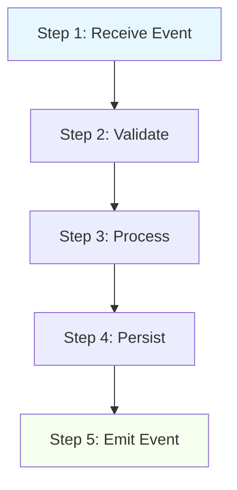

**Execution Characteristics**:

- **Sequential Steps**: [List steps that must complete in order]
- **Parallel Steps**: [List steps that can run concurrently]
- **Post-Completion Triggers**: [Fire-and-forget events that trigger other pipelines]
- **Loop/Retry Logic**: [Describe retry behavior, backoff, DLQ handling]

**Latency Breakdown** (Target):

| Step | Description | Target Latency | Critical Path? |
|------|-------------|----------------|----------------|
| 1 | Receive Event | 1ms | Yes |
| 2 | Validate | 5ms | Yes |
| 3 | Process | 20ms | Yes |
| 4 | Persist | 15ms | Yes |
| 5 | Emit Event | 1ms | Yes |
| **Total** | | **50ms P95** | |

---

## 4. Event Contracts

### Events This Pipeline Subscribes To

| Topic | Schema | When | Handling Logic | QoS Band |
|-------|--------|------|----------------|----------|
| `namespace.component.action.v1` | [Schema Name] | [Trigger condition] | [How handled] | [GREEN/AMBER/RED] |

**Schema Locations**:

### Events This Pipeline Publishes

| Topic | Schema | When | Consumers | QoS Band | Retention |
|-------|--------|------|-----------|----------|-----------|
| `namespace.component.action.v1` | [Schema Name] | [When emitted] | [Who consumes] | [Band] | [Days] |

**Schema Locations**:

### Event Flow Diagram

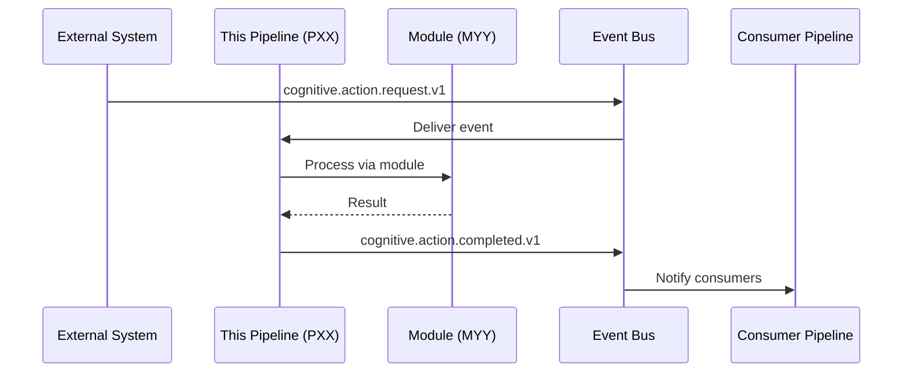

---

## 5. Storage & Syscalls

### Syscalls Required

| Capability | Operation | Tables | Why | Error Handling |
|------------|-----------|--------|-----|----------------|
| `st_table_name.write` | INSERT | st_table_name | [Reason] | [Retry/DLQ/Fail] |
| `st_table_name.read` | SELECT | st_table_name | [Reason] | [Fallback behavior] |

### Storage Contract

**Tables Written To**:

| Table | Columns Used | Write Frequency | Size Estimate |
|-------|--------------|-----------------|---------------|
| st_table_name | col1, col2, col3 | XXX per day | YY MB/day |

**Tables Read From**:

| Table | Columns Used | Read Frequency | Cache Strategy |
|-------|--------------|----------------|----------------|
| st_table_name | col1, col2 | XXX per second | [Strategy] |

### Data Flow

```
[Input Event]
    → [Validation]
    → [Module Processing]
    → [st_table_name.write]
    → [Output Event]
```

---

## 6. Architectural Decisions (ADRs)

| ADR ID | Title | Status | Impact | Date | Link |
|--------|-------|--------|--------|------|------|
| ADR-XXXX | [Decision Title] | ✅ Accepted | [Impact description] | YYYY-MM-DD | [Link to ADR] |
| ADR-YYYY | [Decision Title] | 🎯 Draft | [Impact description] | YYYY-MM-DD | [Link to ADR] |

### Key Architectural Constraints

[List any hard constraints imposed by ADRs that developers must follow]

1. [Constraint 1]
2. [Constraint 2]
3. [Constraint 3]

---

## 7. Implementation Details

### File Structure

```
k0/pipelines/pXX_name/
├── README.md (this file)
├── __init__.py
├── pipeline.py (main pipeline class)
├── handlers/
│   ├── __init__.py
│   ├── handler_a.py
│   └── handler_b.py
├── schemas/
│   └── contracts.json
├── tests/
│   ├── test_pipeline.py
│   ├── test_handlers.py
│   └── fixtures/
└── docs/
    └── diagrams/
```

### Implementation Checklist

**Design & Planning**:

- [ ] Design dossier complete
- [ ] Brain analog validated with neuroscience team
- [ ] ADRs written and accepted
- [ ] Event contracts defined
- [ ] Syscall requirements specified
- [ ] Module dependencies identified

**Implementation**:

- [ ] Pipeline class implements `PipelineProtocol`
- [ ] Event handlers implemented
- [ ] Module integrations complete
- [ ] Error handling implemented
- [ ] Retry logic implemented
- [ ] `cognitive_trace_id` propagation added
- [ ] Logging structured and complete
- [ ] Metrics emitted

**Testing**:

- [ ] Unit tests (target: 90% coverage)
- [ ] Integration tests with real modules
- [ ] Contract tests (event schemas validated)
- [ ] Performance tests (latency targets met)
- [ ] Failure/recovery tests
- [ ] Load tests

**Documentation**:

- [ ] This README complete and current
- [ ] API documentation generated
- [ ] Runbooks created (if needed)
- [ ] Diagrams updated
- [ ] Master Registry updated

**Production Readiness**:

- [ ] Observability hooks configured
- [ ] Alerts defined
- [ ] Dashboard created
- [ ] Capacity planning done
- [ ] Deployment plan written
- [ ] Rollback plan written

---

## 8. Testing Strategy

### Unit Tests

**Location**: `k0/pipelines/pXX_name/tests/`
**Coverage Target**: 90%
**Key Test Cases**:

- [ ] [Test case 1]
- [ ] [Test case 2]
- [ ] [Test case 3]

### Integration Tests

**Location**: `tests/integration/k0/pipelines/test_pXX_integration.py`
**Key Scenarios**:

- [ ] End-to-end happy path
- [ ] Module failure handling
- [ ] Event bus integration
- [ ] Storage integration

### Performance Tests

**Location**: `tests/performance/k0/pipelines/test_pXX_perf.py`
**Targets**:

- P95 Latency: < XXXms
- P99 Latency: < YYYms
- Throughput: > XXX ops/second

### Contract Tests

**Location**: `tests/contracts/k0/pipelines/test_pXX_contracts.py`
**Validation**:

- [ ] Input event schemas validated
- [ ] Output event schemas validated
- [ ] Module interface contracts validated

---

## 9. Observability

### Metrics Emitted

| Metric Name | Type | Description | Labels |
|-------------|------|-------------|--------|
| `pipeline.pXX.latency` | Histogram | End-to-end latency | step, status |
| `pipeline.pXX.events_processed` | Counter | Events processed | status |
| `pipeline.pXX.errors` | Counter | Errors encountered | error_type |

### Logs

**Log Level Standards**:

- INFO: Normal operation milestones
- WARN: Recoverable errors, retries
- ERROR: Unrecoverable errors, DLQ routing

**Required Context**:

- `cognitive_trace_id`: Always present
- `pipeline_id`: Always "pXX"
- `event_type`: The triggering event type
- `timestamp_ms`: High-precision timestamp

### Traces

**Spans Created**:

1. `pipeline.pXX.receive`
2. `pipeline.pXX.validate`
3. `pipeline.pXX.process`
4. `pipeline.pXX.persist`
5. `pipeline.pXX.emit`

### Alerts

| Alert | Condition | Severity | Action |
|-------|-----------|----------|--------|
| High Latency | P95 > XXXms for 5 min | Warning | Investigate, may auto-scale |
| Error Rate | > 1% for 5 min | Critical | Page on-call |
| Throughput Drop | < 50% of baseline | Warning | Check dependencies |

---

## 10. Performance Data

### Targets (Design)

| Metric | Target | Rationale |
|--------|--------|-----------|
| P95 Latency | < XXXms | [Why this target] |
| P99 Latency | < YYYms | [Why this target] |
| Throughput | > XXX ops/s | [Why this target] |
| Error Rate | < 0.1% | Industry standard |
| Availability | > 99.9% | [Why this target] |

### Actuals (Production)

> ⚠️ **Fill this section after deployment**

| Metric | Target | Actual | Status | Notes |
|--------|--------|--------|--------|-------|
| P95 Latency | < XXXms | YYYms | [✅/⚠️/❌] | [Notes] |
| P99 Latency | < YYYms | ZZZms | [✅/⚠️/❌] | [Notes] |
| Throughput | > XXX ops/s | AAA ops/s | [✅/⚠️/❌] | [Notes] |
| Error Rate | < 0.1% | B.BB% | [✅/⚠️/❌] | [Notes] |

**Performance History**:

| Date | Version | P95 Latency | Throughput | Notes |
|------|---------|-------------|------------|-------|
| YYYY-MM-DD | X.Y.Z | XXXms | YYY ops/s | Initial deployment |

---

## 11. Open Questions & Decisions Needed

> ⚠️ Track unresolved questions here. Move to ADRs when decided.

| ID | Question | Current State | Options | Impact | Decision Needed By | Owner | Status |
|----|----------|---------------|---------|--------|-------------------|-------|--------|
| Q1 | [Question?] | [Current approach] | [Option A, Option B] | [Which components affected] | YYYY-MM-DD | [Name] | 🟡 Open |

**Resolved Questions** (Archive):

| ID | Question | Decision | Date | ADR |
|----|----------|----------|------|-----|
| Q0 | [Question?] | [What was decided] | YYYY-MM-DD | ADR-XXXX |

---

## 12. Production Operations

### Deployment

**Prerequisites**:

- [ ] All dependencies deployed
- [ ] Database migrations complete
- [ ] Event schemas registered
- [ ] Monitoring configured

**Deployment Steps**:

1. [Step 1]
2. [Step 2]
3. [Step 3]

**Rollback Plan**:

1. [Step 1]
2. [Step 2]
3. [Step 3]

### Failure Modes

| Failure Scenario | Impact | Detection | Recovery | Prevention |
|------------------|--------|-----------|----------|------------|
| [Scenario 1] | [Impact] | [How detected] | [How to recover] | [How to prevent] |
| [Scenario 2] | [Impact] | [How detected] | [How to recover] | [How to prevent] |

### Maintenance

**Regular Tasks**:

- [ ] Weekly: [Task]
- [ ] Monthly: [Task]
- [ ] Quarterly: [Task]

**Capacity Planning**:

- Current load: [XX ops/s]
- Growth rate: [YY% per month]
- Next scale point: [When to scale]

---

## 13. Future Work & Enhancements

### Planned Features

| Feature | Priority | Effort | Target Date | ADR |
|---------|----------|--------|-------------|-----|
| [Feature 1] | P1 | [S/M/L/XL] | YYYY-QX | ADR-XXXX |
| [Feature 2] | P2 | [S/M/L/XL] | YYYY-QX | - |

### Technical Debt

| Item | Impact | Effort to Fix | Priority | Tracking |
|------|--------|---------------|----------|----------|
| [Debt 1] | [Impact] | [Effort] | [Priority] | [Issue link] |
| [Debt 2] | [Impact] | [Effort] | [Priority] | [Issue link] |

### Breaking Changes (Planned)

| Change | Reason | Impact | Migration Path | Target Version |
|--------|--------|--------|----------------|----------------|
| [Change] | [Why] | [Who affected] | [How to migrate] | vX.0.0 |

---

## 14. References

### Related Documentation

- [Architecture Decision Records](../../../docs/architecture/decisions-K0/)
- [Event Schemas](../../../contracts/schemas/)
- [Master Architecture Document](../k0_architecture_master.md)

### External Resources

### Version History

| Version | Date | Author | Changes |
|---------|------|--------|---------|
| 0.1.0 | YYYY-MM-DD | [Name] | Initial draft |

---

**Document Status**: [Draft | Review | Accepted | Active | Deprecated]
**Next Review Date**: YYYY-MM-DD

---

## 2.3 Pipeline Lifecycle Management Rules

### Rule 1: Creating a New Pipeline

**Prerequisites**:

1. Business/technical need identified
2. Architectural feasibility validated
3. No existing pipeline serves this purpose
4. Resources allocated

**Steps**:

1. Claim next available pipeline ID (P01-P20) in Master Registry
2. Create folder: `k0/pipelines/pXX_name/`
3. Copy README template above into the folder
4. Fill out Sections 1-4 (Overview, Dossier, Architecture, Events)
5. Set status to 📝 Design
6. Create initial ADR (if needed)
7. Add row to Master Registry in Part 2.1
8. Commit with message: `feat(k0): add pipeline PXX design [Design]`

### Rule 2: Moving from Design to Planning

**Prerequisites**:

1. Design dossier complete (problem, requirements, flow)
2. Module dependencies identified
3. At least 1 ADR drafted

**Steps**:

1. Write all necessary ADRs
2. Define all event contracts (schemas)
3. Specify all syscalls
4. Get ADRs reviewed and accepted
5. Update pipeline README: Status = 🎯 Planning
6. Update Master Registry: Status = 🎯 Planning, Design Phase = ✅ Complete
7. Commit with message: `feat(k0): PXX planning complete [Planning]`

### Rule 3: Moving from Planning to Implementation

**Prerequisites**:

1. All ADRs accepted
2. All event schemas defined and validated
3. All module dependencies available (or in parallel development)
4. Implementation checklist reviewed

**Steps**:

1. Create `pipeline.py` with `PipelineProtocol` implementation
2. Update pipeline README: Status = ⚠️ Implementation
3. Update Master Registry: Status = ⚠️ Implementation
4. Check off checklist items as you code
5. Add actual file paths to README
6. Commits: `feat(k0/pXX): implement [feature]`

### Rule 4: Moving from Implementation to Production

**Prerequisites**:

1. All checklist items complete
2. All tests passing (unit, integration, contract, performance)
3. Documentation complete
4. Observability configured
5. Deployment plan reviewed
6. Performance targets met

**Steps**:

1. Deploy to production
2. Monitor for 48 hours
3. Collect actual performance metrics
4. Update pipeline README:
   - Status = ✅ Production
   - Fill "Performance Data (Production)" section
5. Update Master Registry: Status = ✅ Production
6. Create production runbook (if needed)
7. Commit with message: `feat(k0/pXX): production deployment [Production]`

### Rule 5: Deprecating a Pipeline

**Prerequisites**:

1. Replacement pipeline available (or feature no longer needed)
2. Migration plan written
3. ADR documenting superseding approach
4. All consumers notified

**Steps**:

1. Create migration ADR
2. Add deprecation warning to README
3. Update Master Registry: Status = ❌ Deprecated
4. Set removal date (minimum 2 versions out)
5. Archive code (do not delete immediately)
6. Update all referencing documentation
7. Commit with message: `feat(k0/pXX): deprecate pipeline [Deprecated]`

### Rule 6: Pipeline Versioning

**When to bump versions** (in pipeline README):

- **MAJOR (X.0.0)**: Breaking changes to event contracts, syscalls, or module dependencies
- **MINOR (0.X.0)**: New features, new events published, new syscalls added
- **PATCH (0.0.X)**: Bug fixes, performance improvements, documentation updates

**Version must be updated**:

- In pipeline README header
- In Master Registry
- In commit message
- In CHANGELOG (if exists)

### Rule 7: Cross-Pipeline Dependencies

**If Pipeline A depends on Pipeline B**:

1. Document dependency in both READMEs
2. Add to Part 6.3: Integration Dependency Levels
3. Ensure Pipeline B is in Planning or later stage
4. Write integration tests
5. Plan deployment order

**If creating circular dependency**:

1. STOP ❌
2. Refactor to break cycle
3. Consider creating shared module instead
4. Document decision in ADR

### Rule 8: Pipeline Feasibility Quick Check

**Before starting design**, validate:

- [ ] Does not violate existing latency budgets
- [ ] Does not create circular dependencies
- [ ] Required modules exist or are planned
- [ ] Storage tables support required operations
- [ ] Event bus can handle event volume
- [ ] Does not duplicate existing pipeline functionality
- [ ] Aligns with K0 architectural principles

If any fail, revisit scope or write ADR explaining exception.

---

# Part 3: Module Design Workbench

## 3.1 Module Master Registry

> ⚠️ **IMPORTANT**: This registry is the SOURCE OF TRUTH for module status and location.
> The actual detailed specifications live in each module's README.md file.
> DO NOT add example/sample modules here — only real, approved modules.

### How to Use This Registry

1. **Before adding a module**: Ensure architectural need is validated
2. **Add new row**: Fill in ID, Name, Status, README Link
3. **Keep README Link current**: Always point to the actual README.md location
4. **Update "Used By"**: Track which pipelines consume this module
5. **Version tracking**: Bump version in README, not here

### Module Registry Table

| ID | Name | Brain Analog | Status | README Location | Used By Pipelines | Depends On | Stability | Version | Last Updated |
|----|------|--------------|--------|-----------------|-------------------|------------|-----------|---------|--------------|
| M01 | DGService | Dentate Gyrus (DG) | 📋 ADR Complete | `k0/modules/hippocampus/dg_service.py` | P02 | Contract: ✅, ADR: k003.1 | 🧪 Experimental | 0.1.0 | 2025-11-16 |
| M02 | CA1Bridge | CA1 (Semantic) | 📋 ADR Complete | `k0/modules/hippocampus/ca1_bridge.py` | P02, P03 | Contract: ✅, ADR: k003.2 | 🧪 Experimental | 0.1.0 | 2025-11-16 |
| M03 | CA3Service | CA3 (Clustering) | 📋 ADR Complete | `k0/modules/hippocampus/ca3_service.py` | P03 | M01, ADR: k003.3 | 🧪 Experimental | 0.1.0 | 2025-11-16 |
| M04 | AffectService | Amygdala/Affect | 📋 ADR Complete | `k0/modules/affect/affect_service.py` | P02, P06 | Contract: ✅, ADR: k004, k004.1, k004.2 | 🧪 Experimental | 0.1.0 | 2025-11-16 |
| M05 | SpaceResolver | Prefrontal Ctx (Space) | 🎯 Planning | `k0/modules/space/space_resolver.py` | P02 | Contract: ✅ | 🧪 Experimental | 0.1.0 | 2025-11-16 |
| M06 | SalienceScorer | Attention Network | 🎯 Planning | `k0/modules/salience/salience_scorer.py` | P02, P03, P04 | Contract: ✅ | 🧪 Experimental | 0.1.0 | 2025-11-16 |
| M07 | FamilyGraphResolver | Social Brain Network | 🎯 Planning | `k0/modules/social/family_graph_resolver.py` | P02 | Contract: ✅ | 🧪 Experimental | 0.1.0 | 2025-11-16 |
| M08 | TemporalProfiler | Circadian Clock | 🎯 Planning | `k0/modules/context/temporal_profiler.py` | P02 | Contract: ✅ | 🧪 Experimental | 0.1.0 | 2025-11-16 |
| M09 | DeviceProfiler | Context Awareness | 🎯 Planning | `k0/modules/context/device_profiler.py` | P02 | Contract: ✅ | 🧪 Experimental | 0.1.0 | 2025-11-16 |
| M10 | IngressClassifier | Sensory Input Classifier | 🎯 Planning | `k0/modules/context/ingress_classifier.py` | P02 | Contract: ✅ | 🧪 Experimental | 0.1.0 | 2025-11-16 |
| M11 | RetentionLookup | Memory Decay Scheduler | 🎯 Planning | `k0/modules/context/retention_lookup.py` | P02 | Contract: ✅ | 🧪 Experimental | 0.1.0 | 2025-11-16 |
| M12 | GeoMetadataLookup | Spatial Context Processor | 🎯 Planning | `k0/modules/context/geo_metadata.py` | P02 | Contract: ✅ | 🧪 Experimental | 0.1.0 | 2025-11-16 |
| M13 | HippEventsRowBuilder | Memory Consolidation Builder | 🎯 Planning | `k0/modules/builders/hipp_events_row_builder.py` | P02 | Contract: ✅ | 🧪 Experimental | 0.1.0 | 2025-11-16 |
| M14 | EmbeddingQueueWriter | Vector Encoding Scheduler | 🎯 Planning | `k0/modules/builders/embedding_queue_writer.py` | P02 | Contract: ✅ | 🧪 Experimental | 0.1.0 | 2025-11-16 |

**Status Legend**:

- 📝 Design: Initial concept, requirements gathering
- 🎯 Planning: ADRs written, API defined, contracts specified
- 📋 ADR Complete: Architecture decisions finalized, ready for implementation
- ⚠️ Implementation: Code being written, tests in progress
- ✅ Production: Deployed, stable, monitored
- ❌ Deprecated: Replaced or scheduled for removal

**Stability Levels**:

- 🧪 Experimental: API may change, not for production use
- 🔄 Evolving: API mostly stable, minor changes possible
- 🔒 Stable: API locked, breaking changes require MAJOR version bump
- ❄️ Frozen: No changes allowed, only security patches

### Example Row Format (DO NOT COPY THIS AS REAL DATA)

| ID | Name | Brain Analog | Status | README Location | Used By Pipelines | Depends On | Stability | Version | Last Updated |
|----|------|--------------|--------|-----------------|-------------------|------------|-----------|---------|--------------|
| MXX | [Example Module] | [Brain Region] | 📝 Design | `k0/modules/mXX_example/README.md` | PXX, PYY | MZZ | 🧪 Experimental | 0.1.0 | 2025-11-15 |

> ⚠️ **EXAMPLE ONLY** - Do not treat this as actual module data

---

## 3.2 Module README Template

Each module must have its own README.md file in its folder: `k0/modules/mXX_name/README.md`

The README is the **authoritative specification** for that module. Use this template:

---

### **Template: `k0/modules/mXX_name/README.md`**

```markdown
# MXX: [Module Name]

**Status**: [📝 Design | 🎯 Planning | ⚠️ Implementation | ✅ Production | ❌ Deprecated]
**Stability**: [🧪 Experimental | 🔄 Evolving | 🔒 Stable | ❄️ Frozen]
**Version**: X.Y.Z
**Last Updated**: YYYY-MM-DD
**Owner**: [Team/Person]
**Brain Analog**: [Which brain region/system this mimics]

---

## 1. Overview

### Purpose
[2-3 sentences: What does this module do? Why does it exist?]

### Brain Analog Mapping
[Explain the neuroscience inspiration and how brain regions map to module components]

**Neuroscience Background**:
- **Brain Region**: [Name of region]
- **Function in Brain**: [What it does biologically]
- **Computation Performed**: [Information processing characteristics]
- **Mapping to Module**: [How we translate biology to code]

### Scope
**In Scope**:
- [Capability 1]
- [Capability 2]
- [Capability 3]

**Out of Scope**:
- [Non-capability 1]
- [Non-capability 2]

---

## 2. Design Dossier

### Problem Statement
[What problem does this module solve? What gap does it fill in the architecture?]

### Requirements
**Functional Requirements**:
- FR1: [Requirement 1]
- FR2: [Requirement 2]
- FR3: [Requirement 3]

**Non-Functional Requirements**:
- NFR1: Performance: [Specific metrics]
- NFR2: Reliability: [Uptime, error rate]
- NFR3: Scalability: [Growth characteristics]
- NFR4: Maintainability: [Code quality standards]

### Design Philosophy
[Core principles guiding this module's design]

1. [Principle 1]
2. [Principle 2]
3. [Principle 3]

### Design Alternatives Considered
[What other approaches were considered and why were they rejected?]

| Alternative | Pros | Cons | Why Not Chosen |
|-------------|------|------|----------------|
| [Alt 1] | [Pros] | [Cons] | [Reason] |
| [Alt 2] | [Pros] | [Cons] | [Reason] |

---

## 3. Architecture

### Component Structure

```

MXX Module
├─ Component A (Subregion 1)
│  ├─ Responsibility: [What it does]
│  └─ Brain Analog: [Which subregion]
├─ Component B (Subregion 2)
│  ├─ Responsibility: [What it does]
│  └─ Brain Analog: [Which subregion]
└─ Component C (Subregion 3)
   ├─ Responsibility: [What it does]
   └─ Brain Analog: [Which subregion]

```

### Architecture Diagram

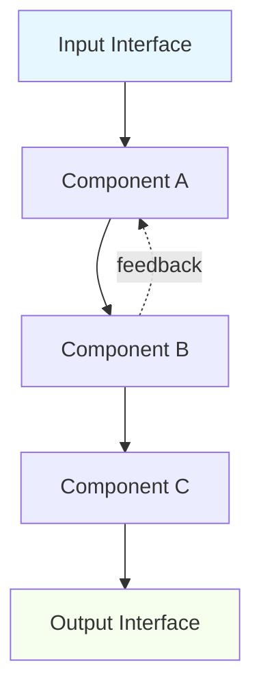

### Data Flow

**Input → Processing → Output**:

1. [Step 1: Input handling]
2. [Step 2: Processing]
3. [Step 3: Output generation]

**Internal State**:

---

## 4. Public API

### Module Interface

```python
# k0/modules/mXX_name/__init__.py

from typing import Protocol, runtime_checkable

@runtime_checkable
class MXXProtocol(Protocol):
    """
    [Module Name] - [Brief description]

    This protocol defines the public interface for the [Module Name] module.
    All implementations must adhere to this contract.
    """

    async def primary_operation(
        self,
        input_param: InputType,
        trace_id: str,
        context: OperationContext
    ) -> OperationResult:
        """
        [Primary operation description]

        Args:
            input_param: [Description]
            trace_id: Cognitive trace identifier for observability
            context: Execution context with capabilities, bands, etc.

        Returns:
            OperationResult with [description]

        Raises:
            ModuleError: When [condition]
        """
        ...

    async def secondary_operation(
        self,
        param: ParamType,
        trace_id: str
    ) -> SecondaryResult:
        """
        [Secondary operation description]
        """
        ...
```

### Input/Output Contracts

**Primary Operation**:

- **Input**: `InputType` (schema: `contracts/schemas/mXX_input.json`)
- **Output**: `OperationResult` (schema: `contracts/schemas/mXX_output.json`)
- **Side Effects**: [List any side effects]

**Secondary Operation**:

- **Input**: `ParamType` (schema: `contracts/schemas/mXX_secondary_input.json`)
- **Output**: `SecondaryResult` (schema: `contracts/schemas/mXX_secondary_output.json`)
- **Side Effects**: [List any side effects]

### Error Handling

| Error Type | When Raised | Recovery Strategy | Retryable? |
|------------|-------------|-------------------|------------|
| `MXXValidationError` | Invalid input | Return error to caller | No |
| `MXXProcessingError` | Processing failure | Log and retry | Yes (3x) |
| `MXXResourceError` | Resource unavailable | Degrade gracefully | Yes (with backoff) |

---

## 5. Dependencies

### Modules This Depends On

| Module ID | Module Name | Purpose | Required? | Fallback |
|-----------|-------------|---------|-----------|----------|
| MYY | [Module Name] | [Why needed] | Yes | None |
| MZZ | [Module Name] | [Why needed] | No | [Degraded behavior] |

### Modules That Depend On This

| Module ID | Module Name | How They Use This | Impact If Unavailable |
|-----------|-------------|-------------------|----------------------|
| MAA | [Module Name] | [Usage pattern] | [Impact] |
| MBB | [Module Name] | [Usage pattern] | [Impact] |

### External Dependencies

| Dependency | Version | Purpose | License | Risk |
|------------|---------|---------|---------|------|
| [Package] | X.Y.Z | [Why needed] | [License] | [Low/Medium/High] |

---

## 6. Event Contracts

### Events This Module Subscribes To

| Topic | Schema | When | Handling Logic | Priority |
|-------|--------|------|----------------|----------|
| `namespace.component.action.v1` | [Schema] | [Condition] | [How handled] | [HIGH/NORMAL/LOW] |

### Events This Module Publishes

| Topic | Schema | When | Consumers | Retention |
|-------|--------|------|-----------|-----------|
| `namespace.component.action.v1` | [Schema] | [When emitted] | [Who listens] | [Days] |

### Event Flow

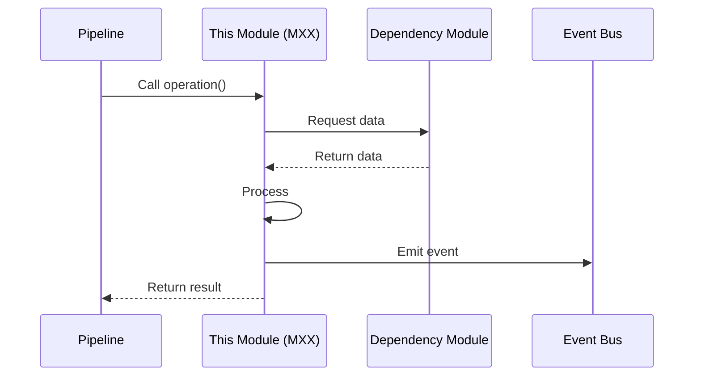

---

## 7. Storage & Syscalls

### Syscalls Required

| Capability | Operation | Tables | Why | Frequency |
|------------|-----------|--------|-----|-----------|
| `st_table_name.read` | SELECT | st_table_name | [Reason] | [per operation] |
| `st_table_name.write` | INSERT | st_table_name | [Reason] | [per operation] |

### Storage Access Patterns

**Read Patterns**:

| Pattern | Tables | Frequency | Cache Strategy | Latency Target |
|---------|--------|-----------|----------------|----------------|
| [Pattern 1] | st_table_x | [freq] | [strategy] | < Xms |

**Write Patterns**:

| Pattern | Tables | Frequency | Transaction? | Latency Target |
|---------|--------|-----------|--------------|----------------|
| [Pattern 1] | st_table_x | [freq] | [Yes/No] | < Xms |

### State Management

**Persistent State**:

- [State item 1]: Stored in [table], used for [purpose]
- [State item 2]: Stored in [table], used for [purpose]

**Transient State**:

- [State item 1]: In-memory only, lifetime: [duration]
- [State item 2]: In-memory only, lifetime: [duration]

---

## 8. Architectural Decisions (ADRs)

| ADR ID | Title | Status | Impact | Date | Link |
|--------|-------|--------|--------|------|------|
| ADR-XXXX | [Decision Title] | ✅ Accepted | [Impact] | YYYY-MM-DD | [Link] |
| ADR-YYYY | [Decision Title] | 🎯 Draft | [Impact] | YYYY-MM-DD | [Link] |

### Key Architectural Constraints

[List hard constraints imposed by ADRs]

1. [Constraint 1]
2. [Constraint 2]
3. [Constraint 3]

---

## 9. Implementation Details

### File Structure

```
k0/modules/mXX_name/
├── README.md (this file)
├── __init__.py (exports MXXProtocol)
├── module.py (main implementation)
├── components/
│   ├── __init__.py
│   ├── component_a.py
│   ├── component_b.py
│   └── component_c.py
├── schemas/
│   ├── input.json
│   └── output.json
├── tests/
│   ├── test_module.py
│   ├── test_components.py
│   ├── test_integration.py
│   └── fixtures/
├── docs/
│   ├── architecture.md
│   └── diagrams/
└── examples/
    └── usage_example.py
```

### Implementation Checklist

**Design & Planning**:

- [ ] Design dossier complete
- [ ] Brain analog validated
- [ ] ADRs written and accepted
- [ ] Protocol interface defined
- [ ] Input/Output contracts specified
- [ ] Dependencies identified

**Core Implementation**:

- [ ] Protocol class created
- [ ] Main module implementation
- [ ] All components implemented
- [ ] Error handling complete
- [ ] State management implemented
- [ ] `cognitive_trace_id` propagation
- [ ] Structured logging added

**Integration**:

- [ ] Dependency modules integrated
- [ ] Event bus integration
- [ ] Storage integration
- [ ] Syscall capabilities enforced

**Testing**:

- [ ] Unit tests (90% coverage)
- [ ] Component tests
- [ ] Integration tests
- [ ] Contract tests (protocol validation)
- [ ] Performance tests
- [ ] Failure scenario tests

**Documentation**:

- [ ] This README complete
- [ ] API documentation generated
- [ ] Usage examples written
- [ ] Architecture diagrams updated

**Production Readiness**:

- [ ] Observability configured
- [ ] Performance validated
- [ ] Security review complete
- [ ] Stability level assigned

---

## 10. Testing Strategy

### Unit Tests

**Location**: `k0/modules/mXX_name/tests/`
**Coverage Target**: 90%
**Key Test Cases**:

- [ ] [Test case 1]
- [ ] [Test case 2]
- [ ] [Test case 3]

### Component Tests

**Location**: `k0/modules/mXX_name/tests/test_components.py`
**Test Each Component**:

- [ ] Component A: [Key scenarios]
- [ ] Component B: [Key scenarios]
- [ ] Component C: [Key scenarios]

### Integration Tests

**Location**: `tests/integration/k0/modules/test_mXX_integration.py`
**Test Integration With**:

- [ ] Dependency modules
- [ ] Event bus
- [ ] Storage layer
- [ ] Calling pipelines

### Contract Tests

**Location**: `tests/contracts/k0/modules/test_mXX_contracts.py`
**Validate**:

- [ ] Module implements protocol correctly
- [ ] Input schemas validated
- [ ] Output schemas validated
- [ ] Error types correct

### Performance Tests

**Location**: `tests/performance/k0/modules/test_mXX_perf.py`
**Targets**:

- Operation latency: < Xms (P95)
- Throughput: > Y ops/second
- Memory usage: < Z MB
- CPU usage: < N%

---

## 11. Observability

### Metrics Emitted

| Metric Name | Type | Description | Labels |
|-------------|------|-------------|--------|
| `module.mXX.operation_latency` | Histogram | Operation duration | operation, status |
| `module.mXX.operations_total` | Counter | Total operations | operation, status |
| `module.mXX.errors_total` | Counter | Errors encountered | error_type, operation |
| `module.mXX.cache_hits` | Counter | Cache hit rate | cache_type |

### Logs

**Log Levels**:

- DEBUG: Internal state transitions
- INFO: Operation start/complete
- WARN: Degraded operation, fallbacks
- ERROR: Operation failures

**Required Context**:

- `cognitive_trace_id`: Always
- `module_id`: Always "mXX"
- `operation`: Operation name
- `component`: Which component logged

### Traces

**Spans Created**:

1. `module.mXX.operation_name`
2. `module.mXX.component_a.process`
3. `module.mXX.component_b.process`
4. `module.mXX.component_c.process`

### Health Checks

**Readiness**:

- Dependencies available?
- Storage accessible?
- Required syscalls granted?

**Liveness**:

- Module responsive?
- No deadlocks?
- Resource usage normal?

---

## 12. Performance Characteristics

### Targets (Design)

| Characteristic | Target | Rationale |
|----------------|--------|-----------|
| Operation Latency (P95) | < Xms | [Why] |
| Operation Latency (P99) | < Yms | [Why] |
| Throughput | > Z ops/s | [Why] |
| Memory Footprint | < A MB | [Why] |
| CPU Usage (avg) | < B% | [Why] |

### Actuals (Production)

> ⚠️ **Fill after deployment**

| Characteristic | Target | Actual | Status | Notes |
|----------------|--------|--------|--------|-------|
| Operation Latency (P95) | < Xms | Yms | [✅/⚠️/❌] | [Notes] |
| Operation Latency (P99) | < Xms | Yms | [✅/⚠️/❌] | [Notes] |
| Throughput | > Z ops/s | W ops/s | [✅/⚠️/❌] | [Notes] |
| Memory Footprint | < A MB | B MB | [✅/⚠️/❌] | [Notes] |

### Scalability Characteristics

- **Horizontal Scaling**: [Yes/No/Partial - explain]
- **Vertical Scaling**: [Characteristics]
- **Bottlenecks**: [Known bottlenecks]
- **Resource Limits**: [Hard limits]

---

## 13. Usage Examples

### Basic Usage

```python
from k0.modules.mXX_name import MXXModule, MXXProtocol
from k0.kernel.context import OperationContext

# Initialize module
module: MXXProtocol = MXXModule(
    config=config,
    capabilities=capabilities
)

# Perform operation
result = await module.primary_operation(
    input_param=data,
    trace_id="trace-123",
    context=context
)

# Handle result
if result.success:
    print(f"Operation succeeded: {result.data}")
else:
    print(f"Operation failed: {result.error}")
```

### Advanced Usage

```python
# Example with error handling and retries
from k0.modules.mXX_name import MXXModule, MXXProcessingError

async def use_module_with_retry(module: MXXProtocol, data):
    max_retries = 3
    for attempt in range(max_retries):
        try:
            result = await module.primary_operation(
                input_param=data,
                trace_id=f"trace-{uuid4()}",
                context=context
            )
            return result
        except MXXProcessingError as e:
            if attempt == max_retries - 1:
                raise
            await asyncio.sleep(2 ** attempt)  # Exponential backoff
```

### Integration with Pipeline

```python
# Example of pipeline using this module
from k0.pipelines.pXX_name import PXXPipeline
from k0.modules.mXX_name import MXXModule

class MyPipeline(PXXPipeline):
    def __init__(self):
        self.module = MXXModule()

    async def process_event(self, event):
        # Use module
        result = await self.module.primary_operation(
            input_param=event.data,
            trace_id=event.cognitive_trace_id,
            context=self.context
        )

        # Continue pipeline processing
        return self.build_response(result)
```

---

## 14. Open Questions & Decisions Needed

> ⚠️ Track unresolved questions here. Move to ADRs when decided.

| ID | Question | Current State | Options | Impact | Decision Needed By | Owner | Status |
|----|----------|---------------|---------|--------|-------------------|-------|--------|
| Q1 | [Question?] | [Current] | [Option A, B] | [Components] | YYYY-MM-DD | [Name] | 🟡 Open |

**Resolved Questions** (Archive):

| ID | Question | Decision | Date | ADR |
|----|----------|----------|------|-----|
| Q0 | [Question?] | [Decision] | YYYY-MM-DD | ADR-XXXX |

---

## 15. Production Operations

### Deployment

**Prerequisites**:

- [ ] All dependencies deployed
- [ ] Syscalls granted
- [ ] Configuration validated
- [ ] Monitoring configured

**Deployment Steps**:

1. [Step 1]
2. [Step 2]
3. [Step 3]

### Failure Modes

| Failure Scenario | Impact | Detection | Recovery | Prevention |
|------------------|--------|-----------|----------|------------|
| [Scenario 1] | [Impact] | [How detected] | [Recovery] | [Prevention] |
| [Scenario 2] | [Impact] | [How detected] | [Recovery] | [Prevention] |

### Monitoring

**Key Metrics to Watch**:

- [Metric 1]: Alert if [condition]
- [Metric 2]: Alert if [condition]
- [Metric 3]: Alert if [condition]

**Common Issues**:

| Symptom | Likely Cause | Resolution |
|---------|--------------|------------|
| [Symptom 1] | [Cause] | [Fix] |
| [Symptom 2] | [Cause] | [Fix] |

---

## 16. Future Work & Enhancements

### Planned Features

| Feature | Priority | Effort | Target Date | ADR |
|---------|----------|--------|-------------|-----|
| [Feature 1] | P1 | [S/M/L/XL] | YYYY-QX | ADR-XXXX |
| [Feature 2] | P2 | [S/M/L/XL] | YYYY-QX | - |

### Technical Debt

| Item | Impact | Effort to Fix | Priority |
|------|--------|---------------|----------|
| [Debt 1] | [Impact] | [Effort] | [Priority] |
| [Debt 2] | [Impact] | [Effort] | [Priority] |

### API Evolution

**Planned Breaking Changes** (require MAJOR version bump):

| Change | Reason | Impact | Migration Path | Target Version |
|--------|--------|--------|----------------|----------------|
| [Change] | [Why] | [Impact] | [How to migrate] | vX.0.0 |

**Deprecation Schedule**:

| API Element | Deprecated In | Removed In | Replacement |
|-------------|---------------|------------|-------------|
| [Element] | vX.Y.0 | vZ.0.0 | [New API] |

---

## 17. References

### Related Documentation

- [ADRs](../../../docs/architecture/decisions-K0/)
- [Schemas](../../../contracts/schemas/)
- [Master Architecture](../../pipelines/k0_architecture_master.md)

### External Resources

### Version History

| Version | Date | Author | Changes |
|---------|------|--------|---------|
| 0.1.0 | YYYY-MM-DD | [Name] | Initial draft |

---

**Document Status**: [Draft | Review | Accepted | Active | Deprecated]
**Next Review Date**: YYYY-MM-DD

```

---

## 3.3 Module Extension & Evolution Process

### Rule 1: Creating a New Module

**Prerequisites**:
1. At least one pipeline needs this module
2. No existing module provides this functionality
3. Brain analog identified and validated
4. Architectural approval obtained

**Steps**:
1. Claim next available module ID (M01-M20) in Master Registry
2. Create folder: `k0/modules/mXX_name/`
3. Copy README template into the folder
4. Fill out Sections 1-4 (Overview, Dossier, Architecture, API)
5. Define protocol interface (`MXXProtocol`)
6. Set status to 📝 Design, stability to 🧪 Experimental
7. Add row to Master Registry in Part 3.1
8. Create initial ADR (if needed)
9. Commit: `feat(k0): add module MXX design [Design]`

### Rule 2: Moving from Design to Planning

**Prerequisites**:
1. Design dossier complete
2. Protocol interface defined
3. Dependencies identified
4. At least 1 ADR drafted

**Steps**:
1. Write all necessary ADRs
2. Define complete protocol interface with type signatures
3. Specify all input/output contracts (schemas)
4. Define error types and handling
5. Get ADRs reviewed and accepted
6. Update module README: Status = 🎯 Planning
7. Update Master Registry: Status = 🎯 Planning
8. Commit: `feat(k0): MXX planning complete [Planning]`

### Rule 3: Moving from Planning to Implementation

**Prerequisites**:
1. All ADRs accepted
2. Protocol defined and validated
3. Calling pipelines identified
4. Storage requirements specified

**Steps**:
1. Create protocol class in `__init__.py`
2. Implement module components
3. Update module README: Status = ⚠️ Implementation
4. Update Master Registry: Status = ⚠️ Implementation
5. Check off implementation checklist items
6. Write tests alongside implementation
7. Commits: `feat(k0/mXX): implement [component]`

### Rule 4: Moving from Implementation to Production

**Prerequisites**:
1. All checklist items complete
2. All tests passing (unit, component, integration, contract, performance)
3. Protocol compliance validated
4. Used by at least one pipeline
5. Observability configured
6. Performance targets met

**Steps**:
1. Deploy to production
2. Monitor module usage in production pipelines
3. Collect performance metrics
4. Update module README:
   - Status = ✅ Production
   - Fill "Performance Characteristics (Actuals)"
   - Upgrade stability: 🧪 Experimental → 🔄 Evolving
5. Update Master Registry: Status = ✅ Production
6. Commit: `feat(k0/mXX): production deployment [Production]`

### Rule 5: Stability Level Progression

**🧪 Experimental → 🔄 Evolving**:
- Criteria: In production, API used by 1+ pipelines, no major issues for 30 days
- Changes allowed: Any (breaking or non-breaking)
- Version impact: Any version bump

**🔄 Evolving → 🔒 Stable**:
- Criteria: In production 90+ days, API unchanged 60+ days, used by 3+ pipelines
- Changes allowed: Non-breaking additions only, breaking changes require MAJOR bump
- Version impact: MINOR for additions, MAJOR for breaking

**🔒 Stable → ❄️ Frozen**:
- Criteria: Critical system component, cannot tolerate any API changes
- Changes allowed: Security patches and bug fixes only
- Version impact: PATCH only

**Downgrading Stability**:
- If major refactor needed, downgrade: ❄️/🔒 → 🔄 → 🧪
- Requires ADR explaining necessity
- Create migration guide for consumers

### Rule 6: Module Versioning

**When to bump versions** (in module README):
- **MAJOR (X.0.0)**: Breaking changes to protocol interface, event contracts, or storage requirements
- **MINOR (0.X.0)**: New methods added to protocol, new capabilities, new events published
- **PATCH (0.0.X)**: Bug fixes, performance improvements, documentation updates

**Version Constraints by Stability**:
| Stability | Allowed Version Bumps | Breaking Changes |
|-----------|----------------------|------------------|
| 🧪 Experimental | Any | Anytime |
| 🔄 Evolving | Any | Requires MAJOR bump |
| 🔒 Stable | Any | Requires MAJOR bump + migration guide |
| ❄️ Frozen | PATCH only | Not allowed |

### Rule 7: Extending Module APIs

**Adding New Methods** (Non-Breaking):
1. Add method to protocol interface
2. Implement in module
3. Write tests
4. Update README (usage examples)
5. Bump MINOR version
6. Commit: `feat(k0/mXX): add [method] to API`

**Changing Existing Methods** (Breaking):
1. Create ADR justifying change
2. Mark old method as deprecated (add deprecation decorator)
3. Implement new method alongside old
4. Update all calling pipelines to new method
5. Wait minimum 2 MINOR versions
6. Remove old method
7. Bump MAJOR version
8. Create migration guide
9. Commit: `feat(k0/mXX)!: BREAKING - [change description]`

### Rule 8: Module Dependencies

**Adding Dependency on Another Module**:
1. Check circular dependency (if exists, STOP ❌)
2. Verify dependency module stability (prefer 🔒 Stable or 🔄 Evolving)
3. Document in README "Modules This Depends On"
4. Update Master Registry "Depends On" column
5. Add integration tests
6. If dependency is 🧪 Experimental, add risk note

**Module Used By Tracking**:
1. When pipeline starts using module, update:
   - Module README "Modules That Depend On This"
   - Master Registry "Used By Pipelines" column
2. When pipeline stops using module, remove entries
3. If "Used By" becomes empty, consider deprecation

### Rule 9: Protocol Compliance Validation

**Before Production**:
- [ ] Module class implements protocol correctly
- [ ] `@runtime_checkable` decorator on protocol
- [ ] All protocol methods implemented
- [ ] Contract tests validate protocol compliance
- [ ] No protocol violations in integration tests

**Enforcement**:
```python
# Example protocol validation
from k0.modules.mXX_name import MXXProtocol, MXXModule

def validate_protocol():
    module = MXXModule()
    assert isinstance(module, MXXProtocol), "Module does not implement protocol"
```

### Rule 10: Module Deprecation

**Prerequisites**:

1. Replacement module available (or functionality no longer needed)
2. All consuming pipelines migrated
3. ADR documenting superseding approach
4. Migration guide written

**Steps**:

1. Create deprecation ADR
2. Add deprecation warning to README
3. Update stability: → 🧪 Experimental (downgrade)
4. Update Master Registry: Status = ❌ Deprecated
5. Set removal date (minimum 2 MAJOR versions)
6. Notify all past consumers
7. Archive code (don't delete immediately)
8. Commit: `feat(k0/mXX): deprecate module [Deprecated]`

### Rule 11: Shared Components vs. Modules

**When to create a shared utility** (not a module):

- Pure functions with no state
- Small helpers used across multiple modules
- No brain analog needed
- No protocol interface needed
- Location: `k0/kernel/utils/` or `k0/kernel/shared/`

**When to create a module**:

- Stateful component
- Represents brain region/system
- Used by multiple pipelines
- Needs protocol interface
- Requires independent testing and versioning

### Rule 12: Performance Regression Prevention

**Before MINOR/MAJOR version bumps**:

- [ ] Run performance tests
- [ ] Compare against baseline
- [ ] If regression > 10%, requires investigation
- [ ] If regression > 25%, blocks release
- [ ] Document performance changes in README
- [ ] Update performance budgets if intentional

---

**End of Part 3: Module Design Workbench**

---

# Part 4: Event Topology & Wiring

## 4.1 Event Topics Registry

> ⚠️ **IMPORTANT**: This registry is the SOURCE OF TRUTH for all event topics in K0.
> All events must be registered here before being used in pipelines or modules.
> DO NOT add example events — only real, approved event topics.

### How to Use This Registry

1. **Before creating an event**: Check if similar event exists
2. **Namespace properly**: Follow event naming conventions (Part 9.2)
3. **Add new row**: Include topic, schema location, QoS, retention
4. **Link schema**: Ensure schema file exists in `contracts/schemas/`
5. **Track producers/consumers**: Keep accurate for dependency tracking

### Event Topics Table

| Topic Pattern | Schema Location | Producers | Consumers | QoS Band | Retention (days) | Version | Status |
|---------------|-----------------|-----------|-----------|----------|------------------|---------|--------|
| `cognitive.memory.write.committed.v1` | `contracts/schemas/write_committed.json` | P01 | P02, P03, P06 | AMBER | 7 | v1 | ✅ Active |
| `p02.write.complete.v1` | `contracts/schemas/p02_complete.json` | P02 (M17) | P03, P06 | AMBER | 7 | v1 | ✅ Active |
| `memory.formed.v1` | `contracts/schemas/memory_formed.json` | P02 (M17) | P03, P09 | AMBER | 7 | v1 | ✅ Active |
| `embedding.queued.v1` | `contracts/schemas/embedding_queued.json` | P02 (M17) | P08 | GREEN | 3 | v1 | ✅ Active |
| `salience.computed.v1` | `contracts/schemas/salience_computed.json` | P02 (M17) | P03, P04 | AMBER | 7 | v1 | ✅ Active |
| `social.enriched.v1` | `contracts/schemas/social_enriched.json` | P02 (M17) | P03, P04 | AMBER | 7 | v1 | ✅ Active |
| `privacy.masked.v1` | `contracts/schemas/privacy_masked.json` | P02 (M17) | P03, Audit | RED | 30 | v1 | ✅ Active |
| | | | | | | | |

**QoS Bands**:

- **GREEN**: Best-effort, low priority, can be dropped under load
- **AMBER**: Important, must be delivered, can have delay
- **RED**: Critical, must be delivered immediately, high priority

**Status**:

- ✅ Active: Currently in use
- 🔄 Evolving: Schema may change
- ❌ Deprecated: Scheduled for removal

### Example Row Format (DO NOT COPY THIS AS REAL DATA)

| Topic Pattern | Schema Location | Producers | Consumers | QoS Band | Retention (days) | Version | Status |
|---------------|-----------------|-----------|-----------|----------|------------------|---------|--------|
| `namespace.component.action.v1` | `contracts/schemas/example_event.json` | PXX | PYY, PZZ | AMBER | 7 | v1 | ✅ Active |

> ⚠️ **EXAMPLE ONLY** - Do not treat this as actual event data

---

## 4.2 Event Namespacing Rules

### Namespace Taxonomy

All events must follow this pattern:

```
{namespace}.{component}.{action}.{version}
```

**Approved Namespaces**:

| Namespace | Purpose | Examples | Owner |
|-----------|---------|----------|-------|
| `cognitive.*` | Memory operations, cognitive processes | `cognitive.memory.write.v1` | K0 Core |
| `intelligence.*` | Advisory signals, learning feedback | `intelligence.advisory.decision.v1` | K0 Intelligence |
| `system.*` | System lifecycle, health, diagnostics | `system.pipeline.started.v1` | K0 Kernel |
| `infra.*` | Infrastructure events (storage, network) | `infra.storage.checkpoint.v1` | K0 Infrastructure |
| `privacy.*` | Privacy controls, policy enforcement | `privacy.redaction.applied.v1` | K0 Policy |
| `sync.*` | Multi-device synchronization | `sync.crdt.merged.v1` | K0 Sync |
| `external.*` | Events from outside K0 (K1, apps) | `external.k1.user_input.v1` | Bridge |

### Naming Conventions

**Component Names** (middle segment):

- Use singular nouns: `memory`, `pipeline`, `module`
- Be specific: `hippocampus.encoded` not `memory.processed`
- Brain-analog aligned when possible

**Action Names** (third segment):

- Use past tense for completed actions: `written`, `committed`, `failed`
- Use present tense for requests: `write`, `read`, `query`
- Use gerunds for ongoing: `processing`, `encoding`

**Version Suffix**:

- Always include: `.v1`, `.v2`, etc.
- Increment when schema changes incompatibly
- Do not remove old versions until all consumers migrated

### Event Naming Examples

✅ **Good**:

- `cognitive.memory.write.request.v1` (request to write)
- `cognitive.memory.write.committed.v1` (write completed)
- `intelligence.learning.feedback.collected.v1` (feedback gathered)
- `system.pipeline.failed.v1` (pipeline failure)

❌ **Bad**:

- `memory_write` (no namespace, no version)
- `cognitive.write` (too vague, which component?)
- `cognitive.memory.do_write.v1` (use request or committed)
- `cognitive.memory.write` (no version)

---

## 4.3 Global Event Flow Patterns

### Pattern 1: Request-Response (Synchronous-Style)

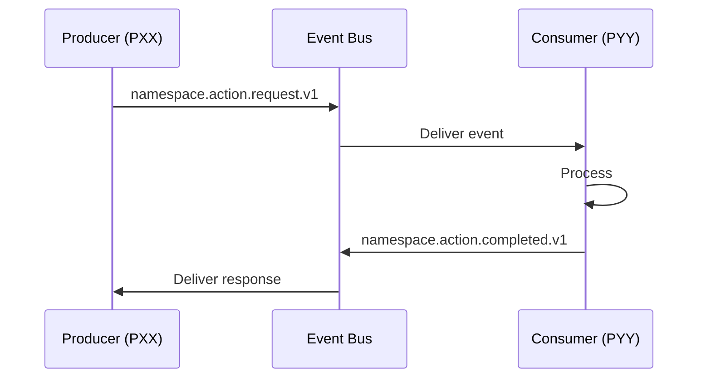

**Use when**: Operation needs confirmation
**Examples**: Write requests, query requests

### Pattern 2: Fire-and-Forget (Asynchronous)

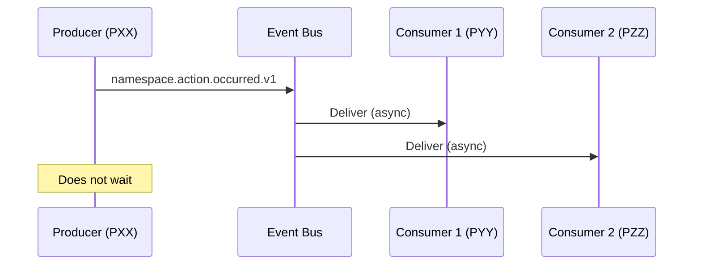

**Use when**: Multiple consumers, no response needed
**Examples**: Memory consolidated, learning feedback

### Pattern 3: Event Chain (Pipeline Trigger)

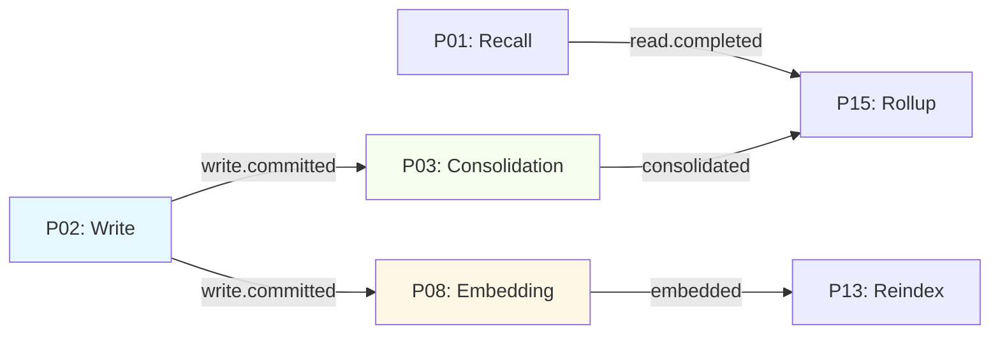

**Use when**: Complex multi-stage processing
**Examples**: Write → Consolidate → Embed → Reindex

### Pattern 4: Fan-Out (Broadcast)

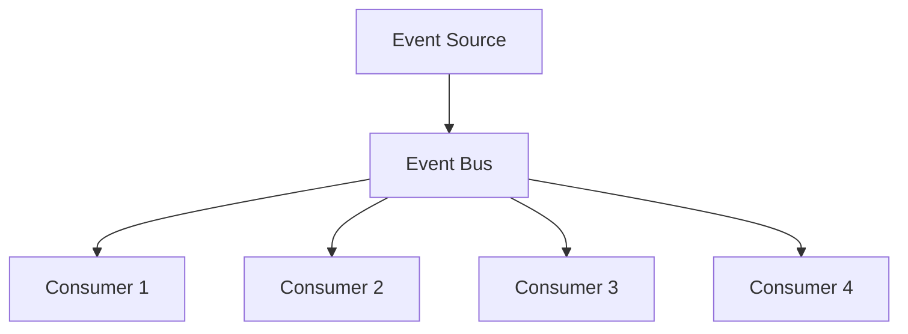

**Use when**: Many independent consumers
**Examples**: System events, global state changes

### Pattern 5: Aggregation (Fan-In)

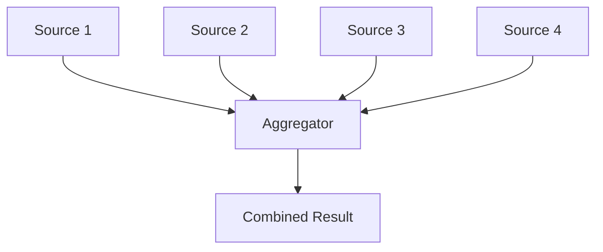

**Use when**: Collecting inputs from multiple sources
**Examples**: Advisory consolidation, multi-module results

---

## 4.4 Pipeline Execution Graph (Global DAG)

> ⚠️ **This is a conceptual view. Actual pipeline relationships are documented in individual pipeline READMEs.**

### Core Pipeline Dependencies

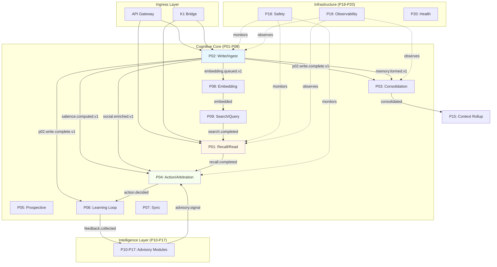

### Pipeline Dependency Rules

**Level 0: No Dependencies** (can run independently):

- P20: Health (monitors system, no dependencies)

**Level 1: Infrastructure** (depend only on kernel):

- P18: Safety
- P19: Observability

**Level 2: Core Ingress** (depend on infrastructure):

- P01: Recall/Read
- P02: Write/Ingest

**Level 3: Core Processing** (depend on ingress):

- P03: Consolidation (depends on P02)
- P08: Embedding (depends on P02)
- P09: Search (depends on P08)

**Level 4: Intelligence** (depend on core):

- P10-P17: Advisory Modules (depend on P01, P02, P03)

**Level 5: Decision** (depend on intelligence):

- P04: Action/Arbitration (depends on P01, P10-P17)

**Level 6: Learning** (depend on decision):

- P06: Learning Loop (depends on P04)

**Level 7: Sync** (depends on all above):

- P07: Sync (depends on P02, P03, conflict resolution)

---

## 4.5 Cross-Diagram Wiring

> **Context**: K0 architecture has multiple diagram views. This section maps how they connect.

### Diagram 1 (API Layer) ↔ Diagram 2 (Cognitive Core)

| From (D1) | To (D2) | Via Event | Latency Target | Notes |
|-----------|---------|-----------|----------------|-------|
| Command Port | Attention Gate (M02) | `cognitive.command.received.v1` | < 5ms | Fast lane routing |
| Command Port | Intent Router | `cognitive.intent.classified.v1` | < 20ms | Smart lane routing |
| Query Port | Retrieval Broker | `cognitive.query.received.v1` | < 10ms | Read path |
| SSE Endpoint | Global Workspace (M04) | `cognitive.workspace.updated.v1` | < 5ms | Real-time updates |

**Connection Type**:

- Fast Lane: Direct syscall, minimal event overhead
- Smart Lane: Full event bus, policy enforcement
- Query Path: Read-only, optimized for latency

### Diagram 2 (Cognitive Core) ↔ Diagram 3 (Intelligence Layer)

| From (D2) | To (D3) | Via Event | Latency Target | Notes |
|-----------|---------|-----------|----------------|-------|
| Working Memory (M03) | Intelligence Memory | `cognitive.workspace.snapshot.v1` | < 5ms | State sharing |
| Hippocampus (M01) | Learning Loop (P06) | `cognitive.memory.write.committed.v1` | N/A (async) | Feedback signal |
| Retrieval (P01) | Advisory Modules (P10-P17) | `cognitive.memory.retrieved.v1` | < 10ms | Context for advisories |
| Action (P04) | Learning Loop (P06) | `cognitive.action.decided.v1` | N/A (async) | Outcome for learning |

**Connection Type**:

- State Sharing: In-memory references, minimal latency
- Feedback Loops: Asynchronous, fire-and-forget
- Advisory Requests: Synchronous-style, requires response

### Diagram 3 (Intelligence Layer) ↔ Diagram 1 (API)

| From (D3) | To (D1) | Via Event | Latency Target | Notes |
|-----------|---------|-----------|----------------|-------|
| Advisory Modules (P10-P17) | SSE Endpoint | `intelligence.advisory.ready.v1` | < 20ms | Real-time advisories |
| Action (P04) | Command Response | `cognitive.action.completed.v1` | < 50ms | End-to-end completion |
| Learning Loop (P06) | Metrics API | `intelligence.learning.metrics.v1` | N/A (async) | Dashboard updates |

**Connection Type**:

- Real-time Streams: SSE, continuous push
- Request Completion: HTTP response
- Metrics: Background, low priority

---

## 4.6 Event Schema Management

### Schema Storage

**Location**: `contracts/schemas/`

**Structure**:

```
contracts/schemas/
├── cognitive/
│   ├── memory_write_request.v1.json
│   ├── memory_write_committed.v1.json
│   ├── memory_read_request.v1.json
│   └── memory_read_completed.v1.json
├── intelligence/
│   ├── advisory_signal.v1.json
│   └── learning_feedback.v1.json
├── system/
│   ├── pipeline_started.v1.json
│   └── pipeline_failed.v1.json
└── shared/
    ├── envelope.json (base envelope)
    ├── error_envelope.json
    └── trace_context.json
```

### Schema Versioning

**Version in Filename**: Always include version in filename

- `memory_write_request.v1.json`
- `memory_write_request.v2.json` (when breaking change)

**Version in Schema**: Also embed version in schema

```json
{
  "$schema": "http://json-schema.org/draft-07/schema#",
  "$id": "cognitive.memory.write.request.v1",
  "version": "1.0.0",
  "title": "Memory Write Request",
  "type": "object",
  "properties": { ... }
}
```

### Schema Evolution Rules

**Non-Breaking Changes** (same version):

- Adding optional fields
- Relaxing validation (e.g., removing `required`)
- Adding enum values (if consumers handle unknown)
- Documentation updates

**Breaking Changes** (new version):

- Removing fields
- Renaming fields
- Changing field types
- Making optional fields required
- Removing enum values
- Changing validation rules (stricter)

**Migration Path**:

1. Create new schema version: `.v2.json`
2. Update event topic: `.v2` suffix
3. Producers emit both v1 and v2 for transition period
4. Consumers update to handle v2
5. After all consumers migrated, producers stop emitting v1
6. Mark v1 as deprecated in registry

### Schema Validation

**At Runtime**:

- All events validated against schema before publishing
- All events validated after receiving
- Validation failures logged and rejected

**In Tests**:

- Contract tests validate schema compliance
- Integration tests validate end-to-end schema flow

---

## 4.7 Event Bus Architecture

> **Note**: Implementation details in `k0/bus/`

### Bus Characteristics

**Transport**: In-memory queue (asyncio.Queue) for single-process, Redis Streams for multi-process
**Delivery Guarantee**: At-least-once (with deduplication via `cognitive_trace_id`)
**Ordering**: Per-topic ordering maintained
**Partitioning**: By `family_id` for family-specific events

### Middleware Pipeline

Events flow through middleware in order:

1. **Trace Propagation**: Attach/extract `cognitive_trace_id`
2. **Schema Validation**: Validate against schema
3. **Policy Enforcement**: Check MLS bands, privacy rules
4. **QoS Routing**: Route based on GREEN/AMBER/RED
5. **Deduplication**: Check if already processed
6. **Metrics**: Record event counts, latency
7. **Dead Letter**: Route failed events to DLQ

### Event Envelope Structure

All events wrapped in standard envelope:

```json
{
  "envelope_version": "1.0.0",
  "cognitive_trace_id": "uuid",
  "event_type": "cognitive.memory.write.request.v1",
  "timestamp_ms": 1700000000000,
  "producer": "p02_write",
  "family_id": "family_uuid",
  "space_id": "space_uuid",
  "band": "AMBER",
  "metadata": {
    "source": "k1_bridge",
    "user_id": "user_uuid"
  },
  "payload": { ... }
}
```

### QoS Band Processing

**GREEN** (Best-Effort):

- No retry on failure
- Can be dropped under load
- Async processing
- Examples: Metrics, non-critical logs

**AMBER** (Important):

- Retry 3x with exponential backoff
- Queued during high load
- Delivered when capacity available
- Examples: Memory writes, consolidation

**RED** (Critical):

- Immediate processing
- Retry until success or DLQ
- Bypass queue if needed
- Examples: Safety violations, critical errors

---

## 4.8 Event-Driven Integration Checklist

When adding a new pipeline/module that uses events:

**Producer Checklist**:

- [ ] Event topic registered in Part 4.1
- [ ] Schema created in `contracts/schemas/`
- [ ] Schema validated (valid JSON Schema)
- [ ] Event uses standard envelope structure
- [ ] `cognitive_trace_id` propagated
- [ ] QoS band specified correctly
- [ ] Retention policy set
- [ ] Consumers identified and notified
- [ ] Contract tests written

**Consumer Checklist**:

- [ ] Event topic registered in Part 4.1
- [ ] Handler implements error recovery
- [ ] Idempotency handled (duplicate detection)
- [ ] Schema validation on receive
- [ ] Performance target met (latency)
- [ ] Dead letter handling configured
- [ ] Integration tests with producer
- [ ] Monitoring/alerting configured

**Breaking Change Checklist**:

- [ ] New schema version created (`.v2`)
- [ ] New event topic version (`.v2`)
- [ ] Migration plan documented
- [ ] All consumers identified
- [ ] Transition period defined (emit both v1 and v2)
- [ ] Deprecation date set for v1
- [ ] Breaking change logged in Part 7.4

---

**End of Part 4: Event Topology & Wiring**

---

# Part 5: Contract & Syscall Registry

## 5.1 Global Contract Registry

> ⚠️ **IMPORTANT**: This registry is the SOURCE OF TRUTH for all data contracts in K0.
> Every schema file, protocol interface, and data structure must be registered here.
> DO NOT add example contracts — only real, approved contracts.

### How to Use This Registry

1. **Before creating a contract**: Check if similar contract exists
2. **Add new row**: Include contract name, type, location, version
3. **Track usage**: Document which pipelines/modules use this contract
4. **Version management**: Update version when contract changes
5. **Link to schemas**: Ensure file paths are current

### Contract Registry Table

| Contract Name | Type | Location | Used By | Version | Status | Last Updated |
|---------------|------|----------|---------|---------|--------|--------------|
| `hippocampus.pattern_separate:v1` | Module Contract | `k0/contracts/modules/hippocampus.pattern_separate.v1.yaml` | M01, P02 | v1 | ✅ Active | 2025-01-19 |
| `hippocampus.semantic_project:v1` | Module Contract | `k0/contracts/modules/hippocampus.semantic_project.v1.yaml` | M02, P02 | v1 | ✅ Active | 2025-11-16 |
| `affect.analyze:v1` | Module Contract | `k0/contracts/modules/affect.analyze.v1.yaml` | M04, P02 | v1 | ✅ Active | 2025-11-16 |
| `space.resolve_visibility:v1` | Module Contract | `k0/contracts/modules/space.resolve_visibility.v1.yaml` | M05, P02 | v1 | ✅ Active | 2025-11-16 |
| `salience.score:v1` | Module Contract | `k0/contracts/modules/salience.score.v1.yaml` | M06, P02 | v1 | ✅ Active | 2025-11-16 |
| `social.family_graph_resolve:v1` | Module Contract | `k0/contracts/modules/social.family_graph_resolve.v1.yaml` | M07, P02 | v1 | ✅ Active | 2025-11-16 |
| `context.temporal_profile:v1` | Module Contract | `k0/contracts/modules/context.temporal_profile.v1.yaml` | M08, P02 | v1 | ✅ Active | 2025-11-16 |
| `context.device_profile:v1` | Module Contract | `k0/contracts/modules/context.device_profile.v1.yaml` | M09, P02 | v1 | ✅ Active | 2025-11-16 |
| `context.ingress_classify:v1` | Module Contract | `k0/contracts/modules/context.ingress_classify.v1.yaml` | M10, P02 | v1 | ✅ Active | 2025-11-16 |
| `context.retention_lookup:v1` | Module Contract | `k0/contracts/modules/context.retention_lookup.v1.yaml` | M11, P02 | v1 | ✅ Active | 2025-11-16 |
| `context.geo_metadata:v1` | Module Contract | `k0/contracts/modules/context.geo_metadata.v1.yaml` | M12, P02 | v1 | ✅ Active | 2025-11-16 |
| `builders.hipp_events_row:v1` | Module Contract | `k0/contracts/modules/builders.hipp_events_row.v1.yaml` | M13, P02 | v1 | ✅ Active | 2025-11-16 |
| `builders.embedding_queue_write:v1` | Module Contract | `k0/contracts/modules/builders.embedding_queue_write.v1.yaml` | M14, P02 | v1 | ✅ Active | 2025-11-16 |
| `context.spatial_minimal:v1` | Module Contract | `k0/contracts/modules/context.spatial_minimal.v1.yaml` | M15, P02 | v1 | ✅ Active | 2025-11-16 |
| `core.hipp_events_writer:v1` | Module Contract | `k0/contracts/modules/core.hipp_events_writer.v1.yaml` | M16, P02 | v1 | ✅ Active | 2025-11-16 |
| `core.event_emitter:v1` | Module Contract | `k0/contracts/modules/core.event_emitter.v1.yaml` | M17, P02 | v1 | ✅ Active | 2025-11-16 |
| `P02_WRITE:v1` | Pipeline Contract | `k0/contracts/pipelines/p02_write.v1.yaml` | P02 | v1 | ✅ Active | 2025-11-16 |
| | | | | | | |

**Contract Types**:

- **Event Schema**: JSON Schema for events
- **Protocol**: Python Protocol (interface definition)
- **Data Model**: SQLAlchemy model, Pydantic model
- **API Contract**: REST API specification (OpenAPI)
- **Storage Schema**: Table definition, column types

**Status**:

- ✅ Active: Currently in use
- 🔄 Evolving: May change
- 🔒 Locked: Breaking changes forbidden
- ❌ Deprecated: Scheduled for removal

### Example Row Format (DO NOT COPY THIS AS REAL DATA)

| Contract Name | Type | Location | Used By | Version | Status | Last Updated |
|---------------|------|----------|---------|---------|--------|--------------|
| `CommandEnvelope` | Event Schema | `contracts/schemas/command_envelope.json` | PXX, PYY | v1.0.0 | ✅ Active | 2025-11-15 |
| `PipelineProtocol` | Protocol | `k0/kernel/contracts/pipeline_protocol.py` | All Pipelines | v1.0.0 | 🔒 Locked | 2025-10-01 |

> ⚠️ **EXAMPLE ONLY** - Do not treat this as actual contract data

---

## 5.2 Syscall Matrix

> ⚠️ **IMPORTANT**: This matrix is the SOURCE OF TRUTH for storage access capabilities.
> Every table access must be registered here with the capability name and operations.
> DO NOT add example syscalls — only real, approved capabilities.

### How to Use This Matrix

1. **Before adding storage access**: Check if capability exists
2. **Add new row**: Include capability, operations, tables, purpose
3. **Track grants**: Document which pipelines/modules have this capability
4. **Enforce least privilege**: Grant minimal necessary access
5. **Audit regularly**: Review for unused or over-privileged capabilities

### Syscall Matrix Table

| Capability Name | Operations | Tables | Granted To | Purpose | Audit Logged? | Status |
|-----------------|------------|--------|------------|---------|---------------|--------|
| | | | | | | |
| | | | | | | |
| | | | | | | |

**Operations**:

- `SELECT`: Read data
- `INSERT`: Write new data
- `UPDATE`: Modify existing data
- `DELETE`: Remove data
- `*`: All operations (use sparingly)

**Audit Logged**:

- ✅ Yes: All operations logged to audit table
- ⚠️ Selective: Only certain operations logged
- ❌ No: Not logged (only for non-sensitive data)

**Status**:

- ✅ Active: Currently granted
- 🔄 Review: Under security review
- ❌ Revoked: No longer granted

### Example Row Format (DO NOT COPY THIS AS REAL DATA)

| Capability Name | Operations | Tables | Granted To | Purpose | Audit Logged? | Status |
|-----------------|------------|--------|------------|---------|---------------|--------|
| `st_episodic.write` | INSERT | st_episodic | P02 (Write) | Store raw episodes | ✅ Yes | ✅ Active |
| `st_semantic.read` | SELECT | st_semantic | P01 (Recall), P09 (Search) | Query knowledge | ❌ No | ✅ Active |

> ⚠️ **EXAMPLE ONLY** - Do not treat this as actual syscall data

---

## 5.3 Storage Contract Definitions

> **Purpose**: Define table schemas, ownership, and access patterns for all storage tables.

### How to Use This Section

1. **Before creating a table**: Document here first
2. **Define schema**: List columns, types, indexes
3. **Specify ownership**: Which pipeline writes, which read
4. **Set retention**: How long data is kept
5. **Plan migrations**: Document schema evolution

### Storage Tables Registry

| Table Name | Owner (Writer) | Readers | Purpose | Retention | Schema Location | Status |
|------------|----------------|---------|---------|-----------|-----------------|--------|
| st_hipp_events | P02 (Write) | P03, P04, Retention Workers | Enriched hippocampus events with DG fingerprints | 90 days | `k0/contracts/sql/migrations/0024_p02_episodic_write_tables.sql` | ✅ Active |
| st_embedding_queue | P02 (Write) | P08 (Vector Generation) | Job queue for vector embedding generation with retry logic | Session (after READY) | `k0/contracts/sql/migrations/0024_p02_episodic_write_tables.sql` | ✅ Active |
| st_relationships | P02, Migration 0024 | P02, Analytics | Family graph cache (SPOUSE_OF, PARENT_OF, CHILD_OF, CARETAKER_OF, SIBLING_OF) | Manual/TTL refresh | `k0/contracts/sql/migrations/0024_p02_episodic_write_tables.sql` | ✅ Active |

**Retention Policies**:

- Permanent: Never deleted (core system data)
- N days: Auto-delete after N days
- Session: Deleted when session ends
- Manual: Requires explicit deletion

**Status**:

- ✅ Active: In production use
- 🔄 Migrating: Schema change in progress
- 📝 Planned: Not yet created
- ❌ Deprecated: Being phased out

### Table Schema Template

For each table, document in detail:

```markdown
### st_table_name

**Owner**: PXX (Pipeline Name)
**Purpose**: [What data is stored here]
**Retention**: [Policy]
**Status**: [Status]

**Schema**:
| Column | Type | Nullable | Default | Purpose | Index |
|--------|------|----------|---------|---------|-------|
| id | UUID | No | uuid() | Primary key | PRIMARY |
| family_id | UUID | No | - | Family identifier | BTREE |
| created_at | TIMESTAMP | No | now() | Creation time | BTREE |
| data | JSONB | Yes | NULL | Flexible data | GIN |

**Indexes**:
1. PRIMARY KEY (id)
2. INDEX idx_family_created (family_id, created_at DESC)
3. GIN INDEX idx_data (data) -- for JSONB queries

**Constraints**:
- FOREIGN KEY (family_id) REFERENCES st_families(id)
- CHECK (created_at <= now())

**Access Patterns**:
- **Write**: INSERT new rows (P02 Write Pipeline)
  - Frequency: ~1000/day per family
  - Size: ~500 bytes per row
- **Read**: SELECT by family_id, time range (P01 Recall Pipeline)
  - Frequency: ~10/second per family
  - Latency target: < 10ms

**Migration History**:
| Version | Date | Changes | Migration Script |
|---------|------|---------|------------------|
| v1.0.0 | 2025-11-01 | Initial schema | `migrations/001_init.sql` |
```

### P02: Episodic Memory Formation Tables (Migration 0024)

---

#### st_hipp_events

**Owner**: P02 (Write)
**Purpose**: Primary storage for enriched hippocampus events with pattern separation fingerprints (DG/CA1/CA3 outputs)
**Retention**: 90 days (configurable per retention policy)
**Status**: ✅ Active (Applied 2025-11-16)

**Schema Overview**:

- **Total Columns**: 70+
- **Primary Key**: event_id (TEXT)
- **Foreign Keys**: wal_pos → st_wal(wal_pos), retention_policy_id → st_retention_policy(policy_id)
- **Row Size**: ~2-3 KB (with JSON payloads)

**Key Column Groups**:

| Group | Count | Purpose |
|-------|-------|---------|
| Identity & Trace | 9 | event_id, wal_pos, cognitive_trace_id, tenant_id, space_id, topic, schema_version |
| Integrity & Audit | 6 | envelope_sha256, sig_alg, sig_kid, idem_key, ingested_at, clock_skew_ms |
| Policy & Visibility | 10 | policy_decision, policy_band, obligations, visible_to_json, owner_id, retention_policy_id |
| Actor & Device | 6 | actor_id, actor_role, device_id, device_kind, device_os, ingress_channel |
| Temporal | 11 | event_time_utc, write_time_utc, local_date, local_time, circadian_slot, is_backdated |
| Spatial & Place | 5 | location_name, location_type, geohash_6, geo_precision_external, geo_masking_reason |
| Social & Relationships | 8 | participants_json, num_participants, has_partner_present, participant_roles_json, social_context |
| Semantic & Activity | 9 | text, text_normalized, language, activity_type, activity_category, is_meal, is_outing |
| Hippocampus (DG/CA3) | 8 | simhash_hex, minhash32, novelty_score, near_duplicates, episode_cluster_id, clustering_version |
| Embeddings & KG | 4 | embedding_id, embedding_status, entities_json, kg_triples_json |
| Affect & Salience | 9 | sentiment_score, affect_valence, affect_arousal, affect_band, salience_score, salience_band |
| Metadata | 4 | hippocampus_api_version, space_resolver_version, schema_uri, updated_at |

**Indexes** (6):

1. idx_hipp_events_tenant_time (tenant_id, event_time_utc DESC)
2. idx_hipp_events_space_time (space_id, event_time_utc DESC)
3. idx_hipp_events_simhash (simhash_hex) — for novelty detection
4. idx_hipp_events_embedding_id (embedding_id) — for embedding job tracking
5. idx_hipp_events_band_time (policy_band, event_time_utc DESC) — for retention workers
6. idx_hipp_events_cluster_id (episode_cluster_id) WHERE episode_cluster_id IS NOT NULL

**Access Patterns**:

- **Write** (P02): ~100-1000 events/sec (stress load); typical ~0.1-0.5/sec
- **Read** (P03): Range scans by (space_id, time) for consolidation
- **Read** (Retention): Range scans by (policy_band, time) for expiry
- **Latency Target**: <100ms for range scans, <10ms for point lookups

**Migration**: `k0/contracts/sql/migrations/0024_p02_episodic_write_tables.sql`

---

#### st_embedding_queue

**Owner**: P02 (Enqueue), P08 (Process)
**Purpose**: Job queue for vector generation with exponential backoff retry logic
**Retention**: Session (deleted after vector stored and st_hipp_events.embedding_status = READY)
**Status**: ✅ Active (Applied 2025-11-16)

**Schema Overview**:

- **Total Columns**: 16
- **Primary Key**: job_id (INTEGER AUTOINCREMENT)
- **Foreign Keys**: wal_pos → st_wal(wal_pos), event_id → st_hipp_events(event_id), embedding_id → st_hipp_events(embedding_id)
- **Row Size**: ~300-500 bytes

**Columns**:

| Column | Type | Purpose |
|--------|------|---------|
| job_id | INT | Primary key (auto-increment) |
| wal_pos | INT | WAL reference for auditability |
| event_id | TEXT | FK to st_hipp_events |
| embedding_id | TEXT | FK to st_hipp_events, UNIQUE |
| tenant_id | TEXT | Tenant isolation |
| space_id | TEXT | Space isolation |
| vector_kind | TEXT | Embedding model type |
| model_id | TEXT | Specific model version |
| priority | TEXT | HIGH / NORMAL / LOW |
| status | TEXT | PENDING / IN_PROGRESS / READY / FAILED_RETRYABLE / FAILED_PERMANENT |
| attempt_count | INT | Retry counter (0-4) |
| max_attempts | INT | Limit (default 5) |
| next_attempt_ts | INT | Unix ts for exponential backoff |
| last_error | TEXT | Error message from last attempt |
| created_at | INT | Row creation time |
| updated_at | INT | Last modification time |

**Retry Logic** (Exponential Backoff):

```
attempt=0: next_attempt_ts = now (immediate)
attempt=1: next_attempt_ts = now + 60s
attempt=2: next_attempt_ts = now + 120s (2^1 × 60)
attempt=3: next_attempt_ts = now + 240s (2^2 × 60)
attempt=4: next_attempt_ts = now + 480s (2^3 × 60)
attempt≥5: status = FAILED_PERMANENT (DLQ)
```

**Indexes** (4):

1. idx_embedding_queue_status_time (status, next_attempt_ts) — P08 polling
2. idx_embedding_queue_event_id (event_id) — event lookup
3. idx_embedding_queue_embedding_id (embedding_id) — unique constraint support
4. idx_embedding_queue_status_created (status, created_at) WHERE status = 'READY' — cleanup

**Access Patterns**:

- **Write** (P02): ~100-1000 jobs/sec (stress load); typical same as events
- **Poll** (P08): SELECT WHERE status IN ('PENDING','FAILED_RETRYABLE') AND next_attempt_ts ≤ now ORDER BY priority DESC
- **Update** (P08): Status updates + attempt_count increments on retry
- **Latency Target**: <50ms for polling, <1000ms for retry scheduling

**Migration**: `k0/contracts/sql/migrations/0024_p02_episodic_write_tables.sql`

---

#### st_relationships

**Owner**: Migration 0024 (Seed from 0018), P02 (Read)
**Purpose**: Family relationship cache replicated from Neo4j; enables P02 to resolve family roles without graph traversal
**Retention**: Manual/TTL-based refresh (sync capability future work)
**Status**: ✅ Active (Restored & Applied 2025-11-16)

**Schema Overview**:

- **Total Columns**: 9
- **Primary Key**: id (INTEGER AUTOINCREMENT)
- **Foreign Keys**: household_id → households(household_id), person_id → people(person_id), related_person_id → people(person_id)
- **Row Size**: ~200 bytes per relationship

**Columns**:

| Column | Type | Purpose |
|--------|------|---------|
| id | INT | Primary key (auto-increment) |
| household_id | TEXT | Household identifier |
| person_id | TEXT | Subject person |
| related_person_id | TEXT | Object person (related to subject) |
| relationship_type | TEXT | SPOUSE_OF / PARENT_OF / CHILD_OF / CARETAKER_OF / SIBLING_OF |
| properties_json | TEXT | Additional relationship metadata |
| source_version | TEXT | Version from Neo4j or migration |
| hydrated_at | TEXT | ISO timestamp of cache refresh |
| ttl_seconds | INT | Cache time-to-live |

**Relationship Types** (5, Extended in 0024):

- `SPOUSE_OF`: Bidirectional marriage/partnership
- `PARENT_OF`: Directional; parent→child
- `CHILD_OF`: Directional; child→parent (inverse of PARENT_OF)
- `CARETAKER_OF`: Directional; caretaker→care-receiver (grandparents, guardians)
- `SIBLING_OF`: Bidirectional sibling relationship

**Indexes** (4):

1. idx_relationships_household (household_id) — seed data load, cache refresh
2. idx_relationships_person (person_id) — P02 "is this person my partner?" queries
3. idx_relationships_type (relationship_type) — analytics, reports
4. idx_relationships_person_type (person_id, relationship_type) — efficient role resolution

**Seed Data** (from migration 0018, preserved in 0024):

```
SPOUSE_OF: person_prince_001 ↔ person_jeel_001
PARENT_OF: person_prince_001 → person_sharvi_001
PARENT_OF: person_jeel_001 → person_sharvi_001
CARETAKER_OF: (grandparents) → person_sharvi_001  [optional]
→ Total: 4 baseline relationships
```

**Access Patterns**:

- **Read** (P02): Lookup by (person_id, relationship_type) to resolve family roles during social enrichment
- **Read** (Analytics): Range scans by household for reports
- **Refresh**: Periodic sync from Neo4j (future work; currently manual)
- **Latency Target**: <5ms for role lookups (cache hit)

**Migration**: `k0/contracts/sql/migrations/0024_p02_episodic_write_tables.sql`

**Lifecycle Notes**:

- **0017**: Table created (baseline)
- **0018**: Seeded with test family data
- **0021**: Deprecated (dropped)
- **0024**: Restored with extended enum (added CHILD_OF, SIBLING_OF)

---

### Storage Layer Architecture

```
┌─────────────────────────────────────────────────────────┐
│ Storage Layer                                            │
├─────────────────────────────────────────────────────────┤
│                                                          │
│  ┌──────────────────┐     ┌──────────────────┐         │
│  │ Episodic Storage │     │ Semantic Storage │         │
│  │  st_episodic     │     │  st_semantic     │         │
│  │  st_hipp_log     │     │  st_concepts     │         │
│  └──────────────────┘     └──────────────────┘         │
│                                                          │
│  ┌──────────────────┐     ┌──────────────────┐         │
│  │  Working Memory  │     │  Audit Logs      │         │
│  │   st_wm_cache    │     │  st_audit        │         │
│  │   st_workspace   │     │  st_pipeline_log │         │
│  └──────────────────┘     └──────────────────┘         │
│                                                          │
│  ┌──────────────────┐     ┌──────────────────┐         │
│  │  System Tables   │     │  Metadata        │         │
│  │  st_families     │     │  st_schemas      │         │
│  │  st_spaces       │     │  st_versions     │         │
│  └──────────────────┘     └──────────────────┘         │
│                                                          │
└─────────────────────────────────────────────────────────┘
```

---

## 5.4 Traceability Matrix

> **Purpose**: End-to-end traceability from requirements → pipelines → modules → events → tables

### How to Use This Matrix

1. **Trace requirements**: Follow from business need to implementation
2. **Impact analysis**: When changing component, see what's affected
3. **Coverage validation**: Ensure all requirements have implementation
4. **Dependency tracking**: See all dependencies for a component

### Traceability Table

| Requirement ID | Pipeline(s) | Module(s) | Events | Storage Tables | ADRs | Status |
|----------------|-------------|-----------|--------|----------------|------|--------|
| | | | | | | |
| | | | | | | |
| | | | | | | |

**Requirement Status**:

- ✅ Implemented: Fully realized in code
- ⚠️ Partial: Some parts implemented
- 📝 Planned: Designed but not coded
- ❌ Blocked: Waiting on dependency

### Example Traceability Entry (DO NOT COPY AS REAL DATA)

| Requirement ID | Pipeline(s) | Module(s) | Events | Storage Tables | ADRs | Status |
|----------------|-------------|-----------|--------|----------------|------|--------|
| REQ-001: Write Memory | P02 (Write) | M01 (Hippocampus), M02 (Gate) | `cognitive.memory.write.request.v1`, `cognitive.memory.write.committed.v1` | st_episodic, st_hipp_log | ADR-0031, ADR-0032 | ✅ Implemented |

> ⚠️ **EXAMPLE ONLY**

### Pipeline → Module → Event → Table Flow

**Example: Write Memory Flow**

```
[REQ-001: Write Memory]
    ↓
[P02: Write Pipeline]
    ├─ Uses: M01 (Hippocampus)
    ├─ Uses: M02 (Attention Gate)
    ├─ Uses: M05 (Memory Steward)
    ↓
[Events]
    ├─ Subscribes: cognitive.memory.write.request.v1
    ├─ Publishes: cognitive.memory.write.committed.v1
    ↓
[Storage]
    ├─ Writes: st_episodic (via st_episodic.write)
    ├─ Writes: st_hipp_log (via st_hipp_log.write)
    ↓
[Downstream]
    ├─ Triggers: P03 (Consolidation)
    ├─ Triggers: P06 (Learning)
    └─ Triggers: P08 (Embedding)
```

---

## 5.5 Contract Versioning & Evolution

### Contract Lifecycle

**1. Draft** → **2. Review** → **3. Accepted** → **4. Active** → **5. Deprecated** → **6. Removed**

| Stage | Description | Activities | Duration |
|-------|-------------|------------|----------|
| Draft | Initial definition | Write schema/protocol, gather feedback | 1-2 weeks |
| Review | Formal review | ADR review, team review, validation | 1 week |
| Accepted | Approved for use | Merge to main, mark as accepted | - |
| Active | In production | Used by pipelines/modules, monitored | Indefinite |
| Deprecated | Marked for removal | Migration notices, transition period | 2+ versions |
| Removed | Deleted from codebase | Archive, cleanup references | - |

### Breaking vs. Non-Breaking Changes

**Non-Breaking Changes** (MINOR version bump):

- Adding optional fields to schemas
- Adding new methods to protocols (with default impl)
- Adding new tables (no existing table changes)
- Adding new events (no existing event changes)
- Relaxing validation rules
- Documentation updates

**Breaking Changes** (MAJOR version bump):

- Removing fields from schemas
- Renaming fields
- Changing field types
- Making fields required (previously optional)
- Removing methods from protocols
- Changing method signatures
- Dropping tables
- Removing events
- Stricter validation rules

### Contract Change Process

**For Non-Breaking Changes**:

1. Update contract in place
2. Bump MINOR version
3. Update "Last Updated" in registry
4. Run contract tests
5. Deploy (no coordination needed)

**For Breaking Changes**:

1. Create new version (e.g., v2)
2. Write migration guide
3. Create ADR documenting change
4. Update all consumers to new version
5. Deprecate old version (mark in registry)
6. Transition period (minimum 2 MINOR versions)
7. Remove old version
8. Bump MAJOR version

### Contract Testing Requirements

**All contracts must have**:

- [ ] JSON Schema validation (for event schemas)
- [ ] Protocol compliance tests (for Python protocols)
- [ ] Backward compatibility tests (for breaking changes)
- [ ] Forward compatibility tests (for optional fields)
- [ ] Contract version validation
- [ ] Integration tests with consumers

---

## 5.6 Syscall Capability Model

### Capability Naming Convention

Format: `{table_prefix}.{operation}`

**Examples**:

- `st_episodic.write` → INSERT on st_episodic
- `st_episodic.read` → SELECT on st_episodic
- `st_episodic.update` → UPDATE on st_episodic
- `st_episodic.delete` → DELETE on st_episodic
- `st_episodic.*` → All operations on st_episodic (use rarely)

### Capability Granting Rules

**Principle: Least Privilege**

- Grant minimal capabilities needed
- Prefer read-only when possible
- Avoid wildcard (`*`) capabilities
- Review grants quarterly

**Granting Process**:

1. Pipeline/module requests capability in README
2. Architect reviews necessity
3. Security reviews impact
4. Add to Syscall Matrix (Part 5.2)
5. Configure in capability manager
6. Audit log enabled (if sensitive)
7. Document in pipeline/module README

**Capability Levels**:

| Level | Access | Use Case |
|-------|--------|----------|
| None | No access | Default state |
| Read | SELECT only | Query, retrieval |
| Write | INSERT only | Append-only logs |
| Modify | UPDATE only | State changes |
| Delete | DELETE only | Cleanup jobs |
| Full | All operations | Owner pipeline |

### Capability Enforcement

**At Runtime**:

```python
# Example capability check
from k0.kernel.capabilities import require_capability

class WriteService:
    @require_capability("st_episodic.write")
    async def write_episode(self, data):
        # This method can only execute if capability granted
        await self.db.insert("st_episodic", data)
```

**At Startup**:

- Kernel validates all declared capabilities
- Pipelines/modules cannot start without granted capabilities
- Missing capabilities logged and alerted

### Capability Audit

**What's Logged**:

- Capability name
- Operation performed
- Table accessed
- Pipeline/module requesting
- Timestamp
- Cognitive trace ID
- Result (success/failure)

**Audit Query Example**:

```sql
SELECT capability, operation, table_name, requester, timestamp
FROM st_capability_audit
WHERE table_name = 'st_episodic'
  AND timestamp > NOW() - INTERVAL '7 days'
ORDER BY timestamp DESC;
```

---

## 5.7 Cross-Reference: Events ↔ Storage

### Event-to-Table Mapping

> **Purpose**: Show which events trigger which storage operations

| Event Topic | Pipeline Handler | Storage Operation | Table | Capability Required |
|-------------|------------------|-------------------|-------|---------------------|
| | | | | |
| | | | | |
| | | | | |

### Example (DO NOT COPY AS REAL DATA)

| Event Topic | Pipeline Handler | Storage Operation | Table | Capability Required |
|-------------|------------------|-------------------|-------|---------------------|
| `cognitive.memory.write.request.v1` | P02 Write | INSERT | st_episodic | `st_episodic.write` |
| `cognitive.memory.write.committed.v1` | P03 Consolidation | SELECT | st_episodic | `st_episodic.read` |
| `cognitive.memory.write.committed.v1` | P06 Learning | INSERT | st_learning_log | `st_learning_log.write` |

> ⚠️ **EXAMPLE ONLY**

### Table-to-Event Mapping

> **Purpose**: Show which storage operations trigger which events

| Table | Operation | Triggers Event | Event Topic | Consumers |
|-------|-----------|----------------|-------------|-----------|
| | | | | |
| | | | | |
| | | | | |

### Example (DO NOT COPY AS REAL DATA)

| Table | Operation | Triggers Event | Event Topic | Consumers |
|-------|-----------|----------------|-------------|-----------|
| st_episodic | INSERT | Yes | `cognitive.memory.write.committed.v1` | P03, P06, P08 |
| st_semantic | INSERT | Yes | `cognitive.knowledge.updated.v1` | P09, P13 |
| st_wm_cache | UPDATE | No | N/A | - |

> ⚠️ **EXAMPLE ONLY**

---

## 5.8 Contract & Syscall Best Practices

### Contract Design Principles

1. **Explicit over Implicit**: Define all fields explicitly, no "magic" behavior
2. **Versioned Always**: Every contract has version from day one
3. **Forward Compatible**: Design for optional additions
4. **Validated Strictly**: Reject invalid data early
5. **Self-Documenting**: Include descriptions in schemas
6. **Minimal Surface**: Expose only what's necessary

### Syscall Design Principles

1. **Least Privilege**: Grant minimal access needed
2. **Audited by Default**: Log sensitive operations
3. **Fail Secure**: Deny access if capability unclear
4. **Granular Control**: Prefer specific over wildcard
5. **Time-Bounded**: Review grants regularly
6. **Revocable**: Can remove grants without breaking system

### Common Anti-Patterns to Avoid

❌ **Anti-Pattern 1**: Wildcard capabilities (`st_*.write`)

- **Why Bad**: Over-privileged, hard to audit
- **Instead**: Grant specific table capabilities

❌ **Anti-Pattern 2**: Unversioned contracts

- **Why Bad**: Cannot evolve safely
- **Instead**: Always include version in schema

❌ **Anti-Pattern 3**: Implicit field requirements

- **Why Bad**: Consumers don't know what's required
- **Instead**: Explicitly mark required fields in schema

❌ **Anti-Pattern 4**: Shared mutable state without contracts

- **Why Bad**: Race conditions, unclear ownership
- **Instead**: Define clear ownership in Storage Contract Definitions

❌ **Anti-Pattern 5**: Direct database access (bypassing syscalls)

- **Why Bad**: No capability enforcement, no audit trail
- **Instead**: Always use syscall layer

### Contract Review Checklist

Before accepting a new contract:

- [ ] Schema is valid JSON Schema (if event/data)
- [ ] Protocol is `@runtime_checkable` (if Python protocol)
- [ ] Version specified (v1.0.0 format)
- [ ] All fields documented
- [ ] Required vs. optional clear
- [ ] Backward compatibility analyzed (if updating)
- [ ] Migration path documented (if breaking)
- [ ] Tests written (contract tests)
- [ ] Added to Contract Registry (Part 5.1)
- [ ] ADR written (if significant)

### Syscall Review Checklist

Before granting a syscall capability:

- [ ] Least privilege principle applied
- [ ] No wildcard capabilities (unless justified)
- [ ] Audit logging enabled (if sensitive)
- [ ] Purpose documented
- [ ] Alternative approaches considered
- [ ] Time-bounded review scheduled
- [ ] Added to Syscall Matrix (Part 5.2)
- [ ] Pipeline/module README updated
- [ ] Integration tests written

---

**End of Part 5: Contract & Syscall Registry**

---

# Part 6: Implementation Roadmap

## 6.1 Phase-Based Planning

> ⚠️ **IMPORTANT**: This roadmap tracks actual implementation progress.
> Update phases as work progresses. Do not add speculative future work without architectural approval.

### How to Use This Roadmap

1. **Track progress**: Update phase status as milestones complete
2. **Plan sprints**: Use phases to organize work
3. **Communicate status**: Share with stakeholders
4. **Identify blockers**: Note dependencies and risks
5. **Celebrate wins**: Mark milestones complete

### Implementation Phases Table

| Phase ID | Phase Name | Status | Start Date | Target Date | Actual Complete | Milestone | Blockers |
|----------|------------|--------|------------|-------------|-----------------|-----------|----------|
| | | | | | | | |
| | | | | | | | |
| | | | | | | | |

**Phase Status**:

- 📝 Planned: Not started, design in progress
- 🎯 Ready: Design complete, ready to start
- ⚠️ In Progress: Active development
- ⏸️ Blocked: Waiting on dependency
- ✅ Complete: Milestone achieved
- ❌ Cancelled: No longer needed

### Example Phase Entry (DO NOT COPY AS REAL DATA)

| Phase ID | Phase Name | Status | Start Date | Target Date | Actual Complete | Milestone | Blockers |
|----------|------------|--------|------------|-------------|-----------------|-----------|----------|
| Phase 1 | Foundation | ✅ Complete | 2025-Q3 | 2025-Q3 | 2025-09-30 | M1: Kernel Bootstrap | None |
| Phase 2 | Cognitive Core | ⚠️ In Progress | 2025-Q4 | 2026-Q1 | - | M2: Cognitive Core | None |

> ⚠️ **EXAMPLE ONLY** - Do not treat this as actual roadmap data

---

## 6.2 Phase Detail Template

For each phase, document in detail:

### Phase X: [Phase Name]

**Status**: [Status]
**Duration**: [Start Date] → [Target Date]
**Milestone**: [Milestone Name]
**Owner**: [Team/Person]

#### Goals

[What does this phase aim to achieve? 2-3 sentences]

#### Scope

**Pipelines to Build**:

- [ ] PXX: [Pipeline Name] - [Brief description]
- [ ] PYY: [Pipeline Name] - [Brief description]

**Modules to Build**:

- [ ] MXX: [Module Name] - [Brief description]
- [ ] MYY: [Module Name] - [Brief description]

**Infrastructure**:

- [ ] [Infrastructure component 1]
- [ ] [Infrastructure component 2]

**Out of Scope** (explicitly not in this phase):

- [Item 1]
- [Item 2]

#### Dependencies

**Requires Completion Of**:

- Phase X-1: [Previous phase]
- External: [External dependency]

**Blocks**:

- Phase X+1: [Next phase]

#### Success Criteria

**Technical Criteria**:

- [ ] All planned pipelines operational
- [ ] All planned modules pass tests
- [ ] Performance targets met (specify)
- [ ] Integration tests passing

**Business Criteria**:

- [ ] Feature X usable
- [ ] Capability Y demonstrated
- [ ] Stakeholder approval obtained

#### Key Deliverables

1. **Deliverable 1**: [Description]
   - Owner: [Who]
   - Due: [When]
   - Status: [Status]

2. **Deliverable 2**: [Description]
   - Owner: [Who]
   - Due: [When]
   - Status: [Status]

#### Risks & Mitigations

| Risk | Probability | Impact | Mitigation | Owner |
|------|-------------|--------|------------|-------|
| [Risk 1] | [H/M/L] | [H/M/L] | [How to mitigate] | [Who] |
| [Risk 2] | [H/M/L] | [H/M/L] | [How to mitigate] | [Who] |

#### Timeline

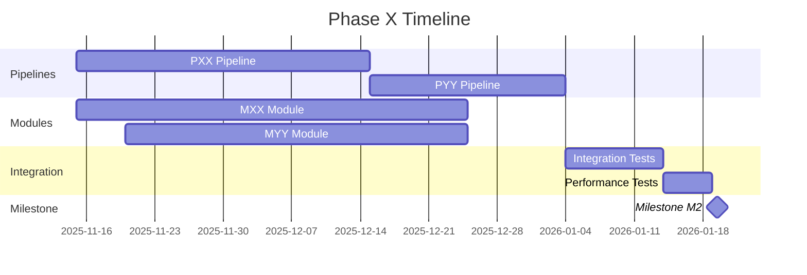

#### Current Status & Updates

**Latest Update**: YYYY-MM-DD

[Narrative status update: What's progressing? What's blocked? What's next?]

**Completed This Week**:

- [Item 1]
- [Item 2]

**Planned Next Week**:

- [Item 1]
- [Item 2]

**Blockers**:

- [Blocker 1]: [How to resolve]
- [Blocker 2]: [How to resolve]

---

## 6.3 Integration Dependency Levels

> **Purpose**: Define which pipelines/modules must be deployed before others

### Dependency Hierarchy

**Level 0: Kernel & Infrastructure** (no dependencies)

- Event bus
- Storage drivers
- Capability manager
- Trace propagation
- Configuration loader

**Level 1: Foundation Pipelines** (depend on Level 0)

- P18: Safety (monitors system)
- P19: Observability (traces/metrics)
- P20: Health (system health)

**Level 2: Core Ingress** (depend on Level 1)

- P01: Recall/Read
- P02: Write/Ingest
- M02: Attention Gate (used by P01, P02)

**Level 3: Core Processing** (depend on Level 2)

- M01: Hippocampus (used by P02)
- P03: Consolidation (depends on P02)
- P08: Embedding (depends on P02)

**Level 4: Advanced Processing** (depend on Level 3)

- P09: Search/Query (depends on P08)
- M03: Working Memory (used by multiple)

**Level 5: Intelligence** (depend on Levels 2-4)

- M10-M17: Advisory Modules
- M04: Global Workspace

**Level 6: Decision & Learning** (depend on Level 5)

- P04: Action/Arbitration (depends on M10-M17)
- P06: Learning Loop (depends on P04)

**Level 7: Synchronization** (depends on all above)

- P07: Sync (CRDT, multi-device)

### Dependency Rules

**Rule 1: Cannot Deploy Higher Level Before Lower**

- Must deploy Level N before Level N+1
- Violations blocked by deployment system

**Rule 2: Within-Level Dependencies Allowed**

- Pipelines at same level can depend on each other
- Must not create circular dependencies

**Rule 3: Cross-Level Dependencies**

- Can depend on any lower level
- Cannot depend on higher or same level (except within-level)

**Rule 4: Deployment Order Validation**

- Pre-deployment check validates dependency tree
- Fails if dependencies not satisfied

### Integration Testing Strategy

**Unit Tests** (Level 0):

- Test components in isolation
- Mock all dependencies
- Fast execution (< 1 second per test)

**Component Tests** (Level 1):

- Test module with real dependencies at same/lower level
- Mock higher-level dependencies
- Medium execution (< 10 seconds per test)

**Integration Tests** (Level 2):

- Test pipeline with real modules
- Real event bus, real storage
- Slower execution (< 60 seconds per test)

**End-to-End Tests** (Level 3):

- Test complete flows across pipelines
- All real components
- Slowest execution (< 5 minutes per test)

---

## 6.4 Milestone Tracking

> **Purpose**: Track major milestones and deliverables

### Milestone Registry

| Milestone ID | Milestone Name | Target Date | Actual Date | Status | Phase | Deliverables |
|--------------|----------------|-------------|-------------|--------|-------|--------------|
| | | | | | | |
| | | | | | | |
| | | | | | | |

**Milestone Status**:

- 🎯 Planned: Not started
- ⚠️ At Risk: Behind schedule or blocked
- ✅ Achieved: Complete
- ❌ Missed: Past due date

### Example Milestone (DO NOT COPY AS REAL DATA)

| Milestone ID | Milestone Name | Target Date | Actual Date | Status | Phase | Deliverables |
|--------------|----------------|-------------|-------------|--------|-------|--------------|
| M1 | Kernel Bootstrap | 2025-Q3 | 2025-09-30 | ✅ Achieved | Phase 1 | Event bus, Storage, Capabilities |
| M2 | Cognitive Core | 2026-Q1 | - | 🎯 Planned | Phase 2 | Hippocampus, Working Memory, Recall |

> ⚠️ **EXAMPLE ONLY**

### Milestone Criteria Template

For each milestone, define acceptance criteria:

#### Milestone MX: [Milestone Name]

**Target Date**: YYYY-MM-DD
**Owner**: [Team/Person]
**Phase**: Phase X

**Definition of Done**:

- [ ] All planned pipelines deployed
- [ ] All planned modules operational
- [ ] Integration tests passing (> 95%)
- [ ] Performance targets met
- [ ] Documentation complete
- [ ] Stakeholder demo successful
- [ ] Production readiness review passed

**Deliverables**:

1. [Deliverable 1] - [Description]
2. [Deliverable 2] - [Description]
3. [Deliverable 3] - [Description]

**Success Metrics**:

| Metric | Target | Actual | Status |
|--------|--------|--------|--------|
| Pipelines Deployed | X | Y | [✅/⚠️/❌] |
| Test Coverage | > 90% | Z% | [✅/⚠️/❌] |
| P95 Latency | < Xms | Yms | [✅/⚠️/❌] |
| Uptime | > 99.9% | Z% | [✅/⚠️/❌] |

**Dependencies**:

- Milestone M(X-1): [Previous milestone]
- External: [External dependency]

**Risks**:

| Risk | Mitigation | Status |
|------|------------|--------|
| [Risk 1] | [How mitigated] | [Resolved/Open] |
| [Risk 2] | [How mitigated] | [Resolved/Open] |

---

## 6.5 Work Breakdown Structure (WBS)

> **Purpose**: Break down phases into manageable work items

### WBS Template

**Phase X: [Phase Name]**

```
Phase X: [Phase Name]
├── 1. Design & Planning (2 weeks)
│   ├── 1.1 Write ADRs
│   ├── 1.2 Define contracts
│   ├── 1.3 Create module specs
│   └── 1.4 Review & approval
├── 2. Pipeline Development (4 weeks)
│   ├── 2.1 PXX: [Pipeline Name]
│   │   ├── 2.1.1 Core implementation
│   │   ├── 2.1.2 Event handlers
│   │   ├── 2.1.3 Unit tests
│   │   └── 2.1.4 Integration tests
│   └── 2.2 PYY: [Pipeline Name]
│       ├── 2.2.1 Core implementation
│       ├── 2.2.2 Event handlers
│       ├── 2.2.3 Unit tests
│       └── 2.2.4 Integration tests
├── 3. Module Development (4 weeks)
│   ├── 3.1 MXX: [Module Name]
│   │   ├── 3.1.1 Protocol definition
│   │   ├── 3.1.2 Component A
│   │   ├── 3.1.3 Component B
│   │   └── 3.1.4 Tests
│   └── 3.2 MYY: [Module Name]
│       └── [Similar breakdown]
├── 4. Integration & Testing (2 weeks)
│   ├── 4.1 Integration tests
│   ├── 4.2 Performance tests
│   ├── 4.3 Contract tests
│   └── 4.4 End-to-end tests
├── 5. Documentation (1 week)
│   ├── 5.1 Pipeline READMEs
│   ├── 5.2 Module READMEs
│   ├── 5.3 API documentation
│   └── 5.4 Runbooks
└── 6. Deployment (1 week)
    ├── 6.1 Staging deployment
    ├── 6.2 Smoke tests
    ├── 6.3 Production deployment
    └── 6.4 Monitoring validation
```

### Effort Estimation

**T-Shirt Sizing**:

- **XS**: < 1 day (trivial)
- **S**: 1-3 days (small)
- **M**: 4-7 days (medium)
- **L**: 2-4 weeks (large)
- **XL**: 1-3 months (extra large)

**Estimation Rules**:

- Always estimate worst-case scenario
- Include testing and documentation time
- Account for code review cycles
- Add 20% buffer for unknowns
- Re-estimate after spikes/POCs

---

## 6.6 Capacity Planning

> **Purpose**: Ensure team has capacity to deliver on schedule

### Team Velocity

**Historical Velocity** (points/sprint):

| Sprint | Planned | Completed | Velocity | Notes |
|--------|---------|-----------|----------|-------|
| Sprint 1 | X pts | Y pts | Y pts | [Notes] |
| Sprint 2 | X pts | Y pts | Y pts | [Notes] |

**Average Velocity**: [X points/sprint]

### Resource Allocation

| Role | Available Hours/Week | Current Allocation | Available Capacity |
|------|----------------------|--------------------|--------------------|
| Architect | 40h | 30h (75%) | 10h (25%) |
| Backend Dev | 40h | 40h (100%) | 0h (0%) |
| ML Engineer | 40h | 20h (50%) | 20h (50%) |

**Capacity Notes**:

- [Note 1: Resource constraint]
- [Note 2: Hiring plan]

### Sprint Planning

**Sprint Duration**: 2 weeks
**Sprint Capacity**: [X points]

**Upcoming Sprints**:

| Sprint | Start Date | Focus | Planned Points | Status |
|--------|------------|-------|----------------|--------|
| Sprint N | YYYY-MM-DD | [Focus area] | X pts | 🎯 Planned |
| Sprint N+1 | YYYY-MM-DD | [Focus area] | X pts | 📝 Draft |

---

## 6.7 Change Management

> **Purpose**: Handle scope changes, priority shifts, and roadmap adjustments

### Change Request Process

**When to submit a change request**:

- Adding new pipeline/module not in roadmap
- Changing milestone dates
- Deprioritizing planned work
- Significant scope changes

**Change Request Template**:

```markdown
## Change Request: CR-XXXX

**Requestor**: [Name]
**Date**: YYYY-MM-DD
**Priority**: [High/Medium/Low]

### Change Description
[What is changing?]

### Rationale
[Why is this change needed?]

### Impact Analysis
**Affected Phases**: [List]
**Affected Milestones**: [List]
**Schedule Impact**: [X days/weeks delay or none]
**Resource Impact**: [Additional resources needed?]
**Dependency Impact**: [What's affected?]

### Alternatives Considered
[What other options were considered?]

### Recommendation
[Approve/Reject/Defer]

### Approval
- [ ] Architect approval
- [ ] Product approval
- [ ] Stakeholder approval
```

### Roadmap Adjustment Rules

**Minor Adjustments** (no approval needed):

- Moving work within same phase
- Swapping equal-sized work items
- Updating estimates by < 20%

**Major Adjustments** (requires approval):

- Adding new phases
- Changing milestone dates
- Removing planned features
- Resource reallocation

**Emergency Adjustments** (immediate action):

- Critical bugs blocking progress
- Security vulnerabilities
- Production incidents

---

## 6.8 Risk Register

> **Purpose**: Track risks that could impact roadmap delivery

### Risk Registry

| Risk ID | Risk Description | Probability | Impact | Mitigation | Owner | Status |
|---------|------------------|-------------|--------|------------|-------|--------|
| | | | | | | |
| | | | | | | |
| | | | | | | |

**Probability**:

- High (> 50%): Likely to occur
- Medium (20-50%): Possible
- Low (< 20%): Unlikely

**Impact**:

- High: > 4 weeks delay or critical feature loss
- Medium: 1-4 weeks delay or feature degradation
- Low: < 1 week delay or minor impact

**Status**:

- 🟢 Mitigated: Risk addressed
- 🟡 Monitoring: Watching closely
- 🔴 Active: Currently impacting work
- ⚫ Closed: No longer a risk

### Example Risk (DO NOT COPY AS REAL DATA)

| Risk ID | Risk Description | Probability | Impact | Mitigation | Owner | Status |
|---------|------------------|-------------|--------|------------|-------|--------|
| R001 | Hippocampus module complexity higher than estimated | Medium | High | Spike/POC before full implementation | Architect | 🟡 Monitoring |

> ⚠️ **EXAMPLE ONLY**

---

**End of Part 6: Implementation Roadmap**

---

# Part 7: Decision Log & Governance

## 7.1 ADR Index & Cross-Links

> ⚠️ **IMPORTANT**: This index is the SOURCE OF TRUTH for all architectural decisions.
> Every ADR must be registered here. Update as ADRs move through lifecycle stages.
> DO NOT add example ADRs — only real, accepted architectural decisions.

### How to Use This Index

1. **Before creating an ADR**: Check if similar decision exists
2. **Add new row**: Include ADR ID, title, status, affected components
3. **Link to file**: Ensure ADR file exists in `docs/architecture/decisions-K0/`
4. **Update status**: Track Draft → Review → Accepted → Superseded
5. **Cross-link**: Update affected pipelines/modules to reference ADR

### ADR Index Table

| ADR ID | Title | Status | Affects | Date Created | Date Decided | Author | Link |
|--------|-------|--------|---------|--------------|--------------|--------|------|
| k003 | Hippocampus Architecture - Episodic Memory Encoding System | ✅ Accepted | M01, M02, M03, P02, P03 | 2025-11-16 | 2025-11-16 | TBD | `docs/architecture/decisions-K0/modules/k003-hippocampus-architecture.md` |
| k003.1 | DG Pattern Separation - SimHash + MinHash Fingerprinting | ✅ Accepted | M01, P02 | 2025-11-16 | 2025-11-16 | TBD | `docs/architecture/decisions-K0/modules/k003.1-dg-pattern-separation.md` |
| k003.2 | CA1 Semantic Bridge - spaCy NER + KG Templates | ✅ Accepted | M02, P02 | 2025-11-16 | 2025-11-16 | TBD | `docs/architecture/decisions-K0/modules/k003.2-ca1-semantic-bridge.md` |
| k003.3 | CA3 Clustering Service - Episode Deduplication and Pattern Discovery | ✅ Accepted | M03, P03 | 2025-11-16 | 2025-11-16 | TBD | `docs/architecture/decisions-K0/modules/k003.3-ca3-clustering-service.md` |
| k004 | Affect Service Architecture - Emotional Classification System | ✅ Accepted | M04, P02 | 2025-11-16 | 2025-11-16 | TBD | `docs/architecture/decisions-K0/modules/k004-affect-service.md` |
| k004.1 | Tier-0 Fast Affect Classification - Lexicon-Based Sentiment | ✅ Accepted | M04, P02 | 2025-11-16 | 2025-11-16 | TBD | `docs/architecture/decisions-K0/modules/k004.1-tier0-fast-affect.md` |
| k004.2 | Multi-Modal Affect Classification - Future Extension | 📝 Proposed | M04, P08 (future) | 2025-11-16 | TBD | TBD | `docs/architecture/decisions-K0/modules/k004.2-multimodal-affect.md` |
| k005.1 | ACL Resolution - Visibility Intersection and Space Ownership | ✅ Accepted | M05, P02 | 2025-11-16 | 2025-11-16 | TBD | `docs/architecture/decisions-K0/modules/k005.1-acl-resolution.md` |
| k006.1 | Write-Path Salience - Social + Affect + Recency Formula | ✅ Accepted | M06, P02, P06, P08 | 2025-11-16 | 2025-11-16 | TBD | `docs/architecture/decisions-K0/modules/k006.1-write-path-salience.md` |
| k007.1 | Temporal Profiler - 11-Dimension Time Indexing | ✅ Accepted | M08, P02 | 2025-11-16 | 2025-11-16 | TBD | `docs/architecture/decisions-K0/modules/k007.1-temporal-profiler.md` |
| k007.2 | Device Profiler - Multi-Device Family Support | ✅ Accepted | M09, P02 | 2025-11-16 | 2025-11-16 | TBD | `docs/architecture/decisions-K0/modules/k007.2-device-profiler.md` |
| k007.3 | Ingress Classifier - Channel and Activity Type Attribution | ✅ Accepted | M10, P02 | 2025-11-16 | 2025-11-16 | TBD | `docs/architecture/decisions-K0/modules/k007.3-ingress-classifier.md` |
| k007.4 | Retention Lookup - Lifecycle Policy Resolution and GDPR Compliance | ✅ Accepted | M11, P02 | 2025-11-16 | 2025-11-16 | TBD | `docs/architecture/decisions-K0/modules/k007.4-retention-lookup.md` |
| k007.5 | Geo Metadata Lookup - Privacy-Preserving Location Context | ✅ Accepted | M12, P02 | 2025-11-16 | 2025-11-16 | TBD | `docs/architecture/decisions-K0/modules/k007.5-geo-metadata.md` |
| k008.1 | Family Graph Resolver - Social Context and Relationship Attribution | ✅ Accepted | M07, P02 | 2025-11-16 | 2025-11-16 | TBD | `docs/architecture/decisions-K0/modules/k008.1-family-graph-resolver.md` |
| k009.1 | HippEvents Row Builder - st_hipp_events Assembly and Validation | ✅ Accepted | M13, P02 | 2025-11-16 | 2025-11-16 | TBD | `docs/architecture/decisions-K0/modules/k009.1-hipp-events-builder.md` |
| k009.2 | Embedding Queue Writer - st_embedding_queue Job Scheduling | ✅ Accepted | M14, P02 | 2025-11-16 | 2025-11-16 | TBD | `docs/architecture/decisions-K0/modules/k009.2-embedding-queue-writer.md` |
| k010.1 | Atomic UnitOfWork Writer - P02 Three-Table Transaction Commit | ✅ Accepted | M16, P02 | 2025-11-16 | 2025-11-16 | K0 Architecture Team | `docs/architecture/decisions-K0/modules/k010.1-atomic-uow-writer.md` |
| k011.1 | Outbox Event Emitter - P02 Downstream Event Propagation via st_outbox | ✅ Accepted | M17, P02 | 2025-11-16 | 2025-11-16 | K0 Architecture Team | `docs/architecture/decisions-K0/modules/k011.1-outbox-emitter.md` |

**ADR Status**:

- 📝 Draft: Initial writing, gathering feedback
- 👀 Review: Under formal review
- ✅ Accepted: Approved and active
- ⚠️ Deprecated: Superseded by newer ADR
- ❌ Rejected: Not accepted
- 🔄 Amended: Modified after acceptance

**Affects Format**: List as "PXX, MYY, Part Z.N" (pipelines, modules, document sections)

### Example ADR Entry (DO NOT COPY AS REAL DATA)

| ADR ID | Title | Status | Affects | Date Created | Date Decided | Author | Link |
|--------|-------|--------|---------|--------------|--------------|--------|------|
| ADR-0031 | Hippocampal Encoding Strategy | ✅ Accepted | M01, P02 | 2025-10-15 | 2025-11-01 | [Name] | `docs/architecture/decisions-K0/0031-hippocampal-encoding.md` |

> ⚠️ **EXAMPLE ONLY** - Do not treat this as actual ADR data

---

## 7.2 ADR Template & Writing Guide

### Standard ADR Template

Location: `docs/architecture/decisions-K0/XXXX-title.md`

```markdown
# ADR-XXXX: [Title]

**Status**: [Draft | Review | Accepted | Deprecated | Rejected | Amended]
**Date**: YYYY-MM-DD
**Author**: [Name]
**Affects**: [List of pipelines/modules]
**Supersedes**: [ADR-YYYY] (if applicable)
**Superseded By**: [ADR-ZZZZ] (if applicable)

---

## Context

[Describe the issue/problem that needs a decision. Include:]
- What is the architectural problem?
- What constraints exist (technical, business, regulatory)?
- What goals are we trying to achieve?
- What assumptions are we making?
- What is the current situation?

## Decision

[State the decision clearly and concisely. This should be actionable.]

We will [action verb] [decision] because [primary reason].

### Implementation Details

[Provide specific implementation guidance:]
- How will this be implemented?
- What components are affected?
- What changes are required?
- What timeline is expected?

## Consequences

### Positive Consequences (Benefits)

- [Benefit 1]
- [Benefit 2]
- [Benefit 3]

### Negative Consequences (Costs/Trade-offs)

- [Trade-off 1]
- [Trade-off 2]
- [Trade-off 3]

### Neutral Consequences

- [Neutral impact 1]
- [Neutral impact 2]

## Alternatives Considered

### Alternative 1: [Name]

**Description**: [What is this alternative?]

**Pros**:
- [Pro 1]
- [Pro 2]

**Cons**:
- [Con 1]
- [Con 2]

**Why Not Chosen**: [Reason]

### Alternative 2: [Name]

[Same structure]

## Related Decisions

- ADR-XXXX: [Related decision]
- ADR-YYYY: [Related decision]

## References

- [Link to research]
- [Link to spike/POC]
- [Link to discussion]
- [Link to external documentation]

## Notes

[Any additional notes, future considerations, or follow-up actions]

---

**Review History**:
| Date | Reviewer | Feedback | Resolution |
|------|----------|----------|------------|
| YYYY-MM-DD | [Name] | [Feedback] | [How addressed] |
```

### ADR Writing Best Practices

**Do**:

- ✅ Focus on "why" not "how" (rationale over implementation)
- ✅ Be specific about constraints and assumptions
- ✅ List alternatives considered (at least 2)
- ✅ Explain trade-offs clearly
- ✅ Link to related ADRs
- ✅ Update status as decision evolves
- ✅ Use plain language (avoid jargon)

**Don't**:

- ❌ Write implementation details (that goes in code/READMEs)
- ❌ Skip alternatives section
- ❌ Ignore negative consequences
- ❌ Make decisions without context
- ❌ Leave status as "Draft" forever
- ❌ Delete superseded ADRs (mark as deprecated)

---

## 7.3 Open Design Questions

> **Purpose**: Track unresolved architectural questions that need decisions

### Open Questions Table

| Q-ID | Question | Context | Options | Impact | Decision Needed By | Owner | Status | ADR Link |
|------|----------|---------|---------|--------|-------------------|-------|--------|----------|
| | | | | | | | | |
| | | | | | | | | |
| | | | | | | | | |

**Question Status**:

- 🔴 Critical: Blocking work, needs immediate decision
- 🟡 Important: Needed soon, work can proceed with assumptions
- 🟢 Nice-to-Have: Not urgent, can defer
- 🔵 Resolved: Decision made, ADR written
- ⚫ Closed: No longer relevant

### Example Open Question (DO NOT COPY AS REAL DATA)

| Q-ID | Question | Context | Options | Impact | Decision Needed By | Owner | Status | ADR Link |
|------|----------|---------|---------|--------|-------------------|-------|--------|----------|
| Q001 | Should consolidation run synchronously or asynchronously? | P03 design phase | A) Sync (blocking), B) Async (fire-and-forget), C) Hybrid | Affects P02 latency, P03 complexity | 2025-12-01 | Architect | 🟡 Important | - |

> ⚠️ **EXAMPLE ONLY**

### Question Resolution Process

1. **Raise Question**: Add to Open Questions Table
2. **Gather Context**: Research, spike, POC if needed
3. **Identify Options**: List at least 2-3 alternatives
4. **Analyze Impact**: What components affected?
5. **Set Deadline**: When must decision be made?
6. **Assign Owner**: Who will drive decision?
7. **Review**: Discuss with team/stakeholders
8. **Decide**: Make decision
9. **Document**: Write ADR
10. **Close**: Update status to Resolved, link ADR

---

## 7.4 Design Debt Tracker

> **Purpose**: Track architectural shortcuts, technical debt, and items needing refactoring

### Design Debt Table

| Debt-ID | Description | Created | Reason for Debt | Impact | Payback Plan | Priority | Owner | Status |
|---------|-------------|---------|-----------------|--------|--------------|----------|-------|--------|
| | | | | | | | | |
| | | | | | | | | |
| | | | | | | | | |

**Priority**:

- P0: Critical (must fix before next release)
- P1: High (fix within 2 releases)
- P2: Medium (fix within 6 months)
- P3: Low (fix when convenient)

**Status**:

- 🟠 Unpaid: Not yet addressed
- 🟡 Planned: Scheduled for payback
- 🟢 Paid: Refactored/resolved
- 🔴 Accruing Interest: Getting worse over time
- ⚫ Accepted: Permanent trade-off

### Example Design Debt (DO NOT COPY AS REAL DATA)

| Debt-ID | Description | Created | Reason for Debt | Impact | Payback Plan | Priority | Owner | Status |
|---------|-------------|---------|-----------------|--------|--------------|----------|-------|--------|
| DD001 | Hippocampus DG uses simple hashing instead of learned embeddings | 2025-11-01 | MVP speed, lack of training data | Lower pattern separation quality | Switch to learned embeddings in Phase 3 | P1 | ML Team | 🟡 Planned |

> ⚠️ **EXAMPLE ONLY**

### Debt Accumulation Rules

**Acceptable Debt** (intentional trade-offs):

- MVP shortcuts for speed (with payback plan)
- Performance optimizations deferred (with benchmarks)
- Feature simplifications (with upgrade path)

**Unacceptable Debt** (not allowed):

- Skipping tests
- Ignoring security issues
- Breaking architectural principles
- Violating ADR decisions

### Debt Review Schedule

- **Weekly**: Review P0 debt items
- **Monthly**: Review all debt, update priorities
- **Quarterly**: Allocate sprint capacity for debt payback (20% target)

---

## 7.5 Breaking Changes Log

> **Purpose**: Track all breaking changes requiring coordination with K1 or consumers

### Breaking Changes Table

| Change-ID | Description | Component | Date Introduced | Effective Date | Migration Path | Deprecation Date | Affected Consumers | ADR |
|-----------|-------------|-----------|-----------------|----------------|----------------|------------------|-------------------|-----|
| | | | | | | | | |
| | | | | | | | | |
| | | | | | | | | |

**Component Types**: Pipeline, Module, Event Schema, API Contract, Storage Schema

### Example Breaking Change (DO NOT COPY AS REAL DATA)

| Change-ID | Description | Component | Date Introduced | Effective Date | Migration Path | Deprecation Date | Affected Consumers | ADR |
|-----------|-------------|-----------|-----------------|----------------|----------------|------------------|-------------------|-----|
| BC001 | Memory write event schema changes from v1 to v2 | Event Schema | 2025-11-01 | 2026-01-01 | Emit both v1/v2 for 2 releases | 2026-03-01 | P03, P06, P08 | ADR-0045 |

> ⚠️ **EXAMPLE ONLY**

### Breaking Change Process

1. **Identify Breaking Change**: During design/implementation
2. **Create ADR**: Document rationale and alternatives
3. **Add to Log**: Register in Breaking Changes Table
4. **Notify Consumers**: Alert all affected components
5. **Write Migration Guide**: Step-by-step instructions
6. **Transition Period**: Support old + new versions (min 2 releases)
7. **Deprecation Warning**: Mark old version deprecated
8. **Remove Old Version**: After deprecation date

### Breaking Change Rules

**Minimum Transition Period**:

- Event schemas: 2 MINOR versions
- Modules: 2 MINOR versions or 3 months
- Storage schemas: 6 months (requires data migration)
- APIs: 1 MAJOR version

**Required Documentation**:

- ADR explaining change
- Migration guide with code examples
- Deprecation warnings in logs/docs
- Update all affected READMEs

---

## 7.6 Governance Workflow

### Architecture Review Board (ARB)

**Purpose**: Review and approve architectural decisions

**Composition**:

- Lead Architect (chair)
- Senior Engineers (2-3)
- Product Representative
- Optional: Domain experts as needed

**Meeting Cadence**: Bi-weekly or as-needed

**Agenda**:

1. Review new ADRs in "Review" status
2. Review open design questions
3. Review design debt priorities
4. Review breaking changes
5. Discuss architectural concerns

### ADR Lifecycle Governance

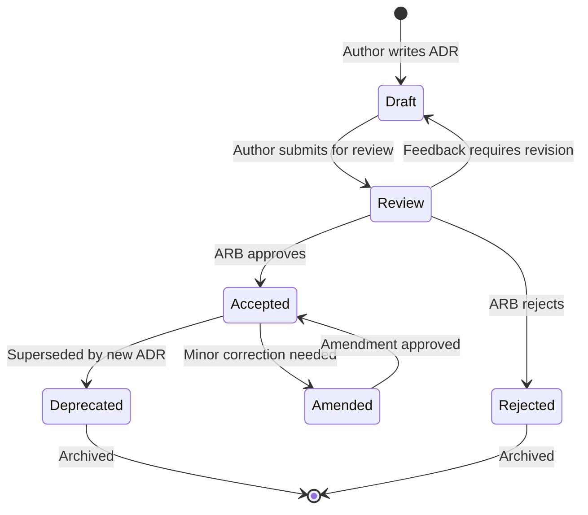

**State Transitions**:

| From | To | Trigger | Required Action |
|------|----|---------|--------------------|
| Draft | Review | Author submits | Schedule ARB review |
| Review | Accepted | ARB approves | Update index, notify affected teams |
| Review | Rejected | ARB rejects | Document reason, close |
| Review | Draft | Feedback | Author revises |
| Accepted | Deprecated | New ADR supersedes | Create new ADR, update links |
| Accepted | Amended | Minor fix | Document amendment, re-approve |

### Decision Authority Matrix

| Decision Type | Authority | Approval Required |
|---------------|-----------|-------------------|
| New pipeline/module | Lead Architect | ARB review |
| Event schema change (non-breaking) | Pipeline Owner | None |
| Event schema change (breaking) | Lead Architect | ARB + affected teams |
| Storage schema change | Lead Architect | ARB + DBA review |
| Module protocol change (breaking) | Module Owner | ARB + consumers |
| Phase/milestone change | Lead Architect | Stakeholder approval |
| Technology choice | Lead Architect | ARB review |

### Escalation Process

**Level 1**: Team discussion (informal)
**Level 2**: Lead Architect decision
**Level 3**: ARB decision
**Level 4**: Stakeholder/executive decision

**Escalate to next level when**:

- No consensus at current level
- Impact exceeds authority level
- Cross-team coordination required
- Strategic implications

---

**End of Part 7: Decision Log & Governance**

---

# Part 8: Quality & Performance

## 8.1 Performance Budgets

> ⚠️ **IMPORTANT**: These budgets are contractual obligations.
> Exceeding budgets requires ADR justification and stakeholder approval.
> DO NOT add example budgets — only real, approved performance targets.

### How to Use Performance Budgets

1. **Set targets**: Define P95/P99 latency, throughput, resource limits
2. **Track actuals**: Measure in production
3. **Alert on violations**: Configure monitoring alerts
4. **Review regularly**: Monthly performance review meetings
5. **Adjust with care**: Changes require ADR and approval

### System-Wide Performance Budgets

| Metric | Target | Rationale | Measured | Alert Threshold | Status |
|--------|--------|-----------|----------|-----------------|--------|
| | | | | | |
| | | | | | |

**Status**:

- ✅ Met: Within target
- ⚠️ At Risk: Within 10% of limit
- ❌ Violated: Exceeding target
- 📊 Not Yet Measured: In development

### Example System Budget (DO NOT COPY AS REAL DATA)

| Metric | Target | Rationale | Measured | Alert Threshold | Status |
|--------|--------|-----------|----------|-----------------|--------|
| End-to-end write latency (P95) | < 100ms | User expectation for real-time feel | 78ms | 90ms | ✅ Met |
| Memory footprint (per family) | < 500MB | Edge device constraints | 420MB | 450MB | ✅ Met |

> ⚠️ **EXAMPLE ONLY**

### Per-Pipeline Performance Budgets

| Pipeline | Operation | P95 Latency | P99 Latency | Throughput | Memory | CPU | Status |
|----------|-----------|-------------|-------------|------------|--------|-----|--------|
| | | | | | | | |
| | | | | | | | |
| | | | | | | | |

### Per-Module Performance Budgets

| Module | Operation | P95 Latency | P99 Latency | Throughput | Memory | CPU | Status |
|--------|-----------|-------------|-------------|------------|--------|-----|--------|
| | | | | | | | |
| | | | | | | | |
| | | | | | | | |

### Performance Budget Rules

**Setting Budgets**:

1. Based on user research (perceived performance)
2. Informed by device constraints (edge deployment)
3. Aligned with business goals (SLAs)
4. Validated through benchmarking
5. Documented in ADR

**Budget Violations**:

- **Minor** (< 10% over): Warning, investigate
- **Major** (10-25% over): Must fix in next release
- **Critical** (> 25% over): Blocks deployment

**Budget Adjustments**:

- Require ADR with justification
- Must show impossibility or extreme cost to meet
- Requires stakeholder approval
- Updates to contracts/SLAs if customer-facing

---

## 8.2 Test Requirements Matrix

> **Purpose**: Define testing requirements for all components

### Test Coverage Requirements

| Component Type | Unit Test Coverage | Integration Test Coverage | Contract Test Coverage | Performance Test Coverage | Required? |
|----------------|-------------------|---------------------------|------------------------|---------------------------|-----------|
| Pipeline | 90% | 80% | 100% (all events) | 100% (all operations) | ✅ Yes |
| Module | 90% | 80% | 100% (protocol) | 100% (all operations) | ✅ Yes |
| Utility/Helper | 80% | N/A | N/A | N/A | ✅ Yes |
| Script/Tool | 60% | N/A | N/A | N/A | ⚠️ Recommended |

### Test Type Definitions

**Unit Tests**:

- **What**: Test individual functions/methods in isolation
- **Mocking**: Mock all dependencies
- **Speed**: < 1 second per test
- **Location**: `<component>/tests/test_*.py`

**Integration Tests**:

- **What**: Test component with real dependencies
- **Mocking**: Minimal, prefer real components
- **Speed**: < 60 seconds per test
- **Location**: `tests/integration/k0/<component>/`

**Contract Tests**:

- **What**: Validate protocol compliance, schema validation
- **Mocking**: None, test actual contracts
- **Speed**: < 5 seconds per test
- **Location**: `tests/contracts/k0/<component>/`

**Performance Tests**:

- **What**: Validate latency, throughput, resource usage
- **Mocking**: None, production-like environment
- **Speed**: Variable (minutes)
- **Location**: `tests/performance/k0/<component>/`

**End-to-End Tests**:

- **What**: Test complete user flows across system
- **Mocking**: None, full system
- **Speed**: < 5 minutes per test
- **Location**: `tests/e2e/`

### Test Pyramid

```
        /\
       /E2E\       < 10% (slow, comprehensive)
      /------\
     /  Perf  \    ~ 10% (targeted benchmarks)
    /----------\
   / Contract   \  ~ 15% (interface validation)
  /--------------\
 /  Integration   \ ~ 25% (component interaction)
/------------------\
/   Unit Tests      \ ~ 40% (fast, isolated)
```

### Testing Checklist (Per Component)

**Before Merging to Main**:

- [ ] All tests passing
- [ ] Coverage thresholds met
- [ ] No flaky tests
- [ ] Performance budgets validated
- [ ] Contract tests updated (if contracts changed)
- [ ] Integration tests added (if new dependencies)

**Before Production Deployment**:

- [ ] All tests passing (including E2E)
- [ ] Performance tests run in staging
- [ ] Load tests completed
- [ ] Failure scenario tests passed
- [ ] Rollback plan tested

---

## 8.3 Observability Hooks

> **Purpose**: Define monitoring, logging, tracing, and alerting requirements

### Observability Requirements

Every pipeline and module must implement:

**1. Structured Logging**:

- Use JSON format
- Include: `cognitive_trace_id`, `timestamp_ms`, `level`, `component`, `message`
- Log at appropriate levels: DEBUG, INFO, WARN, ERROR

**2. Metrics Emission**:

- Operation latency (histogram)
- Operation count (counter)
- Error count (counter)
- Resource usage (gauge)

**3. Distributed Tracing**:

- Create spans for major operations
- Propagate trace context via `cognitive_trace_id`
- Include relevant attributes (operation, status, error)

**4. Health Checks**:

- Readiness probe (can accept traffic?)
- Liveness probe (is process alive?)
- Health endpoint (`/health`, `/ready`)

### Observability Maturity Levels

| Level | Name | Requirements | Status |
|-------|------|--------------|--------|
| 0 | None | No observability | ❌ Not Acceptable |
| 1 | Basic | Logs + basic metrics | ⚠️ Minimum |
| 2 | Standard | Logs + metrics + traces | ✅ Required |
| 3 | Advanced | + distributed tracing + custom dashboards | 🎯 Goal |
| 4 | Exemplary | + SLIs/SLOs + auto-remediation | 🏆 Aspirational |

**All pipelines/modules must achieve Level 2 (Standard) before production.**

### Metric Naming Conventions

Format: `{namespace}.{component}.{metric_name}`

**Examples**:

- `k0.pipeline.p02.write_latency_ms`
- `k0.module.m01.hippocampus_encoding_duration_ms`
- `k0.module.m02.gate_rejections_total`

**Metric Types**:

- **Counter**: Monotonically increasing (errors, requests)
- **Gauge**: Point-in-time value (memory usage, queue depth)
- **Histogram**: Distribution of values (latency)
- **Summary**: Percentiles (P95, P99)

### Log Levels & Usage

| Level | When to Use | Examples | Sampling |
|-------|-------------|----------|----------|
| DEBUG | Detailed debugging info | Internal state, loop iterations | 1% in prod |
| INFO | Normal operations | Operation start/complete, milestones | 100% |
| WARN | Recoverable errors | Retry attempts, fallback used, degraded mode | 100% |
| ERROR | Unrecoverable errors | Operation failed, data corruption, exceptions | 100% |

### Alerting Rules

**Critical Alerts** (page on-call):

- Error rate > 1% for 5 minutes
- P99 latency > 2x budget for 5 minutes
- Service unavailable
- Data loss detected

**Warning Alerts** (notify channel):

- Error rate > 0.5% for 10 minutes
- P95 latency > 1.5x budget for 10 minutes
- Degraded performance
- Resource usage > 80%

**Info Alerts** (log only):

- Deployment events
- Configuration changes
- Scaling events

---

## 8.4 Resource Budgets

> **Purpose**: Define CPU, memory, storage, and network limits for edge deployment

### Resource Constraints (Edge Devices)

**Target Devices**:

- Raspberry Pi 4 (4GB RAM)
- Intel NUC (8GB RAM)
- Mobile devices (limited background processing)

**System-Wide Budgets**:

| Resource | Budget | Rationale | Measured | Status |
|----------|--------|-----------|----------|--------|
| Memory (RSS) | < 2GB | Leave room for OS + other apps | - | 📊 Not Yet Measured |
| CPU (average) | < 30% | Battery life, thermal limits | - | 📊 Not Yet Measured |
| Storage | < 10GB | Limited device storage | - | 📊 Not Yet Measured |
| Network | < 1MB/min | Cellular data plans | - | 📊 Not Yet Measured |

### Per-Component Resource Budgets

| Component | Memory | CPU | Disk I/O | Network | Notes |
|-----------|--------|-----|----------|---------|-------|
| | | | | | |
| | | | | | |
| | | | | | |

### Resource Profiling

**Required Profiling**:

- [ ] Memory profiling (heap analysis)
- [ ] CPU profiling (hotspot identification)
- [ ] I/O profiling (disk read/write patterns)
- [ ] Network profiling (bandwidth usage)

**Tools**:

- Memory: `memory_profiler`, `tracemalloc`
- CPU: `cProfile`, `py-spy`
- I/O: `iotop`, custom instrumentation
- Network: `tcpdump`, custom instrumentation

### Resource Optimization Strategies

**Memory**:

- Use generators instead of lists
- Implement LRU caches with size limits
- Stream large data instead of loading in memory
- Profile and fix memory leaks

**CPU**:

- Use async/await for I/O-bound operations
- Batch processing instead of real-time for non-critical
- Offload heavy computation to background tasks
- Profile and optimize hot paths

**Storage**:

- Use compression (zstd)
- Implement retention policies
- Use WAL for SQLite
- Vacuum databases regularly

**Network**:

- Batch events instead of real-time
- Compress payloads
- Use delta sync instead of full sync
- Implement backpressure

---

## 8.5 Quality Gates

> **Purpose**: Define quality criteria that must be met before advancing stages

### Quality Gate: Design → Planning

**Criteria**:

- [ ] Design dossier complete (problem, requirements, flow)
- [ ] At least 1 ADR drafted
- [ ] Brain analog validated (if applicable)
- [ ] Dependencies identified
- [ ] No unresolved critical design questions

**Reviewers**: Lead Architect + 1 senior engineer

### Quality Gate: Planning → Implementation

**Criteria**:

- [ ] All ADRs accepted
- [ ] All contracts defined (events, protocols, schemas)
- [ ] All syscalls specified
- [ ] Performance budgets set
- [ ] Test strategy documented
- [ ] No blocking design debt

**Reviewers**: Lead Architect + ARB

### Quality Gate: Implementation → Production

**Criteria**:

- [ ] All tests passing (unit, integration, contract, performance)
- [ ] Code coverage thresholds met
- [ ] Performance budgets validated
- [ ] Security review completed
- [ ] Documentation complete (README, API docs, runbooks)
- [ ] Observability configured (logs, metrics, traces, alerts)
- [ ] Deployment plan reviewed
- [ ] Rollback plan tested

**Reviewers**: Lead Architect + SRE + Security

### Quality Gate: Production → Stable

**Criteria**:

- [ ] In production for 30 days
- [ ] No critical incidents
- [ ] SLAs met consistently
- [ ] No major bugs reported
- [ ] Performance budgets met
- [ ] Observability data validated

**Reviewers**: Lead Architect + SRE

---

**End of Part 8: Quality & Performance**

---

# Part 9: Reference Materials

## 9.1 Glossary

> **Purpose**: Define all terms, acronyms, and concepts used throughout K0 architecture

### Core Concepts

**Band (QoS Band)**

- Classification of data/operations by importance: GREEN (best-effort), AMBER (important), RED (critical)
- Determines processing priority, retry behavior, and resource allocation
- See: Part 4.7 Event Bus Architecture

**Brain Analog**

- A neuroscience-inspired metaphor mapping biological brain systems to software components
- Used to guide architecture design and maintain consistency
- Example: Hippocampus (episodic memory encoding) → M01 Hippocampus module

**Capability**

- A permission grant for accessing storage tables via syscalls
- Format: `{table_name}.{operation}` (e.g., `st_episodic.write`)
- Enforces least-privilege security model
- See: Part 5.6 Syscall Capability Model

**Cognitive Trace ID**

- A unique identifier (`cognitive_trace_id`) propagated across all operations
- Used for distributed tracing and debugging
- Format: UUID v4
- Required in all events, logs, and spans

**Contract**

- A formal specification of data structure or interface
- Types: Event Schema, Protocol, Data Model, API Contract, Storage Schema
- Versioned and validated at runtime
- See: Part 5.1 Global Contract Registry

**Envelope**

- Standard wrapper around all events containing metadata (trace ID, timestamp, family ID, band, etc.)
- Ensures consistent event structure across the system
- See: Part 4.7 Event Bus Architecture

**Episode / Episodic Memory**

- A discrete memory of a specific event with temporal and spatial context
- Stored in `st_episodic` table
- Processed by Hippocampus module (M01)
- See: Pipeline P02 (Write/Ingest)

**Fast Lane**

- Low-latency execution path with minimal processing overhead
- Used for high-priority, time-sensitive operations
- Bypasses some policy checks and middleware
- Contrast: Smart Lane

**Family**

- A group of users sharing memories and context (e.g., household)
- Primary partitioning key for data isolation
- Identified by `family_id` (UUID)

**MLS (Multi-Level Security)**

- Security model with hierarchical classification levels (bands)
- Data tagged with sensitivity level (GREEN/AMBER/RED)
- Enforces access control and data flow policies

**Module**

- A reusable, protocol-defined component representing a brain region or function
- Identified by M01-M20
- Implements `ModuleProtocol` interface
- See: Part 3 Module Design Workbench

**Pipeline**

- An orchestrated workflow handling specific cognitive operations
- Identified by P01-P20
- Implements `PipelineProtocol` interface
- See: Part 2 Pipeline Design Workbench

**Protocol (Python Protocol)**

- A type-safe interface definition using Python's `@runtime_checkable` Protocol
- Defines public API for modules and pipelines
- Enforced at runtime for duck-typing validation

**Semantic Memory**

- General knowledge extracted from episodic memories (facts, concepts)
- Stored in `st_semantic` table
- Created by consolidation process (P03)

**Smart Lane**

- Standard execution path with full policy enforcement and processing
- Used for normal operations requiring validation and transformation
- Contrast: Fast Lane

**Space**

- A logical partition within a family for organizing memories
- Identified by `space_id` (UUID)
- Examples: "Work", "Personal", "Kids"

**Syscall**

- A controlled storage access operation requiring capability grant
- Enforces security boundaries and audit logging
- Format: `{table_name}.{operation}`
- See: Part 5.2 Syscall Matrix

**UoW (Unit of Work)**

- A transactional boundary ensuring atomicity of operations
- Groups related database operations into single commit/rollback unit

**Working Memory**

- Short-term active memory for current context and ongoing tasks
- Implemented by module M03
- Similar to brain's prefrontal cortex

### Brain Region Mappings

**Hippocampus**

- Brain region: Medial temporal lobe
- Function: Episodic memory encoding, pattern separation, consolidation
- K0 Module: M01 Hippocampus
- Subregions: DG (Dentate Gyrus), CA3, CA1

**Thalamus**

- Brain region: Central relay station
- Function: Sensory gating, attention filtering
- K0 Module: M02 Attention Gate
- Role: Admission control, salience detection

**Prefrontal Cortex**

- Brain region: Frontal lobe
- Function: Working memory, executive function, planning
- K0 Module: M03 Working Memory
- Role: Active context maintenance

**Global Workspace**

- Theory: Global Workspace Theory (Baars)
- Function: Conscious awareness, information broadcasting
- K0 Module: M04 Global Workspace
- Role: Cross-module communication, SSE streaming

### Acronyms

| Acronym | Full Form | Description |
|---------|-----------|-------------|
| ADR | Architectural Decision Record | Document recording architectural decisions |
| API | Application Programming Interface | External interface for system interaction |
| ARB | Architecture Review Board | Governance body for architectural decisions |
| CA1/CA3 | Cornu Ammonis 1/3 | Hippocampal subregions |
| CRDT | Conflict-free Replicated Data Type | Data structure for distributed sync |
| DAG | Directed Acyclic Graph | Dependency graph representation |
| DG | Dentate Gyrus | Hippocampal subregion for pattern separation |
| DLQ | Dead Letter Queue | Queue for failed/unprocessable events |
| E2E | End-to-End | Full system integration testing |
| KG | Knowledge Graph | Semantic network of concepts and relations |
| LLM | Large Language Model | AI model for text generation |
| MLS | Multi-Level Security | Hierarchical security classification |
| MVP | Minimum Viable Product | Basic functional version |
| NPU | Neural Processing Unit | Specialized AI hardware |
| P95/P99 | 95th/99th Percentile | Performance metrics (latency) |
| POC | Proof of Concept | Experimental validation |
| QoS | Quality of Service | Service level guarantees |
| SLA | Service Level Agreement | Contractual performance commitment |
| SLI | Service Level Indicator | Measurable performance metric |
| SLO | Service Level Objective | Target value for SLI |
| SRE | Site Reliability Engineering | Operations + engineering discipline |
| SSE | Server-Sent Events | Real-time server-to-client streaming |
| UoW | Unit of Work | Transactional boundary pattern |
| WBS | Work Breakdown Structure | Hierarchical task decomposition |

---

## 9.2 Naming Conventions

> **Purpose**: Enforce consistent naming across the entire codebase

### File & Directory Naming

**Pipelines**:

- Folder: `k0/pipelines/pXX_name/` (lowercase, underscores)
- Module: `k0/pipelines/pXX_name/pipeline.py`
- README: `k0/pipelines/pXX_name/README.md`
- Example: `k0/pipelines/p02_write/pipeline.py`

**Modules**:

- Folder: `k0/modules/mXX_name/` (lowercase, underscores)
- Module: `k0/modules/mXX_name/module.py`
- Protocol: `k0/modules/mXX_name/__init__.py` (exports protocol)
- README: `k0/modules/mXX_name/README.md`
- Example: `k0/modules/m01_hippocampus/module.py`

**Tests**:

- Unit: `<component>/tests/test_<name>.py`
- Integration: `tests/integration/k0/<component>/test_<name>.py`
- Contract: `tests/contracts/k0/<component>/test_<name>.py`
- Performance: `tests/performance/k0/<component>/test_<name>.py`

**Schemas**:

- Event: `contracts/schemas/<namespace>/<name>.v<N>.json`
- Example: `contracts/schemas/cognitive/memory_write_request.v1.json`

### Code Naming

**Python Classes**:

- Pipelines: `<Name>Pipeline` (PascalCase)
  - Example: `WriteIngestPipeline`
- Modules: `<Name>Module` (PascalCase)
  - Example: `HippocampusModule`
- Protocols: `<Name>Protocol` (PascalCase)
  - Example: `HippocampusProtocol`
- Models: `<Name>Model` or `<Name>` (PascalCase)
  - Example: `EpisodicMemoryModel`, `CommandEnvelope`

**Python Functions/Methods**:

- Use snake_case
- Verbs for actions: `encode_episode()`, `validate_input()`
- Nouns for queries: `get_status()`, `retrieve_memory()`
- Boolean predicates: `is_valid()`, `has_capability()`

**Python Variables**:

- Use snake_case
- Descriptive names: `cognitive_trace_id`, `family_id`, `episode_data`
- No single letters except loop counters (i, j, k)
- Constants in UPPER_SNAKE_CASE: `MAX_RETRY_COUNT`, `DEFAULT_TIMEOUT_MS`

### Event Naming

**Pattern**: `{namespace}.{component}.{action}.v{version}`

**Namespaces**:

- `cognitive.*` - Memory, cognition operations
- `intelligence.*` - Advisory, learning signals
- `system.*` - System lifecycle events
- `infra.*` - Infrastructure events
- `privacy.*` - Privacy control events
- `sync.*` - Synchronization events
- `external.*` - External system events

**Components**: Singular nouns (memory, pipeline, module, hippocampus)

**Actions**:

- Requests: `request`, `query`, `command`
- Completions: `committed`, `completed`, `succeeded`, `failed`
- States: `started`, `stopped`, `updated`, `deleted`
- Gerunds: `processing`, `encoding`, `consolidating`

**Examples**:

- `cognitive.memory.write.request.v1`
- `cognitive.memory.write.committed.v1`
- `intelligence.advisory.decision.ready.v1`
- `system.pipeline.started.v1`

### Storage Naming

**Tables**:

- Prefix: `st_` for storage tables, `tmp_` for temporary
- Use snake_case: `st_episodic`, `st_semantic`, `st_hipp_log`
- Descriptive: Indicate content or purpose

**Columns**:

- Use snake_case: `family_id`, `created_at`, `cognitive_trace_id`
- Standard suffixes:
  - `_id`: Foreign keys or identifiers
  - `_at`: Timestamps
  - `_ms`: Millisecond precision values
  - `_count`: Counters
  - `_flag`: Boolean values

**Indexes**:

- Format: `idx_{table}_{columns}`
- Example: `idx_episodic_family_created`

**Constraints**:

- Format: `{type}_{table}_{detail}`
- Example: `fk_episodic_family`, `chk_episodic_band`

### Capability Naming

**Format**: `{table_name}.{operation}`

**Operations**: `read`, `write`, `update`, `delete`, `*` (all)

**Examples**:

- `st_episodic.write`
- `st_semantic.read`
- `st_hipp_log.write`

### Metric Naming

**Format**: `{namespace}.{component}.{metric_name}`

**Examples**:

- `k0.pipeline.p02.write_latency_ms`
- `k0.module.m01.encoding_duration_ms`
- `k0.module.m02.gate_rejections_total`

**Metric Name Conventions**:

- Latency: `*_latency_ms`, `*_duration_ms`
- Counts: `*_total`, `*_count`
- Rates: `*_rate`, `*_per_second`
- Gauges: `*_current`, `*_usage`

### Log Field Naming

**Required Fields**:

- `cognitive_trace_id` (not `trace_id`)
- `timestamp_ms` (not `timestamp` or `time`)
- `level` (DEBUG, INFO, WARN, ERROR)
- `component` (pipeline or module ID)
- `message` (human-readable)

**Optional Fields**:

- `family_id`, `space_id`, `user_id`
- `operation`, `status`, `error_type`
- `latency_ms`, `retries`, `attempt`

---

## 9.3 Architecture Snapshots

> **Purpose**: Preserve point-in-time architecture state for historical reference

### How to Use Snapshots

1. **Create snapshot**: At major milestones (M1, M2, etc.)
2. **Freeze diagrams**: Copy current diagrams to `docs/architecture/snapshots/vX.Y.Z/`
3. **Tag document**: Include snapshot reference in master doc
4. **Link from changelog**: Reference snapshots in version history

### Snapshot Registry

| Version | Date | Milestone | Description | Snapshot Location | Notes |
|---------|------|-----------|-------------|-------------------|-------|
| | | | | | |
| | | | | | |
| | | | | | |

### Example Snapshot (DO NOT COPY AS REAL DATA)

| Version | Date | Milestone | Description | Snapshot Location | Notes |
|---------|------|-----------|-------------|-------------------|-------|
| v0.1.0 | 2025-09-30 | M1: Kernel Bootstrap | Initial kernel, event bus, storage | `docs/architecture/snapshots/v0.1.0/` | Foundation only |
| v0.2.0 | 2026-01-15 | M2: Cognitive Core | Hippocampus, Working Memory, Recall | `docs/architecture/snapshots/v0.2.0/` | Core pipelines operational |

> ⚠️ **EXAMPLE ONLY**

### What to Include in Snapshots

**Required**:

- All architecture diagrams (mermaid source + rendered)
- Pipeline registry snapshot (CSV export)
- Module registry snapshot (CSV export)
- Event topics registry snapshot (CSV export)
- ADR index snapshot (CSV export)

**Optional**:

- Performance data (if significant)
- Key metrics and benchmarks
- Known issues and limitations

### Snapshot Directory Structure

```
docs/architecture/snapshots/v0.2.0/
├── README.md (snapshot overview)
├── diagrams/
│   ├── system_overview.mmd
│   ├── pipeline_dag.mmd
│   ├── event_flow.mmd
│   └── rendered/ (PNG/SVG exports)
├── registries/
│   ├── pipelines.csv
│   ├── modules.csv
│   ├── events.csv
│   └── adrs.csv
├── performance/
│   └── benchmark_results.md
└── CHANGELOG.md (what changed since last snapshot)
```

---

## 9.4 Future Work Anchors

> **Purpose**: Capture ideas and future enhancements without committing to timeline

### How to Use Future Work

1. **Capture ideas**: Add to appropriate category below
2. **No commitment**: These are possibilities, not promises
3. **Link to ADRs**: If decision needed, write ADR first
4. **Review quarterly**: ARB reviews and prioritizes
5. **Move to roadmap**: When approved, move to Part 6 Implementation Roadmap

### Future Enhancements by Category

#### Cognitive Enhancements

**Prospective Memory**:

- Time-based memory triggers ("remind me in 2 hours")
- Location-based triggers ("remind me when I'm at the store")
- Context-based triggers ("remind me next time I talk to Alice")
- Pipeline: P05 (currently planned)

**Semantic Network (Knowledge Graph)**:

- Graph-based concept relationships
- Automatic concept extraction from episodes
- Semantic inference and reasoning
- Pipeline: P14 (future)

**Emotional Tagging**:

- Sentiment analysis on memories
- Emotional context for recall prioritization
- Mood tracking over time
- Module: M20 (future)

#### Intelligence Enhancements

**Meta-Learning**:

- Learning rate adaptation
- Strategy selection improvement
- Transfer learning across families
- Module: M12 Metacognition enhancement

**Social Cognition**:

- Theory of mind modeling
- Relationship tracking
- Social context awareness
- Module: M11 (future expansion)

**Counterfactual Reasoning**:

- "What if" scenario generation
- Alternative outcome modeling
- Decision improvement through simulation
- New pipeline: P16 (future)

#### Infrastructure Enhancements

**Multi-Device Sync**:

- CRDT-based conflict resolution
- Efficient delta sync
- Offline operation support
- Pipeline: P07 (partially planned)

**Privacy-Preserving Computation**:

- Homomorphic encryption for sensitive data
- Differential privacy for aggregate queries
- Secure multi-party computation
- New module (future)

**Edge ML Optimization**:

- Model quantization for mobile
- On-device fine-tuning
- Federated learning
- Infrastructure work

#### Developer Experience

**Visual Pipeline Builder**:

- Drag-and-drop pipeline composition
- Real-time validation
- Auto-generate boilerplate
- Tooling (future)

**Interactive Architecture Explorer**:

- Web-based diagram navigation
- Live dependency visualization
- Real-time metrics overlay
- Tooling (future)

**AI-Assisted Development**:

- Auto-generate contract tests
- Suggest performance optimizations
- Detect architectural violations
- Tooling (future)

#### Research Areas

**Neuromorphic Computing**:

- Spike-timing-dependent plasticity
- Event-driven processing
- Energy efficiency improvements

**Quantum-Inspired Algorithms**:

- Superposition-based memory search
- Quantum annealing for optimization

**Biologically-Plausible Learning**:

- Hebbian learning rules
- Predictive coding frameworks
- Active inference

### Future Work Tracking

**When idea is approved**:

1. Create ADR documenting rationale
2. Add to Phase-Based Planning (Part 6.1)
3. Assign to milestone
4. Move from Future Work to Implementation Roadmap
5. Mark in Future Work as "→ Moved to Phase X"

**When idea is rejected**:

1. Document reason (in ADR or here)
2. Mark as "❌ Not Pursuing"
3. Keep for historical reference

---

## 9.5 How to Maintain This Document

> **Purpose**: Guide for keeping this document current and accurate

### Document Maintenance Schedule

**Daily** (during active development):

- Update phase status as work progresses
- Add new open questions as they arise
- Update implementation checklists

**Weekly**:

- Update pipeline/module registry tables
- Update performance actuals (if in production)
- Review and close resolved questions
- Update risk register

**Bi-Weekly** (at sprint boundaries):

- Update milestone tracking
- Review and update capacity planning
- Add/update ADR index entries
- Update design debt tracker

**Monthly**:

- Review all registry tables for accuracy
- Update roadmap with actuals
- Performance budget review
- Generate architecture snapshot (if milestone)

**Quarterly**:

- Review future work and prioritize
- Update glossary with new terms
- Review and consolidate diagrams
- Validate cross-references

### Document Ownership

**Overall Owner**: Lead Architect
**Section Owners**:

- Part 2 (Pipelines): Pipeline tech leads
- Part 3 (Modules): Module owners
- Part 4 (Events): Integration architect
- Part 5 (Contracts): API architect
- Part 6 (Roadmap): Project manager + lead architect
- Part 7 (Governance): Lead architect
- Part 8 (Quality): SRE + QA lead
- Part 9 (Reference): Documentation lead

### Update Triggers

**Must update immediately when**:

- New pipeline/module added
- ADR accepted or deprecated
- Breaking change introduced
- Milestone achieved or missed
- Performance budget violated

**Should update soon when**:

- Event schema changes
- Storage schema changes
- New capability granted
- Design question resolved
- Risk status changes

**Can defer update when**:

- Minor documentation improvements
- Clarifications without content changes
- Formatting adjustments

### Quality Checks Before Committing

- [ ] All tables have consistent formatting
- [ ] All links are valid (internal and external)
- [ ] No orphaned sections (all referenced parts exist)
- [ ] Version number updated if structural changes
- [ ] "Last Updated" date updated
- [ ] No "TODO" or "TBD" in source of truth tables
- [ ] All examples clearly marked as examples
- [ ] Cross-references validated (Part X.Y exists)

### Version History of This Document

| Version | Date | Author | Major Changes |
|---------|------|--------|---------------|
| 0.1.0 | 2025-11-15 | [Name] | Initial creation, all 9 parts defined |

---

## 9.6 Quick Links

> **Purpose**: Fast navigation to external resources

### Documentation

- [Main Repository](https://github.com/Pkansagra-hub/family-os)
- [ADR Directory](../../../docs/architecture/decisions-K0/)
- [Contract Schemas](../../../contracts/schemas/)
- [Test Directory](../../../tests/)
- [Architecture Diagrams](../../../architecture_diagrams/k0/)

### Development Resources

- [Contribution Guide](../../../docs/development/contribution-guide.md)
- [Getting Started](../../../docs/development/getting-started.md)
- [Testing Guide](../../../docs/development/testing-guide.md)
- [Step-by-Step Feature Guide](../../../docs/development/step-by-step-feature-guide.md)

### Runbooks

- [Deployment Runbook](../../../docs/runbooks/)
- [Incident Response](../../../docs/runbooks/)
- [Performance Troubleshooting](../../../docs/runbooks/)

### External References

- [Global Workspace Theory](https://en.wikipedia.org/wiki/Global_workspace_theory)
- [Hippocampal Function](https://en.wikipedia.org/wiki/Hippocampus)
- [CRDT Primer](https://crdt.tech/)
- [Event-Driven Architecture](https://martinfowler.com/articles/201701-event-driven.html)

---

**End of Part 9: Reference Materials**

---

# Document Summary

This K0 Architecture Master Document serves as the **single source of truth** for the K0 Cognitive Architecture. It provides:

✅ **Comprehensive Coverage**: All aspects from design to production
✅ **Living Document**: Updated throughout implementation lifecycle
✅ **Separation of Concerns**: Master doc = registry, individual READMEs = details
✅ **No Example Pollution**: All examples clearly marked, tables remain empty until real data
✅ **Traceability**: Requirements → Pipelines → Modules → Events → Storage
✅ **Governance**: ADRs, quality gates, breaking change management
✅ **Performance**: Budgets, testing requirements, resource limits
✅ **Future-Proof**: Snapshots, version history, future work tracking

## Document Maturity: Level 0 (Bootstrap)

**Current State**: Structure defined, templates ready, no actual data yet
**Next Steps**: Begin adding real pipelines, modules, events as they're designed
**Target**: Level 4 (Production-Proven) when all P0 pipelines operational

---

**Document Version**: 0.1.0
**Last Updated**: 2025-11-15
**Status**: Active (Bootstrap Phase)
**Next Review**: 2025-12-01

---

**END OF DOCUMENT**
