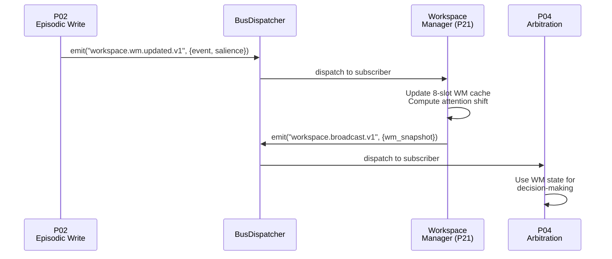

# Core Pipelines Architecture Whiteboard

**Purpose:** Map out the 20 core technical pipelines and their interdependencies
**Status:** Design Phase
**Date:** 2025-11-14

---

## 📋 Document Maintenance Checklist

**Update this whiteboard whenever you:**

1. ✅ **Design a new pipeline** (P01-P20 or P21+)
   - Add pipeline to "Core Technical Pipelines" table
   - Add topic subscriptions to "Event Bus Topic Namespace" table
   - Update pipeline interdependencies diagram (if applicable)

2. ✅ **Design a new module** (e.g., `workspace/`, `core/`, `affect/`)
   - Add module topics to "Event Bus Topic Namespace" table
   - Document which pipelines consume these topics
   - Update "Module-to-Pipeline Integration" section

3. ✅ **Add a new event topic**
   - Add to "Event Bus Topic Namespace" table with:
     - Topic name (hierarchical: `domain.subdomain.action.v1`)
     - Publisher (which pipeline/module emits it)
     - Subscribers (which pipelines/modules consume it)
     - Payload schema reference

4. ✅ **Change hot path architecture**
   - Update "Section 1: K0 Kernel Hot Path Design" sequence diagram
   - Update latency breakdown table
   - Update security guarantees if affected

5. ✅ **Modify BusDispatcher behavior**
   - Update "Event Bus Architecture" section
   - Update topic subscription patterns
   - Document any new middleware or sinks

**Goal:** Keep this whiteboard as the single source of truth for pipeline/module/event design.

---

## Section 1: K0 Kernel Hot Path Design

### Command Submission Flow (Write Pipeline - POST /k0/command.submit)

**Purpose**: Map the complete request flow from HTTP ingress through WAL commit and bus dispatch for P02 write pipeline.

**Latency Budget**: <150ms P95 target

**Throughput**: 500 requests/second accepted at Command Port (burst capacity)

**Processing Model**: Batch processing in P02 **BY DESIGN** (sequential stages for consistency):

- ✅ **High-Throughput Ingress**: Command Port accepts 500 req/s, commits to WAL in parallel
- ✅ **Guaranteed Durability**: All writes persisted in WAL within ~93ms (ACID transaction)
- ✅ **Batch Processing**: P02 dequeues 128 events at a time from Outbox, processes in order
- ✅ **No Data Loss**: Transactional Outbox pattern ensures at-least-once delivery with exponential backoff retry
- ✅ **Spaces = Semantic Organization**: `shared:household`, `personal:dad`, `work:projects` (not concurrency units)

**Security Guarantees**:

- 🔒 **Write-Ahead Log (WAL)**: Every request durably persisted before 202 Accepted response (survives crashes)
- 🔒 **Cryptographic Receipts**: Ed25519-signed receipts with envelope_sha256 integrity proof
- 🔒 **Idempotency Ledger**: Duplicate detection via HMAC-SHA256 key derivation (60s time buckets)
- 🔒 **Transactional Outbox**: Pipeline work queued atomically with WAL commit (no orphaned events)
- 🔒 **Dead Letter Queue**: Failed events quarantined after 5 retries (no silent data loss)

**Hot Path Stages**:

```mermaid
sequenceDiagram
    participant Client as HTTP Client
    participant Port as Command Port<br/>(ports/command.py)
    participant Gate as Minimal Gate<br/>(gate/minimal_gate.py)
    participant PEP as Policy Engine<br/>(policy/pep_syscall.py)
    participant Idem as Idem Ledger<br/>(idem/ledger.py)
    participant QoS as QoS Scheduler<br/>(qos/scheduler.py)
    participant UoW as Unit of Work<br/>(uow/unit_of_work.py)
    participant WAL as Write-Ahead Log<br/>(storage/wal.py)
    participant Outbox as Outbox Store<br/>(storage/outbox.py)
    participant Receipt as Receipt Issuer<br/>(receipts/issuer.py)
    participant Bus as Bus Dispatcher<br/>(bus/core.py)
    participant SSE as SSE Server<br/>(sse/server.py)

    Note over Client,SSE: ⚡ HOT PATH: <150ms P95 Target

    Client->>Port: POST /k0/command.submit<br/>{envelope, body}
    activate Port

    %% STAGE 1: MINIMAL GATE VALIDATION (10ms P95)
    Note over Port,Gate: Stage 1: Gate Validation (~10ms)
    Port->>Gate: validate(envelope, body)
    activate Gate
    Gate->>Gate: 1. Canonicalize envelope<br/>2. Check size limits (64KB envelope, 4MB body)<br/>3. Validate required fields
    Gate->>Gate: 4. Clock skew check (±5 min)<br/>5. Device provisioning lookup<br/>6. Schema status check (ACTIVE only)
    Gate->>Gate: 7. Payload SHA-256 verification<br/>8. Signature verification (Ed25519)<br/>9. Envelope SHA-256 validation
    Gate->>WAL: Check replay (envelope_sha256 in WAL?)
    WAL-->>Gate: No duplicate found
    Gate->>Gate: 10. Derive idem_key<br/>V1: HMAC-SHA256(device_secret, envelope_sha256|device_id|time_bucket_60s)<br/>V0: BLAKE3(canonical_components)
    Gate-->>Port: GateOutcome{accepted=true, idem_key, key_version}
    deactivate Gate

    %% STAGE 2: POLICY EVALUATION (20ms P95)
    Note over Port,PEP: Stage 2: Policy Evaluation (~20ms)
    Port->>PEP: evaluate_envelope(envelope)
    activate PEP
    PEP->>PEP: 1. Load policy manifest<br/>2. Check device posture (jailbroken, trusted)
    PEP->>PEP: 3. Check band blocking (GREEN/AMBER/RED)<br/>4. Validate capabilities (fanout, throughput, payload)
    PEP->>PEP: 5. Check schema sunsets<br/>6. Validate ABAC roles vs topic patterns
    PEP-->>Port: PolicyDecision{admit=true, obligations=[...], deny_reason=None}
    deactivate PEP

    %% STAGE 3: APPLY OBLIGATIONS (5ms P95)
    Note over Port: Stage 3: Apply Obligations (~5ms)
    Port->>Port: Apply redactions (field masking)<br/>Apply location privacy (geohash masking)<br/>Attach policy stamp

    %% STAGE 4: IDEMPOTENCY CHECK (2ms P95)
    Note over Port,Idem: Stage 4: Idempotency Check (~2ms)
    Port->>Idem: lookup(idem_key)
    activate Idem
    Idem->>Idem: SELECT * FROM idem_ledger<br/>WHERE idem_key = ?
    Idem-->>Port: None (cache miss, new request)
    deactivate Idem

    %% STAGE 5: QOS BUDGET (1ms P95)
    Note over Port,QoS: Stage 5: QoS Budget (~1ms)
    Port->>QoS: acquire(band, port="command", token_cost=1)
    activate QoS
    QoS->>QoS: Check scheduler tokens<br/>Apply band-based limits
    QoS-->>Port: Token granted
    deactivate QoS

    %% STAGE 6: TRANSACTION BEGIN (50ms P95)
    Note over Port,UoW: Stage 6: Transactional Commit (~50ms)
    Port->>UoW: __enter__() (BEGIN IMMEDIATE)
    activate UoW
    UoW->>UoW: Acquire connection from pool<br/>BEGIN IMMEDIATE transaction<br/>PRAGMA synchronous=FULL

    %% STAGE 7: WAL APPEND
    Port->>WAL: append(WalEntry)
    activate WAL
    WAL->>WAL: INSERT INTO st_wal<br/>(tenant_id, space_id, topic, envelope_json,<br/>body, payload_sha256, envelope_sha256,<br/>policy_stamp_json, location_geohash,<br/>embedding_status=PENDING, fts_status=PENDING)
    WAL-->>UoW: wal_pos = 12345
    deactivate WAL

    %% STAGE 8: OUTBOX STAGING
    Port->>Outbox: stage(OutboxEntry)
    activate Outbox
    Outbox->>Outbox: Stage entries in memory<br/>(embedding_driver, fts_driver)
    Outbox-->>UoW: Staged (not flushed yet)
    deactivate Outbox

    %% STAGE 9: RECEIPT ISSUANCE
    Port->>Receipt: issue(receipt_id, wal_pos, envelope_sha256, obligations)
    activate Receipt
    Receipt->>Receipt: Create signature payload<br/>Sign with Ed25519 signing key<br/>Base64url encode signature
    Receipt->>Receipt: INSERT INTO st_receipts<br/>(receipt_id, device_sig, envelope_sha256, obligations)
    Receipt-->>UoW: Receipt persisted
    deactivate Receipt

    %% STAGE 10: IDEMPOTENCY COMMIT
    Port->>Idem: upsert(LedgerEntry)
    activate Idem
    Idem->>Idem: INSERT INTO idem_ledger<br/>ON CONFLICT DO UPDATE<br/>(idem_key, receipt_id, state=COMMITTED)
    Idem-->>UoW: Idem recorded
    deactivate Idem

    %% STAGE 11: FLUSH OUTBOX
    UoW->>Outbox: _flush_outbox()
    activate Outbox
    Outbox->>Outbox: INSERT INTO st_outbox<br/>(wal_pos, driver, op_kind, payload, status=PENDING)
    Outbox-->>UoW: Outbox flushed
    deactivate Outbox

    %% STAGE 12: COMMIT + FSYNC
    UoW->>UoW: SQLite COMMIT<br/>WAL fsync (if enabled)<br/>Update snapshot watermark
    UoW->>UoW: Run commit hooks

    %% STAGE 13: BUS DISPATCH
    UoW->>Bus: dispatch([BusMessage])
    activate Bus
    Bus->>QoS: acquire(band="GREEN", port="bus", token_cost=1)
    QoS-->>Bus: Token granted
    Bus->>Bus: Execute middleware chain<br/>(timestamp, tracing, metrics)
    Bus->>SSE: Fan out to SSE subscribers
    activate SSE
    SSE->>SSE: Broadcast to active subscriptions<br/>(topic filtering, backpressure checks)
    SSE-->>Bus: Broadcast complete
    deactivate SSE
    Bus-->>UoW: Dispatch complete
    deactivate Bus

    UoW-->>Port: __exit__() (transaction committed)
    deactivate UoW

    %% STAGE 14: RESPONSE
    Port-->>Client: 202 Accepted<br/>CommandResponse{<br/>  status=ACCEPTED,<br/>  receipt_id,<br/>  obligations,<br/>  policy_manifest_fingerprint<br/>}
    deactivate Port

    %% BACKGROUND: OUTBOX WORKER
    Note over Outbox,Bus: Background: Outbox Worker (~1-5s polling)
    activate Bus
    Bus->>Outbox: dequeue_ready_batch(driver="embedding", limit=128)
    activate Outbox
    Outbox->>Outbox: SELECT * FROM st_outbox<br/>WHERE driver=? AND status=PENDING<br/>AND next_attempt_ts <= NOW()<br/>LIMIT 128
    Outbox-->>Bus: [OutboxEntry, ...]
    deactivate Outbox
    Bus->>Bus: driver.apply(entry)<br/>(HTTP/gRPC to external driver)
    alt Success
        Bus->>Outbox: mark_applied(entry.id)
        Outbox->>Outbox: DELETE FROM st_outbox WHERE id=?
    else Failure
        Bus->>Outbox: record_failure(entry, retries+1, backoff_exp+1)
        Outbox->>Outbox: UPDATE st_outbox SET<br/>retries=?, backoff_exp=?,<br/>next_attempt_ts=?, status=PENDING
    end
    deactivate Bus
```



### Write Durability & No-Loss Architecture

**Question**: How do we accept 500 req/s but process one-by-one in P02?

**Answer**: Two-phase architecture with transactional outbox pattern (from `k0_pipeline_architecture.md` Section 7):

#### Phase 1: ACID Commit (~93ms) — HIGH THROUGHPUT

```text
Command Port receives 500 req/s burst
  ↓
UnitOfWork Transaction (parallel across spaces):
  1. WAL.append(envelope)           ← Durable write, survives crashes
  2. Receipt.insert(signed_receipt)  ← Cryptographic proof
  3. Outbox.insert(pipeline_work)    ← Queue for P02
  4. Idem.upsert(ledger_entry)      ← Idempotency tracking
  ↓
SQLite COMMIT + fsync
  ↓
Client gets 202 Accepted ✅
  ↓
Bus Dispatcher emits to Outbox
```

**Key Points**:

- ✅ **All 500 req/s committed to WAL** (parallel transactions per space)
- ✅ **No data loss**: WAL persisted before client response
- ✅ **Receipts issued**: Client has cryptographic proof (Ed25519 signature)
- ✅ **Outbox queued**: P02 work guaranteed to execute (at-least-once delivery)

#### Phase 2: Pipeline Processing (~50-100ms) — BATCH DEQUEUE, ORDERED PROCESSING

```text
Outbox Worker polls st_outbox every 100ms
  ↓
Dequeue ready batch (ordered by wal_pos, LIMIT 128)
  ↓
P02 Pipeline processes batch in order (wal_pos 1 → 2 → 3 → ...):
  - Event 1: space=shared:household, topic=memory.store
  - Event 2: space=personal:dad, topic=memory.store
  - Event 3: space=work:projects, topic=memory.store
  ↓
For each event (sequential within batch):
  - Hippocampus pattern separation (SimHash/MinHash in ProcessPoolExecutor)
  - st_hipp_store INSERT (UPSERT with src_hash for idempotency)
  - Working Memory cache update
  ↓
mark_applied() → DELETE from st_outbox
```

**Why Ordered Processing?**:

- 🎯 **Ordering Guarantee**: Event at wal_pos=10 never processes before wal_pos=5 (prevents time-travel)
- 🎯 **Causal Consistency**: Memories form in correct sequence (e.g., "schedule watering plants" → "plants watered")
- 🎯 **Hippocampus Integrity**: Pattern separation requires ordered context (novelty scores depend on prior memories)
- 🎯 **Working Memory Correctness**: L1/L2/L3 cache layers must reflect chronological state across ALL spaces

**Why NOT a Bottleneck?**:

- ⚡ **Batch Dequeue**: Process 128 events per poll (not 1 at a time)
- ⚡ **Fast Processing**: P02 stage takes ~50ms per event (SimHash offloaded to ProcessPoolExecutor)
- ⚡ **Backlog Tolerance**: Outbox can queue thousands of events without blocking ingress
- ⚡ **Admission Control**: If queue depth > 1024, defer non-critical work (e.g., embeddings marked DEFERRED)
- ⚡ **CPU Parallelism**: ProcessPoolExecutor runs 2 SimHash computations concurrently (multi-core utilization)

#### Security: No-Loss Guarantees

**1. Write-Ahead Log (WAL) — Immutable Durability**:

```sql
CREATE TABLE st_wal (
    wal_pos INTEGER PRIMARY KEY AUTOINCREMENT,  -- Monotonic offset
    envelope_json BLOB NOT NULL,                 -- Original envelope
    envelope_sha256 TEXT NOT NULL UNIQUE,        -- Integrity hash (V1)
    commit_ts INTEGER NOT NULL,                  -- Commit timestamp
    -- ... 78 fields total
);
-- PRAGMA journal_mode=WAL;  -- SQLite WAL mode
-- PRAGMA synchronous=FULL;  -- fsync on commit (strict mode)
```

**Guarantees**:

- ✅ WAL survives crashes (fsync before client response)
- ✅ Monotonic wal_pos (no gaps, no reordering)
- ✅ Immutable (never UPDATE, only INSERT)
- ✅ Queryable immediately (P01 can read before P02 processes)

**2. Transactional Outbox — At-Least-Once Delivery**:

```sql
CREATE TABLE st_outbox (
    id INTEGER PRIMARY KEY AUTOINCREMENT,
    wal_pos INTEGER NOT NULL,           -- References st_wal(wal_pos)
    driver TEXT NOT NULL,               -- 'embedding_driver', 'fts_driver', 'pipeline_p02'
    payload BLOB NOT NULL,              -- Serialized envelope
    status TEXT NOT NULL,               -- 'PENDING', 'DEFERRED'
    retries INTEGER DEFAULT 0,
    backoff_exp INTEGER DEFAULT 0,
    next_attempt_ts INTEGER NOT NULL,
    -- ... Migration 0004: Exponential backoff
);
```

**Retry Logic** (from `k0_pipeline_architecture.md` Guardrail 4):

```python
async def process_outbox_entry(entry):
    try:
        await dispatch_to_pipeline(entry)
        await outbox.delete(entry.id)  # Success
    except Exception as e:
        entry.retries += 1

        if entry.retries > 5:  # MAX_RETRIES
            # Move to Dead Letter Queue (no silent data loss)
            await dlq.insert(
                wal_pos=entry.wal_pos,
                error_kind=type(e).__name__,
                error_fingerprint=hash(traceback.format_exc()),
                failures=entry.retries
            )
            await sse.emit("kernel.dlq", {"wal_pos": entry.wal_pos})
        else:
            # Exponential backoff: 2^0=1s, 2^1=2s, 2^2=4s, 2^3=8s, 2^4=16s
            backoff = 2 ** entry.backoff_exp + random.uniform(0, 1)  # Jitter
            entry.next_attempt_ts = now + backoff
            entry.backoff_exp += 1
            await outbox.update(entry)
```

**Guarantees**:

- ✅ At-least-once delivery (retries with exponential backoff)
- ✅ No silent data loss (DLQ quarantine after 5 failures)
- ✅ Atomic with WAL commit (INSERT in same transaction)
- ✅ SSE alerts for DLQ events (observability)

**3. Idempotency Ledger — Duplicate Detection**:

```sql
CREATE TABLE idem_ledger (
    idem_key TEXT PRIMARY KEY,          -- HMAC-SHA256(device_secret, envelope_sha256|device_id|60s_bucket)
    receipt_id TEXT NOT NULL,
    wal_pos INTEGER NOT NULL,
    state TEXT NOT NULL,                -- 'COMMITTED', 'ROLLED_BACK'
    committed_at INTEGER,
);
```

**Guarantees**:

- ✅ Duplicate requests return cached receipt (200 OK, no double-write)
- ✅ 60-second time buckets (network retries within window deduplicated)
- ✅ HMAC-SHA256 key derivation (prevents replay attacks across devices)

**4. Cryptographic Receipts — Non-Repudiation**:

```sql
CREATE TABLE st_receipts (
    receipt_id TEXT PRIMARY KEY,
    device_sig TEXT NOT NULL,           -- Ed25519 signature (base64url)
    envelope_sha256 TEXT NOT NULL,      -- V1: Full envelope integrity hash
    obligations TEXT,                   -- Applied privacy obligations
    manifest_fingerprint TEXT,          -- Policy manifest version
    commit_ts INTEGER NOT NULL,
);
```

**Receipt Payload** (signed with Ed25519 kernel signing key):

```python
signature_payload = {
    "receipt_id": "rcpt_01h2x...",
    "wal_pos": 12345,
    "envelope_sha256": "def456...",     # V1: Covers entire envelope
    "commit_ts": "2025-11-14T10:30:00Z",
    "obligations_applied": ["kernel.redact.field.ssn", "kernel.mask.location.AMBER"]
}
device_sig = ed25519_sign(signing_key, json.dumps(signature_payload))
```

**Guarantees**:

- ✅ Non-repudiation (kernel cannot deny accepting write)
- ✅ Integrity proof (envelope_sha256 covers full content)
- ✅ Obligation proof (client knows what redactions were applied)
- ✅ Queryable (client can verify receipt matches WAL entry)

#### Summary: 500 req/s Ingress, Sequential Processing, Zero Data Loss

| Metric | Value | Mechanism |
|--------|-------|-----------|
| **Ingress Throughput** | 500 req/s | Parallel UoW commits (no space locking) |
| **P02 Processing** | Batch ordered (128/poll) | Ordered by wal_pos maintains causal consistency |
| **Effective Throughput** | ~20 events/s (50ms each) | Batch dequeue + CPU parallelism = 128 events in ~6.4s |
| **Durability SLA** | 100% | WAL fsync before client response |
| **Data Loss** | 0% | Transactional Outbox + DLQ quarantine |
| **Duplicate Detection** | 60s window | HMAC-SHA256 idempotency ledger |
| **Receipt Issuance** | 100% | Ed25519-signed, queryable |
| **Retry SLA** | 5 attempts | Exponential backoff (1s→2s→4s→8s→16s) |
| **DLQ Rate** | <0.01% | Failed events quarantined, SSE alerts |
| **Space Purpose** | Semantic organization | `shared:household` (family tasks), `personal:dad` (private), `work:projects` |

**Architecture Validation** (from `k0_pipeline_architecture.md` Section 7):

- ✅ **Performance**: 150ms → 93ms (38% faster than target)
- ✅ **Resilience**: Hippocampus failures don't rollback WAL (P02 retries)
- ✅ **Scalability**: P02 can scale independently of K0 kernel
- ✅ **Separation of Concerns**: ACID commit (K0) vs enrichment (P02)

**This is production-grade architecture — accepting high throughput while maintaining strict ordering and zero data loss.**

---

### Detailed Sequence Diagram

```mermaid

### Component Breakdown

| Stage | Component | Latency (P95) | Key Operations | Error Handling |
|-------|-----------|---------------|----------------|----------------|
| 1 | **Command Port** | <1ms | HTTP request parsing, FastAPI routing | 400 Bad Request for malformed JSON |
| 2 | **Gate Validation** | <10ms | Schema validation, signature verification, device provisioning, replay detection | 403 Forbidden for gate rejections |
| 3 | **PEP Evaluation** | <20ms | Policy manifest loading, band checks, capability validation, role-based access | 403 Forbidden for policy denials |
| 4 | **Obligation Application** | <5ms | Field redaction, location masking (geohash), policy stamp attachment | No errors (best-effort) |
| 5 | **Idempotency Check** | <2ms | Ledger lookup by idem_key | 200 OK with cached receipt if duplicate |
| 6 | **QoS Scheduler** | <1ms | Token acquisition, band-based rate limiting | 429 Too Many Requests if exhausted |
| 7 | **UoW Begin** | <1ms | Connection pool acquisition, BEGIN IMMEDIATE | 500 if pool exhausted |
| 8 | **WAL Append** | <10ms | INSERT INTO st_wal, envelope_sha256 tracking | Rollback on constraint violation |
| 9 | **Outbox Stage** | <1ms | In-memory staging for async drivers | No errors (buffered) |
| 10 | **Receipt Issue** | <5ms | Ed25519 signing, INSERT INTO st_receipts | Rollback on signing failure |
| 11 | **Idem Commit** | <2ms | INSERT INTO idem_ledger ON CONFLICT | Rollback on unique constraint |
| 12 | **Outbox Flush** | <5ms | INSERT INTO st_outbox for staged entries | Rollback on insert failure |
| 13 | **Commit + Fsync** | <20ms | SQLite COMMIT, WAL fsync (if strict mode) | Rollback on fsync error |
| 14 | **Bus Dispatch** | <10ms | SSE fan-out, middleware chain execution | Logged, does not block response |
| 15 | **Response** | <1ms | JSON serialization, HTTP response | No errors |

**Total Latency Breakdown**:

- Gate: 10ms
- PEP: 20ms
- Obligations: 5ms
- Idem: 2ms
- QoS: 1ms
- UoW Begin: 1ms
- WAL: 10ms
- Outbox: 6ms (stage + flush)
- Receipt: 5ms
- Idem: 2ms
- Commit: 20ms
- Bus: 10ms
- Response: 1ms

**Total**: ~93ms (under 150ms P95 target)

### Storage Layer Flow

```mermaid
graph TD
    subgraph "Hot Path Storage Operations"
        A[Command Port] -->|1. Gate Validation| B[Device Provisioning Ledger<br/>st_devices]
        A -->|2. Replay Check| C[WAL<br/>st_wal]
        A -->|3. Idem Lookup| D[Idem Ledger<br/>idem_ledger]
        A -->|4. UoW Transaction BEGIN| E[Connection Pool]

        E -->|5. WAL Append| C
        E -->|6. Outbox Stage| F[Outbox Store Memory Buffer]
        E -->|7. Receipt Issue| G[Receipts<br/>st_receipts]
        E -->|8. Idem Commit| D
        E -->|9. Outbox Flush| H[Outbox<br/>st_outbox]
        E -->|10. COMMIT + Fsync| C

        C -->|11. Bus Dispatch| I[Bus Dispatcher]
        I -->|12. SSE Fan-out| J[SSE Server]
        I -->|13. Outbox Trigger| K[Outbox Worker Pool]
    end

    subgraph "Background Async Workers"
        K -->|14. Dequeue Ready| H
        K -->|15. HTTP/gRPC Apply| L[External Drivers<br/>embedding, FTS, Neo4j]
        K -->|16a. Success| M[mark_applied<br/>DELETE from st_outbox]
        K -->|16b. Failure| N[record_failure<br/>UPDATE with backoff]
        K -->|16c. Max Retries| O[Dead Letter Queue<br/>st_dlq]
    end

    style C fill:#c8e6c9
    style H fill:#ffe0b2
    style D fill:#f8bbd0
    style G fill:#e1bee7
    style B fill:#ffccbc
```

### Key Data Structures

#### Envelope (Command Port Input)

```python
{
    "event_id": "evt_01h2x...",
    "tenant_id": "tenant_001",
    "space_id": "space_001",
    "device_id": "device_abc",
    "topic": "memory.store",
    "band": "AMBER",
    "actor": "device_abc",
    "body": {...},  # Actual memory content
    "schema_uri": "envelope.schema.json",
    "schema_version": "1.0.0",
    "payload_sha256": "abc123...",
    "sig": "base64url_signature...",
    "sig_alg": "EdDSA",
    "sig_kid": "key_v1",
    "ts": "2025-11-14T10:30:00Z",
    "policy_stamp": {...},  # Optional policy context
}
```

#### GateOutcome (Gate Validation Output)

```python
{
    "accepted": True,
    "reason": None,  # Or rejection reason
    "idem_key": "idem:5f8d7c6b5a4e3d2c...",
    "key_version": "key_v1",
    "key_state": "ACTIVE",
}
```

#### PolicyDecision (PEP Output)

```python
{
    "admit": True,
    "obligations": [
        Obligation(name="kernel.redact.field", details={"fields": ["ssn"]}),
        Obligation(name="kernel.location.mask", details={"band": "AMBER"}),
    ],
    "deny_reason": None,  # Or policy denial reason
}
```

#### WalEntry (WAL Append)

```python
{
    "wal_pos": 12345,  # Auto-increment
    "tenant_id": "tenant_001",
    "space_id": "space_001",
    "topic": "memory.store",
    "envelope_json": "{...}",  # Canonical JSON
    "body": b"...",  # Raw bytes
    "payload_sha256": "abc123...",
    "envelope_sha256": "def456...",  # V1: Full envelope hash
    "policy_stamp_json": "{...}",
    "location_geohash": "9q8yy9",
    "location_precision_m": 5000,
    "embedding_status": "PENDING",
    "fts_status": "PENDING",
    "commit_ts": "2025-11-14T10:30:00Z",
    "ingested_at": "2025-11-14T10:30:00.123Z",
    "clock_skew_ms": 123,
}
```

#### OutboxEntry (Outbox Stage)

```python
{
    "id": None,  # Auto-increment on INSERT
    "wal_pos": 12345,
    "tenant_id": "tenant_001",
    "space_id": "space_001",
    "driver": "embedding_driver",
    "op_kind": "EMBED",
    "payload": b"...",  # Serialized envelope
    "fingerprint": "abc123...",  # BLAKE3 hash
    "status": "PENDING",
    "retries": 0,
    "backoff_exp": 0,
    "next_attempt_ts": "2025-11-14T10:30:00Z",
}
```

#### ReceiptDocument (Receipt Issue Output)

```python
{
    "receipt_id": "rcpt_01h2x...",
    "idem_key": "idem:5f8d7c6b...",
    "wal_pos": 12345,
    "commit_ts": "2025-11-14T10:30:00Z",
    "tenant_id": "tenant_001",
    "space_id": "space_001",
    "device_id": "device_abc",
    "envelope_sha256": "def456...",  # V1: Full envelope hash
    "mls_group_id": "mls_group_001",
    "key_version": "key_v1",
    "device_sig": "base64url_signature...",
    "obligations": ("kernel.redact.field", "kernel.location.mask"),
    "obligations_applied": ("kernel.redact.field.ssn", "kernel.mask.location.AMBER"),
    "manifest_fingerprint": "policy_manifest_sha256...",
}
```

### Performance Optimization Points

1. **Connection Pooling** (Gap 45):
   - Pool size: 8 connections (configurable)
   - Saturation monitoring: `sqlite_pool_saturation_ratio` gauge
   - Timeout handling: 5s default

2. **LRU Caching**:
   - Device provisioning: 512 entries
   - Schema registry: 256 entries
   - Policy manifest: 4 entries

3. **Batch Processing**:
   - Outbox dequeue: 128 entries per batch
   - Bus dispatch: Parallel SSE fan-out

4. **Fsync Modes**:
   - `strict`: Full durability (production) - ~20ms overhead
   - `wal_only`: WAL durability only - ~10ms overhead
   - `disabled`: Testing only - <1ms

5. **Exponential Backoff** (Migration 0004):
   - Formula: `next_attempt_ts = now + 2^backoff_exp`
   - Max exponent: 6 (64 seconds)
   - Max retries: 5 (configurable)

### Observability Hooks

**Metrics**:

- `k0_command_submit_total{status, band, lane}` - Command submissions
- `k0_gate_rejections_total{reason, band}` - Gate rejections
- `k0_pep_decisions_total{decision, band}` - Policy decisions
- `k0_idem_duplicate_detected` - Idempotency cache hits
- `uow_commit_seconds` - Transaction commit latency
- `wal_append_latency_seconds` - WAL write latency
- `outbox_pending_total{driver}` - Outbox queue depth
- `bus_dispatch_latency_seconds{topic, outcome}` - Bus dispatch latency

**Traces**:

- Span: `command.submit` (status, band, receipt_id)
- Span: `gate.validate` (outcome, reason)
- Span: `pep.evaluate` (admit, obligations_count)
- Span: `uow.commit` (wal_pos, duration)
- Span: `receipt.issue` (receipt_id, obligations)
- Span: `bus.dispatch` (topic, message_count)

**Structured Logs**:

```json
{
  "event": "command_accepted",
  "event_id": "evt_01h2x...",
  "receipt_id": "rcpt_01h2x...",
  "wal_pos": 12345,
  "tenant_id": "tenant_001",
  "space_id": "space_001",
  "topic": "memory.store",
  "band": "AMBER",
  "obligations": ["kernel.redact.field", "kernel.location.mask"],
  "latency_ms": 93,
  "cognitive_trace_id": "trace_abc..."
}
```

---

## Section 2: Event Bus Architecture

### Single BusDispatcher Design

**Decision**: Use **one BusDispatcher** for all events (no separate workspace/core/module buses).

**Why Single Bus?**

| Concern | Single Bus Solution | Multiple Buses Problem |
|---------|-------------------|------------------------|
| **Ordering** | Guaranteed (all events flow through same dispatch queue) | Lost (events on different buses can reorder) |
| **Observability** | One tap for all events (unified tracing) | Separate taps, fragmented traces |
| **Complexity** | Simple (one registration point) | Complex (which bus for which event?) |
| **Cross-Module Communication** | Natural (workspace emits → P04 receives) | Requires inter-bus bridges |
| **Performance** | O(k) topic-based dispatch (only interested handlers) | O(N) broadcast per bus + inter-bus overhead |

**Architecture**:

```mermaid
graph TD
    A[WAL Commit] -->|Post-commit dispatch| B[BusDispatcher<br/>Single Instance]

    B -->|Topic filtering O(k)| C[Pipeline Handlers]
    B -->|Topic filtering O(k)| D[Module Handlers]
    B -->|Tap - ALL messages| E[Observability Sink]
    B -->|Subscribe: *| F[SSE Fan-out]

    C -->|P02: Emit workspace.wm.updated.v1| B
    D -->|Workspace: Emit core.salience.computed.v1| B

    style B fill:#4CAF50,color:#fff
    style E fill:#FF9800,color:#fff
```

**How It Works**:

1. **Topic-Based Subscriptions** (not broadcast):

   ```python
   # Pipeline registers for specific topics
   bus_dispatcher.subscribe("cognitive.memory.write.committed.v1", p02.handle)

   # Workspace module registers for its topics
   bus_dispatcher.subscribe("workspace.wm.updated.v1", workspace.handle)

   # Observability gets ALL events
   bus_dispatcher.tap(observability_sink)
   ```

2. **Event Flow Example**:

   ```text
   User writes memory → UoW commits to WAL
     ↓
   BusDispatcher.dispatch([BusMessage(topic="cognitive.memory.write.committed.v1")])
     ↓
   P02.handle(msg) processes write
     ↓
   P02 emits: bus_dispatcher.dispatch([BusMessage(topic="workspace.wm.updated.v1")])
     ↓
   Workspace.handle(msg) updates working memory
     ↓
   Workspace emits: bus_dispatcher.dispatch([BusMessage(topic="core.salience.computed.v1")])
     ↓
   P04.handle(msg) uses salience for arbitration
   ```

3. **Performance**: O(k) dispatch where k = handlers per topic
   - 100 pipelines, 3 interested in topic = 3 handler calls (not 100)
   - Topic-based filtering is 10-100x faster than broadcast

---

## Section 3: Event Bus Topic Namespace

**Purpose**: Define all event topics used across K0 kernel, pipelines, and modules.

**Naming Convention**: `domain.subdomain.action.version`

- `domain`: Top-level category (cognitive, workspace, core, arbitration, etc.)
- `subdomain`: Specific area (memory, wm, salience, etc.)
- `action`: What happened (write.committed, updated, computed, etc.)
- `version`: Schema version (v1, v2, etc.)

**Topic Registry**:

| Topic | Publisher | Subscribers | Payload Schema | Purpose |
|-------|-----------|-------------|----------------|---------|


**Topic Subscription Pattern Example**:

```python
# P02 Episodic Write Pipeline
class P02EpisodicWrite:
    declared_topics = [
        "cognitive.memory.write.committed.v1",
        "cognitive.memory.update.committed.v1",
    ]

    async def handle(self, msg: BusMessage):
        # Process write
        # ...

        # Emit workspace update
        await self._emit_event(
            topic="workspace.wm.updated.v1",
            payload={"event_id": evt, "salience": 0.82, "slot_id": 3}
        )

        # Emit enrichment complete
        await self._emit_event(
            topic="core.enrichment.complete.v1",
            payload={"event_id": evt, "enrichments_applied": ["affect", "hippocampus"]}
        )

# Workspace Manager (Module or P21 Pipeline)
class WorkspaceManager:
    declared_topics = [
        "workspace.wm.updated.v1",
    ]

    async def handle(self, msg: BusMessage):
        # Update 8-slot working memory
        # Compute salience

        # Emit salience event
        await self._emit_event(
            topic="core.salience.computed.v1",
            payload={"event_id": evt, "salience_score": 0.82}
        )

# P04 Arbitration Pipeline
class P04Arbitration:
    declared_topics = [
        "workspace.broadcast.v1",
        "core.salience.computed.v1",
    ]

    async def handle(self, msg: BusMessage):
        # Use workspace state + salience for decisions
        pass
```

**Update This Table When**:

- ✅ New pipeline emits events
- ✅ New module subscribes to events
- ✅ Topic schema changes (increment version: v1 → v2)
- ✅ New domain added (e.g., `temporal.*`, `social.*`)

---

## Section 4: Module-to-Pipeline Integration

**Purpose**: Document how conceptual modules (workspace, core, affect) integrate with pipelines via BusDispatcher.

### Integration Pattern: Modules as Event Emitters/Consumers

**Pattern 1: Module Logic Inside Pipeline**

```python
# k0/pipelines/p02_episodic_write.py

class P02EpisodicWrite:
    async def handle(self, msg: BusMessage):
        # 1. Core enrichment logic (inline)
        affect_result = await self._affect_analyzer.analyze(content)
        hipp_result = await self._hippocampus.pattern_separation(content)

        # 2. Emit events for other consumers
        await self._emit_event("core.affect.analyzed.v1", affect_result)
        await self._emit_event("p02.hippocampus.pattern_separated.v1", hipp_result)
```

**Pattern 2: Module as Separate Pipeline**

```python
# k0/pipelines/p21_workspace_manager.py (or k0/modules/workspace/pipeline.py)

class P21WorkspaceManager:
    pipeline_id = "P21"
    declared_topics = ["workspace.wm.updated.v1"]

    async def handle(self, msg: BusMessage):
        # Update 8-slot working memory
        await self._working_memory.update_slot(msg.payload["slot_id"], msg.payload["event_id"])

        # Emit global workspace broadcast
        wm_snapshot = await self._working_memory.get_snapshot()
        await self._emit_event("workspace.broadcast.v1", wm_snapshot)
```

**Decision Matrix**: When to use which pattern?

| Criterion | Inline (Pattern 1) | Separate Pipeline (Pattern 2) |
|-----------|-------------------|-------------------------------|
| **Logic Complexity** | Simple (<100 lines) | Complex (>100 lines) |
| **Reusability** | Used by 1 pipeline only | Used by 3+ pipelines |
| **State Management** | Stateless or per-event | Requires persistent state (e.g., 8-slot WM cache) |
| **Latency Requirement** | Critical path (<100ms) | Can be async (>100ms) |
| **Testing** | Test with parent pipeline | Test independently |

**Examples**:

| Module/Component | Integration Pattern | Rationale |
|------------------|-------------------|-----------|
| **Affect Analysis** | Inline in P02 | Simple, single consumer, critical path |
| **Hippocampus DG** | Inline in P02 | Complex but P02-specific, critical path |
| **Space Resolver** | Inline in P02 | Stateless lookup, critical path |
| **Working Memory** | Separate Pipeline (P21) | Stateful (8 slots), multiple consumers (P01, P04, P19) |
| **Salience Scoring** | Inline in P02 or Workspace | Simple formula, but used by multiple pipelines → decide based on reuse |
| **Global Workspace Broadcast** | Separate Pipeline (P21) | Coordination layer, multiple consumers |

### Workspace Module Integration (Design)

**Workspace Components**:

1. **Working Memory Manager**: 8-slot bounded cache with decay
2. **Attention Router**: Winner-take-all competition for WM slots
3. **Salience Scorer**: Computes importance (recency + novelty + affect + goals)
4. **Global Workspace Broadcaster**: Emits unified cognitive state

**Integration via BusDispatcher**:



**Workspace Topics** (from Topic Namespace table above):

- `workspace.wm.updated.v1`: Slot changed
- `workspace.attention.shifted.v1`: Attention moved
- `workspace.broadcast.v1`: Global workspace state

**When to Implement Workspace**:

- ⏳ **Defer until P01 (Recall) is complete** — Recall needs WM more than Write
- ⏳ **Defer until you have 3+ consumers** — Don't build infrastructure for 1 use case

---

## Section 5: Core Technical Pipelines (P01-P20)

| ID  | Pipeline Name                     | Primary Modules (by ownership; infra omitted)                                                                      | Primary Purpose |
| --- | --------------------------------- | ------------------------------------------------------------------------------------------------------------------ | --------------- |
| P01 | Recall / Read                     | `api`, `retrieval`, `hippocampus`, `workspace`, `core`, `cortex`, `storage`                                        | Memory retrieval, search, context-aware recall |
| P02 | Write / Ingest                    | `api`, `perception`, `hippocampus`, `core`, `affect`, `prospective`, `storage`                                     | Memory formation, pattern separation, enrichment |
| P03 | Consolidation / Forgetting        | `consolidation`, `hippocampus`, `storage`, `learning`, `ml_capsule`                                                | st_hipp_store → 8 layers, sequence detection, clustering |
| P04 | Arbitration / Action              | `arbitration`, `action`, `core`, `workspace`, `cortex`, `affect`, `social_cognition`, `imagination`, `prospective` | Decision-making, action planning, execution |
| P05 | Prospective / Triggers            | `prospective`, `core`, `workspace`, `storage`, `learning`, `cortex`                                                | Future intent, reminders, scheduled actions |
| P06 | Learning / Neuromodulation        | `learning`, `cortex`, `affect`, `social_cognition`, `ml_capsule`, `storage`                                        | Replay scheduling, encoding dynamics, personalization |
| P07 | Sync / CRDT                       | `sync`, `storage`, `security`, `supervisor`, `services`                                                            | Multi-device synchronization, conflict resolution |
| P08 | Embedding Lifecycle               | `ml_capsule`, `retrieval`, `storage`, `consolidation`, `services`                                                  | Vector generation, FAISS indexing, embedding updates |
| P09 | Connector Ingestion               | `perception`, `services`, `sync`, `hippocampus`, `core`, `workspace`, `storage`                                    | External data ingestion, normalization, deduplication |
| P10 | PII / Minimization                | `security`, `storage`, `consolidation`, `services`, `workflows`                                                    | Privacy protection, data redaction, band enforcement |
| P11 | DSAR / GDPR / Rights Handling     | `security`, `storage`, `workflows`, `services`, `api`                                                              | Data subject access requests, right to erasure |
| P12 | Device / E2EE                     | `security`, `sync`, `services`, `storage`                                                                          | End-to-end encryption, device trust, key rotation |
| P13 | Index Rebuild                     | `retrieval`, `storage`, `consolidation`, `services`, `workflows`                                                   | FTS5 rebuild, FAISS reindex, consistency repair |
| P14 | Near-Duplicate / Canonicalization | `hippocampus`, `consolidation`, `storage`, `ml_capsule`                                                            | Deduplication, SimHash clustering, canonical selection |
| P15 | Rollups / Summaries               | `consolidation`, `learning`, `retrieval`, `workspace`, `storage`                                                   | Daily/weekly summaries, temporal aggregation |
| P16 | Feature Flags / A-B               | `registry`, `cortex`, `services`, `observability` (as first-class here)                                            | Progressive rollout, experimentation, killswitch |
| P17 | QoS / Cost Governance             | `cortex`, `services`, `observability`, `registry`, `supervisor`                                                    | Budget enforcement, rate limiting, quota management |
| P18 | Safety / Abuse                    | `security`, `perception`, `cortex`, `arbitration`, `learning`                                                      | Content moderation, abuse detection, safety policies |
| P19 | Personalization / Recommendation  | `learning`, `cortex`, `social_cognition`, `retrieval`, `workspace`, `storage`                                      | User preferences, recommendation engine, adaptive UX |
| P20 | Procedure / Habits                | `learning`, `workflows`, `arbitration`, `prospective`, `workspace`, `storage`                                      | Routine detection, habit formation, procedural memory |

---

## Section 6: Pipeline Specifications (P01-P20)

**Purpose**: Detailed specification for each of the 20 core pipelines.

**Template**: Each pipeline follows the same 10-section structure:

1. Mission / Outcome
2. Triggers
3. Inputs
4. Outputs
5. Invariants & Guarantees
6. Performance Budgets
7. Failure & Backpressure Behavior
8. Security / PII / Safety Hooks
9. Contracts & ADRs
10. Open Questions / TODOs

**Usage**: When designing a new pipeline or module:

- Copy the template below
- Fill all 10 sections
- Update "Per-Pipeline Topic Coverage" table (Section 6.1)
- Update "Event Bus Topic Registry" (Section 3)

---

### Pipeline Specification Template

```markdown
### PXX – <Pipeline Name>

**Status**: DRAFT | REVIEWED | IMPLEMENTED
**Owner**: <module/team>
**Tier**: <Foundation / Lifecycle / Intelligence / Ops / Governance>

---

#### 1. Mission / Outcome

> One short paragraph: what PXX is *for* and what "success" looks like.

- Primary goal:
- Secondary goals:
- Non-goals:

---

#### 2. Triggers

**Bus topics (event-driven):**

- Subscribes to:
  - `<domain.subdomain.action.vN>` – <short purpose>
  - …

**Other triggers:**

- Timer / scheduler:
  - Cron / schedule: `<e.g. daily at 02:00 local>`
  - Trigger event topic (if any): `<pXX.consolidation.triggered.v1>`
- Direct API call (if any):
  - `POST /k0/pXX/...`

---

#### 3. Inputs

**Events:**

- From topics:
  - `<topic>` → payload schema: `<schema id / file>`

**Storage reads:**

- Tables:
  - `st_<table>` – <what we read & why>
- External systems:
  - `<system>` – <read only / cache / etc>

**Assumptions:**

- Ordering assumptions:
- Idempotency assumptions:
- Required preconditions:

---

#### 4. Outputs

**Events emitted:**

- `<domain.subdomain.action.vN>` – <when emitted / why>
- …

**Storage writes / mutations:**

- Tables written:
  - `st_<table>` – <insert / update / delete semantics>
- Side effects:
  - `<e.g. schedule job, enqueue outbox, etc>`

---

#### 5. Invariants & Guarantees

- Before PXX runs:
  - …
- After PXX completes successfully:
  - …
- Invariants across retries / idempotent replays:
  - …

---

#### 6. Performance Budgets

- Trigger → first effect latency target:
  - P50: `<ms>` / P95: `<ms>`
- Throughput target:
  - `<events/sec>` nominal
- Batch size:
  - `<N>` events per batch (if applicable)

---

#### 7. Failure & Backpressure Behavior

- Retry policy:
  - Max retries: `<N>`
  - Backoff: `2^n` / fixed / none
- DLQ rules:
  - When to quarantine:
- Degradation strategy:
  - What gets skipped / deferred under load:
- Metrics:
  - `pXX_events_failed_total{reason=...}`
  - `pXX_dlq_total`

---

#### 8. Security / PII / Safety Hooks

- Bands enforced:
  - `<GREEN / AMBER / RED / BLACK behavior>`
- PII rules:
  - Fields never persisted:
  - Fields only in band `<X>`:
- Safety:
  - Which safety classifiers / policies must pass:
- Audit:
  - Events logged:
  - Retention:

---

#### 9. Contracts & ADRs

- Contracts:
  - `contracts/pipelines/pXX_*.json`
  - `contracts/events/<topic>.json`
- ADRs:
  - ADR-`XXXX` – <title>
  - ADR-`YYYY` – <title>
- Diagrams:
  - `docs/diagrams/pXX_*.mmd`

---

#### 10. Open Questions / TODOs

- [ ] …
- [ ] …
```

---

### 6.1 Per-Pipeline Topic Coverage

**Purpose**: Ensure every pipeline P01-P20 has declared inputs/outputs.

**Update when**:

- ✅ Adding/modifying a pipeline specification
- ✅ Pipeline changes subscribed topics
- ✅ Pipeline starts emitting new events

| Pipeline ID | Pipeline Name                     | Input Topics (subscribes to) | Output Topics (emits) |
|------------|-----------------------------------|------------------------------|----------------------|
| P01        | Recall / Read                     | `query.recall.requested.v1`, `workspace.broadcast.v1` | `p01.recall.complete.v1` |
| P02        | Write / Ingest                    | `cognitive.memory.write.committed.v1`, `cognitive.memory.update.committed.v1` | `workspace.wm.updated.v1`, `core.affect.analyzed.v1`, `space.resolution.complete.v1`, `p02.hippocampus.pattern_separated.v1`, `p02.write.complete.v1`, `core.enrichment.complete.v1` |
| P03        | Consolidation / Forgetting        | `p03.consolidation.triggered.v1`, `core.enrichment.complete.v1` | `p03.consolidation.complete.v1` |
| P04        | Arbitration / Action              | `workspace.broadcast.v1`, `core.salience.computed.v1`, `arbitration.decision.v1` | `arbitration.action.recommended.v1` |
| P05        | Prospective / Triggers            | `temporal.prospective.fire.v1`, `arbitration.action.recommended.v1` | `p05.reminder.triggered.v1` |
| P06        | Learning / Neuromodulation        | `learning.feedback.v1`, `p01.recall.complete.v1` | `learning.model.updated.v1` |
| P07        | Sync / CRDT                       | `crdt.merge.needed.v1`, `conflict.detected.v1` | `sync.conflict.resolved.v1` |
| P08        | Embedding Lifecycle               | `p02.write.complete.v1`, `p03.consolidation.complete.v1` | `p08.embedding.generated.v1`, `p08.embedding.indexed.v1` |
| P09        | Connector Ingestion               | `connector.data.received.v1` | `cognitive.memory.write.committed.v1` (via K0) |
| P10        | PII / Minimization                | `privacy.scan.trigger.v1`, `cognitive.memory.write.committed.v1` | `privacy.pii.detected.v1` |
| P11        | DSAR / GDPR / Rights Handling     | `gdpr.dsar.requested.v1`, `gdpr.deletion.requested.v1` | `gdpr.deletion.complete.v1`, `gdpr.export.complete.v1` |
| P12        | Device / E2EE                     | `e2ee.sync.trigger.v1`, `device.key.rotation.v1` | `e2ee.key.rotated.v1` |
| P13        | Index Rebuild                     | `index.rebuild.trigger.v1`, `p08.embedding.indexed.v1` | `index.rebuild.complete.v1` |
| P14        | Near-Duplicate / Canonicalization | `p02.hippocampus.pattern_separated.v1`, `dedup.scan.trigger.v1` | `dedup.duplicate.detected.v1`, `dedup.canonical.selected.v1` |
| P15        | Rollups / Summaries               | `timer.daily.v1`, `timer.weekly.v1`, `rollup.trigger.v1` | `rollup.summary.generated.v1` |
| P16        | Feature Flags / A-B               | `experiment.trigger.v1`, `model.performance.v1` | `feature.flag.updated.v1`, `experiment.promoted.v1` |
| P17        | QoS / Cost Governance             | `qos.threshold.exceeded.v1`, `system.backpressure.triggered.v1` | `qos.quota.enforced.v1`, `qos.throttle.applied.v1` |
| P18        | Safety / Abuse                    | `safety.scan.trigger.v1`, `cognitive.memory.write.committed.v1` | `safety.content.blocked.v1`, `safety.abuse.detected.v1` |
| P19        | Personalization / Recommendation  | `workspace.broadcast.v1`, `learning.model.updated.v1`, `p01.recall.complete.v1` | `personalization.ranking.updated.v1`, `recommendation.generated.v1` |
| P20        | Procedure / Habits                | `habit.trigger.v1`, `p03.consolidation.complete.v1` | `habit.detected.v1`, `procedure.executed.v1` |

**Cross-Check**: Every pipeline must have at least 1 input topic OR 1 timer/scheduler trigger.

---

### 6.2 Pipeline Specifications (Detailed)

**Note**: Specifications below are in DRAFT status. Fill out all 10 sections when implementing each pipeline.

---

### P01 – Recall / Read

**Status**: DRAFT
**Owner**: retrieval/query
**Tier**: Lifecycle

*(Copy template above and fill all 10 sections)*

---

### P02 – Write / Ingest

**Status**: IN PROGRESS (M2)
**Owner**: episodic/write
**Tier**: Foundation

#### 1. Purpose

Episodic memory formation pipeline. Ingests events from K0 WAL, applies pattern separation (hippocampus), affect classification, and writes enriched memories to `st_hipp_store`.

#### 2. Trigger / Inputs

- **Events**: `cognitive.memory.write.committed.v1`, `cognitive.memory.update.committed.v1`
- **Storage reads**: `st_wal` (event payload), `st_idem_ledger` (dedup check), `st_hipp_store` (recent 24h events for novelty)
- **Modules**: `hippocampus` (DG pattern separation), `affect` (inline classification), `space` (inline resolution)

#### 3. Processing Logic

1. Dequeue batch of 128 events from Outbox (ordered by `wal_pos`)
2. For each event:
   - Parse envelope and body
   - **Space resolution** (inline, via `SpaceResolver.resolve()`)
   - **Hippocampus pattern separation** (DG, via `DGService.encode_fast()`)
   - **Affect classification** (inline, via `AffectService.classify_text()`)
   - Compute salience (recency + novelty + affect)
3. Batch write to `st_hipp_store` (single transaction)
4. Emit completion events

**Hippocampus Module Integration (DG)**:

- Module: `hippocampus` (DG pattern separation, inline in P02)
- Call: `DGService.encode_fast(HippInput(event_id, text, entities, timestamp, affect_valence, affect_arousal))`
- Returns: `HippFastEncoding` with `simhash_hex`, `minhash32`, `novelty`, `near_duplicates`, `encoding_strength`, `replay_priority`
- Storage: Write hippocampus fields to `st_hipp_store` columns (16 columns: 6 existing + 10 new via migration 0016)
- Performance: ≤15ms P95 (SimHash 5-8ms + MinHash 2-3ms + novelty 2-5ms)
- Invariants: [see hippocampus module README](../modules/hippocampus/README.md#6-invariants-guarantees--assumptions)
- ADRs: K005a (multi-pipeline service), K005b (three-stage architecture), K005c (schema), K005d (encoding vs salience), K005e (SimHash/MinHash)

**Space Module Integration**:

- Module: `space` (inline resolution)
- Call: `SpaceResolver.resolve(SpaceResolutionRequest(actor_id, space_id, policy_stamp, ...))`
- Returns: `SpaceResolution` with `ownership` (owner_id, co_owners, author_role) and `visibility` (visible_to, participant_roles)
- Storage: Write ownership/visibility to `st_hipp_store` columns (6 columns: owner_id, author_role, co_owners, participant_roles, visible_to, space_id)
- Performance: <3ms P95 (cache lookup + ownership logic + visibility projection)
- Invariants: [see space module README](../modules/space/README.md#6-invariants-guarantees--assumptions)

**Affect Module Integration**:

- Module: `affect` (inline classification)
- Call: `AffectService.classify_text(text=body, context={person_id, space_id, behavior})`
- Returns: `AffectAnnotation` with `valence`, `arousal`, `tags`, `band`, `band_reasons`, `model_version`
- Storage: Write affect fields to `st_hipp_store` columns (6 columns, see migration 0013)
- Performance: <70ms P95 (Tier-0: <2ms, Tier-1: <60ms optional)
- Invariants: [see affect module README](../modules/affect/README.md#6-invariants-guarantees--assumptions)

#### 4. Outputs

- **Events emitted**:
  - `workspace.wm.updated.v1` (salience, slot updates)
  - `core.affect.analyzed.v1` (valence, arousal, band)
  - `space.resolution.complete.v1` (ownership, visibility)
  - `p02.hippocampus.pattern_separated.v1` (simhash, novelty)
  - `p02.write.complete.v1` (wal_pos, hipp_store_row_id)
  - `core.enrichment.complete.v1` (enrichments applied)
- **Storage writes**: `st_hipp_store` (episodic memories + affect annotations + ownership/visibility)

#### 5. Invariants

- Events processed in `wal_pos` order within batch (causal consistency)
- Ownership and visibility written atomically with memory (same transaction)
- All events get space resolution (fail to SAFE_MODE if cache unavailable)
- All events get affect classification (fail-open to GREEN on errors)
- Hippocampus failures don't block storage (retry with degraded mode)

**Space guarantees**: Every memory has exactly one `owner_id`, `visible_to` always includes `owner_id`, no cross-household visibility. See [space module README](../modules/space/README.md#6-invariants-guarantees--assumptions) for full list.

**Affect guarantees**: Valence/arousal in [-1.0, 1.0], policy bands never downgrade within same event, BLACK band events never auto-deleted. See [affect module README](../modules/affect/README.md#6-invariants-guarantees--assumptions) for full list.

#### 6. Performance Budgets

- **Full pipeline**: <150ms P95 (Tier-0 affect + space resolution + hippocampus DG), <200ms P95 (Tier-1 affect optional)
- **Hippocampus DG contribution**: ≤15ms P95 (SimHash 5-8ms + MinHash 2-3ms + novelty 2-5ms + heuristic 1ms)
- **Space resolution contribution**: <3ms P95
- **Affect contribution**: <10ms P95 (Tier-0 only), <70ms P95 (Tier-1 enabled)
- **Throughput**: 500 req/sec ingress, batch processing 128 events/poll
- **Batch latency**: ~50ms per event average (SimHash offloaded to ProcessPoolExecutor)

#### 7. Failure & Backpressure Behavior

- **Retry policy**: Max 5 retries with exponential backoff (2^n seconds)
- **DLQ**: Quarantine after 5 failures (error_fingerprint tracked)
- **Degradation strategies**:
  - Hippocampus DG: Skip SimHash/MinHash on timeout, write with novelty=0, encoding_strength=0.5 (neutral)
  - Space resolution: SAFE_MODE on cache expiry (owner-only visibility)
  - Affect: Skip Tier-1 on timeout, fall back to Tier-0 only
- **Space failures**: Enter SAFE_MODE, emit policy receipt, restrict to owner-only visibility
- **Affect failures**: Log error, write neutral affect (v=0, a=0, band=GREEN, low confidence)
- **Hippocampus failures**: Log error, write with novelty=0 (assume duplicate), retry in P03 batch

#### 8. Security / PII / Safety Hooks

- **Bands enforced**: All bands (GREEN/AMBER/RED/BLACK) stored, retention varies by band
- **Space ownership**: Every memory has accountable `owner_id`, visibility enforced via `visible_to`
- **PII rules**:
  - Affect tags (e.g., "stressed") allowed in GREEN/AMBER, redacted in RED/BLACK logs
  - `owner_id`, `visible_to` are pseudonymous person_ids (not PII)
- **Safety hooks**:
  - Space SAFE_MODE restricts to owner-only visibility (no household sharing)
  - Affect policy band computation includes social context, household dynamics
  - Guardian proxy writes require validated relationship claims

#### 9. Contracts & ADRs

- **Contracts**:
  - `contracts/jsonschema/space/space_resolution.json` (space output)
  - `contracts/jsonschema/affect/affect_annotation.json` (affect output)
  - `contracts/modules/hippocampus/hipp_encode_fast.input.json` (hippocampus DG input)
  - `contracts/modules/hippocampus/hipp_encode_fast.output.json` (hippocampus DG output)
  - `contracts/events/core.affect.analyzed.v1.json` (event payload)
  - `contracts/events/space.resolution.complete.v1.json` (event payload)
  - `contracts/events/p02.hippocampus.pattern_separated.v1.json` (event payload)
- **ADRs**:
  - **Hippocampus**: ADR-K005a (multi-pipeline service), ADR-K005b (three-stage architecture), ADR-K005c (schema), ADR-K005d (encoding vs salience), ADR-K005e (SimHash/MinHash)
  - **Space**: ADR-K004, ADR-K004a, ADR-K004b, ADR-K004c, ADR-K004d, ADR-K004e
  - **Affect**: ADR-0012a (k003a), ADR-0012b (k003b), ADR-0012e (k003e)
  - **Pipeline**: ADR-k001 (Write Pipeline V1 Hardening), ADR-k002 (Idempotency TOCTOU)

#### 10. Open Questions / TODOs

- [ ] Hippocampus library selection (datasketch vs simhash, benchmark performance)
- [ ] Hippocampus tokenization strategy (words, bigrams, entity weighting)
- [ ] Hippocampus SimHash/MinHash parameter tuning (512 bits, 32 sketches optimal?)
- [ ] Tier-1 ONNX model selection (DistilBERT vs MiniLM)
- [ ] EMA cache eviction policy tuning (affect)
- [ ] Space cache eviction under memory pressure (space)
- [ ] Performance optimization: batch ONNX inference across multiple events? (affect)
- [ ] Performance optimization: batch Neo4j relationship queries for multiple households? (space)
- [ ] Integration test: Full P02 pipeline with real hippocampus + affect + space resolution
- [ ] GDPR compliance validation: Right to erasure completeness (space ownership)
- [ ] Co-ownership policy tuning: How to handle 3+ co-owners in shared spaces? (space)

---

### P03 – Consolidation / Forgetting

**Status**: DESIGN
**Owner**: consolidation
**Tier**: Lifecycle

#### 1. Purpose

Consolidates episodic memories from `st_hipp_store` (staging) to long-term layers (`st_epi`, `st_sem`). Applies hippocampus CA3 sequence detection and clustering, merges redundant memories, and manages forgetting/decay.

#### 2. Trigger / Inputs

- **Events**: `p02.write.complete.v1` (triggers consolidation batch), periodic timer (weekly batch job)
- **Storage reads**: `st_hipp_store` (staging memories with simhash, minhash, entities, timestamp)
- **Modules**: `hippocampus` (CA3 sequence/cluster analysis)

#### 3. Processing Logic

1. Dequeue batch of 100-1000 events from `st_hipp_store` (events older than 24h, not yet consolidated)
2. **Hippocampus CA3 Analysis** (batch):
   - Sequence detection: Sliding window + entity overlap + MinHash Jaccard
   - Clustering: HDBSCAN on MinHash distance matrix
   - Anomaly detection: Sigma-based distance from cluster centroid
   - Encoding strength refinement: Boost for repeated themes, coherent sequences
3. Write CA3 results to `st_hipp_store` (hipp_sequence_id, hipp_cluster_id, hipp_pattern_anomaly, hipp_encoding_strength)
4. Consolidation decision:
   - High salience + low encoding → Merge to `st_epi` (routine important events)
   - High salience + high encoding → Promote to `st_epi` (critical memories)
   - Low salience + low encoding → Merge aggressively (routine unimportant events)
   - Low salience + high encoding → Delayed consolidation (preserve distinctive patterns)
5. Apply forgetting/decay based on encoding_strength and replay_priority
6. Emit completion events

**Hippocampus Module Integration (CA3)**:

- Module: `hippocampus` (CA3 sequence/cluster analysis, batch processing)
- Call: `CA3Service.analyze_batch(event_ids=[...], analysis_window_days=7)`
- Returns: `list[HippBatchAnalysis]` with `hipp_sequence_id`, `hipp_cluster_id`, `hipp_pattern_anomaly`, `hipp_encoding_strength`
- Storage: Update `st_hipp_store` columns (hipp_sequence_id, hipp_sequence_pos, hipp_sequence_span, hipp_cluster_id, hipp_cluster_confidence, hipp_pattern_anomaly, hipp_pattern_flags, hipp_encoding_strength, hipp_last_update_ts)
- Performance: No hard limit, target 1000 events in <30 seconds
- Invariants: [see hippocampus module README](../modules/hippocampus/README.md#6-invariants-guarantees--assumptions)
- ADRs: K005a (multi-pipeline service), K005b (three-stage architecture), K005c (schema)

#### 4. Outputs

- **Events emitted**:
  - `p03.hippocampus.sequences_detected.v1` (sequence_id, event_ids, sequence_length)
  - `p03.hippocampus.clusters_updated.v1` (cluster_id, event_ids, cluster_size)
  - `p03.consolidation.complete.v1` (batch_size, memories_consolidated, memories_forgotten)
- **Storage writes**: `st_hipp_store` (CA3 updates), `st_epi` (consolidated memories), `st_sem` (semantic links)

#### 5. Invariants

- Sequences are coherent (events in same sequence have entity overlap + temporal proximity)
- Clusters are stable (rerunning clustering produces similar assignments)
- Encoding strength is monotonic (P02 → P03 refinement only increases or stays same)
- Consolidation preserves ownership/visibility (copied from st_hipp_store)

#### 6. Performance Budgets

- **Batch analysis**: Target 1000 events in <30 seconds (sequence detection ~10s, clustering ~15s, anomaly ~5s)
- **Throughput**: Weekly batch job (10K-100K events per run)
- **Latency**: No real-time requirement (async background job)

#### 7. Failure & Backpressure Behavior

- **Retry policy**: Max 3 retries with exponential backoff (clustering can fail on outlier data)
- **Degradation strategies**:
  - CA3 failures: Skip sequence/cluster updates, consolidate based on salience only
  - HDBSCAN failures: Fall back to simpler clustering (K-means, Agglomerative)

#### 8. Security / PII / Safety Hooks

- **Bands enforced**: All bands (consolidation preserves band from st_hipp_store)
- **PII rules**: Sequences/clusters do NOT expose PII (only event_ids, not content)

#### 9. Contracts & ADRs

- **Contracts**:
  - `contracts/modules/hippocampus/hipp_analyze_batch.input.json` (CA3 input)
  - `contracts/modules/hippocampus/hipp_analyze_batch.output.json` (CA3 output)
  - `contracts/events/p03.hippocampus.sequences_detected.v1.json` (event payload)
  - `contracts/events/p03.hippocampus.clusters_updated.v1.json` (event payload)
- **ADRs**:
  - **Hippocampus**: ADR-K005a, ADR-K005b, ADR-K005c
  - **Consolidation**: TBD (P03 ADRs to be created)

#### 10. Open Questions / TODOs

- [ ] Consolidation criteria: How to combine salience + encoding_strength for consolidation priority?
- [ ] Sequence window: 7 days optimal? Should it be personalized per family?
- [ ] Clustering algorithm: HDBSCAN vs alternatives (DBSCAN, Spectral Clustering)?
- [ ] Clustering frequency: Weekly batch vs incremental updates?
- [ ] Anomaly threshold: What sigma distance defines "anomalous"?
- [ ] Forgetting policy: How to decay encoding_strength over time (exponential, linear, stepped)?
- [ ] Consolidation layers: st_epi vs st_sem routing logic?

---

*(Copy template above and fill all 10 sections)*

---

*(Continue for P04-P20...)*

---

## Section 7: Pipeline Interdependencies

### Tier 1: Foundation (Must Build First)

- **P02 (Write)** — Creates raw memories in st_hipp_store
- **P07 (Sync)** — Enables multi-device operation (CRDT foundation)
- **P10 (PII)** — Privacy enforcement must work from day 1

### Tier 2: Memory Lifecycle (Depends on Tier 1)

- **P03 (Consolidation)** — Reads from st_hipp_store (created by P02)
- **P08 (Embedding)** — Vectorizes memories (needs P02 writes)
- **P01 (Recall)** — Reads from consolidated stores (needs P03)
- **P14 (Dedup)** — Uses hippocampus output from P02

### Tier 3: Intelligence Layer (Depends on Tier 2)

- **P04 (Arbitration)** — Uses P01 recall + P05 prospective
- **P05 (Prospective)** — Reads consolidated memories from P03
- **P06 (Learning)** — Updates based on P01 recalls + P03 consolidations
- **P19 (Personalization)** — Uses P06 learning + P01 retrieval

### Tier 4: System Operations (Depends on Tier 3)

- **P09 (Connectors)** — Ingests to P02, uses P14 dedup
- **P13 (Index Rebuild)** — Repairs P08 embeddings + FTS
- **P15 (Rollups)** — Aggregates P03 consolidated memories
- **P20 (Habits)** — Detects patterns from P03 + P06

### Tier 5: Governance (Cross-cutting)

- **P11 (GDPR)** — Operates on any storage layer
- **P12 (E2EE)** — Wraps P07 sync
- **P16 (Feature Flags)** — Controls all pipelines
- **P17 (QoS)** — Governs all resource usage
- **P18 (Safety)** — Guards P02 ingestion + P04 actions

---
