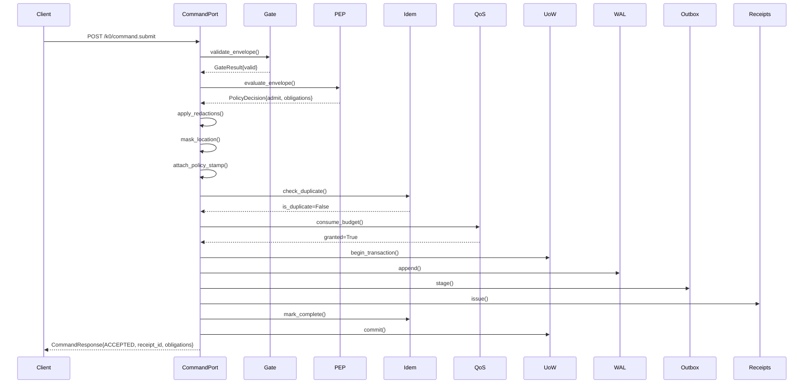
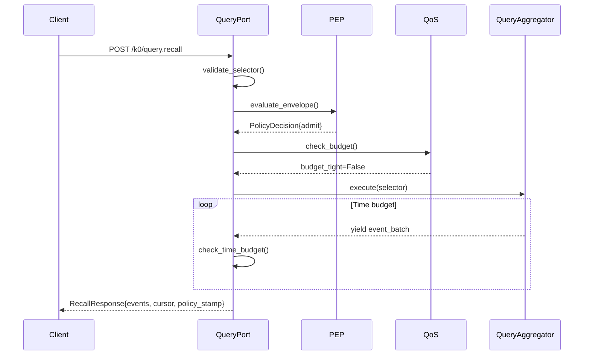
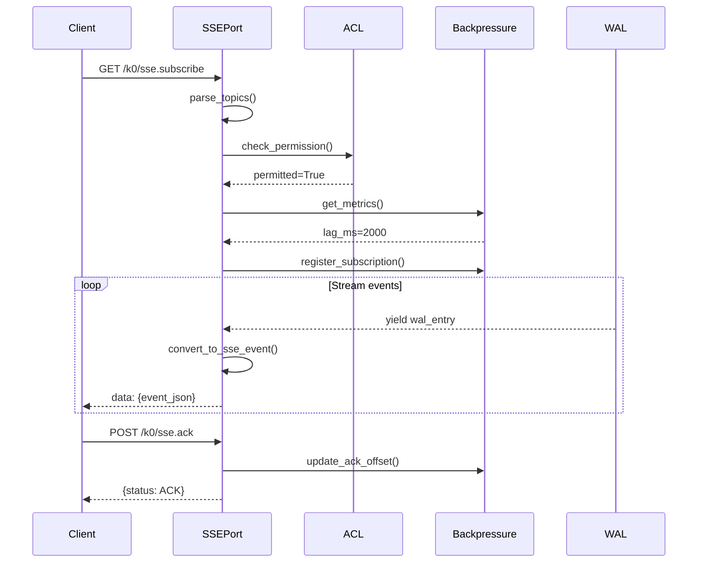

# K0 Kernel Ports (HTTP API)

**Purpose**: FastAPI routers exposing kernel operations via HTTP endpoints for command submission, query recall, SSE streaming, driver coordination, and observability ingestion.

**Layer**: API Layer (Entry Points)
**Category**: HTTP request handlers
**Related ADRs**: ADR-0074 (Ports Architecture), ADR-0086 (Dynamic Agent Creation), ADR-0089 (Redaction), ADR-0095 (Location Privacy), ADR-0099 (Retention)

---

## Overview

The ports module provides **5 HTTP endpoint groups** implementing K0 kernel's external API surface:

1. **Command Port** (`POST /k0/command.submit`): Full envelope ingestion with validation, policy enforcement, idempotency, transactional UoW, WAL append, outbox staging, receipt issuance
2. **Query Port** (`POST /k0/query.recall`): Selector-based memory recall with QoS budgets, time slicing, policy stamp inclusion, streaming mode support
3. **SSE Port** (`GET /k0/sse.subscribe`, `POST /k0/sse.ack`): Server-Sent Events streaming with backpressure management, active subscription tracking, offset acknowledgment
4. **Drivers Port** (`POST /k0/driver.handshake`): Dynamic driver registration for HTTP/gRPC adapters with session TTL management
5. **Observe Port** (`POST /k0/obs.emit`): K1 bridge telemetry ingestion for metrics/logs forwarding (dual-kernel observability)

**Architecture Pattern**: FastAPI dependency injection → Gate → PEP → QoS → UoW → WAL → Outbox → Receipt

**Performance Targets**: Command <150ms P95, Query <200ms P95, SSE <50ms P95

---

## Repository Files & Functions

### 1. `__init__.py`

**Purpose**: Export all routers for FastAPI app registration.

```python
def all_routers() -> list[APIRouter]:
    return [command, query, sse, observe, drivers]
```

- **Usage**: Called by `k0.kernel.server.create_app()` to mount all ports
- **Router list**: `command`, `query`, `sse`, `observe`, `drivers`

**FastAPI app setup**:

```python
from k0.ports import all_routers

app = FastAPI()
for router in all_routers():
    app.include_router(router, prefix="/k0")
```

---

### 2. `command.py`

**Purpose**: Command submission port with full envelope validation, policy enforcement, idempotency, transactional UoW, WAL append, outbox staging, receipt issuance (700+ lines).

#### Models

```python
class Envelope(BaseModel):
    # V1 Core Fields (ADR-0001)
    event_id: str
    tenant_id: str
    space_id: str
    topic: str
    band: Literal["GREEN", "AMBER", "RED"]
    actor: str
    body: dict[str, Any]

    # V1 Signature Fields
    sig_alg: str
    sig_kid: str
    envelope_sha256: str

    # V1.3 Policy Fields (Gap 42)
    policy_stamp: Optional[dict[str, Any]] = None
    location_geohash: Optional[str] = None

    # V1.4 Indexing Fields
    embedding_status: Optional[Literal["pending", "complete", "failed"]] = None
    fts_status: Optional[Literal["pending", "complete", "failed"]] = None

    # Metadata
    created_at: Optional[str] = None
    policy: Optional[dict[str, Any]] = None
```

- **Validation**: Pydantic models with type coercion and constraints
- **Required fields**: `event_id`, `tenant_id`, `space_id`, `topic`, `band`, `actor`, `body`
- **Optional fields**: Policy context, indexing status, policy stamps
- **Signature validation**: Deferred to gate module (out of scope for port)

```python
class CommandResponse(BaseModel):
    status: Literal["ACCEPTED", "REJECTED", "IDEMPOTENT_DUPLICATE"]
    event_id: str
    receipt_id: Optional[str] = None
    obligations: list[str] = []
    policy_manifest_fingerprint: Optional[str] = None
    obligation_details: Optional[dict[str, Any]] = None
    deny_reason: Optional[str] = None
```

- **ACCEPTED**: Envelope admitted, WAL written, receipt issued
- **REJECTED**: Policy denied envelope (PEP decision)
- **IDEMPOTENT_DUPLICATE**: Duplicate `event_id` detected (Gap 41 TOCTOU fix)

#### Functions

```python
@router.post("/command.submit")
async def submit_command(
    envelope: Envelope,
    gate: MinimalGate = Depends(get_gate),
    pep: PEP = Depends(get_pep),
    idem: IdempotencyLedger = Depends(get_idem),
    uow: UnitOfWorkManager = Depends(get_uow),
    wal: WALWriter = Depends(get_wal),
    outbox: OutboxManager = Depends(get_outbox),
    receipts: ReceiptIssuer = Depends(get_receipts),
    qos: QoSBudget = Depends(get_qos_budget),
) -> CommandResponse
```

**Pipeline Stages**:

**Stage 1: Minimal Gate Validation** (<10ms P95)

```python
gate_result = gate.validate_envelope(envelope.dict())
if not gate_result.valid:
    return CommandResponse(status="REJECTED", event_id=envelope.event_id, deny_reason=gate_result.reason)
```

- **Checks**: Schema validation, required fields, topic naming (DNS-1035), actor format (ulid/uuid)
- **No signature verification**: Signatures validated by `gate.crypto` if enabled

**Stage 2: Policy Evaluation** (<20ms P95)

```python
policy_decision = pep.evaluate_envelope(envelope.dict())
if not policy_decision.admit:
    return CommandResponse(
        status="REJECTED",
        event_id=envelope.event_id,
        deny_reason=policy_decision.deny_reason,
        policy_manifest_fingerprint=pep.get_manifest_fingerprint(),
    )
```

- **PEP checks**: Band blocking, device posture, capabilities, schema sunsets, ABAC roles
- **Outcome**: `PolicyDecision{admit, obligations, deny_reason}`

**Stage 3: Apply Obligations** (<5ms P95)

```python
# Redaction
if any(o.name == "kernel.redact.field" for o in policy_decision.obligations):
    directives = directives_from_obligations(policy_decision.obligations)
    envelope.body = apply_redactions(envelope.body, directives)

# Location masking (V1.3)
if any(o.name == "kernel.location.mask" for o in policy_decision.obligations):
    envelope = apply_location_privacy(envelope.dict(), envelope.band)
    envelope = Envelope(**envelope)

# QoS throttling
if any(o.name == "kernel.qos.throttle" for o in policy_decision.obligations):
    apply_qos_obligation(obligation, qos)
```

- **Redaction**: Field masking via `apply_redactions()`
- **Location privacy**: Geohash masking via `apply_location_privacy()`
- **QoS throttling**: Rate limiting via `apply_qos_obligation()`

**Stage 4: Attach Policy Stamp** (Gap 42, <1ms P95)

```python
policy_stamp = create_policy_stamp(
    decision=policy_decision,
    band=envelope.band,
    visible_to=[envelope.actor],
    policy_version=pep.get_manifest_fingerprint(),
)
envelope = attach_policy_stamp_to_envelope(envelope.dict(), policy_stamp)
```

- **Audit trail**: Immutable policy stamp with band, obligations, decision, policy version
- **Propagation**: Travels through WAL → outbox → downstream drivers → receipts

**Stage 5: Idempotency Check** (Gap 41 TOCTOU fix, <2ms P95)

```python
# Atomic check-commit within UoW transaction
async with uow.transaction():
    duplicate_check = idem.check_duplicate(envelope.event_id)
    if duplicate_check.is_duplicate:
        return CommandResponse(
            status="IDEMPOTENT_DUPLICATE",
            event_id=envelope.event_id,
            receipt_id=duplicate_check.original_receipt_id,
        )

    # Mark event_id as in-progress (check-commit window tracking)
    idem.mark_in_progress(envelope.event_id)
```

- **TOCTOU fix**: Check and commit in same transaction (Gap 41)
- **Window tracking**: `in_progress` state prevents race conditions
- **Duplicate response**: Returns original `receipt_id` for idempotent retries

**Stage 6: QoS Budget Consumption** (<1ms P95)

```python
qos_result = qos.consume_budget(
    tenant_id=envelope.tenant_id,
    space_id=envelope.space_id,
    fanout_requested=envelope.policy.get("caps", {}).get("fanout", {}).get("requested", 1),
    payload_bytes=len(json.dumps(envelope.body)),
)
if not qos_result.granted:
    return CommandResponse(
        status="REJECTED",
        event_id=envelope.event_id,
        deny_reason="QOS_BUDGET_EXHAUSTED",
    )
```

- **Budgets**: Fanout, payload size, throughput (ops/sec)
- **QoS tightening**: If budget tight, reduce `top_k` and `max_results` (Gap 29)

**Stage 7: Transactional Commit** (<50ms P95)

```python
async with uow.transaction():
    # Append to WAL
    wal_pos = wal.append(
        event_id=envelope.event_id,
        tenant_id=envelope.tenant_id,
        space_id=envelope.space_id,
        topic=envelope.topic,
        band=envelope.band,
        body_json=json.dumps(envelope.body),
        redacted_body_json=json.dumps(envelope.body),  # Already sanitized
        policy_stamp_json=json.dumps(policy_stamp),
        sig_alg=envelope.sig_alg,
        sig_kid=envelope.sig_kid,
        envelope_sha256=envelope.envelope_sha256,
        actor=envelope.actor,
    )

    # Stage in outbox
    outbox.stage(
        event_id=envelope.event_id,
        wal_pos=wal_pos,
        tenant_id=envelope.tenant_id,
        space_id=envelope.space_id,
        topic=envelope.topic,
    )

    # Issue receipt
    receipt_id = receipts.issue(
        event_id=envelope.event_id,
        wal_pos=wal_pos,
        status="ACCEPTED",
        obligations=policy_decision.obligations,
        policy_stamp=policy_stamp,
    )

    # Mark idempotency complete
    idem.mark_complete(envelope.event_id, receipt_id=receipt_id)
```

- **Atomicity**: All operations in single SQLite transaction
- **WAL fields**: Includes `policy_stamp_json`, `redacted_body_json`, `location_geohash`
- **Outbox**: Staged for async delivery to drivers
- **Receipt**: Returned to client with obligations and policy context

**Stage 8: Response** (<1ms P95)

```python
return CommandResponse(
    status="ACCEPTED",
    event_id=envelope.event_id,
    receipt_id=receipt_id,
    obligations=[o.name for o in policy_decision.obligations],
    policy_manifest_fingerprint=pep.get_manifest_fingerprint(),
    obligation_details={o.name: o.details for o in policy_decision.obligations},
)
```

**Error Handling**:

- Validation errors → 422 Unprocessable Entity
- Policy denials → 403 Forbidden
- QoS exhaustion → 429 Too Many Requests
- Internal errors → 500 Internal Server Error (structured `ErrorEnvelope`)

---

### 2.1 Command Topic Routing (M2 Architecture)

The command port is **topic-routed**: the `topic` field in every envelope determines which outbox driver receives the data, which body schema validates the payload, and which gate rules apply.

#### How It Works

```
Envelope arrives at POST /k0/command.submit
         |
         v
  Stage 1: Gate reads envelope.topic
         |  -> gate_topic_validation.yaml: per-topic rules (body_required, max_body_bytes, allowed_bands)
         |  -> envelope.schema.json: if/then allOf validates body against topic-specific schema
         v
  Stage 7: Outbox stages event
         |  -> outbox_routing.yaml: topic -> driver + priority + target_pipeline
         |     e.g. topic=memory.write -> driver=st_epi, pipeline=P02
         v
  Driver picks up from outbox, writes to target storage
```

#### Contract Files (Source of Truth)

| Contract | Path | Purpose |
| -------- | ---- | ------- |
| Topic Registry | `k0/contracts/taxonomies/command_topics.yaml` | Canonical list of 7 command topics + resolution rules |
| Body Schemas | `k0/contracts/jsonschema/topics/<topic>.body.json` | Per-topic payload validation (one file per topic) |
| Outbox Routing | `k0/contracts/taxonomies/outbox_routing.yaml` | topic -> outbox driver + priority + pipeline |
| Gate Validation | `k0/contracts/capabilities/gate_topic_validation.yaml` | Per-topic gate rules (body_required, max_bytes, bands) |
| Envelope Schema | `k0/contracts/jsonschema/envelope.schema.json` | Master envelope schema with if/then allOf per topic |
| Bridge Protocol | `bridge/contracts/command_port.protocol.yaml` | IKernelCommandPort formal protocol spec |
| Bridge Envelope | `bridge/contracts/schemas/command_envelope.json` | Bridge-side envelope schema |

#### Current Topics (7)

| Topic | Driver | Pipeline | Body Schema |
| ----- | ------ | -------- | ----------- |
| `memory.write` | `st_epi` | P02 | `memory_write.body.json` |
| `session.snapshot` | `st_session` | Archive | `session_snapshot.body.json` |
| `beliefs.archive` | `st_beliefs` | Archive | `beliefs_archive.body.json` |
| `history.archive` | `st_history` | Archive | `history_archive.body.json` |
| `plan.committed` | `st_epi` | P02 | `plan_committed.body.json` |
| `ifl.*` | `st_epi` | P02 | `ifl_event.body.json` |
| `sync.delta` | `st_sync` | P07 | `sync_delta.body.json` |

> **Note**: `ifl.*` uses glob resolution (`fnmatch`). An incoming topic like `ifl.health.apple_watch.heart_rate` matches the `ifl.*` route. Resolution order is defined in `command_topics.yaml` field `resolution: exact_then_glob`.

---

### 2.2 How to Add a New Command Topic

This is the end-to-end checklist for introducing a new topic to the command port. Follow every step; skipping any step will cause either validation failures or unrouted data.

#### Step 1: Register the Topic

**File**: `k0/contracts/taxonomies/command_topics.yaml`

Add a new entry under the `topics` list:

```yaml
- topic_id: "your_domain.your_action"
  description: "One-line description of what this topic carries"
  body_schema: "$ref: ../jsonschema/topics/your_domain_your_action.body.json"
  producers:
    - "k1.module_that_sends_this"
  consumers:
    - "k0.pipeline_that_receives_this"
  introduced_in: "M<milestone>"
```

**Rules**:

- `topic_id` must be DNS-1035 compatible: lowercase, dots, no spaces
- Glob topics (e.g. `foo.*`) are allowed for wildcard families
- The `body_schema` `$ref` MUST point to the file you will create in Step 2

#### Step 2: Create the Body JSON Schema

**File**: `k0/contracts/jsonschema/topics/<topic_name>.body.json`

Create a new JSON Schema file that validates the `body` field for this topic:

```json
{
  "$schema": "https://json-schema.org/draft/2020-12/schema",
  "$id": "urn:familyos:k0:topic:your_domain.your_action:body:v1",
  "title": "your_domain.your_action body",
  "description": "Payload schema for your_domain.your_action topic",
  "type": "object",
  "required": ["field_a", "field_b"],
  "properties": {
    "field_a": { "type": "string" },
    "field_b": { "type": "integer", "minimum": 0 }
  },
  "additionalProperties": false
}
```

**Rules**:

- `$id` must follow pattern `urn:familyos:k0:topic:<topic_id>:body:v<N>`
- Use `additionalProperties: false` to catch unexpected fields
- Filename convention: replace dots with underscores, append `.body.json`

#### Step 3: Add Outbox Route

**File**: `k0/contracts/taxonomies/outbox_routing.yaml`

Add a new entry under the `routes` list:

```yaml
- topic_id: "your_domain.your_action"
  driver: "st_your_driver"
  priority: "normal"          # or "high", "low"
  target_pipeline: "P0N"     # Which K0 pipeline consumes this
  driver_meta:
    table: "your_table_name"
    index_embedding: false    # true if vectors needed
    index_fts: false          # true if full-text search needed
```

**Rules**:

- `driver` must be a known outbox driver ID (check existing routes for valid IDs)
- `priority` governs outbox pickup order: high > normal > low
- `driver_meta` fields are driver-specific; check the target driver's contract

#### Step 4: Add Envelope Conditional Validation

**File**: `k0/contracts/jsonschema/envelope.schema.json`

Two changes:

**(a)** Update the `topic` field regex to include your new prefix (if it is a new prefix not already covered):

```json
"topic": {
  "type": "string",
  "pattern": "^(memory|events|ui|policy|session|beliefs|history|plan|ifl|sync|infra\\.sanitized|privacy|intelligence\\.advisory|YOUR_NEW_PREFIX)\\."
}
```

**(b)** Add an `if/then` block in the `allOf` array:

```json
{
  "if": {
    "properties": { "topic": { "const": "your_domain.your_action" } }
  },
  "then": {
    "properties": {
      "body": { "$ref": "topics/your_domain_your_action.body.json" }
    }
  }
}
```

For glob topics (e.g. `foo.*`), use `pattern` instead of `const`:

```json
{
  "if": {
    "properties": { "topic": { "pattern": "^foo\\." } }
  },
  "then": {
    "properties": {
      "body": { "$ref": "topics/foo_event.body.json" }
    }
  }
}
```

#### Step 5: Add Gate Validation Rule

**File**: `k0/contracts/capabilities/gate_topic_validation.yaml`

Add a new entry under the `topic_rules` list:

```yaml
- topic_id: "your_domain.your_action"
  body_required: true
  max_body_bytes: 65536        # Adjust based on expected payload size
  allowed_bands: ["GREEN", "AMBER", "RED"]   # Which privacy bands can carry this topic
  validation_level: "strict"   # "strict" or "permissive"
  notes: "Short rationale for the limits"
```

**Rules**:

- `body_required: true` is the default for all command topics (data must have a payload)
- `max_body_bytes`: size-gate the body before deserialization (prevents OOM)
- `allowed_bands`: restrict which privacy bands can carry this topic (e.g. RED-only topics)
- `validation_level`: `strict` = reject unknown fields, `permissive` = warn only

#### Step 6: Update Bridge Protocol (If Bridge Changes Needed)

**File**: `bridge/contracts/command_port.protocol.yaml`

Usually NOT required unless:

- The new topic needs a new Bridge-side builder method
- Transport behavior differs (e.g. new offline queueing rules)
- New capability token scopes are needed

If changes are needed, update the `envelope_building` section to add the new topic's builder pattern.

#### Step 7: Update Architecture Documentation

Update these files to reflect the new topic:

| File | What to update |
| ---- | -------------- |
| `architecture_diagrams/bridge/bridge_architecture.mmd` | Add node in `TRANSPORT_COMMAND_TOPICS` subgraph, add edge from K1 caller |
| `bridge/README.md` | Section 12 implementation status if needed |
| `k0/ports/README.md` (this file) | Add row to Section 2.1 "Current Topics" table |
| `governance/k0/k0_architecture_master.md` | Part 4.1 Event Topics Registry |

#### Step 8: Validate Cross-Consistency

Run this validation after all files are created/updated:

```python
# Parse all contract files and check:
# 1. Every topic in command_topics.yaml has a body schema file
# 2. Every topic in command_topics.yaml has a route in outbox_routing.yaml
# 3. Every topic in command_topics.yaml has a gate rule in gate_topic_validation.yaml
# 4. Every topic in outbox_routing.yaml exists in command_topics.yaml
# 5. Every if/then in envelope.schema.json allOf maps to a topic in command_topics.yaml
# 6. Topic regex in envelope.schema.json covers all topic prefixes
```

#### Quick Reference: File Naming Conventions

| Item | Convention | Example |
| ---- | ---------- | ------- |
| Topic ID | `domain.action` (DNS-1035) | `memory.write` |
| Body schema filename | `<topic_id dots→underscores>.body.json` | `memory_write.body.json` |
| Body schema `$id` | `urn:familyos:k0:topic:<topic_id>:body:v<N>` | `urn:familyos:k0:topic:memory.write:body:v1` |
| Glob topic | `domain.*` | `ifl.*` |
| Glob body schema | `<domain>_event.body.json` | `ifl_event.body.json` |

---

### 3. `query.py`

**Purpose**: Query recall port with selector-based memory retrieval, QoS budgets, time slicing, policy stamp inclusion (Gap 20), streaming mode support (400+ lines).

#### Models

```python
class RecallSelector(BaseModel):
    type: Literal["topic", "space", "tenant", "semantic", "hybrid"] = "topic"
    topic: Optional[str] = None
    tenant_id: str
    space_id: Optional[str] = None
    limit: int = 50
    cursor: Optional[str] = None
    after: Optional[str] = None  # ISO8601 timestamp
    query: Optional[str] = None  # For semantic/hybrid selectors
```

- **Validation**: Pydantic with custom validators (Gap 24)
  - `limit` ∈ [1, 1000]
  - `cursor` xor `after` (not both)
  - `query` required for semantic/hybrid types
  - `topic` required for topic selectors

- **Selector types**:
  - `topic`: Filter by topic pattern (`family.*`)
  - `space`: All events in space
  - `tenant`: All events in tenant
  - `semantic`: Vector search via `query`
  - `hybrid`: Semantic + keyword search

```python
class RecallResponse(BaseModel):
    status: Literal["OK", "PARTIAL", "BUDGET_EXHAUSTED", "EMPTY"]
    events: list[dict[str, Any]]
    cursor: Optional[str] = None
    has_more: bool = False
    budget_remaining_ms: Optional[float] = None
    policy_stamp: Optional[dict[str, Any]] = None  # Gap 20
```

- **Status codes**:
  - `OK`: Query completed, all results returned
  - `PARTIAL`: Time budget exhausted mid-query
  - `BUDGET_EXHAUSTED`: QoS budget exhausted, no results
  - `EMPTY`: No events match selector

- **Policy stamp (Gap 20)**: Included in response for audit trail

#### Functions

```python
@router.post("/query.recall")
async def query_recall(
    selector: RecallSelector,
    gate: MinimalGate = Depends(get_gate),
    pep: PEP = Depends(get_pep),
    qos: QoSBudget = Depends(get_qos_budget),
    query_aggregator: QueryAggregator = Depends(get_query_aggregator),
    time_budget_ms: float = 200.0,
) -> RecallResponse
```

**Pipeline Stages**:

**Stage 1: Selector Validation** (<5ms P95)

```python
# Gap 24: Boundary checks
if selector.cursor and selector.after:
    raise HTTPException(status_code=422, detail="Cannot use both cursor and after")

if selector.limit < 1 or selector.limit > 1000:
    raise HTTPException(status_code=422, detail="Limit must be in [1, 1000]")

if selector.type in ["semantic", "hybrid"] and not selector.query:
    raise HTTPException(status_code=422, detail="Query required for semantic/hybrid selectors")
```

**Stage 2: PEP Evaluation** (<20ms P95)

```python
policy_decision = pep.evaluate_envelope({
    "band": "GREEN",  # Query operations default to GREEN
    "topic": selector.topic or "*",
    "tenant_id": selector.tenant_id,
    "space_id": selector.space_id,
    "actor": request.headers.get("X-Actor-ID", "anonymous"),
    "policy": {"abac": {"roles": ["reader"]}},
})

if not policy_decision.admit:
    raise HTTPException(
        status_code=403,
        detail=policy_decision.deny_reason,
    )
```

- **Role-based access**: Check ABAC roles against topic patterns
- **Band inheritance**: Query inherits caller's band (default GREEN)

**Stage 3: Create Policy Stamp** (Gap 20, <1ms P95)

```python
policy_stamp = create_policy_stamp(
    decision=policy_decision,
    band="GREEN",
    policy_version=pep.get_manifest_fingerprint(),
)
```

- **Gap 20 fix**: Include policy stamp in query response for audit trail

**Stage 4: QoS Budget Check** (<1ms P95)

```python
qos_result = qos.check_budget(
    tenant_id=selector.tenant_id,
    space_id=selector.space_id,
)

if qos_result.budget_exhausted:
    return RecallResponse(
        status="BUDGET_EXHAUSTED",
        events=[],
        policy_stamp=policy_stamp,
    )

# QoS tightening (Gap 29)
if qos_result.budget_tight:
    selector.limit = min(selector.limit, 20)
```

- **Tightening**: If budget <20% remaining, reduce result limit

**Stage 5: Execute Selector** (<150ms P95)

```python
start_time = time.time()
events = []

async for event_batch in query_aggregator.execute(selector):
    events.extend(event_batch)

    # Time slice budget
    elapsed_ms = (time.time() - start_time) * 1000
    if elapsed_ms > time_budget_ms:
        # Budget exhausted mid-query
        return RecallResponse(
            status="PARTIAL",
            events=events,
            cursor=event_batch[-1]["event_id"],  # Resume cursor
            has_more=True,
            budget_remaining_ms=0.0,
            policy_stamp=policy_stamp,
        )

    # Result limit reached
    if len(events) >= selector.limit:
        break
```

- **Streaming execution**: `QueryAggregator` yields batches (100 events/batch)
- **Time budget**: Default 200ms, configurable via `time_budget_ms` param
- **Partial results**: Return cursor for pagination if budget exhausted

**Stage 6: Response** (<5ms P95)

```python
elapsed_ms = (time.time() - start_time) * 1000

return RecallResponse(
    status="OK" if len(events) > 0 else "EMPTY",
    events=events,
    cursor=None,
    has_more=False,
    budget_remaining_ms=time_budget_ms - elapsed_ms,
    policy_stamp=policy_stamp,  # Gap 20
)
```

**SSE Streaming Mode** (optional):

```python
@router.post("/query.recall/stream")
async def query_recall_stream(selector: RecallSelector):
    async def event_generator():
        async for batch in query_aggregator.execute(selector):
            for event in batch:
                yield f"data: {json.dumps(event)}\n\n"

    return EventSourceResponse(event_generator())
```

- **Usage**: Long-polling queries with SSE for real-time results
- **Client**: Must handle `data:` lines and reconnect on `cursor`

---

### 4. `sse.py`

**Purpose**: Server-Sent Events streaming port with backpressure management, active subscription tracking (Issue #046), offset acknowledgment (400+ lines).

#### Models

```python
class SSETraceEvent(BaseModel):
    event_id: str
    wal_pos: int
    tenant_id: str
    space_id: str
    topic: str
    band: Literal["GREEN", "AMBER", "RED"]
    body: dict[str, Any]
    policy_stamp: Optional[dict[str, Any]] = None  # Gap 20
    created_at: str
```

- **WAL position**: Monotonic offset for acknowledgment
- **Policy stamp**: Included for audit trail (Gap 20)

```python
class BackpressureMetrics(BaseModel):
    lag_ms: float
    pending_events: int
    ack_offsets: dict[str, int]  # {subscriber_id: last_ack_pos}
```

- **Lag calculation**: `(current_wal_pos - last_ack_pos) * avg_event_processing_time_ms`
- **Pending events**: Count of unacknowledged events per subscriber

#### Functions

```python
@router.get("/sse.subscribe")
async def subscribe(
    topics: str,  # Comma-separated: "family.photos,family.calendar"
    space_id: str,
    subscriber_id: str,
    last_ack_offset: int = 0,
    pep: PEP = Depends(get_pep),
    wal: WALReader = Depends(get_wal_reader),
    acl: ACLEnforcer = Depends(get_acl),
    backpressure: BackpressureManager = Depends(get_backpressure),
) -> EventSourceResponse
```

**Pipeline Stages**:

**Stage 1: Topic Parsing & Validation** (<2ms P95)

```python
topic_list = [t.strip() for t in topics.split(",")]

for topic in topic_list:
    if not re.match(r"^[a-z0-9\.\-\*]+$", topic):
        raise HTTPException(status_code=422, detail=f"Invalid topic pattern: {topic}")
```

- **Pattern support**: Wildcards (`family.*`), exact matches (`family.photos`)

**Stage 2: Subscriber Validation** (<1ms P95)

```python
if not subscriber_id or len(subscriber_id) < 10:
    raise HTTPException(status_code=422, detail="Invalid subscriber_id")
```

- **Format**: ULID or UUID expected

**Stage 3: ACL Checks** (<5ms P95)

```python
for topic in topic_list:
    if not acl.check_permission("sse", f"topic:{topic}", subscriber_id, "subscribe"):
        raise HTTPException(status_code=403, detail=f"No subscribe permission for {topic}")
```

- **Granular permissions**: Per-topic subscription ACLs

**Stage 4: Backpressure Evaluation** (<10ms P95)

```python
metrics = backpressure.get_metrics(subscriber_id)

# Shed load if lag > 30s
if metrics.lag_ms > 30_000:
    raise HTTPException(status_code=429, detail="Subscriber lagging too far, retry later")

# Throttle if lag > 10s
if metrics.lag_ms > 10_000:
    throttle_ratio = 0.5  # Deliver 50% of events
else:
    throttle_ratio = 1.0  # Full delivery

# Warning if lag > 5s
if metrics.lag_ms > 5_000:
    logger.warning(f"Subscriber {subscriber_id} lagging {metrics.lag_ms}ms")
```

- **Backpressure levels**:
  - **Shed** (lag > 30s): 429 Too Many Requests
  - **Throttle** (lag > 10s): 50% event delivery rate
  - **Warning** (lag > 5s): Log warning

**Stage 5: Active Subscription Tracking** (Issue #046, <1ms P95)

```python
backpressure.register_subscription(subscriber_id, topics=topic_list, space_id=space_id)
```

- **Tracking**: Store active subscriptions in `st_active_subscriptions` table
- **Cleanup**: Auto-expire stale subscriptions after 5 minutes of inactivity

**Stage 6: Stream WAL Events** (<50ms P95 per batch)

```python
async def event_generator():
    async for wal_entry in wal.stream_from(last_ack_offset, topics=topic_list, space_id=space_id):
        # Skip if throttling
        if throttle_ratio < 1.0 and random.random() > throttle_ratio:
            continue

        # Convert WAL entry to SSE event
        event = SSETraceEvent(
            event_id=wal_entry["event_id"],
            wal_pos=wal_entry["wal_pos"],
            tenant_id=wal_entry["tenant_id"],
            space_id=wal_entry["space_id"],
            topic=wal_entry["topic"],
            band=wal_entry["band"],
            body=json.loads(wal_entry["body_json"]),
            policy_stamp=json.loads(wal_entry["policy_stamp_json"]) if wal_entry["policy_stamp_json"] else None,
            created_at=wal_entry["created_at"],
        )

        yield f"data: {event.json()}\n\n"

return EventSourceResponse(event_generator())
```

- **Streaming**: Yields events as SSE `data:` lines
- **Gap 20**: Includes policy stamps in events
- **Throttling**: Probabilistic event skipping when lagging

**Stage 7: Connection Cleanup**

```python
@app.on_event("shutdown")
async def cleanup_subscriptions():
    backpressure.unregister_subscription(subscriber_id)
```

- **Graceful shutdown**: Remove subscription tracking on disconnect

```python
@router.post("/sse.ack")
async def acknowledge(
    subscriber_id: str,
    wal_pos: int,
    backpressure: BackpressureManager = Depends(get_backpressure),
    qos: QoSBudget = Depends(get_qos_budget),
) -> dict[str, Any]
```

**Acknowledgment Flow**:

**Stage 1: Update Offset** (<2ms P95)

```python
backpressure.update_ack_offset(subscriber_id, wal_pos)
```

- **Tracking**: Update `last_ack_pos` in `st_active_subscriptions`

**Stage 2: Release Scheduler Tokens** (Gap 29, <1ms P95)

```python
released_tokens = qos.release_scheduler_tokens(subscriber_id, wal_pos)
```

- **Token budget**: Free up scheduler tokens for downstream consumers

**Stage 3: Response** (<1ms P95)

```python
return {
    "status": "ACK",
    "wal_pos": wal_pos,
    "released_tokens": released_tokens,
}
```

---

### 5. `drivers.py`

**Purpose**: Dynamic driver registration port for HTTP/gRPC adapters with session TTL management.

#### Models

```python
class DriverHandshakeRequest(BaseModel):
    driver_id: str
    driver_name: str
    protocol: Literal["http", "grpc"]
    endpoint: str  # URL for HTTP, host:port for gRPC
    capabilities: dict[str, Any]
    session_ttl_seconds: int = 300
```

- **Validation**:
  - `driver_id`: ULID or UUID format
  - `endpoint` (HTTP): Valid URL with scheme
  - `endpoint` (gRPC): Valid `host:port` format
  - `session_ttl_seconds`: [60, 3600]

```python
class DriverHandshakeResponse(BaseModel):
    status: Literal["REGISTERED", "UPDATED", "REJECTED"]
    driver_id: str
    session_expires_at: str  # ISO8601
    capabilities_accepted: list[str]
```

#### Functions

```python
@router.post("/driver.handshake")
async def driver_handshake(
    request: DriverHandshakeRequest,
    driver_pool: DriverWorkerPool = Depends(get_driver_pool),
) -> DriverHandshakeResponse
```

**Pipeline Stages**:

**Stage 1: Validation** (<5ms P95)

```python
# HTTP endpoint validation
if request.protocol == "http":
    if not request.endpoint.startswith("http://") and not request.endpoint.startswith("https://"):
        raise HTTPException(status_code=422, detail="HTTP endpoint must start with http:// or https://")

# gRPC endpoint validation
if request.protocol == "grpc":
    if ":" not in request.endpoint:
        raise HTTPException(status_code=422, detail="gRPC endpoint must be in host:port format")
```

**Stage 2: Register Driver** (<10ms P95)

```python
result = driver_pool.register_handshake(
    driver_id=request.driver_id,
    driver_name=request.driver_name,
    protocol=request.protocol,
    endpoint=request.endpoint,
    capabilities=request.capabilities,
    session_ttl_seconds=request.session_ttl_seconds,
)
```

- **DriverWorkerPool**: Manages driver registry and session expiration
- **Session tracking**: Stores in `st_driver_registry` table with expiration timestamp

**Stage 3: Response** (<1ms P95)

```python
return DriverHandshakeResponse(
    status=result.status,  # REGISTERED or UPDATED
    driver_id=request.driver_id,
    session_expires_at=result.expires_at,
    capabilities_accepted=result.accepted_capabilities,
)
```

- **Status**:
  - `REGISTERED`: New driver added
  - `UPDATED`: Existing driver session renewed
  - `REJECTED`: Validation failed

---

### 6. `observe.py`

**Purpose**: K1 bridge telemetry ingestion for metrics/logs forwarding (dual-kernel observability).

#### Models

```python
class ObservabilityPayload(BaseModel):
    kind: Literal["metrics", "logs"]
    source: str  # K1 kernel identifier
    timestamp: str  # ISO8601
    data: dict[str, Any]  # Prometheus snapshot or structured logs
```

#### Functions

```python
@router.post("/obs.emit")
async def emit(
    payload: ObservabilityPayload,
    metrics_buffer: ForwardedMetricsBuffer = Depends(get_metrics_buffer),
    logs_forwarder: LogsForwarder = Depends(get_logs_forwarder),
) -> dict[str, Any]
```

**Pipeline Stages**:

**Stage 1: Kind-Based Routing** (<1ms P95)

```python
if payload.kind == "metrics":
    metrics_buffer.ingest(payload.data, source=payload.source)
elif payload.kind == "logs":
    _ingest_forwarded_logs(payload.data, source=payload.source)
```

**Stage 2a: Metrics Ingestion** (<5ms P95)

```python
# ForwardedMetricsBuffer caches Prometheus snapshot
metrics_buffer.ingest(payload.data, source=payload.source)

# Expose at /metrics endpoint as k1_forwarded_* prefix
# Example: k1_forwarded_agent_lifecycle_transitions_total{source="k1_kernel_001"}
```

**Stage 2b: Logs Forwarding** (<10ms P95)

```python
def _ingest_forwarded_logs(logs: dict[str, Any], source: str):
    for log_entry in logs.get("entries", []):
        logger.info(
            "K1 forwarded log",
            extra={
                "source": source,
                "level": log_entry.get("level"),
                "message": log_entry.get("message"),
                "context": log_entry.get("context", {}),
            },
        )
```

- **Structured logging**: Preserves K1 context in K0 logs
- **Correlation**: Use `trace_id` to link K0 and K1 operations

**Stage 3: Response** (<1ms P95)

```python
return {"status": "OK", "kind": payload.kind}
```

---

### 7. `errors.py`

**Purpose**: Structured error responses for port handlers.

#### Classes

```python
@dataclass
class ErrorEnvelope:
    code: str  # Error code (e.g., "POLICY_DENIED", "QOS_BUDGET_EXHAUSTED")
    component: str  # Port component (e.g., "command", "query", "sse")
    trace_id: Optional[str] = None
    reason: Optional[str] = None
    hint: Optional[str] = None
    budgets: Optional[dict[str, Any]] = None
    details: Optional[dict[str, Any]] = None
```

**Functions**:

```python
def as_payload(self) -> dict[str, Any]:
    return {
        "error": {
            "code": self.code,
            "component": self.component,
            "trace_id": self.trace_id,
            "reason": self.reason,
            "hint": self.hint,
            "budgets": self.budgets,
            "details": self.details,
        }
    }
```

**Usage**:

```python
from k0.ports.errors import ErrorEnvelope

error = ErrorEnvelope(
    code="POLICY_DENIED",
    component="command",
    trace_id=request.headers.get("X-Trace-ID"),
    reason="Band RED exceeds fanout limit",
    hint="Reduce fanout or request GREEN band",
    budgets={"fanout": {"limit": 1, "requested": 10}},
)

raise HTTPException(status_code=403, detail=error.as_payload())
```

---

## Connections & Integration Points

### Upstream Dependencies

1. **`k0.gate.minimal_gate`**: Schema validation, topic naming, actor format checks
2. **`k0.policy.pep_syscall`**: Policy evaluation, obligation generation, policy stamps
3. **`k0.qos.budget`**: QoS budget management, scheduler tokens, tightening
4. **`k0.idem.ledger`**: Idempotency checks, TOCTOU fix (Gap 41)
5. **`k0.uow.manager`**: Transactional commit, atomicity guarantees
6. **`k0.storage.wal`**: WAL append/stream, offset tracking
7. **`k0.outbox.manager`**: Outbox staging for async driver delivery
8. **`k0.receipts.issuer`**: Receipt generation with obligations and policy stamps
9. **`k0.query.aggregator`**: Selector execution, time slicing, streaming
10. **`k0.drivers.pool`**: Driver registry, session TTL management
11. **`k0.obs.metrics_buffer`**: K1 metrics forwarding and caching

### Downstream Consumers

1. **K1 Agent Kernel**: Calls `/k0/command.submit` to submit agent traces
2. **FamilyOS Web UI**: Calls `/k0/query.recall` for memory retrieval
3. **Mobile Apps**: Subscribe via `/k0/sse.subscribe` for real-time updates
4. **Driver Adapters**: Handshake via `/k0/driver.handshake` for registration
5. **K1 Observability Bridge**: Emits telemetry via `/k0/obs.emit`

### Data Flow

#### Command Submission Flow



#### Query Recall Flow



#### SSE Subscription Flow



---

## Testing

### Unit Tests

```python
# tests/k0/ports/test_command.py
def test_submit_command_accepted(test_client):
    response = test_client.post("/k0/command.submit", json={
        "event_id": "evt_123",
        "tenant_id": "tenant_001",
        "space_id": "space_001",
        "topic": "family.photos",
        "band": "GREEN",
        "actor": "device_abc",
        "body": {"photo_url": "https://cdn.example.com/photo.jpg"},
        "sig_alg": "EdDSA",
        "sig_kid": "key_001",
        "envelope_sha256": "a7f3c2e8...",
    })
    assert response.status_code == 202
    assert response.json()["status"] == "ACCEPTED"
    assert "receipt_id" in response.json()

def test_submit_command_policy_denied(test_client):
    response = test_client.post("/k0/command.submit", json={
        "band": "RED",
        "topic": "health.records",
        "policy": {"caps": {"fanout": {"requested": 100}}},
        # ...other required fields
    })
    assert response.status_code == 403
    assert response.json()["status"] == "REJECTED"
    assert response.json()["deny_reason"] == "CAP_FANOUT_EXCEEDED"

# tests/k0/ports/test_query.py
def test_query_recall_topic_selector(test_client):
    response = test_client.post("/k0/query.recall", json={
        "type": "topic",
        "topic": "family.photos",
        "tenant_id": "tenant_001",
        "space_id": "space_001",
        "limit": 10,
    })
    assert response.status_code == 200
    assert response.json()["status"] == "OK"
    assert len(response.json()["events"]) <= 10

def test_query_recall_time_budget_exhausted(test_client):
    response = test_client.post("/k0/query.recall?time_budget_ms=50", json={
        "type": "space",
        "tenant_id": "tenant_001",
        "space_id": "space_001",
        "limit": 10000,  # Large limit to trigger timeout
    })
    assert response.json()["status"] == "PARTIAL"
    assert response.json()["cursor"] is not None
    assert response.json()["budget_remaining_ms"] == 0.0

# tests/k0/ports/test_sse.py
async def test_sse_subscribe_backpressure_shed(test_client, mocker):
    # Mock lagging subscriber
    mocker.patch("k0.obs.BackpressureManager.get_metrics", return_value=BackpressureMetrics(lag_ms=35000, pending_events=1000))

    response = test_client.get("/k0/sse.subscribe?topics=family.photos&space_id=space_001&subscriber_id=sub_001")
    assert response.status_code == 429
    assert "lagging too far" in response.text
```

### Integration Tests

```python
# tests/integration/test_command_to_sse.py
async def test_command_propagates_to_sse(kernel_client, sse_client):
    # Submit command
    submit_response = kernel_client.post("/k0/command.submit", json={...})
    assert submit_response.status_code == 202
    receipt_id = submit_response.json()["receipt_id"]

    # Subscribe via SSE
    async with sse_client.stream("GET", "/k0/sse.subscribe?topics=family.photos&space_id=space_001&subscriber_id=sub_001") as sse:
        async for event in sse.aiter_text():
            if "data:" in event:
                event_data = json.loads(event.split("data:")[1])
                if event_data["event_id"] == "evt_123":
                    # Command propagated to SSE stream
                    assert event_data["policy_stamp"] is not None
                    break
```

---

## Performance & Observability

### Metrics

- `k0_command_submit_total{status, band, tenant, lane}` (counter): Command submissions
- `k0_command_latency_ms{stage, band, tenant, lane}` (histogram): Per-stage latency (buckets: 1, 5, 10, 25, 50, 100, 250, 500, 1000ms)
- `k0_query_recall_total{selector_type, status, tenant}` (counter): Query recalls
- `k0_query_events_returned_total{selector_type, tenant}` (histogram): Events returned per query
- `k0_sse_subscriptions_active{tenant, space}` (gauge): Active SSE subscriptions
- `k0_sse_lag_ms{subscriber_id}` (gauge): SSE subscriber lag
- `k0_sse_backpressure_level{subscriber_id, level}` (gauge): Backpressure level (0=none, 1=warning, 2=throttle, 3=shed)
- `k0_driver_handshakes_total{status, protocol}` (counter): Driver handshakes
- `k0_obs_emit_total{kind, source}` (counter): K1 telemetry emissions

### Traces

- Span: `command.submit` (band, topic, tenant, status, receipt_id)
- Span: `query.recall` (selector_type, tenant, events_returned, cursor)
- Span: `sse.subscribe` (topics, subscriber_id, lag_ms, backpressure_level)
- Span: `driver.handshake` (driver_id, protocol, status)
- Span: `obs.emit` (kind, source)

### Logging

```json
{
  "event": "Command accepted",
  "event_id": "evt_123",
  "tenant": "tenant_001",
  "space": "space_001",
  "topic": "family.photos",
  "band": "GREEN",
  "obligations": ["kernel.log.detailed"],
  "receipt_id": "rcpt_456",
  "latency_ms": 85
}
```

---

## Related Modules

- **`k0.gate.minimal_gate`**: Schema validation
- **`k0.policy.pep_syscall`**: Policy evaluation
- **`k0.qos.budget`**: QoS budget management
- **`k0.idem.ledger`**: Idempotency checks
- **`k0.uow.manager`**: Transactional commits
- **`k0.storage.wal`**: WAL append/stream
- **`k0.outbox.manager`**: Outbox staging
- **`k0.receipts.issuer`**: Receipt generation
- **`k0.query.aggregator`**: Selector execution
- **`k0.drivers.pool`**: Driver registry
- **`k0.obs.metrics_buffer`**: K1 metrics forwarding

---

## Related ADRs

- **ADR-0074**: Ports Architecture and Dependency Injection
- **ADR-0086**: Dynamic Agent Creation Subsystem
- **ADR-0089**: Redaction Obligation Implementation
- **ADR-0091**: Privacy Band Architecture
- **ADR-0095**: Location Privacy with Geohash Masking
- **ADR-0099**: Retention Policies and Archival
- **ADR-0102**: ACL Row-Level Security
- **ADR-0104**: Policy Stamp Propagation

---

## Key Design Decisions

1. **Dependency injection**: FastAPI `Depends()` for testability and modularity
2. **Structured errors**: `ErrorEnvelope` dataclass for consistent error responses
3. **Policy stamps propagation**: Attach stamps post-PEP for audit trail (Gap 42)
4. **Idempotency TOCTOU fix**: Check-commit within UoW transaction (Gap 41)
5. **Backpressure levels**: Shed → Throttle → Warning for SSE subscribers
6. **Time budget slicing**: Query recall respects 200ms P95 budget with cursor pagination
7. **QoS tightening**: Reduce result limits when budget <20% (Gap 29)
8. **Active subscription tracking**: Detect stale subscriptions (Issue #046)
9. **K1 telemetry forwarding**: Dual-kernel observability via `/k0/obs.emit`
10. **SSE policy stamps**: Include in streaming events for audit (Gap 20)
