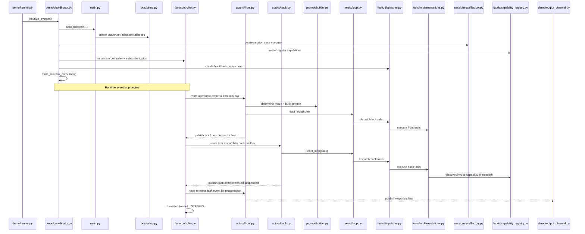

# K1 POC Wiring Audit (Current vs Design V2)

## 0) Folder Inventory (as requested first)

All folders under `D:\familyos\poc\k1_poc`:

- `D:\familyos\poc\k1_poc\__pycache__`
- `D:\familyos\poc\k1_poc\actors`
- `D:\familyos\poc\k1_poc\bus`
- `D:\familyos\poc\k1_poc\delta`
- `D:\familyos\poc\k1_poc\demo`
- `D:\familyos\poc\k1_poc\experience`
- `D:\familyos\poc\k1_poc\fabric`
- `D:\familyos\poc\k1_poc\fsm`
- `D:\familyos\poc\k1_poc\llm`
- `D:\familyos\poc\k1_poc\orchestrator`
- `D:\familyos\poc\k1_poc\prompt`
- `D:\familyos\poc\k1_poc\protocols`
- `D:\familyos\poc\k1_poc\react`
- `D:\familyos\poc\k1_poc\sessionstate`
- `D:\familyos\poc\k1_poc\task`
- `D:\familyos\poc\k1_poc\tools`
- `D:\familyos\poc\k1_poc\actors\__pycache__`
- `D:\familyos\poc\k1_poc\bus\__pycache__`
- `D:\familyos\poc\k1_poc\delta\__pycache__`
- `D:\familyos\poc\k1_poc\demo\__pycache__`
- `D:\familyos\poc\k1_poc\experience\__pycache__`
- `D:\familyos\poc\k1_poc\fabric\__pycache__`
- `D:\familyos\poc\k1_poc\fsm\__pycache__`
- `D:\familyos\poc\k1_poc\llm\__pycache__`
- `D:\familyos\poc\k1_poc\orchestrator\__pycache__`
- `D:\familyos\poc\k1_poc\prompt\__pycache__`
- `D:\familyos\poc\k1_poc\protocols\__pycache__`
- `D:\familyos\poc\k1_poc\react\__pycache__`
- `D:\familyos\poc\k1_poc\sessionstate\__pycache__`
- `D:\familyos\poc\k1_poc\sessionstate\adapters`
- `D:\familyos\poc\k1_poc\sessionstate\docs`
- `D:\familyos\poc\k1_poc\sessionstate\generated`
- `D:\familyos\poc\k1_poc\sessionstate\ports`
- `D:\familyos\poc\k1_poc\sessionstate\scripts`
- `D:\familyos\poc\k1_poc\sessionstate\sections`
- `D:\familyos\poc\k1_poc\sessionstate\tiers`
- `D:\familyos\poc\k1_poc\sessionstate\adapters\__pycache__`
- `D:\familyos\poc\k1_poc\sessionstate\generated\__pycache__`
- `D:\familyos\poc\k1_poc\sessionstate\generated\flatbuffers`
- `D:\familyos\poc\k1_poc\sessionstate\generated\flatbuffers\__pycache__`
- `D:\familyos\poc\k1_poc\sessionstate\generated\flatbuffers\K1`
- `D:\familyos\poc\k1_poc\sessionstate\generated\flatbuffers\K1\__pycache__`
- `D:\familyos\poc\k1_poc\sessionstate\generated\flatbuffers\K1\SessionState`
- `D:\familyos\poc\k1_poc\sessionstate\generated\flatbuffers\K1\SessionState\__pycache__`
- `D:\familyos\poc\k1_poc\sessionstate\ports\__pycache__`
- `D:\familyos\poc\k1_poc\sessionstate\sections\__pycache__`
- `D:\familyos\poc\k1_poc\sessionstate\tiers\__pycache__`
- `D:\familyos\poc\k1_poc\task\__pycache__`
- `D:\familyos\poc\k1_poc\tools\__pycache__`

---

## 1) Current Internal Wiring (actual code path)

### 1.1 Boot + Infra wiring (runtime)

Observed from `poc/k1_poc/demo/coordinator.py`, `poc/k1_poc/main.py`, `poc/k1_poc/bus/setup.py`.

1. Coordinator Phase 2 calls:
   - `from poc.k1_poc.main import boot`
   - `infra = boot(ordered=False)`
2. `boot(ordered=False)` path:
   - bus: `BusFactory.create_local(capture=False)` (NO TimingChain)
   - router: `BusFactory.create_mailbox_router(backend="python")`
   - adapter: `SessionBusAdapter(bus)`
   - mailboxes: `front_half`, `back_half` with `MailboxConfig(capacity=64, priority_wfq=True)`
3. Coordinator stores:
   - `self.bus`, `self.router`, `self.adapter`, `self.front_mailbox`, `self.back_mailbox`
4. Consumer loop (`_mailbox_consumer`) continuously polls both mailboxes:
   - front mailbox -> `await front_handler(...)`
   - back mailbox -> `await back_handler(...)`

### 1.2 Bus / envelope core wiring (k1/bus)

Observed from `k1/bus/*`.

- `Envelope` is canonical immutable message unit with:
  - topic, priority, envelope_id, sequence, cognitive_trace_id, session_id, request_id, parent_id, created_ns, payload, ttl_ms, payload_format
- `LocalBus.publish` flow:
  1. stamp envelope_id, sequence, created_ns
  2. middleware chain
  3. topic trie match
  4. dispatch handlers (exception-safe)
  5. optional timing chain processing if configured
- `TopicTrie` supports exact + `*` + `>` matching.
- `TimingChain` exists and supports STRICT causal/sequence ordering, RELAXED monitoring, BEST_EFFORT bypass.
- But current demo runtime path does not enable it because boot is currently unordered.

### 1.3 POC topic and builder wiring

Observed from `poc/k1_poc/bus/topics.py` and `poc/k1_poc/bus/builders.py`.

- 28 POC topics are defined, including:
  - session: `k1.session.user.input.v1`, etc.
  - response: `k1.response.ack.v1`, `k1.response.final.v1`
  - orchestration: dispatch/complete/failed/cancel/suspend/resume/etc.
  - tool: `k1.tool.started.v1`, `k1.tool.completed.v1`
  - hitl: request/response
  - relaxed: affect/proactive
- Builders consistently serialize payload as JSON bytes and set topic+priority.
- Priority mapping includes urgent user/ack/final/cancel/hil-response.

### 1.4 FSM wiring (event router + mailbox handoff)

Observed from `poc/k1_poc/fsm/controller.py`, `fsm/transition_table.py`.

FSM subscriptions (18 topics):

- user input, ack, final response
- task dispatch/complete/failed/cancel/suspended/resume
- findings/clarification/artifact/affect/proactive/tool/weave topics

Core routing:

1. User input -> FSM enters ACKING/DISPATCHING and delivers envelope to `front_half` mailbox.
2. Front emits task dispatch -> FSM transitions to COMPANIONING and delivers to `back_half` mailbox.
3. Back emits task complete/failed/suspended -> FSM transitions and routes to Front.
4. Front emits final response -> FSM transitions toward LISTENING and marks turn complete.

Important currently present fix:

- `COMPANIONING + TOPIC_FINAL_RESPONSE -> LISTENING` exists in transition table.
- `_on_response_final()` explicitly handles COMPANIONING final-response transition.

### 1.5 Front actor wiring

Observed from `poc/k1_poc/actors/front.py`.

- Reads FSM state + session sections -> resolves PromptMode.
- Builds prompt through `DynamicPromptBuilder`.
- Runs `react_loop(actor="front")`.
- Emits ACK and FINAL via bus builders.
- Post-loop emission ordering now:
  1. emit cancel dispatches
  2. emit normal task dispatches
  3. emit final response text
- This avoids old illegal transition where final response arrived before task dispatch.

### 1.6 Back actor wiring

Observed from `poc/k1_poc/actors/back.py`.

- Parses task dispatch payload.
- Builds static Back prompt with snapshot sections.
- Builds short history + task JSON as current user message.
- Runs `react_loop(actor="back")` with tier-based iteration budget.
- Emits one of:
  - task.complete
  - task.suspended
  - task.failed
- Supports resume path and cancellation flag checks.

### 1.7 recall_memory wiring (actual)

Observed from:

- `poc/k1_poc/demo/smith_family.py`
- `poc/k1_poc/demo/coordinator.py`
- `poc/k1_poc/tools/implementations.py`
- `poc/k1_poc/tools/dispatcher.py`

Current chain:

1. Memory source is `PRELOADED_MEMORIES` in `smith_family.py` (10 items).
2. Coordinator stores in `self._preloaded_memories`.
3. Tool contexts wire `recall_fn=self._recall_memory_stub` for both front/back.
4. `execute_recall_memory` delegates to `ctx.recall_fn(...)`.
5. Async path is correctly awaited (`isawaitable` checks in tool impl + async dispatcher).

Current defect in preload-to-session-state path:

- Coordinator phase3 tries `self.session_state.get_section("beliefs")`, but valid section names include `beliefs_active`/`beliefs_history`.
- Result: preload to SS is skipped; log message confirms section missing.
- So recall works via coordinator in-memory stub list, not via SessionState beliefs section.

### 1.8 File-level inventory read for requested scope

Read scope completed for requested folders:

- `poc/k1_poc/actors`: front.py, back.py
- `poc/k1_poc/bus`: topics.py, builders.py, setup.py
- `k1/bus`: factory, ports, impls, envelope, timing, adapters, middleware

---

## 2) Expected Wiring (from concierge_poc_design_v2.md, relevant sections)

### 2.1 Section 3 expected bus model

Design expects:

- `BusFactory.create_local_ordered()` with TimingChain causal ordering.
- Causal chain via `parent_id` as primary anti-spin replacement.
- STRICT/RELAXED/BEST_EFFORT mode by topic-prefix rules.
- Core flow causal chain includes:
  - user.input(root)
  - ack + task.dispatch as siblings
  - task.complete child of task.dispatch
  - final.response child of task.complete

### 2.2 Section 6.1 expected Front wiring

Design expects Front to:

- subscribe/handle user input + worker outputs relevant to presentation
- emit ack/final/clarification/dispatch/cancel/resume/clarification.response
- run acknowledge-first ReAct rhythm
- collect dispatches and emit post-loop

### 2.3 Section 6.2 expected Back wiring

Design expects Back to:

- subscribe to task.dispatch/cancel/resume/clarification.response
- emit task.complete/task.failed/task.suspended + tool events
- use cancellation callback from FSM turn-state
- remain non-conversational (no user-facing text)

### 2.4 Design expectation for memory preload (M19.1.3)

Design/plan expects a dedicated memory preload module (`poc/k1_poc/demo/preloaded_memories.py`) and explicit preload into memory/session before demo start.

---

## 3) Current vs Expected Gaps (detailed)

### GAP-A: Ordered bus not active in demo runtime

- Expected: ordered bus with TimingChain for causal+sequence enforcement.
- Current: `boot(ordered=False)` in coordinator phase2.
- Impact:
  - causal guarantees depend on publisher/event sequencing discipline rather than timing chain enforcement
  - potential reordering hazards under concurrency spikes

### GAP-B: Memory preload file location/shape mismatch

- Expected: dedicated `demo/preloaded_memories.py` module.
- Current: memories are embedded inside `demo/smith_family.py`.
- Impact:
  - plan/spec mismatch
  - harder to evolve memory preload independently from family profile/story turns

### GAP-C: SessionState preload writes to wrong section key

- Expected: memories persisted into valid memory/belief section(s).
- Current: coordinator writes to `get_section("beliefs")` (invalid in current SS schema).
- Impact:
  - preload-to-SS fails (skipped)
  - recall currently relies on in-memory coordinator stub list only

### GAP-D: Topic prefix naming discrepancy in design table vs implementation

- Design topic table text maps tool events with `k1.capability` prefix rule.
- Current runtime topic names are `k1.tool.started.v1` / `k1.tool.completed.v1` and timing defaults include `k1.tool` STRICT.
- Impact:
  - conceptual naming drift in docs vs code
  - no runtime break (code is internally consistent)

### GAP-E: Front subscription model differs in mechanics (not semantics)

- Design table lists Front “subscriptions” including `k1.session.user.input.v1`.
- Current: FSM subscribes to bus; Front receives via mailbox routing (`front_half`).
- Impact:
  - behavior equivalent at system level
  - documentation should state mailbox-mediated Front ingestion path explicitly

---

## 4) Wiring Verdict (what is solid vs broken)

### Delta/Fabric Solid / Working

- Front/Back split and mailbox routing exist and run.
- FSM has complete event routing and state transition enforcement.
- Front dispatch-before-final ordering fix is in place.
- Async tool dispatch chain supports awaitable callback functions.
- recall_memory callback is wired from ToolContext to coordinator stub.

### Broken / Needs correction for design parity

1. Demo boot path should be ordered (`TimingChain`) unless intentionally disabled for debug.
2. Memory preload should be moved/aliased to `demo/preloaded_memories.py` per M19.1.3.
3. Coordinator preload should target valid SS sections (`beliefs_active` etc.), not `beliefs`.
4. Design doc should reconcile tool prefix naming (`k1.tool` vs `k1.capability`) to match implementation.

---

## 5) Minimal corrective implementation order (if you want execution next)

1. Add `poc/k1_poc/demo/preloaded_memories.py` and source canonical list from there.
2. Update coordinator preload write path to valid SS section(s).
3. Switch coordinator phase2 boot to `ordered=True` (or configurable flag defaulting to ordered).
4. Add a tiny startup assertion/report line confirming:
   - timing chain active
   - preload count loaded to SS
   - recall stub source count
5. Run story demo with real Gemini and verify:
   - no preload skipped message
   - recall tool returns expected semantic/procedural/episodic entries.

---

## 6) Delta Folder Audit (`poc/k1_poc/delta`) — Current vs Design

### 6.1 File inventory in `delta` (folder-first for this scope)

- `aggregator.py`
- `applicator.py`
- `emitters.py`
- `overflow.py`
- `session_delta.py`
- `snapshot_reader.py`
- `topics.py`
- `writer_registry.py`
- `__init__.py`

### 6.2 Current internal wiring (actual code path)

Observed from `poc/k1_poc/delta/*`, plus integration points in `poc/k1_poc/demo/coordinator.py` and `poc/k1_poc/actors/back.py`.

- Delta contract and topic lane exist as dedicated package: `SessionDelta` validates section allowlist (`task_state`, `task_artifacts`, `history_active`, `control`, `meta`) and mutation ops (`set|append|update|delete`); delta topics are declared as `k1.session.artifact.created.v1`, `k1.session.task.state.v1`, and `k1.session.state.updated.v1`.

- Batch/ordering logic exists in `delta/aggregator.py`: fixed 500ms window, dedup by `section:key` (last-write-wins), causal ordering by `parent_delta_id`, and async `flush_fn(batch)` callback.

- Apply pipeline primitives exist in `delta/applicator.py`: preflight callback for MutationGuard-style approval, write callback, eviction callback with retry once, and optional notify callback after apply.

- Single-writer policy and read/pruning primitives are explicitly encoded: `writer_registry.py` models section->authorized writer role matrix and rejects unauthorized writes; `snapshot_reader.py` provides lock-free section snapshots; `overflow.py` defines HOT budgets and per-section eviction strategy.

- Runtime wiring status in current demo path: coordinator creates `DeltaAggregator` in Phase 5 with a logging-only `flush_fn`; no runtime path found that wires `delta.emitters` into Back handler execution; no runtime path found that wires `delta.applicator.DeltaApplicator` to SessionState writes; no runtime path found that subscribes `delta.topics` (`k1.session.task.state.v1`) into this package pipeline; current Back runtime emits orchestration/task events and has an `emit_artifact_created()` helper, but that helper is not used by the normal Back execution path.

### 6.3 Expected wiring (from `concierge_poc_design_v2.md`, Section 5)

Design expects Delta lane to be a live write path (not only package-level availability):

- Back never writes SessionState directly.
- Back emits structured delta events on session topics.
- DeltaAggregator batches in 500ms windows, dedups, and preserves causal chain.
- FSM applies batch via MutationGuard preflight into `task_state`/`task_artifacts`.
- `k1.session.state.updated.v1` observability event is emitted after applied batch.
- Single-writer invariant is enforced operationally: FSM is the only Back-originated writer.

### 6.4 Current vs expected gaps (delta)

### GAP-D1: Delta package is largely present but not fully wired into live runtime apply path

- Expected: end-to-end Back delta emit -> aggregate -> apply to SessionState.
- Current: coordinator creates aggregator with logging flush callback; no active applicator+section-write hookup in this package path.
- Impact: design-aligned delta primitives exist, but operational write guarantees rely on other paths/modules.

### GAP-D2: Parallel/overlapping delta implementations create architectural drift

- Expected: single authoritative delta pipeline.
- Current: `poc/k1_poc/delta/*` and `poc/k1_poc/fsm/delta_aggregator.py` both model delta aggregation concepts.
- Impact: duplicate semantic ownership increases drift risk (different ordering fields, lifecycle assumptions, and integration points).

### GAP-D3: `k1.session.task.state.v1` topic is defined but not observed as active producer/consumer route

- Expected: task state delta topic participates in the Back->DeltaAggregator pipeline.
- Current: topic constant exists; no concrete runtime subscription/production path identified in operational handler flow.
- Impact: partial contract surface can exist without actual event-lane traffic.

### GAP-D4: Causal chain fielding mismatch risk

- Expected: robust causal ordering through active parent linkage.
- Current: `delta/aggregator.py` orders by `parent_delta_id`, but emit path shown in `delta/emitters.py` does not set `parent_delta_id`.
- Impact: ordering falls back to collection order/timestamps in typical flow rather than explicit parent-child chains.

---

## 7) Fabric Folder Audit (`poc/k1_poc/fabric`) — Current vs Design

### 7.1 File inventory in `fabric` (folder-first for this scope)

- `capability_registry.py`
- `demo_capabilities.py`
- `__init__.py`

### 7.2 Current internal wiring (actual code path)

Observed from `poc/k1_poc/fabric/*`, `poc/k1_poc/demo/coordinator.py`, and tool implementations.

- Fabric registry implementation exists and is active in coordinator startup: `create_demo_registry()` loads 7 base demo capabilities; Phase 3 then adds storyline capabilities via `register_storyline_capabilities(...)`; ToolContext injects `capability_fn` and `invoke_fn` callbacks backed by this registry.

- `CapabilityRegistry` behavior: in-memory capability map + handler map; `discover(intent, domain, constraints)` via word-overlap fuzzy matching over name/description; `invoke(name, params, session_id)` executes async handler by exact name.

- Capability catalog design in code: 7 demo capabilities across travel/productivity/shopping domains; deterministic mock handlers (no external API calls); side-effecting capabilities return `artifact_type` (e.g., booking/appointment).

- Invocation path is wired through tool layer: `execute_discover_capabilities` delegates to injected `capability_fn`; `execute_invoke_capability` delegates to injected `invoke_fn`.

### 7.3 Expected wiring (from `concierge_poc_design_v2.md`, Section 6.2)

Design expects Fabric as domain-agnostic universal executor lane:

- Back uses `discover_capabilities()` + `invoke_capability()` (no domain-specific tool explosion).
- Registry acts as catalog; Back as cursor; adding domains should be registration-driven.
- Invocation follows fabric execution pipeline semantics (resolve/select/context/execute/validate).
- Result lane supports downstream task/artifact lifecycle flow.

### 7.4 Current vs expected gaps (fabric)

### GAP-F1: Discover callback shape mismatch

- Expected: discover path returns matched capabilities into Back tool result.
- Current:
  - `CapabilityRegistry.discover(...)` returns `{ "capabilities": [...], "count": n }`.
  - Coordinator `_capability_discover(...)` reads `result.get("matches", [])` and returns that list.
- Impact: discover path can incorrectly produce empty results even when registry found matches.

### GAP-F2: Invocation status-shape mismatch across layers

- Expected: consistent success/failure contract through invoke pipeline.
- Current:
  - Registry handlers return `success: bool`.
  - Coordinator logging and orchestrator adapter inspect `status` field (`result.get("status", ...)`).
- Impact: observability and adapter success interpretation can drift from actual handler success flag.

### GAP-F3: Universal executor principle is present, but full Fabric 9-step semantics are simplified

- Expected: richer fabric execution pipeline semantics (resolve/select/context/execute/validate).
- Current: in-memory direct dispatch with fuzzy lexical discovery and direct handler invoke.
- Impact: POC validates universal-executor shape, but not full production-grade fabric semantics.

### GAP-F4: Artifact-to-delta handoff not explicitly wired in the fabric package path

- Expected: capability outputs that create durable artifacts flow cleanly into task/artifact lifecycle writes.
- Current: capabilities return `artifact_type`, but the explicit `delta.emitters` handoff route is not clearly wired as the main runtime path from this package.
- Impact: durable output lifecycle depends on surrounding handler/controller implementation, not a single explicit fabric->delta bridge in this scope.

---

## 8) Delta + Fabric Combined Verdict

### Solid / Working

- `delta` package contains comprehensive primitives for schema, batching, writer policy, overflow, and snapshots.
- `fabric` package is operationally loaded in startup, with discover/invoke wiring and deterministic capability handlers.
- Universal `invoke_capability` architecture shape is present and domain-agnostic.

### Delta/Fabric Needs correction for strict design parity

- Make one authoritative runtime delta pipeline and remove/merge overlapping implementations.
- Wire delta emit/apply path end-to-end in the active runtime (producer -> aggregator -> applicator -> SessionState).
- Fix fabric discover callback field mismatch (`capabilities` vs `matches`).
- Normalize result contract across fabric registry/coordinator/adapters (`success` vs `status`).
- Verify artifact outputs consistently enter the delta/session lifecycle lane.

---

## 9) FSM Folder Audit (`poc/k1_poc/fsm`) — Current vs Design

### 9.1 File inventory in `fsm` (folder-first for this scope)

- `controller.py`
- `control_extension.py`
- `delta_aggregator.py`
- `errors.py`
- `front_lock.py`
- `history_writer.py`
- `interrupt_handler.py`
- `phase1.py`
- `states.py`
- `task_bridge.py`
- `transition_table.py`
- `turn_state.py`
- `weave_batcher.py`
- `__init__.py`

### 9.2 Current internal wiring (actual code path)

Observed from `poc/k1_poc/fsm/controller.py`, transition/state files, and coordinator runtime wiring.

- `ConciergeController` is the active event router: subscribes to 18 topics, enforces legal transitions via `transition_table`, routes envelopes via mailbox router (`front_half`/`back_half`), writes typed history entries, and emits `k1.session.state.updated.v1` plus turn lifecycle events.

- Front concurrency control is active through `FrontLock` in controller path (`try_deliver`, queueing, release).

- `FSMTurnState` is active for pending async results, cancellation flags, and suspension context (`pending_context`) used for resume flow.

- HITL transitions are active in controller (`task.suspended` -> `CLARIFYING_WORKER`, `task.resume` -> `COMPANIONING`) and are passed back through mailbox routing.

- WEAVE is active in controller as immediate pending-results drain and synthetic weave envelope construction; this path does not use the standalone `fsm/weave_batcher.py` timer component.

- Runtime integration in coordinator currently wires only `ConciergeController`; auxiliary FSM modules (`task_bridge.py`, `history_writer.py`, `control_extension.py`, `phase1.py` pipeline classes, `fsm/delta_aggregator.py`) are largely package/test-level and not the main live controller path.

### 9.3 Expected wiring (from `concierge_poc_design_v2.md`, Section 4 + Section 5)

- FSM is the system event router with complete lifecycle visibility.
- 12-state model with explicit triggers and PromptMode mapping.
- ACKING uses deterministic Phase 1 pre-LLM writes before Front starts.
- Front serialization via FrontLock and queued delivery order.
- WEAVING should batch pending async results via batch-window protocol.
- FSM maintains single-writer control over lifecycle-critical state transitions/history semantics.

### 9.4 Current vs expected gaps (fsm)

### GAP-FSM1: Phase 1 remains placeholder in live controller path

- Expected: deterministic classifier writes before Front invocation.
- Current: `_run_phase1()` transitions directly to DISPATCHING without invoking `phase1.py` pipeline/writer components.
- Impact: design-level pre-LLM classification contract is only partially realized in the active path.

### GAP-FSM2: Parallel FSM utility modules are not converged into one operational path

- Expected: one authoritative runtime path for history, task bridge, control extension, and delta aggregation.
- Current: controller uses internal lists/logic while `history_writer.py`, `task_bridge.py`, `control_extension.py`, and `fsm/delta_aggregator.py` are mostly test/library side.
- Impact: architectural drift risk and duplicated logic surfaces.

### GAP-FSM3: WEAVE batching semantics are simplified in active flow

- Expected: timed batch-window protocol as primary weave mechanism.
- Current: controller drains pending results immediately on `response.final`; standalone `fsm/weave_batcher.py` is not the core active mechanism.
- Impact: less deterministic timed batching behavior under bursty async completions.

---

## 10) LLM Folder Audit (`poc/k1_poc/llm`) — Current vs Design

### 10.1 File inventory in `llm` (folder-first for this scope)

- `gemini_adapter.py`
- `model_selection.py`
- `ports.py`
- `test_adapter.py`
- `types.py`
- `__init__.py`

### 10.2 Current internal wiring (actual code path)

Observed from `llm/*`, `actors/front.py`, `actors/back.py`, and coordinator phase wiring.

- Universal port contract is defined and used: `IConciergeModelPort.generate()` and `generate_stream()` with provider-agnostic request/response types.

- Coordinator phase 1 selects adapter at runtime:
  - `GeminiConciergeAdapter` when `GOOGLE_API_KEY` exists.
  - `TestConciergeAdapter` fallback in test/no-key path.

- Front and Back handlers both consume model through adapter interface only; no provider SDK imports in handlers.

- `model_selection.py` exists and is used by Gemini adapter routing.

- `generate_stream()` is implemented in adapters but active Front/Back handler path currently runs through `react_loop()` with `model.generate()` only.

### 10.3 Expected wiring (from `concierge_poc_design_v2.md`, Section 10)

- One model-port interface for all actors.
- Provider translation hidden inside adapters.
- Capability-based model selection and normalized response types.
- Output validation pipeline (`LLMOutputValidator`) before handler-level action.
- Streaming path used for Front ack/final delivery flows.

### 10.4 Current vs expected gaps (llm)

### GAP-LLM1: Output validation pipeline is not implemented in active code path

- Expected: validator checks (tool allowlist, params, type, ordering) before applying model outputs.
- Current: no runtime `LLMOutputValidator` implementation found in `poc/k1_poc` executable path.
- Impact: weaker guardrails against malformed/hallucinated tool calls.

### GAP-LLM2: Front streaming path is implemented in adapters but not exercised by handler runtime

- Expected: Front ack/final can stream via `generate_stream()`.
- Current: active handlers use `generate()` through `react_loop()` path.
- Impact: design intent for streamed user delivery is only partially realized.

### GAP-LLM3: Model selection table drift from design narrative

- Expected (design narrative): some Front TOOL_CALL paths target pro-tier.
- Current: `model_selection.py` maps `("TOOL_CALL", "front")` to `gemini-2.5-flash`.
- Impact: spec/code drift in model routing policy (runtime may still be acceptable, but documentation parity is off).

---

## 11) React Folder Audit (`poc/k1_poc/react`) — Current vs Design

### 11.1 File inventory in `react` (folder-first for this scope)

- `history.py`
- `loop.py`
- `__init__.py`

### 11.2 Current internal wiring (actual code path)

Observed from `react/loop.py`, `react/history.py`, and actor usage.

- Shared `react_loop()` is actively used by both Front and Back handlers.

- Core design behaviors are present:
  - Front iteration 0 uses required-tool choice.
  - cancellation callback checked each iteration.
  - Back text-without-tools treated as non-terminal.
  - Back terminates on `submit_result` tool.
  - Front collects `dispatch_task` calls for post-loop emission.

- `build_chat_history` and `build_chat_history_for_back` are used for actor-specific context windows.

### 11.3 Expected wiring (from `concierge_poc_design_v2.md`, Section 7)

- One shared ReAct loop for both actors.
- Different termination behavior by actor (Front L1, Back L2).
- Front ack-first behavior on first iteration.
- Tool-result observation injection across iterations.
- Cancellation handling through FSM callback.

### 11.4 Current vs expected gaps (react)

### GAP-REACT1: Design/runtime small semantic drift in callback usage docs vs code

- Expected (design examples): `on_text_response` may fire within loop.
- Current: runtime intentionally defers final-response emission to handler post-loop for FSM ordering safety.
- Impact: behavior is safer operationally, but some design pseudo-code no longer reflects exact implementation mechanics.

### GAP-REACT2: Budget/tool constants duplicated across modules

- Expected: one authoritative source for iteration limits.
- Current: iteration/budget tables exist in `react/loop.py` and also mode/tier logic in prompt/actors.
- Impact: maintenance drift risk when budgets are tuned.

---

## 12) Prompt Folder Audit (`poc/k1_poc/prompt`) — Current vs Design

### 12.1 File inventory in `prompt` (folder-first for this scope)

- `affect.py`
- `back_prompt.py`
- `builder.py`
- `clarify_depth.py`
- `domain_rules.py`
- `mode.py`
- `scenario_templates.py`
- `sections.py`
- `__init__.py`

### 12.2 Current internal wiring (actual code path)

Observed from `prompt/*`, `actors/front.py`, `actors/back.py`, and coordinator startup.

- Front runtime actively resolves mode via `determine_mode()` and builds mode-driven context via `DynamicPromptBuilder.build()`.

- Builder includes SS read config matrix, per-mode tool filtering, conditional tool inclusion, affect modifiers, scenario-data injection, and token-budget compression logic.

- Back runtime uses dedicated static-template assembly via `build_back_prompt()` and does not use DynamicPromptBuilder.

- Coordinator instantiates a prompt builder in phase 1 for availability/health, while Front handler creates/uses builder per invocation.

### 12.3 Expected wiring (from `concierge_poc_design_v2.md`, Section 6.1 + Section 6.2)

- FSM-driven PromptMode determines exact prompt assembly for Front.
- Mode-specific tool allowlists and iteration limits.
- Conditional tool inclusion based on signals.
- Back prompt is constant identity + dynamic task/context block.

### 12.4 Current vs expected gaps (prompt)

### GAP-PROMPT1: Live mode behavior and long-form design examples have drifted

- Expected: design examples mirror exact runtime assembly and outputs.
- Current: several runtime-safe adjustments (ordering, interpolation, filtering details) exist beyond design pseudo-code snapshots.
- Impact: doc/code parity maintenance burden for mode logic.

### GAP-PROMPT2: Prompt-builder lifecycle is duplicated (coordinator-level and handler-level instantiation)

- Expected: clear single ownership path for builder lifecycle.
- Current: builder is initialized in coordinator and also instantiated in front handler.
- Impact: low runtime risk (builder is stateless), but ownership semantics are ambiguous.

---

## 13) Protocols Folder Audit (`poc/k1_poc/protocols`) — Current vs Design

### 13.1 File inventory in `protocols` (folder-first for this scope)

- `cancellation.py`
- `cancel_events.py`
- `cancel_handler.py`
- `hitl.py`
- `hitl_coordinator.py`
- `hitl_flow.py`
- `hitl_persistence.py`
- `hitl_pipeline.py`
- `hitl_wiring.py`
- `suspension.py`
- `suspension_events.py`
- `suspension_manager.py`
- `weave_batcher.py`
- `weave_state.py`
- `__init__.py`

### 13.2 Current internal wiring (actual code path)

Observed from `protocols/*`, coordinator, and runtime usage mapping.

- `HILCoordinator` is actively created in coordinator phase 5 and wired with suspended/resume callbacks.

- Rich HITL/cancel/suspension/weave protocol primitives exist and are comprehensively exported and tested.

- Many protocol modules (e.g., `CancellationHandler`, `SuspensionManager`, protocol-level `WeaveBatcher`) are primarily library/test oriented and not directly hooked as first-class runtime controller dependencies in the current operational path.

- Runtime weave/cancel/suspension behavior is largely handled through controller + actor flow and `FSMTurnState`, with protocol package acting as capability scaffold.

### 13.3 Expected wiring (from `concierge_poc_design_v2.md`, Section 9 + weave/cancel sections)

- Closed-cycle HITL flow is safety-critical and touches Back -> FSM -> Front -> user -> Front -> FSM -> Back.
- Suspension limits, timeout behavior, and recovery persistence should be enforced.
- Approval gating for side-effect operations should be protocol-enforced.
- Weave batching and cancellation semantics should be deterministic and explicit.

### 13.4 Current vs expected gaps (protocols)

### GAP-PROTO1: Protocol-layer managers are not fully the runtime source-of-truth

- Expected: protocol managers coordinate most cancellation/suspension/weave flows in active runtime.
- Current: substantial behavior is implemented directly in FSM/controller/actors with protocol modules partially integrated.
- Impact: split authority between runtime handlers and protocol package increases drift risk.

### GAP-PROTO2: Duplicate weave abstractions (`fsm/weave_batcher.py` and `protocols/weave_batcher.py`)

- Expected: one canonical weave batch implementation for runtime.
- Current: two batcher implementations exist, while active controller path uses immediate drain pattern.
- Impact: ambiguity around authoritative weave behavior and timing semantics.

### GAP-PROTO3: Defense-in-depth protocol checks are not uniformly enforced in active flow

- Expected: protocol guardrails (approval/safety/timeout/recovery enforcement) are central runtime gate.
- Current: pieces exist (HILCoordinator active), but full manager set is not consistently in the hot path.
- Impact: correctness relies more on handler/controller logic than unified protocol enforcement.

---

## 14) Backbone Combined Verdict (FSM + LLM + React + Prompt + Protocols)

### Backbone Solid / Working

- Event-driven dual-actor backbone is operational: FSM routing, Front/Back handlers, shared ReAct loop, and mode-driven prompt assembly are all live.
- LLM abstraction boundary is clean (`IConciergeModelPort`) with Gemini/Test adapters and provider isolation.
- HITL core loop is partially operational through active controller states and coordinator-created HILCoordinator.

### Backbone Needs correction for strict design parity

- Converge duplicate/parallel implementations into one authoritative runtime path (FSM utility modules, weave batchers, delta-related FSM/protocol overlap).
- Implement/activate missing guardrails from design-critical path (notably output validation and fully unified protocol enforcement).
- Align streaming and model-routing behavior with design declarations, or update design docs to reflect intentional runtime choices.
- Reduce ownership ambiguity across controller vs protocol vs helper modules to lower drift risk in the system backbone.

---

## 15) Demo Folder Audit (`poc/k1_poc/demo`) — Current vs Design

### 15.1 File inventory in `demo` (folder-first for this scope)

- `coordinator.py`
- `display.py`
- `interactive.py`
- `iot_stubs.py`
- `output_channel.py`
- `runner.py`
- `smith_family.py`
- `_e2e_smoke.py`
- `__init__.py`

### 15.2 Current internal wiring (actual code path)

Observed from `demo/coordinator.py`, `demo/runner.py`, and runtime wiring points.

- Runtime is centralized around `K1DemoCoordinator` with a strict 6-phase init pipeline:
  1. config + model adapter
  2. bus infra
  3. session + capability registry
  4. FSM + actor tool dispatchers
  5. support systems
  6. health checks

- `runner.py` is a thin orchestration shell (CLI args, signal handling, init loop, shutdown, optional timeline dump), while `coordinator.py` is the real system composer.

- Mailbox consumer loop in coordinator is the runtime bridge from FSM-delivered envelopes to `front_handler`/`back_handler` execution.

- Phase 3 currently creates Session State via `SessionStateFactory.create_for_testing(...)`, not standalone/wired production mode.

- Phase 3 memory preload attempts `get_section("beliefs")` (non-canonical section key in current SS layout), so preload-to-SS can be skipped.

### 15.3 Expected wiring (from `concierge_poc_design_v2.md`, Sections 3/4/5/6)

- Demo bootstrap should preserve design-critical invariants:
  - event-driven dual-actor path,
  - deterministic pre-LLM and mode routing,
  - clean SessionState section semantics,
  - coherent bus-driven lifecycle from input to final response.

- Bootstrap should avoid bypassing design-owned memory/state contracts.

### 15.4 Current vs expected gaps (demo)

### GAP-DEMO1: Demo bootstrap still carries test-mode/state shortcuts in core path

- Expected: production-aligned state/adapter path as default with explicit test toggles.
- Current: `create_for_testing()` and test-friendly wiring are in primary composition flow.
- Impact: behavioral parity risk between demo runtime and intended design runtime.

### GAP-DEMO2: Memory preload section key mismatch in phase 3

- Expected: preload writes into valid belief/memory sections.
- Current: preload path targets `beliefs` instead of active canonical sections.
- Impact: preloaded memory may not become part of SessionState read path.

---

## 16) Experience Folder Audit (`poc/k1_poc/experience`) — Current vs Design

### 16.1 File inventory in `experience` (folder-first for this scope)

- `affective_mirror.py`
- `anticipatory_responder.py`
- `emotional_processor.py`
- `layer.py`
- `narrative_weaver.py`
- `proactive_agent.py`
- `rhythm_controller.py`
- `__init__.py`

### 16.2 Current internal wiring (actual code path)

Observed from `experience/layer.py` and coordinator phase-5 wiring.

- `ExperienceLayer` is actively instantiated in coordinator phase 5.

- `ExperienceLayer.tick(...)` enforces cadence logic in one place:
  - EmotionalProcessor every 25 turns,
  - NarrativeWeaver every 20,
  - AnticipatoryResponder every 30,
  - ProactiveAgent only when FSM is companioning and wait > 5000ms,
  - RhythmController every output.

- EP skip rule is implemented: if Front `refine_affect` confidence > 0.8 for current turn, EP write path is skipped.

- Output is envelope-oriented (`emotional`, `tone`, `narrative`, `anticipation`, `fill`, `timing`) for downstream emission.

### 16.3 Expected wiring (from `concierge_poc_design_v2.md`, Section 5 + affective ownership chain)

- Experience should act as cadence-controlled post-turn layer and not violate Front priority over high-confidence affect corrections.

- Component outputs should remain typed and bus-emittable, with clear ownership boundaries vs. Front/FSM.

### 16.4 Current vs expected gaps (experience)

### GAP-EXP1: Experience layer is instantiated but not yet the singular runtime authority for all experiential emissions

- Expected: centralized cadence-owned experiential emission path in runtime.
- Current: ExperienceLayer exists and is wired, but final emission/control integration is still mixed with controller/runtime flow.
- Impact: drift risk between designed cadence behavior and observed bus output behavior.

---

## 17) Orchestrator Folder Audit (`poc/k1_poc/orchestrator`) — Current vs Design

### 17.1 File inventory in `orchestrator` (folder-first for this scope)

- `degradation.py`
- `interfaces.py`
- `ports.py`
- `routing.py`
- `stub.py`
- `types.py`
- `__init__.py`

### 17.2 Current internal wiring (actual code path)

Observed from `orchestrator/stub.py`, `orchestrator/routing.py`, `orchestrator/ports.py`, `orchestrator/types.py`, and coordinator phase-5.

- `OrchestratorStub` is actively instantiated in coordinator phase 5 with 3 adapters:
  - Fabric gateway adapter,
  - read-only state adapter,
  - delta emit adapter.

- Stub structurally enforces core invariants via constructor shape:
  - no state write port,
  - no model port,
  - no tool dispatcher.

- Budget enforcement is explicit (`BudgetExceededError`) and Fabric call count is tracked.

- `routing.route_task(...)` exists as a single dispatch point abstraction for LOW/MEDIUM/HIGH, but hot runtime path remains dominated by current front/back handling and dispatch semantics.
- `routing.route_task(...)` remains the single dispatch decision authority, consumed in FSM via `route_task_sync(...)`.
- MEDIUM tier now routes through `OrchestratorStub` when attached by kernel bootstrap (`enable_orchestrator=True`), instead of always delivering to Back.
- FSM subscribes to orchestrator completion topics and normalizes DAG completion payloads into existing `task.complete.v1`/`task.failed.v1` handling for state progression.
- A guarded fallback remains: if orchestrator is unavailable, MEDIUM tier degrades to Back delivery with warning logs.

### 17.3 Expected wiring (from `concierge_poc_design_v2.md`, Section 11.x)

- Tier routing should be explicit and stable:
  - LOW direct worker path,
  - MEDIUM via stub/orchestrator surface,
  - HIGH via deferred planner/orchestrator path.

- All tiers should converge to unified completion semantics for FSM consumption.

### 17.4 Current vs expected gaps (orchestrator)

### GAP-ORCH1: MEDIUM-tier orchestrator path has availability fallback, not strict enforcement

- Expected: MEDIUM always executes through the orchestrator path.
- Current: MEDIUM executes through OrchestratorStub when attached; otherwise it degrades to Back routing.
- Impact: behavior remains resilient, but strict ORCH-path enforcement depends on runtime bootstrap configuration.

### GAP-ORCH2: HIGH-tier interfaces remain scaffold-only (by design), requiring explicit boundary management

- Expected: deferred features remain clearly isolated without implying runtime availability.
- Current: interfaces are present but non-operational, while MEDIUM path is active.
- Impact: developers can over-assume HIGH readiness unless runtime gates remain strict.

---

## 18) SessionState Folder Audit (`poc/k1_poc/sessionstate`) — Current vs Design

### 18.1 Folder inventory in `sessionstate` (folder-first for this scope)

- Top-level key files:
  - `factory.py`, `manager.py`, `guard.py`, `eviction.py`, `migration.py`, `local_cold.py`, `snapshot.py`, `sizetracker.py`, `events.py`, `metrics.py`, `reconstruction.py`, `cli.py`
- Key subfolders:
  - `adapters/`, `ports/`, `sections/`, `tiers/`, `generated/`, `docs/`, `scripts/`

### 18.2 Current internal wiring (actual code path)

Observed from `sessionstate/factory.py`, `sessionstate/manager.py`, `sessionstate/sections/history_active.py`, `sessionstate/sections/control.py`, and coordinator phase-3 usage.

- `SessionStateFactory` supports three modes (`create_standalone`, `create_for_testing`, `create_with_ports`) with adapter composition.

- Current demo runtime uses `create_for_testing(...)` and local capture-mode event/storage adapters.

- `SessionStateManager` is large, port-oriented, mutation-guarded, and implements tiered storage lifecycle primitives.

- `history_active` includes `TypedHistoryEntry` extensions and decomposition support, while base section docs still emphasize fixed-size turn window behavior.

- `control` section remains strongly typed and never-evict oriented with flow/lock/safety structures.

### 18.3 Expected wiring (from `concierge_poc_design_v2.md`, Section 5)

- Session State is the typed shared-memory backbone with strict write ownership and clear section semantics.

- Design expects specific task lifecycle extensions (`task_state`, `task_artifacts`), history typing expectations, and coherent HOT/WARM pressure behavior.

- Read/write matrix semantics must remain aligned across Front, Back, FSM, and Experience.

### 18.4 Current vs expected gaps (sessionstate)

### GAP-SS1: Runtime section naming usage is inconsistent at integration boundaries

- Expected: controller/coordinator integration strictly uses canonical section names.
- Current: at least one integration path still references non-canonical `beliefs` key.
- Impact: silent skips and partial context hydration.

### GAP-SS2: Active runtime windowing/use patterns and documented design windows are not uniformly synchronized

- Expected: history and section-window assumptions are consistently reflected in code + docs.
- Current: implementation has evolved (typed entry support and section-specific behavior) while some top-level expectations remain mixed.
- Impact: prompt-context and continuity assumptions can drift across modules.

---

## 19) Task Folder Audit (`poc/k1_poc/task`) — Current vs Design

### 19.1 File inventory in `task` (folder-first for this scope)

- `bundled_executor.py`
- `classifier.py`
- `complexity.py`
- `dependency_queue.py`
- `dispatch.py`
- `envelope_bridge.py`
- `intent.py`
- `parallel_safety.py`
- `receiver.py`
- `tools.py`
- `topics.py`
- `__init__.py`

### 19.2 Current internal wiring (actual code path)

Observed from `task/dispatch.py`, `task/classifier.py`, `task/tools.py`, `task/envelope_bridge.py`, and symbol usage in runtime paths.

- Task payload contracts are strongly typed dataclasses (`TaskDispatch`, `TaskComplete`, `TaskFailed`) with JSON payload serialization.

- Front control-tool bridge (`dispatch_task`) performs:
  - intent parsing,
  - intent classification (single/bundled/chained),
  - dispatch construction,
  - publish callback emission.

- `envelope_bridge` maps task payloads into canonical envelope fields with urgency-priority mapping.

- Task package includes additional orchestration helpers (dependency queue, receiver, bundled executor) with more library/test breadth than direct hot-path invocation today.

### 19.3 Expected wiring (from `concierge_poc_design_v2.md`, Sections 6.1/8.x/11.x)

- `dispatch_task` should remain FSM-intercepted control path with strict schema semantics.

- Single/bundled/chained intent contracts should carry through to deterministic routing semantics and lifecycle transitions.

- Completion/failure payloads should remain sufficient for Front presentation and observability.

### 19.4 Current vs expected gaps (task)

### GAP-TASK1: Task package has multiple abstractions beyond current hot-path usage, increasing authority ambiguity

- Expected: one clearly dominant runtime path for dispatch/receive/dependency execution semantics.
- Current: core dataclasses and tool bridge are active, while several supporting abstractions are not equally exercised in runtime flow.
- Impact: parallel implementations can drift in validation and behavior.

---

## 20) Tools Folder Audit (`poc/k1_poc/tools`) — Current vs Design

### 20.1 File inventory in `tools` (folder-first for this scope)

- `dispatcher.py`
- `implementations.py`
- `parallelism.py`
- `result_protocol.py`
- `schemas_back.py`
- `schemas_front.py`
- `__init__.py`

### 20.2 Current internal wiring (actual code path)

Observed from `tools/dispatcher.py`, `tools/implementations.py`, schema modules, and coordinator phase-4.

- Front and Back each get dedicated `ToolDispatcher` instances with tier-specific allowlists and budget limits.

- Dispatcher executes explicit 7-step pipeline:
  1. allowlist,
  2. budget,
  3. schema validation,
  4. front ACK-first,
  5. safety-band side-effect gate,
  6. implementation dispatch,
  7. call-history recording.

- `implementations.py` includes real SessionState-mutating cognitive tools and control/read/action tool interfaces via injected `ToolContext` callbacks.

- Front/Back schemas are extensive and align with voice/hands taxonomy structure.

### 20.3 Expected wiring (from `concierge_poc_design_v2.md`, Sections 6.0/6.1/6.2/10.5/15.3)

- Strict actor split with tier-aware allowlists and control-tool semantics.

- Schema-first tool calling with JSON constraints and deterministic interception points (`dispatch_task`, `submit_result`).

- Output/tool-call validation guardrails should be active where design expects safety enforcement.

### 20.4 Current vs expected gaps (tools)

### GAP-TOOLS1: Output validation and full guardrail parity are not fully centralized in runtime path

- Expected: production-like validation boundaries consistently enforced around tool/model outputs.
- Current: core dispatcher checks are present, but broader output-validation parity remains partial.
- Impact: edge-case malformed outputs can be handled inconsistently across caller surfaces.

### GAP-TOOLS2: Large implementation surface includes runtime-active + placeholder/deferred action integrations in one module

- Expected: clear separation between active runtime behavior and deferred integration stubs.
- Current: mixed implementation surface can blur readiness level for specific tools.
- Impact: maintainability and onboarding friction when identifying authoritative production-like paths.

---

## 21) Remaining Folders Combined Verdict (Demo + Experience + Orchestrator + SessionState + Task + Tools)

### 21.1 What is now covered

This audit now includes all previously remaining folders:

- `demo`
- `experience`
- `orchestrator`
- `sessionstate`
- `task`
- `tools`

### 21.2 Combined status

- Structural foundation is strong: all six folders have substantial implementation depth and active runtime touchpoints.
- Most critical risks are integration-authority risks (which path is canonical) rather than missing core modules.
- The highest practical drift issues are now:
  1. section/key mismatches at integration edges,
  2. duplicate/parallel abstractions not uniformly hot-path,
  3. partial parity between design-level guardrails and runtime-enforced guardrails.

### 21.3 Minimal corrective order for remaining folders

1. **Fix SessionState integration edge mismatches first** (`beliefs` vs canonical section keys).
2. **Declare and enforce single runtime authority paths** for routing/weave/dependency abstractions.
3. **Centralize validation boundaries** (tool/output/result contract checks) in active runtime pipelines.
4. **Document intentional deferred surfaces** (especially HIGH-tier orchestrator interfaces) to prevent false readiness assumptions.

---

## 22) Normalization Index (Canonical Gap ID Scheme)

Gap IDs are now normalized to a single style:

- `GAP-[AREA][N]` (examples: `GAP-FSM2`, `GAP-LLM1`, `GAP-DEMO2`)

Area keys used in this document:

- `A..E` (global baseline gaps from sections 1-5)
- `D*` (delta)
- `F*` (fabric)
- `FSM*`, `LLM*`, `REACT*`, `PROMPT*`, `PROTO*`
- `DEMO*`, `EXP*`, `ORCH*`, `SS*`, `TASK*`, `TOOLS*`
- `ARCH*` (bootstrap and boundary architecture)

Priority shorthand (for execution planning):

1. P0: correctness and contract-safety (`GAP-C`, `GAP-SS1`, `GAP-LLM1`, `GAP-TOOLS1`, `GAP-ARCH1`)
2. P1: canonical-path convergence (`GAP-D1`, `GAP-FSM2`, `GAP-PROTO1`, `GAP-ORCH1`, `GAP-TASK1`)
3. P2: parity/documentation and optimization (`GAP-D`, `GAP-LLM3`, `GAP-PROMPT1`, `GAP-REACT1`)

---

## 23) Full System Sweep (Detailed ASCII Runtime Diagrams)

This section is a high-detail, end-to-end runtime map of how the system works together in the current architecture shape.

### 23.1 Topology sweep (all major subsystems)

```text
┌──────────────────────────────────────────────────────────────────────────────────────────────────────────────────────┐
│                                             EXTERNAL INTERACTION LAYER                                              │
│ user input | iot trigger | timeout trigger | external capability side-effects | CLI/interactive demo loop           │
└──────────────────────────────────────────────────────────────────────────────────────────────────────────────────────┘
                                                     │
                                                     ▼
┌──────────────────────────────────────────────────────────────────────────────────────────────────────────────────────┐
│                                                   EVENT BUS                                                          │
│ Envelope fields: topic, priority, envelope_id, sequence, cognitive_trace_id, session_id, request_id, parent_id    │
│ Topic families: k1.session.*, k1.response.*, k1.orchestration.*, k1.tool.*, k1.internal.*, k1.affect.*            │
└──────────────────────────────────────────────────────────────────────────────────────────────────────────────────────┘
                                                     │
                                                     ▼
┌──────────────────────────────────────────────────────────────────────────────────────────────────────────────────────┐
│                                                FSM CONTROLLER                                                       │
│ responsibilities:                                                                                                   │
│  - transition_table enforcement                                                                                     │
│  - front_lock serialization + queue                                                                                 │
│  - mailbox routing (front_half/back_half)                                                                           │
│  - turn state (pending_results, cancellation_requested, suspended context)                                          │
│  - history/control/task lifecycle writes                                                                            │
└──────────────────────────────────────────────────────────────────────────────────────────────────────────────────────┘
                     │                                                                 │
                     │                                                                 │
                     ▼                                                                 ▼
        ┌───────────────────────────────┐                              ┌───────────────────────────────┐
        │         FRONT MAILBOX         │                              │          BACK MAILBOX          │
        └───────────────────────────────┘                              └───────────────────────────────┘
                     │                                                                 │
                     ▼                                                                 ▼
┌───────────────────────────────────────────────────┐            ┌───────────────────────────────────────────────────┐
│ FRONT HANDLER (voice / concierge actor)          │            │ BACK HANDLER (worker / execution actor)          │
│                                                   │            │                                                   │
│ 1) read FSM state + event topic + SS signals     │            │ 1) parse task dispatch or resume envelope        │
│ 2) determine PromptMode                           │            │ 2) build worker prompt                            │
│ 3) build prompt via DynamicPromptBuilder          │            │ 3) run worker ReAct loop                          │
│ 4) run front ReAct loop                           │            │ 4) emit terminal orchestration event              │
│ 5) emit: ack / dispatch / cancel / resume / final│            │    task.complete | task.failed | task.suspended   │
└───────────────────────────────────────────────────┘            └───────────────────────────────────────────────────┘
                     │                                                                 │
                     └─────────────────────────────────┬───────────────────────────────┘
                                                       │
                                                       ▼
┌──────────────────────────────────────────────────────────────────────────────────────────────────────────────────────┐
│                                            TOOL DISPATCH LAYER                                                      │
│ step 1 allowlist -> step 2 budget -> step 3 schema validate -> step 4 ACK-first(front) -> step 5 safety gate      │
│ -> step 6 execute tool implementation -> step 7 record call history                                                  │
└──────────────────────────────────────────────────────────────────────────────────────────────────────────────────────┘
                                                       │
                                                       ▼
┌──────────────────────────────────────────────────────────────────────────────────────────────────────────────────────┐
│                                             TOOL IMPLEMENTATIONS                                                     │
│ front cognitive/read/control tools + back read/action/control tools via ToolContext callbacks                        │
│ callbacks: recall_fn, capability_fn, invoke_fn, fabric_fn, workflow_fn                                               │
└──────────────────────────────────────────────────────────────────────────────────────────────────────────────────────┘
                             │                                      │                                      │
                             │                                      │                                      │
                             ▼                                      ▼                                      ▼
┌────────────────────────────────────┐    ┌────────────────────────────────────┐    ┌────────────────────────────────────┐
│ SESSION STATE (shared memory)      │    │ FABRIC / ORCHESTRATOR SURFACES     │    │ EXPERIENCE + PROTOCOLS + DELTA     │
│ - control, beliefs, scoreboard     │    │ - discover/invoke capabilities     │    │ - hitl suspend/resume              │
│ - clarifications, affect, narrative│    │ - route_task tiers                 │    │ - cancellation flow                │
│ - history, task_state, artifacts   │    │ - medium stub budget gates         │    │ - weave/proactive/timing           │
│ - persona, meta                    │    │ - aggregated result outputs        │    │ - batch/apply state update lanes   │
└────────────────────────────────────┘    └────────────────────────────────────┘    └────────────────────────────────────┘
                             │                                      │                                      │
                             └──────────────────────────────┬───────┴──────────────────────┬──────────────┘
                                                            │                              │
                                                            ▼                              ▼
                                         ┌──────────────────────────────────────┐   ┌────────────────────────────┐
                                         │ RESPONSE + ORCHESTRATION BUS EVENTS  │   │ OUTPUT CHANNEL + TIMELINE  │
                                         │ ack/final/complete/failed/suspended  │   │ UI stream + observability  │
                                         └──────────────────────────────────────┘   └────────────────────────────┘
                                                            │
                                                            ▼
                                                   next event arrives (loop)
```

### 23.2 One full turn sequence (front + back + async return)

```text
T0  user sends message
    └─ publish k1.session.user.input.v1

T1  FSM receives user.input
    ├─ transition LISTENING -> ACKING/DISPATCHING path
    ├─ history append (user entry)
    └─ route envelope to front mailbox

T2  Front handler begins
    ├─ PromptMode resolution from (fsm_state, topic, session signals)
    ├─ DynamicPromptBuilder composes:
    │    identity/rules + session trajectory + mode scenario + history window
    │    + selected SS sections + tool schemas + token budget controls
    ├─ front ReAct loop executes
    │    iteration 1: acknowledge tool first
    │    iteration n: cognitive tools and optional dispatch_task
    │    termination: text response with no further tools
    ├─ emit k1.response.ack.v1 (if generated)
    ├─ emit k1.orchestration.task.dispatch.v1 (if action requested)
    └─ emit k1.response.final.v1 (final user-facing response)

T3  FSM receives task.dispatch
    ├─ transition into companioning/progressing flow
    └─ route envelope to back mailbox

T4  Back handler begins
    ├─ parse dispatch payload + tier/budget context
    ├─ assemble worker prompt (task-focused + constrained context)
    ├─ back ReAct loop executes
    │    - discover/invoke/spawn/workflow tools (tier dependent)
    │    - cancellation check each iteration
    │    - terminal condition = submit_result tool call
    └─ emit one terminal event:
         a) k1.orchestration.task.complete.v1
         b) k1.orchestration.task.failed.v1
         c) k1.orchestration.task.suspended.v1

T5  FSM receives terminal task event
    ├─ update turn/task state + queue pending async result if needed
    ├─ route presentation work to front mailbox
    └─ if suspended: enter HITL relay path until resume arrives

T6  Front presents outcome
    ├─ PromptMode = PRESENT / ERROR / HITL_RELAY / WEAVE
    ├─ front ReAct loop (presentation-oriented)
    └─ emit k1.response.final.v1

T7  FSM finalizes cycle
    ├─ transition toward LISTENING when legal
    ├─ drain pending weave queue if present
    └─ await next event
```

### 23.3 FSM states with embedded Front/Back ReAct behavior

```text
LISTENING
  │ user.input
  ▼
ACKING
  │ (Front ReAct: acknowledge-first)
  ▼
DISPATCHING
  │ (Front ReAct: cognitive updates + optional dispatch_task)
  ├───────────────┐
  │ no task       │ task dispatched
  ▼               ▼
DELIVERING     COMPANIONING
  │             │
  │             ├─ Back mailbox receives dispatch
  │             ├─ Back ReAct runs (tool execution)
  │             ├─ emits complete/failed/suspended
  │             │
  │             ├─ if suspended -> CLARIFYING_WORKER
  │             │                   │ user answer
  │             │                   ▼
  │             │                 COMPANIONING (resume)
  │             │
  │             ├─ if complete while Front busy -> WEAVING queue
  │             └─ if cancel requested -> CANCELLING
  │
  ▼
LISTENING

Where ReAct loops live:
  - Front ReAct runs in ACKING/DISPATCHING/DELIVERING/WEAVING/HITL relay modes.
  - Back ReAct runs only when task envelopes are routed to Back (progressing path).
  - FSM itself does not run LLM; it only routes, gates, and transitions.
```

### 23.4 Prompt generation and LLM response plumbing (detailed)

```text
FRONT prompt plumbing
  inputs:
    - FSM state + incoming topic + session signals
    - Session State snapshots (mode-specific section set)
    - history window (mode-specific depth)
    - scenario payload (task complete/failed/suspended/weave/user input)
    - tool schemas filtered by actor + mode + tier

  build path:
    determine_mode -> read-config selection -> section rendering -> tool inclusion
    -> final prompt text + tool declarations

  model path:
    model.generate(request) -> normalized response object
    -> react_loop parses text + tool calls
    -> tool dispatcher executes calls
    -> loop appends tool observations
    -> emits bus events in handler-controlled order

BACK prompt plumbing
  inputs:
    - task dispatch payload (intent/tier/budget/context)
    - compact history slice
    - safety/task context sections
    - back tool schemas and limits

  model path:
    model.generate(request) -> react_loop(back)
    -> iterative tool execution
    -> terminal submit_result
    -> task.complete/failed/suspended bus emission
```

### 23.5 Session State interaction map (who reads/writes during loop)

```text
Front actor:
  reads  -> beliefs, scoreboard, clarifications, affective_now, narrative, control, history, persona, task views
  writes -> cognitive sections via front tools (beliefs/scoreboard/clarifications/narrative/affect refinements)

Back actor:
  reads  -> dispatch snapshot + task-relevant SS context + short history
  writes -> terminal outcomes/events; direct broad SS mutation avoided by design contract

FSM/controller:
  reads  -> control + turn/task orchestration state
  writes -> history lifecycle entries, flow/control/task coordination state

Support planes:
  - Experience writes cadence-driven outputs/signals
  - Delta lane batches/applies state updates where wired
  - Protocols enforce suspend/cancel/resume semantics
```

### 23.6 Infinite loop invariant (why system keeps running end-to-end)

```text
Invariant:
  every processed event either
    (a) produces at least one next event, or
    (b) returns FSM to LISTENING awaiting next external event.

Therefore runtime does not "finish" globally; it converges per turn/task,
then re-enters event wait state and continues indefinitely.

loop skeleton:
  wait event -> route -> actor react loop -> emit events -> transition -> wait event -> ...
```

---

## 24) File Checking Path Sequence (Base Folder -> Entrypoint -> Deep Chain)

This section is a file-level chain map so you can trace exactly which files connect the runtime from top to bottom.

### 24.1 Base folder to main entrypoint (import chain)

```text
BASE FOLDER
  D:\familyos\poc\k1_poc\

PRIMARY ENTRYPOINT (demo run)
  python -m poc.k1_poc.demo.runner

FILE CHAIN
  poc/k1_poc/demo/runner.py
   -> imports poc/k1_poc/demo/coordinator.py
   -> coordinator.initialize_system()
    -> phase2 imports poc/k1_poc/main.py::boot()
    -> boot() imports poc/k1_poc/bus/setup.py
    -> setup wires bus + router + adapter + actor mailboxes
```

### 24.2 Full runtime file sequence (startup + event handling)

```text
1) Start
  poc/k1_poc/demo/runner.py
    -> get_k1_demo_coordinator()

2) System composition
  poc/k1_poc/demo/coordinator.py
    -> Phase1: LLM adapter
      -> poc/k1_poc/llm/gemini_adapter.py OR poc/k1_poc/llm/test_adapter.py
    -> Phase2: bus infra
      -> poc/k1_poc/main.py
      -> poc/k1_poc/bus/setup.py
      -> k1/bus/* (factory, envelope, router)
    -> Phase3: session + capabilities
      -> poc/k1_poc/sessionstate/factory.py
      -> poc/k1_poc/fabric/capability_registry.py
    -> Phase4: FSM + tools
      -> poc/k1_poc/fsm/controller.py
      -> poc/k1_poc/tools/dispatcher.py
      -> poc/k1_poc/tools/implementations.py
    -> Phase5: support
      -> poc/k1_poc/experience/layer.py
      -> poc/k1_poc/delta/aggregator.py
      -> poc/k1_poc/protocols/hitl_coordinator.py
      -> poc/k1_poc/orchestrator/stub.py

3) Event runtime loop (consumer)
  poc/k1_poc/demo/coordinator.py::_mailbox_consumer
    -> front mailbox event => poc/k1_poc/actors/front.py::front_handler
    -> back mailbox event  => poc/k1_poc/actors/back.py::back_handler

4) Front deep chain
  poc/k1_poc/actors/front.py
    -> poc/k1_poc/prompt/mode.py::determine_mode
    -> poc/k1_poc/prompt/builder.py::DynamicPromptBuilder.build
    -> poc/k1_poc/react/loop.py::react_loop(actor="front")
    -> poc/k1_poc/tools/dispatcher.py::dispatch
    -> poc/k1_poc/tools/implementations.py::<tool fn>
    -> poc/k1_poc/bus/builders.py (ack/final/task dispatch envelopes)
    -> k1 bus publish

5) FSM routing chain
  poc/k1_poc/fsm/controller.py
    -> receives bus topics
    -> transition_table checks
    -> routes to front_half/back_half mailboxes
    -> writes history/control lifecycle and emits state update events

6) Back deep chain
  poc/k1_poc/actors/back.py
    -> poc/k1_poc/prompt/back_prompt.py::build_back_prompt
    -> poc/k1_poc/react/history.py::build_chat_history_for_back
    -> poc/k1_poc/react/loop.py::react_loop(actor="back")
    -> poc/k1_poc/tools/dispatcher.py::dispatch
    -> poc/k1_poc/tools/implementations.py::<back tool fn>
    -> capability paths via:
      poc/k1_poc/fabric/capability_registry.py
      poc/k1_poc/orchestrator/stub.py (when routed)
    -> emits task.complete / task.failed / task.suspended

7) Return to Front presentation
  poc/k1_poc/fsm/controller.py routes terminal task event to Front
    -> poc/k1_poc/actors/front.py presents result
    -> emits k1.response.final
    -> output consumed by poc/k1_poc/demo/output_channel.py
    -> FSM transitions toward LISTENING
```

### 24.3 Mermaid sequence diagram (file-path oriented)



### 24.4 Quick checklist order for manual file inspection

```text
A) Start chain
  1. poc/k1_poc/demo/runner.py
  2. poc/k1_poc/demo/coordinator.py
  3. poc/k1_poc/main.py
  4. poc/k1_poc/bus/setup.py

B) Control/routing chain
  5. poc/k1_poc/fsm/controller.py
  6. poc/k1_poc/fsm/transition_table.py
  7. poc/k1_poc/fsm/front_lock.py

C) Actor execution chain
  8. poc/k1_poc/actors/front.py
  9. poc/k1_poc/prompt/mode.py
  10. poc/k1_poc/prompt/builder.py
  11. poc/k1_poc/react/loop.py
  12. poc/k1_poc/tools/dispatcher.py
  13. poc/k1_poc/tools/implementations.py
  14. poc/k1_poc/actors/back.py

D) State + capability chain
  15. poc/k1_poc/sessionstate/factory.py
  16. poc/k1_poc/sessionstate/manager.py
  17. poc/k1_poc/fabric/capability_registry.py
  18. poc/k1_poc/orchestrator/stub.py

E) Support/output chain
  19. poc/k1_poc/experience/layer.py
  20. poc/k1_poc/protocols/hitl_coordinator.py
  21. poc/k1_poc/delta/aggregator.py
  22. poc/k1_poc/demo/output_channel.py
```

---

## 25) Architecture Gap: Independent Concierge Kernel Bootstrap + Strict Demo Boundary

### 25.1 Gap statement

### GAP-ARCH1: Runtime bootstrap is demo-first instead of kernel-first

- Expected:
  - The concierge kernel should bootstrap independently of demo concerns.
  - Demo should be a thin adapter layer on top of kernel startup.
  - `system <-> demo` boundary should be explicit and enforced.
  - Demo-specific data/config/requirements should live only under `poc/k1_poc/demo`.
  - One startup command should start the kernel without requiring demo composition internals.

- Current:
  - Primary operational path is `demo/runner.py -> demo/coordinator.py` and coordinator owns full system composition.
  - Core bootstrap decisions (bus/session/actors/support systems) are currently centralized in demo lifecycle code.
  - Demo and kernel composition are mixed, which weakens boundary clarity.

- Impact:
  - Harder to run kernel as a standalone product/runtime.
  - Demo requirements leak into core startup path.
  - Increased coupling slows both core evolution and demo experimentation.

### 25.2 Target boundary model (required)

```text
KERNEL CORE (independent)
  - owns startup graph
  - owns ports/adapters composition contract
  - exposes one public bootstrap API + one CLI command

DEMO LAYER (optional adapter)
  - owns demo-only data, scripts, storyline, i/o presentation
  - imports kernel bootstrap API
  - never owns core composition logic
```

### 25.3 Implementation blueprint (how to do it)

1. Create kernel bootstrap module (new core entry)
   - Add `poc/k1_poc/kernel/bootstrap.py` with:
     - `KernelConfig` (ordered bus, adapter mode, feature flags)
     - `KernelRuntime` (bus/router/mailboxes/fsm/dispatchers/session/model/services)
     - `async start_kernel(config) -> KernelRuntime`
     - `async stop_kernel(runtime)`

2. Move composition ownership out of demo coordinator
   - Keep `demo/coordinator.py` as orchestrator of demo UX only.
   - Replace direct composition blocks with calls to `start_kernel(...)`.
   - Demo coordinator should only attach demo concerns:
     - storyline data
     - output channel decorations
     - demo scripts/autoplay

3. Enforce system/demo boundary in code layout
   - Kernel-only modules remain outside `demo/`.
   - Demo-only assets remain inside `demo/`:
     - mock data
     - scenario memories
     - demo flags/requirements
   - No kernel module should import from `poc.k1_poc.demo.*`.

4. Add one startup command for kernel
   - Add `poc/k1_poc/kernel/runner.py` (or `poc/k1_poc/cli.py`) that runs kernel directly.
   - Example command:
     - `python -m poc.k1_poc.kernel.runner`
   - Demo command remains separate:
     - `python -m poc.k1_poc.demo.runner`

5. Define explicit demo adapter contract
   - Demo receives a `KernelRuntime` instance and plugs:
     - demo data providers
     - demo output channel and timeline renderers
     - demo interactive loop
   - No mutation of kernel composition internals from demo layer.

6. Add boundary guard tests (must-have)
   - Import-boundary tests:
     - fail if non-demo modules import from `poc.k1_poc.demo`.
   - Bootstrap tests:
     - kernel starts/stops without demo modules present.
   - Parity test:
     - demo runner uses kernel bootstrap API, not duplicate composition.

### 25.4 Minimal phased rollout

Phase A (safe extraction)

- Introduce `kernel/bootstrap.py` by lifting existing composition logic with no behavior change.
- Keep demo coordinator functional by delegating to new bootstrap.

Phase B (boundary hardening)

- Move demo-only data and configuration fully into `demo/`.
- Add import-boundary tests and CI checks.

Phase C (single-command stability)

- Stabilize independent kernel command and docs.
- Ensure demo command remains adapter-only and optional.

### 25.5 Acceptance criteria

- Kernel starts with one command independent of demo modules.
- Demo starts with its own command and depends on kernel API only.
- Demo data is fully confined to `poc/k1_poc/demo`.
- No `core/kernel` import path depends on `demo/` modules.
- Startup responsibility is kernel-owned, not demo-owned.

Gaps Against Section 1–2

Phase 1 does classification but does not write to Session State sections (scoreboard/control/affective_now) in controller flow: controller.py:577-580 and no session-state access in that file.
Task shared-memory path is not wired to the central session manager: controller builds an internal TaskBridge with fresh section objects, not injected manager-backed sections: controller.py:193, task_bridge.py:71-75.
Single-writer enforcement exists but is not actually applied (only defined): writer_registry.py:123.
Naming drift from section-2 examples (front-llm/back-llm) to front_half/back_half: setup.py:37-38.

Section 3

Mostly aligned: envelope contract, payload opacity, and causal parent ordering are implemented in envelope.py:6-14, envelope.py:137-168, and timing_chain.py:7-9.
Timing prefix defaults are implemented and active through ordered bus creation in defaults.py:45-66 and factory.py:165-200.
Topic taxonomy and builder priorities are implemented in topics.py:29-89 and builders.py:86-254.
Drift: mailbox "wfq" is currently strict-priority dequeue, not weighted fair scheduling, in local_mailbox.py:22-27 and local_mailbox.py:195-207.
Drift: BEST_EFFORT is immediate-deliver but not actually droppable under pressure in timing_chain.py:526-529 (drop counter exists but is unused: timing_chain.py:83-95).
Drift: Delta convention in POC is session-scoped topics, not k1.agent.{id}.delta.v1, in topics.py:27-35.
Section 4

Mostly aligned: FSM is event-router style with mailbox delivery to front/back, in controller.py:601-624; 12 states exist in states.py:16-48; transition table is implemented in transition_table.py:36-93.

PromptMode model and resolver logic are implemented in mode.py:25-53 and mode.py:228-293.

Front lock, bounded queue, and priority ordering are implemented in front_lock.py:42-55 and front_lock.py:83-115.

Drift: history is written to in-memory list, not history_active section, in controller.py:377-404.

Drift: Phase 1 runs classification but does not write scoreboard/affective/control session sections in controller flow (only complexity is set), in controller.py:577-580.

Drift: FSMTurnState currently keeps only pending_results (cancel/suspend tracking moved elsewhere), in turn_state.py:32-40.

Validation: section-relevant tests passed (195/195): tests/poc/test_m01_topics.py, tests/poc/test_m01_builders.py, tests/poc/test_m08_fsm_controller.py.

I’ve finished the section 5/6 evidence pass and validated with targeted tests; next I’ll give you a concise compliance report with aligned items and concrete drifts to fix first.Section 5 Status

Mostly implemented at component level: typed task/history primitives, budgets, and pruning structures exist in task_state.py, task_artifacts.py, history_writer.py, aggregator.py, hot.py.
Drift 1 (major): FSM writes are not bound to the live SessionState sections used by Front/Back. Controller creates an internal bridge with standalone sections in controller.py:184, so lifecycle updates can diverge from what handlers read.
Drift 2 (major): Delta pipeline is present but not fully wired on the main task/event path; controller handles artifact events as history-only in controller.py:1144-1157, without applying artifact/task deltas into SessionState.
Drift 3: Phase-1 intent says it writes SS, but current flow mostly updates control extension/history metadata rather than explicit section writes (same pattern as earlier 1–4 findings), see controller.py:544-591.
Drift 4: task presented/prune lifecycle APIs exist but are not invoked from the normal controller turn-exit path (bridge methods exist in task_bridge.py:250-353, usage missing in controller).
Section 6 Status

Core split is implemented: Front/Back handlers, distinct schemas, tier allowlists, and mode-driven prompt assembly are in place in front.py, back.py, schemas_front.py, schemas_back.py, mode.py, builder.py.
Drift 1: Front mode tool conditioning leaks tools into zero-tool mode (HITL_RELAY), because conditional promote_belief injection is mode-agnostic in mode.py:114-144. This directly contradicts section 6 HITL_RELAY behavior.
Drift 2: Back observability helpers for tool.started/tool.completed exist but are not actually integrated into dispatch loop execution path in back.py:724-798.
Drift 3: Some section-6 prompt expectations vs tests are currently out of sync (mode labels/domain markers/scenario fields), reflected by focused failures in test_m06_front_handler.py.

Section 7 Status (ReAct Loop: Shared Implementation)

Aligned

- Shared loop exists and is used by both actors via `react_loop(actor="front"|"back")` with a common `ReactResult` contract (`poc/k1_poc/react/loop.py`).
- Front first-iteration tool forcing is implemented (`tool_choice="required"` on iteration 0 for Front) via `_resolve_tool_choice(...)`.
- Termination split is implemented:
  - Front terminal condition = text without tool calls.
  - Back terminal condition = `submit_result` tool call (`complete` or `suspended`).
- Back text-without-tools behavior is non-terminal (thinking-aloud continuation) in loop body.
- Cancellation check occurs at top of each loop iteration and Back passes a real callback (`_build_cancellation_check(...)`) from handler wiring.
- Front/Back call path is aligned with shared loop contract:
  - Front: `poc/k1_poc/actors/front.py`
  - Back: `poc/k1_poc/actors/back.py`

Drift

- Section 7.8-style parallel tool execution is not active in the runtime loop:
  - `react_loop` executes tool calls sequentially.
  - Parallel classification helpers exist (`poc/k1_poc/task/parallel_safety.py`, `poc/k1_poc/tools/parallelism.py`) but are not integrated into `react_loop`/`ToolDispatcher` execution flow.

Risk

- Behavioral correctness is mostly intact, but throughput/latency assumptions from Section 7.8 are optimistic relative to current sequential execution.

Section 8 Status (Task Model, Lifecycle, Cancel/Suspend/Weave)

Aligned

- Core FSM lifecycle routing is implemented for dispatch/complete/failed/cancel/suspended/resume/final:
  - `poc/k1_poc/fsm/controller.py` has concrete handlers `_on_task_dispatch`, `_on_task_complete`, `_on_task_failed`, `_on_task_cancel`, `_on_task_suspended`, `_on_task_resume`, `_on_response_final`.
- Cancellation lifecycle is implemented and centrally tracked with `CancellationHandler`:
  - token register/request/confirm/late-completion handling present in `poc/k1_poc/protocols/cancel_handler.py`.
- Suspension lifecycle has explicit stateful management through `SuspensionManager` and resume routing in FSM/controller.
- Pending-result queue + weave envelope path is present:
  - queue/drain in `poc/k1_poc/fsm/turn_state.py`
  - weave envelope build/delivery in `poc/k1_poc/fsm/controller.py`.
- Task payload models are defined with validation semantics (`TaskDispatch`, `TaskComplete`, `TaskFailed`) in `poc/k1_poc/task/dispatch.py`.

Drift

- Task schema dataclasses are not the primary active runtime contract at actor/FSM boundaries:
  - Front/Back/FSM primarily pass raw dict payloads via bus builders (`build_task_dispatch`, `build_task_complete`, etc.) instead of consistently parsing/serializing through `TaskDispatch`/`TaskComplete`/`TaskFailed` types.
- Chained dependency runtime is defined but not wired into the active kernel execution path:
  - `TaskDependencyQueue` and `TaskReceiver` are implemented (`poc/k1_poc/task/dependency_queue.py`, `poc/k1_poc/task/receiver.py`) but not instantiated by kernel/FSM/actor runtime.
- `WeaveBatcher` (500ms timed batching helper) exists (`poc/k1_poc/protocols/weave_batcher.py`) but is not wired into controller-driven weave flow (which currently drains `pending_results` directly on final-response handling).
- Late completion after cancel is handled internally by cancellation handler, but the richer `completed_before_cancel` flag path from task models is not propagated as a first-class presented payload in the live FSM path.

Risk

- Current behavior is operational for single-task and basic async completion, but multi-step/chained dependency behavior and timed weave batching can diverge from Section 8 expectations under concurrent workloads.

Priority fix order for Section 8 parity

1. Make one canonical payload path for task events (typed model at boundaries or explicit schema validator on raw dict path).
2. Wire `TaskReceiver` + `TaskDependencyQueue` into live dispatch/complete flow (or remove and update spec if intentionally deferred).
3. Decide weave strategy: keep controller drain-only or integrate `WeaveBatcher`; remove duplication.
4. Standardize late-cancel completion surface (`completed_before_cancel`) end-to-end so Front can present deterministic UX.

Section 9 Status (HITL Protocol)

Aligned

- Core L1 HITL closed-cycle routing exists in live FSM/actor path:
  - Back emits `task.suspended` on `submit_result(needs_human)` and supports resume via `back_resume_handler` (`poc/k1_poc/actors/back.py`).
  - FSM handles `task.suspended`/`task.resume`, routes to Front/Back, and tracks suspension context (`poc/k1_poc/fsm/controller.py`).
  - Front mode resolver maps worker-clarification flow to `HITL_RELAY` and `HITL_RESOLVE` (`poc/k1_poc/prompt/mode.py`).
- `HITL_RELAY` mode is configured text-only (`TOOL_ALLOWLIST[HITL_RELAY] = []`) with single-iteration budget in mode tables.
- Suspension tracking primitives exist (`pending_hil`, `hil_suspensions_count`) in task-state schema and transition logic (`poc/k1_poc/sessionstate/sections/task_state.py`).
- Dedicated protocol components exist for full policy (coordinator, safety escalation, recovery, L2 enforcement):
  - `poc/k1_poc/protocols/hitl_coordinator.py`
  - `poc/k1_poc/protocols/suspension_manager.py`

Drift

- Full `HILCoordinator` policy is mostly not wired into active kernel/FSM execution path:
  - It is instantiated in `kernel/bootstrap.py` with no-op callbacks, but controller/actor runtime does not route live HITL events through `handle_needs_human()` / `handle_user_response()`.
- Timeout enforcement from Section 9.5 is not active in the controller path:
  - Live FSM uses `SuspensionManager.store_context/pop_context` (sync context stash), not async `suspend()/resolve()` timeout watchers.
  - No active auto-cancel-on-HITL-timeout path is wired in controller event handling.
- `pending_hil` persistence shape diverges from design intent:
  - Runtime task-state currently tracks `pending_hil` as a boolean and does not persist full structured HITL payload (`question/options/side_effects/suspended_at_ms`) required for robust restart re-presentation.
- Crash recovery protocol from Section 9.6 (scan suspended tasks, re-present or timeout) exists in coordinator API but is not wired into kernel startup/runtime recovery.
- L2 defense-in-depth (`validate_before_invoke`) is implemented in coordinator but not enforced in the active capability invoke path (`ToolDispatcher` / Back action flow), so structural blocking depends on current runtime path, not the dedicated enforcer.

Risk

- Basic HITL interaction works, but safety/operability guarantees (timeout closure, robust restart recovery, enforced approval gate) are weaker than Section 9’s hardened protocol model.

Priority fix order for Section 9 parity

1. Route live HITL through `HILCoordinator` (needs_human -> suspended, user response -> resume) instead of split ad-hoc handling.
2. Activate timeout watcher path (`suspend()/resolve()`) and wire auto-cancel emit on expiration.
3. Persist full `pending_hil` payload (not boolean-only) in task state for restart-safe re-presentation.
4. Enforce L2 `validate_before_invoke` on side-effect capability calls in active dispatcher path.

Section 10 Status (LLM Adapter & Operability)

Aligned

- Universal model port exists and is used (`IConciergeModelPort` with `generate`/`generate_stream`) in `poc/k1_poc/llm/ports.py`.
- Canonical provider-agnostic request/response/message/tool types exist (`ConciergeModelRequest`, `ConciergeModelResponse`, `ToolCallResult`, `ModelMessage`, `StreamChunk`) in `poc/k1_poc/llm/types.py`.
- Centralized model selection exists (`select_model`, `MODEL_SELECTION_TABLE`, hint overrides) in `poc/k1_poc/llm/model_selection.py`.
- Provider boundary is correctly isolated in adapter:
  - `GeminiConciergeAdapter` is the SDK boundary with timeout enforcement, normalization, and schema/tool conversion (`poc/k1_poc/llm/gemini_adapter.py`).
- Tool result injection contract exists and is used by ReAct loop (`tool_result_to_message` in `llm/types.py`, consumed in `react/loop.py`).
- Deterministic test adapter keyed by `(actor, scenario)` exists (`poc/k1_poc/llm/test_adapter.py`).
- Dynamic prompt builder enforces a pre-call token budget with safety margin constants (`poc/k1_poc/prompt/builder.py`).

Drift

- Section 10.6 recovery wrapper (`validated_generate` with corrective retry prompt) is not present as a runtime wrapper:
  - Validation exists (`LLMOutputValidator`) but current flow relies on in-loop salvage/fallback instead of explicit one-retry corrective regeneration.
- Front streaming behavior diverges from adapter-centric design:
  - Runtime Front path does not call `model.generate_stream()` for delivery.
  - Current behavior streams by splitting final text into word chunks in `_emit_streaming_response` (`poc/k1_poc/actors/front.py`), not true provider delta streaming.
- Context budget compression strategy is simpler than Section 10.7 target:
  - `DynamicPromptBuilder` currently falls back to truncation (`_compress_prompt`) rather than section-priority staged compression pipeline.
- Model selection table differs from spec examples in places (e.g., Front `TOOL_CALL` currently mapped to flash in code), indicating policy/config drift from doc defaults.

Risk

- Core adapter architecture is solid, but operability promises around validation retry fidelity, true streaming UX, and nuanced budget compression are only partially realized.

Priority fix order for Section 10 parity

1. Add and integrate `validated_generate`-style retry wrapper (1 bounded corrective retry) in Front/Back generation path.
2. Switch Front ack/final delivery path to real `generate_stream()` consumption.
3. Upgrade prompt budget handling from hard truncation to section-priority staged compression.
4. Reconcile `MODEL_SELECTION_TABLE` defaults with design policy (or update design baseline).
