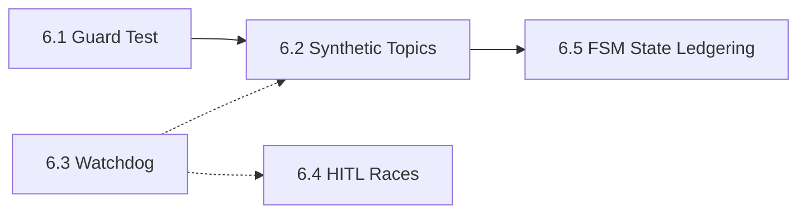

# K1 Concierge FSM — Kernel Engineering Reference

> Date: 2026-06-25
> Branch: `feature/prompt-architecture-refactor`
> Package: `k1/concierge/fsm/` (16 files, ~9,876 lines)
> Role: Event router, state machine controller, single writer to SS

---

## 1. Architectural Role

The FSM package is the **central nervous system** of the Concierge. It is NOT a loop driver. It is a pure event router that subscribes to 27 bus topics, evaluates every incoming event against the current state, and routes to the correct actor (Front LLM or Back LLM) via mailboxes.

### Core Principles

| Principle | Implementation |
|-----------|---------------|
| **Event-driven** | FSM subscribes to bus topics; transitions on events; no polling |
| **Guard-first** | Every (state, topic) pair has an explicit `GuardAction` in `FULL_GUARD_TABLE` (297 cells) |
| **Single Writer** | FSM alone writes `SS.task_state`, `SS.task_artifacts`, `SS.history_active`, and FSM fields in `SS.control` |
| **FrontLock serialization** | Front LLM is single-actor; priority queue prevents concurrent Front calls |
| **Write-before-mutate (M9)** | Ledger append BEFORE in-memory mutation for crash recovery |
| **Back NEVER writes SS** | Back emits deltas → bus → DeltaAggregator → FSM applies |

### Ownership Map

| SS Section | Writer | Reader |
|------------|--------|--------|
| `control` (FSM fields) | `ControlExtension` | Front, Back, Arbiter |
| `task_state` | `TaskBridge` | Front, Back, Arbiter |
| `task_artifacts` | `TaskBridge` (via DeltaAggregator) | Front |
| `history_active` | `HistoryWriter` | Front (20 entries), Back (5 entries) |
| `beliefs_active` | Front LLM (cognitive tools) | Front, Back |
| `scoreboard` | Front LLM | Front |
| `affective_now` | Front LLM | Front, Experience |
| `clarifications` | Front LLM | Front |
| `narrative_active` | Front LLM | Front |

---

## 2. File-by-File Engineering Reference

### 2.1 `states.py` — ConciergeState Enum (43 lines)

**Purpose:** Defines all 11 FSM states. No logic — pure enum.

```
ConciergeState (Enum, auto-valued):
  LISTENING           — idle, awaiting user input
  DISPATCHING         — Phase 1 classification running, Front LLM processing
  COMPANIONING        — Front idle, Back working on task
  PROGRESSING         — Back LLM executing tools
  DELIVERING          — task.complete arrived, Front presenting results
  CLARIFYING_USER     — Front detected ambiguity, asking user
  CLARIFYING_WORKER   — Back suspended for HITL, waiting for user
  CANCELLING          — Cancel in-flight, waiting for Back to ack
  INTERRUPT_HANDLING  — user.input during COMPANIONING/PROGRESSING
  PROACTIVE_WAKE      — task.complete while LISTENING (idle delivery)
  WEAVING             — draining pending_results queue
```

**State-to-Actor mapping:**

| State | Active Actor | Blocking? |
|-------|-------------|-----------|
| LISTENING | None | No |
| DISPATCHING | Front LLM | Yes (FrontLock) |
| COMPANIONING | Front (idle), Back working | No |
| PROGRESSING | Back LLM | No |
| DELIVERING | Front LLM | Yes (FrontLock) |
| CLARIFYING_USER | Front LLM | Yes |
| CLARIFYING_WORKER | Front LLM | Yes |
| CANCELLING | Controller | No |
| INTERRUPT_HANDLING | Front LLM (Arbiter first) | Yes |
| PROACTIVE_WAKE | Controller | No |
| WEAVING | Front LLM | Yes (FrontLock) |

---

### 2.2 `transition_table.py` — Legal Transitions + Full Guard Matrix (~633 lines)

**Purpose:** Two data structures that govern ALL event routing:

1. `TRANSITION_TABLE` — which state transitions are legal for each trigger
2. `FULL_GUARD_TABLE` — what action to take for EVERY (state, topic) pair

#### GuardAction Enum

```python
class GuardAction(str, Enum):
    TRANSITION  = "transition"   # validate + change state via TRANSITION_TABLE
    PASSTHROUGH = "passthrough"  # forward to handler, no state change
    OBSERVE     = "observe"      # log/history only, no routing
    QUEUE       = "queue"        # enqueue in FrontLock or pending_results
    DEAD_LETTER = "dead_letter"  # reject as invalid
```

#### TRANSITION_TABLE

```
11 states × ~5-7 triggers each = ~60 legal transitions

Key transitions:
  LISTENING + user.input              → DISPATCHING
  LISTENING + task.complete           → PROACTIVE_WAKE
  LISTENING + deferred_hitl.surface   → CLARIFYING_WORKER
  DISPATCHING + task.dispatch         → COMPANIONING
  DISPATCHING + response.final        → LISTENING
  DISPATCHING + task.cancel           → CANCELLING
  DISPATCHING + clarification.detected → CLARIFYING_USER
  DISPATCHING + pending_results       → WEAVING
  COMPANIONING + task.complete        → DELIVERING
  COMPANIONING + task.failed          → DELIVERING
  COMPANIONING + task.suspended       → CLARIFYING_WORKER
  COMPANIONING + hil.request          → CLARIFYING_WORKER
  COMPANIONING + user.input           → INTERRUPT_HANDLING
  COMPANIONING + tool.started         → PROGRESSING
  COMPANIONING + task.dispatch        → COMPANIONING (idempotent)
  COMPANIONING + response.final       → LISTENING
  COMPANIONING + same_turn.complete   → LISTENING
  PROGRESSING + tool.completed        → COMPANIONING
  PROGRESSING + task.complete         → DELIVERING
  DELIVERING + response.final         → LISTENING
  DELIVERING + pending_results        → WEAVING
  CLARIFYING_USER + user.input        → DISPATCHING
  CLARIFYING_WORKER + user.input      → CLARIFYING_WORKER (re-entrant)
  CLARIFYING_WORKER + task.resume     → COMPANIONING
  CLARIFYING_WORKER + task.failed     → DELIVERING
  CLARIFYING_WORKER + task.complete   → DELIVERING
  CANCELLING + task.failed            → DELIVERING
  INTERRUPT_HANDLING + interrupt.routed → DISPATCHING
  PROACTIVE_WAKE + proactive.routed   → DELIVERING
  WEAVING + response.final            → LISTENING
  WEAVING + pending_results           → WEAVING (re-weave)
```

#### Synthetic Triggers (6 internal, not bus topics)

| Trigger | Produced By | Effect |
|---------|------------|--------|
| `clarification.detected` | Phase 1 uncertainty estimation | → CLARIFYING_USER |
| `pending_results.non_empty` | FSM after response.final | → WEAVING |
| `interrupt.routed` | Arbiter completion | → DISPATCHING |
| `proactive.routed` | ProactiveWakeHandler | → DELIVERING |
| `same_turn.task.complete` | FSM dedup logic | → LISTENING (skip DELIVERING) |
| `deferred_hitl.surface` | SuspensionManager deferred surface | → CLARIFYING_WORKER |

#### FULL_GUARD_TABLE

297 cells (11 states × 27 topics). Every cell is an explicit `(GuardAction, target_state | None)` tuple. The table is the **source of truth** for what happens when an event arrives in a given state. The controller code must match this table — discrepancies are bugs.

**Design note:** The table is manually derived from controller handler code. There is no automated verification that handlers match the table. A handler that mutates state when the table says OBSERVE, or vice versa, produces silent corruption.

#### SUBSCRIBED_TOPICS

All 27 topics the controller subscribes to via `_subscribe_all()`:

```
Session:    user.input
Response:   final_response
Task:       task.dispatch, dag.completed, task.complete, task.failed,
            task.cancel, task.suspended, task.resume
Tool:       tool.started, tool.completed
Internal:   findings.ready, artifact.created, affect.update,
            proactive.fill, weave.batch
M5 Arbiter: intent_arbitrated, task.modify
M6 HITL:    hitl_requested, hitl_resolved, hitl_timed_out, hitl_blocked_red
M7 Pool:    backpool_worker_acquired, backpool_worker_released, task.leased
M8 Signals: ui_typing, weave_decided, weave_metrics
```

---

### 2.3 `controller.py` — ConciergeController (~5,800 lines)

**Purpose:** The main FSM event router. Owns all state, subscribes to all topics, routes events to handlers, manages concurrency, writes history.

#### Constructor (`__init__`)

Creates and wires ALL sub-components:

```
FrontLock(max_queue_depth from config)
FSMTurnState(max_depth=16, ttl_seconds=300)
TaskBridge(task_state=None, task_artifacts=None)  — later rebound via set_session_state()
IdempotencyLedger(max_entries=500)
ConciergeControlExtension()
HistoryWriter(history=[])
CancellationHandler()
SuspensionManager()
ConversationArbiter(config.arbiter)
InterruptClassifier()
ProactiveWakeHandler()
DeadLetterConsumer(bus, max_events=1000)
WeavePolicy()
UserActivityTracker()
SectionUpdateIdempotencyStore()
PlanCompiler()
WriteElisionGate()
```

After construction, 10 setter methods wire external dependencies:

```
set_session_state(ss_manager)
set_orchestrator(orchestrator)
set_weave_batcher(batcher)
set_ledger(writer)
set_hil_port(port)
set_back_pool(pool)
set_weave_policy(policy)
set_activity_tracker(tracker)
set_opp_pipeline(pipeline)
```

Then `_subscribe_all()` registers 27 bus subscriptions. The FSM is ready.

#### Event Processing Pipeline (every event)

```
Bus Event Arrives
  → IdempotencyLedger.check_and_mark(envelope_id)
    → Duplicate? DROP
  → _parse_payload(envelope) → dict
  → FULL_GUARD_TABLE[fsm_state][topic] → (GuardAction, target_state)
    → TRANSITION:  validate via is_legal(), call handler, _transition(new_state)
    → PASSTHROUGH: call handler, no state change
    → OBSERVE:     log + history only
    → QUEUE:       FrontLock.try_deliver() or FSMTurnState.enqueue_result()
    → DEAD_LETTER: emit dead_letter event, drop
  → Post-handler side effects:
    → HistoryWriter.write()
    → TaskBridge lifecycle update
    → ControlExtension update
    → Ledger append (M9)
    → FrontLock.drain_loop() if Front became free
```

#### Key Handler Methods

| Handler | Trigger | Core Logic |
|---------|---------|------------|
| `_on_user_input()` | user.input | Arbiter routing → Phase 1 classification → FrontLock delivery |
| `_on_response_final()` | response.final | `decide_response_final()` pure function → 13-branch decision |
| `_on_task_dispatch()` | task.dispatch | TaskBridge.dispatch_task() → Orchestrator routing (LOW/MED/HIGH) |
| `_on_task_complete()` | task.complete | 12-step canonical ordering → M8 adaptive weave → FrontLock delivery |
| `_on_task_failed()` | task.failed | Failure handling + cancel dedup (cancelled_tasks set) |
| `_on_task_cancel()` | task.cancel | Cancel from Front → emit to Back → CancellationHandler |
| `_on_task_suspended()` | task.suspended | HITL entry → TaskBridge.suspend_task() → CLARIFYING_WORKER |
| `_on_task_resume()` | task.resume | HITL exit → TaskBridge.resume_task() → COMPANIONING |
| `_on_hil_request()` | hil.request | Unified HIL gate (E4) → TaskBridge + CLARIFYING_WORKER |
| `_on_dag_completed()` | dag.completed | Normalize orchestrator DAG events → task.complete/failed |
| `_handle_interrupt()` | user.input during COMPANIONING | Arbiter.classify() → CANCEL/MODIFY/DEFER/PARALLEL |
| `_route_user_turn()` | user.input during LISTENING | Arbiter.classify() → CANCEL/MODIFY/DEFER/PARALLEL |

#### M8 Adaptive Weave Delivery (inside `_on_task_complete`)

```
task.complete arrives
  → WeavePolicy.evaluate(WeaveSignal)
    → IMMEDIATE:  _deliver_weave_immediate() → FrontLock.try_deliver()
    → BATCH:      _schedule_weave_flush_adaptive(dynamic_window_ms)
    → DEFER:      _mark_results_deferred() → FSMTurnState.deferred_results
    → DIGEST:     _schedule_digest_flush() → accumulate + compress
    → SUPPRESS:   _suppress_result() → audit log only
```

#### State Transition (`_transition`)

```python
def _transition(self, to_state: ConciergeState) -> None:
    assert is_legal(self._state, trigger), IllegalTransitionError
    self._state = to_state
    self._control_ext.set_fsm_state(to_state)
    # Emit metric: fsm_transition_count{from, to}
    # On DELIVERING: tick_experience()
```

#### Section Update Pipeline Integration

The controller integrates the 15-file section update pipeline:

- `apply_section_update_plan()` — apply LLM-classified section updates
- `SectionUpdateIdempotencyStore` — dedup section update requests
- `build_section_update_input()` — construct input for LLM classifier
- `classify_section_update_blocking()` — determine if update blocks the turn
- `PlanCompiler` — compile section update plan from LLM output
- Overlay system: `attach_overlay_to_task_payload()` — pass turn state to Back

---

### 2.4 `front_lock.py` — FrontLock Concurrency Gate (156 lines)

**Purpose:** Serialize access to the Front LLM actor. Front is a single actor — it cannot process two events simultaneously. When Front is busy, events are queued by priority.

#### State

```
busy: bool = False
event_queue: deque[tuple[int, Envelope]]   — (priority, envelope)
max_queue_depth: int (from config, default 8)
```

#### Priority Levels

| Priority | Value | Topics | Rationale |
|----------|-------|--------|-----------|
| URGENT | 1 | `user.input` | User is ALWAYS first |
| INTERACTIVE | 2 | `hil.request`, `task.suspended` | Worker blocked, needs answer |
| RESULT | 3 | `task.complete`, `weave.batch` | Result ready, user not waiting |
| ERROR | 4 | `task.failed` | Error, user may not know |
| INFO | 5 | `findings.ready`, `proactive.fill` | Informational |

#### API Contract

```
try_deliver(envelope) → bool
  If !busy: set busy=True, return True  (caller must call release() after Front finishes)
  If busy:  insert at priority position, return False (queued)
  Backpressure: if queue > max_depth, evict LOWEST priority + log warning

release() → Envelope | None
  Pop next queued event (head of priority queue), or set busy=False if empty
  Called by FSM after Front LLM response.final

drain_loop(deliver_fn) → async
  Drain entire queue in priority order, calling deliver_fn for each
```

#### Race Condition (TOCTOU)

Between `release()` returning next event and the caller invoking `try_deliver()`, another bus event could arrive and call `try_deliver()` first. The `drain_loop` pattern handles this by serializing all delivery through a single async loop. The synchronous path has a theoretical window but in practice events arrive on the bus sequentially per mailbox.

---

### 2.5 `turn_state.py` — FSMTurnState (200 lines)

**Purpose:** Ephemeral coordination state tracked by the FSM across turns. NOT persisted in SessionState. Lives in controller memory.

#### State

```
pending_results: deque[dict]    — queued task.complete payloads for Weave
deferred_results: list[dict]     — M8 DEFER policy hold (delivered on next user input)
max_depth: 16
max_deferred_depth: 16
ttl_seconds: 300 (5 minutes)
_ledger: LedgerWriter | None    — M9 write-before-mutate
```

#### API Contract

```
enqueue_result(task_id, result, envelope, urgency="normal") → dict | None
  If at max_depth: evict OLDEST (popleft), return evicted for dead-letter
  Append {task_id, result, envelope_id, parent_id, queued_at_ns, urgency}
  M9: emit WeaveCandidateArrived to ledger BEFORE append
  Returns evicted dict if overflow, else None

drain_results() → (valid: list[dict], expired: list[dict])
  Filter: queued_at_ns + ttl_ns < now_ns → expired
  Clear deque
  M9: emit WeaveEmitted to ledger for valid results
  Caller publishes dead-letter for each expired

defer_result(task_id, result)  → move to deferred_results (M8)
drain_deferred()               → drain deferred, clear list
mark_deferred()                → move ALL pending → deferred
  Guard: max_consecutive_defers check (configurable)
discard_task(task_id)          → remove from ALL queues

Properties: has_pending_results, has_deferred_results, depth
```

#### TTL Semantics

Results older than 300s are expired, not delivered. This prevents presenting stale search results from 5 minutes ago when the user has moved on to a different conversation. Expired results go to dead-letter (observability), not silently dropped.

---

### 2.6 `arbiter.py` — ConversationArbiter (~1,050 lines)

**Purpose:** Deterministic context-aware arbitration layer. Replaces keyword-based interrupt classification. Runs synchronously (no LLM call). Same inputs = same outputs.

#### Input Contract

```
ArbiterInput:
  safety_band: str = "GREEN"          — from Phase 1 safety head
  intent_classification: str = "general"  — from Phase 1 intent head
  domain_context: str = "general"     — from Phase 1 ingress head
  primary_emotion: str = "neutral"    — from Phase 1 emotions head
  emotion_confidence: float = 0.5
  entities: list[dict] = []           — from Phase 1 NER heads
```

#### InflightContext (read-only snapshot)

```
InflightContext:
  tasks: list[InflightTask]          — all inflight tasks
  pending_results: int               — queue depth
  cancelled_task_ids: set[str]       — cancel dedup
  fsm_state: str                     — current state
  current_turn: int
  active_device_id: str | None       — M5 multi-device
  pool_active_workers: int           — M7 capacity awareness
  pool_size: int
  pool_available: int
  lease_deadlines: dict[str, int]    — per-task lease expiry
```

#### Decision Table (7 priorities, first match wins)

| Priority | Condition | Decision | Confidence |
|----------|-----------|----------|------------|
| 1 | `safety_band == "RED"` | CANCEL all | 1.0 |
| 2 | Cancel intent + inflight tasks | CANCEL (targeted or all) | 0.85-0.9 |
| 3 | Cancel intent + no inflight | PARALLEL_NEW | 0.7 |
| 4 | Domain overlap ≥ threshold AND entity overlap ≥ threshold + inflight | MODIFY_INFLIGHT | min(d_overlap, e_overlap) |
| 5 | Defer pattern match + inflight | DEFER | 0.8 |
| 6 | Inflight present | PARALLEL_NEW | 0.75 |
| 7 | No inflight | PARALLEL_NEW | 0.9 |

#### OPP-2 Recency Bias Decay

```
_apply_recency_decay(raw_score, dispatch_turn, current_turn, decay_per_turn=0.15)
  age = max(0, current_turn - dispatch_turn)
  decayed = raw_score * (1.0 - decay_per_turn)^age
  Clamped to [0.0, 1.0]
```

Older inflight tasks produce weaker overlap signals. A task dispatched 10 turns ago contributes essentially zero to domain/entity overlap scoring.

#### Short Input Penalty

```
is_short_input(text, threshold=3) → bool
  If word_count < threshold: multiply overlap scores by 0.5
```

Prevents "ok", "yes", "sure" from triggering MODIFY_INFLIGHT on weak overlap.

#### Cancel Target Selection

When cancel intent is detected with multiple inflight tasks:

1. If exactly 1 task → target that task
2. Try keyword matching: task action/domain/entities appear in user text
3. Fallback: cancel highest-progress task

#### Multi-Device Conflict Resolution (M5)

```
resolve_device_conflict(current_input, queued_inputs) → sorted list
  Precedence: CANCEL(1) > RED(2) > MODIFY(4) > PARALLEL(5) > DEFER(6)
  Ties broken by recency (later input wins)

detect_high_impact_conflict(result_a, device_a, result_b, device_b) → bool
  True when: different devices + at least one high-impact + contradictory decisions
  Contradictory: one cancels while other proceeds, OR both high-impact different actions

build_conflict_clarification() → dict
  System-generated clarification with options: [device_a, device_b, cancel_both]
```

#### `build_inflight_context()` — Snapshot Construction

Reads from 6 data sources to build the InflightContext:

1. `ss.get_section("task_state")` — active tasks
2. `suspension_manager._active` — suspended tasks not in SS
3. `ss.get_section("control")` — FSM state from overlay
4. `turn_state` — pending result count
5. `cancel_handler._cancelled_tasks` — cancelled task IDs
6. `back_pool.get_pool_state()` — M7 capacity awareness

---

### 2.7 `task_bridge.py` — TaskBridge (~680 lines)

**Purpose:** FSM bridge to `SS.task_state` and `SS.task_artifacts`. The FSM is the Single Writer for both sections. Back LLM never writes directly.

#### Task Lifecycle State Machine

```
                    ┌──────────┐
                    │DISPATCHED│  ← dispatch_task()
                    └────┬─────┘
                         │
                    ┌────▼─────┐
              ┌─────│  ACTIVE  │  ← activate_task(), resume_task()
              │     └────┬─────┘
              │          │
       ┌──────┤    ┌─────▼──────┐
       │      │    │ SUSPENDED  │  ← suspend_task() [HITL path]
       │      │    └─────┬──────┘
       │      │          │
       │      │    ┌─────▼──────┐
       │      └────│  ACTIVE    │  ← resume_task()
       │           └─────┬──────┘
       │                 │
  ┌────▼─────┐    ┌──────▼──────┐    ┌──────────┐
  │CANCELLED │    │  COMPLETED  │    │  FAILED  │
  └──────────┘    └──────┬──────┘    └──────────┘
                         │
                    ┌────▼─────┐
                    │presented │  ← mark_presented()
                    └────┬─────┘
                         │
                    ┌────▼─────┐
                    │  pruned  │  ← prune(current_turn)
                    └──────────┘
```

**Happy path:** DISPATCHED → ACTIVE → COMPLETED → presented → pruned
**HITL path:** DISPATCHED → ACTIVE → SUSPENDED → ACTIVE → COMPLETED
**Cancel path:** DISPATCHED → CANCELLED
**Any state → FAILED** (timeout, error, cancellation)

#### Auto-Activation

`complete_task()` and `suspend_task()` auto-activate the task if still in DISPATCHED state. This handles the case where Back completes a task without a separate `tool.started` event.

#### M9 Write-Before-Mutate

Every mutation method (`dispatch_task`, `activate_task`, `suspend_task`, `resume_task`, `complete_task`, `fail_task`, `cancel_task`) optionally emits a ledger event BEFORE the in-memory mutation. The ledger writer is wired post-construction via `set_ledger()`.

#### Rebind (M4 E4.1.1)

`rebind(task_state, task_artifacts)` replaces local fallback sections with real SS sections after `set_session_state()`. Copies any pre-rebind tasks into new sections. Raises `RuntimeError` if tasks are ACTIVE (mid-flight data loss guard).

#### Rebuild from Projection (M9 E9.4.1)

`rebuild_from_projection(projected)` rebuilds in-memory task state from ledger projection during crash recovery. Maps `hitl_persistence.TaskStatus` (uppercase) to SS `TaskStatus` (lowercase). Restores HITL persistence fields.

#### Pruning

`prune(current_turn)` calls both:

- `task_state.prune_completed(current_turn)` — remove completed tasks presented > 10 turns ago
- `task_artifacts.evict_to_warm(current_turn)` — evict old artifacts to WARM

---

### 2.8 `response_final_table.py` — Response-Final Decision Table (~290 lines)

**Purpose:** Externalizes the 217-line `_on_response_final` branching logic into a pure function with zero side effects. 13 state/condition combinations produce explicit decisions.

#### ResponseFinalDecision (immutable, frozen, slots)

```
action: ResponseFinalAction    — what to do
target_state: ConciergeState   — new state (None if STAY/IGNORE/DEAD_LETTER)
emit_turn_completed: bool      — emit turn.completed event?
drain_front_lock: bool         — drain FrontLock queue?
schedule_weave: bool           — schedule weave flush?
release_front_lock: bool       — set front_lock.busy = False?
entry_type: str                — 'final' | 'weave' | 'proactive' | 'proactive_fallback'
```

#### 13-Branch Truth Table

| # | State | Condition | Action | Target |
|---|-------|-----------|--------|--------|
| 1 | DISPATCHING | has_pending_results | weave flush | WEAVING |
| 2 | DISPATCHING | has_active_tasks | wait for tasks | COMPANIONING |
| 3 | DISPATCHING | no pending, no active | turn done | LISTENING |
| 4 | DELIVERING | has_pending_results | weave transition | WEAVING |
| 5 | WEAVING | has_pending, no flush running | re-weave | WEAVING |
| 6 | WEAVING | has_pending, flush running | stay (flush handles) | WEAVING (stay) |
| 7 | DELIVERING | no pending | turn done | LISTENING |
| 8 | WEAVING | no pending | turn done | LISTENING |
| 9 | COMPANIONING | has_active_tasks | stay, wait | COMPANIONING (stay) |
| 10 | COMPANIONING | no active tasks | race-safe exit | LISTENING |
| 11 | CLARIFYING_WORKER | pending_hitl OR has_active | wait for HITL answer | CLARIFYING_WORKER (stay) |
| 12 | CLARIFYING_WORKER | no active tasks | turn done | LISTENING |
| 13 | LISTENING | spurious final | ignore | LISTENING (stay) |

#### GAP-HIL-006

Branch 11 was added to fix a bug where the FSM collapsed the CLARIFYING_WORKER state before the user could answer a HITL question. The fix keys STAY on `pending_hitl` (from `HILStateRecord`) in addition to `has_active_tasks`. Previously, if the Back task exited early (e.g., `needs_human` resolved by `HumanInTheLoopService` before `response.final` arrived), the FSM would transition to LISTENING and the HITL question would be lost.

---

### 2.9 `history_writer.py` — HistoryWriter (~260 lines)

**Purpose:** Stateless writer that creates `TypedHistoryEntry` objects at event boundaries. Provides converters for Front LLM and Back LLM.

#### TypedHistoryEntry (defined in controller.py, used here)

```
turn_number: int
entry_type: str    — 'user' | 'final' | 'weave' | 'clarification' |
                     'hitl_request' | 'hitl_response' | 'error' |
                     'proactive' | 'system'
role: str          — 'user' | 'assistant' | 'system'
text: str
timestamp_ms: int
source: str         — 'user' | 'front' | 'back' | 'system'
task_id: str | None
metadata: dict | None
```

#### Event-to-Entry Mapping

| Bus Event | entry_type | source |
|-----------|-----------|--------|
| `user.input` | `"user"` | `"user"` |
| `response.final` | `"final"` | `"front"` |
| Weave response | `"weave"` | `"front"` |
| Clarification request | `"clarification"` | `"front"` |
| `task.suspended` (HITL relay) | `"hitl_request"` | `"back"` |
| User answers HITL | `"hitl_response"` | `"user"` |
| `task.failed` presented | `"error"` | `"front"` |
| Proactive fill | `"proactive"` | `"system"` |

#### History Windows

| Consumer | Window | Filter | Format |
|----------|--------|--------|--------|
| Front LLM | 20 entries | All types | Type-prefixed chat messages |
| Back LLM | 5 entries | `user`, `final`, `hitl_response` only | Condensed, 500 char max |
| FSM | All entries | All types | Raw TypedHistoryEntry |

#### Entry Type Prefixes (Front LLM)

```
hitl_request:    "[clarification question] "
hitl_response:   "[clarification answer] "
weave:           "[async result] "
error:           "[error] "
proactive:       "[proactive] "
clarification:   "[clarification] "
final:           (no prefix)
user:            (no prefix)
```

#### Role Mapping

```
USER_ENTRY_TYPES      = {"user", "hitl_response"}          → role="user"
ASSISTANT_ENTRY_TYPES = {"final", "weave", "clarification",
                         "hitl_request", "error", "proactive"} → role="assistant"
BACK_RELEVANT_TYPES   = {"user", "final", "hitl_response"} → Back LLM filter
```

**Note:** Old entries are silently evicted when history exceeds 20 entries. No compression/summarization before eviction. OPP-6 `EpisodicCompressor` exists in `k1/concierge/compression/` but is NOT called from the FSM history writer.

---

### 2.10 `control_extension.py` — ConciergeControlExtension (~170 lines)

**Purpose:** Wraps `SS.control` with Concierge FSM-specific fields. Does NOT modify `ControlSection` directly — uses a lightweight in-memory overlay that syncs to the section when bound (M4 E4.1.2).

#### Fields

```
_fsm_state: str              — current ConciergeState name (written on every transition)
_active_task_ids: list[str]  — currently active task IDs
_update_count: int           — mutation counter
_control_section: Any | None — bound SS ControlSection (M4)
```

#### API

```
set_fsm_state(state: ConciergeState)    — called on every _transition()
add_active_task(task_id)                — called on task.dispatch
remove_active_task(task_id)             — called on task.complete/failed/cancelled
has_active_task(task_id) → bool
bind_control_section(section)           — M4 E4.1.2: bind to real SS
_sync_to_section()                      — push local state → SS overlay

Properties: fsm_state, active_task_ids, active_task_count, is_bound
```

#### Thread Safety

Single-writer (FSM). No concurrent writes. No locks needed.

---

### 2.11 `idempotency.py` — IdempotencyLedger (~80 lines)

**Purpose:** LRU-based dedup for envelope IDs. Prevents double-processing of bus events.

#### Implementation

```
LRU via OrderedDict[int, int]  — {envelope_id: turn_number}
max_entries: 500 (from config)
Eviction: OLDEST first (popitem last=False)
O(1) lookup, O(1) insert, O(1) eviction
```

#### API

```
check_and_mark(envelope_id, turn_number) → bool
  True = NEW event (recorded). False = DUPLICATE.
  If at capacity: evict oldest before inserting.

contains(envelope_id) → bool     — check without marking
reset()                           — clear all entries

Properties: size, max_entries
```

#### Usage in Controller

Called at the TOP of every bus event handler. If `check_and_mark` returns False, the event is silently dropped. This handles at-least-once delivery semantics from the bus.

---

### 2.12 `interrupt_handler.py` — InterruptClassifier + ProactiveWakeHandler (~160 lines)

#### InterruptClassifier

**Purpose:** Keyword-based classification of interrupt input as 'cancel' or 'chat'. Runs during `INTERRUPT_HANDLING` state.

```
classify(text: str) → 'cancel' | 'chat'

Cancel keywords (from config.fsm.cancel_keywords):
  "cancel", "stop", "abort", "nevermind", "never mind",
  "don't bother", "forget it", "skip it", "call it off"

Matching: case-insensitive substring match
Counters: classify_count, last_classification
```

**Note:** The `ConversationArbiter` (M5) supersedes this for normal turn routing, but `InterruptClassifier` is still used as a fast path in the interrupt handler when the full Arbiter context isn't needed.

#### ProactiveWakeHandler

**Purpose:** Handles task completion while user is idle (`LISTENING` state).

```
should_wake(fsm_state_name: str) → bool
  True if fsm_state_name == "LISTENING"

record_wake() → increment wake_count

Flow: LISTENING → PROACTIVE_WAKE → DELIVERING
  No weave needed. Direct presentation.
  No FrontLock contention (user is idle).
```

---

### 2.13 `dead_letter.py` — DeadLetterPayload (~80 lines)

**Purpose:** Canonical dead-letter envelope payload schema.

#### Schema

```
DeadLetterPayload:
  original_topic: str            — topic of rejected event
  original_envelope_id: int      — envelope ID of rejected event
  reason: str                    — rejection reason
  fsm_state_at_rejection: str    — FSM state when rejected
  turn_number: int = 0
  task_id: str = ""
  original_payload_summary: str = ""
  rejected_at_ns: int = time.monotonic_ns()
```

#### Rejection Reasons

| Reason | When |
|--------|------|
| `invalid_transition` | Guard matrix says DEAD_LETTER for this (state, topic) |
| `re_entrant_drop` | User input arrived during DISPATCHING (Front busy) |
| `cancel_incompatible` | Task cancel in non-cancellable state |
| `overflow` | Queue exceeded max_depth, oldest evicted |
| `expired` | Pending result exceeded TTL (300s) |
| `weave_overflow` | Weave batcher queue exceeded max depth |

#### Serialization

`to_dict()` and `from_dict()` for JSON transport over the bus.

---

### 2.14 `dead_letter_consumer.py` — DeadLetterConsumer (~160 lines)

**Purpose:** Subscribes to `TOPIC_DEAD_LETTER`, records events for observability dashboards. Does NOT retry. Retry logic deferred to M9 (ledger-primary).

#### State

```
_events: list[DeadLetterPayload]           — capped at max_events (default 1000)
_counts_by_reason: dict[str, int]          — dead letters by reason
_counts_by_state: dict[str, int]           — dead letters by FSM state
_counts_by_topic: dict[str, int]           — dead letters by original topic
```

#### API

```
total_dead_letters: int
events: list[DeadLetterPayload]
get_events_by_reason(reason) → list
get_events_by_state(state) → list
get_events_by_topic(topic) → list
snapshot() → dict  — dashboard summary
reset()            — clear all
stop()             — unsubscribe from bus (idempotent)
```

#### Lifecycle

Created by controller during `__init__`. `stop()` called during session teardown before `bus.close()`.

---

### 2.15 `errors.py` — FSM Exceptions (~40 lines)

```
IllegalTransitionError(from_state, trigger)
  Logged but does NOT crash. Event discarded or queued for retry.

FrontLockOverflowError(rejected_topic, queue_depth)
  Backpressure signal. Lowest-priority event ejected. Logged as warning.
  Does NOT propagate to callers.
```

---

### 2.16 `__init__.py` — Package Exports (74 lines)

Re-exports all public symbols from all 15 modules. Serves as the public API surface for the FSM package.

Key exports: `ConciergeState`, `ConciergeController`, `FSMTurnState`, `FrontLock`, `TypedHistoryEntry`, `TRANSITION_TABLE`, `FULL_GUARD_TABLE`, `GuardAction`, `IllegalTransitionError`, `FrontLockOverflowError`, `HistoryWriter`, `TaskBridge`, `ConciergeControlExtension`, `InterruptClassifier`, `ProactiveWakeHandler`, `ResponseFinalDecision`, `decide_response_final`, `DeadLetterPayload`, `DeadLetterConsumer`, `IdempotencyLedger`, `ConversationArbiter`, `ArbiterResult`, `build_inflight_context`, and all priority/trigger/type constants.

---

## 3. Cross-Cutting Concerns

### 3.1 Write-Before-Mutate (M9)

Every mutation that changes recoverable state writes to the ledger BEFORE the in-memory mutation. This enables crash recovery via ledger replay.

**Components with M9 integration:**

- `TaskBridge` — all lifecycle methods emit `TaskCreated`, `TaskProgressed`, `TaskSuspended`, `TaskResumed`, `TaskCompleted`, `TaskFailed`, `TaskCancelled`
- `FSMTurnState` — `enqueue_result` emits `WeaveCandidateArrived`; `drain_results` emits `WeaveEmitted`

**Components WITHOUT M9 integration (gaps):**

- `HistoryWriter` — history entries are not ledgered; lost on crash
- `ControlExtension` — FSM state transitions are not ledgered; reconstructed from event sequence on recovery
- `FrontLock` — queue state is not ledgered; lost on crash (events re-delivered by bus)

### 3.2 Crash Recovery

`CrashRecoveryOrchestrator` (in `ledger/recovery.py`) handles:

1. Detect crash: check `turn_lock` in SS.control
2. Rollback: clear lock, increment `lock_version`
3. Reconcile Local Outbox (Bridge drain)
4. Restore from LOCAL COLD checkpoint
5. Rebuild task state from ledger projection (`TaskBridge.rebuild_from_projection()`)
6. Resume: persona, CBs, subscriptions, FSM → LISTENING
7. Max loss: 1 turn

**What's NOT recovered:**

- `FSMTurnState` (pending_results, deferred_results) — lost; tasks re-deliver via bus
- `FrontLock` queue — lost; events re-delivered via bus
- History entries from lost turn — not ledgered

### 3.3 Write Elision Gate

The `WriteElisionGate` (in `acking/write_elision.py`) determines what gets written to SS during Phase 1:

| Data | Condition |
|------|-----------|
| `safety_band` | ALWAYS (CONC-05) |
| `intent` / `domains` | If significant change |
| `entities` / `temporal` | If detected |
| `emotions` / `sentiment` | If non-neutral |
| Backchannels (ok, yeah, ummm) | 1 write (safety), 5 elisions |

### 3.4 Single Writer Invariant Enforcement

The `SingleWriterViolation` exception (in `delta/writer_registry.py`) is raised if any actor other than the registered writer attempts to write to an SS section. The `SECTION_WRITERS` registry maps each section to its authorized writer role.

### 3.5 FrontLock → WeaveBatcher Interaction

When `FrontLock.busy` is True and `task.complete` arrives:

1. Result goes to `FSMTurnState.pending_results`
2. `WeaveBatcher` is notified (if BATCH decision)
3. After current Front response, `FrontLock.release()` triggers drain
4. `WeaveBatcher` flushes pending results → Front re-invoked for weave presentation

---

## 4. Invariants

| # | Invariant | Enforced By |
|---|-----------|-------------|
| 1 | Only Concierge writes SS.task_state, SS.task_artifacts | TaskBridge |
| 2 | Every cognitive write goes through MutationGuard.preflight() | SS adapter |
| 3 | Phase 1 (classification) completes before Phase 2 (LLM) | Controller sequencing |
| 4 | Orchestrator/Planner/Agents NEVER write SS | SingleWriterViolation |
| 5 | Safety Gate evaluates FIRST, before any routing | Controller._on_user_input() |
| 6 | CRISIS = immediate protocol, bypasses FSM | Safety Gate in ACKING |
| 7 | safety_band written BEFORE any routing | WriteElisionGate |
| 8 | FSM transition ≤ 1ms (no I/O) | _transition() is pure memory |
| 9 | Delta aggregation = 500ms fixed | DeltaAggregator |
| 10 | All output through OUTPUT_CHANNEL | OutputManager |
| 11 | Internal services call ports, never external systems | Port architecture |
| 12 | Single FSM — no secondary FSMs | Only one ConciergeController instance |
| 13 | FrontLock serializes all Front LLM calls | try_deliver() busy flag |

---

## 5. Known Gaps

| # | Gap | Impact |
|---|-----|--------|
| 1 | No automated guard/handler consistency test | FULL_GUARD_TABLE may diverge from handler code |
| 2 | No FSM state audit trail in ledger | Can't query "what state 3 turns ago?" |
| 3 | FrontLock queue depth not exposed as metric | Can't monitor backup in production |
| 4 | No FSM transition timeout/watchdog | Can get stuck in COMPANIONING if Back crashes silently |
| 5 | History entries not ledgered | Lost on crash; reconstructed from event replay |
| 6 | DeadLetterConsumer is passive (no retry, no alert) | Critical dead-lettered events go unnoticed |
| 7 | Synthetic triggers invisible on bus | Can't observe internal state transitions externally |
| 8 | OPP-6 EpisodicCompressor not called from FSM history writer | History grows unbounded until sliding window evicts |
| 9 | Section update pipeline runs as side effect, no explicit FSM states | Hard to reason about timing |
| 10 | No mid-transition crash recovery test | Reconstructed state may not match actual SS |

---

## 6. Engineering Debt — Strengthening Pass Action Items

Ordered by dependency: each pass builds on the previous. Do NOT reorder without understanding the prerequisites.

### Pass 1: Mechanical Correctness (~1–2 days)

These two items eliminate classes of bugs that produce silent state corruption. They require zero behavioral changes — only verification and observability infrastructure.

#### 6.1 Guard Table → Handler Consistency Test

**Problem:** `FULL_GUARD_TABLE` (297 cells) was manually derived from controller handler code. There is no mechanical guarantee that a handler's actual behavior matches its declared guard action. A handler that transitions state when the table says `OBSERVE`, or vice versa, produces silent corruption.

**What to do:** Write a single test file that, for every `(state, topic)` pair in `FULL_GUARD_TABLE`, invokes the handler, asserts the resulting state change matches the declared `GuardAction` and `target_state`. Also assert that every handler method is covered by at least one guard cell — catches new handlers that forget to update the table.

**Estimated size:** ~100 lines of test code.

**Files touched:** `tests/k1/concierge/fsm/test_guard_handler_consistency.py` (new), possibly `transition_table.py` (if exports need adjustment).


**Prerequisite for:** Nothing. This is the foundation — do it first.

#### 6.2 Promote Synthetic Triggers to Bus Topics

**Problem:** Six internal triggers (`clarification.detected`, `pending_results.non_empty`, `interrupt.routed`, `proactive.routed`, `same_turn.task.complete`, `deferred_hitl.surface`) never appear on the bus. They are invisible to observability, impossible to replay for debugging, and cannot be ledgered. Most critically, crash recovery via ledger replay cannot reconstruct FSM state transitions driven by synthetic triggers — the ledger has `task.complete` but not `same_turn.task.complete`, so replay produces the wrong state.

**What to do:** Add six new bus topics under `k1.concierge.fsm.internal.*` with INTERNAL priority (not delivered to any actor mailbox — pure observability/ledger). Replace each in-memory synthetic trigger emission with a `bus.publish()`. Ledger automatically records them. Crash recovery automatically replays them.

**Estimated size:** ~50 lines added to `bus/topics.py`, ~30 lines changed in `controller.py` and `transition_table.py`.

**Prerequisite for:** Pass 2 item 5 (FSM state ledgering).

---

### Pass 2: Resilience (~1–2 days)

These two items prevent the silent-hang class of bug and harden the most complex coordination state.

#### 6.3 FSM Transition Watchdog

**Problem:** The FSM can get stuck indefinitely in any state. No timeout forces progress. If Back's process dies silently (OOM kill, segfault, network partition), the FSM sits in `COMPANIONING` or `CLARIFYING_WORKER` until the user closes the app. There is no mechanism to detect a dead Back actor.

**What to do:** Add a per-state configurable timeout. Each state has a `max_dwell_ms` (default: `COMPANIONING` = 120s, `CLARIFYING_WORKER` = 90s, `CANCELLING` = 30s, others = None/∞). On state entry, start an `asyncio` timer. If the timer fires before the next event, force-transition to `DELIVERING` with an error payload: "I'm having trouble reaching my tools. Let me try a different approach." After `DELIVERING` → `LISTENING`, the user can retry.

**What to do additionally:** Wire the Back pool health into the watchdog — if `BackPool.get_pool_state().active == 0` and a task is supposed to be running, the watchdog fires immediately (Back is dead, don't wait for timeout).

**Estimated size:** ~150 lines in a new `fsm/watchdog.py`, ~30 lines changed in `controller.py` (`_transition()` starts/cancels timers).

**Prerequisite for:** Nothing directly, but benefits from item 6.2 (synthetic triggers on bus = watchdog fires are observable).

#### 6.4 HITL Race Condition Audit + Tests

**Problem:** `CLARIFYING_WORKER` is the hardest FSM state. Four identified races exist:

| Race | Scenario | Risk |
|------|----------|------|
| `task.complete` + `task.resume` simultaneous | Back finished AND user answered HITL at the same time | Unclear winner |
| HITL timeout + user answer | `SuspensionManager` timer fires while user is typing response | Cancellation must not eat the user's answer |
| Front `response.final` + user HITL answer | Front finishes presenting the HITL question, user already answered on another device | Branch 11 of `response_final_table` handles this but needs proof |
| Back crashes in `CLARIFYING_WORKER` | Back process dies, never emits `task.failed` | FSM stuck forever (mitigated by item 6.3) |

**What to do:** Write explicit concurrency test cases for each race. Document the expected winner for each. Fix any that produce wrong state or lost data. If `task.resume` should always win over `task.complete` in `CLARIFYING_WORKER` (user intent beats async completion), codify that in the handler.

**Estimated size:** ~200 lines of test code in `tests/k1/concierge/fsm/test_hitl_races.py` (new).

**Prerequisite for:** Nothing. Tests can be written and run immediately.

---

### Pass 3: Completeness (~1 day)

This item closes the crash recovery gap identified in §3.2 and completes the M9 write-before-mutate coverage for the FSM itself.

#### 6.5 Ledger FSM State Transitions

**Problem:** M9 write-before-mutate covers `TaskBridge` (7 lifecycle events) and `FSMTurnState` (2 weave events). `ControlExtension.set_fsm_state()` — the most critical mutation in the system — is NOT ledgered. After a crash, the FSM state is reconstructed by inferring it from task events. Synthetic triggers make this inference unreliable (see item 6.2). If a crash happens mid-transition (after `_state = to_state` but before `ControlExtension` sync), the reconstructed state from the ledger projection may not match the actual SS state.

**What to do:** Add a `StateTransitioned` canonical event emitted by `_transition()` BEFORE the state change. Schema: `{from_state, to_state, trigger, turn_number, timestamp_ns}`. After item 6.2, synthetic triggers are bus topics with envelope IDs, so the trigger field is always traceable. `CrashRecoveryOrchestrator` replays `StateTransitioned` events directly instead of inferring state from `TaskCreated`/`TaskCompleted` sequence.

**Estimated size:** ~30 lines in `events/fsm.py` (new event class), ~10 lines in `controller.py` (`_transition()`), ~20 lines in `ledger/recovery.py`.

**Prerequisite for:** Item 6.2 (synthetic triggers must be bus topics first so trigger is always a real topic string, never a synthetic token).

---

### Execution Order

```
Pass 1.1 (guard test) ──┐
                         ├── can run in parallel
Pass 1.2 (synthetic topics) ──┘
                         │
                         ├── Pass 1.2 unblocks Pass 3
                         │
Pass 2.3 (watchdog) ──┐
                       ├── can run in parallel
Pass 2.4 (HITL races) ──┘
                         │
                         ▼
Pass 3.5 (FSM state ledgering) ─── depends on Pass 1.2
```

### Dependency Graph



Solid arrows = hard dependency. Dotted arrows = benefits from but doesn't block.
