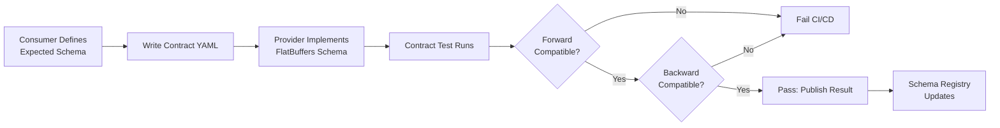

# Contract Testing Framework

**Source ADR:** ADR-0013d (Contract Testing & Compatibility Validation)

## Overview

This directory contains the consumer-driven contract testing infrastructure for K1 Intelligence Module. Based on Pact-style testing, it validates schema compatibility across versions, ensuring forward and backward compatibility for all 76 FlatBuffers schemas.

**Research Foundation:** Consumer-Driven Contracts (Pact, 2013) - API contract validation

## Purpose

Consumer-driven contract testing ensures:
- **Breaking changes detected:** Fail CI/CD if breaking change without MAJOR version bump
- **Forward compatibility:** Old clients work with new schemas (new optional fields ignored)
- **Backward compatibility:** New clients work with old schemas (use defaults for missing fields)
- **Multi-version matrix:** Test 228-380 schema combinations automatically
- **Runtime validation:** Not just schema diffs, but actual serialization/deserialization

## Directory Structure

```
testing/
├── README.md                    # This file
├── consumer_contracts/          # Consumer-defined expectations
│   ├── agent_state_v1.0.0.yaml
│   ├── agent_state_v1.1.0.yaml
│   ├── recall_request_v2.0.0.yaml
│   ├── recall_request_v2.1.0.yaml
│   └── ... (76 schemas × 3-5 versions each)
├── provider_contracts/          # Provider schema definitions
│   ├── agent_state_v1.0.0.fbs
│   ├── agent_state_v1.1.0.fbs
│   ├── recall_request_v2.0.0.fbs
│   ├── recall_request_v2.1.0.fbs
│   └── ... (matching versions)
├── compatibility_matrix/        # Test results & compatibility reports
│   ├── agent_state_matrix.yaml
│   ├── recall_request_matrix.yaml
│   └── ... (one per schema)
├── test_contract.py             # Contract testing framework
├── test_forward_compat.py       # Forward compatibility tests
├── test_backward_compat.py      # Backward compatibility tests
├── test_multi_version.py        # Multi-version matrix tests
└── ci_contract_tests.sh         # CI/CD integration script
```

## Contract Testing Workflow



## Consumer Contract Format

### Example: RecallRequest v2.1.0

```yaml
# contracts/testing/consumer_contracts/recall_request_v2.1.0.yaml
schema_name: RecallRequest
consumer_version: "2.1.0"
provider_version: "2.1.0"
contract_date: "2025-10-13"

expectations:
  required_fields:
    - query              # string (always present)
    - trace_id           # string (cognitive trace ID)

  optional_fields:
    - time_range         # TimeRange (new in v2.1.0)
    - limit              # uint32 (default: 10)
    - space_ids          # [string] (array of space IDs)
    - modalities         # [string] (array: text, audio, vision)

  deprecated_fields_used:
    - legacy_query_format  # string (deprecated in v2.1.0, remove in v3.0.0)

  type_expectations:
    query: string
    trace_id: string
    time_range: TimeRange
    limit: uint32
    space_ids: [string]
    modalities: [string]
    legacy_query_format: string

  nested_types:
    TimeRange:
      fields:
        - start_ts: int64
        - end_ts: int64

compatibility:
  forward_compatible_with:
    - "2.0.0"  # Can deserialize v2.0.0 data (missing time_range OK)

  backward_compatible_with:
    - "2.2.0"  # Can deserialize v2.2.0 data (ignore new fields)

  breaking_changes_from:
    - "1.x.x"  # MAJOR version change, not compatible

test_scenarios:
  - name: "Old consumer (v2.0.0) + New schema (v2.1.0)"
    description: "Consumer ignores new 'time_range' field"
    expected: PASS

  - name: "New consumer (v2.1.0) + Old schema (v2.0.0)"
    description: "Consumer uses default for missing 'time_range'"
    expected: PASS

  - name: "Consumer with deprecated field + New schema (v2.2.0)"
    description: "Consumer still uses legacy_query_format (deprecated but present)"
    expected: PASS

example_data:
  valid_v2_1_0:
    query: "user:123 activity:fishing"
    trace_id: "trace-abc-123"
    time_range:
      start_ts: 1697234567000
      end_ts: 1697320967000
    limit: 50
    space_ids: ["fam_smith", "fam_jones"]
    modalities: ["text", "audio"]

  valid_v2_0_0:
    query: "user:123 activity:fishing"
    trace_id: "trace-abc-123"
    limit: 50
    space_ids: ["fam_smith"]
    # NOTE: No time_range (v2.0.0 schema doesn't have it)
```

## Contract Testing Framework

### Core Test Class

```python
#!/usr/bin/env python3
"""
Contract testing framework for FlatBuffers schema compatibility.

Based on ADR-0013d (Contract Testing & Compatibility Validation).
"""
import flatbuffers
from pathlib import Path
from typing import Dict, List, Tuple, Optional
import yaml
import json

class ContractTest:
    """Base class for Pact-style contract tests."""

    def __init__(
        self,
        schema_name: str,
        consumer_version: str,
        provider_version: str,
        contract_path: Path
    ):
        self.schema_name = schema_name
        self.consumer_version = consumer_version
        self.provider_version = provider_version

        # Load contract
        with open(contract_path) as f:
            self.contract = yaml.safe_load(f)

    def test_forward_compatibility(self) -> Tuple[bool, str]:
        """
        Test forward compatibility: Old consumer + new provider schema.

        Scenario:
        - Consumer built with v2.0.0 schema
        - Provider sends data with v2.1.0 schema (new optional fields)
        - Consumer should ignore new fields, work correctly

        Returns:
            (compatible: bool, error_message: str)
        """
        try:
            # 1. Load consumer schema (old version)
            consumer_schema = self._load_schema(self.consumer_version)

            # 2. Load provider schema (new version)
            provider_schema = self._load_schema(self.provider_version)

            # 3. Serialize data with provider schema (includes new fields)
            provider_data = self._serialize_with_schema(
                provider_schema,
                include_new_fields=True
            )

            # 4. Deserialize with consumer schema (should ignore new fields)
            consumer_obj = self._deserialize_with_schema(
                consumer_schema,
                provider_data
            )

            # 5. Validate required fields present
            for field in self.contract['expectations']['required_fields']:
                if not self._has_field(consumer_obj, field):
                    return False, f"Required field missing: {field}"

            # 6. Validate field types
            for field, expected_type in self.contract['expectations']['type_expectations'].items():
                if not self._validate_type(consumer_obj, field, expected_type):
                    return False, f"Type mismatch for field: {field}"

            return True, "Forward compatible"

        except Exception as e:
            return False, f"Forward compatibility test failed: {str(e)}"

    def test_backward_compatibility(self) -> Tuple[bool, str]:
        """
        Test backward compatibility: New consumer + old provider schema.

        Scenario:
        - Consumer built with v2.1.0 schema (expects new optional fields)
        - Provider sends data with v2.0.0 schema (missing new fields)
        - Consumer should use defaults for missing fields

        Returns:
            (compatible: bool, error_message: str)
        """
        try:
            # 1. Load consumer schema (new version)
            consumer_schema = self._load_schema(self.consumer_version)

            # 2. Load provider schema (old version)
            provider_schema = self._load_schema(self.provider_version)

            # 3. Serialize data with provider schema (missing new fields)
            provider_data = self._serialize_with_schema(
                provider_schema,
                include_new_fields=False
            )

            # 4. Deserialize with consumer schema (should use defaults)
            consumer_obj = self._deserialize_with_schema(
                consumer_schema,
                provider_data
            )

            # 5. Validate required fields present
            for field in self.contract['expectations']['required_fields']:
                if not self._has_field(consumer_obj, field):
                    return False, f"Required field missing: {field}"

            # 6. Validate optional fields have defaults
            for field in self.contract['expectations']['optional_fields']:
                if not self._has_default(consumer_obj, field):
                    return False, f"Optional field lacks default: {field}"

            return True, "Backward compatible"

        except Exception as e:
            return False, f"Backward compatibility test failed: {str(e)}"

    def test_breaking_change_detection(self) -> Tuple[bool, List[str]]:
        """
        Detect breaking changes between consumer and provider schemas.

        Breaking changes include:
        - Removed required field
        - Changed field type
        - Removed field entirely (without deprecation period)

        Returns:
            (has_breaking_changes: bool, changes: List[str])
        """
        breaking_changes = []

        consumer_fields = set(self.contract['expectations']['required_fields'])
        provider_schema = self._load_schema(self.provider_version)
        provider_fields = self._get_schema_fields(provider_schema)

        # Check for removed required fields
        for field in consumer_fields:
            if field not in provider_fields:
                breaking_changes.append(f"Removed required field: {field}")

        # Check for type changes
        for field, expected_type in self.contract['expectations']['type_expectations'].items():
            provider_type = self._get_field_type(provider_schema, field)
            if provider_type and provider_type != expected_type:
                breaking_changes.append(f"Type changed: {field} ({expected_type} → {provider_type})")

        return len(breaking_changes) > 0, breaking_changes

    def _load_schema(self, version: str):
        """Load FlatBuffers schema for given version."""
        schema_path = Path(f"provider_contracts/{self.schema_name}_v{version}.fbs")
        # TODO: Implement FlatBuffers schema loading
        raise NotImplementedError("Schema loading not yet implemented")

    def _serialize_with_schema(self, schema, include_new_fields: bool) -> bytes:
        """Serialize test data with given schema."""
        # TODO: Implement FlatBuffers serialization
        raise NotImplementedError("Serialization not yet implemented")

    def _deserialize_with_schema(self, schema, data: bytes):
        """Deserialize data with given schema."""
        # TODO: Implement FlatBuffers deserialization
        raise NotImplementedError("Deserialization not yet implemented")

    def _has_field(self, obj, field: str) -> bool:
        """Check if object has field."""
        return hasattr(obj, field) and getattr(obj, field) is not None

    def _has_default(self, obj, field: str) -> bool:
        """Check if optional field has default value."""
        return hasattr(obj, field)  # FlatBuffers provides defaults

    def _validate_type(self, obj, field: str, expected_type: str) -> bool:
        """Validate field type matches expectation."""
        # TODO: Implement type validation
        return True

    def _get_schema_fields(self, schema) -> set:
        """Get all field names from schema."""
        # TODO: Implement schema field extraction
        return set()

    def _get_field_type(self, schema, field: str) -> Optional[str]:
        """Get field type from schema."""
        # TODO: Implement field type extraction
        return None
```

## Multi-Version Compatibility Matrix

### Example: RecallRequest Compatibility Matrix

```yaml
# contracts/testing/compatibility_matrix/recall_request_matrix.yaml
schema_name: RecallRequest
last_updated: "2025-10-13"

versions:
  - version: "1.0.0"
    released: "2025-01-01"
    deprecated: false

  - version: "2.0.0"
    released: "2025-06-01"
    deprecated: false
    breaking_changes_from:
      - "1.x.x"  # MAJOR version change

  - version: "2.1.0"
    released: "2025-09-01"
    deprecated: false

  - version: "2.2.0"
    released: "2025-10-01"
    deprecated: false

compatibility_matrix:
  # Format: consumer_version → provider_version → compatible

  "1.0.0":
    "1.0.0": COMPATIBLE  # Same version
    "2.0.0": INCOMPATIBLE  # MAJOR version change
    "2.1.0": INCOMPATIBLE  # MAJOR version change
    "2.2.0": INCOMPATIBLE  # MAJOR version change

  "2.0.0":
    "1.0.0": INCOMPATIBLE  # Consumer expects v2 fields
    "2.0.0": COMPATIBLE  # Same version
    "2.1.0": COMPATIBLE  # Forward compatible (ignore new fields)
    "2.2.0": COMPATIBLE  # Forward compatible (ignore new fields)

  "2.1.0":
    "1.0.0": INCOMPATIBLE  # Consumer expects v2 fields
    "2.0.0": COMPATIBLE  # Backward compatible (use defaults)
    "2.1.0": COMPATIBLE  # Same version
    "2.2.0": COMPATIBLE  # Forward compatible (ignore new fields)

  "2.2.0":
    "1.0.0": INCOMPATIBLE  # Consumer expects v2 fields
    "2.0.0": COMPATIBLE  # Backward compatible (use defaults)
    "2.1.0": COMPATIBLE  # Backward compatible (use defaults)
    "2.2.0": COMPATIBLE  # Same version

test_results:
  last_run: "2025-10-13T10:30:00Z"
  total_tests: 16  # 4 versions × 4 versions
  passed: 10
  failed: 6
  duration_seconds: 45

ci_cd_status:
  github_actions: ENABLED
  test_on_pr: true
  test_on_merge: true
  block_on_failure: true
  max_duration_minutes: 5
```

## Performance Requirements

```yaml
performance_targets:
  single_contract_test:
    p95_latency_ms: 5000  # 5 seconds max per test

  full_matrix_test:
    total_duration_minutes: 20  # 228 tests parallelized

  ci_cd_pipeline:
    setup_minutes: 2
    test_minutes: 20
    teardown_minutes: 3
    total_minutes: 25  # Complete pipeline

optimization:
  parallelization:
    - Test 76 schemas in parallel
    - Each schema tests 3-5 versions
    - Use GitHub Actions matrix strategy

  caching:
    - Cache compiled FlatBuffers schemas
    - Cache Python dependencies
    - Cache test results for unchanged contracts
```

## CI/CD Integration

### GitHub Actions Workflow

```yaml
# .github/workflows/contract-tests.yml
name: Contract Testing

on:
  pull_request:
    paths:
      - 'contracts/testing/**'
      - 'k1/schemas/**'
  push:
    branches:
      - main

jobs:
  contract-test:
    runs-on: ubuntu-latest
    strategy:
      matrix:
        schema:
          - agent_state
          - recall_request
          - task_announcement
          # ... all 76 schemas
        version:
          - "1.0.0"
          - "2.0.0"
          - "2.1.0"
      max-parallel: 20  # Run 20 tests in parallel

    steps:
      - uses: actions/checkout@v3

      - name: Set up Python
        uses: actions/setup-python@v4
        with:
          python-version: '3.11'

      - name: Install dependencies
        run: |
          pip install flatbuffers pyyaml ward

      - name: Run contract tests
        run: |
          python contracts/testing/test_contract.py \
            --schema ${{ matrix.schema }} \
            --version ${{ matrix.version }}

      - name: Upload test results
        if: always()
        uses: actions/upload-artifact@v3
        with:
          name: contract-test-results
          path: contracts/testing/results/

  publish-results:
    needs: contract-test
    runs-on: ubuntu-latest
    steps:
      - name: Download test results
        uses: actions/download-artifact@v3

      - name: Publish to schema registry
        run: |
          python contracts/testing/publish_results.py \
            --registry-url ${{ secrets.SCHEMA_REGISTRY_URL }}
```

## Test Scenarios

### Scenario 1: Forward Compatibility (Old Consumer + New Schema)

```python
def test_forward_compatibility_recall_request():
    """Old consumer (v2.0.0) should work with new schema (v2.1.0)."""

    # Consumer contract (v2.0.0 expectations)
    consumer_contract = {
        'required_fields': ['query', 'trace_id'],
        'optional_fields': ['limit', 'space_ids']
    }

    # Provider data (v2.1.0 with new 'time_range' field)
    provider_data_v2_1 = {
        'query': 'user:123',
        'trace_id': 'trace-abc',
        'limit': 50,
        'space_ids': ['fam_smith'],
        'time_range': {'start_ts': 1697234567000, 'end_ts': 1697320967000}  # NEW
    }

    # Test: Old consumer should ignore 'time_range'
    test = ContractTest('RecallRequest', '2.0.0', '2.1.0', contract_path)
    compatible, msg = test.test_forward_compatibility()

    assert compatible, f"Forward compatibility failed: {msg}"
```

### Scenario 2: Backward Compatibility (New Consumer + Old Schema)

```python
def test_backward_compatibility_recall_request():
    """New consumer (v2.1.0) should work with old schema (v2.0.0)."""

    # Consumer contract (v2.1.0 expectations)
    consumer_contract = {
        'required_fields': ['query', 'trace_id'],
        'optional_fields': ['limit', 'space_ids', 'time_range']  # NEW
    }

    # Provider data (v2.0.0 missing 'time_range')
    provider_data_v2_0 = {
        'query': 'user:123',
        'trace_id': 'trace-abc',
        'limit': 50,
        'space_ids': ['fam_smith']
        # NOTE: No 'time_range'
    }

    # Test: New consumer should use default for 'time_range'
    test = ContractTest('RecallRequest', '2.1.0', '2.0.0', contract_path)
    compatible, msg = test.test_backward_compatibility()

    assert compatible, f"Backward compatibility failed: {msg}"
```

### Scenario 3: Breaking Change Detection

```python
def test_breaking_change_detection():
    """Detect breaking changes that require MAJOR version bump."""

    # Scenario: Provider removes required field
    consumer_contract = {
        'required_fields': ['query', 'trace_id', 'session_id']  # session_id required
    }

    provider_schema_v3 = {
        'fields': ['query', 'trace_id']  # session_id REMOVED
    }

    # Test: Should detect breaking change
    test = ContractTest('RecallRequest', '2.1.0', '3.0.0', contract_path)
    has_breaking, changes = test.test_breaking_change_detection()

    assert has_breaking, "Breaking change not detected!"
    assert any('session_id' in change for change in changes)
```

## Observability

### Metrics (Prometheus)

```yaml
metrics:
  contract_test_metrics:
    - contract_tests_total{schema, consumer_version, provider_version, result}
    - contract_test_duration_ms{schema, test_type, percentile}
    - contract_compatibility_matrix{schema, compatible}

  ci_cd_metrics:
    - contract_test_failures_total{schema, version, error_type}
    - contract_test_pipeline_duration_ms{stage, percentile}
```

### Alerts

```yaml
alerts:
  - name: ContractTestFailed
    condition: contract_test_failures_total > 0
    severity: HIGH
    action: Block PR merge

  - name: ContractTestSlow
    condition: contract_test_duration_ms{p95} > 5000
    severity: MEDIUM
    action: Investigate performance
```

## Related Contracts

- **FlatBuffers Schemas:** `../flatbuffers/` - All 76 schemas that need contracts
- **Versioning Policy:** ADR-0013 - Semantic versioning rules
- **Schema Evolution:** ADR-0013b - How schemas evolve
- **Breaking Change Policy:** ADR-0013c - When to bump MAJOR version

---

**Last Updated:** 2025-10-13

**Contract Coverage:** 0/76 schemas (0%) - Implementation pending
**CI/CD Status:** Not yet integrated
**Test Framework:** Python-based, Pact-style consumer-driven contracts

