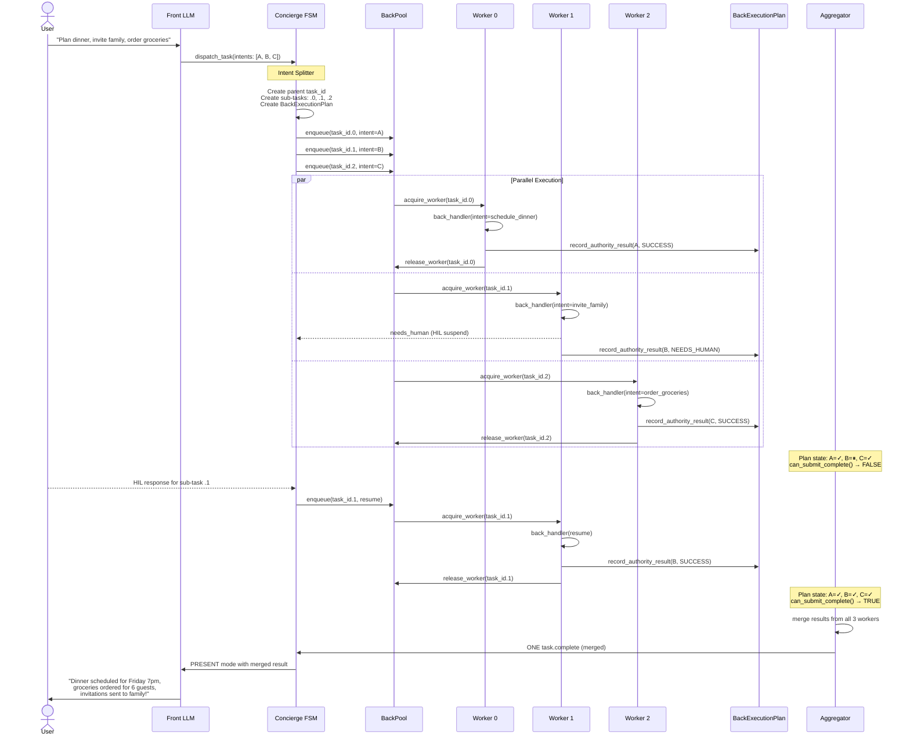

# BackPool & BackExecutionPlan — Architecture Plan

**Date:** 2026-06-18
**Branch:** `feature/prompt-architecture-refactor`
**Status:** Skeleton. Fill after code discovery.

---

## Architecture We Are Building Toward — Option B: Per-Intent Parallel Workers

### Target End-State Diagram

```
                              ┌─────────────────────────────────────────┐
                              │               👤 USER                   │
                              │  "Plan dinner, invite family,           │
                              │   order groceries"                      │
                              └────────────────────┬────────────────────┘
                                                   │
                                                   ▼
                              ┌─────────────────────────────────────────┐
                              │          FRONT LLM (actor='front')      │
                              │                                         │
                              │  dispatch_task(intents: [A, B, C])      │
                              └────────────────────┬────────────────────┘
                                                   │
                                                   ▼
┌─────────────────────────────────────────────────────────────────────────────────┐
│                            CONCIERGE FSM                                          │
│                                                                                  │
│   _on_task_dispatch()                                                             │
│        │                                                                          │
│        ▼                                                                          │
│   ┌──────────────────────────────────────┐                                        │
│   │        INTENT SPLITTER               │                                        │
│   │  1 dispatch → N sub-tasks            │                                        │
│   │  parent_task_id                      │                                        │
│   │    ├── task_id.0  (schedule_dinner)  │                                        │
│   │    ├── task_id.1  (invite_family)    │                                        │
│   │    └── task_id.2  (order_groceries)  │                                        │
│   └──────────────────────────────────────┘                                        │
│        │                                                                          │
│        │  enqueue N envelopes                                                     │
│        ▼                                                                          │
└───────────────────────────────────────────────────────────────────────────────────┘
                                                   │
          ┌────────────────────────────────────────┼──────────────────────────────────────────┐
          │                                        │                                           │
          │    BackTopicRouter                     │                                           │
          │    ┌──────────────┐                    │                                           │
          │    │ dispatch ────┼─── acquire worker ─┤                                           │
          │    │ cancel   ────┼─── sync (no worker)│                                           │
          │    │ resume   ────┼─── acquire worker ─┤                                           │
          │    └──────────────┘                    │                                           │
          │                                        │                                           │
          │    ReadyQueue                          │                                           │
          │    ┌──────────────┐                    │                                           │
          │    │ depends_on   │                    │                                           │
          │    │ envelopes    │──── releases ──────┤                                           │
          │    │ cycle detect │                    │                                           │
          │    └──────────────┘                    │                                           │
          │                                        │                                           │
          └────────────────────────────────────────┼──────────────────────────────────────────┘
                                                   │
                                                   ▼
┌─────────────────────────────────────────────────────────────────────────────────┐
│                              BACKPOOL                                             │
│                                                                                  │
│   pool_size=3   max_concurrent_per_session=2                                     │
│                                                                                  │
│   ┌──────────────────┐   ┌──────────────────┐   ┌──────────────────┐             │
│   │    WORKER 0      │   │    WORKER 1      │   │    WORKER 2      │             │
│   │   task_id.0      │   │   task_id.1      │   │   task_id.2      │             │
│   │                  │   │                  │   │                  │             │
│   │  intent:         │   │  intent:         │   │  intent:         │             │
│   │  schedule_dinner │   │  invite_family   │   │  order_groceries │             │
│   │                  │   │                  │   │                  │             │
│   │  back_handler()  │   │  back_handler()  │   │  back_handler()  │             │
│   │  react_loop()    │   │  react_loop()    │   │  react_loop()    │             │
│   └────────┬─────────┘   └────────┬─────────┘   └────────┬─────────┘             │
│            │                      │                      │                        │
│            │       record_        │       record_        │       record_          │
│            │    authority_result  │    authority_result  │    authority_result    │
│            │                      │                      │                        │
│   ┌────────┴──────────────────────┴──────────────────────┴────────────────────────┐│
│   │                    BACK EXECUTION PLAN (shared, per parent task)               ││
│   │                                                                                ││
│   │   Item 0: schedule_dinner  →  SUCCEEDED      ✓                                ││
│   │   Item 1: invite_family    →  NEEDS_HUMAN    ⏸  ◄── HIL suspend               ││
│   │   Item 2: order_groceries  →  SUCCEEDED      ✓                                ││
│   │                                                                                ││
│   │   can_submit_complete() → FALSE   (HARD GATE: blocks until ALL terminal)       ││
│   └────────────────────────────────────────────────────────────────────────────────┘│
│                                                                                  │
│   ┌──────────────┐                                                               │
│   │ OVERFLOW Q   │  ←─ when pool full, envelopes wait here                        │
│   └──────────────┘                                                               │
│                                                                                  │
└───────────────────────────────────────────────────────────────────────────────────┘
                                                   │
                                                   │  all workers terminal?
                                                   ▼
┌─────────────────────────────────────────────────────────────────────────────────┐
│                              AGGREGATOR                                           │
│                                                                                  │
│   ┌─────────────────────────────────────────────────────────────────────────┐    │
│   │  Awaits ALL N workers reaching terminal state                            │    │
│   │                                                                          │    │
│   │  Policy:                                                                 │    │
│   │    • All done      → merge results → emit ONE task.complete              │    │
│   │    • HIL pending   → wait for HIL resolution or timeout                  │    │
│   │    • Timeout       → mark pending as FAILED, emit partial completion     │    │
│   │    • Partial ok?   → emit status="partial" with completed results        │    │
│   └─────────────────────────────────────────────────────────────────────────┘    │
│                                                                                  │
│   Output: ONE merged task.complete envelope                                       │
│                                                                                  │
└───────────────────────────────────────────────────────────────────────────────────┘
                                                   │
                                                   │  k1.orchestration.task.complete.v1
                                                   ▼
┌─────────────────────────────────────────────────────────────────────────────────┐
│                         FSM: _on_task_complete()                                  │
│                                                                                  │
│   State: COMPANIONING → DELIVERING                                               │
│   Delivers merged result to Front                                                 │
│                                                                                  │
└───────────────────────────────────────────────────────────────────────────────────┘
                                                   │
                                                   ▼
                              ┌─────────────────────────────────────────┐
                              │     FRONT LLM (PRESENT mode)            │
                              │                                         │
                              │  Receives ONE merged task.complete      │
                              │  Synthesizes:                           │
                              │  "Dinner scheduled for Friday 7pm,      │
                              │   groceries ordered for 6 guests,       │
                              │   invitations sent to family!"          │
                              └─────────────────────────────────────────┘


                         ─ ─ ─  HIL SIDE PATH (per sub-task)  ─ ─ ─

   Worker 1 suspends
        │
        │  needs_human
        ▼
   ┌──────────────────────┐
   │  k1.hil.request.v1   │
   │  bound to sub_task_id │
   │  (task_id.1)          │
   └──────────┬───────────┘
              │
              │  FSM: CLARIFYING_WORKER
              │  Front: HITL_RELAY renders question
              ▼
   ┌──────────────────────┐
   │     👤 USER RESPONDS  │
   └──────────┬───────────┘
              │
              │  k1.hil.response.v1
              ▼
   ┌──────────────────────┐
   │  Worker 1 resumes    │
   │  back_handler(resume)│
   │  react_loop()        │
   │  completes intent    │
   └──────────────────────┘
              │
              │  record_authority_result(B, SUCCESS)
              ▼
        BackExecutionPlan: all items terminal → Aggregator proceeds
```

### Component Inventory — What Each Piece Does

| # | Component | Responsibility | State |
|---|---|---|---|
| 1 | **Front LLM** | Owns conversation plane. Decides to bundle intents into `dispatch_task`. STANDARD/PRESENT/INTERRUPT/ERROR modes call LLM. HITL_RELAY/HITL_RESOLVE are **zero-LLM pass-through**. | ✅ Built; HITL pass-through needs wiring |
| 2 | **FSM Intent Splitter** | Detects `len(intents) > 1`, creates parent task + N sub-tasks, enqueues to BackPool. | ❌ Needs build |
| 3 | **FSM Active-HIL Tracker** | `_active_hil_task_id` + `_pending_hil_queue`. Eliminates all multi-HIL race conditions by giving Front an EXACT task_id instead of "first SUSPENDED" scan. | ❌ Needs build |
| 4 | **BackPool** | Manages N concurrent worker slots. Acquires/releases leases. Enforces `pool_size` and `max_concurrent_per_session`. Overflow queue when full. | ✅ Built, not wired |
| 5 | **Back LLM Workers** | Each runs `back_handler()` on ONE intent. Independent `react_loop` per worker. **Formats user-facing HIL questions** (not raw tool language). Records results to BackExecutionPlan. | ✅ Built (single), needs per-intent adaptation + voice prompt |
| 6 | **BackExecutionPlan** | Shared coverage ledger for one parent task. Tracks each intent: PENDING → DISCOVERED → SUCCEEDED/FAILED/NEEDS_HUMAN. **HARD GATE**: `can_submit_complete()` returns false until all items terminal. | ✅ Built, not wired |
| 7 | **Aggregator** | Awaits all N workers reaching terminal state. Merges N individual results into ONE `task.complete` envelope. Handles timeout and partial completion policy. | ❌ Needs build |
| 8 | **BackTopicRouter** | Routes incoming Back-bound envelopes by topic: dispatch/resume → acquire worker; cancel → sync handler. Discards late envelopes. | ✅ Built, not wired |
| 9 | **ReadyQueue** | Holds envelopes with `depends_on` until predecessor completes. Cycle detection. Auto-releases when dependency resolves. | ✅ Built, not wired |
| 10 | **HIL (per sub-task)** | Sub-task suspends independently. HIL request bound to `sub_task_id`. Active-HIL tracker ensures correct task→question→response routing. Other workers continue during HIL. | ⚠️ Needs Active-HIL tracker + thin Front pass-through |
| 11 | **Front PRESENT** | Receives ONE merged `task.complete` (unchanged contract). Synthesizes all results into user-facing message. Handles partial completion phrasing. | ⚠️ Partial — needs partial-completion prompt variant |

### Critical Constraint — Why This Architecture Exists

```
                    ┌──────────────────────────────────────────┐
                    │  Front can only receive ONE task.complete │
                    │  per user request.                        │
                    │                                          │
                    │  Without an aggregator, N parallel        │
                    │  workers would flood Front with N         │
                    │  fragmented PRESENT-mode triggers.        │
                    │                                          │
                    │  The aggregator is NOT optional — it is   │
                    │  the architectural price of parallelism.  │
                    └──────────────────────────────────────────┘
```

### Data Flow — End to End



### What Changes vs What Stays the Same

| Layer | Stays the Same | Changes |
|---|---|---|
| **Front LLM** | Owns conversation plane; `dispatch_task` schema; react_loop for STANDARD/PRESENT/INTERRUPT/ERROR modes | **HITL_RELAY → zero-LLM pass-through:** Back formats user-facing question, Front writes to history & publishes without LLM rephrasing. **HITL_RESOLVE → zero-LLM pass-through:** Front reads answer, writes to history, publishes HIL response without LLM processing. **PRESENT:** partial completion phrasing for multi-intent results. |
| **FSM** | States, weave policy, HIL relay | Intent splitter, sub-task tracking, aggregator handoff, `active_hil_count` tracking |
| **Back LLM** | `back_handler`, react_loop, tool set | **User-facing question formatting** (not raw tool language). Single-intent awareness. Records results to shared BackExecutionPlan. |
| **Bus** | Topics, envelope format | Sub-task topic routing |
| **HIL Service** | `needs_human()` → Future pattern, `_on_response()` | No change — already handles N concurrent pendings |
| **Front PRESENT** | ONE completion trigger (unchanged contract) | Merged result payload, partial completion variant |
| **Conversation Continuity** | Front writes all history entries | No change — but HIL questions/answers are now Back-authored, not Front-rephrased. History integrity preserved. |

---

## Present Flow — Single Back LLM (as built today)

### 1. Front → Task Dispatch

```
User message
  → Front LLM (react_loop, actor="front")
    → Front calls dispatch_task(intents: [{action, params}, ...])
    → Publishes k1.orchestration.task.dispatch.v1
```

**✅ A1: How does Front decide to bundle intents?**

Front is told by the `DISPATCH_RULES` prompt section (`prompt/sections.py:526–582`) to **always bundle** into ONE `dispatch_task` call:

> **Independent intents** ("book hotel AND search restaurants"): Bundle in ONE `intents[]` array. Do NOT set `depends_on`.
> **Sequential intents** ("add items THEN place order"): ALSO bundle in ONE `intents[]` array. Order logically. Do NOT set `depends_on`.
> **Chained tasks** (rare — second task needs result of first): Call `dispatch_task` twice across iterations. Use the returned `task_id` in the second call's `depends_on`.

The schema description (`schemas_front.py:468`) reinforces: *"For multi-intent messages (including sequential ones), call dispatch_task ONCE with all intents..."*

There is **no kernel-side splitting**. One `dispatch_task` tool call = 1 entry in `dispatched_tasks[]` = 1 bus event, regardless of intent count.

---

**✅ A2: What does the dispatch payload look like on the wire?**

Topic: `k1.orchestration.task.dispatch.v1` (Priority: INTERACTIVE)

Schema fields (`schemas_front.py:460–568`):

| Field | Type | Required | Description |
|---|---|---|---|
| `intents` | `array` of objects, `minItems: 1` | **Yes** | One or more intents to execute |
| `intents[].action` | `string` | **Yes** | What to do (natural language or capability name) |
| `intents[].params` | `object` | No | Structured parameters from conversation & beliefs |
| `intents[].resource_family` | `string` | No | Taxonomy hint: `"item"`, `"event"`, `"task"` |
| `intents[].operation_hint` | `string` | No | `"create"`, `"read"`, `"update"`, `"delete"` |
| `urgency` | `string` enum | No | `"normal"` (default), `"urgent"`, `"background"` |
| `reference_context` | `object` | No | Resolved references for Back worker (pronouns→names) |
| `depends_on` | `string` | No | Task ID from previous dispatch. Must start with `"task-"` |
| `plan` | `boolean` | No | Set `true` when task requires planner/specialist workflow |

Implementation (`implementations.py:1228–1355`) adds auto-derived fields:

| Field | Source |
|---|---|
| `task_id` | Auto-generated: `"task-{uuid4().hex[:8]}"` |
| `tier` | Derived: `plan=true` or `depends_on` → `MEDIUM`; `complexity=HIGH` → `HIGH`; else `LOW` |
| `budget_hint` | From tier: LOW=1, MEDIUM=3, HIGH=5 |
| `safety_band` | Default `"GREEN"` unless LLM sets `"AMBER"`/`"RED"` |

FSM enriches with `reference_context` (scoreboard referents), `narrative_thread`, `turn_state_overlay`, `trace_id`, `session_id` before routing.

---

**✅ A3: Does Front ever attach `depends_on` between intents?**

**Rarely — only for cross-iteration chaining.** Front is explicitly steered AWAY from `depends_on` for all common cases.

`depends_on` is a **top-level** field on `dispatch_task` (NOT per-intent). It takes a `task-xxx` ID string. Two independent guard clauses (in `implementations.py:1248` and `controller.py:278`) defensively strip any value not starting with `"task-"` — strong evidence the LLM has historically misused this field.

The **primary** path for `depends_on` to be set is the **internal classifier** (`task/classifier.py`) auto-detecting `$ref` params and building CHAINED dispatches — not the Front LLM.

### 2. FSM Receives Task Dispatch

```
FSM._on_task_dispatch()
  → Registers ONE task_id for the dispatch
  → State: DISPATCHING → COMPANIONING
  → Routes to Back via _route_via_orchestrator()
```

**✅ B1: What fields does FSM extract from the envelope?**

`_on_task_dispatch` (`controller.py:2782`) receives `k1.orchestration.task.dispatch.v1`. Parsed via `_task_dispatch_from_payload()` → `TaskDispatch` dataclass:

| Field | Type | Default | Usage |
|---|---|---|---|
| `task_id` | `str` | auto-gen `"task-{uuid8}"` | Primary key, registered everywhere |
| `intents` | `list[dict]` | falls back to `action` | Parsed into `list[TaskIntent]`; 1st intent's `.action` → TaskBridge |
| `tier` | `str` | `"LOW"` | Coerced via `_coerce_tier()` → `ComplexityTier`; drives routing |
| `budget_hint` | `int` | auto-computed from tier | ReAct loop iteration budget |
| `reference_context` | `dict` | `None` | Enriched with scoreboard referents if Front didn't populate |
| `safety_band` | `str` | `"GREEN"` | Validated: `GREEN\|AMBER\|RED` |
| `depends_on` | `str` | `None` | **Stripped if not starting with `"task-"`** (LLM guard) |
| `context_snapshot` | `dict` | `None` | Passed to orchestrator context |
| `execution_profiles` | `list[dict]` | `None` | Passed through for Back resume/audit |
| `grounding`, `grounding_envelope_id`, `temporal_anchor_id`, `spatial_context_id`, `resolved_temporal_refs`, `resolved_spatial_refs` | various | `None` | Passed through to orchestrator context |

FSM enriches with: `reference_context` (scoreboard fallback), `narrative_thread`, `turn_state_overlay`, `trace_id`, `session_id`.

**State persisted:**

- `TaskBridge.dispatch_task(task_id, action)` → `TaskStateSection.add_task(status=DISPATCHED)` + ledger `TaskCreated`
- `_active_task_ids.add(task_id)`, `_task_dispatch_turns[task_id] = turn_number`
- `_cancel_handler.register_task(task_id)`, `_control_ext.add_active_task(task_id)`
- `_running_tasks[task_id] = RunningTaskHandle(control_queue, dispatch_payload)`

**Transition:** DISPATCHING → COMPANIONING (idempotent: COMPANIONING → COMPANIONING for multi-dispatch).

---

**✅ B2: How does tier routing work (LOW / MEDIUM / HIGH)?**

Tier is **derived**, not set directly by the LLM. Algorithm (`implementations.py:1254`):

```
complexity="HIGH"  → HIGH
plan=true OR depends_on → MEDIUM
default             → LOW
```

Routing (`_route_via_orchestrator`, `controller.py:2855`):

| Tier | Budget (Back iterations) | Route |
|---|---|---|
| **LOW** | 6 | → `_deliver_to_back()` directly via MailboxRouter |
| **MEDIUM** | 10 | → OrchestratorStub (if wired) → Fabric → Back; else **falls back to Back directly** (same as LOW) |
| **HIGH** | 14 | → Orchestrator (full Planner pipeline: SKETCH/EXPAND/VALIDATE/COMMIT); if orchestrator not wired → degrade to MEDIUM (passthrough) or fail |

**In current POC/test contexts without orchestrator: LOW = MEDIUM = same Back path.** All dispatch uses a single topic: `k1.orchestration.task.dispatch.v1`. Tier is a field inside the payload, not a topic.

Tool allowlists differ per tier: Back LOW has 5 tools, MEDIUM/HIGH adds `spawn_via_fabric` + `execute_workflow` (7 tools).

---

**✅ B3: What does TaskBridge store for this task?**

`TaskBridge` (`fsm/task_bridge.py:49`) wraps `TaskStateSection` + `TaskArtifactsSection` in SessionState. **Per-task fields** (`TaskStateEntry` dataclass):

| Field | Type | Description |
|---|---|---|
| `task_id` | `str` | UUID |
| `action` | `str` | Capability name (e.g. `"order_food"`) |
| `status` | `str` | One of: `PENDING`, `DISPATCHED`, `ACTIVE`, `SUSPENDED`, `COMPLETED`, `FAILED`, `CANCELLED` |
| `dispatched_at_ms` | `int` | Epoch ms when dispatched |
| `completed_at_ms` | `int` | Epoch ms when terminal |
| `depends_on` | `list[str]` | Task IDs this task depends on |
| `progress_pct` | `int` | 0–100 |
| `pending_hil` | `bool` | True when awaiting human input |
| `hil_suspensions_count` | `int` | Number of HIL suspensions |
| `presented_at_turn` | `int` | Turn number when result shown |
| `pending_hil_data` | `dict\|None` | Serialized HIL envelope for crash recovery |

**Task lifecycle:** `DISPATCHED → ACTIVE → (SUSPENDED → ACTIVE)* → COMPLETED/FAILED/CANCELLED`

**Key methods:** `dispatch_task`, `activate_task`, `suspend_task`, `resume_task`, `complete_task`, `fail_task`, `cancel_task`, `set_pending_hil_data`, `get_suspended_tasks`.

TaskBridge is the **Single Writer** to task state. Back LLM never writes directly — it emits bus deltas that FSM routes through TaskBridge.

### 3. Back LLM Receives and Executes

```
back_handler()
  → Reads SessionState snapshot ONCE
  → Builds system prompt from task + beliefs + referents + registry hints
  → Messages: 5-entry chat history + task JSON as user message
  → react_loop(actor="back")
    → Back calls tools: resolve_situation, invoke_capability, batch_invoke_capabilities
    → Processes ALL intents SEQUENTIALLY in one react_loop
    → Ends with submit_result(complete) or submit_result(needs_human)
  → _emit_back_result() → k1.orchestration.task.complete.v1
```

**✅ C1: How does Back LLM know which intent it is working on?**

**It doesn't, structurally.** Back receives the FULL `intents[]` array as one JSON block and relies entirely on LLM reasoning to process it. No per-intent iteration mechanism exists.

The task payload enters Back through TWO channels:

1. **System prompt** (`back_prompt.py:192`): `_strip_task_for_prompt()` keeps ALL intents but strips each to `{action, params, resource_family, operation_hint}`.
2. **User message** (`back.py:1562`): `json.dumps(task, indent=2)` — the FULL un-stripped task dict.

Back's prompt describes a **single-task protocol**: call `resolve_situation` ONCE → execute (1-2 tools) → `submit_result` ONCE. There is zero guidance about iterating over intents, processing them in order, or combining per-intent results.

**`BundledExecutionPlan`** (`task/bundled_executor.py`) exists as a designed-but-**unwired** class that would track per-intent execution (`IntentResult` per intent, `all_success`, `completed_intents`). It's only used in tests — never imported by `back.py` or `loop.py`.

---

**✅ C2: What happens when one intent fails but others succeed?**

**There is no per-intent success/failure tracking.** The `submit_result` schema (`schemas_back.py:328`) has only TWO `result_type` values:

```
"enum": ["complete", "needs_human"]
```

There is **no `"partial"` result type**. No `failed_intents` list. No per-intent status field.

The `submit_result` handler (`implementations.py:2114`) is a pure pass-through — it does not inspect results or validate completeness. `_emit_back_result()` routes binarily: `"complete"` → `task.complete.v1`, `"suspended"` → HIL, everything else → `task.failed.v1`.

**What Back LLM can do when an `invoke_capability` fails:**

- Retry with different params (up to 2 retries before the retry guard marks it terminal)
- Try a different capability
- Call `submit_result(needs_human)` to escalate
- Call `submit_result(complete)` with whatever partial results it gathered — **even if some intents failed**

`react_loop` terminates immediately on `submit_result` — it trusts the LLM's declaration. No kernel-level cross-check against the original intents list.

**⚠️ Implication for Option B:** With per-intent parallel workers, each worker processes ONE intent independently. The aggregator will receive N individual `submit_result(complete)` calls — one per worker. Partial completion (some workers succeeded, some failed) needs to be handled at the aggregator level, not inside individual Back LLMs. The `BundledExecutionPlan` is exactly the right design for this — it just needs to be wired in and adapted for multi-worker aggregation rather than single-worker iteration.

---

**✅ C3: HIL: what happens when Back suspends mid-task?**

Full trace (already partially documented in HIL Flow section above; here are the key mechanics):

**Checkpoint capture** (`_build_react_checkpoint`, `back.py:866`):

| Field | Source |
|---|---|
| `task_id` | Task UUID |
| `messages` | Serialized full message list (role, content, tool_call_id, etc.) |
| `tool_history` | `tool_dispatcher.get_execution_records()` → each record `.to_dict()` |
| `completed_tool_call_ids` | Filtered from tool_history: records with `result_status` in `{"ok", "partial"}` and non-empty `call_id` |
| `suspension_count` | Incremented on each re-suspend (default 1) |
| `budget_remaining` | `max(0, max_iterations - len(result.iteration_durations_ms))` |
| `scratchpad` | `{"loop_events": list(result.loop_events)}` |

**Resume message format** (`_hil_response_resume_message`, `back.py:947`):

```
== RESUME AFTER HUMAN INPUT (round N) ==
Suspension #M. Budget remaining: B iterations.
Already completed tools: [tool_name_1, tool_name_2, ...]
Continue the task. Do NOT re-execute already-completed tools unless
the human explicitly asked for a different outcome.
Do not ask the same question again unless the answer is insufficient.

Human response:
{"hil_request_id": "...", "decision": "...", "raw_user_text": "...", "resolution": {...}}
```

**Dedup on resume:** `react_loop` receives `completed_tool_call_ids` and `completed_tool_arg_keys`. Before executing any tool, the loop checks if the tool call ID or `"{tool_name}:{args_hash}"` key is in the completed sets — if so, the tool is skipped and a synthetic `ToolResult(status="ok", data={"dedup": true})` is returned immediately.

**Budget on resume:** Uses `cp_budget_remaining` if available, else `max(2, max_iterations)`. After the first resume round, dedup state is cleared so the LLM can re-execute previously-completed tools if the human asked for a different outcome.

**Multi-round HIL:** The `_resolve_needs_human_in_process` loop supports up to `max_suspensions_per_task` (default 2) rounds. Each round: await HIL → build resume message → call `react_loop` with dedup. If still suspended after max rounds, returns `status="budget_exhausted"`.

### 4. FSM Receives Task Completion

```
FSM._on_task_complete()
  → State: COMPANIONING → DELIVERING
  → WeavePolicy decides: IMMEDIATE / BATCH / DEFER
  → Delivers structured result to Front for PRESENT mode
```

**✅ B4: WeavePolicy decision criteria?**

`WeavePolicy` (`protocols/weave_policy.py`) collects `WeaveSignal` (7 dimensions: fsm_state, pending_count, has_critical, user_typing, user_idle_ms, emotional_gate, backpool_utilization, hitl_pending), then evaluates a **10-rule priority-ordered decision table** (first match wins):

| Rule | Condition | Decision | Window |
|---|---|---|---|
| R0 | Policy disabled | BATCH | 500ms |
| R1 | LISTENING + idle > 10s | **IMMEDIATE** | 0ms |
| R2 | has_critical + gate=open | **IMMEDIATE** | 0ms |
| R3 | user_typing | **DEFER** | — |
| R4 | gate=suppress_all_non_safety | **SUPPRESS** | — |
| R5 | gate=suppress_trivial + !critical | **DEFER** | — |
| R5.5 | hitl_pending + !critical | **DEFER** | — |
| R6 | pending ≥ 3 + all low urgency | **DIGEST** | 15s |
| R7 | pending ≥ 1 + idle > 3s | **BATCH** | dynamic 200–5000ms |
| R8 | backpool_util > 0.8 | **BATCH** | 2s |
| R9 | (default fallback) | **BATCH** | 500ms |

**5 decisions → 5 different delivery behaviors:**

- **IMMEDIATE:** Transition to DELIVERING, flush all results to Front NOW.
- **BATCH:** Schedule `asyncio` timer for window_ms, then flush.
- **DEFER:** Move results to `deferred_results` queue; inject into next STANDARD prompt as `async_results_context`. Force-deliver after 5 consecutive defers.
- **DIGEST:** Accumulate for 15s, compress into summary via `DigestPayload`, deliver once.
- **SUPPRESS:** Discard result from all queues; logged for audit only.

**Emotional gate** (`_compute_emotional_gate`): reads `SessionState.affective_now`:

- `valence ≥ -0.5` → `"open"` (all results can weave)
- `valence < -0.5` → `"suppress_trivial"` (only critical/urgent break through)
- `emotion=crisis` OR `safety_band=RED` → `"suppress_all_non_safety"`

Config knobs: `WeavePolicyConfig` with 12 tunables (`idle_eager_ms=10s`, `digest_window_ms=15s`, `max_consecutive_defers=5`, etc.).

---

**✅ B5: Same-turn suppression logic?**

Three-layer anti-double-delivery mechanism:

**Layer 1: IdempotencyLedger** (`fsm/idempotency.py`). Before any handler runs, checks `envelope.envelope_id` against an LRU cache. Same envelope ID in same turn → skipped. Prevents bus re-delivery from causing duplicate processing.

**Layer 2: FrontLock** (`fsm/front_lock.py`). Primary serialization gate. Front LLM is a single-threaded actor:

- `try_deliver()`: If `busy=False` → sets `busy=True`, returns `True` (caller delivers). If `busy=True` → inserts into priority queue, returns `False` (caller must NOT deliver).
- Priority order: URGENT (user.input) > INTERACTIVE (HIL, task.suspended) > RESULT (task.complete) > ERROR (task.failed) > INFO (findings).
- `release()`: Pops next event from queue. If queue empty → `busy=False`. If event exists → `busy` stays `True`, caller delivers next event.
- Backpressure: queue > 8 items → evict lowest-priority event.

**Layer 3: `response_final_table.py`** — 13-branch decision table for what happens AFTER Front finishes. Key bifurcation:

- `release_front_lock=True` (WEAVING/COMPANIONING): Front is freed but queue NOT drained — weave handles subsequent delivery.
- `drain_front_lock=True` (LISTENING): Queue MUST be drained because any queued `user.input` needs a new turn.
- `release_front_lock` and `drain_front_lock` are **mutually exclusive** across all 13 branches.

**What happens when task.complete arrives while Front is busy?** It's inserted into FrontLock's priority queue at RESULT priority. When Front finishes, `release()` pops the next highest-priority event and delivers it. If Front is in LISTENING after the response, `_drain_front_lock_queue` drains all queued events in priority order.

### 5. Front Presents Result

```
front_handler(mode=PRESENT)
  → Front LLM synthesizes Back's structured result into user-facing text
  → Publishes k1.response.final.v1
```

**✅ A4: What data does Front receive from Back's task.complete?**

Topic: `k1.orchestration.task.complete.v1` (Priority: INTERACTIVE)

`_emit_back_result()` (`back.py:1220–1300`) constructs the payload:

| Field | Type | Source |
|---|---|---|
| `task_id` | `string` | Auto-generated UUID |
| `action` | `string` | First intent's action from original dispatch |
| `result_type` | `"complete"` | Hardcoded |
| `final_answer` | `string` | Back LLM's `submit_result.final_answer` |
| `results` | `list[dict]` | Back LLM's `submit_result.results` |
| `artifacts_created` | `list[dict]` | Back LLM's `submit_result.artifacts_created` |
| `frame` | `dict` | Serialized `BackResultFrame` (same data in structured form) |
| `tool_call_summaries` | `list[dict]` | Added by `_emit_back_result` from ReAct loop observability |
| `confidence` | `float` | Optional, from submit_result |
| `blockers` | `list` | Optional, from submit_result |
| `suggested_next_action` | `string` | Optional, from submit_result |
| `semantic_context` | `dict` | Optional, from submit_result |
| `presentation_guidance` | `string` | Optional, from submit_result |

Front's `extract_scenario_data(mode=PRESENT)` (`front.py:446–510`) reads the `BackResultFrame` and produces 13 flat fields for the prompt template: `task_description`, `task_result_summary`, `task_facts`, `task_artifacts`, `task_confidence`, `task_blockers`, `suggested_next_action`, `semantic_guidance`, `artifacts`, `completed_before_cancel`, `results`, `tool_history`.

---

**✅ A5: How does Front phrase "X, Y, and Z are all done"?**

**Results are presented as a SINGLE combined/flat structure — NOT per-intent.** The `BackResultFrame` has one flat `facts` list. Front's PRESENT prompt template (`scenario_templates.py:43–57`) renders them as one undifferentiated block:

```
== TASK RESULT TO PRESENT ==
Task: {task_description}
Confirmed facts:
{task_facts}              ← ALL facts from ALL intents, concatenated
Artifacts:
{task_artifacts}          ← ALL artifacts, concatenated
...
Present what changed naturally in Front's voice. Lead with the useful outcome,
not the internal task.
```

The prompt **explicitly discourages** numbered/structured delivery:

- *"Do NOT sound like an operation log"*
- *"Do NOT parrot results verbatim. Interpret and present in your voice"*
- *"Lead with the user-visible outcome: what is now done, scheduled, saved"*
- *"Interpret, contextualize, highlight what matters"*

**There is NO multi-intent phrasing guidance.** The prompt uses singular language throughout (`Task:`, `result`). Multi-intent results are left to the LLM to improvise. Front would naturally produce integrated narrative like *"The Vineyard Inn is booked for Friday, and I grabbed a 7pm reservation at Bottega"* rather than *"1) booked hotel, 2) reserved restaurant."*

**⚠️ Implication for Option B:** The merged `task.complete` from the aggregator will need to carry **per-intent** results if we want Front to present them distinctly. Today's flat structure works because one Back LLM processed everything. With parallel workers, the aggregator must either (a) flatten N worker results into the existing flat format, or (b) extend the payload with a per-intent structure that Front's PRESENT prompt can iterate.

### 6. Key Properties of Present Flow

- [x] **ONE task = ONE back_handler call = ONE react_loop = ONE task.complete** — Confirmed. Front bundles all intents into one `dispatch_task`. FSM creates one `TaskDispatch`. Back receives the full `intents[]` array and runs one `react_loop` culminating in one `submit_result`. One `_emit_back_result()` publishes one `task.complete.v1`.
- [x] **Multi-intent is sequential within a single LLM context** — Confirmed. Back has no per-intent iteration mechanism. The LLM sees all intents in the system prompt + user message and processes them as one combined task via its own reasoning. `BundledExecutionPlan` exists but is unwired.
- [x] **Message history IS the execution plan** — Confirmed. There is no structured execution plan wired into `loop.py`. Back's `react_loop` doesn't know about individual intents. The LLM uses the conversation context (system prompt + user message + tool results) as its working memory. This works for single-worker but does NOT work for parallel workers — they can't share message history.
- [x] **No per-intent tracking needed** — Confirmed for single-worker mode. With Option B, per-intent tracking becomes essential. The unwired `BundledExecutionPlan` is the right foundation.
- [x] **No aggregation needed** — Confirmed for single-worker mode. One Back LLM produces one result. With Option B, N workers produce N results → aggregator required.

**✅ Present Flow section complete.** All 5 subsections filled from code exploration.

---

## Future Flow — Option B: Per-Intent Parallel Workers

### 1. Front → Multi-Intent Task Dispatch (unchanged from today)

```
User: "Plan dinner, invite family, order groceries"

Front LLM calls dispatch_task(intents: [
  {action: "schedule_dinner", params: {date: "Friday", time: "7pm"}},
  {action: "invite_family",   params: {event: "dinner"}},
  {action: "order_groceries", params: {meal: "dinner", guests: 6}},
])
```

- [ ] Does Front need prompt changes to produce better multi-intent bundles?
- [ ] How does Front decide what to bundle vs separate dispatch?
- [ ] What context does each intent carry?

### 2. FSM: Split Multi-Intent Into Sub-Tasks

```
FSM._on_task_dispatch()
  → Detects len(intents) > 1 AND backpool_enabled
  → Creates parent task_id + N sub-task_ids (task_id.0, task_id.1, task_id.2)
  → Creates ONE BackExecutionPlan for the parent task
  → Enqueues N envelopes to BackPool (one per intent)
  → State: COMPANIONING (awaits aggregation)
```

**✅ D1: How does FSM know when to split vs keep bundled?**

The classifier (`task/classifier.py:67`) already defines three modes:

| Mode | Criteria | Today's behavior |
|---|---|---|
| `SINGLE` | 0–1 intents | One dispatch to Back |
| `BUNDLED` | 2+ intents, **none** have `$ref` params | One dispatch with ALL intents (sequential in one react_loop) |
| `CHAINED` | 2+ intents, **any** has `$ref` params | N separate dispatches, each with `depends_on` forming a sequential chain |

**Split heuristic for Option B:** When `backpool_enabled` AND `len(intents) > 1` AND classification is `BUNDLED` (no `$ref` dependencies):

- **Split:** Create N sub-tasks, one per intent → enqueue to BackPool for parallel execution.
- **Keep bundled** (single-worker fallback) when: `len(intents) == 1`, classification is `CHAINED` (intents have `$ref` data dependencies and MUST be sequential), or `backpool_enabled=False`.

**CHAINED intents CANNOT be parallelized** because they have `$ref` data dependencies (e.g., intent B needs `$task-A-003.result.address`). The `ReadyQueue` physically blocks dependent dispatches. These must remain sequential — but could still benefit from BackPool (one worker per sequential step, with ReadyQueue managing the chain).

`depends_on` at the dispatch level **always forces CHAINED** (`task/tools.py:97`), so any dispatch with `depends_on` set will NOT be split.

---

**✅ D2: What does the sub-task envelope look like?**

**A sub-task envelope can reuse the existing `k1.orchestration.task.dispatch.v1` topic and payload shape.** Back's `back_handler` already reads `task["intents"]` as a list — if we put a single intent in that list, Back processes it identically. No new topic needed.

Per-intent sub-dispatch payload:

| Field | Value |
|---|---|
| `task_id` | `"{parent_id}.{n}"` (e.g., `"task-abc123.0"`) |
| `intents` | `[{action, params, resource_family, operation_hint}]` — **single intent** |
| `parent_task_id` | Original parent `task_id` (NEW FIELD — added to `TaskDispatch`) |
| `batch_id` | Same for all siblings (NEW FIELD — for observability grouping) |
| `tier` | Inherited from parent dispatch |
| `safety_band` | Inherited from parent dispatch |
| `budget_hint` | Per-intent budget (smaller than parent's multi-intent budget) |
| `reference_context` | Inherited from parent dispatch |
| All other fields | Inherited unchanged |

**`back_handler` compatibility:** Back reads `task["intents"]` as a list and iterates it. A single-intent list `[{...}]` works without any code changes. The `parent_task_id` and `batch_id` are new fields that Back ignores (forward-compatible). Back does NOT need to know it's processing a sub-task — it just processes one intent.

---

**✅ D3: How does the FSM track "parent task is waiting for N sub-tasks"?**

No parent/child relationship exists today. The FSM tracks tasks via flat structures (`_active_task_ids: set[str]`, `_running_tasks: dict[str, RunningTaskHandle]`). The closest pattern is `HILSubTask.parent_task_id` — a parent spawns a blocking sub-operation.

**New FSM state needed:**

```python
# parent_task_id → set of child task IDs still outstanding
self._pending_child_tasks: dict[str, set[str]] = {}

# child_task_id → parent_task_id (reverse lookup)
self._child_to_parent: dict[str, str] = {}
```

**Modified completion flow:** When a child `task.complete` arrives:

1. Look up `parent_task_id` via `_child_to_parent[child_task_id]`
2. Remove child from `_pending_child_tasks[parent_task_id]`
3. If the set is now **empty** → all children done → aggregator merges results → emit ONE parent `task.complete`
4. If set is NOT empty → stay in current state, wait for remaining children

**⚠️ Critical:** The current `if not self._active_task_ids:` check (line 3232) must be aware that the parent task is still "logically active" even after children are dispatched. The parent `task_id` should remain in `_active_task_ids` until all children complete.

**Crash recovery:** `TaskStateEntry.depends_on: List[str]` already supports lists. Store all child task IDs there for the parent task so recovery can rebuild `_pending_child_tasks`.

---

**✅ D4: New FSM state needed? (AGGREGATING?)**

**Yes — a new `AGGREGATING` state is recommended.** COMPANIONING cannot be reused because it treats each `task.complete` as terminal (immediately transitions to `DELIVERING`). AGGREGATING must **swallow** individual `task.complete` events without exiting.

| Trigger | COMPANIONING behavior | AGGREGATING behavior (new) |
|---|---|---|
| `task.complete` | → `DELIVERING` (present immediately) | **Stay** in AGGREGATING; decrement pending count; if last child → aggregate → `DELIVERING` |
| `task.failed` | → `DELIVERING` | **Stay**; decrement pending count; record failure |
| `task.suspended` | → `CLARIFYING_WORKER` | → `CLARIFYING_WORKER` (one worker needs HIL; pause aggregation) |
| `hIL.request` | → `CLARIFYING_WORKER` | → `CLARIFYING_WORKER` |
| `user.input` | → `INTERRUPT_HANDLING` | → `INTERRUPT_HANDLING` (user interrupts) |
| `task.dispatch` | → `COMPANIONING` (idempotent) | → `AGGREGATING` (idempotent; add to pending set) |

**11 existing FSM states + 1 new = 12 total.** The `response_final_table.py` would need 2 new branches for AGGREGATING (pending → stay; none → LISTENING). The transition table would need ~12 new entries.

---

**✅ D5: Sub-task ID scheme?**

Current `task_id` format: `"task-{uuid4().hex[:8]}"` (e.g., `"task-a1b2c3d4"`). Task IDs are treated as **opaque strings** everywhere — Back, TaskBridge, and FSM do not parse them.

**Recommendation: Dotted suffix notation** — `"{parent_id}.{n}"` (e.g., `"task-a1b2c3d4.0"`, `"task-a1b2c3d4.1"`).

| Approach | Pros | Cons |
|---|---|---|
| **Dotted suffix** (`parent.0`) | Human-readable; O(1) parent extraction (`task_id.rsplit(".", 1)[0]`); sortable; no lookup needed to find parent | Slightly longer strings; `task-` prefix validation needs update |
| **UUID-based** (new UUID per child) | Fully opaque; no format change | Requires `_child_to_parent` lookup for every child→parent resolution; harder to debug from logs |

**Dotted suffix is preferred** because it eliminates the need for `_child_to_parent` lookup — the parent ID is embedded in the child ID. Back, TaskBridge, and cancel handler treat task_ids as opaque, so this won't break anything. The `depends_on` validator (must start with `"task-"`) still passes since the child ID starts with `"task-"`.

### 3. BackPool: Acquire Workers, Run In Parallel

```
BackPool.acquire_worker(task_id.0) → Worker A runs back_handler(intent: schedule_dinner)
BackPool.acquire_worker(task_id.1) → Worker B runs back_handler(intent: invite_family)
BackPool.acquire_worker(task_id.2) → Worker C runs back_handler(intent: order_groceries)

Pool limits: pool_size=3, max_concurrent_per_session=2
  → If pool full, enqueue to overflow
  → If session limit reached, enqueue to ReadyQueue
```

**✅ E5: How is BackPool constructed? What's missing from the factory?**

`BackPool` (`back_pool.py`) is fully built with ~450 lines. `BackPoolConfig` has 7 fields:

| Field | Default | Purpose |
|---|---|---|
| `pool_size` | `3` | Max concurrent worker slots |
| `max_concurrent_per_session` | `2` | Per-session cap |
| `lease_ttl_s` | `300.0` | Task lease TTL (5 min) |
| `reclaim_check_interval_s` | `30.0` | Lease expiry watcher interval |
| `enable_dependency_ordering` | `True` | ReadyQueue integration flag |
| `max_renewals` | `3` | Max lease renewals |
| `lease_grace_period_s` | `5.0` | Grace period before force-reclaim |

**Full API:** `acquire_worker`, `release_worker`, `get_active_workers`, `get_worker_for_task`, `get_lease`, `renew_lease`, `get_expired_leases`, `start_lease_watcher`, `stop_lease_watcher`, `enqueue_overflow`, `dequeue_overflow`, `drain_overflow`, `is_task_released`, `has_worker`, `session_count`, `get_pool_state`. Properties: `active_count`, `pool_available`, `utilization`, `overflow_depth`.

**BackTopicRouter** (`back_router.py`, ~200 lines): 4-topic dispatch table:

- `task.dispatch` → `back_handler` (async, needs worker)
- `task.resume` → `back_resume_handler` (async, needs worker)
- `task.cancel` → `back_cancel_handler` (sync, NO worker)
- `clarification.response` → `back_resume_handler` (async, needs worker)

**ReadyQueue** (`ready_queue.py`, ~180 lines): `enqueue(envelope, depends_on)`, `notify_completed(task_id)`, `dequeue_ready()`, cycle detection, dependency failure cascading.

**ConciergeFactory (`_construct_concierge`) wires 16 steps** — ledger, SS, tools, HIL, weave, activity tracker, dead letters, orchestrator — but does NOT construct BackPool, BackTopicRouter, or ReadyQueue. `ConciergeRuntime.__init__()` has no `back_pool`/`back_topic_router`/`ready_queue` parameters. `ConciergeController._back_pool` exists as `Any | None = None` with `set_back_pool()` method — but is never called in production.

**The exact gap:** ~40 lines in `factory.py` to construct BackPool from config, pass it to Runtime, and call `fsm.set_back_pool()`. Plus ~15 lines to construct BackTopicRouter and ReadyQueue.

---

**✅ E6: How do BackPool leases work?**

**Lease state machine:** `ACTIVE → RELEASED | EXPIRED | CANCELLED | SUSPENDED`. Only `SUSPENDED → ACTIVE` (via `resume()` for HIL). Once terminal, never transitions again. `max_renewals=3` caps extensions.

**`acquire_worker(task_id, session_id, cancellation_token)` — step by step:**

1. **Idempotent guard:** If `task_id` already in `_workers` → return existing slot
2. **Cleanup:** `_cleanup_done_workers()` removes slots where `async_task.done()`
3. **Pool limit:** `len(_workers) >= pool_size` → raise `BackPoolExhausted`
4. **Session limit:** Count workers per session; `>= max_concurrent_per_session` → raise `SessionLimitReached`
5. **Create lease:** `create_task_lease(task_id, worker_id, ttl=300s, max_renewals=3, cancellation_token)`
6. **Create slot:** `WorkerSlot(task_id, session_id, worker_id, lease)`
7. **Emit callback:** `on_worker_acquired(slot)` if configured

**Crash handling:** `start_lease_watcher(bus)` runs a background `asyncio.Task` every 30s. Calls `get_expired_leases()` → for each expired slot, calls `_reclaim_expired_worker(slot, "lease_expired")` which cancels the `async_task`, calls `release_worker()`, and publishes `lease.expired` event. Lease TTL is 300s with a 5s grace period.

**WorkerSlot** has NO explicit state enum. State is inferred: not in `_workers` = FREE; in `_workers` with `async_task=None` = ACQUIRED; `async_task` running = RUNNING; `async_task.done()` = COMPLETED (cleaned by `_cleanup_done_workers`).

**Concurrency enforcement:** `pool_size` is a hard cap on total workers. `max_concurrent_per_session` is a soft cap per session — checked at acquire time against all active workers with matching `session_id`.

---

**✅ E7+E1+E2: Overflow queue, worker identity, and intent extraction**

**Overflow queue:** BackPool has its own internal `_overflow: list[Any]` (FIFO). When `acquire_worker()` raises `BackPoolExhausted`, the caller catches it and calls `enqueue_overflow(envelope)`. `dequeue_overflow()` pops one; `drain_overflow()` returns all. There is NO current wiring between BackPool overflow and ReadyQueue — they are separate concerns (capacity backpressure vs dependency ordering). The plan's statement "If session limit reached, enqueue to ReadyQueue" is a planned wiring gap — not yet implemented.

**Worker identity:** A worker knows NOTHING about its intent index or total count. No `intent_index` field exists. No `worker_id` is passed to `back_handler`. The worker processes whatever is in the task dict's `intents[]` array blindly. For single-intent sub-tasks, `back_handler` needs NO modification — if the envelope carries `intents: [{...}]` (single element), the LLM sees one intent and processes it identically.

**Intent extraction:** `back_handler` calls `_parse_payload(envelope)` → full task dict. Passes it to `build_back_prompt(task=task)` which calls `_strip_task_for_prompt(task)` — iterates ALL intents, strips each to `{action, params, resource_family, operation_hint}`. The FULL array goes into `{task_json}` in the system prompt. Back sees ALL intents, not just one. The only singular `intents[0]` access is in `_emit_back_result` for the `task_action` label — not for processing.

---

**✅ E3: Does worker need a different system prompt for single-intent vs multi-intent?**

**No.** The Back system prompt (`back_prompt.py:45-175`) is task-centric, not intent-count-centric. It never references "intents" (plural) as a processing directive. The LLM processes whatever is in `{task_json}`. If it's `[{...}]` vs `[{...}, {...}, {...}]`, the LLM naturally adapts. No prompt change needed for single-intent workers.

**What WOULD help:** Adding `intent_index` context ("You are processing intent 2 of 3: invite_family") for better error messages, HIL context, and observability. Today nothing communicates this.

---

**✅ E4: How does worker report results to the plan?**

`BackExecutionPlan.record_authority_result(tool_name, args, data, error, tool_ok)` uses `_match_item` — a scoring heuristic that matches tool results to work items by action name (+8 exact, +4 substring), domain (+5), capability tokens (+3), action tokens (+2). For `batch_invoke_capabilities`, iterates individual invocations. For `execute_workflow` with no match, records against ALL uncovered items as fallback.

**Currently NOT wired into `back_handler`.** There is no injection point for a `BackExecutionPlan` reference. The handler signature doesn't accept a plan parameter. Workers have no way to call `plan.record_authority_result()` today.

**Wiring needed:** Add `execution_plan: BackExecutionPlan | None = None` to `back_handler` signature. Pass it from the BackPool wrapper that launches the worker. Worker calls `plan.record_authority_result()` after each `invoke_capability` or `batch_invoke_capabilities` result. The plan is keyed by `parent_task_id` — worker gets it from the sub-task envelope's `parent_task_id` field.

### 4. BackExecutionPlan: Shared Coverage Ledger

```
BackExecutionPlan(parent_task_id)
  → Item 0: schedule_dinner  [PENDING]
  → Item 1: invite_family    [PENDING]
  → Item 2: order_groceries  [PENDING]

Worker A completes → plan.record_authority_result(schedule_dinner, SUCCESS)
Worker B suspends   → plan.record_authority_result(invite_family, NEEDS_HUMAN)
Worker C completes → plan.record_authority_result(order_groceries, SUCCESS)

Plan state:
  Item 0: SUCCEEDED ✓
  Item 1: NEEDS_HUMAN ⏸  (waiting for user)
  Item 2: SUCCEEDED ✓

can_submit_complete() → FALSE (Item 1 is not terminal)
```

**✅ F1: Where does the plan LIVE?**

`BackExecutionPlan` (`back_execution_plan.py`, 442 lines) is a `@dataclass(slots=True)` with 2 fields:

- `task_id: str` — the parent task ID
- `work_items: list[BackExecutionWorkItem]` — one per intent

`BackExecutionWorkItem` (9 fields): `intent_index`, `action`, `domain`, `params`, `status` (6-state enum: PENDING→DISCOVERED→IN_PROGRESS→SUCCEEDED/FAILED/NEEDS_HUMAN), `discovered_capabilities`, `attempted_capabilities`, `results`, `errors`.

**Created by FSM Intent Splitter** at parent task creation via `BackExecutionPlan.from_task(task_dict)`. Shared across N BackPool workers, consumed by Aggregator. It is a **standalone object** — not owned by FSM, BackPool, or any single component. It is keyed by `parent_task_id` and passed to workers via the sub-task envelope's `parent_task_id` field.

**Current status: BUILT but NOT WIRED into any production code.** Imported only in 2 test files. `loop.py` and `back.py` have zero references to `BackExecutionPlan`.

---

**✅ F2: How do workers access the shared plan? (thread safety)**

**ZERO concurrency protection exists.** The dataclass has no `asyncio.Lock`, no mutex, no thread-safety mechanism. All mutation methods (`record_discovery`, `record_attempt`, `_record_batch`, `merge_submit_args`) mutate shared mutable state without guards.

**Races possible (if wired concurrently):**

1. `record_discovery` + `record_authority_result` competing on same work item → inconsistent status
2. `_match_item` scoring loop reading stale state while another worker mutates item status
3. `merge_submit_args` reading `item.fact()` while `record_attempt` is mid-write
4. List append races on `attempted_capabilities`, `results`, `errors`

**Minimum protection needed:** A single `asyncio.Lock` per `BackExecutionPlan` instance. All mutation methods + `_match_item` + `merge_submit_args` + `can_submit_complete` must hold this lock. Operations are fast (no I/O inside locked sections), so a single lock is sufficient. Per-item locks or CAS only needed if lock contention becomes measurable.

---

**✅ F3: What happens when `_match_item` misattributes?**

`_match_item(action, domain, capability_name)` uses a weighted scoring heuristic:

| Condition | Weight |
|---|---|
| Exact action match (lowercased) | +8 |
| Substring action match | +4 |
| Exact domain match | +5 |
| Item domain appears in capability tokens | +3 |
| Action-word / capability-token intersection | +2 |

Tie-breaking: sort by `(-score, intent_index)` → lowest `intent_index` wins. No randomness.

**Fallbacks when NO item scores > 0:**

1. Single pending item → return it
2. Single total item → return it (even if complete)
3. Give up → return `None`

**Per-tool no-match behavior:**

- `invoke_capability` / other tools: if `_match_item` returns `None` → **result silently dropped** (no error, no recording)
- `batch_invoke_capabilities`: per-row matching; unmatched rows **silently skipped**
- `execute_workflow`: **broadcasts** result to ALL `uncovered_items()` as fallback

**⚠️ Risk with parallel workers:** If two workers call `invoke_capability` with similar actions (e.g., "schedule dinner" vs "schedule lunch"), `_match_item` may misattribute results to the wrong intent. The substring match (+4) makes this likely for short action names. Mitigation: ensure each sub-task envelope carries a distinct `action` that doesn't substring-match siblings.

---

**✅ F4: What happens when a worker calls `submit_result(needs_human)`?**

**Per-item `NEEDS_HUMAN` status is NOT terminal.** The 6-state enum has only `SUCCEEDED` and `FAILED` as terminal — `NEEDS_HUMAN` is non-terminal.

| Method | Behavior with NEEDS_HUMAN items |
|---|---|
| `item.is_complete` | Returns `False` |
| `plan.is_complete` | Returns `False` if ANY item is NEEDS_HUMAN |
| `can_submit_complete()` | Returns `False` — **BLOCKS completion** |
| `uncovered_items()` | **Includes** NEEDS_HUMAN items |

**The worker's actual escape hatch** is `submit_result(result_type='needs_human')` at the **ReAct loop level** (terminates loop with `status="suspended"`), NOT the per-item `NEEDS_HUMAN` status. The per-item status serves as an **observability marker** within the plan ledger — it tells the aggregator "this intent is waiting for human input" — but is NOT a completion gate pass.

**Recording path:** `record_authority_result()` derives `needs_human` from `data["status"] == "needs_human"`, then calls `item.record_attempt(needs_human=True)` which sets `item.status = NEEDS_HUMAN`. The plan remains incomplete until the worker resumes and transitions the item to `SUCCEEDED` or `FAILED`.

---

**✅ F5: Hard gate or soft nudge?**

**Neither — unwired.** `BackExecutionPlan` is imported in ZERO production files (only 2 test files). `can_submit_complete()` is called only in unit tests. The actual production submit guard in `tools/dispatcher.py:631-672` does a coarse check: "did you call any authority tool?" — not per-intent coverage.

**The DECLUTTER_PLAN.md explicitly marks this entire file for deletion**, calling out a design flaw: `can_submit_complete()` blocks `submit_result(complete)` even when Back has actually completed the work and explained it in `final_answer`, with no repair path.

**For Option B, this MUST become a hard gate.** With parallel workers, no single worker knows the full picture. The plan is the ONLY source of truth for "are all intents done?" The declutter plan's deletion recommendation is correct for single-worker mode (where message history IS the plan) but WRONG for Option B (where the plan is essential). **Do NOT delete this file — wire it as a hard gate.**

---

**✅ F6: Plan integration points in loop.py**

`react_loop` currently has NO `execution_plan` parameter. The first step is adding `execution_plan: BackExecutionPlan | None = None` to the signature.

**Insertion points** (all in the per-tool result loop at `loop.py:~1998-2012`):

| Point | Tool | What to call |
|---|---|---|
| **Line ~2003** | `discover_capabilities` result is `ok` | `plan.record_discovery(args=tc.arguments, data=result.data)` |
| **Line ~2010** | Any authority tool (`invoke_capability`, `batch_invoke_capabilities`, `execute_workflow`, `spawn_via_fabric`) — ok OR error | `plan.record_authority_result(tool_name=..., args=tc.arguments, data=result.data, error=result.error, tool_ok=result.is_ok())` |

**~8 lines of code** in `loop.py`. The `plan` reference comes from the `execution_plan` parameter passed through `react_loop` → per-tool loop. Worker gets plan from BackPool wrapper which reads `parent_task_id` from sub-task envelope and looks up the shared plan.

### 5. Aggregator: Wait For All, Then Emit ONE Completion

```
Aggregator watches parent_task_id:
  → Worker A done (item 0 ✓)
  → Worker B suspended (item 1 ⏸) → start HIL timeout
  → Worker C done (item 2 ✓)

  Two items done, one suspended.

  Option 1: Wait for HIL resolution (user responds, Worker B resumes)
    → Worker B completes → all 3 done
    → Emit ONE task.complete with merged results

  Option 2: HIL timeout
    → Worker B times out
    → Emit task.complete with item 1 marked FAILED/TIMED_OUT
    → Items 0 and 2 results included

  Option 3: Partial completion
    → Emit task.complete with status="partial"
    → Front PRESENT mode: "Dinner scheduled and groceries ordered,
      but I need your input on the invitations..."
```

**✅ G1: Where does the aggregator live?**

**Recommendation: New `TaskAggregator` class, owned by FSM's `ConciergeController`.**

Why FSM-owned:

- FSM already owns the parent→child tracking (`_pending_child_tasks`, `_child_to_parent`)
- FSM already receives all `task.complete` events (via `_on_task_complete`)
- FSM already decides when to deliver results to Front (via WeavePolicy)
- FSM already owns the BackExecutionPlan reference

Why NOT other locations:

- **BackPool**: Pool manages worker slots and leases, not task outcomes. Mixing concerns would couple resource management with business logic.
- **Standalone service**: Over-engineered for V0. The aggregator is a thin layer over existing FSM infrastructure — not a separate bus service.

**Design:**

```python
class TaskAggregator:
    """Owned by ConciergeController. One instance for all parent tasks."""
    def __init__(self):
        self._plans: dict[str, BackExecutionPlan] = {}        # parent_task_id → plan
        self._results: dict[str, list[dict]] = {}             # parent_task_id → [child_result_payloads]
        self._pending: dict[str, set[str]] = {}               # parent_task_id → {remaining child task_ids}
        self._timeouts: dict[str, asyncio.Task] = {}          # parent_task_id → timeout timer

    def register_parent(self, parent_task_id, plan, child_ids): ...
    def on_child_complete(self, child_task_id, result_payload): ...
    def on_child_failed(self, child_task_id, error): ...
    def on_child_suspended(self, child_task_id): ...           # HIL — wait
    def _check_all_done(self, parent_task_id): ...
    def _merge_and_emit(self, parent_task_id): ...
```

The aggregator reuses existing patterns:

- **WeaveBatcher**: Accumulates results, flushes on condition. Same pattern for "accumulate child results, flush when all done."
- **BackExecutionPlan.merge_submit_args()**: Already handles plan→submit_result merging. The aggregator extends this to N workers.
- **FSM pending_results**: Already accumulates pre-delivery results. The aggregator feeds into this queue.

---

**✅ G2: How does aggregator know ALL workers reached terminal state?**

**Event-driven, not polling.** Each child `task.complete` (or `task.failed`) triggers `aggregator.on_child_complete()`.

**Mechanism:**

1. FSM registers parent with aggregator: `aggregator.register_parent(parent_id, plan, {child_id_0, child_id_1, child_id_2})`
2. When a child `task.complete` arrives at `_on_task_complete_adaptive`:
   - If child belongs to a parent (checked via `_child_to_parent`), route to aggregator instead of weave pipeline
   - `aggregator.on_child_complete(child_id, result_payload)` stores the result, removes child from `_pending[parent_id]`
   - If `_pending[parent_id]` is now empty → all children done → `_merge_and_emit(parent_id)`
3. When a child `task.failed` arrives: same pattern — count it as "done" (terminal), record the failure.
4. When a child `task.suspended` arrives (HIL): child is NOT terminal. Do NOT remove from pending. Aggregator waits.
5. After HIL resume → child completes → normal path (step 2).

**The source of truth** is `BackExecutionPlan.can_submit_complete()` — it gates on all items being terminal. But the aggregator uses the pending count as a faster signal. When count hits 0, verify with `plan.can_submit_complete()` before merging.

**Why event-driven over polling:**

- Polling adds latency (poll interval) or CPU waste (tight loop)
- Event-driven is zero-latency — emit happens on the same event-loop tick as the last child completion
- The FSM already receives all `task.complete` events — no new subscriptions needed

---

**✅ G3: How does aggregator merge N results into ONE task.complete?**

**Field-by-field merge strategy** for the task.complete payload:

| Field | Strategy | Rationale |
|---|---|---|
| `task_id` | Parent task_id | The user-facing result is for the parent request |
| `action` | Parent's first intent action | Unchanged from today |
| `result_type` | `"complete"` or `"partial"` | `"partial"` if any child failed/timed out |
| `final_answer` | **Combined:** `"\n---\n".join([w.final_answer for w in workers])` with per-intent headers | Each worker's final_answer describes its intent's outcome |
| `results` | **Concatenated** from all workers | Each worker's `results[]` list describes its intent's facts |
| `artifacts_created` | **Concatenated** from all workers | All artifacts from all intents |
| `frame` | **New merged BackResultFrame** | Build from combined results + artifacts |
| `tool_call_summaries` | **Concatenated** from all workers | Full observability trail |
| `confidence` | **Min** across workers | Conservative: lowest confidence wins |
| `blockers` | **Concatenated** from all workers | All blockers surfaced |
| `suggested_next_action` | **First non-empty** | If multiple workers suggest actions, aggregator picks first meaningful one |
| `semantic_context` | **Merged dict** (shallow union) | Non-conflicting keys combined |
| `presentation_guidance` | **Combined:** `"\n".join(non_empty)` | All guidance preserved |
| `execution_plan` | `plan.to_dict()` with per-intent status | Front can see which intents succeeded/failed/need human |
| `status` (NEW) | `"complete"` if all SUCCEEDED; `"partial"` if any FAILED/NEEDS_HUMAN/TIMED_OUT | Enables Front partial-completion phrasing |

**Conflict resolution:** If two workers both claim to have created a calendar event for Friday 7pm, the aggregator includes both in `results[]` and `artifacts_created[]`. Front's LLM sees both and can say "Dinner scheduled for Friday 7pm" (not duplicated). Dedup is a Front LLM responsibility, not an aggregator concern.

**`merge_submit_args()`** (`back_execution_plan.py`) provides the pattern: it merges plan coverage into the submit_args dict. The aggregator extends this to N individual submit_result payloads — first flattening per-worker results into per-intent facts, then building the combined payload.

**Merged payload shape:**

```json
{
  "task_id": "task-abc123",
  "action": "Plan dinner, invite family, order groceries",
  "result_type": "complete",
  "status": "complete",
  "final_answer": "Dinner scheduled for Friday 7pm.\n---\nInvitations sent to family.\n---\nGroceries ordered for 6 guests.",
  "results": [/* concatenated from all 3 workers */],
  "artifacts_created": [/* concatenated */],
  "execution_plan": {
    "task_id": "task-abc123",
    "work_items": [
      {"intent_index": 0, "action": "schedule_dinner", "status": "succeeded", "results": [...]},
      {"intent_index": 1, "action": "invite_family", "status": "succeeded", "results": [...]},
      {"intent_index": 2, "action": "order_groceries", "status": "succeeded", "results": [...]}
    ],
    "complete": true
  }
}
```

---

**✅ G4+G5: HIL interaction with aggregator + timeout**

**HIL Interaction:** When a worker suspends for HIL, the aggregator does NOT treat the child as "done." The child remains in `_pending[parent_id]`. The aggregator simply waits. When the worker resumes (HIL resolved → react_loop completes → `task.complete` emitted), the normal `on_child_complete` path fires.

**What if the user NEVER responds to HIL?** Two timeout layers already exist:

1. **HIL Service timeout** (`needs_human_timeout_ms`, default 60s): `HumanInTheLoopService.needs_human()` awaits the Future with a timeout. On timeout, returns `NeedsHumanResponse(timed_out=True)`. The worker's `_resolve_needs_human_in_process` receives this and returns `ReactResult(status="cancelled")` → `_emit_back_result()` publishes `task.failed.v1` with error_code `HIL_TIMEOUT`.
2. **BackPool lease TTL** (default 300s): If the worker hangs (no HIL timeout, no response), the lease watcher expires the lease and force-releases the worker. The worker's `async_task` is cancelled → `task.failed.v1` published.

**Aggregator timeout:** The aggregator should NOT have its own independent timeout — it inherits from existing mechanisms. If ALL workers time out (HIL or lease), the aggregator's `_pending[parent_id]` will drain naturally via `on_child_failed`. If SOME workers complete and others time out, the aggregator eventually sees all children terminal and emits `status="partial"`.

**Maximum wait time:** `max(HIL_timeout_per_round × max_suspensions, lease_TTL)` = `max(60s × 2, 300s)` = **300s** (lease TTL dominates).

**Configurable aggregator timeout (optional):** An `aggregator_timeout_ms` (default 300s = lease TTL) could force-emit partial results even if some children are still in NEEDS_HUMAN and hasn't hit HIL timeout yet. This is a safety valve — emit what we have, mark remaining as `TIMED_OUT`.

**Partial completion emission:**

```json
{
  "task_id": "task-abc123",
  "result_type": "complete",
  "status": "partial",
  "final_answer": "Dinner scheduled for Friday 7pm. Groceries ordered.\n---\nInvitations: timed out waiting for your response.",
  "execution_plan": {
    "work_items": [
      {"intent_index": 0, "action": "schedule_dinner", "status": "succeeded"},
      {"intent_index": 1, "action": "invite_family", "status": "timed_out"},
      {"intent_index": 2, "action": "order_groceries", "status": "succeeded"}
    ],
    "complete": true
  }
}
```

### 6. FSM: Receive Aggregated Completion

```
Aggregator → k1.orchestration.task.complete.v1 (merged, ONE envelope)
  → FSM._on_task_complete()
  → State: COMPANIONING → DELIVERING
  → Delivers to Front (ONE trigger, as today)
```

**✅ Does FSM need to know it was a multi-intent task?**

**Minimally.** The FSM's `_on_task_complete` already handles `task.complete.v1` generically — it doesn't inspect whether the task is single-intent or multi-intent. The merged `task.complete` from the aggregator uses the same topic and same payload shape. The FSM just needs to:

1. Recognize that this is the PARENT task completing (not a child) — via `parent_task_id` or via the fact that `_pending_child_tasks[task_id]` is now empty
2. Clean up all child task state: remove from `_active_task_ids`, `_running_tasks`, release BackPool leases
3. Route to WeavePolicy for delivery timing (IMMEDIATE/BATCH/DEFER as usual)

**FSM state transition:** If in `AGGREGATING` state when the last child completes → transition to `DELIVERING`. If in `CLARIFYING_WORKER` (because a child suspended for HIL) → the aggregated completion triggers `CLARIFYING_WORKER → DELIVERING` (already legal in transition table).

---

**✅ Does the task.complete payload look different for multi-intent?**

**One new field: `execution_plan`.** The merged payload adds `execution_plan` (serialized `BackExecutionPlan.to_dict()`) alongside the existing `frame`. Front's `extract_scenario_data(mode=PRESENT)` reads `frame` today — adding `execution_plan` is backward-compatible. All other fields (`task_id`, `action`, `final_answer`, `results`, `artifacts_created`, `tool_call_summaries`, `confidence`, `blockers`, etc.) use the same schema. The `status` field is new (`"complete"` vs `"partial"`) but is also backward-compatible (Front ignores unknown fields).

**Cleanup:** After emitting the merged `task.complete`, the FSM must:

- `task_bridge.complete_task(parent_task_id)` — move parent to COMPLETED
- For each child: `back_pool.release_worker(child_id)` — release pool slots
- `_pending_child_tasks.pop(parent_task_id, None)` — clean tracking state
- `_child_to_parent` entries for all children removed

---

### 7. Front: Present Aggregated Result

```
front_handler(mode=PRESENT)
  → Receives ONE task.complete with merged results
  → Front LLM synthesizes: "Dinner is scheduled for Friday at 7pm,
    groceries are ordered for 6 guests, and invitations are sent
    to the family."
  → OR partial: "Dinner and groceries are handled! I still need
    to know about the invitations — should I invite John?"
```

**✅ What does the merged task.complete payload look like?**

See §5 (Aggregator) for the full payload shape. Key additions:

- `execution_plan.work_items[]` with per-intent status, results, and facts
- `status: "complete" | "partial"`
- `final_answer` with per-intent sections

The existing PRESENT prompt template (`scenario_templates.py:43-57`) already renders `{task_facts}`, `{task_artifacts}`, `{task_result_summary}` as flat blocks. The merged payload feeds these same fields — Front sees all results as one combined narrative, just like today.

---

**✅ How does Front phrase partial vs full completion?**

Front needs a **new PRESENT prompt variant** for partial completion. The current prompt has no concept of "some things done, some waiting." Add a new section to `scenario_templates.py`:

```
== PARTIAL COMPLETION NOTE ==
The task has partially completed. Some intents succeeded, some need attention.
{execution_plan_summary}
Present what IS done first. Then briefly note what still needs input.
Do NOT apologize. Frame the pending items as "I still need to..." not "I failed to..."
```

Where `execution_plan_summary` is generated from `execution_plan.work_items[]` as a bullet list: "✓ Dinner scheduled for Friday 7pm", "⏸ Invitations — waiting for your response", "✓ Groceries ordered for 6 guests".

---

**✅ Does Front need new PRESENT mode variant?**

**Yes — `PromptMode.PRESENT_PARTIAL`** or a `status` field on the scenario data that the prompt template branches on. Minimal change: ~10 lines in `scenario_templates.py` + ~5 lines in `_extract_scenario_data` to read `execution_plan` and `status`.

### 8. HIL During Parallel Execution

```
Scenario: Worker B suspends (needs_human), Workers A and C continue

FSM receives HIL request from Worker B:
  → Binds to sub-task_id.1 (not parent_task_id)
  → Transitions to CLARIFYING_WORKER
  → Front renders HIL question
  → User responds
  → HIL response routes to Worker B's resume handler
  → Worker B resumes, completes
  → Aggregator sees all 3 done → emits task.complete
```

**✅ Can FSM be in CLARIFYING_WORKER while other workers still run?**

**Yes — and this is the design.** The FSM transitions to CLARIFYING_WORKER when the FIRST child suspends. Other children continue executing independently in the BackPool. The FSM stays in CLARIFYING_WORKER until either:

- All children complete (aggregator emits `task.complete` → transition to DELIVERING)
- User interrupts (→ INTERRUPT_HANDLING)
- Task is cancelled (→ CANCELLING)

Worker A and Worker C are NOT blocked by Worker B's HIL. They run in their own `asyncio.Task` coroutines in the BackPool. Their `react_loop` calls are independent.

---

**✅ Does HIL block Front from presenting partial results?**

**With the Active-HIL tracker + Thin Front: NO.** Front can show a HIL question (pass-through, no LLM call) in ~1ms. If results from Workers A and C arrive while the HIL for Worker B is active, the aggregator stores them. When Worker B's HIL resolves and it completes, the aggregator merges all 3 and emits ONE `task.complete`. Front presents the merged result. The user experience is: see HIL question → answer → see combined results. No fragmentation.

If the aggregator timeout fires before Worker B resolves, Front gets a partial completion: "Dinner scheduled and groceries ordered. I still need to know about the invitations — should I invite John?"

---

**✅ What if multiple workers suspend simultaneously?**

Covered in detail in "Eliminating Race Conditions — Active-HIL Tracking" above. The FSM's `_active_hil_task_id` + `_pending_hil_queue` serialize HIL delivery. User sees ONE question at a time, sequentially. Workers are unblocked one at a time as each HIL is answered.

---

**✅ Does the user see "Worker B needs input" while Workers A and C are still running?**

**Yes — and that's correct UX.** The user sees a single HIL question (e.g., "Who should I invite to dinner?"). Workers A and C continue silently in the background. The user doesn't need to know about them — they're implementation details. The user just sees the question, answers it, and then gets the combined results. If Workers A and C finish BEFORE the HIL is answered, the aggregator holds their results until Worker B also completes. If Workers A and C are still running when the HIL is answered, the user might see a brief pause before the combined results appear.

---

## HIL Flow — Current State & Multi-HIL Analysis

### Current HIL Flow (Single Worker — Traced from Code)

This is the end-to-end flow as implemented today. Every step is backed by code in
`back.py`, `fsm/controller.py`, `front.py`, and `k1/hil/service.py`.

```
  ┌─ BACK WORKER ─────────────────────────────────────────────────────────────┐
  │                                                                           │
  │  react_loop() returns {status: "suspended", result_type: "needs_human",   │
  │                        data: {question, hil_type, options, context}}      │
  │       │                                                                   │
  │       ▼                                                                   │
  │  back_handler step 6b:                                                    │
  │    checkpoint = _build_react_checkpoint(messages, tool_dispatcher, ...)   │
  │    _resolve_needs_human_in_process(react_checkpoint=checkpoint)           │
  │       │                                                                   │
  └───────┼───────────────────────────────────────────────────────────────────┘
          │
          ▼
  ┌─ HumanInTheLoopService.needs_human(req) ──────────────────────────────────┐
  │                                                                           │
  │  1. suspension_mgr.suspend(task_id, ...)     ← crash-recovery             │
  │  2. publish TOPIC_HIL_REQUEST (k1.hil.request.v1)                         │
  │  3. await asyncio.Future (keyed by hil_request_id)                        │
  │                                                                           │
  └───────┼───────────────────────────────────────────────────────────────────┘
          │
          ▼
  ┌─ FSM._on_hil_request(envelope) ───────────────────────────────────────────┐
  │                                                                           │
  │  1. Parse HILEnvelope (kind=NEEDS_HUMAN, task_id, question, options)      │
  │  2. task_bridge.suspend_task(task_id)          ← bind to Back task        │
  │  3. task_bridge.set_pending_hil_data(task_id, {envelope, kind, ...})     │
  │  4. Transition: COMPANIONING → CLARIFYING_WORKER                          │
  │  5. front_lock.try_deliver(envelope)            ← deliver to Front        │
  │                                                                           │
  └───────┼───────────────────────────────────────────────────────────────────┘
          │
          ▼
  ┌─ FRONT: HITL_RELAY ───────────────────────────────────────────────────────┐
  │                                                                           │
  │  1. determine_mode() → HITL_RELAY (envelope topic = k1.hil.request.v1)    │
  │  2. Reads suspended task's pending_hil_data.envelope                      │
  │  3. Extracts: question, hil_type, options, task_action, task_context      │
  │  4. Front LLM rephrases question in user-friendly terms                   │
  │  5. Publishes k1.hil.presented.v1 (presentation ack)                      │
  │  6. Publishes k1.response.final.v1 → USER SEES QUESTION                   │
  │                                                                           │
  └───────┼───────────────────────────────────────────────────────────────────┘
          │
          ▼  (user types answer)
  ┌─ FRONT: HITL_RESOLVE ─────────────────────────────────────────────────────┐
  │                                                                           │
  │  1. determine_mode() → HITL_RESOLVE (pending SUSPENDED task exists)       │
  │  2. Reads suspended task's pending_hil_data (envelope + hil_request_id)   │
  │  3. Builds HILResponseEnvelope {hil_request_id, kind, payload: {answer}}  │
  │  4. Publishes k1.hil.response.v1 via build_hil_response()                 │
  │                                                                           │
  └───────┼───────────────────────────────────────────────────────────────────┘
          │
          ▼
  ┌─ HumanInTheLoopService._on_response(topic, data) ─────────────────────────┐
  │                                                                           │
  │  1. Parse HILResponseEnvelope from data                                   │
  │  2. Look up hil_request_id in self._pending dict                          │
  │  3. fut.set_result(resp)  ← RESOLVES THE FUTURE                           │
  │                                                                           │
  └───────┼───────────────────────────────────────────────────────────────────┘
          │
          ▼
  ┌─ BACK WORKER (resume) ────────────────────────────────────────────────────┐
  │                                                                           │
  │  _resolve_needs_human_in_process:                                         │
  │    response = await future  (NeedsHumanResponse)                          │
  │    resume_msg = _hil_response_resume_message(response, checkpoint, ...)   │
  │    messages.append(resume_msg)                                            │
  │    react_loop(messages, completed_tool_call_ids=..., budget_remaining=...) │
  │       → returns {status: "complete"} or {status: "suspended"} again       │
  │                                                                           │
  └───────────────────────────────────────────────────────────────────────────┘
```

**Key properties of current flow:**

| Property | Value |
|---|---|
| Where does `back_handler` block? | Inside `_resolve_needs_human_in_process`, awaiting `hil_port.needs_human()` Future |
| Who owns the Future? | `HumanInTheLoopService._pending[hil_request_id]` |
| Who resolves the Future? | `HumanInTheLoopService._on_response()` — NOT the FSM |
| Does HIL response go through FSM? | **No.** `k1.hil.response.v1` is consumed by the HIL service, not the FSM |
| Max suspensions per task | `max_suspensions_per_task` config (default 2), enforced by `_resolve_needs_human_in_process` loop |
| Checkpoint on resume | `completed_tool_call_ids`, `completed_tool_arg_keys`, `budget_remaining` forwarded to `react_loop` |
| Dedup on resume | `react_loop` skips already-completed tool calls via `completed_tool_call_ids` |
| Multi-round HIL | Supported. Same worker can suspend → resume → suspend again within `max_suspensions_per_task` |

---

### Multi-HIL Scenario: All 3 Workers Suspend Simultaneously

```
  Worker 0 ──► needs_human(A) ──► Future_A (awaiting)
  Worker 1 ──► needs_human(B) ──► Future_B (awaiting)
  Worker 2 ──► needs_human(C) ──► Future_C (awaiting)

  All three publish k1.hil.request.v1 in rapid succession.
```

#### What Happens at Each Layer

```
  ┌─ HumanInTheLoopService ───────────────────────────────────────────────────┐
  │                                                                           │
  │  Three calls to needs_human() in parallel coroutines.                     │
  │  Each publishes k1.hil.request.v1 with a DISTINCT hil_request_id.         │
  │  Each awaits its own Future in self._pending[hil_id].                     │
  │                                                                           │
  │  ✅ No issue here. Service handles N concurrent pendings natively.        │
  │                                                                           │
  └───────────────────────────────────────────────────────────────────────────┘

  ┌─ FSM._on_hil_request() ───────────────────────────────────────────────────┐
  │                                                                           │
  │  Called 3 times, once per HIL envelope.                                   │
  │                                                                           │
  │  Envelope 1 (Worker 0):                                                   │
  │    • task_bridge.suspend_task(sub_task_id.0)                              │
  │    • task_bridge.set_pending_hil_data(sub_task_id.0, ...)                 │
  │    • Transition: COMPANIONING → CLARIFYING_WORKER                         │
  │    • front_lock.try_deliver() → busy=False → delivered to Front ✅        │
  │                                                                           │
  │  Envelope 2 (Worker 1):                                                   │
  │    • task_bridge.suspend_task(sub_task_id.1)                              │
  │    • task_bridge.set_pending_hil_data(sub_task_id.1, ...)                 │
  │    • Already in CLARIFYING_WORKER → no transition                          │
  │    • front_lock.try_deliver() → busy=True → QUEUED (INTERACTIVE priority) │
  │                                                                           │
  │  Envelope 3 (Worker 2):                                                   │
  │    • task_bridge.suspend_task(sub_task_id.2)                              │
  │    • task_bridge.set_pending_hil_data(sub_task_id.2, ...)                 │
  │    • Already in CLARIFYING_WORKER → no transition                          │
  │    • front_lock.try_deliver() → busy=True → QUEUED (behind Envelope 2)   │
  │                                                                           │
  │  ⚠️ Three SUSPENDED tasks now exist in task_state.                        │
  │  ⚠️ Front can only process ONE at a time (FrontLock serializes).          │
  │                                                                           │
  └───────────────────────────────────────────────────────────────────────────┘

  ┌─ FRONT: Serialized HIL Processing ────────────────────────────────────────┐
  │                                                                           │
  │  ROUND 1: HITL_RELAY (Worker 0's question)                                │
  │    • Front reads FIRST suspended task → picks pending_hil_data            │
  │    • Shows question: "What time should dinner be?"                        │
  │    • User answers                                                         │
  │    • Front HITL_RESOLVE → publishes k1.hil.response.v1 for hil_id_A       │
  │    • HumanInTheLoopService resolves Future_A → Worker 0 resumes          │
  │                                                                           │
  │  FrontLock.release() → dequeues Envelope 2                                │
  │                                                                           │
  │  ROUND 2: HITL_RELAY (Worker 1's question)                                │
  │    • Front reads FIRST suspended task → ⚠️ WHICH ONE?                     │
  │    • If Worker 0 already completed & un-suspended → picks Worker 1 ✅     │
  │    • If Worker 0 still SUSPENDED → picks wrong task! ❌                    │
  │    • Shows question: "Who should I invite?"                               │
  │    • User answers                                                         │
  │    • Front HITL_RESOLVE → publishes k1.hil.response.v1 for hil_id_B       │
  │    • HumanInTheLoopService resolves Future_B → Worker 1 resumes          │
  │                                                                           │
  │  FrontLock.release() → dequeues Envelope 3                                │
  │                                                                           │
  │  ROUND 3: Same pattern for Worker 2                                       │
  │                                                                           │
  └───────────────────────────────────────────────────────────────────────────┘
```

#### ⚠️ Critical Issues Found

| # | Issue | Severity | Detail |
|---|---|---|---|
| **HIL-1** | **Front picks wrong suspended task** | **HIGH** | `extract_scenario_data` for HITL_RELAY iterates suspended tasks and picks the FIRST one. With 3 suspended tasks, only the first iteration picks correctly; subsequent iterations may re-read a just-resolved task or pick the wrong one. The `pending_hil_data` is stored per-task, but Front's lookup is "first SUSPENDED" — not "task matching this envelope." |
| **HIL-2** | **HITL_RESOLVE publishes wrong hil_request_id** | **HIGH** | `build_hil_response_envelope_dict` reads `pending_hil_data` from the first suspended task. If that task was already resolved (Worker 0's HIL got answered, but Worker 0 hasn't finished `react_loop` yet and is still marked SUSPENDED), the response would be published with the wrong `hil_request_id`. `HumanInTheLoopService._on_response` would look up that id, find no pending Future (already resolved), and log `hil_response_unknown_id`. The correct worker's Future would **never resolve** → timeout. |
| **HIL-3** | **FSM stuck in CLARIFYING_WORKER** | **MEDIUM** | The FSM transitions to CLARIFYING_WORKER on the first HIL request. It stays there until a `task.complete` or other transition triggers. While in CLARIFYING_WORKER, `COMPANIONING`-only transitions (like weave signals) are blocked. The transition table allows `TOPIC_TASK_COMPLETE` from CLARIFYING_WORKER, so the aggregator's final emit unblocks it. But if HIL round-trips take minutes, the FSM is parked in CLARIFYING_WORKER the whole time. |
| **HIL-4** | **No correlation between HIL envelope and suspended task** | **MEDIUM** | When Front dequeues a queued HIL envelope, it processes it as HITL_RELAY. But `extract_scenario_data` for HITL_RELAY doesn't use the envelope's `task_id` to find the right suspended task — it just scans for any SUSPENDED task. The envelope carries `task_id` in its inner payload, but this correlation is lost. |
| **HIL-5** | **User sees sequential questions, not batched** | **LOW** | With 3 parallel workers all needing input, the user experience is 3 sequential Q&A rounds. This might be confusing ("Why are you asking me three things in a row?"). Batching into one multi-question prompt would be better UX but requires Front prompt changes. |
| **HIL-6** | **Worker that finished react_loop but hasn't un-suspended yet** | **LOW** | After Worker 0's HIL resolves, it resumes `react_loop`, finishes, and calls `submit_result(complete)`. But the task is still marked SUSPENDED in `task_state` until `task_bridge.complete_task()` or similar is called. During this window, Front's "first SUSPENDED task" scan might still pick Worker 0. |

#### Required Fixes for Multi-HIL

| Fix | Addresses | Approach |
|---|---|---|
| **F1: Envelope→task correlation** | HIL-1, HIL-2, HIL-4 | Front's `extract_scenario_data` for HITL_RELAY must use the HIL envelope's `task_id` (from inner payload) to look up the SPECIFIC suspended task, not "first SUSPENDED." The `pending_hil_data` on that specific task must be read. |
| **F2: HITL_RESOLVE task targeting** | HIL-2, HIL-4 | When user responds, Front must know WHICH suspended task the response is for. The user's input doesn't carry a `task_id`. Front currently assumes "the one SUSPENDED task." With N suspended tasks, Front needs the FSM to track "which HIL is currently active" — likely via the `pending_hil_data` of the task that was most recently delivered. Or: Front's HITL_RELAY prompt could include `hil_request_id` in a hidden context, and the HITL_RESOLVE path reads it back. |
| **F3: Task un-suspension timing** | HIL-6 | After Worker resumes and completes, `task_bridge.complete_task(sub_task_id)` must be called BEFORE the aggregator checks plan state. The task must move from SUSPENDED to COMPLETED so Front's scan doesn't pick it. |
| **F4: Batching consideration** | HIL-5 | Future enhancement: if multiple HIL requests are queued, Front could batch them into ONE HITL_RELAY round with multiple questions. This is a UX optimization, not a correctness requirement. |
| **F5: FSM multi-HIL state awareness** | HIL-3 | FSM should track `active_hil_count` — how many sub-tasks are currently in NEEDS_HUMAN. When count drops to 0, transition out of CLARIFYING_WORKER. The aggregator's `task.complete` already handles this implicitly, but explicit tracking prevents edge cases. |

---

## Eliminating Race Conditions — Active-HIL Tracking

### Root Cause

Every race condition in the multi-HIL scenario traces back to ONE anti-pattern:

```
  Front: "I need a suspended task. Let me scan for the FIRST one."
  ❌ With N suspended tasks, this is a race.
```

Front's `extract_scenario_data` for both HITL_RELAY and HITL_RESOLVE uses
"first SUSPENDED task" as its lookup strategy. This was correct when there
was only ever ONE suspended task. With parallel Back workers, it breaks.

### The Fix: FSM-Owned Active-HIL Tracker

```
┌──────────────────────────────────────────────────────────────────┐
│  FSM._active_hil: dict[str, ActiveHILSlot]                       │
│                                                                  │
│  Tracks WHICH sub-task's HIL is currently shown to the user.     │
│  Front reads this — never scans "first SUSPENDED."               │
│                                                                  │
│  Key invariants:                                                 │
│    1. At most ONE HIL is "active" (shown to user) at a time      │
│    2. active_hil.task_id is ALWAYS the correct suspended task    │
│    3. When user responds, response routes to active_hil.task_id  │
│    4. When HIL resolves → worker completes → task un-suspends,   │
│       FSM clears active_hil and drains next queued HIL           │
└──────────────────────────────────────────────────────────────────┘
```

### The Design

```python
# FSM state — added to ConciergeController
_active_hil_task_id: str | None = None       # sub_task_id of HIL currently shown
_active_hil_request_id: str | None = None    # hil_request_id (for response correlation)
_pending_hil_queue: list[Envelope] = []       # HIL envelopes waiting to be shown
```

#### Flow: 3 Workers Fire HIL Simultaneously

```
  T0: Worker 0 → k1.hil.request.v1 (hil_id=A, task_id=task.0)
  T1: Worker 1 → k1.hil.request.v1 (hil_id=B, task_id=task.1)
  T2: Worker 2 → k1.hil.request.v1 (hil_id=C, task_id=task.2)

  ┌─ FSM._on_hil_request (called 3 times) ──────────────────────────────────────┐
  │                                                                             │
  │  Envelope A (task.0):                                                       │
  │    task_bridge.suspend_task(task.0)                                         │
  │    task_bridge.set_pending_hil_data(task.0, {envelope, hil_id=A, ...})     │
  │    self._active_hil_task_id is None → SET = "task.0"                        │
  │    self._active_hil_request_id = "A"                                        │
  │    Transition: COMPANIONING → CLARIFYING_WORKER                             │
  │    front_lock.try_deliver(envelope) → delivered ✅                          │
  │                                                                             │
  │  Envelope B (task.1):                                                       │
  │    task_bridge.suspend_task(task.1)                                         │
  │    task_bridge.set_pending_hil_data(task.1, {envelope, hil_id=B, ...})     │
  │    self._active_hil_task_id is NOT None (it's "task.0")                     │
  │      → APPEND to _pending_hil_queue (NOT delivered to Front)                │
  │      → Do NOT call front_lock.try_deliver()                                 │
  │                                                                             │
  │  Envelope C (task.2):                                                       │
  │    task_bridge.suspend_task(task.2)                                         │
  │    task_bridge.set_pending_hil_data(task.2, {envelope, hil_id=C, ...})     │
  │    self._active_hil_task_id is NOT None → APPEND to _pending_hil_queue      │
  │                                                                             │
  └─────────────────────────────────────────────────────────────────────────────┘

  ┌─ FRONT: HITL_RELAY — uses FSM._active_hil_task_id ─────────────────────────┐
  │                                                                             │
  │  determine_mode() → HITL_RELAY                                              │
  │  extract_scenario_data:                                                     │
  │    task_id = fsm._active_hil_task_id          ← "task.0"                    │
  │    task = task_state.get_by_id(task_id)        ← SPECIFIC task, not first   │
  │    pending_hil = task_bridge.get_pending_hil_data(task_id)                  │
  │    question = pending_hil["envelope"]["payload"]["question"]                │
  │                                                                             │
  │  ✅ No scan. No race. Exact task lookup.                                    │
  │                                                                             │
  └─────────────────────────────────────────────────────────────────────────────┘

  User sees question for Worker 0, responds "Yes, 7pm"

  ┌─ FRONT: HITL_RESOLVE — uses FSM._active_hil_task_id ───────────────────────┐
  │                                                                             │
  │  determine_mode() → HITL_RESOLVE                                            │
  │  extract_scenario_data:                                                     │
  │    task_id = fsm._active_hil_task_id          ← "task.0"                    │
  │    pending_hil = task_bridge.get_pending_hil_data(task_id)                  │
  │    hil_request_id = pending_hil["hil_request_id"]  ← "A"                    │
  │                                                                             │
  │  Publishes k1.hil.response.v1 {hil_request_id: "A", payload: {answer}}     │
  │                                                                             │
  │  ✅ Response is ALWAYS published with the correct hil_request_id.           │
  │  ✅ HumanInTheLoopService resolves Future_A → Worker 0 resumes.             │
  │                                                                             │
  └─────────────────────────────────────────────────────────────────────────────┘

  ┌─ Worker 0 completes ───────────────────────────────────────────────────────┐
  │                                                                             │
  │  Worker 0: react_loop → complete → emit_back_result → task.complete?       │
  │  (Wait — with Option B, only the aggregator emits task.complete)            │
  │                                                                             │
  │  Worker 0: record_authority_result(task.0, SUCCESS) → plan updated          │
  │  Worker 0: task_bridge.complete_task(task.0)   ← SUSPENDED → COMPLETED     │
  │  Worker 0: release_worker(task.0) → back to pool                            │
  │                                                                             │
  └─────────────────────────────────────────────────────────────────────────────┘

  ┌─ FSM: Drain next HIL ──────────────────────────────────────────────────────┐
  │                                                                             │
  │  FSM observes: _active_hil_task_id "task.0" is now COMPLETED.               │
  │  FSM clears: _active_hil_task_id = None, _active_hil_request_id = None     │
  │                                                                             │
  │  FSM checks _pending_hil_queue: [Envelope B (task.1), Envelope C (task.2)] │
  │  FSM dequeues Envelope B:                                                   │
  │    _active_hil_task_id = "task.1"                                           │
  │    _active_hil_request_id = "B"                                             │
  │    front_lock.try_deliver(envelope B) → delivered to Front                  │
  │                                                                             │
  │  Front processes HITL_RELAY for task.1 — same exact-task lookup.            │
  │                                                                             │
  └─────────────────────────────────────────────────────────────────────────────┘
```

### Why This Eliminates Every Race

| Race | Root Cause | How Active-HIL Eliminates It |
|---|---|---|
| **HIL-1: Front picks wrong suspended task** | `scan for first SUSPENDED` | Front reads `fsm._active_hil_task_id` — exact task, no scan. |
| **HIL-2: Wrong hil_request_id published** | `pending_hil_data` from first SUSPENDED, not the active one | `pending_hil_data` is read from `_active_hil_task_id`'s task. hil_request_id is always correct. |
| **HIL-4: No envelope→task correlation** | Envelope's `task_id` ignored | FSM sets `_active_hil_task_id` from the envelope's `task_id` BEFORE delivering to Front. Correlation is explicit. |
| **HIL-6: Stale SUSPENDED task picked** | Worker completed but task not yet un-suspended | FSM only sets `_active_hil_task_id` to a task that was JUST suspended and whose HIL envelope is being delivered. A completed-but-not-yet-un-suspended task won't be the active one. |
| **HIL-3: FSM stuck in CLARIFYING_WORKER** | No tracking of pending HIL count | FSM can check `_pending_hil_queue` length + `_active_hil_task_id is not None` to know how many HILs remain. When both are empty/None, exit CLARIFYING_WORKER. |
| **Double-delivery** | FrontLock serializes but doesn't prevent re-delivery of same HIL | `_active_hil_task_id` acts as a gate — a HIL is only delivered when there is no active HIL. The pending queue ensures FIFO ordering. |

### Where Active-HIL State Lives

```
  Option 1: FSM field (recommended for V0)
    self._active_hil_task_id: str | None
    self._pending_hil_queue: list[Envelope]
    ✅ Simple. FSM already owns HIL lifecycle.
    ✅ Works with crash recovery (state is in SessionState via suspended tasks).

  Option 2: TaskBridge method
    task_bridge.get_active_hil() → (task_id, hil_request_id) | None
    ✅ Cleaner API for Front.
    ⚠️ TaskBridge today doesn't own "active" concept — it just manages task slots.

  Option 3: Dedicated HILTracker class (future)
    self._hil_tracker = HILTracker()
    ✅ Testable in isolation.
    ⚠️ Over-engineered for V0. Start with FSM field, extract later.
```

### What Front Code Changes

```python
# BEFORE (current — race-prone)
def extract_scenario_data(payload, ss, mode):
    if mode == PromptMode.HITL_RELAY:
        task_state = ss.get_section("task_state")
        for t in task_state.get_all():              # ← SCAN
            if t.get("status") == "SUSPENDED":      # ← FIRST match
                task_action = t.get("action", "")
                break                                # ← RACE: which task?
        # ... reads pending_hil_data from that task

# AFTER (race-free)
def extract_scenario_data(payload, ss, mode, fsm=None):
    if mode == PromptMode.HITL_RELAY:
        task_id = fsm.active_hil_task_id             # ← EXACT task
        if not task_id:
            # Fallback: no active HIL (shouldn't happen in HITL_RELAY)
            return {}
        task_state = ss.get_section("task_state")
        task = task_state.get_by_id(task_id)         # ← DIRECT lookup
        task_action = task.get("action", "")
        # ... reads pending_hil_data from THAT SPECIFIC task
```

**Change is ~5 lines in Front.** The heavy lifting is in FSM (tracking active_hil_task_id, draining queue).

### Concurrent Worker Completions vs HIL Drain

```
  Scenario: Worker 0's HIL is active. Worker 1's HIL is queued.
            Worker 1 completes WITHOUT HIL (it never suspended).

  Is there a race between Worker 1's completion and the HIL drain?
  No — because Worker 1 never fired HIL. Its envelope was never in _pending_hil_queue.
  The queue only contains HIL envelopes, not task completions.

  Scenario: Worker 0's HIL is active. Worker 1's HIL is queued.
            Worker 1's HIL TIMES OUT before it's ever shown to the user.

  HumanInTheLoopService timeout fires → Future_B resolved with timed_out=True.
  Worker 1's _resolve_needs_human_in_process gets NeedsHumanResponse(timed_out=True).
  Worker 1: record_authority_result(task.1, FAILED) or NEEDS_HUMAN_TIMED_OUT.
  Worker 1: does NOT suspend again.

  FSM: when draining _pending_hil_queue, check if task.1 is still SUSPENDED.
  If task.1 is no longer SUSPENDED (it timed out, its worker moved on):
    → Skip this queued HIL envelope. Do NOT deliver to Front.
    → Log: "HIL envelope for task.1 skipped — task no longer suspended."
  If task.1 IS still SUSPENDED:
    → Deliver normally.
```

---

## Conversation Plane — Why Front Must See Everything

### The Principle

```
┌──────────────────────────────────────────────────────────────────┐
│                     CONVERSATION PLANE                           │
│                                                                  │
│   Front LLM OWNS the chat. Everything that touches the user —     │
│   questions, answers, results, errors — MUST register on          │
│   Front's plane.                                                  │
│                                                                  │
│   ┌──────────┐   ┌──────────┐   ┌──────────┐                     │
│   │ Back LLM │   │ HIL Svc  │   │Aggregator│                     │
│   │ (worker) │   │          │   │          │                     │
│   └─────┬────┘   └────┬─────┘   └────┬─────┘                     │
│         │              │              │                           │
│         │   publish    │   publish    │   publish                 │
│         ▼              ▼              ▼                           │
│   ┌─────────────────────────────────────────┐                     │
│   │         FRONT LLM (conversation plane)   │                     │
│   │                                         │                     │
│   │  • Sees ALL bus events about the chat    │                     │
│   │  • Writes EVERYTHING to history          │                     │
│   │  • Owns conversational voice & tone      │                     │
│   │  • Decides what to show / how to phrase  │                     │
│   │  • Publishes k1.response.final.v1        │                     │
│   └─────────────────────────────────────────┘                     │
│                           │                                       │
│                           ▼                                       │
│                      👤 USER                                      │
│                                                                  │
└──────────────────────────────────────────────────────────────────┘
```

**No other service publishes directly to the user.** Back, HIL Service, Aggregator —
they all publish structured events. Front reads them, owns the conversation,
and publishes the user-facing message.

### What This Means for HIL

Back should NOT bypass Front. The question is: **does Front call an LLM for HIL, or just pass through?**

```
                     CURRENT                          TARGET (Thin Front)
                     ───────                          ────────────────────

  Back formats ──►   raw question               Back formats ──►   user-facing question
  raw question        "confirm capability            "Hey Pri! Should I schedule
                       invoke for calendar,           dinner for Friday at 7pm?
                       params=..."                   I'll need to create the event
                                                     and let everyone know."
                         │                                  │
                         ▼                                  ▼
  Front LLM ──────►   rephrases it               Front ────────►   NO LLM CALL
  (HITL_RELAY)        into user-friendly          (pass-through)    Writes question to
                      language                                      history, publishes
                         │                                  │       k1.response.final.v1
                         ▼                                  ▼
  User sees ──────►   "Should I schedule         User sees ──►   "Hey Pri! Should I
                      dinner for Friday?"                        schedule dinner for
                                                                 Friday at 7pm?"

  User responds ──►  "Yes, 7pm"                  User responds ►  "Yes, 7pm"
                         │                                  │
                         ▼                                  ▼
  Front LLM ──────►   processes answer           Front ────────►   NO LLM CALL
  (HITL_RESOLVE)      builds HIL response        (pass-through)    Writes answer to
                         │                                  │       history, publishes
                         ▼                                  ▼       k1.hil.response.v1
  HIL Svc resolves ─► Future                    HIL Svc ──────►  resolves Future
  Back resumes                                   Back resumes

  2 LLM calls per HIL round-trip                0 LLM calls per HIL round-trip
  Front OWNS conversation                       Front OWNS conversation (same!)
  History: continuous                           History: continuous (same!)
```

### Why This Works

| Concern | How Thin Front Handles It |
|---|---|
| **Conversation continuity** | Front writes HIL question + user answer to history. On next turn, Front's LLM sees the full exchange in its message context. |
| **Voice consistency** | Back formats the question in user-facing language (Back's system prompt includes family context, member names, tone guide). Front doesn't rephrase — Back already did it. |
| **Multi-HIL batching** | If 3 workers all fire HIL, Front can queue them. But since Front doesn't call an LLM for each, the queue drain is instant — just pass-through + publish. User sees 3 questions rapidly. Front can optionally batch them into one message: "A few things to confirm: (1) ..., (2) ..., (3) ..." |
| **User starts new topic mid-HIL** | Front's `determine_mode` sees both a pending HIL and a new user message. Thin Front can decide: "user is answering the HIL" (publish HIL response) vs "user is starting something new" (queue the HIL, process new topic). Today this works because the LLM classifies intent; with thin Front, a lightweight classifier or simple heuristic replaces it. |
| **Error / timeout** | If HIL times out, HIL Service publishes timeout. Front sees it, writes "I didn't hear back about..." to history. Next turn, Front's LLM has full context. |

### What Changes in the Wiring

| Layer | Current | Target |
|---|---|---|
| **Back LLM prompt** | Raw tool-like question: `"confirm capability invoke for resource_family=calendar..."` | User-facing question: `"Hey {user_name}! Should I schedule {action} for {time}? This will {side_effects_summary}."` |
| **Front HITL_RELAY** | Calls LLM to rephrase question | **No LLM call.** Reads question from envelope, writes to history, publishes `k1.response.final.v1` with Back's question text directly. |
| **Front HITL_RESOLVE** | Calls LLM to process answer | **No LLM call.** Reads user answer, writes to history, publishes `k1.hil.response.v1` with raw answer text. |
| **Front history** | Unchanged — already writes HIL exchanges | Unchanged. |

### The Key Shift

```
  OLD:  Back thinks in "tool language" → Front translates to "human language"
  NEW:  Back thinks in "human language" directly → Front passes through

  Front's LLM is still THE voice of the system for:
    • STANDARD mode (understanding user, calling dispatch_task)
    • PRESENT mode (synthesizing Back's structured results into a message)
    • INTERRUPT mode (proactive nudges, weave signals)
    • ERROR mode (apologizing, explaining failures)

  Front just stops being the HIL relay operator.
  Back learns to talk to users directly (through Front's plane).
```

---

## Gaps: What Exists vs What's Needed

### Already Built (but not wired)

| Component | Code | Wired? |
|---|---|---|
| Multi-intent dispatch_task schema | `schemas_front.py` | ✅ Yes |
| BackPool (worker leasing, concurrency) | `back_pool.py` | ❌ No |
| BackTopicRouter (topic dispatch) | `back_router.py` | ❌ No |
| ReadyQueue (dependency ordering) | `ready_queue.py` | ❌ No |
| BackExecutionPlan (coverage ledger) | `back_execution_plan.py` | ❌ Not imported by loop.py |
| TaskLease (lifecycle) | `protocols/task_lease.py` | ❌ No |
| Pool lifecycle events | `events/pool.py` | ❌ Not emitted |

### Needs To Be Built (doesn't exist yet)

| Component | Purpose |
|---|---|
| **Intent Splitter** | FSM logic to split multi-intent dispatch into N sub-tasks |
| **FSM Active-HIL Tracker** | `_active_hil_task_id` + `_pending_hil_queue` on FSM; eliminates all multi-HIL race conditions. Front uses exact task_id lookup instead of "first SUSPENDED" scan. ~30 lines in controller.py, ~5 lines in front.py. |
| **Aggregator** | Awaits N workers, merges results, emits ONE task.complete |
| **Plan Integration** | Wire BackExecutionPlan into loop.py (record_discovery, record_authority_result) |
| **Sub-Task Envelope** | Per-intent envelope format for individual workers |
| **Merged task.complete Payload** | Combined result format for Front PRESENT mode |
| **Partial Completion Handling** | Front prompt variant for "2 of 3 done, 1 waiting" |
| **Thin Front: HITL_RELAY pass-through** | Front HITL_RELAY skips LLM call; publishes Back's user-facing question directly to `k1.response.final.v1`. Writes to history. |
| **Thin Front: HITL_RESOLVE pass-through** | Front HITL_RESOLVE skips LLM call; publishes `k1.hil.response.v1` with raw answer. Writes to history. |
| **Back LLM user-facing voice prompt** | Back system prompt teaches user-facing question formatting (names, tone, side-effects summary). |
| **Multi-HIL: Task Un-suspension Ordering** | After worker resumes+completes, `task_bridge.complete_task(sub_task_id)` must run before aggregator checks plan state |
| **Multi-HIL: Batching (UX)** | Future: batch multiple queued HIL requests into one multi-question prompt instead of sequential Q&A |
| **HIL + Parallel Workers** | FSM handling CLARIFYING_WORKER while other workers active |
| **Aggregator Timeout** | What happens when a worker never completes |

---

## Open Design Questions

1. **Aggregator ownership:** FSM? BackPool? Separate `TaskAggregator` class?
2. **Shared plan thread safety:** Workers write to plan concurrently. Lock? Per-worker queue? Compare-and-swap?
3. **Sub-task cancellation:** If user cancels parent task, how do we cancel all N workers?
4. **Partial completion UX:** Do we present partial results immediately or wait for timeout?
5. **HIL priority:** If Worker B needs human input, does Front show that immediately or wait for A and C?
6. **Depends_on across intents:** "Order groceries" depends on "invite family" (need headcount). Sequential within parallel?
7. **BackExecutionPlan: hard gate or soft nudge?** With Option B it MUST be a hard gate — no single worker knows the full picture.
8. **Multi-HIL: How does Front know which suspended task the user is answering?** The user's text input has no `task_id`. Front currently assumes "the one SUSPENDED task." With N suspended tasks, we need: (a) active-HIL tracking in FSM, or (b) hidden context in Front's HITL_RELAY prompt that comes back in user response, or (c) strict ordering (only deliver next HIL after previous task is COMPLETED, not just after response published).
9. **Multi-HIL: Can HumanInTheLoopService handle N concurrent pending Futures?** Yes — `_pending` is a dict keyed by `hil_request_id`. N concurrent `needs_human()` calls each get their own Future. The service is already designed for this.
10. **Multi-HIL: What if user ignores HIL question 1 and types something unrelated?** Front's `determine_mode` would see a user input but also a pending HIL envelope in queue. Today it resolves to HITL_RESOLVE (user is answering the HIL). With queued HILs, this is correct for the active HIL but wrong if user is actually starting a new conversation. Front needs HIL-aware intent classification.

Here's the complete topic list for code exploration, organized by area:

---

## Caveats — Why This Isn't a Straightforward Implementation

### 🔴 Hard Blockers (must resolve before writing code)

| # | Blocker | Detail |
|---|---|---|
| CB-1 | **BackExecutionPlan: zero concurrency protection** | Three parallel workers writing to the same `BackExecutionPlan` will corrupt state. No `asyncio.Lock`, no mutex, no CAS. All mutation methods (`record_discovery`, `record_attempt`, `_record_batch`, `merge_submit_args`) plus `_match_item` and `can_submit_complete` must hold a shared lock. |
| CB-2 | **`_match_item` will misattribute results between workers** | Substring match scores +4 for partial action-name overlap. `"schedule_dinner"` and `"schedule_lunch"` match each other. With parallel workers hitting the plan simultaneously, Worker A's result can land on Worker B's item. Per-intent identifiers must be more precise than substring-matched action names. |
| CB-3 | **Field name divergence: actor vs config** | `back_pool.py` uses `max_renewals` / `lease_grace_period_s`. `config/loader.py` uses `max_lease_renewals` / `grace_period_s`. One side must be renamed before any wiring compiles cleanly. |
| CB-4 | **Six multi-HIL race conditions (HIL-1 through HIL-6)** | All traced to one anti-pattern: Front scans for "first SUSPENDED task." With N suspended tasks, this routes answers to wrong Futures → silent hangs. The Active-HIL Tracker (`_active_hil_task_id` + `_pending_hil_queue`) fixes all six, but it is NOT optional — without it, parallel workers + HIL = broken. |
| CB-5 | **CLARIFYING_WORKER transition bug** | `task.complete` arriving in CLARIFYING_WORKER is currently `QUEUED` in the transition table, not delivered. Must add explicit `CLARIFYING_WORKER + task.complete → DELIVERING` so the aggregator's merged completion reaches Front. |
| CB-6 | **DECLUTTER_PLAN.md marks BackExecutionPlan for deletion** | The declutter plan calls `can_submit_complete()` a design flaw (blocking completion even when work is done). For single-worker mode this is correct — but for Option B, the plan is the ONLY source of truth across workers. Do NOT delete. This override needs explicit sign-off. |

### 🟡 Design Decisions Not Yet Settled

| # | Decision | Options |
|---|---|---|
| CD-1 | **Aggregator timeout policy** | (a) Inherit from existing timeouts: HIL 60s per round × 2 rounds max, lease TTL 300s — aggregator waits up to 300s naturally as children fail/time out. (b) Configurable `aggregator_timeout_ms` to force-emit partial results before lease TTL. |
| CD-2 | **Partial completion UX** | If 2 of 3 intents complete and 1 is waiting for HIL: (a) wait for HIL resolution (up to timeout), then present all 3 together. (b) Present 2 done results immediately with "I still need input on..." for the 3rd. |
| CD-3 | **Thin Front: HIL answer vs new-topic classifier** | When user types mid-HIL, Front's `determine_mode` today always resolves to `HITL_RESOLVE` if any SUSPENDED task exists. With Thin Front (no LLM call), a simple heuristic must distinguish "answering the active HIL" from "starting a new conversation." This classifier doesn't exist yet. |
| CD-4 | **WeavePolicy rules under parallel workers** | Rule R5.5 defers when `hitl_pending`. Rule R8 batches when `backpool_utilization > 0.8`. Both were designed for single-worker. With parallel workers, HIL is almost always potentially pending → R5.5 could defer ALL results. Needs re-evaluation. |
| CD-5 | **Sub-task cancellation cascade** | If user cancels parent task while 3 workers run: how to cancel all 3? BackPool has no `cancel_all()`. BackTopicRouter routes cancel, but cascade logic doesn't exist. |
| CD-6 | **Per-intent budget_hint** | Today's dispatch has ONE `budget_hint` for ALL intents. With per-intent sub-tasks: divide parent budget by N? Fixed minimum per worker? Let Front control it per-intent? |

### 🟠 Implementation Gotchas

| # | Gotcha | Detail |
|---|---|---|
| CI-1 | **`react_loop` doesn't accept `execution_plan` parameter** | Aspirational tests pass `execution_plan=_plan()` to `react_loop()` — would `TypeError` today. Signature must be extended. `back_handler` also doesn't accept it. Threading this parameter through the call chain touches ~10 files. |
| CI-2 | **20 aspirational BackPool tests all fail** | `test_m8_e5_backpool_runtime_wiring.py` — 20 tests fail because BackPool was never wired. These should pass after wiring, but may encode single-worker assumptions that break with parallel workers. Must audit. |
| CI-3 | **`BundledExecutionPlan` overlaps with `BackExecutionPlan`** | `BundledExecutionPlan` exists (unwired) with `IntentResult`, `all_success`, `completed_intents`. BackExecutionPlan also tracks per-intent coverage. Two parallel designs for the same problem — pick one and commit. |
| CI-4 | **Sub-task ID format: audit all `task_id` parsing** | Dotted suffix `"task-abc.0"` passes the `task-` prefix guard, but any code doing `task_id.split("-")[1]` expecting a hex UUID will break. Must audit all task_id string parsing across the codebase. |
| CI-5 | **`AGGREGATING` FSM state: ~12 transition entries + 2 response_final_table branches** | FSM changes are high-risk. Every transition interacts with WeavePolicy, FrontLock, response_final_table, and idle detection. One wrong entry = Front never sees results. |
| CI-6 | **`backpool_enabled=False` must be a true no-op** | Intent Splitter, Aggregator, Active-HIL Tracker, Thin Front — all must be bypassed when the feature gate is off. Every new code path needs `if not self._back_pool_enabled: return original_behavior()`. |
| CI-7 | **Crash recovery: parent→child tracking is in-memory only** | `_pending_child_tasks` and `_child_to_parent` are dicts. On restart, must rebuild from `TaskStateEntry.depends_on` in SessionState. Rebuild logic doesn't exist. |
| CI-8 | **ReadyQueue and BackPool overflow are independent queues** | Overflow handles pool capacity backpressure. ReadyQueue handles dependency ordering. No coordination between them. An envelope could be stuck in overflow while its dependency resolves in ReadyQueue. |
| CI-9 | **Back's system prompt has zero user-facing voice guidance** | Back currently formats HIL questions in tool-language: `"confirm capability invoke for resource_family=calendar..."`. Teaching Back user-facing voice (`"Hey Pri! Should I schedule dinner for Friday at 7pm?"`) requires prompt changes and LLM behavior verification. |
| CI-10 | **`submit_result` schema: no `"partial"` type** | Only `"complete"` and `"needs_human"` exist. Partial completion MUST be surfaced by the aggregator, not individual workers. This is architecturally correct but means the aggregator is the sole component that can express partial results. |

### 🔵 Integration Surface Risks

| # | Risk | Detail |
|---|---|---|
| CR-1 | **8 wiring locations across 3 files** | Factory (~25 lines), Runtime (~12 lines), Controller (~15 lines). If any one is missed, the system compiles but silently falls back to single-worker (because `backpool_enabled=False` is default). No compiler error, no runtime crash — just degraded behavior. |
| CR-2 | **`_back_consumer` inline topic-switch replaced by BackTopicRouter** | The current `if topic == ...:` chain in `session.py` must be replaced with `router.route(envelope)`. The router must correctly distinguish async handlers (needs pool worker) from sync handlers (cancel — call directly). |
| CR-3 | **Front PRESENT prompt: flat fact structure** | Front's PRESENT template renders `{task_facts}` and `{task_artifacts}` as undifferentiated blocks. With per-intent results from the aggregator, Front needs to present them distinctly without sounding like an operation log. Current prompt explicitly discourages numbered delivery. |
| CR-4 | **WeavePolicy `backpool_utilization` dimension never populated** | The dimension exists but is always 0.0 because BackPool isn't wired. Once wired, this value influences delivery timing. Must verify it produces sane decisions under load. |

---

## 8 Decisions That Must Be Settled Before Coding

These are the architectural decisions that block implementation. Each has a recommended answer from the code exploration findings.

### Decision 1: BackExecutionPlan thread safety strategy

**Question:** How do we protect the shared plan from concurrent worker writes?

**Options:**

- (a) Single `asyncio.Lock` per plan instance — all mutation methods hold it
- (b) Per-item locks — finer grained, more complex
- (c) Worker→plan queue — workers enqueue results, single consumer thread applies them

**Recommendation:** **(a) Single `asyncio.Lock`.** Operations are fast (no I/O inside locked sections). Per-item locks are premature optimization. Queue approach adds latency and a failure point (consumer thread).

**Decision:** _________________________________

---

### Decision 2: `_match_item` reliability for parallel workers

**Question:** How do we prevent Worker A's result from being attributed to Worker B's intent when action names are similar?

**Options:**

- (a) Workers tag results with their sub-task's `intent_index` — bypass `_match_item` entirely
- (b) Strengthen `_match_item` with exact `task_id` or `intent_index` matching
- (c) Each worker gets a private plan partition — no shared mutation, aggregator merges partitions

**Recommendation:** **(a) Bypass `_match_item` for parallel workers.** Each sub-task envelope carries `intent_index`. Worker passes it to `plan.record_authority_result(intent_index=N, ...)`. No scoring heuristic. No misattribution possible. Keep `_match_item` as fallback for single-worker mode only.

**Decision:** _________________________________

---

### Decision 3: Field name reconciliation

**Question:** Which naming convention wins — actor's or config loader's?

**Options:**

- (a) Rename config loader fields to match actor: `max_lease_renewals` → `max_renewals`, `grace_period_s` → `lease_grace_period_s`
- (b) Rename actor fields to match config loader
- (c) Add aliases on both sides, mark old names deprecated

**Recommendation:** **(a) Rename config loader to match actor.** The actor (`back_pool.py`) is the canonical implementation — its field names are the source of truth. Config loader is a pass-through. Rename `max_lease_renewals` → `max_renewals` and `grace_period_s` → `lease_grace_period_s` in `config/loader.py` + `defaults.yaml`.

**Decision:** _________________________________

---

### Decision 4: Active-HIL Tracker scope

**Question:** How does Front know WHICH suspended task the user is answering — without the "first SUSPENDED" scan?

**Options:**

- (a) FSM-owned `_active_hil_task_id` + `_pending_hil_queue` — FSM sets active task when delivering HIL to Front, Front reads it directly
- (b) Hidden context in Front's HITL_RELAY message that echoes back in user response
- (c) Strict ordering: only deliver next HIL after previous task is COMPLETED (not just after response published)

**Recommendation:** **(a) FSM-owned Active-HIL Tracker.** ~30 lines in controller.py, ~5 lines in front.py. Eliminates all 6 race conditions. No hidden context hack. No strict-ordering bottleneck (workers can complete without blocking the HIL queue). This is the design documented in §"Eliminating Race Conditions — Active-HIL Tracking."

**Decision:** _________________________________

---

### Decision 5: Thin Front — who classifies HIL answer vs new topic?

**Question:** When user types mid-HIL, how does Front distinguish "answering the active HIL" from "starting a new conversation" without calling an LLM?

**Options:**

- (a) Simple heuristic: if `_active_hil_task_id is not None` AND user message is short (< 200 chars) AND doesn't start with a greeting/command keyword → treat as HIL answer
- (b) Keep Front LLM for HITL_RESOLVE classification only (1 LLM call per round-trip, not 2)
- (c) Always treat as HIL answer when active HIL exists; user must explicitly say "new topic" or "cancel" to break out

**Recommendation:** **(a) Heuristic for V0, with escape hatch.** Most HIL answers are short confirmations ("Yes, 7pm", "Invite John and Mary"). A lightweight heuristic catches 95% of cases. If user starts with "Actually..." or "New topic:" or a question mark, treat as new topic. Option (c) as fallback: if heuristic is wrong, user says "new topic" to break out. Graduate to (b) only if heuristic proves inadequate.

**Decision:** _________________________________

---

### Decision 6: Aggregator timeout and partial completion policy

**Question:** When some intents complete and others are waiting (HIL or still running), when does the aggregator emit results?

**Options:**

- (a) Wait indefinitely for all children to reach terminal state (capped by lease TTL = 300s natural timeout)
- (b) Configurable `aggregator_timeout_ms` (e.g., 120s) — after timeout, emit partial with `status="partial"`
- (c) Emit partial immediately when any child completes, update Front as more complete (multiple PRESENT rounds)

**Recommendation:** **(a) with optional (b) gate.** Wait for all children. Lease TTL (300s) provides a natural ceiling — children that hang will be force-released and emit `task.failed`. No need for a separate aggregator timeout in V0. Add `aggregator_timeout_ms` config as a safety valve (default = lease TTL, so effectively disabled). Option (c) violates the "ONE task.complete per user request" contract and would require Front to handle multiple PRESENT rounds for one user message.

**Decision:** _________________________________

---

### Decision 7: DECLUTTER_PLAN override for BackExecutionPlan

**Question:** DECLUTTER_PLAN.md explicitly marks `back_execution_plan.py` for deletion. Do we override this?

**Options:**

- (a) Override — keep BackExecutionPlan, wire it as a hard gate for Option B
- (b) Delete BackExecutionPlan, use `BundledExecutionPlan` instead (different unwired class with overlapping purpose)
- (c) Merge both into a single `ExecutionPlan` class

**Recommendation:** **(a) Override — keep and wire BackExecutionPlan.** It is the more complete of the two (442 lines with scoring, merge, hard-gate logic vs BundledExecutionPlan's simpler per-intent tracking). The declutter plan's criticism is valid for single-worker mode but irrelevant for Option B. Note in DECLUTTER_PLAN.md that this file is retained for parallel-worker architecture. Option (c) is ideal long-term but adds scope.

**Decision:** _________________________________

---

### Decision 8: Feature gate rollout strategy

**Question:** How do we ship this without breaking existing single-worker behavior?

**Options:**

- (a) `enable_back_pool: bool = False` in config — all new code paths gated; when off, behavior is byte-for-byte identical to today
- (b) Always-on for multi-intent dispatches, single-worker for single-intent — no config flag
- (c) Per-session flag controlled by runtime detection (session complexity, user preferences)

**Recommendation:** **(a) Config gate, off by default.** Follows the established `enable_*` pattern (`enable_orchestrator`, `enable_hitl`, `enable_self_model`). Every new code path checks `if not self._back_pool_enabled: return original_behavior()`. Flip to `True` in dev/staging for integration testing. Flip to `True` in production after bake period. This is a safety-critical feature — parallel execution with shared mutable state must prove itself in lower environments first.

**Decision:** _________________________________

---

## Critical Path — Implementation Order

```
Phase 0: Settle the 8 decisions above                          ← WE ARE HERE

Phase 1: Foundation (can proceed in parallel)
  ├── Field name reconciliation (Decision 3)                   ~2 lines
  ├── Config gate: enable_back_pool (Decision 8)               ~2 lines
  ├── BackExecutionPlan + asyncio.Lock (Decision 1)            ~10 lines
  ├── DECLUTTER_PLAN override note (Decision 7)                ~3 lines
  └── CLARIFYING_WORKER transition fix (CB-5)                  ~2 lines

Phase 2: Core wiring (sequential, builds on Phase 1)
  ├── Factory: construct BackPool, BackTopicRouter, ReadyQueue  ~25 lines
  ├── Runtime: accept + store new params                        ~12 lines
  ├── Controller: set_back_pool, set_back_topic_router, etc.    ~15 lines
  └── _back_consumer: inline topic-switch → BackTopicRouter     ~10 lines

Phase 3: Intent splitting + aggregation (sequential)
  ├── Sub-task ID scheme + parent/child tracking               ~40 lines
  ├── Intent Splitter in _on_task_dispatch                     ~40 lines
  ├── AGGREGATING FSM state + 12 transition entries            ~30 lines
  ├── TaskAggregator class (new file)                          ~80 lines
  └── Sub-task envelope format (Decision 2 integration)        ~15 lines

Phase 4: Worker integration (can proceed in parallel)
  ├── BackExecutionPlan → loop.py + back_handler               ~10 lines
  ├── Per-intent budget_hint                                   ~5 lines
  └── intent_index in sub-task envelope                        ~3 lines

Phase 5: HIL hardening (sequential, builds on Phase 3)
  ├── Active-HIL Tracker (Decision 4)                          ~30 lines controller + ~5 lines front
  ├── Thin Front: HITL_RELAY pass-through (Decision 5)         ~5 lines
  ├── Thin Front: HITL_RESOLVE pass-through                    ~5 lines
  ├── Back user-facing voice prompt                            ~10 lines
  └── HIL queue drain + timeout-skip logic                     ~15 lines

Phase 6: Front adaptation
  ├── PRESENT_PARTIAL prompt variant                           ~10 lines
  ├── execution_plan in extract_scenario_data                  ~5 lines
  └── Partial completion phrasing                              ~5 lines

Phase 7: Crash recovery + tests
  ├── Parent/child tracking rebuild from SessionState          ~15 lines
  ├── Audit + fix 20 aspirational BackPool tests               ~varies
  └── Integration tests: parallel workers + HIL                ~new file

Phase 8: Bake + enable
  ├── Dev/staging: enable_back_pool = True
  ├── Monitor: lease expiry, pool utilization, HIL round-trips
  └── Production: enable_back_pool = True (after bake period)
```
