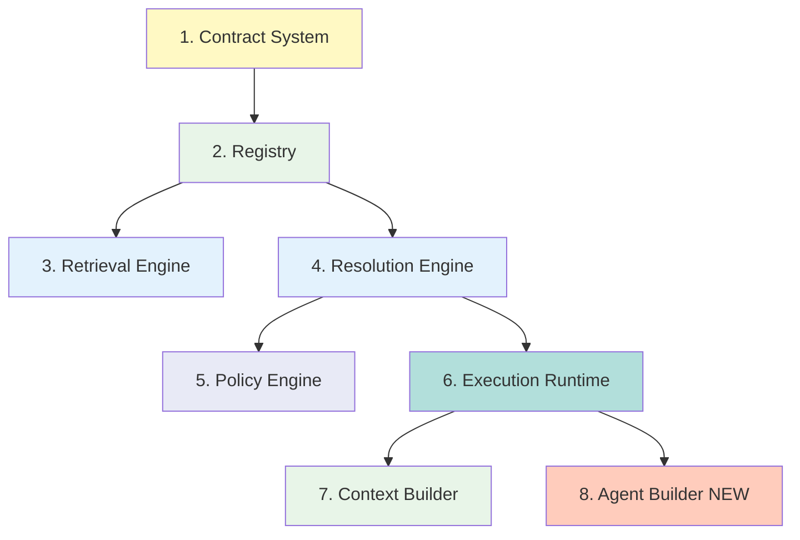
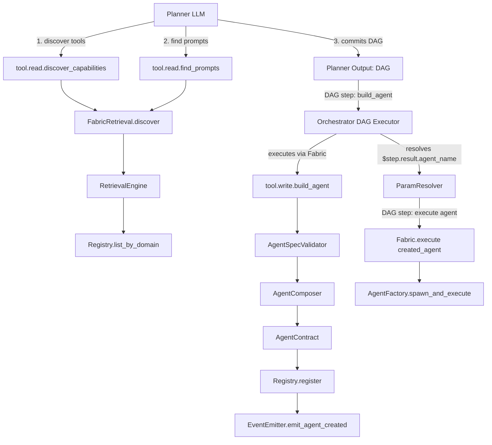

# Capability Fabric

> **The Heart of K1's Execution Engine**
> A deterministic, policy-driven capability resolution, retrieval, and execution system that powers tool invocation, agent spawning, workflow orchestration, and **meta-agent creation** across the FamilyOS cognitive kernel.

[](https://github.com/familyos/k1)
[](../docs/architecture/k1_cognitive_architecture_skeleton.mmd)
[](https://www.python.org/)
[](../../LICENSE)

---

## 📚 Table of Contents

- [What is Capability Fabric?](#-what-is-capability-fabric)
- [Three-Tier Capability Architecture](#-three-tier-capability-architecture)
- [Why Does It Exist?](#-why-does-it-exist)
- [Architecture Overview](#-architecture-overview)
- [Three Roles of Fabric](#-three-roles-of-fabric)
- [Meta-Agent Creation](#-meta-agent-creation)
- [Quick Start](#-quick-start)
- [Directory Structure](#-directory-structure)
- [Key Components](#-key-components)
- [API Reference](#-api-reference)
- [Execution Flows](#-execution-flows)
- [Invariants & Guarantees](#-invariants--guarantees)
- [Performance Targets](#-performance-targets)
- [Development Guide](#-development-guide)
- [Testing](#-testing)
- [Related Documentation](#-related-documentation)

---

## 🎯 What is Capability Fabric?

**Capability Fabric** is K1's central resolution, retrieval, and execution engine. It is the **single runtime** through which every tool invocation, agent spawn, workflow execution, and **dynamic agent creation** flows across the entire FamilyOS ecosystem.

### One-Sentence Definition

> Fabric resolves a capability name to a concrete provider, builds execution context from SessionState, executes the provider via the appropriate runtime (MCP, WASM, Bridge, Agent), and returns a structured result—all in <100ms overhead. **NEW**: Fabric also enables meta-agent creation where the Planner discovers capabilities and the Orchestrator dynamically composes and registers new specialist agents.

### What Fabric IS

✅ **A Capability Router** - Resolves capability names to concrete implementations
✅ **A Policy Engine** - Enforces safety, affective, cognitive, and QoS policies
✅ **A Context Builder** - Assembles execution context from SessionState
✅ **An Execution Runtime** - Coordinates 6 provider types (MCP, WASM, Bridge, Agent, Workflow, Concierge)
✅ **A Retrieval Engine** - Semantic search across 100K+ capabilities
✅ **An Agent Factory** - Spawns per-step workers with scoped LLM access
✅ **A Meta-Agent Creator** - Dynamically composes and registers specialist agents from discovered tools and prompts

### What Fabric is NOT

❌ **NOT an Orchestrator** - Orchestrator walks the DAG; Fabric executes individual steps
❌ **NOT a Planner** - Planner decides what to do; Fabric does what it's told
❌ **NOT an LLM** - Fabric is deterministic: lookup → filter → rank → route → execute
❌ **NOT a State Writer** - Fabric NEVER writes to SessionState (ADR-0017)

---

## 🏛️ Three-Tier Capability Architecture

Fabric enables a **hierarchical capability system** where meta-agents can create domain specialist agents on demand:

```
┌─────────────────────────────────────────────────────────────┐
│  Tier 3: Meta-Agent Creation (Planner + Orchestrator)       │
│  - Planner discovers tools/prompts (read-only)              │
│  - Orchestrator executes build_agent DAG steps via Fabric   │
│  - Safety band: AMBER (meta-operations)                     │
│  - Depth limit: 1 (agents cannot create agents)             │
└──────────────────────────┬──────────────────────────────────┘
                           │ creates
┌──────────────────────────┴──────────────────────────────────┐
│  Tier 2: Dynamic Agents (Runtime-Created Specialists)       │
│  - diabetes_companion (HEALTH + K0 access)                  │
│  - budget_analyzer (FINANCE + insurance lookup)             │
│  - travel_planner_europe (TRAVEL + multi-tool)              │
│  - email_drafter_monday (COMMUNICATION + scheduling)        │
└──────────────────────────┬──────────────────────────────────┘
                           │ uses
┌──────────────────────────┴──────────────────────────────────┐
│  Tier 1: Primitive Capabilities (Base Tools/Agents/Prompts) │
│  - tool.read.k0_recall (K0 memory queries)                  │
│  - tool.execute.send_email (MCP tool)                       │
│  - tool.read.weather_api (MCP tool)                         │
│  - agent.execute.invitation_sender (YAML template)          │
│  - prompt.compile.health_advisor_v2 (Prompt template)       │
└─────────────────────────────────────────────────────────────┘
```

### How It Works

1. **User**: "Can I afford my diabetes medication this month?"
2. **Concierge** → **Planner** (HIGH tier, multi-domain query)
3. **Planner** (via Fabric Role 1):
   - Discovers tools: `tool.read.discover_capabilities(domain=["HEALTH","FINANCE"])`
   - Discovers prompts: `tool.read.find_prompts(domain=["HEALTH"])`
   - Plans DAG with 2 specialist agents
4. **Orchestrator** executes DAG via Fabric:
   - **Step 1a**: `tool.write.build_agent` → creates `agent.execute.diabetes_companion`
   - **Step 1b**: `tool.write.build_agent` → creates `agent.execute.budget_analyzer`
   - **Step 2a**: Executes `diabetes_companion` → returns health analysis
   - **Step 2b**: Executes `budget_analyzer` → returns affordability analysis
   - **Step 3**: Merges results → returns to Concierge
5. **Concierge** synthesizes multi-domain answer with empathy

### Key Benefits

🎯 **Self-Improving System** - Planner plans specialized agents; Orchestrator creates them
🧠 **Domain Experts on Demand** - Healthcare, finance, travel agents composed as needed
⚡ **Reduced Planning Overhead** - Once created, agents handle recurring tasks directly
🔧 **Workflow Composition** - Missing workflow steps filled by dynamically composed agents
🔒 **Safe Meta-Operations** - AMBER band, depth=1, no recursive creation, strict validation

---

## 🚀 Why Does It Exist?

**The Problem**: Without Fabric, every component (Concierge, Orchestrator, Planner, Sub-Agents) would need to:
- Know how to find and select tools
- Understand MCP protocols, WASM sandboxes, Bridge routing
- Build execution context from SessionState
- Enforce safety policies and tool scoping
- Spawn and manage agents
- Handle circuit breakers and retries
- **NEW**: Discover capabilities, validate agent specs, compose agents dynamically

**The Solution**: Fabric centralizes all of that into **one well-tested subsystem**, so the rest of K1 can remain clean, focused, and maintainable.

### Key Benefits

🎯 **Separation of Concerns** - Coordination layer (Orchestrator) stays separate from execution layer
🔒 **Unified Policy Enforcement** - All executions go through the same safety checks
📊 **Observable Execution** - Every invocation traced with `cognitive_trace_id`
⚡ **High Performance** - <100ms overhead for resolution + context building
🧩 **Extensible** - New provider types (MCP, WASM, etc.) integrate via well-defined interfaces
🤖 **Meta-Programmable** - System can create its own capabilities on demand

---

## 🏗️ Architecture Overview

Fabric sits at **Layer 2.5** in the K1 Cognitive Architecture, between coordination (L2/L3) and execution (L4):

```
┌─────────────────────────────────────────────────────────┐
│  L1: Concierge (FSM, UltraBERT, Single Writer)         │
├─────────────────────────────────────────────────────────┤
│  L2: Orchestrator (Blind DAG Executor)                  │
├─────────────────────────────────────────────────────────┤
│  L2.5: 🔥 CAPABILITY FABRIC (THIS)                      │
│    ├── Role 1: Intelligent Retrieval (Planner)          │
│    ├── Role 2: Resolution & Execution (All Tiers)       │
│    ├── Role 3: Agent Factory (Spawning Workers)         │
│    └── NEW: Meta-Agent Creation (Tier 3)                │
├─────────────────────────────────────────────────────────┤
│  L3: Planner (LLM-Powered, 4-Stage Pipeline)            │
├─────────────────────────────────────────────────────────┤
│  L4: Sub-Agents (Spawned by Fabric)                     │
├─────────────────────────────────────────────────────────┤
│  L5: SessionState (12-Section, Multi-Reader)            │
├─────────────────────────────────────────────────────────┤
│  L6: Cross-Kernel Bridge (K0 Gateway)                   │
└─────────────────────────────────────────────────────────┘
```

### Request Flow by Tier

```
User Input
  ↓
🔹 LOW Tier:  Concierge → 🔥 FABRIC → Result → User
🔸 MED Tier:  Concierge → Orchestrator → 🔥 FABRIC (per step) → Result → User
🔺 HIGH Tier: Concierge → Planner → 🔥 FABRIC (discovery) → Plan
                                         ↓
                         Orchestrator → 🔥 FABRIC (build_agent + execute) → Result → User
```

### Core Subsystems

Fabric is composed of **8 major subsystems** working in concert:



**See**: [fabric.mmd](./fabric.mmd) for complete architectural diagram
**See**: [fabric_discussion.md](./fabric_discussion.md) for design document (26 sections)
**See**: [fabric-wiring-guide.md](../../docs/plans/fabric-wiring-guide.md) for end-to-end wiring
**See**: [meta-agent-creation-integration-proposal.md](../../docs/plans/meta-agent-creation-integration-proposal.md) for meta-agent design

---

## 🎭 Three Roles of Fabric

Fabric serves three **distinct, independent roles**. A single request uses either Role 1 OR Role 2, never both simultaneously. Role 3 is invoked by Role 2 when executing agent capabilities.

### Role 1: Intelligent Retrieval 🔍

**Who**: Planner (HIGH-tier tasks)
**When**: Discovery phase (Stages 1-2 of 4-stage planning pipeline)
**What**: Semantic search across 100K+ capabilities

```python
# Planner calls discovery tools (via Fabric execution)
result = await fabric.execute(CapabilityRequest(
    name="tool.read.discover_capabilities",
    params={
        "domain": ["HEALTH", "FINANCE"],
        "intent": "diabetes medication cost analysis",
        "safety_band": "GREEN",
        "top_k": 20
    }
))
# Returns: Top-20 capabilities with full schemas
```

**Pipeline**:
1. Embed query (< 5ms)
2. Hard filter (safety, availability, inputs) (< 2ms)
3. Soft rank (semantic × 0.4 + domain × 0.3 + success × 0.15 + cost/latency × 0.15) (< 10ms)
4. Top-K selection (< 1ms)
5. **Total**: < 20ms for 10K capabilities, < 50ms for 100K

**NEW**: Discovery results include **full contract schemas** (inputs, outputs, tools_granted, required_context) so Planner can inspect capabilities before composing agents.

---

### Role 2: Resolution & Execution ⚙️

**Who**: Concierge (LOW), Orchestrator (MED/HIGH), Sub-Agents
**When**: Every actual tool/agent execution
**What**: Resolve → Select → Build Context → Execute → Return

```python
# Execute a capability by exact name
result = await fabric.execute(
    CapabilityRequest(
        name="tool.execute.restaurant_booking",
        params={"date": "2026-02-15", "party_size": 4},
        session_id="user-123",
        trace_id="trace-abc"
    )
)
# Returns: CapabilityResult{success, data, error, duration_ms}
```

**Pipeline** (9 steps):
1. Emit `capability.invoked` event
2. **Resolve**: Registry.lookup(name) → Contract
3. **Select**: PolicyEngine → ProviderMatcher → ProviderSelector → Best provider
4. **Build Context**: ContextBuilder reads SessionState + resolves prompts
5. **Execute**: Provider.execute() via CircuitBreaker
6. **Validate**: 3-tier output validation (structural → schema → semantic)
7. Emit `capability.completed` event
8. Update metrics
9. Return result

**Overhead**: < 100ms (P95), < 500ms (max)

---

### Role 3: Agent Factory 🏭

**Who**: Plan steps with `agent.execute.*` or `agent.spawn.*` types
**When**: Complex tasks requiring LLM reasoning
**What**: Instantiate agents with scoped LLM + tools + state access

```python
# Fabric spawns agent from YAML template
result = await fabric.execute(
    CapabilityRequest(
        name="agent.execute.invitation_sender",
        params={"event": "birthday", "recipients": [...]},
        session_id="user-123"
    )
)
```

**8-Step Instantiation**:
1. Load YAML template (AgentContract from registry)
2. Create MPSC Mailbox (WFQ INTERACTIVE priority)
3. Grant LLM access via IModelGatewayPort
4. Grant SessionState read (declared sections, lock-free)
5. Scope tool access (`tools_granted[]`, strict enforcement)
6. Build initial context via ContextBuilder
7. Instantiate Agent object
8. Start lifecycle: PENDING → WARMING → ACTIVE

**Agent Lifecycle**:
```
PENDING → WARMING → ACTIVE → IDLE (pool, 60s TTL) → TERMINATED
                      ↓
                   DRAINING
```

**NEW**: Agents can be **ephemeral** (one-shot) or **persistent** (session-scoped, reusable). Dynamic agents created via `tool.write.build_agent` default to ephemeral.

---

## 🤖 Meta-Agent Creation

**NEW in Epic 4.5 (M4)**: Fabric enables dynamic agent composition where the Planner discovers capabilities (read-only) and the Orchestrator builds and executes specialist agents via DAG steps.

### Architecture: Planner (Read-Only) + Orchestrator (Executes DAG)

**Critical Constraint (PLAN-06)**: Planner NEVER writes. Meta-agent creation is an **Orchestrator DAG operation**, not a Planner operation.



### Key Components

#### 1. AgentSpecValidator (Issue 4.5.1)

Validates programmatic agent specifications before contract creation:

```python
class AgentSpecValidator:
    """
    Validates agent specs before build_agent execution.

    Validation Rules:
    - name follows agent.execute.* pattern
    - tools_granted[] all exist in registry
    - required_context sections valid
    - prompt_template exists (if specified)
    - domain tags valid
    - safety_band valid enum
    - token budgets in range [1024, 128000]
    """

    def validate(self, spec: Dict[str, Any]) -> ValidationResult:
        # Returns ValidationResult with errors list
        ...
```

#### 2. tool.write.build_agent (Issue 4.5.2)

MCP tool contract executed by Orchestrator via Fabric:

```yaml
name: "tool.write.build_agent"
domain: ["META", "AGENT_CREATION"]
safety_band_min: "AMBER"
provider_type: "MCP"

required_inputs:
  - agent_name (STRING)
  - description (STRING)
  - tools_granted (ARRAY[STRING])
  - prompt_template (STRING)
  - domain (ARRAY[STRING])

optional_inputs:
  - required_context (ARRAY[STRING])
  - llm_budget_tokens (INTEGER)
  - safety_band_min (STRING)
  - max_tool_calls (INTEGER)
  - ephemeral (BOOLEAN, default: true)

output:
  type: object
  properties:
    agent_name: {type: string}
    status: {type: string, enum: [registered, validation_failed]}
    errors: {type: array}
```

**Flow**:
1. Validate spec via AgentSpecValidator
2. Build AgentContract via AgentComposer
3. Register via Registry.register()
4. Emit `k1.fabric.agent.created.v1` event
5. Return `{agent_name, status, errors?}`

#### 3. AgentComposer (Issue 4.5.4)

Builder pattern for agent composition:

```python
class AgentComposer:
    """
    Fluent builder for agent composition.
    """

    def compose_agent(self, name: str, description: str, domain: List[str]):
        """Start composition"""

    def add_tool(self, tool_name: str):
        """Add tool to tools_granted[]"""

    def set_prompt(self, template: str):
        """Set prompt template"""

    def set_context(self, sections: List[str]):
        """Set required_context"""

    def build(self) -> AgentContract:
        """Build final contract"""

    # Factory methods
    @staticmethod
    def from_discovery_result(capabilities, intent) -> AgentComposer:
        """Auto-select top-K tools from discovery result"""
```

#### 4. AgentResponsePayload (Issue 4.5.8)

Standard payload from specialist agents to Concierge:

```python
@dataclass(frozen=True)
class AgentResponsePayload:
    """
    Envelope + freeform payload for specialist agent output.
    Supports infinite domains without rigid schemas.
    """

    # Core content
    answer: str                    # Dense factual content for Concierge
    confidence: float              # 0.0-1.0
    domain: List[str]              # Domain tags

    # Evidence
    sources: List[Dict[str, Any]]  # Citations (K0, tools, beliefs)

    # Domain-specific structured data (FREEFORM)
    domain_data: Dict[str, Any]    # Health agent: glucose_trend, medication_schedule
                                   # Finance agent: affordability, budget_remaining

    # Metadata
    follow_up_needed: bool         # Agent recommends further investigation
    follow_up_suggestion: str      # What to investigate next
    reasoning_trace: List[str]     # Steps agent took (observability)
    tools_used: List[str]          # Which tools invoked
    k0_queries_made: int           # K0 recall count
```

### Safety Rules (Issue 4.5.5)

Meta-operation policy gates enforced by SecurityContext:

1. **AMBER Band Minimum**: `tool.write.build_agent` requires SafetyBand.AMBER
2. **Safety Inheritance**: Created agents inherit creator's max safety band (no escalation)
3. **Restricted Domains**: Agents cannot create agents with domain=["META", "SECURITY", "ADMIN"]
4. **No Recursive Creation**: Created agent's `tools_granted[]` cannot include `tool.write.build_agent`
5. **Depth=1 Enforcement**: Agents CANNOT invoke other agents (leaf nodes only, Planner plans all agents upfront)

Violations emit `k1.fabric.meta.operation.blocked.v1` event.

### Lifecycle: Ephemeral vs Persistent (Issue 4.5.6)

```python
# Default: Ephemeral (one-shot)
PENDING → WARMING → ACTIVE → (execute) → TERMINATED

# Optional: Persistent (session-scoped)
PENDING → WARMING → ACTIVE → (execute) → IDLE (pool) → (reuse) → ACTIVE
                                                               ↓
                                                          TERMINATED (session end)
```

**Lifecycle metadata** added to CapabilityContract:
- `ephemeral: bool` (default: true)
- `created_by: str` (planner/user)
- `created_at: str` (ISO timestamp)
- `session_scoped: bool`

Persistent agents optionally write to `k1/contracts/agents/generated/{name}.yaml`.

### Events (Issue 4.5.7)

New event types:

```python
@dataclass(frozen=True)
class AgentCreatedEvent:
    agent_name: str
    created_by: str  # "planner" | "user" | agent_id
    tools_granted: List[str]
    domain: List[str]
    prompt_template: str
    ephemeral: bool
    session_id: str
    trace_id: str
    timestamp: str

@dataclass(frozen=True)
class AgentExpiredEvent:
    agent_name: str
    created_at: str
    expired_at: str
    invocations: int
    trace_id: str

@dataclass(frozen=True)
class MetaOperationBlockedEvent:
    operation: str  # "build_agent" | "agent_invocation"
    violation: str  # "recursive_creation" | "domain_restricted" | "safety_escalation" | "depth_exceeded"
    requested_by: str
    details: Dict[str, Any]
    trace_id: str
```

### Example: Diabetes Medication Affordability

```python
# User: "Can I afford my diabetes medication this month?"

# Planner discovers capabilities (read-only)
discovery_result = await fabric.execute(CapabilityRequest(
    name="tool.read.discover_capabilities",
    params={
        "domain": ["HEALTH", "MEDICAL"],
        "intent": "glucose tracking health data medication",
        "top_k": 20
    }
))

# Planner commits DAG (does NOT execute build_agent directly)
dag = {
    "step_1a": {
        "capability": "tool.write.build_agent",
        "params": {
            "agent_name": "agent.execute.diabetes_companion",
            "description": "Personal diabetes management with K0 health data",
            "domain": ["HEALTH", "MEDICAL", "DIABETES"],
            "tools_granted": [
                "tool.read.k0_recall",
                "tool.read.health_metrics",
                "tool.read.glucose_tracker",
                "tool.read.medication_schedule"
            ],
            "prompt_template": "health_advisor_v2",  # discovered, not inline
            "required_context": ["beliefs_active", "interaction_history", "task_context"],
            "safety_band_min": "AMBER",
            "llm_budget_tokens": 8192,
            "ephemeral": True
        }
    },
    "step_1b": {
        "capability": "tool.write.build_agent",
        "params": {
            "agent_name": "agent.execute.budget_analyzer",
            "description": "Budget analysis for healthcare costs",
            "domain": ["FINANCE", "HEALTH"],
            "tools_granted": ["tool.read.k0_recall", "tool.read.budget_calculator"],
            "prompt_template": "finance_advisor_v1",
            "safety_band_min": "GREEN",
            "llm_budget_tokens": 4096
        }
    },
    "step_2a": {
        "capability": "$step_1a.result.agent_name",  # Dynamic resolution!
        "params": {"query": "How are my glucose levels trending?"},
        "depends_on": ["step_1a"]
    },
    "step_2b": {
        "capability": "$step_1b.result.agent_name",
        "params": {"query": "Can user afford diabetes medication?"},
        "depends_on": ["step_1b"]
    },
    "step_3": {
        "type": "merge_results",
        "depends_on": ["step_2a", "step_2b"]
    }
}

# Orchestrator executes DAG via Fabric:
# - step_1a & step_1b run in parallel → agents registered
# - ParamResolver resolves $step_1a.result.agent_name → "agent.execute.diabetes_companion"
# - step_2a & step_2b run in parallel → agents execute
# - step_3 merges AgentResponsePayload objects
# - Concierge synthesizes multi-domain answer
```

**Timeline**:
- Discovery (step 1-2): ~100ms (Planner read-only)
- DAG commit: ~50ms
- Build agents (step 1a+1b): ~200ms (parallel validation + registration)
- Execute agents (step 2a+2b): ~3-5s (parallel agent execution)
- **Total**: ~3.5s from request to answer

---

## 🚀 Quick Start

### Installation

```bash
# Fabric is part of the K1 kernel
cd k1/fabric

# Install dependencies
poetry install

# Or with pip
pip install -e ".[dev]"
```

### Basic Usage

```python
from k1.fabric import FabricFactory
from k1.fabric.types import CapabilityRequest, SafetyBand

# 1. Create Fabric instance (standalone mode for testing)
fabric = FabricFactory.create_standalone()

# 2. Execute a capability
result = await fabric.execute(
    CapabilityRequest(
        name="tool.execute.weather_api",
        params={"location": "San Francisco"},
        session_id="test-session",
        trace_id="test-trace-001"
    )
)

print(f"Success: {result.success}")
print(f"Data: {result.data}")
print(f"Duration: {result.duration_ms}ms")
```

### For Testing

```python
# Testing mode (with event capture)
fabric = FabricFactory.create_for_testing(capture_events=True)

result = await fabric.execute(request)

# Assert on captured events
events = fabric.event_port.get_captured_events()
assert any(e.type == "k1.capability.invoked.v1" for e in events)
```

### For Production

```python
# Production mode (with custom ports)
fabric = FabricFactory.create_with_ports(
    state_reader=SessionStateReaderAdapter(session_manager),
    event_port=ProductionEventPort(k1_event_bus),
    bridge=BridgeConnectionAdapter(bridge_client),
    model_gateway=ModelGatewayAdapter(model_hub),
    prompt_system=PromptSystemAdapter(prompt_manager),
    delta_bus=DeltaBusAdapter(delta_bus),
    production_mode=True  # Adds FabricMailbox for bounded parallelism
)
```

---

## 📂 Directory Structure

```
k1/fabric/
├── README.md                       # 👈 YOU ARE HERE
├── fabric.mmd                      # Architecture diagram (Mermaid)
├── fabric_discussion.md            # Design document (26 sections)
│
├── __init__.py                     # Public API exports
├── types.py                        # Core types (CapabilityRequest, CapabilityResult, AgentResponsePayload, etc.)
│
├── adapters/                       # Hexagonal Architecture: Adapters
│   ├── __init__.py
│   ├── local_event.py             # Test event adapter (synchronous)
│   ├── sessionstate_reader.py     # Production SessionState adapter
│   ├── test_bridge.py             # Test Bridge adapter (canned responses)
│   ├── test_model_gateway.py      # Test LLM adapter
│   ├── test_prompt_system.py      # Test prompt adapter
│   └── test_state_reader.py       # Test SessionState adapter (in-memory)
│
├── circuit_breaker/                # Fault isolation (per-provider CBs)
│   ├── __init__.py
│   ├── breaker.py                 # CircuitBreaker FSM (CLOSED → OPEN → HALF_OPEN)
│   └── breaker_config.py          # Per-provider timeout configs
│
├── concurrency/                    # Bounded parallelism & timeout guards
│   ├── __init__.py
│   ├── dispatcher.py              # FabricMailbox (WFQ, backpressure)
│   └── timeout.py                 # TimeoutGuard (deadline enforcement)
│
├── contracts/                      # Contract parsers (YAML → Objects)
│   ├── __init__.py
│   ├── agent_contract.py          # AgentContract parser
│   ├── prompt_contract.py         # PromptContract parser
│   ├── tool_contract.py           # ToolContract parser
│   └── workflow_contract.py       # WorkflowContract parser
│
├── core/                           # Core subsystems
│   ├── __init__.py
│   ├── agent_builder.py           # 🆕 AgentSpecValidator, AgentComposer (Epic 4.5.1, 4.5.4)
│   ├── context_budget.py          # Token budget manager (128K ceiling)
│   ├── context_builder.py         # ExecutionContext assembly (6-step)
│   ├── contract_validator.py      # 12-rule contract validation
│   ├── module_loader.py           # YAML loader + hot-reload watcher
│   └── registry.py                # CapabilityRegistry (5 indexes, O(1) lookup)
│
├── health/                         # Health monitoring
│   ├── __init__.py
│   ├── availability_tracker.py    # ONLINE/DEGRADED/OFFLINE tracking
│   └── health_checker.py          # Periodic health checks (30s interval)
│
├── output_validation/              # 3-tier output validation
│   ├── __init__.py
│   ├── pipeline.py                # OutputValidationPipeline orchestrator
│   ├── schema_validator.py        # Tier 2: Schema validation (JSON Schema)
│   ├── semantic_validator.py      # Tier 3: Hallucination detection
│   ├── structural_validator.py    # Tier 1: Structural validation (required fields)
│   └── validation_fallback.py     # Fallback strategies
│
├── policy/                         # Policy Engine (4 dimensions + meta-operations)
│   ├── __init__.py
│   ├── affective_routing.py       # Dimension 2: Emotion-aware routing
│   ├── cognitive_load_routing.py  # Dimension 3: Cognitive load routing
│   ├── policy_engine.py           # PolicyEngine orchestrator
│   ├── qos_integration.py         # Dimension 4: Budget/latency routing
│   ├── security_context.py        # Dimension 1: Safety band (HARD GATE) + meta-op rules 🆕
│   └── tool_scope.py              # Sub-agent tool scoping (FAB-07)
│
├── ports/                          # Hexagonal Architecture: Port Interfaces
│   ├── __init__.py
│   ├── bridge_port.py             # IBridgePort (K0 Cross-Kernel Bridge)
│   ├── delta_bus.py               # IDeltaBusPort (Agent delta emission)
│   ├── event_port.py              # IEventPort (Event Bus pub/sub)
│   ├── model_gateway.py           # IModelGatewayPort (LLM access)
│   ├── prompt_system.py           # IPromptSystemPort (Template resolution)
│   └── state_reader.py            # ISessionStateReader (Read-only SessionState)
│
├── provider_resolution/            # Resolution Engine (5-step pipeline)
│   ├── __init__.py
│   ├── provider_factory.py        # ProviderFactory (instantiate providers)
│   ├── provider_matcher.py        # ProviderMatcher (find candidates)
│   ├── provider_registry.py       # ProviderRegistry (provider_id → config)
│   ├── provider_selector.py       # ProviderSelector (best provider)
│   └── resolver.py                # Resolver (complete 5-step pipeline)
│
├── providers/                      # Execution Runtime (6 provider types)
│   ├── __init__.py
│   ├── agent_provider.py          # AgentProvider + AgentFactory + Agent + AgentPool
│   ├── base_provider.py           # CapabilityProvider protocol
│   ├── bridge_provider.py         # BridgeProvider (K0 operations)
│   ├── concierge_provider.py      # ConciergeProvider (FSM routing)
│   ├── mcp_provider.py            # MCPProvider (MCP tool execution, includes build_agent 🆕)
│   ├── wasm_provider.py           # WASMProvider (WASM sandboxed computation)
│   └── workflow_provider.py       # WorkflowProvider (frozen DAG rehydration)
│
└── retrieval/                      # Semantic Retrieval Engine (4-step pipeline)
    ├── __init__.py
    ├── embedding_index.py         # EmbeddingIndex (FAISS, cosine similarity)
    ├── hard_filter.py             # HardFilter (safety, availability, inputs)
    ├── retrieval_engine.py        # RetrievalEngine (complete pipeline)
    ├── soft_ranker.py             # SoftRanker (composite scoring)
    └── top_k_selector.py          # TopKSelector (default K=10, max K=25)
```

### Missing Files (To Be Implemented - Epic 5.3)

```
k1/fabric/
├── factory.py                      # ❌ TODO: FabricFactory (20-step construction)
├── fabric.py                       # ❌ TODO: CapabilityFabric, FabricRetrieval, CapabilityRegistryAPI
└── events/
    └── event_emitter.py            # ❌ TODO: EventEmitter (trace_id enforcement, 🆕 meta events)
```

**See**: [fabric-wiring-guide.md](../../docs/plans/fabric-wiring-guide.md) for implementation checklist
**See**: [meta-agent-creation-integration-proposal.md](../../docs/plans/meta-agent-creation-integration-proposal.md) for Epic 4.5 details

---

## 🧩 Key Components

### 1. CapabilityRegistry (Core Hub)

**Purpose**: In-memory indexed catalog of all capabilities (tools, agents, prompts, workflows)

**5 Indexes**:
```python
by_name: Dict[str, CapabilityContract]         # O(1) exact lookup
by_domain: Dict[str, List[str]]                 # Inverted index for domain queries
by_type: Dict[str, List[str]]                   # Grouped by type prefix
by_version: Dict[str, Dict[Version, Contract]]  # Version-aware lookup
by_provider: Dict[str, List[str]]               # Grouped by provider_id
```

**Key Operations**:
- `register(contract)` - Add new capability (validates first)
- `lookup(name, version?)` - O(1) exact match
- `list_by_domain(domain)` - Domain-filtered list
- `update_availability(name, status)` - Update availability status
- `update_metrics(name, latency, success)` - Update running averages
- **NEW**: `list_created_agents()` - List dynamically created agents (Issue 4.5.6)

**Thread Safety**: RLock guards all mutations
**Scale**: Designed for 100K+ capabilities

---

### 2. PolicyEngine (Security & Routing)

**Purpose**: 4-dimensional provider selection with hard safety gate + meta-operation rules

**Dimensions**:
1. **SecurityContext (HARD GATE)** - Runs FIRST, fail = immediate reject
   - Checks: `user_band >= capability.safety_band_min`
   - Band ordering: GREEN < AMBER < RED < CRISIS
   - **NEW**: Meta-operation gates (4.5.5):
     - `tool.write.build_agent` requires AMBER
     - No recursive creation (tools_granted validation)
     - No agent-to-agent invocation (depth=1)
     - Domain restrictions (no META/SECURITY/ADMIN agents)

2. **AffectiveRouting (Soft Score: 0.0-0.2)** - Emotion-aware provider selection
   - High sadness/anxiety → gentler providers (+0.1)
   - High joy → detail-rich providers (+0.05)

3. **CognitiveLoadRouting (Soft Score: 0.0-0.15)** - Load-aware routing
   - High load → faster/simpler providers (+0.1)
   - Low load → comprehensive providers (+0.05)

4. **QoSIntegration (Soft Score: 0.0-0.2)** - Budget/latency-aware
   - Tight budget → cheaper providers (0.8 weight)
   - Tight latency → faster providers (0.8 weight)

**Composite Score**:
```
final_score = base_relevance + affective + cognitive + qos
```

**Deterministic** (FAB-10): Same inputs + same registry state = same provider

---

### 3. ContextBuilder (SessionState → ExecutionContext)

**Purpose**: Assembles execution context for providers from SessionState + prompts

**6-Step Pipeline**:
```python
1. Read contract requirements (required_context + optional_context)
2. Fetch from SessionState (multi-reader, lock-free)
3. Inject request params
4. Resolve prompt templates (via IPromptSystemPort)
5. Apply token budget (128K ceiling, compression strategies)
6. Package ExecutionContext
```

**Token Budget**:
- System prompt: 2K-5K
- Compiled prompt: 500-2K
- SessionState sections: 10K-40K
- Request params: 1K-5K
- Tool results: 5K-20K
- Response headroom: 2K-8K
- **CEILING**: 128K tokens (FAB-08)

**Compression Strategies** (5 levels):
1. Drop optional_context
2. Truncate history_recent (keep last 3 turns)
3. Summarize beliefs_active (drop low-confidence)
4. Summarize scoreboard (keep current QUD)
5. Emergency: drop WARM, keep HOT only

**NEW**: Dynamic agents get **full session context** by default (`required_context: ["beliefs_active", "interaction_history", "task_context", "rhythm_state"]`) for cross-domain understanding.

---

### 4. CircuitBreaker (Fault Isolation)

**Purpose**: Per-provider fault isolation with retry logic

**States**: CLOSED → OPEN (fail threshold) → HALF_OPEN → CLOSED/OPEN

**Per-Provider Configs**:
```python
MCP local:   timeout=10s, failure_threshold=3/min, retry_max=2
MCP remote:  timeout=15s, failure_threshold=3/min, retry_max=2
WASM:        timeout=5s,  failure_threshold=5/min, retry_max=2
Bridge:      timeout=10s, failure_threshold=3/min, retry_max=2
Agent:       timeout=30s, failure_threshold=2/min, retry_max=2
Workflow:    timeout=60s, failure_threshold=1/min, retry_max=1
Default:     timeout=30s, failure_threshold=5/min, retry_max=2
```

**Bidirectional with HealthChecker**:
- CB OPEN → trigger immediate health check
- Health success → signal CB HALF_OPEN

---

### 5. RetrievalEngine (Semantic Search)

**Purpose**: Role 1 - Semantic search for Planner discovery tools

**4-Step Pipeline**:
```python
1. Embed query (< 5ms)
2. Hard filter (safety, availability, inputs) (< 2ms)
   - ANY hard rule fail = eliminated
3. Soft rank (composite scoring) (< 10ms)
   - 0.4 × semantic_similarity
   - 0.3 × domain_match
   - 0.15 × success_rate_30d
   - 0.15 × cost_latency_score
   - DEGRADED penalty: × 0.7
4. Top-K selection (< 1ms)
```

**Performance**:
- 10K capabilities: < 20ms
- 100K capabilities: < 50ms

**Embedding Index**:
- FAISS (Flat L2 for <10K, IVF for >10K)
- Text: `f"{contract.description} | {' '.join(contract.capabilities)}"`
- Incremental updates on register/unregister

**NEW**: Discovery results include **full contract schemas** (inputs, outputs, tools_granted, required_context, prompt_template) for Planner agent composition.

---

### 6. AgentFactory (Per-Step Worker Spawning)

**Purpose**: Role 3 - Instantiate agents from YAML templates or dynamic specs

**8-Step Instantiation** (see [Role 3](#role-3-agent-factory-) above)

**Agent Lifecycle**:
```
PENDING → WARMING (model preload) → ACTIVE (execute task)
            ↓
       IDLE (pool, 60s TTL) ←→ ACTIVE (reuse)
            ↓
       DRAINING → TERMINATED
```

**Agent Pool**:
- Max size: 5 (configurable)
- Idle TTL: 60s
- Sweep interval: 15s
- Thread-safe: RLock
- Hit = reuse without warm_up

**NEW**: Supports both YAML templates (Tier 1 agents) and dynamic specs (Tier 2 agents created via `tool.write.build_agent`). Dynamic agents default to ephemeral=true.

---

### 7. AgentBuilder (Meta-Agent Creation) 🆕

**Purpose**: Validate and compose dynamic agent specifications (Epic 4.5)

**Components**:

#### AgentSpecValidator (Issue 4.5.1)
```python
class AgentSpecValidator:
    """
    Validates agent specs before contract creation.

    Rules:
    1. name follows agent.execute.* pattern
    2. tools_granted[] all exist in registry
    3. required_context sections valid
    4. prompt_template exists (if specified)
    5. domain tags valid
    6. safety_band valid enum
    7. token budgets in range [1024, 128000]
    8. No recursive creation (tools_granted cannot include build_agent)
    9. Domain restrictions (no META/SECURITY/ADMIN)
    """

    def validate(self, spec: Dict[str, Any]) -> ValidationResult:
        """
        Returns ValidationResult with:
        - success: bool
        - errors: List[str]
        - warnings: List[str]
        """
```

#### AgentComposer (Issue 4.5.4)
```python
class AgentComposer:
    """
    Builder pattern for agent composition.
    """

    def compose_agent(self, name: str, description: str, domain: List[str]) -> 'AgentComposer':
        """Start composition"""

    def add_tool(self, tool_name: str) -> 'AgentComposer':
        """Add tool to tools_granted[]"""

    def set_prompt(self, template: str) -> 'AgentComposer':
        """Set prompt template (discovered from Prompt Registry)"""

    def set_context(self, sections: List[str]) -> 'AgentComposer':
        """Set required_context"""

    def set_safety_band(self, band: SafetyBand) -> 'AgentComposer':
        """Set safety_band_min"""

    def build(self) -> AgentContract:
        """Build final contract (validates via AgentSpecValidator)"""

    # Factory methods
    @staticmethod
    def from_discovery_result(
        capabilities: List[ScoredCapability],
        intent: str,
        top_k: int = 5
    ) -> AgentComposer:
        """
        Auto-select top-K tools from discovery result.
        Extracts tools_granted[], infers domain from tools,
        sets safety_band_min to max of tools' bands.
        """
```

**Usage**:
```python
# In tool.write.build_agent implementation:
validator = AgentSpecValidator(registry)
result = validator.validate(params)

if result.success:
    composer = AgentComposer()
    contract = (composer
        .compose_agent(params["agent_name"], params["description"], params["domain"])
        .add_tool("tool.read.k0_recall")
        .add_tool("tool.read.health_metrics")
        .set_prompt("health_advisor_v2")
        .set_context(["beliefs_active", "interaction_history"])
        .set_safety_band(SafetyBand.AMBER)
        .build())

    registry.register(contract)
    event_emitter.emit_agent_created(contract)
```

---

## 📡 API Reference

### Main API: `CapabilityFabric`

**Location**: `k1/fabric/fabric.py` (❌ TODO - Epic 5.3.2)

```python
class CapabilityFabric:
    """
    Main execution API (Role 2).
    Stateless, deterministic, policy-driven capability execution.
    """

    async def execute(
        self,
        request: CapabilityRequest
    ) -> CapabilityResult:
        """
        Execute a single capability request.

        Pipeline (9 steps):
        1. Emit invoked event
        2. Resolve provider (Registry → Policy → Selector → Factory)
        3. Build context (SessionState + prompts + budget)
        4. Execute via CircuitBreaker
        5. Validate output (3-tier pipeline)
        6. Emit completed/failed event
        7. Update metrics
        8. Emit learning signal
        9. Return result

        Args:
            request: CapabilityRequest with name, params, session_id, trace_id

        Returns:
            CapabilityResult with success, data, error, duration_ms

        Raises:
            CapabilityNotFoundError: If capability name not in registry
            AccessDeniedError: If security policy rejects request
            CircuitBreakerOpenError: If provider circuit breaker is open

        NEW: Supports tool.write.build_agent for meta-agent creation
        """
        ...

    async def execute_batch(
        self,
        requests: List[CapabilityRequest],
        strategy: BatchStrategy = BatchStrategy.PARALLEL
    ) -> List[CapabilityResult]:
        """
        Execute batch of requests with specified strategy.

        BatchStrategy:
        - PARALLEL: All at once (default)
        - SEQUENTIAL: Ordered execution
        - DAG: Dependency-aware (for Orchestrator wave execution)

        Partial failure handling:
        - Each request independent
        - Failed requests return CapabilityResult.failure()
        - Does NOT block other requests

        Ordering guarantee:
        - Results list matches input order (regardless of execution order)

        Backpressure:
        - Batch size capped at max_batch_size (default 50)

        Critical for: Orchestrator DAG wave execution where multiple
        capabilities execute in a single wave.
        """
        ...
```

---

### Retrieval API: `FabricRetrieval`

**Location**: `k1/fabric/fabric.py` (❌ TODO - Epic 5.3.3)

```python
class FabricRetrieval:
    """
    Retrieval API (Role 1).
    Separate class for capability discovery.
    """

    async def discover_capabilities(
        self,
        domain: str,
        intent: str,
        safety_band: SafetyBand,
        session_context: Dict[str, Any],
        top_k: int = 10
    ) -> RetrievalResult:
        """
        Discover capabilities matching domain + intent.

        Pipeline:
        1. Embed query (domain + intent)
        2. HardFilter (safety, availability, input satisfiability)
        3. SoftRank (semantic + domain + success + cost/latency)
        4. TopK selection

        Returns: RetrievalResult with list[ScoredCapability]

        NEW (Issue 4.5.3): Returns full contract schemas including:
        - inputs/outputs
        - tools_granted
        - required_context
        - prompt_template

        This enables Planner to inspect capabilities before composing agents.
        """
        ...

    async def find_relevant_prompts(
        self,
        intent: str,
        domain: str,
        safety_band: SafetyBand,
        top_k: int = 10
    ) -> RetrievalResult:
        """
        Find relevant prompt templates for intent.

        Same pipeline as discover_capabilities, but filters for
        PromptContract types only.

        NEW (Issue 4.5.3): Critical for meta-agent creation.
        Planner discovers prompt templates from Prompt Registry.
        No inline prompt composition (security + quality).
        """
        ...
```

**NEW**: These are also exposed as **MCP-callable tools** (Issue 4.5.3):
- `tool.read.discover_capabilities` - Wraps `FabricRetrieval.discover_capabilities()`
- `tool.read.find_prompts` - Wraps `FabricRetrieval.find_relevant_prompts()`

---

### Registry API: `CapabilityRegistryAPI`

**Location**: `k1/fabric/fabric.py` (❌ TODO - Epic 5.3.4)

```python
class CapabilityRegistryAPI:
    """
    Registry management API.
    Thin wrapper over core Registry.
    """

    def register(self, contract: CapabilityContract) -> None:
        """
        Register capability (validates first).

        NEW: Supports dynamic agent registration via build_agent.
        Tracks created_by, created_at, ephemeral metadata.
        """
        ...

    def unregister(self, name: str) -> None:
        """
        Unregister capability.

        NEW: Ephemeral agents auto-unregister on session end.
        """
        ...

    def lookup(self, name: str, version: Optional[Version] = None) -> CapabilityContract:
        """O(1) exact lookup"""
        ...

    def list_by_domain(self, domain: str) -> List[CapabilityContract]:
        """List all capabilities in domain"""
        ...

    def update_availability(self, name: str, status: Availability) -> None:
        """Update availability status"""
        ...

    def update_metrics(self, name: str, latency_ms: float, success: bool) -> None:
        """Update running metrics"""
        ...

    def health(self) -> RegistryHealth:
        """Registry health snapshot"""
        ...

    # NEW (Issue 4.5.6)
    def list_created_agents(self) -> List[AgentContract]:
        """
        List dynamically created agents (ephemeral + persistent).
        Returns agents with created_by metadata.
        """
        ...
```

---

### Factory API: `FabricFactory`

**Location**: `k1/fabric/factory.py` (❌ TODO - Epic 5.3.1)

```python
class FabricFactory:
    """
    Composition root for Fabric.
    Wires all subsystems in dependency-safe order.
    """

    @staticmethod
    def create_standalone() -> Fabric:
        """
        Create Fabric with all test adapters.
        No external dependencies (SessionState, Bridge, LLM, etc.)

        Usage: Unit tests, examples, local development
        """
        ...

    @staticmethod
    def create_for_testing(capture_events: bool = True) -> Fabric:
        """
        Create Fabric with test adapters + event capture mode.

        Usage: Integration tests, contract tests, test assertions on events
        """
        ...

    @staticmethod
    def create_with_ports(
        state_reader: ISessionStateReader,
        event_port: IEventPort,
        bridge: IBridgePort,
        model_gateway: IModelGatewayPort,
        prompt_system: IPromptSystemPort,
        delta_bus: IDeltaBusPort,
        production_mode: bool = False
    ) -> Fabric:
        """
        Create Fabric with custom adapter injection.

        Args:
            production_mode: If True, adds FabricMailbox for bounded parallelism

        Usage: Production deployment with live SessionState, K0 Bridge, LLM access
        """
        ...
```

**See**: [fabric-wiring-guide.md](../../docs/plans/fabric-wiring-guide.md) for 20-step construction order

---

## 🔄 Execution Flows

### Flow 1: LOW Tier (Concierge Direct)

```
User: "Book a table for 4 at 7pm tomorrow"
  ↓
Concierge DISPATCHING
  ↓
Concierge LLM calls invoke_capability()
  ↓
ToolDispatcher → IDispatchPort → FabricOrchAdapter
  ↓
🔥 FABRIC.execute(
    name="tool.execute.restaurant_booking",
    params={"date": "2026-02-15", "party_size": 4}
)
  ↓
1. Registry.lookup("tool.execute.restaurant_booking")
2. PolicyEngine.evaluate() → MCPProvider selected
3. ContextBuilder.build() → reads beliefs_active, temporal_context
4. MCPProvider.execute() via CircuitBreaker (10s timeout)
5. OutputValidation (3-tier)
6. Return CapabilityResult
  ↓
Concierge COMPANIONING
  ↓
Concierge DELIVERING: "Reserved table at Blue Hill for 4 at 7pm on Feb 15"
```

**Latency**: < 2s total (Fabric < 1.5s)

---

### Flow 2: HIGH Tier (Planner + Orchestrator)

```
User: "Plan my son's birthday party next month"
  ↓
Concierge DISPATCHING → Orchestrator (HIGH tier)
  ↓
Orchestrator → Planner
  ↓
Planner Stage 1: SKETCH
  ↓
Planner LLM calls discover_capabilities(domain="events", intent="party_planning")
  ↓
🔥 FABRIC.execute(name="tool.read.discover_capabilities", ...) (Role 1: Retrieval)
  ↓
1. Embed query
2. Hard filter (safety, availability)
3. Soft rank (semantic + domain + success + cost/latency)
4. Top-K selection (K=10)
5. Return RetrievalResult with Top-10 capabilities + full schemas
  ↓
Planner Stage 2: EXPAND (builds CommittedPlan with steps)
  ↓
Orchestrator receives CommittedPlan
  ↓
Orchestrator walks DAG (topological order)
  ↓
For each step:
  🔥 FABRIC.execute() (Role 2: Execution)
  ↓
  1. Registry.lookup(step.capability_name)
  2. PolicyEngine → select provider
  3. ContextBuilder → build context
  4. Provider.execute() (MCP/WASM/Agent)
  5. OutputValidation
  6. Return CapabilityResult
  ↓
Orchestrator aggregates all step results
  ↓
Concierge COMPANIONING → DELIVERING: "Birthday party planned! Here's the timeline..."
```

**Latency**: 10-60s (HIGH tier budget)
**Fabric Calls**: 1 retrieval + N executions (N = number of steps)

---

### Flow 3: Agent Spawning (Role 3)

```
Orchestrator Step: "Send personalized invitations"
  ↓
🔥 FABRIC.execute(
    name="agent.execute.invitation_sender",
    params={"event": "birthday", "recipients": [...]},
)
  ↓
1. Registry.lookup("agent.execute.invitation_sender")
2. PolicyEngine → AgentProvider selected
3. AgentFactory.spawn_and_execute() (8-step instantiation)
   ↓
   a. Load YAML template
   b. Create MPSC Mailbox
   c. Grant LLM access (via IModelGatewayPort)
   d. Grant SessionState read (beliefs_active, entities)
   e. Scope tools (tools_granted: [send_message, contact_lookup])
   f. Build initial context (via ContextBuilder)
   g. Instantiate Agent
   h. Start lifecycle: PENDING → WARMING → ACTIVE
4. Agent.execute()
   ↓
   Agent's own LLM reasons through task
   Agent calls invoke_capability("tool.execute.send_message") [scoped]
     ↓
     🔥 FABRIC.execute() (recursive, same path)
     ↓
   Agent emits deltas to IDeltaBusPort (for Concierge FSM)
   Agent returns CapabilityResult
5. OutputValidation
6. Return CapabilityResult to Orchestrator
  ↓
Orchestrator continues to next step
```

**Agent Lifecycle**: ACTIVE → IDLE (pooled, 60s TTL) → reused or TERMINATED

---

### Flow 4: Meta-Agent Creation (Tier 3) 🆕

```
User: "Can I afford my diabetes medication this month?"
  ↓
Concierge DISPATCHING → Orchestrator (HIGH tier, multi-domain)
  ↓
Orchestrator → Planner
  ↓
Planner Stage 1: SKETCH
  ↓
Planner LLM: "This requires HEALTH + FINANCE expertise. I'll create 2 specialist agents."
  ↓
Planner LLM calls tool.read.discover_capabilities(domain=["HEALTH"], ...)
  ↓
🔥 FABRIC.execute(name="tool.read.discover_capabilities", ...)
  ↓
1. RetrievalEngine.discover() → Top-20 health tools with full schemas
2. Return: [tool.read.k0_recall, tool.read.health_metrics, ...]
  ↓
Planner LLM calls tool.read.find_prompts(domain=["HEALTH"], ...)
  ↓
🔥 FABRIC.execute(name="tool.read.find_prompts", ...)
  ↓
1. RetrievalEngine.discover() → Top-5 health prompt templates
2. Return: [health_advisor_v2, diabetes_companion_v1, ...]
  ↓
Planner Stage 2: EXPAND
  ↓
Planner commits DAG with 5 steps:
  step_1a: tool.write.build_agent (diabetes_companion)
  step_1b: tool.write.build_agent (budget_analyzer)
  step_2a: $step_1a.result.agent_name (execute diabetes_companion)
  step_2b: $step_1b.result.agent_name (execute budget_analyzer)
  step_3: merge_results
  ↓
Orchestrator receives DAG
  ↓
Orchestrator Wave 1 (parallel):
  ├─ 🔥 FABRIC.execute(name="tool.write.build_agent", params={diabetes_companion spec})
  │    ↓
  │    1. AgentSpecValidator.validate() → success
  │    2. AgentComposer.build() → AgentContract
  │    3. Registry.register(contract)
  │    4. EventEmitter.emit_agent_created()
  │    5. Return {agent_name: "agent.execute.diabetes_companion", status: "registered"}
  │
  └─ 🔥 FABRIC.execute(name="tool.write.build_agent", params={budget_analyzer spec})
       ↓
       [Same steps as above]
  ↓
Orchestrator ParamResolver:
  - Resolves $step_1a.result.agent_name → "agent.execute.diabetes_companion"
  - Resolves $step_1b.result.agent_name → "agent.execute.budget_analyzer"
  ↓
Orchestrator Wave 2 (parallel):
  ├─ 🔥 FABRIC.execute(name="agent.execute.diabetes_companion", params={query: "..."})
  │    ↓
  │    1. Registry.lookup("agent.execute.diabetes_companion") → finds dynamic agent
  │    2. AgentFactory.spawn_and_execute() → instantiate from registered contract
  │    3. Agent executes: calls K0, reads health metrics, analyzes glucose trends
  │    4. Agent returns AgentResponsePayload{
  │         answer: "Glucose trending down...",
  │         domain_data: {glucose_trend: "decreasing", ...}
  │       }
  │
  └─ 🔥 FABRIC.execute(name="agent.execute.budget_analyzer", params={query: "..."})
       ↓
       [Same agent execution flow]
  ↓
Orchestrator ResultAggregator:
  - Merges 2 AgentResponsePayload objects
  - Returns AggregatedResult{agents_executed: [...], total_confidence: 0.87}
  ↓
Concierge COMPANIONING → DELIVERING
  ↓
Concierge LLM synthesizes multi-domain answer:
  "Your glucose has been trending down this week - great progress!
   Your diabetes meds ($45/month with insurance) fit within your
   health budget. You have $120 remaining in health spending this month."
```

**Timeline**:
- Discovery (Planner): ~100ms (2 tool calls, read-only)
- DAG commit: ~50ms
- Build agents (Wave 1): ~200ms (parallel, validation + registration)
- Execute agents (Wave 2): ~3-5s (parallel, LLM + K0 + tools)
- Merge + synthesis: ~500ms (Concierge LLM)
- **Total**: ~4s from request to answer

**Key Difference from Flow 3**:
- Flow 3: Agent spawned from pre-existing YAML template
- Flow 4: Agent **created dynamically** via build_agent, then spawned

---

## ⚙️ Invariants & Guarantees

Fabric enforces **14 non-negotiable invariants** (FAB-01 to FAB-14):

| ID | Invariant | Enforcement Point |
|----|-----------|-------------------|
| **FAB-01** | Fabric NEVER writes to SessionState | No IStatePort dependency. Agents emit deltas via IDeltaBusPort |
| **FAB-02** | Fabric NEVER calls an LLM | No ILLMPort dependency. Agents access LLM via IModelGatewayPort |
| **FAB-03** | Fabric is stateless per-request | No instance state between execute() calls |
| **FAB-04** | Returns within circuit breaker timeout (30s) | CircuitBreaker wrapper on execute() |
| **FAB-05** | Hard filters before soft ranking (safety first) | HardFilter runs before SoftRanker in pipeline |
| **FAB-06** | Safety band checked before execution | PolicyEngine SecurityContext (HARD GATE) runs FIRST |
| **FAB-07** | Sub-Agent tools scoped to `tools_granted[]` | AgentFactory ToolScope enforcement (step 5) |
| **FAB-08** | Context Builder respects 128K token budget | ContextBudget ceiling with compression strategies |
| **FAB-09** | All events with `cognitive_trace_id` | EventEmitter wraps IEventPort with trace_id enforcement |
| **FAB-10** | Provider selection is deterministic | No randomness in PolicyEngine or ProviderSelector |
| **FAB-11** | Capability names follow type conventions | ContractValidator rule on register() |
| **FAB-12** | Contracts validated before registration | ModuleValidator schema checks before Registry.register() |
| **FAB-13** | `quality_score` computed deterministically | AgentProvider: 0.5×schema + 0.3×density + 0.2×(1-null_ratio) |
| **FAB-14** 🆕 | Meta-operations require AMBER band, depth=1, no recursion | SecurityContext meta-operation gates (Issue 4.5.5) |

**See**: [fabric-wiring-guide.md § Critical Wiring Constraints](../../docs/plans/fabric-wiring-guide.md#critical-wiring-constraints) for detailed enforcement points

---

## ⚡ Performance Targets

### System-Owned Latency (Fabric Overhead)

| Operation | Target | Scale | Notes |
|-----------|--------|-------|-------|
| **Registry exact lookup** | < 1ms | 100K+ items | O(1) hash table |
| **Retrieval embedding** | < 5ms | - | Same model as indexing |
| **Hard filter pass** | < 2ms | - | Field comparisons, no I/O |
| **Soft ranking** | < 10ms | - | Dot products + field reads |
| **Retrieval total (10K caps)** | < 20ms | 10,000 | FAISS Flat L2 |
| **Retrieval total (100K caps)** | < 50ms | 100,000 | FAISS IVF |
| **Provider resolution** | < 5ms | - | Policy + matching + selection |
| **Context build (small)** | < 10ms | < 10K tokens | Few SessionState sections |
| **Context build (large)** | < 50ms | 50K-128K tokens | Many sections + compression |
| **Agent spec validation** 🆕 | < 5ms | - | AgentSpecValidator checks (4.5.1) |
| **Agent composition** 🆕 | < 10ms | - | AgentComposer.build() (4.5.4) |
| **Full Fabric overhead (P95)** | < 100ms | - | Resolution + context + validation |
| **Full Fabric overhead (max)** | < 500ms | - | Absolute ceiling |

### External Latency (Provider Execution)

| Provider | Target | Circuit Breaker Timeout | Notes |
|----------|--------|-------------------------|-------|
| **MCP local** | < 2s | 10s | stdio, SSE, HTTP |
| **MCP remote** | < 5s | 15s | External API calls |
| **WASM** | < 1s | 5s | Pure computation |
| **Bridge (K0)** | < 2s | 10s | Cross-kernel call |
| **Agent** | < 10s | 30s | LLM + tool calls |
| **Workflow** | varies | 60s | Depends on DAG complexity |
| **build_agent** 🆕 | < 200ms | 10s | Validation + registration (no LLM) |

**Critical Path Breakdown** (LOW tier):
```
User input → Concierge LISTENING (50ms)
  → Concierge ACKING (100ms)
  → Concierge DISPATCHING (50ms)
  → 🔥 FABRIC overhead (100ms) + provider execution (1000ms) = 1100ms
  → Concierge COMPANIONING (50ms)
  → Concierge DELIVERING (50ms)
= 1.4s total
```

**Target**: < 2s (LOW tier budget)
**Fabric Contribution**: ~8% of total latency

**NEW - Critical Path for Meta-Agent Creation** (HIGH tier):
```
Discovery (2 tools): 100ms
DAG commit: 50ms
Build agents (2 parallel): 200ms (Fabric overhead only, no LLM)
Execute agents (2 parallel): 3000-5000ms (LLM + K0 + tools)
Merge + synthesis: 500ms (Concierge LLM)
= ~4s total
```

**Target**: < 5s (HIGH tier multi-domain)
**Fabric Contribution**: ~8% (discovery + build), ~75% (agent execution + synthesis)

---

## 🛠️ Development Guide

### Prerequisites

- Python 3.11+
- Poetry (dependency management)
- Docker (for running MCP servers, optional)

### Setup

```bash
# Clone repo
git clone https://github.com/familyos/k1.git
cd k1/fabric

# Install dependencies
poetry install

# Or with pip
pip install -e ".[dev]"

# Run tests
pytest

# Run tests with coverage
pytest --cov=k1.fabric --cov-report=html
```

### Code Style

```bash
# Format code
black k1/fabric tests

# Type checking
mypy k1/fabric

# Linting
ruff check k1/fabric
```

### Pre-commit Hooks

```bash
# Install pre-commit hooks
pre-commit install

# Run manually
pre-commit run --all-files
```

---

### Adding a New Provider Type

1. **Create provider class** in `providers/`
   ```python
   # providers/my_provider.py
   from .base_provider import CapabilityProvider

   class MyProvider(CapabilityProvider):
       async def execute(self, request, context, trace_id):
           # Your implementation
           ...
   ```

2. **Add to ProviderFactory** in `provider_resolution/provider_factory.py`
   ```python
   def instantiate(self, config: ProviderConfig) -> CapabilityProvider:
       if config.provider_type == ProviderType.MY_TYPE:
           return MyProvider(config)
       # ...
   ```

3. **Add CircuitBreaker config** in `circuit_breaker/breaker_config.py`
   ```python
   MY_TYPE = CircuitBreakerConfig(
       timeout_ms=5000,
       failure_threshold=5,
       window_ms=60000,
       half_open_max_calls=1,
       retry_max=2
   )
   ```

4. **Update types** in `types.py`
   ```python
   class ProviderType(str, Enum):
       MCP = "MCP"
       WASM = "WASM"
       MY_TYPE = "MY_TYPE"  # Add here
   ```

5. **Write tests** in `tests/providers/test_my_provider.py`

---

### Adding a New Policy Dimension

1. **Create dimension class** in `policy/`
   ```python
   # policy/my_dimension.py
   class MyDimension:
       def evaluate(self, request, contract, context):
           # Return score 0.0-1.0
           ...
   ```

2. **Integrate into PolicyEngine** in `policy/policy_engine.py`
   ```python
   def __init__(self, ..., my_dimension: MyDimension):
       self.my_dimension = my_dimension

   def evaluate(self, ...):
       score += self.my_dimension.evaluate(...)
   ```

3. **Wire in FabricFactory** (when implemented)
   ```python
   my_dimension = MyDimension()
   policy_engine = PolicyEngine(..., my_dimension=my_dimension)
   ```

---

## 🧪 Testing

### Test Structure

```
tests/
├── conftest.py                     # Shared fixtures
├── k1/
│   └── fabric/
│       ├── test_adapters_*.py      # Adapter tests
│       ├── test_agent_*.py         # Agent provider tests
│       ├── test_circuit_breaker.py
│       ├── test_concurrency_*.py
│       ├── test_context_*.py
│       ├── test_core_*.py
│       ├── test_health_*.py
│       ├── test_meta_agent_creation.py  # 🆕 Epic 6.3.8
│       ├── test_meta_safety.py          # 🆕 Epic 6.3.9
│       ├── test_agent_response_payload.py  # 🆕 Epic 6.3.10
│       ├── test_output_validation.py
│       ├── test_policy_*.py
│       ├── test_ports_*.py
│       ├── test_providers_*.py
│       └── test_retrieval_*.py
```

### Running Tests

```bash
# Run all tests
pytest

# Run specific test file
pytest tests/k1/fabric/test_registry.py

# Run specific test
pytest tests/k1/fabric/test_registry.py::test_register_capability

# Run with markers
pytest -m "unit"              # Unit tests only
pytest -m "integration"        # Integration tests only
pytest -m "slow"              # Slow tests only
pytest -m "meta_agent"        # 🆕 Meta-agent creation tests

# Run with coverage
pytest --cov=k1.fabric --cov-report=html
```

### Test Fixtures

```python
# conftest.py
@pytest.fixture
def fabric_standalone():
    """Fabric instance with all test adapters"""
    return FabricFactory.create_standalone()

@pytest.fixture
def fabric_testing():
    """Fabric instance with event capture"""
    return FabricFactory.create_for_testing(capture_events=True)

@pytest.fixture
def sample_request():
    """Sample CapabilityRequest"""
    return CapabilityRequest(
        name="tool.execute.test",
        params={"foo": "bar"},
        session_id="test-session",
        trace_id="test-trace"
    )

# NEW (Epic 4.5)
@pytest.fixture
def agent_spec_validator(fabric_testing):
    """AgentSpecValidator instance"""
    from k1.fabric.core.agent_builder import AgentSpecValidator
    return AgentSpecValidator(fabric_testing.registry)

@pytest.fixture
def valid_agent_spec():
    """Valid agent specification for testing"""
    return {
        "agent_name": "agent.execute.test_agent",
        "description": "Test agent",
        "domain": ["TEST"],
        "tools_granted": ["tool.read.test"],
        "prompt_template": "test_template",
        "required_context": ["beliefs_active"],
        "llm_budget_tokens": 4096,
        "safety_band_min": "GREEN",
        "ephemeral": True
    }
```

### Writing Tests

```python
# tests/k1/fabric/test_my_feature.py
import pytest
from k1.fabric import FabricFactory
from k1.fabric.types import CapabilityRequest

@pytest.mark.unit
async def test_execute_basic(fabric_standalone, sample_request):
    """Test basic execution path"""
    result = await fabric_standalone.execute(sample_request)

    assert result.success
    assert result.data is not None
    assert result.duration_ms > 0

@pytest.mark.integration
async def test_execute_with_events(fabric_testing, sample_request):
    """Test event emission"""
    result = await fabric_testing.execute(sample_request)

    events = fabric_testing.event_port.get_captured_events()
    assert any(e.type == "k1.capability.invoked.v1" for e in events)
    assert any(e.type == "k1.capability.completed.v1" for e in events)

# NEW (Epic 4.5)
@pytest.mark.meta_agent
async def test_build_agent_validation(agent_spec_validator, valid_agent_spec):
    """Test agent spec validation"""
    result = agent_spec_validator.validate(valid_agent_spec)

    assert result.success
    assert len(result.errors) == 0

@pytest.mark.meta_agent
async def test_build_agent_recursive_creation_blocked(fabric_testing):
    """Test recursive creation prevention"""
    spec = {
        "agent_name": "agent.execute.bad_agent",
        "tools_granted": ["tool.write.build_agent"],  # BLOCKED
        # ... other fields
    }

    result = await fabric_testing.execute(CapabilityRequest(
        name="tool.write.build_agent",
        params=spec
    ))

    assert not result.success
    assert "recursive_creation" in result.error

    # Check event emission
    events = fabric_testing.event_port.get_captured_events()
    assert any(e.type == "k1.fabric.meta.operation.blocked.v1" for e in events)
```

---

## 📖 Related Documentation

### Core Documentation

- **[fabric.mmd](./fabric.mmd)** - Complete architectural diagram (Mermaid)
- **[fabric_discussion.md](./fabric_discussion.md)** - Design document (26 sections)
- **[fabric-wiring-guide.md](../../docs/plans/fabric-wiring-guide.md)** - End-to-end wiring guide for Epic 5.3
- **[fabric-implementation-plan.md](../../docs/plans/fabric-implementation-plan.md)** - Full implementation plan (M1-M5)
- **[meta-agent-creation-integration-proposal.md](../../docs/plans/meta-agent-creation-integration-proposal.md)** 🆕 - Epic 4.5 meta-agent creation design

### K1 Architecture

- **[k1_cognitive_architecture_skeleton.mmd](../../architecture_diagrams/k1/k1_cognitive_architecture_skeleton.mmd)** - K1 layer architecture
- **[whiteboard_concierge_orchestrator_planner_fabric.md](../../docs/architecture/whiteboard_k1/whiteboard_concierge_orchestrator_planner_fabric.md)** - Coordination whiteboard

### Related ADRs

- **ADR-K004** - Capability Fabric Adaptation
- **ADR-0005** - Agent Lifecycle Management
- **ADR-0017** - Single Writer Principle (SessionState)
- **ADR-0028** - Performance Scheduling & Resource Allocation

### Related Systems

- **[Model Hub](../model_hub/README.md)** - LLM gateway & capability-aware routing
- **[Orchestrator](../orchestrator/README.md)** - Blind DAG executor (M2)
- **[Planner](../planner/README.md)** - 4-stage planning pipeline (M3)
- **[Concierge](../concierge/README.md)** - FSM-driven user interaction (L1)
- **[SessionState](../sessionstate/README.md)** - 12-section state management (L5)
- **[Bridge](../bridge/README.md)** - Cross-Kernel Bridge to K0 (L6)

---

## 🎯 Current Status

### ✅ Implemented (M1-M4, ~95%)

- ✅ All 6 Port Interfaces (Epic 5.1)
- ✅ All Adapters (Epic 5.2)
- ✅ Contract System (M2: Registry, ModuleLoader, ContractValidator)
- ✅ Provider Resolution (M3: Resolver, PolicyEngine, ProviderFactory)
- ✅ All 6 Providers (M3: MCP, WASM, Bridge, Agent, Workflow, Concierge)
- ✅ CircuitBreakers (M3: Per-provider configs, state management)
- ✅ OutputValidation (M3: 3-tier pipeline)
- ✅ HealthChecker & AvailabilityTracker (M3)
- ✅ Retrieval Engine (M4: EmbeddingIndex, HardFilter, SoftRanker)
- ✅ ContextBuilder & ContextBudget (M4)
- ✅ AgentFactory, Agent, AgentPool (M4)
- ✅ FabricMailbox & TimeoutGuard (M4)

### 🚧 In Progress (Epic 4.5 - Meta-Agent Creation, NEW)

- 🚧 **AgentSpecValidator** (Issue 4.5.1) - Validates agent specs before build
- 🚧 **tool.write.build_agent** (Issue 4.5.2) - MCP tool for agent creation (AMBER band, Orchestrator-executed)
- 🚧 **Discovery tools as MCP capabilities** (Issue 4.5.3) - tool.read.discover_capabilities, tool.read.find_prompts
- 🚧 **AgentComposer** (Issue 4.5.4) - Builder pattern for agent composition
- 🚧 **Meta-operation safety rules** (Issue 4.5.5) - AMBER band, depth=1, no recursion, domain restrictions
- 🚧 **Agent lifecycle metadata** (Issue 4.5.6) - ephemeral vs persistent, session-scoped cleanup
- 🚧 **Meta-agent events** (Issue 4.5.7) - agent.created, agent.expired, meta.operation.blocked
- 🚧 **AgentResponsePayload type** (Issue 4.5.8) - Standard envelope + freeform payload
- 🚧 **Orchestrator ParamResolver enhancement** (Issue 4.5.9) - Dynamic capability resolution

### ❌ TODO (Epic 5.3 - Integration Layer, ~5%)

- ❌ **FabricFactory** (Epic 5.3.1) - 20-step construction, bidirectional wiring
- ❌ **CapabilityFabric** (Epic 5.3.2) - Main API (execute, execute_batch)
- ❌ **FabricRetrieval** (Epic 5.3.3) - Retrieval API (discover_capabilities, find_relevant_prompts)
- ❌ **CapabilityRegistryAPI** (Epic 5.3.4) - Registry management API
- ❌ **EventEmitter** (Epic 5.4) - Event emission with trace_id enforcement + meta events
- ❌ Integration tests (Epic 5.5)
- ❌ **Meta-agent integration tests** (Epic 6.3.8, 6.3.9, 6.3.10) - End-to-end, safety, payload tests

**See**: [fabric-wiring-guide.md § Implementation Checklist](../../docs/plans/fabric-wiring-guide.md#implementation-checklist)
**See**: [meta-agent-creation-integration-proposal.md § Part 1](../../docs/plans/meta-agent-creation-integration-proposal.md#detailed-integration-plan-option-a-m4-extension)

---

## 🤝 Contributing

### Getting Help

- **Issues**: Report bugs at [GitHub Issues](https://github.com/familyos/k1/issues)
- **Discussions**: Ask questions at [GitHub Discussions](https://github.com/familyos/k1/discussions)
- **Slack**: Join #k1-fabric channel (internal)

### Pull Request Process

1. **Branch**: Create feature branch from `k1-kernel`
   ```bash
   git checkout -b feature/my-feature k1-kernel
   ```

2. **Implement**: Follow code style, add tests, update docs
   ```bash
   # Run tests
   pytest

   # Check formatting
   black k1/fabric tests
   mypy k1/fabric
   ```

3. **Commit**: Use conventional commits
   ```bash
   git commit -m "feat(fabric): add meta-agent creation"
   git commit -m "fix(policy): correct meta-operation safety gate"
   ```

4. **Push**: Push to origin
   ```bash
   git push origin feature/my-feature
   ```

5. **PR**: Create pull request with:
   - Clear description of changes
   - Link to related issue
   - Test coverage report
   - Screenshots/diagrams if applicable

6. **Review**: Address review comments, update as needed

7. **Merge**: Squash and merge after approval

### Code Review Checklist

- [ ] Tests pass (`pytest`)
- [ ] Type checking passes (`mypy k1/fabric`)
- [ ] Code formatted (`black`, `ruff`)
- [ ] Documentation updated
- [ ] Changelog entry added
- [ ] No breaking changes (or clearly documented)
- [ ] Performance impact measured (if applicable)
- [ ] 🆕 Meta-agent safety rules enforced (if touching Epic 4.5)

---

## 📜 License

Copyright © 2026 FamilyOS, Inc. All rights reserved.

This is proprietary software. See [LICENSE](../../LICENSE) for details.

---

## 🙏 Acknowledgments

**Design**: Based on Hexagonal Architecture (Ports & Adapters pattern)
**Inspiration**: Kubernetes Controllers, Apache Kafka, CQRS/Event Sourcing patterns
**Team**: K1 Kernel Team, FamilyOS Architecture Guild
**Meta-Agent Design**: Inspired by LangChain dynamic tool composition, AutoGPT self-improvement patterns

---

<div align="center">

**Built with ❤️ by the FamilyOS Team**

[Documentation](./fabric_discussion.md) • [Wiring Guide](../../docs/plans/fabric-wiring-guide.md) • [Architecture](./fabric.mmd) • [Meta-Agent Design](../../docs/plans/meta-agent-creation-integration-proposal.md) • [Issues](https://github.com/familyos/k1/issues)

</div>
