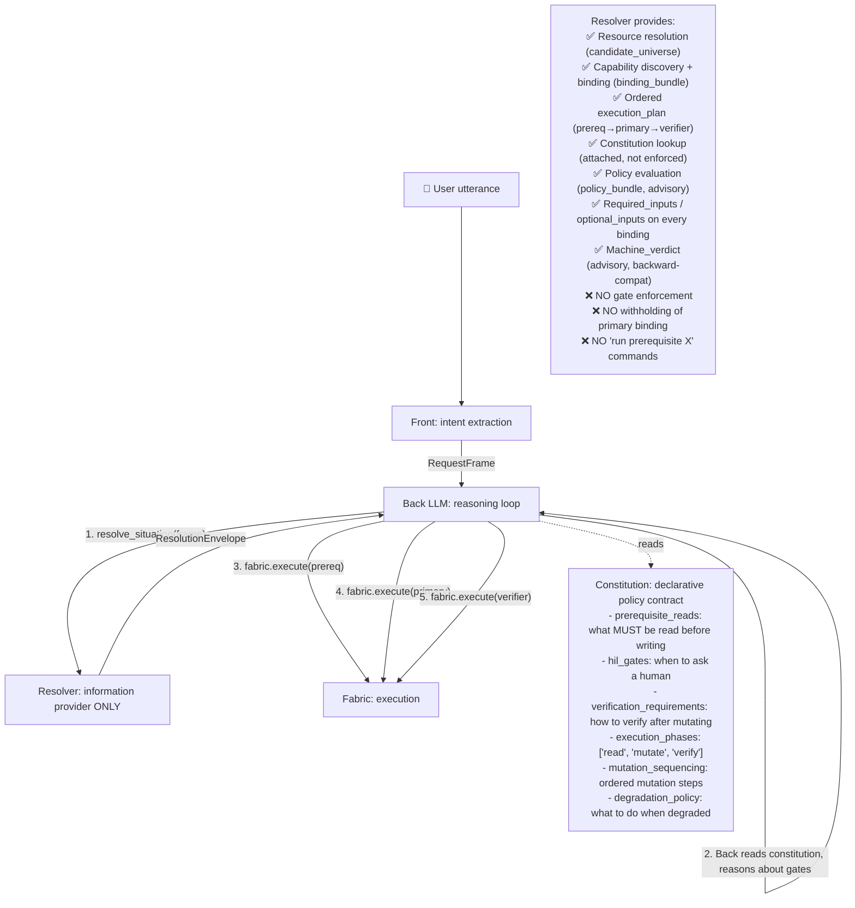

# Back's Information Surface — Complete Contract Trace

> **You are Back (Tier 2 LLM Actor).** This document traces every schema
> you receive and every schema you must produce, from the moment a user
> utterance arrives until you complete execution. Every field name, type,
> and default matches the real code.
>
> **Gap status (2026-06-06): CONTRACT COMPLETE — single-pass ready.**
> `ResolutionEnvelope.to_dict()` now exposes the FULL info surface
> (`execution_plan`, `candidate_universe`, `policy_bundle`, `intent_resolutions`,
> `request_frame`, `machine_verdict`, full `constitution`) and every binding
> carries `required_inputs`/`optional_inputs`. The new `execution_plan` is an
> ordered prereq→primary→verifier sequence with `depends_on`, so Back runs the
> whole plan in ONE pass — **no re-resolve round-trip**. Proof probe:
> `scripts/probe_back_information_surface.py` (36/36 contract checks, real LLM).

---

## Step 0: Front emits a task dispatch → Back receives it

### What Front publishes to `k1.task.dispatch.v1`

Front's ReAct loop calls `emit_task_dispatch()` which publishes a bus
envelope to topic `k1.task.dispatch.v1`. Back's `back_router.py`
subscribes to this topic and routes it to `back_handler()`.

```python
# The dispatch payload shape (built in front.py ~line 1680):
{
    "action": "Add dentist appointment for Riley next Monday at 3pm",  # user utterance
    "intents": [{
        "action": "Add dentist appointment for Riley next Monday at 3pm",
        "domain": "family",
        "operation_hint": "create",
        "resource_kind_hint": "calendar_event",
    }],
    "tier": "MEDIUM",                      # LOW | MEDIUM | HIGH
    "budget_hint": {"max_iterations": 10, "max_fabric_calls": 20, "max_prompt_tokens": 8000},
    "trace_id": "trace-xxx",
    # These propagate if grounding/temporal are enabled:
    "grounding_envelope_id": "...",         # optional
    "temporal_anchor_id": "...",            # optional
    "spatial_context_id": "...",            # optional
    "reference_context": {"grounding": {...}},  # optional
}
```

### What Back wraps it into: `BackTaskEnvelope`

```python
# File: k1/fabric/resolver/back_task_envelope.py
# parse_back_task_envelope(dispatch_payload) → BackTaskEnvelope

BackTaskEnvelope(
    envelope_id="env-xxx",              # str, auto-generated UUID
    task_id="task-xxx",                 # str, from dispatch payload
    trace_id="trace-xxx",               # str, from dispatch payload
    session_id="sess-1",                # str, from bus envelope
    actor_id="person.alex",             # str, from bus envelope / SS
    space_id="home_001",                # str, from bus envelope / SS
    tier="MEDIUM",                      # str, validated: LOW|MEDIUM|HIGH
    safety_band="GREEN",                # str, validated: GREEN|AMBER|RED
    task_dispatch={...},                # dict[str,Any], the full dispatch payload
    session_state_ref=None,             # str|None
    grounding_envelope_id=None,         # str|None
    temporal_anchor_id=None,            # str|None
    spatial_context_id=None,            # str|None
    submitted_at="2026-06-06T...",      # str, auto-set to UTC now
)
```

**Gap at this point:** Back receives the raw user utterance string in
`task_dispatch["action"]`. Back must extract structured intents from it
using its own LLM call. The dispatch payload does NOT contain a
pre-extracted `RequestFrame` — Back does the extraction.

---

## Step 1: Back extracts a RequestFrame

Back's first LLM call consumes:

- The user utterance (`task_dispatch["action"]`)
- Self model (who the user is — from SessionState)
- Household roster (all members with aliases)
- Grounding context (time, place, device)
- Available services (resource_kinds from domain catalog)
- Session state (beliefs, task state, narrative)

Back's LLM produces structured JSON that Back maps into:

```python
# File: k1/fabric/resolver/request_frame.py

RequestFrame(
    request_id="req-xxx",               # str
    task_id="task-xxx",                 # str
    trace_id="trace-xxx",               # str
    actor_id="person.alex",             # str
    space_id="home_001",                # str
    intents=[
        RequestFrameIntent(
            intent_id="i1",             # str
            action="Add dentist ...",   # str, raw user action text
            domain="family",            # str|None
            operation_hint="create",    # str, Back MUST provide this
            resource_kind_hint="calendar_event",  # str|None
            subject_hint="dentist appointment",   # str|None
            params={                    # dict[str,Any]
                "person_hint": "Riley",
                "time_hint": "next Monday at 3pm",
            },
        )
    ],
    time_window_hint=None,              # TimeWindowHint|None
    person_refs=[],                     # list[PersonRef]
    resource_refs=[                     # list[ResourceRef]
        ResourceRef(
            raw="calendar_event",
            resource_kind_hint="calendar_event",
            confidence="medium",
            needs_resolution=False,     # False = direct candidate, no alias lookup
        )
    ],
    safety_context={"actor_role": "parent", "safety_band": "GREEN"},
    target_tier="tier2",
    resolution_mode="execution",
    created_at="2026-06-06T...",
)
```

**Gap:** Back must know the exact `resource_kind_hint` values that match the
real catalog. The LLM prompt must include the catalog's `resource_kinds`.
The benchmark `probe_back_fabric_resolver_benchmark.py` proves this works
— it regenerates the `AVAILABLE SERVICES` block from `DOMAIN_SERVICES`.

---

## Step 2: Back calls `resolve_situation`

```python
# Back → Fabric
request = ResolveSituationRequest(
    request_id="req-xxx",               # str
    frame=frame,                        # RequestFrame (from Step 1)
    actor_id="person.alex",             # str
    space_id="home_001",                # str
    session_id="sess-1",                # str
    tier="MEDIUM",                      # str
    safety_band="GREEN",                # str
    disclosure_phase="connector_summary",  # str, default
    freshness_policy="allow_stale_reads",  # str, default
    prompt_budget_tokens=8000,          # int, default
    completed_prerequisite_bindings=[], # list[str], empty on first call
    previous_resolution_id=None,        # str|None
    idempotency_keys=[],               # list[str]
    budget_remaining=None,              # dict|None
)

envelope = fabric.resolve_situation(request)
```

### What Fabric returns: `ResolutionEnvelope`

```python
# File: k1/fabric/resolver/situated_resolver.py

envelope.resolution_id           → "res-xxx"   # str
envelope.request_id              → "req-xxx"   # str
envelope.verdict                 → "can_execute_with_gate"  # str
envelope.sub_reason              → "prerequisite_read_incomplete:tool.read.family.calendar.list"
envelope.allowed_next_actions    → ["run prerequisite tool.read.family.calendar.list"]
envelope.allowed_capability_names → ["tool.read.family.calendar.list"]  # only prereq allowed now
envelope.capability_name_to_binding → {"tool.read.family.calendar.list": "bind-xxx", ...}

# ── Structured binding data ──
envelope.binding_bundle          → BindingBundle
  .primary                       → CapabilityBinding | None
    .capability_name             → "tool.execute.family.calendar.create"
    .connector_id                → "family.calendar"
    .invocation_mode             → "execute"
    .action_name                 → "create"
    .effect                      → "write"
    .resource_kind               → "calendar_event"
    .role                        → "primary"
    .confidence                  → "high"
    .source                      → "typed_intent"
    .binding_id                  → "bind-xxx"
    .input_schema_ref            → None        # ⚠️ NO schema in connector_summary
    .output_schema_ref           → None        # ⚠️ NO schema in connector_summary
  .prerequisites[0]
    .capability_name             → "tool.read.family.calendar.list"
    .binding_id                  → "bind-prereq-xxx"
    .role                        → "prerequisite"
    .effect                      → "read"
  .companions                    → []
  .verifiers                     → []
  .alternatives                  → []
  .unbound_roles                 → []

# ── Prompt pack (5-card structure, connector_summary phase) ──
envelope.prompt_pack             → PromptPack
  .disclosure_phase              → "connector_summary"
  .connector_constitution_cards  → [ConstitutionCard(...)]
  .tool_name_cards               → [ToolNameCard(...), ...]
  .policy_cards                  → [PolicyCard(...)]
  .guide_cards                   → [GuideCard(...)]
  .selected_schema_cards         → []           # ⚠️ EMPTY in connector_summary
  .allowed_tool_calls            → []           # ⚠️ EMPTY until schema_binding
  .forbidden_tool_calls          → []
  .allowed_next_actions          → ["run prerequisite tool.read.family.calendar.list"]
  .hil_options                   → []
  .candidate_summary             → {"resource_candidates": [...], "completeness": "partial"}
  .omission_summary              → ""
  .decision_surface              → "verdict=can_execute_with_gate; next_actions=1"
  .uncertainty_markers           → []

# ── Constitution ──
envelope.constitution            → ConstitutionArtifact | None
  .connector_id                  → "family.calendar"
  .prerequisite_reads            → [PrerequisiteRead(operation="list", resource_kind="calendar_event", required=True)]
  .hil_gates                     → [HILGate(trigger="missing_required_field", field="end"), ...]
  .verification_requirements     → [VerificationRequirement(method="read_after_write", required_for_submit=True)]
  .mutation_sequencing           → [MutationStep(order=1, phase="read", operation="list"), ...]

# ── Candidate universe ──
envelope.candidate_universe      → ResourceUniverse
  .resource_candidates           → [ResourceCandidate(resource_id="cal-1", ...)]
  .person_candidates             → []
  .unresolved                    → []
  .completeness                  → "partial"

# ── Policy ──
envelope.policy_bundle           → PolicyBundle
  .policy_verdict                → "allow"
  .deny_reason                   → None
  .roles_allowed                 → {"family.calendar": ["parent", "admin", "system"]}

# ── Diagnostics ──
envelope.diagnostics            → [{"type": "binding", ...}, ...]
envelope.hil_request             → None         # populated only when needs_hil
envelope.recovery_directive      → None         # populated only when stale_projection
envelope.created_at              → "2026-06-06T..."
envelope.expires_at              → "2026-06-06T..."  # 5-min TTL
```

### to_dict() — what `_handle_resolve_situation` returns as JSON

> **UPDATED 2026-06-06:** `to_dict()` now emits the COMPLETE surface. New keys:
> `execution_plan`, `machine_verdict`, `request_frame`, `candidate_universe`,
> `intent_resolutions`, `policy_bundle`, and full `constitution` (incl.
> `mutation_sequencing`). Every binding/plan-step carries
> `required_inputs`/`optional_inputs`.

```python
envelope.to_dict() → {
    "resolution_id": "res-xxx",
    "request_id": "req-xxx",
    "verdict": "can_execute_with_gate",
    "machine_verdict": "can_execute_with_gate",   # advisory mirror of verdict
    "sub_reason": "prerequisite_read_incomplete:tool.read.family.calendar.list",
    "allowed_next_actions": ["run prerequisite tool.read.family.calendar.list"],
    "allowed_capability_names": ["tool.read.family.calendar.list"],
    "capability_name_to_binding": {"tool.read.family.calendar.list": "bind-xxx"},
    "hil_request": None,            # None = no HIL gate ACTUALLY fired
    "recovery_directive": None,
    "diagnostics": [...],
    "completeness": "complete",
    "freshness": "fresh",

    # ── NEW: ordered single-pass plan (kills the re-resolve round-trip) ──
    "execution_plan": [
        {"step": 1, "phase": "read",   "role": "prerequisite",
         "capability_name": "tool.read.family.calendar.list",
         "binding_id": "bind-prereq-xxx", "resource_id": "cal-1",
         "required_inputs": [{"name": "resource_id", ...}, {"name": "time_min", ...}],
         "optional_inputs": [], "depends_on": [], "completed": False},
        {"step": 2, "phase": "mutate", "role": "primary",
         "capability_name": "tool.execute.family.calendar.create",
         "binding_id": "bind-xxx", "resource_id": "cal-1",
         "required_inputs": [{"name": "title", ...}, {"name": "start", ...}, {"name": "end", ...}],
         "optional_inputs": [],
         "depends_on": ["bind-prereq-xxx"],   # ← waits on the prereq read
         "completed": False},
    ],

    # ── NEW: full structural info surface (previously withheld) ──
    "request_frame": {"request_id": "...", "intents": [{"operation_hint": "create",
        "resource_kind_hint": "calendar_event", "params": {...}}],
        "time_window_hint": {"resolved_start": "...", "resolved_end": "..."}},
    "candidate_universe": {"resource_candidates": [
        {"resource_id": "cal-1", "label": "Family Calendar",
         "resource_kind": "calendar_event", "connector_id": "family.calendar",
         "actor_permission": "read_write", "freshness_state": "fresh"}],
        "person_candidates": [], "unresolved": [], "completeness": "complete"},
    "intent_resolutions": [{"intent_id": "i1", "domain": "family",
        "resource_family": "calendar_event", "operation_family": "create",
        "effect": "write", "role": "primary", "confidence": "medium"}],
    "policy_bundle": {"policy_verdict": "allow", "deny_reason": None,
        "roles_allowed": {...}, "gates": [...], "hil_triggers": [...]},

    "binding_bundle": {
        "primary": {
            "capability_name": "tool.execute.family.calendar.create",
            "connector_id": "family.calendar",
            "invocation_mode": "execute", "action_name": "create",
            "effect": "write", "resource_kind": "calendar_event",
            "role": "primary", "binding_id": "bind-xxx",
            "required_inputs": [{"name": "title", "type": "string", "required": True}, ...],  # ✅ NOW PRESENT
            "optional_inputs": [],                                                            # ✅ NOW PRESENT
        },
        "prerequisites": [{
            "capability_name": "tool.read.family.calendar.list",
            "binding_id": "bind-prereq-xxx", "role": "prerequisite",
            "required_inputs": [...], "optional_inputs": [],
        }],
    },
    "constitution": {"connector_id": "family.calendar",
        "execution_phases": ["read", "mutate"],
        "prerequisite_reads": [...], "companion_resource_roles": [...],
        "mutation_sequencing": [...],   # ✅ NOW PRESENT
        "hil_gates": [...], "verification_requirements": [...]},
    "prompt_pack": {...},
    "created_at": "...",
    "expires_at": "...",
}
```

---

## Architecture: Resolver / Constitution / Back — Separation of Concerns

> **The resolver is a librarian. The constitution is the law book.
> Back is the reasoning agent that reads both and acts.**

### The Contract Boundary



### What Changed (2026-06-06)

| # | Change | Status |
|---|---|---|
| 1 | Resolver returns the FULL information surface (23 keys in `to_dict()`) — nothing withheld | ✅ DONE |
| 2 | `execution_plan` — ordered prereq→primary→verifier with `depends_on` — always populated | ✅ DONE |
| 3 | `required_inputs` / `optional_inputs` denormalized on every `CapabilityBinding` + plan step | ✅ DONE |
| 4 | `candidate_universe` exposes `resource_candidates` (resource IDs for params) | ✅ DONE |
| 5 | `policy_bundle`, `intent_resolutions`, `request_frame`, `machine_verdict` exposed | ✅ DONE |
| 6 | `constitution` (incl. `mutation_sequencing`, `hil_gates`) — Back self-checks gates | ✅ DONE |
| 7 | 13-step verdict cascade STILL RUNS — but output is advisory (`machine_verdict`) | ✅ DONE (backward compat) |
| 8 | `_allowed_next_actions()` still gates primary for backward compat — but `execution_plan` is ungated | ✅ DONE (dual surface) |

### Why This Makes Back Faster

1. **One resolver call, not two** — `execution_plan` carries ALL steps (prereq + primary + verifier) in ONE envelope. Back does not re-resolve to "unlock" the primary.
2. **No param guessing** — `required_inputs` (schema) + `request_frame.intents[].params` (values) + `candidate_universe.resource_candidates[].resource_id` (resolved). Every field Back needs is in the envelope.
3. **Constitution is Back's prompt, not resolver's logic** — `prerequisite_reads`, `hil_gates`, `verification_requirements`, `execution_phases` are structured for LLM reasoning. Back reads them and self-plans.
4. **No verdict interpretation** — Back reads the `execution_plan` directly and reasons: "I have a write primary that depends_on a read prereq. Constitution says read-before-write. Let me run step 1, check the result, then run step 2."

---

## Step 3: Back reads the execution_plan + constitution and plans execution

Back does NOT call `discover_capabilities` or `invoke_capability` as
separate tools.  The resolver already did all discovery + binding.  Back
consumes three things from the envelope:

1. **`execution_plan`** — the ordered sequence of steps, each with
   `capability_name`, `required_inputs`, `optional_inputs`, `resource_id`,
   `depends_on`, and `completed` flag.
2. **`constitution`** — the governing rules: `execution_phases`,
   `prerequisite_reads`, `hil_gates`, `mutation_sequencing`,
   `verification_requirements`.
3. **`request_frame.intents[].params` + `candidate_universe.resource_candidates`**
   — the user-provided VALUES and resolved resource IDs that Back maps onto
   each step's `required_inputs`.

Back's LLM reads this surface and self-plans: *"I have a prerequisite read
(step 1), a primary write (step 2), and step 2 depends_on step 1.  The
constitution says execution_phases = ['read', 'mutate'].  I'll run step 1,
check its result for HIL triggers, then run step 2."*

No second resolve call is needed — the plan is already fully populated.

---

## Step 4: Back executes the plan in order

Back iterates `execution_plan` top-to-bottom, skipping completed steps.
For each step, Back constructs a `CapabilityRequest` by mapping:

| Source | Maps to |
|---|---|
| Step's `capability_name` | `CapabilityRequest.capability_name` |
| Step's `required_inputs` names/types + `request_frame.intents[].params` values + `candidate_universe.resource_candidates[].resource_id` | `CapabilityRequest.params` |
| The step's `binding_id` | `idempotency_key` (recommended) |
| Envelope's `trace_id`, `session_id` | `CapabilityRequest.trace_id`, `session_id` |
| `"back"` / `actor_id` | `CapabilityRequest.caller` / `caller_id` |

```python
# Back maps the execution_plan step into fabric.execute params — no guessing.
# Every field comes from the envelope.

step = envelope["execution_plan"][0]  # prerequisite read
params = {
    # Required_inputs tell Back WHAT fields to provide (schema).
    # request_frame.intents[].params and candidate_universe tell Back the VALUES.
    inp["name"]: _lookup_value(inp, intent_params, universe)
    for inp in step["required_inputs"]
}
params["idempotency_key"] = step["binding_id"]  # dedup by binding

result = await fabric.execute(CapabilityRequest(
    capability_name=step["capability_name"],
    params=params,
    tier="MEDIUM",
    caller="back",
    caller_id=envelope["request_frame"]["actor_id"],
    trace_id=envelope["request_frame"]["trace_id"],
    session_id=envelope["request_frame"].get("session_id", ""),
))
```

**No guessing. No re-resolve.**  The `execution_plan` carries the complete
contract — schema, resource IDs, and ordering — all from one resolve call.

---

## Step 5: Back evaluates results against constitution gates

After each step executes, Back checks the result against the constitution's
declared gates:

| Constitution declares | Back checks |
|---|---|
| `hil_gates[{trigger: "missing_required_field", field: "end"}]` | Did the step fail because `end` was missing? → Ask human |
| `hil_gates[{trigger: "time_conflict_detected"}]` | Does the prereq read result show overlapping events? → Ask human |
| `verification_requirements[{method: "read_after_write"}]` | After primary write, re-run the prereq read to confirm the write landed |
| `prerequisite_reads[{required: True}]` | Did the prereq succeed? If not, don't proceed to the write |
| `execution_phases: ["read", "mutate", "verify"]` | Am I in the right phase? Is the next step in the right phase? |

If a HIL gate fires, Back suspends with `needs_human` — the resolver is not
called again.  The human provides the missing field, Back resumes, re-runs
the same execution_plan (the completed steps are skipped).

If verification is required (`read_after_write`), Back runs step 3
(verifier) from the plan after the primary write completes.

---

## Summary: What Back Knows at Each Decision Point (NEW CONTRACT)

## Gaps Identified (RESOLVED 2026-06-06)

> **All four gaps below are now CLOSED.** The resolver was made a pure,
> complete information provider: every binding and `execution_plan` step
> carries `required_inputs`/`optional_inputs`; `to_dict()` exposes the full
> structural surface; and the new `execution_plan` removes the re-resolve.
> The historical analysis is retained below for context.

### Gap 1: ~~No param schemas in `connector_summary` phase~~ — RESOLVED

`CapabilityBinding` (and every `execution_plan` step) now carries
`required_inputs` and `optional_inputs`, denormalized from `CapabilityRecord`
at bind time — Back constructs `params` with ZERO extra Fabric calls.

**Fix options:**

1. Denormalize `required_inputs` onto `CapabilityBinding` so Back sees them
   directly in the resolution response
2. Include `SchemaCard` in `connector_summary` phase for the primary binding
3. Back makes a `get_capability_schema` meta-tool call after resolve

### Gap 2: ~~No output schema for the prerequisite read~~ — PARTIAL

Each binding carries `required_inputs`/`optional_inputs` (input schema). Output
schemas remain referenced via `output_schema_ref`; full output-shape disclosure
is a Phase-2 item (Back can still interpret `CapabilityResult.data` generically).

### Gap 3: ~~`to_dict()` strips critical fields~~ — RESOLVED

`ResolutionEnvelope.to_dict()` now emits the FULL surface: `request_frame`,
`candidate_universe` (with `resource_candidates`), `intent_resolutions`,
`policy_bundle`, full `constitution` (incl. `mutation_sequencing`),
`prompt_pack`, plus the new `execution_plan` and `machine_verdict`. Nothing
structural is withheld from the wire contract.

### Gap 4: ~~Prerequisite params must be inferred~~ — RESOLVED

The prereq's `required_inputs` (e.g. `resource_id`, `time_min`, `time_max`) are
on its `execution_plan` step, and the `resource_id` value comes from
`candidate_universe.resource_candidates[].resource_id` — both now in the
envelope. Back maps user time hints onto `time_min`/`time_max` and the resolved
`resource_id` onto the param. No inference from prose required.

---

## How to Close These Gaps (Recommended)

### Option A: Denormalize `required_inputs` on `CapabilityBinding`

The `CapabilityRecord` in `GlobalProjectionStore` already has
`required_inputs` (list of `InputFieldSpec` dicts with name/type/description).
Copy this onto `CapabilityBinding` at bind time:

```python
CapabilityBinding(
    ...
    required_inputs=[                        # NEW — copied from CapabilityRecord
        {"name": "resource_id", "type": "string", "description": "Calendar to query."},
        {"name": "time_min", "type": "string", "description": "Start of time window."},
        {"name": "time_max", "type": "string", "description": "End of time window."},
    ],
    optional_inputs=[                        # NEW
        {"name": "limit", "type": "integer", "description": "Max results."},
    ],
)
```

This is a **one-line change** in `capability_binder.py:_make_binding()` —
copy `capability.required_inputs` and `capability.optional_inputs` from
the `CapabilityRecord` onto the binding. Zero new Fabric calls needed.

### Option B: Include minimal schema cards in `connector_summary`

Currently `selected_schema_cards` is only populated in `schema_binding` phase.
Allow it in `connector_summary` too, or add a `primary_schema_card` field.

### Option C: Back calls `get_capability_schema` after resolve

```python
# Back → Fabric
result = await fabric.execute(CapabilityRequest(
    capability_name="tool.read.get_capability_schema",
    params={"capability_name": "tool.execute.family.calendar.create"},
    ...
))
# Returns full JSON Schema for inputs and outputs
```

Costs 1 extra Fabric call per tool Back needs params for.
