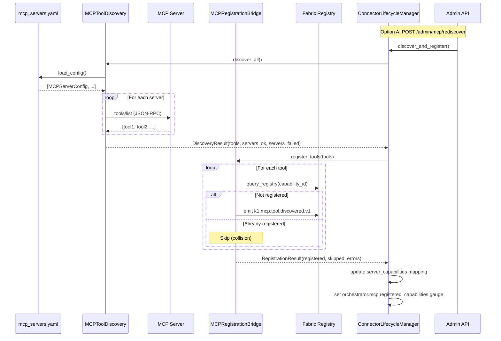
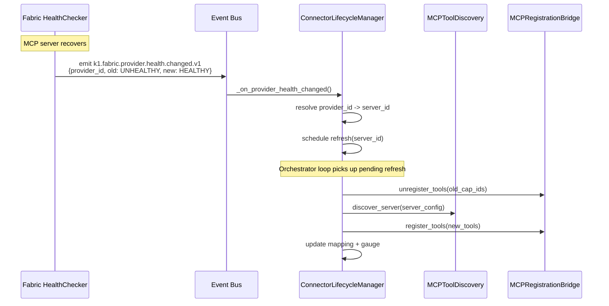

# Connector Administration Guide

Status: Active (Epic 9.3.4)
Owner: Orchestrator Team
Last Updated: 2026-02-13
Source Plan: `docs/plans/orchestrator-implementation-plan.md` (Epic 9.3.4)

This guide covers MCP connector management from the Orchestrator's perspective. The Orchestrator owns tool **discovery** and **registration** into Fabric. Fabric owns provider execution, health monitoring, circuit breakers, timeout enforcement, and output validation.

---

## Scope Boundary

Understanding which layer owns what is critical for troubleshooting:

| Responsibility | Owner | Component |
|---------------|-------|-----------|
| MCP server configuration | Orchestrator | `mcp_servers.yaml` |
| Tool discovery (enumerate tools from servers) | Orchestrator | `MCPToolDiscovery` (5.1.1) |
| Tool registration (emit events for Fabric) | Orchestrator | `MCPRegistrationBridge` (5.1.2) |
| Lifecycle monitoring (health event subscription) | Orchestrator | `ConnectorLifecycleManager` (5.1.3) |
| K0 proxy routing (optional auth/cache) | Orchestrator | `K0ProxyClient` (5.1.4) |
| Provider creation and management | **Fabric** | `ProviderFactory` (3.1.4) |
| Circuit breaker state (CB_FABRIC, CB_MCP) | **Fabric** | `CircuitBreaker` (3.4.1) |
| Health checking and availability | **Fabric** | `HealthChecker` (3.6.1) |
| Output validation | **Fabric** | `OutputValidationPipeline` (3.5.1) |
| Sandbox / timeout / CPU / memory limits | **Fabric** | Provider isolation |

**Removed from Orchestrator scope**: Sandbox configuration, CPU/memory limits, active health probing -- all managed by Fabric.

---

## Table of Contents

1. [Adding an MCP Server](#1-adding-an-mcp-server)
2. [Removing an MCP Server](#2-removing-an-mcp-server)
3. [K0 Proxy Settings](#3-k0-proxy-settings)
4. [Troubleshooting](#4-troubleshooting)
5. [Health Monitoring](#5-health-monitoring)
6. [Security](#6-security)

Appendices:
- [Appendix A: Configuration Reference](#appendix-a-configuration-reference)
- [Appendix B: Event Flow Diagram](#appendix-b-event-flow-diagram)
- [Appendix C: Capability Naming Convention](#appendix-c-capability-naming-convention)

---

## 1. Adding an MCP Server

### 1.1 Configuration File

MCP servers are defined in a static YAML file read by `MCPToolDiscovery`. The default path is `k1/connectors/mcp_servers.yaml` (configurable via `OrchestratorConfig.mcp_config_path`).

**Format** (`mcp_servers.yaml`):

```yaml
servers:
  - id: google_cal
    type: remote
    endpoint: https://mcp.google.com/calendar
    critical: false

  - id: local_fs
    type: local
    endpoint: /usr/bin/mcp-fs-server
    critical: false

  - id: weather_api
    type: remote
    endpoint: https://mcp.weather.io/v2
    critical: true
```

### 1.2 Field Reference

| Field | Type | Required | Description |
|-------|------|----------|-------------|
| `id` | string | Yes | Unique server identifier. Used as the `server_id` prefix in capability naming (SPEC-7). Must be non-empty. |
| `type` | string | Yes | Transport type: `"local"` (stdio subprocess) or `"remote"` (SSE/HTTP). Controls discovery timeout: 5s for local, 10s for remote. |
| `endpoint` | string | Yes | Connection string. For `local`: path to executable. For `remote`: URL of the MCP server. |
| `critical` | bool | No | Default: `false`. If `true`, discovery failure for this server is logged at ERROR level (still non-blocking in V1). |

Validation rules (enforced by `MCPServerConfig.validate()`):
- `id` must be non-empty.
- `type` must be `"local"` or `"remote"`.
- `endpoint` must be non-empty.

Invalid entries are skipped with a warning log. Non-dict entries in the `servers` list are also skipped.

### 1.3 Registration Flow

After adding a server entry, trigger discovery to register its tools:

**Option A: Restart the Orchestrator**

On startup, `OrchestratorService.init()` calls `ConnectorLifecycleManager.discover_and_register()`, which reads the config file and performs a full discovery cycle.

**Option B: Trigger re-discovery via admin API (no restart)**

```
POST http://localhost:8081/admin/mcp/rediscover
```

Response:
```json
{
  "triggered": true,
  "registered": 5,
  "skipped": 0,
  "errors": []
}
```

This calls `ConnectorLifecycleManager.discover_and_register()`, which:

1. **Config read**: `MCPToolDiscovery.load_config()` re-reads `mcp_servers.yaml`.
2. **Tool enumeration**: `MCPToolDiscovery.discover_all()` iterates servers, sends MCP `tools/list` JSON-RPC to each, collects `DiscoveredTool` objects.
3. **Collision check**: `MCPRegistrationBridge.register_tools()` builds a capability_id per tool (format: `tool.{type}.{server_id}.{name}`), checks Fabric registry via `fabric.query_registry()` for duplicates.
4. **Event emission**: For each new tool, emits `k1.mcp.tool.discovered.v1` event with the tool's metadata. Fabric's ProactiveGapDetector consumes this event and calls `register_from_dict()` to create the actual `CapabilityContract`.
5. **Mapping update**: `ConnectorLifecycleManager.server_capabilities` dict is updated: `server_id -> [capability_id, ...]`.
6. **Metric update**: `orchestrator.mcp.registered_capabilities` gauge is set to the total capability count.

### 1.4 Verify Registration

```
GET http://localhost:8081/admin/mcp/servers
```

Response:
```json
[
  {
    "registered": 5,
    "skipped": 0,
    "errors": [],
    "tools": ["tool.execute.google_cal.create_event", "tool.read.google_cal.list_events", "..."]
  }
]
```

Confirm `registered` count matches expected tool count. Check `errors` array for any failed servers.

### 1.5 Limits

The maximum number of configured servers is controlled by `OrchestratorConfig.mcp_max_servers` (default: 10, minimum: 1).

---

## 2. Removing an MCP Server

### 2.1 Remove from Configuration

Delete the server entry from `mcp_servers.yaml`.

### 2.2 Unregister Tools

**Option A: Trigger re-discovery**

```
POST http://localhost:8081/admin/mcp/rediscover
```

Re-discovery reads the updated config file. Tools from removed servers are no longer discovered, but existing registrations in Fabric remain until explicitly unregistered.

**Option B: Programmatic unregister (via ConnectorLifecycleManager)**

`ConnectorLifecycleManager.unregister_server(server_id)` performs a targeted removal:

1. Looks up `server_capabilities[server_id]` for capability IDs.
2. Emits `k1.orchestration.mcp.tool_unregistered.v1` event per capability.
3. Removes the server from the internal mapping.
4. Updates the `orchestrator.mcp.registered_capabilities` gauge.

Returns the number of capabilities unregistered.

### 2.3 Impact on Active Workflows

When tools are unregistered, active workflows that reference those tools are affected:

1. **ConstraintResolver** in the DAG execution detects the missing capability.
2. A **ProactiveGap** is created with `gap_type = "CAPABILITY_REMOVED"`.
3. The gap is emitted as a `k1.orchestration.gap.detected` event (triggers the `WorkflowGapDetected` alert).
4. The gap is persisted via `IWorkflowStoragePort.save_gap()` with status `PENDING`.

ProactiveGap record fields:
- `workflow_id`: affected workflow.
- `gap_type`: `"CAPABILITY_REMOVED"`.
- `affected_step_id`: the step that used the removed tool.
- `capability_name`: the removed capability ID.
- `status`: transitions `PENDING` -> `ASKED` -> `RESOLVED` / `AUTO_RESOLVED`.

### 2.4 Verify Removal

```
GET http://localhost:8081/admin/mcp/servers
```

Confirm the `registered` count decreased. Check that no `errors` remain from the removed server.

---

## 3. K0 Proxy Settings

### 3.1 Overview

The `K0ProxyClient` (5.1.4) is an **optional** client for routing MCP tool invocations through the K0 proxy. It provides:

- **Auth token injection**: K0 credential vault manages API keys; K1 never stores auth tokens (security boundary).
- **Rate limiting aggregation**: K0 enforces per-account limits across all K1 instances.
- **Response caching**: K0 caches MCP responses with configurable TTL.

### 3.2 Configuration

The K0 proxy is configured via the `K0ProxyClient` constructor:

```python
K0ProxyClient(
    bridge=bridge_write_port,    # IBridgeWritePort for token refresh requests
    proxy_endpoint="http://k0-proxy.internal:9090",  # K0 proxy base URL
    transport=http_transport,    # IProxyTransport implementation
)
```

- **`proxy_endpoint`**: K0 proxy base URL. Set to `None` to disable proxy mode entirely (standalone/edge mode).
- **`bridge`**: `IBridgeWritePort` used for token refresh requests when the proxy returns HTTP 401.

### 3.3 Standalone / Edge Mode (K0 Offline)

When `proxy_endpoint` is `None`:

- `K0ProxyClient.is_available()` returns `False`.
- `invoke_via_proxy()` raises `ProxyUnavailableError`.
- Fabric's MCPProvider falls back to **direct MCP invocation** (bypasses K0 entirely).

This is the default behavior -- K0 is always optional per the Edge-First architecture.

### 3.4 Proxy Invocation Flow

When the proxy is available, tool invocations route through:

```
MCP Tool Request
       |
       v
K0ProxyClient.invoke_via_proxy(ProxyRequest)
       |
       v
POST {proxy_endpoint}/mcp/invoke
  Body: { server_id, tool_name, params, auth_context? }
       |
       +-- 200 OK --> ProxyResponse(data, cached, cache_ttl_s)
       |
       +-- 401 Unauthorized --> trigger token refresh via bridge --> raise RuntimeError
       |
       +-- 429 Rate Limited --> raise ProxyRateLimitedError(retry_after_s)
       |
       +-- 4xx/5xx --> raise RuntimeError
```

**ProxyRequest** fields:
| Field | Type | Description |
|-------|------|-------------|
| `server_id` | str | MCP server that owns the tool |
| `tool_name` | str | Tool to invoke |
| `params` | dict | Tool invocation parameters |
| `auth_context` | dict (optional) | Opaque auth context for K0 credential vault selection |

**ProxyResponse** fields:
| Field | Type | Description |
|-------|------|-------------|
| `data` | dict | Tool result payload |
| `cached` | bool | Whether response was served from K0 cache |
| `cache_ttl_s` | int | Cache TTL in seconds (0 if not cached) |

### 3.5 Token Refresh on 401

When the K0 proxy returns HTTP 401:

1. `K0ProxyClient` logs a warning.
2. Submits a token refresh request via `IBridgeWritePort.submit_audit()` with payload:
   ```json
   {
     "type": "token_refresh_request",
     "server_id": "google_cal",
     "reason": "proxy_401"
   }
   ```
3. Raises `RuntimeError` -- the caller retries after K0 refreshes the token.

K1 never handles auth tokens directly; all credential management is delegated to K0.

### 3.6 Rate Limiting on 429

When the K0 proxy returns HTTP 429:

- `ProxyRateLimitedError` is raised with `retry_after_s` (from the `Retry-After` header or response body).
- The caller should back off for the specified duration before retrying.

### 3.7 Health Check

```python
await k0_proxy_client.check_proxy_health()
# Sends GET {proxy_endpoint}/health
# Returns True if 200, False otherwise
```

---

## 4. Troubleshooting

### 4.1 MCP Server Unreachable

**Symptom**: Discovery fails for one or more servers. `POST /admin/mcp/rediscover` returns errors.

**Diagnosis**:

1. Check the admin API for current state:
   ```
   GET http://localhost:8081/admin/mcp/servers
   ```
   Look at the `errors` array.

2. Check logs for discovery failures:
   ```
   component=orchestrator AND message="*Discovery failed*"
   ```

3. Verify the server endpoint is reachable from the Orchestrator host.

4. Check the `critical` flag: if `true` for the failed server, the log is at ERROR level; if `false`, at WARNING level. In both cases, other servers are still discovered (non-blocking).

**Resolution**:
- Fix the server endpoint or network connectivity.
- Re-trigger discovery: `POST /admin/mcp/rediscover`.

### 4.2 Fabric CircuitBreaker Opens for MCP Provider

**Symptom**: Steps using MCP tools fail. Fabric's CB_MCP opens.

**Flow when an MCP provider becomes unhealthy**:

```
MCP Server offline/failing
        |
        v
Fabric HealthChecker marks provider OFFLINE
        |
        v
Fabric CircuitBreaker (CB_MCP) opens
        |
        v
Orchestrator DAG steps using MCP tools get DEGRADED CapabilityResult
        |
        v
ErrorRouter classifies as DEGRADED -> DEGRADE action
        |
(later: MCP server recovers)
        |
        v
Fabric HealthChecker marks provider HEALTHY
        |
        v
Fabric emits k1.fabric.provider.health.changed.v1
  payload: { provider_id, old_state: "UNHEALTHY", new_state: "HEALTHY" }
        |
        v
ConnectorLifecycleManager._on_provider_health_changed()
  -> Detects recovery (new_state == "HEALTHY", old_state in DEGRADED/UNHEALTHY)
  -> Resolves provider_id to known server_id (exact match or suffix match)
  -> Schedules refresh for that server_id
        |
        v
ConnectorLifecycleManager.refresh(server_id)
  1. Unregister old capabilities
  2. Re-discover tools from recovered server
  3. Re-register tools into Fabric
  4. Update server_capabilities mapping
```

**Diagnosis**:

1. Check circuit breaker state (Fabric-owned -- check via Fabric admin API, not Orchestrator).
2. Check Orchestrator's lifecycle monitoring:
   ```
   component=orchestrator AND message="*Provider*recovered*"
   ```
3. Check pending refreshes:
   ```
   component=orchestrator AND message="*scheduling refresh*"
   ```

**Resolution**:
- If automatic recovery worked: verify tools re-registered via `GET /admin/mcp/servers`.
- If automatic recovery failed: manually trigger `POST /admin/mcp/rediscover`.
- If the MCP server has changed its tool set during the outage: verify capability count matches expected.

### 4.3 Tool Registration Collision

**Symptom**: Re-discovery reports `skipped > 0`.

**Cause**: A tool with the same capability_id is already registered in Fabric's registry.

**Diagnosis**:
```
component=orchestrator AND message="*Skipping already-registered*"
```

**Resolution**: Collisions are benign -- the existing registration is kept. If you need to force re-registration (e.g., the tool definition changed), use `ConnectorLifecycleManager.refresh(server_id)`, which unregisters old capabilities before re-discovery.

### 4.4 Discovery Returns Zero Tools

**Symptom**: `POST /admin/mcp/rediscover` returns `registered: 0` with no errors.

**Possible causes**:
1. Config file not found: check `mcp_config_path` in `OrchestratorConfig` (default: `k1/connectors/mcp_servers.yaml`).
2. Empty `servers` list in config.
3. MCP servers returned empty `tools/list` responses.
4. No transport configured: `MCPToolDiscovery._transport` is `None` (stub mode -- only used in unit tests).

**Diagnosis**:
```
component=orchestrator AND message="*No tools discovered*"
```

### 4.5 ProactiveGap Detected After Server Removal

**Symptom**: `WorkflowGapDetected` alert fires after removing an MCP server.

**This is expected behavior.** When a capability is removed, any saved workflow that references it gets a ProactiveGap.

**Resolution**: Either:
- Add a replacement server that provides the same tools.
- Update the workflow spec to use alternative capabilities.
- Resolve the gap manually (status transitions from `PENDING` through the gap resolution flow).

Check pending gaps:
```
component=orchestrator AND event=k1.orchestration.gap.detected
```

---

## 5. Health Monitoring

### 5.1 Orchestrator-Side Metrics

The Orchestrator exposes one key gauge for MCP connector health:

| Metric | Type | Description |
|--------|------|-------------|
| `orchestrator.mcp.registered_capabilities` | Gauge | Total count of registered MCP capabilities across all servers |

This gauge is updated after every `discover_and_register()`, `refresh()`, and `unregister_server()` call.

**Alert**: `MCPCapabilityCountDropped` fires when this gauge drops below expected after a Fabric health event (see `k1/orchestrator/docs/alerts.md`).

### 5.2 Admin API Endpoints

| Method | Path | Description |
|--------|------|-------------|
| GET | `/admin/mcp/servers` | View last registration result (registered, skipped, errors, tool list) |
| POST | `/admin/mcp/rediscover` | Trigger full re-discovery cycle |

Additional monitoring context:

| Method | Path | Description |
|--------|------|-------------|
| GET | `/health/status` | Overall Orchestrator health (includes CB state) |
| GET | `/admin/metrics` | Aggregated runtime metrics |

### 5.3 Server-to-Capability Mapping

`ConnectorLifecycleManager.server_capabilities` maintains the mapping:

```
server_capabilities = {
    "google_cal": [
        "tool.execute.google_cal.create_event",
        "tool.read.google_cal.list_events",
    ],
    "weather_api": [
        "tool.read.weather_api.get_forecast",
        "tool.read.weather_api.search_locations",
    ],
}
```

This mapping is used for:
- `refresh(server_id)`: unregister old capabilities, re-register new ones.
- `unregister_server(server_id)`: remove all capabilities for a server.
- `get_server_ids()`: list known servers.
- `get_capabilities(server_id)`: list capabilities for a specific server.

### 5.4 Fabric-Side Health (Out of Scope)

Fabric owns per-provider health monitoring. The following data is available via **Fabric's** admin API (not Orchestrator's):

- Per-server health status (HEALTHY / DEGRADED / UNHEALTHY).
- Per-server circuit breaker state (CB_MCP: CLOSED / OPEN / HALF_OPEN).
- Per-provider latency and error rate metrics.
- Active health probe results.

The Orchestrator receives health state changes indirectly via the `k1.fabric.provider.health.changed.v1` event subscription in `ConnectorLifecycleManager`.

### 5.5 Lifecycle Monitoring Events

| Event | Direction | Description |
|-------|-----------|-------------|
| `k1.mcp.tool.discovered.v1` | Orchestrator -> Fabric | Emitted per tool during registration |
| `k1.orchestration.mcp.tool_registered.v1` | Orchestrator emits | Orchestrator-side registration confirmation |
| `k1.orchestration.mcp.tool_unregistered.v1` | Orchestrator -> Fabric | Emitted per tool during unregister |
| `k1.fabric.provider.health.changed.v1` | Fabric -> Orchestrator | Health state change (consumed for auto-refresh) |
| `k1.orchestration.gap.detected` | Orchestrator emits | ProactiveGap when capability is removed |

---

## 6. Security

### 6.1 MCP Tool Capability Scoping

Capabilities are scoped by the server_id prefix in the naming convention:

```
tool.{type}.{server_id}.{tool_name}
```

This means:
- Tool names from different servers never collide (SPEC-7 guarantee).
- Access control can be applied at the `server_id` level.
- Audit queries can filter by server_id in the capability name.

Tool type inference (`infer_type()` in `MCPRegistrationBridge`):
- Names starting with `query`, `search`, `list`, `get`, `find`, `fetch`, `read`, `lookup` -> type `"read"`.
- Names starting with `create`, `update`, `delete`, `remove`, `set`, `put`, `post`, `patch` -> type `"execute"`.
- All other names default to `"execute"`.

### 6.2 Audit Trail for MCP Operations

MCP operations generate audit trails through multiple channels:

1. **Registration events**: Every tool registration emits `k1.mcp.tool.discovered.v1` with full tool metadata (name, description, input_schema, output_schema, server_id, capability_id).

2. **Unregistration events**: Every tool removal emits `k1.orchestration.mcp.tool_unregistered.v1` with the capability_id and reason.

3. **K0 proxy audit**: Token refresh requests are submitted via `IBridgeWritePort.submit_audit()` and persisted in the K0 audit log.

4. **ProactiveGap records**: When capabilities are removed affecting workflows, persistent `ProactiveGap` records are stored via `IWorkflowStoragePort` with full context (workflow_id, capability_name, gap_type, detected_at).

### 6.3 Auth Token Security

When using the K0 proxy:
- Auth tokens are managed exclusively by K0; K1 never stores, caches, or logs auth tokens.
- The `auth_context` field in `ProxyRequest` is opaque to K1 -- it is passed through to K0 which uses it to select the correct credential vault.
- On HTTP 401 from the proxy, K1 submits a token refresh request to K0 via the Bridge. K1 does not attempt to create, rotate, or manage tokens itself.

### 6.4 Network Isolation

- Admin API (port 8081) is bound to localhost only -- not exposed to external networks.
- MCP local servers (type `"local"`) run as subprocesses -- follow OS-level process isolation.
- MCP remote servers (type `"remote"`) are accessed over HTTPS -- ensure TLS configuration on the MCP server side.

---

## Appendix A: Configuration Reference

### OrchestratorConfig Fields (MCP Section)

| Field | Type | Default | Constraints | Description |
|-------|------|---------|-------------|-------------|
| `mcp_config_path` | str | `"k1/connectors/mcp_servers.yaml"` | -- | Path to the MCP server YAML config file |
| `mcp_discovery_interval_ms` | int | `300000` (5 min) | > 0 | Interval between automatic re-discovery cycles |
| `mcp_max_servers` | int | `10` | >= 1 | Maximum number of MCP servers in config |

### MCPServerConfig Fields

| Field | Type | Required | Default | Description |
|-------|------|----------|---------|-------------|
| `id` | str | Yes | -- | Unique server identifier |
| `type` | str | Yes | -- | `"local"` or `"remote"` |
| `endpoint` | str | Yes | -- | Command path (local) or URL (remote) |
| `critical` | bool | No | `false` | Log discovery failure as error vs. warning |

### K0ProxyClient Constructor

| Parameter | Type | Required | Default | Description |
|-----------|------|----------|---------|-------------|
| `bridge` | IBridgeWritePort | Yes | -- | For token refresh requests |
| `proxy_endpoint` | str or None | No | `None` | K0 proxy URL; None = disabled |
| `transport` | IProxyTransport | No | `None` | HTTP transport; None = stub |

---

## Appendix B: Event Flow Diagram



### Lifecycle Monitoring (Health Recovery)



---

## Appendix C: Capability Naming Convention

Capability IDs follow the SPEC-7 naming convention:

```
tool.{type}.{server_id}.{tool_name}
```

### Components

| Component | Source | Example |
|-----------|--------|---------|
| `tool` | Fixed prefix | `tool` |
| `{type}` | Inferred from tool name | `read` or `execute` |
| `{server_id}` | `MCPServerConfig.id` | `google_cal` |
| `{tool_name}` | MCP server `tools/list` response | `create_event` |

### Type Inference Rules

| Tool Name Prefix | Inferred Type |
|-----------------|---------------|
| `query`, `search`, `list`, `get`, `find`, `fetch`, `read`, `lookup` | `read` |
| `create`, `update`, `delete`, `remove`, `set`, `put`, `post`, `patch` | `execute` |
| Any other prefix | `execute` (default) |

### Examples

| Server ID | Tool Name | Capability ID |
|-----------|-----------|---------------|
| `google_cal` | `create_event` | `tool.execute.google_cal.create_event` |
| `google_cal` | `list_events` | `tool.read.google_cal.list_events` |
| `weather_api` | `get_forecast` | `tool.read.weather_api.get_forecast` |
| `local_fs` | `run_analysis` | `tool.execute.local_fs.run_analysis` |

The `server_id` prefix guarantees no naming collisions between tools from different MCP servers, even if they share the same tool name.
