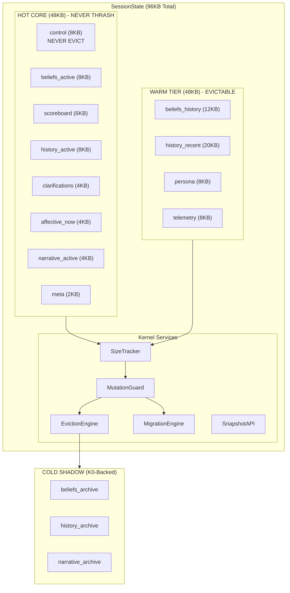

# K1 SessionState - Source of Truth

> **Status**: Authoritative Specification
> **Last Updated**: 2026-02-01
> **ADRs**: ADR-0017 (6-Section Design), ADR-0017a-c (Section Details), ADR-0018 (Eviction Strategy), ADR-0019 (Serialization)

---

## Table of Contents

1. [Executive Overview](#1-executive-overview)
2. [Core Philosophy](#2-core-philosophy)
3. [Architecture Overview](#3-architecture-overview)
4. [Tiering Model](#4-tiering-model)
5. [HOT CORE Sections](#5-hot-core-sections)
6. [WARM TIER Sections](#6-warm-tier-sections)
7. [COLD SHADOW (K0-Backed)](#7-cold-shadow-k0-backed)
8. [Kernel Services](#8-kernel-services)
9. [Invariants and Guarantees](#9-invariants-and-guarantees)
10. [Single Writer Pattern](#10-single-writer-pattern)
11. [Cross-Section Dependencies](#11-cross-section-dependencies)
12. [Delta Aggregation](#12-delta-aggregation)
13. [Memory Tiering Flows](#13-memory-tiering-flows)
14. [Emergency Modes](#14-emergency-modes)
15. [Reconstruction SLA](#15-reconstruction-sla)
16. [Events Contract](#16-events-contract)
17. [QoS and Mailbox Integration](#17-qos-and-mailbox-integration)
18. [Performance Characteristics](#18-performance-characteristics)
19. [API Surface](#19-api-surface)
20. [FlatBuffers Schemas](#20-flatbuffers-schemas)
21. [Narrative Tracking](#21-narrative-tracking)
22. [Implementation Status](#22-implementation-status)
23. [Standalone vs Wired Modes](#23-standalone-vs-wired-modes)

---

## 1. Executive Overview

**SessionState** is K1's tiered, memory-constrained state management system - the **central working memory** for conversational AI. It maintains conversation context across sessions with strict size limits while preserving human-scale conversations (40+ turns).

### Key Properties

| Property | Value | Rationale |
|----------|-------|-----------|
| **Total Size Limit** | 96KB hard cap | Predictable memory for 1000+ concurrent sessions |
| **HOT CORE** | 48KB max | Never thrash - critical orchestration state |
| **WARM TIER** | 48KB max | Evictable - recent context with degradation |
| **Turn Retention** | 40 turns | Human-scale conversation (not 5-turn windows) |
| **Reconstruction SLA** | <100ms | COLD to HOT hydration target |

### Design Principles

1. **Predictable Memory**: Every session bounded to 96KB regardless of conversation length
2. **Graceful Degradation**: Evict WARM before HOT, summarize before dropping
3. **Single Writer**: Only Concierge writes to SessionState (via MutationGuard)
4. **Multi-Reader**: Lock-free reads for all agents (<1ms latency)
5. **Cognitive Alignment**: Based on Baddeley's working memory model

---

## 2. Core Philosophy

### Not a Cache, Not a Database: A Cognitive Kernel

SessionState treats session state as **working memory for AI cognition**:

```
SessionState = Working Memory + Episodic Buffer + Executive Functions
```

Adapted from **Baddeley's working memory model**:

| Cognitive Component | SessionState Mapping |
|---------------------|---------------------|
| Central Executive | HOT CORE (control, flow state) |
| Phonological Loop | history_active (recent turns) |
| Visuospatial Sketchpad | WARM TIER (episodic buffer) |
| Episodic Buffer | beliefs_active + scoreboard |
| Long-term Memory | COLD SHADOW (K0 persistence) |

### Human-Scale Conversations (40 Turns, Not 5)

Natural conversations span **40+ exchanges** before losing coherence:

```
Human Conversation Scale:
├── Immediate recall: 5-7 turns (working memory)
├── Active context: 20-30 turns (episodic buffer)
└── Full session: 40+ turns (natural conversation length)

Turn Fidelity by Position:
├── Turns 1-10:   HOT CORE (full fidelity - raw text)
├── Turns 11-30:  WARM TIER (compressed - entities + intents + key phrases)
├── Turns 31-40:  WARM TIER (summarized - single-sentence per turn)
└── Turns 41+:    COLD SHADOW (archived to K0, 1-line session summary kept)
```

---

## 3. Architecture Overview



### Component Relationships

```
┌─────────────────────────────────────────────────────────────────────────────┐
│                           WRITE PATH                                        │
│                                                                             │
│   Concierge ──► SINGLE_WRITER ──► MUTATION_GUARD ──► SIZE_TRACKER          │
│                      │                  │                  │                │
│                      │            (preflight)        (accounting)           │
│                      │                  │                  │                │
│                      │                  ▼                  │                │
│                      │           ┌─────────────┐           │                │
│                      │           │  Approved?  │           │                │
│                      │           └──────┬──────┘           │                │
│                      │           YES    │    NO            │                │
│                      │            ▼     │     ▼            │                │
│                      │      COMMIT     EVICTION_ENGINE     │                │
│                      │                      │              │                │
│                      └──────────────────────┴──────────────┘                │
│                                                                             │
├─────────────────────────────────────────────────────────────────────────────┤
│                           READ PATH                                         │
│                                                                             │
│   Any Agent ──► SessionState ──► HOT (hit?) ──► WARM (hit?) ──► COLD       │
│                  (lock-free)         │              │              │        │
│                                   <100μs         <200μs        <100ms       │
│                                                                             │
└─────────────────────────────────────────────────────────────────────────────┘
```

---

## 4. Tiering Model

### Size Budgets

| Tier | Max Size | Eviction Policy | Reconstruction |
|------|----------|-----------------|----------------|
| **HOT CORE** | 48KB | NEVER thrash (demote to WARM) | Always in-memory |
| **WARM TIER** | 48KB | Evictable (archive to COLD) | In-memory, evictable |
| **COLD SHADOW** | Unlimited | K0-backed persistence | <100ms hydration |
| **TOTAL** | 96KB | Hard reject if exceeded | N/A |

### Tier Transitions

```
                    ┌─────────────────────────────────────────┐
                    │              HOT CORE                   │
                    │         (48KB, never thrash)            │
                    └──────────────────┬──────────────────────┘
                                       │
                          MIGRATION_ENGINE (demote)
                                       │
                                       ▼
                    ┌─────────────────────────────────────────┐
                    │              WARM TIER                  │
                    │          (48KB, evictable)              │
                    └──────────────────┬──────────────────────┘
                                       │
                          EVICTION_ENGINE (archive + summarize)
                                       │
                                       ▼
                    ┌─────────────────────────────────────────┐
                    │            COLD SHADOW                  │
                    │         (K0-backed, unlimited)          │
                    └─────────────────────────────────────────┘
```

---

## 5. HOT CORE Sections

**Total Budget: 48KB | 8 Sections | NEVER Thrash**

### 5.1 control (8KB) - NEVER EVICT

**Purpose**: Agent leases, turn coordination, flow state. Critical for orchestration survival.

```python
@dataclass
class ControlSection:
    agent_leases: Dict[str, AgentLease]  # 10-20 active agents
    flow_state: FlowState                 # Current orchestration phase
    turn_lock: bool                       # Prevents concurrent turns
    intents: IntentClassification         # From UltraBERT
    domains: List[str]                    # Active domains
    safety_band: str                      # GREEN/AMBER/RED/CRISIS

@dataclass
class AgentLease:
    agent_id: str
    agent_type: str           # "intent_classifier", "planner", etc.
    state: str                # "PENDING", "WARMING", "ACTIVE", "IDLE", "DRAINING", "TERMINATED"
    lease_started_ms: int
    lease_expires_ms: int     # Default: 30s TTL
    capabilities: List[str]

@dataclass
class FlowState:
    current_phase: str        # "negotiation", "selection", "execution", "idle"
    turn_id: str
    started_at_ms: int
    timeout_ms: int           # Default: 60s turn timeout
```

**Invariant**: Control section is **NEVER evicted**. If evicted, orchestration crashes.

### 5.2 beliefs_active (8KB)

**Purpose**: Facts needed for the current turn. Demoted to `beliefs_history` after turn.

```python
@dataclass
class BeliefsActiveSection:
    current_turn_facts: List[Fact]
    mentioned_entities: List[Entity]  # From UltraBERT NER
    mentioned_time: Optional[str]
    mentioned_location: Optional[str]
    turn_id: str
```

### 5.3 scoreboard (6KB)

**Purpose**: Current discourse state - referents, QUD (Question Under Discussion), salience.

```python
@dataclass
class ScoreboardSection:
    referents: List[Referent]          # Active entity references
    qud_stack: List[Question]          # Questions under discussion
    salience_map: Dict[str, float]     # Entity → salience score
    topic_stack: List[str]             # Active topics
    last_user_intent: str
```

### 5.4 history_active (8KB)

**Purpose**: Last 10 turns with full fidelity (raw text preserved).

```python
@dataclass
class HistoryActiveSection:
    turns: List[Turn]  # Max 10 turns

@dataclass
class Turn:
    turn_id: str
    user_message: str           # Full text
    assistant_response: str     # Full text
    timestamp_ms: int
    metadata: TurnMetadata
```

### 5.5 clarifications (4KB)

**Purpose**: Open gaps in the current turn requiring user clarification.

```python
@dataclass
class ClarificationsSection:
    pending: List[Clarification]

@dataclass
class Clarification:
    id: str
    agent_id: str              # Which agent needs clarification
    question: str
    options: List[str]
    created_at: int
    priority: int
```

### 5.6 affective_now (4KB)

**Purpose**: Current emotional state snapshot.

```python
@dataclass
class AffectiveNowSection:
    current_emotion: str       # From UltraBERT emotions head
    intensity: float           # 0.0 - 1.0
    valence: float             # -1.0 to +1.0
    arousal: float             # 0.0 to 1.0
    trajectory: str            # "increasing", "stable", "decreasing"
    last_updated_ms: int
```

### 5.7 narrative_active (4KB)

**Purpose**: ONE active conversation thread pointer.

```python
@dataclass
class NarrativeActiveSection:
    primary_thread: str        # Current thread ID
    paused_threads: List[str]  # Threads on hold
    thread_count: int
    resumption_hint: str       # "Earlier you mentioned..."
    arc_position: str          # "exposition", "rising_action", "climax", "resolution"
```

### 5.8 meta (2KB)

**Purpose**: Session identifiers and timestamps.

```python
@dataclass
class MetaSection:
    session_id: str
    user_id: str
    privacy_band: str          # GREEN/AMBER/RED/BLACK
    created_at_ms: int
    last_activity_ms: int
    device_id: str
    turn_count: int
```

---

## 6. WARM TIER Sections

**Total Budget: 48KB | 4 Sections | Evictable**

### 6.1 beliefs_history (12KB)

**Purpose**: Recent facts from previous turns (last ~100 facts, capped).

```python
@dataclass
class BeliefsHistorySection:
    facts: List[Fact]          # LRU, max 100
    entity_index: Dict[str, List[int]]  # Entity → fact indices
```

**Eviction**: Oldest facts archived to K0 `beliefs_archive`.

### 6.2 history_recent (20KB)

**Purpose**: Turns 11-40 with lossy compression.

```python
@dataclass
class HistoryRecentSection:
    compressed_turns: List[CompressedTurn]  # Turns 11-30
    summarized_turns: List[SummarizedTurn]  # Turns 31-40

@dataclass
class CompressedTurn:
    turn_id: str
    entities: List[str]        # Extracted entities only
    intents: List[str]         # Classified intents only
    key_phrases: List[str]     # Important phrases
    timestamp_ms: int

@dataclass
class SummarizedTurn:
    turn_id: str
    summary: str               # Single sentence summary (LLM-generated)
    timestamp_ms: int
```

**Compression Strategy**:

- **Turns 11-30**: Structural compression (entities + intents + key phrases)
- **Turns 31-40**: LLM summarization (single sentence per turn)
- **Beyond 40**: Archive to K0, keep 1-line session summary

### 6.3 persona (8KB)

**Purpose**: User personality, voice preferences, style controls.

```python
@dataclass
class PersonaSection:
    traits: Dict[str, float]   # "warmth": 0.8, "formality": 0.3
    voice_preferences: ProsodyControls
    custom_vocabulary: Dict[str, str]  # "the cottage" → "vacation home"
    interaction_style: str     # "concise", "detailed", "casual"
```

### 6.4 telemetry (8KB)

**Purpose**: Performance metrics (lossy aggregated).

```python
@dataclass
class TelemetrySection:
    token_count: int
    cost_usd: float
    latency_p50_ms: int
    latency_p95_ms: int
    turn_durations: List[int]  # Rolling window
    error_count: int
```

**Eviction**: Aggregated to counters, raw data dropped.

---

## 7. COLD SHADOW (K0-Backed)

**Unlimited capacity, reconstructible on demand.**

| Archive | Contents | Reconstruction SLA |
|---------|----------|-------------------|
| `beliefs_archive` | All historical facts | <50ms for active entities |
| `history_archive` | Full turn logs | <100ms for semantic search |
| `narrative_archive` | Inactive threads | <150ms for thread recovery |

### K0 Pipeline Integration

```
SessionState ──► Bridge ──► K0 P02 (Episodic Write)
                        ──► K0 P03 (Consolidation)
                        ──► K0 P01 (Recall/Read)
```

> **Note**: The K0-K1 Bridge is a cross-kernel component at `bridge/` (root level).
> See [bridge/README.md](../../bridge/README.md) for details.
> SessionState implements `IStoragePort` which the Bridge adapter will satisfy.

---

## 8. Kernel Services

### 8.1 SizeTracker

**Purpose**: Per-section byte accounting.

```python
class SizeTracker:
    def get_section_size(self, section: str) -> int: ...
    def get_tier_size(self, tier: str) -> int: ...  # "hot" or "warm"
    def get_total_size(self) -> int: ...
    def get_pressure(self) -> PressureLevel: ...  # NORMAL, ELEVATED, CRITICAL
```

### 8.2 MutationGuard

**Purpose**: Preflight validation for all state mutations.

```python
class MutationGuard:
    def preflight(
        self,
        section: str,
        operation: str,       # "insert", "update", "delete"
        estimated_kb: int     # Pre-estimated size of mutation
    ) -> Approval:
        """
        Three-tier approval:
        1. Section capacity check
        2. Tier capacity check (HOT or WARM)
        3. Total session capacity check (96KB)

        Returns: Approved | RejectedWithCapacity | RejectedHard
        """
```

**API Signature**: `preflight(section, op, estimated_kb) → Approval`

**Note**: The "data" parameter is an **integer** (estimated KB), not raw bytes.

### 8.3 EvictionEngine

**Purpose**: Tier-aware eviction with summarization.

```python
class EvictionEngine:
    def evict_warm(self, target_kb: int) -> EvictionResult:
        """
        Eviction order (by priority):
        1. telemetry (aggregate, then drop)
        2. history_recent (summarize oldest, archive to K0)
        3. beliefs_history (archive oldest to K0)
        4. persona (never evict unless critical)
        """

    def summarize_and_archive(self, section: str, data: Any) -> K0Pointer: ...
```

**Critical**: EvictionEngine **only touches WARM tier**. HOT sections are demoted by MigrationEngine, never evicted.

### 8.4 MigrationEngine

**Purpose**: HOT ↔ WARM tier transitions.

```python
class MigrationEngine:
    def demote_to_warm(self, section: str) -> bool:
        """
        Demote from HOT to WARM:
        - history_active[oldest] → history_recent
        - beliefs_active[oldest] → beliefs_history
        """

    def promote_to_hot(self, section: str, data: Any) -> bool:
        """
        Promote from WARM/COLD to HOT (on cache miss).
        May trigger demotion of existing HOT data.
        """
```

### 8.5 SnapshotAPI

**Purpose**: Health metrics and debugging.

```python
class SnapshotAPI:
    def get_health(self) -> KernelHealth:
        """Size breakdown, pressure levels, eviction stats"""

    def get_snapshot(self, detail: str) -> KernelSnapshot:
        """Full state dump for debugging"""
```

### 8.6 ReconstructionSLA

**Purpose**: COLD → HOT hydration with SLA enforcement.

```python
class ReconstructionSLA:
    MAX_LATENCY_MS = 100

    def reconstruct(
        self,
        sections: List[str],
        mode: str  # "partial" or "degraded"
    ) -> ReconstructionResult:
        """
        partial: Hydrate HOT first, then WARM as needed (happy path)
        degraded: Operate with missing WARM (fallback when K0 slow)
        """
```

---

## 9. Invariants and Guarantees

### Non-Negotiable Invariants

```python
INVARIANTS = {
    "HOT_CORE_MAX_KB": 48,           # Never exceeded
    "WARM_TIER_MAX_KB": 48,          # Evictable when exceeded
    "TOTAL_SESSION_MAX_KB": 96,      # Hard reject if exceeded
    "CONTROL_NEVER_EVICTED": True,   # Orchestration survival
    "HISTORY_TURN_COUNT": 40,        # Human-scale retention
    "HOT_HISTORY_TURNS": 10,         # Full fidelity turns
}
```

### Failure Mode Guarantees

| Failure | Response |
|---------|----------|
| Memory Pressure | Evict WARM, preserve HOT |
| Write Rejection | Return actionable error + available capacity |
| Corruption Detection | Checksum validation per section |
| Reconstruction Failure | Degraded mode (operate without WARM) |
| K0 Unavailable | Emergency read-only mode |

---

## 10. Single Writer Pattern

**ADR-0017/ADR-0018: Only Concierge writes to SessionState.**

```
┌─────────────────────────────────────────────────────────────────────────────┐
│                         SINGLE WRITER PATTERN                               │
│                                                                             │
│   Sub-Agents ──► K1 Bus (delta lane) ──► AggregationWindow ──► Concierge ──► WRITE │
│       │              │              │                   │                   │
│   (emit deltas)  (transport)   (500ms batch)    (SINGLE WRITER)             │
│                                                         │                   │
│                                                         ▼                   │
│                                                   SessionState              │
│                                                                             │
├─────────────────────────────────────────────────────────────────────────────┤
│   Multi-Reader Access (Lock-Free):                                          │
│                                                                             │
│   Concierge ────┐                                                           │
│   Orchestrator ─┤                                                           │
│   Planner ──────┼──► SessionState (read-only, <1ms)                        │
│   Sub-Agents ───┤                                                           │
│   UltraBERT ────┘                                                           │
│                                                                             │
└─────────────────────────────────────────────────────────────────────────────┘
```

### Benefits

- **No read locks**: High concurrency for readers
- **Strong consistency**: Writes serialized through Concierge
- **No writer starvation**: Single writer queue (FIFO)
- **Eventual consistency**: Readers see consistent snapshots

---

## 11. Cross-Section Dependencies

### Dependency Map

```
┌─────────────────────────────────────────────────────────────────────────────┐
│                     CROSS-SECTION DEPENDENCIES                              │
├─────────────────────────────────────────────────────────────────────────────┤
│                                                                             │
│   beliefs_active ──────────► beliefs_history                                │
│       │                           │                                         │
│       │   "active facts reference history"                                  │
│       │   Eviction: PIN critical facts                                      │
│       │                                                                     │
│   control ─────────────────► beliefs_active                                 │
│       │                           │                                         │
│       │   "leases depend on current facts"                                  │
│       │   Eviction: CASCADE invalidation                                    │
│       │                                                                     │
│   scoreboard ──────────────► history (active + recent)                      │
│       │                           │                                         │
│       │   "referents need context"                                          │
│       │   Eviction: DEGRADE to summaries                                    │
│       │                                                                     │
│   narrative_active ────────► conversation_threads (K0)                      │
│       │                           │                                         │
│       │   "active thread references full threads"                           │
│       │   Eviction: ARCHIVE inactive                                        │
│                                                                             │
└─────────────────────────────────────────────────────────────────────────────┘
```

### Eviction Strategies by Dependency

| Dependency | Strategy | Implementation |
|------------|----------|----------------|
| beliefs_active → beliefs_history | Pin critical facts | Keep facts referenced by active turn |
| control → beliefs_active | Cascade invalidation | Invalidate stale leases if facts evicted |
| scoreboard → history | Degrade to summaries | Replace turn refs with summary pointers |
| narrative_active → threads | Archive inactive | Move paused threads to K0 |

---

## 12. Delta Aggregation

### Delta lane flow (K1 Bus)

```
┌─────────────────────────────────────────────────────────────────────────────┐
│                          DELTA AGGREGATION                                  │
├─────────────────────────────────────────────────────────────────────────────┤
│                                                                             │
│   Sub-Agents (concurrent):                                                  │
│   ┌─────────┐ ┌─────────┐ ┌─────────┐ ┌─────────┐                          │
│   │ health  │ │ finance │ │ travel  │ │ memory  │                          │
│   │ _agent  │ │ _agent  │ │ _agent  │ │ _writer │                          │
│   └────┬────┘ └────┬────┘ └────┬────┘ └────┬────┘                          │
│        │           │           │           │                                │
│   emit delta   emit delta  emit delta  emit delta                           │
│        │           │           │           │                                │
│        └───────────┴─────┬─────┴───────────┘                                │
│                          │                                                  │
│                          ▼                                                  │
│   ┌─────────────────────────────────────────────────────────────────────┐   │
│   │                   K1 BUS (DELTA LANE)                               │   │
│   │            (same physical bus as event lane)                         │   │
│   │                                                                     │   │
│   │  Delta Types:                                                       │   │
│   │  • state_update: Agent state changes                                │   │
│   │  • clarification_request: Need user input                           │   │
│   │  • task_complete: Work finished                                     │   │
│   │  • belief_update: User model changes                                │   │
│   │  • memory_episodic: Experience to remember                          │   │
│   └─────────────────────────────────────────────────────────────────────┘   │
│                          │                                                  │
│                          ▼                                                  │
│   ┌─────────────────────────────────────────────────────────────────────┐   │
│   │                   AGGREGATION_WINDOW                                │   │
│   │                     (500ms Batching)                                │   │
│   │                                                                     │   │
│   │  ┌─────────────────────────────────────────────────────────────┐    │   │
│   │  │  t=0ms    t=100ms   t=250ms   t=400ms   t=500ms             │    │   │
│   │  │    │         │         │         │         │                │    │   │
│   │  │    ▼         ▼         ▼         ▼         ▼                │    │   │
│   │  │  [δ1]     [δ2,δ3]    [δ4]      [δ5]    [FLUSH]              │    │   │
│   │  └─────────────────────────────────────────────────────────────┘    │   │
│   │                                                                     │   │
│   │  Aggregation Logic:                                                 │   │
│   │  • Merge conflicting updates (last-write-wins)                      │   │
│   │  • Collapse redundant updates                                       │   │
│   │  • Sort by priority (clarifications first)                          │   │
│   └─────────────────────────────────────────────────────────────────────┘   │
│                          │                                                  │
│                   aggregated batch                                          │
│                          │                                                  │
│                          ▼                                                  │
│                    CONCIERGE_FSM                                            │
│                   (Single Writer)                                           │
│                                                                             │
└─────────────────────────────────────────────────────────────────────────────┘
```

### Why 500ms?

- **Latency vs Efficiency**: Balances responsiveness with write batching
- **Reduces Write Amplification**: Multiple deltas become single write
- **Conflict Resolution**: Time window for last-write-wins

---

## 13. Memory Tiering Flows

### HOT → WARM Migration

```
Trigger: HOT > 40KB (proactive, before limit)

┌─────────────────────────────────────────────────────────────────────────────┐
│                        HOT → WARM MIGRATION                                 │
├─────────────────────────────────────────────────────────────────────────────┤
│                                                                             │
│   HOT_CORE (48KB):                                                          │
│   ┌──────────────────────────────┬────────────────────────────────────┐     │
│   │ Protected (never migrate):   │ Migratable to WARM:                │     │
│   │ ┌─────────────────────────┐  │ ┌────────────────────────────────┐ │     │
│   │ │ control (8KB)           │  │ │ history_active (oldest turns)  │ │     │
│   │ │ meta (2KB)              │  │ │ beliefs_active (old facts)     │ │     │
│   │ │ clarifications (active) │  │ │ affective_now (if stale)       │ │     │
│   │ └─────────────────────────┘  │ └─────────────────┬──────────────┘ │     │
│   └──────────────────────────────┴───────────────────┼────────────────┘     │
│                                                      │                      │
│                                    MIGRATION_ENGINE (demote)                │
│                                                      │                      │
│                                                      ▼                      │
│   WARM_TIER (48KB):                                                         │
│   ┌─────────────────────────────────────────────────────────────────────┐   │
│   │ history_recent ◄── history_active[oldest]                           │   │
│   │ beliefs_history ◄── beliefs_active[oldest]                          │   │
│   └─────────────────────────────────────────────────────────────────────┘   │
│                                                                             │
└─────────────────────────────────────────────────────────────────────────────┘
```

### WARM → COLD Eviction

```
Trigger: WARM > 40KB (proactive, before limit)

┌─────────────────────────────────────────────────────────────────────────────┐
│                        WARM → COLD EVICTION                                 │
├─────────────────────────────────────────────────────────────────────────────┤
│                                                                             │
│   Eviction Order (lowest priority first):                                   │
│                                                                             │
│   1. telemetry ──► Aggregate to counters, drop raw                          │
│   2. history_recent ──► Summarize oldest, archive to K0                     │
│   3. beliefs_history ──► Archive oldest facts to K0                         │
│   4. persona ──► Never evict unless EMERGENCY                               │
│                                                                             │
│   ┌─────────────────────────────────────────────────────────────────────┐   │
│   │                       EVICTION_ENGINE                               │   │
│   │                                                                     │   │
│   │  1. Select section by priority                                      │   │
│   │  2. Summarize (if history) via MemoryWriter agent                   │   │
│   │  3. Archive to K0 via P02 pipeline                                  │   │
│   │  4. Replace in-memory with K0 pointer                               │   │
│   │  5. Update SIZE_TRACKER                                             │   │
│   └─────────────────────────────────────────────────────────────────────┘   │
│                                                                             │
└─────────────────────────────────────────────────────────────────────────────┘
```

### COLD → HOT Reconstruction

```
Trigger: Cache miss on read

┌─────────────────────────────────────────────────────────────────────────────┐
│                       COLD → HOT RECONSTRUCTION                             │
├─────────────────────────────────────────────────────────────────────────────┤
│                                                                             │
│   Search Order:                                                             │
│   1. HOT_CORE ──► Found? Return immediately                                 │
│   2. WARM_TIER ──► Found? Return + consider promotion                       │
│   3. COLD_SHADOW ──► Trigger reconstruction                                 │
│                                                                             │
│   ┌─────────────────────────────────────────────────────────────────────┐   │
│   │                    RECONSTRUCTION_SLA                               │   │
│   │                                                                     │   │
│   │  Timeline (<100ms total):                                           │   │
│   │  ├─────────────────────────────────────────────┤                    │   │
│   │  0ms        20ms        40ms        50ms     100ms                  │   │
│   │  │          │           │           │          │                    │   │
│   │  lookup     K0 fetch    decompress  load HOT  ready                 │   │
│   │                                                                     │   │
│   │  Modes:                                                             │   │
│   │  • partial: Hydrate HOT first (happy path)                          │   │
│   │  • degraded: Operate with missing WARM (fallback)                   │   │
│   │                                                                     │   │
│   └─────────────────────────────────────────────────────────────────────┘   │
│                                                                             │
└─────────────────────────────────────────────────────────────────────────────┘
```

---

## 14. Emergency Modes

**Trigger: Total size ≥95KB (98% of 96KB limit)**

### Three Escalation Stages

```
┌─────────────────────────────────────────────────────────────────────────────┐
│                         EMERGENCY MODES                                     │
├─────────────────────────────────────────────────────────────────────────────┤
│                                                                             │
│   Normal ──► ≥95KB ──► EMERGENCY_SUMMARIZE                                  │
│                              │                                              │
│                              ▼                                              │
│   ┌─────────────────────────────────────────────────────────────────────┐   │
│   │  EMERGENCY_SUMMARIZE (Stage 1)                                      │   │
│   │                                                                     │   │
│   │  • Aggressive compression of history                                │   │
│   │  • Telemetry → aggregated counters only                             │   │
│   │  • LLM summarization of turns 11-40                                 │   │
│   │  • Target: Reduce to <90KB                                          │   │
│   └─────────────────────────────────────────────────────────────────────┘   │
│                              │                                              │
│                         Still ≥96KB?                                        │
│                              │                                              │
│                              ▼                                              │
│   ┌─────────────────────────────────────────────────────────────────────┐   │
│   │  EMERGENCY_READONLY (Stage 2)                                       │   │
│   │                                                                     │   │
│   │  • Block all new writes                                             │   │
│   │  • Allow reads (system still responds)                              │   │
│   │  • Background cleanup continues                                     │   │
│   │  • Resume writes when <90KB                                         │   │
│   └─────────────────────────────────────────────────────────────────────┘   │
│                              │                                              │
│                      Cleanup failing?                                       │
│                              │                                              │
│                              ▼                                              │
│   ┌─────────────────────────────────────────────────────────────────────┐   │
│   │  EMERGENCY_SHED (Stage 3)                                           │   │
│   │                                                                     │   │
│   │  • Priority-based shedding                                          │   │
│   │  • Drop entire WARM sections (except persona)                       │   │
│   │  • Preserve HOT CORE at all costs                                   │   │
│   │  • Emit session.emergency.v1 event                                  │   │
│   └─────────────────────────────────────────────────────────────────────┘   │
│                                                                             │
└─────────────────────────────────────────────────────────────────────────────┘
```

---

## 15. Reconstruction SLA

### Modes

| Mode | Trigger | Behavior | SLA |
|------|---------|----------|-----|
| **partial** | Normal reconstruction | Hydrate HOT first, then WARM on-demand | <100ms |
| **degraded** | K0 slow/unavailable | Operate with missing WARM data | Immediate |

### Partial Hydration Strategy

```python
def reconstruct_partial(session_id: str) -> ReconstructionResult:
    """
    1. Fetch HOT sections from K0 (control, beliefs_active, scoreboard)
    2. Load into memory immediately
    3. Queue WARM sections for lazy loading
    4. Return session as usable (WARM loads in background)
    """
```

### Degraded Mode

```python
def reconstruct_degraded(session_id: str) -> ReconstructionResult:
    """
    1. Fetch only HOT sections from K0
    2. Mark WARM as "unavailable"
    3. System continues with reduced context
    4. Log warning for observability
    """
```

---

## 16. Events Contract

### Events Emitted

| Topic | Schema | Trigger |
|-------|--------|---------|
| `session.updated.v1` | [session.updated.v1.json](../contracts/schemas/events/session.updated.v1.json) | After any state update |
| `session.section.updated.v1` | [session.section.updated.v1.json](../contracts/schemas/events/session.section.updated.v1.json) | Section-specific update |
| `session.eviction.v1` | [session.eviction.v1.json](../contracts/schemas/events/session.eviction.v1.json) | Sections evicted from WARM |
| `session.migration.v1` | [session.migration.v1.json](../contracts/schemas/events/session.migration.v1.json) | HOT ↔ WARM tier transition |
| `session.emergency.v1` | [session.emergency.v1.json](../contracts/schemas/events/session.emergency.v1.json) | Emergency mode activated |
| `session.reconstruction.v1` | [session.reconstruction.v1.json](../contracts/schemas/events/session.reconstruction.v1.json) | COLD → HOT hydration |

### Event Schemas

```json
// session.updated.v1.json
{
  "session_id": "string",
  "section": "string",
  "operation": "string"  // "insert", "update", "delete"
}

// session.eviction.v1.json
{
  "session_id": "string",
  "evicted_sections": ["string"]
}

// session.emergency.v1.json
{
  "session_id": "string",
  "mode": "summarization" | "readonly" | "shedding"
}

// session.reconstruction.v1.json
{
  "session_id": "string",
  "sections": ["string"],
  "mode": "partial" | "degraded"
}
```

### Events Subscribed

| Topic | Schema | Handler |
|-------|--------|---------|
| `user.action.v1` | [user.action.v1.json](../contracts/schemas/events/user.action.v1.json) | Process user input |
| `orchestrator.mutate.v1` | [orchestrator.mutate.v1.json](../contracts/schemas/events/orchestrator.mutate.v1.json) | Orchestrator mutations |

---

## 17. QoS and Mailbox Integration

### QoS to WFQ Weight Mapping

| QoS Level | WFQ Weight | Use Case |
|-----------|-----------|----------|
| **URGENT** | 4 | Safety mailbox, crisis handling |
| **REALTIME** | 3 | SessionState, Orchestrator, Fabric |
| **INTERACTIVE** | 2 | Concierge, Planner, Agents |
| **BACKGROUND** | 1 | Researcher, low-priority tasks |

### SessionState Mailbox Configuration

From [wiring.contract.yaml](../contracts/modules/sessionstate/wiring.contract.yaml):

```yaml
mailboxes:
  actors:
    - id: "SESSIONSTATE"
      mailbox: "session_mutations"
      qos: "REALTIME"            # Weight 3
    - id: "ORCHESTRATOR"
      mailbox: "session_mutations"
      qos: "REALTIME"            # Weight 3
    - id: "CONCIERGE"
      mailbox: "session_mutations"
      qos: "INTERACTIVE"         # Weight 2
    - id: "AGENTS"
      mailbox: "session_reads"
      qos: "INTERACTIVE"         # Weight 2
```

### WFQ Scheduling Behavior

```
Round-Robin with Weights:
┌─────────────────────────────────────────────────────────────────────────────┐
│  URGENT(4)  │  REALTIME(3)  │  INTERACTIVE(2)  │  BACKGROUND(1)            │
│     ████    │      ███      │        ██        │         █                 │
│     ████    │      ███      │        ██        │                           │
│     ████    │      ███      │                  │                           │
│     ████    │               │                  │                           │
└─────────────────────────────────────────────────────────────────────────────┘

Processing Order (WFQ): U, U, R, U, R, I, U, R, I, B, ...
```

---

## 18. Performance Characteristics

### Latency Guarantees (P95)

| Operation | Target | Measurement |
|-----------|--------|-------------|
| HOT read | <100μs | Per-section access |
| WARM read | <200μs | Tiered lookup |
| COLD hydrate | <100ms | K0 reconstruction |
| Mutation preflight | <50μs | Size estimation |
| Full serialization | <1ms | FlatBuffers delta |
| Cross-tier demotion | <5ms | HOT → WARM migration |
| Lease acquire | <300μs | Control section update |
| Lease release | <200μs | Control section delete |
| Timeout check | <5ms | Periodic scan (10-20 leases) |

### Capacity Planning

```
Memory per Session: 96KB max

Concurrent Session Scaling:
├── 1,000 sessions: 96MB total (commodity hardware)
├── 10,000 sessions: 960MB total (production cluster)
└── 100,000 sessions: 9.6GB total (enterprise scale)

Comparison:
├── SessionState: 96KB/session (predictable)
├── Object-based store: 300-500KB/session (variable)
└── Efficiency gain: 3-5x better
```

---

## 19. API Surface

### SessionKernel Interface

```python
class SessionKernel:
    """Enterprise-grade session state management"""

    # ---------- TIERED ACCESS ----------
    @property
    def hot(self) -> HotCore:
        """Access HOT CORE sections (read/write)"""

    @property
    def warm(self) -> WarmTier:
        """Access WARM TIER sections (read/write with eviction)"""

    # ---------- ENFORCEMENT ----------
    def mutate(
        self,
        section: str,
        operation: MutationOp,
        data: Any
    ) -> MutationResult:
        """
        Preflight-checked mutation.
        Returns: Approved, RejectedWithCapacity, or RejectedHard
        """

    # ---------- HEALTH & TELEMETRY ----------
    def get_health(self) -> KernelHealth:
        """Real-time tier utilization, pressure levels, eviction stats"""

    def get_snapshot(self, detail: DetailLevel) -> KernelSnapshot:
        """Debug snapshot with size breakdowns"""

    # ---------- RECONSTRUCTION ----------
    def hydrate_from_k0(self, k0_snapshot: K0Session) -> HydrationResult:
        """Partial reconstruction from COLD SHADOW"""
```

### HistoryManager Interface

```python
class HistoryManager:
    """40-turn human-scale conversation retention"""

    def add_turn(
        self,
        user_message: str,
        assistant_response: str,
        metadata: TurnMetadata
    ) -> TurnId:
        """
        Adds turn with automatic tiering:
        - Turns 1-10: HOT CORE (full)
        - Turns 11-30: WARM TIER (compressed)
        - Turns 31-40: WARM TIER (summarized)
        - Beyond 40: Archive to K0, keep summary
        """

    def get_context(
        self,
        window_turns: int = 40,
        fidelity: FidelityLevel = "adaptive"
    ) -> List[Turn]:
        """
        Retrieves conversation context with adaptive fidelity.
        """
```

### ControlManager Interface

```python
class ControlManager:
    """Control section management - agent leases & flow state"""

    DEFAULT_LEASE_DURATION_MS = 30_000  # 30s
    DEFAULT_TURN_TIMEOUT_MS = 60_000    # 60s

    def acquire_lease(
        self,
        agent_id: str,
        agent_type: str,
        state: str = "ACTIVE",
        capabilities: Optional[List[str]] = None,
        lease_duration_ms: Optional[int] = None,
    ) -> bool: ...

    def release_lease(self, agent_id: str) -> bool: ...
    def renew_lease(self, agent_id: str, duration_ms: Optional[int] = None) -> bool: ...
    def check_timeouts(self) -> List[str]: ...  # Returns expired agent_ids

    def set_flow_state(
        self,
        phase: str,  # "negotiation", "selection", "execution", "idle"
        turn_id: Optional[str] = None,
        timeout_ms: Optional[int] = None,
    ) -> None: ...

    def acquire_turn_lock(self, turn_id: str) -> bool: ...
    def release_turn_lock(self) -> None: ...
```

---

## 20. FlatBuffers Schemas

### SessionState Root Schema

```flatbuffers
// k1/contracts/schemas/SessionState.fbs
namespace K1.SessionState;

table SessionKernel {
    // HOT CORE (always present)
    hot: HotCore (required);

    // WARM TIER (may be partially evicted)
    warm: WarmTier (required);

    // Size tracking (enforced)
    hot_size_kb: uint16;
    warm_size_kb: uint16;
    total_size_kb: uint16;

    // Eviction state
    eviction_count: uint32;
    last_eviction_ms: uint64;

    // Checksums for corruption detection
    hot_checksum: uint32;
    warm_checksum: uint32;
}
```

### ControlSection Schema

```flatbuffers
// k1/contracts/flatbuffers/layer2_state/control_section.fbs
namespace K1.SessionState;

table AgentLease {
    agent_id: string (required);
    agent_type: string (required);
    state: string (required);          // PENDING, WARMING, ACTIVE, IDLE, DRAINING, TERMINATED
    lease_started_ms: long (required);
    lease_expires_ms: long (required);
    capabilities: [string];
}

table FlowState {
    current_phase: string (required);  // negotiation, selection, execution, idle
    turn_id: string;
    started_at_ms: long;
    timeout_ms: long;
}

table ControlSection {
    agent_leases: [AgentLease] (required);
    flow_state: FlowState;
    turn_lock: bool;
    intents: IntentClassification;
    domains: [string];
    safety_band: string;               // GREEN, AMBER, RED, CRISIS
    total_size_bytes: int;
    last_updated_ms: long;
}

root_type ControlSection;
```

### HistorySection Schema

```flatbuffers
// Human-scale history retention
table HistorySection {
    // HOT: Last 10 turns, full fidelity
    hot_turns: [TurnFull] (max_size: 10);

    // WARM: Turns 11-40, compressed
    warm_turns: [TurnCompressed] (max_size: 30);

    // Session summary (1-line)
    session_summary: string;

    // K0 pointers for archived turns
    archived_turn_ids: [string];
}

table TurnFull {
    turn_id: string;
    user_message: string;
    assistant_response: string;
    timestamp_ms: long;
    entities: [string];
    intents: [string];
}

table TurnCompressed {
    turn_id: string;
    entities: [string];
    intents: [string];
    key_phrases: [string];
    timestamp_ms: long;
}
```

---

## 21. Narrative Tracking

### Concepts

| Concept | Location | Purpose |
|---------|----------|---------|
| `narrative_active` | HOT CORE (4KB) | Pointer to current active thread |
| `conversation_threads` | HOT CORE (4KB) | In-memory thread registry |
| `narrative_archive` | COLD (K0) | Inactive/paused threads |
| `NARRATIVE_ARC` | HOT CORE (2KB) | Session-level story progression |

### Thread State Machine

```
Thread States:
┌─────────────────────────────────────────────────────────────────────────────┐
│                                                                             │
│   ACTIVE ──────────────────────────────────────► RESOLVED                  │
│      │                                               │                      │
│      │ (user topic change)                          │ (goal completed)     │
│      ▼                                               │                      │
│   PAUSED ◄──────────────────────────────────────────┘                      │
│      │                                                                      │
│      │ (30 turns inactive)                                                  │
│      ▼                                                                      │
│   ARCHIVED (K0)                                                             │
│                                                                             │
└─────────────────────────────────────────────────────────────────────────────┘
```

### Narrative Arc (Story Model)

```
Session Arc Phases:
┌─────────────────────────────────────────────────────────────────────────────┐
│                                                                             │
│   EXPOSITION    RISING ACTION    CLIMAX    RESOLUTION                      │
│       │              │             │           │                            │
│   [turns 1-10]  [turns 11-40]  [turns 41-60] [ongoing]                     │
│       │              │             │           │                            │
│   "User intro"  "Working on"   "Key moment" "Wrapping"                     │
│   "Goals set"   "tasks/issues" "Decision"   "up/closure"                   │
│                                                                             │
│   Current Position: ████████░░░░░░ (RISING ACTION)                         │
│                                                                             │
└─────────────────────────────────────────────────────────────────────────────┘
```

---

## 22. Implementation Status

### Module Structure

```
k1/sessionstate/
├── __init__.py              # Exports: SessionStateManager, MutationGuard, etc.
├── README.md                # This file (Source of Truth)
├── manager.py               # SessionStateManager implementation
├── guard.py                 # MutationGuard implementation
├── eviction.py              # EvictionEngine implementation
├── migration.py             # MigrationEngine implementation
├── sizetracker.py           # SizeTracker implementation
├── reconstruction.py        # ReconstructionSLA implementation
├── snapshot.py              # SnapshotAPI implementation
├── sections/
│   ├── __init__.py
│   ├── control.py           # ControlSection
│   ├── beliefs.py           # BeliefsActiveSection, BeliefsHistorySection
│   ├── scoreboard.py        # ScoreboardSection
│   ├── history.py           # HistoryActiveSection, HistoryRecentSection
│   ├── clarifications.py    # ClarificationsSection
│   ├── affective.py         # AffectiveNowSection
│   ├── narrative.py         # NarrativeActiveSection
│   ├── persona.py           # PersonaSection
│   ├── meta.py              # MetaSection
│   └── telemetry.py         # TelemetrySection
├── tiers/
│   ├── __init__.py
│   ├── hot.py               # HotCore tier management
│   └── warm.py              # WarmTier tier management
├── sessionstate.mmd         # Full architecture diagram
└── sessionstate_internal.mmd # Internal-only structure diagram
```

### Contract Files

```
k1/contracts/modules/sessionstate/
├── module.contract.yaml     # Module metadata, exports, dependencies
├── wiring.contract.yaml     # Imports, capabilities, events, mailboxes
├── policies.contract.yaml   # Security, budgets, egress, audit
├── enforcement.policy.yaml  # Violation handling (QUARANTINE)
└── runtime.guard.yaml       # Runtime checks configuration

k1/contracts/schemas/events/
├── session.updated.v1.json
├── session.section.updated.v1.json
├── session.eviction.v1.json
├── session.migration.v1.json
├── session.emergency.v1.json
├── session.reconstruction.v1.json
├── user.action.v1.json
└── orchestrator.mutate.v1.json
```

### Implementation Progress

| Component | Status | Notes |
| --------- | ------ | ----- |
| Module contracts | ✅ Complete | All YAML contracts defined |
| Event schemas | ✅ Complete | JSON schemas for all events |
| FlatBuffers schemas | ✅ Complete | All section schemas defined |
| Section implementations | ✅ Complete | All 12 sections (8 HOT + 4 WARM) |
| Tier implementations | ✅ Complete | HotTier, WarmTier, LocalColdTier |
| SessionStateManager | ✅ Complete | ~900 lines, 74 tests |
| MutationGuard | ✅ Complete | Preflight validation |
| EvictionEngine | ✅ Complete | 3-tier eviction strategy |
| MigrationEngine | ✅ Complete | HOT→WARM demotion |
| ReconstructionSLA | ✅ Complete | <100ms restore target |
| Port interfaces | ✅ Complete | IStoragePort, IEventPort, IWriterPort, ILifecyclePort, IK0SyncPort |
| Standalone adapters | ✅ Complete | SQLiteStorageAdapter, LocalEventAdapter, DirectWriterAdapter, StandaloneLifecycle |
| SessionStateFactory | ✅ Complete | create_standalone, create_for_testing, create_with_ports |
| CLI | ✅ Complete | start, stop, status, snapshot, mutate, sections, checkpoint, demo |
| API Documentation | ✅ Complete | 7 docs in docs/ folder (~2500 lines total) |
| Python docstrings | ✅ Complete | Google-style docstrings on all public APIs |
| Unit tests | ✅ Complete | 400+ tests passing |
| Integration tests | ✅ Complete | Factory integration tests |

---

## Related Documents

- [ADR-0017: SessionState 6-Section Design](../../docs/architecture/decisions-K1/03-layer2-orchestration/0017-sessionstate-6-section-design/)
- [ADR-0017c: Control Section - Agent Leases & Flow State](../../docs/architecture/decisions-K1/03-layer2-orchestration/0017-sessionstate-6-section-design/0017c-control-section-agent-leases-flow.md)
- [ADR-0018: 3-Tier Eviction Strategy](../../docs/architecture/decisions-K1/05-layer4-runtime/0018-3-tier-eviction-strategy/)
- [ADR-0019: FlatBuffers SessionState Serialization](../../docs/architecture/decisions-K1/07-contracts-serialization/0019-flatbuffers-sessionstate-serialization/)
- [K1 Cognitive Architecture](../../architecture_diagrams/k1/k1_cognitive_architecture_skeleton.mmd)
- [K1 Flows](../../architecture_diagrams/k1/K1_FLOWS.md)
- [Module Contract](../contracts/modules/sessionstate/module.contract.yaml)
- [Wiring Contract](../contracts/modules/sessionstate/wiring.contract.yaml)

---

*This document is the authoritative source of truth for SessionState. All implementations must conform to this specification.*

---

## 23. Standalone vs Wired Modes

SessionState supports two operational modes: **Standalone** for development/testing and **Wired** for production with full K1 integration.

### Mode Comparison

| Aspect | Standalone Mode | Wired Mode |
| ------ | --------------- | ---------- |
| **Use Case** | Development, testing, offline operation | Production with full K1 integration |
| **Dependencies** | None (self-contained) | Bridge, K1 Bus (delta lane), Concierge, Fabric |
| **Persistence** | LOCAL COLD (K1 SQLite) | LOCAL COLD + K0 Sync |
| **Events** | LocalEventAdapter (in-process) | DeltaBusAdapter (K1 Bus delta lane) |
| **Writer** | DirectWriterAdapter (immediate) | ConciergeAdapter (coordinated) |
| **Lifecycle** | StandaloneLifecycle (self-managed) | FabricLifecycle (K1 managed) |
| **Cross-Device Sync** | None | Via Bridge to K0 |
| **Performance** | Fast (no IPC overhead) | Production-grade (with observability) |

### When to Use Each Mode

**Use Standalone Mode When:**

- Developing new SessionState features
- Running unit tests or integration tests
- Debugging session state issues locally
- Operating in offline environments
- Building proof-of-concept implementations
- Rapid prototyping without K1 dependencies

**Use Wired Mode When:**

- Deploying to production
- Integrating with Concierge orchestration
- Requiring cross-device state sync
- Needing distributed event propagation
- Running under K1 Fabric supervision

### Adapter Selection Guide

```text
SessionStateFactory
        |
        |--- create_standalone()
        |           |
        |           +-- IStoragePort   -> SQLiteStorageAdapter (LOCAL COLD)
        |           +-- IEventPort     -> LocalEventAdapter (in-process)
        |           +-- IWriterPort    -> DirectWriterAdapter (immediate)
        |           +-- ILifecyclePort -> StandaloneLifecycle (self-managed)
        |
        |--- create_for_testing()
        |           |
        |           +-- IStoragePort   -> InMemoryStorageAdapter (no disk I/O)
        |           +-- IEventPort     -> LocalEventAdapter (capture mode)
        |           +-- IWriterPort    -> DirectWriterAdapter
        |           +-- ILifecyclePort -> StandaloneLifecycle (no checkpoints)
        |
        +--- create_with_ports()  [Production wiring]
                    |
                    +-- IStoragePort   -> BridgeStorageAdapter (future)
                    +-- IEventPort     -> DeltaBusAdapter (K1 Bus delta lane, future)
                    +-- IWriterPort    -> ConciergeAdapter (future)
                    +-- ILifecyclePort -> FabricLifecycle (future)
                    +-- IK0SyncPort    -> BridgeSyncAdapter (optional, future)
```

### Quick Start Examples

**Standalone Mode (Development):**

```python
from k1.sessionstate import create_standalone

# Create and start standalone session
manager = create_standalone(session_id="dev-session-001")
manager.start()

# Use the session
control = manager.get_section("control")
control.advance_turn()

result = manager.mutate(
    section="beliefs_active",
    operation="add",
    data={"subject": "user", "predicate": "likes", "object": "coffee"},
)

# Stop with checkpoint
manager.stop()
```

**Testing Mode (Unit Tests):**

```python
from k1.sessionstate import create_for_testing

def test_belief_mutation():
    # Fast in-memory session
    manager = create_for_testing()
    manager.start()

    # Test mutation
    result = manager.mutate("beliefs_active", "add", {"fact": "test"})
    assert result.approved

    # Check captured events
    events = manager._event_port.get_captured_events()
    assert len(events) >= 1

    manager.stop()
```

**Wired Mode (Production):**

```python
from k1.sessionstate import SessionStateFactory

# Future: Production wiring with real adapters
manager = SessionStateFactory.create_with_ports(
    session_id="user-123-session-456",
    storage=bridge_storage_adapter,    # BridgeStorageAdapter
    events=deltabus_adapter,           # DeltaBusAdapter
    writer=concierge_adapter,          # ConciergeAdapter
    lifecycle=fabric_lifecycle,        # FabricLifecycle
    k0_sync=bridge_sync_adapter,       # Optional K0 sync
)
manager.start()
# ... production usage ...
manager.stop()
```

### CLI for Manual Testing

SessionState includes a CLI for interactive testing in standalone mode:

```bash
# Start a new session
python -m k1.sessionstate.cli start --session-id dev-001

# Check status
python -m k1.sessionstate.cli status

# Apply mutations
python -m k1.sessionstate.cli mutate beliefs_active add '{"subject": "user"}'

# View snapshot
python -m k1.sessionstate.cli snapshot --sections

# List sections with sizes
python -m k1.sessionstate.cli sections

# Create manual checkpoint
python -m k1.sessionstate.cli checkpoint

# Run interactive demo
python -m k1.sessionstate.cli demo

# Stop session
python -m k1.sessionstate.cli stop
```

### Edge-First Design Principle

SessionState follows an **edge-first design**:

1. **LOCAL COLD works 100% offline** - SQLite persistence requires no network
2. **K0 sync is optional enhancement** - Cross-device sync when available
3. **Never block on K0 unavailability** - Graceful degradation
4. **Standalone mode is production-capable** - Not just for testing

This ensures the system works reliably on edge devices with intermittent connectivity.
